cola Report for Consensus Partitioning
==================

**Date**: 2019-12-03 20:35:41 CET, **cola version**: 1.3.2

----------------------------------------------------------------

<style type='text/css'>

body, td, th {
   font-family: Arial,Helvetica,sans-serif;
   background-color: white;
   font-size: 13px;
  max-width: 800px;
  margin: auto;
  margin-left:210px;
  padding: 0px 10px 0px 10px;
  border-left: 1px solid #EEEEEE;
  line-height: 150%;
}

tt, code, pre {
   font-family: 'DejaVu Sans Mono', 'Droid Sans Mono', 'Lucida Console', Consolas, Monaco, 

monospace;
}

h1 {
   font-size:2.2em;
}

h2 {
   font-size:1.8em;
}

h3 {
   font-size:1.4em;
}

h4 {
   font-size:1.0em;
}

h5 {
   font-size:0.9em;
}

h6 {
   font-size:0.8em;
}

a {
  text-decoration: none;
  color: #0366d6;
}

a:hover {
  text-decoration: underline;
}

a:visited {
   color: #0366d6;
}

pre, img {
  max-width: 100%;
}
pre {
  overflow-x: auto;
}
pre code {
   display: block; padding: 0.5em;
}

code {
  font-size: 92%;
  border: 1px solid #ccc;
}

code[class] {
  background-color: #F8F8F8;
}

table, td, th {
  border: 1px solid #ccc;
}

blockquote {
   color:#666666;
   margin:0;
   padding-left: 1em;
   border-left: 0.5em #EEE solid;
}

hr {
   height: 0px;
   border-bottom: none;
   border-top-width: thin;
   border-top-style: dotted;
   border-top-color: #999999;
}

@media print {
   * {
      background: transparent !important;
      color: black !important;
      filter:none !important;
      -ms-filter: none !important;
   }

   body {
      font-size:12pt;
      max-width:100%;
   }

   a, a:visited {
      text-decoration: underline;
   }

   hr {
      visibility: hidden;
      page-break-before: always;
   }

   pre, blockquote {
      padding-right: 1em;
      page-break-inside: avoid;
   }

   tr, img {
      page-break-inside: avoid;
   }

   img {
      max-width: 100% !important;
   }

   @page :left {
      margin: 15mm 20mm 15mm 10mm;
   }

   @page :right {
      margin: 15mm 10mm 15mm 20mm;
   }

   p, h2, h3 {
      orphans: 3; widows: 3;
   }

   h2, h3 {
      page-break-after: avoid;
   }
}
</style>


## Summary


All available functions which can be applied to this `res_list` object:


```r
res_list
```

```
#> A 'ConsensusPartitionList' object with 24 methods.
#>   On a matrix with 21163 rows and 169 columns.
#>   Top rows are extracted by 'SD, CV, MAD, ATC' methods.
#>   Subgroups are detected by 'hclust, kmeans, skmeans, pam, mclust, NMF' method.
#>   Number of partitions are tried for k = 2, 3, 4, 5, 6.
#>   Performed in total 30000 partitions by row resampling.
#> 
#> Following methods can be applied to this 'ConsensusPartitionList' object:
#>  [1] "cola_report"           "collect_classes"       "collect_plots"         "collect_stats"        
#>  [5] "colnames"              "functional_enrichment" "get_anno_col"          "get_anno"             
#>  [9] "get_classes"           "get_matrix"            "get_membership"        "get_stats"            
#> [13] "is_best_k"             "is_stable_k"           "ncol"                  "nrow"                 
#> [17] "rownames"              "show"                  "suggest_best_k"        "test_to_known_factors"
#> [21] "top_rows_heatmap"      "top_rows_overlap"     
#> 
#> You can get result for a single method by, e.g. object["SD", "hclust"] or object["SD:hclust"]
#> or a subset of methods by object[c("SD", "CV")], c("hclust", "kmeans")]
```

The call of `run_all_consensus_partition_methods()` was:


```
#> run_all_consensus_partition_methods(data = mat, mc.cores = 4, anno = anno)
```

Dimension of the input matrix:


```r
mat = get_matrix(res_list)
dim(mat)
```

```
#> [1] 21163   169
```

### Density distribution

The density distribution for each sample is visualized as in one column in the
following heatmap. The clustering is based on the distance which is the
Kolmogorov-Smirnov statistic between two distributions.


```r
library(ComplexHeatmap)
densityHeatmap(mat, top_annotation = HeatmapAnnotation(df = get_anno(res_list), 
    col = get_anno_col(res_list)), ylab = "value", cluster_columns = TRUE, show_column_names = FALSE,
    mc.cores = 4)
```


### Suggest the best k


Folowing table shows the best `k` (number of partitions) for each combination
of top-value methods and partition methods. Clicking on the method name in
the table goes to the section for a single combination of methods.

[The cola vignette](http://bioconductor.org/packages/devel/bioc/vignettes/cola/inst/doc/cola.html#toc_13)
explains the definition of the metrics used for determining the best
number of partitions.


```r
suggest_best_k(res_list)
```


|                            | The best k| 1-PAC| Mean silhouette| Concordance|   |Optional k |
|:---------------------------|----------:|-----:|---------------:|-----------:|:--|:----------|
|[SD:NMF](#SD-NMF)           |          2| 1.000|           0.969|       0.988|** |           |
|[MAD:kmeans](#MAD-kmeans)   |          2| 1.000|           0.996|       0.998|** |           |
|[ATC:kmeans](#ATC-kmeans)   |          2| 1.000|           1.000|       1.000|** |           |
|[ATC:pam](#ATC-pam)         |          2| 1.000|           0.997|       0.998|** |           |
|[ATC:mclust](#ATC-mclust)   |          3| 1.000|           0.973|       0.986|** |2          |
|[ATC:skmeans](#ATC-skmeans) |          4| 0.964|           0.934|       0.963|** |2,3        |
|[MAD:NMF](#MAD-NMF)         |          3| 0.958|           0.947|       0.977|** |2          |
|[MAD:skmeans](#MAD-skmeans) |          6| 0.955|           0.912|       0.920|** |2,3,4,5    |
|[ATC:NMF](#ATC-NMF)         |          3| 0.953|           0.936|       0.971|** |2          |
|[SD:skmeans](#SD-skmeans)   |          6| 0.949|           0.882|       0.898|*  |2,5        |
|[CV:skmeans](#CV-skmeans)   |          6| 0.941|           0.916|       0.924|*  |2,5        |
|[SD:pam](#SD-pam)           |          5| 0.928|           0.887|       0.953|*  |2,4        |
|[CV:NMF](#CV-NMF)           |          3| 0.921|           0.916|       0.965|*  |2          |
|[MAD:pam](#MAD-pam)         |          5| 0.919|           0.846|       0.938|*  |2          |
|[CV:pam](#CV-pam)           |          5| 0.918|           0.899|       0.955|*  |2,3,4      |
|[MAD:hclust](#MAD-hclust)   |          3| 0.910|           0.887|       0.961|*  |2          |
|[ATC:hclust](#ATC-hclust)   |          6| 0.900|           0.879|       0.912|*  |2,3,4      |
|[MAD:mclust](#MAD-mclust)   |          2| 0.896|           0.966|       0.984|   |           |
|[SD:hclust](#SD-hclust)     |          5| 0.764|           0.837|       0.889|   |           |
|[CV:mclust](#CV-mclust)     |          3| 0.740|           0.872|       0.919|   |           |
|[CV:hclust](#CV-hclust)     |          4| 0.715|           0.708|       0.836|   |           |
|[SD:mclust](#SD-mclust)     |          2| 0.673|           0.912|       0.939|   |           |
|[SD:kmeans](#SD-kmeans)     |          2| 0.548|           0.947|       0.939|   |           |
|[CV:kmeans](#CV-kmeans)     |          2| 0.511|           0.914|       0.903|   |           |

\*\*: 1-PAC > 0.95, \*: 1-PAC > 0.9


### CDF of consensus matrices

Cumulative distribution function curves of consensus matrix for all methods.


```r
collect_plots(res_list, fun = plot_ecdf)
```


### Consensus heatmap

Consensus heatmaps for all methods. ([What is a consensus heatmap?](http://bioconductor.org/packages/devel/bioc/vignettes/cola/inst/doc/cola.html#toc_9))


<style type='text/css'>


.ui-helper-hidden {
	display: none;
}
.ui-helper-hidden-accessible {
	border: 0;
	clip: rect(0 0 0 0);
	height: 1px;
	margin: -1px;
	overflow: hidden;
	padding: 0;
	position: absolute;
	width: 1px;
}
.ui-helper-reset {
	margin: 0;
	padding: 0;
	border: 0;
	outline: 0;
	line-height: 1.3;
	text-decoration: none;
	font-size: 100%;
	list-style: none;
}
.ui-helper-clearfix:before,
.ui-helper-clearfix:after {
	content: "";
	display: table;
	border-collapse: collapse;
}
.ui-helper-clearfix:after {
	clear: both;
}
.ui-helper-zfix {
	width: 100%;
	height: 100%;
	top: 0;
	left: 0;
	position: absolute;
	opacity: 0;
	filter:Alpha(Opacity=0); 
}

.ui-front {
	z-index: 100;
}


.ui-state-disabled {
	cursor: default !important;
	pointer-events: none;
}


.ui-icon {
	display: inline-block;
	vertical-align: middle;
	margin-top: -.25em;
	position: relative;
	text-indent: -99999px;
	overflow: hidden;
	background-repeat: no-repeat;
}

.ui-widget-icon-block {
	left: 50%;
	margin-left: -8px;
	display: block;
}


.ui-widget-overlay {
	position: fixed;
	top: 0;
	left: 0;
	width: 100%;
	height: 100%;
}
.ui-accordion .ui-accordion-header {
	display: block;
	cursor: pointer;
	position: relative;
	margin: 2px 0 0 0;
	padding: .5em .5em .5em .7em;
	font-size: 100%;
}
.ui-accordion .ui-accordion-content {
	padding: 1em 2.2em;
	border-top: 0;
	overflow: auto;
}
.ui-autocomplete {
	position: absolute;
	top: 0;
	left: 0;
	cursor: default;
}
.ui-menu {
	list-style: none;
	padding: 0;
	margin: 0;
	display: block;
	outline: 0;
}
.ui-menu .ui-menu {
	position: absolute;
}
.ui-menu .ui-menu-item {
	margin: 0;
	cursor: pointer;
	
	list-style-image: url("data:image/gif;base64,R0lGODlhAQABAIAAAAAAAP///yH5BAEAAAAALAAAAAABAAEAAAIBRAA7");
}
.ui-menu .ui-menu-item-wrapper {
	position: relative;
	padding: 3px 1em 3px .4em;
}
.ui-menu .ui-menu-divider {
	margin: 5px 0;
	height: 0;
	font-size: 0;
	line-height: 0;
	border-width: 1px 0 0 0;
}
.ui-menu .ui-state-focus,
.ui-menu .ui-state-active {
	margin: -1px;
}


.ui-menu-icons {
	position: relative;
}
.ui-menu-icons .ui-menu-item-wrapper {
	padding-left: 2em;
}


.ui-menu .ui-icon {
	position: absolute;
	top: 0;
	bottom: 0;
	left: .2em;
	margin: auto 0;
}


.ui-menu .ui-menu-icon {
	left: auto;
	right: 0;
}
.ui-button {
	padding: .4em 1em;
	display: inline-block;
	position: relative;
	line-height: normal;
	margin-right: .1em;
	cursor: pointer;
	vertical-align: middle;
	text-align: center;
	-webkit-user-select: none;
	-moz-user-select: none;
	-ms-user-select: none;
	user-select: none;

	
	overflow: visible;
}

.ui-button,
.ui-button:link,
.ui-button:visited,
.ui-button:hover,
.ui-button:active {
	text-decoration: none;
}


.ui-button-icon-only {
	width: 2em;
	box-sizing: border-box;
	text-indent: -9999px;
	white-space: nowrap;
}


input.ui-button.ui-button-icon-only {
	text-indent: 0;
}


.ui-button-icon-only .ui-icon {
	position: absolute;
	top: 50%;
	left: 50%;
	margin-top: -8px;
	margin-left: -8px;
}

.ui-button.ui-icon-notext .ui-icon {
	padding: 0;
	width: 2.1em;
	height: 2.1em;
	text-indent: -9999px;
	white-space: nowrap;

}

input.ui-button.ui-icon-notext .ui-icon {
	width: auto;
	height: auto;
	text-indent: 0;
	white-space: normal;
	padding: .4em 1em;
}


input.ui-button::-moz-focus-inner,
button.ui-button::-moz-focus-inner {
	border: 0;
	padding: 0;
}
.ui-controlgroup {
	vertical-align: middle;
	display: inline-block;
}
.ui-controlgroup > .ui-controlgroup-item {
	float: left;
	margin-left: 0;
	margin-right: 0;
}
.ui-controlgroup > .ui-controlgroup-item:focus,
.ui-controlgroup > .ui-controlgroup-item.ui-visual-focus {
	z-index: 9999;
}
.ui-controlgroup-vertical > .ui-controlgroup-item {
	display: block;
	float: none;
	width: 100%;
	margin-top: 0;
	margin-bottom: 0;
	text-align: left;
}
.ui-controlgroup-vertical .ui-controlgroup-item {
	box-sizing: border-box;
}
.ui-controlgroup .ui-controlgroup-label {
	padding: .4em 1em;
}
.ui-controlgroup .ui-controlgroup-label span {
	font-size: 80%;
}
.ui-controlgroup-horizontal .ui-controlgroup-label + .ui-controlgroup-item {
	border-left: none;
}
.ui-controlgroup-vertical .ui-controlgroup-label + .ui-controlgroup-item {
	border-top: none;
}
.ui-controlgroup-horizontal .ui-controlgroup-label.ui-widget-content {
	border-right: none;
}
.ui-controlgroup-vertical .ui-controlgroup-label.ui-widget-content {
	border-bottom: none;
}


.ui-controlgroup-vertical .ui-spinner-input {

	
	width: 75%;
	width: calc( 100% - 2.4em );
}
.ui-controlgroup-vertical .ui-spinner .ui-spinner-up {
	border-top-style: solid;
}

.ui-checkboxradio-label .ui-icon-background {
	box-shadow: inset 1px 1px 1px #ccc;
	border-radius: .12em;
	border: none;
}
.ui-checkboxradio-radio-label .ui-icon-background {
	width: 16px;
	height: 16px;
	border-radius: 1em;
	overflow: visible;
	border: none;
}
.ui-checkboxradio-radio-label.ui-checkboxradio-checked .ui-icon,
.ui-checkboxradio-radio-label.ui-checkboxradio-checked:hover .ui-icon {
	background-image: none;
	width: 8px;
	height: 8px;
	border-width: 4px;
	border-style: solid;
}
.ui-checkboxradio-disabled {
	pointer-events: none;
}
.ui-datepicker {
	width: 17em;
	padding: .2em .2em 0;
	display: none;
}
.ui-datepicker .ui-datepicker-header {
	position: relative;
	padding: .2em 0;
}
.ui-datepicker .ui-datepicker-prev,
.ui-datepicker .ui-datepicker-next {
	position: absolute;
	top: 2px;
	width: 1.8em;
	height: 1.8em;
}
.ui-datepicker .ui-datepicker-prev-hover,
.ui-datepicker .ui-datepicker-next-hover {
	top: 1px;
}
.ui-datepicker .ui-datepicker-prev {
	left: 2px;
}
.ui-datepicker .ui-datepicker-next {
	right: 2px;
}
.ui-datepicker .ui-datepicker-prev-hover {
	left: 1px;
}
.ui-datepicker .ui-datepicker-next-hover {
	right: 1px;
}
.ui-datepicker .ui-datepicker-prev span,
.ui-datepicker .ui-datepicker-next span {
	display: block;
	position: absolute;
	left: 50%;
	margin-left: -8px;
	top: 50%;
	margin-top: -8px;
}
.ui-datepicker .ui-datepicker-title {
	margin: 0 2.3em;
	line-height: 1.8em;
	text-align: center;
}
.ui-datepicker .ui-datepicker-title select {
	font-size: 1em;
	margin: 1px 0;
}
.ui-datepicker select.ui-datepicker-month,
.ui-datepicker select.ui-datepicker-year {
	width: 45%;
}
.ui-datepicker table {
	width: 100%;
	font-size: .9em;
	border-collapse: collapse;
	margin: 0 0 .4em;
}
.ui-datepicker th {
	padding: .7em .3em;
	text-align: center;
	font-weight: bold;
	border: 0;
}
.ui-datepicker td {
	border: 0;
	padding: 1px;
}
.ui-datepicker td span,
.ui-datepicker td a {
	display: block;
	padding: .2em;
	text-align: right;
	text-decoration: none;
}
.ui-datepicker .ui-datepicker-buttonpane {
	background-image: none;
	margin: .7em 0 0 0;
	padding: 0 .2em;
	border-left: 0;
	border-right: 0;
	border-bottom: 0;
}
.ui-datepicker .ui-datepicker-buttonpane button {
	float: right;
	margin: .5em .2em .4em;
	cursor: pointer;
	padding: .2em .6em .3em .6em;
	width: auto;
	overflow: visible;
}
.ui-datepicker .ui-datepicker-buttonpane button.ui-datepicker-current {
	float: left;
}


.ui-datepicker.ui-datepicker-multi {
	width: auto;
}
.ui-datepicker-multi .ui-datepicker-group {
	float: left;
}
.ui-datepicker-multi .ui-datepicker-group table {
	width: 95%;
	margin: 0 auto .4em;
}
.ui-datepicker-multi-2 .ui-datepicker-group {
	width: 50%;
}
.ui-datepicker-multi-3 .ui-datepicker-group {
	width: 33.3%;
}
.ui-datepicker-multi-4 .ui-datepicker-group {
	width: 25%;
}
.ui-datepicker-multi .ui-datepicker-group-last .ui-datepicker-header,
.ui-datepicker-multi .ui-datepicker-group-middle .ui-datepicker-header {
	border-left-width: 0;
}
.ui-datepicker-multi .ui-datepicker-buttonpane {
	clear: left;
}
.ui-datepicker-row-break {
	clear: both;
	width: 100%;
	font-size: 0;
}


.ui-datepicker-rtl {
	direction: rtl;
}
.ui-datepicker-rtl .ui-datepicker-prev {
	right: 2px;
	left: auto;
}
.ui-datepicker-rtl .ui-datepicker-next {
	left: 2px;
	right: auto;
}
.ui-datepicker-rtl .ui-datepicker-prev:hover {
	right: 1px;
	left: auto;
}
.ui-datepicker-rtl .ui-datepicker-next:hover {
	left: 1px;
	right: auto;
}
.ui-datepicker-rtl .ui-datepicker-buttonpane {
	clear: right;
}
.ui-datepicker-rtl .ui-datepicker-buttonpane button {
	float: left;
}
.ui-datepicker-rtl .ui-datepicker-buttonpane button.ui-datepicker-current,
.ui-datepicker-rtl .ui-datepicker-group {
	float: right;
}
.ui-datepicker-rtl .ui-datepicker-group-last .ui-datepicker-header,
.ui-datepicker-rtl .ui-datepicker-group-middle .ui-datepicker-header {
	border-right-width: 0;
	border-left-width: 1px;
}


.ui-datepicker .ui-icon {
	display: block;
	text-indent: -99999px;
	overflow: hidden;
	background-repeat: no-repeat;
	left: .5em;
	top: .3em;
}
.ui-dialog {
	position: absolute;
	top: 0;
	left: 0;
	padding: .2em;
	outline: 0;
}
.ui-dialog .ui-dialog-titlebar {
	padding: .4em 1em;
	position: relative;
}
.ui-dialog .ui-dialog-title {
	float: left;
	margin: .1em 0;
	white-space: nowrap;
	width: 90%;
	overflow: hidden;
	text-overflow: ellipsis;
}
.ui-dialog .ui-dialog-titlebar-close {
	position: absolute;
	right: .3em;
	top: 50%;
	width: 20px;
	margin: -10px 0 0 0;
	padding: 1px;
	height: 20px;
}
.ui-dialog .ui-dialog-content {
	position: relative;
	border: 0;
	padding: .5em 1em;
	background: none;
	overflow: auto;
}
.ui-dialog .ui-dialog-buttonpane {
	text-align: left;
	border-width: 1px 0 0 0;
	background-image: none;
	margin-top: .5em;
	padding: .3em 1em .5em .4em;
}
.ui-dialog .ui-dialog-buttonpane .ui-dialog-buttonset {
	float: right;
}
.ui-dialog .ui-dialog-buttonpane button {
	margin: .5em .4em .5em 0;
	cursor: pointer;
}
.ui-dialog .ui-resizable-n {
	height: 2px;
	top: 0;
}
.ui-dialog .ui-resizable-e {
	width: 2px;
	right: 0;
}
.ui-dialog .ui-resizable-s {
	height: 2px;
	bottom: 0;
}
.ui-dialog .ui-resizable-w {
	width: 2px;
	left: 0;
}
.ui-dialog .ui-resizable-se,
.ui-dialog .ui-resizable-sw,
.ui-dialog .ui-resizable-ne,
.ui-dialog .ui-resizable-nw {
	width: 7px;
	height: 7px;
}
.ui-dialog .ui-resizable-se {
	right: 0;
	bottom: 0;
}
.ui-dialog .ui-resizable-sw {
	left: 0;
	bottom: 0;
}
.ui-dialog .ui-resizable-ne {
	right: 0;
	top: 0;
}
.ui-dialog .ui-resizable-nw {
	left: 0;
	top: 0;
}
.ui-draggable .ui-dialog-titlebar {
	cursor: move;
}
.ui-draggable-handle {
	-ms-touch-action: none;
	touch-action: none;
}
.ui-resizable {
	position: relative;
}
.ui-resizable-handle {
	position: absolute;
	font-size: 0.1px;
	display: block;
	-ms-touch-action: none;
	touch-action: none;
}
.ui-resizable-disabled .ui-resizable-handle,
.ui-resizable-autohide .ui-resizable-handle {
	display: none;
}
.ui-resizable-n {
	cursor: n-resize;
	height: 7px;
	width: 100%;
	top: -5px;
	left: 0;
}
.ui-resizable-s {
	cursor: s-resize;
	height: 7px;
	width: 100%;
	bottom: -5px;
	left: 0;
}
.ui-resizable-e {
	cursor: e-resize;
	width: 7px;
	right: -5px;
	top: 0;
	height: 100%;
}
.ui-resizable-w {
	cursor: w-resize;
	width: 7px;
	left: -5px;
	top: 0;
	height: 100%;
}
.ui-resizable-se {
	cursor: se-resize;
	width: 12px;
	height: 12px;
	right: 1px;
	bottom: 1px;
}
.ui-resizable-sw {
	cursor: sw-resize;
	width: 9px;
	height: 9px;
	left: -5px;
	bottom: -5px;
}
.ui-resizable-nw {
	cursor: nw-resize;
	width: 9px;
	height: 9px;
	left: -5px;
	top: -5px;
}
.ui-resizable-ne {
	cursor: ne-resize;
	width: 9px;
	height: 9px;
	right: -5px;
	top: -5px;
}
.ui-progressbar {
	height: 2em;
	text-align: left;
	overflow: hidden;
}
.ui-progressbar .ui-progressbar-value {
	margin: -1px;
	height: 100%;
}
.ui-progressbar .ui-progressbar-overlay {
	background: url("data:image/gif;base64,R0lGODlhKAAoAIABAAAAAP///yH/C05FVFNDQVBFMi4wAwEAAAAh+QQJAQABACwAAAAAKAAoAAACkYwNqXrdC52DS06a7MFZI+4FHBCKoDeWKXqymPqGqxvJrXZbMx7Ttc+w9XgU2FB3lOyQRWET2IFGiU9m1frDVpxZZc6bfHwv4c1YXP6k1Vdy292Fb6UkuvFtXpvWSzA+HycXJHUXiGYIiMg2R6W459gnWGfHNdjIqDWVqemH2ekpObkpOlppWUqZiqr6edqqWQAAIfkECQEAAQAsAAAAACgAKAAAApSMgZnGfaqcg1E2uuzDmmHUBR8Qil95hiPKqWn3aqtLsS18y7G1SzNeowWBENtQd+T1JktP05nzPTdJZlR6vUxNWWjV+vUWhWNkWFwxl9VpZRedYcflIOLafaa28XdsH/ynlcc1uPVDZxQIR0K25+cICCmoqCe5mGhZOfeYSUh5yJcJyrkZWWpaR8doJ2o4NYq62lAAACH5BAkBAAEALAAAAAAoACgAAAKVDI4Yy22ZnINRNqosw0Bv7i1gyHUkFj7oSaWlu3ovC8GxNso5fluz3qLVhBVeT/Lz7ZTHyxL5dDalQWPVOsQWtRnuwXaFTj9jVVh8pma9JjZ4zYSj5ZOyma7uuolffh+IR5aW97cHuBUXKGKXlKjn+DiHWMcYJah4N0lYCMlJOXipGRr5qdgoSTrqWSq6WFl2ypoaUAAAIfkECQEAAQAsAAAAACgAKAAAApaEb6HLgd/iO7FNWtcFWe+ufODGjRfoiJ2akShbueb0wtI50zm02pbvwfWEMWBQ1zKGlLIhskiEPm9R6vRXxV4ZzWT2yHOGpWMyorblKlNp8HmHEb/lCXjcW7bmtXP8Xt229OVWR1fod2eWqNfHuMjXCPkIGNileOiImVmCOEmoSfn3yXlJWmoHGhqp6ilYuWYpmTqKUgAAIfkECQEAAQAsAAAAACgAKAAAApiEH6kb58biQ3FNWtMFWW3eNVcojuFGfqnZqSebuS06w5V80/X02pKe8zFwP6EFWOT1lDFk8rGERh1TTNOocQ61Hm4Xm2VexUHpzjymViHrFbiELsefVrn6XKfnt2Q9G/+Xdie499XHd2g4h7ioOGhXGJboGAnXSBnoBwKYyfioubZJ2Hn0RuRZaflZOil56Zp6iioKSXpUAAAh+QQJAQABACwAAAAAKAAoAAACkoQRqRvnxuI7kU1a1UU5bd5tnSeOZXhmn5lWK3qNTWvRdQxP8qvaC+/yaYQzXO7BMvaUEmJRd3TsiMAgswmNYrSgZdYrTX6tSHGZO73ezuAw2uxuQ+BbeZfMxsexY35+/Qe4J1inV0g4x3WHuMhIl2jXOKT2Q+VU5fgoSUI52VfZyfkJGkha6jmY+aaYdirq+lQAACH5BAkBAAEALAAAAAAoACgAAAKWBIKpYe0L3YNKToqswUlvznigd4wiR4KhZrKt9Upqip61i9E3vMvxRdHlbEFiEXfk9YARYxOZZD6VQ2pUunBmtRXo1Lf8hMVVcNl8JafV38aM2/Fu5V16Bn63r6xt97j09+MXSFi4BniGFae3hzbH9+hYBzkpuUh5aZmHuanZOZgIuvbGiNeomCnaxxap2upaCZsq+1kAACH5BAkBAAEALAAAAAAoACgAAAKXjI8By5zf4kOxTVrXNVlv1X0d8IGZGKLnNpYtm8Lr9cqVeuOSvfOW79D9aDHizNhDJidFZhNydEahOaDH6nomtJjp1tutKoNWkvA6JqfRVLHU/QUfau9l2x7G54d1fl995xcIGAdXqMfBNadoYrhH+Mg2KBlpVpbluCiXmMnZ2Sh4GBqJ+ckIOqqJ6LmKSllZmsoq6wpQAAAh+QQJAQABACwAAAAAKAAoAAAClYx/oLvoxuJDkU1a1YUZbJ59nSd2ZXhWqbRa2/gF8Gu2DY3iqs7yrq+xBYEkYvFSM8aSSObE+ZgRl1BHFZNr7pRCavZ5BW2142hY3AN/zWtsmf12p9XxxFl2lpLn1rseztfXZjdIWIf2s5dItwjYKBgo9yg5pHgzJXTEeGlZuenpyPmpGQoKOWkYmSpaSnqKileI2FAAACH5BAkBAAEALAAAAAAoACgAAAKVjB+gu+jG4kORTVrVhRlsnn2dJ3ZleFaptFrb+CXmO9OozeL5VfP99HvAWhpiUdcwkpBH3825AwYdU8xTqlLGhtCosArKMpvfa1mMRae9VvWZfeB2XfPkeLmm18lUcBj+p5dnN8jXZ3YIGEhYuOUn45aoCDkp16hl5IjYJvjWKcnoGQpqyPlpOhr3aElaqrq56Bq7VAAAOw==");
	height: 100%;
	filter: alpha(opacity=25); 
	opacity: 0.25;
}
.ui-progressbar-indeterminate .ui-progressbar-value {
	background-image: none;
}
.ui-selectable {
	-ms-touch-action: none;
	touch-action: none;
}
.ui-selectable-helper {
	position: absolute;
	z-index: 100;
	border: 1px dotted black;
}
.ui-selectmenu-menu {
	padding: 0;
	margin: 0;
	position: absolute;
	top: 0;
	left: 0;
	display: none;
}
.ui-selectmenu-menu .ui-menu {
	overflow: auto;
	overflow-x: hidden;
	padding-bottom: 1px;
}
.ui-selectmenu-menu .ui-menu .ui-selectmenu-optgroup {
	font-size: 1em;
	font-weight: bold;
	line-height: 1.5;
	padding: 2px 0.4em;
	margin: 0.5em 0 0 0;
	height: auto;
	border: 0;
}
.ui-selectmenu-open {
	display: block;
}
.ui-selectmenu-text {
	display: block;
	margin-right: 20px;
	overflow: hidden;
	text-overflow: ellipsis;
}
.ui-selectmenu-button.ui-button {
	text-align: left;
	white-space: nowrap;
	width: 14em;
}
.ui-selectmenu-icon.ui-icon {
	float: right;
	margin-top: 0;
}
.ui-slider {
	position: relative;
	text-align: left;
}
.ui-slider .ui-slider-handle {
	position: absolute;
	z-index: 2;
	width: 1.2em;
	height: 1.2em;
	cursor: default;
	-ms-touch-action: none;
	touch-action: none;
}
.ui-slider .ui-slider-range {
	position: absolute;
	z-index: 1;
	font-size: .7em;
	display: block;
	border: 0;
	background-position: 0 0;
}


.ui-slider.ui-state-disabled .ui-slider-handle,
.ui-slider.ui-state-disabled .ui-slider-range {
	filter: inherit;
}

.ui-slider-horizontal {
	height: .8em;
}
.ui-slider-horizontal .ui-slider-handle {
	top: -.3em;
	margin-left: -.6em;
}
.ui-slider-horizontal .ui-slider-range {
	top: 0;
	height: 100%;
}
.ui-slider-horizontal .ui-slider-range-min {
	left: 0;
}
.ui-slider-horizontal .ui-slider-range-max {
	right: 0;
}

.ui-slider-vertical {
	width: .8em;
	height: 100px;
}
.ui-slider-vertical .ui-slider-handle {
	left: -.3em;
	margin-left: 0;
	margin-bottom: -.6em;
}
.ui-slider-vertical .ui-slider-range {
	left: 0;
	width: 100%;
}
.ui-slider-vertical .ui-slider-range-min {
	bottom: 0;
}
.ui-slider-vertical .ui-slider-range-max {
	top: 0;
}
.ui-sortable-handle {
	-ms-touch-action: none;
	touch-action: none;
}
.ui-spinner {
	position: relative;
	display: inline-block;
	overflow: hidden;
	padding: 0;
	vertical-align: middle;
}
.ui-spinner-input {
	border: none;
	background: none;
	color: inherit;
	padding: .222em 0;
	margin: .2em 0;
	vertical-align: middle;
	margin-left: .4em;
	margin-right: 2em;
}
.ui-spinner-button {
	width: 1.6em;
	height: 50%;
	font-size: .5em;
	padding: 0;
	margin: 0;
	text-align: center;
	position: absolute;
	cursor: default;
	display: block;
	overflow: hidden;
	right: 0;
}

.ui-spinner a.ui-spinner-button {
	border-top-style: none;
	border-bottom-style: none;
	border-right-style: none;
}
.ui-spinner-up {
	top: 0;
}
.ui-spinner-down {
	bottom: 0;
}
.ui-tabs {
	position: relative;
	padding: .2em;
}
.ui-tabs .ui-tabs-nav {
	margin: 0;
	padding: .2em .2em 0;
}
.ui-tabs .ui-tabs-nav li {
	list-style: none;
	float: left;
	position: relative;
	top: 0;
	margin: 1px .2em 0 0;
	border-bottom-width: 0;
	padding: 0;
	white-space: nowrap;
}
.ui-tabs .ui-tabs-nav .ui-tabs-anchor {
	float: left;
	padding: .5em 1em;
	text-decoration: none;
}
.ui-tabs .ui-tabs-nav li.ui-tabs-active {
	margin-bottom: -1px;
	padding-bottom: 1px;
}
.ui-tabs .ui-tabs-nav li.ui-tabs-active .ui-tabs-anchor,
.ui-tabs .ui-tabs-nav li.ui-state-disabled .ui-tabs-anchor,
.ui-tabs .ui-tabs-nav li.ui-tabs-loading .ui-tabs-anchor {
	cursor: text;
}
.ui-tabs-collapsible .ui-tabs-nav li.ui-tabs-active .ui-tabs-anchor {
	cursor: pointer;
}
.ui-tabs .ui-tabs-panel {
	display: block;
	border-width: 0;
	padding: 1em 1.4em;
	background: none;
}
.ui-tooltip {
	padding: 8px;
	position: absolute;
	z-index: 9999;
	max-width: 300px;
}
body .ui-tooltip {
	border-width: 2px;
}

.ui-widget {
	font-family: Arial,Helvetica,sans-serif;
	font-size: 1em;
}
.ui-widget .ui-widget {
	font-size: 1em;
}
.ui-widget input,
.ui-widget select,
.ui-widget textarea,
.ui-widget button {
	font-family: Arial,Helvetica,sans-serif;
	font-size: 1em;
}
.ui-widget.ui-widget-content {
	border: 1px solid #c5c5c5;
}
.ui-widget-content {
	border: 1px solid #dddddd;
	background: #ffffff;
	color: #333333;
}
.ui-widget-content a {
	color: #333333;
}
.ui-widget-header {
	border: 1px solid #dddddd;
	background: #e9e9e9;
	color: #333333;
	font-weight: bold;
}
.ui-widget-header a {
	color: #333333;
}


.ui-state-default,
.ui-widget-content .ui-state-default,
.ui-widget-header .ui-state-default,
.ui-button,


html .ui-button.ui-state-disabled:hover,
html .ui-button.ui-state-disabled:active {
	border: 1px solid #c5c5c5;
	background: #f6f6f6;
	font-weight: normal;
	color: #454545;
}
.ui-state-default a,
.ui-state-default a:link,
.ui-state-default a:visited,
a.ui-button,
a:link.ui-button,
a:visited.ui-button,
.ui-button {
	color: #454545;
	text-decoration: none;
}
.ui-state-hover,
.ui-widget-content .ui-state-hover,
.ui-widget-header .ui-state-hover,
.ui-state-focus,
.ui-widget-content .ui-state-focus,
.ui-widget-header .ui-state-focus,
.ui-button:hover,
.ui-button:focus {
	border: 1px solid #cccccc;
	background: #ededed;
	font-weight: normal;
	color: #2b2b2b;
}
.ui-state-hover a,
.ui-state-hover a:hover,
.ui-state-hover a:link,
.ui-state-hover a:visited,
.ui-state-focus a,
.ui-state-focus a:hover,
.ui-state-focus a:link,
.ui-state-focus a:visited,
a.ui-button:hover,
a.ui-button:focus {
	color: #2b2b2b;
	text-decoration: none;
}

.ui-visual-focus {
	box-shadow: 0 0 3px 1px rgb(94, 158, 214);
}
.ui-state-active,
.ui-widget-content .ui-state-active,
.ui-widget-header .ui-state-active,
a.ui-button:active,
.ui-button:active,
.ui-button.ui-state-active:hover {
	border: 1px solid #003eff;
	background: #007fff;
	font-weight: normal;
	color: #ffffff;
}
.ui-icon-background,
.ui-state-active .ui-icon-background {
	border: #003eff;
	background-color: #ffffff;
}
.ui-state-active a,
.ui-state-active a:link,
.ui-state-active a:visited {
	color: #ffffff;
	text-decoration: none;
}


.ui-state-highlight,
.ui-widget-content .ui-state-highlight,
.ui-widget-header .ui-state-highlight {
	border: 1px solid #dad55e;
	background: #fffa90;
	color: #777620;
}
.ui-state-checked {
	border: 1px solid #dad55e;
	background: #fffa90;
}
.ui-state-highlight a,
.ui-widget-content .ui-state-highlight a,
.ui-widget-header .ui-state-highlight a {
	color: #777620;
}
.ui-state-error,
.ui-widget-content .ui-state-error,
.ui-widget-header .ui-state-error {
	border: 1px solid #f1a899;
	background: #fddfdf;
	color: #5f3f3f;
}
.ui-state-error a,
.ui-widget-content .ui-state-error a,
.ui-widget-header .ui-state-error a {
	color: #5f3f3f;
}
.ui-state-error-text,
.ui-widget-content .ui-state-error-text,
.ui-widget-header .ui-state-error-text {
	color: #5f3f3f;
}
.ui-priority-primary,
.ui-widget-content .ui-priority-primary,
.ui-widget-header .ui-priority-primary {
	font-weight: bold;
}
.ui-priority-secondary,
.ui-widget-content .ui-priority-secondary,
.ui-widget-header .ui-priority-secondary {
	opacity: .7;
	filter:Alpha(Opacity=70); 
	font-weight: normal;
}
.ui-state-disabled,
.ui-widget-content .ui-state-disabled,
.ui-widget-header .ui-state-disabled {
	opacity: .35;
	filter:Alpha(Opacity=35); 
	background-image: none;
}
.ui-state-disabled .ui-icon {
	filter:Alpha(Opacity=35); 
}


.ui-icon {
	width: 16px;
	height: 16px;
}
.ui-icon,
.ui-widget-content .ui-icon {
	background-image: url("images/ui-icons_444444_256x240.png");
}
.ui-widget-header .ui-icon {
	background-image: url("images/ui-icons_444444_256x240.png");
}
.ui-state-hover .ui-icon,
.ui-state-focus .ui-icon,
.ui-button:hover .ui-icon,
.ui-button:focus .ui-icon {
	background-image: url("images/ui-icons_555555_256x240.png");
}
.ui-state-active .ui-icon,
.ui-button:active .ui-icon {
	background-image: url("images/ui-icons_ffffff_256x240.png");
}
.ui-state-highlight .ui-icon,
.ui-button .ui-state-highlight.ui-icon {
	background-image: url("images/ui-icons_777620_256x240.png");
}
.ui-state-error .ui-icon,
.ui-state-error-text .ui-icon {
	background-image: url("images/ui-icons_cc0000_256x240.png");
}
.ui-button .ui-icon {
	background-image: url("images/ui-icons_777777_256x240.png");
}


.ui-icon-blank { background-position: 16px 16px; }
.ui-icon-caret-1-n { background-position: 0 0; }
.ui-icon-caret-1-ne { background-position: -16px 0; }
.ui-icon-caret-1-e { background-position: -32px 0; }
.ui-icon-caret-1-se { background-position: -48px 0; }
.ui-icon-caret-1-s { background-position: -65px 0; }
.ui-icon-caret-1-sw { background-position: -80px 0; }
.ui-icon-caret-1-w { background-position: -96px 0; }
.ui-icon-caret-1-nw { background-position: -112px 0; }
.ui-icon-caret-2-n-s { background-position: -128px 0; }
.ui-icon-caret-2-e-w { background-position: -144px 0; }
.ui-icon-triangle-1-n { background-position: 0 -16px; }
.ui-icon-triangle-1-ne { background-position: -16px -16px; }
.ui-icon-triangle-1-e { background-position: -32px -16px; }
.ui-icon-triangle-1-se { background-position: -48px -16px; }
.ui-icon-triangle-1-s { background-position: -65px -16px; }
.ui-icon-triangle-1-sw { background-position: -80px -16px; }
.ui-icon-triangle-1-w { background-position: -96px -16px; }
.ui-icon-triangle-1-nw { background-position: -112px -16px; }
.ui-icon-triangle-2-n-s { background-position: -128px -16px; }
.ui-icon-triangle-2-e-w { background-position: -144px -16px; }
.ui-icon-arrow-1-n { background-position: 0 -32px; }
.ui-icon-arrow-1-ne { background-position: -16px -32px; }
.ui-icon-arrow-1-e { background-position: -32px -32px; }
.ui-icon-arrow-1-se { background-position: -48px -32px; }
.ui-icon-arrow-1-s { background-position: -65px -32px; }
.ui-icon-arrow-1-sw { background-position: -80px -32px; }
.ui-icon-arrow-1-w { background-position: -96px -32px; }
.ui-icon-arrow-1-nw { background-position: -112px -32px; }
.ui-icon-arrow-2-n-s { background-position: -128px -32px; }
.ui-icon-arrow-2-ne-sw { background-position: -144px -32px; }
.ui-icon-arrow-2-e-w { background-position: -160px -32px; }
.ui-icon-arrow-2-se-nw { background-position: -176px -32px; }
.ui-icon-arrowstop-1-n { background-position: -192px -32px; }
.ui-icon-arrowstop-1-e { background-position: -208px -32px; }
.ui-icon-arrowstop-1-s { background-position: -224px -32px; }
.ui-icon-arrowstop-1-w { background-position: -240px -32px; }
.ui-icon-arrowthick-1-n { background-position: 1px -48px; }
.ui-icon-arrowthick-1-ne { background-position: -16px -48px; }
.ui-icon-arrowthick-1-e { background-position: -32px -48px; }
.ui-icon-arrowthick-1-se { background-position: -48px -48px; }
.ui-icon-arrowthick-1-s { background-position: -64px -48px; }
.ui-icon-arrowthick-1-sw { background-position: -80px -48px; }
.ui-icon-arrowthick-1-w { background-position: -96px -48px; }
.ui-icon-arrowthick-1-nw { background-position: -112px -48px; }
.ui-icon-arrowthick-2-n-s { background-position: -128px -48px; }
.ui-icon-arrowthick-2-ne-sw { background-position: -144px -48px; }
.ui-icon-arrowthick-2-e-w { background-position: -160px -48px; }
.ui-icon-arrowthick-2-se-nw { background-position: -176px -48px; }
.ui-icon-arrowthickstop-1-n { background-position: -192px -48px; }
.ui-icon-arrowthickstop-1-e { background-position: -208px -48px; }
.ui-icon-arrowthickstop-1-s { background-position: -224px -48px; }
.ui-icon-arrowthickstop-1-w { background-position: -240px -48px; }
.ui-icon-arrowreturnthick-1-w { background-position: 0 -64px; }
.ui-icon-arrowreturnthick-1-n { background-position: -16px -64px; }
.ui-icon-arrowreturnthick-1-e { background-position: -32px -64px; }
.ui-icon-arrowreturnthick-1-s { background-position: -48px -64px; }
.ui-icon-arrowreturn-1-w { background-position: -64px -64px; }
.ui-icon-arrowreturn-1-n { background-position: -80px -64px; }
.ui-icon-arrowreturn-1-e { background-position: -96px -64px; }
.ui-icon-arrowreturn-1-s { background-position: -112px -64px; }
.ui-icon-arrowrefresh-1-w { background-position: -128px -64px; }
.ui-icon-arrowrefresh-1-n { background-position: -144px -64px; }
.ui-icon-arrowrefresh-1-e { background-position: -160px -64px; }
.ui-icon-arrowrefresh-1-s { background-position: -176px -64px; }
.ui-icon-arrow-4 { background-position: 0 -80px; }
.ui-icon-arrow-4-diag { background-position: -16px -80px; }
.ui-icon-extlink { background-position: -32px -80px; }
.ui-icon-newwin { background-position: -48px -80px; }
.ui-icon-refresh { background-position: -64px -80px; }
.ui-icon-shuffle { background-position: -80px -80px; }
.ui-icon-transfer-e-w { background-position: -96px -80px; }
.ui-icon-transferthick-e-w { background-position: -112px -80px; }
.ui-icon-folder-collapsed { background-position: 0 -96px; }
.ui-icon-folder-open { background-position: -16px -96px; }
.ui-icon-document { background-position: -32px -96px; }
.ui-icon-document-b { background-position: -48px -96px; }
.ui-icon-note { background-position: -64px -96px; }
.ui-icon-mail-closed { background-position: -80px -96px; }
.ui-icon-mail-open { background-position: -96px -96px; }
.ui-icon-suitcase { background-position: -112px -96px; }
.ui-icon-comment { background-position: -128px -96px; }
.ui-icon-person { background-position: -144px -96px; }
.ui-icon-print { background-position: -160px -96px; }
.ui-icon-trash { background-position: -176px -96px; }
.ui-icon-locked { background-position: -192px -96px; }
.ui-icon-unlocked { background-position: -208px -96px; }
.ui-icon-bookmark { background-position: -224px -96px; }
.ui-icon-tag { background-position: -240px -96px; }
.ui-icon-home { background-position: 0 -112px; }
.ui-icon-flag { background-position: -16px -112px; }
.ui-icon-calendar { background-position: -32px -112px; }
.ui-icon-cart { background-position: -48px -112px; }
.ui-icon-pencil { background-position: -64px -112px; }
.ui-icon-clock { background-position: -80px -112px; }
.ui-icon-disk { background-position: -96px -112px; }
.ui-icon-calculator { background-position: -112px -112px; }
.ui-icon-zoomin { background-position: -128px -112px; }
.ui-icon-zoomout { background-position: -144px -112px; }
.ui-icon-search { background-position: -160px -112px; }
.ui-icon-wrench { background-position: -176px -112px; }
.ui-icon-gear { background-position: -192px -112px; }
.ui-icon-heart { background-position: -208px -112px; }
.ui-icon-star { background-position: -224px -112px; }
.ui-icon-link { background-position: -240px -112px; }
.ui-icon-cancel { background-position: 0 -128px; }
.ui-icon-plus { background-position: -16px -128px; }
.ui-icon-plusthick { background-position: -32px -128px; }
.ui-icon-minus { background-position: -48px -128px; }
.ui-icon-minusthick { background-position: -64px -128px; }
.ui-icon-close { background-position: -80px -128px; }
.ui-icon-closethick { background-position: -96px -128px; }
.ui-icon-key { background-position: -112px -128px; }
.ui-icon-lightbulb { background-position: -128px -128px; }
.ui-icon-scissors { background-position: -144px -128px; }
.ui-icon-clipboard { background-position: -160px -128px; }
.ui-icon-copy { background-position: -176px -128px; }
.ui-icon-contact { background-position: -192px -128px; }
.ui-icon-image { background-position: -208px -128px; }
.ui-icon-video { background-position: -224px -128px; }
.ui-icon-script { background-position: -240px -128px; }
.ui-icon-alert { background-position: 0 -144px; }
.ui-icon-info { background-position: -16px -144px; }
.ui-icon-notice { background-position: -32px -144px; }
.ui-icon-help { background-position: -48px -144px; }
.ui-icon-check { background-position: -64px -144px; }
.ui-icon-bullet { background-position: -80px -144px; }
.ui-icon-radio-on { background-position: -96px -144px; }
.ui-icon-radio-off { background-position: -112px -144px; }
.ui-icon-pin-w { background-position: -128px -144px; }
.ui-icon-pin-s { background-position: -144px -144px; }
.ui-icon-play { background-position: 0 -160px; }
.ui-icon-pause { background-position: -16px -160px; }
.ui-icon-seek-next { background-position: -32px -160px; }
.ui-icon-seek-prev { background-position: -48px -160px; }
.ui-icon-seek-end { background-position: -64px -160px; }
.ui-icon-seek-start { background-position: -80px -160px; }

.ui-icon-seek-first { background-position: -80px -160px; }
.ui-icon-stop { background-position: -96px -160px; }
.ui-icon-eject { background-position: -112px -160px; }
.ui-icon-volume-off { background-position: -128px -160px; }
.ui-icon-volume-on { background-position: -144px -160px; }
.ui-icon-power { background-position: 0 -176px; }
.ui-icon-signal-diag { background-position: -16px -176px; }
.ui-icon-signal { background-position: -32px -176px; }
.ui-icon-battery-0 { background-position: -48px -176px; }
.ui-icon-battery-1 { background-position: -64px -176px; }
.ui-icon-battery-2 { background-position: -80px -176px; }
.ui-icon-battery-3 { background-position: -96px -176px; }
.ui-icon-circle-plus { background-position: 0 -192px; }
.ui-icon-circle-minus { background-position: -16px -192px; }
.ui-icon-circle-close { background-position: -32px -192px; }
.ui-icon-circle-triangle-e { background-position: -48px -192px; }
.ui-icon-circle-triangle-s { background-position: -64px -192px; }
.ui-icon-circle-triangle-w { background-position: -80px -192px; }
.ui-icon-circle-triangle-n { background-position: -96px -192px; }
.ui-icon-circle-arrow-e { background-position: -112px -192px; }
.ui-icon-circle-arrow-s { background-position: -128px -192px; }
.ui-icon-circle-arrow-w { background-position: -144px -192px; }
.ui-icon-circle-arrow-n { background-position: -160px -192px; }
.ui-icon-circle-zoomin { background-position: -176px -192px; }
.ui-icon-circle-zoomout { background-position: -192px -192px; }
.ui-icon-circle-check { background-position: -208px -192px; }
.ui-icon-circlesmall-plus { background-position: 0 -208px; }
.ui-icon-circlesmall-minus { background-position: -16px -208px; }
.ui-icon-circlesmall-close { background-position: -32px -208px; }
.ui-icon-squaresmall-plus { background-position: -48px -208px; }
.ui-icon-squaresmall-minus { background-position: -64px -208px; }
.ui-icon-squaresmall-close { background-position: -80px -208px; }
.ui-icon-grip-dotted-vertical { background-position: 0 -224px; }
.ui-icon-grip-dotted-horizontal { background-position: -16px -224px; }
.ui-icon-grip-solid-vertical { background-position: -32px -224px; }
.ui-icon-grip-solid-horizontal { background-position: -48px -224px; }
.ui-icon-gripsmall-diagonal-se { background-position: -64px -224px; }
.ui-icon-grip-diagonal-se { background-position: -80px -224px; }


.ui-corner-all,
.ui-corner-top,
.ui-corner-left,
.ui-corner-tl {
	border-top-left-radius: 3px;
}
.ui-corner-all,
.ui-corner-top,
.ui-corner-right,
.ui-corner-tr {
	border-top-right-radius: 3px;
}
.ui-corner-all,
.ui-corner-bottom,
.ui-corner-left,
.ui-corner-bl {
	border-bottom-left-radius: 3px;
}
.ui-corner-all,
.ui-corner-bottom,
.ui-corner-right,
.ui-corner-br {
	border-bottom-right-radius: 3px;
}


.ui-widget-overlay {
	background: #aaaaaa;
	opacity: .3;
	filter: Alpha(Opacity=30); 
}
.ui-widget-shadow {
	-webkit-box-shadow: 0px 0px 5px #666666;
	box-shadow: 0px 0px 5px #666666;
} 
</style>
<script src='js/jquery-1.12.4.js'></script>
<script src='js/jquery-ui.js'></script>

<script>
$( function() {
	$( '#tabs-collect-consensus-heatmap' ).tabs();
} );
</script>
<div id='tabs-collect-consensus-heatmap'>
<ul>
<li><a href='#tab-collect-consensus-heatmap-1'>k = 2</a></li>
<li><a href='#tab-collect-consensus-heatmap-2'>k = 3</a></li>
<li><a href='#tab-collect-consensus-heatmap-3'>k = 4</a></li>
<li><a href='#tab-collect-consensus-heatmap-4'>k = 5</a></li>
<li><a href='#tab-collect-consensus-heatmap-5'>k = 6</a></li>
</ul>
<div id='tab-collect-consensus-heatmap-1'>
<pre><code class="r">collect_plots(res_list, k = 2, fun = consensus_heatmap, mc.cores = 4)
</code></pre>

<p></p>

</div>
<div id='tab-collect-consensus-heatmap-2'>
<pre><code class="r">collect_plots(res_list, k = 3, fun = consensus_heatmap, mc.cores = 4)
</code></pre>

<p></p>

</div>
<div id='tab-collect-consensus-heatmap-3'>
<pre><code class="r">collect_plots(res_list, k = 4, fun = consensus_heatmap, mc.cores = 4)
</code></pre>

<p></p>

</div>
<div id='tab-collect-consensus-heatmap-4'>
<pre><code class="r">collect_plots(res_list, k = 5, fun = consensus_heatmap, mc.cores = 4)
</code></pre>

<p></p>

</div>
<div id='tab-collect-consensus-heatmap-5'>
<pre><code class="r">collect_plots(res_list, k = 6, fun = consensus_heatmap, mc.cores = 4)
</code></pre>

<p></p>

</div>
</div>


### Membership heatmap

Membership heatmaps for all methods. ([What is a membership heatmap?](http://bioconductor.org/packages/devel/bioc/vignettes/cola/inst/doc/cola.html#toc_12))


<script>
$( function() {
	$( '#tabs-collect-membership-heatmap' ).tabs();
} );
</script>
<div id='tabs-collect-membership-heatmap'>
<ul>
<li><a href='#tab-collect-membership-heatmap-1'>k = 2</a></li>
<li><a href='#tab-collect-membership-heatmap-2'>k = 3</a></li>
<li><a href='#tab-collect-membership-heatmap-3'>k = 4</a></li>
<li><a href='#tab-collect-membership-heatmap-4'>k = 5</a></li>
<li><a href='#tab-collect-membership-heatmap-5'>k = 6</a></li>
</ul>
<div id='tab-collect-membership-heatmap-1'>
<pre><code class="r">collect_plots(res_list, k = 2, fun = membership_heatmap, mc.cores = 4)
</code></pre>

<p></p>

</div>
<div id='tab-collect-membership-heatmap-2'>
<pre><code class="r">collect_plots(res_list, k = 3, fun = membership_heatmap, mc.cores = 4)
</code></pre>

<p></p>

</div>
<div id='tab-collect-membership-heatmap-3'>
<pre><code class="r">collect_plots(res_list, k = 4, fun = membership_heatmap, mc.cores = 4)
</code></pre>

<p>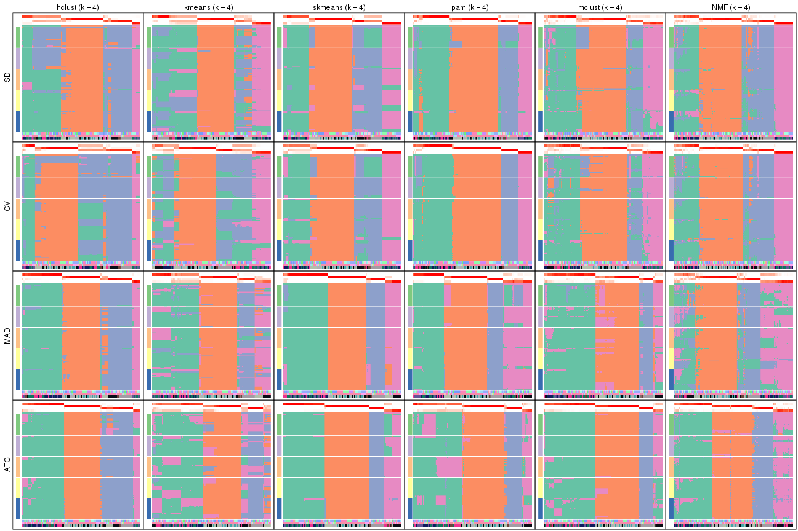</p>

</div>
<div id='tab-collect-membership-heatmap-4'>
<pre><code class="r">collect_plots(res_list, k = 5, fun = membership_heatmap, mc.cores = 4)
</code></pre>

<p></p>

</div>
<div id='tab-collect-membership-heatmap-5'>
<pre><code class="r">collect_plots(res_list, k = 6, fun = membership_heatmap, mc.cores = 4)
</code></pre>

<p></p>

</div>
</div>


### Signature heatmap

Signature heatmaps for all methods. ([What is a signature heatmap?](http://bioconductor.org/packages/devel/bioc/vignettes/cola/inst/doc/cola.html#toc_22))


Note in following heatmaps, rows are scaled.


<script>
$( function() {
	$( '#tabs-collect-get-signatures' ).tabs();
} );
</script>
<div id='tabs-collect-get-signatures'>
<ul>
<li><a href='#tab-collect-get-signatures-1'>k = 2</a></li>
<li><a href='#tab-collect-get-signatures-2'>k = 3</a></li>
<li><a href='#tab-collect-get-signatures-3'>k = 4</a></li>
<li><a href='#tab-collect-get-signatures-4'>k = 5</a></li>
<li><a href='#tab-collect-get-signatures-5'>k = 6</a></li>
</ul>
<div id='tab-collect-get-signatures-1'>
<pre><code class="r">collect_plots(res_list, k = 2, fun = get_signatures, mc.cores = 4)
</code></pre>

<p></p>

</div>
<div id='tab-collect-get-signatures-2'>
<pre><code class="r">collect_plots(res_list, k = 3, fun = get_signatures, mc.cores = 4)
</code></pre>

<p>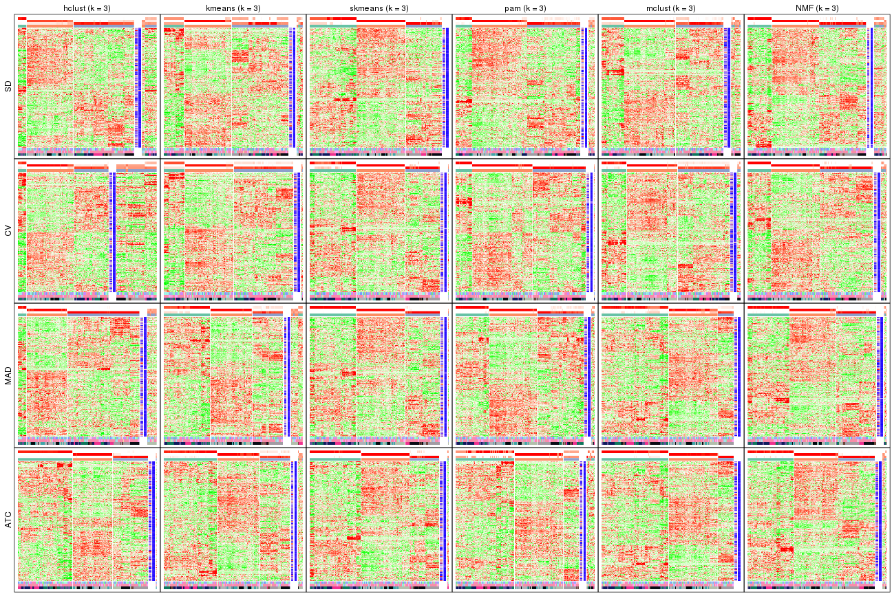</p>

</div>
<div id='tab-collect-get-signatures-3'>
<pre><code class="r">collect_plots(res_list, k = 4, fun = get_signatures, mc.cores = 4)
</code></pre>

<p></p>

</div>
<div id='tab-collect-get-signatures-4'>
<pre><code class="r">collect_plots(res_list, k = 5, fun = get_signatures, mc.cores = 4)
</code></pre>

<p></p>

</div>
<div id='tab-collect-get-signatures-5'>
<pre><code class="r">collect_plots(res_list, k = 6, fun = get_signatures, mc.cores = 4)
</code></pre>

<p></p>

</div>
</div>


### Statistics table

The statistics used for measuring the stability of consensus partitioning.
([How are they
defined?](http://bioconductor.org/packages/devel/bioc/vignettes/cola/inst/doc/cola.html#toc_13))


<script>
$( function() {
	$( '#tabs-get-stats-from-consensus-partition-list' ).tabs();
} );
</script>
<div id='tabs-get-stats-from-consensus-partition-list'>
<ul>
<li><a href='#tab-get-stats-from-consensus-partition-list-1'>k = 2</a></li>
<li><a href='#tab-get-stats-from-consensus-partition-list-2'>k = 3</a></li>
<li><a href='#tab-get-stats-from-consensus-partition-list-3'>k = 4</a></li>
<li><a href='#tab-get-stats-from-consensus-partition-list-4'>k = 5</a></li>
<li><a href='#tab-get-stats-from-consensus-partition-list-5'>k = 6</a></li>
</ul>
<div id='tab-get-stats-from-consensus-partition-list-1'>
<pre><code class="r">get_stats(res_list, k = 2)
</code></pre>

<pre><code>#&gt;             k 1-PAC mean_silhouette concordance area_increased  Rand Jaccard
#&gt; SD:NMF      2 1.000           0.969       0.988          0.487 0.514   0.514
#&gt; CV:NMF      2 1.000           0.965       0.982          0.485 0.512   0.512
#&gt; MAD:NMF     2 1.000           0.982       0.993          0.479 0.524   0.524
#&gt; ATC:NMF     2 1.000           0.998       0.999          0.474 0.527   0.527
#&gt; SD:skmeans  2 1.000           0.977       0.990          0.488 0.512   0.512
#&gt; CV:skmeans  2 1.000           0.971       0.989          0.485 0.512   0.512
#&gt; MAD:skmeans 2 1.000           0.984       0.993          0.482 0.521   0.521
#&gt; ATC:skmeans 2 1.000           1.000       1.000          0.474 0.527   0.527
#&gt; SD:mclust   2 0.673           0.912       0.939          0.478 0.501   0.501
#&gt; CV:mclust   2 0.434           0.796       0.897          0.486 0.499   0.499
#&gt; MAD:mclust  2 0.896           0.966       0.984          0.477 0.530   0.530
#&gt; ATC:mclust  2 1.000           0.976       0.988          0.501 0.497   0.497
#&gt; SD:kmeans   2 0.548           0.947       0.939          0.456 0.527   0.527
#&gt; CV:kmeans   2 0.511           0.914       0.903          0.442 0.527   0.527
#&gt; MAD:kmeans  2 1.000           0.996       0.998          0.475 0.527   0.527
#&gt; ATC:kmeans  2 1.000           1.000       1.000          0.471 0.530   0.530
#&gt; SD:pam      2 0.936           0.909       0.965          0.496 0.502   0.502
#&gt; CV:pam      2 0.998           0.961       0.983          0.501 0.500   0.500
#&gt; MAD:pam     2 0.922           0.930       0.969          0.477 0.530   0.530
#&gt; ATC:pam     2 1.000           0.997       0.998          0.474 0.527   0.527
#&gt; SD:hclust   2 0.837           0.858       0.948          0.199 0.799   0.799
#&gt; CV:hclust   2 0.837           0.878       0.952          0.184 0.878   0.878
#&gt; MAD:hclust  2 0.905           0.901       0.964          0.447 0.563   0.563
#&gt; ATC:hclust  2 1.000           0.976       0.989          0.431 0.576   0.576
</code></pre>

</div>
<div id='tab-get-stats-from-consensus-partition-list-2'>
<pre><code class="r">get_stats(res_list, k = 3)
</code></pre>

<pre><code>#&gt;             k 1-PAC mean_silhouette concordance area_increased  Rand Jaccard
#&gt; SD:NMF      3 0.832           0.844       0.938          0.334 0.786   0.604
#&gt; CV:NMF      3 0.921           0.916       0.965          0.324 0.796   0.622
#&gt; MAD:NMF     3 0.958           0.947       0.977          0.398 0.765   0.568
#&gt; ATC:NMF     3 0.953           0.936       0.971          0.408 0.775   0.584
#&gt; SD:skmeans  3 0.835           0.927       0.953          0.357 0.785   0.595
#&gt; CV:skmeans  3 0.804           0.901       0.940          0.363 0.785   0.595
#&gt; MAD:skmeans 3 1.000           0.985       0.992          0.377 0.796   0.615
#&gt; ATC:skmeans 3 0.950           0.959       0.981          0.374 0.814   0.648
#&gt; SD:mclust   3 0.726           0.832       0.893          0.319 0.802   0.628
#&gt; CV:mclust   3 0.740           0.872       0.919          0.314 0.756   0.558
#&gt; MAD:mclust  3 0.671           0.865       0.911          0.284 0.879   0.771
#&gt; ATC:mclust  3 1.000           0.973       0.986          0.193 0.899   0.800
#&gt; SD:kmeans   3 0.779           0.742       0.865          0.402 0.842   0.701
#&gt; CV:kmeans   3 0.711           0.882       0.883          0.411 0.852   0.718
#&gt; MAD:kmeans  3 0.667           0.817       0.893          0.357 0.796   0.618
#&gt; ATC:kmeans  3 0.778           0.909       0.931          0.369 0.796   0.622
#&gt; SD:pam      3 0.808           0.876       0.934          0.227 0.850   0.714
#&gt; CV:pam      3 1.000           0.965       0.986          0.206 0.896   0.793
#&gt; MAD:pam     3 0.843           0.924       0.953          0.381 0.799   0.624
#&gt; ATC:pam     3 0.748           0.719       0.837          0.347 0.857   0.731
#&gt; SD:hclust   3 0.378           0.771       0.835          1.675 0.558   0.478
#&gt; CV:hclust   3 0.374           0.646       0.765          1.891 0.576   0.517
#&gt; MAD:hclust  3 0.910           0.887       0.961          0.174 0.919   0.857
#&gt; ATC:hclust  3 0.989           0.969       0.979          0.523 0.765   0.592
</code></pre>

</div>
<div id='tab-get-stats-from-consensus-partition-list-3'>
<pre><code class="r">get_stats(res_list, k = 4)
</code></pre>

<pre><code>#&gt;             k 1-PAC mean_silhouette concordance area_increased  Rand Jaccard
#&gt; SD:NMF      4 0.786           0.810       0.897         0.1178 0.862   0.637
#&gt; CV:NMF      4 0.840           0.811       0.910         0.1289 0.868   0.655
#&gt; MAD:NMF     4 0.724           0.638       0.795         0.0896 0.899   0.709
#&gt; ATC:NMF     4 0.851           0.848       0.913         0.0875 0.898   0.711
#&gt; SD:skmeans  4 0.795           0.880       0.895         0.1031 0.897   0.707
#&gt; CV:skmeans  4 0.819           0.847       0.890         0.1004 0.906   0.732
#&gt; MAD:skmeans 4 0.935           0.926       0.962         0.0745 0.881   0.679
#&gt; ATC:skmeans 4 0.964           0.934       0.963         0.0656 0.935   0.816
#&gt; SD:mclust   4 0.706           0.756       0.864         0.1227 0.902   0.740
#&gt; CV:mclust   4 0.693           0.735       0.847         0.1078 0.915   0.770
#&gt; MAD:mclust  4 0.720           0.786       0.878         0.1149 0.927   0.822
#&gt; ATC:mclust  4 0.856           0.894       0.933         0.1086 0.931   0.831
#&gt; SD:kmeans   4 0.697           0.724       0.784         0.1137 0.883   0.697
#&gt; CV:kmeans   4 0.714           0.551       0.743         0.1353 0.878   0.685
#&gt; MAD:kmeans  4 0.732           0.797       0.830         0.1026 0.913   0.759
#&gt; ATC:kmeans  4 0.716           0.657       0.755         0.1124 0.943   0.843
#&gt; SD:pam      4 0.905           0.855       0.935         0.1488 0.787   0.531
#&gt; CV:pam      4 0.937           0.921       0.965         0.1580 0.809   0.572
#&gt; MAD:pam     4 0.858           0.895       0.928         0.1074 0.931   0.795
#&gt; ATC:pam     4 0.799           0.779       0.879         0.1008 0.916   0.789
#&gt; SD:hclust   4 0.713           0.752       0.838         0.2572 0.822   0.618
#&gt; CV:hclust   4 0.715           0.708       0.836         0.1909 0.871   0.725
#&gt; MAD:hclust  4 0.893           0.863       0.943         0.3326 0.812   0.610
#&gt; ATC:hclust  4 0.911           0.906       0.951         0.0814 0.957   0.874
</code></pre>

</div>
<div id='tab-get-stats-from-consensus-partition-list-4'>
<pre><code class="r">get_stats(res_list, k = 5)
</code></pre>

<pre><code>#&gt;             k 1-PAC mean_silhouette concordance area_increased  Rand Jaccard
#&gt; SD:NMF      5 0.815           0.804       0.890         0.0653 0.919   0.716
#&gt; CV:NMF      5 0.807           0.789       0.884         0.0667 0.921   0.725
#&gt; MAD:NMF     5 0.794           0.801       0.885         0.0615 0.876   0.592
#&gt; ATC:NMF     5 0.771           0.719       0.845         0.0614 0.909   0.690
#&gt; SD:skmeans  5 0.997           0.961       0.978         0.0720 0.923   0.725
#&gt; CV:skmeans  5 0.956           0.951       0.976         0.0732 0.909   0.685
#&gt; MAD:skmeans 5 0.990           0.963       0.981         0.0956 0.923   0.736
#&gt; ATC:skmeans 5 0.813           0.776       0.840         0.0832 0.891   0.663
#&gt; SD:mclust   5 0.680           0.679       0.809         0.0961 0.881   0.615
#&gt; CV:mclust   5 0.658           0.648       0.790         0.0899 0.918   0.719
#&gt; MAD:mclust  5 0.685           0.703       0.796         0.0928 0.923   0.779
#&gt; ATC:mclust  5 0.761           0.847       0.880         0.1084 0.938   0.820
#&gt; SD:kmeans   5 0.814           0.905       0.891         0.0734 0.920   0.728
#&gt; CV:kmeans   5 0.767           0.888       0.881         0.0693 0.864   0.569
#&gt; MAD:kmeans  5 0.762           0.869       0.844         0.0678 0.903   0.685
#&gt; ATC:kmeans  5 0.686           0.557       0.691         0.0697 0.818   0.489
#&gt; SD:pam      5 0.928           0.887       0.953         0.0970 0.909   0.708
#&gt; CV:pam      5 0.918           0.899       0.955         0.0832 0.907   0.715
#&gt; MAD:pam     5 0.919           0.846       0.938         0.0549 0.882   0.622
#&gt; ATC:pam     5 0.737           0.756       0.816         0.0733 0.926   0.774
#&gt; SD:hclust   5 0.764           0.837       0.889         0.0844 0.949   0.832
#&gt; CV:hclust   5 0.769           0.835       0.877         0.1384 0.851   0.613
#&gt; MAD:hclust  5 0.837           0.859       0.913         0.0546 0.963   0.874
#&gt; ATC:hclust  5 0.893           0.834       0.868         0.0397 0.962   0.871
</code></pre>

</div>
<div id='tab-get-stats-from-consensus-partition-list-5'>
<pre><code class="r">get_stats(res_list, k = 6)
</code></pre>

<pre><code>#&gt;             k 1-PAC mean_silhouette concordance area_increased  Rand Jaccard
#&gt; SD:NMF      6 0.861           0.814       0.895         0.0371 0.933   0.722
#&gt; CV:NMF      6 0.830           0.785       0.877         0.0366 0.922   0.687
#&gt; MAD:NMF     6 0.870           0.826       0.911         0.0369 0.922   0.684
#&gt; ATC:NMF     6 0.773           0.675       0.797         0.0307 0.958   0.823
#&gt; SD:skmeans  6 0.949           0.882       0.898         0.0292 0.972   0.875
#&gt; CV:skmeans  6 0.941           0.916       0.924         0.0296 0.970   0.867
#&gt; MAD:skmeans 6 0.955           0.912       0.920         0.0285 0.971   0.871
#&gt; ATC:skmeans 6 0.871           0.732       0.755         0.0478 0.891   0.612
#&gt; SD:mclust   6 0.708           0.681       0.802         0.0446 0.942   0.734
#&gt; CV:mclust   6 0.682           0.627       0.741         0.0438 0.961   0.821
#&gt; MAD:mclust  6 0.713           0.595       0.800         0.0599 0.898   0.654
#&gt; ATC:mclust  6 0.839           0.806       0.905         0.0962 0.896   0.644
#&gt; SD:kmeans   6 0.859           0.843       0.855         0.0432 0.995   0.978
#&gt; CV:kmeans   6 0.868           0.848       0.848         0.0495 1.000   1.000
#&gt; MAD:kmeans  6 0.794           0.838       0.840         0.0499 1.000   1.000
#&gt; ATC:kmeans  6 0.715           0.684       0.757         0.0447 0.891   0.572
#&gt; SD:pam      6 0.838           0.734       0.843         0.0670 0.906   0.625
#&gt; CV:pam      6 0.832           0.767       0.865         0.0467 0.969   0.880
#&gt; MAD:pam     6 0.829           0.607       0.816         0.0631 0.922   0.692
#&gt; ATC:pam     6 0.806           0.689       0.821         0.0709 0.863   0.529
#&gt; SD:hclust   6 0.862           0.836       0.902         0.0568 0.953   0.828
#&gt; CV:hclust   6 0.790           0.821       0.887         0.0326 0.998   0.992
#&gt; MAD:hclust  6 0.852           0.829       0.914         0.0568 0.948   0.797
#&gt; ATC:hclust  6 0.900           0.879       0.912         0.0386 0.986   0.948
</code></pre>

</div>
</div>

Following heatmap plots the partition for each combination of methods and the
lightness correspond to the silhouette scores for samples in each method. On
top the consensus subgroup is inferred from all methods by taking the mean
silhouette scores as weight.


<script>
$( function() {
	$( '#tabs-collect-stats-from-consensus-partition-list' ).tabs();
} );
</script>
<div id='tabs-collect-stats-from-consensus-partition-list'>
<ul>
<li><a href='#tab-collect-stats-from-consensus-partition-list-1'>k = 2</a></li>
<li><a href='#tab-collect-stats-from-consensus-partition-list-2'>k = 3</a></li>
<li><a href='#tab-collect-stats-from-consensus-partition-list-3'>k = 4</a></li>
<li><a href='#tab-collect-stats-from-consensus-partition-list-4'>k = 5</a></li>
<li><a href='#tab-collect-stats-from-consensus-partition-list-5'>k = 6</a></li>
</ul>
<div id='tab-collect-stats-from-consensus-partition-list-1'>
<pre><code class="r">collect_stats(res_list, k = 2)
</code></pre>

<p></p>

</div>
<div id='tab-collect-stats-from-consensus-partition-list-2'>
<pre><code class="r">collect_stats(res_list, k = 3)
</code></pre>

<p></p>

</div>
<div id='tab-collect-stats-from-consensus-partition-list-3'>
<pre><code class="r">collect_stats(res_list, k = 4)
</code></pre>

<p></p>

</div>
<div id='tab-collect-stats-from-consensus-partition-list-4'>
<pre><code class="r">collect_stats(res_list, k = 5)
</code></pre>

<p></p>

</div>
<div id='tab-collect-stats-from-consensus-partition-list-5'>
<pre><code class="r">collect_stats(res_list, k = 6)
</code></pre>

<p></p>

</div>
</div>

### Partition from all methods


Collect partitions from all methods:


<script>
$( function() {
	$( '#tabs-collect-classes-from-consensus-partition-list' ).tabs();
} );
</script>
<div id='tabs-collect-classes-from-consensus-partition-list'>
<ul>
<li><a href='#tab-collect-classes-from-consensus-partition-list-1'>k = 2</a></li>
<li><a href='#tab-collect-classes-from-consensus-partition-list-2'>k = 3</a></li>
<li><a href='#tab-collect-classes-from-consensus-partition-list-3'>k = 4</a></li>
<li><a href='#tab-collect-classes-from-consensus-partition-list-4'>k = 5</a></li>
<li><a href='#tab-collect-classes-from-consensus-partition-list-5'>k = 6</a></li>
</ul>
<div id='tab-collect-classes-from-consensus-partition-list-1'>
<pre><code class="r">collect_classes(res_list, k = 2)
</code></pre>

<p></p>

</div>
<div id='tab-collect-classes-from-consensus-partition-list-2'>
<pre><code class="r">collect_classes(res_list, k = 3)
</code></pre>

<p></p>

</div>
<div id='tab-collect-classes-from-consensus-partition-list-3'>
<pre><code class="r">collect_classes(res_list, k = 4)
</code></pre>

<p></p>

</div>
<div id='tab-collect-classes-from-consensus-partition-list-4'>
<pre><code class="r">collect_classes(res_list, k = 5)
</code></pre>

<p></p>

</div>
<div id='tab-collect-classes-from-consensus-partition-list-5'>
<pre><code class="r">collect_classes(res_list, k = 6)
</code></pre>

<p></p>

</div>
</div>


### Top rows overlap


Overlap of top rows from different top-row methods:


<script>
$( function() {
	$( '#tabs-top-rows-overlap-by-euler' ).tabs();
} );
</script>
<div id='tabs-top-rows-overlap-by-euler'>
<ul>
<li><a href='#tab-top-rows-overlap-by-euler-1'>top_n = 1000</a></li>
<li><a href='#tab-top-rows-overlap-by-euler-2'>top_n = 2000</a></li>
<li><a href='#tab-top-rows-overlap-by-euler-3'>top_n = 3000</a></li>
<li><a href='#tab-top-rows-overlap-by-euler-4'>top_n = 4000</a></li>
<li><a href='#tab-top-rows-overlap-by-euler-5'>top_n = 5000</a></li>
</ul>
<div id='tab-top-rows-overlap-by-euler-1'>
<pre><code class="r">top_rows_overlap(res_list, top_n = 1000, method = &quot;euler&quot;)
</code></pre>

<p></p>

</div>
<div id='tab-top-rows-overlap-by-euler-2'>
<pre><code class="r">top_rows_overlap(res_list, top_n = 2000, method = &quot;euler&quot;)
</code></pre>

<p></p>

</div>
<div id='tab-top-rows-overlap-by-euler-3'>
<pre><code class="r">top_rows_overlap(res_list, top_n = 3000, method = &quot;euler&quot;)
</code></pre>

<p></p>

</div>
<div id='tab-top-rows-overlap-by-euler-4'>
<pre><code class="r">top_rows_overlap(res_list, top_n = 4000, method = &quot;euler&quot;)
</code></pre>

<p></p>

</div>
<div id='tab-top-rows-overlap-by-euler-5'>
<pre><code class="r">top_rows_overlap(res_list, top_n = 5000, method = &quot;euler&quot;)
</code></pre>

<p>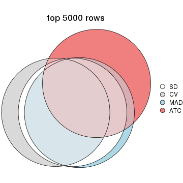</p>

</div>
</div>

Also visualize the correspondance of rankings between different top-row methods:


<script>
$( function() {
	$( '#tabs-top-rows-overlap-by-correspondance' ).tabs();
} );
</script>
<div id='tabs-top-rows-overlap-by-correspondance'>
<ul>
<li><a href='#tab-top-rows-overlap-by-correspondance-1'>top_n = 1000</a></li>
<li><a href='#tab-top-rows-overlap-by-correspondance-2'>top_n = 2000</a></li>
<li><a href='#tab-top-rows-overlap-by-correspondance-3'>top_n = 3000</a></li>
<li><a href='#tab-top-rows-overlap-by-correspondance-4'>top_n = 4000</a></li>
<li><a href='#tab-top-rows-overlap-by-correspondance-5'>top_n = 5000</a></li>
</ul>
<div id='tab-top-rows-overlap-by-correspondance-1'>
<pre><code class="r">top_rows_overlap(res_list, top_n = 1000, method = &quot;correspondance&quot;)
</code></pre>

<p></p>

</div>
<div id='tab-top-rows-overlap-by-correspondance-2'>
<pre><code class="r">top_rows_overlap(res_list, top_n = 2000, method = &quot;correspondance&quot;)
</code></pre>

<p></p>

</div>
<div id='tab-top-rows-overlap-by-correspondance-3'>
<pre><code class="r">top_rows_overlap(res_list, top_n = 3000, method = &quot;correspondance&quot;)
</code></pre>

<p></p>

</div>
<div id='tab-top-rows-overlap-by-correspondance-4'>
<pre><code class="r">top_rows_overlap(res_list, top_n = 4000, method = &quot;correspondance&quot;)
</code></pre>

<p></p>

</div>
<div id='tab-top-rows-overlap-by-correspondance-5'>
<pre><code class="r">top_rows_overlap(res_list, top_n = 5000, method = &quot;correspondance&quot;)
</code></pre>

<p></p>

</div>
</div>


Heatmaps of the top rows:


<script>
$( function() {
	$( '#tabs-top-rows-heatmap' ).tabs();
} );
</script>
<div id='tabs-top-rows-heatmap'>
<ul>
<li><a href='#tab-top-rows-heatmap-1'>top_n = 1000</a></li>
<li><a href='#tab-top-rows-heatmap-2'>top_n = 2000</a></li>
<li><a href='#tab-top-rows-heatmap-3'>top_n = 3000</a></li>
<li><a href='#tab-top-rows-heatmap-4'>top_n = 4000</a></li>
<li><a href='#tab-top-rows-heatmap-5'>top_n = 5000</a></li>
</ul>
<div id='tab-top-rows-heatmap-1'>
<pre><code class="r">top_rows_heatmap(res_list, top_n = 1000)
</code></pre>

<p></p>

</div>
<div id='tab-top-rows-heatmap-2'>
<pre><code class="r">top_rows_heatmap(res_list, top_n = 2000)
</code></pre>

<p></p>

</div>
<div id='tab-top-rows-heatmap-3'>
<pre><code class="r">top_rows_heatmap(res_list, top_n = 3000)
</code></pre>

<p></p>

</div>
<div id='tab-top-rows-heatmap-4'>
<pre><code class="r">top_rows_heatmap(res_list, top_n = 4000)
</code></pre>

<p></p>

</div>
<div id='tab-top-rows-heatmap-5'>
<pre><code class="r">top_rows_heatmap(res_list, top_n = 5000)
</code></pre>

<p></p>

</div>
</div>


### Test to known annotations


Test correlation between subgroups and known annotations. If the known
annotation is numeric, one-way ANOVA test is applied, and if the known
annotation is discrete, chi-squared contingency table test is applied.


<script>
$( function() {
	$( '#tabs-test-to-known-factors-from-consensus-partition-list' ).tabs();
} );
</script>
<div id='tabs-test-to-known-factors-from-consensus-partition-list'>
<ul>
<li><a href='#tab-test-to-known-factors-from-consensus-partition-list-1'>k = 2</a></li>
<li><a href='#tab-test-to-known-factors-from-consensus-partition-list-2'>k = 3</a></li>
<li><a href='#tab-test-to-known-factors-from-consensus-partition-list-3'>k = 4</a></li>
<li><a href='#tab-test-to-known-factors-from-consensus-partition-list-4'>k = 5</a></li>
<li><a href='#tab-test-to-known-factors-from-consensus-partition-list-5'>k = 6</a></li>
</ul>
<div id='tab-test-to-known-factors-from-consensus-partition-list-1'>
<pre><code class="r">test_to_known_factors(res_list, k = 2)
</code></pre>

<pre><code>#&gt;               n agent(p) dose(p)  time(p) k
#&gt; SD:NMF      167    0.860  0.9988 3.81e-27 2
#&gt; CV:NMF      167    0.860  0.9988 3.81e-27 2
#&gt; MAD:NMF     168    0.866  0.9999 1.39e-28 2
#&gt; ATC:NMF     169    0.907  1.0000 1.43e-29 2
#&gt; SD:skmeans  169    0.863  0.9992 4.57e-27 2
#&gt; CV:skmeans  165    0.861  0.9998 1.74e-27 2
#&gt; MAD:skmeans 169    0.832  0.9999 3.84e-28 2
#&gt; ATC:skmeans 169    0.907  1.0000 1.43e-29 2
#&gt; SD:mclust   166    0.997  0.9971 4.95e-27 2
#&gt; CV:mclust   152    0.845  0.9698 8.25e-25 2
#&gt; MAD:mclust  168    0.903  0.9989 2.34e-29 2
#&gt; ATC:mclust  168    0.986  0.9756 1.43e-27 2
#&gt; SD:kmeans   168    0.901  1.0000 2.29e-29 2
#&gt; CV:kmeans   167    0.891  1.0000 3.65e-29 2
#&gt; MAD:kmeans  169    0.907  1.0000 1.43e-29 2
#&gt; ATC:kmeans  169    0.891  0.9925 1.01e-28 2
#&gt; SD:pam      160    0.578  0.9280 7.77e-24 2
#&gt; CV:pam      168    0.523  0.9108 4.51e-23 2
#&gt; MAD:pam     165    0.890  0.9912 6.56e-28 2
#&gt; ATC:pam     169    0.907  1.0000 1.43e-29 2
#&gt; SD:hclust   154    0.025  0.0408 1.49e-09 2
#&gt; CV:hclust   154    0.025  0.0408 1.49e-09 2
#&gt; MAD:hclust  157    0.759  0.9919 5.29e-27 2
#&gt; ATC:hclust  167    0.627  0.9420 7.59e-25 2
</code></pre>

</div>
<div id='tab-test-to-known-factors-from-consensus-partition-list-2'>
<pre><code class="r">test_to_known_factors(res_list, k = 3)
</code></pre>

<pre><code>#&gt;               n agent(p)  dose(p)  time(p) k
#&gt; SD:NMF      153 1.04e-02 3.67e-03 5.55e-36 3
#&gt; CV:NMF      162 6.40e-03 1.14e-03 4.41e-35 3
#&gt; MAD:NMF     166 2.48e-01 5.29e-01 1.09e-43 3
#&gt; ATC:NMF     164 8.88e-01 9.80e-01 1.06e-43 3
#&gt; SD:skmeans  169 4.50e-01 9.79e-01 1.40e-51 3
#&gt; CV:skmeans  168 4.34e-01 9.85e-01 2.35e-52 3
#&gt; MAD:skmeans 168 4.34e-01 9.85e-01 2.35e-52 3
#&gt; ATC:skmeans 167 9.58e-01 1.00e+00 1.87e-50 3
#&gt; SD:mclust   157 8.34e-04 3.85e-04 2.54e-29 3
#&gt; CV:mclust   165 2.14e-05 6.60e-06 1.06e-29 3
#&gt; MAD:mclust  169 9.73e-01 9.92e-01 3.35e-52 3
#&gt; ATC:mclust  169 9.73e-01 9.92e-01 3.35e-52 3
#&gt; SD:kmeans   161 8.72e-03 1.70e-03 4.50e-33 3
#&gt; CV:kmeans   167 1.25e-02 2.90e-03 4.32e-35 3
#&gt; MAD:kmeans  154 4.26e-01 9.95e-01 1.03e-48 3
#&gt; ATC:kmeans  163 9.60e-01 9.83e-01 3.71e-47 3
#&gt; SD:pam      161 7.28e-04 1.21e-02 3.02e-29 3
#&gt; CV:pam      168 3.89e-04 9.94e-03 7.96e-27 3
#&gt; MAD:pam     165 3.76e-01 9.99e-01 3.99e-41 3
#&gt; ATC:pam     159 8.52e-01 9.80e-01 8.38e-51 3
#&gt; SD:hclust   150 4.48e-02 8.14e-02 3.21e-31 3
#&gt; CV:hclust   117 1.15e-02 1.44e-02 5.97e-23 3
#&gt; MAD:hclust  157 6.28e-02 2.79e-01 1.48e-29 3
#&gt; ATC:hclust  168 9.27e-01 9.91e-01 4.45e-49 3
</code></pre>

</div>
<div id='tab-test-to-known-factors-from-consensus-partition-list-3'>
<pre><code class="r">test_to_known_factors(res_list, k = 4)
</code></pre>

<pre><code>#&gt;               n agent(p)  dose(p)  time(p) k
#&gt; SD:NMF      155 4.77e-03 6.82e-03 2.43e-44 4
#&gt; CV:NMF      151 1.86e-02 1.27e-02 8.31e-43 4
#&gt; MAD:NMF     127 2.40e-01 4.09e-01 1.35e-39 4
#&gt; ATC:NMF     156 5.53e-01 7.66e-01 4.47e-56 4
#&gt; SD:skmeans  169 6.77e-04 3.95e-03 7.82e-53 4
#&gt; CV:skmeans  165 1.53e-03 5.27e-03 4.77e-53 4
#&gt; MAD:skmeans 165 1.50e-01 9.51e-01 1.65e-69 4
#&gt; ATC:skmeans 167 8.24e-01 9.83e-01 1.59e-71 4
#&gt; SD:mclust   148 8.30e-03 2.89e-03 8.30e-49 4
#&gt; CV:mclust   142 7.48e-03 1.74e-03 8.79e-48 4
#&gt; MAD:mclust  156 9.83e-01 9.63e-01 1.00e-72 4
#&gt; ATC:mclust  167 9.71e-01 9.88e-01 7.41e-70 4
#&gt; SD:kmeans   141 4.35e-03 5.42e-04 1.21e-40 4
#&gt; CV:kmeans    79 5.55e-02 1.81e-02 2.20e-14 4
#&gt; MAD:kmeans  163 8.92e-01 9.91e-01 4.01e-73 4
#&gt; ATC:kmeans  134 8.58e-01 8.09e-01 6.91e-54 4
#&gt; SD:pam      156 9.31e-03 1.08e-01 1.90e-44 4
#&gt; CV:pam      165 5.16e-03 4.44e-02 2.47e-48 4
#&gt; MAD:pam     168 5.04e-01 9.03e-01 5.13e-60 4
#&gt; ATC:pam     162 9.06e-01 8.55e-01 9.21e-73 4
#&gt; SD:hclust   142 1.02e-01 1.41e-01 7.18e-45 4
#&gt; CV:hclust   155 1.63e-06 3.84e-05 1.20e-31 4
#&gt; MAD:hclust  155 2.62e-01 5.95e-01 1.32e-50 4
#&gt; ATC:hclust  163 2.80e-01 6.08e-01 5.96e-48 4
</code></pre>

</div>
<div id='tab-test-to-known-factors-from-consensus-partition-list-4'>
<pre><code class="r">test_to_known_factors(res_list, k = 5)
</code></pre>

<pre><code>#&gt;               n agent(p)  dose(p)  time(p) k
#&gt; SD:NMF      156 0.065070 0.006887 8.68e-68 5
#&gt; CV:NMF      155 0.098750 0.005262 1.15e-72 5
#&gt; MAD:NMF     158 0.096740 0.012159 2.11e-67 5
#&gt; ATC:NMF     143 0.006525 0.007805 1.54e-52 5
#&gt; SD:skmeans  168 0.006087 0.007486 4.13e-70 5
#&gt; CV:skmeans  166 0.017273 0.007149 2.85e-70 5
#&gt; MAD:skmeans 167 0.006077 0.006998 7.01e-71 5
#&gt; ATC:skmeans 132 0.007831 0.016954 7.76e-46 5
#&gt; SD:mclust   125 0.002360 0.000322 9.63e-53 5
#&gt; CV:mclust   136 0.001926 0.000903 1.68e-48 5
#&gt; MAD:mclust  156 0.871463 0.806175 1.84e-78 5
#&gt; ATC:mclust  166 0.609630 0.538668 3.89e-77 5
#&gt; SD:kmeans   167 0.028730 0.013444 3.09e-73 5
#&gt; CV:kmeans   167 0.028730 0.013444 3.09e-73 5
#&gt; MAD:kmeans  168 0.029279 0.009465 4.90e-75 5
#&gt; ATC:kmeans  113 0.390721 0.781013 1.22e-43 5
#&gt; SD:pam      159 0.028560 0.089409 3.09e-63 5
#&gt; CV:pam      159 0.014721 0.203329 1.38e-71 5
#&gt; MAD:pam     154 0.004959 0.077587 1.00e-67 5
#&gt; ATC:pam     158 0.063179 0.153754 2.35e-74 5
#&gt; SD:hclust   157 0.000129 0.002124 9.14e-47 5
#&gt; CV:hclust   153 0.000135 0.002900 2.68e-45 5
#&gt; MAD:hclust  159 0.319465 0.583974 3.15e-71 5
#&gt; ATC:hclust  159 0.285840 0.785550 1.56e-67 5
</code></pre>

</div>
<div id='tab-test-to-known-factors-from-consensus-partition-list-5'>
<pre><code class="r">test_to_known_factors(res_list, k = 6)
</code></pre>

<pre><code>#&gt;               n agent(p)  dose(p)  time(p) k
#&gt; SD:NMF      153 4.86e-03 0.008168 4.93e-63 6
#&gt; CV:NMF      149 5.14e-03 0.011968 5.89e-63 6
#&gt; MAD:NMF     159 4.73e-02 0.122463 8.23e-66 6
#&gt; ATC:NMF     132 1.29e-02 0.091922 2.49e-58 6
#&gt; SD:skmeans  161 7.27e-03 0.009337 5.37e-95 6
#&gt; CV:skmeans  167 2.43e-03 0.006795 5.64e-88 6
#&gt; MAD:skmeans 167 1.90e-03 0.005420 5.56e-88 6
#&gt; ATC:skmeans 122 3.07e-01 0.395844 2.32e-54 6
#&gt; SD:mclust   135 6.79e-03 0.000571 2.65e-57 6
#&gt; CV:mclust   127 3.12e-03 0.000273 1.68e-50 6
#&gt; MAD:mclust  133 4.55e-01 0.412777 2.96e-69 6
#&gt; ATC:mclust  153 4.41e-01 0.410997 1.46e-73 6
#&gt; SD:kmeans   168 2.56e-02 0.012512 9.35e-74 6
#&gt; CV:kmeans   168 2.56e-02 0.012512 9.35e-74 6
#&gt; MAD:kmeans  169 2.88e-02 0.011448 9.45e-75 6
#&gt; ATC:kmeans  143 1.69e-02 0.017196 1.05e-76 6
#&gt; SD:pam      139 1.24e-02 0.186113 5.05e-76 6
#&gt; CV:pam      144 5.15e-02 0.152973 3.25e-73 6
#&gt; MAD:pam     119 1.86e-03 0.047984 4.75e-35 6
#&gt; ATC:pam     139 2.29e-02 0.166285 2.87e-65 6
#&gt; SD:hclust   155 4.44e-04 0.004757 5.47e-73 6
#&gt; CV:hclust   153 1.08e-06 0.022166 4.52e-41 6
#&gt; MAD:hclust  155 8.10e-03 0.029113 6.66e-70 6
#&gt; ATC:hclust  163 3.07e-02 0.932710 3.98e-66 6
</code></pre>

</div>
</div>


 
## Results for each method


---------------------------------------------------


### SD:hclust


The object with results only for a single top-value method and a single partition method 
can be extracted as:

```r
res = res_list["SD", "hclust"]
# you can also extract it by
# res = res_list["SD:hclust"]
```

A summary of `res` and all the functions that can be applied to it:

```r
res
```

```
#> A 'ConsensusPartition' object with k = 2, 3, 4, 5, 6.
#>   On a matrix with 21163 rows and 169 columns.
#>   Top rows (1000, 2000, 3000, 4000, 5000) are extracted by 'SD' method.
#>   Subgroups are detected by 'hclust' method.
#>   Performed in total 1250 partitions by row resampling.
#>   Best k for subgroups seems to be 5.
#> 
#> Following methods can be applied to this 'ConsensusPartition' object:
#>  [1] "cola_report"             "collect_classes"         "collect_plots"          
#>  [4] "collect_stats"           "colnames"                "compare_signatures"     
#>  [7] "consensus_heatmap"       "dimension_reduction"     "functional_enrichment"  
#> [10] "get_anno_col"            "get_anno"                "get_classes"            
#> [13] "get_consensus"           "get_matrix"              "get_membership"         
#> [16] "get_param"               "get_signatures"          "get_stats"              
#> [19] "is_best_k"               "is_stable_k"             "membership_heatmap"     
#> [22] "ncol"                    "nrow"                    "plot_ecdf"              
#> [25] "rownames"                "select_partition_number" "show"                   
#> [28] "suggest_best_k"          "test_to_known_factors"
```

`collect_plots()` function collects all the plots made from `res` for all `k` (number of partitions)
into one single page to provide an easy and fast comparison between different `k`.

```r
collect_plots(res)
```


The plots are:

- The first row: a plot of the ECDF (Empirical cumulative distribution
  function) curves of the consensus matrix for each `k` and the heatmap of
  predicted classes for each `k`.
- The second row: heatmaps of the consensus matrix for each `k`.
- The third row: heatmaps of the membership matrix for each `k`.
- The fouth row: heatmaps of the signatures for each `k`.

All the plots in panels can be made by individual functions and they are
plotted later in this section.

`select_partition_number()` produces several plots showing different
statistics for choosing "optimized" `k`. There are following statistics:

- ECDF curves of the consensus matrix for each `k`;
- 1-PAC. [The PAC
  score](https://en.wikipedia.org/wiki/Consensus_clustering#Over-interpretation_potential_of_consensus_clustering)
  measures the proportion of the ambiguous subgrouping.
- Mean silhouette score.
- Concordance. The mean probability of fiting the consensus class ids in all
  partitions.
- Area increased. Denote $A_k$ as the area under the ECDF curve for current
  `k`, the area increased is defined as $A_k - A_{k-1}$.
- Rand index. The percent of pairs of samples that are both in a same cluster
  or both are not in a same cluster in the partition of k and k-1.
- Jaccard index. The ratio of pairs of samples are both in a same cluster in
  the partition of k and k-1 and the pairs of samples are both in a same
  cluster in the partition k or k-1.

The detailed explanations of these statistics can be found in [the cola
vignette](http://bioconductor.org/packages/devel/bioc/vignettes/cola/inst/doc/cola.html#toc_13).

Generally speaking, lower PAC score, higher mean silhouette score or higher
concordance corresponds to better partition. Rand index and Jaccard index
measure how similar the current partition is compared to partition with `k-1`.
If they are too similar, we won't accept `k` is better than `k-1`.

```r
select_partition_number(res)
```


The numeric values for all these statistics can be obtained by `get_stats()`.

```r
get_stats(res)
```

```
#>   k 1-PAC mean_silhouette concordance area_increased  Rand Jaccard
#> 2 2 0.837           0.858       0.948         0.1994 0.799   0.799
#> 3 3 0.378           0.771       0.835         1.6748 0.558   0.478
#> 4 4 0.713           0.752       0.838         0.2572 0.822   0.618
#> 5 5 0.764           0.837       0.889         0.0844 0.949   0.832
#> 6 6 0.862           0.836       0.902         0.0568 0.953   0.828
```

`suggest_best_k()` suggests the best $k$ based on these statistics. The rules are as follows:

- All $k$ with Jaccard index larger than 0.95 are removed because the increase of
  the partition number does not provides enough extra information. If all $k$ are removed,
  the best $k$ is assigned by `NA`.
- For $k$ with 1-PAC larger than 0.9, the maximal $k$ is taken as the "best k". Other $k$ is called "optional k".
- If it does not fit the second rule. The $k$ with the highest vote of highest
  1-PAC, mean silhouette and concordance is taken as the "best k".

```r
suggest_best_k(res)
```

```
#> [1] 5
```


Following shows the table of the partitions (You need to click the **show/hide
code output** link to see it). The membership matrix (columns with name `p*`)
is inferred by
[`clue::cl_consensus()`](https://www.rdocumentation.org/link/cl_consensus?package=clue)
function with the `SE` method. Basically the value in the membership matrix
represents the probability to belong to a certain group. The finall class
label for an item is determined with the group with highest probability it
belongs to.

In `get_classes()` function, the entropy is calculated from the membership
matrix and the silhouette score is calculated from the consensus matrix.


<script>
$( function() {
	$( '#tabs-SD-hclust-get-classes' ).tabs();
} );
</script>
<div id='tabs-SD-hclust-get-classes'>
<ul>
<li><a href='#tab-SD-hclust-get-classes-1'>k = 2</a></li>
<li><a href='#tab-SD-hclust-get-classes-2'>k = 3</a></li>
<li><a href='#tab-SD-hclust-get-classes-3'>k = 4</a></li>
<li><a href='#tab-SD-hclust-get-classes-4'>k = 5</a></li>
<li><a href='#tab-SD-hclust-get-classes-5'>k = 6</a></li>
</ul>

<div id='tab-SD-hclust-get-classes-1'>
<p><a id='tab-SD-hclust-get-classes-1-a' style='color:#0366d6' href='#'>show/hide code output</a></p>
<pre><code class="r">cbind(get_classes(res, k = 2), get_membership(res, k = 2))
</code></pre>

<pre><code>#&gt;           class entropy silhouette    p1    p2
#&gt; GSM528681     1  0.0000      0.959 1.000 0.000
#&gt; GSM528682     1  0.0000      0.959 1.000 0.000
#&gt; GSM528683     1  0.0000      0.959 1.000 0.000
#&gt; GSM528684     1  0.0000      0.959 1.000 0.000
#&gt; GSM528687     1  0.0000      0.959 1.000 0.000
#&gt; GSM528688     1  0.0000      0.959 1.000 0.000
#&gt; GSM528685     1  0.0000      0.959 1.000 0.000
#&gt; GSM528686     1  0.0000      0.959 1.000 0.000
#&gt; GSM528693     1  0.5408      0.796 0.876 0.124
#&gt; GSM528694     1  0.5408      0.796 0.876 0.124
#&gt; GSM528695     1  0.5737      0.776 0.864 0.136
#&gt; GSM528696     1  0.5737      0.776 0.864 0.136
#&gt; GSM528697     1  0.9933     -0.208 0.548 0.452
#&gt; GSM528698     1  0.9933     -0.208 0.548 0.452
#&gt; GSM528699     1  1.0000     -0.364 0.504 0.496
#&gt; GSM528700     1  1.0000     -0.364 0.504 0.496
#&gt; GSM528689     2  1.0000      0.352 0.496 0.504
#&gt; GSM528690     2  1.0000      0.352 0.496 0.504
#&gt; GSM528691     2  1.0000      0.352 0.496 0.504
#&gt; GSM528692     2  1.0000      0.352 0.496 0.504
#&gt; GSM528779     1  0.0000      0.959 1.000 0.000
#&gt; GSM528780     1  0.0000      0.959 1.000 0.000
#&gt; GSM528782     1  0.0000      0.959 1.000 0.000
#&gt; GSM528781     1  0.0000      0.959 1.000 0.000
#&gt; GSM528785     1  0.0000      0.959 1.000 0.000
#&gt; GSM528786     1  0.0000      0.959 1.000 0.000
#&gt; GSM528787     1  0.0000      0.959 1.000 0.000
#&gt; GSM528788     1  0.0938      0.953 0.988 0.012
#&gt; GSM528783     1  0.2423      0.925 0.960 0.040
#&gt; GSM528784     2  0.1633      0.753 0.024 0.976
#&gt; GSM528759     1  0.0938      0.953 0.988 0.012
#&gt; GSM528760     1  0.0938      0.953 0.988 0.012
#&gt; GSM528761     1  0.0000      0.959 1.000 0.000
#&gt; GSM528762     1  0.0000      0.959 1.000 0.000
#&gt; GSM528765     1  0.0000      0.959 1.000 0.000
#&gt; GSM528766     1  0.0000      0.959 1.000 0.000
#&gt; GSM528763     1  0.0000      0.959 1.000 0.000
#&gt; GSM528764     1  0.0000      0.959 1.000 0.000
#&gt; GSM528771     1  0.0000      0.959 1.000 0.000
#&gt; GSM528772     1  0.0000      0.959 1.000 0.000
#&gt; GSM528773     1  0.0000      0.959 1.000 0.000
#&gt; GSM528774     1  0.0000      0.959 1.000 0.000
#&gt; GSM528775     1  0.0000      0.959 1.000 0.000
#&gt; GSM528776     1  0.0938      0.953 0.988 0.012
#&gt; GSM528777     1  0.0938      0.953 0.988 0.012
#&gt; GSM528778     1  0.0938      0.953 0.988 0.012
#&gt; GSM528767     2  0.1633      0.753 0.024 0.976
#&gt; GSM528768     2  0.1633      0.753 0.024 0.976
#&gt; GSM528769     2  0.1633      0.753 0.024 0.976
#&gt; GSM528770     2  0.1633      0.753 0.024 0.976
#&gt; GSM528671     1  0.0000      0.959 1.000 0.000
#&gt; GSM528672     1  0.0000      0.959 1.000 0.000
#&gt; GSM528674     1  0.0000      0.959 1.000 0.000
#&gt; GSM528673     1  0.0000      0.959 1.000 0.000
#&gt; GSM528677     1  0.0000      0.959 1.000 0.000
#&gt; GSM528678     1  0.0000      0.959 1.000 0.000
#&gt; GSM528679     1  0.0938      0.953 0.988 0.012
#&gt; GSM528680     1  0.9896     -0.161 0.560 0.440
#&gt; GSM528675     2  0.0000      0.751 0.000 1.000
#&gt; GSM528676     2  0.0000      0.751 0.000 1.000
#&gt; GSM528651     1  0.0000      0.959 1.000 0.000
#&gt; GSM528652     1  0.0000      0.959 1.000 0.000
#&gt; GSM528653     1  0.0000      0.959 1.000 0.000
#&gt; GSM528654     1  0.0000      0.959 1.000 0.000
#&gt; GSM528657     1  0.0000      0.959 1.000 0.000
#&gt; GSM528658     1  0.0000      0.959 1.000 0.000
#&gt; GSM528655     1  0.0000      0.959 1.000 0.000
#&gt; GSM528656     1  0.0000      0.959 1.000 0.000
#&gt; GSM528663     1  0.0000      0.959 1.000 0.000
#&gt; GSM528664     1  0.0000      0.959 1.000 0.000
#&gt; GSM528665     1  0.0000      0.959 1.000 0.000
#&gt; GSM528666     1  0.0000      0.959 1.000 0.000
#&gt; GSM528667     1  0.0938      0.953 0.988 0.012
#&gt; GSM528668     1  0.0938      0.953 0.988 0.012
#&gt; GSM528669     1  0.0938      0.953 0.988 0.012
#&gt; GSM528670     1  0.0938      0.953 0.988 0.012
#&gt; GSM528659     2  0.0000      0.751 0.000 1.000
#&gt; GSM528660     2  0.0000      0.751 0.000 1.000
#&gt; GSM528661     2  0.0000      0.751 0.000 1.000
#&gt; GSM528662     2  0.0000      0.751 0.000 1.000
#&gt; GSM528701     1  0.0000      0.959 1.000 0.000
#&gt; GSM528702     1  0.0000      0.959 1.000 0.000
#&gt; GSM528703     1  0.0000      0.959 1.000 0.000
#&gt; GSM528704     1  0.0000      0.959 1.000 0.000
#&gt; GSM528707     1  0.0000      0.959 1.000 0.000
#&gt; GSM528708     1  0.0000      0.959 1.000 0.000
#&gt; GSM528705     1  0.0000      0.959 1.000 0.000
#&gt; GSM528706     1  0.0000      0.959 1.000 0.000
#&gt; GSM528713     1  0.0000      0.959 1.000 0.000
#&gt; GSM528714     1  0.0000      0.959 1.000 0.000
#&gt; GSM528715     1  0.0000      0.959 1.000 0.000
#&gt; GSM528716     1  0.0000      0.959 1.000 0.000
#&gt; GSM528717     1  0.5737      0.785 0.864 0.136
#&gt; GSM528718     1  0.5737      0.785 0.864 0.136
#&gt; GSM528719     1  1.0000     -0.364 0.504 0.496
#&gt; GSM528720     1  1.0000     -0.364 0.504 0.496
#&gt; GSM528709     2  1.0000      0.352 0.496 0.504
#&gt; GSM528710     2  1.0000      0.352 0.496 0.504
#&gt; GSM528711     2  1.0000      0.352 0.496 0.504
#&gt; GSM528712     2  1.0000      0.352 0.496 0.504
#&gt; GSM528721     1  0.0000      0.959 1.000 0.000
#&gt; GSM528722     1  0.0000      0.959 1.000 0.000
#&gt; GSM528723     1  0.0000      0.959 1.000 0.000
#&gt; GSM528724     1  0.0000      0.959 1.000 0.000
#&gt; GSM528727     1  0.0000      0.959 1.000 0.000
#&gt; GSM528728     1  0.0000      0.959 1.000 0.000
#&gt; GSM528725     1  0.0000      0.959 1.000 0.000
#&gt; GSM528726     1  0.0000      0.959 1.000 0.000
#&gt; GSM528733     1  0.0000      0.959 1.000 0.000
#&gt; GSM528734     1  0.0000      0.959 1.000 0.000
#&gt; GSM528735     1  0.0938      0.953 0.988 0.012
#&gt; GSM528736     1  0.0938      0.953 0.988 0.012
#&gt; GSM528737     1  0.0938      0.953 0.988 0.012
#&gt; GSM528738     1  0.0938      0.953 0.988 0.012
#&gt; GSM528729     1  0.0938      0.953 0.988 0.012
#&gt; GSM528730     1  0.0938      0.953 0.988 0.012
#&gt; GSM528731     1  0.0938      0.953 0.988 0.012
#&gt; GSM528732     1  0.0938      0.953 0.988 0.012
#&gt; GSM528739     1  0.0000      0.959 1.000 0.000
#&gt; GSM528740     1  0.0000      0.959 1.000 0.000
#&gt; GSM528741     1  0.0000      0.959 1.000 0.000
#&gt; GSM528742     1  0.0000      0.959 1.000 0.000
#&gt; GSM528745     1  0.0000      0.959 1.000 0.000
#&gt; GSM528746     1  0.0000      0.959 1.000 0.000
#&gt; GSM528743     1  0.0000      0.959 1.000 0.000
#&gt; GSM528744     1  0.0000      0.959 1.000 0.000
#&gt; GSM528751     1  0.0000      0.959 1.000 0.000
#&gt; GSM528752     1  0.0000      0.959 1.000 0.000
#&gt; GSM528753     1  0.0000      0.959 1.000 0.000
#&gt; GSM528754     1  0.0000      0.959 1.000 0.000
#&gt; GSM528755     1  0.0376      0.957 0.996 0.004
#&gt; GSM528756     1  0.0376      0.957 0.996 0.004
#&gt; GSM528757     1  0.0938      0.953 0.988 0.012
#&gt; GSM528758     1  0.0938      0.953 0.988 0.012
#&gt; GSM528747     1  0.0938      0.953 0.988 0.012
#&gt; GSM528748     1  0.0938      0.953 0.988 0.012
#&gt; GSM528749     1  0.0938      0.953 0.988 0.012
#&gt; GSM528750     1  0.0938      0.953 0.988 0.012
#&gt; GSM528640     1  0.0000      0.959 1.000 0.000
#&gt; GSM528641     1  0.0000      0.959 1.000 0.000
#&gt; GSM528643     1  0.0000      0.959 1.000 0.000
#&gt; GSM528644     1  0.0938      0.953 0.988 0.012
#&gt; GSM528642     1  0.0938      0.953 0.988 0.012
#&gt; GSM528620     1  0.0000      0.959 1.000 0.000
#&gt; GSM528621     1  0.0000      0.959 1.000 0.000
#&gt; GSM528623     1  0.0000      0.959 1.000 0.000
#&gt; GSM528624     1  0.0938      0.953 0.988 0.012
#&gt; GSM528622     1  0.0938      0.953 0.988 0.012
#&gt; GSM528625     1  0.0000      0.959 1.000 0.000
#&gt; GSM528626     1  0.0000      0.959 1.000 0.000
#&gt; GSM528628     1  0.0000      0.959 1.000 0.000
#&gt; GSM528629     1  0.0938      0.953 0.988 0.012
#&gt; GSM528627     1  0.0938      0.953 0.988 0.012
#&gt; GSM528630     1  0.0000      0.959 1.000 0.000
#&gt; GSM528631     1  0.0000      0.959 1.000 0.000
#&gt; GSM528632     1  0.0000      0.959 1.000 0.000
#&gt; GSM528633     1  0.0000      0.959 1.000 0.000
#&gt; GSM528636     1  0.0000      0.959 1.000 0.000
#&gt; GSM528637     1  0.0000      0.959 1.000 0.000
#&gt; GSM528638     1  0.0938      0.953 0.988 0.012
#&gt; GSM528639     1  0.0938      0.953 0.988 0.012
#&gt; GSM528634     1  0.0938      0.953 0.988 0.012
#&gt; GSM528635     1  0.0938      0.953 0.988 0.012
#&gt; GSM528645     1  0.0000      0.959 1.000 0.000
#&gt; GSM528646     1  0.0000      0.959 1.000 0.000
#&gt; GSM528647     1  0.0000      0.959 1.000 0.000
#&gt; GSM528648     1  0.0938      0.953 0.988 0.012
#&gt; GSM528649     1  0.0938      0.953 0.988 0.012
#&gt; GSM528650     1  0.0938      0.953 0.988 0.012
</code></pre>

<script>
$('#tab-SD-hclust-get-classes-1-a').parent().next().next().hide();
$('#tab-SD-hclust-get-classes-1-a').click(function(){
  $('#tab-SD-hclust-get-classes-1-a').parent().next().next().toggle();
  return(false);
});
</script>
</div>

<div id='tab-SD-hclust-get-classes-2'>
<p><a id='tab-SD-hclust-get-classes-2-a' style='color:#0366d6' href='#'>show/hide code output</a></p>
<pre><code class="r">cbind(get_classes(res, k = 3), get_membership(res, k = 3))
</code></pre>

<pre><code>#&gt;           class entropy silhouette    p1    p2    p3
#&gt; GSM528681     2  0.3412      0.931 0.000 0.876 0.124
#&gt; GSM528682     2  0.3412      0.931 0.000 0.876 0.124
#&gt; GSM528683     2  0.3412      0.931 0.000 0.876 0.124
#&gt; GSM528684     2  0.3412      0.931 0.000 0.876 0.124
#&gt; GSM528687     2  0.3412      0.931 0.000 0.876 0.124
#&gt; GSM528688     2  0.3412      0.931 0.000 0.876 0.124
#&gt; GSM528685     2  0.5760      0.706 0.000 0.672 0.328
#&gt; GSM528686     2  0.5760      0.706 0.000 0.672 0.328
#&gt; GSM528693     3  0.5465      0.727 0.000 0.288 0.712
#&gt; GSM528694     3  0.5465      0.727 0.000 0.288 0.712
#&gt; GSM528695     3  0.5848      0.724 0.012 0.268 0.720
#&gt; GSM528696     3  0.5848      0.724 0.012 0.268 0.720
#&gt; GSM528697     3  0.8625      0.263 0.316 0.124 0.560
#&gt; GSM528698     3  0.8625      0.263 0.316 0.124 0.560
#&gt; GSM528699     3  0.8772      0.178 0.364 0.120 0.516
#&gt; GSM528700     3  0.8772      0.178 0.364 0.120 0.516
#&gt; GSM528689     3  0.8796      0.165 0.372 0.120 0.508
#&gt; GSM528690     3  0.8796      0.165 0.372 0.120 0.508
#&gt; GSM528691     3  0.8796      0.165 0.372 0.120 0.508
#&gt; GSM528692     3  0.8796      0.165 0.372 0.120 0.508
#&gt; GSM528779     2  0.3412      0.931 0.000 0.876 0.124
#&gt; GSM528780     2  0.3412      0.931 0.000 0.876 0.124
#&gt; GSM528782     2  0.3412      0.931 0.000 0.876 0.124
#&gt; GSM528781     2  0.4504      0.877 0.000 0.804 0.196
#&gt; GSM528785     3  0.4654      0.695 0.000 0.208 0.792
#&gt; GSM528786     3  0.4002      0.748 0.000 0.160 0.840
#&gt; GSM528787     3  0.3551      0.766 0.000 0.132 0.868
#&gt; GSM528788     3  0.1289      0.810 0.000 0.032 0.968
#&gt; GSM528783     3  0.2443      0.801 0.028 0.032 0.940
#&gt; GSM528784     1  0.1267      0.985 0.972 0.004 0.024
#&gt; GSM528759     3  0.0424      0.812 0.000 0.008 0.992
#&gt; GSM528760     3  0.0424      0.812 0.000 0.008 0.992
#&gt; GSM528761     2  0.3412      0.931 0.000 0.876 0.124
#&gt; GSM528762     2  0.3412      0.931 0.000 0.876 0.124
#&gt; GSM528765     2  0.3412      0.931 0.000 0.876 0.124
#&gt; GSM528766     2  0.3412      0.931 0.000 0.876 0.124
#&gt; GSM528763     2  0.5363      0.783 0.000 0.724 0.276
#&gt; GSM528764     2  0.5621      0.737 0.000 0.692 0.308
#&gt; GSM528771     3  0.4654      0.695 0.000 0.208 0.792
#&gt; GSM528772     3  0.4654      0.695 0.000 0.208 0.792
#&gt; GSM528773     3  0.4002      0.748 0.000 0.160 0.840
#&gt; GSM528774     3  0.4002      0.748 0.000 0.160 0.840
#&gt; GSM528775     3  0.3551      0.766 0.000 0.132 0.868
#&gt; GSM528776     3  0.0000      0.809 0.000 0.000 1.000
#&gt; GSM528777     3  0.1031      0.809 0.000 0.024 0.976
#&gt; GSM528778     3  0.1031      0.809 0.000 0.024 0.976
#&gt; GSM528767     1  0.1267      0.985 0.972 0.004 0.024
#&gt; GSM528768     1  0.1267      0.985 0.972 0.004 0.024
#&gt; GSM528769     1  0.1267      0.985 0.972 0.004 0.024
#&gt; GSM528770     1  0.1267      0.985 0.972 0.004 0.024
#&gt; GSM528671     2  0.4235      0.896 0.000 0.824 0.176
#&gt; GSM528672     2  0.3412      0.931 0.000 0.876 0.124
#&gt; GSM528674     2  0.3412      0.931 0.000 0.876 0.124
#&gt; GSM528673     2  0.5760      0.706 0.000 0.672 0.328
#&gt; GSM528677     3  0.4654      0.695 0.000 0.208 0.792
#&gt; GSM528678     3  0.4002      0.748 0.000 0.160 0.840
#&gt; GSM528679     3  0.0424      0.812 0.000 0.008 0.992
#&gt; GSM528680     3  0.8526      0.275 0.308 0.120 0.572
#&gt; GSM528675     1  0.0000      0.988 1.000 0.000 0.000
#&gt; GSM528676     1  0.0000      0.988 1.000 0.000 0.000
#&gt; GSM528651     2  0.4235      0.896 0.000 0.824 0.176
#&gt; GSM528652     2  0.4235      0.896 0.000 0.824 0.176
#&gt; GSM528653     2  0.3412      0.931 0.000 0.876 0.124
#&gt; GSM528654     2  0.3412      0.931 0.000 0.876 0.124
#&gt; GSM528657     2  0.3412      0.931 0.000 0.876 0.124
#&gt; GSM528658     2  0.3412      0.931 0.000 0.876 0.124
#&gt; GSM528655     2  0.5760      0.706 0.000 0.672 0.328
#&gt; GSM528656     2  0.5760      0.706 0.000 0.672 0.328
#&gt; GSM528663     3  0.4654      0.695 0.000 0.208 0.792
#&gt; GSM528664     3  0.4654      0.695 0.000 0.208 0.792
#&gt; GSM528665     3  0.4002      0.748 0.000 0.160 0.840
#&gt; GSM528666     3  0.4002      0.748 0.000 0.160 0.840
#&gt; GSM528667     3  0.0424      0.812 0.000 0.008 0.992
#&gt; GSM528668     3  0.0424      0.812 0.000 0.008 0.992
#&gt; GSM528669     3  0.1031      0.809 0.000 0.024 0.976
#&gt; GSM528670     3  0.1031      0.809 0.000 0.024 0.976
#&gt; GSM528659     1  0.0000      0.988 1.000 0.000 0.000
#&gt; GSM528660     1  0.0000      0.988 1.000 0.000 0.000
#&gt; GSM528661     1  0.0000      0.988 1.000 0.000 0.000
#&gt; GSM528662     1  0.0000      0.988 1.000 0.000 0.000
#&gt; GSM528701     2  0.3412      0.931 0.000 0.876 0.124
#&gt; GSM528702     2  0.3412      0.931 0.000 0.876 0.124
#&gt; GSM528703     2  0.3412      0.931 0.000 0.876 0.124
#&gt; GSM528704     2  0.3412      0.931 0.000 0.876 0.124
#&gt; GSM528707     2  0.3412      0.931 0.000 0.876 0.124
#&gt; GSM528708     2  0.3412      0.931 0.000 0.876 0.124
#&gt; GSM528705     2  0.3482      0.929 0.000 0.872 0.128
#&gt; GSM528706     2  0.3482      0.929 0.000 0.872 0.128
#&gt; GSM528713     3  0.4654      0.695 0.000 0.208 0.792
#&gt; GSM528714     3  0.4654      0.695 0.000 0.208 0.792
#&gt; GSM528715     3  0.4002      0.748 0.000 0.160 0.840
#&gt; GSM528716     3  0.4002      0.748 0.000 0.160 0.840
#&gt; GSM528717     3  0.3412      0.691 0.000 0.124 0.876
#&gt; GSM528718     3  0.3412      0.691 0.000 0.124 0.876
#&gt; GSM528719     3  0.8772      0.178 0.364 0.120 0.516
#&gt; GSM528720     3  0.8772      0.178 0.364 0.120 0.516
#&gt; GSM528709     3  0.8796      0.165 0.372 0.120 0.508
#&gt; GSM528710     3  0.8796      0.165 0.372 0.120 0.508
#&gt; GSM528711     3  0.8796      0.165 0.372 0.120 0.508
#&gt; GSM528712     3  0.8796      0.165 0.372 0.120 0.508
#&gt; GSM528721     2  0.3412      0.931 0.000 0.876 0.124
#&gt; GSM528722     2  0.3412      0.931 0.000 0.876 0.124
#&gt; GSM528723     2  0.3412      0.931 0.000 0.876 0.124
#&gt; GSM528724     2  0.3412      0.931 0.000 0.876 0.124
#&gt; GSM528727     2  0.3412      0.931 0.000 0.876 0.124
#&gt; GSM528728     2  0.3412      0.931 0.000 0.876 0.124
#&gt; GSM528725     2  0.3482      0.929 0.000 0.872 0.128
#&gt; GSM528726     2  0.3482      0.929 0.000 0.872 0.128
#&gt; GSM528733     3  0.4002      0.748 0.000 0.160 0.840
#&gt; GSM528734     3  0.4002      0.748 0.000 0.160 0.840
#&gt; GSM528735     3  0.0424      0.812 0.000 0.008 0.992
#&gt; GSM528736     3  0.0424      0.812 0.000 0.008 0.992
#&gt; GSM528737     3  0.0424      0.812 0.000 0.008 0.992
#&gt; GSM528738     3  0.0424      0.812 0.000 0.008 0.992
#&gt; GSM528729     3  0.1031      0.809 0.000 0.024 0.976
#&gt; GSM528730     3  0.1031      0.809 0.000 0.024 0.976
#&gt; GSM528731     3  0.1289      0.810 0.000 0.032 0.968
#&gt; GSM528732     3  0.1289      0.810 0.000 0.032 0.968
#&gt; GSM528739     2  0.3412      0.931 0.000 0.876 0.124
#&gt; GSM528740     2  0.3412      0.931 0.000 0.876 0.124
#&gt; GSM528741     2  0.3412      0.931 0.000 0.876 0.124
#&gt; GSM528742     2  0.3412      0.931 0.000 0.876 0.124
#&gt; GSM528745     2  0.4235      0.896 0.000 0.824 0.176
#&gt; GSM528746     2  0.3412      0.931 0.000 0.876 0.124
#&gt; GSM528743     2  0.4121      0.902 0.000 0.832 0.168
#&gt; GSM528744     2  0.3619      0.925 0.000 0.864 0.136
#&gt; GSM528751     3  0.4654      0.695 0.000 0.208 0.792
#&gt; GSM528752     3  0.4654      0.695 0.000 0.208 0.792
#&gt; GSM528753     3  0.4002      0.748 0.000 0.160 0.840
#&gt; GSM528754     3  0.4002      0.748 0.000 0.160 0.840
#&gt; GSM528755     3  0.1289      0.809 0.000 0.032 0.968
#&gt; GSM528756     3  0.1289      0.809 0.000 0.032 0.968
#&gt; GSM528757     3  0.1289      0.810 0.000 0.032 0.968
#&gt; GSM528758     3  0.1289      0.810 0.000 0.032 0.968
#&gt; GSM528747     3  0.1289      0.810 0.000 0.032 0.968
#&gt; GSM528748     3  0.1289      0.810 0.000 0.032 0.968
#&gt; GSM528749     3  0.1289      0.810 0.000 0.032 0.968
#&gt; GSM528750     3  0.1289      0.810 0.000 0.032 0.968
#&gt; GSM528640     2  0.3412      0.931 0.000 0.876 0.124
#&gt; GSM528641     2  0.5760      0.706 0.000 0.672 0.328
#&gt; GSM528643     3  0.4002      0.748 0.000 0.160 0.840
#&gt; GSM528644     3  0.1289      0.810 0.000 0.032 0.968
#&gt; GSM528642     3  0.1289      0.810 0.000 0.032 0.968
#&gt; GSM528620     2  0.3412      0.931 0.000 0.876 0.124
#&gt; GSM528621     2  0.6244      0.463 0.000 0.560 0.440
#&gt; GSM528623     3  0.4002      0.748 0.000 0.160 0.840
#&gt; GSM528624     3  0.1031      0.809 0.000 0.024 0.976
#&gt; GSM528622     3  0.0424      0.812 0.000 0.008 0.992
#&gt; GSM528625     2  0.3412      0.931 0.000 0.876 0.124
#&gt; GSM528626     2  0.6244      0.463 0.000 0.560 0.440
#&gt; GSM528628     3  0.4002      0.748 0.000 0.160 0.840
#&gt; GSM528629     3  0.1289      0.810 0.000 0.032 0.968
#&gt; GSM528627     3  0.0424      0.812 0.000 0.008 0.992
#&gt; GSM528630     2  0.3412      0.931 0.000 0.876 0.124
#&gt; GSM528631     2  0.4504      0.877 0.000 0.804 0.196
#&gt; GSM528632     2  0.6244      0.463 0.000 0.560 0.440
#&gt; GSM528633     2  0.6244      0.463 0.000 0.560 0.440
#&gt; GSM528636     3  0.4002      0.748 0.000 0.160 0.840
#&gt; GSM528637     3  0.4002      0.748 0.000 0.160 0.840
#&gt; GSM528638     3  0.1031      0.809 0.000 0.024 0.976
#&gt; GSM528639     3  0.1031      0.809 0.000 0.024 0.976
#&gt; GSM528634     3  0.0424      0.812 0.000 0.008 0.992
#&gt; GSM528635     3  0.0424      0.812 0.000 0.008 0.992
#&gt; GSM528645     3  0.4002      0.748 0.000 0.160 0.840
#&gt; GSM528646     3  0.4002      0.748 0.000 0.160 0.840
#&gt; GSM528647     3  0.4002      0.748 0.000 0.160 0.840
#&gt; GSM528648     3  0.0424      0.812 0.000 0.008 0.992
#&gt; GSM528649     3  0.0424      0.812 0.000 0.008 0.992
#&gt; GSM528650     3  0.0424      0.812 0.000 0.008 0.992
</code></pre>

<script>
$('#tab-SD-hclust-get-classes-2-a').parent().next().next().hide();
$('#tab-SD-hclust-get-classes-2-a').click(function(){
  $('#tab-SD-hclust-get-classes-2-a').parent().next().next().toggle();
  return(false);
});
</script>
</div>

<div id='tab-SD-hclust-get-classes-3'>
<p><a id='tab-SD-hclust-get-classes-3-a' style='color:#0366d6' href='#'>show/hide code output</a></p>
<pre><code class="r">cbind(get_classes(res, k = 4), get_membership(res, k = 4))
</code></pre>

<pre><code>#&gt;           class entropy silhouette    p1    p2    p3    p4
#&gt; GSM528681     2  0.0000     0.9234 0.000 1.000 0.000 0.000
#&gt; GSM528682     2  0.0000     0.9234 0.000 1.000 0.000 0.000
#&gt; GSM528683     2  0.0000     0.9234 0.000 1.000 0.000 0.000
#&gt; GSM528684     2  0.0000     0.9234 0.000 1.000 0.000 0.000
#&gt; GSM528687     2  0.0000     0.9234 0.000 1.000 0.000 0.000
#&gt; GSM528688     2  0.0000     0.9234 0.000 1.000 0.000 0.000
#&gt; GSM528685     2  0.4888     0.3183 0.000 0.588 0.412 0.000
#&gt; GSM528686     2  0.4888     0.3183 0.000 0.588 0.412 0.000
#&gt; GSM528693     3  0.3544     0.6995 0.128 0.008 0.852 0.012
#&gt; GSM528694     3  0.3544     0.6995 0.128 0.008 0.852 0.012
#&gt; GSM528695     3  0.3208     0.6878 0.148 0.000 0.848 0.004
#&gt; GSM528696     3  0.3208     0.6878 0.148 0.000 0.848 0.004
#&gt; GSM528697     1  0.2443     0.4724 0.916 0.000 0.024 0.060
#&gt; GSM528698     1  0.2443     0.4724 0.916 0.000 0.024 0.060
#&gt; GSM528699     1  0.2149     0.4264 0.912 0.000 0.000 0.088
#&gt; GSM528700     1  0.2149     0.4264 0.912 0.000 0.000 0.088
#&gt; GSM528689     1  0.2480     0.4184 0.904 0.000 0.008 0.088
#&gt; GSM528690     1  0.2480     0.4184 0.904 0.000 0.008 0.088
#&gt; GSM528691     1  0.2480     0.4184 0.904 0.000 0.008 0.088
#&gt; GSM528692     1  0.2480     0.4184 0.904 0.000 0.008 0.088
#&gt; GSM528779     2  0.0000     0.9234 0.000 1.000 0.000 0.000
#&gt; GSM528780     2  0.0000     0.9234 0.000 1.000 0.000 0.000
#&gt; GSM528782     2  0.0000     0.9234 0.000 1.000 0.000 0.000
#&gt; GSM528781     2  0.2589     0.8369 0.000 0.884 0.116 0.000
#&gt; GSM528785     3  0.1557     0.8219 0.000 0.056 0.944 0.000
#&gt; GSM528786     3  0.0657     0.8371 0.004 0.012 0.984 0.000
#&gt; GSM528787     3  0.3377     0.6243 0.140 0.012 0.848 0.000
#&gt; GSM528788     1  0.5781     0.7503 0.584 0.036 0.380 0.000
#&gt; GSM528783     1  0.6517     0.7332 0.580 0.036 0.356 0.028
#&gt; GSM528784     4  0.0657     0.9835 0.012 0.000 0.004 0.984
#&gt; GSM528759     1  0.5119     0.7045 0.556 0.004 0.440 0.000
#&gt; GSM528760     1  0.5119     0.7045 0.556 0.004 0.440 0.000
#&gt; GSM528761     2  0.0000     0.9234 0.000 1.000 0.000 0.000
#&gt; GSM528762     2  0.0000     0.9234 0.000 1.000 0.000 0.000
#&gt; GSM528765     2  0.0000     0.9234 0.000 1.000 0.000 0.000
#&gt; GSM528766     2  0.0000     0.9234 0.000 1.000 0.000 0.000
#&gt; GSM528763     2  0.4222     0.6281 0.000 0.728 0.272 0.000
#&gt; GSM528764     2  0.4431     0.5766 0.000 0.696 0.304 0.000
#&gt; GSM528771     3  0.1557     0.8219 0.000 0.056 0.944 0.000
#&gt; GSM528772     3  0.1557     0.8219 0.000 0.056 0.944 0.000
#&gt; GSM528773     3  0.0657     0.8371 0.004 0.012 0.984 0.000
#&gt; GSM528774     3  0.0657     0.8371 0.004 0.012 0.984 0.000
#&gt; GSM528775     3  0.3377     0.6243 0.140 0.012 0.848 0.000
#&gt; GSM528776     1  0.5183     0.7362 0.584 0.008 0.408 0.000
#&gt; GSM528777     1  0.5686     0.7520 0.592 0.032 0.376 0.000
#&gt; GSM528778     1  0.5686     0.7520 0.592 0.032 0.376 0.000
#&gt; GSM528767     4  0.0657     0.9835 0.012 0.000 0.004 0.984
#&gt; GSM528768     4  0.0657     0.9835 0.012 0.000 0.004 0.984
#&gt; GSM528769     4  0.0657     0.9835 0.012 0.000 0.004 0.984
#&gt; GSM528770     4  0.0657     0.9835 0.012 0.000 0.004 0.984
#&gt; GSM528671     2  0.1867     0.8758 0.000 0.928 0.072 0.000
#&gt; GSM528672     2  0.0000     0.9234 0.000 1.000 0.000 0.000
#&gt; GSM528674     2  0.0000     0.9234 0.000 1.000 0.000 0.000
#&gt; GSM528673     2  0.4888     0.3183 0.000 0.588 0.412 0.000
#&gt; GSM528677     3  0.1557     0.8219 0.000 0.056 0.944 0.000
#&gt; GSM528678     3  0.0657     0.8371 0.004 0.012 0.984 0.000
#&gt; GSM528679     1  0.5080     0.7301 0.576 0.004 0.420 0.000
#&gt; GSM528680     1  0.3308     0.4668 0.872 0.000 0.036 0.092
#&gt; GSM528675     4  0.0817     0.9862 0.024 0.000 0.000 0.976
#&gt; GSM528676     4  0.0817     0.9862 0.024 0.000 0.000 0.976
#&gt; GSM528651     2  0.1867     0.8758 0.000 0.928 0.072 0.000
#&gt; GSM528652     2  0.1867     0.8758 0.000 0.928 0.072 0.000
#&gt; GSM528653     2  0.0000     0.9234 0.000 1.000 0.000 0.000
#&gt; GSM528654     2  0.0000     0.9234 0.000 1.000 0.000 0.000
#&gt; GSM528657     2  0.0000     0.9234 0.000 1.000 0.000 0.000
#&gt; GSM528658     2  0.0000     0.9234 0.000 1.000 0.000 0.000
#&gt; GSM528655     2  0.4888     0.3183 0.000 0.588 0.412 0.000
#&gt; GSM528656     2  0.4888     0.3183 0.000 0.588 0.412 0.000
#&gt; GSM528663     3  0.1557     0.8219 0.000 0.056 0.944 0.000
#&gt; GSM528664     3  0.1557     0.8219 0.000 0.056 0.944 0.000
#&gt; GSM528665     3  0.0657     0.8371 0.004 0.012 0.984 0.000
#&gt; GSM528666     3  0.0657     0.8371 0.004 0.012 0.984 0.000
#&gt; GSM528667     1  0.5080     0.7301 0.576 0.004 0.420 0.000
#&gt; GSM528668     1  0.5080     0.7301 0.576 0.004 0.420 0.000
#&gt; GSM528669     1  0.5686     0.7520 0.592 0.032 0.376 0.000
#&gt; GSM528670     1  0.5686     0.7520 0.592 0.032 0.376 0.000
#&gt; GSM528659     4  0.0817     0.9862 0.024 0.000 0.000 0.976
#&gt; GSM528660     4  0.0817     0.9862 0.024 0.000 0.000 0.976
#&gt; GSM528661     4  0.0817     0.9862 0.024 0.000 0.000 0.976
#&gt; GSM528662     4  0.0817     0.9862 0.024 0.000 0.000 0.976
#&gt; GSM528701     2  0.0000     0.9234 0.000 1.000 0.000 0.000
#&gt; GSM528702     2  0.0000     0.9234 0.000 1.000 0.000 0.000
#&gt; GSM528703     2  0.0000     0.9234 0.000 1.000 0.000 0.000
#&gt; GSM528704     2  0.0000     0.9234 0.000 1.000 0.000 0.000
#&gt; GSM528707     2  0.0000     0.9234 0.000 1.000 0.000 0.000
#&gt; GSM528708     2  0.0000     0.9234 0.000 1.000 0.000 0.000
#&gt; GSM528705     2  0.0188     0.9213 0.000 0.996 0.004 0.000
#&gt; GSM528706     2  0.0188     0.9213 0.000 0.996 0.004 0.000
#&gt; GSM528713     3  0.1557     0.8219 0.000 0.056 0.944 0.000
#&gt; GSM528714     3  0.1557     0.8219 0.000 0.056 0.944 0.000
#&gt; GSM528715     3  0.0657     0.8371 0.004 0.012 0.984 0.000
#&gt; GSM528716     3  0.0657     0.8371 0.004 0.012 0.984 0.000
#&gt; GSM528717     1  0.4744     0.6735 0.704 0.000 0.284 0.012
#&gt; GSM528718     1  0.4744     0.6735 0.704 0.000 0.284 0.012
#&gt; GSM528719     1  0.2149     0.4264 0.912 0.000 0.000 0.088
#&gt; GSM528720     1  0.2149     0.4264 0.912 0.000 0.000 0.088
#&gt; GSM528709     1  0.2480     0.4184 0.904 0.000 0.008 0.088
#&gt; GSM528710     1  0.2480     0.4184 0.904 0.000 0.008 0.088
#&gt; GSM528711     1  0.2480     0.4184 0.904 0.000 0.008 0.088
#&gt; GSM528712     1  0.2480     0.4184 0.904 0.000 0.008 0.088
#&gt; GSM528721     2  0.0000     0.9234 0.000 1.000 0.000 0.000
#&gt; GSM528722     2  0.0000     0.9234 0.000 1.000 0.000 0.000
#&gt; GSM528723     2  0.0000     0.9234 0.000 1.000 0.000 0.000
#&gt; GSM528724     2  0.0000     0.9234 0.000 1.000 0.000 0.000
#&gt; GSM528727     2  0.0000     0.9234 0.000 1.000 0.000 0.000
#&gt; GSM528728     2  0.0000     0.9234 0.000 1.000 0.000 0.000
#&gt; GSM528725     2  0.0188     0.9213 0.000 0.996 0.004 0.000
#&gt; GSM528726     2  0.0188     0.9213 0.000 0.996 0.004 0.000
#&gt; GSM528733     3  0.0657     0.8371 0.004 0.012 0.984 0.000
#&gt; GSM528734     3  0.0657     0.8371 0.004 0.012 0.984 0.000
#&gt; GSM528735     1  0.5080     0.7301 0.576 0.004 0.420 0.000
#&gt; GSM528736     1  0.5080     0.7301 0.576 0.004 0.420 0.000
#&gt; GSM528737     1  0.5080     0.7301 0.576 0.004 0.420 0.000
#&gt; GSM528738     1  0.5080     0.7301 0.576 0.004 0.420 0.000
#&gt; GSM528729     1  0.5686     0.7520 0.592 0.032 0.376 0.000
#&gt; GSM528730     1  0.5686     0.7520 0.592 0.032 0.376 0.000
#&gt; GSM528731     1  0.5781     0.7503 0.584 0.036 0.380 0.000
#&gt; GSM528732     1  0.5781     0.7503 0.584 0.036 0.380 0.000
#&gt; GSM528739     2  0.0000     0.9234 0.000 1.000 0.000 0.000
#&gt; GSM528740     2  0.0000     0.9234 0.000 1.000 0.000 0.000
#&gt; GSM528741     2  0.0000     0.9234 0.000 1.000 0.000 0.000
#&gt; GSM528742     2  0.0000     0.9234 0.000 1.000 0.000 0.000
#&gt; GSM528745     2  0.2216     0.8583 0.000 0.908 0.092 0.000
#&gt; GSM528746     2  0.0000     0.9234 0.000 1.000 0.000 0.000
#&gt; GSM528743     2  0.2081     0.8648 0.000 0.916 0.084 0.000
#&gt; GSM528744     2  0.0707     0.9115 0.000 0.980 0.020 0.000
#&gt; GSM528751     3  0.1557     0.8219 0.000 0.056 0.944 0.000
#&gt; GSM528752     3  0.1557     0.8219 0.000 0.056 0.944 0.000
#&gt; GSM528753     3  0.0657     0.8371 0.004 0.012 0.984 0.000
#&gt; GSM528754     3  0.0657     0.8371 0.004 0.012 0.984 0.000
#&gt; GSM528755     3  0.4950    -0.2304 0.376 0.004 0.620 0.000
#&gt; GSM528756     3  0.4950    -0.2304 0.376 0.004 0.620 0.000
#&gt; GSM528757     1  0.5781     0.7503 0.584 0.036 0.380 0.000
#&gt; GSM528758     1  0.5781     0.7503 0.584 0.036 0.380 0.000
#&gt; GSM528747     1  0.5769     0.7506 0.588 0.036 0.376 0.000
#&gt; GSM528748     1  0.5769     0.7506 0.588 0.036 0.376 0.000
#&gt; GSM528749     1  0.5781     0.7503 0.584 0.036 0.380 0.000
#&gt; GSM528750     1  0.5781     0.7503 0.584 0.036 0.380 0.000
#&gt; GSM528640     2  0.0000     0.9234 0.000 1.000 0.000 0.000
#&gt; GSM528641     2  0.4888     0.3183 0.000 0.588 0.412 0.000
#&gt; GSM528643     3  0.0657     0.8371 0.004 0.012 0.984 0.000
#&gt; GSM528644     1  0.5781     0.7503 0.584 0.036 0.380 0.000
#&gt; GSM528642     1  0.5742     0.7484 0.596 0.036 0.368 0.000
#&gt; GSM528620     2  0.0000     0.9234 0.000 1.000 0.000 0.000
#&gt; GSM528621     3  0.4989     0.1064 0.000 0.472 0.528 0.000
#&gt; GSM528623     3  0.0657     0.8371 0.004 0.012 0.984 0.000
#&gt; GSM528624     1  0.5686     0.7520 0.592 0.032 0.376 0.000
#&gt; GSM528622     1  0.5080     0.7301 0.576 0.004 0.420 0.000
#&gt; GSM528625     2  0.0000     0.9234 0.000 1.000 0.000 0.000
#&gt; GSM528626     3  0.4992     0.0923 0.000 0.476 0.524 0.000
#&gt; GSM528628     3  0.0657     0.8371 0.004 0.012 0.984 0.000
#&gt; GSM528629     1  0.5781     0.7503 0.584 0.036 0.380 0.000
#&gt; GSM528627     1  0.5080     0.7301 0.576 0.004 0.420 0.000
#&gt; GSM528630     2  0.0000     0.9234 0.000 1.000 0.000 0.000
#&gt; GSM528631     2  0.2589     0.8375 0.000 0.884 0.116 0.000
#&gt; GSM528632     3  0.4989     0.1064 0.000 0.472 0.528 0.000
#&gt; GSM528633     3  0.4989     0.1064 0.000 0.472 0.528 0.000
#&gt; GSM528636     3  0.0657     0.8371 0.004 0.012 0.984 0.000
#&gt; GSM528637     3  0.0657     0.8371 0.004 0.012 0.984 0.000
#&gt; GSM528638     1  0.5686     0.7520 0.592 0.032 0.376 0.000
#&gt; GSM528639     1  0.5686     0.7520 0.592 0.032 0.376 0.000
#&gt; GSM528634     1  0.5080     0.7301 0.576 0.004 0.420 0.000
#&gt; GSM528635     1  0.5080     0.7301 0.576 0.004 0.420 0.000
#&gt; GSM528645     3  0.0657     0.8371 0.004 0.012 0.984 0.000
#&gt; GSM528646     3  0.0657     0.8371 0.004 0.012 0.984 0.000
#&gt; GSM528647     3  0.0657     0.8371 0.004 0.012 0.984 0.000
#&gt; GSM528648     1  0.5119     0.7045 0.556 0.004 0.440 0.000
#&gt; GSM528649     1  0.5119     0.7045 0.556 0.004 0.440 0.000
#&gt; GSM528650     1  0.5119     0.7045 0.556 0.004 0.440 0.000
</code></pre>

<script>
$('#tab-SD-hclust-get-classes-3-a').parent().next().next().hide();
$('#tab-SD-hclust-get-classes-3-a').click(function(){
  $('#tab-SD-hclust-get-classes-3-a').parent().next().next().toggle();
  return(false);
});
</script>
</div>

<div id='tab-SD-hclust-get-classes-4'>
<p><a id='tab-SD-hclust-get-classes-4-a' style='color:#0366d6' href='#'>show/hide code output</a></p>
<pre><code class="r">cbind(get_classes(res, k = 5), get_membership(res, k = 5))
</code></pre>

<pre><code>#&gt;           class entropy silhouette    p1    p2    p3    p4    p5
#&gt; GSM528681     2  0.0000      0.921 0.000 1.000 0.000 0.000 0.000
#&gt; GSM528682     2  0.0000      0.921 0.000 1.000 0.000 0.000 0.000
#&gt; GSM528683     2  0.0000      0.921 0.000 1.000 0.000 0.000 0.000
#&gt; GSM528684     2  0.0000      0.921 0.000 1.000 0.000 0.000 0.000
#&gt; GSM528687     2  0.0000      0.921 0.000 1.000 0.000 0.000 0.000
#&gt; GSM528688     2  0.0000      0.921 0.000 1.000 0.000 0.000 0.000
#&gt; GSM528685     2  0.4249      0.277 0.000 0.568 0.432 0.000 0.000
#&gt; GSM528686     2  0.4249      0.277 0.000 0.568 0.432 0.000 0.000
#&gt; GSM528693     3  0.2516      0.739 0.140 0.000 0.860 0.000 0.000
#&gt; GSM528694     3  0.2516      0.739 0.140 0.000 0.860 0.000 0.000
#&gt; GSM528695     3  0.3093      0.737 0.168 0.000 0.824 0.008 0.000
#&gt; GSM528696     3  0.3093      0.737 0.168 0.000 0.824 0.008 0.000
#&gt; GSM528697     1  0.4192     -0.102 0.596 0.000 0.000 0.404 0.000
#&gt; GSM528698     1  0.4192     -0.102 0.596 0.000 0.000 0.404 0.000
#&gt; GSM528699     4  0.2605      0.906 0.148 0.000 0.000 0.852 0.000
#&gt; GSM528700     4  0.2605      0.906 0.148 0.000 0.000 0.852 0.000
#&gt; GSM528689     4  0.0510      0.942 0.016 0.000 0.000 0.984 0.000
#&gt; GSM528690     4  0.0510      0.942 0.016 0.000 0.000 0.984 0.000
#&gt; GSM528691     4  0.0510      0.942 0.016 0.000 0.000 0.984 0.000
#&gt; GSM528692     4  0.0510      0.942 0.016 0.000 0.000 0.984 0.000
#&gt; GSM528779     2  0.0000      0.921 0.000 1.000 0.000 0.000 0.000
#&gt; GSM528780     2  0.0000      0.921 0.000 1.000 0.000 0.000 0.000
#&gt; GSM528782     2  0.0000      0.921 0.000 1.000 0.000 0.000 0.000
#&gt; GSM528781     2  0.2280      0.832 0.000 0.880 0.120 0.000 0.000
#&gt; GSM528785     3  0.0963      0.872 0.000 0.036 0.964 0.000 0.000
#&gt; GSM528786     3  0.0703      0.886 0.024 0.000 0.976 0.000 0.000
#&gt; GSM528787     3  0.2891      0.690 0.176 0.000 0.824 0.000 0.000
#&gt; GSM528788     1  0.2660      0.907 0.864 0.008 0.128 0.000 0.000
#&gt; GSM528783     1  0.6197      0.689 0.624 0.008 0.128 0.224 0.016
#&gt; GSM528784     5  0.1419      0.972 0.016 0.000 0.012 0.016 0.956
#&gt; GSM528759     1  0.3074      0.893 0.804 0.000 0.196 0.000 0.000
#&gt; GSM528760     1  0.3074      0.893 0.804 0.000 0.196 0.000 0.000
#&gt; GSM528761     2  0.0000      0.921 0.000 1.000 0.000 0.000 0.000
#&gt; GSM528762     2  0.0000      0.921 0.000 1.000 0.000 0.000 0.000
#&gt; GSM528765     2  0.0000      0.921 0.000 1.000 0.000 0.000 0.000
#&gt; GSM528766     2  0.0000      0.921 0.000 1.000 0.000 0.000 0.000
#&gt; GSM528763     2  0.3730      0.602 0.000 0.712 0.288 0.000 0.000
#&gt; GSM528764     2  0.3895      0.546 0.000 0.680 0.320 0.000 0.000
#&gt; GSM528771     3  0.0963      0.872 0.000 0.036 0.964 0.000 0.000
#&gt; GSM528772     3  0.0963      0.872 0.000 0.036 0.964 0.000 0.000
#&gt; GSM528773     3  0.0703      0.886 0.024 0.000 0.976 0.000 0.000
#&gt; GSM528774     3  0.0703      0.886 0.024 0.000 0.976 0.000 0.000
#&gt; GSM528775     3  0.2891      0.690 0.176 0.000 0.824 0.000 0.000
#&gt; GSM528776     1  0.2848      0.906 0.840 0.004 0.156 0.000 0.000
#&gt; GSM528777     1  0.2488      0.906 0.872 0.004 0.124 0.000 0.000
#&gt; GSM528778     1  0.2488      0.906 0.872 0.004 0.124 0.000 0.000
#&gt; GSM528767     5  0.1419      0.972 0.016 0.000 0.012 0.016 0.956
#&gt; GSM528768     5  0.1419      0.972 0.016 0.000 0.012 0.016 0.956
#&gt; GSM528769     5  0.1419      0.972 0.016 0.000 0.012 0.016 0.956
#&gt; GSM528770     5  0.1419      0.972 0.016 0.000 0.012 0.016 0.956
#&gt; GSM528671     2  0.1671      0.871 0.000 0.924 0.076 0.000 0.000
#&gt; GSM528672     2  0.0000      0.921 0.000 1.000 0.000 0.000 0.000
#&gt; GSM528674     2  0.0000      0.921 0.000 1.000 0.000 0.000 0.000
#&gt; GSM528673     2  0.4249      0.277 0.000 0.568 0.432 0.000 0.000
#&gt; GSM528677     3  0.0963      0.872 0.000 0.036 0.964 0.000 0.000
#&gt; GSM528678     3  0.0703      0.886 0.024 0.000 0.976 0.000 0.000
#&gt; GSM528679     1  0.2891      0.905 0.824 0.000 0.176 0.000 0.000
#&gt; GSM528680     4  0.3630      0.845 0.204 0.000 0.016 0.780 0.000
#&gt; GSM528675     5  0.0510      0.977 0.000 0.000 0.000 0.016 0.984
#&gt; GSM528676     5  0.0510      0.977 0.000 0.000 0.000 0.016 0.984
#&gt; GSM528651     2  0.1671      0.871 0.000 0.924 0.076 0.000 0.000
#&gt; GSM528652     2  0.1671      0.871 0.000 0.924 0.076 0.000 0.000
#&gt; GSM528653     2  0.0000      0.921 0.000 1.000 0.000 0.000 0.000
#&gt; GSM528654     2  0.0000      0.921 0.000 1.000 0.000 0.000 0.000
#&gt; GSM528657     2  0.0000      0.921 0.000 1.000 0.000 0.000 0.000
#&gt; GSM528658     2  0.0000      0.921 0.000 1.000 0.000 0.000 0.000
#&gt; GSM528655     2  0.4249      0.277 0.000 0.568 0.432 0.000 0.000
#&gt; GSM528656     2  0.4249      0.277 0.000 0.568 0.432 0.000 0.000
#&gt; GSM528663     3  0.0963      0.872 0.000 0.036 0.964 0.000 0.000
#&gt; GSM528664     3  0.0963      0.872 0.000 0.036 0.964 0.000 0.000
#&gt; GSM528665     3  0.0703      0.886 0.024 0.000 0.976 0.000 0.000
#&gt; GSM528666     3  0.0703      0.886 0.024 0.000 0.976 0.000 0.000
#&gt; GSM528667     1  0.2891      0.905 0.824 0.000 0.176 0.000 0.000
#&gt; GSM528668     1  0.2891      0.905 0.824 0.000 0.176 0.000 0.000
#&gt; GSM528669     1  0.2488      0.906 0.872 0.004 0.124 0.000 0.000
#&gt; GSM528670     1  0.2488      0.906 0.872 0.004 0.124 0.000 0.000
#&gt; GSM528659     5  0.0510      0.977 0.000 0.000 0.000 0.016 0.984
#&gt; GSM528660     5  0.0510      0.977 0.000 0.000 0.000 0.016 0.984
#&gt; GSM528661     5  0.0510      0.977 0.000 0.000 0.000 0.016 0.984
#&gt; GSM528662     5  0.0510      0.977 0.000 0.000 0.000 0.016 0.984
#&gt; GSM528701     2  0.0000      0.921 0.000 1.000 0.000 0.000 0.000
#&gt; GSM528702     2  0.0000      0.921 0.000 1.000 0.000 0.000 0.000
#&gt; GSM528703     2  0.0000      0.921 0.000 1.000 0.000 0.000 0.000
#&gt; GSM528704     2  0.0000      0.921 0.000 1.000 0.000 0.000 0.000
#&gt; GSM528707     2  0.0000      0.921 0.000 1.000 0.000 0.000 0.000
#&gt; GSM528708     2  0.0000      0.921 0.000 1.000 0.000 0.000 0.000
#&gt; GSM528705     2  0.0162      0.919 0.000 0.996 0.004 0.000 0.000
#&gt; GSM528706     2  0.0162      0.919 0.000 0.996 0.004 0.000 0.000
#&gt; GSM528713     3  0.0963      0.872 0.000 0.036 0.964 0.000 0.000
#&gt; GSM528714     3  0.0963      0.872 0.000 0.036 0.964 0.000 0.000
#&gt; GSM528715     3  0.0703      0.886 0.024 0.000 0.976 0.000 0.000
#&gt; GSM528716     3  0.0703      0.886 0.024 0.000 0.976 0.000 0.000
#&gt; GSM528717     1  0.1671      0.759 0.924 0.000 0.076 0.000 0.000
#&gt; GSM528718     1  0.1671      0.759 0.924 0.000 0.076 0.000 0.000
#&gt; GSM528719     4  0.2605      0.906 0.148 0.000 0.000 0.852 0.000
#&gt; GSM528720     4  0.2605      0.906 0.148 0.000 0.000 0.852 0.000
#&gt; GSM528709     4  0.0510      0.942 0.016 0.000 0.000 0.984 0.000
#&gt; GSM528710     4  0.0510      0.942 0.016 0.000 0.000 0.984 0.000
#&gt; GSM528711     4  0.0510      0.942 0.016 0.000 0.000 0.984 0.000
#&gt; GSM528712     4  0.0510      0.942 0.016 0.000 0.000 0.984 0.000
#&gt; GSM528721     2  0.0000      0.921 0.000 1.000 0.000 0.000 0.000
#&gt; GSM528722     2  0.0000      0.921 0.000 1.000 0.000 0.000 0.000
#&gt; GSM528723     2  0.0000      0.921 0.000 1.000 0.000 0.000 0.000
#&gt; GSM528724     2  0.0000      0.921 0.000 1.000 0.000 0.000 0.000
#&gt; GSM528727     2  0.0000      0.921 0.000 1.000 0.000 0.000 0.000
#&gt; GSM528728     2  0.0000      0.921 0.000 1.000 0.000 0.000 0.000
#&gt; GSM528725     2  0.0162      0.919 0.000 0.996 0.004 0.000 0.000
#&gt; GSM528726     2  0.0162      0.919 0.000 0.996 0.004 0.000 0.000
#&gt; GSM528733     3  0.0703      0.886 0.024 0.000 0.976 0.000 0.000
#&gt; GSM528734     3  0.0703      0.886 0.024 0.000 0.976 0.000 0.000
#&gt; GSM528735     1  0.2891      0.905 0.824 0.000 0.176 0.000 0.000
#&gt; GSM528736     1  0.2891      0.905 0.824 0.000 0.176 0.000 0.000
#&gt; GSM528737     1  0.2891      0.905 0.824 0.000 0.176 0.000 0.000
#&gt; GSM528738     1  0.2891      0.905 0.824 0.000 0.176 0.000 0.000
#&gt; GSM528729     1  0.2488      0.906 0.872 0.004 0.124 0.000 0.000
#&gt; GSM528730     1  0.2488      0.906 0.872 0.004 0.124 0.000 0.000
#&gt; GSM528731     1  0.2660      0.907 0.864 0.008 0.128 0.000 0.000
#&gt; GSM528732     1  0.2660      0.907 0.864 0.008 0.128 0.000 0.000
#&gt; GSM528739     2  0.0000      0.921 0.000 1.000 0.000 0.000 0.000
#&gt; GSM528740     2  0.0000      0.921 0.000 1.000 0.000 0.000 0.000
#&gt; GSM528741     2  0.0000      0.921 0.000 1.000 0.000 0.000 0.000
#&gt; GSM528742     2  0.0000      0.921 0.000 1.000 0.000 0.000 0.000
#&gt; GSM528745     2  0.1965      0.854 0.000 0.904 0.096 0.000 0.000
#&gt; GSM528746     2  0.0000      0.921 0.000 1.000 0.000 0.000 0.000
#&gt; GSM528743     2  0.1851      0.860 0.000 0.912 0.088 0.000 0.000
#&gt; GSM528744     2  0.0609      0.909 0.000 0.980 0.020 0.000 0.000
#&gt; GSM528751     3  0.0963      0.872 0.000 0.036 0.964 0.000 0.000
#&gt; GSM528752     3  0.0963      0.872 0.000 0.036 0.964 0.000 0.000
#&gt; GSM528753     3  0.0703      0.886 0.024 0.000 0.976 0.000 0.000
#&gt; GSM528754     3  0.0703      0.886 0.024 0.000 0.976 0.000 0.000
#&gt; GSM528755     1  0.4114      0.644 0.624 0.000 0.376 0.000 0.000
#&gt; GSM528756     1  0.4114      0.644 0.624 0.000 0.376 0.000 0.000
#&gt; GSM528757     1  0.2660      0.907 0.864 0.008 0.128 0.000 0.000
#&gt; GSM528758     1  0.2660      0.907 0.864 0.008 0.128 0.000 0.000
#&gt; GSM528747     1  0.5157      0.790 0.712 0.008 0.128 0.152 0.000
#&gt; GSM528748     1  0.5157      0.790 0.712 0.008 0.128 0.152 0.000
#&gt; GSM528749     1  0.2660      0.907 0.864 0.008 0.128 0.000 0.000
#&gt; GSM528750     1  0.2660      0.907 0.864 0.008 0.128 0.000 0.000
#&gt; GSM528640     2  0.0000      0.921 0.000 1.000 0.000 0.000 0.000
#&gt; GSM528641     2  0.4249      0.277 0.000 0.568 0.432 0.000 0.000
#&gt; GSM528643     3  0.0703      0.886 0.024 0.000 0.976 0.000 0.000
#&gt; GSM528644     1  0.2660      0.907 0.864 0.008 0.128 0.000 0.000
#&gt; GSM528642     1  0.5623      0.720 0.656 0.008 0.128 0.208 0.000
#&gt; GSM528620     2  0.0000      0.921 0.000 1.000 0.000 0.000 0.000
#&gt; GSM528621     3  0.4278      0.122 0.000 0.452 0.548 0.000 0.000
#&gt; GSM528623     3  0.0703      0.886 0.024 0.000 0.976 0.000 0.000
#&gt; GSM528624     1  0.2488      0.906 0.872 0.004 0.124 0.000 0.000
#&gt; GSM528622     1  0.2891      0.905 0.824 0.000 0.176 0.000 0.000
#&gt; GSM528625     2  0.0000      0.921 0.000 1.000 0.000 0.000 0.000
#&gt; GSM528626     3  0.4283      0.108 0.000 0.456 0.544 0.000 0.000
#&gt; GSM528628     3  0.0703      0.886 0.024 0.000 0.976 0.000 0.000
#&gt; GSM528629     1  0.2660      0.907 0.864 0.008 0.128 0.000 0.000
#&gt; GSM528627     1  0.2891      0.905 0.824 0.000 0.176 0.000 0.000
#&gt; GSM528630     2  0.0000      0.921 0.000 1.000 0.000 0.000 0.000
#&gt; GSM528631     2  0.2280      0.833 0.000 0.880 0.120 0.000 0.000
#&gt; GSM528632     3  0.4278      0.122 0.000 0.452 0.548 0.000 0.000
#&gt; GSM528633     3  0.4278      0.122 0.000 0.452 0.548 0.000 0.000
#&gt; GSM528636     3  0.0703      0.886 0.024 0.000 0.976 0.000 0.000
#&gt; GSM528637     3  0.0703      0.886 0.024 0.000 0.976 0.000 0.000
#&gt; GSM528638     1  0.2488      0.906 0.872 0.004 0.124 0.000 0.000
#&gt; GSM528639     1  0.2488      0.906 0.872 0.004 0.124 0.000 0.000
#&gt; GSM528634     1  0.2891      0.905 0.824 0.000 0.176 0.000 0.000
#&gt; GSM528635     1  0.2891      0.905 0.824 0.000 0.176 0.000 0.000
#&gt; GSM528645     3  0.0703      0.886 0.024 0.000 0.976 0.000 0.000
#&gt; GSM528646     3  0.0703      0.886 0.024 0.000 0.976 0.000 0.000
#&gt; GSM528647     3  0.0703      0.886 0.024 0.000 0.976 0.000 0.000
#&gt; GSM528648     1  0.3074      0.893 0.804 0.000 0.196 0.000 0.000
#&gt; GSM528649     1  0.3074      0.893 0.804 0.000 0.196 0.000 0.000
#&gt; GSM528650     1  0.3074      0.893 0.804 0.000 0.196 0.000 0.000
</code></pre>

<script>
$('#tab-SD-hclust-get-classes-4-a').parent().next().next().hide();
$('#tab-SD-hclust-get-classes-4-a').click(function(){
  $('#tab-SD-hclust-get-classes-4-a').parent().next().next().toggle();
  return(false);
});
</script>
</div>

<div id='tab-SD-hclust-get-classes-5'>
<p><a id='tab-SD-hclust-get-classes-5-a' style='color:#0366d6' href='#'>show/hide code output</a></p>
<pre><code class="r">cbind(get_classes(res, k = 6), get_membership(res, k = 6))
</code></pre>

<pre><code>#&gt;           class entropy silhouette    p1    p2    p3    p4    p5    p6
#&gt; GSM528681     2  0.0000     0.8937 0.000 1.000 0.000 0.000 0.000 0.000
#&gt; GSM528682     2  0.0000     0.8937 0.000 1.000 0.000 0.000 0.000 0.000
#&gt; GSM528683     2  0.0000     0.8937 0.000 1.000 0.000 0.000 0.000 0.000
#&gt; GSM528684     2  0.0000     0.8937 0.000 1.000 0.000 0.000 0.000 0.000
#&gt; GSM528687     2  0.0000     0.8937 0.000 1.000 0.000 0.000 0.000 0.000
#&gt; GSM528688     2  0.0000     0.8937 0.000 1.000 0.000 0.000 0.000 0.000
#&gt; GSM528685     2  0.5466     0.3272 0.000 0.556 0.164 0.000 0.280 0.000
#&gt; GSM528686     2  0.5466     0.3272 0.000 0.556 0.164 0.000 0.280 0.000
#&gt; GSM528693     5  0.2593     0.7701 0.008 0.000 0.148 0.000 0.844 0.000
#&gt; GSM528694     5  0.2593     0.7701 0.008 0.000 0.148 0.000 0.844 0.000
#&gt; GSM528695     3  0.2695     0.7447 0.004 0.000 0.844 0.008 0.144 0.000
#&gt; GSM528696     3  0.2695     0.7447 0.004 0.000 0.844 0.008 0.144 0.000
#&gt; GSM528697     1  0.5604    -0.0459 0.452 0.000 0.000 0.404 0.144 0.000
#&gt; GSM528698     1  0.5604    -0.0459 0.452 0.000 0.000 0.404 0.144 0.000
#&gt; GSM528699     4  0.2278     0.9027 0.004 0.000 0.000 0.868 0.128 0.000
#&gt; GSM528700     4  0.2278     0.9027 0.004 0.000 0.000 0.868 0.128 0.000
#&gt; GSM528689     4  0.0000     0.9404 0.000 0.000 0.000 1.000 0.000 0.000
#&gt; GSM528690     4  0.0000     0.9404 0.000 0.000 0.000 1.000 0.000 0.000
#&gt; GSM528691     4  0.0000     0.9404 0.000 0.000 0.000 1.000 0.000 0.000
#&gt; GSM528692     4  0.0000     0.9404 0.000 0.000 0.000 1.000 0.000 0.000
#&gt; GSM528779     2  0.0000     0.8937 0.000 1.000 0.000 0.000 0.000 0.000
#&gt; GSM528780     2  0.0000     0.8937 0.000 1.000 0.000 0.000 0.000 0.000
#&gt; GSM528782     2  0.0000     0.8937 0.000 1.000 0.000 0.000 0.000 0.000
#&gt; GSM528781     2  0.2048     0.8137 0.000 0.880 0.000 0.000 0.120 0.000
#&gt; GSM528785     5  0.3812     0.9533 0.000 0.024 0.264 0.000 0.712 0.000
#&gt; GSM528786     3  0.0146     0.9418 0.004 0.000 0.996 0.000 0.000 0.000
#&gt; GSM528787     3  0.4603     0.4776 0.156 0.000 0.696 0.000 0.148 0.000
#&gt; GSM528788     1  0.0000     0.9092 1.000 0.000 0.000 0.000 0.000 0.000
#&gt; GSM528783     1  0.3602     0.6896 0.760 0.000 0.000 0.208 0.032 0.000
#&gt; GSM528784     6  0.2595     0.9281 0.000 0.000 0.004 0.000 0.160 0.836
#&gt; GSM528759     1  0.1686     0.9009 0.924 0.000 0.064 0.000 0.012 0.000
#&gt; GSM528760     1  0.1686     0.9009 0.924 0.000 0.064 0.000 0.012 0.000
#&gt; GSM528761     2  0.0000     0.8937 0.000 1.000 0.000 0.000 0.000 0.000
#&gt; GSM528762     2  0.0000     0.8937 0.000 1.000 0.000 0.000 0.000 0.000
#&gt; GSM528765     2  0.0000     0.8937 0.000 1.000 0.000 0.000 0.000 0.000
#&gt; GSM528766     2  0.0000     0.8937 0.000 1.000 0.000 0.000 0.000 0.000
#&gt; GSM528763     2  0.4223     0.6060 0.000 0.704 0.060 0.000 0.236 0.000
#&gt; GSM528764     2  0.4402     0.5588 0.000 0.672 0.060 0.000 0.268 0.000
#&gt; GSM528771     5  0.3812     0.9533 0.000 0.024 0.264 0.000 0.712 0.000
#&gt; GSM528772     5  0.3812     0.9533 0.000 0.024 0.264 0.000 0.712 0.000
#&gt; GSM528773     3  0.0146     0.9418 0.004 0.000 0.996 0.000 0.000 0.000
#&gt; GSM528774     3  0.0146     0.9418 0.004 0.000 0.996 0.000 0.000 0.000
#&gt; GSM528775     3  0.4603     0.4776 0.156 0.000 0.696 0.000 0.148 0.000
#&gt; GSM528776     1  0.1196     0.9094 0.952 0.000 0.040 0.000 0.008 0.000
#&gt; GSM528777     1  0.0260     0.9092 0.992 0.000 0.000 0.000 0.008 0.000
#&gt; GSM528778     1  0.0260     0.9092 0.992 0.000 0.000 0.000 0.008 0.000
#&gt; GSM528767     6  0.2595     0.9281 0.000 0.000 0.004 0.000 0.160 0.836
#&gt; GSM528768     6  0.2595     0.9281 0.000 0.000 0.004 0.000 0.160 0.836
#&gt; GSM528769     6  0.2595     0.9281 0.000 0.000 0.004 0.000 0.160 0.836
#&gt; GSM528770     6  0.2595     0.9281 0.000 0.000 0.004 0.000 0.160 0.836
#&gt; GSM528671     2  0.1501     0.8491 0.000 0.924 0.000 0.000 0.076 0.000
#&gt; GSM528672     2  0.0000     0.8937 0.000 1.000 0.000 0.000 0.000 0.000
#&gt; GSM528674     2  0.0000     0.8937 0.000 1.000 0.000 0.000 0.000 0.000
#&gt; GSM528673     2  0.5466     0.3272 0.000 0.556 0.164 0.000 0.280 0.000
#&gt; GSM528677     5  0.3812     0.9533 0.000 0.024 0.264 0.000 0.712 0.000
#&gt; GSM528678     3  0.0146     0.9418 0.004 0.000 0.996 0.000 0.000 0.000
#&gt; GSM528679     1  0.1204     0.9079 0.944 0.000 0.056 0.000 0.000 0.000
#&gt; GSM528680     4  0.3717     0.8233 0.072 0.000 0.000 0.780 0.148 0.000
#&gt; GSM528675     6  0.0000     0.9406 0.000 0.000 0.000 0.000 0.000 1.000
#&gt; GSM528676     6  0.0000     0.9406 0.000 0.000 0.000 0.000 0.000 1.000
#&gt; GSM528651     2  0.1501     0.8491 0.000 0.924 0.000 0.000 0.076 0.000
#&gt; GSM528652     2  0.1501     0.8491 0.000 0.924 0.000 0.000 0.076 0.000
#&gt; GSM528653     2  0.0000     0.8937 0.000 1.000 0.000 0.000 0.000 0.000
#&gt; GSM528654     2  0.0000     0.8937 0.000 1.000 0.000 0.000 0.000 0.000
#&gt; GSM528657     2  0.0000     0.8937 0.000 1.000 0.000 0.000 0.000 0.000
#&gt; GSM528658     2  0.0000     0.8937 0.000 1.000 0.000 0.000 0.000 0.000
#&gt; GSM528655     2  0.5466     0.3272 0.000 0.556 0.164 0.000 0.280 0.000
#&gt; GSM528656     2  0.5466     0.3272 0.000 0.556 0.164 0.000 0.280 0.000
#&gt; GSM528663     5  0.3812     0.9533 0.000 0.024 0.264 0.000 0.712 0.000
#&gt; GSM528664     5  0.3812     0.9533 0.000 0.024 0.264 0.000 0.712 0.000
#&gt; GSM528665     3  0.0146     0.9418 0.004 0.000 0.996 0.000 0.000 0.000
#&gt; GSM528666     3  0.0146     0.9418 0.004 0.000 0.996 0.000 0.000 0.000
#&gt; GSM528667     1  0.1204     0.9079 0.944 0.000 0.056 0.000 0.000 0.000
#&gt; GSM528668     1  0.1204     0.9079 0.944 0.000 0.056 0.000 0.000 0.000
#&gt; GSM528669     1  0.0260     0.9092 0.992 0.000 0.000 0.000 0.008 0.000
#&gt; GSM528670     1  0.0260     0.9092 0.992 0.000 0.000 0.000 0.008 0.000
#&gt; GSM528659     6  0.0000     0.9406 0.000 0.000 0.000 0.000 0.000 1.000
#&gt; GSM528660     6  0.0000     0.9406 0.000 0.000 0.000 0.000 0.000 1.000
#&gt; GSM528661     6  0.0000     0.9406 0.000 0.000 0.000 0.000 0.000 1.000
#&gt; GSM528662     6  0.0000     0.9406 0.000 0.000 0.000 0.000 0.000 1.000
#&gt; GSM528701     2  0.0000     0.8937 0.000 1.000 0.000 0.000 0.000 0.000
#&gt; GSM528702     2  0.0000     0.8937 0.000 1.000 0.000 0.000 0.000 0.000
#&gt; GSM528703     2  0.0000     0.8937 0.000 1.000 0.000 0.000 0.000 0.000
#&gt; GSM528704     2  0.0000     0.8937 0.000 1.000 0.000 0.000 0.000 0.000
#&gt; GSM528707     2  0.0000     0.8937 0.000 1.000 0.000 0.000 0.000 0.000
#&gt; GSM528708     2  0.0000     0.8937 0.000 1.000 0.000 0.000 0.000 0.000
#&gt; GSM528705     2  0.0146     0.8920 0.000 0.996 0.000 0.000 0.004 0.000
#&gt; GSM528706     2  0.0146     0.8920 0.000 0.996 0.000 0.000 0.004 0.000
#&gt; GSM528713     5  0.3812     0.9533 0.000 0.024 0.264 0.000 0.712 0.000
#&gt; GSM528714     5  0.3812     0.9533 0.000 0.024 0.264 0.000 0.712 0.000
#&gt; GSM528715     3  0.0146     0.9418 0.004 0.000 0.996 0.000 0.000 0.000
#&gt; GSM528716     3  0.0146     0.9418 0.004 0.000 0.996 0.000 0.000 0.000
#&gt; GSM528717     1  0.3700     0.7846 0.780 0.000 0.068 0.000 0.152 0.000
#&gt; GSM528718     1  0.3700     0.7846 0.780 0.000 0.068 0.000 0.152 0.000
#&gt; GSM528719     4  0.2278     0.9027 0.004 0.000 0.000 0.868 0.128 0.000
#&gt; GSM528720     4  0.2278     0.9027 0.004 0.000 0.000 0.868 0.128 0.000
#&gt; GSM528709     4  0.0000     0.9404 0.000 0.000 0.000 1.000 0.000 0.000
#&gt; GSM528710     4  0.0000     0.9404 0.000 0.000 0.000 1.000 0.000 0.000
#&gt; GSM528711     4  0.0000     0.9404 0.000 0.000 0.000 1.000 0.000 0.000
#&gt; GSM528712     4  0.0000     0.9404 0.000 0.000 0.000 1.000 0.000 0.000
#&gt; GSM528721     2  0.0000     0.8937 0.000 1.000 0.000 0.000 0.000 0.000
#&gt; GSM528722     2  0.0000     0.8937 0.000 1.000 0.000 0.000 0.000 0.000
#&gt; GSM528723     2  0.0000     0.8937 0.000 1.000 0.000 0.000 0.000 0.000
#&gt; GSM528724     2  0.0000     0.8937 0.000 1.000 0.000 0.000 0.000 0.000
#&gt; GSM528727     2  0.0000     0.8937 0.000 1.000 0.000 0.000 0.000 0.000
#&gt; GSM528728     2  0.0000     0.8937 0.000 1.000 0.000 0.000 0.000 0.000
#&gt; GSM528725     2  0.0146     0.8920 0.000 0.996 0.000 0.000 0.004 0.000
#&gt; GSM528726     2  0.0146     0.8920 0.000 0.996 0.000 0.000 0.004 0.000
#&gt; GSM528733     3  0.0146     0.9418 0.004 0.000 0.996 0.000 0.000 0.000
#&gt; GSM528734     3  0.0146     0.9418 0.004 0.000 0.996 0.000 0.000 0.000
#&gt; GSM528735     1  0.1204     0.9079 0.944 0.000 0.056 0.000 0.000 0.000
#&gt; GSM528736     1  0.1204     0.9079 0.944 0.000 0.056 0.000 0.000 0.000
#&gt; GSM528737     1  0.1204     0.9079 0.944 0.000 0.056 0.000 0.000 0.000
#&gt; GSM528738     1  0.1204     0.9079 0.944 0.000 0.056 0.000 0.000 0.000
#&gt; GSM528729     1  0.0260     0.9092 0.992 0.000 0.000 0.000 0.008 0.000
#&gt; GSM528730     1  0.0260     0.9092 0.992 0.000 0.000 0.000 0.008 0.000
#&gt; GSM528731     1  0.0000     0.9092 1.000 0.000 0.000 0.000 0.000 0.000
#&gt; GSM528732     1  0.0000     0.9092 1.000 0.000 0.000 0.000 0.000 0.000
#&gt; GSM528739     2  0.0000     0.8937 0.000 1.000 0.000 0.000 0.000 0.000
#&gt; GSM528740     2  0.0000     0.8937 0.000 1.000 0.000 0.000 0.000 0.000
#&gt; GSM528741     2  0.0000     0.8937 0.000 1.000 0.000 0.000 0.000 0.000
#&gt; GSM528742     2  0.0000     0.8937 0.000 1.000 0.000 0.000 0.000 0.000
#&gt; GSM528745     2  0.1765     0.8332 0.000 0.904 0.000 0.000 0.096 0.000
#&gt; GSM528746     2  0.0000     0.8937 0.000 1.000 0.000 0.000 0.000 0.000
#&gt; GSM528743     2  0.1663     0.8391 0.000 0.912 0.000 0.000 0.088 0.000
#&gt; GSM528744     2  0.0547     0.8830 0.000 0.980 0.000 0.000 0.020 0.000
#&gt; GSM528751     5  0.3812     0.9533 0.000 0.024 0.264 0.000 0.712 0.000
#&gt; GSM528752     5  0.3812     0.9533 0.000 0.024 0.264 0.000 0.712 0.000
#&gt; GSM528753     3  0.0146     0.9418 0.004 0.000 0.996 0.000 0.000 0.000
#&gt; GSM528754     3  0.0146     0.9418 0.004 0.000 0.996 0.000 0.000 0.000
#&gt; GSM528755     1  0.4140     0.7431 0.744 0.000 0.104 0.000 0.152 0.000
#&gt; GSM528756     1  0.4140     0.7431 0.744 0.000 0.104 0.000 0.152 0.000
#&gt; GSM528757     1  0.0000     0.9092 1.000 0.000 0.000 0.000 0.000 0.000
#&gt; GSM528758     1  0.0000     0.9092 1.000 0.000 0.000 0.000 0.000 0.000
#&gt; GSM528747     1  0.2378     0.7947 0.848 0.000 0.000 0.152 0.000 0.000
#&gt; GSM528748     1  0.2378     0.7947 0.848 0.000 0.000 0.152 0.000 0.000
#&gt; GSM528749     1  0.0000     0.9092 1.000 0.000 0.000 0.000 0.000 0.000
#&gt; GSM528750     1  0.0000     0.9092 1.000 0.000 0.000 0.000 0.000 0.000
#&gt; GSM528640     2  0.0000     0.8937 0.000 1.000 0.000 0.000 0.000 0.000
#&gt; GSM528641     2  0.5466     0.3272 0.000 0.556 0.164 0.000 0.280 0.000
#&gt; GSM528643     3  0.0146     0.9418 0.004 0.000 0.996 0.000 0.000 0.000
#&gt; GSM528644     1  0.0000     0.9092 1.000 0.000 0.000 0.000 0.000 0.000
#&gt; GSM528642     1  0.2854     0.7248 0.792 0.000 0.000 0.208 0.000 0.000
#&gt; GSM528620     2  0.0000     0.8937 0.000 1.000 0.000 0.000 0.000 0.000
#&gt; GSM528621     2  0.5940    -0.0543 0.000 0.440 0.228 0.000 0.332 0.000
#&gt; GSM528623     3  0.0146     0.9418 0.004 0.000 0.996 0.000 0.000 0.000
#&gt; GSM528624     1  0.0260     0.9092 0.992 0.000 0.000 0.000 0.008 0.000
#&gt; GSM528622     1  0.1204     0.9079 0.944 0.000 0.056 0.000 0.000 0.000
#&gt; GSM528625     2  0.0000     0.8937 0.000 1.000 0.000 0.000 0.000 0.000
#&gt; GSM528626     2  0.5925    -0.0409 0.000 0.444 0.224 0.000 0.332 0.000
#&gt; GSM528628     3  0.0146     0.9418 0.004 0.000 0.996 0.000 0.000 0.000
#&gt; GSM528629     1  0.0000     0.9092 1.000 0.000 0.000 0.000 0.000 0.000
#&gt; GSM528627     1  0.1204     0.9079 0.944 0.000 0.056 0.000 0.000 0.000
#&gt; GSM528630     2  0.0000     0.8937 0.000 1.000 0.000 0.000 0.000 0.000
#&gt; GSM528631     2  0.2146     0.8143 0.000 0.880 0.004 0.000 0.116 0.000
#&gt; GSM528632     2  0.5940    -0.0543 0.000 0.440 0.228 0.000 0.332 0.000
#&gt; GSM528633     2  0.5940    -0.0543 0.000 0.440 0.228 0.000 0.332 0.000
#&gt; GSM528636     3  0.0146     0.9418 0.004 0.000 0.996 0.000 0.000 0.000
#&gt; GSM528637     3  0.0146     0.9418 0.004 0.000 0.996 0.000 0.000 0.000
#&gt; GSM528638     1  0.0260     0.9092 0.992 0.000 0.000 0.000 0.008 0.000
#&gt; GSM528639     1  0.0260     0.9092 0.992 0.000 0.000 0.000 0.008 0.000
#&gt; GSM528634     1  0.1204     0.9079 0.944 0.000 0.056 0.000 0.000 0.000
#&gt; GSM528635     1  0.1204     0.9079 0.944 0.000 0.056 0.000 0.000 0.000
#&gt; GSM528645     3  0.0146     0.9418 0.004 0.000 0.996 0.000 0.000 0.000
#&gt; GSM528646     3  0.0146     0.9418 0.004 0.000 0.996 0.000 0.000 0.000
#&gt; GSM528647     3  0.0146     0.9418 0.004 0.000 0.996 0.000 0.000 0.000
#&gt; GSM528648     1  0.1686     0.9009 0.924 0.000 0.064 0.000 0.012 0.000
#&gt; GSM528649     1  0.1686     0.9009 0.924 0.000 0.064 0.000 0.012 0.000
#&gt; GSM528650     1  0.1686     0.9009 0.924 0.000 0.064 0.000 0.012 0.000
</code></pre>

<script>
$('#tab-SD-hclust-get-classes-5-a').parent().next().next().hide();
$('#tab-SD-hclust-get-classes-5-a').click(function(){
  $('#tab-SD-hclust-get-classes-5-a').parent().next().next().toggle();
  return(false);
});
</script>
</div>
</div>

Heatmaps for the consensus matrix. It visualizes the probability of two
samples to be in a same group.


<script>
$( function() {
	$( '#tabs-SD-hclust-consensus-heatmap' ).tabs();
} );
</script>
<div id='tabs-SD-hclust-consensus-heatmap'>
<ul>
<li><a href='#tab-SD-hclust-consensus-heatmap-1'>k = 2</a></li>
<li><a href='#tab-SD-hclust-consensus-heatmap-2'>k = 3</a></li>
<li><a href='#tab-SD-hclust-consensus-heatmap-3'>k = 4</a></li>
<li><a href='#tab-SD-hclust-consensus-heatmap-4'>k = 5</a></li>
<li><a href='#tab-SD-hclust-consensus-heatmap-5'>k = 6</a></li>
</ul>
<div id='tab-SD-hclust-consensus-heatmap-1'>
<pre><code class="r">consensus_heatmap(res, k = 2)
</code></pre>

<p></p>

</div>
<div id='tab-SD-hclust-consensus-heatmap-2'>
<pre><code class="r">consensus_heatmap(res, k = 3)
</code></pre>

<p></p>

</div>
<div id='tab-SD-hclust-consensus-heatmap-3'>
<pre><code class="r">consensus_heatmap(res, k = 4)
</code></pre>

<p>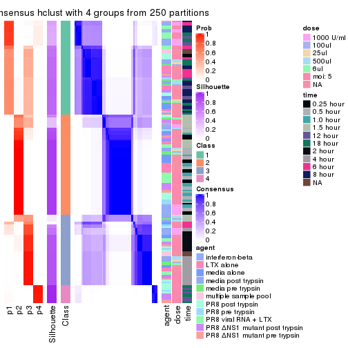</p>

</div>
<div id='tab-SD-hclust-consensus-heatmap-4'>
<pre><code class="r">consensus_heatmap(res, k = 5)
</code></pre>

<p></p>

</div>
<div id='tab-SD-hclust-consensus-heatmap-5'>
<pre><code class="r">consensus_heatmap(res, k = 6)
</code></pre>

<p></p>

</div>
</div>

Heatmaps for the membership of samples in all partitions to see how consistent they are:


<script>
$( function() {
	$( '#tabs-SD-hclust-membership-heatmap' ).tabs();
} );
</script>
<div id='tabs-SD-hclust-membership-heatmap'>
<ul>
<li><a href='#tab-SD-hclust-membership-heatmap-1'>k = 2</a></li>
<li><a href='#tab-SD-hclust-membership-heatmap-2'>k = 3</a></li>
<li><a href='#tab-SD-hclust-membership-heatmap-3'>k = 4</a></li>
<li><a href='#tab-SD-hclust-membership-heatmap-4'>k = 5</a></li>
<li><a href='#tab-SD-hclust-membership-heatmap-5'>k = 6</a></li>
</ul>
<div id='tab-SD-hclust-membership-heatmap-1'>
<pre><code class="r">membership_heatmap(res, k = 2)
</code></pre>

<p></p>

</div>
<div id='tab-SD-hclust-membership-heatmap-2'>
<pre><code class="r">membership_heatmap(res, k = 3)
</code></pre>

<p></p>

</div>
<div id='tab-SD-hclust-membership-heatmap-3'>
<pre><code class="r">membership_heatmap(res, k = 4)
</code></pre>

<p></p>

</div>
<div id='tab-SD-hclust-membership-heatmap-4'>
<pre><code class="r">membership_heatmap(res, k = 5)
</code></pre>

<p></p>

</div>
<div id='tab-SD-hclust-membership-heatmap-5'>
<pre><code class="r">membership_heatmap(res, k = 6)
</code></pre>

<p></p>

</div>
</div>

As soon as we have had the classes for columns, we can look for signatures
which are significantly different between classes which can be candidate marks
for certain classes. Following are the heatmaps for signatures.


Signature heatmaps where rows are scaled:


<script>
$( function() {
	$( '#tabs-SD-hclust-get-signatures' ).tabs();
} );
</script>
<div id='tabs-SD-hclust-get-signatures'>
<ul>
<li><a href='#tab-SD-hclust-get-signatures-1'>k = 2</a></li>
<li><a href='#tab-SD-hclust-get-signatures-2'>k = 3</a></li>
<li><a href='#tab-SD-hclust-get-signatures-3'>k = 4</a></li>
<li><a href='#tab-SD-hclust-get-signatures-4'>k = 5</a></li>
<li><a href='#tab-SD-hclust-get-signatures-5'>k = 6</a></li>
</ul>
<div id='tab-SD-hclust-get-signatures-1'>
<pre><code class="r">get_signatures(res, k = 2)
</code></pre>

<p></p>

</div>
<div id='tab-SD-hclust-get-signatures-2'>
<pre><code class="r">get_signatures(res, k = 3)
</code></pre>

<p></p>

</div>
<div id='tab-SD-hclust-get-signatures-3'>
<pre><code class="r">get_signatures(res, k = 4)
</code></pre>

<p></p>

</div>
<div id='tab-SD-hclust-get-signatures-4'>
<pre><code class="r">get_signatures(res, k = 5)
</code></pre>

<p></p>

</div>
<div id='tab-SD-hclust-get-signatures-5'>
<pre><code class="r">get_signatures(res, k = 6)
</code></pre>

<p>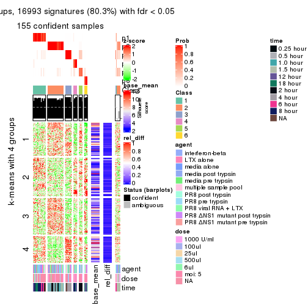</p>

</div>
</div>


Signature heatmaps where rows are not scaled:


<script>
$( function() {
	$( '#tabs-SD-hclust-get-signatures-no-scale' ).tabs();
} );
</script>
<div id='tabs-SD-hclust-get-signatures-no-scale'>
<ul>
<li><a href='#tab-SD-hclust-get-signatures-no-scale-1'>k = 2</a></li>
<li><a href='#tab-SD-hclust-get-signatures-no-scale-2'>k = 3</a></li>
<li><a href='#tab-SD-hclust-get-signatures-no-scale-3'>k = 4</a></li>
<li><a href='#tab-SD-hclust-get-signatures-no-scale-4'>k = 5</a></li>
<li><a href='#tab-SD-hclust-get-signatures-no-scale-5'>k = 6</a></li>
</ul>
<div id='tab-SD-hclust-get-signatures-no-scale-1'>
<pre><code class="r">get_signatures(res, k = 2, scale_rows = FALSE)
</code></pre>

<p></p>

</div>
<div id='tab-SD-hclust-get-signatures-no-scale-2'>
<pre><code class="r">get_signatures(res, k = 3, scale_rows = FALSE)
</code></pre>

<p></p>

</div>
<div id='tab-SD-hclust-get-signatures-no-scale-3'>
<pre><code class="r">get_signatures(res, k = 4, scale_rows = FALSE)
</code></pre>

<p></p>

</div>
<div id='tab-SD-hclust-get-signatures-no-scale-4'>
<pre><code class="r">get_signatures(res, k = 5, scale_rows = FALSE)
</code></pre>

<p></p>

</div>
<div id='tab-SD-hclust-get-signatures-no-scale-5'>
<pre><code class="r">get_signatures(res, k = 6, scale_rows = FALSE)
</code></pre>

<p></p>

</div>
</div>


Compare the overlap of signatures from different k:

```r
compare_signatures(res)
```


`get_signature()` returns a data frame invisibly. TO get the list of signatures, the function
call should be assigned to a variable explicitly. In following code, if `plot` argument is set
to `FALSE`, no heatmap is plotted while only the differential analysis is performed.

```r
# code only for demonstration
tb = get_signature(res, k = ..., plot = FALSE)
```

An example of the output of `tb` is:

```
#>   which_row         fdr    mean_1    mean_2 scaled_mean_1 scaled_mean_2 km
#> 1        38 0.042760348  8.373488  9.131774    -0.5533452     0.5164555  1
#> 2        40 0.018707592  7.106213  8.469186    -0.6173731     0.5762149  1
#> 3        55 0.019134737 10.221463 11.207825    -0.6159697     0.5749050  1
#> 4        59 0.006059896  5.921854  7.869574    -0.6899429     0.6439467  1
#> 5        60 0.018055526  8.928898 10.211722    -0.6204761     0.5791110  1
#> 6        98 0.009384629 15.714769 14.887706     0.6635654    -0.6193277  2
...
```

The columns in `tb` are:

1. `which_row`: row indices corresponding to the input matrix.
2. `fdr`: FDR for the differential test. 
3. `mean_x`: The mean value in group x.
4. `scaled_mean_x`: The mean value in group x after rows are scaled.
5. `km`: Row groups if k-means clustering is applied to rows.


UMAP plot which shows how samples are separated.


<script>
$( function() {
	$( '#tabs-SD-hclust-dimension-reduction' ).tabs();
} );
</script>
<div id='tabs-SD-hclust-dimension-reduction'>
<ul>
<li><a href='#tab-SD-hclust-dimension-reduction-1'>k = 2</a></li>
<li><a href='#tab-SD-hclust-dimension-reduction-2'>k = 3</a></li>
<li><a href='#tab-SD-hclust-dimension-reduction-3'>k = 4</a></li>
<li><a href='#tab-SD-hclust-dimension-reduction-4'>k = 5</a></li>
<li><a href='#tab-SD-hclust-dimension-reduction-5'>k = 6</a></li>
</ul>
<div id='tab-SD-hclust-dimension-reduction-1'>
<pre><code class="r">dimension_reduction(res, k = 2, method = &quot;UMAP&quot;)
</code></pre>

<p></p>

</div>
<div id='tab-SD-hclust-dimension-reduction-2'>
<pre><code class="r">dimension_reduction(res, k = 3, method = &quot;UMAP&quot;)
</code></pre>

<p></p>

</div>
<div id='tab-SD-hclust-dimension-reduction-3'>
<pre><code class="r">dimension_reduction(res, k = 4, method = &quot;UMAP&quot;)
</code></pre>

<p></p>

</div>
<div id='tab-SD-hclust-dimension-reduction-4'>
<pre><code class="r">dimension_reduction(res, k = 5, method = &quot;UMAP&quot;)
</code></pre>

<p></p>

</div>
<div id='tab-SD-hclust-dimension-reduction-5'>
<pre><code class="r">dimension_reduction(res, k = 6, method = &quot;UMAP&quot;)
</code></pre>

<p></p>

</div>
</div>


Following heatmap shows how subgroups are split when increasing `k`:

```r
collect_classes(res)
```


Test correlation between subgroups and known annotations. If the known
annotation is numeric, one-way ANOVA test is applied, and if the known
annotation is discrete, chi-squared contingency table test is applied.

```r
test_to_known_factors(res)
```

```
#>             n agent(p) dose(p)  time(p) k
#> SD:hclust 154 0.024981 0.04080 1.49e-09 2
#> SD:hclust 150 0.044756 0.08137 3.21e-31 3
#> SD:hclust 142 0.101854 0.14131 7.18e-45 4
#> SD:hclust 157 0.000129 0.00212 9.14e-47 5
#> SD:hclust 155 0.000444 0.00476 5.47e-73 6
```


If matrix rows can be associated to genes, consider to use `GO_Enrichment(res,
...)` to perform function enrichment for the signature genes.


 

---------------------------------------------------


### SD:kmeans


The object with results only for a single top-value method and a single partition method 
can be extracted as:

```r
res = res_list["SD", "kmeans"]
# you can also extract it by
# res = res_list["SD:kmeans"]
```

A summary of `res` and all the functions that can be applied to it:

```r
res
```

```
#> A 'ConsensusPartition' object with k = 2, 3, 4, 5, 6.
#>   On a matrix with 21163 rows and 169 columns.
#>   Top rows (1000, 2000, 3000, 4000, 5000) are extracted by 'SD' method.
#>   Subgroups are detected by 'kmeans' method.
#>   Performed in total 1250 partitions by row resampling.
#>   Best k for subgroups seems to be 2.
#> 
#> Following methods can be applied to this 'ConsensusPartition' object:
#>  [1] "cola_report"             "collect_classes"         "collect_plots"          
#>  [4] "collect_stats"           "colnames"                "compare_signatures"     
#>  [7] "consensus_heatmap"       "dimension_reduction"     "functional_enrichment"  
#> [10] "get_anno_col"            "get_anno"                "get_classes"            
#> [13] "get_consensus"           "get_matrix"              "get_membership"         
#> [16] "get_param"               "get_signatures"          "get_stats"              
#> [19] "is_best_k"               "is_stable_k"             "membership_heatmap"     
#> [22] "ncol"                    "nrow"                    "plot_ecdf"              
#> [25] "rownames"                "select_partition_number" "show"                   
#> [28] "suggest_best_k"          "test_to_known_factors"
```

`collect_plots()` function collects all the plots made from `res` for all `k` (number of partitions)
into one single page to provide an easy and fast comparison between different `k`.

```r
collect_plots(res)
```


The plots are:

- The first row: a plot of the ECDF (Empirical cumulative distribution
  function) curves of the consensus matrix for each `k` and the heatmap of
  predicted classes for each `k`.
- The second row: heatmaps of the consensus matrix for each `k`.
- The third row: heatmaps of the membership matrix for each `k`.
- The fouth row: heatmaps of the signatures for each `k`.

All the plots in panels can be made by individual functions and they are
plotted later in this section.

`select_partition_number()` produces several plots showing different
statistics for choosing "optimized" `k`. There are following statistics:

- ECDF curves of the consensus matrix for each `k`;
- 1-PAC. [The PAC
  score](https://en.wikipedia.org/wiki/Consensus_clustering#Over-interpretation_potential_of_consensus_clustering)
  measures the proportion of the ambiguous subgrouping.
- Mean silhouette score.
- Concordance. The mean probability of fiting the consensus class ids in all
  partitions.
- Area increased. Denote $A_k$ as the area under the ECDF curve for current
  `k`, the area increased is defined as $A_k - A_{k-1}$.
- Rand index. The percent of pairs of samples that are both in a same cluster
  or both are not in a same cluster in the partition of k and k-1.
- Jaccard index. The ratio of pairs of samples are both in a same cluster in
  the partition of k and k-1 and the pairs of samples are both in a same
  cluster in the partition k or k-1.

The detailed explanations of these statistics can be found in [the cola
vignette](http://bioconductor.org/packages/devel/bioc/vignettes/cola/inst/doc/cola.html#toc_13).

Generally speaking, lower PAC score, higher mean silhouette score or higher
concordance corresponds to better partition. Rand index and Jaccard index
measure how similar the current partition is compared to partition with `k-1`.
If they are too similar, we won't accept `k` is better than `k-1`.

```r
select_partition_number(res)
```

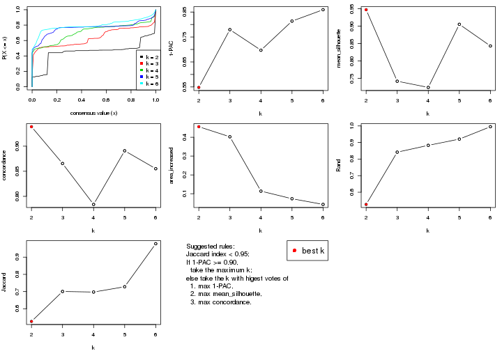

The numeric values for all these statistics can be obtained by `get_stats()`.

```r
get_stats(res)
```

```
#>   k 1-PAC mean_silhouette concordance area_increased  Rand Jaccard
#> 2 2 0.548           0.947       0.939         0.4559 0.527   0.527
#> 3 3 0.779           0.742       0.865         0.4025 0.842   0.701
#> 4 4 0.697           0.724       0.784         0.1137 0.883   0.697
#> 5 5 0.814           0.905       0.891         0.0734 0.920   0.728
#> 6 6 0.859           0.843       0.855         0.0432 0.995   0.978
```

`suggest_best_k()` suggests the best $k$ based on these statistics. The rules are as follows:

- All $k$ with Jaccard index larger than 0.95 are removed because the increase of
  the partition number does not provides enough extra information. If all $k$ are removed,
  the best $k$ is assigned by `NA`.
- For $k$ with 1-PAC larger than 0.9, the maximal $k$ is taken as the "best k". Other $k$ is called "optional k".
- If it does not fit the second rule. The $k$ with the highest vote of highest
  1-PAC, mean silhouette and concordance is taken as the "best k".

```r
suggest_best_k(res)
```

```
#> [1] 2
```


Following shows the table of the partitions (You need to click the **show/hide
code output** link to see it). The membership matrix (columns with name `p*`)
is inferred by
[`clue::cl_consensus()`](https://www.rdocumentation.org/link/cl_consensus?package=clue)
function with the `SE` method. Basically the value in the membership matrix
represents the probability to belong to a certain group. The finall class
label for an item is determined with the group with highest probability it
belongs to.

In `get_classes()` function, the entropy is calculated from the membership
matrix and the silhouette score is calculated from the consensus matrix.


<script>
$( function() {
	$( '#tabs-SD-kmeans-get-classes' ).tabs();
} );
</script>
<div id='tabs-SD-kmeans-get-classes'>
<ul>
<li><a href='#tab-SD-kmeans-get-classes-1'>k = 2</a></li>
<li><a href='#tab-SD-kmeans-get-classes-2'>k = 3</a></li>
<li><a href='#tab-SD-kmeans-get-classes-3'>k = 4</a></li>
<li><a href='#tab-SD-kmeans-get-classes-4'>k = 5</a></li>
<li><a href='#tab-SD-kmeans-get-classes-5'>k = 6</a></li>
</ul>

<div id='tab-SD-kmeans-get-classes-1'>
<p><a id='tab-SD-kmeans-get-classes-1-a' style='color:#0366d6' href='#'>show/hide code output</a></p>
<pre><code class="r">cbind(get_classes(res, k = 2), get_membership(res, k = 2))
</code></pre>

<pre><code>#&gt;           class entropy silhouette    p1    p2
#&gt; GSM528681     2   0.000      1.000 0.000 1.000
#&gt; GSM528682     2   0.000      1.000 0.000 1.000
#&gt; GSM528683     2   0.000      1.000 0.000 1.000
#&gt; GSM528684     2   0.000      1.000 0.000 1.000
#&gt; GSM528687     2   0.000      1.000 0.000 1.000
#&gt; GSM528688     2   0.000      1.000 0.000 1.000
#&gt; GSM528685     2   0.000      1.000 0.000 1.000
#&gt; GSM528686     2   0.000      1.000 0.000 1.000
#&gt; GSM528693     1   0.541      0.944 0.876 0.124
#&gt; GSM528694     1   0.541      0.944 0.876 0.124
#&gt; GSM528695     1   0.184      0.907 0.972 0.028
#&gt; GSM528696     1   0.184      0.907 0.972 0.028
#&gt; GSM528697     1   0.000      0.895 1.000 0.000
#&gt; GSM528698     1   0.000      0.895 1.000 0.000
#&gt; GSM528699     1   0.000      0.895 1.000 0.000
#&gt; GSM528700     1   0.000      0.895 1.000 0.000
#&gt; GSM528689     1   0.000      0.895 1.000 0.000
#&gt; GSM528690     1   0.000      0.895 1.000 0.000
#&gt; GSM528691     1   0.000      0.895 1.000 0.000
#&gt; GSM528692     1   0.000      0.895 1.000 0.000
#&gt; GSM528779     2   0.000      1.000 0.000 1.000
#&gt; GSM528780     2   0.000      1.000 0.000 1.000
#&gt; GSM528782     2   0.000      1.000 0.000 1.000
#&gt; GSM528781     2   0.000      1.000 0.000 1.000
#&gt; GSM528785     1   0.839      0.785 0.732 0.268
#&gt; GSM528786     1   0.541      0.944 0.876 0.124
#&gt; GSM528787     1   0.541      0.944 0.876 0.124
#&gt; GSM528788     1   0.541      0.944 0.876 0.124
#&gt; GSM528783     1   0.311      0.920 0.944 0.056
#&gt; GSM528784     1   0.000      0.895 1.000 0.000
#&gt; GSM528759     1   0.541      0.944 0.876 0.124
#&gt; GSM528760     1   0.541      0.944 0.876 0.124
#&gt; GSM528761     2   0.000      1.000 0.000 1.000
#&gt; GSM528762     2   0.000      1.000 0.000 1.000
#&gt; GSM528765     2   0.000      1.000 0.000 1.000
#&gt; GSM528766     2   0.000      1.000 0.000 1.000
#&gt; GSM528763     2   0.000      1.000 0.000 1.000
#&gt; GSM528764     2   0.000      1.000 0.000 1.000
#&gt; GSM528771     1   0.827      0.796 0.740 0.260
#&gt; GSM528772     1   0.808      0.813 0.752 0.248
#&gt; GSM528773     1   0.541      0.944 0.876 0.124
#&gt; GSM528774     1   0.541      0.944 0.876 0.124
#&gt; GSM528775     1   0.541      0.944 0.876 0.124
#&gt; GSM528776     1   0.482      0.938 0.896 0.104
#&gt; GSM528777     1   0.430      0.932 0.912 0.088
#&gt; GSM528778     1   0.430      0.932 0.912 0.088
#&gt; GSM528767     1   0.000      0.895 1.000 0.000
#&gt; GSM528768     1   0.000      0.895 1.000 0.000
#&gt; GSM528769     1   0.000      0.895 1.000 0.000
#&gt; GSM528770     1   0.000      0.895 1.000 0.000
#&gt; GSM528671     2   0.000      1.000 0.000 1.000
#&gt; GSM528672     2   0.000      1.000 0.000 1.000
#&gt; GSM528674     2   0.000      1.000 0.000 1.000
#&gt; GSM528673     2   0.000      1.000 0.000 1.000
#&gt; GSM528677     1   0.541      0.944 0.876 0.124
#&gt; GSM528678     1   0.541      0.944 0.876 0.124
#&gt; GSM528679     1   0.358      0.924 0.932 0.068
#&gt; GSM528680     1   0.000      0.895 1.000 0.000
#&gt; GSM528675     1   0.000      0.895 1.000 0.000
#&gt; GSM528676     1   0.000      0.895 1.000 0.000
#&gt; GSM528651     2   0.000      1.000 0.000 1.000
#&gt; GSM528652     2   0.000      1.000 0.000 1.000
#&gt; GSM528653     2   0.000      1.000 0.000 1.000
#&gt; GSM528654     2   0.000      1.000 0.000 1.000
#&gt; GSM528657     2   0.000      1.000 0.000 1.000
#&gt; GSM528658     2   0.000      1.000 0.000 1.000
#&gt; GSM528655     2   0.000      1.000 0.000 1.000
#&gt; GSM528656     2   0.000      1.000 0.000 1.000
#&gt; GSM528663     1   0.929      0.656 0.656 0.344
#&gt; GSM528664     1   0.995      0.381 0.540 0.460
#&gt; GSM528665     1   0.541      0.944 0.876 0.124
#&gt; GSM528666     1   0.541      0.944 0.876 0.124
#&gt; GSM528667     1   0.541      0.944 0.876 0.124
#&gt; GSM528668     1   0.541      0.944 0.876 0.124
#&gt; GSM528669     1   0.541      0.944 0.876 0.124
#&gt; GSM528670     1   0.541      0.944 0.876 0.124
#&gt; GSM528659     1   0.000      0.895 1.000 0.000
#&gt; GSM528660     1   0.000      0.895 1.000 0.000
#&gt; GSM528661     1   0.000      0.895 1.000 0.000
#&gt; GSM528662     1   0.000      0.895 1.000 0.000
#&gt; GSM528701     2   0.000      1.000 0.000 1.000
#&gt; GSM528702     2   0.000      1.000 0.000 1.000
#&gt; GSM528703     2   0.000      1.000 0.000 1.000
#&gt; GSM528704     2   0.000      1.000 0.000 1.000
#&gt; GSM528707     2   0.000      1.000 0.000 1.000
#&gt; GSM528708     2   0.000      1.000 0.000 1.000
#&gt; GSM528705     2   0.000      1.000 0.000 1.000
#&gt; GSM528706     2   0.000      1.000 0.000 1.000
#&gt; GSM528713     1   0.541      0.944 0.876 0.124
#&gt; GSM528714     1   0.541      0.944 0.876 0.124
#&gt; GSM528715     1   0.541      0.944 0.876 0.124
#&gt; GSM528716     1   0.541      0.944 0.876 0.124
#&gt; GSM528717     1   0.000      0.895 1.000 0.000
#&gt; GSM528718     1   0.000      0.895 1.000 0.000
#&gt; GSM528719     1   0.000      0.895 1.000 0.000
#&gt; GSM528720     1   0.000      0.895 1.000 0.000
#&gt; GSM528709     1   0.000      0.895 1.000 0.000
#&gt; GSM528710     1   0.000      0.895 1.000 0.000
#&gt; GSM528711     1   0.000      0.895 1.000 0.000
#&gt; GSM528712     1   0.000      0.895 1.000 0.000
#&gt; GSM528721     2   0.000      1.000 0.000 1.000
#&gt; GSM528722     2   0.000      1.000 0.000 1.000
#&gt; GSM528723     2   0.000      1.000 0.000 1.000
#&gt; GSM528724     2   0.000      1.000 0.000 1.000
#&gt; GSM528727     2   0.000      1.000 0.000 1.000
#&gt; GSM528728     2   0.000      1.000 0.000 1.000
#&gt; GSM528725     2   0.000      1.000 0.000 1.000
#&gt; GSM528726     2   0.000      1.000 0.000 1.000
#&gt; GSM528733     1   0.541      0.944 0.876 0.124
#&gt; GSM528734     1   0.541      0.944 0.876 0.124
#&gt; GSM528735     1   0.541      0.944 0.876 0.124
#&gt; GSM528736     1   0.541      0.944 0.876 0.124
#&gt; GSM528737     1   0.541      0.944 0.876 0.124
#&gt; GSM528738     1   0.541      0.944 0.876 0.124
#&gt; GSM528729     1   0.541      0.944 0.876 0.124
#&gt; GSM528730     1   0.541      0.944 0.876 0.124
#&gt; GSM528731     1   0.541      0.944 0.876 0.124
#&gt; GSM528732     1   0.541      0.944 0.876 0.124
#&gt; GSM528739     2   0.000      1.000 0.000 1.000
#&gt; GSM528740     2   0.000      1.000 0.000 1.000
#&gt; GSM528741     2   0.000      1.000 0.000 1.000
#&gt; GSM528742     2   0.000      1.000 0.000 1.000
#&gt; GSM528745     2   0.000      1.000 0.000 1.000
#&gt; GSM528746     2   0.000      1.000 0.000 1.000
#&gt; GSM528743     2   0.000      1.000 0.000 1.000
#&gt; GSM528744     2   0.000      1.000 0.000 1.000
#&gt; GSM528751     1   0.808      0.813 0.752 0.248
#&gt; GSM528752     1   0.802      0.818 0.756 0.244
#&gt; GSM528753     1   0.541      0.944 0.876 0.124
#&gt; GSM528754     1   0.541      0.944 0.876 0.124
#&gt; GSM528755     1   0.541      0.944 0.876 0.124
#&gt; GSM528756     1   0.541      0.944 0.876 0.124
#&gt; GSM528757     1   0.541      0.944 0.876 0.124
#&gt; GSM528758     1   0.541      0.944 0.876 0.124
#&gt; GSM528747     1   0.541      0.944 0.876 0.124
#&gt; GSM528748     1   0.541      0.944 0.876 0.124
#&gt; GSM528749     1   0.541      0.944 0.876 0.124
#&gt; GSM528750     1   0.541      0.944 0.876 0.124
#&gt; GSM528640     2   0.000      1.000 0.000 1.000
#&gt; GSM528641     2   0.000      1.000 0.000 1.000
#&gt; GSM528643     1   0.541      0.944 0.876 0.124
#&gt; GSM528644     1   0.541      0.944 0.876 0.124
#&gt; GSM528642     1   0.541      0.944 0.876 0.124
#&gt; GSM528620     2   0.000      1.000 0.000 1.000
#&gt; GSM528621     2   0.000      1.000 0.000 1.000
#&gt; GSM528623     1   0.541      0.944 0.876 0.124
#&gt; GSM528624     1   0.541      0.944 0.876 0.124
#&gt; GSM528622     1   0.541      0.944 0.876 0.124
#&gt; GSM528625     2   0.000      1.000 0.000 1.000
#&gt; GSM528626     2   0.000      1.000 0.000 1.000
#&gt; GSM528628     1   0.541      0.944 0.876 0.124
#&gt; GSM528629     1   0.541      0.944 0.876 0.124
#&gt; GSM528627     1   0.541      0.944 0.876 0.124
#&gt; GSM528630     2   0.000      1.000 0.000 1.000
#&gt; GSM528631     2   0.000      1.000 0.000 1.000
#&gt; GSM528632     2   0.000      1.000 0.000 1.000
#&gt; GSM528633     2   0.000      1.000 0.000 1.000
#&gt; GSM528636     1   0.541      0.944 0.876 0.124
#&gt; GSM528637     1   0.541      0.944 0.876 0.124
#&gt; GSM528638     1   0.541      0.944 0.876 0.124
#&gt; GSM528639     1   0.541      0.944 0.876 0.124
#&gt; GSM528634     1   0.541      0.944 0.876 0.124
#&gt; GSM528635     1   0.541      0.944 0.876 0.124
#&gt; GSM528645     1   0.541      0.944 0.876 0.124
#&gt; GSM528646     1   0.541      0.944 0.876 0.124
#&gt; GSM528647     1   0.541      0.944 0.876 0.124
#&gt; GSM528648     1   0.541      0.944 0.876 0.124
#&gt; GSM528649     1   0.541      0.944 0.876 0.124
#&gt; GSM528650     1   0.541      0.944 0.876 0.124
</code></pre>

<script>
$('#tab-SD-kmeans-get-classes-1-a').parent().next().next().hide();
$('#tab-SD-kmeans-get-classes-1-a').click(function(){
  $('#tab-SD-kmeans-get-classes-1-a').parent().next().next().toggle();
  return(false);
});
</script>
</div>

<div id='tab-SD-kmeans-get-classes-2'>
<p><a id='tab-SD-kmeans-get-classes-2-a' style='color:#0366d6' href='#'>show/hide code output</a></p>
<pre><code class="r">cbind(get_classes(res, k = 3), get_membership(res, k = 3))
</code></pre>

<pre><code>#&gt;           class entropy silhouette    p1    p2    p3
#&gt; GSM528681     2  0.0000      0.947 0.000 1.000 0.000
#&gt; GSM528682     2  0.0000      0.947 0.000 1.000 0.000
#&gt; GSM528683     2  0.0000      0.947 0.000 1.000 0.000
#&gt; GSM528684     2  0.0000      0.947 0.000 1.000 0.000
#&gt; GSM528687     2  0.0000      0.947 0.000 1.000 0.000
#&gt; GSM528688     2  0.0000      0.947 0.000 1.000 0.000
#&gt; GSM528685     2  0.1267      0.928 0.024 0.972 0.004
#&gt; GSM528686     2  0.6633      0.660 0.260 0.700 0.040
#&gt; GSM528693     3  0.6442      0.721 0.432 0.004 0.564
#&gt; GSM528694     3  0.6442      0.721 0.432 0.004 0.564
#&gt; GSM528695     3  0.6252      0.713 0.444 0.000 0.556
#&gt; GSM528696     3  0.6252      0.713 0.444 0.000 0.556
#&gt; GSM528697     1  0.6267      0.879 0.548 0.000 0.452
#&gt; GSM528698     1  0.6267      0.879 0.548 0.000 0.452
#&gt; GSM528699     1  0.6267      0.879 0.548 0.000 0.452
#&gt; GSM528700     1  0.6267      0.879 0.548 0.000 0.452
#&gt; GSM528689     1  0.6267      0.879 0.548 0.000 0.452
#&gt; GSM528690     1  0.6267      0.879 0.548 0.000 0.452
#&gt; GSM528691     1  0.6267      0.879 0.548 0.000 0.452
#&gt; GSM528692     1  0.6267      0.879 0.548 0.000 0.452
#&gt; GSM528779     2  0.0000      0.947 0.000 1.000 0.000
#&gt; GSM528780     2  0.0237      0.946 0.004 0.996 0.000
#&gt; GSM528782     2  0.0000      0.947 0.000 1.000 0.000
#&gt; GSM528781     2  0.0237      0.946 0.004 0.996 0.000
#&gt; GSM528785     3  0.8260      0.648 0.432 0.076 0.492
#&gt; GSM528786     3  0.6468      0.715 0.444 0.004 0.552
#&gt; GSM528787     3  0.6373      0.728 0.408 0.004 0.588
#&gt; GSM528788     3  0.0237      0.537 0.000 0.004 0.996
#&gt; GSM528783     3  0.6264     -0.594 0.380 0.004 0.616
#&gt; GSM528784     1  0.6267      0.875 0.548 0.000 0.452
#&gt; GSM528759     3  0.6373      0.728 0.408 0.004 0.588
#&gt; GSM528760     3  0.6373      0.728 0.408 0.004 0.588
#&gt; GSM528761     2  0.0237      0.946 0.004 0.996 0.000
#&gt; GSM528762     2  0.0000      0.947 0.000 1.000 0.000
#&gt; GSM528765     2  0.0237      0.946 0.004 0.996 0.000
#&gt; GSM528766     2  0.0237      0.946 0.004 0.996 0.000
#&gt; GSM528763     2  0.0237      0.945 0.004 0.996 0.000
#&gt; GSM528764     2  0.6633      0.660 0.260 0.700 0.040
#&gt; GSM528771     3  0.7013      0.709 0.432 0.020 0.548
#&gt; GSM528772     3  0.6754      0.716 0.432 0.012 0.556
#&gt; GSM528773     3  0.6468      0.715 0.444 0.004 0.552
#&gt; GSM528774     3  0.6410      0.728 0.420 0.004 0.576
#&gt; GSM528775     3  0.6314      0.727 0.392 0.004 0.604
#&gt; GSM528776     3  0.0237      0.537 0.000 0.004 0.996
#&gt; GSM528777     3  0.3851      0.199 0.136 0.004 0.860
#&gt; GSM528778     3  0.3851      0.199 0.136 0.004 0.860
#&gt; GSM528767     1  0.6267      0.875 0.548 0.000 0.452
#&gt; GSM528768     1  0.6267      0.875 0.548 0.000 0.452
#&gt; GSM528769     1  0.6267      0.875 0.548 0.000 0.452
#&gt; GSM528770     1  0.6267      0.875 0.548 0.000 0.452
#&gt; GSM528671     2  0.0237      0.946 0.004 0.996 0.000
#&gt; GSM528672     2  0.0000      0.947 0.000 1.000 0.000
#&gt; GSM528674     2  0.0237      0.946 0.004 0.996 0.000
#&gt; GSM528673     2  0.6633      0.660 0.260 0.700 0.040
#&gt; GSM528677     3  0.6442      0.721 0.432 0.004 0.564
#&gt; GSM528678     3  0.6468      0.715 0.444 0.004 0.552
#&gt; GSM528679     3  0.0237      0.537 0.000 0.004 0.996
#&gt; GSM528680     1  0.6267      0.879 0.548 0.000 0.452
#&gt; GSM528675     1  0.6260      0.878 0.552 0.000 0.448
#&gt; GSM528676     1  0.6260      0.878 0.552 0.000 0.448
#&gt; GSM528651     2  0.0237      0.946 0.004 0.996 0.000
#&gt; GSM528652     2  0.0237      0.946 0.004 0.996 0.000
#&gt; GSM528653     2  0.0000      0.947 0.000 1.000 0.000
#&gt; GSM528654     2  0.0000      0.947 0.000 1.000 0.000
#&gt; GSM528657     2  0.0237      0.946 0.004 0.996 0.000
#&gt; GSM528658     2  0.0000      0.947 0.000 1.000 0.000
#&gt; GSM528655     2  0.6633      0.660 0.260 0.700 0.040
#&gt; GSM528656     2  0.4834      0.762 0.204 0.792 0.004
#&gt; GSM528663     1  0.8984     -0.595 0.436 0.128 0.436
#&gt; GSM528664     1  0.9070     -0.585 0.436 0.136 0.428
#&gt; GSM528665     3  0.6410      0.728 0.420 0.004 0.576
#&gt; GSM528666     3  0.6410      0.728 0.420 0.004 0.576
#&gt; GSM528667     3  0.0237      0.537 0.000 0.004 0.996
#&gt; GSM528668     3  0.0237      0.537 0.000 0.004 0.996
#&gt; GSM528669     3  0.0237      0.537 0.000 0.004 0.996
#&gt; GSM528670     3  0.0237      0.537 0.000 0.004 0.996
#&gt; GSM528659     1  0.6260      0.878 0.552 0.000 0.448
#&gt; GSM528660     1  0.6260      0.878 0.552 0.000 0.448
#&gt; GSM528661     1  0.6260      0.878 0.552 0.000 0.448
#&gt; GSM528662     1  0.6260      0.878 0.552 0.000 0.448
#&gt; GSM528701     2  0.0000      0.947 0.000 1.000 0.000
#&gt; GSM528702     2  0.0000      0.947 0.000 1.000 0.000
#&gt; GSM528703     2  0.0000      0.947 0.000 1.000 0.000
#&gt; GSM528704     2  0.0000      0.947 0.000 1.000 0.000
#&gt; GSM528707     2  0.0000      0.947 0.000 1.000 0.000
#&gt; GSM528708     2  0.0000      0.947 0.000 1.000 0.000
#&gt; GSM528705     2  0.0000      0.947 0.000 1.000 0.000
#&gt; GSM528706     2  0.0000      0.947 0.000 1.000 0.000
#&gt; GSM528713     3  0.6442      0.721 0.432 0.004 0.564
#&gt; GSM528714     3  0.6442      0.721 0.432 0.004 0.564
#&gt; GSM528715     3  0.6410      0.728 0.420 0.004 0.576
#&gt; GSM528716     3  0.6410      0.728 0.420 0.004 0.576
#&gt; GSM528717     3  0.0000      0.530 0.000 0.000 1.000
#&gt; GSM528718     3  0.0000      0.530 0.000 0.000 1.000
#&gt; GSM528719     1  0.6267      0.879 0.548 0.000 0.452
#&gt; GSM528720     1  0.6267      0.879 0.548 0.000 0.452
#&gt; GSM528709     1  0.6267      0.879 0.548 0.000 0.452
#&gt; GSM528710     1  0.6267      0.879 0.548 0.000 0.452
#&gt; GSM528711     1  0.6267      0.879 0.548 0.000 0.452
#&gt; GSM528712     1  0.6267      0.879 0.548 0.000 0.452
#&gt; GSM528721     2  0.0000      0.947 0.000 1.000 0.000
#&gt; GSM528722     2  0.0000      0.947 0.000 1.000 0.000
#&gt; GSM528723     2  0.0000      0.947 0.000 1.000 0.000
#&gt; GSM528724     2  0.0000      0.947 0.000 1.000 0.000
#&gt; GSM528727     2  0.0237      0.946 0.004 0.996 0.000
#&gt; GSM528728     2  0.0000      0.947 0.000 1.000 0.000
#&gt; GSM528725     2  0.0000      0.947 0.000 1.000 0.000
#&gt; GSM528726     2  0.0000      0.947 0.000 1.000 0.000
#&gt; GSM528733     3  0.6410      0.728 0.420 0.004 0.576
#&gt; GSM528734     3  0.6410      0.728 0.420 0.004 0.576
#&gt; GSM528735     3  0.6314      0.727 0.392 0.004 0.604
#&gt; GSM528736     3  0.6314      0.727 0.392 0.004 0.604
#&gt; GSM528737     3  0.0237      0.537 0.000 0.004 0.996
#&gt; GSM528738     3  0.0237      0.537 0.000 0.004 0.996
#&gt; GSM528729     3  0.0237      0.537 0.000 0.004 0.996
#&gt; GSM528730     3  0.0237      0.537 0.000 0.004 0.996
#&gt; GSM528731     3  0.0237      0.537 0.000 0.004 0.996
#&gt; GSM528732     3  0.0237      0.537 0.000 0.004 0.996
#&gt; GSM528739     2  0.0000      0.947 0.000 1.000 0.000
#&gt; GSM528740     2  0.0000      0.947 0.000 1.000 0.000
#&gt; GSM528741     2  0.0237      0.946 0.004 0.996 0.000
#&gt; GSM528742     2  0.0000      0.947 0.000 1.000 0.000
#&gt; GSM528745     2  0.0237      0.946 0.004 0.996 0.000
#&gt; GSM528746     2  0.0000      0.947 0.000 1.000 0.000
#&gt; GSM528743     2  0.0237      0.946 0.004 0.996 0.000
#&gt; GSM528744     2  0.0237      0.946 0.004 0.996 0.000
#&gt; GSM528751     3  0.6754      0.716 0.432 0.012 0.556
#&gt; GSM528752     3  0.6608      0.718 0.432 0.008 0.560
#&gt; GSM528753     3  0.6410      0.728 0.420 0.004 0.576
#&gt; GSM528754     3  0.6410      0.728 0.420 0.004 0.576
#&gt; GSM528755     3  0.6298      0.726 0.388 0.004 0.608
#&gt; GSM528756     3  0.6314      0.727 0.392 0.004 0.604
#&gt; GSM528757     3  0.0237      0.537 0.000 0.004 0.996
#&gt; GSM528758     3  0.0237      0.537 0.000 0.004 0.996
#&gt; GSM528747     3  0.0237      0.537 0.000 0.004 0.996
#&gt; GSM528748     3  0.0237      0.537 0.000 0.004 0.996
#&gt; GSM528749     3  0.0237      0.537 0.000 0.004 0.996
#&gt; GSM528750     3  0.0237      0.537 0.000 0.004 0.996
#&gt; GSM528640     2  0.0000      0.947 0.000 1.000 0.000
#&gt; GSM528641     2  0.6633      0.660 0.260 0.700 0.040
#&gt; GSM528643     3  0.6410      0.728 0.420 0.004 0.576
#&gt; GSM528644     3  0.0237      0.537 0.000 0.004 0.996
#&gt; GSM528642     3  0.2096      0.568 0.052 0.004 0.944
#&gt; GSM528620     2  0.0237      0.946 0.004 0.996 0.000
#&gt; GSM528621     1  0.9698     -0.328 0.436 0.336 0.228
#&gt; GSM528623     3  0.6410      0.728 0.420 0.004 0.576
#&gt; GSM528624     3  0.0237      0.537 0.000 0.004 0.996
#&gt; GSM528622     3  0.0237      0.537 0.000 0.004 0.996
#&gt; GSM528625     2  0.0000      0.947 0.000 1.000 0.000
#&gt; GSM528626     2  0.7116      0.568 0.324 0.636 0.040
#&gt; GSM528628     3  0.6410      0.728 0.420 0.004 0.576
#&gt; GSM528629     3  0.0237      0.537 0.000 0.004 0.996
#&gt; GSM528627     3  0.0475      0.539 0.004 0.004 0.992
#&gt; GSM528630     2  0.0237      0.946 0.004 0.996 0.000
#&gt; GSM528631     2  0.0000      0.947 0.000 1.000 0.000
#&gt; GSM528632     2  0.7508      0.402 0.416 0.544 0.040
#&gt; GSM528633     2  0.7508      0.402 0.416 0.544 0.040
#&gt; GSM528636     3  0.6410      0.728 0.420 0.004 0.576
#&gt; GSM528637     3  0.6410      0.728 0.420 0.004 0.576
#&gt; GSM528638     3  0.0237      0.537 0.000 0.004 0.996
#&gt; GSM528639     3  0.0237      0.537 0.000 0.004 0.996
#&gt; GSM528634     3  0.2301      0.572 0.060 0.004 0.936
#&gt; GSM528635     3  0.0237      0.537 0.000 0.004 0.996
#&gt; GSM528645     3  0.6468      0.715 0.444 0.004 0.552
#&gt; GSM528646     3  0.6468      0.715 0.444 0.004 0.552
#&gt; GSM528647     3  0.6468      0.715 0.444 0.004 0.552
#&gt; GSM528648     3  0.6373      0.728 0.408 0.004 0.588
#&gt; GSM528649     3  0.6373      0.728 0.408 0.004 0.588
#&gt; GSM528650     3  0.6373      0.728 0.408 0.004 0.588
</code></pre>

<script>
$('#tab-SD-kmeans-get-classes-2-a').parent().next().next().hide();
$('#tab-SD-kmeans-get-classes-2-a').click(function(){
  $('#tab-SD-kmeans-get-classes-2-a').parent().next().next().toggle();
  return(false);
});
</script>
</div>

<div id='tab-SD-kmeans-get-classes-3'>
<p><a id='tab-SD-kmeans-get-classes-3-a' style='color:#0366d6' href='#'>show/hide code output</a></p>
<pre><code class="r">cbind(get_classes(res, k = 4), get_membership(res, k = 4))
</code></pre>

<pre><code>#&gt;           class entropy silhouette    p1    p2    p3    p4
#&gt; GSM528681     2  0.0000     0.9825 0.000 1.000 0.000 0.000
#&gt; GSM528682     2  0.0000     0.9825 0.000 1.000 0.000 0.000
#&gt; GSM528683     2  0.0000     0.9825 0.000 1.000 0.000 0.000
#&gt; GSM528684     2  0.0000     0.9825 0.000 1.000 0.000 0.000
#&gt; GSM528687     2  0.0000     0.9825 0.000 1.000 0.000 0.000
#&gt; GSM528688     2  0.0000     0.9825 0.000 1.000 0.000 0.000
#&gt; GSM528685     3  0.5408     0.2170 0.012 0.488 0.500 0.000
#&gt; GSM528686     3  0.7228     0.5672 0.156 0.340 0.504 0.000
#&gt; GSM528693     3  0.4103     0.5658 0.256 0.000 0.744 0.000
#&gt; GSM528694     3  0.4103     0.5658 0.256 0.000 0.744 0.000
#&gt; GSM528695     1  0.0336     0.4153 0.992 0.000 0.000 0.008
#&gt; GSM528696     1  0.0336     0.4153 0.992 0.000 0.000 0.008
#&gt; GSM528697     4  0.0188     0.9478 0.000 0.000 0.004 0.996
#&gt; GSM528698     4  0.0188     0.9478 0.000 0.000 0.004 0.996
#&gt; GSM528699     4  0.0000     0.9488 0.000 0.000 0.000 1.000
#&gt; GSM528700     4  0.0000     0.9488 0.000 0.000 0.000 1.000
#&gt; GSM528689     4  0.0000     0.9488 0.000 0.000 0.000 1.000
#&gt; GSM528690     4  0.0000     0.9488 0.000 0.000 0.000 1.000
#&gt; GSM528691     4  0.0000     0.9488 0.000 0.000 0.000 1.000
#&gt; GSM528692     4  0.0000     0.9488 0.000 0.000 0.000 1.000
#&gt; GSM528779     2  0.0000     0.9825 0.000 1.000 0.000 0.000
#&gt; GSM528780     2  0.1022     0.9722 0.000 0.968 0.032 0.000
#&gt; GSM528782     2  0.0000     0.9825 0.000 1.000 0.000 0.000
#&gt; GSM528781     2  0.1022     0.9722 0.000 0.968 0.032 0.000
#&gt; GSM528785     3  0.3760     0.4864 0.136 0.028 0.836 0.000
#&gt; GSM528786     1  0.3024     0.1568 0.852 0.000 0.148 0.000
#&gt; GSM528787     1  0.3764     0.4649 0.784 0.000 0.216 0.000
#&gt; GSM528788     1  0.7714     0.6643 0.400 0.000 0.376 0.224
#&gt; GSM528783     4  0.5874     0.5780 0.124 0.000 0.176 0.700
#&gt; GSM528784     4  0.3266     0.8608 0.000 0.000 0.168 0.832
#&gt; GSM528759     1  0.6462     0.5956 0.580 0.000 0.332 0.088
#&gt; GSM528760     1  0.4088     0.4549 0.764 0.000 0.232 0.004
#&gt; GSM528761     2  0.1022     0.9722 0.000 0.968 0.032 0.000
#&gt; GSM528762     2  0.0000     0.9825 0.000 1.000 0.000 0.000
#&gt; GSM528765     2  0.1022     0.9722 0.000 0.968 0.032 0.000
#&gt; GSM528766     2  0.1022     0.9722 0.000 0.968 0.032 0.000
#&gt; GSM528763     2  0.4193     0.5470 0.000 0.732 0.268 0.000
#&gt; GSM528764     3  0.7165     0.5469 0.144 0.356 0.500 0.000
#&gt; GSM528771     3  0.4535     0.5831 0.240 0.016 0.744 0.000
#&gt; GSM528772     3  0.4535     0.5831 0.240 0.016 0.744 0.000
#&gt; GSM528773     1  0.1792     0.3157 0.932 0.000 0.068 0.000
#&gt; GSM528774     1  0.0000     0.4218 1.000 0.000 0.000 0.000
#&gt; GSM528775     1  0.6766     0.6294 0.520 0.000 0.380 0.100
#&gt; GSM528776     1  0.7714     0.6647 0.400 0.000 0.376 0.224
#&gt; GSM528777     3  0.7758    -0.6569 0.368 0.000 0.396 0.236
#&gt; GSM528778     3  0.7758    -0.6569 0.368 0.000 0.396 0.236
#&gt; GSM528767     4  0.3266     0.8608 0.000 0.000 0.168 0.832
#&gt; GSM528768     4  0.3266     0.8608 0.000 0.000 0.168 0.832
#&gt; GSM528769     4  0.3266     0.8608 0.000 0.000 0.168 0.832
#&gt; GSM528770     4  0.3266     0.8608 0.000 0.000 0.168 0.832
#&gt; GSM528671     2  0.1022     0.9722 0.000 0.968 0.032 0.000
#&gt; GSM528672     2  0.0000     0.9825 0.000 1.000 0.000 0.000
#&gt; GSM528674     2  0.1022     0.9722 0.000 0.968 0.032 0.000
#&gt; GSM528673     3  0.7165     0.5469 0.144 0.356 0.500 0.000
#&gt; GSM528677     3  0.4134     0.5667 0.260 0.000 0.740 0.000
#&gt; GSM528678     1  0.2921     0.1746 0.860 0.000 0.140 0.000
#&gt; GSM528679     1  0.7710     0.6673 0.408 0.000 0.368 0.224
#&gt; GSM528680     4  0.1118     0.9313 0.000 0.000 0.036 0.964
#&gt; GSM528675     4  0.1211     0.9409 0.000 0.000 0.040 0.960
#&gt; GSM528676     4  0.1211     0.9409 0.000 0.000 0.040 0.960
#&gt; GSM528651     2  0.1022     0.9722 0.000 0.968 0.032 0.000
#&gt; GSM528652     2  0.1022     0.9722 0.000 0.968 0.032 0.000
#&gt; GSM528653     2  0.0000     0.9825 0.000 1.000 0.000 0.000
#&gt; GSM528654     2  0.0000     0.9825 0.000 1.000 0.000 0.000
#&gt; GSM528657     2  0.1022     0.9722 0.000 0.968 0.032 0.000
#&gt; GSM528658     2  0.0000     0.9825 0.000 1.000 0.000 0.000
#&gt; GSM528655     3  0.7165     0.5469 0.144 0.356 0.500 0.000
#&gt; GSM528656     3  0.7139     0.5377 0.140 0.360 0.500 0.000
#&gt; GSM528663     3  0.5787     0.6215 0.244 0.076 0.680 0.000
#&gt; GSM528664     3  0.5851     0.6248 0.236 0.084 0.680 0.000
#&gt; GSM528665     1  0.0000     0.4218 1.000 0.000 0.000 0.000
#&gt; GSM528666     1  0.0000     0.4218 1.000 0.000 0.000 0.000
#&gt; GSM528667     1  0.7710     0.6673 0.408 0.000 0.368 0.224
#&gt; GSM528668     1  0.7710     0.6673 0.408 0.000 0.368 0.224
#&gt; GSM528669     1  0.7732     0.6565 0.388 0.000 0.384 0.228
#&gt; GSM528670     1  0.7717     0.6599 0.392 0.000 0.384 0.224
#&gt; GSM528659     4  0.1211     0.9409 0.000 0.000 0.040 0.960
#&gt; GSM528660     4  0.1211     0.9409 0.000 0.000 0.040 0.960
#&gt; GSM528661     4  0.1211     0.9409 0.000 0.000 0.040 0.960
#&gt; GSM528662     4  0.1211     0.9409 0.000 0.000 0.040 0.960
#&gt; GSM528701     2  0.0000     0.9825 0.000 1.000 0.000 0.000
#&gt; GSM528702     2  0.0000     0.9825 0.000 1.000 0.000 0.000
#&gt; GSM528703     2  0.0000     0.9825 0.000 1.000 0.000 0.000
#&gt; GSM528704     2  0.0000     0.9825 0.000 1.000 0.000 0.000
#&gt; GSM528707     2  0.0000     0.9825 0.000 1.000 0.000 0.000
#&gt; GSM528708     2  0.0000     0.9825 0.000 1.000 0.000 0.000
#&gt; GSM528705     2  0.0000     0.9825 0.000 1.000 0.000 0.000
#&gt; GSM528706     2  0.0000     0.9825 0.000 1.000 0.000 0.000
#&gt; GSM528713     3  0.4103     0.5658 0.256 0.000 0.744 0.000
#&gt; GSM528714     3  0.4250     0.5672 0.276 0.000 0.724 0.000
#&gt; GSM528715     1  0.0000     0.4218 1.000 0.000 0.000 0.000
#&gt; GSM528716     1  0.0000     0.4218 1.000 0.000 0.000 0.000
#&gt; GSM528717     1  0.7710     0.6666 0.408 0.000 0.368 0.224
#&gt; GSM528718     1  0.7665     0.6637 0.424 0.000 0.360 0.216
#&gt; GSM528719     4  0.0000     0.9488 0.000 0.000 0.000 1.000
#&gt; GSM528720     4  0.0000     0.9488 0.000 0.000 0.000 1.000
#&gt; GSM528709     4  0.0000     0.9488 0.000 0.000 0.000 1.000
#&gt; GSM528710     4  0.0000     0.9488 0.000 0.000 0.000 1.000
#&gt; GSM528711     4  0.0000     0.9488 0.000 0.000 0.000 1.000
#&gt; GSM528712     4  0.0000     0.9488 0.000 0.000 0.000 1.000
#&gt; GSM528721     2  0.0000     0.9825 0.000 1.000 0.000 0.000
#&gt; GSM528722     2  0.0000     0.9825 0.000 1.000 0.000 0.000
#&gt; GSM528723     2  0.0000     0.9825 0.000 1.000 0.000 0.000
#&gt; GSM528724     2  0.0000     0.9825 0.000 1.000 0.000 0.000
#&gt; GSM528727     2  0.1022     0.9722 0.000 0.968 0.032 0.000
#&gt; GSM528728     2  0.0000     0.9825 0.000 1.000 0.000 0.000
#&gt; GSM528725     2  0.0000     0.9825 0.000 1.000 0.000 0.000
#&gt; GSM528726     2  0.0000     0.9825 0.000 1.000 0.000 0.000
#&gt; GSM528733     1  0.0000     0.4218 1.000 0.000 0.000 0.000
#&gt; GSM528734     1  0.0000     0.4218 1.000 0.000 0.000 0.000
#&gt; GSM528735     1  0.6798     0.6339 0.504 0.000 0.396 0.100
#&gt; GSM528736     1  0.6791     0.6328 0.508 0.000 0.392 0.100
#&gt; GSM528737     1  0.7714     0.6647 0.400 0.000 0.376 0.224
#&gt; GSM528738     1  0.7699     0.6644 0.400 0.000 0.380 0.220
#&gt; GSM528729     1  0.7714     0.6643 0.400 0.000 0.376 0.224
#&gt; GSM528730     1  0.7714     0.6643 0.400 0.000 0.376 0.224
#&gt; GSM528731     1  0.7714     0.6643 0.400 0.000 0.376 0.224
#&gt; GSM528732     1  0.7710     0.6673 0.408 0.000 0.368 0.224
#&gt; GSM528739     2  0.0000     0.9825 0.000 1.000 0.000 0.000
#&gt; GSM528740     2  0.0000     0.9825 0.000 1.000 0.000 0.000
#&gt; GSM528741     2  0.1022     0.9722 0.000 0.968 0.032 0.000
#&gt; GSM528742     2  0.0000     0.9825 0.000 1.000 0.000 0.000
#&gt; GSM528745     2  0.1022     0.9722 0.000 0.968 0.032 0.000
#&gt; GSM528746     2  0.0000     0.9825 0.000 1.000 0.000 0.000
#&gt; GSM528743     2  0.1022     0.9722 0.000 0.968 0.032 0.000
#&gt; GSM528744     2  0.1022     0.9722 0.000 0.968 0.032 0.000
#&gt; GSM528751     3  0.4502     0.5806 0.236 0.016 0.748 0.000
#&gt; GSM528752     3  0.4502     0.5806 0.236 0.016 0.748 0.000
#&gt; GSM528753     1  0.0000     0.4218 1.000 0.000 0.000 0.000
#&gt; GSM528754     1  0.0000     0.4218 1.000 0.000 0.000 0.000
#&gt; GSM528755     1  0.7113     0.6416 0.484 0.000 0.384 0.132
#&gt; GSM528756     1  0.6775     0.6305 0.516 0.000 0.384 0.100
#&gt; GSM528757     1  0.7714     0.6643 0.400 0.000 0.376 0.224
#&gt; GSM528758     1  0.7714     0.6643 0.400 0.000 0.376 0.224
#&gt; GSM528747     1  0.7710     0.6673 0.408 0.000 0.368 0.224
#&gt; GSM528748     1  0.7710     0.6673 0.408 0.000 0.368 0.224
#&gt; GSM528749     1  0.7710     0.6673 0.408 0.000 0.368 0.224
#&gt; GSM528750     1  0.7710     0.6673 0.408 0.000 0.368 0.224
#&gt; GSM528640     2  0.0000     0.9825 0.000 1.000 0.000 0.000
#&gt; GSM528641     3  0.7165     0.5469 0.144 0.356 0.500 0.000
#&gt; GSM528643     1  0.0000     0.4218 1.000 0.000 0.000 0.000
#&gt; GSM528644     1  0.7712     0.6659 0.404 0.000 0.372 0.224
#&gt; GSM528642     1  0.7468     0.6620 0.464 0.000 0.352 0.184
#&gt; GSM528620     2  0.1022     0.9722 0.000 0.968 0.032 0.000
#&gt; GSM528621     3  0.7227     0.6494 0.224 0.228 0.548 0.000
#&gt; GSM528623     1  0.0000     0.4218 1.000 0.000 0.000 0.000
#&gt; GSM528624     1  0.7714     0.6643 0.400 0.000 0.376 0.224
#&gt; GSM528622     1  0.7710     0.6673 0.408 0.000 0.368 0.224
#&gt; GSM528625     2  0.0000     0.9825 0.000 1.000 0.000 0.000
#&gt; GSM528626     3  0.7359     0.6011 0.188 0.304 0.508 0.000
#&gt; GSM528628     1  0.0000     0.4218 1.000 0.000 0.000 0.000
#&gt; GSM528629     1  0.7710     0.6673 0.408 0.000 0.368 0.224
#&gt; GSM528627     1  0.7710     0.6673 0.408 0.000 0.368 0.224
#&gt; GSM528630     2  0.1022     0.9722 0.000 0.968 0.032 0.000
#&gt; GSM528631     2  0.0921     0.9734 0.000 0.972 0.028 0.000
#&gt; GSM528632     3  0.7408     0.6218 0.212 0.276 0.512 0.000
#&gt; GSM528633     3  0.7425     0.6192 0.212 0.280 0.508 0.000
#&gt; GSM528636     1  0.0000     0.4218 1.000 0.000 0.000 0.000
#&gt; GSM528637     1  0.0000     0.4218 1.000 0.000 0.000 0.000
#&gt; GSM528638     1  0.7714     0.6643 0.400 0.000 0.376 0.224
#&gt; GSM528639     1  0.7716     0.6622 0.396 0.000 0.380 0.224
#&gt; GSM528634     1  0.7495     0.6627 0.448 0.000 0.368 0.184
#&gt; GSM528635     1  0.7710     0.6673 0.408 0.000 0.368 0.224
#&gt; GSM528645     1  0.3528     0.0500 0.808 0.000 0.192 0.000
#&gt; GSM528646     1  0.3528     0.0500 0.808 0.000 0.192 0.000
#&gt; GSM528647     1  0.3837     0.0205 0.776 0.000 0.224 0.000
#&gt; GSM528648     1  0.7033     0.6252 0.508 0.000 0.364 0.128
#&gt; GSM528649     1  0.5970     0.5290 0.668 0.000 0.244 0.088
#&gt; GSM528650     1  0.7060     0.6300 0.496 0.000 0.376 0.128
</code></pre>

<script>
$('#tab-SD-kmeans-get-classes-3-a').parent().next().next().hide();
$('#tab-SD-kmeans-get-classes-3-a').click(function(){
  $('#tab-SD-kmeans-get-classes-3-a').parent().next().next().toggle();
  return(false);
});
</script>
</div>

<div id='tab-SD-kmeans-get-classes-4'>
<p><a id='tab-SD-kmeans-get-classes-4-a' style='color:#0366d6' href='#'>show/hide code output</a></p>
<pre><code class="r">cbind(get_classes(res, k = 5), get_membership(res, k = 5))
</code></pre>

<pre><code>#&gt;           class entropy silhouette    p1    p2    p3    p4    p5
#&gt; GSM528681     2  0.0000      0.946 0.000 1.000 0.000 0.000 0.000
#&gt; GSM528682     2  0.0000      0.946 0.000 1.000 0.000 0.000 0.000
#&gt; GSM528683     2  0.0000      0.946 0.000 1.000 0.000 0.000 0.000
#&gt; GSM528684     2  0.0000      0.946 0.000 1.000 0.000 0.000 0.000
#&gt; GSM528687     2  0.0162      0.945 0.000 0.996 0.004 0.000 0.000
#&gt; GSM528688     2  0.0000      0.946 0.000 1.000 0.000 0.000 0.000
#&gt; GSM528685     5  0.4627      0.778 0.004 0.184 0.032 0.024 0.756
#&gt; GSM528686     5  0.3949      0.861 0.004 0.100 0.044 0.024 0.828
#&gt; GSM528693     5  0.2325      0.860 0.068 0.000 0.028 0.000 0.904
#&gt; GSM528694     5  0.2325      0.860 0.068 0.000 0.028 0.000 0.904
#&gt; GSM528695     3  0.4648      0.956 0.172 0.000 0.748 0.008 0.072
#&gt; GSM528696     3  0.4648      0.956 0.172 0.000 0.748 0.008 0.072
#&gt; GSM528697     4  0.1544      0.902 0.068 0.000 0.000 0.932 0.000
#&gt; GSM528698     4  0.1478      0.903 0.064 0.000 0.000 0.936 0.000
#&gt; GSM528699     4  0.1410      0.903 0.060 0.000 0.000 0.940 0.000
#&gt; GSM528700     4  0.1410      0.903 0.060 0.000 0.000 0.940 0.000
#&gt; GSM528689     4  0.1410      0.903 0.060 0.000 0.000 0.940 0.000
#&gt; GSM528690     4  0.1410      0.903 0.060 0.000 0.000 0.940 0.000
#&gt; GSM528691     4  0.1410      0.903 0.060 0.000 0.000 0.940 0.000
#&gt; GSM528692     4  0.1410      0.903 0.060 0.000 0.000 0.940 0.000
#&gt; GSM528779     2  0.0162      0.945 0.000 0.996 0.004 0.000 0.000
#&gt; GSM528780     2  0.3142      0.898 0.000 0.856 0.108 0.032 0.004
#&gt; GSM528782     2  0.0000      0.946 0.000 1.000 0.000 0.000 0.000
#&gt; GSM528781     2  0.3904      0.879 0.000 0.820 0.116 0.044 0.020
#&gt; GSM528785     5  0.2929      0.814 0.128 0.012 0.004 0.000 0.856
#&gt; GSM528786     3  0.4406      0.900 0.108 0.000 0.764 0.000 0.128
#&gt; GSM528787     1  0.3704      0.750 0.820 0.000 0.088 0.000 0.092
#&gt; GSM528788     1  0.0671      0.958 0.980 0.000 0.000 0.016 0.004
#&gt; GSM528783     4  0.6981      0.361 0.416 0.000 0.092 0.428 0.064
#&gt; GSM528784     4  0.6565      0.777 0.200 0.000 0.108 0.616 0.076
#&gt; GSM528759     1  0.1830      0.911 0.932 0.000 0.040 0.000 0.028
#&gt; GSM528760     1  0.4800      0.539 0.716 0.000 0.196 0.000 0.088
#&gt; GSM528761     2  0.3222      0.896 0.000 0.852 0.108 0.036 0.004
#&gt; GSM528762     2  0.0000      0.946 0.000 1.000 0.000 0.000 0.000
#&gt; GSM528765     2  0.3299      0.895 0.000 0.848 0.108 0.040 0.004
#&gt; GSM528766     2  0.3142      0.898 0.000 0.856 0.108 0.032 0.004
#&gt; GSM528763     5  0.5208      0.371 0.000 0.420 0.012 0.024 0.544
#&gt; GSM528764     5  0.3952      0.856 0.004 0.112 0.036 0.024 0.824
#&gt; GSM528771     5  0.2429      0.865 0.068 0.008 0.020 0.000 0.904
#&gt; GSM528772     5  0.2429      0.865 0.068 0.008 0.020 0.000 0.904
#&gt; GSM528773     3  0.4394      0.929 0.136 0.000 0.764 0.000 0.100
#&gt; GSM528774     3  0.4297      0.951 0.164 0.000 0.764 0.000 0.072
#&gt; GSM528775     1  0.1661      0.918 0.940 0.000 0.036 0.000 0.024
#&gt; GSM528776     1  0.0693      0.958 0.980 0.000 0.000 0.012 0.008
#&gt; GSM528777     1  0.1471      0.939 0.952 0.000 0.004 0.020 0.024
#&gt; GSM528778     1  0.1471      0.939 0.952 0.000 0.004 0.020 0.024
#&gt; GSM528767     4  0.6565      0.777 0.200 0.000 0.108 0.616 0.076
#&gt; GSM528768     4  0.6565      0.777 0.200 0.000 0.108 0.616 0.076
#&gt; GSM528769     4  0.6565      0.777 0.200 0.000 0.108 0.616 0.076
#&gt; GSM528770     4  0.6565      0.777 0.200 0.000 0.108 0.616 0.076
#&gt; GSM528671     2  0.3904      0.879 0.000 0.820 0.116 0.044 0.020
#&gt; GSM528672     2  0.0000      0.946 0.000 1.000 0.000 0.000 0.000
#&gt; GSM528674     2  0.3222      0.896 0.000 0.852 0.108 0.036 0.004
#&gt; GSM528673     5  0.3952      0.856 0.004 0.112 0.036 0.024 0.824
#&gt; GSM528677     5  0.2300      0.858 0.072 0.000 0.024 0.000 0.904
#&gt; GSM528678     3  0.4406      0.900 0.108 0.000 0.764 0.000 0.128
#&gt; GSM528679     1  0.0671      0.959 0.980 0.000 0.000 0.016 0.004
#&gt; GSM528680     4  0.1991      0.898 0.076 0.000 0.004 0.916 0.004
#&gt; GSM528675     4  0.4336      0.880 0.060 0.000 0.096 0.804 0.040
#&gt; GSM528676     4  0.4336      0.880 0.060 0.000 0.096 0.804 0.040
#&gt; GSM528651     2  0.3904      0.879 0.000 0.820 0.116 0.044 0.020
#&gt; GSM528652     2  0.3904      0.879 0.000 0.820 0.116 0.044 0.020
#&gt; GSM528653     2  0.0000      0.946 0.000 1.000 0.000 0.000 0.000
#&gt; GSM528654     2  0.0000      0.946 0.000 1.000 0.000 0.000 0.000
#&gt; GSM528657     2  0.3299      0.895 0.000 0.848 0.108 0.040 0.004
#&gt; GSM528658     2  0.0000      0.946 0.000 1.000 0.000 0.000 0.000
#&gt; GSM528655     5  0.3952      0.856 0.004 0.112 0.036 0.024 0.824
#&gt; GSM528656     5  0.3952      0.856 0.004 0.112 0.036 0.024 0.824
#&gt; GSM528663     5  0.2502      0.867 0.060 0.012 0.024 0.000 0.904
#&gt; GSM528664     5  0.2610      0.869 0.060 0.020 0.020 0.000 0.900
#&gt; GSM528665     3  0.4479      0.962 0.184 0.000 0.744 0.000 0.072
#&gt; GSM528666     3  0.4479      0.962 0.184 0.000 0.744 0.000 0.072
#&gt; GSM528667     1  0.0798      0.958 0.976 0.000 0.000 0.016 0.008
#&gt; GSM528668     1  0.0798      0.958 0.976 0.000 0.000 0.016 0.008
#&gt; GSM528669     1  0.1059      0.955 0.968 0.000 0.004 0.020 0.008
#&gt; GSM528670     1  0.1059      0.955 0.968 0.000 0.004 0.020 0.008
#&gt; GSM528659     4  0.4336      0.880 0.060 0.000 0.096 0.804 0.040
#&gt; GSM528660     4  0.4336      0.880 0.060 0.000 0.096 0.804 0.040
#&gt; GSM528661     4  0.4336      0.880 0.060 0.000 0.096 0.804 0.040
#&gt; GSM528662     4  0.4336      0.880 0.060 0.000 0.096 0.804 0.040
#&gt; GSM528701     2  0.0162      0.945 0.000 0.996 0.004 0.000 0.000
#&gt; GSM528702     2  0.0162      0.945 0.000 0.996 0.004 0.000 0.000
#&gt; GSM528703     2  0.0000      0.946 0.000 1.000 0.000 0.000 0.000
#&gt; GSM528704     2  0.0000      0.946 0.000 1.000 0.000 0.000 0.000
#&gt; GSM528707     2  0.0000      0.946 0.000 1.000 0.000 0.000 0.000
#&gt; GSM528708     2  0.0000      0.946 0.000 1.000 0.000 0.000 0.000
#&gt; GSM528705     2  0.0000      0.946 0.000 1.000 0.000 0.000 0.000
#&gt; GSM528706     2  0.0162      0.945 0.000 0.996 0.004 0.000 0.000
#&gt; GSM528713     5  0.2300      0.858 0.072 0.000 0.024 0.000 0.904
#&gt; GSM528714     5  0.2388      0.858 0.072 0.000 0.028 0.000 0.900
#&gt; GSM528715     3  0.4479      0.962 0.184 0.000 0.744 0.000 0.072
#&gt; GSM528716     3  0.4479      0.962 0.184 0.000 0.744 0.000 0.072
#&gt; GSM528717     1  0.0968      0.956 0.972 0.000 0.004 0.012 0.012
#&gt; GSM528718     1  0.0798      0.946 0.976 0.000 0.008 0.000 0.016
#&gt; GSM528719     4  0.1410      0.903 0.060 0.000 0.000 0.940 0.000
#&gt; GSM528720     4  0.1410      0.903 0.060 0.000 0.000 0.940 0.000
#&gt; GSM528709     4  0.1571      0.903 0.060 0.000 0.004 0.936 0.000
#&gt; GSM528710     4  0.1571      0.903 0.060 0.000 0.004 0.936 0.000
#&gt; GSM528711     4  0.1571      0.903 0.060 0.000 0.004 0.936 0.000
#&gt; GSM528712     4  0.1571      0.903 0.060 0.000 0.004 0.936 0.000
#&gt; GSM528721     2  0.0000      0.946 0.000 1.000 0.000 0.000 0.000
#&gt; GSM528722     2  0.0000      0.946 0.000 1.000 0.000 0.000 0.000
#&gt; GSM528723     2  0.0000      0.946 0.000 1.000 0.000 0.000 0.000
#&gt; GSM528724     2  0.0000      0.946 0.000 1.000 0.000 0.000 0.000
#&gt; GSM528727     2  0.3299      0.895 0.000 0.848 0.108 0.040 0.004
#&gt; GSM528728     2  0.0000      0.946 0.000 1.000 0.000 0.000 0.000
#&gt; GSM528725     2  0.0162      0.945 0.000 0.996 0.004 0.000 0.000
#&gt; GSM528726     2  0.0162      0.945 0.000 0.996 0.004 0.000 0.000
#&gt; GSM528733     3  0.4479      0.962 0.184 0.000 0.744 0.000 0.072
#&gt; GSM528734     3  0.4479      0.962 0.184 0.000 0.744 0.000 0.072
#&gt; GSM528735     1  0.1399      0.925 0.952 0.000 0.028 0.000 0.020
#&gt; GSM528736     1  0.1399      0.925 0.952 0.000 0.028 0.000 0.020
#&gt; GSM528737     1  0.0798      0.958 0.976 0.000 0.000 0.016 0.008
#&gt; GSM528738     1  0.0290      0.953 0.992 0.000 0.000 0.000 0.008
#&gt; GSM528729     1  0.0671      0.958 0.980 0.000 0.000 0.016 0.004
#&gt; GSM528730     1  0.0671      0.958 0.980 0.000 0.000 0.016 0.004
#&gt; GSM528731     1  0.0833      0.959 0.976 0.000 0.004 0.016 0.004
#&gt; GSM528732     1  0.0833      0.959 0.976 0.000 0.004 0.016 0.004
#&gt; GSM528739     2  0.0162      0.945 0.000 0.996 0.004 0.000 0.000
#&gt; GSM528740     2  0.0162      0.945 0.000 0.996 0.004 0.000 0.000
#&gt; GSM528741     2  0.3222      0.896 0.000 0.852 0.108 0.036 0.004
#&gt; GSM528742     2  0.0162      0.945 0.000 0.996 0.004 0.000 0.000
#&gt; GSM528745     2  0.3904      0.879 0.000 0.820 0.116 0.044 0.020
#&gt; GSM528746     2  0.0000      0.946 0.000 1.000 0.000 0.000 0.000
#&gt; GSM528743     2  0.3904      0.879 0.000 0.820 0.116 0.044 0.020
#&gt; GSM528744     2  0.3904      0.879 0.000 0.820 0.116 0.044 0.020
#&gt; GSM528751     5  0.2492      0.863 0.072 0.008 0.020 0.000 0.900
#&gt; GSM528752     5  0.2492      0.863 0.072 0.008 0.020 0.000 0.900
#&gt; GSM528753     3  0.4479      0.962 0.184 0.000 0.744 0.000 0.072
#&gt; GSM528754     3  0.4479      0.962 0.184 0.000 0.744 0.000 0.072
#&gt; GSM528755     1  0.1310      0.932 0.956 0.000 0.020 0.000 0.024
#&gt; GSM528756     1  0.1579      0.922 0.944 0.000 0.032 0.000 0.024
#&gt; GSM528757     1  0.0671      0.958 0.980 0.000 0.000 0.016 0.004
#&gt; GSM528758     1  0.0671      0.958 0.980 0.000 0.000 0.016 0.004
#&gt; GSM528747     1  0.0833      0.959 0.976 0.000 0.004 0.016 0.004
#&gt; GSM528748     1  0.0833      0.959 0.976 0.000 0.004 0.016 0.004
#&gt; GSM528749     1  0.0671      0.958 0.980 0.000 0.004 0.016 0.000
#&gt; GSM528750     1  0.0671      0.958 0.980 0.000 0.004 0.016 0.000
#&gt; GSM528640     2  0.0000      0.946 0.000 1.000 0.000 0.000 0.000
#&gt; GSM528641     5  0.3952      0.856 0.004 0.112 0.036 0.024 0.824
#&gt; GSM528643     3  0.4479      0.962 0.184 0.000 0.744 0.000 0.072
#&gt; GSM528644     1  0.0833      0.959 0.976 0.000 0.004 0.016 0.004
#&gt; GSM528642     1  0.1211      0.951 0.960 0.000 0.024 0.016 0.000
#&gt; GSM528620     2  0.3222      0.896 0.000 0.852 0.108 0.036 0.004
#&gt; GSM528621     5  0.3433      0.865 0.004 0.060 0.048 0.024 0.864
#&gt; GSM528623     3  0.4479      0.962 0.184 0.000 0.744 0.000 0.072
#&gt; GSM528624     1  0.0671      0.958 0.980 0.000 0.000 0.016 0.004
#&gt; GSM528622     1  0.0960      0.958 0.972 0.000 0.004 0.016 0.008
#&gt; GSM528625     2  0.0000      0.946 0.000 1.000 0.000 0.000 0.000
#&gt; GSM528626     5  0.3928      0.863 0.004 0.088 0.052 0.024 0.832
#&gt; GSM528628     3  0.4479      0.962 0.184 0.000 0.744 0.000 0.072
#&gt; GSM528629     1  0.0833      0.959 0.976 0.000 0.004 0.016 0.004
#&gt; GSM528627     1  0.0960      0.958 0.972 0.000 0.004 0.016 0.008
#&gt; GSM528630     2  0.3299      0.895 0.000 0.848 0.108 0.040 0.004
#&gt; GSM528631     2  0.3809      0.881 0.000 0.824 0.116 0.044 0.016
#&gt; GSM528632     5  0.3872      0.863 0.004 0.084 0.052 0.024 0.836
#&gt; GSM528633     5  0.3928      0.863 0.004 0.088 0.052 0.024 0.832
#&gt; GSM528636     3  0.4479      0.962 0.184 0.000 0.744 0.000 0.072
#&gt; GSM528637     3  0.4479      0.962 0.184 0.000 0.744 0.000 0.072
#&gt; GSM528638     1  0.0671      0.958 0.980 0.000 0.000 0.016 0.004
#&gt; GSM528639     1  0.0833      0.959 0.976 0.000 0.004 0.016 0.004
#&gt; GSM528634     1  0.1405      0.951 0.956 0.000 0.020 0.016 0.008
#&gt; GSM528635     1  0.0960      0.958 0.972 0.000 0.004 0.016 0.008
#&gt; GSM528645     3  0.4376      0.878 0.092 0.000 0.764 0.000 0.144
#&gt; GSM528646     3  0.4376      0.878 0.092 0.000 0.764 0.000 0.144
#&gt; GSM528647     3  0.4648      0.865 0.104 0.000 0.740 0.000 0.156
#&gt; GSM528648     1  0.1582      0.924 0.944 0.000 0.028 0.000 0.028
#&gt; GSM528649     1  0.3291      0.798 0.848 0.000 0.064 0.000 0.088
#&gt; GSM528650     1  0.1582      0.924 0.944 0.000 0.028 0.000 0.028
</code></pre>

<script>
$('#tab-SD-kmeans-get-classes-4-a').parent().next().next().hide();
$('#tab-SD-kmeans-get-classes-4-a').click(function(){
  $('#tab-SD-kmeans-get-classes-4-a').parent().next().next().toggle();
  return(false);
});
</script>
</div>

<div id='tab-SD-kmeans-get-classes-5'>
<p><a id='tab-SD-kmeans-get-classes-5-a' style='color:#0366d6' href='#'>show/hide code output</a></p>
<pre><code class="r">cbind(get_classes(res, k = 6), get_membership(res, k = 6))
</code></pre>

<pre><code>#&gt;           class entropy silhouette    p1    p2    p3    p4    p5 p6
#&gt; GSM528681     2  0.0146      0.862 0.000 0.996 0.000 0.004 0.000 NA
#&gt; GSM528682     2  0.0405      0.861 0.000 0.988 0.004 0.008 0.000 NA
#&gt; GSM528683     2  0.0146      0.862 0.000 0.996 0.000 0.004 0.000 NA
#&gt; GSM528684     2  0.0000      0.862 0.000 1.000 0.000 0.000 0.000 NA
#&gt; GSM528687     2  0.0603      0.860 0.000 0.980 0.016 0.004 0.000 NA
#&gt; GSM528688     2  0.0603      0.860 0.000 0.980 0.016 0.004 0.000 NA
#&gt; GSM528685     5  0.6142      0.803 0.000 0.068 0.044 0.036 0.592 NA
#&gt; GSM528686     5  0.6156      0.812 0.000 0.056 0.056 0.036 0.592 NA
#&gt; GSM528693     5  0.1334      0.817 0.020 0.000 0.032 0.000 0.948 NA
#&gt; GSM528694     5  0.1334      0.817 0.020 0.000 0.032 0.000 0.948 NA
#&gt; GSM528695     3  0.1745      0.970 0.068 0.000 0.920 0.000 0.000 NA
#&gt; GSM528696     3  0.1745      0.970 0.068 0.000 0.920 0.000 0.000 NA
#&gt; GSM528697     4  0.2595      0.851 0.056 0.000 0.004 0.888 0.008 NA
#&gt; GSM528698     4  0.2100      0.859 0.048 0.000 0.004 0.916 0.008 NA
#&gt; GSM528699     4  0.1760      0.861 0.048 0.000 0.000 0.928 0.004 NA
#&gt; GSM528700     4  0.1672      0.862 0.048 0.000 0.000 0.932 0.004 NA
#&gt; GSM528689     4  0.1075      0.864 0.048 0.000 0.000 0.952 0.000 NA
#&gt; GSM528690     4  0.1075      0.864 0.048 0.000 0.000 0.952 0.000 NA
#&gt; GSM528691     4  0.1333      0.864 0.048 0.000 0.000 0.944 0.008 NA
#&gt; GSM528692     4  0.1333      0.864 0.048 0.000 0.000 0.944 0.008 NA
#&gt; GSM528779     2  0.0748      0.860 0.000 0.976 0.016 0.004 0.000 NA
#&gt; GSM528780     2  0.3894      0.733 0.000 0.664 0.004 0.008 0.000 NA
#&gt; GSM528782     2  0.0000      0.862 0.000 1.000 0.000 0.000 0.000 NA
#&gt; GSM528781     2  0.3857      0.624 0.000 0.532 0.000 0.000 0.000 NA
#&gt; GSM528785     5  0.1341      0.816 0.024 0.000 0.028 0.000 0.948 NA
#&gt; GSM528786     3  0.1736      0.949 0.032 0.000 0.936 0.004 0.008 NA
#&gt; GSM528787     1  0.4315      0.804 0.788 0.000 0.080 0.008 0.064 NA
#&gt; GSM528788     1  0.1501      0.911 0.924 0.000 0.000 0.000 0.000 NA
#&gt; GSM528783     1  0.6414     -0.126 0.460 0.000 0.012 0.316 0.012 NA
#&gt; GSM528784     4  0.6553      0.644 0.216 0.000 0.016 0.472 0.016 NA
#&gt; GSM528759     1  0.3308      0.849 0.844 0.000 0.044 0.000 0.080 NA
#&gt; GSM528760     1  0.5123      0.648 0.688 0.000 0.192 0.004 0.080 NA
#&gt; GSM528761     2  0.3940      0.729 0.000 0.652 0.004 0.008 0.000 NA
#&gt; GSM528762     2  0.0146      0.862 0.000 0.996 0.000 0.004 0.000 NA
#&gt; GSM528765     2  0.3918      0.716 0.000 0.632 0.004 0.004 0.000 NA
#&gt; GSM528766     2  0.3925      0.731 0.000 0.656 0.004 0.008 0.000 NA
#&gt; GSM528763     5  0.6995      0.572 0.000 0.264 0.016 0.036 0.420 NA
#&gt; GSM528764     5  0.6354      0.805 0.000 0.056 0.072 0.036 0.576 NA
#&gt; GSM528771     5  0.1334      0.817 0.020 0.000 0.032 0.000 0.948 NA
#&gt; GSM528772     5  0.1334      0.817 0.020 0.000 0.032 0.000 0.948 NA
#&gt; GSM528773     3  0.1552      0.954 0.036 0.000 0.940 0.000 0.004 NA
#&gt; GSM528774     3  0.1226      0.960 0.040 0.000 0.952 0.000 0.004 NA
#&gt; GSM528775     1  0.3178      0.869 0.860 0.000 0.020 0.008 0.056 NA
#&gt; GSM528776     1  0.1908      0.908 0.900 0.000 0.000 0.000 0.004 NA
#&gt; GSM528777     1  0.2101      0.904 0.892 0.000 0.004 0.000 0.004 NA
#&gt; GSM528778     1  0.2101      0.904 0.892 0.000 0.004 0.000 0.004 NA
#&gt; GSM528767     4  0.6553      0.644 0.216 0.000 0.016 0.472 0.016 NA
#&gt; GSM528768     4  0.6553      0.644 0.216 0.000 0.016 0.472 0.016 NA
#&gt; GSM528769     4  0.6553      0.644 0.216 0.000 0.016 0.472 0.016 NA
#&gt; GSM528770     4  0.6553      0.644 0.216 0.000 0.016 0.472 0.016 NA
#&gt; GSM528671     2  0.3823      0.659 0.000 0.564 0.000 0.000 0.000 NA
#&gt; GSM528672     2  0.0000      0.862 0.000 1.000 0.000 0.000 0.000 NA
#&gt; GSM528674     2  0.3728      0.728 0.000 0.652 0.004 0.000 0.000 NA
#&gt; GSM528673     5  0.6156      0.812 0.000 0.056 0.056 0.036 0.592 NA
#&gt; GSM528677     5  0.1592      0.815 0.020 0.000 0.032 0.000 0.940 NA
#&gt; GSM528678     3  0.1736      0.949 0.032 0.000 0.936 0.004 0.008 NA
#&gt; GSM528679     1  0.1806      0.912 0.908 0.000 0.000 0.000 0.004 NA
#&gt; GSM528680     4  0.3079      0.842 0.060 0.000 0.008 0.860 0.008 NA
#&gt; GSM528675     4  0.4733      0.824 0.052 0.000 0.012 0.732 0.032 NA
#&gt; GSM528676     4  0.4733      0.824 0.052 0.000 0.012 0.732 0.032 NA
#&gt; GSM528651     2  0.3823      0.659 0.000 0.564 0.000 0.000 0.000 NA
#&gt; GSM528652     2  0.3823      0.659 0.000 0.564 0.000 0.000 0.000 NA
#&gt; GSM528653     2  0.0000      0.862 0.000 1.000 0.000 0.000 0.000 NA
#&gt; GSM528654     2  0.0000      0.862 0.000 1.000 0.000 0.000 0.000 NA
#&gt; GSM528657     2  0.3918      0.716 0.000 0.632 0.004 0.004 0.000 NA
#&gt; GSM528658     2  0.0000      0.862 0.000 1.000 0.000 0.000 0.000 NA
#&gt; GSM528655     5  0.6156      0.812 0.000 0.056 0.056 0.036 0.592 NA
#&gt; GSM528656     5  0.6156      0.812 0.000 0.056 0.056 0.036 0.592 NA
#&gt; GSM528663     5  0.2190      0.819 0.008 0.012 0.032 0.000 0.916 NA
#&gt; GSM528664     5  0.2190      0.819 0.008 0.012 0.032 0.000 0.916 NA
#&gt; GSM528665     3  0.1531      0.977 0.068 0.000 0.928 0.000 0.004 NA
#&gt; GSM528666     3  0.1531      0.977 0.068 0.000 0.928 0.000 0.004 NA
#&gt; GSM528667     1  0.1908      0.908 0.900 0.000 0.000 0.000 0.004 NA
#&gt; GSM528668     1  0.1908      0.908 0.900 0.000 0.000 0.000 0.004 NA
#&gt; GSM528669     1  0.1949      0.908 0.904 0.000 0.004 0.000 0.004 NA
#&gt; GSM528670     1  0.2001      0.908 0.900 0.000 0.004 0.000 0.004 NA
#&gt; GSM528659     4  0.4733      0.824 0.052 0.000 0.012 0.732 0.032 NA
#&gt; GSM528660     4  0.4733      0.824 0.052 0.000 0.012 0.732 0.032 NA
#&gt; GSM528661     4  0.4673      0.825 0.048 0.000 0.012 0.736 0.032 NA
#&gt; GSM528662     4  0.4673      0.825 0.048 0.000 0.012 0.736 0.032 NA
#&gt; GSM528701     2  0.0603      0.860 0.000 0.980 0.016 0.004 0.000 NA
#&gt; GSM528702     2  0.0603      0.860 0.000 0.980 0.016 0.004 0.000 NA
#&gt; GSM528703     2  0.0405      0.861 0.000 0.988 0.004 0.008 0.000 NA
#&gt; GSM528704     2  0.0146      0.862 0.000 0.996 0.000 0.004 0.000 NA
#&gt; GSM528707     2  0.0000      0.862 0.000 1.000 0.000 0.000 0.000 NA
#&gt; GSM528708     2  0.0000      0.862 0.000 1.000 0.000 0.000 0.000 NA
#&gt; GSM528705     2  0.0603      0.860 0.000 0.980 0.016 0.004 0.000 NA
#&gt; GSM528706     2  0.0748      0.860 0.000 0.976 0.016 0.004 0.000 NA
#&gt; GSM528713     5  0.1334      0.817 0.020 0.000 0.032 0.000 0.948 NA
#&gt; GSM528714     5  0.1787      0.817 0.020 0.000 0.032 0.000 0.932 NA
#&gt; GSM528715     3  0.1531      0.977 0.068 0.000 0.928 0.000 0.004 NA
#&gt; GSM528716     3  0.1531      0.977 0.068 0.000 0.928 0.000 0.004 NA
#&gt; GSM528717     1  0.2701      0.900 0.864 0.000 0.004 0.000 0.028 NA
#&gt; GSM528718     1  0.3059      0.897 0.848 0.000 0.004 0.004 0.040 NA
#&gt; GSM528719     4  0.1988      0.860 0.048 0.000 0.004 0.920 0.004 NA
#&gt; GSM528720     4  0.1988      0.860 0.048 0.000 0.004 0.920 0.004 NA
#&gt; GSM528709     4  0.1219      0.864 0.048 0.000 0.000 0.948 0.000 NA
#&gt; GSM528710     4  0.1219      0.864 0.048 0.000 0.000 0.948 0.000 NA
#&gt; GSM528711     4  0.1477      0.864 0.048 0.000 0.000 0.940 0.008 NA
#&gt; GSM528712     4  0.1477      0.864 0.048 0.000 0.000 0.940 0.008 NA
#&gt; GSM528721     2  0.0000      0.862 0.000 1.000 0.000 0.000 0.000 NA
#&gt; GSM528722     2  0.0603      0.861 0.000 0.980 0.016 0.000 0.000 NA
#&gt; GSM528723     2  0.0146      0.862 0.000 0.996 0.000 0.004 0.000 NA
#&gt; GSM528724     2  0.0146      0.862 0.000 0.996 0.000 0.004 0.000 NA
#&gt; GSM528727     2  0.3918      0.716 0.000 0.632 0.004 0.004 0.000 NA
#&gt; GSM528728     2  0.0000      0.862 0.000 1.000 0.000 0.000 0.000 NA
#&gt; GSM528725     2  0.0603      0.860 0.000 0.980 0.016 0.004 0.000 NA
#&gt; GSM528726     2  0.0748      0.860 0.000 0.976 0.016 0.004 0.000 NA
#&gt; GSM528733     3  0.1531      0.977 0.068 0.000 0.928 0.000 0.004 NA
#&gt; GSM528734     3  0.1531      0.977 0.068 0.000 0.928 0.000 0.004 NA
#&gt; GSM528735     1  0.3099      0.894 0.848 0.000 0.012 0.000 0.044 NA
#&gt; GSM528736     1  0.3099      0.894 0.848 0.000 0.012 0.000 0.044 NA
#&gt; GSM528737     1  0.1908      0.908 0.900 0.000 0.000 0.000 0.004 NA
#&gt; GSM528738     1  0.2214      0.908 0.888 0.000 0.000 0.000 0.016 NA
#&gt; GSM528729     1  0.1501      0.911 0.924 0.000 0.000 0.000 0.000 NA
#&gt; GSM528730     1  0.1444      0.912 0.928 0.000 0.000 0.000 0.000 NA
#&gt; GSM528731     1  0.0547      0.913 0.980 0.000 0.000 0.000 0.000 NA
#&gt; GSM528732     1  0.0922      0.911 0.968 0.000 0.000 0.004 0.004 NA
#&gt; GSM528739     2  0.0603      0.860 0.000 0.980 0.016 0.004 0.000 NA
#&gt; GSM528740     2  0.0603      0.860 0.000 0.980 0.016 0.004 0.000 NA
#&gt; GSM528741     2  0.3925      0.731 0.000 0.656 0.004 0.008 0.000 NA
#&gt; GSM528742     2  0.0405      0.861 0.000 0.988 0.004 0.008 0.000 NA
#&gt; GSM528745     2  0.3851      0.633 0.000 0.540 0.000 0.000 0.000 NA
#&gt; GSM528746     2  0.0000      0.862 0.000 1.000 0.000 0.000 0.000 NA
#&gt; GSM528743     2  0.3828      0.655 0.000 0.560 0.000 0.000 0.000 NA
#&gt; GSM528744     2  0.3828      0.655 0.000 0.560 0.000 0.000 0.000 NA
#&gt; GSM528751     5  0.1341      0.816 0.024 0.000 0.028 0.000 0.948 NA
#&gt; GSM528752     5  0.1341      0.816 0.024 0.000 0.028 0.000 0.948 NA
#&gt; GSM528753     3  0.1531      0.977 0.068 0.000 0.928 0.000 0.004 NA
#&gt; GSM528754     3  0.1531      0.977 0.068 0.000 0.928 0.000 0.004 NA
#&gt; GSM528755     1  0.2628      0.883 0.888 0.000 0.012 0.004 0.056 NA
#&gt; GSM528756     1  0.2720      0.881 0.884 0.000 0.016 0.004 0.056 NA
#&gt; GSM528757     1  0.1444      0.911 0.928 0.000 0.000 0.000 0.000 NA
#&gt; GSM528758     1  0.1327      0.913 0.936 0.000 0.000 0.000 0.000 NA
#&gt; GSM528747     1  0.0922      0.911 0.968 0.000 0.000 0.004 0.004 NA
#&gt; GSM528748     1  0.1116      0.910 0.960 0.000 0.000 0.008 0.004 NA
#&gt; GSM528749     1  0.0922      0.911 0.968 0.000 0.000 0.004 0.004 NA
#&gt; GSM528750     1  0.0603      0.913 0.980 0.000 0.000 0.000 0.004 NA
#&gt; GSM528640     2  0.0146      0.862 0.000 0.996 0.000 0.004 0.000 NA
#&gt; GSM528641     5  0.6156      0.812 0.000 0.056 0.056 0.036 0.592 NA
#&gt; GSM528643     3  0.1531      0.977 0.068 0.000 0.928 0.000 0.004 NA
#&gt; GSM528644     1  0.0922      0.911 0.968 0.000 0.000 0.004 0.004 NA
#&gt; GSM528642     1  0.1425      0.907 0.952 0.000 0.012 0.008 0.008 NA
#&gt; GSM528620     2  0.3940      0.729 0.000 0.652 0.004 0.008 0.000 NA
#&gt; GSM528621     5  0.5751      0.808 0.000 0.020 0.064 0.036 0.608 NA
#&gt; GSM528623     3  0.1531      0.977 0.068 0.000 0.928 0.000 0.004 NA
#&gt; GSM528624     1  0.1501      0.911 0.924 0.000 0.000 0.000 0.000 NA
#&gt; GSM528622     1  0.0000      0.915 1.000 0.000 0.000 0.000 0.000 NA
#&gt; GSM528625     2  0.0000      0.862 0.000 1.000 0.000 0.000 0.000 NA
#&gt; GSM528626     5  0.6186      0.811 0.000 0.048 0.064 0.036 0.584 NA
#&gt; GSM528628     3  0.1531      0.977 0.068 0.000 0.928 0.000 0.004 NA
#&gt; GSM528629     1  0.0922      0.911 0.968 0.000 0.000 0.004 0.004 NA
#&gt; GSM528627     1  0.0405      0.912 0.988 0.000 0.000 0.004 0.000 NA
#&gt; GSM528630     2  0.3918      0.716 0.000 0.632 0.004 0.004 0.000 NA
#&gt; GSM528631     2  0.4080      0.630 0.000 0.536 0.008 0.000 0.000 NA
#&gt; GSM528632     5  0.6203      0.810 0.000 0.048 0.064 0.036 0.580 NA
#&gt; GSM528633     5  0.6247      0.810 0.000 0.048 0.064 0.040 0.580 NA
#&gt; GSM528636     3  0.1531      0.977 0.068 0.000 0.928 0.000 0.004 NA
#&gt; GSM528637     3  0.1531      0.977 0.068 0.000 0.928 0.000 0.004 NA
#&gt; GSM528638     1  0.1444      0.911 0.928 0.000 0.000 0.000 0.000 NA
#&gt; GSM528639     1  0.1285      0.915 0.944 0.000 0.000 0.004 0.000 NA
#&gt; GSM528634     1  0.0405      0.912 0.988 0.000 0.000 0.004 0.000 NA
#&gt; GSM528635     1  0.0000      0.915 1.000 0.000 0.000 0.000 0.000 NA
#&gt; GSM528645     3  0.1736      0.949 0.032 0.000 0.936 0.004 0.008 NA
#&gt; GSM528646     3  0.1736      0.949 0.032 0.000 0.936 0.004 0.008 NA
#&gt; GSM528647     3  0.2699      0.916 0.032 0.000 0.888 0.004 0.048 NA
#&gt; GSM528648     1  0.3373      0.857 0.840 0.000 0.032 0.000 0.080 NA
#&gt; GSM528649     1  0.4006      0.821 0.804 0.000 0.072 0.004 0.080 NA
#&gt; GSM528650     1  0.3351      0.857 0.840 0.000 0.028 0.000 0.084 NA
</code></pre>

<script>
$('#tab-SD-kmeans-get-classes-5-a').parent().next().next().hide();
$('#tab-SD-kmeans-get-classes-5-a').click(function(){
  $('#tab-SD-kmeans-get-classes-5-a').parent().next().next().toggle();
  return(false);
});
</script>
</div>
</div>

Heatmaps for the consensus matrix. It visualizes the probability of two
samples to be in a same group.


<script>
$( function() {
	$( '#tabs-SD-kmeans-consensus-heatmap' ).tabs();
} );
</script>
<div id='tabs-SD-kmeans-consensus-heatmap'>
<ul>
<li><a href='#tab-SD-kmeans-consensus-heatmap-1'>k = 2</a></li>
<li><a href='#tab-SD-kmeans-consensus-heatmap-2'>k = 3</a></li>
<li><a href='#tab-SD-kmeans-consensus-heatmap-3'>k = 4</a></li>
<li><a href='#tab-SD-kmeans-consensus-heatmap-4'>k = 5</a></li>
<li><a href='#tab-SD-kmeans-consensus-heatmap-5'>k = 6</a></li>
</ul>
<div id='tab-SD-kmeans-consensus-heatmap-1'>
<pre><code class="r">consensus_heatmap(res, k = 2)
</code></pre>

<p>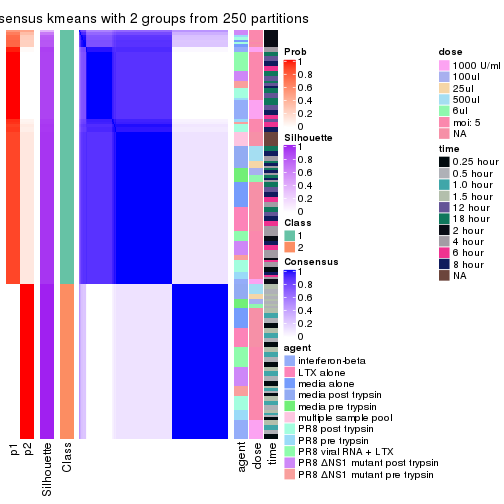</p>

</div>
<div id='tab-SD-kmeans-consensus-heatmap-2'>
<pre><code class="r">consensus_heatmap(res, k = 3)
</code></pre>

<p></p>

</div>
<div id='tab-SD-kmeans-consensus-heatmap-3'>
<pre><code class="r">consensus_heatmap(res, k = 4)
</code></pre>

<p></p>

</div>
<div id='tab-SD-kmeans-consensus-heatmap-4'>
<pre><code class="r">consensus_heatmap(res, k = 5)
</code></pre>

<p></p>

</div>
<div id='tab-SD-kmeans-consensus-heatmap-5'>
<pre><code class="r">consensus_heatmap(res, k = 6)
</code></pre>

<p></p>

</div>
</div>

Heatmaps for the membership of samples in all partitions to see how consistent they are:


<script>
$( function() {
	$( '#tabs-SD-kmeans-membership-heatmap' ).tabs();
} );
</script>
<div id='tabs-SD-kmeans-membership-heatmap'>
<ul>
<li><a href='#tab-SD-kmeans-membership-heatmap-1'>k = 2</a></li>
<li><a href='#tab-SD-kmeans-membership-heatmap-2'>k = 3</a></li>
<li><a href='#tab-SD-kmeans-membership-heatmap-3'>k = 4</a></li>
<li><a href='#tab-SD-kmeans-membership-heatmap-4'>k = 5</a></li>
<li><a href='#tab-SD-kmeans-membership-heatmap-5'>k = 6</a></li>
</ul>
<div id='tab-SD-kmeans-membership-heatmap-1'>
<pre><code class="r">membership_heatmap(res, k = 2)
</code></pre>

<p></p>

</div>
<div id='tab-SD-kmeans-membership-heatmap-2'>
<pre><code class="r">membership_heatmap(res, k = 3)
</code></pre>

<p></p>

</div>
<div id='tab-SD-kmeans-membership-heatmap-3'>
<pre><code class="r">membership_heatmap(res, k = 4)
</code></pre>

<p>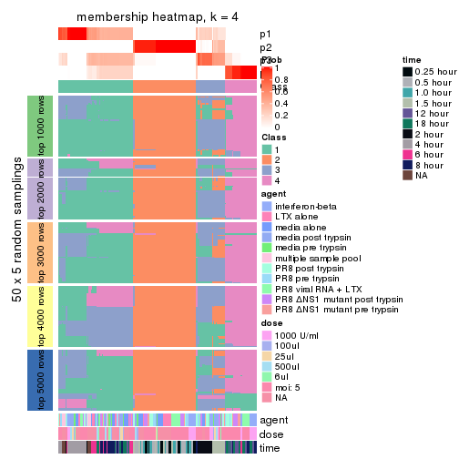</p>

</div>
<div id='tab-SD-kmeans-membership-heatmap-4'>
<pre><code class="r">membership_heatmap(res, k = 5)
</code></pre>

<p></p>

</div>
<div id='tab-SD-kmeans-membership-heatmap-5'>
<pre><code class="r">membership_heatmap(res, k = 6)
</code></pre>

<p></p>

</div>
</div>

As soon as we have had the classes for columns, we can look for signatures
which are significantly different between classes which can be candidate marks
for certain classes. Following are the heatmaps for signatures.


Signature heatmaps where rows are scaled:


<script>
$( function() {
	$( '#tabs-SD-kmeans-get-signatures' ).tabs();
} );
</script>
<div id='tabs-SD-kmeans-get-signatures'>
<ul>
<li><a href='#tab-SD-kmeans-get-signatures-1'>k = 2</a></li>
<li><a href='#tab-SD-kmeans-get-signatures-2'>k = 3</a></li>
<li><a href='#tab-SD-kmeans-get-signatures-3'>k = 4</a></li>
<li><a href='#tab-SD-kmeans-get-signatures-4'>k = 5</a></li>
<li><a href='#tab-SD-kmeans-get-signatures-5'>k = 6</a></li>
</ul>
<div id='tab-SD-kmeans-get-signatures-1'>
<pre><code class="r">get_signatures(res, k = 2)
</code></pre>

<pre><code>#&gt; Error in mat[ceiling(1:nr/h_ratio), ceiling(1:nc/w_ratio), drop = FALSE]: subscript out of bounds
</code></pre>

<p></p>

</div>
<div id='tab-SD-kmeans-get-signatures-2'>
<pre><code class="r">get_signatures(res, k = 3)
</code></pre>

<p></p>

</div>
<div id='tab-SD-kmeans-get-signatures-3'>
<pre><code class="r">get_signatures(res, k = 4)
</code></pre>

<p></p>

</div>
<div id='tab-SD-kmeans-get-signatures-4'>
<pre><code class="r">get_signatures(res, k = 5)
</code></pre>

<p>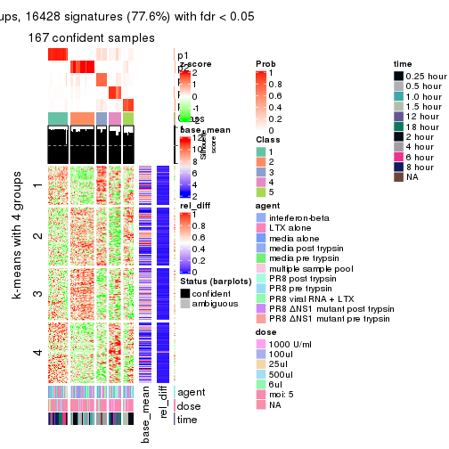</p>

</div>
<div id='tab-SD-kmeans-get-signatures-5'>
<pre><code class="r">get_signatures(res, k = 6)
</code></pre>

<pre><code>#&gt; Error in mat[ceiling(1:nr/h_ratio), ceiling(1:nc/w_ratio), drop = FALSE]: subscript out of bounds
</code></pre>

<p></p>

</div>
</div>


Signature heatmaps where rows are not scaled:


<script>
$( function() {
	$( '#tabs-SD-kmeans-get-signatures-no-scale' ).tabs();
} );
</script>
<div id='tabs-SD-kmeans-get-signatures-no-scale'>
<ul>
<li><a href='#tab-SD-kmeans-get-signatures-no-scale-1'>k = 2</a></li>
<li><a href='#tab-SD-kmeans-get-signatures-no-scale-2'>k = 3</a></li>
<li><a href='#tab-SD-kmeans-get-signatures-no-scale-3'>k = 4</a></li>
<li><a href='#tab-SD-kmeans-get-signatures-no-scale-4'>k = 5</a></li>
<li><a href='#tab-SD-kmeans-get-signatures-no-scale-5'>k = 6</a></li>
</ul>
<div id='tab-SD-kmeans-get-signatures-no-scale-1'>
<pre><code class="r">get_signatures(res, k = 2, scale_rows = FALSE)
</code></pre>

<pre><code>#&gt; Error in mat[ceiling(1:nr/h_ratio), ceiling(1:nc/w_ratio), drop = FALSE]: subscript out of bounds
</code></pre>

<p></p>

</div>
<div id='tab-SD-kmeans-get-signatures-no-scale-2'>
<pre><code class="r">get_signatures(res, k = 3, scale_rows = FALSE)
</code></pre>

<p></p>

</div>
<div id='tab-SD-kmeans-get-signatures-no-scale-3'>
<pre><code class="r">get_signatures(res, k = 4, scale_rows = FALSE)
</code></pre>

<p></p>

</div>
<div id='tab-SD-kmeans-get-signatures-no-scale-4'>
<pre><code class="r">get_signatures(res, k = 5, scale_rows = FALSE)
</code></pre>

<p></p>

</div>
<div id='tab-SD-kmeans-get-signatures-no-scale-5'>
<pre><code class="r">get_signatures(res, k = 6, scale_rows = FALSE)
</code></pre>

<pre><code>#&gt; Error in mat[ceiling(1:nr/h_ratio), ceiling(1:nc/w_ratio), drop = FALSE]: subscript out of bounds
</code></pre>

<p></p>

</div>
</div>


Compare the overlap of signatures from different k:

```r
compare_signatures(res)
```


`get_signature()` returns a data frame invisibly. TO get the list of signatures, the function
call should be assigned to a variable explicitly. In following code, if `plot` argument is set
to `FALSE`, no heatmap is plotted while only the differential analysis is performed.

```r
# code only for demonstration
tb = get_signature(res, k = ..., plot = FALSE)
```

An example of the output of `tb` is:

```
#>   which_row         fdr    mean_1    mean_2 scaled_mean_1 scaled_mean_2 km
#> 1        38 0.042760348  8.373488  9.131774    -0.5533452     0.5164555  1
#> 2        40 0.018707592  7.106213  8.469186    -0.6173731     0.5762149  1
#> 3        55 0.019134737 10.221463 11.207825    -0.6159697     0.5749050  1
#> 4        59 0.006059896  5.921854  7.869574    -0.6899429     0.6439467  1
#> 5        60 0.018055526  8.928898 10.211722    -0.6204761     0.5791110  1
#> 6        98 0.009384629 15.714769 14.887706     0.6635654    -0.6193277  2
...
```

The columns in `tb` are:

1. `which_row`: row indices corresponding to the input matrix.
2. `fdr`: FDR for the differential test. 
3. `mean_x`: The mean value in group x.
4. `scaled_mean_x`: The mean value in group x after rows are scaled.
5. `km`: Row groups if k-means clustering is applied to rows.


UMAP plot which shows how samples are separated.


<script>
$( function() {
	$( '#tabs-SD-kmeans-dimension-reduction' ).tabs();
} );
</script>
<div id='tabs-SD-kmeans-dimension-reduction'>
<ul>
<li><a href='#tab-SD-kmeans-dimension-reduction-1'>k = 2</a></li>
<li><a href='#tab-SD-kmeans-dimension-reduction-2'>k = 3</a></li>
<li><a href='#tab-SD-kmeans-dimension-reduction-3'>k = 4</a></li>
<li><a href='#tab-SD-kmeans-dimension-reduction-4'>k = 5</a></li>
<li><a href='#tab-SD-kmeans-dimension-reduction-5'>k = 6</a></li>
</ul>
<div id='tab-SD-kmeans-dimension-reduction-1'>
<pre><code class="r">dimension_reduction(res, k = 2, method = &quot;UMAP&quot;)
</code></pre>

<p></p>

</div>
<div id='tab-SD-kmeans-dimension-reduction-2'>
<pre><code class="r">dimension_reduction(res, k = 3, method = &quot;UMAP&quot;)
</code></pre>

<p></p>

</div>
<div id='tab-SD-kmeans-dimension-reduction-3'>
<pre><code class="r">dimension_reduction(res, k = 4, method = &quot;UMAP&quot;)
</code></pre>

<p></p>

</div>
<div id='tab-SD-kmeans-dimension-reduction-4'>
<pre><code class="r">dimension_reduction(res, k = 5, method = &quot;UMAP&quot;)
</code></pre>

<p></p>

</div>
<div id='tab-SD-kmeans-dimension-reduction-5'>
<pre><code class="r">dimension_reduction(res, k = 6, method = &quot;UMAP&quot;)
</code></pre>

<p></p>

</div>
</div>


Following heatmap shows how subgroups are split when increasing `k`:

```r
collect_classes(res)
```


Test correlation between subgroups and known annotations. If the known
annotation is numeric, one-way ANOVA test is applied, and if the known
annotation is discrete, chi-squared contingency table test is applied.

```r
test_to_known_factors(res)
```

```
#>             n agent(p)  dose(p)  time(p) k
#> SD:kmeans 168  0.90117 0.999961 2.29e-29 2
#> SD:kmeans 161  0.00872 0.001702 4.50e-33 3
#> SD:kmeans 141  0.00435 0.000542 1.21e-40 4
#> SD:kmeans 167  0.02873 0.013444 3.09e-73 5
#> SD:kmeans 168  0.02563 0.012512 9.35e-74 6
```


If matrix rows can be associated to genes, consider to use `GO_Enrichment(res,
...)` to perform function enrichment for the signature genes.


 

---------------------------------------------------


### SD:skmeans*


The object with results only for a single top-value method and a single partition method 
can be extracted as:

```r
res = res_list["SD", "skmeans"]
# you can also extract it by
# res = res_list["SD:skmeans"]
```

A summary of `res` and all the functions that can be applied to it:

```r
res
```

```
#> A 'ConsensusPartition' object with k = 2, 3, 4, 5, 6.
#>   On a matrix with 21163 rows and 169 columns.
#>   Top rows (1000, 2000, 3000, 4000, 5000) are extracted by 'SD' method.
#>   Subgroups are detected by 'skmeans' method.
#>   Performed in total 1250 partitions by row resampling.
#>   Best k for subgroups seems to be 6.
#> 
#> Following methods can be applied to this 'ConsensusPartition' object:
#>  [1] "cola_report"             "collect_classes"         "collect_plots"          
#>  [4] "collect_stats"           "colnames"                "compare_signatures"     
#>  [7] "consensus_heatmap"       "dimension_reduction"     "functional_enrichment"  
#> [10] "get_anno_col"            "get_anno"                "get_classes"            
#> [13] "get_consensus"           "get_matrix"              "get_membership"         
#> [16] "get_param"               "get_signatures"          "get_stats"              
#> [19] "is_best_k"               "is_stable_k"             "membership_heatmap"     
#> [22] "ncol"                    "nrow"                    "plot_ecdf"              
#> [25] "rownames"                "select_partition_number" "show"                   
#> [28] "suggest_best_k"          "test_to_known_factors"
```

`collect_plots()` function collects all the plots made from `res` for all `k` (number of partitions)
into one single page to provide an easy and fast comparison between different `k`.

```r
collect_plots(res)
```


The plots are:

- The first row: a plot of the ECDF (Empirical cumulative distribution
  function) curves of the consensus matrix for each `k` and the heatmap of
  predicted classes for each `k`.
- The second row: heatmaps of the consensus matrix for each `k`.
- The third row: heatmaps of the membership matrix for each `k`.
- The fouth row: heatmaps of the signatures for each `k`.

All the plots in panels can be made by individual functions and they are
plotted later in this section.

`select_partition_number()` produces several plots showing different
statistics for choosing "optimized" `k`. There are following statistics:

- ECDF curves of the consensus matrix for each `k`;
- 1-PAC. [The PAC
  score](https://en.wikipedia.org/wiki/Consensus_clustering#Over-interpretation_potential_of_consensus_clustering)
  measures the proportion of the ambiguous subgrouping.
- Mean silhouette score.
- Concordance. The mean probability of fiting the consensus class ids in all
  partitions.
- Area increased. Denote $A_k$ as the area under the ECDF curve for current
  `k`, the area increased is defined as $A_k - A_{k-1}$.
- Rand index. The percent of pairs of samples that are both in a same cluster
  or both are not in a same cluster in the partition of k and k-1.
- Jaccard index. The ratio of pairs of samples are both in a same cluster in
  the partition of k and k-1 and the pairs of samples are both in a same
  cluster in the partition k or k-1.

The detailed explanations of these statistics can be found in [the cola
vignette](http://bioconductor.org/packages/devel/bioc/vignettes/cola/inst/doc/cola.html#toc_13).

Generally speaking, lower PAC score, higher mean silhouette score or higher
concordance corresponds to better partition. Rand index and Jaccard index
measure how similar the current partition is compared to partition with `k-1`.
If they are too similar, we won't accept `k` is better than `k-1`.

```r
select_partition_number(res)
```


The numeric values for all these statistics can be obtained by `get_stats()`.

```r
get_stats(res)
```

```
#>   k 1-PAC mean_silhouette concordance area_increased  Rand Jaccard
#> 2 2 1.000           0.977       0.990         0.4878 0.512   0.512
#> 3 3 0.835           0.927       0.953         0.3569 0.785   0.595
#> 4 4 0.795           0.880       0.895         0.1031 0.897   0.707
#> 5 5 0.997           0.961       0.978         0.0720 0.923   0.725
#> 6 6 0.949           0.882       0.898         0.0292 0.972   0.875
```

`suggest_best_k()` suggests the best $k$ based on these statistics. The rules are as follows:

- All $k$ with Jaccard index larger than 0.95 are removed because the increase of
  the partition number does not provides enough extra information. If all $k$ are removed,
  the best $k$ is assigned by `NA`.
- For $k$ with 1-PAC larger than 0.9, the maximal $k$ is taken as the "best k". Other $k$ is called "optional k".
- If it does not fit the second rule. The $k$ with the highest vote of highest
  1-PAC, mean silhouette and concordance is taken as the "best k".

```r
suggest_best_k(res)
```

```
#> [1] 6
#> attr(,"optional")
#> [1] 2 5
```

There is also optional best $k$ = 2 5 that is worth to check.

Following shows the table of the partitions (You need to click the **show/hide
code output** link to see it). The membership matrix (columns with name `p*`)
is inferred by
[`clue::cl_consensus()`](https://www.rdocumentation.org/link/cl_consensus?package=clue)
function with the `SE` method. Basically the value in the membership matrix
represents the probability to belong to a certain group. The finall class
label for an item is determined with the group with highest probability it
belongs to.

In `get_classes()` function, the entropy is calculated from the membership
matrix and the silhouette score is calculated from the consensus matrix.


<script>
$( function() {
	$( '#tabs-SD-skmeans-get-classes' ).tabs();
} );
</script>
<div id='tabs-SD-skmeans-get-classes'>
<ul>
<li><a href='#tab-SD-skmeans-get-classes-1'>k = 2</a></li>
<li><a href='#tab-SD-skmeans-get-classes-2'>k = 3</a></li>
<li><a href='#tab-SD-skmeans-get-classes-3'>k = 4</a></li>
<li><a href='#tab-SD-skmeans-get-classes-4'>k = 5</a></li>
<li><a href='#tab-SD-skmeans-get-classes-5'>k = 6</a></li>
</ul>

<div id='tab-SD-skmeans-get-classes-1'>
<p><a id='tab-SD-skmeans-get-classes-1-a' style='color:#0366d6' href='#'>show/hide code output</a></p>
<pre><code class="r">cbind(get_classes(res, k = 2), get_membership(res, k = 2))
</code></pre>

<pre><code>#&gt;           class entropy silhouette    p1    p2
#&gt; GSM528681     2   0.000      0.985 0.000 1.000
#&gt; GSM528682     2   0.000      0.985 0.000 1.000
#&gt; GSM528683     2   0.000      0.985 0.000 1.000
#&gt; GSM528684     2   0.000      0.985 0.000 1.000
#&gt; GSM528687     2   0.000      0.985 0.000 1.000
#&gt; GSM528688     2   0.000      0.985 0.000 1.000
#&gt; GSM528685     2   0.000      0.985 0.000 1.000
#&gt; GSM528686     2   0.000      0.985 0.000 1.000
#&gt; GSM528693     1   0.000      0.992 1.000 0.000
#&gt; GSM528694     1   0.000      0.992 1.000 0.000
#&gt; GSM528695     1   0.000      0.992 1.000 0.000
#&gt; GSM528696     1   0.000      0.992 1.000 0.000
#&gt; GSM528697     1   0.000      0.992 1.000 0.000
#&gt; GSM528698     1   0.000      0.992 1.000 0.000
#&gt; GSM528699     1   0.000      0.992 1.000 0.000
#&gt; GSM528700     1   0.000      0.992 1.000 0.000
#&gt; GSM528689     1   0.000      0.992 1.000 0.000
#&gt; GSM528690     1   0.000      0.992 1.000 0.000
#&gt; GSM528691     1   0.000      0.992 1.000 0.000
#&gt; GSM528692     1   0.000      0.992 1.000 0.000
#&gt; GSM528779     2   0.000      0.985 0.000 1.000
#&gt; GSM528780     2   0.000      0.985 0.000 1.000
#&gt; GSM528782     2   0.000      0.985 0.000 1.000
#&gt; GSM528781     2   0.000      0.985 0.000 1.000
#&gt; GSM528785     2   0.795      0.691 0.240 0.760
#&gt; GSM528786     1   0.000      0.992 1.000 0.000
#&gt; GSM528787     1   0.000      0.992 1.000 0.000
#&gt; GSM528788     1   0.000      0.992 1.000 0.000
#&gt; GSM528783     1   0.000      0.992 1.000 0.000
#&gt; GSM528784     1   0.000      0.992 1.000 0.000
#&gt; GSM528759     1   0.000      0.992 1.000 0.000
#&gt; GSM528760     1   0.000      0.992 1.000 0.000
#&gt; GSM528761     2   0.000      0.985 0.000 1.000
#&gt; GSM528762     2   0.000      0.985 0.000 1.000
#&gt; GSM528765     2   0.000      0.985 0.000 1.000
#&gt; GSM528766     2   0.000      0.985 0.000 1.000
#&gt; GSM528763     2   0.000      0.985 0.000 1.000
#&gt; GSM528764     2   0.000      0.985 0.000 1.000
#&gt; GSM528771     2   0.753      0.729 0.216 0.784
#&gt; GSM528772     2   0.795      0.691 0.240 0.760
#&gt; GSM528773     1   0.000      0.992 1.000 0.000
#&gt; GSM528774     1   0.000      0.992 1.000 0.000
#&gt; GSM528775     1   0.000      0.992 1.000 0.000
#&gt; GSM528776     1   0.000      0.992 1.000 0.000
#&gt; GSM528777     1   0.000      0.992 1.000 0.000
#&gt; GSM528778     1   0.000      0.992 1.000 0.000
#&gt; GSM528767     1   0.000      0.992 1.000 0.000
#&gt; GSM528768     1   0.000      0.992 1.000 0.000
#&gt; GSM528769     1   0.000      0.992 1.000 0.000
#&gt; GSM528770     1   0.000      0.992 1.000 0.000
#&gt; GSM528671     2   0.000      0.985 0.000 1.000
#&gt; GSM528672     2   0.000      0.985 0.000 1.000
#&gt; GSM528674     2   0.000      0.985 0.000 1.000
#&gt; GSM528673     2   0.000      0.985 0.000 1.000
#&gt; GSM528677     1   0.689      0.775 0.816 0.184
#&gt; GSM528678     1   0.000      0.992 1.000 0.000
#&gt; GSM528679     1   0.000      0.992 1.000 0.000
#&gt; GSM528680     1   0.000      0.992 1.000 0.000
#&gt; GSM528675     1   0.000      0.992 1.000 0.000
#&gt; GSM528676     1   0.000      0.992 1.000 0.000
#&gt; GSM528651     2   0.000      0.985 0.000 1.000
#&gt; GSM528652     2   0.000      0.985 0.000 1.000
#&gt; GSM528653     2   0.000      0.985 0.000 1.000
#&gt; GSM528654     2   0.000      0.985 0.000 1.000
#&gt; GSM528657     2   0.000      0.985 0.000 1.000
#&gt; GSM528658     2   0.000      0.985 0.000 1.000
#&gt; GSM528655     2   0.000      0.985 0.000 1.000
#&gt; GSM528656     2   0.000      0.985 0.000 1.000
#&gt; GSM528663     2   0.000      0.985 0.000 1.000
#&gt; GSM528664     2   0.000      0.985 0.000 1.000
#&gt; GSM528665     1   0.000      0.992 1.000 0.000
#&gt; GSM528666     1   0.000      0.992 1.000 0.000
#&gt; GSM528667     1   0.000      0.992 1.000 0.000
#&gt; GSM528668     1   0.000      0.992 1.000 0.000
#&gt; GSM528669     1   0.000      0.992 1.000 0.000
#&gt; GSM528670     1   0.000      0.992 1.000 0.000
#&gt; GSM528659     1   0.000      0.992 1.000 0.000
#&gt; GSM528660     1   0.000      0.992 1.000 0.000
#&gt; GSM528661     1   0.000      0.992 1.000 0.000
#&gt; GSM528662     1   0.000      0.992 1.000 0.000
#&gt; GSM528701     2   0.000      0.985 0.000 1.000
#&gt; GSM528702     2   0.000      0.985 0.000 1.000
#&gt; GSM528703     2   0.000      0.985 0.000 1.000
#&gt; GSM528704     2   0.000      0.985 0.000 1.000
#&gt; GSM528707     2   0.000      0.985 0.000 1.000
#&gt; GSM528708     2   0.000      0.985 0.000 1.000
#&gt; GSM528705     2   0.000      0.985 0.000 1.000
#&gt; GSM528706     2   0.000      0.985 0.000 1.000
#&gt; GSM528713     1   0.653      0.798 0.832 0.168
#&gt; GSM528714     1   0.671      0.786 0.824 0.176
#&gt; GSM528715     1   0.000      0.992 1.000 0.000
#&gt; GSM528716     1   0.000      0.992 1.000 0.000
#&gt; GSM528717     1   0.000      0.992 1.000 0.000
#&gt; GSM528718     1   0.000      0.992 1.000 0.000
#&gt; GSM528719     1   0.000      0.992 1.000 0.000
#&gt; GSM528720     1   0.000      0.992 1.000 0.000
#&gt; GSM528709     1   0.000      0.992 1.000 0.000
#&gt; GSM528710     1   0.000      0.992 1.000 0.000
#&gt; GSM528711     1   0.000      0.992 1.000 0.000
#&gt; GSM528712     1   0.000      0.992 1.000 0.000
#&gt; GSM528721     2   0.000      0.985 0.000 1.000
#&gt; GSM528722     2   0.000      0.985 0.000 1.000
#&gt; GSM528723     2   0.000      0.985 0.000 1.000
#&gt; GSM528724     2   0.000      0.985 0.000 1.000
#&gt; GSM528727     2   0.000      0.985 0.000 1.000
#&gt; GSM528728     2   0.000      0.985 0.000 1.000
#&gt; GSM528725     2   0.000      0.985 0.000 1.000
#&gt; GSM528726     2   0.000      0.985 0.000 1.000
#&gt; GSM528733     1   0.000      0.992 1.000 0.000
#&gt; GSM528734     1   0.000      0.992 1.000 0.000
#&gt; GSM528735     1   0.000      0.992 1.000 0.000
#&gt; GSM528736     1   0.000      0.992 1.000 0.000
#&gt; GSM528737     1   0.000      0.992 1.000 0.000
#&gt; GSM528738     1   0.000      0.992 1.000 0.000
#&gt; GSM528729     1   0.000      0.992 1.000 0.000
#&gt; GSM528730     1   0.000      0.992 1.000 0.000
#&gt; GSM528731     1   0.000      0.992 1.000 0.000
#&gt; GSM528732     1   0.000      0.992 1.000 0.000
#&gt; GSM528739     2   0.000      0.985 0.000 1.000
#&gt; GSM528740     2   0.000      0.985 0.000 1.000
#&gt; GSM528741     2   0.000      0.985 0.000 1.000
#&gt; GSM528742     2   0.000      0.985 0.000 1.000
#&gt; GSM528745     2   0.000      0.985 0.000 1.000
#&gt; GSM528746     2   0.000      0.985 0.000 1.000
#&gt; GSM528743     2   0.000      0.985 0.000 1.000
#&gt; GSM528744     2   0.000      0.985 0.000 1.000
#&gt; GSM528751     2   0.866      0.604 0.288 0.712
#&gt; GSM528752     1   0.795      0.684 0.760 0.240
#&gt; GSM528753     1   0.000      0.992 1.000 0.000
#&gt; GSM528754     1   0.000      0.992 1.000 0.000
#&gt; GSM528755     1   0.000      0.992 1.000 0.000
#&gt; GSM528756     1   0.000      0.992 1.000 0.000
#&gt; GSM528757     1   0.000      0.992 1.000 0.000
#&gt; GSM528758     1   0.000      0.992 1.000 0.000
#&gt; GSM528747     1   0.000      0.992 1.000 0.000
#&gt; GSM528748     1   0.000      0.992 1.000 0.000
#&gt; GSM528749     1   0.000      0.992 1.000 0.000
#&gt; GSM528750     1   0.000      0.992 1.000 0.000
#&gt; GSM528640     2   0.000      0.985 0.000 1.000
#&gt; GSM528641     2   0.000      0.985 0.000 1.000
#&gt; GSM528643     1   0.000      0.992 1.000 0.000
#&gt; GSM528644     1   0.000      0.992 1.000 0.000
#&gt; GSM528642     1   0.000      0.992 1.000 0.000
#&gt; GSM528620     2   0.000      0.985 0.000 1.000
#&gt; GSM528621     2   0.000      0.985 0.000 1.000
#&gt; GSM528623     1   0.000      0.992 1.000 0.000
#&gt; GSM528624     1   0.000      0.992 1.000 0.000
#&gt; GSM528622     1   0.000      0.992 1.000 0.000
#&gt; GSM528625     2   0.000      0.985 0.000 1.000
#&gt; GSM528626     2   0.000      0.985 0.000 1.000
#&gt; GSM528628     1   0.000      0.992 1.000 0.000
#&gt; GSM528629     1   0.000      0.992 1.000 0.000
#&gt; GSM528627     1   0.000      0.992 1.000 0.000
#&gt; GSM528630     2   0.000      0.985 0.000 1.000
#&gt; GSM528631     2   0.000      0.985 0.000 1.000
#&gt; GSM528632     2   0.000      0.985 0.000 1.000
#&gt; GSM528633     2   0.000      0.985 0.000 1.000
#&gt; GSM528636     1   0.000      0.992 1.000 0.000
#&gt; GSM528637     1   0.000      0.992 1.000 0.000
#&gt; GSM528638     1   0.000      0.992 1.000 0.000
#&gt; GSM528639     1   0.000      0.992 1.000 0.000
#&gt; GSM528634     1   0.000      0.992 1.000 0.000
#&gt; GSM528635     1   0.000      0.992 1.000 0.000
#&gt; GSM528645     1   0.000      0.992 1.000 0.000
#&gt; GSM528646     1   0.000      0.992 1.000 0.000
#&gt; GSM528647     1   0.000      0.992 1.000 0.000
#&gt; GSM528648     1   0.000      0.992 1.000 0.000
#&gt; GSM528649     1   0.000      0.992 1.000 0.000
#&gt; GSM528650     1   0.000      0.992 1.000 0.000
</code></pre>

<script>
$('#tab-SD-skmeans-get-classes-1-a').parent().next().next().hide();
$('#tab-SD-skmeans-get-classes-1-a').click(function(){
  $('#tab-SD-skmeans-get-classes-1-a').parent().next().next().toggle();
  return(false);
});
</script>
</div>

<div id='tab-SD-skmeans-get-classes-2'>
<p><a id='tab-SD-skmeans-get-classes-2-a' style='color:#0366d6' href='#'>show/hide code output</a></p>
<pre><code class="r">cbind(get_classes(res, k = 3), get_membership(res, k = 3))
</code></pre>

<pre><code>#&gt;           class entropy silhouette    p1    p2    p3
#&gt; GSM528681     2  0.0000      1.000 0.000 1.000 0.000
#&gt; GSM528682     2  0.0000      1.000 0.000 1.000 0.000
#&gt; GSM528683     2  0.0000      1.000 0.000 1.000 0.000
#&gt; GSM528684     2  0.0000      1.000 0.000 1.000 0.000
#&gt; GSM528687     2  0.0000      1.000 0.000 1.000 0.000
#&gt; GSM528688     2  0.0000      1.000 0.000 1.000 0.000
#&gt; GSM528685     2  0.0000      1.000 0.000 1.000 0.000
#&gt; GSM528686     2  0.0000      1.000 0.000 1.000 0.000
#&gt; GSM528693     3  0.4555      0.764 0.200 0.000 0.800
#&gt; GSM528694     3  0.4555      0.764 0.200 0.000 0.800
#&gt; GSM528695     3  0.4605      0.760 0.204 0.000 0.796
#&gt; GSM528696     3  0.4605      0.760 0.204 0.000 0.796
#&gt; GSM528697     1  0.0000      0.897 1.000 0.000 0.000
#&gt; GSM528698     1  0.0000      0.897 1.000 0.000 0.000
#&gt; GSM528699     1  0.0000      0.897 1.000 0.000 0.000
#&gt; GSM528700     1  0.0000      0.897 1.000 0.000 0.000
#&gt; GSM528689     1  0.0000      0.897 1.000 0.000 0.000
#&gt; GSM528690     1  0.0000      0.897 1.000 0.000 0.000
#&gt; GSM528691     1  0.0000      0.897 1.000 0.000 0.000
#&gt; GSM528692     1  0.0000      0.897 1.000 0.000 0.000
#&gt; GSM528779     2  0.0000      1.000 0.000 1.000 0.000
#&gt; GSM528780     2  0.0000      1.000 0.000 1.000 0.000
#&gt; GSM528782     2  0.0000      1.000 0.000 1.000 0.000
#&gt; GSM528781     2  0.0000      1.000 0.000 1.000 0.000
#&gt; GSM528785     3  0.4555      0.767 0.000 0.200 0.800
#&gt; GSM528786     3  0.0000      0.931 0.000 0.000 1.000
#&gt; GSM528787     3  0.0000      0.931 0.000 0.000 1.000
#&gt; GSM528788     1  0.4605      0.863 0.796 0.000 0.204
#&gt; GSM528783     1  0.0000      0.897 1.000 0.000 0.000
#&gt; GSM528784     1  0.0000      0.897 1.000 0.000 0.000
#&gt; GSM528759     3  0.0000      0.931 0.000 0.000 1.000
#&gt; GSM528760     3  0.0000      0.931 0.000 0.000 1.000
#&gt; GSM528761     2  0.0000      1.000 0.000 1.000 0.000
#&gt; GSM528762     2  0.0000      1.000 0.000 1.000 0.000
#&gt; GSM528765     2  0.0000      1.000 0.000 1.000 0.000
#&gt; GSM528766     2  0.0000      1.000 0.000 1.000 0.000
#&gt; GSM528763     2  0.0000      1.000 0.000 1.000 0.000
#&gt; GSM528764     2  0.0000      1.000 0.000 1.000 0.000
#&gt; GSM528771     3  0.4555      0.767 0.000 0.200 0.800
#&gt; GSM528772     3  0.4504      0.772 0.000 0.196 0.804
#&gt; GSM528773     3  0.0000      0.931 0.000 0.000 1.000
#&gt; GSM528774     3  0.0000      0.931 0.000 0.000 1.000
#&gt; GSM528775     3  0.0000      0.931 0.000 0.000 1.000
#&gt; GSM528776     1  0.4605      0.863 0.796 0.000 0.204
#&gt; GSM528777     1  0.0000      0.897 1.000 0.000 0.000
#&gt; GSM528778     1  0.0000      0.897 1.000 0.000 0.000
#&gt; GSM528767     1  0.0000      0.897 1.000 0.000 0.000
#&gt; GSM528768     1  0.0000      0.897 1.000 0.000 0.000
#&gt; GSM528769     1  0.0000      0.897 1.000 0.000 0.000
#&gt; GSM528770     1  0.0000      0.897 1.000 0.000 0.000
#&gt; GSM528671     2  0.0000      1.000 0.000 1.000 0.000
#&gt; GSM528672     2  0.0000      1.000 0.000 1.000 0.000
#&gt; GSM528674     2  0.0000      1.000 0.000 1.000 0.000
#&gt; GSM528673     2  0.0000      1.000 0.000 1.000 0.000
#&gt; GSM528677     3  0.0000      0.931 0.000 0.000 1.000
#&gt; GSM528678     3  0.0000      0.931 0.000 0.000 1.000
#&gt; GSM528679     1  0.4605      0.863 0.796 0.000 0.204
#&gt; GSM528680     1  0.0000      0.897 1.000 0.000 0.000
#&gt; GSM528675     1  0.0000      0.897 1.000 0.000 0.000
#&gt; GSM528676     1  0.0000      0.897 1.000 0.000 0.000
#&gt; GSM528651     2  0.0000      1.000 0.000 1.000 0.000
#&gt; GSM528652     2  0.0000      1.000 0.000 1.000 0.000
#&gt; GSM528653     2  0.0000      1.000 0.000 1.000 0.000
#&gt; GSM528654     2  0.0000      1.000 0.000 1.000 0.000
#&gt; GSM528657     2  0.0000      1.000 0.000 1.000 0.000
#&gt; GSM528658     2  0.0000      1.000 0.000 1.000 0.000
#&gt; GSM528655     2  0.0000      1.000 0.000 1.000 0.000
#&gt; GSM528656     2  0.0000      1.000 0.000 1.000 0.000
#&gt; GSM528663     3  0.4605      0.761 0.000 0.204 0.796
#&gt; GSM528664     3  0.4605      0.761 0.000 0.204 0.796
#&gt; GSM528665     3  0.0000      0.931 0.000 0.000 1.000
#&gt; GSM528666     3  0.0000      0.931 0.000 0.000 1.000
#&gt; GSM528667     1  0.4605      0.863 0.796 0.000 0.204
#&gt; GSM528668     1  0.4605      0.863 0.796 0.000 0.204
#&gt; GSM528669     1  0.0000      0.897 1.000 0.000 0.000
#&gt; GSM528670     1  0.0000      0.897 1.000 0.000 0.000
#&gt; GSM528659     1  0.0000      0.897 1.000 0.000 0.000
#&gt; GSM528660     1  0.0000      0.897 1.000 0.000 0.000
#&gt; GSM528661     1  0.0000      0.897 1.000 0.000 0.000
#&gt; GSM528662     1  0.0000      0.897 1.000 0.000 0.000
#&gt; GSM528701     2  0.0000      1.000 0.000 1.000 0.000
#&gt; GSM528702     2  0.0000      1.000 0.000 1.000 0.000
#&gt; GSM528703     2  0.0000      1.000 0.000 1.000 0.000
#&gt; GSM528704     2  0.0000      1.000 0.000 1.000 0.000
#&gt; GSM528707     2  0.0000      1.000 0.000 1.000 0.000
#&gt; GSM528708     2  0.0000      1.000 0.000 1.000 0.000
#&gt; GSM528705     2  0.0000      1.000 0.000 1.000 0.000
#&gt; GSM528706     2  0.0000      1.000 0.000 1.000 0.000
#&gt; GSM528713     3  0.0000      0.931 0.000 0.000 1.000
#&gt; GSM528714     3  0.0000      0.931 0.000 0.000 1.000
#&gt; GSM528715     3  0.0000      0.931 0.000 0.000 1.000
#&gt; GSM528716     3  0.0000      0.931 0.000 0.000 1.000
#&gt; GSM528717     1  0.0237      0.897 0.996 0.000 0.004
#&gt; GSM528718     1  0.0424      0.896 0.992 0.000 0.008
#&gt; GSM528719     1  0.0000      0.897 1.000 0.000 0.000
#&gt; GSM528720     1  0.0000      0.897 1.000 0.000 0.000
#&gt; GSM528709     1  0.0000      0.897 1.000 0.000 0.000
#&gt; GSM528710     1  0.0000      0.897 1.000 0.000 0.000
#&gt; GSM528711     1  0.0000      0.897 1.000 0.000 0.000
#&gt; GSM528712     1  0.0000      0.897 1.000 0.000 0.000
#&gt; GSM528721     2  0.0000      1.000 0.000 1.000 0.000
#&gt; GSM528722     2  0.0000      1.000 0.000 1.000 0.000
#&gt; GSM528723     2  0.0000      1.000 0.000 1.000 0.000
#&gt; GSM528724     2  0.0000      1.000 0.000 1.000 0.000
#&gt; GSM528727     2  0.0000      1.000 0.000 1.000 0.000
#&gt; GSM528728     2  0.0000      1.000 0.000 1.000 0.000
#&gt; GSM528725     2  0.0000      1.000 0.000 1.000 0.000
#&gt; GSM528726     2  0.0000      1.000 0.000 1.000 0.000
#&gt; GSM528733     3  0.0000      0.931 0.000 0.000 1.000
#&gt; GSM528734     3  0.0000      0.931 0.000 0.000 1.000
#&gt; GSM528735     3  0.0000      0.931 0.000 0.000 1.000
#&gt; GSM528736     3  0.0000      0.931 0.000 0.000 1.000
#&gt; GSM528737     1  0.4605      0.863 0.796 0.000 0.204
#&gt; GSM528738     1  0.4605      0.863 0.796 0.000 0.204
#&gt; GSM528729     1  0.4605      0.863 0.796 0.000 0.204
#&gt; GSM528730     1  0.4605      0.863 0.796 0.000 0.204
#&gt; GSM528731     1  0.4605      0.863 0.796 0.000 0.204
#&gt; GSM528732     1  0.4605      0.863 0.796 0.000 0.204
#&gt; GSM528739     2  0.0000      1.000 0.000 1.000 0.000
#&gt; GSM528740     2  0.0000      1.000 0.000 1.000 0.000
#&gt; GSM528741     2  0.0000      1.000 0.000 1.000 0.000
#&gt; GSM528742     2  0.0000      1.000 0.000 1.000 0.000
#&gt; GSM528745     2  0.0000      1.000 0.000 1.000 0.000
#&gt; GSM528746     2  0.0000      1.000 0.000 1.000 0.000
#&gt; GSM528743     2  0.0000      1.000 0.000 1.000 0.000
#&gt; GSM528744     2  0.0000      1.000 0.000 1.000 0.000
#&gt; GSM528751     3  0.4504      0.772 0.000 0.196 0.804
#&gt; GSM528752     3  0.4504      0.772 0.000 0.196 0.804
#&gt; GSM528753     3  0.0000      0.931 0.000 0.000 1.000
#&gt; GSM528754     3  0.0000      0.931 0.000 0.000 1.000
#&gt; GSM528755     3  0.0000      0.931 0.000 0.000 1.000
#&gt; GSM528756     3  0.0000      0.931 0.000 0.000 1.000
#&gt; GSM528757     1  0.4605      0.863 0.796 0.000 0.204
#&gt; GSM528758     1  0.4605      0.863 0.796 0.000 0.204
#&gt; GSM528747     1  0.4605      0.863 0.796 0.000 0.204
#&gt; GSM528748     1  0.4605      0.863 0.796 0.000 0.204
#&gt; GSM528749     1  0.4605      0.863 0.796 0.000 0.204
#&gt; GSM528750     1  0.4605      0.863 0.796 0.000 0.204
#&gt; GSM528640     2  0.0000      1.000 0.000 1.000 0.000
#&gt; GSM528641     2  0.0000      1.000 0.000 1.000 0.000
#&gt; GSM528643     3  0.0000      0.931 0.000 0.000 1.000
#&gt; GSM528644     1  0.4605      0.863 0.796 0.000 0.204
#&gt; GSM528642     1  0.4605      0.863 0.796 0.000 0.204
#&gt; GSM528620     2  0.0000      1.000 0.000 1.000 0.000
#&gt; GSM528621     3  0.5465      0.637 0.000 0.288 0.712
#&gt; GSM528623     3  0.0000      0.931 0.000 0.000 1.000
#&gt; GSM528624     1  0.4605      0.863 0.796 0.000 0.204
#&gt; GSM528622     1  0.4605      0.863 0.796 0.000 0.204
#&gt; GSM528625     2  0.0000      1.000 0.000 1.000 0.000
#&gt; GSM528626     2  0.0000      1.000 0.000 1.000 0.000
#&gt; GSM528628     3  0.0000      0.931 0.000 0.000 1.000
#&gt; GSM528629     1  0.4605      0.863 0.796 0.000 0.204
#&gt; GSM528627     1  0.4605      0.863 0.796 0.000 0.204
#&gt; GSM528630     2  0.0000      1.000 0.000 1.000 0.000
#&gt; GSM528631     2  0.0000      1.000 0.000 1.000 0.000
#&gt; GSM528632     2  0.0000      1.000 0.000 1.000 0.000
#&gt; GSM528633     2  0.0000      1.000 0.000 1.000 0.000
#&gt; GSM528636     3  0.0000      0.931 0.000 0.000 1.000
#&gt; GSM528637     3  0.0000      0.931 0.000 0.000 1.000
#&gt; GSM528638     1  0.4605      0.863 0.796 0.000 0.204
#&gt; GSM528639     1  0.4605      0.863 0.796 0.000 0.204
#&gt; GSM528634     1  0.4702      0.855 0.788 0.000 0.212
#&gt; GSM528635     1  0.4605      0.863 0.796 0.000 0.204
#&gt; GSM528645     3  0.0000      0.931 0.000 0.000 1.000
#&gt; GSM528646     3  0.0000      0.931 0.000 0.000 1.000
#&gt; GSM528647     3  0.0000      0.931 0.000 0.000 1.000
#&gt; GSM528648     3  0.0000      0.931 0.000 0.000 1.000
#&gt; GSM528649     3  0.0000      0.931 0.000 0.000 1.000
#&gt; GSM528650     3  0.0000      0.931 0.000 0.000 1.000
</code></pre>

<script>
$('#tab-SD-skmeans-get-classes-2-a').parent().next().next().hide();
$('#tab-SD-skmeans-get-classes-2-a').click(function(){
  $('#tab-SD-skmeans-get-classes-2-a').parent().next().next().toggle();
  return(false);
});
</script>
</div>

<div id='tab-SD-skmeans-get-classes-3'>
<p><a id='tab-SD-skmeans-get-classes-3-a' style='color:#0366d6' href='#'>show/hide code output</a></p>
<pre><code class="r">cbind(get_classes(res, k = 4), get_membership(res, k = 4))
</code></pre>

<pre><code>#&gt;           class entropy silhouette    p1    p2    p3    p4
#&gt; GSM528681     2  0.0000      0.958 0.000 1.000 0.000 0.000
#&gt; GSM528682     2  0.0000      0.958 0.000 1.000 0.000 0.000
#&gt; GSM528683     2  0.0000      0.958 0.000 1.000 0.000 0.000
#&gt; GSM528684     2  0.0000      0.958 0.000 1.000 0.000 0.000
#&gt; GSM528687     2  0.0000      0.958 0.000 1.000 0.000 0.000
#&gt; GSM528688     2  0.0000      0.958 0.000 1.000 0.000 0.000
#&gt; GSM528685     2  0.4543      0.658 0.000 0.676 0.324 0.000
#&gt; GSM528686     2  0.4605      0.642 0.000 0.664 0.336 0.000
#&gt; GSM528693     3  0.0000      0.744 0.000 0.000 1.000 0.000
#&gt; GSM528694     3  0.0000      0.744 0.000 0.000 1.000 0.000
#&gt; GSM528695     3  0.6602      0.678 0.164 0.000 0.628 0.208
#&gt; GSM528696     3  0.6602      0.678 0.164 0.000 0.628 0.208
#&gt; GSM528697     4  0.0000      1.000 0.000 0.000 0.000 1.000
#&gt; GSM528698     4  0.0000      1.000 0.000 0.000 0.000 1.000
#&gt; GSM528699     4  0.0000      1.000 0.000 0.000 0.000 1.000
#&gt; GSM528700     4  0.0000      1.000 0.000 0.000 0.000 1.000
#&gt; GSM528689     4  0.0000      1.000 0.000 0.000 0.000 1.000
#&gt; GSM528690     4  0.0000      1.000 0.000 0.000 0.000 1.000
#&gt; GSM528691     4  0.0000      1.000 0.000 0.000 0.000 1.000
#&gt; GSM528692     4  0.0000      1.000 0.000 0.000 0.000 1.000
#&gt; GSM528779     2  0.0000      0.958 0.000 1.000 0.000 0.000
#&gt; GSM528780     2  0.0000      0.958 0.000 1.000 0.000 0.000
#&gt; GSM528782     2  0.0000      0.958 0.000 1.000 0.000 0.000
#&gt; GSM528781     2  0.0000      0.958 0.000 1.000 0.000 0.000
#&gt; GSM528785     3  0.0469      0.739 0.012 0.000 0.988 0.000
#&gt; GSM528786     3  0.4713      0.826 0.360 0.000 0.640 0.000
#&gt; GSM528787     3  0.4543      0.818 0.324 0.000 0.676 0.000
#&gt; GSM528788     1  0.3172      0.915 0.840 0.000 0.000 0.160
#&gt; GSM528783     4  0.0000      1.000 0.000 0.000 0.000 1.000
#&gt; GSM528784     4  0.0000      1.000 0.000 0.000 0.000 1.000
#&gt; GSM528759     3  0.4605      0.810 0.336 0.000 0.664 0.000
#&gt; GSM528760     3  0.4543      0.818 0.324 0.000 0.676 0.000
#&gt; GSM528761     2  0.0000      0.958 0.000 1.000 0.000 0.000
#&gt; GSM528762     2  0.0000      0.958 0.000 1.000 0.000 0.000
#&gt; GSM528765     2  0.0000      0.958 0.000 1.000 0.000 0.000
#&gt; GSM528766     2  0.0000      0.958 0.000 1.000 0.000 0.000
#&gt; GSM528763     2  0.0000      0.958 0.000 1.000 0.000 0.000
#&gt; GSM528764     2  0.4605      0.642 0.000 0.664 0.336 0.000
#&gt; GSM528771     3  0.0000      0.744 0.000 0.000 1.000 0.000
#&gt; GSM528772     3  0.0000      0.744 0.000 0.000 1.000 0.000
#&gt; GSM528773     3  0.4713      0.826 0.360 0.000 0.640 0.000
#&gt; GSM528774     3  0.4713      0.826 0.360 0.000 0.640 0.000
#&gt; GSM528775     1  0.1211      0.755 0.960 0.000 0.040 0.000
#&gt; GSM528776     1  0.3123      0.916 0.844 0.000 0.000 0.156
#&gt; GSM528777     1  0.4713      0.646 0.640 0.000 0.000 0.360
#&gt; GSM528778     1  0.4713      0.646 0.640 0.000 0.000 0.360
#&gt; GSM528767     4  0.0000      1.000 0.000 0.000 0.000 1.000
#&gt; GSM528768     4  0.0000      1.000 0.000 0.000 0.000 1.000
#&gt; GSM528769     4  0.0000      1.000 0.000 0.000 0.000 1.000
#&gt; GSM528770     4  0.0000      1.000 0.000 0.000 0.000 1.000
#&gt; GSM528671     2  0.0000      0.958 0.000 1.000 0.000 0.000
#&gt; GSM528672     2  0.0000      0.958 0.000 1.000 0.000 0.000
#&gt; GSM528674     2  0.0000      0.958 0.000 1.000 0.000 0.000
#&gt; GSM528673     2  0.4605      0.642 0.000 0.664 0.336 0.000
#&gt; GSM528677     3  0.0000      0.744 0.000 0.000 1.000 0.000
#&gt; GSM528678     3  0.4713      0.826 0.360 0.000 0.640 0.000
#&gt; GSM528679     1  0.3123      0.916 0.844 0.000 0.000 0.156
#&gt; GSM528680     4  0.0000      1.000 0.000 0.000 0.000 1.000
#&gt; GSM528675     4  0.0000      1.000 0.000 0.000 0.000 1.000
#&gt; GSM528676     4  0.0000      1.000 0.000 0.000 0.000 1.000
#&gt; GSM528651     2  0.0000      0.958 0.000 1.000 0.000 0.000
#&gt; GSM528652     2  0.0000      0.958 0.000 1.000 0.000 0.000
#&gt; GSM528653     2  0.0000      0.958 0.000 1.000 0.000 0.000
#&gt; GSM528654     2  0.0000      0.958 0.000 1.000 0.000 0.000
#&gt; GSM528657     2  0.0000      0.958 0.000 1.000 0.000 0.000
#&gt; GSM528658     2  0.0000      0.958 0.000 1.000 0.000 0.000
#&gt; GSM528655     2  0.4605      0.642 0.000 0.664 0.336 0.000
#&gt; GSM528656     2  0.4605      0.642 0.000 0.664 0.336 0.000
#&gt; GSM528663     3  0.0000      0.744 0.000 0.000 1.000 0.000
#&gt; GSM528664     3  0.0000      0.744 0.000 0.000 1.000 0.000
#&gt; GSM528665     3  0.4713      0.826 0.360 0.000 0.640 0.000
#&gt; GSM528666     3  0.4713      0.826 0.360 0.000 0.640 0.000
#&gt; GSM528667     1  0.3123      0.916 0.844 0.000 0.000 0.156
#&gt; GSM528668     1  0.3123      0.916 0.844 0.000 0.000 0.156
#&gt; GSM528669     1  0.4713      0.646 0.640 0.000 0.000 0.360
#&gt; GSM528670     1  0.4713      0.646 0.640 0.000 0.000 0.360
#&gt; GSM528659     4  0.0000      1.000 0.000 0.000 0.000 1.000
#&gt; GSM528660     4  0.0000      1.000 0.000 0.000 0.000 1.000
#&gt; GSM528661     4  0.0000      1.000 0.000 0.000 0.000 1.000
#&gt; GSM528662     4  0.0000      1.000 0.000 0.000 0.000 1.000
#&gt; GSM528701     2  0.0000      0.958 0.000 1.000 0.000 0.000
#&gt; GSM528702     2  0.0000      0.958 0.000 1.000 0.000 0.000
#&gt; GSM528703     2  0.0000      0.958 0.000 1.000 0.000 0.000
#&gt; GSM528704     2  0.0000      0.958 0.000 1.000 0.000 0.000
#&gt; GSM528707     2  0.0000      0.958 0.000 1.000 0.000 0.000
#&gt; GSM528708     2  0.0000      0.958 0.000 1.000 0.000 0.000
#&gt; GSM528705     2  0.0000      0.958 0.000 1.000 0.000 0.000
#&gt; GSM528706     2  0.0000      0.958 0.000 1.000 0.000 0.000
#&gt; GSM528713     3  0.0000      0.744 0.000 0.000 1.000 0.000
#&gt; GSM528714     3  0.0000      0.744 0.000 0.000 1.000 0.000
#&gt; GSM528715     3  0.4713      0.826 0.360 0.000 0.640 0.000
#&gt; GSM528716     3  0.4713      0.826 0.360 0.000 0.640 0.000
#&gt; GSM528717     1  0.4697      0.655 0.644 0.000 0.000 0.356
#&gt; GSM528718     1  0.4605      0.691 0.664 0.000 0.000 0.336
#&gt; GSM528719     4  0.0000      1.000 0.000 0.000 0.000 1.000
#&gt; GSM528720     4  0.0000      1.000 0.000 0.000 0.000 1.000
#&gt; GSM528709     4  0.0000      1.000 0.000 0.000 0.000 1.000
#&gt; GSM528710     4  0.0000      1.000 0.000 0.000 0.000 1.000
#&gt; GSM528711     4  0.0000      1.000 0.000 0.000 0.000 1.000
#&gt; GSM528712     4  0.0000      1.000 0.000 0.000 0.000 1.000
#&gt; GSM528721     2  0.0000      0.958 0.000 1.000 0.000 0.000
#&gt; GSM528722     2  0.0000      0.958 0.000 1.000 0.000 0.000
#&gt; GSM528723     2  0.0000      0.958 0.000 1.000 0.000 0.000
#&gt; GSM528724     2  0.0000      0.958 0.000 1.000 0.000 0.000
#&gt; GSM528727     2  0.0000      0.958 0.000 1.000 0.000 0.000
#&gt; GSM528728     2  0.0000      0.958 0.000 1.000 0.000 0.000
#&gt; GSM528725     2  0.0000      0.958 0.000 1.000 0.000 0.000
#&gt; GSM528726     2  0.0000      0.958 0.000 1.000 0.000 0.000
#&gt; GSM528733     3  0.4713      0.826 0.360 0.000 0.640 0.000
#&gt; GSM528734     3  0.4713      0.826 0.360 0.000 0.640 0.000
#&gt; GSM528735     1  0.1118      0.760 0.964 0.000 0.036 0.000
#&gt; GSM528736     1  0.1118      0.760 0.964 0.000 0.036 0.000
#&gt; GSM528737     1  0.3123      0.916 0.844 0.000 0.000 0.156
#&gt; GSM528738     1  0.3123      0.916 0.844 0.000 0.000 0.156
#&gt; GSM528729     1  0.3172      0.915 0.840 0.000 0.000 0.160
#&gt; GSM528730     1  0.3172      0.915 0.840 0.000 0.000 0.160
#&gt; GSM528731     1  0.3172      0.915 0.840 0.000 0.000 0.160
#&gt; GSM528732     1  0.3123      0.916 0.844 0.000 0.000 0.156
#&gt; GSM528739     2  0.0000      0.958 0.000 1.000 0.000 0.000
#&gt; GSM528740     2  0.0000      0.958 0.000 1.000 0.000 0.000
#&gt; GSM528741     2  0.0000      0.958 0.000 1.000 0.000 0.000
#&gt; GSM528742     2  0.0000      0.958 0.000 1.000 0.000 0.000
#&gt; GSM528745     2  0.0000      0.958 0.000 1.000 0.000 0.000
#&gt; GSM528746     2  0.0000      0.958 0.000 1.000 0.000 0.000
#&gt; GSM528743     2  0.0000      0.958 0.000 1.000 0.000 0.000
#&gt; GSM528744     2  0.0000      0.958 0.000 1.000 0.000 0.000
#&gt; GSM528751     3  0.0000      0.744 0.000 0.000 1.000 0.000
#&gt; GSM528752     3  0.0000      0.744 0.000 0.000 1.000 0.000
#&gt; GSM528753     3  0.4713      0.826 0.360 0.000 0.640 0.000
#&gt; GSM528754     3  0.4713      0.826 0.360 0.000 0.640 0.000
#&gt; GSM528755     1  0.1305      0.765 0.960 0.000 0.036 0.004
#&gt; GSM528756     1  0.1118      0.760 0.964 0.000 0.036 0.000
#&gt; GSM528757     1  0.3172      0.915 0.840 0.000 0.000 0.160
#&gt; GSM528758     1  0.3172      0.915 0.840 0.000 0.000 0.160
#&gt; GSM528747     1  0.3172      0.915 0.840 0.000 0.000 0.160
#&gt; GSM528748     1  0.3123      0.916 0.844 0.000 0.000 0.156
#&gt; GSM528749     1  0.3123      0.916 0.844 0.000 0.000 0.156
#&gt; GSM528750     1  0.3123      0.916 0.844 0.000 0.000 0.156
#&gt; GSM528640     2  0.0000      0.958 0.000 1.000 0.000 0.000
#&gt; GSM528641     2  0.4605      0.642 0.000 0.664 0.336 0.000
#&gt; GSM528643     3  0.4713      0.826 0.360 0.000 0.640 0.000
#&gt; GSM528644     1  0.3172      0.915 0.840 0.000 0.000 0.160
#&gt; GSM528642     1  0.0592      0.772 0.984 0.000 0.000 0.016
#&gt; GSM528620     2  0.0000      0.958 0.000 1.000 0.000 0.000
#&gt; GSM528621     3  0.0000      0.744 0.000 0.000 1.000 0.000
#&gt; GSM528623     3  0.4713      0.826 0.360 0.000 0.640 0.000
#&gt; GSM528624     1  0.3172      0.915 0.840 0.000 0.000 0.160
#&gt; GSM528622     1  0.3123      0.916 0.844 0.000 0.000 0.156
#&gt; GSM528625     2  0.0000      0.958 0.000 1.000 0.000 0.000
#&gt; GSM528626     2  0.4624      0.636 0.000 0.660 0.340 0.000
#&gt; GSM528628     3  0.4713      0.826 0.360 0.000 0.640 0.000
#&gt; GSM528629     1  0.3172      0.915 0.840 0.000 0.000 0.160
#&gt; GSM528627     1  0.3123      0.916 0.844 0.000 0.000 0.156
#&gt; GSM528630     2  0.0000      0.958 0.000 1.000 0.000 0.000
#&gt; GSM528631     2  0.0000      0.958 0.000 1.000 0.000 0.000
#&gt; GSM528632     3  0.4418      0.569 0.032 0.184 0.784 0.000
#&gt; GSM528633     3  0.4418      0.569 0.032 0.184 0.784 0.000
#&gt; GSM528636     3  0.4713      0.826 0.360 0.000 0.640 0.000
#&gt; GSM528637     3  0.4713      0.826 0.360 0.000 0.640 0.000
#&gt; GSM528638     1  0.3172      0.915 0.840 0.000 0.000 0.160
#&gt; GSM528639     1  0.3172      0.915 0.840 0.000 0.000 0.160
#&gt; GSM528634     1  0.2408      0.873 0.896 0.000 0.000 0.104
#&gt; GSM528635     1  0.3123      0.916 0.844 0.000 0.000 0.156
#&gt; GSM528645     3  0.4661      0.826 0.348 0.000 0.652 0.000
#&gt; GSM528646     3  0.4661      0.826 0.348 0.000 0.652 0.000
#&gt; GSM528647     3  0.4661      0.826 0.348 0.000 0.652 0.000
#&gt; GSM528648     3  0.4605      0.810 0.336 0.000 0.664 0.000
#&gt; GSM528649     3  0.4543      0.818 0.324 0.000 0.676 0.000
#&gt; GSM528650     3  0.4661      0.799 0.348 0.000 0.652 0.000
</code></pre>

<script>
$('#tab-SD-skmeans-get-classes-3-a').parent().next().next().hide();
$('#tab-SD-skmeans-get-classes-3-a').click(function(){
  $('#tab-SD-skmeans-get-classes-3-a').parent().next().next().toggle();
  return(false);
});
</script>
</div>

<div id='tab-SD-skmeans-get-classes-4'>
<p><a id='tab-SD-skmeans-get-classes-4-a' style='color:#0366d6' href='#'>show/hide code output</a></p>
<pre><code class="r">cbind(get_classes(res, k = 5), get_membership(res, k = 5))
</code></pre>

<pre><code>#&gt;           class entropy silhouette    p1    p2    p3    p4    p5
#&gt; GSM528681     2  0.0000     0.9998 0.000 1.000 0.000 0.000 0.000
#&gt; GSM528682     2  0.0000     0.9998 0.000 1.000 0.000 0.000 0.000
#&gt; GSM528683     2  0.0000     0.9998 0.000 1.000 0.000 0.000 0.000
#&gt; GSM528684     2  0.0000     0.9998 0.000 1.000 0.000 0.000 0.000
#&gt; GSM528687     2  0.0000     0.9998 0.000 1.000 0.000 0.000 0.000
#&gt; GSM528688     2  0.0000     0.9998 0.000 1.000 0.000 0.000 0.000
#&gt; GSM528685     5  0.1569     0.9575 0.000 0.044 0.004 0.008 0.944
#&gt; GSM528686     5  0.1569     0.9575 0.000 0.044 0.004 0.008 0.944
#&gt; GSM528693     5  0.0162     0.9711 0.004 0.000 0.000 0.000 0.996
#&gt; GSM528694     5  0.0162     0.9711 0.004 0.000 0.000 0.000 0.996
#&gt; GSM528695     3  0.2280     0.8338 0.000 0.000 0.880 0.120 0.000
#&gt; GSM528696     3  0.2280     0.8338 0.000 0.000 0.880 0.120 0.000
#&gt; GSM528697     4  0.0290     1.0000 0.008 0.000 0.000 0.992 0.000
#&gt; GSM528698     4  0.0290     1.0000 0.008 0.000 0.000 0.992 0.000
#&gt; GSM528699     4  0.0290     1.0000 0.008 0.000 0.000 0.992 0.000
#&gt; GSM528700     4  0.0290     1.0000 0.008 0.000 0.000 0.992 0.000
#&gt; GSM528689     4  0.0290     1.0000 0.008 0.000 0.000 0.992 0.000
#&gt; GSM528690     4  0.0290     1.0000 0.008 0.000 0.000 0.992 0.000
#&gt; GSM528691     4  0.0290     1.0000 0.008 0.000 0.000 0.992 0.000
#&gt; GSM528692     4  0.0290     1.0000 0.008 0.000 0.000 0.992 0.000
#&gt; GSM528779     2  0.0000     0.9998 0.000 1.000 0.000 0.000 0.000
#&gt; GSM528780     2  0.0000     0.9998 0.000 1.000 0.000 0.000 0.000
#&gt; GSM528782     2  0.0000     0.9998 0.000 1.000 0.000 0.000 0.000
#&gt; GSM528781     2  0.0000     0.9998 0.000 1.000 0.000 0.000 0.000
#&gt; GSM528785     5  0.0162     0.9711 0.004 0.000 0.000 0.000 0.996
#&gt; GSM528786     3  0.0162     0.9406 0.004 0.000 0.996 0.000 0.000
#&gt; GSM528787     3  0.0693     0.9315 0.008 0.000 0.980 0.000 0.012
#&gt; GSM528788     1  0.0162     0.9691 0.996 0.000 0.000 0.004 0.000
#&gt; GSM528783     4  0.0290     1.0000 0.008 0.000 0.000 0.992 0.000
#&gt; GSM528784     4  0.0290     1.0000 0.008 0.000 0.000 0.992 0.000
#&gt; GSM528759     3  0.4844     0.5765 0.280 0.000 0.668 0.000 0.052
#&gt; GSM528760     3  0.2300     0.8869 0.040 0.000 0.908 0.000 0.052
#&gt; GSM528761     2  0.0000     0.9998 0.000 1.000 0.000 0.000 0.000
#&gt; GSM528762     2  0.0000     0.9998 0.000 1.000 0.000 0.000 0.000
#&gt; GSM528765     2  0.0000     0.9998 0.000 1.000 0.000 0.000 0.000
#&gt; GSM528766     2  0.0000     0.9998 0.000 1.000 0.000 0.000 0.000
#&gt; GSM528763     2  0.0451     0.9886 0.000 0.988 0.000 0.008 0.004
#&gt; GSM528764     5  0.1569     0.9575 0.000 0.044 0.004 0.008 0.944
#&gt; GSM528771     5  0.0162     0.9711 0.004 0.000 0.000 0.000 0.996
#&gt; GSM528772     5  0.0162     0.9711 0.004 0.000 0.000 0.000 0.996
#&gt; GSM528773     3  0.0162     0.9406 0.004 0.000 0.996 0.000 0.000
#&gt; GSM528774     3  0.0162     0.9406 0.004 0.000 0.996 0.000 0.000
#&gt; GSM528775     1  0.3427     0.7528 0.796 0.000 0.192 0.000 0.012
#&gt; GSM528776     1  0.0162     0.9691 0.996 0.000 0.000 0.004 0.000
#&gt; GSM528777     1  0.0290     0.9663 0.992 0.000 0.000 0.008 0.000
#&gt; GSM528778     1  0.0290     0.9663 0.992 0.000 0.000 0.008 0.000
#&gt; GSM528767     4  0.0290     1.0000 0.008 0.000 0.000 0.992 0.000
#&gt; GSM528768     4  0.0290     1.0000 0.008 0.000 0.000 0.992 0.000
#&gt; GSM528769     4  0.0290     1.0000 0.008 0.000 0.000 0.992 0.000
#&gt; GSM528770     4  0.0290     1.0000 0.008 0.000 0.000 0.992 0.000
#&gt; GSM528671     2  0.0000     0.9998 0.000 1.000 0.000 0.000 0.000
#&gt; GSM528672     2  0.0000     0.9998 0.000 1.000 0.000 0.000 0.000
#&gt; GSM528674     2  0.0000     0.9998 0.000 1.000 0.000 0.000 0.000
#&gt; GSM528673     5  0.1569     0.9575 0.000 0.044 0.004 0.008 0.944
#&gt; GSM528677     5  0.0162     0.9711 0.004 0.000 0.000 0.000 0.996
#&gt; GSM528678     3  0.0162     0.9406 0.004 0.000 0.996 0.000 0.000
#&gt; GSM528679     1  0.0162     0.9691 0.996 0.000 0.000 0.004 0.000
#&gt; GSM528680     4  0.0290     1.0000 0.008 0.000 0.000 0.992 0.000
#&gt; GSM528675     4  0.0290     1.0000 0.008 0.000 0.000 0.992 0.000
#&gt; GSM528676     4  0.0290     1.0000 0.008 0.000 0.000 0.992 0.000
#&gt; GSM528651     2  0.0000     0.9998 0.000 1.000 0.000 0.000 0.000
#&gt; GSM528652     2  0.0000     0.9998 0.000 1.000 0.000 0.000 0.000
#&gt; GSM528653     2  0.0000     0.9998 0.000 1.000 0.000 0.000 0.000
#&gt; GSM528654     2  0.0000     0.9998 0.000 1.000 0.000 0.000 0.000
#&gt; GSM528657     2  0.0000     0.9998 0.000 1.000 0.000 0.000 0.000
#&gt; GSM528658     2  0.0000     0.9998 0.000 1.000 0.000 0.000 0.000
#&gt; GSM528655     5  0.1569     0.9575 0.000 0.044 0.004 0.008 0.944
#&gt; GSM528656     5  0.1569     0.9575 0.000 0.044 0.004 0.008 0.944
#&gt; GSM528663     5  0.0162     0.9711 0.004 0.000 0.000 0.000 0.996
#&gt; GSM528664     5  0.0162     0.9711 0.004 0.000 0.000 0.000 0.996
#&gt; GSM528665     3  0.0162     0.9406 0.004 0.000 0.996 0.000 0.000
#&gt; GSM528666     3  0.0162     0.9406 0.004 0.000 0.996 0.000 0.000
#&gt; GSM528667     1  0.0162     0.9691 0.996 0.000 0.000 0.004 0.000
#&gt; GSM528668     1  0.0162     0.9691 0.996 0.000 0.000 0.004 0.000
#&gt; GSM528669     1  0.0290     0.9663 0.992 0.000 0.000 0.008 0.000
#&gt; GSM528670     1  0.0290     0.9663 0.992 0.000 0.000 0.008 0.000
#&gt; GSM528659     4  0.0290     1.0000 0.008 0.000 0.000 0.992 0.000
#&gt; GSM528660     4  0.0290     1.0000 0.008 0.000 0.000 0.992 0.000
#&gt; GSM528661     4  0.0290     1.0000 0.008 0.000 0.000 0.992 0.000
#&gt; GSM528662     4  0.0290     1.0000 0.008 0.000 0.000 0.992 0.000
#&gt; GSM528701     2  0.0000     0.9998 0.000 1.000 0.000 0.000 0.000
#&gt; GSM528702     2  0.0000     0.9998 0.000 1.000 0.000 0.000 0.000
#&gt; GSM528703     2  0.0000     0.9998 0.000 1.000 0.000 0.000 0.000
#&gt; GSM528704     2  0.0000     0.9998 0.000 1.000 0.000 0.000 0.000
#&gt; GSM528707     2  0.0000     0.9998 0.000 1.000 0.000 0.000 0.000
#&gt; GSM528708     2  0.0000     0.9998 0.000 1.000 0.000 0.000 0.000
#&gt; GSM528705     2  0.0000     0.9998 0.000 1.000 0.000 0.000 0.000
#&gt; GSM528706     2  0.0000     0.9998 0.000 1.000 0.000 0.000 0.000
#&gt; GSM528713     5  0.0162     0.9711 0.004 0.000 0.000 0.000 0.996
#&gt; GSM528714     5  0.0162     0.9711 0.004 0.000 0.000 0.000 0.996
#&gt; GSM528715     3  0.0162     0.9406 0.004 0.000 0.996 0.000 0.000
#&gt; GSM528716     3  0.0162     0.9406 0.004 0.000 0.996 0.000 0.000
#&gt; GSM528717     1  0.3143     0.7609 0.796 0.000 0.000 0.204 0.000
#&gt; GSM528718     1  0.3695     0.7845 0.800 0.000 0.036 0.164 0.000
#&gt; GSM528719     4  0.0290     1.0000 0.008 0.000 0.000 0.992 0.000
#&gt; GSM528720     4  0.0290     1.0000 0.008 0.000 0.000 0.992 0.000
#&gt; GSM528709     4  0.0290     1.0000 0.008 0.000 0.000 0.992 0.000
#&gt; GSM528710     4  0.0290     1.0000 0.008 0.000 0.000 0.992 0.000
#&gt; GSM528711     4  0.0290     1.0000 0.008 0.000 0.000 0.992 0.000
#&gt; GSM528712     4  0.0290     1.0000 0.008 0.000 0.000 0.992 0.000
#&gt; GSM528721     2  0.0000     0.9998 0.000 1.000 0.000 0.000 0.000
#&gt; GSM528722     2  0.0000     0.9998 0.000 1.000 0.000 0.000 0.000
#&gt; GSM528723     2  0.0000     0.9998 0.000 1.000 0.000 0.000 0.000
#&gt; GSM528724     2  0.0000     0.9998 0.000 1.000 0.000 0.000 0.000
#&gt; GSM528727     2  0.0000     0.9998 0.000 1.000 0.000 0.000 0.000
#&gt; GSM528728     2  0.0000     0.9998 0.000 1.000 0.000 0.000 0.000
#&gt; GSM528725     2  0.0000     0.9998 0.000 1.000 0.000 0.000 0.000
#&gt; GSM528726     2  0.0000     0.9998 0.000 1.000 0.000 0.000 0.000
#&gt; GSM528733     3  0.0162     0.9406 0.004 0.000 0.996 0.000 0.000
#&gt; GSM528734     3  0.0162     0.9406 0.004 0.000 0.996 0.000 0.000
#&gt; GSM528735     1  0.0290     0.9598 0.992 0.000 0.000 0.000 0.008
#&gt; GSM528736     1  0.0290     0.9598 0.992 0.000 0.000 0.000 0.008
#&gt; GSM528737     1  0.0162     0.9691 0.996 0.000 0.000 0.004 0.000
#&gt; GSM528738     1  0.0000     0.9663 1.000 0.000 0.000 0.000 0.000
#&gt; GSM528729     1  0.0162     0.9691 0.996 0.000 0.000 0.004 0.000
#&gt; GSM528730     1  0.0162     0.9691 0.996 0.000 0.000 0.004 0.000
#&gt; GSM528731     1  0.0162     0.9691 0.996 0.000 0.000 0.004 0.000
#&gt; GSM528732     1  0.0162     0.9691 0.996 0.000 0.000 0.004 0.000
#&gt; GSM528739     2  0.0000     0.9998 0.000 1.000 0.000 0.000 0.000
#&gt; GSM528740     2  0.0000     0.9998 0.000 1.000 0.000 0.000 0.000
#&gt; GSM528741     2  0.0000     0.9998 0.000 1.000 0.000 0.000 0.000
#&gt; GSM528742     2  0.0000     0.9998 0.000 1.000 0.000 0.000 0.000
#&gt; GSM528745     2  0.0000     0.9998 0.000 1.000 0.000 0.000 0.000
#&gt; GSM528746     2  0.0000     0.9998 0.000 1.000 0.000 0.000 0.000
#&gt; GSM528743     2  0.0000     0.9998 0.000 1.000 0.000 0.000 0.000
#&gt; GSM528744     2  0.0000     0.9998 0.000 1.000 0.000 0.000 0.000
#&gt; GSM528751     5  0.0162     0.9711 0.004 0.000 0.000 0.000 0.996
#&gt; GSM528752     5  0.0162     0.9711 0.004 0.000 0.000 0.000 0.996
#&gt; GSM528753     3  0.0162     0.9406 0.004 0.000 0.996 0.000 0.000
#&gt; GSM528754     3  0.0162     0.9406 0.004 0.000 0.996 0.000 0.000
#&gt; GSM528755     1  0.2077     0.8908 0.908 0.000 0.084 0.000 0.008
#&gt; GSM528756     1  0.2017     0.8948 0.912 0.000 0.080 0.000 0.008
#&gt; GSM528757     1  0.0162     0.9691 0.996 0.000 0.000 0.004 0.000
#&gt; GSM528758     1  0.0162     0.9691 0.996 0.000 0.000 0.004 0.000
#&gt; GSM528747     1  0.0162     0.9691 0.996 0.000 0.000 0.004 0.000
#&gt; GSM528748     1  0.0162     0.9691 0.996 0.000 0.000 0.004 0.000
#&gt; GSM528749     1  0.0162     0.9691 0.996 0.000 0.000 0.004 0.000
#&gt; GSM528750     1  0.0162     0.9691 0.996 0.000 0.000 0.004 0.000
#&gt; GSM528640     2  0.0000     0.9998 0.000 1.000 0.000 0.000 0.000
#&gt; GSM528641     5  0.1569     0.9575 0.000 0.044 0.004 0.008 0.944
#&gt; GSM528643     3  0.0162     0.9406 0.004 0.000 0.996 0.000 0.000
#&gt; GSM528644     1  0.0162     0.9691 0.996 0.000 0.000 0.004 0.000
#&gt; GSM528642     3  0.2763     0.8147 0.148 0.000 0.848 0.004 0.000
#&gt; GSM528620     2  0.0000     0.9998 0.000 1.000 0.000 0.000 0.000
#&gt; GSM528621     5  0.0451     0.9681 0.000 0.000 0.004 0.008 0.988
#&gt; GSM528623     3  0.0162     0.9406 0.004 0.000 0.996 0.000 0.000
#&gt; GSM528624     1  0.0162     0.9691 0.996 0.000 0.000 0.004 0.000
#&gt; GSM528622     1  0.0162     0.9691 0.996 0.000 0.000 0.004 0.000
#&gt; GSM528625     2  0.0000     0.9998 0.000 1.000 0.000 0.000 0.000
#&gt; GSM528626     5  0.1569     0.9575 0.000 0.044 0.004 0.008 0.944
#&gt; GSM528628     3  0.0162     0.9406 0.004 0.000 0.996 0.000 0.000
#&gt; GSM528629     1  0.0162     0.9691 0.996 0.000 0.000 0.004 0.000
#&gt; GSM528627     1  0.0162     0.9691 0.996 0.000 0.000 0.004 0.000
#&gt; GSM528630     2  0.0000     0.9998 0.000 1.000 0.000 0.000 0.000
#&gt; GSM528631     2  0.0000     0.9998 0.000 1.000 0.000 0.000 0.000
#&gt; GSM528632     5  0.1651     0.9548 0.000 0.012 0.036 0.008 0.944
#&gt; GSM528633     5  0.1651     0.9548 0.000 0.012 0.036 0.008 0.944
#&gt; GSM528636     3  0.0162     0.9406 0.004 0.000 0.996 0.000 0.000
#&gt; GSM528637     3  0.0162     0.9406 0.004 0.000 0.996 0.000 0.000
#&gt; GSM528638     1  0.0162     0.9691 0.996 0.000 0.000 0.004 0.000
#&gt; GSM528639     1  0.0162     0.9691 0.996 0.000 0.000 0.004 0.000
#&gt; GSM528634     1  0.0865     0.9522 0.972 0.000 0.024 0.004 0.000
#&gt; GSM528635     1  0.0162     0.9691 0.996 0.000 0.000 0.004 0.000
#&gt; GSM528645     3  0.0000     0.9379 0.000 0.000 1.000 0.000 0.000
#&gt; GSM528646     3  0.0000     0.9379 0.000 0.000 1.000 0.000 0.000
#&gt; GSM528647     3  0.0000     0.9379 0.000 0.000 1.000 0.000 0.000
#&gt; GSM528648     3  0.5353     0.0291 0.472 0.000 0.476 0.000 0.052
#&gt; GSM528649     3  0.3201     0.8402 0.096 0.000 0.852 0.000 0.052
#&gt; GSM528650     1  0.4305     0.6987 0.748 0.000 0.200 0.000 0.052
</code></pre>

<script>
$('#tab-SD-skmeans-get-classes-4-a').parent().next().next().hide();
$('#tab-SD-skmeans-get-classes-4-a').click(function(){
  $('#tab-SD-skmeans-get-classes-4-a').parent().next().next().toggle();
  return(false);
});
</script>
</div>

<div id='tab-SD-skmeans-get-classes-5'>
<p><a id='tab-SD-skmeans-get-classes-5-a' style='color:#0366d6' href='#'>show/hide code output</a></p>
<pre><code class="r">cbind(get_classes(res, k = 6), get_membership(res, k = 6))
</code></pre>

<pre><code>#&gt;           class entropy silhouette    p1    p2    p3    p4    p5   p6
#&gt; GSM528681     2  0.0000   0.993581 0.000 1.000 0.000 0.000 0.000 0.00
#&gt; GSM528682     2  0.0000   0.993581 0.000 1.000 0.000 0.000 0.000 0.00
#&gt; GSM528683     2  0.0000   0.993581 0.000 1.000 0.000 0.000 0.000 0.00
#&gt; GSM528684     2  0.0000   0.993581 0.000 1.000 0.000 0.000 0.000 0.00
#&gt; GSM528687     2  0.0000   0.993581 0.000 1.000 0.000 0.000 0.000 0.00
#&gt; GSM528688     2  0.0000   0.993581 0.000 1.000 0.000 0.000 0.000 0.00
#&gt; GSM528685     6  0.0000   0.882135 0.000 0.000 0.000 0.000 0.000 1.00
#&gt; GSM528686     6  0.0000   0.882135 0.000 0.000 0.000 0.000 0.000 1.00
#&gt; GSM528693     5  0.3864   0.669936 0.000 0.000 0.000 0.000 0.520 0.48
#&gt; GSM528694     5  0.3864   0.669936 0.000 0.000 0.000 0.000 0.520 0.48
#&gt; GSM528695     3  0.0632   0.930582 0.000 0.000 0.976 0.024 0.000 0.00
#&gt; GSM528696     3  0.0632   0.930582 0.000 0.000 0.976 0.024 0.000 0.00
#&gt; GSM528697     4  0.0000   0.989851 0.000 0.000 0.000 1.000 0.000 0.00
#&gt; GSM528698     4  0.0000   0.989851 0.000 0.000 0.000 1.000 0.000 0.00
#&gt; GSM528699     4  0.0000   0.989851 0.000 0.000 0.000 1.000 0.000 0.00
#&gt; GSM528700     4  0.0000   0.989851 0.000 0.000 0.000 1.000 0.000 0.00
#&gt; GSM528689     4  0.0000   0.989851 0.000 0.000 0.000 1.000 0.000 0.00
#&gt; GSM528690     4  0.0000   0.989851 0.000 0.000 0.000 1.000 0.000 0.00
#&gt; GSM528691     4  0.0000   0.989851 0.000 0.000 0.000 1.000 0.000 0.00
#&gt; GSM528692     4  0.0000   0.989851 0.000 0.000 0.000 1.000 0.000 0.00
#&gt; GSM528779     2  0.0000   0.993581 0.000 1.000 0.000 0.000 0.000 0.00
#&gt; GSM528780     2  0.0458   0.988743 0.000 0.984 0.000 0.000 0.016 0.00
#&gt; GSM528782     2  0.0000   0.993581 0.000 1.000 0.000 0.000 0.000 0.00
#&gt; GSM528781     2  0.0547   0.987399 0.000 0.980 0.000 0.000 0.020 0.00
#&gt; GSM528785     5  0.3864   0.669936 0.000 0.000 0.000 0.000 0.520 0.48
#&gt; GSM528786     3  0.0000   0.952850 0.000 0.000 1.000 0.000 0.000 0.00
#&gt; GSM528787     3  0.5187   0.460066 0.244 0.000 0.608 0.000 0.148 0.00
#&gt; GSM528788     1  0.3266   0.815739 0.728 0.000 0.000 0.000 0.272 0.00
#&gt; GSM528783     4  0.1327   0.957306 0.000 0.000 0.000 0.936 0.064 0.00
#&gt; GSM528784     4  0.0790   0.982659 0.000 0.000 0.000 0.968 0.032 0.00
#&gt; GSM528759     5  0.5492   0.393598 0.192 0.000 0.244 0.000 0.564 0.00
#&gt; GSM528760     5  0.5296   0.320796 0.128 0.000 0.308 0.000 0.564 0.00
#&gt; GSM528761     2  0.0547   0.987399 0.000 0.980 0.000 0.000 0.020 0.00
#&gt; GSM528762     2  0.0000   0.993581 0.000 1.000 0.000 0.000 0.000 0.00
#&gt; GSM528765     2  0.0547   0.987399 0.000 0.980 0.000 0.000 0.020 0.00
#&gt; GSM528766     2  0.0458   0.988743 0.000 0.984 0.000 0.000 0.016 0.00
#&gt; GSM528763     6  0.3864   0.000642 0.000 0.480 0.000 0.000 0.000 0.52
#&gt; GSM528764     6  0.0000   0.882135 0.000 0.000 0.000 0.000 0.000 1.00
#&gt; GSM528771     5  0.3864   0.669936 0.000 0.000 0.000 0.000 0.520 0.48
#&gt; GSM528772     5  0.3864   0.669936 0.000 0.000 0.000 0.000 0.520 0.48
#&gt; GSM528773     3  0.0000   0.952850 0.000 0.000 1.000 0.000 0.000 0.00
#&gt; GSM528774     3  0.0000   0.952850 0.000 0.000 1.000 0.000 0.000 0.00
#&gt; GSM528775     1  0.2744   0.767670 0.840 0.000 0.016 0.000 0.144 0.00
#&gt; GSM528776     1  0.0458   0.810716 0.984 0.000 0.000 0.000 0.016 0.00
#&gt; GSM528777     1  0.3221   0.816217 0.736 0.000 0.000 0.000 0.264 0.00
#&gt; GSM528778     1  0.3221   0.816217 0.736 0.000 0.000 0.000 0.264 0.00
#&gt; GSM528767     4  0.0790   0.982659 0.000 0.000 0.000 0.968 0.032 0.00
#&gt; GSM528768     4  0.0790   0.982659 0.000 0.000 0.000 0.968 0.032 0.00
#&gt; GSM528769     4  0.0790   0.982659 0.000 0.000 0.000 0.968 0.032 0.00
#&gt; GSM528770     4  0.0790   0.982659 0.000 0.000 0.000 0.968 0.032 0.00
#&gt; GSM528671     2  0.0547   0.987399 0.000 0.980 0.000 0.000 0.020 0.00
#&gt; GSM528672     2  0.0000   0.993581 0.000 1.000 0.000 0.000 0.000 0.00
#&gt; GSM528674     2  0.0547   0.987399 0.000 0.980 0.000 0.000 0.020 0.00
#&gt; GSM528673     6  0.0000   0.882135 0.000 0.000 0.000 0.000 0.000 1.00
#&gt; GSM528677     5  0.3864   0.669936 0.000 0.000 0.000 0.000 0.520 0.48
#&gt; GSM528678     3  0.0000   0.952850 0.000 0.000 1.000 0.000 0.000 0.00
#&gt; GSM528679     1  0.0632   0.810497 0.976 0.000 0.000 0.000 0.024 0.00
#&gt; GSM528680     4  0.0000   0.989851 0.000 0.000 0.000 1.000 0.000 0.00
#&gt; GSM528675     4  0.0547   0.986951 0.000 0.000 0.000 0.980 0.020 0.00
#&gt; GSM528676     4  0.0547   0.986951 0.000 0.000 0.000 0.980 0.020 0.00
#&gt; GSM528651     2  0.0547   0.987399 0.000 0.980 0.000 0.000 0.020 0.00
#&gt; GSM528652     2  0.0547   0.987399 0.000 0.980 0.000 0.000 0.020 0.00
#&gt; GSM528653     2  0.0000   0.993581 0.000 1.000 0.000 0.000 0.000 0.00
#&gt; GSM528654     2  0.0000   0.993581 0.000 1.000 0.000 0.000 0.000 0.00
#&gt; GSM528657     2  0.0547   0.987399 0.000 0.980 0.000 0.000 0.020 0.00
#&gt; GSM528658     2  0.0000   0.993581 0.000 1.000 0.000 0.000 0.000 0.00
#&gt; GSM528655     6  0.0000   0.882135 0.000 0.000 0.000 0.000 0.000 1.00
#&gt; GSM528656     6  0.0000   0.882135 0.000 0.000 0.000 0.000 0.000 1.00
#&gt; GSM528663     5  0.3864   0.669936 0.000 0.000 0.000 0.000 0.520 0.48
#&gt; GSM528664     5  0.3864   0.669936 0.000 0.000 0.000 0.000 0.520 0.48
#&gt; GSM528665     3  0.0000   0.952850 0.000 0.000 1.000 0.000 0.000 0.00
#&gt; GSM528666     3  0.0000   0.952850 0.000 0.000 1.000 0.000 0.000 0.00
#&gt; GSM528667     1  0.0458   0.810716 0.984 0.000 0.000 0.000 0.016 0.00
#&gt; GSM528668     1  0.0458   0.810716 0.984 0.000 0.000 0.000 0.016 0.00
#&gt; GSM528669     1  0.2340   0.832104 0.852 0.000 0.000 0.000 0.148 0.00
#&gt; GSM528670     1  0.2340   0.832104 0.852 0.000 0.000 0.000 0.148 0.00
#&gt; GSM528659     4  0.0547   0.986951 0.000 0.000 0.000 0.980 0.020 0.00
#&gt; GSM528660     4  0.0547   0.986951 0.000 0.000 0.000 0.980 0.020 0.00
#&gt; GSM528661     4  0.0547   0.986951 0.000 0.000 0.000 0.980 0.020 0.00
#&gt; GSM528662     4  0.0547   0.986951 0.000 0.000 0.000 0.980 0.020 0.00
#&gt; GSM528701     2  0.0000   0.993581 0.000 1.000 0.000 0.000 0.000 0.00
#&gt; GSM528702     2  0.0000   0.993581 0.000 1.000 0.000 0.000 0.000 0.00
#&gt; GSM528703     2  0.0000   0.993581 0.000 1.000 0.000 0.000 0.000 0.00
#&gt; GSM528704     2  0.0000   0.993581 0.000 1.000 0.000 0.000 0.000 0.00
#&gt; GSM528707     2  0.0000   0.993581 0.000 1.000 0.000 0.000 0.000 0.00
#&gt; GSM528708     2  0.0000   0.993581 0.000 1.000 0.000 0.000 0.000 0.00
#&gt; GSM528705     2  0.0000   0.993581 0.000 1.000 0.000 0.000 0.000 0.00
#&gt; GSM528706     2  0.0000   0.993581 0.000 1.000 0.000 0.000 0.000 0.00
#&gt; GSM528713     5  0.3864   0.669936 0.000 0.000 0.000 0.000 0.520 0.48
#&gt; GSM528714     5  0.3864   0.669936 0.000 0.000 0.000 0.000 0.520 0.48
#&gt; GSM528715     3  0.0000   0.952850 0.000 0.000 1.000 0.000 0.000 0.00
#&gt; GSM528716     3  0.0000   0.952850 0.000 0.000 1.000 0.000 0.000 0.00
#&gt; GSM528717     1  0.1088   0.800649 0.960 0.000 0.000 0.024 0.016 0.00
#&gt; GSM528718     1  0.1262   0.801316 0.956 0.000 0.008 0.016 0.020 0.00
#&gt; GSM528719     4  0.0000   0.989851 0.000 0.000 0.000 1.000 0.000 0.00
#&gt; GSM528720     4  0.0000   0.989851 0.000 0.000 0.000 1.000 0.000 0.00
#&gt; GSM528709     4  0.0000   0.989851 0.000 0.000 0.000 1.000 0.000 0.00
#&gt; GSM528710     4  0.0000   0.989851 0.000 0.000 0.000 1.000 0.000 0.00
#&gt; GSM528711     4  0.0000   0.989851 0.000 0.000 0.000 1.000 0.000 0.00
#&gt; GSM528712     4  0.0000   0.989851 0.000 0.000 0.000 1.000 0.000 0.00
#&gt; GSM528721     2  0.0000   0.993581 0.000 1.000 0.000 0.000 0.000 0.00
#&gt; GSM528722     2  0.0000   0.993581 0.000 1.000 0.000 0.000 0.000 0.00
#&gt; GSM528723     2  0.0000   0.993581 0.000 1.000 0.000 0.000 0.000 0.00
#&gt; GSM528724     2  0.0000   0.993581 0.000 1.000 0.000 0.000 0.000 0.00
#&gt; GSM528727     2  0.0547   0.987399 0.000 0.980 0.000 0.000 0.020 0.00
#&gt; GSM528728     2  0.0000   0.993581 0.000 1.000 0.000 0.000 0.000 0.00
#&gt; GSM528725     2  0.0000   0.993581 0.000 1.000 0.000 0.000 0.000 0.00
#&gt; GSM528726     2  0.0000   0.993581 0.000 1.000 0.000 0.000 0.000 0.00
#&gt; GSM528733     3  0.0000   0.952850 0.000 0.000 1.000 0.000 0.000 0.00
#&gt; GSM528734     3  0.0000   0.952850 0.000 0.000 1.000 0.000 0.000 0.00
#&gt; GSM528735     1  0.0458   0.810716 0.984 0.000 0.000 0.000 0.016 0.00
#&gt; GSM528736     1  0.0458   0.810716 0.984 0.000 0.000 0.000 0.016 0.00
#&gt; GSM528737     1  0.0458   0.810716 0.984 0.000 0.000 0.000 0.016 0.00
#&gt; GSM528738     1  0.0458   0.810716 0.984 0.000 0.000 0.000 0.016 0.00
#&gt; GSM528729     1  0.3050   0.822886 0.764 0.000 0.000 0.000 0.236 0.00
#&gt; GSM528730     1  0.2664   0.830129 0.816 0.000 0.000 0.000 0.184 0.00
#&gt; GSM528731     1  0.3747   0.798748 0.604 0.000 0.000 0.000 0.396 0.00
#&gt; GSM528732     1  0.3782   0.793395 0.588 0.000 0.000 0.000 0.412 0.00
#&gt; GSM528739     2  0.0000   0.993581 0.000 1.000 0.000 0.000 0.000 0.00
#&gt; GSM528740     2  0.0000   0.993581 0.000 1.000 0.000 0.000 0.000 0.00
#&gt; GSM528741     2  0.0547   0.987399 0.000 0.980 0.000 0.000 0.020 0.00
#&gt; GSM528742     2  0.0000   0.993581 0.000 1.000 0.000 0.000 0.000 0.00
#&gt; GSM528745     2  0.0547   0.987399 0.000 0.980 0.000 0.000 0.020 0.00
#&gt; GSM528746     2  0.0000   0.993581 0.000 1.000 0.000 0.000 0.000 0.00
#&gt; GSM528743     2  0.0547   0.987399 0.000 0.980 0.000 0.000 0.020 0.00
#&gt; GSM528744     2  0.0547   0.987399 0.000 0.980 0.000 0.000 0.020 0.00
#&gt; GSM528751     5  0.3864   0.669936 0.000 0.000 0.000 0.000 0.520 0.48
#&gt; GSM528752     5  0.3864   0.669936 0.000 0.000 0.000 0.000 0.520 0.48
#&gt; GSM528753     3  0.0000   0.952850 0.000 0.000 1.000 0.000 0.000 0.00
#&gt; GSM528754     3  0.0000   0.952850 0.000 0.000 1.000 0.000 0.000 0.00
#&gt; GSM528755     1  0.2613   0.773652 0.848 0.000 0.012 0.000 0.140 0.00
#&gt; GSM528756     1  0.2653   0.770568 0.844 0.000 0.012 0.000 0.144 0.00
#&gt; GSM528757     1  0.3266   0.815739 0.728 0.000 0.000 0.000 0.272 0.00
#&gt; GSM528758     1  0.3409   0.812309 0.700 0.000 0.000 0.000 0.300 0.00
#&gt; GSM528747     1  0.3782   0.793395 0.588 0.000 0.000 0.000 0.412 0.00
#&gt; GSM528748     1  0.3782   0.793395 0.588 0.000 0.000 0.000 0.412 0.00
#&gt; GSM528749     1  0.3782   0.793395 0.588 0.000 0.000 0.000 0.412 0.00
#&gt; GSM528750     1  0.3756   0.797767 0.600 0.000 0.000 0.000 0.400 0.00
#&gt; GSM528640     2  0.0000   0.993581 0.000 1.000 0.000 0.000 0.000 0.00
#&gt; GSM528641     6  0.0000   0.882135 0.000 0.000 0.000 0.000 0.000 1.00
#&gt; GSM528643     3  0.0000   0.952850 0.000 0.000 1.000 0.000 0.000 0.00
#&gt; GSM528644     1  0.3737   0.801413 0.608 0.000 0.000 0.000 0.392 0.00
#&gt; GSM528642     3  0.5775   0.060769 0.328 0.000 0.480 0.000 0.192 0.00
#&gt; GSM528620     2  0.0547   0.987399 0.000 0.980 0.000 0.000 0.020 0.00
#&gt; GSM528621     6  0.0000   0.882135 0.000 0.000 0.000 0.000 0.000 1.00
#&gt; GSM528623     3  0.0000   0.952850 0.000 0.000 1.000 0.000 0.000 0.00
#&gt; GSM528624     1  0.3050   0.822886 0.764 0.000 0.000 0.000 0.236 0.00
#&gt; GSM528622     1  0.2219   0.790159 0.864 0.000 0.000 0.000 0.136 0.00
#&gt; GSM528625     2  0.0000   0.993581 0.000 1.000 0.000 0.000 0.000 0.00
#&gt; GSM528626     6  0.0000   0.882135 0.000 0.000 0.000 0.000 0.000 1.00
#&gt; GSM528628     3  0.0000   0.952850 0.000 0.000 1.000 0.000 0.000 0.00
#&gt; GSM528629     1  0.3737   0.801413 0.608 0.000 0.000 0.000 0.392 0.00
#&gt; GSM528627     1  0.2340   0.786724 0.852 0.000 0.000 0.000 0.148 0.00
#&gt; GSM528630     2  0.0547   0.987399 0.000 0.980 0.000 0.000 0.020 0.00
#&gt; GSM528631     2  0.0547   0.987399 0.000 0.980 0.000 0.000 0.020 0.00
#&gt; GSM528632     6  0.0000   0.882135 0.000 0.000 0.000 0.000 0.000 1.00
#&gt; GSM528633     6  0.0000   0.882135 0.000 0.000 0.000 0.000 0.000 1.00
#&gt; GSM528636     3  0.0000   0.952850 0.000 0.000 1.000 0.000 0.000 0.00
#&gt; GSM528637     3  0.0000   0.952850 0.000 0.000 1.000 0.000 0.000 0.00
#&gt; GSM528638     1  0.3151   0.818771 0.748 0.000 0.000 0.000 0.252 0.00
#&gt; GSM528639     1  0.3076   0.825671 0.760 0.000 0.000 0.000 0.240 0.00
#&gt; GSM528634     1  0.2595   0.782318 0.836 0.000 0.004 0.000 0.160 0.00
#&gt; GSM528635     1  0.2219   0.790159 0.864 0.000 0.000 0.000 0.136 0.00
#&gt; GSM528645     3  0.0000   0.952850 0.000 0.000 1.000 0.000 0.000 0.00
#&gt; GSM528646     3  0.0000   0.952850 0.000 0.000 1.000 0.000 0.000 0.00
#&gt; GSM528647     3  0.0146   0.949350 0.000 0.000 0.996 0.000 0.004 0.00
#&gt; GSM528648     5  0.4972   0.428477 0.272 0.000 0.108 0.000 0.620 0.00
#&gt; GSM528649     5  0.5468   0.396600 0.188 0.000 0.244 0.000 0.568 0.00
#&gt; GSM528650     5  0.4408   0.410321 0.320 0.000 0.044 0.000 0.636 0.00
</code></pre>

<script>
$('#tab-SD-skmeans-get-classes-5-a').parent().next().next().hide();
$('#tab-SD-skmeans-get-classes-5-a').click(function(){
  $('#tab-SD-skmeans-get-classes-5-a').parent().next().next().toggle();
  return(false);
});
</script>
</div>
</div>

Heatmaps for the consensus matrix. It visualizes the probability of two
samples to be in a same group.


<script>
$( function() {
	$( '#tabs-SD-skmeans-consensus-heatmap' ).tabs();
} );
</script>
<div id='tabs-SD-skmeans-consensus-heatmap'>
<ul>
<li><a href='#tab-SD-skmeans-consensus-heatmap-1'>k = 2</a></li>
<li><a href='#tab-SD-skmeans-consensus-heatmap-2'>k = 3</a></li>
<li><a href='#tab-SD-skmeans-consensus-heatmap-3'>k = 4</a></li>
<li><a href='#tab-SD-skmeans-consensus-heatmap-4'>k = 5</a></li>
<li><a href='#tab-SD-skmeans-consensus-heatmap-5'>k = 6</a></li>
</ul>
<div id='tab-SD-skmeans-consensus-heatmap-1'>
<pre><code class="r">consensus_heatmap(res, k = 2)
</code></pre>

<p></p>

</div>
<div id='tab-SD-skmeans-consensus-heatmap-2'>
<pre><code class="r">consensus_heatmap(res, k = 3)
</code></pre>

<p></p>

</div>
<div id='tab-SD-skmeans-consensus-heatmap-3'>
<pre><code class="r">consensus_heatmap(res, k = 4)
</code></pre>

<p></p>

</div>
<div id='tab-SD-skmeans-consensus-heatmap-4'>
<pre><code class="r">consensus_heatmap(res, k = 5)
</code></pre>

<p></p>

</div>
<div id='tab-SD-skmeans-consensus-heatmap-5'>
<pre><code class="r">consensus_heatmap(res, k = 6)
</code></pre>

<p></p>

</div>
</div>

Heatmaps for the membership of samples in all partitions to see how consistent they are:


<script>
$( function() {
	$( '#tabs-SD-skmeans-membership-heatmap' ).tabs();
} );
</script>
<div id='tabs-SD-skmeans-membership-heatmap'>
<ul>
<li><a href='#tab-SD-skmeans-membership-heatmap-1'>k = 2</a></li>
<li><a href='#tab-SD-skmeans-membership-heatmap-2'>k = 3</a></li>
<li><a href='#tab-SD-skmeans-membership-heatmap-3'>k = 4</a></li>
<li><a href='#tab-SD-skmeans-membership-heatmap-4'>k = 5</a></li>
<li><a href='#tab-SD-skmeans-membership-heatmap-5'>k = 6</a></li>
</ul>
<div id='tab-SD-skmeans-membership-heatmap-1'>
<pre><code class="r">membership_heatmap(res, k = 2)
</code></pre>

<p></p>

</div>
<div id='tab-SD-skmeans-membership-heatmap-2'>
<pre><code class="r">membership_heatmap(res, k = 3)
</code></pre>

<p></p>

</div>
<div id='tab-SD-skmeans-membership-heatmap-3'>
<pre><code class="r">membership_heatmap(res, k = 4)
</code></pre>

<p></p>

</div>
<div id='tab-SD-skmeans-membership-heatmap-4'>
<pre><code class="r">membership_heatmap(res, k = 5)
</code></pre>

<p></p>

</div>
<div id='tab-SD-skmeans-membership-heatmap-5'>
<pre><code class="r">membership_heatmap(res, k = 6)
</code></pre>

<p></p>

</div>
</div>

As soon as we have had the classes for columns, we can look for signatures
which are significantly different between classes which can be candidate marks
for certain classes. Following are the heatmaps for signatures.


Signature heatmaps where rows are scaled:


<script>
$( function() {
	$( '#tabs-SD-skmeans-get-signatures' ).tabs();
} );
</script>
<div id='tabs-SD-skmeans-get-signatures'>
<ul>
<li><a href='#tab-SD-skmeans-get-signatures-1'>k = 2</a></li>
<li><a href='#tab-SD-skmeans-get-signatures-2'>k = 3</a></li>
<li><a href='#tab-SD-skmeans-get-signatures-3'>k = 4</a></li>
<li><a href='#tab-SD-skmeans-get-signatures-4'>k = 5</a></li>
<li><a href='#tab-SD-skmeans-get-signatures-5'>k = 6</a></li>
</ul>
<div id='tab-SD-skmeans-get-signatures-1'>
<pre><code class="r">get_signatures(res, k = 2)
</code></pre>

<p></p>

</div>
<div id='tab-SD-skmeans-get-signatures-2'>
<pre><code class="r">get_signatures(res, k = 3)
</code></pre>

<p></p>

</div>
<div id='tab-SD-skmeans-get-signatures-3'>
<pre><code class="r">get_signatures(res, k = 4)
</code></pre>

<p></p>

</div>
<div id='tab-SD-skmeans-get-signatures-4'>
<pre><code class="r">get_signatures(res, k = 5)
</code></pre>

<pre><code>#&gt; Error in mat[ceiling(1:nr/h_ratio), ceiling(1:nc/w_ratio), drop = FALSE]: subscript out of bounds
</code></pre>

<p></p>

</div>
<div id='tab-SD-skmeans-get-signatures-5'>
<pre><code class="r">get_signatures(res, k = 6)
</code></pre>

<p></p>

</div>
</div>


Signature heatmaps where rows are not scaled:


<script>
$( function() {
	$( '#tabs-SD-skmeans-get-signatures-no-scale' ).tabs();
} );
</script>
<div id='tabs-SD-skmeans-get-signatures-no-scale'>
<ul>
<li><a href='#tab-SD-skmeans-get-signatures-no-scale-1'>k = 2</a></li>
<li><a href='#tab-SD-skmeans-get-signatures-no-scale-2'>k = 3</a></li>
<li><a href='#tab-SD-skmeans-get-signatures-no-scale-3'>k = 4</a></li>
<li><a href='#tab-SD-skmeans-get-signatures-no-scale-4'>k = 5</a></li>
<li><a href='#tab-SD-skmeans-get-signatures-no-scale-5'>k = 6</a></li>
</ul>
<div id='tab-SD-skmeans-get-signatures-no-scale-1'>
<pre><code class="r">get_signatures(res, k = 2, scale_rows = FALSE)
</code></pre>

<p></p>

</div>
<div id='tab-SD-skmeans-get-signatures-no-scale-2'>
<pre><code class="r">get_signatures(res, k = 3, scale_rows = FALSE)
</code></pre>

<p></p>

</div>
<div id='tab-SD-skmeans-get-signatures-no-scale-3'>
<pre><code class="r">get_signatures(res, k = 4, scale_rows = FALSE)
</code></pre>

<p></p>

</div>
<div id='tab-SD-skmeans-get-signatures-no-scale-4'>
<pre><code class="r">get_signatures(res, k = 5, scale_rows = FALSE)
</code></pre>

<pre><code>#&gt; Error in mat[ceiling(1:nr/h_ratio), ceiling(1:nc/w_ratio), drop = FALSE]: subscript out of bounds
</code></pre>

<p></p>

</div>
<div id='tab-SD-skmeans-get-signatures-no-scale-5'>
<pre><code class="r">get_signatures(res, k = 6, scale_rows = FALSE)
</code></pre>

<p></p>

</div>
</div>


Compare the overlap of signatures from different k:

```r
compare_signatures(res)
```

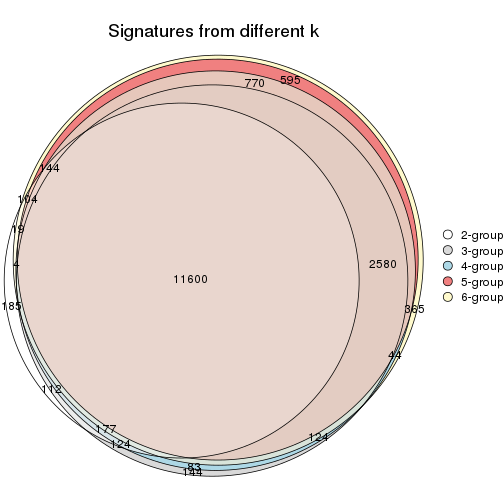

`get_signature()` returns a data frame invisibly. TO get the list of signatures, the function
call should be assigned to a variable explicitly. In following code, if `plot` argument is set
to `FALSE`, no heatmap is plotted while only the differential analysis is performed.

```r
# code only for demonstration
tb = get_signature(res, k = ..., plot = FALSE)
```

An example of the output of `tb` is:

```
#>   which_row         fdr    mean_1    mean_2 scaled_mean_1 scaled_mean_2 km
#> 1        38 0.042760348  8.373488  9.131774    -0.5533452     0.5164555  1
#> 2        40 0.018707592  7.106213  8.469186    -0.6173731     0.5762149  1
#> 3        55 0.019134737 10.221463 11.207825    -0.6159697     0.5749050  1
#> 4        59 0.006059896  5.921854  7.869574    -0.6899429     0.6439467  1
#> 5        60 0.018055526  8.928898 10.211722    -0.6204761     0.5791110  1
#> 6        98 0.009384629 15.714769 14.887706     0.6635654    -0.6193277  2
...
```

The columns in `tb` are:

1. `which_row`: row indices corresponding to the input matrix.
2. `fdr`: FDR for the differential test. 
3. `mean_x`: The mean value in group x.
4. `scaled_mean_x`: The mean value in group x after rows are scaled.
5. `km`: Row groups if k-means clustering is applied to rows.


UMAP plot which shows how samples are separated.


<script>
$( function() {
	$( '#tabs-SD-skmeans-dimension-reduction' ).tabs();
} );
</script>
<div id='tabs-SD-skmeans-dimension-reduction'>
<ul>
<li><a href='#tab-SD-skmeans-dimension-reduction-1'>k = 2</a></li>
<li><a href='#tab-SD-skmeans-dimension-reduction-2'>k = 3</a></li>
<li><a href='#tab-SD-skmeans-dimension-reduction-3'>k = 4</a></li>
<li><a href='#tab-SD-skmeans-dimension-reduction-4'>k = 5</a></li>
<li><a href='#tab-SD-skmeans-dimension-reduction-5'>k = 6</a></li>
</ul>
<div id='tab-SD-skmeans-dimension-reduction-1'>
<pre><code class="r">dimension_reduction(res, k = 2, method = &quot;UMAP&quot;)
</code></pre>

<p></p>

</div>
<div id='tab-SD-skmeans-dimension-reduction-2'>
<pre><code class="r">dimension_reduction(res, k = 3, method = &quot;UMAP&quot;)
</code></pre>

<p></p>

</div>
<div id='tab-SD-skmeans-dimension-reduction-3'>
<pre><code class="r">dimension_reduction(res, k = 4, method = &quot;UMAP&quot;)
</code></pre>

<p></p>

</div>
<div id='tab-SD-skmeans-dimension-reduction-4'>
<pre><code class="r">dimension_reduction(res, k = 5, method = &quot;UMAP&quot;)
</code></pre>

<p></p>

</div>
<div id='tab-SD-skmeans-dimension-reduction-5'>
<pre><code class="r">dimension_reduction(res, k = 6, method = &quot;UMAP&quot;)
</code></pre>

<p></p>

</div>
</div>


Following heatmap shows how subgroups are split when increasing `k`:

```r
collect_classes(res)
```


Test correlation between subgroups and known annotations. If the known
annotation is numeric, one-way ANOVA test is applied, and if the known
annotation is discrete, chi-squared contingency table test is applied.

```r
test_to_known_factors(res)
```

```
#>              n agent(p) dose(p)  time(p) k
#> SD:skmeans 169 0.862532 0.99917 4.57e-27 2
#> SD:skmeans 169 0.450467 0.97873 1.40e-51 3
#> SD:skmeans 169 0.000677 0.00395 7.82e-53 4
#> SD:skmeans 168 0.006087 0.00749 4.13e-70 5
#> SD:skmeans 161 0.007267 0.00934 5.37e-95 6
```


If matrix rows can be associated to genes, consider to use `GO_Enrichment(res,
...)` to perform function enrichment for the signature genes.


 

---------------------------------------------------


### SD:pam*


The object with results only for a single top-value method and a single partition method 
can be extracted as:

```r
res = res_list["SD", "pam"]
# you can also extract it by
# res = res_list["SD:pam"]
```

A summary of `res` and all the functions that can be applied to it:

```r
res
```

```
#> A 'ConsensusPartition' object with k = 2, 3, 4, 5, 6.
#>   On a matrix with 21163 rows and 169 columns.
#>   Top rows (1000, 2000, 3000, 4000, 5000) are extracted by 'SD' method.
#>   Subgroups are detected by 'pam' method.
#>   Performed in total 1250 partitions by row resampling.
#>   Best k for subgroups seems to be 5.
#> 
#> Following methods can be applied to this 'ConsensusPartition' object:
#>  [1] "cola_report"             "collect_classes"         "collect_plots"          
#>  [4] "collect_stats"           "colnames"                "compare_signatures"     
#>  [7] "consensus_heatmap"       "dimension_reduction"     "functional_enrichment"  
#> [10] "get_anno_col"            "get_anno"                "get_classes"            
#> [13] "get_consensus"           "get_matrix"              "get_membership"         
#> [16] "get_param"               "get_signatures"          "get_stats"              
#> [19] "is_best_k"               "is_stable_k"             "membership_heatmap"     
#> [22] "ncol"                    "nrow"                    "plot_ecdf"              
#> [25] "rownames"                "select_partition_number" "show"                   
#> [28] "suggest_best_k"          "test_to_known_factors"
```

`collect_plots()` function collects all the plots made from `res` for all `k` (number of partitions)
into one single page to provide an easy and fast comparison between different `k`.

```r
collect_plots(res)
```


The plots are:

- The first row: a plot of the ECDF (Empirical cumulative distribution
  function) curves of the consensus matrix for each `k` and the heatmap of
  predicted classes for each `k`.
- The second row: heatmaps of the consensus matrix for each `k`.
- The third row: heatmaps of the membership matrix for each `k`.
- The fouth row: heatmaps of the signatures for each `k`.

All the plots in panels can be made by individual functions and they are
plotted later in this section.

`select_partition_number()` produces several plots showing different
statistics for choosing "optimized" `k`. There are following statistics:

- ECDF curves of the consensus matrix for each `k`;
- 1-PAC. [The PAC
  score](https://en.wikipedia.org/wiki/Consensus_clustering#Over-interpretation_potential_of_consensus_clustering)
  measures the proportion of the ambiguous subgrouping.
- Mean silhouette score.
- Concordance. The mean probability of fiting the consensus class ids in all
  partitions.
- Area increased. Denote $A_k$ as the area under the ECDF curve for current
  `k`, the area increased is defined as $A_k - A_{k-1}$.
- Rand index. The percent of pairs of samples that are both in a same cluster
  or both are not in a same cluster in the partition of k and k-1.
- Jaccard index. The ratio of pairs of samples are both in a same cluster in
  the partition of k and k-1 and the pairs of samples are both in a same
  cluster in the partition k or k-1.

The detailed explanations of these statistics can be found in [the cola
vignette](http://bioconductor.org/packages/devel/bioc/vignettes/cola/inst/doc/cola.html#toc_13).

Generally speaking, lower PAC score, higher mean silhouette score or higher
concordance corresponds to better partition. Rand index and Jaccard index
measure how similar the current partition is compared to partition with `k-1`.
If they are too similar, we won't accept `k` is better than `k-1`.

```r
select_partition_number(res)
```


The numeric values for all these statistics can be obtained by `get_stats()`.

```r
get_stats(res)
```

```
#>   k 1-PAC mean_silhouette concordance area_increased  Rand Jaccard
#> 2 2 0.936           0.909       0.965          0.496 0.502   0.502
#> 3 3 0.808           0.876       0.934          0.227 0.850   0.714
#> 4 4 0.905           0.855       0.935          0.149 0.787   0.531
#> 5 5 0.928           0.887       0.953          0.097 0.909   0.708
#> 6 6 0.838           0.734       0.843          0.067 0.906   0.625
```

`suggest_best_k()` suggests the best $k$ based on these statistics. The rules are as follows:

- All $k$ with Jaccard index larger than 0.95 are removed because the increase of
  the partition number does not provides enough extra information. If all $k$ are removed,
  the best $k$ is assigned by `NA`.
- For $k$ with 1-PAC larger than 0.9, the maximal $k$ is taken as the "best k". Other $k$ is called "optional k".
- If it does not fit the second rule. The $k$ with the highest vote of highest
  1-PAC, mean silhouette and concordance is taken as the "best k".

```r
suggest_best_k(res)
```

```
#> [1] 5
#> attr(,"optional")
#> [1] 2 4
```

There is also optional best $k$ = 2 4 that is worth to check.

Following shows the table of the partitions (You need to click the **show/hide
code output** link to see it). The membership matrix (columns with name `p*`)
is inferred by
[`clue::cl_consensus()`](https://www.rdocumentation.org/link/cl_consensus?package=clue)
function with the `SE` method. Basically the value in the membership matrix
represents the probability to belong to a certain group. The finall class
label for an item is determined with the group with highest probability it
belongs to.

In `get_classes()` function, the entropy is calculated from the membership
matrix and the silhouette score is calculated from the consensus matrix.


<script>
$( function() {
	$( '#tabs-SD-pam-get-classes' ).tabs();
} );
</script>
<div id='tabs-SD-pam-get-classes'>
<ul>
<li><a href='#tab-SD-pam-get-classes-1'>k = 2</a></li>
<li><a href='#tab-SD-pam-get-classes-2'>k = 3</a></li>
<li><a href='#tab-SD-pam-get-classes-3'>k = 4</a></li>
<li><a href='#tab-SD-pam-get-classes-4'>k = 5</a></li>
<li><a href='#tab-SD-pam-get-classes-5'>k = 6</a></li>
</ul>

<div id='tab-SD-pam-get-classes-1'>
<p><a id='tab-SD-pam-get-classes-1-a' style='color:#0366d6' href='#'>show/hide code output</a></p>
<pre><code class="r">cbind(get_classes(res, k = 2), get_membership(res, k = 2))
</code></pre>

<pre><code>#&gt;           class entropy silhouette    p1    p2
#&gt; GSM528681     2  0.0000     0.9498 0.000 1.000
#&gt; GSM528682     2  0.0000     0.9498 0.000 1.000
#&gt; GSM528683     2  0.0000     0.9498 0.000 1.000
#&gt; GSM528684     2  0.0000     0.9498 0.000 1.000
#&gt; GSM528687     2  0.0000     0.9498 0.000 1.000
#&gt; GSM528688     2  0.0000     0.9498 0.000 1.000
#&gt; GSM528685     2  0.1184     0.9401 0.016 0.984
#&gt; GSM528686     2  0.1843     0.9323 0.028 0.972
#&gt; GSM528693     1  0.0000     0.9738 1.000 0.000
#&gt; GSM528694     1  0.0000     0.9738 1.000 0.000
#&gt; GSM528695     1  0.0000     0.9738 1.000 0.000
#&gt; GSM528696     1  0.0000     0.9738 1.000 0.000
#&gt; GSM528697     1  0.0000     0.9738 1.000 0.000
#&gt; GSM528698     1  0.0000     0.9738 1.000 0.000
#&gt; GSM528699     2  1.0000     0.0674 0.496 0.504
#&gt; GSM528700     1  0.0000     0.9738 1.000 0.000
#&gt; GSM528689     1  0.0000     0.9738 1.000 0.000
#&gt; GSM528690     1  0.1633     0.9526 0.976 0.024
#&gt; GSM528691     1  0.0000     0.9738 1.000 0.000
#&gt; GSM528692     1  0.0000     0.9738 1.000 0.000
#&gt; GSM528779     2  0.0000     0.9498 0.000 1.000
#&gt; GSM528780     2  0.0000     0.9498 0.000 1.000
#&gt; GSM528782     2  0.0000     0.9498 0.000 1.000
#&gt; GSM528781     2  0.0000     0.9498 0.000 1.000
#&gt; GSM528785     1  0.4161     0.8895 0.916 0.084
#&gt; GSM528786     1  0.0000     0.9738 1.000 0.000
#&gt; GSM528787     1  0.0000     0.9738 1.000 0.000
#&gt; GSM528788     1  0.9909     0.1708 0.556 0.444
#&gt; GSM528783     1  0.0000     0.9738 1.000 0.000
#&gt; GSM528784     1  0.0000     0.9738 1.000 0.000
#&gt; GSM528759     1  0.0000     0.9738 1.000 0.000
#&gt; GSM528760     1  0.0000     0.9738 1.000 0.000
#&gt; GSM528761     2  0.0000     0.9498 0.000 1.000
#&gt; GSM528762     2  0.0000     0.9498 0.000 1.000
#&gt; GSM528765     2  0.0000     0.9498 0.000 1.000
#&gt; GSM528766     2  0.0000     0.9498 0.000 1.000
#&gt; GSM528763     2  0.0000     0.9498 0.000 1.000
#&gt; GSM528764     2  0.0672     0.9452 0.008 0.992
#&gt; GSM528771     1  0.0000     0.9738 1.000 0.000
#&gt; GSM528772     1  0.0000     0.9738 1.000 0.000
#&gt; GSM528773     1  0.0000     0.9738 1.000 0.000
#&gt; GSM528774     1  0.0000     0.9738 1.000 0.000
#&gt; GSM528775     1  0.0000     0.9738 1.000 0.000
#&gt; GSM528776     1  0.0000     0.9738 1.000 0.000
#&gt; GSM528777     2  0.9998     0.0324 0.492 0.508
#&gt; GSM528778     1  0.9686     0.3217 0.604 0.396
#&gt; GSM528767     1  0.0000     0.9738 1.000 0.000
#&gt; GSM528768     1  0.0000     0.9738 1.000 0.000
#&gt; GSM528769     1  0.0000     0.9738 1.000 0.000
#&gt; GSM528770     1  0.0000     0.9738 1.000 0.000
#&gt; GSM528671     2  0.0000     0.9498 0.000 1.000
#&gt; GSM528672     2  0.0000     0.9498 0.000 1.000
#&gt; GSM528674     2  0.0000     0.9498 0.000 1.000
#&gt; GSM528673     2  0.1414     0.9374 0.020 0.980
#&gt; GSM528677     1  0.0000     0.9738 1.000 0.000
#&gt; GSM528678     1  0.0000     0.9738 1.000 0.000
#&gt; GSM528679     1  0.0000     0.9738 1.000 0.000
#&gt; GSM528680     1  0.0000     0.9738 1.000 0.000
#&gt; GSM528675     1  0.0000     0.9738 1.000 0.000
#&gt; GSM528676     1  0.0000     0.9738 1.000 0.000
#&gt; GSM528651     2  0.0000     0.9498 0.000 1.000
#&gt; GSM528652     2  0.0000     0.9498 0.000 1.000
#&gt; GSM528653     2  0.0000     0.9498 0.000 1.000
#&gt; GSM528654     2  0.0000     0.9498 0.000 1.000
#&gt; GSM528657     2  0.0000     0.9498 0.000 1.000
#&gt; GSM528658     2  0.0000     0.9498 0.000 1.000
#&gt; GSM528655     2  0.1633     0.9347 0.024 0.976
#&gt; GSM528656     2  0.0000     0.9498 0.000 1.000
#&gt; GSM528663     1  0.9998    -0.0455 0.508 0.492
#&gt; GSM528664     2  0.7674     0.7120 0.224 0.776
#&gt; GSM528665     1  0.0000     0.9738 1.000 0.000
#&gt; GSM528666     1  0.0000     0.9738 1.000 0.000
#&gt; GSM528667     1  0.0000     0.9738 1.000 0.000
#&gt; GSM528668     1  0.0000     0.9738 1.000 0.000
#&gt; GSM528669     2  0.9998     0.0324 0.492 0.508
#&gt; GSM528670     1  0.2423     0.9360 0.960 0.040
#&gt; GSM528659     1  0.1184     0.9599 0.984 0.016
#&gt; GSM528660     1  0.0376     0.9705 0.996 0.004
#&gt; GSM528661     1  0.0000     0.9738 1.000 0.000
#&gt; GSM528662     1  0.0000     0.9738 1.000 0.000
#&gt; GSM528701     2  0.0000     0.9498 0.000 1.000
#&gt; GSM528702     2  0.0000     0.9498 0.000 1.000
#&gt; GSM528703     2  0.0000     0.9498 0.000 1.000
#&gt; GSM528704     2  0.0000     0.9498 0.000 1.000
#&gt; GSM528707     2  0.0000     0.9498 0.000 1.000
#&gt; GSM528708     2  0.0000     0.9498 0.000 1.000
#&gt; GSM528705     2  0.0000     0.9498 0.000 1.000
#&gt; GSM528706     2  0.0000     0.9498 0.000 1.000
#&gt; GSM528713     1  0.0000     0.9738 1.000 0.000
#&gt; GSM528714     1  0.0000     0.9738 1.000 0.000
#&gt; GSM528715     1  0.0000     0.9738 1.000 0.000
#&gt; GSM528716     1  0.0000     0.9738 1.000 0.000
#&gt; GSM528717     1  0.0000     0.9738 1.000 0.000
#&gt; GSM528718     1  0.0000     0.9738 1.000 0.000
#&gt; GSM528719     1  0.0000     0.9738 1.000 0.000
#&gt; GSM528720     1  0.0000     0.9738 1.000 0.000
#&gt; GSM528709     1  0.0000     0.9738 1.000 0.000
#&gt; GSM528710     1  0.1184     0.9599 0.984 0.016
#&gt; GSM528711     1  0.0000     0.9738 1.000 0.000
#&gt; GSM528712     1  0.0000     0.9738 1.000 0.000
#&gt; GSM528721     2  0.0000     0.9498 0.000 1.000
#&gt; GSM528722     2  0.0000     0.9498 0.000 1.000
#&gt; GSM528723     2  0.0000     0.9498 0.000 1.000
#&gt; GSM528724     2  0.0000     0.9498 0.000 1.000
#&gt; GSM528727     2  0.0000     0.9498 0.000 1.000
#&gt; GSM528728     2  0.0000     0.9498 0.000 1.000
#&gt; GSM528725     2  0.0000     0.9498 0.000 1.000
#&gt; GSM528726     2  0.0000     0.9498 0.000 1.000
#&gt; GSM528733     1  0.0000     0.9738 1.000 0.000
#&gt; GSM528734     1  0.0000     0.9738 1.000 0.000
#&gt; GSM528735     1  0.0000     0.9738 1.000 0.000
#&gt; GSM528736     1  0.0000     0.9738 1.000 0.000
#&gt; GSM528737     1  0.0000     0.9738 1.000 0.000
#&gt; GSM528738     1  0.0000     0.9738 1.000 0.000
#&gt; GSM528729     1  0.9710     0.3119 0.600 0.400
#&gt; GSM528730     1  0.6712     0.7685 0.824 0.176
#&gt; GSM528731     1  0.0672     0.9670 0.992 0.008
#&gt; GSM528732     1  0.0000     0.9738 1.000 0.000
#&gt; GSM528739     2  0.0000     0.9498 0.000 1.000
#&gt; GSM528740     2  0.0000     0.9498 0.000 1.000
#&gt; GSM528741     2  0.0000     0.9498 0.000 1.000
#&gt; GSM528742     2  0.0000     0.9498 0.000 1.000
#&gt; GSM528745     2  0.0000     0.9498 0.000 1.000
#&gt; GSM528746     2  0.0000     0.9498 0.000 1.000
#&gt; GSM528743     2  0.0000     0.9498 0.000 1.000
#&gt; GSM528744     2  0.0000     0.9498 0.000 1.000
#&gt; GSM528751     1  0.0000     0.9738 1.000 0.000
#&gt; GSM528752     1  0.0000     0.9738 1.000 0.000
#&gt; GSM528753     1  0.0000     0.9738 1.000 0.000
#&gt; GSM528754     1  0.0000     0.9738 1.000 0.000
#&gt; GSM528755     1  0.0000     0.9738 1.000 0.000
#&gt; GSM528756     1  0.0000     0.9738 1.000 0.000
#&gt; GSM528757     2  0.0672     0.9454 0.008 0.992
#&gt; GSM528758     2  0.1414     0.9379 0.020 0.980
#&gt; GSM528747     1  0.6048     0.8094 0.852 0.148
#&gt; GSM528748     2  0.8144     0.6688 0.252 0.748
#&gt; GSM528749     1  0.0000     0.9738 1.000 0.000
#&gt; GSM528750     1  0.0376     0.9705 0.996 0.004
#&gt; GSM528640     2  0.0000     0.9498 0.000 1.000
#&gt; GSM528641     2  0.1414     0.9384 0.020 0.980
#&gt; GSM528643     1  0.0000     0.9738 1.000 0.000
#&gt; GSM528644     2  0.4298     0.8781 0.088 0.912
#&gt; GSM528642     1  0.0000     0.9738 1.000 0.000
#&gt; GSM528620     2  0.0000     0.9498 0.000 1.000
#&gt; GSM528621     2  0.4298     0.8780 0.088 0.912
#&gt; GSM528623     1  0.0000     0.9738 1.000 0.000
#&gt; GSM528624     2  0.9998     0.0324 0.492 0.508
#&gt; GSM528622     1  0.0000     0.9738 1.000 0.000
#&gt; GSM528625     2  0.0000     0.9498 0.000 1.000
#&gt; GSM528626     2  0.0938     0.9431 0.012 0.988
#&gt; GSM528628     1  0.0000     0.9738 1.000 0.000
#&gt; GSM528629     2  0.9608     0.4038 0.384 0.616
#&gt; GSM528627     1  0.0000     0.9738 1.000 0.000
#&gt; GSM528630     2  0.0000     0.9498 0.000 1.000
#&gt; GSM528631     2  0.0000     0.9498 0.000 1.000
#&gt; GSM528632     2  0.1633     0.9346 0.024 0.976
#&gt; GSM528633     2  0.3879     0.8890 0.076 0.924
#&gt; GSM528636     1  0.0000     0.9738 1.000 0.000
#&gt; GSM528637     1  0.0000     0.9738 1.000 0.000
#&gt; GSM528638     2  0.1843     0.9323 0.028 0.972
#&gt; GSM528639     2  0.8955     0.5632 0.312 0.688
#&gt; GSM528634     1  0.0000     0.9738 1.000 0.000
#&gt; GSM528635     1  0.0000     0.9738 1.000 0.000
#&gt; GSM528645     1  0.0000     0.9738 1.000 0.000
#&gt; GSM528646     1  0.0000     0.9738 1.000 0.000
#&gt; GSM528647     1  0.0000     0.9738 1.000 0.000
#&gt; GSM528648     1  0.0000     0.9738 1.000 0.000
#&gt; GSM528649     1  0.0000     0.9738 1.000 0.000
#&gt; GSM528650     1  0.0000     0.9738 1.000 0.000
</code></pre>

<script>
$('#tab-SD-pam-get-classes-1-a').parent().next().next().hide();
$('#tab-SD-pam-get-classes-1-a').click(function(){
  $('#tab-SD-pam-get-classes-1-a').parent().next().next().toggle();
  return(false);
});
</script>
</div>

<div id='tab-SD-pam-get-classes-2'>
<p><a id='tab-SD-pam-get-classes-2-a' style='color:#0366d6' href='#'>show/hide code output</a></p>
<pre><code class="r">cbind(get_classes(res, k = 3), get_membership(res, k = 3))
</code></pre>

<pre><code>#&gt;           class entropy silhouette    p1    p2    p3
#&gt; GSM528681     2  0.0000     0.9260 0.000 1.000 0.000
#&gt; GSM528682     2  0.0000     0.9260 0.000 1.000 0.000
#&gt; GSM528683     2  0.0000     0.9260 0.000 1.000 0.000
#&gt; GSM528684     2  0.0000     0.9260 0.000 1.000 0.000
#&gt; GSM528687     2  0.0000     0.9260 0.000 1.000 0.000
#&gt; GSM528688     2  0.0000     0.9260 0.000 1.000 0.000
#&gt; GSM528685     2  0.0592     0.9184 0.000 0.988 0.012
#&gt; GSM528686     2  0.0892     0.9130 0.000 0.980 0.020
#&gt; GSM528693     3  0.2356     0.9195 0.072 0.000 0.928
#&gt; GSM528694     3  0.1878     0.9230 0.044 0.004 0.952
#&gt; GSM528695     3  0.0000     0.9182 0.000 0.000 1.000
#&gt; GSM528696     3  0.0000     0.9182 0.000 0.000 1.000
#&gt; GSM528697     1  0.3192     0.8489 0.888 0.000 0.112
#&gt; GSM528698     1  0.2066     0.9523 0.940 0.000 0.060
#&gt; GSM528699     1  0.1031     0.9383 0.976 0.024 0.000
#&gt; GSM528700     1  0.0000     0.9513 1.000 0.000 0.000
#&gt; GSM528689     1  0.0000     0.9513 1.000 0.000 0.000
#&gt; GSM528690     1  0.0000     0.9513 1.000 0.000 0.000
#&gt; GSM528691     1  0.2066     0.9523 0.940 0.000 0.060
#&gt; GSM528692     1  0.2625     0.9353 0.916 0.000 0.084
#&gt; GSM528779     2  0.0000     0.9260 0.000 1.000 0.000
#&gt; GSM528780     2  0.0000     0.9260 0.000 1.000 0.000
#&gt; GSM528782     2  0.0000     0.9260 0.000 1.000 0.000
#&gt; GSM528781     2  0.0000     0.9260 0.000 1.000 0.000
#&gt; GSM528785     3  0.4779     0.8259 0.036 0.124 0.840
#&gt; GSM528786     3  0.0000     0.9182 0.000 0.000 1.000
#&gt; GSM528787     3  0.0000     0.9182 0.000 0.000 1.000
#&gt; GSM528788     2  0.8278     0.4899 0.132 0.620 0.248
#&gt; GSM528783     3  0.3551     0.8970 0.132 0.000 0.868
#&gt; GSM528784     3  0.2537     0.9181 0.080 0.000 0.920
#&gt; GSM528759     3  0.2165     0.9208 0.064 0.000 0.936
#&gt; GSM528760     3  0.0747     0.9207 0.016 0.000 0.984
#&gt; GSM528761     2  0.0000     0.9260 0.000 1.000 0.000
#&gt; GSM528762     2  0.0000     0.9260 0.000 1.000 0.000
#&gt; GSM528765     2  0.0000     0.9260 0.000 1.000 0.000
#&gt; GSM528766     2  0.0000     0.9260 0.000 1.000 0.000
#&gt; GSM528763     2  0.0000     0.9260 0.000 1.000 0.000
#&gt; GSM528764     2  0.0424     0.9211 0.000 0.992 0.008
#&gt; GSM528771     3  0.2496     0.8944 0.004 0.068 0.928
#&gt; GSM528772     3  0.2496     0.8944 0.004 0.068 0.928
#&gt; GSM528773     3  0.0000     0.9182 0.000 0.000 1.000
#&gt; GSM528774     3  0.0000     0.9182 0.000 0.000 1.000
#&gt; GSM528775     3  0.1411     0.9225 0.036 0.000 0.964
#&gt; GSM528776     3  0.3551     0.8970 0.132 0.000 0.868
#&gt; GSM528777     2  0.7680     0.5775 0.132 0.680 0.188
#&gt; GSM528778     2  0.8857     0.2605 0.132 0.524 0.344
#&gt; GSM528767     3  0.3551     0.8970 0.132 0.000 0.868
#&gt; GSM528768     3  0.2448     0.9189 0.076 0.000 0.924
#&gt; GSM528769     3  0.3267     0.9053 0.116 0.000 0.884
#&gt; GSM528770     3  0.2356     0.9195 0.072 0.000 0.928
#&gt; GSM528671     2  0.0000     0.9260 0.000 1.000 0.000
#&gt; GSM528672     2  0.0000     0.9260 0.000 1.000 0.000
#&gt; GSM528674     2  0.0000     0.9260 0.000 1.000 0.000
#&gt; GSM528673     2  0.0747     0.9156 0.000 0.984 0.016
#&gt; GSM528677     3  0.2496     0.8944 0.004 0.068 0.928
#&gt; GSM528678     3  0.0000     0.9182 0.000 0.000 1.000
#&gt; GSM528679     3  0.2356     0.9195 0.072 0.000 0.928
#&gt; GSM528680     1  0.1643     0.9292 0.956 0.000 0.044
#&gt; GSM528675     1  0.0000     0.9513 1.000 0.000 0.000
#&gt; GSM528676     1  0.2066     0.9523 0.940 0.000 0.060
#&gt; GSM528651     2  0.0000     0.9260 0.000 1.000 0.000
#&gt; GSM528652     2  0.0000     0.9260 0.000 1.000 0.000
#&gt; GSM528653     2  0.0000     0.9260 0.000 1.000 0.000
#&gt; GSM528654     2  0.0000     0.9260 0.000 1.000 0.000
#&gt; GSM528657     2  0.0000     0.9260 0.000 1.000 0.000
#&gt; GSM528658     2  0.0000     0.9260 0.000 1.000 0.000
#&gt; GSM528655     2  0.0892     0.9128 0.000 0.980 0.020
#&gt; GSM528656     2  0.0000     0.9260 0.000 1.000 0.000
#&gt; GSM528663     3  0.5178     0.6323 0.000 0.256 0.744
#&gt; GSM528664     2  0.5948     0.4557 0.000 0.640 0.360
#&gt; GSM528665     3  0.0000     0.9182 0.000 0.000 1.000
#&gt; GSM528666     3  0.0000     0.9182 0.000 0.000 1.000
#&gt; GSM528667     3  0.3551     0.8970 0.132 0.000 0.868
#&gt; GSM528668     3  0.3551     0.8970 0.132 0.000 0.868
#&gt; GSM528669     2  0.7680     0.5775 0.132 0.680 0.188
#&gt; GSM528670     3  0.4915     0.8726 0.132 0.036 0.832
#&gt; GSM528659     1  0.0000     0.9513 1.000 0.000 0.000
#&gt; GSM528660     1  0.0000     0.9513 1.000 0.000 0.000
#&gt; GSM528661     1  0.2066     0.9523 0.940 0.000 0.060
#&gt; GSM528662     1  0.2066     0.9523 0.940 0.000 0.060
#&gt; GSM528701     2  0.0000     0.9260 0.000 1.000 0.000
#&gt; GSM528702     2  0.0000     0.9260 0.000 1.000 0.000
#&gt; GSM528703     2  0.0000     0.9260 0.000 1.000 0.000
#&gt; GSM528704     2  0.0000     0.9260 0.000 1.000 0.000
#&gt; GSM528707     2  0.0000     0.9260 0.000 1.000 0.000
#&gt; GSM528708     2  0.0000     0.9260 0.000 1.000 0.000
#&gt; GSM528705     2  0.0000     0.9260 0.000 1.000 0.000
#&gt; GSM528706     2  0.0000     0.9260 0.000 1.000 0.000
#&gt; GSM528713     3  0.2773     0.9089 0.024 0.048 0.928
#&gt; GSM528714     3  0.2496     0.8944 0.004 0.068 0.928
#&gt; GSM528715     3  0.0000     0.9182 0.000 0.000 1.000
#&gt; GSM528716     3  0.0000     0.9182 0.000 0.000 1.000
#&gt; GSM528717     3  0.3551     0.8970 0.132 0.000 0.868
#&gt; GSM528718     3  0.2356     0.9195 0.072 0.000 0.928
#&gt; GSM528719     1  0.2066     0.9523 0.940 0.000 0.060
#&gt; GSM528720     1  0.2066     0.9523 0.940 0.000 0.060
#&gt; GSM528709     1  0.0000     0.9513 1.000 0.000 0.000
#&gt; GSM528710     1  0.0000     0.9513 1.000 0.000 0.000
#&gt; GSM528711     1  0.2066     0.9523 0.940 0.000 0.060
#&gt; GSM528712     1  0.2947     0.9371 0.920 0.020 0.060
#&gt; GSM528721     2  0.0000     0.9260 0.000 1.000 0.000
#&gt; GSM528722     2  0.0000     0.9260 0.000 1.000 0.000
#&gt; GSM528723     2  0.0000     0.9260 0.000 1.000 0.000
#&gt; GSM528724     2  0.0000     0.9260 0.000 1.000 0.000
#&gt; GSM528727     2  0.0000     0.9260 0.000 1.000 0.000
#&gt; GSM528728     2  0.0000     0.9260 0.000 1.000 0.000
#&gt; GSM528725     2  0.0000     0.9260 0.000 1.000 0.000
#&gt; GSM528726     2  0.0000     0.9260 0.000 1.000 0.000
#&gt; GSM528733     3  0.0000     0.9182 0.000 0.000 1.000
#&gt; GSM528734     3  0.0000     0.9182 0.000 0.000 1.000
#&gt; GSM528735     3  0.3551     0.8970 0.132 0.000 0.868
#&gt; GSM528736     3  0.3551     0.8970 0.132 0.000 0.868
#&gt; GSM528737     3  0.3551     0.8970 0.132 0.000 0.868
#&gt; GSM528738     3  0.3551     0.8970 0.132 0.000 0.868
#&gt; GSM528729     2  0.9018     0.0140 0.132 0.456 0.412
#&gt; GSM528730     3  0.8520     0.4869 0.132 0.280 0.588
#&gt; GSM528731     3  0.3965     0.8929 0.132 0.008 0.860
#&gt; GSM528732     3  0.3607     0.9057 0.112 0.008 0.880
#&gt; GSM528739     2  0.0000     0.9260 0.000 1.000 0.000
#&gt; GSM528740     2  0.0000     0.9260 0.000 1.000 0.000
#&gt; GSM528741     2  0.0000     0.9260 0.000 1.000 0.000
#&gt; GSM528742     2  0.0000     0.9260 0.000 1.000 0.000
#&gt; GSM528745     2  0.0000     0.9260 0.000 1.000 0.000
#&gt; GSM528746     2  0.0000     0.9260 0.000 1.000 0.000
#&gt; GSM528743     2  0.0000     0.9260 0.000 1.000 0.000
#&gt; GSM528744     2  0.0000     0.9260 0.000 1.000 0.000
#&gt; GSM528751     3  0.2793     0.9182 0.044 0.028 0.928
#&gt; GSM528752     3  0.2703     0.9037 0.016 0.056 0.928
#&gt; GSM528753     3  0.0000     0.9182 0.000 0.000 1.000
#&gt; GSM528754     3  0.0000     0.9182 0.000 0.000 1.000
#&gt; GSM528755     3  0.2356     0.9195 0.072 0.000 0.928
#&gt; GSM528756     3  0.2356     0.9195 0.072 0.000 0.928
#&gt; GSM528757     2  0.3482     0.8143 0.128 0.872 0.000
#&gt; GSM528758     2  0.4349     0.7992 0.128 0.852 0.020
#&gt; GSM528747     3  0.6981     0.7463 0.132 0.136 0.732
#&gt; GSM528748     2  0.8720     0.0597 0.108 0.480 0.412
#&gt; GSM528749     3  0.2356     0.9195 0.072 0.000 0.928
#&gt; GSM528750     3  0.3551     0.8970 0.132 0.000 0.868
#&gt; GSM528640     2  0.0000     0.9260 0.000 1.000 0.000
#&gt; GSM528641     2  0.0747     0.9160 0.000 0.984 0.016
#&gt; GSM528643     3  0.0000     0.9182 0.000 0.000 1.000
#&gt; GSM528644     2  0.5304     0.7757 0.108 0.824 0.068
#&gt; GSM528642     3  0.0237     0.9188 0.004 0.000 0.996
#&gt; GSM528620     2  0.0000     0.9260 0.000 1.000 0.000
#&gt; GSM528621     2  0.3686     0.8010 0.000 0.860 0.140
#&gt; GSM528623     3  0.0000     0.9182 0.000 0.000 1.000
#&gt; GSM528624     2  0.7680     0.5775 0.132 0.680 0.188
#&gt; GSM528622     3  0.3551     0.8970 0.132 0.000 0.868
#&gt; GSM528625     2  0.0000     0.9260 0.000 1.000 0.000
#&gt; GSM528626     2  0.1643     0.8939 0.000 0.956 0.044
#&gt; GSM528628     3  0.1860     0.9058 0.052 0.000 0.948
#&gt; GSM528629     3  0.8719     0.4289 0.128 0.324 0.548
#&gt; GSM528627     3  0.2356     0.9195 0.072 0.000 0.928
#&gt; GSM528630     2  0.0000     0.9260 0.000 1.000 0.000
#&gt; GSM528631     2  0.0000     0.9260 0.000 1.000 0.000
#&gt; GSM528632     2  0.2711     0.8549 0.000 0.912 0.088
#&gt; GSM528633     2  0.3192     0.8300 0.000 0.888 0.112
#&gt; GSM528636     3  0.0000     0.9182 0.000 0.000 1.000
#&gt; GSM528637     3  0.0000     0.9182 0.000 0.000 1.000
#&gt; GSM528638     2  0.4731     0.7886 0.128 0.840 0.032
#&gt; GSM528639     2  0.8983    -0.0579 0.128 0.444 0.428
#&gt; GSM528634     3  0.2356     0.9195 0.072 0.000 0.928
#&gt; GSM528635     3  0.3551     0.8970 0.132 0.000 0.868
#&gt; GSM528645     3  0.0000     0.9182 0.000 0.000 1.000
#&gt; GSM528646     3  0.0000     0.9182 0.000 0.000 1.000
#&gt; GSM528647     3  0.0000     0.9182 0.000 0.000 1.000
#&gt; GSM528648     3  0.2356     0.9195 0.072 0.000 0.928
#&gt; GSM528649     3  0.1031     0.9216 0.024 0.000 0.976
#&gt; GSM528650     3  0.2356     0.9195 0.072 0.000 0.928
</code></pre>

<script>
$('#tab-SD-pam-get-classes-2-a').parent().next().next().hide();
$('#tab-SD-pam-get-classes-2-a').click(function(){
  $('#tab-SD-pam-get-classes-2-a').parent().next().next().toggle();
  return(false);
});
</script>
</div>

<div id='tab-SD-pam-get-classes-3'>
<p><a id='tab-SD-pam-get-classes-3-a' style='color:#0366d6' href='#'>show/hide code output</a></p>
<pre><code class="r">cbind(get_classes(res, k = 4), get_membership(res, k = 4))
</code></pre>

<pre><code>#&gt;           class entropy silhouette    p1    p2    p3    p4
#&gt; GSM528681     2  0.0000     0.9657 0.000 1.000 0.000 0.000
#&gt; GSM528682     2  0.0000     0.9657 0.000 1.000 0.000 0.000
#&gt; GSM528683     2  0.0000     0.9657 0.000 1.000 0.000 0.000
#&gt; GSM528684     2  0.0000     0.9657 0.000 1.000 0.000 0.000
#&gt; GSM528687     2  0.0000     0.9657 0.000 1.000 0.000 0.000
#&gt; GSM528688     2  0.0000     0.9657 0.000 1.000 0.000 0.000
#&gt; GSM528685     2  0.1716     0.9330 0.000 0.936 0.064 0.000
#&gt; GSM528686     2  0.1716     0.9330 0.000 0.936 0.064 0.000
#&gt; GSM528693     1  0.4012     0.7180 0.800 0.000 0.184 0.016
#&gt; GSM528694     3  0.5364     0.3244 0.392 0.000 0.592 0.016
#&gt; GSM528695     3  0.1716     0.9135 0.064 0.000 0.936 0.000
#&gt; GSM528696     3  0.1716     0.9135 0.064 0.000 0.936 0.000
#&gt; GSM528697     1  0.3907     0.6235 0.768 0.000 0.000 0.232
#&gt; GSM528698     4  0.4679     0.4264 0.352 0.000 0.000 0.648
#&gt; GSM528699     4  0.0592     0.9491 0.016 0.000 0.000 0.984
#&gt; GSM528700     4  0.0592     0.9491 0.016 0.000 0.000 0.984
#&gt; GSM528689     4  0.0592     0.9491 0.016 0.000 0.000 0.984
#&gt; GSM528690     4  0.0592     0.9491 0.016 0.000 0.000 0.984
#&gt; GSM528691     4  0.0000     0.9485 0.000 0.000 0.000 1.000
#&gt; GSM528692     4  0.0000     0.9485 0.000 0.000 0.000 1.000
#&gt; GSM528779     2  0.0000     0.9657 0.000 1.000 0.000 0.000
#&gt; GSM528780     2  0.0000     0.9657 0.000 1.000 0.000 0.000
#&gt; GSM528782     2  0.0000     0.9657 0.000 1.000 0.000 0.000
#&gt; GSM528781     2  0.0000     0.9657 0.000 1.000 0.000 0.000
#&gt; GSM528785     1  0.6879     0.1390 0.496 0.424 0.064 0.016
#&gt; GSM528786     3  0.0000     0.8611 0.000 0.000 1.000 0.000
#&gt; GSM528787     3  0.2376     0.9020 0.068 0.000 0.916 0.016
#&gt; GSM528788     1  0.0000     0.8732 1.000 0.000 0.000 0.000
#&gt; GSM528783     1  0.0000     0.8732 1.000 0.000 0.000 0.000
#&gt; GSM528784     1  0.0592     0.8658 0.984 0.000 0.000 0.016
#&gt; GSM528759     1  0.5444     0.0767 0.560 0.000 0.424 0.016
#&gt; GSM528760     3  0.4720     0.6819 0.264 0.000 0.720 0.016
#&gt; GSM528761     2  0.0000     0.9657 0.000 1.000 0.000 0.000
#&gt; GSM528762     2  0.0000     0.9657 0.000 1.000 0.000 0.000
#&gt; GSM528765     2  0.0000     0.9657 0.000 1.000 0.000 0.000
#&gt; GSM528766     2  0.0000     0.9657 0.000 1.000 0.000 0.000
#&gt; GSM528763     2  0.1716     0.9330 0.000 0.936 0.064 0.000
#&gt; GSM528764     2  0.1716     0.9330 0.000 0.936 0.064 0.000
#&gt; GSM528771     2  0.6869     0.1339 0.416 0.504 0.064 0.016
#&gt; GSM528772     2  0.6078     0.6090 0.236 0.684 0.064 0.016
#&gt; GSM528773     3  0.0817     0.8836 0.024 0.000 0.976 0.000
#&gt; GSM528774     3  0.1716     0.9135 0.064 0.000 0.936 0.000
#&gt; GSM528775     3  0.5483     0.2900 0.448 0.000 0.536 0.016
#&gt; GSM528776     1  0.0000     0.8732 1.000 0.000 0.000 0.000
#&gt; GSM528777     1  0.0000     0.8732 1.000 0.000 0.000 0.000
#&gt; GSM528778     1  0.0000     0.8732 1.000 0.000 0.000 0.000
#&gt; GSM528767     1  0.0188     0.8709 0.996 0.000 0.000 0.004
#&gt; GSM528768     1  0.0707     0.8651 0.980 0.000 0.000 0.020
#&gt; GSM528769     1  0.0336     0.8698 0.992 0.000 0.000 0.008
#&gt; GSM528770     1  0.0592     0.8658 0.984 0.000 0.000 0.016
#&gt; GSM528671     2  0.0000     0.9657 0.000 1.000 0.000 0.000
#&gt; GSM528672     2  0.0000     0.9657 0.000 1.000 0.000 0.000
#&gt; GSM528674     2  0.0000     0.9657 0.000 1.000 0.000 0.000
#&gt; GSM528673     2  0.1716     0.9330 0.000 0.936 0.064 0.000
#&gt; GSM528677     2  0.4619     0.8106 0.036 0.804 0.144 0.016
#&gt; GSM528678     3  0.0188     0.8653 0.004 0.000 0.996 0.000
#&gt; GSM528679     1  0.0592     0.8658 0.984 0.000 0.000 0.016
#&gt; GSM528680     4  0.4304     0.6115 0.284 0.000 0.000 0.716
#&gt; GSM528675     4  0.0592     0.9491 0.016 0.000 0.000 0.984
#&gt; GSM528676     4  0.0000     0.9485 0.000 0.000 0.000 1.000
#&gt; GSM528651     2  0.0000     0.9657 0.000 1.000 0.000 0.000
#&gt; GSM528652     2  0.0000     0.9657 0.000 1.000 0.000 0.000
#&gt; GSM528653     2  0.0000     0.9657 0.000 1.000 0.000 0.000
#&gt; GSM528654     2  0.0000     0.9657 0.000 1.000 0.000 0.000
#&gt; GSM528657     2  0.0000     0.9657 0.000 1.000 0.000 0.000
#&gt; GSM528658     2  0.0000     0.9657 0.000 1.000 0.000 0.000
#&gt; GSM528655     2  0.1716     0.9330 0.000 0.936 0.064 0.000
#&gt; GSM528656     2  0.1716     0.9330 0.000 0.936 0.064 0.000
#&gt; GSM528663     2  0.2923     0.9043 0.008 0.896 0.080 0.016
#&gt; GSM528664     2  0.2761     0.9133 0.012 0.908 0.064 0.016
#&gt; GSM528665     3  0.1716     0.9135 0.064 0.000 0.936 0.000
#&gt; GSM528666     3  0.1716     0.9135 0.064 0.000 0.936 0.000
#&gt; GSM528667     1  0.0000     0.8732 1.000 0.000 0.000 0.000
#&gt; GSM528668     1  0.0000     0.8732 1.000 0.000 0.000 0.000
#&gt; GSM528669     1  0.0000     0.8732 1.000 0.000 0.000 0.000
#&gt; GSM528670     1  0.0000     0.8732 1.000 0.000 0.000 0.000
#&gt; GSM528659     4  0.0592     0.9491 0.016 0.000 0.000 0.984
#&gt; GSM528660     4  0.0592     0.9491 0.016 0.000 0.000 0.984
#&gt; GSM528661     4  0.0000     0.9485 0.000 0.000 0.000 1.000
#&gt; GSM528662     4  0.0000     0.9485 0.000 0.000 0.000 1.000
#&gt; GSM528701     2  0.0188     0.9638 0.000 0.996 0.004 0.000
#&gt; GSM528702     2  0.0000     0.9657 0.000 1.000 0.000 0.000
#&gt; GSM528703     2  0.0000     0.9657 0.000 1.000 0.000 0.000
#&gt; GSM528704     2  0.0000     0.9657 0.000 1.000 0.000 0.000
#&gt; GSM528707     2  0.0000     0.9657 0.000 1.000 0.000 0.000
#&gt; GSM528708     2  0.0000     0.9657 0.000 1.000 0.000 0.000
#&gt; GSM528705     2  0.0000     0.9657 0.000 1.000 0.000 0.000
#&gt; GSM528706     2  0.0000     0.9657 0.000 1.000 0.000 0.000
#&gt; GSM528713     1  0.6843     0.2180 0.520 0.400 0.064 0.016
#&gt; GSM528714     2  0.5271     0.6000 0.008 0.676 0.300 0.016
#&gt; GSM528715     3  0.1716     0.9135 0.064 0.000 0.936 0.000
#&gt; GSM528716     3  0.1716     0.9135 0.064 0.000 0.936 0.000
#&gt; GSM528717     1  0.0000     0.8732 1.000 0.000 0.000 0.000
#&gt; GSM528718     1  0.5167     0.3402 0.644 0.000 0.340 0.016
#&gt; GSM528719     4  0.0000     0.9485 0.000 0.000 0.000 1.000
#&gt; GSM528720     4  0.0000     0.9485 0.000 0.000 0.000 1.000
#&gt; GSM528709     4  0.0592     0.9491 0.016 0.000 0.000 0.984
#&gt; GSM528710     4  0.0592     0.9491 0.016 0.000 0.000 0.984
#&gt; GSM528711     4  0.0000     0.9485 0.000 0.000 0.000 1.000
#&gt; GSM528712     4  0.0000     0.9485 0.000 0.000 0.000 1.000
#&gt; GSM528721     2  0.0000     0.9657 0.000 1.000 0.000 0.000
#&gt; GSM528722     2  0.0000     0.9657 0.000 1.000 0.000 0.000
#&gt; GSM528723     2  0.0000     0.9657 0.000 1.000 0.000 0.000
#&gt; GSM528724     2  0.0000     0.9657 0.000 1.000 0.000 0.000
#&gt; GSM528727     2  0.0000     0.9657 0.000 1.000 0.000 0.000
#&gt; GSM528728     2  0.0000     0.9657 0.000 1.000 0.000 0.000
#&gt; GSM528725     2  0.0000     0.9657 0.000 1.000 0.000 0.000
#&gt; GSM528726     2  0.0000     0.9657 0.000 1.000 0.000 0.000
#&gt; GSM528733     3  0.1716     0.9135 0.064 0.000 0.936 0.000
#&gt; GSM528734     3  0.1716     0.9135 0.064 0.000 0.936 0.000
#&gt; GSM528735     1  0.0000     0.8732 1.000 0.000 0.000 0.000
#&gt; GSM528736     1  0.0000     0.8732 1.000 0.000 0.000 0.000
#&gt; GSM528737     1  0.0000     0.8732 1.000 0.000 0.000 0.000
#&gt; GSM528738     1  0.0000     0.8732 1.000 0.000 0.000 0.000
#&gt; GSM528729     1  0.0000     0.8732 1.000 0.000 0.000 0.000
#&gt; GSM528730     1  0.0000     0.8732 1.000 0.000 0.000 0.000
#&gt; GSM528731     1  0.0000     0.8732 1.000 0.000 0.000 0.000
#&gt; GSM528732     1  0.1389     0.8308 0.952 0.048 0.000 0.000
#&gt; GSM528739     2  0.0000     0.9657 0.000 1.000 0.000 0.000
#&gt; GSM528740     2  0.0000     0.9657 0.000 1.000 0.000 0.000
#&gt; GSM528741     2  0.0000     0.9657 0.000 1.000 0.000 0.000
#&gt; GSM528742     2  0.0000     0.9657 0.000 1.000 0.000 0.000
#&gt; GSM528745     2  0.0000     0.9657 0.000 1.000 0.000 0.000
#&gt; GSM528746     2  0.0000     0.9657 0.000 1.000 0.000 0.000
#&gt; GSM528743     2  0.0000     0.9657 0.000 1.000 0.000 0.000
#&gt; GSM528744     2  0.0000     0.9657 0.000 1.000 0.000 0.000
#&gt; GSM528751     1  0.6530     0.4545 0.612 0.308 0.064 0.016
#&gt; GSM528752     1  0.6893     0.0829 0.480 0.440 0.064 0.016
#&gt; GSM528753     3  0.1716     0.9135 0.064 0.000 0.936 0.000
#&gt; GSM528754     3  0.1716     0.9135 0.064 0.000 0.936 0.000
#&gt; GSM528755     1  0.5408     0.1348 0.576 0.000 0.408 0.016
#&gt; GSM528756     1  0.5427     0.1071 0.568 0.000 0.416 0.016
#&gt; GSM528757     1  0.0188     0.8706 0.996 0.004 0.000 0.000
#&gt; GSM528758     1  0.0000     0.8732 1.000 0.000 0.000 0.000
#&gt; GSM528747     1  0.0000     0.8732 1.000 0.000 0.000 0.000
#&gt; GSM528748     1  0.4277     0.5536 0.720 0.280 0.000 0.000
#&gt; GSM528749     1  0.0592     0.8658 0.984 0.000 0.000 0.016
#&gt; GSM528750     1  0.0000     0.8732 1.000 0.000 0.000 0.000
#&gt; GSM528640     2  0.0000     0.9657 0.000 1.000 0.000 0.000
#&gt; GSM528641     2  0.1716     0.9330 0.000 0.936 0.064 0.000
#&gt; GSM528643     3  0.1716     0.9135 0.064 0.000 0.936 0.000
#&gt; GSM528644     1  0.4250     0.5580 0.724 0.276 0.000 0.000
#&gt; GSM528642     3  0.2662     0.8919 0.084 0.000 0.900 0.016
#&gt; GSM528620     2  0.0000     0.9657 0.000 1.000 0.000 0.000
#&gt; GSM528621     2  0.2485     0.9194 0.004 0.916 0.064 0.016
#&gt; GSM528623     3  0.1716     0.9135 0.064 0.000 0.936 0.000
#&gt; GSM528624     1  0.0000     0.8732 1.000 0.000 0.000 0.000
#&gt; GSM528622     1  0.0000     0.8732 1.000 0.000 0.000 0.000
#&gt; GSM528625     2  0.0000     0.9657 0.000 1.000 0.000 0.000
#&gt; GSM528626     2  0.2048     0.9281 0.000 0.928 0.064 0.008
#&gt; GSM528628     3  0.1716     0.9135 0.064 0.000 0.936 0.000
#&gt; GSM528629     1  0.0000     0.8732 1.000 0.000 0.000 0.000
#&gt; GSM528627     1  0.0592     0.8658 0.984 0.000 0.000 0.016
#&gt; GSM528630     2  0.0000     0.9657 0.000 1.000 0.000 0.000
#&gt; GSM528631     2  0.1716     0.9330 0.000 0.936 0.064 0.000
#&gt; GSM528632     2  0.2149     0.9180 0.000 0.912 0.088 0.000
#&gt; GSM528633     2  0.2011     0.9237 0.000 0.920 0.080 0.000
#&gt; GSM528636     3  0.1716     0.9135 0.064 0.000 0.936 0.000
#&gt; GSM528637     3  0.1716     0.9135 0.064 0.000 0.936 0.000
#&gt; GSM528638     1  0.0000     0.8732 1.000 0.000 0.000 0.000
#&gt; GSM528639     1  0.0000     0.8732 1.000 0.000 0.000 0.000
#&gt; GSM528634     1  0.3443     0.7293 0.848 0.000 0.136 0.016
#&gt; GSM528635     1  0.0000     0.8732 1.000 0.000 0.000 0.000
#&gt; GSM528645     3  0.0000     0.8611 0.000 0.000 1.000 0.000
#&gt; GSM528646     3  0.0000     0.8611 0.000 0.000 1.000 0.000
#&gt; GSM528647     3  0.0592     0.8571 0.000 0.000 0.984 0.016
#&gt; GSM528648     1  0.2222     0.8169 0.924 0.000 0.060 0.016
#&gt; GSM528649     3  0.5444     0.3577 0.424 0.000 0.560 0.016
#&gt; GSM528650     1  0.0592     0.8658 0.984 0.000 0.000 0.016
</code></pre>

<script>
$('#tab-SD-pam-get-classes-3-a').parent().next().next().hide();
$('#tab-SD-pam-get-classes-3-a').click(function(){
  $('#tab-SD-pam-get-classes-3-a').parent().next().next().toggle();
  return(false);
});
</script>
</div>

<div id='tab-SD-pam-get-classes-4'>
<p><a id='tab-SD-pam-get-classes-4-a' style='color:#0366d6' href='#'>show/hide code output</a></p>
<pre><code class="r">cbind(get_classes(res, k = 5), get_membership(res, k = 5))
</code></pre>

<pre><code>#&gt;           class entropy silhouette    p1    p2    p3    p4    p5
#&gt; GSM528681     2  0.0000      0.969 0.000 1.000 0.000 0.000 0.000
#&gt; GSM528682     2  0.0000      0.969 0.000 1.000 0.000 0.000 0.000
#&gt; GSM528683     2  0.0000      0.969 0.000 1.000 0.000 0.000 0.000
#&gt; GSM528684     2  0.0000      0.969 0.000 1.000 0.000 0.000 0.000
#&gt; GSM528687     2  0.0000      0.969 0.000 1.000 0.000 0.000 0.000
#&gt; GSM528688     2  0.0000      0.969 0.000 1.000 0.000 0.000 0.000
#&gt; GSM528685     2  0.3586      0.628 0.000 0.736 0.000 0.000 0.264
#&gt; GSM528686     5  0.1341      0.841 0.000 0.056 0.000 0.000 0.944
#&gt; GSM528693     5  0.0000      0.880 0.000 0.000 0.000 0.000 1.000
#&gt; GSM528694     5  0.0000      0.880 0.000 0.000 0.000 0.000 1.000
#&gt; GSM528695     3  0.0000      0.897 0.000 0.000 1.000 0.000 0.000
#&gt; GSM528696     3  0.0000      0.897 0.000 0.000 1.000 0.000 0.000
#&gt; GSM528697     1  0.3336      0.697 0.772 0.000 0.000 0.228 0.000
#&gt; GSM528698     4  0.2929      0.731 0.180 0.000 0.000 0.820 0.000
#&gt; GSM528699     4  0.0000      0.960 0.000 0.000 0.000 1.000 0.000
#&gt; GSM528700     4  0.0000      0.960 0.000 0.000 0.000 1.000 0.000
#&gt; GSM528689     4  0.0000      0.960 0.000 0.000 0.000 1.000 0.000
#&gt; GSM528690     4  0.0000      0.960 0.000 0.000 0.000 1.000 0.000
#&gt; GSM528691     4  0.0000      0.960 0.000 0.000 0.000 1.000 0.000
#&gt; GSM528692     4  0.0000      0.960 0.000 0.000 0.000 1.000 0.000
#&gt; GSM528779     2  0.0000      0.969 0.000 1.000 0.000 0.000 0.000
#&gt; GSM528780     2  0.0000      0.969 0.000 1.000 0.000 0.000 0.000
#&gt; GSM528782     2  0.0000      0.969 0.000 1.000 0.000 0.000 0.000
#&gt; GSM528781     2  0.0000      0.969 0.000 1.000 0.000 0.000 0.000
#&gt; GSM528785     5  0.0000      0.880 0.000 0.000 0.000 0.000 1.000
#&gt; GSM528786     3  0.0000      0.897 0.000 0.000 1.000 0.000 0.000
#&gt; GSM528787     3  0.1270      0.860 0.000 0.000 0.948 0.000 0.052
#&gt; GSM528788     1  0.0000      0.966 1.000 0.000 0.000 0.000 0.000
#&gt; GSM528783     1  0.0000      0.966 1.000 0.000 0.000 0.000 0.000
#&gt; GSM528784     1  0.0000      0.966 1.000 0.000 0.000 0.000 0.000
#&gt; GSM528759     3  0.5948      0.247 0.408 0.000 0.484 0.000 0.108
#&gt; GSM528760     3  0.4094      0.731 0.084 0.000 0.788 0.000 0.128
#&gt; GSM528761     2  0.0000      0.969 0.000 1.000 0.000 0.000 0.000
#&gt; GSM528762     2  0.0000      0.969 0.000 1.000 0.000 0.000 0.000
#&gt; GSM528765     2  0.0000      0.969 0.000 1.000 0.000 0.000 0.000
#&gt; GSM528766     2  0.0000      0.969 0.000 1.000 0.000 0.000 0.000
#&gt; GSM528763     2  0.3305      0.698 0.000 0.776 0.000 0.000 0.224
#&gt; GSM528764     2  0.3305      0.698 0.000 0.776 0.000 0.000 0.224
#&gt; GSM528771     5  0.0000      0.880 0.000 0.000 0.000 0.000 1.000
#&gt; GSM528772     5  0.0000      0.880 0.000 0.000 0.000 0.000 1.000
#&gt; GSM528773     3  0.0000      0.897 0.000 0.000 1.000 0.000 0.000
#&gt; GSM528774     3  0.0000      0.897 0.000 0.000 1.000 0.000 0.000
#&gt; GSM528775     3  0.5464      0.582 0.224 0.000 0.648 0.000 0.128
#&gt; GSM528776     1  0.0000      0.966 1.000 0.000 0.000 0.000 0.000
#&gt; GSM528777     1  0.0000      0.966 1.000 0.000 0.000 0.000 0.000
#&gt; GSM528778     1  0.0000      0.966 1.000 0.000 0.000 0.000 0.000
#&gt; GSM528767     1  0.0000      0.966 1.000 0.000 0.000 0.000 0.000
#&gt; GSM528768     1  0.0000      0.966 1.000 0.000 0.000 0.000 0.000
#&gt; GSM528769     1  0.0000      0.966 1.000 0.000 0.000 0.000 0.000
#&gt; GSM528770     1  0.0000      0.966 1.000 0.000 0.000 0.000 0.000
#&gt; GSM528671     2  0.0000      0.969 0.000 1.000 0.000 0.000 0.000
#&gt; GSM528672     2  0.0000      0.969 0.000 1.000 0.000 0.000 0.000
#&gt; GSM528674     2  0.0000      0.969 0.000 1.000 0.000 0.000 0.000
#&gt; GSM528673     5  0.4192      0.334 0.000 0.404 0.000 0.000 0.596
#&gt; GSM528677     5  0.0000      0.880 0.000 0.000 0.000 0.000 1.000
#&gt; GSM528678     3  0.0000      0.897 0.000 0.000 1.000 0.000 0.000
#&gt; GSM528679     1  0.0000      0.966 1.000 0.000 0.000 0.000 0.000
#&gt; GSM528680     4  0.4150      0.367 0.388 0.000 0.000 0.612 0.000
#&gt; GSM528675     4  0.0000      0.960 0.000 0.000 0.000 1.000 0.000
#&gt; GSM528676     4  0.0000      0.960 0.000 0.000 0.000 1.000 0.000
#&gt; GSM528651     2  0.0162      0.965 0.000 0.996 0.000 0.000 0.004
#&gt; GSM528652     2  0.0000      0.969 0.000 1.000 0.000 0.000 0.000
#&gt; GSM528653     2  0.0000      0.969 0.000 1.000 0.000 0.000 0.000
#&gt; GSM528654     2  0.0000      0.969 0.000 1.000 0.000 0.000 0.000
#&gt; GSM528657     2  0.0000      0.969 0.000 1.000 0.000 0.000 0.000
#&gt; GSM528658     2  0.0000      0.969 0.000 1.000 0.000 0.000 0.000
#&gt; GSM528655     2  0.4126      0.356 0.000 0.620 0.000 0.000 0.380
#&gt; GSM528656     5  0.2773      0.734 0.000 0.164 0.000 0.000 0.836
#&gt; GSM528663     5  0.0000      0.880 0.000 0.000 0.000 0.000 1.000
#&gt; GSM528664     5  0.0000      0.880 0.000 0.000 0.000 0.000 1.000
#&gt; GSM528665     3  0.0000      0.897 0.000 0.000 1.000 0.000 0.000
#&gt; GSM528666     3  0.0000      0.897 0.000 0.000 1.000 0.000 0.000
#&gt; GSM528667     1  0.0000      0.966 1.000 0.000 0.000 0.000 0.000
#&gt; GSM528668     1  0.0000      0.966 1.000 0.000 0.000 0.000 0.000
#&gt; GSM528669     1  0.0000      0.966 1.000 0.000 0.000 0.000 0.000
#&gt; GSM528670     1  0.0000      0.966 1.000 0.000 0.000 0.000 0.000
#&gt; GSM528659     4  0.0000      0.960 0.000 0.000 0.000 1.000 0.000
#&gt; GSM528660     4  0.0000      0.960 0.000 0.000 0.000 1.000 0.000
#&gt; GSM528661     4  0.0000      0.960 0.000 0.000 0.000 1.000 0.000
#&gt; GSM528662     4  0.0000      0.960 0.000 0.000 0.000 1.000 0.000
#&gt; GSM528701     2  0.0290      0.962 0.000 0.992 0.000 0.000 0.008
#&gt; GSM528702     2  0.0000      0.969 0.000 1.000 0.000 0.000 0.000
#&gt; GSM528703     2  0.0000      0.969 0.000 1.000 0.000 0.000 0.000
#&gt; GSM528704     2  0.0000      0.969 0.000 1.000 0.000 0.000 0.000
#&gt; GSM528707     2  0.0000      0.969 0.000 1.000 0.000 0.000 0.000
#&gt; GSM528708     2  0.0000      0.969 0.000 1.000 0.000 0.000 0.000
#&gt; GSM528705     2  0.0000      0.969 0.000 1.000 0.000 0.000 0.000
#&gt; GSM528706     2  0.0000      0.969 0.000 1.000 0.000 0.000 0.000
#&gt; GSM528713     5  0.0000      0.880 0.000 0.000 0.000 0.000 1.000
#&gt; GSM528714     5  0.0000      0.880 0.000 0.000 0.000 0.000 1.000
#&gt; GSM528715     3  0.0000      0.897 0.000 0.000 1.000 0.000 0.000
#&gt; GSM528716     3  0.0000      0.897 0.000 0.000 1.000 0.000 0.000
#&gt; GSM528717     1  0.0000      0.966 1.000 0.000 0.000 0.000 0.000
#&gt; GSM528718     1  0.4736      0.207 0.576 0.000 0.404 0.000 0.020
#&gt; GSM528719     4  0.0000      0.960 0.000 0.000 0.000 1.000 0.000
#&gt; GSM528720     4  0.0000      0.960 0.000 0.000 0.000 1.000 0.000
#&gt; GSM528709     4  0.0000      0.960 0.000 0.000 0.000 1.000 0.000
#&gt; GSM528710     4  0.0000      0.960 0.000 0.000 0.000 1.000 0.000
#&gt; GSM528711     4  0.0000      0.960 0.000 0.000 0.000 1.000 0.000
#&gt; GSM528712     4  0.0000      0.960 0.000 0.000 0.000 1.000 0.000
#&gt; GSM528721     2  0.0000      0.969 0.000 1.000 0.000 0.000 0.000
#&gt; GSM528722     2  0.0000      0.969 0.000 1.000 0.000 0.000 0.000
#&gt; GSM528723     2  0.0000      0.969 0.000 1.000 0.000 0.000 0.000
#&gt; GSM528724     2  0.0000      0.969 0.000 1.000 0.000 0.000 0.000
#&gt; GSM528727     2  0.0000      0.969 0.000 1.000 0.000 0.000 0.000
#&gt; GSM528728     2  0.0000      0.969 0.000 1.000 0.000 0.000 0.000
#&gt; GSM528725     2  0.0000      0.969 0.000 1.000 0.000 0.000 0.000
#&gt; GSM528726     2  0.0000      0.969 0.000 1.000 0.000 0.000 0.000
#&gt; GSM528733     3  0.0000      0.897 0.000 0.000 1.000 0.000 0.000
#&gt; GSM528734     3  0.0000      0.897 0.000 0.000 1.000 0.000 0.000
#&gt; GSM528735     1  0.0000      0.966 1.000 0.000 0.000 0.000 0.000
#&gt; GSM528736     1  0.0000      0.966 1.000 0.000 0.000 0.000 0.000
#&gt; GSM528737     1  0.0000      0.966 1.000 0.000 0.000 0.000 0.000
#&gt; GSM528738     1  0.0000      0.966 1.000 0.000 0.000 0.000 0.000
#&gt; GSM528729     1  0.0000      0.966 1.000 0.000 0.000 0.000 0.000
#&gt; GSM528730     1  0.0000      0.966 1.000 0.000 0.000 0.000 0.000
#&gt; GSM528731     1  0.0000      0.966 1.000 0.000 0.000 0.000 0.000
#&gt; GSM528732     1  0.0000      0.966 1.000 0.000 0.000 0.000 0.000
#&gt; GSM528739     2  0.0000      0.969 0.000 1.000 0.000 0.000 0.000
#&gt; GSM528740     2  0.0000      0.969 0.000 1.000 0.000 0.000 0.000
#&gt; GSM528741     2  0.0000      0.969 0.000 1.000 0.000 0.000 0.000
#&gt; GSM528742     2  0.0000      0.969 0.000 1.000 0.000 0.000 0.000
#&gt; GSM528745     2  0.0000      0.969 0.000 1.000 0.000 0.000 0.000
#&gt; GSM528746     2  0.0000      0.969 0.000 1.000 0.000 0.000 0.000
#&gt; GSM528743     2  0.0000      0.969 0.000 1.000 0.000 0.000 0.000
#&gt; GSM528744     2  0.0000      0.969 0.000 1.000 0.000 0.000 0.000
#&gt; GSM528751     5  0.0000      0.880 0.000 0.000 0.000 0.000 1.000
#&gt; GSM528752     5  0.0000      0.880 0.000 0.000 0.000 0.000 1.000
#&gt; GSM528753     3  0.0000      0.897 0.000 0.000 1.000 0.000 0.000
#&gt; GSM528754     3  0.0000      0.897 0.000 0.000 1.000 0.000 0.000
#&gt; GSM528755     3  0.6110      0.262 0.396 0.000 0.476 0.000 0.128
#&gt; GSM528756     3  0.6158      0.286 0.384 0.000 0.480 0.000 0.136
#&gt; GSM528757     1  0.0000      0.966 1.000 0.000 0.000 0.000 0.000
#&gt; GSM528758     1  0.0000      0.966 1.000 0.000 0.000 0.000 0.000
#&gt; GSM528747     1  0.0000      0.966 1.000 0.000 0.000 0.000 0.000
#&gt; GSM528748     1  0.0000      0.966 1.000 0.000 0.000 0.000 0.000
#&gt; GSM528749     1  0.0000      0.966 1.000 0.000 0.000 0.000 0.000
#&gt; GSM528750     1  0.0000      0.966 1.000 0.000 0.000 0.000 0.000
#&gt; GSM528640     2  0.0000      0.969 0.000 1.000 0.000 0.000 0.000
#&gt; GSM528641     2  0.3461      0.693 0.004 0.772 0.000 0.000 0.224
#&gt; GSM528643     3  0.0000      0.897 0.000 0.000 1.000 0.000 0.000
#&gt; GSM528644     1  0.0000      0.966 1.000 0.000 0.000 0.000 0.000
#&gt; GSM528642     3  0.0609      0.881 0.020 0.000 0.980 0.000 0.000
#&gt; GSM528620     2  0.0000      0.969 0.000 1.000 0.000 0.000 0.000
#&gt; GSM528621     5  0.0162      0.878 0.000 0.004 0.000 0.000 0.996
#&gt; GSM528623     3  0.0000      0.897 0.000 0.000 1.000 0.000 0.000
#&gt; GSM528624     1  0.0000      0.966 1.000 0.000 0.000 0.000 0.000
#&gt; GSM528622     1  0.0000      0.966 1.000 0.000 0.000 0.000 0.000
#&gt; GSM528625     2  0.0000      0.969 0.000 1.000 0.000 0.000 0.000
#&gt; GSM528626     5  0.5173      0.133 0.000 0.460 0.040 0.000 0.500
#&gt; GSM528628     3  0.0000      0.897 0.000 0.000 1.000 0.000 0.000
#&gt; GSM528629     1  0.0000      0.966 1.000 0.000 0.000 0.000 0.000
#&gt; GSM528627     1  0.0000      0.966 1.000 0.000 0.000 0.000 0.000
#&gt; GSM528630     2  0.0000      0.969 0.000 1.000 0.000 0.000 0.000
#&gt; GSM528631     2  0.3305      0.698 0.000 0.776 0.000 0.000 0.224
#&gt; GSM528632     5  0.2616      0.815 0.000 0.036 0.076 0.000 0.888
#&gt; GSM528633     5  0.6011      0.374 0.000 0.128 0.344 0.000 0.528
#&gt; GSM528636     3  0.0000      0.897 0.000 0.000 1.000 0.000 0.000
#&gt; GSM528637     3  0.0000      0.897 0.000 0.000 1.000 0.000 0.000
#&gt; GSM528638     1  0.0000      0.966 1.000 0.000 0.000 0.000 0.000
#&gt; GSM528639     1  0.0000      0.966 1.000 0.000 0.000 0.000 0.000
#&gt; GSM528634     1  0.3109      0.718 0.800 0.000 0.200 0.000 0.000
#&gt; GSM528635     1  0.0000      0.966 1.000 0.000 0.000 0.000 0.000
#&gt; GSM528645     3  0.0000      0.897 0.000 0.000 1.000 0.000 0.000
#&gt; GSM528646     3  0.0000      0.897 0.000 0.000 1.000 0.000 0.000
#&gt; GSM528647     3  0.1270      0.860 0.000 0.000 0.948 0.000 0.052
#&gt; GSM528648     1  0.4113      0.678 0.740 0.000 0.028 0.000 0.232
#&gt; GSM528649     3  0.6148      0.451 0.180 0.000 0.552 0.000 0.268
#&gt; GSM528650     1  0.3586      0.657 0.736 0.000 0.000 0.000 0.264
</code></pre>

<script>
$('#tab-SD-pam-get-classes-4-a').parent().next().next().hide();
$('#tab-SD-pam-get-classes-4-a').click(function(){
  $('#tab-SD-pam-get-classes-4-a').parent().next().next().toggle();
  return(false);
});
</script>
</div>

<div id='tab-SD-pam-get-classes-5'>
<p><a id='tab-SD-pam-get-classes-5-a' style='color:#0366d6' href='#'>show/hide code output</a></p>
<pre><code class="r">cbind(get_classes(res, k = 6), get_membership(res, k = 6))
</code></pre>

<pre><code>#&gt;           class entropy silhouette    p1    p2    p3    p4    p5    p6
#&gt; GSM528681     2  0.0000     0.7337 0.000 1.000 0.000 0.000 0.000 0.000
#&gt; GSM528682     2  0.0000     0.7337 0.000 1.000 0.000 0.000 0.000 0.000
#&gt; GSM528683     2  0.0000     0.7337 0.000 1.000 0.000 0.000 0.000 0.000
#&gt; GSM528684     2  0.2003     0.5976 0.000 0.884 0.000 0.000 0.000 0.116
#&gt; GSM528687     6  0.3867     0.4057 0.000 0.488 0.000 0.000 0.000 0.512
#&gt; GSM528688     6  0.3868     0.4013 0.000 0.492 0.000 0.000 0.000 0.508
#&gt; GSM528685     6  0.0146     0.5877 0.000 0.004 0.000 0.000 0.000 0.996
#&gt; GSM528686     6  0.0363     0.5825 0.000 0.000 0.000 0.000 0.012 0.988
#&gt; GSM528693     5  0.2378     0.8960 0.000 0.000 0.000 0.000 0.848 0.152
#&gt; GSM528694     5  0.2378     0.8960 0.000 0.000 0.000 0.000 0.848 0.152
#&gt; GSM528695     3  0.0000     0.9461 0.000 0.000 1.000 0.000 0.000 0.000
#&gt; GSM528696     3  0.0000     0.9461 0.000 0.000 1.000 0.000 0.000 0.000
#&gt; GSM528697     1  0.2996     0.7164 0.772 0.000 0.000 0.228 0.000 0.000
#&gt; GSM528698     4  0.1387     0.8771 0.068 0.000 0.000 0.932 0.000 0.000
#&gt; GSM528699     4  0.0000     0.9654 0.000 0.000 0.000 1.000 0.000 0.000
#&gt; GSM528700     4  0.0000     0.9654 0.000 0.000 0.000 1.000 0.000 0.000
#&gt; GSM528689     4  0.0000     0.9654 0.000 0.000 0.000 1.000 0.000 0.000
#&gt; GSM528690     4  0.0000     0.9654 0.000 0.000 0.000 1.000 0.000 0.000
#&gt; GSM528691     4  0.0000     0.9654 0.000 0.000 0.000 1.000 0.000 0.000
#&gt; GSM528692     4  0.0000     0.9654 0.000 0.000 0.000 1.000 0.000 0.000
#&gt; GSM528779     6  0.3868     0.4002 0.000 0.492 0.000 0.000 0.000 0.508
#&gt; GSM528780     2  0.0000     0.7337 0.000 1.000 0.000 0.000 0.000 0.000
#&gt; GSM528782     6  0.3868     0.3951 0.000 0.496 0.000 0.000 0.000 0.504
#&gt; GSM528781     6  0.3804     0.1865 0.000 0.424 0.000 0.000 0.000 0.576
#&gt; GSM528785     5  0.2631     0.9021 0.000 0.000 0.000 0.000 0.820 0.180
#&gt; GSM528786     3  0.0000     0.9461 0.000 0.000 1.000 0.000 0.000 0.000
#&gt; GSM528787     3  0.0858     0.9286 0.000 0.000 0.968 0.000 0.028 0.004
#&gt; GSM528788     1  0.0000     0.9355 1.000 0.000 0.000 0.000 0.000 0.000
#&gt; GSM528783     1  0.2597     0.8341 0.824 0.000 0.000 0.000 0.176 0.000
#&gt; GSM528784     1  0.2772     0.8294 0.816 0.000 0.000 0.000 0.180 0.004
#&gt; GSM528759     3  0.6143     0.0963 0.316 0.000 0.420 0.000 0.260 0.004
#&gt; GSM528760     3  0.3852     0.6994 0.052 0.000 0.764 0.000 0.180 0.004
#&gt; GSM528761     2  0.3428     0.5169 0.000 0.696 0.000 0.000 0.000 0.304
#&gt; GSM528762     2  0.0000     0.7337 0.000 1.000 0.000 0.000 0.000 0.000
#&gt; GSM528765     2  0.3446     0.5131 0.000 0.692 0.000 0.000 0.000 0.308
#&gt; GSM528766     2  0.3390     0.5250 0.000 0.704 0.000 0.000 0.000 0.296
#&gt; GSM528763     6  0.0547     0.5871 0.000 0.020 0.000 0.000 0.000 0.980
#&gt; GSM528764     6  0.0146     0.5877 0.000 0.004 0.000 0.000 0.000 0.996
#&gt; GSM528771     5  0.2631     0.9021 0.000 0.000 0.000 0.000 0.820 0.180
#&gt; GSM528772     5  0.2631     0.9021 0.000 0.000 0.000 0.000 0.820 0.180
#&gt; GSM528773     3  0.0000     0.9461 0.000 0.000 1.000 0.000 0.000 0.000
#&gt; GSM528774     3  0.0000     0.9461 0.000 0.000 1.000 0.000 0.000 0.000
#&gt; GSM528775     3  0.4720     0.5974 0.128 0.000 0.692 0.000 0.176 0.004
#&gt; GSM528776     1  0.0000     0.9355 1.000 0.000 0.000 0.000 0.000 0.000
#&gt; GSM528777     1  0.0000     0.9355 1.000 0.000 0.000 0.000 0.000 0.000
#&gt; GSM528778     1  0.0000     0.9355 1.000 0.000 0.000 0.000 0.000 0.000
#&gt; GSM528767     1  0.2378     0.8464 0.848 0.000 0.000 0.000 0.152 0.000
#&gt; GSM528768     1  0.2772     0.8294 0.816 0.000 0.000 0.000 0.180 0.004
#&gt; GSM528769     1  0.2772     0.8294 0.816 0.000 0.000 0.000 0.180 0.004
#&gt; GSM528770     1  0.2772     0.8294 0.816 0.000 0.000 0.000 0.180 0.004
#&gt; GSM528671     6  0.3823     0.1232 0.000 0.436 0.000 0.000 0.000 0.564
#&gt; GSM528672     2  0.0458     0.7245 0.000 0.984 0.000 0.000 0.000 0.016
#&gt; GSM528674     2  0.2300     0.6494 0.000 0.856 0.000 0.000 0.000 0.144
#&gt; GSM528673     6  0.0146     0.5877 0.000 0.004 0.000 0.000 0.000 0.996
#&gt; GSM528677     5  0.2378     0.8960 0.000 0.000 0.000 0.000 0.848 0.152
#&gt; GSM528678     3  0.0547     0.9362 0.000 0.000 0.980 0.000 0.020 0.000
#&gt; GSM528679     1  0.0858     0.9191 0.968 0.000 0.000 0.000 0.028 0.004
#&gt; GSM528680     4  0.5574     0.2550 0.344 0.000 0.000 0.504 0.152 0.000
#&gt; GSM528675     4  0.0000     0.9654 0.000 0.000 0.000 1.000 0.000 0.000
#&gt; GSM528676     4  0.0000     0.9654 0.000 0.000 0.000 1.000 0.000 0.000
#&gt; GSM528651     6  0.3563     0.3456 0.000 0.336 0.000 0.000 0.000 0.664
#&gt; GSM528652     2  0.3446     0.5131 0.000 0.692 0.000 0.000 0.000 0.308
#&gt; GSM528653     2  0.3330     0.2516 0.000 0.716 0.000 0.000 0.000 0.284
#&gt; GSM528654     6  0.3868     0.3951 0.000 0.496 0.000 0.000 0.000 0.504
#&gt; GSM528657     2  0.3446     0.5131 0.000 0.692 0.000 0.000 0.000 0.308
#&gt; GSM528658     6  0.3868     0.3951 0.000 0.496 0.000 0.000 0.000 0.504
#&gt; GSM528655     6  0.0692     0.5827 0.000 0.004 0.000 0.000 0.020 0.976
#&gt; GSM528656     6  0.0146     0.5864 0.000 0.000 0.000 0.000 0.004 0.996
#&gt; GSM528663     5  0.2631     0.9021 0.000 0.000 0.000 0.000 0.820 0.180
#&gt; GSM528664     5  0.2631     0.9021 0.000 0.000 0.000 0.000 0.820 0.180
#&gt; GSM528665     3  0.0000     0.9461 0.000 0.000 1.000 0.000 0.000 0.000
#&gt; GSM528666     3  0.0000     0.9461 0.000 0.000 1.000 0.000 0.000 0.000
#&gt; GSM528667     1  0.0000     0.9355 1.000 0.000 0.000 0.000 0.000 0.000
#&gt; GSM528668     1  0.0000     0.9355 1.000 0.000 0.000 0.000 0.000 0.000
#&gt; GSM528669     1  0.0000     0.9355 1.000 0.000 0.000 0.000 0.000 0.000
#&gt; GSM528670     1  0.0000     0.9355 1.000 0.000 0.000 0.000 0.000 0.000
#&gt; GSM528659     4  0.0000     0.9654 0.000 0.000 0.000 1.000 0.000 0.000
#&gt; GSM528660     4  0.0000     0.9654 0.000 0.000 0.000 1.000 0.000 0.000
#&gt; GSM528661     4  0.0000     0.9654 0.000 0.000 0.000 1.000 0.000 0.000
#&gt; GSM528662     4  0.0000     0.9654 0.000 0.000 0.000 1.000 0.000 0.000
#&gt; GSM528701     6  0.3864     0.4099 0.000 0.480 0.000 0.000 0.000 0.520
#&gt; GSM528702     6  0.3867     0.4057 0.000 0.488 0.000 0.000 0.000 0.512
#&gt; GSM528703     2  0.0000     0.7337 0.000 1.000 0.000 0.000 0.000 0.000
#&gt; GSM528704     2  0.0000     0.7337 0.000 1.000 0.000 0.000 0.000 0.000
#&gt; GSM528707     2  0.3050     0.3725 0.000 0.764 0.000 0.000 0.000 0.236
#&gt; GSM528708     6  0.3868     0.4013 0.000 0.492 0.000 0.000 0.000 0.508
#&gt; GSM528705     6  0.3868     0.4013 0.000 0.492 0.000 0.000 0.000 0.508
#&gt; GSM528706     6  0.2664     0.5241 0.000 0.184 0.000 0.000 0.000 0.816
#&gt; GSM528713     5  0.2597     0.9027 0.000 0.000 0.000 0.000 0.824 0.176
#&gt; GSM528714     5  0.2597     0.9027 0.000 0.000 0.000 0.000 0.824 0.176
#&gt; GSM528715     3  0.0000     0.9461 0.000 0.000 1.000 0.000 0.000 0.000
#&gt; GSM528716     3  0.0000     0.9461 0.000 0.000 1.000 0.000 0.000 0.000
#&gt; GSM528717     1  0.0713     0.9211 0.972 0.000 0.000 0.000 0.028 0.000
#&gt; GSM528718     1  0.4989     0.3409 0.568 0.000 0.360 0.000 0.068 0.004
#&gt; GSM528719     4  0.0000     0.9654 0.000 0.000 0.000 1.000 0.000 0.000
#&gt; GSM528720     4  0.0000     0.9654 0.000 0.000 0.000 1.000 0.000 0.000
#&gt; GSM528709     4  0.0000     0.9654 0.000 0.000 0.000 1.000 0.000 0.000
#&gt; GSM528710     4  0.0000     0.9654 0.000 0.000 0.000 1.000 0.000 0.000
#&gt; GSM528711     4  0.0000     0.9654 0.000 0.000 0.000 1.000 0.000 0.000
#&gt; GSM528712     4  0.0000     0.9654 0.000 0.000 0.000 1.000 0.000 0.000
#&gt; GSM528721     2  0.0458     0.7245 0.000 0.984 0.000 0.000 0.000 0.016
#&gt; GSM528722     2  0.3867    -0.4015 0.000 0.512 0.000 0.000 0.000 0.488
#&gt; GSM528723     2  0.0000     0.7337 0.000 1.000 0.000 0.000 0.000 0.000
#&gt; GSM528724     2  0.0000     0.7337 0.000 1.000 0.000 0.000 0.000 0.000
#&gt; GSM528727     2  0.3446     0.5131 0.000 0.692 0.000 0.000 0.000 0.308
#&gt; GSM528728     2  0.0632     0.7176 0.000 0.976 0.000 0.000 0.000 0.024
#&gt; GSM528725     6  0.3868     0.4013 0.000 0.492 0.000 0.000 0.000 0.508
#&gt; GSM528726     6  0.3804     0.1865 0.000 0.424 0.000 0.000 0.000 0.576
#&gt; GSM528733     3  0.0000     0.9461 0.000 0.000 1.000 0.000 0.000 0.000
#&gt; GSM528734     3  0.0000     0.9461 0.000 0.000 1.000 0.000 0.000 0.000
#&gt; GSM528735     1  0.0000     0.9355 1.000 0.000 0.000 0.000 0.000 0.000
#&gt; GSM528736     1  0.0363     0.9285 0.988 0.000 0.012 0.000 0.000 0.000
#&gt; GSM528737     1  0.0000     0.9355 1.000 0.000 0.000 0.000 0.000 0.000
#&gt; GSM528738     1  0.0000     0.9355 1.000 0.000 0.000 0.000 0.000 0.000
#&gt; GSM528729     1  0.0000     0.9355 1.000 0.000 0.000 0.000 0.000 0.000
#&gt; GSM528730     1  0.0000     0.9355 1.000 0.000 0.000 0.000 0.000 0.000
#&gt; GSM528731     1  0.0000     0.9355 1.000 0.000 0.000 0.000 0.000 0.000
#&gt; GSM528732     1  0.0260     0.9301 0.992 0.000 0.000 0.000 0.000 0.008
#&gt; GSM528739     6  0.3867     0.4057 0.000 0.488 0.000 0.000 0.000 0.512
#&gt; GSM528740     6  0.3867     0.4057 0.000 0.488 0.000 0.000 0.000 0.512
#&gt; GSM528741     2  0.3371     0.5287 0.000 0.708 0.000 0.000 0.000 0.292
#&gt; GSM528742     2  0.0000     0.7337 0.000 1.000 0.000 0.000 0.000 0.000
#&gt; GSM528745     6  0.2664     0.5241 0.000 0.184 0.000 0.000 0.000 0.816
#&gt; GSM528746     2  0.0000     0.7337 0.000 1.000 0.000 0.000 0.000 0.000
#&gt; GSM528743     6  0.3804     0.1865 0.000 0.424 0.000 0.000 0.000 0.576
#&gt; GSM528744     6  0.3804     0.1865 0.000 0.424 0.000 0.000 0.000 0.576
#&gt; GSM528751     5  0.2631     0.9021 0.000 0.000 0.000 0.000 0.820 0.180
#&gt; GSM528752     5  0.2597     0.9027 0.000 0.000 0.000 0.000 0.824 0.176
#&gt; GSM528753     3  0.0000     0.9461 0.000 0.000 1.000 0.000 0.000 0.000
#&gt; GSM528754     3  0.0000     0.9461 0.000 0.000 1.000 0.000 0.000 0.000
#&gt; GSM528755     1  0.5929    -0.0540 0.412 0.000 0.404 0.000 0.180 0.004
#&gt; GSM528756     5  0.5190     0.1955 0.080 0.000 0.392 0.000 0.524 0.004
#&gt; GSM528757     1  0.0000     0.9355 1.000 0.000 0.000 0.000 0.000 0.000
#&gt; GSM528758     1  0.0000     0.9355 1.000 0.000 0.000 0.000 0.000 0.000
#&gt; GSM528747     1  0.0000     0.9355 1.000 0.000 0.000 0.000 0.000 0.000
#&gt; GSM528748     1  0.0363     0.9273 0.988 0.000 0.000 0.000 0.000 0.012
#&gt; GSM528749     1  0.0291     0.9321 0.992 0.000 0.000 0.000 0.004 0.004
#&gt; GSM528750     1  0.0000     0.9355 1.000 0.000 0.000 0.000 0.000 0.000
#&gt; GSM528640     2  0.1204     0.6842 0.000 0.944 0.000 0.000 0.000 0.056
#&gt; GSM528641     6  0.0146     0.5877 0.000 0.004 0.000 0.000 0.000 0.996
#&gt; GSM528643     3  0.0000     0.9461 0.000 0.000 1.000 0.000 0.000 0.000
#&gt; GSM528644     1  0.0146     0.9330 0.996 0.000 0.000 0.000 0.000 0.004
#&gt; GSM528642     3  0.1565     0.9056 0.028 0.000 0.940 0.000 0.028 0.004
#&gt; GSM528620     2  0.3446     0.5131 0.000 0.692 0.000 0.000 0.000 0.308
#&gt; GSM528621     6  0.3428     0.0569 0.000 0.000 0.000 0.000 0.304 0.696
#&gt; GSM528623     3  0.0000     0.9461 0.000 0.000 1.000 0.000 0.000 0.000
#&gt; GSM528624     1  0.0000     0.9355 1.000 0.000 0.000 0.000 0.000 0.000
#&gt; GSM528622     1  0.0000     0.9355 1.000 0.000 0.000 0.000 0.000 0.000
#&gt; GSM528625     2  0.3050     0.3725 0.000 0.764 0.000 0.000 0.000 0.236
#&gt; GSM528626     6  0.0000     0.5863 0.000 0.000 0.000 0.000 0.000 1.000
#&gt; GSM528628     3  0.0000     0.9461 0.000 0.000 1.000 0.000 0.000 0.000
#&gt; GSM528629     1  0.0000     0.9355 1.000 0.000 0.000 0.000 0.000 0.000
#&gt; GSM528627     1  0.0858     0.9191 0.968 0.000 0.000 0.000 0.028 0.004
#&gt; GSM528630     2  0.3446     0.5131 0.000 0.692 0.000 0.000 0.000 0.308
#&gt; GSM528631     6  0.3023     0.3674 0.000 0.232 0.000 0.000 0.000 0.768
#&gt; GSM528632     6  0.0146     0.5864 0.000 0.000 0.000 0.000 0.004 0.996
#&gt; GSM528633     6  0.0146     0.5863 0.000 0.000 0.004 0.000 0.000 0.996
#&gt; GSM528636     3  0.0000     0.9461 0.000 0.000 1.000 0.000 0.000 0.000
#&gt; GSM528637     3  0.0000     0.9461 0.000 0.000 1.000 0.000 0.000 0.000
#&gt; GSM528638     1  0.0000     0.9355 1.000 0.000 0.000 0.000 0.000 0.000
#&gt; GSM528639     1  0.0000     0.9355 1.000 0.000 0.000 0.000 0.000 0.000
#&gt; GSM528634     1  0.3419     0.7495 0.792 0.000 0.176 0.000 0.028 0.004
#&gt; GSM528635     1  0.0000     0.9355 1.000 0.000 0.000 0.000 0.000 0.000
#&gt; GSM528645     3  0.0547     0.9362 0.000 0.000 0.980 0.000 0.020 0.000
#&gt; GSM528646     3  0.0632     0.9338 0.000 0.000 0.976 0.000 0.024 0.000
#&gt; GSM528647     3  0.0858     0.9286 0.000 0.000 0.968 0.000 0.028 0.004
#&gt; GSM528648     5  0.4225     0.8022 0.116 0.000 0.016 0.000 0.764 0.104
#&gt; GSM528649     5  0.4141     0.6489 0.068 0.000 0.188 0.000 0.740 0.004
#&gt; GSM528650     5  0.3217     0.6926 0.224 0.000 0.000 0.000 0.768 0.008
</code></pre>

<script>
$('#tab-SD-pam-get-classes-5-a').parent().next().next().hide();
$('#tab-SD-pam-get-classes-5-a').click(function(){
  $('#tab-SD-pam-get-classes-5-a').parent().next().next().toggle();
  return(false);
});
</script>
</div>
</div>

Heatmaps for the consensus matrix. It visualizes the probability of two
samples to be in a same group.


<script>
$( function() {
	$( '#tabs-SD-pam-consensus-heatmap' ).tabs();
} );
</script>
<div id='tabs-SD-pam-consensus-heatmap'>
<ul>
<li><a href='#tab-SD-pam-consensus-heatmap-1'>k = 2</a></li>
<li><a href='#tab-SD-pam-consensus-heatmap-2'>k = 3</a></li>
<li><a href='#tab-SD-pam-consensus-heatmap-3'>k = 4</a></li>
<li><a href='#tab-SD-pam-consensus-heatmap-4'>k = 5</a></li>
<li><a href='#tab-SD-pam-consensus-heatmap-5'>k = 6</a></li>
</ul>
<div id='tab-SD-pam-consensus-heatmap-1'>
<pre><code class="r">consensus_heatmap(res, k = 2)
</code></pre>

<p></p>

</div>
<div id='tab-SD-pam-consensus-heatmap-2'>
<pre><code class="r">consensus_heatmap(res, k = 3)
</code></pre>

<p></p>

</div>
<div id='tab-SD-pam-consensus-heatmap-3'>
<pre><code class="r">consensus_heatmap(res, k = 4)
</code></pre>

<p></p>

</div>
<div id='tab-SD-pam-consensus-heatmap-4'>
<pre><code class="r">consensus_heatmap(res, k = 5)
</code></pre>

<p></p>

</div>
<div id='tab-SD-pam-consensus-heatmap-5'>
<pre><code class="r">consensus_heatmap(res, k = 6)
</code></pre>

<p></p>

</div>
</div>

Heatmaps for the membership of samples in all partitions to see how consistent they are:


<script>
$( function() {
	$( '#tabs-SD-pam-membership-heatmap' ).tabs();
} );
</script>
<div id='tabs-SD-pam-membership-heatmap'>
<ul>
<li><a href='#tab-SD-pam-membership-heatmap-1'>k = 2</a></li>
<li><a href='#tab-SD-pam-membership-heatmap-2'>k = 3</a></li>
<li><a href='#tab-SD-pam-membership-heatmap-3'>k = 4</a></li>
<li><a href='#tab-SD-pam-membership-heatmap-4'>k = 5</a></li>
<li><a href='#tab-SD-pam-membership-heatmap-5'>k = 6</a></li>
</ul>
<div id='tab-SD-pam-membership-heatmap-1'>
<pre><code class="r">membership_heatmap(res, k = 2)
</code></pre>

<p></p>

</div>
<div id='tab-SD-pam-membership-heatmap-2'>
<pre><code class="r">membership_heatmap(res, k = 3)
</code></pre>

<p></p>

</div>
<div id='tab-SD-pam-membership-heatmap-3'>
<pre><code class="r">membership_heatmap(res, k = 4)
</code></pre>

<p></p>

</div>
<div id='tab-SD-pam-membership-heatmap-4'>
<pre><code class="r">membership_heatmap(res, k = 5)
</code></pre>

<p></p>

</div>
<div id='tab-SD-pam-membership-heatmap-5'>
<pre><code class="r">membership_heatmap(res, k = 6)
</code></pre>

<p></p>

</div>
</div>

As soon as we have had the classes for columns, we can look for signatures
which are significantly different between classes which can be candidate marks
for certain classes. Following are the heatmaps for signatures.


Signature heatmaps where rows are scaled:


<script>
$( function() {
	$( '#tabs-SD-pam-get-signatures' ).tabs();
} );
</script>
<div id='tabs-SD-pam-get-signatures'>
<ul>
<li><a href='#tab-SD-pam-get-signatures-1'>k = 2</a></li>
<li><a href='#tab-SD-pam-get-signatures-2'>k = 3</a></li>
<li><a href='#tab-SD-pam-get-signatures-3'>k = 4</a></li>
<li><a href='#tab-SD-pam-get-signatures-4'>k = 5</a></li>
<li><a href='#tab-SD-pam-get-signatures-5'>k = 6</a></li>
</ul>
<div id='tab-SD-pam-get-signatures-1'>
<pre><code class="r">get_signatures(res, k = 2)
</code></pre>

<p></p>

</div>
<div id='tab-SD-pam-get-signatures-2'>
<pre><code class="r">get_signatures(res, k = 3)
</code></pre>

<p></p>

</div>
<div id='tab-SD-pam-get-signatures-3'>
<pre><code class="r">get_signatures(res, k = 4)
</code></pre>

<p></p>

</div>
<div id='tab-SD-pam-get-signatures-4'>
<pre><code class="r">get_signatures(res, k = 5)
</code></pre>

<p></p>

</div>
<div id='tab-SD-pam-get-signatures-5'>
<pre><code class="r">get_signatures(res, k = 6)
</code></pre>

<p></p>

</div>
</div>


Signature heatmaps where rows are not scaled:


<script>
$( function() {
	$( '#tabs-SD-pam-get-signatures-no-scale' ).tabs();
} );
</script>
<div id='tabs-SD-pam-get-signatures-no-scale'>
<ul>
<li><a href='#tab-SD-pam-get-signatures-no-scale-1'>k = 2</a></li>
<li><a href='#tab-SD-pam-get-signatures-no-scale-2'>k = 3</a></li>
<li><a href='#tab-SD-pam-get-signatures-no-scale-3'>k = 4</a></li>
<li><a href='#tab-SD-pam-get-signatures-no-scale-4'>k = 5</a></li>
<li><a href='#tab-SD-pam-get-signatures-no-scale-5'>k = 6</a></li>
</ul>
<div id='tab-SD-pam-get-signatures-no-scale-1'>
<pre><code class="r">get_signatures(res, k = 2, scale_rows = FALSE)
</code></pre>

<p></p>

</div>
<div id='tab-SD-pam-get-signatures-no-scale-2'>
<pre><code class="r">get_signatures(res, k = 3, scale_rows = FALSE)
</code></pre>

<p></p>

</div>
<div id='tab-SD-pam-get-signatures-no-scale-3'>
<pre><code class="r">get_signatures(res, k = 4, scale_rows = FALSE)
</code></pre>

<p></p>

</div>
<div id='tab-SD-pam-get-signatures-no-scale-4'>
<pre><code class="r">get_signatures(res, k = 5, scale_rows = FALSE)
</code></pre>

<p></p>

</div>
<div id='tab-SD-pam-get-signatures-no-scale-5'>
<pre><code class="r">get_signatures(res, k = 6, scale_rows = FALSE)
</code></pre>

<p></p>

</div>
</div>


Compare the overlap of signatures from different k:

```r
compare_signatures(res)
```


`get_signature()` returns a data frame invisibly. TO get the list of signatures, the function
call should be assigned to a variable explicitly. In following code, if `plot` argument is set
to `FALSE`, no heatmap is plotted while only the differential analysis is performed.

```r
# code only for demonstration
tb = get_signature(res, k = ..., plot = FALSE)
```

An example of the output of `tb` is:

```
#>   which_row         fdr    mean_1    mean_2 scaled_mean_1 scaled_mean_2 km
#> 1        38 0.042760348  8.373488  9.131774    -0.5533452     0.5164555  1
#> 2        40 0.018707592  7.106213  8.469186    -0.6173731     0.5762149  1
#> 3        55 0.019134737 10.221463 11.207825    -0.6159697     0.5749050  1
#> 4        59 0.006059896  5.921854  7.869574    -0.6899429     0.6439467  1
#> 5        60 0.018055526  8.928898 10.211722    -0.6204761     0.5791110  1
#> 6        98 0.009384629 15.714769 14.887706     0.6635654    -0.6193277  2
...
```

The columns in `tb` are:

1. `which_row`: row indices corresponding to the input matrix.
2. `fdr`: FDR for the differential test. 
3. `mean_x`: The mean value in group x.
4. `scaled_mean_x`: The mean value in group x after rows are scaled.
5. `km`: Row groups if k-means clustering is applied to rows.


UMAP plot which shows how samples are separated.


<script>
$( function() {
	$( '#tabs-SD-pam-dimension-reduction' ).tabs();
} );
</script>
<div id='tabs-SD-pam-dimension-reduction'>
<ul>
<li><a href='#tab-SD-pam-dimension-reduction-1'>k = 2</a></li>
<li><a href='#tab-SD-pam-dimension-reduction-2'>k = 3</a></li>
<li><a href='#tab-SD-pam-dimension-reduction-3'>k = 4</a></li>
<li><a href='#tab-SD-pam-dimension-reduction-4'>k = 5</a></li>
<li><a href='#tab-SD-pam-dimension-reduction-5'>k = 6</a></li>
</ul>
<div id='tab-SD-pam-dimension-reduction-1'>
<pre><code class="r">dimension_reduction(res, k = 2, method = &quot;UMAP&quot;)
</code></pre>

<p></p>

</div>
<div id='tab-SD-pam-dimension-reduction-2'>
<pre><code class="r">dimension_reduction(res, k = 3, method = &quot;UMAP&quot;)
</code></pre>

<p></p>

</div>
<div id='tab-SD-pam-dimension-reduction-3'>
<pre><code class="r">dimension_reduction(res, k = 4, method = &quot;UMAP&quot;)
</code></pre>

<p></p>

</div>
<div id='tab-SD-pam-dimension-reduction-4'>
<pre><code class="r">dimension_reduction(res, k = 5, method = &quot;UMAP&quot;)
</code></pre>

<p></p>

</div>
<div id='tab-SD-pam-dimension-reduction-5'>
<pre><code class="r">dimension_reduction(res, k = 6, method = &quot;UMAP&quot;)
</code></pre>

<p></p>

</div>
</div>


Following heatmap shows how subgroups are split when increasing `k`:

```r
collect_classes(res)
```


Test correlation between subgroups and known annotations. If the known
annotation is numeric, one-way ANOVA test is applied, and if the known
annotation is discrete, chi-squared contingency table test is applied.

```r
test_to_known_factors(res)
```

```
#>          n agent(p) dose(p)  time(p) k
#> SD:pam 160 0.577858  0.9280 7.77e-24 2
#> SD:pam 161 0.000728  0.0121 3.02e-29 3
#> SD:pam 156 0.009309  0.1075 1.90e-44 4
#> SD:pam 159 0.028560  0.0894 3.09e-63 5
#> SD:pam 139 0.012382  0.1861 5.05e-76 6
```


If matrix rows can be associated to genes, consider to use `GO_Enrichment(res,
...)` to perform function enrichment for the signature genes.


 

---------------------------------------------------


### SD:mclust


The object with results only for a single top-value method and a single partition method 
can be extracted as:

```r
res = res_list["SD", "mclust"]
# you can also extract it by
# res = res_list["SD:mclust"]
```

A summary of `res` and all the functions that can be applied to it:

```r
res
```

```
#> A 'ConsensusPartition' object with k = 2, 3, 4, 5, 6.
#>   On a matrix with 21163 rows and 169 columns.
#>   Top rows (1000, 2000, 3000, 4000, 5000) are extracted by 'SD' method.
#>   Subgroups are detected by 'mclust' method.
#>   Performed in total 1250 partitions by row resampling.
#>   Best k for subgroups seems to be 2.
#> 
#> Following methods can be applied to this 'ConsensusPartition' object:
#>  [1] "cola_report"             "collect_classes"         "collect_plots"          
#>  [4] "collect_stats"           "colnames"                "compare_signatures"     
#>  [7] "consensus_heatmap"       "dimension_reduction"     "functional_enrichment"  
#> [10] "get_anno_col"            "get_anno"                "get_classes"            
#> [13] "get_consensus"           "get_matrix"              "get_membership"         
#> [16] "get_param"               "get_signatures"          "get_stats"              
#> [19] "is_best_k"               "is_stable_k"             "membership_heatmap"     
#> [22] "ncol"                    "nrow"                    "plot_ecdf"              
#> [25] "rownames"                "select_partition_number" "show"                   
#> [28] "suggest_best_k"          "test_to_known_factors"
```

`collect_plots()` function collects all the plots made from `res` for all `k` (number of partitions)
into one single page to provide an easy and fast comparison between different `k`.

```r
collect_plots(res)
```


The plots are:

- The first row: a plot of the ECDF (Empirical cumulative distribution
  function) curves of the consensus matrix for each `k` and the heatmap of
  predicted classes for each `k`.
- The second row: heatmaps of the consensus matrix for each `k`.
- The third row: heatmaps of the membership matrix for each `k`.
- The fouth row: heatmaps of the signatures for each `k`.

All the plots in panels can be made by individual functions and they are
plotted later in this section.

`select_partition_number()` produces several plots showing different
statistics for choosing "optimized" `k`. There are following statistics:

- ECDF curves of the consensus matrix for each `k`;
- 1-PAC. [The PAC
  score](https://en.wikipedia.org/wiki/Consensus_clustering#Over-interpretation_potential_of_consensus_clustering)
  measures the proportion of the ambiguous subgrouping.
- Mean silhouette score.
- Concordance. The mean probability of fiting the consensus class ids in all
  partitions.
- Area increased. Denote $A_k$ as the area under the ECDF curve for current
  `k`, the area increased is defined as $A_k - A_{k-1}$.
- Rand index. The percent of pairs of samples that are both in a same cluster
  or both are not in a same cluster in the partition of k and k-1.
- Jaccard index. The ratio of pairs of samples are both in a same cluster in
  the partition of k and k-1 and the pairs of samples are both in a same
  cluster in the partition k or k-1.

The detailed explanations of these statistics can be found in [the cola
vignette](http://bioconductor.org/packages/devel/bioc/vignettes/cola/inst/doc/cola.html#toc_13).

Generally speaking, lower PAC score, higher mean silhouette score or higher
concordance corresponds to better partition. Rand index and Jaccard index
measure how similar the current partition is compared to partition with `k-1`.
If they are too similar, we won't accept `k` is better than `k-1`.

```r
select_partition_number(res)
```


The numeric values for all these statistics can be obtained by `get_stats()`.

```r
get_stats(res)
```

```
#>   k 1-PAC mean_silhouette concordance area_increased  Rand Jaccard
#> 2 2 0.673           0.912       0.939         0.4775 0.501   0.501
#> 3 3 0.726           0.832       0.893         0.3187 0.802   0.628
#> 4 4 0.706           0.756       0.864         0.1227 0.902   0.740
#> 5 5 0.680           0.679       0.809         0.0961 0.881   0.615
#> 6 6 0.708           0.681       0.802         0.0446 0.942   0.734
```

`suggest_best_k()` suggests the best $k$ based on these statistics. The rules are as follows:

- All $k$ with Jaccard index larger than 0.95 are removed because the increase of
  the partition number does not provides enough extra information. If all $k$ are removed,
  the best $k$ is assigned by `NA`.
- For $k$ with 1-PAC larger than 0.9, the maximal $k$ is taken as the "best k". Other $k$ is called "optional k".
- If it does not fit the second rule. The $k$ with the highest vote of highest
  1-PAC, mean silhouette and concordance is taken as the "best k".

```r
suggest_best_k(res)
```

```
#> [1] 2
```


Following shows the table of the partitions (You need to click the **show/hide
code output** link to see it). The membership matrix (columns with name `p*`)
is inferred by
[`clue::cl_consensus()`](https://www.rdocumentation.org/link/cl_consensus?package=clue)
function with the `SE` method. Basically the value in the membership matrix
represents the probability to belong to a certain group. The finall class
label for an item is determined with the group with highest probability it
belongs to.

In `get_classes()` function, the entropy is calculated from the membership
matrix and the silhouette score is calculated from the consensus matrix.


<script>
$( function() {
	$( '#tabs-SD-mclust-get-classes' ).tabs();
} );
</script>
<div id='tabs-SD-mclust-get-classes'>
<ul>
<li><a href='#tab-SD-mclust-get-classes-1'>k = 2</a></li>
<li><a href='#tab-SD-mclust-get-classes-2'>k = 3</a></li>
<li><a href='#tab-SD-mclust-get-classes-3'>k = 4</a></li>
<li><a href='#tab-SD-mclust-get-classes-4'>k = 5</a></li>
<li><a href='#tab-SD-mclust-get-classes-5'>k = 6</a></li>
</ul>

<div id='tab-SD-mclust-get-classes-1'>
<p><a id='tab-SD-mclust-get-classes-1-a' style='color:#0366d6' href='#'>show/hide code output</a></p>
<pre><code class="r">cbind(get_classes(res, k = 2), get_membership(res, k = 2))
</code></pre>

<pre><code>#&gt;           class entropy silhouette    p1    p2
#&gt; GSM528681     2  0.0000      0.945 0.000 1.000
#&gt; GSM528682     2  0.0000      0.945 0.000 1.000
#&gt; GSM528683     2  0.0000      0.945 0.000 1.000
#&gt; GSM528684     2  0.0000      0.945 0.000 1.000
#&gt; GSM528687     2  0.0000      0.945 0.000 1.000
#&gt; GSM528688     2  0.0000      0.945 0.000 1.000
#&gt; GSM528685     2  0.2043      0.922 0.032 0.968
#&gt; GSM528686     2  0.2043      0.922 0.032 0.968
#&gt; GSM528693     1  0.3584      0.944 0.932 0.068
#&gt; GSM528694     1  0.3584      0.944 0.932 0.068
#&gt; GSM528695     1  0.1414      0.922 0.980 0.020
#&gt; GSM528696     1  0.1414      0.922 0.980 0.020
#&gt; GSM528697     1  0.0000      0.924 1.000 0.000
#&gt; GSM528698     1  0.0000      0.924 1.000 0.000
#&gt; GSM528699     1  0.0000      0.924 1.000 0.000
#&gt; GSM528700     1  0.0000      0.924 1.000 0.000
#&gt; GSM528689     1  0.0000      0.924 1.000 0.000
#&gt; GSM528690     1  0.0000      0.924 1.000 0.000
#&gt; GSM528691     1  0.0000      0.924 1.000 0.000
#&gt; GSM528692     1  0.0000      0.924 1.000 0.000
#&gt; GSM528779     2  0.0000      0.945 0.000 1.000
#&gt; GSM528780     2  0.0000      0.945 0.000 1.000
#&gt; GSM528782     2  0.0000      0.945 0.000 1.000
#&gt; GSM528781     2  0.0000      0.945 0.000 1.000
#&gt; GSM528785     2  0.7745      0.714 0.228 0.772
#&gt; GSM528786     1  0.4562      0.941 0.904 0.096
#&gt; GSM528787     1  0.4161      0.944 0.916 0.084
#&gt; GSM528788     1  0.5629      0.921 0.868 0.132
#&gt; GSM528783     1  0.0000      0.924 1.000 0.000
#&gt; GSM528784     1  0.0000      0.924 1.000 0.000
#&gt; GSM528759     1  0.4562      0.940 0.904 0.096
#&gt; GSM528760     1  0.3879      0.944 0.924 0.076
#&gt; GSM528761     2  0.0000      0.945 0.000 1.000
#&gt; GSM528762     2  0.0000      0.945 0.000 1.000
#&gt; GSM528765     2  0.0000      0.945 0.000 1.000
#&gt; GSM528766     2  0.0000      0.945 0.000 1.000
#&gt; GSM528763     2  0.0000      0.945 0.000 1.000
#&gt; GSM528764     2  0.0376      0.943 0.004 0.996
#&gt; GSM528771     2  0.7745      0.714 0.228 0.772
#&gt; GSM528772     2  0.7745      0.714 0.228 0.772
#&gt; GSM528773     1  0.4562      0.941 0.904 0.096
#&gt; GSM528774     1  0.4562      0.941 0.904 0.096
#&gt; GSM528775     1  0.4298      0.943 0.912 0.088
#&gt; GSM528776     1  0.4431      0.942 0.908 0.092
#&gt; GSM528777     1  0.3274      0.943 0.940 0.060
#&gt; GSM528778     1  0.3114      0.942 0.944 0.056
#&gt; GSM528767     1  0.0000      0.924 1.000 0.000
#&gt; GSM528768     1  0.0000      0.924 1.000 0.000
#&gt; GSM528769     1  0.0000      0.924 1.000 0.000
#&gt; GSM528770     1  0.0000      0.924 1.000 0.000
#&gt; GSM528671     2  0.0000      0.945 0.000 1.000
#&gt; GSM528672     2  0.0000      0.945 0.000 1.000
#&gt; GSM528674     2  0.0000      0.945 0.000 1.000
#&gt; GSM528673     2  0.0376      0.943 0.004 0.996
#&gt; GSM528677     2  0.7745      0.714 0.228 0.772
#&gt; GSM528678     1  0.4562      0.941 0.904 0.096
#&gt; GSM528679     1  0.3584      0.944 0.932 0.068
#&gt; GSM528680     1  0.0000      0.924 1.000 0.000
#&gt; GSM528675     1  0.0000      0.924 1.000 0.000
#&gt; GSM528676     1  0.0000      0.924 1.000 0.000
#&gt; GSM528651     2  0.0000      0.945 0.000 1.000
#&gt; GSM528652     2  0.0000      0.945 0.000 1.000
#&gt; GSM528653     2  0.0000      0.945 0.000 1.000
#&gt; GSM528654     2  0.0000      0.945 0.000 1.000
#&gt; GSM528657     2  0.0000      0.945 0.000 1.000
#&gt; GSM528658     2  0.0000      0.945 0.000 1.000
#&gt; GSM528655     2  0.0376      0.943 0.004 0.996
#&gt; GSM528656     2  0.0376      0.943 0.004 0.996
#&gt; GSM528663     2  0.7745      0.714 0.228 0.772
#&gt; GSM528664     2  0.7745      0.714 0.228 0.772
#&gt; GSM528665     1  0.4562      0.941 0.904 0.096
#&gt; GSM528666     1  0.4562      0.941 0.904 0.096
#&gt; GSM528667     1  0.5178      0.931 0.884 0.116
#&gt; GSM528668     1  0.5178      0.931 0.884 0.116
#&gt; GSM528669     1  0.3584      0.944 0.932 0.068
#&gt; GSM528670     1  0.3584      0.944 0.932 0.068
#&gt; GSM528659     1  0.0000      0.924 1.000 0.000
#&gt; GSM528660     1  0.0000      0.924 1.000 0.000
#&gt; GSM528661     1  0.0000      0.924 1.000 0.000
#&gt; GSM528662     1  0.0000      0.924 1.000 0.000
#&gt; GSM528701     2  0.0000      0.945 0.000 1.000
#&gt; GSM528702     2  0.0000      0.945 0.000 1.000
#&gt; GSM528703     2  0.0000      0.945 0.000 1.000
#&gt; GSM528704     2  0.0000      0.945 0.000 1.000
#&gt; GSM528707     2  0.0000      0.945 0.000 1.000
#&gt; GSM528708     2  0.0000      0.945 0.000 1.000
#&gt; GSM528705     2  0.0000      0.945 0.000 1.000
#&gt; GSM528706     2  0.0000      0.945 0.000 1.000
#&gt; GSM528713     2  0.9710      0.316 0.400 0.600
#&gt; GSM528714     2  0.7745      0.714 0.228 0.772
#&gt; GSM528715     1  0.4690      0.940 0.900 0.100
#&gt; GSM528716     1  0.4690      0.940 0.900 0.100
#&gt; GSM528717     1  0.3584      0.944 0.932 0.068
#&gt; GSM528718     1  0.3584      0.944 0.932 0.068
#&gt; GSM528719     1  0.0000      0.924 1.000 0.000
#&gt; GSM528720     1  0.0000      0.924 1.000 0.000
#&gt; GSM528709     1  0.0000      0.924 1.000 0.000
#&gt; GSM528710     1  0.0000      0.924 1.000 0.000
#&gt; GSM528711     1  0.0000      0.924 1.000 0.000
#&gt; GSM528712     1  0.0000      0.924 1.000 0.000
#&gt; GSM528721     2  0.0000      0.945 0.000 1.000
#&gt; GSM528722     2  0.0000      0.945 0.000 1.000
#&gt; GSM528723     2  0.0000      0.945 0.000 1.000
#&gt; GSM528724     2  0.0000      0.945 0.000 1.000
#&gt; GSM528727     2  0.0000      0.945 0.000 1.000
#&gt; GSM528728     2  0.0000      0.945 0.000 1.000
#&gt; GSM528725     2  0.0000      0.945 0.000 1.000
#&gt; GSM528726     2  0.0000      0.945 0.000 1.000
#&gt; GSM528733     1  0.4562      0.941 0.904 0.096
#&gt; GSM528734     1  0.4562      0.941 0.904 0.096
#&gt; GSM528735     1  0.4161      0.944 0.916 0.084
#&gt; GSM528736     1  0.4022      0.944 0.920 0.080
#&gt; GSM528737     1  0.5178      0.931 0.884 0.116
#&gt; GSM528738     1  0.5178      0.931 0.884 0.116
#&gt; GSM528729     1  0.5946      0.912 0.856 0.144
#&gt; GSM528730     1  0.5946      0.912 0.856 0.144
#&gt; GSM528731     1  0.5946      0.912 0.856 0.144
#&gt; GSM528732     1  0.5946      0.912 0.856 0.144
#&gt; GSM528739     2  0.0000      0.945 0.000 1.000
#&gt; GSM528740     2  0.0000      0.945 0.000 1.000
#&gt; GSM528741     2  0.0000      0.945 0.000 1.000
#&gt; GSM528742     2  0.0000      0.945 0.000 1.000
#&gt; GSM528745     2  0.0000      0.945 0.000 1.000
#&gt; GSM528746     2  0.0000      0.945 0.000 1.000
#&gt; GSM528743     2  0.0000      0.945 0.000 1.000
#&gt; GSM528744     2  0.0000      0.945 0.000 1.000
#&gt; GSM528751     2  0.7745      0.714 0.228 0.772
#&gt; GSM528752     2  0.8267      0.660 0.260 0.740
#&gt; GSM528753     1  0.4562      0.941 0.904 0.096
#&gt; GSM528754     1  0.4562      0.941 0.904 0.096
#&gt; GSM528755     1  0.3733      0.944 0.928 0.072
#&gt; GSM528756     1  0.3584      0.944 0.932 0.068
#&gt; GSM528757     1  0.5946      0.912 0.856 0.144
#&gt; GSM528758     1  0.5946      0.912 0.856 0.144
#&gt; GSM528747     1  0.5946      0.912 0.856 0.144
#&gt; GSM528748     1  0.5946      0.912 0.856 0.144
#&gt; GSM528749     1  0.5178      0.931 0.884 0.116
#&gt; GSM528750     1  0.5946      0.912 0.856 0.144
#&gt; GSM528640     2  0.0000      0.945 0.000 1.000
#&gt; GSM528641     2  0.0376      0.943 0.004 0.996
#&gt; GSM528643     1  0.4562      0.941 0.904 0.096
#&gt; GSM528644     1  0.5946      0.912 0.856 0.144
#&gt; GSM528642     1  0.5629      0.920 0.868 0.132
#&gt; GSM528620     2  0.0000      0.945 0.000 1.000
#&gt; GSM528621     2  0.6887      0.765 0.184 0.816
#&gt; GSM528623     1  0.4562      0.941 0.904 0.096
#&gt; GSM528624     1  0.5946      0.912 0.856 0.144
#&gt; GSM528622     1  0.5946      0.912 0.856 0.144
#&gt; GSM528625     2  0.0000      0.945 0.000 1.000
#&gt; GSM528626     2  0.0376      0.943 0.004 0.996
#&gt; GSM528628     1  0.4562      0.941 0.904 0.096
#&gt; GSM528629     1  0.5946      0.912 0.856 0.144
#&gt; GSM528627     1  0.5629      0.921 0.868 0.132
#&gt; GSM528630     2  0.0000      0.945 0.000 1.000
#&gt; GSM528631     2  0.0000      0.945 0.000 1.000
#&gt; GSM528632     2  0.0376      0.943 0.004 0.996
#&gt; GSM528633     2  0.0376      0.943 0.004 0.996
#&gt; GSM528636     1  0.4562      0.941 0.904 0.096
#&gt; GSM528637     1  0.4562      0.941 0.904 0.096
#&gt; GSM528638     1  0.5946      0.912 0.856 0.144
#&gt; GSM528639     1  0.5946      0.912 0.856 0.144
#&gt; GSM528634     1  0.4815      0.937 0.896 0.104
#&gt; GSM528635     1  0.5629      0.921 0.868 0.132
#&gt; GSM528645     2  0.9248      0.493 0.340 0.660
#&gt; GSM528646     2  0.9460      0.430 0.364 0.636
#&gt; GSM528647     2  0.8207      0.670 0.256 0.744
#&gt; GSM528648     1  0.4562      0.940 0.904 0.096
#&gt; GSM528649     1  0.4022      0.944 0.920 0.080
#&gt; GSM528650     1  0.4562      0.940 0.904 0.096
</code></pre>

<script>
$('#tab-SD-mclust-get-classes-1-a').parent().next().next().hide();
$('#tab-SD-mclust-get-classes-1-a').click(function(){
  $('#tab-SD-mclust-get-classes-1-a').parent().next().next().toggle();
  return(false);
});
</script>
</div>

<div id='tab-SD-mclust-get-classes-2'>
<p><a id='tab-SD-mclust-get-classes-2-a' style='color:#0366d6' href='#'>show/hide code output</a></p>
<pre><code class="r">cbind(get_classes(res, k = 3), get_membership(res, k = 3))
</code></pre>

<pre><code>#&gt;           class entropy silhouette    p1    p2    p3
#&gt; GSM528681     2  0.0000    0.95466 0.000 1.000 0.000
#&gt; GSM528682     2  0.0000    0.95466 0.000 1.000 0.000
#&gt; GSM528683     2  0.0000    0.95466 0.000 1.000 0.000
#&gt; GSM528684     2  0.0000    0.95466 0.000 1.000 0.000
#&gt; GSM528687     2  0.0000    0.95466 0.000 1.000 0.000
#&gt; GSM528688     2  0.0000    0.95466 0.000 1.000 0.000
#&gt; GSM528685     2  0.3359    0.86867 0.084 0.900 0.016
#&gt; GSM528686     2  0.3359    0.86867 0.084 0.900 0.016
#&gt; GSM528693     3  0.5325    0.54583 0.248 0.004 0.748
#&gt; GSM528694     3  0.5404    0.52815 0.256 0.004 0.740
#&gt; GSM528695     1  0.5810    0.13233 0.664 0.000 0.336
#&gt; GSM528696     1  0.6008    0.13977 0.664 0.004 0.332
#&gt; GSM528697     1  0.4504    0.95912 0.804 0.000 0.196
#&gt; GSM528698     1  0.4555    0.95621 0.800 0.000 0.200
#&gt; GSM528699     1  0.4555    0.95621 0.800 0.000 0.200
#&gt; GSM528700     1  0.4504    0.95912 0.804 0.000 0.196
#&gt; GSM528689     1  0.4504    0.95912 0.804 0.000 0.196
#&gt; GSM528690     1  0.4504    0.95912 0.804 0.000 0.196
#&gt; GSM528691     1  0.4504    0.95912 0.804 0.000 0.196
#&gt; GSM528692     1  0.4504    0.95912 0.804 0.000 0.196
#&gt; GSM528779     2  0.0000    0.95466 0.000 1.000 0.000
#&gt; GSM528780     2  0.0000    0.95466 0.000 1.000 0.000
#&gt; GSM528782     2  0.0000    0.95466 0.000 1.000 0.000
#&gt; GSM528781     2  0.0000    0.95466 0.000 1.000 0.000
#&gt; GSM528785     3  0.6308    0.00188 0.000 0.492 0.508
#&gt; GSM528786     3  0.5431    0.71046 0.284 0.000 0.716
#&gt; GSM528787     3  0.2165    0.80643 0.064 0.000 0.936
#&gt; GSM528788     3  0.0000    0.82898 0.000 0.000 1.000
#&gt; GSM528783     1  0.4654    0.94712 0.792 0.000 0.208
#&gt; GSM528784     1  0.4504    0.95912 0.804 0.000 0.196
#&gt; GSM528759     3  0.1031    0.82482 0.024 0.000 0.976
#&gt; GSM528760     3  0.0892    0.82588 0.020 0.000 0.980
#&gt; GSM528761     2  0.0000    0.95466 0.000 1.000 0.000
#&gt; GSM528762     2  0.0000    0.95466 0.000 1.000 0.000
#&gt; GSM528765     2  0.0000    0.95466 0.000 1.000 0.000
#&gt; GSM528766     2  0.0000    0.95466 0.000 1.000 0.000
#&gt; GSM528763     2  0.0237    0.95204 0.000 0.996 0.004
#&gt; GSM528764     2  0.0747    0.94377 0.000 0.984 0.016
#&gt; GSM528771     2  0.6008    0.41762 0.000 0.628 0.372
#&gt; GSM528772     2  0.6045    0.39779 0.000 0.620 0.380
#&gt; GSM528773     3  0.5178    0.72544 0.256 0.000 0.744
#&gt; GSM528774     3  0.4974    0.72975 0.236 0.000 0.764
#&gt; GSM528775     3  0.3482    0.74658 0.128 0.000 0.872
#&gt; GSM528776     3  0.1860    0.80835 0.052 0.000 0.948
#&gt; GSM528777     3  0.1411    0.81664 0.036 0.000 0.964
#&gt; GSM528778     3  0.1411    0.81664 0.036 0.000 0.964
#&gt; GSM528767     1  0.4504    0.95912 0.804 0.000 0.196
#&gt; GSM528768     1  0.4504    0.95912 0.804 0.000 0.196
#&gt; GSM528769     1  0.4504    0.95912 0.804 0.000 0.196
#&gt; GSM528770     1  0.4504    0.95912 0.804 0.000 0.196
#&gt; GSM528671     2  0.0000    0.95466 0.000 1.000 0.000
#&gt; GSM528672     2  0.0000    0.95466 0.000 1.000 0.000
#&gt; GSM528674     2  0.0000    0.95466 0.000 1.000 0.000
#&gt; GSM528673     2  0.0747    0.94377 0.000 0.984 0.016
#&gt; GSM528677     2  0.6647    0.16126 0.008 0.540 0.452
#&gt; GSM528678     3  0.2796    0.80321 0.092 0.000 0.908
#&gt; GSM528679     3  0.5882    0.18091 0.348 0.000 0.652
#&gt; GSM528680     1  0.4555    0.95621 0.800 0.000 0.200
#&gt; GSM528675     1  0.4504    0.95912 0.804 0.000 0.196
#&gt; GSM528676     1  0.4504    0.95912 0.804 0.000 0.196
#&gt; GSM528651     2  0.0000    0.95466 0.000 1.000 0.000
#&gt; GSM528652     2  0.0000    0.95466 0.000 1.000 0.000
#&gt; GSM528653     2  0.0000    0.95466 0.000 1.000 0.000
#&gt; GSM528654     2  0.0000    0.95466 0.000 1.000 0.000
#&gt; GSM528657     2  0.0000    0.95466 0.000 1.000 0.000
#&gt; GSM528658     2  0.0000    0.95466 0.000 1.000 0.000
#&gt; GSM528655     2  0.0747    0.94377 0.000 0.984 0.016
#&gt; GSM528656     2  0.0747    0.94377 0.000 0.984 0.016
#&gt; GSM528663     2  0.5988    0.54882 0.008 0.688 0.304
#&gt; GSM528664     2  0.5958    0.55641 0.008 0.692 0.300
#&gt; GSM528665     3  0.4931    0.73006 0.232 0.000 0.768
#&gt; GSM528666     3  0.4931    0.73006 0.232 0.000 0.768
#&gt; GSM528667     3  0.0747    0.82623 0.016 0.000 0.984
#&gt; GSM528668     3  0.0424    0.82850 0.008 0.000 0.992
#&gt; GSM528669     3  0.2448    0.79047 0.076 0.000 0.924
#&gt; GSM528670     3  0.1860    0.80814 0.052 0.000 0.948
#&gt; GSM528659     1  0.4504    0.95912 0.804 0.000 0.196
#&gt; GSM528660     1  0.4504    0.95912 0.804 0.000 0.196
#&gt; GSM528661     1  0.4504    0.95912 0.804 0.000 0.196
#&gt; GSM528662     1  0.4504    0.95912 0.804 0.000 0.196
#&gt; GSM528701     2  0.0000    0.95466 0.000 1.000 0.000
#&gt; GSM528702     2  0.0000    0.95466 0.000 1.000 0.000
#&gt; GSM528703     2  0.0000    0.95466 0.000 1.000 0.000
#&gt; GSM528704     2  0.0000    0.95466 0.000 1.000 0.000
#&gt; GSM528707     2  0.0000    0.95466 0.000 1.000 0.000
#&gt; GSM528708     2  0.0000    0.95466 0.000 1.000 0.000
#&gt; GSM528705     2  0.0000    0.95466 0.000 1.000 0.000
#&gt; GSM528706     2  0.0000    0.95466 0.000 1.000 0.000
#&gt; GSM528713     3  0.5285    0.56226 0.004 0.244 0.752
#&gt; GSM528714     2  0.6451    0.36958 0.008 0.608 0.384
#&gt; GSM528715     3  0.5178    0.72359 0.256 0.000 0.744
#&gt; GSM528716     3  0.5178    0.72359 0.256 0.000 0.744
#&gt; GSM528717     1  0.4796    0.93491 0.780 0.000 0.220
#&gt; GSM528718     1  0.5098    0.90455 0.752 0.000 0.248
#&gt; GSM528719     1  0.4555    0.95621 0.800 0.000 0.200
#&gt; GSM528720     1  0.4555    0.95621 0.800 0.000 0.200
#&gt; GSM528709     1  0.4504    0.95912 0.804 0.000 0.196
#&gt; GSM528710     1  0.4504    0.95912 0.804 0.000 0.196
#&gt; GSM528711     1  0.4504    0.95912 0.804 0.000 0.196
#&gt; GSM528712     1  0.4504    0.95912 0.804 0.000 0.196
#&gt; GSM528721     2  0.0000    0.95466 0.000 1.000 0.000
#&gt; GSM528722     2  0.0000    0.95466 0.000 1.000 0.000
#&gt; GSM528723     2  0.0000    0.95466 0.000 1.000 0.000
#&gt; GSM528724     2  0.0000    0.95466 0.000 1.000 0.000
#&gt; GSM528727     2  0.0000    0.95466 0.000 1.000 0.000
#&gt; GSM528728     2  0.0000    0.95466 0.000 1.000 0.000
#&gt; GSM528725     2  0.0000    0.95466 0.000 1.000 0.000
#&gt; GSM528726     2  0.0000    0.95466 0.000 1.000 0.000
#&gt; GSM528733     3  0.4931    0.73006 0.232 0.000 0.768
#&gt; GSM528734     3  0.4931    0.73006 0.232 0.000 0.768
#&gt; GSM528735     3  0.2448    0.77921 0.076 0.000 0.924
#&gt; GSM528736     3  0.0892    0.82370 0.020 0.000 0.980
#&gt; GSM528737     3  0.0000    0.82898 0.000 0.000 1.000
#&gt; GSM528738     3  0.0592    0.82669 0.012 0.000 0.988
#&gt; GSM528729     3  0.0000    0.82898 0.000 0.000 1.000
#&gt; GSM528730     3  0.0000    0.82898 0.000 0.000 1.000
#&gt; GSM528731     3  0.0000    0.82898 0.000 0.000 1.000
#&gt; GSM528732     3  0.0237    0.82880 0.004 0.000 0.996
#&gt; GSM528739     2  0.0000    0.95466 0.000 1.000 0.000
#&gt; GSM528740     2  0.0000    0.95466 0.000 1.000 0.000
#&gt; GSM528741     2  0.0000    0.95466 0.000 1.000 0.000
#&gt; GSM528742     2  0.0000    0.95466 0.000 1.000 0.000
#&gt; GSM528745     2  0.0000    0.95466 0.000 1.000 0.000
#&gt; GSM528746     2  0.0000    0.95466 0.000 1.000 0.000
#&gt; GSM528743     2  0.0000    0.95466 0.000 1.000 0.000
#&gt; GSM528744     2  0.0000    0.95466 0.000 1.000 0.000
#&gt; GSM528751     3  0.6305    0.03310 0.000 0.484 0.516
#&gt; GSM528752     3  0.5760    0.43757 0.000 0.328 0.672
#&gt; GSM528753     3  0.4931    0.73006 0.232 0.000 0.768
#&gt; GSM528754     3  0.4931    0.73006 0.232 0.000 0.768
#&gt; GSM528755     3  0.2448    0.78248 0.076 0.000 0.924
#&gt; GSM528756     3  0.2711    0.76879 0.088 0.000 0.912
#&gt; GSM528757     3  0.0000    0.82898 0.000 0.000 1.000
#&gt; GSM528758     3  0.0000    0.82898 0.000 0.000 1.000
#&gt; GSM528747     3  0.0000    0.82898 0.000 0.000 1.000
#&gt; GSM528748     3  0.0475    0.82866 0.004 0.004 0.992
#&gt; GSM528749     3  0.0000    0.82898 0.000 0.000 1.000
#&gt; GSM528750     3  0.0000    0.82898 0.000 0.000 1.000
#&gt; GSM528640     2  0.0000    0.95466 0.000 1.000 0.000
#&gt; GSM528641     2  0.0747    0.94377 0.000 0.984 0.016
#&gt; GSM528643     3  0.4931    0.73006 0.232 0.000 0.768
#&gt; GSM528644     3  0.0475    0.82866 0.004 0.004 0.992
#&gt; GSM528642     3  0.1031    0.82563 0.024 0.000 0.976
#&gt; GSM528620     2  0.0000    0.95466 0.000 1.000 0.000
#&gt; GSM528621     2  0.4504    0.71689 0.000 0.804 0.196
#&gt; GSM528623     3  0.4931    0.73006 0.232 0.000 0.768
#&gt; GSM528624     3  0.0000    0.82898 0.000 0.000 1.000
#&gt; GSM528622     3  0.0237    0.82863 0.004 0.000 0.996
#&gt; GSM528625     2  0.0000    0.95466 0.000 1.000 0.000
#&gt; GSM528626     2  0.0747    0.94377 0.000 0.984 0.016
#&gt; GSM528628     3  0.4974    0.72975 0.236 0.000 0.764
#&gt; GSM528629     3  0.0237    0.82880 0.004 0.000 0.996
#&gt; GSM528627     3  0.1031    0.82285 0.024 0.000 0.976
#&gt; GSM528630     2  0.0000    0.95466 0.000 1.000 0.000
#&gt; GSM528631     2  0.0000    0.95466 0.000 1.000 0.000
#&gt; GSM528632     2  0.0747    0.94377 0.000 0.984 0.016
#&gt; GSM528633     2  0.0747    0.94377 0.000 0.984 0.016
#&gt; GSM528636     3  0.4931    0.73006 0.232 0.000 0.768
#&gt; GSM528637     3  0.4931    0.73006 0.232 0.000 0.768
#&gt; GSM528638     3  0.0000    0.82898 0.000 0.000 1.000
#&gt; GSM528639     3  0.0237    0.82880 0.004 0.000 0.996
#&gt; GSM528634     3  0.1031    0.82285 0.024 0.000 0.976
#&gt; GSM528635     3  0.0000    0.82898 0.000 0.000 1.000
#&gt; GSM528645     3  0.9379    0.48166 0.276 0.216 0.508
#&gt; GSM528646     3  0.9098    0.52767 0.276 0.184 0.540
#&gt; GSM528647     3  0.8067    0.42346 0.100 0.284 0.616
#&gt; GSM528648     3  0.2796    0.78568 0.092 0.000 0.908
#&gt; GSM528649     3  0.2959    0.77655 0.100 0.000 0.900
#&gt; GSM528650     3  0.2537    0.79320 0.080 0.000 0.920
</code></pre>

<script>
$('#tab-SD-mclust-get-classes-2-a').parent().next().next().hide();
$('#tab-SD-mclust-get-classes-2-a').click(function(){
  $('#tab-SD-mclust-get-classes-2-a').parent().next().next().toggle();
  return(false);
});
</script>
</div>

<div id='tab-SD-mclust-get-classes-3'>
<p><a id='tab-SD-mclust-get-classes-3-a' style='color:#0366d6' href='#'>show/hide code output</a></p>
<pre><code class="r">cbind(get_classes(res, k = 4), get_membership(res, k = 4))
</code></pre>

<pre><code>#&gt;           class entropy silhouette    p1    p2    p3    p4
#&gt; GSM528681     2  0.0000    0.89195 0.000 1.000 0.000 0.000
#&gt; GSM528682     2  0.0000    0.89195 0.000 1.000 0.000 0.000
#&gt; GSM528683     2  0.0000    0.89195 0.000 1.000 0.000 0.000
#&gt; GSM528684     2  0.0000    0.89195 0.000 1.000 0.000 0.000
#&gt; GSM528687     2  0.0000    0.89195 0.000 1.000 0.000 0.000
#&gt; GSM528688     2  0.0000    0.89195 0.000 1.000 0.000 0.000
#&gt; GSM528685     2  0.4122    0.75079 0.004 0.760 0.236 0.000
#&gt; GSM528686     2  0.4368    0.74054 0.004 0.748 0.244 0.004
#&gt; GSM528693     1  0.7613   -0.00660 0.448 0.004 0.372 0.176
#&gt; GSM528694     3  0.7463    0.18085 0.364 0.000 0.456 0.180
#&gt; GSM528695     3  0.6267    0.53586 0.112 0.000 0.648 0.240
#&gt; GSM528696     3  0.6267    0.53586 0.112 0.000 0.648 0.240
#&gt; GSM528697     4  0.3356    0.86890 0.176 0.000 0.000 0.824
#&gt; GSM528698     4  0.4679    0.83244 0.184 0.000 0.044 0.772
#&gt; GSM528699     4  0.3751    0.84169 0.196 0.000 0.004 0.800
#&gt; GSM528700     4  0.3024    0.88731 0.148 0.000 0.000 0.852
#&gt; GSM528689     4  0.2281    0.91286 0.096 0.000 0.000 0.904
#&gt; GSM528690     4  0.1867    0.91626 0.072 0.000 0.000 0.928
#&gt; GSM528691     4  0.3444    0.85596 0.184 0.000 0.000 0.816
#&gt; GSM528692     4  0.4079    0.86110 0.180 0.000 0.020 0.800
#&gt; GSM528779     2  0.0707    0.89102 0.000 0.980 0.020 0.000
#&gt; GSM528780     2  0.0921    0.89009 0.000 0.972 0.028 0.000
#&gt; GSM528782     2  0.0000    0.89195 0.000 1.000 0.000 0.000
#&gt; GSM528781     2  0.1722    0.88277 0.000 0.944 0.048 0.008
#&gt; GSM528785     1  0.8309    0.08171 0.408 0.356 0.212 0.024
#&gt; GSM528786     3  0.3306    0.83908 0.156 0.000 0.840 0.004
#&gt; GSM528787     3  0.5097    0.37546 0.428 0.000 0.568 0.004
#&gt; GSM528788     1  0.0000    0.80325 1.000 0.000 0.000 0.000
#&gt; GSM528783     4  0.3626    0.86269 0.184 0.000 0.004 0.812
#&gt; GSM528784     4  0.1576    0.90524 0.048 0.000 0.004 0.948
#&gt; GSM528759     1  0.2760    0.71550 0.872 0.000 0.128 0.000
#&gt; GSM528760     3  0.5158    0.29300 0.472 0.000 0.524 0.004
#&gt; GSM528761     2  0.1118    0.88898 0.000 0.964 0.036 0.000
#&gt; GSM528762     2  0.0000    0.89195 0.000 1.000 0.000 0.000
#&gt; GSM528765     2  0.1118    0.88898 0.000 0.964 0.036 0.000
#&gt; GSM528766     2  0.0921    0.89009 0.000 0.972 0.028 0.000
#&gt; GSM528763     2  0.1474    0.88323 0.000 0.948 0.052 0.000
#&gt; GSM528764     2  0.4122    0.75079 0.004 0.760 0.236 0.000
#&gt; GSM528771     2  0.8568    0.14683 0.256 0.404 0.308 0.032
#&gt; GSM528772     2  0.8569    0.13231 0.248 0.396 0.324 0.032
#&gt; GSM528773     3  0.2760    0.84407 0.128 0.000 0.872 0.000
#&gt; GSM528774     3  0.3024    0.84714 0.148 0.000 0.852 0.000
#&gt; GSM528775     1  0.7002    0.18616 0.520 0.000 0.352 0.128
#&gt; GSM528776     1  0.3051    0.76990 0.884 0.000 0.028 0.088
#&gt; GSM528777     1  0.2773    0.74699 0.880 0.000 0.004 0.116
#&gt; GSM528778     1  0.2773    0.74699 0.880 0.000 0.004 0.116
#&gt; GSM528767     4  0.1902    0.91541 0.064 0.000 0.004 0.932
#&gt; GSM528768     4  0.1902    0.91541 0.064 0.000 0.004 0.932
#&gt; GSM528769     4  0.1305    0.89831 0.036 0.000 0.004 0.960
#&gt; GSM528770     4  0.1824    0.91148 0.060 0.000 0.004 0.936
#&gt; GSM528671     2  0.1118    0.88898 0.000 0.964 0.036 0.000
#&gt; GSM528672     2  0.0000    0.89195 0.000 1.000 0.000 0.000
#&gt; GSM528674     2  0.0817    0.89053 0.000 0.976 0.024 0.000
#&gt; GSM528673     2  0.4302    0.74828 0.004 0.756 0.236 0.004
#&gt; GSM528677     2  0.8646    0.01426 0.272 0.360 0.336 0.032
#&gt; GSM528678     3  0.5040    0.53789 0.364 0.000 0.628 0.008
#&gt; GSM528679     1  0.5035    0.65014 0.748 0.000 0.056 0.196
#&gt; GSM528680     4  0.3257    0.88465 0.152 0.000 0.004 0.844
#&gt; GSM528675     4  0.1118    0.89829 0.036 0.000 0.000 0.964
#&gt; GSM528676     4  0.1118    0.89829 0.036 0.000 0.000 0.964
#&gt; GSM528651     2  0.1452    0.88732 0.000 0.956 0.036 0.008
#&gt; GSM528652     2  0.1305    0.88813 0.000 0.960 0.036 0.004
#&gt; GSM528653     2  0.0000    0.89195 0.000 1.000 0.000 0.000
#&gt; GSM528654     2  0.0000    0.89195 0.000 1.000 0.000 0.000
#&gt; GSM528657     2  0.1118    0.88898 0.000 0.964 0.036 0.000
#&gt; GSM528658     2  0.0000    0.89195 0.000 1.000 0.000 0.000
#&gt; GSM528655     2  0.4122    0.75079 0.004 0.760 0.236 0.000
#&gt; GSM528656     2  0.4302    0.74828 0.004 0.756 0.236 0.004
#&gt; GSM528663     2  0.8327    0.26674 0.196 0.448 0.324 0.032
#&gt; GSM528664     2  0.8318    0.27611 0.196 0.452 0.320 0.032
#&gt; GSM528665     3  0.2973    0.84887 0.144 0.000 0.856 0.000
#&gt; GSM528666     3  0.2973    0.84887 0.144 0.000 0.856 0.000
#&gt; GSM528667     1  0.1151    0.79938 0.968 0.000 0.024 0.008
#&gt; GSM528668     1  0.1004    0.79998 0.972 0.000 0.024 0.004
#&gt; GSM528669     1  0.2888    0.74117 0.872 0.000 0.004 0.124
#&gt; GSM528670     1  0.2714    0.75188 0.884 0.000 0.004 0.112
#&gt; GSM528659     4  0.1118    0.89829 0.036 0.000 0.000 0.964
#&gt; GSM528660     4  0.1118    0.89829 0.036 0.000 0.000 0.964
#&gt; GSM528661     4  0.1118    0.89829 0.036 0.000 0.000 0.964
#&gt; GSM528662     4  0.1637    0.91516 0.060 0.000 0.000 0.940
#&gt; GSM528701     2  0.0000    0.89195 0.000 1.000 0.000 0.000
#&gt; GSM528702     2  0.0000    0.89195 0.000 1.000 0.000 0.000
#&gt; GSM528703     2  0.0000    0.89195 0.000 1.000 0.000 0.000
#&gt; GSM528704     2  0.0000    0.89195 0.000 1.000 0.000 0.000
#&gt; GSM528707     2  0.0000    0.89195 0.000 1.000 0.000 0.000
#&gt; GSM528708     2  0.0000    0.89195 0.000 1.000 0.000 0.000
#&gt; GSM528705     2  0.0000    0.89195 0.000 1.000 0.000 0.000
#&gt; GSM528706     2  0.1118    0.88898 0.000 0.964 0.036 0.000
#&gt; GSM528713     1  0.8660   -0.04733 0.360 0.284 0.324 0.032
#&gt; GSM528714     2  0.8431    0.14419 0.204 0.400 0.364 0.032
#&gt; GSM528715     3  0.2868    0.84812 0.136 0.000 0.864 0.000
#&gt; GSM528716     3  0.2814    0.84806 0.132 0.000 0.868 0.000
#&gt; GSM528717     1  0.6197    0.37568 0.604 0.000 0.072 0.324
#&gt; GSM528718     1  0.6746    0.35614 0.568 0.000 0.116 0.316
#&gt; GSM528719     4  0.4679    0.83244 0.184 0.000 0.044 0.772
#&gt; GSM528720     4  0.4679    0.83244 0.184 0.000 0.044 0.772
#&gt; GSM528709     4  0.2281    0.91286 0.096 0.000 0.000 0.904
#&gt; GSM528710     4  0.1716    0.91503 0.064 0.000 0.000 0.936
#&gt; GSM528711     4  0.1637    0.91516 0.060 0.000 0.000 0.940
#&gt; GSM528712     4  0.2149    0.91445 0.088 0.000 0.000 0.912
#&gt; GSM528721     2  0.0000    0.89195 0.000 1.000 0.000 0.000
#&gt; GSM528722     2  0.0000    0.89195 0.000 1.000 0.000 0.000
#&gt; GSM528723     2  0.0000    0.89195 0.000 1.000 0.000 0.000
#&gt; GSM528724     2  0.0000    0.89195 0.000 1.000 0.000 0.000
#&gt; GSM528727     2  0.1118    0.88898 0.000 0.964 0.036 0.000
#&gt; GSM528728     2  0.0000    0.89195 0.000 1.000 0.000 0.000
#&gt; GSM528725     2  0.0000    0.89195 0.000 1.000 0.000 0.000
#&gt; GSM528726     2  0.1118    0.88898 0.000 0.964 0.036 0.000
#&gt; GSM528733     3  0.2973    0.84887 0.144 0.000 0.856 0.000
#&gt; GSM528734     3  0.2973    0.84887 0.144 0.000 0.856 0.000
#&gt; GSM528735     1  0.2111    0.78869 0.932 0.000 0.044 0.024
#&gt; GSM528736     1  0.1677    0.79355 0.948 0.000 0.040 0.012
#&gt; GSM528737     1  0.0817    0.79923 0.976 0.000 0.024 0.000
#&gt; GSM528738     1  0.1284    0.79925 0.964 0.000 0.024 0.012
#&gt; GSM528729     1  0.0000    0.80325 1.000 0.000 0.000 0.000
#&gt; GSM528730     1  0.0188    0.80307 0.996 0.000 0.004 0.000
#&gt; GSM528731     1  0.0000    0.80325 1.000 0.000 0.000 0.000
#&gt; GSM528732     1  0.0188    0.80307 0.996 0.000 0.004 0.000
#&gt; GSM528739     2  0.0000    0.89195 0.000 1.000 0.000 0.000
#&gt; GSM528740     2  0.0000    0.89195 0.000 1.000 0.000 0.000
#&gt; GSM528741     2  0.1118    0.88898 0.000 0.964 0.036 0.000
#&gt; GSM528742     2  0.0000    0.89195 0.000 1.000 0.000 0.000
#&gt; GSM528745     2  0.1118    0.88898 0.000 0.964 0.036 0.000
#&gt; GSM528746     2  0.0000    0.89195 0.000 1.000 0.000 0.000
#&gt; GSM528743     2  0.1118    0.88898 0.000 0.964 0.036 0.000
#&gt; GSM528744     2  0.1118    0.88898 0.000 0.964 0.036 0.000
#&gt; GSM528751     2  0.8478   -0.03827 0.356 0.360 0.260 0.024
#&gt; GSM528752     1  0.8624    0.00655 0.356 0.352 0.260 0.032
#&gt; GSM528753     3  0.2704    0.84472 0.124 0.000 0.876 0.000
#&gt; GSM528754     3  0.2704    0.84472 0.124 0.000 0.876 0.000
#&gt; GSM528755     1  0.4797    0.50462 0.720 0.000 0.260 0.020
#&gt; GSM528756     1  0.5013    0.42810 0.688 0.000 0.292 0.020
#&gt; GSM528757     1  0.0188    0.80238 0.996 0.000 0.004 0.000
#&gt; GSM528758     1  0.0000    0.80325 1.000 0.000 0.000 0.000
#&gt; GSM528747     1  0.0000    0.80325 1.000 0.000 0.000 0.000
#&gt; GSM528748     1  0.2089    0.76386 0.932 0.048 0.020 0.000
#&gt; GSM528749     1  0.0336    0.80290 0.992 0.000 0.008 0.000
#&gt; GSM528750     1  0.0188    0.80307 0.996 0.000 0.004 0.000
#&gt; GSM528640     2  0.0000    0.89195 0.000 1.000 0.000 0.000
#&gt; GSM528641     2  0.4122    0.75079 0.004 0.760 0.236 0.000
#&gt; GSM528643     3  0.2704    0.84472 0.124 0.000 0.876 0.000
#&gt; GSM528644     1  0.2245    0.76876 0.932 0.040 0.020 0.008
#&gt; GSM528642     1  0.4372    0.46336 0.728 0.004 0.268 0.000
#&gt; GSM528620     2  0.1118    0.88898 0.000 0.964 0.036 0.000
#&gt; GSM528621     2  0.7631    0.46680 0.172 0.552 0.256 0.020
#&gt; GSM528623     3  0.2973    0.84887 0.144 0.000 0.856 0.000
#&gt; GSM528624     1  0.0000    0.80325 1.000 0.000 0.000 0.000
#&gt; GSM528622     1  0.1004    0.79998 0.972 0.000 0.024 0.004
#&gt; GSM528625     2  0.0000    0.89195 0.000 1.000 0.000 0.000
#&gt; GSM528626     2  0.4368    0.74054 0.004 0.748 0.244 0.004
#&gt; GSM528628     3  0.3172    0.84092 0.160 0.000 0.840 0.000
#&gt; GSM528629     1  0.0188    0.80307 0.996 0.000 0.004 0.000
#&gt; GSM528627     1  0.1388    0.79898 0.960 0.000 0.028 0.012
#&gt; GSM528630     2  0.1118    0.88898 0.000 0.964 0.036 0.000
#&gt; GSM528631     2  0.1452    0.88732 0.000 0.956 0.036 0.008
#&gt; GSM528632     2  0.4431    0.73199 0.004 0.740 0.252 0.004
#&gt; GSM528633     2  0.4368    0.74054 0.004 0.748 0.244 0.004
#&gt; GSM528636     3  0.2704    0.84472 0.124 0.000 0.876 0.000
#&gt; GSM528637     3  0.2973    0.84887 0.144 0.000 0.856 0.000
#&gt; GSM528638     1  0.0000    0.80325 1.000 0.000 0.000 0.000
#&gt; GSM528639     1  0.0657    0.79964 0.984 0.000 0.004 0.012
#&gt; GSM528634     1  0.2741    0.75657 0.892 0.000 0.096 0.012
#&gt; GSM528635     1  0.0921    0.79866 0.972 0.000 0.028 0.000
#&gt; GSM528645     3  0.3134    0.76101 0.088 0.024 0.884 0.004
#&gt; GSM528646     3  0.2843    0.76613 0.088 0.020 0.892 0.000
#&gt; GSM528647     3  0.5793    0.52885 0.248 0.056 0.688 0.008
#&gt; GSM528648     1  0.3899    0.73395 0.840 0.000 0.052 0.108
#&gt; GSM528649     1  0.6963   -0.00259 0.464 0.000 0.424 0.112
#&gt; GSM528650     1  0.4114    0.73197 0.828 0.000 0.060 0.112
</code></pre>

<script>
$('#tab-SD-mclust-get-classes-3-a').parent().next().next().hide();
$('#tab-SD-mclust-get-classes-3-a').click(function(){
  $('#tab-SD-mclust-get-classes-3-a').parent().next().next().toggle();
  return(false);
});
</script>
</div>

<div id='tab-SD-mclust-get-classes-4'>
<p><a id='tab-SD-mclust-get-classes-4-a' style='color:#0366d6' href='#'>show/hide code output</a></p>
<pre><code class="r">cbind(get_classes(res, k = 5), get_membership(res, k = 5))
</code></pre>

<pre><code>#&gt;           class entropy silhouette    p1    p2    p3    p4    p5
#&gt; GSM528681     2  0.0000     0.9216 0.000 1.000 0.000 0.000 0.000
#&gt; GSM528682     2  0.0000     0.9216 0.000 1.000 0.000 0.000 0.000
#&gt; GSM528683     2  0.0000     0.9216 0.000 1.000 0.000 0.000 0.000
#&gt; GSM528684     2  0.0000     0.9216 0.000 1.000 0.000 0.000 0.000
#&gt; GSM528687     2  0.0771     0.9089 0.000 0.976 0.004 0.000 0.020
#&gt; GSM528688     2  0.0162     0.9200 0.000 0.996 0.000 0.000 0.004
#&gt; GSM528685     5  0.3876     0.5868 0.000 0.192 0.032 0.000 0.776
#&gt; GSM528686     5  0.3994     0.5867 0.000 0.188 0.040 0.000 0.772
#&gt; GSM528693     1  0.7986     0.1893 0.400 0.000 0.312 0.124 0.164
#&gt; GSM528694     3  0.8149     0.0359 0.296 0.000 0.372 0.120 0.212
#&gt; GSM528695     3  0.6913     0.3763 0.128 0.000 0.540 0.276 0.056
#&gt; GSM528696     3  0.6913     0.3763 0.128 0.000 0.540 0.276 0.056
#&gt; GSM528697     4  0.1270     0.9126 0.052 0.000 0.000 0.948 0.000
#&gt; GSM528698     4  0.3174     0.8548 0.132 0.000 0.004 0.844 0.020
#&gt; GSM528699     4  0.4043     0.8079 0.168 0.000 0.012 0.788 0.032
#&gt; GSM528700     4  0.1671     0.8990 0.076 0.000 0.000 0.924 0.000
#&gt; GSM528689     4  0.1197     0.9123 0.048 0.000 0.000 0.952 0.000
#&gt; GSM528690     4  0.0963     0.9146 0.036 0.000 0.000 0.964 0.000
#&gt; GSM528691     4  0.1608     0.9026 0.072 0.000 0.000 0.928 0.000
#&gt; GSM528692     4  0.3891     0.8433 0.136 0.000 0.016 0.812 0.036
#&gt; GSM528779     2  0.1608     0.8559 0.000 0.928 0.000 0.000 0.072
#&gt; GSM528780     2  0.4235    -0.1191 0.000 0.576 0.000 0.000 0.424
#&gt; GSM528782     2  0.0000     0.9216 0.000 1.000 0.000 0.000 0.000
#&gt; GSM528781     5  0.4455     0.4743 0.000 0.404 0.008 0.000 0.588
#&gt; GSM528785     1  0.6829     0.2665 0.452 0.024 0.084 0.020 0.420
#&gt; GSM528786     3  0.4693     0.8009 0.132 0.000 0.768 0.024 0.076
#&gt; GSM528787     1  0.6387     0.1108 0.436 0.000 0.416 0.004 0.144
#&gt; GSM528788     1  0.0162     0.8220 0.996 0.000 0.000 0.004 0.000
#&gt; GSM528783     4  0.3086     0.8879 0.068 0.000 0.020 0.876 0.036
#&gt; GSM528784     4  0.0703     0.9095 0.024 0.000 0.000 0.976 0.000
#&gt; GSM528759     1  0.2295     0.8136 0.900 0.000 0.088 0.008 0.004
#&gt; GSM528760     1  0.4997     0.3258 0.568 0.000 0.404 0.008 0.020
#&gt; GSM528761     5  0.4294     0.3978 0.000 0.468 0.000 0.000 0.532
#&gt; GSM528762     2  0.0000     0.9216 0.000 1.000 0.000 0.000 0.000
#&gt; GSM528765     5  0.4517     0.4468 0.000 0.436 0.008 0.000 0.556
#&gt; GSM528766     2  0.4304    -0.3197 0.000 0.516 0.000 0.000 0.484
#&gt; GSM528763     5  0.4641     0.3717 0.000 0.456 0.012 0.000 0.532
#&gt; GSM528764     5  0.3929     0.5822 0.000 0.208 0.028 0.000 0.764
#&gt; GSM528771     5  0.6775     0.2373 0.152 0.040 0.180 0.016 0.612
#&gt; GSM528772     5  0.6978     0.1851 0.144 0.040 0.220 0.016 0.580
#&gt; GSM528773     3  0.3909     0.8191 0.124 0.000 0.808 0.004 0.064
#&gt; GSM528774     3  0.2835     0.8441 0.112 0.000 0.868 0.004 0.016
#&gt; GSM528775     1  0.7257     0.3402 0.476 0.000 0.312 0.056 0.156
#&gt; GSM528776     1  0.3692     0.7577 0.812 0.000 0.052 0.136 0.000
#&gt; GSM528777     1  0.3455     0.6875 0.784 0.000 0.008 0.208 0.000
#&gt; GSM528778     1  0.3519     0.6800 0.776 0.000 0.008 0.216 0.000
#&gt; GSM528767     4  0.0794     0.9120 0.028 0.000 0.000 0.972 0.000
#&gt; GSM528768     4  0.0880     0.9135 0.032 0.000 0.000 0.968 0.000
#&gt; GSM528769     4  0.0609     0.9069 0.020 0.000 0.000 0.980 0.000
#&gt; GSM528770     4  0.0794     0.9118 0.028 0.000 0.000 0.972 0.000
#&gt; GSM528671     5  0.4291     0.3844 0.000 0.464 0.000 0.000 0.536
#&gt; GSM528672     2  0.0000     0.9216 0.000 1.000 0.000 0.000 0.000
#&gt; GSM528674     2  0.3336     0.5374 0.000 0.772 0.000 0.000 0.228
#&gt; GSM528673     5  0.3724     0.5850 0.000 0.204 0.020 0.000 0.776
#&gt; GSM528677     5  0.7167    -0.0766 0.160 0.020 0.320 0.016 0.484
#&gt; GSM528678     3  0.4975     0.6847 0.204 0.000 0.712 0.008 0.076
#&gt; GSM528679     1  0.5224     0.1203 0.532 0.000 0.036 0.428 0.004
#&gt; GSM528680     4  0.1851     0.8936 0.088 0.000 0.000 0.912 0.000
#&gt; GSM528675     4  0.0510     0.9066 0.016 0.000 0.000 0.984 0.000
#&gt; GSM528676     4  0.0510     0.9066 0.016 0.000 0.000 0.984 0.000
#&gt; GSM528651     5  0.4430     0.3958 0.000 0.456 0.004 0.000 0.540
#&gt; GSM528652     5  0.4359     0.4657 0.000 0.412 0.004 0.000 0.584
#&gt; GSM528653     2  0.0000     0.9216 0.000 1.000 0.000 0.000 0.000
#&gt; GSM528654     2  0.0000     0.9216 0.000 1.000 0.000 0.000 0.000
#&gt; GSM528657     5  0.4538     0.4243 0.000 0.452 0.008 0.000 0.540
#&gt; GSM528658     2  0.0000     0.9216 0.000 1.000 0.000 0.000 0.000
#&gt; GSM528655     5  0.3724     0.5850 0.000 0.204 0.020 0.000 0.776
#&gt; GSM528656     5  0.3586     0.5869 0.000 0.188 0.020 0.000 0.792
#&gt; GSM528663     5  0.6371     0.1445 0.092 0.016 0.292 0.016 0.584
#&gt; GSM528664     5  0.6354     0.1533 0.092 0.016 0.288 0.016 0.588
#&gt; GSM528665     3  0.2074     0.8477 0.104 0.000 0.896 0.000 0.000
#&gt; GSM528666     3  0.2179     0.8458 0.112 0.000 0.888 0.000 0.000
#&gt; GSM528667     1  0.1197     0.8255 0.952 0.000 0.048 0.000 0.000
#&gt; GSM528668     1  0.1197     0.8255 0.952 0.000 0.048 0.000 0.000
#&gt; GSM528669     1  0.3525     0.7383 0.816 0.000 0.024 0.156 0.004
#&gt; GSM528670     1  0.2921     0.7425 0.844 0.000 0.004 0.148 0.004
#&gt; GSM528659     4  0.0510     0.9066 0.016 0.000 0.000 0.984 0.000
#&gt; GSM528660     4  0.0510     0.9066 0.016 0.000 0.000 0.984 0.000
#&gt; GSM528661     4  0.0510     0.9066 0.016 0.000 0.000 0.984 0.000
#&gt; GSM528662     4  0.0794     0.9138 0.028 0.000 0.000 0.972 0.000
#&gt; GSM528701     2  0.1043     0.8912 0.000 0.960 0.000 0.000 0.040
#&gt; GSM528702     2  0.0510     0.9128 0.000 0.984 0.000 0.000 0.016
#&gt; GSM528703     2  0.0404     0.9141 0.000 0.988 0.000 0.000 0.012
#&gt; GSM528704     2  0.0000     0.9216 0.000 1.000 0.000 0.000 0.000
#&gt; GSM528707     2  0.0000     0.9216 0.000 1.000 0.000 0.000 0.000
#&gt; GSM528708     2  0.1270     0.8725 0.000 0.948 0.000 0.000 0.052
#&gt; GSM528705     2  0.0162     0.9200 0.000 0.996 0.000 0.000 0.004
#&gt; GSM528706     2  0.4367    -0.0293 0.000 0.580 0.004 0.000 0.416
#&gt; GSM528713     5  0.7276    -0.1095 0.320 0.012 0.208 0.016 0.444
#&gt; GSM528714     5  0.6302    -0.0286 0.092 0.004 0.364 0.016 0.524
#&gt; GSM528715     3  0.2389     0.8442 0.116 0.000 0.880 0.000 0.004
#&gt; GSM528716     3  0.2513     0.8445 0.116 0.000 0.876 0.000 0.008
#&gt; GSM528717     4  0.5948     0.2200 0.416 0.000 0.060 0.504 0.020
#&gt; GSM528718     4  0.6846     0.2000 0.376 0.000 0.116 0.468 0.040
#&gt; GSM528719     4  0.3219     0.8519 0.136 0.000 0.004 0.840 0.020
#&gt; GSM528720     4  0.3174     0.8548 0.132 0.000 0.004 0.844 0.020
#&gt; GSM528709     4  0.1121     0.9130 0.044 0.000 0.000 0.956 0.000
#&gt; GSM528710     4  0.0880     0.9140 0.032 0.000 0.000 0.968 0.000
#&gt; GSM528711     4  0.0794     0.9138 0.028 0.000 0.000 0.972 0.000
#&gt; GSM528712     4  0.1282     0.9132 0.044 0.000 0.004 0.952 0.000
#&gt; GSM528721     2  0.0000     0.9216 0.000 1.000 0.000 0.000 0.000
#&gt; GSM528722     2  0.1197     0.8842 0.000 0.952 0.000 0.000 0.048
#&gt; GSM528723     2  0.0000     0.9216 0.000 1.000 0.000 0.000 0.000
#&gt; GSM528724     2  0.0000     0.9216 0.000 1.000 0.000 0.000 0.000
#&gt; GSM528727     5  0.4538     0.4243 0.000 0.452 0.008 0.000 0.540
#&gt; GSM528728     2  0.0000     0.9216 0.000 1.000 0.000 0.000 0.000
#&gt; GSM528725     2  0.0510     0.9128 0.000 0.984 0.000 0.000 0.016
#&gt; GSM528726     5  0.4452     0.3189 0.000 0.496 0.004 0.000 0.500
#&gt; GSM528733     3  0.2074     0.8477 0.104 0.000 0.896 0.000 0.000
#&gt; GSM528734     3  0.2127     0.8472 0.108 0.000 0.892 0.000 0.000
#&gt; GSM528735     1  0.3247     0.7679 0.840 0.000 0.136 0.016 0.008
#&gt; GSM528736     1  0.2956     0.7684 0.848 0.000 0.140 0.004 0.008
#&gt; GSM528737     1  0.1197     0.8255 0.952 0.000 0.048 0.000 0.000
#&gt; GSM528738     1  0.1518     0.8254 0.944 0.000 0.048 0.004 0.004
#&gt; GSM528729     1  0.0324     0.8229 0.992 0.000 0.004 0.004 0.000
#&gt; GSM528730     1  0.0451     0.8239 0.988 0.000 0.008 0.004 0.000
#&gt; GSM528731     1  0.0324     0.8229 0.992 0.000 0.004 0.004 0.000
#&gt; GSM528732     1  0.1041     0.8271 0.964 0.000 0.032 0.004 0.000
#&gt; GSM528739     2  0.0510     0.9128 0.000 0.984 0.000 0.000 0.016
#&gt; GSM528740     2  0.0510     0.9128 0.000 0.984 0.000 0.000 0.016
#&gt; GSM528741     5  0.4304     0.3633 0.000 0.484 0.000 0.000 0.516
#&gt; GSM528742     2  0.0290     0.9166 0.000 0.992 0.000 0.000 0.008
#&gt; GSM528745     5  0.4321     0.4805 0.000 0.396 0.004 0.000 0.600
#&gt; GSM528746     2  0.0000     0.9216 0.000 1.000 0.000 0.000 0.000
#&gt; GSM528743     5  0.4455     0.4743 0.000 0.404 0.008 0.000 0.588
#&gt; GSM528744     5  0.4455     0.4743 0.000 0.404 0.008 0.000 0.588
#&gt; GSM528751     5  0.7169    -0.1875 0.384 0.024 0.124 0.020 0.448
#&gt; GSM528752     5  0.7211    -0.1383 0.360 0.024 0.144 0.016 0.456
#&gt; GSM528753     3  0.2020     0.8480 0.100 0.000 0.900 0.000 0.000
#&gt; GSM528754     3  0.2020     0.8480 0.100 0.000 0.900 0.000 0.000
#&gt; GSM528755     1  0.5393     0.6439 0.692 0.000 0.176 0.012 0.120
#&gt; GSM528756     1  0.5557     0.6291 0.680 0.000 0.184 0.016 0.120
#&gt; GSM528757     1  0.0324     0.8221 0.992 0.000 0.000 0.004 0.004
#&gt; GSM528758     1  0.0324     0.8221 0.992 0.000 0.000 0.004 0.004
#&gt; GSM528747     1  0.1041     0.8271 0.964 0.000 0.032 0.004 0.000
#&gt; GSM528748     1  0.1885     0.8246 0.932 0.000 0.044 0.004 0.020
#&gt; GSM528749     1  0.1124     0.8272 0.960 0.000 0.036 0.000 0.004
#&gt; GSM528750     1  0.0833     0.8263 0.976 0.000 0.016 0.004 0.004
#&gt; GSM528640     2  0.0000     0.9216 0.000 1.000 0.000 0.000 0.000
#&gt; GSM528641     5  0.3724     0.5850 0.000 0.204 0.020 0.000 0.776
#&gt; GSM528643     3  0.2020     0.8480 0.100 0.000 0.900 0.000 0.000
#&gt; GSM528644     1  0.2283     0.8177 0.916 0.000 0.036 0.008 0.040
#&gt; GSM528642     1  0.4476     0.6871 0.744 0.000 0.204 0.008 0.044
#&gt; GSM528620     5  0.4397     0.4522 0.000 0.432 0.004 0.000 0.564
#&gt; GSM528621     5  0.6357     0.1951 0.068 0.032 0.284 0.016 0.600
#&gt; GSM528623     3  0.2127     0.8472 0.108 0.000 0.892 0.000 0.000
#&gt; GSM528624     1  0.0324     0.8221 0.992 0.000 0.000 0.004 0.004
#&gt; GSM528622     1  0.1121     0.8259 0.956 0.000 0.044 0.000 0.000
#&gt; GSM528625     2  0.0000     0.9216 0.000 1.000 0.000 0.000 0.000
#&gt; GSM528626     5  0.4190     0.5838 0.000 0.172 0.060 0.000 0.768
#&gt; GSM528628     3  0.2694     0.8363 0.128 0.000 0.864 0.004 0.004
#&gt; GSM528629     1  0.0955     0.8272 0.968 0.000 0.028 0.004 0.000
#&gt; GSM528627     1  0.1704     0.8243 0.928 0.000 0.068 0.004 0.000
#&gt; GSM528630     5  0.4504     0.4561 0.000 0.428 0.008 0.000 0.564
#&gt; GSM528631     5  0.4383     0.4521 0.000 0.424 0.004 0.000 0.572
#&gt; GSM528632     5  0.5906     0.4105 0.000 0.140 0.284 0.000 0.576
#&gt; GSM528633     5  0.5929     0.4563 0.000 0.156 0.260 0.000 0.584
#&gt; GSM528636     3  0.2020     0.8480 0.100 0.000 0.900 0.000 0.000
#&gt; GSM528637     3  0.2020     0.8480 0.100 0.000 0.900 0.000 0.000
#&gt; GSM528638     1  0.0324     0.8221 0.992 0.000 0.000 0.004 0.004
#&gt; GSM528639     1  0.2674     0.7948 0.888 0.000 0.020 0.008 0.084
#&gt; GSM528634     1  0.2848     0.7740 0.840 0.000 0.156 0.004 0.000
#&gt; GSM528635     1  0.1357     0.8261 0.948 0.000 0.048 0.000 0.004
#&gt; GSM528645     3  0.3906     0.6039 0.016 0.000 0.744 0.000 0.240
#&gt; GSM528646     3  0.3912     0.6265 0.020 0.000 0.752 0.000 0.228
#&gt; GSM528647     3  0.5554     0.5383 0.108 0.000 0.640 0.004 0.248
#&gt; GSM528648     1  0.4454     0.7615 0.800 0.000 0.084 0.060 0.056
#&gt; GSM528649     1  0.6058     0.4118 0.556 0.000 0.352 0.036 0.056
#&gt; GSM528650     1  0.4442     0.7617 0.800 0.000 0.088 0.060 0.052
</code></pre>

<script>
$('#tab-SD-mclust-get-classes-4-a').parent().next().next().hide();
$('#tab-SD-mclust-get-classes-4-a').click(function(){
  $('#tab-SD-mclust-get-classes-4-a').parent().next().next().toggle();
  return(false);
});
</script>
</div>

<div id='tab-SD-mclust-get-classes-5'>
<p><a id='tab-SD-mclust-get-classes-5-a' style='color:#0366d6' href='#'>show/hide code output</a></p>
<pre><code class="r">cbind(get_classes(res, k = 6), get_membership(res, k = 6))
</code></pre>

<pre><code>#&gt;           class entropy silhouette    p1    p2    p3    p4    p5    p6
#&gt; GSM528681     2  0.0000    0.89168 0.000 1.000 0.000 0.000 0.000 0.000
#&gt; GSM528682     2  0.0000    0.89168 0.000 1.000 0.000 0.000 0.000 0.000
#&gt; GSM528683     2  0.0000    0.89168 0.000 1.000 0.000 0.000 0.000 0.000
#&gt; GSM528684     2  0.0000    0.89168 0.000 1.000 0.000 0.000 0.000 0.000
#&gt; GSM528687     2  0.2730    0.80214 0.000 0.808 0.000 0.000 0.000 0.192
#&gt; GSM528688     2  0.1556    0.87469 0.000 0.920 0.000 0.000 0.000 0.080
#&gt; GSM528685     6  0.3714    0.41865 0.000 0.004 0.000 0.000 0.340 0.656
#&gt; GSM528686     6  0.3819    0.37673 0.000 0.004 0.000 0.000 0.372 0.624
#&gt; GSM528693     5  0.6398    0.39976 0.324 0.000 0.092 0.088 0.496 0.000
#&gt; GSM528694     5  0.6611    0.49433 0.252 0.000 0.152 0.084 0.512 0.000
#&gt; GSM528695     5  0.6781    0.07556 0.040 0.000 0.360 0.212 0.384 0.004
#&gt; GSM528696     5  0.6781    0.07556 0.040 0.000 0.360 0.212 0.384 0.004
#&gt; GSM528697     4  0.1225    0.89283 0.036 0.000 0.000 0.952 0.012 0.000
#&gt; GSM528698     4  0.1732    0.88514 0.072 0.000 0.000 0.920 0.004 0.004
#&gt; GSM528699     4  0.1765    0.86955 0.096 0.000 0.000 0.904 0.000 0.000
#&gt; GSM528700     4  0.1327    0.88834 0.064 0.000 0.000 0.936 0.000 0.000
#&gt; GSM528689     4  0.1204    0.89110 0.056 0.000 0.000 0.944 0.000 0.000
#&gt; GSM528690     4  0.1010    0.89355 0.036 0.000 0.000 0.960 0.004 0.000
#&gt; GSM528691     4  0.1349    0.89157 0.056 0.000 0.000 0.940 0.004 0.000
#&gt; GSM528692     4  0.2378    0.80547 0.152 0.000 0.000 0.848 0.000 0.000
#&gt; GSM528779     2  0.2912    0.76111 0.000 0.784 0.000 0.000 0.000 0.216
#&gt; GSM528780     2  0.3833   -0.17309 0.000 0.556 0.000 0.000 0.000 0.444
#&gt; GSM528782     2  0.1814    0.85168 0.000 0.900 0.000 0.000 0.000 0.100
#&gt; GSM528781     6  0.2145    0.66358 0.000 0.072 0.000 0.000 0.028 0.900
#&gt; GSM528785     5  0.6088    0.36257 0.388 0.008 0.012 0.004 0.468 0.120
#&gt; GSM528786     5  0.5875    0.14105 0.092 0.000 0.420 0.024 0.460 0.004
#&gt; GSM528787     1  0.6369   -0.29166 0.348 0.000 0.316 0.004 0.328 0.004
#&gt; GSM528788     1  0.1700    0.77112 0.916 0.000 0.000 0.004 0.080 0.000
#&gt; GSM528783     4  0.2509    0.84869 0.088 0.000 0.000 0.876 0.036 0.000
#&gt; GSM528784     4  0.0909    0.88491 0.012 0.000 0.000 0.968 0.020 0.000
#&gt; GSM528759     1  0.3448    0.76882 0.828 0.000 0.096 0.008 0.064 0.004
#&gt; GSM528760     1  0.4908    0.52425 0.628 0.000 0.296 0.004 0.068 0.004
#&gt; GSM528761     6  0.3672    0.57954 0.000 0.368 0.000 0.000 0.000 0.632
#&gt; GSM528762     2  0.0000    0.89168 0.000 1.000 0.000 0.000 0.000 0.000
#&gt; GSM528765     6  0.3023    0.66425 0.000 0.232 0.000 0.000 0.000 0.768
#&gt; GSM528766     6  0.3838    0.44204 0.000 0.448 0.000 0.000 0.000 0.552
#&gt; GSM528763     6  0.4834    0.55085 0.000 0.128 0.000 0.000 0.212 0.660
#&gt; GSM528764     6  0.3756    0.40343 0.000 0.004 0.000 0.000 0.352 0.644
#&gt; GSM528771     5  0.6157    0.44912 0.224 0.000 0.020 0.000 0.508 0.248
#&gt; GSM528772     5  0.6045    0.51923 0.220 0.000 0.028 0.000 0.552 0.200
#&gt; GSM528773     3  0.5022   -0.05625 0.072 0.000 0.496 0.000 0.432 0.000
#&gt; GSM528774     3  0.5044    0.09007 0.080 0.000 0.536 0.000 0.384 0.000
#&gt; GSM528775     1  0.6802   -0.17937 0.404 0.000 0.180 0.044 0.364 0.008
#&gt; GSM528776     1  0.4664    0.68787 0.744 0.000 0.048 0.144 0.060 0.004
#&gt; GSM528777     1  0.4639    0.52788 0.660 0.000 0.000 0.256 0.084 0.000
#&gt; GSM528778     1  0.4659    0.52191 0.656 0.000 0.000 0.260 0.084 0.000
#&gt; GSM528767     4  0.0806    0.89036 0.020 0.000 0.000 0.972 0.008 0.000
#&gt; GSM528768     4  0.0806    0.89036 0.020 0.000 0.000 0.972 0.008 0.000
#&gt; GSM528769     4  0.1765    0.85381 0.000 0.000 0.000 0.904 0.096 0.000
#&gt; GSM528770     4  0.1003    0.88731 0.016 0.000 0.000 0.964 0.020 0.000
#&gt; GSM528671     6  0.3023    0.64743 0.000 0.232 0.000 0.000 0.000 0.768
#&gt; GSM528672     2  0.0363    0.89189 0.000 0.988 0.000 0.000 0.000 0.012
#&gt; GSM528674     2  0.2941    0.59534 0.000 0.780 0.000 0.000 0.000 0.220
#&gt; GSM528673     6  0.3742    0.40633 0.000 0.004 0.000 0.000 0.348 0.648
#&gt; GSM528677     5  0.5095    0.62241 0.228 0.000 0.044 0.000 0.668 0.060
#&gt; GSM528678     5  0.6058    0.40068 0.248 0.000 0.292 0.004 0.456 0.000
#&gt; GSM528679     4  0.5936    0.00929 0.428 0.000 0.044 0.456 0.068 0.004
#&gt; GSM528680     4  0.1387    0.88703 0.068 0.000 0.000 0.932 0.000 0.000
#&gt; GSM528675     4  0.1908    0.85234 0.000 0.000 0.000 0.900 0.096 0.004
#&gt; GSM528676     4  0.1908    0.85234 0.000 0.000 0.000 0.900 0.096 0.004
#&gt; GSM528651     6  0.3161    0.65411 0.000 0.216 0.000 0.000 0.008 0.776
#&gt; GSM528652     6  0.2491    0.69150 0.000 0.164 0.000 0.000 0.000 0.836
#&gt; GSM528653     2  0.0363    0.89189 0.000 0.988 0.000 0.000 0.000 0.012
#&gt; GSM528654     2  0.1267    0.87737 0.000 0.940 0.000 0.000 0.000 0.060
#&gt; GSM528657     6  0.3076    0.65888 0.000 0.240 0.000 0.000 0.000 0.760
#&gt; GSM528658     2  0.0790    0.88385 0.000 0.968 0.000 0.000 0.000 0.032
#&gt; GSM528655     6  0.3742    0.40633 0.000 0.004 0.000 0.000 0.348 0.648
#&gt; GSM528656     6  0.3795    0.38655 0.000 0.004 0.000 0.000 0.364 0.632
#&gt; GSM528663     5  0.4146    0.61279 0.120 0.000 0.024 0.000 0.776 0.080
#&gt; GSM528664     5  0.4146    0.61258 0.120 0.000 0.024 0.000 0.776 0.080
#&gt; GSM528665     3  0.0363    0.86212 0.012 0.000 0.988 0.000 0.000 0.000
#&gt; GSM528666     3  0.0000    0.86814 0.000 0.000 1.000 0.000 0.000 0.000
#&gt; GSM528667     1  0.2279    0.79511 0.900 0.000 0.048 0.000 0.048 0.004
#&gt; GSM528668     1  0.2279    0.79511 0.900 0.000 0.048 0.000 0.048 0.004
#&gt; GSM528669     1  0.4235    0.61198 0.724 0.000 0.000 0.192 0.084 0.000
#&gt; GSM528670     1  0.3996    0.64302 0.752 0.000 0.000 0.168 0.080 0.000
#&gt; GSM528659     4  0.1765    0.85381 0.000 0.000 0.000 0.904 0.096 0.000
#&gt; GSM528660     4  0.1765    0.85381 0.000 0.000 0.000 0.904 0.096 0.000
#&gt; GSM528661     4  0.1908    0.85234 0.000 0.000 0.000 0.900 0.096 0.004
#&gt; GSM528662     4  0.0922    0.89098 0.024 0.000 0.000 0.968 0.004 0.004
#&gt; GSM528701     2  0.2730    0.79024 0.000 0.808 0.000 0.000 0.000 0.192
#&gt; GSM528702     2  0.2562    0.81000 0.000 0.828 0.000 0.000 0.000 0.172
#&gt; GSM528703     2  0.0260    0.89072 0.000 0.992 0.000 0.000 0.000 0.008
#&gt; GSM528704     2  0.0000    0.89168 0.000 1.000 0.000 0.000 0.000 0.000
#&gt; GSM528707     2  0.1075    0.87933 0.000 0.952 0.000 0.000 0.000 0.048
#&gt; GSM528708     2  0.2416    0.81740 0.000 0.844 0.000 0.000 0.000 0.156
#&gt; GSM528705     2  0.1610    0.87300 0.000 0.916 0.000 0.000 0.000 0.084
#&gt; GSM528706     6  0.3266    0.59604 0.000 0.272 0.000 0.000 0.000 0.728
#&gt; GSM528713     5  0.4584    0.59856 0.248 0.000 0.024 0.000 0.688 0.040
#&gt; GSM528714     5  0.4334    0.62031 0.136 0.000 0.052 0.000 0.764 0.048
#&gt; GSM528715     3  0.0865    0.83835 0.036 0.000 0.964 0.000 0.000 0.000
#&gt; GSM528716     3  0.0458    0.86083 0.016 0.000 0.984 0.000 0.000 0.000
#&gt; GSM528717     4  0.5433    0.48142 0.284 0.000 0.044 0.608 0.064 0.000
#&gt; GSM528718     4  0.6607    0.19612 0.284 0.000 0.048 0.464 0.204 0.000
#&gt; GSM528719     4  0.1732    0.88542 0.072 0.000 0.000 0.920 0.004 0.004
#&gt; GSM528720     4  0.1732    0.88514 0.072 0.000 0.000 0.920 0.004 0.004
#&gt; GSM528709     4  0.0935    0.89313 0.032 0.000 0.000 0.964 0.004 0.000
#&gt; GSM528710     4  0.0692    0.89015 0.020 0.000 0.000 0.976 0.004 0.000
#&gt; GSM528711     4  0.1010    0.89359 0.036 0.000 0.000 0.960 0.004 0.000
#&gt; GSM528712     4  0.1285    0.89185 0.052 0.000 0.000 0.944 0.004 0.000
#&gt; GSM528721     2  0.0547    0.89053 0.000 0.980 0.000 0.000 0.000 0.020
#&gt; GSM528722     2  0.2664    0.80145 0.000 0.816 0.000 0.000 0.000 0.184
#&gt; GSM528723     2  0.0000    0.89168 0.000 1.000 0.000 0.000 0.000 0.000
#&gt; GSM528724     2  0.0000    0.89168 0.000 1.000 0.000 0.000 0.000 0.000
#&gt; GSM528727     6  0.3076    0.65888 0.000 0.240 0.000 0.000 0.000 0.760
#&gt; GSM528728     2  0.0146    0.89192 0.000 0.996 0.000 0.000 0.000 0.004
#&gt; GSM528725     2  0.2730    0.79817 0.000 0.808 0.000 0.000 0.000 0.192
#&gt; GSM528726     6  0.3620    0.57660 0.000 0.352 0.000 0.000 0.000 0.648
#&gt; GSM528733     3  0.0260    0.86643 0.008 0.000 0.992 0.000 0.000 0.000
#&gt; GSM528734     3  0.0260    0.86643 0.008 0.000 0.992 0.000 0.000 0.000
#&gt; GSM528735     1  0.2643    0.78136 0.868 0.000 0.108 0.004 0.016 0.004
#&gt; GSM528736     1  0.2779    0.77481 0.856 0.000 0.120 0.004 0.016 0.004
#&gt; GSM528737     1  0.2213    0.79553 0.904 0.000 0.044 0.000 0.048 0.004
#&gt; GSM528738     1  0.2278    0.79541 0.900 0.000 0.052 0.000 0.044 0.004
#&gt; GSM528729     1  0.1700    0.77112 0.916 0.000 0.000 0.004 0.080 0.000
#&gt; GSM528730     1  0.1897    0.77220 0.908 0.000 0.004 0.004 0.084 0.000
#&gt; GSM528731     1  0.1897    0.77220 0.908 0.000 0.004 0.004 0.084 0.000
#&gt; GSM528732     1  0.1226    0.79528 0.952 0.000 0.004 0.004 0.040 0.000
#&gt; GSM528739     2  0.2562    0.81000 0.000 0.828 0.000 0.000 0.000 0.172
#&gt; GSM528740     2  0.2562    0.81000 0.000 0.828 0.000 0.000 0.000 0.172
#&gt; GSM528741     6  0.3817    0.49389 0.000 0.432 0.000 0.000 0.000 0.568
#&gt; GSM528742     2  0.0363    0.88944 0.000 0.988 0.000 0.000 0.000 0.012
#&gt; GSM528745     6  0.3602    0.67449 0.000 0.160 0.000 0.000 0.056 0.784
#&gt; GSM528746     2  0.0000    0.89168 0.000 1.000 0.000 0.000 0.000 0.000
#&gt; GSM528743     6  0.1910    0.67806 0.000 0.108 0.000 0.000 0.000 0.892
#&gt; GSM528744     6  0.2730    0.67791 0.000 0.192 0.000 0.000 0.000 0.808
#&gt; GSM528751     5  0.6100    0.43781 0.348 0.000 0.020 0.004 0.488 0.140
#&gt; GSM528752     5  0.5995    0.45338 0.340 0.000 0.024 0.000 0.500 0.136
#&gt; GSM528753     3  0.0000    0.86814 0.000 0.000 1.000 0.000 0.000 0.000
#&gt; GSM528754     3  0.0000    0.86814 0.000 0.000 1.000 0.000 0.000 0.000
#&gt; GSM528755     1  0.3817    0.74865 0.796 0.000 0.124 0.008 0.068 0.004
#&gt; GSM528756     1  0.3803    0.74791 0.796 0.000 0.128 0.008 0.064 0.004
#&gt; GSM528757     1  0.1812    0.77061 0.912 0.000 0.000 0.008 0.080 0.000
#&gt; GSM528758     1  0.1812    0.77061 0.912 0.000 0.000 0.008 0.080 0.000
#&gt; GSM528747     1  0.2164    0.79635 0.908 0.000 0.028 0.008 0.056 0.000
#&gt; GSM528748     1  0.2754    0.75854 0.860 0.000 0.012 0.004 0.116 0.008
#&gt; GSM528749     1  0.1984    0.79530 0.912 0.000 0.032 0.000 0.056 0.000
#&gt; GSM528750     1  0.1493    0.78369 0.936 0.000 0.004 0.004 0.056 0.000
#&gt; GSM528640     2  0.0713    0.88732 0.000 0.972 0.000 0.000 0.000 0.028
#&gt; GSM528641     6  0.3742    0.40633 0.000 0.004 0.000 0.000 0.348 0.648
#&gt; GSM528643     3  0.0000    0.86814 0.000 0.000 1.000 0.000 0.000 0.000
#&gt; GSM528644     1  0.2044    0.79037 0.908 0.000 0.004 0.004 0.076 0.008
#&gt; GSM528642     1  0.4642    0.64994 0.732 0.000 0.080 0.008 0.164 0.016
#&gt; GSM528620     6  0.3390    0.63348 0.000 0.296 0.000 0.000 0.000 0.704
#&gt; GSM528621     5  0.5058    0.55988 0.128 0.000 0.012 0.004 0.680 0.176
#&gt; GSM528623     3  0.0000    0.86814 0.000 0.000 1.000 0.000 0.000 0.000
#&gt; GSM528624     1  0.1753    0.77163 0.912 0.000 0.000 0.004 0.084 0.000
#&gt; GSM528622     1  0.2272    0.79306 0.900 0.000 0.040 0.000 0.056 0.004
#&gt; GSM528625     2  0.0260    0.89194 0.000 0.992 0.000 0.000 0.000 0.008
#&gt; GSM528626     6  0.3795    0.38577 0.000 0.004 0.000 0.000 0.364 0.632
#&gt; GSM528628     3  0.4675    0.37788 0.284 0.000 0.656 0.016 0.044 0.000
#&gt; GSM528629     1  0.1080    0.79375 0.960 0.000 0.004 0.004 0.032 0.000
#&gt; GSM528627     1  0.2796    0.78855 0.872 0.000 0.056 0.004 0.064 0.004
#&gt; GSM528630     6  0.3023    0.66425 0.000 0.232 0.000 0.000 0.000 0.768
#&gt; GSM528631     6  0.2562    0.68232 0.000 0.172 0.000 0.000 0.000 0.828
#&gt; GSM528632     5  0.3912    0.28845 0.000 0.000 0.012 0.000 0.648 0.340
#&gt; GSM528633     5  0.3965    0.19225 0.000 0.000 0.008 0.000 0.604 0.388
#&gt; GSM528636     3  0.0000    0.86814 0.000 0.000 1.000 0.000 0.000 0.000
#&gt; GSM528637     3  0.0000    0.86814 0.000 0.000 1.000 0.000 0.000 0.000
#&gt; GSM528638     1  0.1753    0.77163 0.912 0.000 0.000 0.004 0.084 0.000
#&gt; GSM528639     1  0.1674    0.78710 0.924 0.000 0.004 0.004 0.068 0.000
#&gt; GSM528634     1  0.3110    0.78278 0.848 0.000 0.092 0.004 0.052 0.004
#&gt; GSM528635     1  0.2340    0.79377 0.896 0.000 0.044 0.000 0.056 0.004
#&gt; GSM528645     5  0.4833    0.23442 0.036 0.000 0.396 0.000 0.556 0.012
#&gt; GSM528646     5  0.4930    0.22570 0.048 0.000 0.404 0.000 0.540 0.008
#&gt; GSM528647     5  0.5711    0.51165 0.184 0.000 0.224 0.004 0.580 0.008
#&gt; GSM528648     1  0.4827    0.67950 0.728 0.000 0.096 0.048 0.128 0.000
#&gt; GSM528649     1  0.6187    0.37900 0.568 0.000 0.188 0.032 0.204 0.008
#&gt; GSM528650     1  0.4904    0.68130 0.728 0.000 0.096 0.044 0.128 0.004
</code></pre>

<script>
$('#tab-SD-mclust-get-classes-5-a').parent().next().next().hide();
$('#tab-SD-mclust-get-classes-5-a').click(function(){
  $('#tab-SD-mclust-get-classes-5-a').parent().next().next().toggle();
  return(false);
});
</script>
</div>
</div>

Heatmaps for the consensus matrix. It visualizes the probability of two
samples to be in a same group.


<script>
$( function() {
	$( '#tabs-SD-mclust-consensus-heatmap' ).tabs();
} );
</script>
<div id='tabs-SD-mclust-consensus-heatmap'>
<ul>
<li><a href='#tab-SD-mclust-consensus-heatmap-1'>k = 2</a></li>
<li><a href='#tab-SD-mclust-consensus-heatmap-2'>k = 3</a></li>
<li><a href='#tab-SD-mclust-consensus-heatmap-3'>k = 4</a></li>
<li><a href='#tab-SD-mclust-consensus-heatmap-4'>k = 5</a></li>
<li><a href='#tab-SD-mclust-consensus-heatmap-5'>k = 6</a></li>
</ul>
<div id='tab-SD-mclust-consensus-heatmap-1'>
<pre><code class="r">consensus_heatmap(res, k = 2)
</code></pre>

<p></p>

</div>
<div id='tab-SD-mclust-consensus-heatmap-2'>
<pre><code class="r">consensus_heatmap(res, k = 3)
</code></pre>

<p></p>

</div>
<div id='tab-SD-mclust-consensus-heatmap-3'>
<pre><code class="r">consensus_heatmap(res, k = 4)
</code></pre>

<p></p>

</div>
<div id='tab-SD-mclust-consensus-heatmap-4'>
<pre><code class="r">consensus_heatmap(res, k = 5)
</code></pre>

<p></p>

</div>
<div id='tab-SD-mclust-consensus-heatmap-5'>
<pre><code class="r">consensus_heatmap(res, k = 6)
</code></pre>

<p></p>

</div>
</div>

Heatmaps for the membership of samples in all partitions to see how consistent they are:


<script>
$( function() {
	$( '#tabs-SD-mclust-membership-heatmap' ).tabs();
} );
</script>
<div id='tabs-SD-mclust-membership-heatmap'>
<ul>
<li><a href='#tab-SD-mclust-membership-heatmap-1'>k = 2</a></li>
<li><a href='#tab-SD-mclust-membership-heatmap-2'>k = 3</a></li>
<li><a href='#tab-SD-mclust-membership-heatmap-3'>k = 4</a></li>
<li><a href='#tab-SD-mclust-membership-heatmap-4'>k = 5</a></li>
<li><a href='#tab-SD-mclust-membership-heatmap-5'>k = 6</a></li>
</ul>
<div id='tab-SD-mclust-membership-heatmap-1'>
<pre><code class="r">membership_heatmap(res, k = 2)
</code></pre>

<p></p>

</div>
<div id='tab-SD-mclust-membership-heatmap-2'>
<pre><code class="r">membership_heatmap(res, k = 3)
</code></pre>

<p></p>

</div>
<div id='tab-SD-mclust-membership-heatmap-3'>
<pre><code class="r">membership_heatmap(res, k = 4)
</code></pre>

<p></p>

</div>
<div id='tab-SD-mclust-membership-heatmap-4'>
<pre><code class="r">membership_heatmap(res, k = 5)
</code></pre>

<p></p>

</div>
<div id='tab-SD-mclust-membership-heatmap-5'>
<pre><code class="r">membership_heatmap(res, k = 6)
</code></pre>

<p></p>

</div>
</div>

As soon as we have had the classes for columns, we can look for signatures
which are significantly different between classes which can be candidate marks
for certain classes. Following are the heatmaps for signatures.


Signature heatmaps where rows are scaled:


<script>
$( function() {
	$( '#tabs-SD-mclust-get-signatures' ).tabs();
} );
</script>
<div id='tabs-SD-mclust-get-signatures'>
<ul>
<li><a href='#tab-SD-mclust-get-signatures-1'>k = 2</a></li>
<li><a href='#tab-SD-mclust-get-signatures-2'>k = 3</a></li>
<li><a href='#tab-SD-mclust-get-signatures-3'>k = 4</a></li>
<li><a href='#tab-SD-mclust-get-signatures-4'>k = 5</a></li>
<li><a href='#tab-SD-mclust-get-signatures-5'>k = 6</a></li>
</ul>
<div id='tab-SD-mclust-get-signatures-1'>
<pre><code class="r">get_signatures(res, k = 2)
</code></pre>

<p></p>

</div>
<div id='tab-SD-mclust-get-signatures-2'>
<pre><code class="r">get_signatures(res, k = 3)
</code></pre>

<p></p>

</div>
<div id='tab-SD-mclust-get-signatures-3'>
<pre><code class="r">get_signatures(res, k = 4)
</code></pre>

<p></p>

</div>
<div id='tab-SD-mclust-get-signatures-4'>
<pre><code class="r">get_signatures(res, k = 5)
</code></pre>

<p></p>

</div>
<div id='tab-SD-mclust-get-signatures-5'>
<pre><code class="r">get_signatures(res, k = 6)
</code></pre>

<p></p>

</div>
</div>


Signature heatmaps where rows are not scaled:


<script>
$( function() {
	$( '#tabs-SD-mclust-get-signatures-no-scale' ).tabs();
} );
</script>
<div id='tabs-SD-mclust-get-signatures-no-scale'>
<ul>
<li><a href='#tab-SD-mclust-get-signatures-no-scale-1'>k = 2</a></li>
<li><a href='#tab-SD-mclust-get-signatures-no-scale-2'>k = 3</a></li>
<li><a href='#tab-SD-mclust-get-signatures-no-scale-3'>k = 4</a></li>
<li><a href='#tab-SD-mclust-get-signatures-no-scale-4'>k = 5</a></li>
<li><a href='#tab-SD-mclust-get-signatures-no-scale-5'>k = 6</a></li>
</ul>
<div id='tab-SD-mclust-get-signatures-no-scale-1'>
<pre><code class="r">get_signatures(res, k = 2, scale_rows = FALSE)
</code></pre>

<p></p>

</div>
<div id='tab-SD-mclust-get-signatures-no-scale-2'>
<pre><code class="r">get_signatures(res, k = 3, scale_rows = FALSE)
</code></pre>

<p></p>

</div>
<div id='tab-SD-mclust-get-signatures-no-scale-3'>
<pre><code class="r">get_signatures(res, k = 4, scale_rows = FALSE)
</code></pre>

<p></p>

</div>
<div id='tab-SD-mclust-get-signatures-no-scale-4'>
<pre><code class="r">get_signatures(res, k = 5, scale_rows = FALSE)
</code></pre>

<p></p>

</div>
<div id='tab-SD-mclust-get-signatures-no-scale-5'>
<pre><code class="r">get_signatures(res, k = 6, scale_rows = FALSE)
</code></pre>

<p></p>

</div>
</div>


Compare the overlap of signatures from different k:

```r
compare_signatures(res)
```


`get_signature()` returns a data frame invisibly. TO get the list of signatures, the function
call should be assigned to a variable explicitly. In following code, if `plot` argument is set
to `FALSE`, no heatmap is plotted while only the differential analysis is performed.

```r
# code only for demonstration
tb = get_signature(res, k = ..., plot = FALSE)
```

An example of the output of `tb` is:

```
#>   which_row         fdr    mean_1    mean_2 scaled_mean_1 scaled_mean_2 km
#> 1        38 0.042760348  8.373488  9.131774    -0.5533452     0.5164555  1
#> 2        40 0.018707592  7.106213  8.469186    -0.6173731     0.5762149  1
#> 3        55 0.019134737 10.221463 11.207825    -0.6159697     0.5749050  1
#> 4        59 0.006059896  5.921854  7.869574    -0.6899429     0.6439467  1
#> 5        60 0.018055526  8.928898 10.211722    -0.6204761     0.5791110  1
#> 6        98 0.009384629 15.714769 14.887706     0.6635654    -0.6193277  2
...
```

The columns in `tb` are:

1. `which_row`: row indices corresponding to the input matrix.
2. `fdr`: FDR for the differential test. 
3. `mean_x`: The mean value in group x.
4. `scaled_mean_x`: The mean value in group x after rows are scaled.
5. `km`: Row groups if k-means clustering is applied to rows.


UMAP plot which shows how samples are separated.


<script>
$( function() {
	$( '#tabs-SD-mclust-dimension-reduction' ).tabs();
} );
</script>
<div id='tabs-SD-mclust-dimension-reduction'>
<ul>
<li><a href='#tab-SD-mclust-dimension-reduction-1'>k = 2</a></li>
<li><a href='#tab-SD-mclust-dimension-reduction-2'>k = 3</a></li>
<li><a href='#tab-SD-mclust-dimension-reduction-3'>k = 4</a></li>
<li><a href='#tab-SD-mclust-dimension-reduction-4'>k = 5</a></li>
<li><a href='#tab-SD-mclust-dimension-reduction-5'>k = 6</a></li>
</ul>
<div id='tab-SD-mclust-dimension-reduction-1'>
<pre><code class="r">dimension_reduction(res, k = 2, method = &quot;UMAP&quot;)
</code></pre>

<p></p>

</div>
<div id='tab-SD-mclust-dimension-reduction-2'>
<pre><code class="r">dimension_reduction(res, k = 3, method = &quot;UMAP&quot;)
</code></pre>

<p></p>

</div>
<div id='tab-SD-mclust-dimension-reduction-3'>
<pre><code class="r">dimension_reduction(res, k = 4, method = &quot;UMAP&quot;)
</code></pre>

<p></p>

</div>
<div id='tab-SD-mclust-dimension-reduction-4'>
<pre><code class="r">dimension_reduction(res, k = 5, method = &quot;UMAP&quot;)
</code></pre>

<p></p>

</div>
<div id='tab-SD-mclust-dimension-reduction-5'>
<pre><code class="r">dimension_reduction(res, k = 6, method = &quot;UMAP&quot;)
</code></pre>

<p></p>

</div>
</div>


Following heatmap shows how subgroups are split when increasing `k`:

```r
collect_classes(res)
```


Test correlation between subgroups and known annotations. If the known
annotation is numeric, one-way ANOVA test is applied, and if the known
annotation is discrete, chi-squared contingency table test is applied.

```r
test_to_known_factors(res)
```

```
#>             n agent(p)  dose(p)  time(p) k
#> SD:mclust 166 0.996738 0.997146 4.95e-27 2
#> SD:mclust 157 0.000834 0.000385 2.54e-29 3
#> SD:mclust 148 0.008301 0.002895 8.30e-49 4
#> SD:mclust 125 0.002360 0.000322 9.63e-53 5
#> SD:mclust 135 0.006786 0.000571 2.65e-57 6
```


If matrix rows can be associated to genes, consider to use `GO_Enrichment(res,
...)` to perform function enrichment for the signature genes.


 

---------------------------------------------------


### SD:NMF**


The object with results only for a single top-value method and a single partition method 
can be extracted as:

```r
res = res_list["SD", "NMF"]
# you can also extract it by
# res = res_list["SD:NMF"]
```

A summary of `res` and all the functions that can be applied to it:

```r
res
```

```
#> A 'ConsensusPartition' object with k = 2, 3, 4, 5, 6.
#>   On a matrix with 21163 rows and 169 columns.
#>   Top rows (1000, 2000, 3000, 4000, 5000) are extracted by 'SD' method.
#>   Subgroups are detected by 'NMF' method.
#>   Performed in total 1250 partitions by row resampling.
#>   Best k for subgroups seems to be 2.
#> 
#> Following methods can be applied to this 'ConsensusPartition' object:
#>  [1] "cola_report"             "collect_classes"         "collect_plots"          
#>  [4] "collect_stats"           "colnames"                "compare_signatures"     
#>  [7] "consensus_heatmap"       "dimension_reduction"     "functional_enrichment"  
#> [10] "get_anno_col"            "get_anno"                "get_classes"            
#> [13] "get_consensus"           "get_matrix"              "get_membership"         
#> [16] "get_param"               "get_signatures"          "get_stats"              
#> [19] "is_best_k"               "is_stable_k"             "membership_heatmap"     
#> [22] "ncol"                    "nrow"                    "plot_ecdf"              
#> [25] "rownames"                "select_partition_number" "show"                   
#> [28] "suggest_best_k"          "test_to_known_factors"
```

`collect_plots()` function collects all the plots made from `res` for all `k` (number of partitions)
into one single page to provide an easy and fast comparison between different `k`.

```r
collect_plots(res)
```


The plots are:

- The first row: a plot of the ECDF (Empirical cumulative distribution
  function) curves of the consensus matrix for each `k` and the heatmap of
  predicted classes for each `k`.
- The second row: heatmaps of the consensus matrix for each `k`.
- The third row: heatmaps of the membership matrix for each `k`.
- The fouth row: heatmaps of the signatures for each `k`.

All the plots in panels can be made by individual functions and they are
plotted later in this section.

`select_partition_number()` produces several plots showing different
statistics for choosing "optimized" `k`. There are following statistics:

- ECDF curves of the consensus matrix for each `k`;
- 1-PAC. [The PAC
  score](https://en.wikipedia.org/wiki/Consensus_clustering#Over-interpretation_potential_of_consensus_clustering)
  measures the proportion of the ambiguous subgrouping.
- Mean silhouette score.
- Concordance. The mean probability of fiting the consensus class ids in all
  partitions.
- Area increased. Denote $A_k$ as the area under the ECDF curve for current
  `k`, the area increased is defined as $A_k - A_{k-1}$.
- Rand index. The percent of pairs of samples that are both in a same cluster
  or both are not in a same cluster in the partition of k and k-1.
- Jaccard index. The ratio of pairs of samples are both in a same cluster in
  the partition of k and k-1 and the pairs of samples are both in a same
  cluster in the partition k or k-1.

The detailed explanations of these statistics can be found in [the cola
vignette](http://bioconductor.org/packages/devel/bioc/vignettes/cola/inst/doc/cola.html#toc_13).

Generally speaking, lower PAC score, higher mean silhouette score or higher
concordance corresponds to better partition. Rand index and Jaccard index
measure how similar the current partition is compared to partition with `k-1`.
If they are too similar, we won't accept `k` is better than `k-1`.

```r
select_partition_number(res)
```


The numeric values for all these statistics can be obtained by `get_stats()`.

```r
get_stats(res)
```

```
#>   k 1-PAC mean_silhouette concordance area_increased  Rand Jaccard
#> 2 2 1.000           0.969       0.988         0.4871 0.514   0.514
#> 3 3 0.832           0.844       0.938         0.3345 0.786   0.604
#> 4 4 0.786           0.810       0.897         0.1178 0.862   0.637
#> 5 5 0.815           0.804       0.890         0.0653 0.919   0.716
#> 6 6 0.861           0.814       0.895         0.0371 0.933   0.722
```

`suggest_best_k()` suggests the best $k$ based on these statistics. The rules are as follows:

- All $k$ with Jaccard index larger than 0.95 are removed because the increase of
  the partition number does not provides enough extra information. If all $k$ are removed,
  the best $k$ is assigned by `NA`.
- For $k$ with 1-PAC larger than 0.9, the maximal $k$ is taken as the "best k". Other $k$ is called "optional k".
- If it does not fit the second rule. The $k$ with the highest vote of highest
  1-PAC, mean silhouette and concordance is taken as the "best k".

```r
suggest_best_k(res)
```

```
#> [1] 2
```


Following shows the table of the partitions (You need to click the **show/hide
code output** link to see it). The membership matrix (columns with name `p*`)
is inferred by
[`clue::cl_consensus()`](https://www.rdocumentation.org/link/cl_consensus?package=clue)
function with the `SE` method. Basically the value in the membership matrix
represents the probability to belong to a certain group. The finall class
label for an item is determined with the group with highest probability it
belongs to.

In `get_classes()` function, the entropy is calculated from the membership
matrix and the silhouette score is calculated from the consensus matrix.


<script>
$( function() {
	$( '#tabs-SD-NMF-get-classes' ).tabs();
} );
</script>
<div id='tabs-SD-NMF-get-classes'>
<ul>
<li><a href='#tab-SD-NMF-get-classes-1'>k = 2</a></li>
<li><a href='#tab-SD-NMF-get-classes-2'>k = 3</a></li>
<li><a href='#tab-SD-NMF-get-classes-3'>k = 4</a></li>
<li><a href='#tab-SD-NMF-get-classes-4'>k = 5</a></li>
<li><a href='#tab-SD-NMF-get-classes-5'>k = 6</a></li>
</ul>

<div id='tab-SD-NMF-get-classes-1'>
<p><a id='tab-SD-NMF-get-classes-1-a' style='color:#0366d6' href='#'>show/hide code output</a></p>
<pre><code class="r">cbind(get_classes(res, k = 2), get_membership(res, k = 2))
</code></pre>

<pre><code>#&gt;           class entropy silhouette    p1    p2
#&gt; GSM528681     2   0.000     0.9879 0.000 1.000
#&gt; GSM528682     2   0.000     0.9879 0.000 1.000
#&gt; GSM528683     2   0.000     0.9879 0.000 1.000
#&gt; GSM528684     2   0.000     0.9879 0.000 1.000
#&gt; GSM528687     2   0.000     0.9879 0.000 1.000
#&gt; GSM528688     2   0.000     0.9879 0.000 1.000
#&gt; GSM528685     2   0.000     0.9879 0.000 1.000
#&gt; GSM528686     2   0.000     0.9879 0.000 1.000
#&gt; GSM528693     1   0.000     0.9867 1.000 0.000
#&gt; GSM528694     1   0.000     0.9867 1.000 0.000
#&gt; GSM528695     1   0.000     0.9867 1.000 0.000
#&gt; GSM528696     1   0.000     0.9867 1.000 0.000
#&gt; GSM528697     1   0.000     0.9867 1.000 0.000
#&gt; GSM528698     1   0.000     0.9867 1.000 0.000
#&gt; GSM528699     1   0.000     0.9867 1.000 0.000
#&gt; GSM528700     1   0.000     0.9867 1.000 0.000
#&gt; GSM528689     1   0.000     0.9867 1.000 0.000
#&gt; GSM528690     1   0.000     0.9867 1.000 0.000
#&gt; GSM528691     1   0.000     0.9867 1.000 0.000
#&gt; GSM528692     1   0.000     0.9867 1.000 0.000
#&gt; GSM528779     2   0.000     0.9879 0.000 1.000
#&gt; GSM528780     2   0.000     0.9879 0.000 1.000
#&gt; GSM528782     2   0.000     0.9879 0.000 1.000
#&gt; GSM528781     2   0.000     0.9879 0.000 1.000
#&gt; GSM528785     2   0.775     0.7000 0.228 0.772
#&gt; GSM528786     1   0.000     0.9867 1.000 0.000
#&gt; GSM528787     1   0.000     0.9867 1.000 0.000
#&gt; GSM528788     1   0.000     0.9867 1.000 0.000
#&gt; GSM528783     1   0.000     0.9867 1.000 0.000
#&gt; GSM528784     1   0.000     0.9867 1.000 0.000
#&gt; GSM528759     1   0.000     0.9867 1.000 0.000
#&gt; GSM528760     1   0.000     0.9867 1.000 0.000
#&gt; GSM528761     2   0.000     0.9879 0.000 1.000
#&gt; GSM528762     2   0.000     0.9879 0.000 1.000
#&gt; GSM528765     2   0.000     0.9879 0.000 1.000
#&gt; GSM528766     2   0.000     0.9879 0.000 1.000
#&gt; GSM528763     2   0.000     0.9879 0.000 1.000
#&gt; GSM528764     2   0.000     0.9879 0.000 1.000
#&gt; GSM528771     2   0.625     0.8091 0.156 0.844
#&gt; GSM528772     2   0.981     0.2648 0.420 0.580
#&gt; GSM528773     1   0.000     0.9867 1.000 0.000
#&gt; GSM528774     1   0.000     0.9867 1.000 0.000
#&gt; GSM528775     1   0.000     0.9867 1.000 0.000
#&gt; GSM528776     1   0.000     0.9867 1.000 0.000
#&gt; GSM528777     1   0.000     0.9867 1.000 0.000
#&gt; GSM528778     1   0.000     0.9867 1.000 0.000
#&gt; GSM528767     1   0.000     0.9867 1.000 0.000
#&gt; GSM528768     1   0.000     0.9867 1.000 0.000
#&gt; GSM528769     1   0.000     0.9867 1.000 0.000
#&gt; GSM528770     1   0.000     0.9867 1.000 0.000
#&gt; GSM528671     2   0.000     0.9879 0.000 1.000
#&gt; GSM528672     2   0.000     0.9879 0.000 1.000
#&gt; GSM528674     2   0.000     0.9879 0.000 1.000
#&gt; GSM528673     2   0.000     0.9879 0.000 1.000
#&gt; GSM528677     1   0.697     0.7673 0.812 0.188
#&gt; GSM528678     1   0.000     0.9867 1.000 0.000
#&gt; GSM528679     1   0.000     0.9867 1.000 0.000
#&gt; GSM528680     1   0.000     0.9867 1.000 0.000
#&gt; GSM528675     1   0.000     0.9867 1.000 0.000
#&gt; GSM528676     1   0.000     0.9867 1.000 0.000
#&gt; GSM528651     2   0.000     0.9879 0.000 1.000
#&gt; GSM528652     2   0.000     0.9879 0.000 1.000
#&gt; GSM528653     2   0.000     0.9879 0.000 1.000
#&gt; GSM528654     2   0.000     0.9879 0.000 1.000
#&gt; GSM528657     2   0.000     0.9879 0.000 1.000
#&gt; GSM528658     2   0.000     0.9879 0.000 1.000
#&gt; GSM528655     2   0.000     0.9879 0.000 1.000
#&gt; GSM528656     2   0.000     0.9879 0.000 1.000
#&gt; GSM528663     2   0.000     0.9879 0.000 1.000
#&gt; GSM528664     2   0.000     0.9879 0.000 1.000
#&gt; GSM528665     1   0.000     0.9867 1.000 0.000
#&gt; GSM528666     1   0.000     0.9867 1.000 0.000
#&gt; GSM528667     1   0.000     0.9867 1.000 0.000
#&gt; GSM528668     1   0.000     0.9867 1.000 0.000
#&gt; GSM528669     1   0.000     0.9867 1.000 0.000
#&gt; GSM528670     1   0.000     0.9867 1.000 0.000
#&gt; GSM528659     1   0.000     0.9867 1.000 0.000
#&gt; GSM528660     1   0.000     0.9867 1.000 0.000
#&gt; GSM528661     1   0.000     0.9867 1.000 0.000
#&gt; GSM528662     1   0.000     0.9867 1.000 0.000
#&gt; GSM528701     2   0.000     0.9879 0.000 1.000
#&gt; GSM528702     2   0.000     0.9879 0.000 1.000
#&gt; GSM528703     2   0.000     0.9879 0.000 1.000
#&gt; GSM528704     2   0.000     0.9879 0.000 1.000
#&gt; GSM528707     2   0.000     0.9879 0.000 1.000
#&gt; GSM528708     2   0.000     0.9879 0.000 1.000
#&gt; GSM528705     2   0.000     0.9879 0.000 1.000
#&gt; GSM528706     2   0.000     0.9879 0.000 1.000
#&gt; GSM528713     1   0.697     0.7673 0.812 0.188
#&gt; GSM528714     1   0.625     0.8117 0.844 0.156
#&gt; GSM528715     1   0.000     0.9867 1.000 0.000
#&gt; GSM528716     1   0.000     0.9867 1.000 0.000
#&gt; GSM528717     1   0.000     0.9867 1.000 0.000
#&gt; GSM528718     1   0.000     0.9867 1.000 0.000
#&gt; GSM528719     1   0.000     0.9867 1.000 0.000
#&gt; GSM528720     1   0.000     0.9867 1.000 0.000
#&gt; GSM528709     1   0.000     0.9867 1.000 0.000
#&gt; GSM528710     1   0.000     0.9867 1.000 0.000
#&gt; GSM528711     1   0.000     0.9867 1.000 0.000
#&gt; GSM528712     1   0.000     0.9867 1.000 0.000
#&gt; GSM528721     2   0.000     0.9879 0.000 1.000
#&gt; GSM528722     2   0.000     0.9879 0.000 1.000
#&gt; GSM528723     2   0.000     0.9879 0.000 1.000
#&gt; GSM528724     2   0.000     0.9879 0.000 1.000
#&gt; GSM528727     2   0.000     0.9879 0.000 1.000
#&gt; GSM528728     2   0.000     0.9879 0.000 1.000
#&gt; GSM528725     2   0.000     0.9879 0.000 1.000
#&gt; GSM528726     2   0.000     0.9879 0.000 1.000
#&gt; GSM528733     1   0.000     0.9867 1.000 0.000
#&gt; GSM528734     1   0.000     0.9867 1.000 0.000
#&gt; GSM528735     1   0.000     0.9867 1.000 0.000
#&gt; GSM528736     1   0.000     0.9867 1.000 0.000
#&gt; GSM528737     1   0.000     0.9867 1.000 0.000
#&gt; GSM528738     1   0.000     0.9867 1.000 0.000
#&gt; GSM528729     1   0.000     0.9867 1.000 0.000
#&gt; GSM528730     1   0.000     0.9867 1.000 0.000
#&gt; GSM528731     1   0.000     0.9867 1.000 0.000
#&gt; GSM528732     1   0.000     0.9867 1.000 0.000
#&gt; GSM528739     2   0.000     0.9879 0.000 1.000
#&gt; GSM528740     2   0.000     0.9879 0.000 1.000
#&gt; GSM528741     2   0.000     0.9879 0.000 1.000
#&gt; GSM528742     2   0.000     0.9879 0.000 1.000
#&gt; GSM528745     2   0.000     0.9879 0.000 1.000
#&gt; GSM528746     2   0.000     0.9879 0.000 1.000
#&gt; GSM528743     2   0.000     0.9879 0.000 1.000
#&gt; GSM528744     2   0.000     0.9879 0.000 1.000
#&gt; GSM528751     1   1.000     0.0128 0.504 0.496
#&gt; GSM528752     1   0.833     0.6426 0.736 0.264
#&gt; GSM528753     1   0.000     0.9867 1.000 0.000
#&gt; GSM528754     1   0.000     0.9867 1.000 0.000
#&gt; GSM528755     1   0.000     0.9867 1.000 0.000
#&gt; GSM528756     1   0.000     0.9867 1.000 0.000
#&gt; GSM528757     1   0.000     0.9867 1.000 0.000
#&gt; GSM528758     1   0.000     0.9867 1.000 0.000
#&gt; GSM528747     1   0.000     0.9867 1.000 0.000
#&gt; GSM528748     1   0.000     0.9867 1.000 0.000
#&gt; GSM528749     1   0.000     0.9867 1.000 0.000
#&gt; GSM528750     1   0.000     0.9867 1.000 0.000
#&gt; GSM528640     2   0.000     0.9879 0.000 1.000
#&gt; GSM528641     2   0.000     0.9879 0.000 1.000
#&gt; GSM528643     1   0.000     0.9867 1.000 0.000
#&gt; GSM528644     1   0.000     0.9867 1.000 0.000
#&gt; GSM528642     1   0.000     0.9867 1.000 0.000
#&gt; GSM528620     2   0.000     0.9879 0.000 1.000
#&gt; GSM528621     2   0.000     0.9879 0.000 1.000
#&gt; GSM528623     1   0.000     0.9867 1.000 0.000
#&gt; GSM528624     1   0.000     0.9867 1.000 0.000
#&gt; GSM528622     1   0.000     0.9867 1.000 0.000
#&gt; GSM528625     2   0.000     0.9879 0.000 1.000
#&gt; GSM528626     2   0.000     0.9879 0.000 1.000
#&gt; GSM528628     1   0.000     0.9867 1.000 0.000
#&gt; GSM528629     1   0.000     0.9867 1.000 0.000
#&gt; GSM528627     1   0.000     0.9867 1.000 0.000
#&gt; GSM528630     2   0.000     0.9879 0.000 1.000
#&gt; GSM528631     2   0.000     0.9879 0.000 1.000
#&gt; GSM528632     2   0.000     0.9879 0.000 1.000
#&gt; GSM528633     2   0.000     0.9879 0.000 1.000
#&gt; GSM528636     1   0.000     0.9867 1.000 0.000
#&gt; GSM528637     1   0.000     0.9867 1.000 0.000
#&gt; GSM528638     1   0.000     0.9867 1.000 0.000
#&gt; GSM528639     1   0.000     0.9867 1.000 0.000
#&gt; GSM528634     1   0.000     0.9867 1.000 0.000
#&gt; GSM528635     1   0.000     0.9867 1.000 0.000
#&gt; GSM528645     1   0.000     0.9867 1.000 0.000
#&gt; GSM528646     1   0.000     0.9867 1.000 0.000
#&gt; GSM528647     1   0.000     0.9867 1.000 0.000
#&gt; GSM528648     1   0.000     0.9867 1.000 0.000
#&gt; GSM528649     1   0.000     0.9867 1.000 0.000
#&gt; GSM528650     1   0.000     0.9867 1.000 0.000
</code></pre>

<script>
$('#tab-SD-NMF-get-classes-1-a').parent().next().next().hide();
$('#tab-SD-NMF-get-classes-1-a').click(function(){
  $('#tab-SD-NMF-get-classes-1-a').parent().next().next().toggle();
  return(false);
});
</script>
</div>

<div id='tab-SD-NMF-get-classes-2'>
<p><a id='tab-SD-NMF-get-classes-2-a' style='color:#0366d6' href='#'>show/hide code output</a></p>
<pre><code class="r">cbind(get_classes(res, k = 3), get_membership(res, k = 3))
</code></pre>

<pre><code>#&gt;           class entropy silhouette    p1    p2    p3
#&gt; GSM528681     2  0.0000     0.9788 0.000 1.000 0.000
#&gt; GSM528682     2  0.0000     0.9788 0.000 1.000 0.000
#&gt; GSM528683     2  0.0000     0.9788 0.000 1.000 0.000
#&gt; GSM528684     2  0.0000     0.9788 0.000 1.000 0.000
#&gt; GSM528687     2  0.0000     0.9788 0.000 1.000 0.000
#&gt; GSM528688     2  0.0000     0.9788 0.000 1.000 0.000
#&gt; GSM528685     2  0.0000     0.9788 0.000 1.000 0.000
#&gt; GSM528686     2  0.0892     0.9613 0.000 0.980 0.020
#&gt; GSM528693     3  0.0000     0.8755 0.000 0.000 1.000
#&gt; GSM528694     3  0.0000     0.8755 0.000 0.000 1.000
#&gt; GSM528695     3  0.4842     0.6628 0.224 0.000 0.776
#&gt; GSM528696     3  0.4750     0.6738 0.216 0.000 0.784
#&gt; GSM528697     1  0.0000     0.9296 1.000 0.000 0.000
#&gt; GSM528698     1  0.0000     0.9296 1.000 0.000 0.000
#&gt; GSM528699     1  0.0000     0.9296 1.000 0.000 0.000
#&gt; GSM528700     1  0.0000     0.9296 1.000 0.000 0.000
#&gt; GSM528689     1  0.0000     0.9296 1.000 0.000 0.000
#&gt; GSM528690     1  0.0000     0.9296 1.000 0.000 0.000
#&gt; GSM528691     1  0.0000     0.9296 1.000 0.000 0.000
#&gt; GSM528692     1  0.0000     0.9296 1.000 0.000 0.000
#&gt; GSM528779     2  0.0000     0.9788 0.000 1.000 0.000
#&gt; GSM528780     2  0.0000     0.9788 0.000 1.000 0.000
#&gt; GSM528782     2  0.0000     0.9788 0.000 1.000 0.000
#&gt; GSM528781     2  0.0000     0.9788 0.000 1.000 0.000
#&gt; GSM528785     3  0.6225     0.2273 0.000 0.432 0.568
#&gt; GSM528786     3  0.0000     0.8755 0.000 0.000 1.000
#&gt; GSM528787     3  0.0000     0.8755 0.000 0.000 1.000
#&gt; GSM528788     1  0.6168     0.2638 0.588 0.000 0.412
#&gt; GSM528783     1  0.0000     0.9296 1.000 0.000 0.000
#&gt; GSM528784     1  0.0000     0.9296 1.000 0.000 0.000
#&gt; GSM528759     3  0.0000     0.8755 0.000 0.000 1.000
#&gt; GSM528760     3  0.0000     0.8755 0.000 0.000 1.000
#&gt; GSM528761     2  0.0000     0.9788 0.000 1.000 0.000
#&gt; GSM528762     2  0.0000     0.9788 0.000 1.000 0.000
#&gt; GSM528765     2  0.0000     0.9788 0.000 1.000 0.000
#&gt; GSM528766     2  0.0000     0.9788 0.000 1.000 0.000
#&gt; GSM528763     2  0.0000     0.9788 0.000 1.000 0.000
#&gt; GSM528764     2  0.0892     0.9612 0.000 0.980 0.020
#&gt; GSM528771     3  0.5327     0.5997 0.000 0.272 0.728
#&gt; GSM528772     3  0.4062     0.7317 0.000 0.164 0.836
#&gt; GSM528773     3  0.0000     0.8755 0.000 0.000 1.000
#&gt; GSM528774     3  0.0000     0.8755 0.000 0.000 1.000
#&gt; GSM528775     3  0.0000     0.8755 0.000 0.000 1.000
#&gt; GSM528776     3  0.5529     0.5628 0.296 0.000 0.704
#&gt; GSM528777     1  0.0000     0.9296 1.000 0.000 0.000
#&gt; GSM528778     1  0.0000     0.9296 1.000 0.000 0.000
#&gt; GSM528767     1  0.0000     0.9296 1.000 0.000 0.000
#&gt; GSM528768     1  0.0000     0.9296 1.000 0.000 0.000
#&gt; GSM528769     1  0.0000     0.9296 1.000 0.000 0.000
#&gt; GSM528770     1  0.0000     0.9296 1.000 0.000 0.000
#&gt; GSM528671     2  0.0000     0.9788 0.000 1.000 0.000
#&gt; GSM528672     2  0.0000     0.9788 0.000 1.000 0.000
#&gt; GSM528674     2  0.0000     0.9788 0.000 1.000 0.000
#&gt; GSM528673     2  0.0747     0.9650 0.000 0.984 0.016
#&gt; GSM528677     3  0.0000     0.8755 0.000 0.000 1.000
#&gt; GSM528678     3  0.0000     0.8755 0.000 0.000 1.000
#&gt; GSM528679     3  0.6111     0.3596 0.396 0.000 0.604
#&gt; GSM528680     1  0.0000     0.9296 1.000 0.000 0.000
#&gt; GSM528675     1  0.0000     0.9296 1.000 0.000 0.000
#&gt; GSM528676     1  0.0000     0.9296 1.000 0.000 0.000
#&gt; GSM528651     2  0.0000     0.9788 0.000 1.000 0.000
#&gt; GSM528652     2  0.0000     0.9788 0.000 1.000 0.000
#&gt; GSM528653     2  0.0000     0.9788 0.000 1.000 0.000
#&gt; GSM528654     2  0.0000     0.9788 0.000 1.000 0.000
#&gt; GSM528657     2  0.0000     0.9788 0.000 1.000 0.000
#&gt; GSM528658     2  0.0000     0.9788 0.000 1.000 0.000
#&gt; GSM528655     2  0.0000     0.9788 0.000 1.000 0.000
#&gt; GSM528656     2  0.0747     0.9650 0.000 0.984 0.016
#&gt; GSM528663     3  0.4399     0.7058 0.000 0.188 0.812
#&gt; GSM528664     3  0.5397     0.5851 0.000 0.280 0.720
#&gt; GSM528665     3  0.0000     0.8755 0.000 0.000 1.000
#&gt; GSM528666     3  0.0000     0.8755 0.000 0.000 1.000
#&gt; GSM528667     3  0.4842     0.6732 0.224 0.000 0.776
#&gt; GSM528668     3  0.4605     0.6993 0.204 0.000 0.796
#&gt; GSM528669     1  0.0000     0.9296 1.000 0.000 0.000
#&gt; GSM528670     1  0.5621     0.5142 0.692 0.000 0.308
#&gt; GSM528659     1  0.0000     0.9296 1.000 0.000 0.000
#&gt; GSM528660     1  0.0000     0.9296 1.000 0.000 0.000
#&gt; GSM528661     1  0.0000     0.9296 1.000 0.000 0.000
#&gt; GSM528662     1  0.0000     0.9296 1.000 0.000 0.000
#&gt; GSM528701     2  0.0000     0.9788 0.000 1.000 0.000
#&gt; GSM528702     2  0.0000     0.9788 0.000 1.000 0.000
#&gt; GSM528703     2  0.0000     0.9788 0.000 1.000 0.000
#&gt; GSM528704     2  0.0000     0.9788 0.000 1.000 0.000
#&gt; GSM528707     2  0.0000     0.9788 0.000 1.000 0.000
#&gt; GSM528708     2  0.0000     0.9788 0.000 1.000 0.000
#&gt; GSM528705     2  0.0000     0.9788 0.000 1.000 0.000
#&gt; GSM528706     2  0.0000     0.9788 0.000 1.000 0.000
#&gt; GSM528713     3  0.0000     0.8755 0.000 0.000 1.000
#&gt; GSM528714     3  0.0000     0.8755 0.000 0.000 1.000
#&gt; GSM528715     3  0.0000     0.8755 0.000 0.000 1.000
#&gt; GSM528716     3  0.0000     0.8755 0.000 0.000 1.000
#&gt; GSM528717     1  0.6286     0.0370 0.536 0.000 0.464
#&gt; GSM528718     3  0.0892     0.8662 0.020 0.000 0.980
#&gt; GSM528719     1  0.0000     0.9296 1.000 0.000 0.000
#&gt; GSM528720     1  0.0000     0.9296 1.000 0.000 0.000
#&gt; GSM528709     1  0.0000     0.9296 1.000 0.000 0.000
#&gt; GSM528710     1  0.0000     0.9296 1.000 0.000 0.000
#&gt; GSM528711     1  0.0000     0.9296 1.000 0.000 0.000
#&gt; GSM528712     1  0.0000     0.9296 1.000 0.000 0.000
#&gt; GSM528721     2  0.0000     0.9788 0.000 1.000 0.000
#&gt; GSM528722     2  0.0000     0.9788 0.000 1.000 0.000
#&gt; GSM528723     2  0.0000     0.9788 0.000 1.000 0.000
#&gt; GSM528724     2  0.0000     0.9788 0.000 1.000 0.000
#&gt; GSM528727     2  0.0000     0.9788 0.000 1.000 0.000
#&gt; GSM528728     2  0.0000     0.9788 0.000 1.000 0.000
#&gt; GSM528725     2  0.0000     0.9788 0.000 1.000 0.000
#&gt; GSM528726     2  0.0000     0.9788 0.000 1.000 0.000
#&gt; GSM528733     3  0.0000     0.8755 0.000 0.000 1.000
#&gt; GSM528734     3  0.0000     0.8755 0.000 0.000 1.000
#&gt; GSM528735     3  0.0000     0.8755 0.000 0.000 1.000
#&gt; GSM528736     3  0.0000     0.8755 0.000 0.000 1.000
#&gt; GSM528737     3  0.4346     0.7234 0.184 0.000 0.816
#&gt; GSM528738     3  0.0000     0.8755 0.000 0.000 1.000
#&gt; GSM528729     1  0.6204     0.2273 0.576 0.000 0.424
#&gt; GSM528730     3  0.6192     0.2951 0.420 0.000 0.580
#&gt; GSM528731     3  0.6302     0.0965 0.480 0.000 0.520
#&gt; GSM528732     3  0.2537     0.8229 0.080 0.000 0.920
#&gt; GSM528739     2  0.0000     0.9788 0.000 1.000 0.000
#&gt; GSM528740     2  0.0000     0.9788 0.000 1.000 0.000
#&gt; GSM528741     2  0.0000     0.9788 0.000 1.000 0.000
#&gt; GSM528742     2  0.0000     0.9788 0.000 1.000 0.000
#&gt; GSM528745     2  0.0000     0.9788 0.000 1.000 0.000
#&gt; GSM528746     2  0.0000     0.9788 0.000 1.000 0.000
#&gt; GSM528743     2  0.0000     0.9788 0.000 1.000 0.000
#&gt; GSM528744     2  0.0000     0.9788 0.000 1.000 0.000
#&gt; GSM528751     3  0.4178     0.7234 0.000 0.172 0.828
#&gt; GSM528752     3  0.2796     0.8022 0.000 0.092 0.908
#&gt; GSM528753     3  0.0000     0.8755 0.000 0.000 1.000
#&gt; GSM528754     3  0.0000     0.8755 0.000 0.000 1.000
#&gt; GSM528755     3  0.0000     0.8755 0.000 0.000 1.000
#&gt; GSM528756     3  0.0000     0.8755 0.000 0.000 1.000
#&gt; GSM528757     1  0.6793     0.1157 0.536 0.012 0.452
#&gt; GSM528758     3  0.6126     0.3497 0.400 0.000 0.600
#&gt; GSM528747     3  0.6111     0.3596 0.396 0.000 0.604
#&gt; GSM528748     3  0.0000     0.8755 0.000 0.000 1.000
#&gt; GSM528749     3  0.0000     0.8755 0.000 0.000 1.000
#&gt; GSM528750     3  0.6126     0.3497 0.400 0.000 0.600
#&gt; GSM528640     2  0.0000     0.9788 0.000 1.000 0.000
#&gt; GSM528641     2  0.0892     0.9612 0.000 0.980 0.020
#&gt; GSM528643     3  0.0000     0.8755 0.000 0.000 1.000
#&gt; GSM528644     3  0.0000     0.8755 0.000 0.000 1.000
#&gt; GSM528642     3  0.0000     0.8755 0.000 0.000 1.000
#&gt; GSM528620     2  0.0000     0.9788 0.000 1.000 0.000
#&gt; GSM528621     3  0.5327     0.6000 0.000 0.272 0.728
#&gt; GSM528623     3  0.0000     0.8755 0.000 0.000 1.000
#&gt; GSM528624     3  0.6126     0.3497 0.400 0.000 0.600
#&gt; GSM528622     3  0.6045     0.3970 0.380 0.000 0.620
#&gt; GSM528625     2  0.0000     0.9788 0.000 1.000 0.000
#&gt; GSM528626     2  0.5327     0.6213 0.000 0.728 0.272
#&gt; GSM528628     3  0.0000     0.8755 0.000 0.000 1.000
#&gt; GSM528629     3  0.1411     0.8550 0.036 0.000 0.964
#&gt; GSM528627     3  0.0237     0.8735 0.004 0.000 0.996
#&gt; GSM528630     2  0.0000     0.9788 0.000 1.000 0.000
#&gt; GSM528631     2  0.0000     0.9788 0.000 1.000 0.000
#&gt; GSM528632     2  0.6180     0.3001 0.000 0.584 0.416
#&gt; GSM528633     2  0.6111     0.3539 0.000 0.604 0.396
#&gt; GSM528636     3  0.0000     0.8755 0.000 0.000 1.000
#&gt; GSM528637     3  0.0000     0.8755 0.000 0.000 1.000
#&gt; GSM528638     3  0.6140     0.3392 0.404 0.000 0.596
#&gt; GSM528639     3  0.4235     0.7323 0.176 0.000 0.824
#&gt; GSM528634     3  0.0000     0.8755 0.000 0.000 1.000
#&gt; GSM528635     3  0.1529     0.8523 0.040 0.000 0.960
#&gt; GSM528645     3  0.0000     0.8755 0.000 0.000 1.000
#&gt; GSM528646     3  0.0000     0.8755 0.000 0.000 1.000
#&gt; GSM528647     3  0.0000     0.8755 0.000 0.000 1.000
#&gt; GSM528648     3  0.0000     0.8755 0.000 0.000 1.000
#&gt; GSM528649     3  0.0000     0.8755 0.000 0.000 1.000
#&gt; GSM528650     3  0.0000     0.8755 0.000 0.000 1.000
</code></pre>

<script>
$('#tab-SD-NMF-get-classes-2-a').parent().next().next().hide();
$('#tab-SD-NMF-get-classes-2-a').click(function(){
  $('#tab-SD-NMF-get-classes-2-a').parent().next().next().toggle();
  return(false);
});
</script>
</div>

<div id='tab-SD-NMF-get-classes-3'>
<p><a id='tab-SD-NMF-get-classes-3-a' style='color:#0366d6' href='#'>show/hide code output</a></p>
<pre><code class="r">cbind(get_classes(res, k = 4), get_membership(res, k = 4))
</code></pre>

<pre><code>#&gt;           class entropy silhouette    p1    p2    p3    p4
#&gt; GSM528681     2  0.0469     0.9701 0.012 0.988 0.000 0.000
#&gt; GSM528682     2  0.0469     0.9701 0.012 0.988 0.000 0.000
#&gt; GSM528683     2  0.0469     0.9701 0.012 0.988 0.000 0.000
#&gt; GSM528684     2  0.0469     0.9701 0.012 0.988 0.000 0.000
#&gt; GSM528687     2  0.0469     0.9701 0.012 0.988 0.000 0.000
#&gt; GSM528688     2  0.0469     0.9701 0.012 0.988 0.000 0.000
#&gt; GSM528685     2  0.0336     0.9683 0.000 0.992 0.008 0.000
#&gt; GSM528686     2  0.4671     0.6851 0.028 0.752 0.220 0.000
#&gt; GSM528693     3  0.2918     0.7602 0.116 0.000 0.876 0.008
#&gt; GSM528694     3  0.2704     0.7589 0.124 0.000 0.876 0.000
#&gt; GSM528695     3  0.4222     0.5463 0.000 0.000 0.728 0.272
#&gt; GSM528696     3  0.4072     0.5704 0.000 0.000 0.748 0.252
#&gt; GSM528697     4  0.0000     0.9840 0.000 0.000 0.000 1.000
#&gt; GSM528698     4  0.3024     0.7930 0.148 0.000 0.000 0.852
#&gt; GSM528699     4  0.1302     0.9397 0.044 0.000 0.000 0.956
#&gt; GSM528700     4  0.0000     0.9840 0.000 0.000 0.000 1.000
#&gt; GSM528689     4  0.0000     0.9840 0.000 0.000 0.000 1.000
#&gt; GSM528690     4  0.0000     0.9840 0.000 0.000 0.000 1.000
#&gt; GSM528691     4  0.0000     0.9840 0.000 0.000 0.000 1.000
#&gt; GSM528692     4  0.0000     0.9840 0.000 0.000 0.000 1.000
#&gt; GSM528779     2  0.0336     0.9703 0.008 0.992 0.000 0.000
#&gt; GSM528780     2  0.0000     0.9697 0.000 1.000 0.000 0.000
#&gt; GSM528782     2  0.1211     0.9562 0.040 0.960 0.000 0.000
#&gt; GSM528781     2  0.1706     0.9412 0.036 0.948 0.016 0.000
#&gt; GSM528785     1  0.3587     0.7219 0.860 0.088 0.052 0.000
#&gt; GSM528786     3  0.0188     0.7927 0.000 0.004 0.996 0.000
#&gt; GSM528787     3  0.2814     0.7555 0.132 0.000 0.868 0.000
#&gt; GSM528788     1  0.2593     0.7702 0.892 0.004 0.000 0.104
#&gt; GSM528783     4  0.0000     0.9840 0.000 0.000 0.000 1.000
#&gt; GSM528784     4  0.0000     0.9840 0.000 0.000 0.000 1.000
#&gt; GSM528759     3  0.3837     0.5637 0.224 0.000 0.776 0.000
#&gt; GSM528760     3  0.1792     0.7793 0.068 0.000 0.932 0.000
#&gt; GSM528761     2  0.0336     0.9683 0.000 0.992 0.008 0.000
#&gt; GSM528762     2  0.0817     0.9655 0.024 0.976 0.000 0.000
#&gt; GSM528765     2  0.0336     0.9683 0.000 0.992 0.008 0.000
#&gt; GSM528766     2  0.0000     0.9697 0.000 1.000 0.000 0.000
#&gt; GSM528763     2  0.0336     0.9683 0.000 0.992 0.008 0.000
#&gt; GSM528764     2  0.3726     0.7433 0.000 0.788 0.212 0.000
#&gt; GSM528771     3  0.7648     0.2914 0.216 0.348 0.436 0.000
#&gt; GSM528772     3  0.6215     0.5883 0.140 0.192 0.668 0.000
#&gt; GSM528773     3  0.0188     0.7949 0.004 0.000 0.996 0.000
#&gt; GSM528774     3  0.0336     0.7957 0.008 0.000 0.992 0.000
#&gt; GSM528775     3  0.4431     0.5303 0.304 0.000 0.696 0.000
#&gt; GSM528776     1  0.3301     0.7864 0.876 0.000 0.076 0.048
#&gt; GSM528777     1  0.2976     0.7535 0.872 0.008 0.000 0.120
#&gt; GSM528778     1  0.2976     0.7535 0.872 0.008 0.000 0.120
#&gt; GSM528767     4  0.0000     0.9840 0.000 0.000 0.000 1.000
#&gt; GSM528768     4  0.0000     0.9840 0.000 0.000 0.000 1.000
#&gt; GSM528769     4  0.0000     0.9840 0.000 0.000 0.000 1.000
#&gt; GSM528770     4  0.0000     0.9840 0.000 0.000 0.000 1.000
#&gt; GSM528671     2  0.0336     0.9683 0.000 0.992 0.008 0.000
#&gt; GSM528672     2  0.0921     0.9635 0.028 0.972 0.000 0.000
#&gt; GSM528674     2  0.0188     0.9701 0.004 0.996 0.000 0.000
#&gt; GSM528673     2  0.1978     0.9182 0.004 0.928 0.068 0.000
#&gt; GSM528677     3  0.2647     0.7589 0.120 0.000 0.880 0.000
#&gt; GSM528678     3  0.0707     0.7948 0.020 0.000 0.980 0.000
#&gt; GSM528679     1  0.6111     0.6967 0.652 0.000 0.256 0.092
#&gt; GSM528680     4  0.2921     0.8068 0.140 0.000 0.000 0.860
#&gt; GSM528675     4  0.0000     0.9840 0.000 0.000 0.000 1.000
#&gt; GSM528676     4  0.0000     0.9840 0.000 0.000 0.000 1.000
#&gt; GSM528651     2  0.0672     0.9654 0.008 0.984 0.008 0.000
#&gt; GSM528652     2  0.0524     0.9669 0.004 0.988 0.008 0.000
#&gt; GSM528653     2  0.0592     0.9689 0.016 0.984 0.000 0.000
#&gt; GSM528654     2  0.1211     0.9561 0.040 0.960 0.000 0.000
#&gt; GSM528657     2  0.0336     0.9683 0.000 0.992 0.008 0.000
#&gt; GSM528658     2  0.0469     0.9701 0.012 0.988 0.000 0.000
#&gt; GSM528655     2  0.2216     0.8950 0.000 0.908 0.092 0.000
#&gt; GSM528656     2  0.3790     0.7907 0.016 0.820 0.164 0.000
#&gt; GSM528663     3  0.5428     0.6659 0.120 0.140 0.740 0.000
#&gt; GSM528664     3  0.6366     0.5541 0.120 0.240 0.640 0.000
#&gt; GSM528665     3  0.0336     0.7957 0.008 0.000 0.992 0.000
#&gt; GSM528666     3  0.0336     0.7957 0.008 0.000 0.992 0.000
#&gt; GSM528667     1  0.3840     0.7848 0.844 0.000 0.104 0.052
#&gt; GSM528668     1  0.3758     0.7842 0.848 0.000 0.104 0.048
#&gt; GSM528669     1  0.2737     0.7677 0.888 0.008 0.000 0.104
#&gt; GSM528670     1  0.1474     0.7853 0.948 0.000 0.000 0.052
#&gt; GSM528659     4  0.0000     0.9840 0.000 0.000 0.000 1.000
#&gt; GSM528660     4  0.0000     0.9840 0.000 0.000 0.000 1.000
#&gt; GSM528661     4  0.0000     0.9840 0.000 0.000 0.000 1.000
#&gt; GSM528662     4  0.0000     0.9840 0.000 0.000 0.000 1.000
#&gt; GSM528701     2  0.1022     0.9614 0.032 0.968 0.000 0.000
#&gt; GSM528702     2  0.0921     0.9635 0.028 0.972 0.000 0.000
#&gt; GSM528703     2  0.0000     0.9697 0.000 1.000 0.000 0.000
#&gt; GSM528704     2  0.0469     0.9701 0.012 0.988 0.000 0.000
#&gt; GSM528707     2  0.0469     0.9701 0.012 0.988 0.000 0.000
#&gt; GSM528708     2  0.1867     0.9294 0.072 0.928 0.000 0.000
#&gt; GSM528705     2  0.0336     0.9703 0.008 0.992 0.000 0.000
#&gt; GSM528706     2  0.0336     0.9683 0.000 0.992 0.008 0.000
#&gt; GSM528713     3  0.3610     0.6874 0.200 0.000 0.800 0.000
#&gt; GSM528714     3  0.2976     0.7582 0.120 0.008 0.872 0.000
#&gt; GSM528715     3  0.0336     0.7957 0.008 0.000 0.992 0.000
#&gt; GSM528716     3  0.0336     0.7957 0.008 0.000 0.992 0.000
#&gt; GSM528717     1  0.6378     0.6608 0.628 0.000 0.108 0.264
#&gt; GSM528718     1  0.7006     0.4946 0.528 0.000 0.340 0.132
#&gt; GSM528719     4  0.0000     0.9840 0.000 0.000 0.000 1.000
#&gt; GSM528720     4  0.0336     0.9766 0.008 0.000 0.000 0.992
#&gt; GSM528709     4  0.0000     0.9840 0.000 0.000 0.000 1.000
#&gt; GSM528710     4  0.0000     0.9840 0.000 0.000 0.000 1.000
#&gt; GSM528711     4  0.0000     0.9840 0.000 0.000 0.000 1.000
#&gt; GSM528712     4  0.0000     0.9840 0.000 0.000 0.000 1.000
#&gt; GSM528721     2  0.0469     0.9701 0.012 0.988 0.000 0.000
#&gt; GSM528722     2  0.0336     0.9703 0.008 0.992 0.000 0.000
#&gt; GSM528723     2  0.0469     0.9701 0.012 0.988 0.000 0.000
#&gt; GSM528724     2  0.0469     0.9701 0.012 0.988 0.000 0.000
#&gt; GSM528727     2  0.0336     0.9683 0.000 0.992 0.008 0.000
#&gt; GSM528728     2  0.0817     0.9655 0.024 0.976 0.000 0.000
#&gt; GSM528725     2  0.0707     0.9673 0.020 0.980 0.000 0.000
#&gt; GSM528726     2  0.0336     0.9683 0.000 0.992 0.008 0.000
#&gt; GSM528733     3  0.0336     0.7957 0.008 0.000 0.992 0.000
#&gt; GSM528734     3  0.0336     0.7957 0.008 0.000 0.992 0.000
#&gt; GSM528735     1  0.4761     0.5582 0.628 0.000 0.372 0.000
#&gt; GSM528736     1  0.4948     0.4671 0.560 0.000 0.440 0.000
#&gt; GSM528737     1  0.3156     0.7912 0.884 0.000 0.048 0.068
#&gt; GSM528738     1  0.3048     0.7686 0.876 0.000 0.108 0.016
#&gt; GSM528729     1  0.2216     0.7802 0.908 0.000 0.000 0.092
#&gt; GSM528730     1  0.2149     0.7822 0.912 0.000 0.000 0.088
#&gt; GSM528731     1  0.2149     0.7822 0.912 0.000 0.000 0.088
#&gt; GSM528732     1  0.4677     0.7448 0.776 0.000 0.176 0.048
#&gt; GSM528739     2  0.1211     0.9561 0.040 0.960 0.000 0.000
#&gt; GSM528740     2  0.1118     0.9587 0.036 0.964 0.000 0.000
#&gt; GSM528741     2  0.0336     0.9683 0.000 0.992 0.008 0.000
#&gt; GSM528742     2  0.0000     0.9697 0.000 1.000 0.000 0.000
#&gt; GSM528745     2  0.0592     0.9649 0.000 0.984 0.016 0.000
#&gt; GSM528746     2  0.0469     0.9701 0.012 0.988 0.000 0.000
#&gt; GSM528743     2  0.0336     0.9683 0.000 0.992 0.008 0.000
#&gt; GSM528744     2  0.0336     0.9683 0.000 0.992 0.008 0.000
#&gt; GSM528751     1  0.4356     0.7061 0.812 0.064 0.124 0.000
#&gt; GSM528752     1  0.6764     0.1387 0.500 0.096 0.404 0.000
#&gt; GSM528753     3  0.0336     0.7957 0.008 0.000 0.992 0.000
#&gt; GSM528754     3  0.0336     0.7957 0.008 0.000 0.992 0.000
#&gt; GSM528755     3  0.4996    -0.0431 0.484 0.000 0.516 0.000
#&gt; GSM528756     3  0.4985     0.0119 0.468 0.000 0.532 0.000
#&gt; GSM528757     1  0.2546     0.7759 0.900 0.008 0.000 0.092
#&gt; GSM528758     1  0.1902     0.7855 0.932 0.004 0.000 0.064
#&gt; GSM528747     1  0.5732     0.6756 0.672 0.000 0.264 0.064
#&gt; GSM528748     3  0.4713     0.3152 0.360 0.000 0.640 0.000
#&gt; GSM528749     1  0.4866     0.5091 0.596 0.000 0.404 0.000
#&gt; GSM528750     1  0.2654     0.7689 0.888 0.000 0.004 0.108
#&gt; GSM528640     2  0.0469     0.9701 0.012 0.988 0.000 0.000
#&gt; GSM528641     2  0.3486     0.7755 0.000 0.812 0.188 0.000
#&gt; GSM528643     3  0.0336     0.7957 0.008 0.000 0.992 0.000
#&gt; GSM528644     1  0.4817     0.4151 0.612 0.000 0.388 0.000
#&gt; GSM528642     3  0.0817     0.7887 0.024 0.000 0.976 0.000
#&gt; GSM528620     2  0.0000     0.9697 0.000 1.000 0.000 0.000
#&gt; GSM528621     3  0.5369     0.6671 0.112 0.144 0.744 0.000
#&gt; GSM528623     3  0.0336     0.7957 0.008 0.000 0.992 0.000
#&gt; GSM528624     1  0.2125     0.7853 0.920 0.004 0.000 0.076
#&gt; GSM528622     1  0.4710     0.7800 0.792 0.000 0.120 0.088
#&gt; GSM528625     2  0.0469     0.9701 0.012 0.988 0.000 0.000
#&gt; GSM528626     3  0.5161     0.3392 0.008 0.400 0.592 0.000
#&gt; GSM528628     3  0.0592     0.7924 0.016 0.000 0.984 0.000
#&gt; GSM528629     1  0.5090     0.5646 0.660 0.000 0.324 0.016
#&gt; GSM528627     1  0.5659     0.5332 0.600 0.000 0.368 0.032
#&gt; GSM528630     2  0.0336     0.9683 0.000 0.992 0.008 0.000
#&gt; GSM528631     2  0.0804     0.9633 0.012 0.980 0.008 0.000
#&gt; GSM528632     3  0.5913     0.4303 0.048 0.352 0.600 0.000
#&gt; GSM528633     3  0.5452     0.4125 0.024 0.360 0.616 0.000
#&gt; GSM528636     3  0.0336     0.7957 0.008 0.000 0.992 0.000
#&gt; GSM528637     3  0.0336     0.7957 0.008 0.000 0.992 0.000
#&gt; GSM528638     1  0.2125     0.7853 0.920 0.004 0.000 0.076
#&gt; GSM528639     1  0.1489     0.7739 0.952 0.000 0.044 0.004
#&gt; GSM528634     3  0.4985    -0.0888 0.468 0.000 0.532 0.000
#&gt; GSM528635     1  0.4608     0.6699 0.692 0.000 0.304 0.004
#&gt; GSM528645     3  0.0336     0.7910 0.000 0.008 0.992 0.000
#&gt; GSM528646     3  0.0188     0.7927 0.000 0.004 0.996 0.000
#&gt; GSM528647     3  0.1474     0.7845 0.052 0.000 0.948 0.000
#&gt; GSM528648     3  0.4543     0.3501 0.324 0.000 0.676 0.000
#&gt; GSM528649     3  0.2647     0.7607 0.120 0.000 0.880 0.000
#&gt; GSM528650     1  0.4961     0.2391 0.552 0.000 0.448 0.000
</code></pre>

<script>
$('#tab-SD-NMF-get-classes-3-a').parent().next().next().hide();
$('#tab-SD-NMF-get-classes-3-a').click(function(){
  $('#tab-SD-NMF-get-classes-3-a').parent().next().next().toggle();
  return(false);
});
</script>
</div>

<div id='tab-SD-NMF-get-classes-4'>
<p><a id='tab-SD-NMF-get-classes-4-a' style='color:#0366d6' href='#'>show/hide code output</a></p>
<pre><code class="r">cbind(get_classes(res, k = 5), get_membership(res, k = 5))
</code></pre>

<pre><code>#&gt;           class entropy silhouette    p1    p2    p3    p4    p5
#&gt; GSM528681     2  0.0000     0.9281 0.000 1.000 0.000 0.000 0.000
#&gt; GSM528682     2  0.0000     0.9281 0.000 1.000 0.000 0.000 0.000
#&gt; GSM528683     2  0.0000     0.9281 0.000 1.000 0.000 0.000 0.000
#&gt; GSM528684     2  0.0162     0.9273 0.004 0.996 0.000 0.000 0.000
#&gt; GSM528687     2  0.0000     0.9281 0.000 1.000 0.000 0.000 0.000
#&gt; GSM528688     2  0.0000     0.9281 0.000 1.000 0.000 0.000 0.000
#&gt; GSM528685     2  0.2516     0.8244 0.000 0.860 0.000 0.000 0.140
#&gt; GSM528686     5  0.4302     0.1340 0.000 0.480 0.000 0.000 0.520
#&gt; GSM528693     5  0.5083     0.5496 0.016 0.000 0.192 0.076 0.716
#&gt; GSM528694     5  0.2628     0.6486 0.028 0.000 0.088 0.000 0.884
#&gt; GSM528695     3  0.1851     0.8409 0.000 0.000 0.912 0.088 0.000
#&gt; GSM528696     3  0.1671     0.8542 0.000 0.000 0.924 0.076 0.000
#&gt; GSM528697     4  0.0162     0.9846 0.004 0.000 0.000 0.996 0.000
#&gt; GSM528698     4  0.1965     0.8789 0.096 0.000 0.000 0.904 0.000
#&gt; GSM528699     4  0.0324     0.9816 0.004 0.000 0.000 0.992 0.004
#&gt; GSM528700     4  0.0000     0.9870 0.000 0.000 0.000 1.000 0.000
#&gt; GSM528689     4  0.0000     0.9870 0.000 0.000 0.000 1.000 0.000
#&gt; GSM528690     4  0.0000     0.9870 0.000 0.000 0.000 1.000 0.000
#&gt; GSM528691     4  0.0000     0.9870 0.000 0.000 0.000 1.000 0.000
#&gt; GSM528692     4  0.0000     0.9870 0.000 0.000 0.000 1.000 0.000
#&gt; GSM528779     2  0.0162     0.9277 0.000 0.996 0.000 0.000 0.004
#&gt; GSM528780     2  0.0290     0.9268 0.000 0.992 0.000 0.000 0.008
#&gt; GSM528782     2  0.0566     0.9225 0.012 0.984 0.000 0.000 0.004
#&gt; GSM528781     5  0.4302     0.1342 0.000 0.480 0.000 0.000 0.520
#&gt; GSM528785     5  0.4636     0.6517 0.124 0.132 0.000 0.000 0.744
#&gt; GSM528786     3  0.0000     0.9213 0.000 0.000 1.000 0.000 0.000
#&gt; GSM528787     5  0.4215     0.5045 0.064 0.000 0.168 0.000 0.768
#&gt; GSM528788     1  0.0703     0.7923 0.976 0.000 0.000 0.000 0.024
#&gt; GSM528783     4  0.0162     0.9846 0.004 0.000 0.000 0.996 0.000
#&gt; GSM528784     4  0.0290     0.9827 0.000 0.000 0.000 0.992 0.008
#&gt; GSM528759     3  0.3003     0.6980 0.188 0.000 0.812 0.000 0.000
#&gt; GSM528760     3  0.2660     0.8039 0.008 0.000 0.864 0.000 0.128
#&gt; GSM528761     2  0.0703     0.9211 0.000 0.976 0.000 0.000 0.024
#&gt; GSM528762     2  0.0451     0.9244 0.008 0.988 0.000 0.000 0.004
#&gt; GSM528765     2  0.1732     0.8841 0.000 0.920 0.000 0.000 0.080
#&gt; GSM528766     2  0.0162     0.9277 0.000 0.996 0.000 0.000 0.004
#&gt; GSM528763     2  0.0880     0.9186 0.000 0.968 0.000 0.000 0.032
#&gt; GSM528764     3  0.4436     0.2574 0.000 0.396 0.596 0.000 0.008
#&gt; GSM528771     5  0.2740     0.6946 0.028 0.096 0.000 0.000 0.876
#&gt; GSM528772     5  0.1251     0.6538 0.036 0.008 0.000 0.000 0.956
#&gt; GSM528773     3  0.0000     0.9213 0.000 0.000 1.000 0.000 0.000
#&gt; GSM528774     3  0.0000     0.9213 0.000 0.000 1.000 0.000 0.000
#&gt; GSM528775     5  0.5216     0.1320 0.248 0.000 0.092 0.000 0.660
#&gt; GSM528776     1  0.3684     0.7415 0.720 0.000 0.000 0.000 0.280
#&gt; GSM528777     1  0.0703     0.7925 0.976 0.000 0.000 0.000 0.024
#&gt; GSM528778     1  0.0880     0.7892 0.968 0.000 0.000 0.000 0.032
#&gt; GSM528767     4  0.0000     0.9870 0.000 0.000 0.000 1.000 0.000
#&gt; GSM528768     4  0.0162     0.9850 0.000 0.000 0.000 0.996 0.004
#&gt; GSM528769     4  0.0703     0.9709 0.000 0.000 0.000 0.976 0.024
#&gt; GSM528770     4  0.0703     0.9709 0.000 0.000 0.000 0.976 0.024
#&gt; GSM528671     2  0.1341     0.9025 0.000 0.944 0.000 0.000 0.056
#&gt; GSM528672     2  0.0693     0.9204 0.012 0.980 0.000 0.000 0.008
#&gt; GSM528674     2  0.0290     0.9268 0.000 0.992 0.000 0.000 0.008
#&gt; GSM528673     2  0.3421     0.7299 0.000 0.788 0.008 0.000 0.204
#&gt; GSM528677     5  0.1808     0.6674 0.012 0.008 0.044 0.000 0.936
#&gt; GSM528678     3  0.2377     0.8077 0.000 0.000 0.872 0.000 0.128
#&gt; GSM528679     1  0.3058     0.7979 0.860 0.000 0.096 0.000 0.044
#&gt; GSM528680     4  0.2462     0.8485 0.112 0.000 0.000 0.880 0.008
#&gt; GSM528675     4  0.0000     0.9870 0.000 0.000 0.000 1.000 0.000
#&gt; GSM528676     4  0.0000     0.9870 0.000 0.000 0.000 1.000 0.000
#&gt; GSM528651     2  0.3336     0.6969 0.000 0.772 0.000 0.000 0.228
#&gt; GSM528652     2  0.3983     0.4521 0.000 0.660 0.000 0.000 0.340
#&gt; GSM528653     2  0.0566     0.9225 0.012 0.984 0.000 0.000 0.004
#&gt; GSM528654     2  0.0798     0.9180 0.016 0.976 0.000 0.000 0.008
#&gt; GSM528657     2  0.1270     0.9052 0.000 0.948 0.000 0.000 0.052
#&gt; GSM528658     2  0.0000     0.9281 0.000 1.000 0.000 0.000 0.000
#&gt; GSM528655     2  0.3639     0.7775 0.000 0.812 0.044 0.000 0.144
#&gt; GSM528656     2  0.4291     0.0412 0.000 0.536 0.000 0.000 0.464
#&gt; GSM528663     5  0.3612     0.6901 0.000 0.172 0.028 0.000 0.800
#&gt; GSM528664     5  0.3427     0.6821 0.000 0.192 0.012 0.000 0.796
#&gt; GSM528665     3  0.0162     0.9204 0.000 0.000 0.996 0.000 0.004
#&gt; GSM528666     3  0.0000     0.9213 0.000 0.000 1.000 0.000 0.000
#&gt; GSM528667     1  0.0898     0.8021 0.972 0.000 0.008 0.000 0.020
#&gt; GSM528668     1  0.0992     0.8010 0.968 0.000 0.008 0.000 0.024
#&gt; GSM528669     1  0.1851     0.8029 0.912 0.000 0.000 0.000 0.088
#&gt; GSM528670     1  0.3274     0.7726 0.780 0.000 0.000 0.000 0.220
#&gt; GSM528659     4  0.0000     0.9870 0.000 0.000 0.000 1.000 0.000
#&gt; GSM528660     4  0.0000     0.9870 0.000 0.000 0.000 1.000 0.000
#&gt; GSM528661     4  0.0000     0.9870 0.000 0.000 0.000 1.000 0.000
#&gt; GSM528662     4  0.0000     0.9870 0.000 0.000 0.000 1.000 0.000
#&gt; GSM528701     2  0.1106     0.9090 0.024 0.964 0.000 0.000 0.012
#&gt; GSM528702     2  0.0566     0.9225 0.012 0.984 0.000 0.000 0.004
#&gt; GSM528703     2  0.0000     0.9281 0.000 1.000 0.000 0.000 0.000
#&gt; GSM528704     2  0.0162     0.9273 0.000 0.996 0.000 0.000 0.004
#&gt; GSM528707     2  0.0000     0.9281 0.000 1.000 0.000 0.000 0.000
#&gt; GSM528708     2  0.0865     0.9157 0.024 0.972 0.000 0.000 0.004
#&gt; GSM528705     2  0.0324     0.9260 0.004 0.992 0.000 0.000 0.004
#&gt; GSM528706     2  0.0510     0.9242 0.000 0.984 0.000 0.000 0.016
#&gt; GSM528713     5  0.1502     0.6319 0.056 0.000 0.004 0.000 0.940
#&gt; GSM528714     5  0.1682     0.6638 0.012 0.004 0.044 0.000 0.940
#&gt; GSM528715     3  0.0162     0.9204 0.000 0.000 0.996 0.000 0.004
#&gt; GSM528716     3  0.0162     0.9204 0.000 0.000 0.996 0.000 0.004
#&gt; GSM528717     1  0.3693     0.7362 0.808 0.000 0.004 0.156 0.032
#&gt; GSM528718     1  0.6461     0.6405 0.568 0.000 0.036 0.108 0.288
#&gt; GSM528719     4  0.0000     0.9870 0.000 0.000 0.000 1.000 0.000
#&gt; GSM528720     4  0.0000     0.9870 0.000 0.000 0.000 1.000 0.000
#&gt; GSM528709     4  0.0000     0.9870 0.000 0.000 0.000 1.000 0.000
#&gt; GSM528710     4  0.0000     0.9870 0.000 0.000 0.000 1.000 0.000
#&gt; GSM528711     4  0.0000     0.9870 0.000 0.000 0.000 1.000 0.000
#&gt; GSM528712     4  0.0000     0.9870 0.000 0.000 0.000 1.000 0.000
#&gt; GSM528721     2  0.0000     0.9281 0.000 1.000 0.000 0.000 0.000
#&gt; GSM528722     2  0.0000     0.9281 0.000 1.000 0.000 0.000 0.000
#&gt; GSM528723     2  0.0000     0.9281 0.000 1.000 0.000 0.000 0.000
#&gt; GSM528724     2  0.0162     0.9273 0.000 0.996 0.000 0.000 0.004
#&gt; GSM528727     2  0.1410     0.8997 0.000 0.940 0.000 0.000 0.060
#&gt; GSM528728     2  0.0162     0.9274 0.004 0.996 0.000 0.000 0.000
#&gt; GSM528725     2  0.0807     0.9194 0.012 0.976 0.000 0.000 0.012
#&gt; GSM528726     2  0.0609     0.9230 0.000 0.980 0.000 0.000 0.020
#&gt; GSM528733     3  0.0162     0.9204 0.000 0.000 0.996 0.000 0.004
#&gt; GSM528734     3  0.0162     0.9204 0.000 0.000 0.996 0.000 0.004
#&gt; GSM528735     1  0.3002     0.7870 0.856 0.000 0.116 0.000 0.028
#&gt; GSM528736     1  0.4138     0.7617 0.776 0.000 0.160 0.000 0.064
#&gt; GSM528737     1  0.0794     0.8051 0.972 0.000 0.000 0.000 0.028
#&gt; GSM528738     1  0.3039     0.7828 0.808 0.000 0.000 0.000 0.192
#&gt; GSM528729     1  0.0000     0.7997 1.000 0.000 0.000 0.000 0.000
#&gt; GSM528730     1  0.0880     0.8057 0.968 0.000 0.000 0.000 0.032
#&gt; GSM528731     1  0.0609     0.7978 0.980 0.000 0.000 0.000 0.020
#&gt; GSM528732     1  0.3910     0.7667 0.772 0.000 0.032 0.000 0.196
#&gt; GSM528739     2  0.0898     0.9152 0.020 0.972 0.000 0.000 0.008
#&gt; GSM528740     2  0.0898     0.9152 0.020 0.972 0.000 0.000 0.008
#&gt; GSM528741     2  0.0404     0.9256 0.000 0.988 0.000 0.000 0.012
#&gt; GSM528742     2  0.0000     0.9281 0.000 1.000 0.000 0.000 0.000
#&gt; GSM528745     2  0.1908     0.8739 0.000 0.908 0.000 0.000 0.092
#&gt; GSM528746     2  0.0000     0.9281 0.000 1.000 0.000 0.000 0.000
#&gt; GSM528743     2  0.3210     0.7253 0.000 0.788 0.000 0.000 0.212
#&gt; GSM528744     2  0.2179     0.8541 0.000 0.888 0.000 0.000 0.112
#&gt; GSM528751     5  0.3970     0.6690 0.096 0.104 0.000 0.000 0.800
#&gt; GSM528752     5  0.1942     0.6302 0.068 0.012 0.000 0.000 0.920
#&gt; GSM528753     3  0.0000     0.9213 0.000 0.000 1.000 0.000 0.000
#&gt; GSM528754     3  0.0000     0.9213 0.000 0.000 1.000 0.000 0.000
#&gt; GSM528755     1  0.5906     0.5454 0.492 0.000 0.104 0.000 0.404
#&gt; GSM528756     1  0.5399     0.5296 0.496 0.000 0.056 0.000 0.448
#&gt; GSM528757     1  0.0609     0.7939 0.980 0.000 0.000 0.000 0.020
#&gt; GSM528758     1  0.1124     0.8074 0.960 0.000 0.004 0.000 0.036
#&gt; GSM528747     1  0.5059     0.7262 0.668 0.000 0.076 0.000 0.256
#&gt; GSM528748     1  0.6672     0.4843 0.440 0.000 0.272 0.000 0.288
#&gt; GSM528749     1  0.5264     0.7191 0.676 0.000 0.196 0.000 0.128
#&gt; GSM528750     1  0.1701     0.7850 0.944 0.016 0.012 0.000 0.028
#&gt; GSM528640     2  0.0000     0.9281 0.000 1.000 0.000 0.000 0.000
#&gt; GSM528641     2  0.4847     0.5840 0.000 0.704 0.216 0.000 0.080
#&gt; GSM528643     3  0.0000     0.9213 0.000 0.000 1.000 0.000 0.000
#&gt; GSM528644     1  0.5314     0.5804 0.528 0.000 0.052 0.000 0.420
#&gt; GSM528642     3  0.2286     0.8170 0.004 0.000 0.888 0.000 0.108
#&gt; GSM528620     2  0.0880     0.9171 0.000 0.968 0.000 0.000 0.032
#&gt; GSM528621     5  0.2850     0.6990 0.000 0.092 0.036 0.000 0.872
#&gt; GSM528623     3  0.0000     0.9213 0.000 0.000 1.000 0.000 0.000
#&gt; GSM528624     1  0.0000     0.7997 1.000 0.000 0.000 0.000 0.000
#&gt; GSM528622     1  0.2209     0.8094 0.912 0.000 0.032 0.000 0.056
#&gt; GSM528625     2  0.0000     0.9281 0.000 1.000 0.000 0.000 0.000
#&gt; GSM528626     5  0.5689     0.2275 0.000 0.440 0.080 0.000 0.480
#&gt; GSM528628     3  0.0162     0.9204 0.000 0.000 0.996 0.000 0.004
#&gt; GSM528629     1  0.5037     0.6829 0.616 0.000 0.048 0.000 0.336
#&gt; GSM528627     1  0.5053     0.6915 0.624 0.000 0.052 0.000 0.324
#&gt; GSM528630     2  0.1608     0.8905 0.000 0.928 0.000 0.000 0.072
#&gt; GSM528631     2  0.4242     0.1850 0.000 0.572 0.000 0.000 0.428
#&gt; GSM528632     5  0.5461     0.4659 0.000 0.344 0.076 0.000 0.580
#&gt; GSM528633     5  0.6366     0.5070 0.000 0.284 0.204 0.000 0.512
#&gt; GSM528636     3  0.0000     0.9213 0.000 0.000 1.000 0.000 0.000
#&gt; GSM528637     3  0.0000     0.9213 0.000 0.000 1.000 0.000 0.000
#&gt; GSM528638     1  0.0880     0.8060 0.968 0.000 0.000 0.000 0.032
#&gt; GSM528639     1  0.4415     0.6496 0.604 0.000 0.008 0.000 0.388
#&gt; GSM528634     1  0.5990     0.6503 0.568 0.000 0.152 0.000 0.280
#&gt; GSM528635     1  0.2208     0.8031 0.908 0.000 0.072 0.000 0.020
#&gt; GSM528645     3  0.0290     0.9171 0.000 0.000 0.992 0.000 0.008
#&gt; GSM528646     3  0.0000     0.9213 0.000 0.000 1.000 0.000 0.000
#&gt; GSM528647     5  0.4287     0.1011 0.000 0.000 0.460 0.000 0.540
#&gt; GSM528648     1  0.4958     0.4326 0.568 0.000 0.400 0.000 0.032
#&gt; GSM528649     3  0.5322     0.3812 0.072 0.000 0.608 0.000 0.320
#&gt; GSM528650     1  0.6176     0.5534 0.548 0.000 0.268 0.000 0.184
</code></pre>

<script>
$('#tab-SD-NMF-get-classes-4-a').parent().next().next().hide();
$('#tab-SD-NMF-get-classes-4-a').click(function(){
  $('#tab-SD-NMF-get-classes-4-a').parent().next().next().toggle();
  return(false);
});
</script>
</div>

<div id='tab-SD-NMF-get-classes-5'>
<p><a id='tab-SD-NMF-get-classes-5-a' style='color:#0366d6' href='#'>show/hide code output</a></p>
<pre><code class="r">cbind(get_classes(res, k = 6), get_membership(res, k = 6))
</code></pre>

<pre><code>#&gt;           class entropy silhouette    p1    p2    p3    p4    p5    p6
#&gt; GSM528681     2  0.0000      0.981 0.000 1.000 0.000 0.000 0.000 0.000
#&gt; GSM528682     2  0.0000      0.981 0.000 1.000 0.000 0.000 0.000 0.000
#&gt; GSM528683     2  0.0000      0.981 0.000 1.000 0.000 0.000 0.000 0.000
#&gt; GSM528684     2  0.0146      0.980 0.000 0.996 0.000 0.000 0.000 0.004
#&gt; GSM528687     2  0.0000      0.981 0.000 1.000 0.000 0.000 0.000 0.000
#&gt; GSM528688     2  0.0000      0.981 0.000 1.000 0.000 0.000 0.000 0.000
#&gt; GSM528685     5  0.4428      0.617 0.000 0.268 0.004 0.000 0.676 0.052
#&gt; GSM528686     5  0.2501      0.827 0.028 0.056 0.004 0.000 0.896 0.016
#&gt; GSM528693     5  0.1074      0.828 0.000 0.000 0.012 0.000 0.960 0.028
#&gt; GSM528694     5  0.0881      0.830 0.012 0.000 0.008 0.000 0.972 0.008
#&gt; GSM528695     3  0.0458      0.942 0.000 0.000 0.984 0.016 0.000 0.000
#&gt; GSM528696     3  0.0547      0.939 0.000 0.000 0.980 0.020 0.000 0.000
#&gt; GSM528697     4  0.0146      0.923 0.000 0.000 0.000 0.996 0.000 0.004
#&gt; GSM528698     4  0.3499      0.501 0.320 0.000 0.000 0.680 0.000 0.000
#&gt; GSM528699     4  0.3774      0.339 0.408 0.000 0.000 0.592 0.000 0.000
#&gt; GSM528700     4  0.0000      0.924 0.000 0.000 0.000 1.000 0.000 0.000
#&gt; GSM528689     4  0.0000      0.924 0.000 0.000 0.000 1.000 0.000 0.000
#&gt; GSM528690     4  0.0000      0.924 0.000 0.000 0.000 1.000 0.000 0.000
#&gt; GSM528691     4  0.1910      0.856 0.108 0.000 0.000 0.892 0.000 0.000
#&gt; GSM528692     4  0.1910      0.857 0.108 0.000 0.000 0.892 0.000 0.000
#&gt; GSM528779     2  0.0000      0.981 0.000 1.000 0.000 0.000 0.000 0.000
#&gt; GSM528780     2  0.0146      0.981 0.000 0.996 0.000 0.000 0.004 0.000
#&gt; GSM528782     2  0.0146      0.980 0.000 0.996 0.000 0.000 0.000 0.004
#&gt; GSM528781     5  0.3215      0.687 0.004 0.240 0.000 0.000 0.756 0.000
#&gt; GSM528785     5  0.1075      0.823 0.000 0.000 0.000 0.000 0.952 0.048
#&gt; GSM528786     3  0.0000      0.954 0.000 0.000 1.000 0.000 0.000 0.000
#&gt; GSM528787     1  0.3992      0.450 0.756 0.000 0.064 0.000 0.176 0.004
#&gt; GSM528788     1  0.3862      0.372 0.608 0.004 0.000 0.000 0.000 0.388
#&gt; GSM528783     4  0.3198      0.761 0.188 0.000 0.000 0.796 0.008 0.008
#&gt; GSM528784     4  0.1003      0.914 0.000 0.000 0.000 0.964 0.020 0.016
#&gt; GSM528759     3  0.1082      0.916 0.000 0.000 0.956 0.000 0.004 0.040
#&gt; GSM528760     3  0.2020      0.856 0.008 0.000 0.896 0.000 0.096 0.000
#&gt; GSM528761     2  0.0260      0.979 0.000 0.992 0.000 0.000 0.008 0.000
#&gt; GSM528762     2  0.0000      0.981 0.000 1.000 0.000 0.000 0.000 0.000
#&gt; GSM528765     2  0.0363      0.977 0.000 0.988 0.000 0.000 0.012 0.000
#&gt; GSM528766     2  0.0146      0.981 0.000 0.996 0.000 0.000 0.004 0.000
#&gt; GSM528763     2  0.4707      0.255 0.000 0.584 0.000 0.000 0.360 0.056
#&gt; GSM528764     3  0.3960      0.758 0.000 0.072 0.804 0.000 0.060 0.064
#&gt; GSM528771     5  0.0748      0.830 0.004 0.000 0.004 0.000 0.976 0.016
#&gt; GSM528772     5  0.0777      0.830 0.024 0.000 0.000 0.000 0.972 0.004
#&gt; GSM528773     3  0.0146      0.952 0.004 0.000 0.996 0.000 0.000 0.000
#&gt; GSM528774     3  0.0000      0.954 0.000 0.000 1.000 0.000 0.000 0.000
#&gt; GSM528775     1  0.2398      0.631 0.888 0.000 0.028 0.000 0.080 0.004
#&gt; GSM528776     1  0.3645      0.473 0.740 0.000 0.000 0.000 0.024 0.236
#&gt; GSM528777     6  0.3151      0.753 0.252 0.000 0.000 0.000 0.000 0.748
#&gt; GSM528778     6  0.2941      0.748 0.220 0.000 0.000 0.000 0.000 0.780
#&gt; GSM528767     4  0.0603      0.920 0.000 0.000 0.000 0.980 0.016 0.004
#&gt; GSM528768     4  0.0603      0.920 0.000 0.000 0.000 0.980 0.016 0.004
#&gt; GSM528769     4  0.2688      0.850 0.000 0.000 0.000 0.868 0.064 0.068
#&gt; GSM528770     4  0.2499      0.857 0.000 0.000 0.000 0.880 0.072 0.048
#&gt; GSM528671     2  0.0405      0.977 0.008 0.988 0.000 0.000 0.004 0.000
#&gt; GSM528672     2  0.0146      0.980 0.000 0.996 0.000 0.000 0.000 0.004
#&gt; GSM528674     2  0.0146      0.981 0.000 0.996 0.000 0.000 0.004 0.000
#&gt; GSM528673     5  0.3473      0.769 0.000 0.144 0.004 0.000 0.804 0.048
#&gt; GSM528677     5  0.0951      0.830 0.020 0.000 0.004 0.000 0.968 0.008
#&gt; GSM528678     3  0.0692      0.938 0.004 0.000 0.976 0.000 0.020 0.000
#&gt; GSM528679     1  0.4003      0.659 0.756 0.000 0.092 0.000 0.000 0.152
#&gt; GSM528680     4  0.3050      0.658 0.236 0.000 0.000 0.764 0.000 0.000
#&gt; GSM528675     4  0.0405      0.923 0.000 0.000 0.000 0.988 0.008 0.004
#&gt; GSM528676     4  0.0405      0.923 0.000 0.000 0.000 0.988 0.008 0.004
#&gt; GSM528651     2  0.0865      0.957 0.000 0.964 0.000 0.000 0.036 0.000
#&gt; GSM528652     2  0.0806      0.967 0.008 0.972 0.000 0.000 0.020 0.000
#&gt; GSM528653     2  0.0146      0.980 0.000 0.996 0.000 0.000 0.000 0.004
#&gt; GSM528654     2  0.0146      0.980 0.000 0.996 0.000 0.000 0.000 0.004
#&gt; GSM528657     2  0.0260      0.979 0.000 0.992 0.000 0.000 0.008 0.000
#&gt; GSM528658     2  0.0000      0.981 0.000 1.000 0.000 0.000 0.000 0.000
#&gt; GSM528655     5  0.4749      0.687 0.000 0.176 0.032 0.000 0.716 0.076
#&gt; GSM528656     5  0.2149      0.818 0.000 0.080 0.004 0.000 0.900 0.016
#&gt; GSM528663     5  0.1218      0.833 0.028 0.012 0.000 0.000 0.956 0.004
#&gt; GSM528664     5  0.1053      0.834 0.020 0.012 0.000 0.000 0.964 0.004
#&gt; GSM528665     3  0.0000      0.954 0.000 0.000 1.000 0.000 0.000 0.000
#&gt; GSM528666     3  0.0000      0.954 0.000 0.000 1.000 0.000 0.000 0.000
#&gt; GSM528667     6  0.3528      0.715 0.296 0.000 0.000 0.000 0.004 0.700
#&gt; GSM528668     6  0.3398      0.757 0.252 0.000 0.008 0.000 0.000 0.740
#&gt; GSM528669     6  0.4057      0.623 0.388 0.000 0.000 0.000 0.012 0.600
#&gt; GSM528670     1  0.4124      0.220 0.644 0.000 0.000 0.000 0.024 0.332
#&gt; GSM528659     4  0.0146      0.924 0.000 0.000 0.000 0.996 0.000 0.004
#&gt; GSM528660     4  0.0405      0.923 0.000 0.000 0.000 0.988 0.008 0.004
#&gt; GSM528661     4  0.0405      0.923 0.000 0.000 0.000 0.988 0.008 0.004
#&gt; GSM528662     4  0.0146      0.924 0.000 0.000 0.000 0.996 0.000 0.004
#&gt; GSM528701     2  0.0146      0.980 0.000 0.996 0.000 0.000 0.000 0.004
#&gt; GSM528702     2  0.0146      0.980 0.000 0.996 0.000 0.000 0.000 0.004
#&gt; GSM528703     2  0.0146      0.981 0.000 0.996 0.000 0.000 0.004 0.000
#&gt; GSM528704     2  0.0000      0.981 0.000 1.000 0.000 0.000 0.000 0.000
#&gt; GSM528707     2  0.0146      0.981 0.000 0.996 0.000 0.000 0.004 0.000
#&gt; GSM528708     2  0.0000      0.981 0.000 1.000 0.000 0.000 0.000 0.000
#&gt; GSM528705     2  0.0260      0.978 0.000 0.992 0.000 0.000 0.000 0.008
#&gt; GSM528706     2  0.0632      0.968 0.000 0.976 0.000 0.000 0.024 0.000
#&gt; GSM528713     5  0.0806      0.830 0.020 0.000 0.000 0.000 0.972 0.008
#&gt; GSM528714     5  0.1700      0.816 0.080 0.000 0.000 0.000 0.916 0.004
#&gt; GSM528715     3  0.0000      0.954 0.000 0.000 1.000 0.000 0.000 0.000
#&gt; GSM528716     3  0.0000      0.954 0.000 0.000 1.000 0.000 0.000 0.000
#&gt; GSM528717     6  0.5330      0.669 0.244 0.000 0.000 0.108 0.020 0.628
#&gt; GSM528718     1  0.5044      0.566 0.724 0.000 0.008 0.112 0.048 0.108
#&gt; GSM528719     4  0.0146      0.923 0.004 0.000 0.000 0.996 0.000 0.000
#&gt; GSM528720     4  0.0458      0.917 0.016 0.000 0.000 0.984 0.000 0.000
#&gt; GSM528709     4  0.0000      0.924 0.000 0.000 0.000 1.000 0.000 0.000
#&gt; GSM528710     4  0.0000      0.924 0.000 0.000 0.000 1.000 0.000 0.000
#&gt; GSM528711     4  0.0000      0.924 0.000 0.000 0.000 1.000 0.000 0.000
#&gt; GSM528712     4  0.0000      0.924 0.000 0.000 0.000 1.000 0.000 0.000
#&gt; GSM528721     2  0.0000      0.981 0.000 1.000 0.000 0.000 0.000 0.000
#&gt; GSM528722     2  0.0000      0.981 0.000 1.000 0.000 0.000 0.000 0.000
#&gt; GSM528723     2  0.0000      0.981 0.000 1.000 0.000 0.000 0.000 0.000
#&gt; GSM528724     2  0.0000      0.981 0.000 1.000 0.000 0.000 0.000 0.000
#&gt; GSM528727     2  0.0363      0.977 0.000 0.988 0.000 0.000 0.012 0.000
#&gt; GSM528728     2  0.0000      0.981 0.000 1.000 0.000 0.000 0.000 0.000
#&gt; GSM528725     2  0.0713      0.965 0.000 0.972 0.000 0.000 0.000 0.028
#&gt; GSM528726     2  0.0632      0.968 0.000 0.976 0.000 0.000 0.024 0.000
#&gt; GSM528733     3  0.0000      0.954 0.000 0.000 1.000 0.000 0.000 0.000
#&gt; GSM528734     3  0.0000      0.954 0.000 0.000 1.000 0.000 0.000 0.000
#&gt; GSM528735     6  0.4719      0.737 0.248 0.000 0.060 0.000 0.016 0.676
#&gt; GSM528736     6  0.5709      0.629 0.224 0.000 0.156 0.000 0.024 0.596
#&gt; GSM528737     6  0.4084      0.523 0.400 0.000 0.000 0.000 0.012 0.588
#&gt; GSM528738     1  0.3956      0.438 0.684 0.000 0.000 0.000 0.024 0.292
#&gt; GSM528729     1  0.3383      0.587 0.728 0.000 0.000 0.000 0.004 0.268
#&gt; GSM528730     1  0.3136      0.630 0.768 0.000 0.000 0.000 0.004 0.228
#&gt; GSM528731     1  0.3426      0.588 0.720 0.004 0.000 0.000 0.000 0.276
#&gt; GSM528732     1  0.2094      0.701 0.900 0.000 0.020 0.000 0.000 0.080
#&gt; GSM528739     2  0.0260      0.977 0.000 0.992 0.000 0.000 0.000 0.008
#&gt; GSM528740     2  0.0260      0.977 0.000 0.992 0.000 0.000 0.000 0.008
#&gt; GSM528741     2  0.0146      0.981 0.000 0.996 0.000 0.000 0.004 0.000
#&gt; GSM528742     2  0.0146      0.981 0.000 0.996 0.000 0.000 0.004 0.000
#&gt; GSM528745     2  0.0260      0.979 0.000 0.992 0.000 0.000 0.008 0.000
#&gt; GSM528746     2  0.0000      0.981 0.000 1.000 0.000 0.000 0.000 0.000
#&gt; GSM528743     2  0.1910      0.873 0.000 0.892 0.000 0.000 0.108 0.000
#&gt; GSM528744     2  0.1556      0.908 0.000 0.920 0.000 0.000 0.080 0.000
#&gt; GSM528751     5  0.1082      0.825 0.000 0.000 0.004 0.000 0.956 0.040
#&gt; GSM528752     5  0.0725      0.828 0.012 0.000 0.000 0.000 0.976 0.012
#&gt; GSM528753     3  0.0000      0.954 0.000 0.000 1.000 0.000 0.000 0.000
#&gt; GSM528754     3  0.0000      0.954 0.000 0.000 1.000 0.000 0.000 0.000
#&gt; GSM528755     1  0.3054      0.681 0.852 0.000 0.096 0.000 0.036 0.016
#&gt; GSM528756     1  0.2458      0.671 0.892 0.000 0.016 0.000 0.068 0.024
#&gt; GSM528757     1  0.3965      0.364 0.604 0.008 0.000 0.000 0.000 0.388
#&gt; GSM528758     1  0.2482      0.682 0.848 0.004 0.000 0.000 0.000 0.148
#&gt; GSM528747     1  0.1926      0.698 0.912 0.000 0.068 0.000 0.000 0.020
#&gt; GSM528748     1  0.2872      0.621 0.832 0.000 0.152 0.000 0.012 0.004
#&gt; GSM528749     1  0.3088      0.621 0.808 0.000 0.172 0.000 0.000 0.020
#&gt; GSM528750     1  0.4161      0.378 0.612 0.008 0.008 0.000 0.000 0.372
#&gt; GSM528640     2  0.0146      0.981 0.000 0.996 0.000 0.000 0.004 0.000
#&gt; GSM528641     3  0.5837     -0.120 0.000 0.164 0.448 0.000 0.384 0.004
#&gt; GSM528643     3  0.0000      0.954 0.000 0.000 1.000 0.000 0.000 0.000
#&gt; GSM528644     1  0.0862      0.681 0.972 0.000 0.008 0.000 0.016 0.004
#&gt; GSM528642     1  0.3659      0.346 0.636 0.000 0.364 0.000 0.000 0.000
#&gt; GSM528620     2  0.0260      0.979 0.000 0.992 0.000 0.000 0.008 0.000
#&gt; GSM528621     5  0.2669      0.810 0.108 0.024 0.000 0.000 0.864 0.004
#&gt; GSM528623     3  0.0146      0.952 0.004 0.000 0.996 0.000 0.000 0.000
#&gt; GSM528624     1  0.3890      0.296 0.596 0.000 0.000 0.000 0.004 0.400
#&gt; GSM528622     1  0.3175      0.677 0.808 0.000 0.028 0.000 0.000 0.164
#&gt; GSM528625     2  0.0000      0.981 0.000 1.000 0.000 0.000 0.000 0.000
#&gt; GSM528626     5  0.4037      0.710 0.000 0.200 0.064 0.000 0.736 0.000
#&gt; GSM528628     3  0.0000      0.954 0.000 0.000 1.000 0.000 0.000 0.000
#&gt; GSM528629     1  0.0551      0.685 0.984 0.000 0.004 0.000 0.008 0.004
#&gt; GSM528627     1  0.1594      0.702 0.932 0.000 0.052 0.000 0.000 0.016
#&gt; GSM528630     2  0.0260      0.979 0.000 0.992 0.000 0.000 0.008 0.000
#&gt; GSM528631     5  0.2730      0.739 0.000 0.192 0.000 0.000 0.808 0.000
#&gt; GSM528632     5  0.2709      0.824 0.020 0.064 0.028 0.000 0.884 0.004
#&gt; GSM528633     5  0.3265      0.790 0.004 0.056 0.112 0.000 0.828 0.000
#&gt; GSM528636     3  0.0000      0.954 0.000 0.000 1.000 0.000 0.000 0.000
#&gt; GSM528637     3  0.0000      0.954 0.000 0.000 1.000 0.000 0.000 0.000
#&gt; GSM528638     1  0.2980      0.658 0.800 0.008 0.000 0.000 0.000 0.192
#&gt; GSM528639     1  0.0820      0.683 0.972 0.000 0.000 0.000 0.016 0.012
#&gt; GSM528634     1  0.1910      0.676 0.892 0.000 0.108 0.000 0.000 0.000
#&gt; GSM528635     1  0.3735      0.659 0.784 0.000 0.124 0.000 0.000 0.092
#&gt; GSM528645     3  0.0260      0.950 0.008 0.000 0.992 0.000 0.000 0.000
#&gt; GSM528646     3  0.0146      0.952 0.004 0.000 0.996 0.000 0.000 0.000
#&gt; GSM528647     5  0.4289      0.430 0.028 0.000 0.360 0.000 0.612 0.000
#&gt; GSM528648     6  0.4979      0.411 0.008 0.000 0.156 0.000 0.164 0.672
#&gt; GSM528649     5  0.5124      0.130 0.060 0.000 0.444 0.000 0.488 0.008
#&gt; GSM528650     5  0.4829      0.489 0.016 0.000 0.056 0.000 0.648 0.280
</code></pre>

<script>
$('#tab-SD-NMF-get-classes-5-a').parent().next().next().hide();
$('#tab-SD-NMF-get-classes-5-a').click(function(){
  $('#tab-SD-NMF-get-classes-5-a').parent().next().next().toggle();
  return(false);
});
</script>
</div>
</div>

Heatmaps for the consensus matrix. It visualizes the probability of two
samples to be in a same group.


<script>
$( function() {
	$( '#tabs-SD-NMF-consensus-heatmap' ).tabs();
} );
</script>
<div id='tabs-SD-NMF-consensus-heatmap'>
<ul>
<li><a href='#tab-SD-NMF-consensus-heatmap-1'>k = 2</a></li>
<li><a href='#tab-SD-NMF-consensus-heatmap-2'>k = 3</a></li>
<li><a href='#tab-SD-NMF-consensus-heatmap-3'>k = 4</a></li>
<li><a href='#tab-SD-NMF-consensus-heatmap-4'>k = 5</a></li>
<li><a href='#tab-SD-NMF-consensus-heatmap-5'>k = 6</a></li>
</ul>
<div id='tab-SD-NMF-consensus-heatmap-1'>
<pre><code class="r">consensus_heatmap(res, k = 2)
</code></pre>

<p></p>

</div>
<div id='tab-SD-NMF-consensus-heatmap-2'>
<pre><code class="r">consensus_heatmap(res, k = 3)
</code></pre>

<p></p>

</div>
<div id='tab-SD-NMF-consensus-heatmap-3'>
<pre><code class="r">consensus_heatmap(res, k = 4)
</code></pre>

<p></p>

</div>
<div id='tab-SD-NMF-consensus-heatmap-4'>
<pre><code class="r">consensus_heatmap(res, k = 5)
</code></pre>

<p>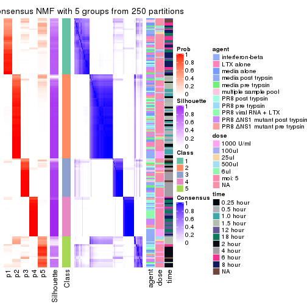</p>

</div>
<div id='tab-SD-NMF-consensus-heatmap-5'>
<pre><code class="r">consensus_heatmap(res, k = 6)
</code></pre>

<p></p>

</div>
</div>

Heatmaps for the membership of samples in all partitions to see how consistent they are:


<script>
$( function() {
	$( '#tabs-SD-NMF-membership-heatmap' ).tabs();
} );
</script>
<div id='tabs-SD-NMF-membership-heatmap'>
<ul>
<li><a href='#tab-SD-NMF-membership-heatmap-1'>k = 2</a></li>
<li><a href='#tab-SD-NMF-membership-heatmap-2'>k = 3</a></li>
<li><a href='#tab-SD-NMF-membership-heatmap-3'>k = 4</a></li>
<li><a href='#tab-SD-NMF-membership-heatmap-4'>k = 5</a></li>
<li><a href='#tab-SD-NMF-membership-heatmap-5'>k = 6</a></li>
</ul>
<div id='tab-SD-NMF-membership-heatmap-1'>
<pre><code class="r">membership_heatmap(res, k = 2)
</code></pre>

<p></p>

</div>
<div id='tab-SD-NMF-membership-heatmap-2'>
<pre><code class="r">membership_heatmap(res, k = 3)
</code></pre>

<p></p>

</div>
<div id='tab-SD-NMF-membership-heatmap-3'>
<pre><code class="r">membership_heatmap(res, k = 4)
</code></pre>

<p></p>

</div>
<div id='tab-SD-NMF-membership-heatmap-4'>
<pre><code class="r">membership_heatmap(res, k = 5)
</code></pre>

<p></p>

</div>
<div id='tab-SD-NMF-membership-heatmap-5'>
<pre><code class="r">membership_heatmap(res, k = 6)
</code></pre>

<p></p>

</div>
</div>

As soon as we have had the classes for columns, we can look for signatures
which are significantly different between classes which can be candidate marks
for certain classes. Following are the heatmaps for signatures.


Signature heatmaps where rows are scaled:


<script>
$( function() {
	$( '#tabs-SD-NMF-get-signatures' ).tabs();
} );
</script>
<div id='tabs-SD-NMF-get-signatures'>
<ul>
<li><a href='#tab-SD-NMF-get-signatures-1'>k = 2</a></li>
<li><a href='#tab-SD-NMF-get-signatures-2'>k = 3</a></li>
<li><a href='#tab-SD-NMF-get-signatures-3'>k = 4</a></li>
<li><a href='#tab-SD-NMF-get-signatures-4'>k = 5</a></li>
<li><a href='#tab-SD-NMF-get-signatures-5'>k = 6</a></li>
</ul>
<div id='tab-SD-NMF-get-signatures-1'>
<pre><code class="r">get_signatures(res, k = 2)
</code></pre>

<p></p>

</div>
<div id='tab-SD-NMF-get-signatures-2'>
<pre><code class="r">get_signatures(res, k = 3)
</code></pre>

<p></p>

</div>
<div id='tab-SD-NMF-get-signatures-3'>
<pre><code class="r">get_signatures(res, k = 4)
</code></pre>

<p></p>

</div>
<div id='tab-SD-NMF-get-signatures-4'>
<pre><code class="r">get_signatures(res, k = 5)
</code></pre>

<p></p>

</div>
<div id='tab-SD-NMF-get-signatures-5'>
<pre><code class="r">get_signatures(res, k = 6)
</code></pre>

<p></p>

</div>
</div>


Signature heatmaps where rows are not scaled:


<script>
$( function() {
	$( '#tabs-SD-NMF-get-signatures-no-scale' ).tabs();
} );
</script>
<div id='tabs-SD-NMF-get-signatures-no-scale'>
<ul>
<li><a href='#tab-SD-NMF-get-signatures-no-scale-1'>k = 2</a></li>
<li><a href='#tab-SD-NMF-get-signatures-no-scale-2'>k = 3</a></li>
<li><a href='#tab-SD-NMF-get-signatures-no-scale-3'>k = 4</a></li>
<li><a href='#tab-SD-NMF-get-signatures-no-scale-4'>k = 5</a></li>
<li><a href='#tab-SD-NMF-get-signatures-no-scale-5'>k = 6</a></li>
</ul>
<div id='tab-SD-NMF-get-signatures-no-scale-1'>
<pre><code class="r">get_signatures(res, k = 2, scale_rows = FALSE)
</code></pre>

<p></p>

</div>
<div id='tab-SD-NMF-get-signatures-no-scale-2'>
<pre><code class="r">get_signatures(res, k = 3, scale_rows = FALSE)
</code></pre>

<p></p>

</div>
<div id='tab-SD-NMF-get-signatures-no-scale-3'>
<pre><code class="r">get_signatures(res, k = 4, scale_rows = FALSE)
</code></pre>

<p></p>

</div>
<div id='tab-SD-NMF-get-signatures-no-scale-4'>
<pre><code class="r">get_signatures(res, k = 5, scale_rows = FALSE)
</code></pre>

<p></p>

</div>
<div id='tab-SD-NMF-get-signatures-no-scale-5'>
<pre><code class="r">get_signatures(res, k = 6, scale_rows = FALSE)
</code></pre>

<p></p>

</div>
</div>


Compare the overlap of signatures from different k:

```r
compare_signatures(res)
```


`get_signature()` returns a data frame invisibly. TO get the list of signatures, the function
call should be assigned to a variable explicitly. In following code, if `plot` argument is set
to `FALSE`, no heatmap is plotted while only the differential analysis is performed.

```r
# code only for demonstration
tb = get_signature(res, k = ..., plot = FALSE)
```

An example of the output of `tb` is:

```
#>   which_row         fdr    mean_1    mean_2 scaled_mean_1 scaled_mean_2 km
#> 1        38 0.042760348  8.373488  9.131774    -0.5533452     0.5164555  1
#> 2        40 0.018707592  7.106213  8.469186    -0.6173731     0.5762149  1
#> 3        55 0.019134737 10.221463 11.207825    -0.6159697     0.5749050  1
#> 4        59 0.006059896  5.921854  7.869574    -0.6899429     0.6439467  1
#> 5        60 0.018055526  8.928898 10.211722    -0.6204761     0.5791110  1
#> 6        98 0.009384629 15.714769 14.887706     0.6635654    -0.6193277  2
...
```

The columns in `tb` are:

1. `which_row`: row indices corresponding to the input matrix.
2. `fdr`: FDR for the differential test. 
3. `mean_x`: The mean value in group x.
4. `scaled_mean_x`: The mean value in group x after rows are scaled.
5. `km`: Row groups if k-means clustering is applied to rows.


UMAP plot which shows how samples are separated.


<script>
$( function() {
	$( '#tabs-SD-NMF-dimension-reduction' ).tabs();
} );
</script>
<div id='tabs-SD-NMF-dimension-reduction'>
<ul>
<li><a href='#tab-SD-NMF-dimension-reduction-1'>k = 2</a></li>
<li><a href='#tab-SD-NMF-dimension-reduction-2'>k = 3</a></li>
<li><a href='#tab-SD-NMF-dimension-reduction-3'>k = 4</a></li>
<li><a href='#tab-SD-NMF-dimension-reduction-4'>k = 5</a></li>
<li><a href='#tab-SD-NMF-dimension-reduction-5'>k = 6</a></li>
</ul>
<div id='tab-SD-NMF-dimension-reduction-1'>
<pre><code class="r">dimension_reduction(res, k = 2, method = &quot;UMAP&quot;)
</code></pre>

<p></p>

</div>
<div id='tab-SD-NMF-dimension-reduction-2'>
<pre><code class="r">dimension_reduction(res, k = 3, method = &quot;UMAP&quot;)
</code></pre>

<p></p>

</div>
<div id='tab-SD-NMF-dimension-reduction-3'>
<pre><code class="r">dimension_reduction(res, k = 4, method = &quot;UMAP&quot;)
</code></pre>

<p>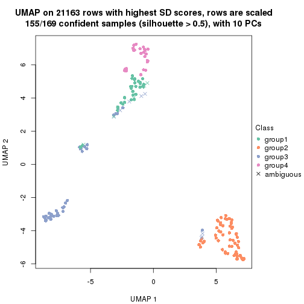</p>

</div>
<div id='tab-SD-NMF-dimension-reduction-4'>
<pre><code class="r">dimension_reduction(res, k = 5, method = &quot;UMAP&quot;)
</code></pre>

<p></p>

</div>
<div id='tab-SD-NMF-dimension-reduction-5'>
<pre><code class="r">dimension_reduction(res, k = 6, method = &quot;UMAP&quot;)
</code></pre>

<p></p>

</div>
</div>


Following heatmap shows how subgroups are split when increasing `k`:

```r
collect_classes(res)
```


Test correlation between subgroups and known annotations. If the known
annotation is numeric, one-way ANOVA test is applied, and if the known
annotation is discrete, chi-squared contingency table test is applied.

```r
test_to_known_factors(res)
```

```
#>          n agent(p) dose(p)  time(p) k
#> SD:NMF 167  0.85955 0.99881 3.81e-27 2
#> SD:NMF 153  0.01043 0.00367 5.55e-36 3
#> SD:NMF 155  0.00477 0.00682 2.43e-44 4
#> SD:NMF 156  0.06507 0.00689 8.68e-68 5
#> SD:NMF 153  0.00486 0.00817 4.93e-63 6
```


If matrix rows can be associated to genes, consider to use `GO_Enrichment(res,
...)` to perform function enrichment for the signature genes.


 

---------------------------------------------------


### CV:hclust


The object with results only for a single top-value method and a single partition method 
can be extracted as:

```r
res = res_list["CV", "hclust"]
# you can also extract it by
# res = res_list["CV:hclust"]
```

A summary of `res` and all the functions that can be applied to it:

```r
res
```

```
#> A 'ConsensusPartition' object with k = 2, 3, 4, 5, 6.
#>   On a matrix with 21163 rows and 169 columns.
#>   Top rows (1000, 2000, 3000, 4000, 5000) are extracted by 'CV' method.
#>   Subgroups are detected by 'hclust' method.
#>   Performed in total 1250 partitions by row resampling.
#>   Best k for subgroups seems to be 4.
#> 
#> Following methods can be applied to this 'ConsensusPartition' object:
#>  [1] "cola_report"             "collect_classes"         "collect_plots"          
#>  [4] "collect_stats"           "colnames"                "compare_signatures"     
#>  [7] "consensus_heatmap"       "dimension_reduction"     "functional_enrichment"  
#> [10] "get_anno_col"            "get_anno"                "get_classes"            
#> [13] "get_consensus"           "get_matrix"              "get_membership"         
#> [16] "get_param"               "get_signatures"          "get_stats"              
#> [19] "is_best_k"               "is_stable_k"             "membership_heatmap"     
#> [22] "ncol"                    "nrow"                    "plot_ecdf"              
#> [25] "rownames"                "select_partition_number" "show"                   
#> [28] "suggest_best_k"          "test_to_known_factors"
```

`collect_plots()` function collects all the plots made from `res` for all `k` (number of partitions)
into one single page to provide an easy and fast comparison between different `k`.

```r
collect_plots(res)
```


The plots are:

- The first row: a plot of the ECDF (Empirical cumulative distribution
  function) curves of the consensus matrix for each `k` and the heatmap of
  predicted classes for each `k`.
- The second row: heatmaps of the consensus matrix for each `k`.
- The third row: heatmaps of the membership matrix for each `k`.
- The fouth row: heatmaps of the signatures for each `k`.

All the plots in panels can be made by individual functions and they are
plotted later in this section.

`select_partition_number()` produces several plots showing different
statistics for choosing "optimized" `k`. There are following statistics:

- ECDF curves of the consensus matrix for each `k`;
- 1-PAC. [The PAC
  score](https://en.wikipedia.org/wiki/Consensus_clustering#Over-interpretation_potential_of_consensus_clustering)
  measures the proportion of the ambiguous subgrouping.
- Mean silhouette score.
- Concordance. The mean probability of fiting the consensus class ids in all
  partitions.
- Area increased. Denote $A_k$ as the area under the ECDF curve for current
  `k`, the area increased is defined as $A_k - A_{k-1}$.
- Rand index. The percent of pairs of samples that are both in a same cluster
  or both are not in a same cluster in the partition of k and k-1.
- Jaccard index. The ratio of pairs of samples are both in a same cluster in
  the partition of k and k-1 and the pairs of samples are both in a same
  cluster in the partition k or k-1.

The detailed explanations of these statistics can be found in [the cola
vignette](http://bioconductor.org/packages/devel/bioc/vignettes/cola/inst/doc/cola.html#toc_13).

Generally speaking, lower PAC score, higher mean silhouette score or higher
concordance corresponds to better partition. Rand index and Jaccard index
measure how similar the current partition is compared to partition with `k-1`.
If they are too similar, we won't accept `k` is better than `k-1`.

```r
select_partition_number(res)
```


The numeric values for all these statistics can be obtained by `get_stats()`.

```r
get_stats(res)
```

```
#>   k 1-PAC mean_silhouette concordance area_increased  Rand Jaccard
#> 2 2 0.837           0.878       0.952         0.1836 0.878   0.878
#> 3 3 0.374           0.646       0.765         1.8914 0.576   0.517
#> 4 4 0.715           0.708       0.836         0.1909 0.871   0.725
#> 5 5 0.769           0.835       0.877         0.1384 0.851   0.613
#> 6 6 0.790           0.821       0.887         0.0326 0.998   0.992
```

`suggest_best_k()` suggests the best $k$ based on these statistics. The rules are as follows:

- All $k$ with Jaccard index larger than 0.95 are removed because the increase of
  the partition number does not provides enough extra information. If all $k$ are removed,
  the best $k$ is assigned by `NA`.
- For $k$ with 1-PAC larger than 0.9, the maximal $k$ is taken as the "best k". Other $k$ is called "optional k".
- If it does not fit the second rule. The $k$ with the highest vote of highest
  1-PAC, mean silhouette and concordance is taken as the "best k".

```r
suggest_best_k(res)
```

```
#> [1] 4
```


Following shows the table of the partitions (You need to click the **show/hide
code output** link to see it). The membership matrix (columns with name `p*`)
is inferred by
[`clue::cl_consensus()`](https://www.rdocumentation.org/link/cl_consensus?package=clue)
function with the `SE` method. Basically the value in the membership matrix
represents the probability to belong to a certain group. The finall class
label for an item is determined with the group with highest probability it
belongs to.

In `get_classes()` function, the entropy is calculated from the membership
matrix and the silhouette score is calculated from the consensus matrix.


<script>
$( function() {
	$( '#tabs-CV-hclust-get-classes' ).tabs();
} );
</script>
<div id='tabs-CV-hclust-get-classes'>
<ul>
<li><a href='#tab-CV-hclust-get-classes-1'>k = 2</a></li>
<li><a href='#tab-CV-hclust-get-classes-2'>k = 3</a></li>
<li><a href='#tab-CV-hclust-get-classes-3'>k = 4</a></li>
<li><a href='#tab-CV-hclust-get-classes-4'>k = 5</a></li>
<li><a href='#tab-CV-hclust-get-classes-5'>k = 6</a></li>
</ul>

<div id='tab-CV-hclust-get-classes-1'>
<p><a id='tab-CV-hclust-get-classes-1-a' style='color:#0366d6' href='#'>show/hide code output</a></p>
<pre><code class="r">cbind(get_classes(res, k = 2), get_membership(res, k = 2))
</code></pre>

<pre><code>#&gt;           class entropy silhouette    p1    p2
#&gt; GSM528681     1   0.000      0.949 1.000 0.000
#&gt; GSM528682     1   0.000      0.949 1.000 0.000
#&gt; GSM528683     1   0.000      0.949 1.000 0.000
#&gt; GSM528684     1   0.000      0.949 1.000 0.000
#&gt; GSM528687     1   0.000      0.949 1.000 0.000
#&gt; GSM528688     1   0.000      0.949 1.000 0.000
#&gt; GSM528685     1   0.000      0.949 1.000 0.000
#&gt; GSM528686     1   0.000      0.949 1.000 0.000
#&gt; GSM528693     1   0.358      0.886 0.932 0.068
#&gt; GSM528694     1   0.358      0.886 0.932 0.068
#&gt; GSM528695     1   0.634      0.779 0.840 0.160
#&gt; GSM528696     1   0.634      0.779 0.840 0.160
#&gt; GSM528697     1   0.958      0.391 0.620 0.380
#&gt; GSM528698     1   0.958      0.391 0.620 0.380
#&gt; GSM528699     1   0.992      0.216 0.552 0.448
#&gt; GSM528700     1   0.992      0.216 0.552 0.448
#&gt; GSM528689     1   0.994      0.191 0.544 0.456
#&gt; GSM528690     1   0.994      0.191 0.544 0.456
#&gt; GSM528691     1   0.994      0.191 0.544 0.456
#&gt; GSM528692     1   0.994      0.191 0.544 0.456
#&gt; GSM528779     1   0.000      0.949 1.000 0.000
#&gt; GSM528780     1   0.000      0.949 1.000 0.000
#&gt; GSM528782     1   0.000      0.949 1.000 0.000
#&gt; GSM528781     1   0.000      0.949 1.000 0.000
#&gt; GSM528785     1   0.000      0.949 1.000 0.000
#&gt; GSM528786     1   0.000      0.949 1.000 0.000
#&gt; GSM528787     1   0.000      0.949 1.000 0.000
#&gt; GSM528788     1   0.000      0.949 1.000 0.000
#&gt; GSM528783     1   0.343      0.890 0.936 0.064
#&gt; GSM528784     2   0.625      0.882 0.156 0.844
#&gt; GSM528759     1   0.000      0.949 1.000 0.000
#&gt; GSM528760     1   0.000      0.949 1.000 0.000
#&gt; GSM528761     1   0.000      0.949 1.000 0.000
#&gt; GSM528762     1   0.000      0.949 1.000 0.000
#&gt; GSM528765     1   0.000      0.949 1.000 0.000
#&gt; GSM528766     1   0.000      0.949 1.000 0.000
#&gt; GSM528763     1   0.000      0.949 1.000 0.000
#&gt; GSM528764     1   0.000      0.949 1.000 0.000
#&gt; GSM528771     1   0.000      0.949 1.000 0.000
#&gt; GSM528772     1   0.000      0.949 1.000 0.000
#&gt; GSM528773     1   0.000      0.949 1.000 0.000
#&gt; GSM528774     1   0.000      0.949 1.000 0.000
#&gt; GSM528775     1   0.000      0.949 1.000 0.000
#&gt; GSM528776     1   0.000      0.949 1.000 0.000
#&gt; GSM528777     1   0.000      0.949 1.000 0.000
#&gt; GSM528778     1   0.000      0.949 1.000 0.000
#&gt; GSM528767     2   0.625      0.882 0.156 0.844
#&gt; GSM528768     2   0.625      0.882 0.156 0.844
#&gt; GSM528769     2   0.625      0.882 0.156 0.844
#&gt; GSM528770     2   0.625      0.882 0.156 0.844
#&gt; GSM528671     1   0.000      0.949 1.000 0.000
#&gt; GSM528672     1   0.000      0.949 1.000 0.000
#&gt; GSM528674     1   0.000      0.949 1.000 0.000
#&gt; GSM528673     1   0.000      0.949 1.000 0.000
#&gt; GSM528677     1   0.000      0.949 1.000 0.000
#&gt; GSM528678     1   0.000      0.949 1.000 0.000
#&gt; GSM528679     1   0.000      0.949 1.000 0.000
#&gt; GSM528680     1   0.983      0.281 0.576 0.424
#&gt; GSM528675     2   0.000      0.916 0.000 1.000
#&gt; GSM528676     2   0.000      0.916 0.000 1.000
#&gt; GSM528651     1   0.000      0.949 1.000 0.000
#&gt; GSM528652     1   0.000      0.949 1.000 0.000
#&gt; GSM528653     1   0.000      0.949 1.000 0.000
#&gt; GSM528654     1   0.000      0.949 1.000 0.000
#&gt; GSM528657     1   0.000      0.949 1.000 0.000
#&gt; GSM528658     1   0.000      0.949 1.000 0.000
#&gt; GSM528655     1   0.000      0.949 1.000 0.000
#&gt; GSM528656     1   0.000      0.949 1.000 0.000
#&gt; GSM528663     1   0.000      0.949 1.000 0.000
#&gt; GSM528664     1   0.000      0.949 1.000 0.000
#&gt; GSM528665     1   0.000      0.949 1.000 0.000
#&gt; GSM528666     1   0.000      0.949 1.000 0.000
#&gt; GSM528667     1   0.000      0.949 1.000 0.000
#&gt; GSM528668     1   0.000      0.949 1.000 0.000
#&gt; GSM528669     1   0.000      0.949 1.000 0.000
#&gt; GSM528670     1   0.000      0.949 1.000 0.000
#&gt; GSM528659     2   0.000      0.916 0.000 1.000
#&gt; GSM528660     2   0.000      0.916 0.000 1.000
#&gt; GSM528661     2   0.000      0.916 0.000 1.000
#&gt; GSM528662     2   0.000      0.916 0.000 1.000
#&gt; GSM528701     1   0.000      0.949 1.000 0.000
#&gt; GSM528702     1   0.000      0.949 1.000 0.000
#&gt; GSM528703     1   0.000      0.949 1.000 0.000
#&gt; GSM528704     1   0.000      0.949 1.000 0.000
#&gt; GSM528707     1   0.000      0.949 1.000 0.000
#&gt; GSM528708     1   0.000      0.949 1.000 0.000
#&gt; GSM528705     1   0.000      0.949 1.000 0.000
#&gt; GSM528706     1   0.000      0.949 1.000 0.000
#&gt; GSM528713     1   0.000      0.949 1.000 0.000
#&gt; GSM528714     1   0.000      0.949 1.000 0.000
#&gt; GSM528715     1   0.000      0.949 1.000 0.000
#&gt; GSM528716     1   0.000      0.949 1.000 0.000
#&gt; GSM528717     1   0.358      0.886 0.932 0.068
#&gt; GSM528718     1   0.358      0.886 0.932 0.068
#&gt; GSM528719     1   0.992      0.216 0.552 0.448
#&gt; GSM528720     1   0.992      0.216 0.552 0.448
#&gt; GSM528709     1   0.994      0.191 0.544 0.456
#&gt; GSM528710     1   0.994      0.191 0.544 0.456
#&gt; GSM528711     1   0.994      0.191 0.544 0.456
#&gt; GSM528712     1   0.994      0.191 0.544 0.456
#&gt; GSM528721     1   0.000      0.949 1.000 0.000
#&gt; GSM528722     1   0.000      0.949 1.000 0.000
#&gt; GSM528723     1   0.000      0.949 1.000 0.000
#&gt; GSM528724     1   0.000      0.949 1.000 0.000
#&gt; GSM528727     1   0.000      0.949 1.000 0.000
#&gt; GSM528728     1   0.000      0.949 1.000 0.000
#&gt; GSM528725     1   0.000      0.949 1.000 0.000
#&gt; GSM528726     1   0.000      0.949 1.000 0.000
#&gt; GSM528733     1   0.000      0.949 1.000 0.000
#&gt; GSM528734     1   0.000      0.949 1.000 0.000
#&gt; GSM528735     1   0.000      0.949 1.000 0.000
#&gt; GSM528736     1   0.000      0.949 1.000 0.000
#&gt; GSM528737     1   0.000      0.949 1.000 0.000
#&gt; GSM528738     1   0.000      0.949 1.000 0.000
#&gt; GSM528729     1   0.000      0.949 1.000 0.000
#&gt; GSM528730     1   0.000      0.949 1.000 0.000
#&gt; GSM528731     1   0.000      0.949 1.000 0.000
#&gt; GSM528732     1   0.000      0.949 1.000 0.000
#&gt; GSM528739     1   0.000      0.949 1.000 0.000
#&gt; GSM528740     1   0.000      0.949 1.000 0.000
#&gt; GSM528741     1   0.000      0.949 1.000 0.000
#&gt; GSM528742     1   0.000      0.949 1.000 0.000
#&gt; GSM528745     1   0.000      0.949 1.000 0.000
#&gt; GSM528746     1   0.000      0.949 1.000 0.000
#&gt; GSM528743     1   0.000      0.949 1.000 0.000
#&gt; GSM528744     1   0.000      0.949 1.000 0.000
#&gt; GSM528751     1   0.000      0.949 1.000 0.000
#&gt; GSM528752     1   0.000      0.949 1.000 0.000
#&gt; GSM528753     1   0.000      0.949 1.000 0.000
#&gt; GSM528754     1   0.000      0.949 1.000 0.000
#&gt; GSM528755     1   0.000      0.949 1.000 0.000
#&gt; GSM528756     1   0.000      0.949 1.000 0.000
#&gt; GSM528757     1   0.000      0.949 1.000 0.000
#&gt; GSM528758     1   0.000      0.949 1.000 0.000
#&gt; GSM528747     1   0.000      0.949 1.000 0.000
#&gt; GSM528748     1   0.000      0.949 1.000 0.000
#&gt; GSM528749     1   0.000      0.949 1.000 0.000
#&gt; GSM528750     1   0.000      0.949 1.000 0.000
#&gt; GSM528640     1   0.000      0.949 1.000 0.000
#&gt; GSM528641     1   0.000      0.949 1.000 0.000
#&gt; GSM528643     1   0.000      0.949 1.000 0.000
#&gt; GSM528644     1   0.000      0.949 1.000 0.000
#&gt; GSM528642     1   0.000      0.949 1.000 0.000
#&gt; GSM528620     1   0.000      0.949 1.000 0.000
#&gt; GSM528621     1   0.000      0.949 1.000 0.000
#&gt; GSM528623     1   0.000      0.949 1.000 0.000
#&gt; GSM528624     1   0.000      0.949 1.000 0.000
#&gt; GSM528622     1   0.000      0.949 1.000 0.000
#&gt; GSM528625     1   0.000      0.949 1.000 0.000
#&gt; GSM528626     1   0.000      0.949 1.000 0.000
#&gt; GSM528628     1   0.000      0.949 1.000 0.000
#&gt; GSM528629     1   0.000      0.949 1.000 0.000
#&gt; GSM528627     1   0.000      0.949 1.000 0.000
#&gt; GSM528630     1   0.000      0.949 1.000 0.000
#&gt; GSM528631     1   0.000      0.949 1.000 0.000
#&gt; GSM528632     1   0.000      0.949 1.000 0.000
#&gt; GSM528633     1   0.000      0.949 1.000 0.000
#&gt; GSM528636     1   0.000      0.949 1.000 0.000
#&gt; GSM528637     1   0.000      0.949 1.000 0.000
#&gt; GSM528638     1   0.000      0.949 1.000 0.000
#&gt; GSM528639     1   0.000      0.949 1.000 0.000
#&gt; GSM528634     1   0.000      0.949 1.000 0.000
#&gt; GSM528635     1   0.000      0.949 1.000 0.000
#&gt; GSM528645     1   0.000      0.949 1.000 0.000
#&gt; GSM528646     1   0.000      0.949 1.000 0.000
#&gt; GSM528647     1   0.000      0.949 1.000 0.000
#&gt; GSM528648     1   0.000      0.949 1.000 0.000
#&gt; GSM528649     1   0.000      0.949 1.000 0.000
#&gt; GSM528650     1   0.000      0.949 1.000 0.000
</code></pre>

<script>
$('#tab-CV-hclust-get-classes-1-a').parent().next().next().hide();
$('#tab-CV-hclust-get-classes-1-a').click(function(){
  $('#tab-CV-hclust-get-classes-1-a').parent().next().next().toggle();
  return(false);
});
</script>
</div>

<div id='tab-CV-hclust-get-classes-2'>
<p><a id='tab-CV-hclust-get-classes-2-a' style='color:#0366d6' href='#'>show/hide code output</a></p>
<pre><code class="r">cbind(get_classes(res, k = 3), get_membership(res, k = 3))
</code></pre>

<pre><code>#&gt;           class entropy silhouette    p1    p2    p3
#&gt; GSM528681     2  0.0000    0.93678 0.000 1.000 0.000
#&gt; GSM528682     2  0.0000    0.93678 0.000 1.000 0.000
#&gt; GSM528683     2  0.0000    0.93678 0.000 1.000 0.000
#&gt; GSM528684     2  0.0000    0.93678 0.000 1.000 0.000
#&gt; GSM528687     2  0.0000    0.93678 0.000 1.000 0.000
#&gt; GSM528688     2  0.0000    0.93678 0.000 1.000 0.000
#&gt; GSM528685     2  0.4346    0.69806 0.000 0.816 0.184
#&gt; GSM528686     2  0.4346    0.69806 0.000 0.816 0.184
#&gt; GSM528693     3  0.6079    0.44355 0.000 0.388 0.612
#&gt; GSM528694     3  0.6079    0.44355 0.000 0.388 0.612
#&gt; GSM528695     3  0.7806    0.39499 0.064 0.352 0.584
#&gt; GSM528696     3  0.7806    0.39499 0.064 0.352 0.584
#&gt; GSM528697     3  0.5831    0.10778 0.284 0.008 0.708
#&gt; GSM528698     3  0.5831    0.10778 0.284 0.008 0.708
#&gt; GSM528699     3  0.6126   -0.03979 0.352 0.004 0.644
#&gt; GSM528700     3  0.6126   -0.03979 0.352 0.004 0.644
#&gt; GSM528689     3  0.6247   -0.05714 0.376 0.004 0.620
#&gt; GSM528690     3  0.6247   -0.05714 0.376 0.004 0.620
#&gt; GSM528691     3  0.6247   -0.05714 0.376 0.004 0.620
#&gt; GSM528692     3  0.6247   -0.05714 0.376 0.004 0.620
#&gt; GSM528779     2  0.0000    0.93678 0.000 1.000 0.000
#&gt; GSM528780     2  0.0000    0.93678 0.000 1.000 0.000
#&gt; GSM528782     2  0.0000    0.93678 0.000 1.000 0.000
#&gt; GSM528781     2  0.0237    0.93323 0.000 0.996 0.004
#&gt; GSM528785     3  0.6302    0.41455 0.000 0.480 0.520
#&gt; GSM528786     3  0.6299    0.41937 0.000 0.476 0.524
#&gt; GSM528787     3  0.6154    0.50278 0.000 0.408 0.592
#&gt; GSM528788     3  0.3752    0.67258 0.000 0.144 0.856
#&gt; GSM528783     3  0.4544    0.55087 0.084 0.056 0.860
#&gt; GSM528784     1  0.4068    0.90353 0.864 0.016 0.120
#&gt; GSM528759     3  0.3412    0.67338 0.000 0.124 0.876
#&gt; GSM528760     3  0.3412    0.67338 0.000 0.124 0.876
#&gt; GSM528761     2  0.0000    0.93678 0.000 1.000 0.000
#&gt; GSM528762     2  0.0000    0.93678 0.000 1.000 0.000
#&gt; GSM528765     2  0.0000    0.93678 0.000 1.000 0.000
#&gt; GSM528766     2  0.0000    0.93678 0.000 1.000 0.000
#&gt; GSM528763     2  0.4062    0.73121 0.000 0.836 0.164
#&gt; GSM528764     2  0.4346    0.69806 0.000 0.816 0.184
#&gt; GSM528771     3  0.6302    0.41455 0.000 0.480 0.520
#&gt; GSM528772     3  0.6302    0.41455 0.000 0.480 0.520
#&gt; GSM528773     3  0.6299    0.41937 0.000 0.476 0.524
#&gt; GSM528774     3  0.6299    0.41937 0.000 0.476 0.524
#&gt; GSM528775     3  0.6154    0.50278 0.000 0.408 0.592
#&gt; GSM528776     3  0.3192    0.66506 0.000 0.112 0.888
#&gt; GSM528777     3  0.3267    0.66313 0.000 0.116 0.884
#&gt; GSM528778     3  0.3267    0.66313 0.000 0.116 0.884
#&gt; GSM528767     1  0.4068    0.90353 0.864 0.016 0.120
#&gt; GSM528768     1  0.4068    0.90353 0.864 0.016 0.120
#&gt; GSM528769     1  0.4068    0.90353 0.864 0.016 0.120
#&gt; GSM528770     1  0.4068    0.90353 0.864 0.016 0.120
#&gt; GSM528671     2  0.0000    0.93678 0.000 1.000 0.000
#&gt; GSM528672     2  0.0000    0.93678 0.000 1.000 0.000
#&gt; GSM528674     2  0.0000    0.93678 0.000 1.000 0.000
#&gt; GSM528673     2  0.4346    0.69806 0.000 0.816 0.184
#&gt; GSM528677     3  0.6302    0.41455 0.000 0.480 0.520
#&gt; GSM528678     3  0.6299    0.41937 0.000 0.476 0.524
#&gt; GSM528679     3  0.3412    0.67338 0.000 0.124 0.876
#&gt; GSM528680     3  0.6333   -0.00156 0.332 0.012 0.656
#&gt; GSM528675     1  0.1529    0.92659 0.960 0.000 0.040
#&gt; GSM528676     1  0.1529    0.92659 0.960 0.000 0.040
#&gt; GSM528651     2  0.0000    0.93678 0.000 1.000 0.000
#&gt; GSM528652     2  0.0000    0.93678 0.000 1.000 0.000
#&gt; GSM528653     2  0.0000    0.93678 0.000 1.000 0.000
#&gt; GSM528654     2  0.0000    0.93678 0.000 1.000 0.000
#&gt; GSM528657     2  0.0000    0.93678 0.000 1.000 0.000
#&gt; GSM528658     2  0.0000    0.93678 0.000 1.000 0.000
#&gt; GSM528655     2  0.4346    0.69806 0.000 0.816 0.184
#&gt; GSM528656     2  0.4346    0.69806 0.000 0.816 0.184
#&gt; GSM528663     3  0.6302    0.41455 0.000 0.480 0.520
#&gt; GSM528664     3  0.6302    0.41455 0.000 0.480 0.520
#&gt; GSM528665     3  0.6299    0.41937 0.000 0.476 0.524
#&gt; GSM528666     3  0.6299    0.41937 0.000 0.476 0.524
#&gt; GSM528667     3  0.3412    0.67338 0.000 0.124 0.876
#&gt; GSM528668     3  0.3412    0.67338 0.000 0.124 0.876
#&gt; GSM528669     3  0.3267    0.66313 0.000 0.116 0.884
#&gt; GSM528670     3  0.3267    0.66313 0.000 0.116 0.884
#&gt; GSM528659     1  0.1529    0.92659 0.960 0.000 0.040
#&gt; GSM528660     1  0.1529    0.92659 0.960 0.000 0.040
#&gt; GSM528661     1  0.1529    0.92659 0.960 0.000 0.040
#&gt; GSM528662     1  0.1529    0.92659 0.960 0.000 0.040
#&gt; GSM528701     2  0.0000    0.93678 0.000 1.000 0.000
#&gt; GSM528702     2  0.0000    0.93678 0.000 1.000 0.000
#&gt; GSM528703     2  0.0000    0.93678 0.000 1.000 0.000
#&gt; GSM528704     2  0.0000    0.93678 0.000 1.000 0.000
#&gt; GSM528707     2  0.0000    0.93678 0.000 1.000 0.000
#&gt; GSM528708     2  0.0000    0.93678 0.000 1.000 0.000
#&gt; GSM528705     2  0.0000    0.93678 0.000 1.000 0.000
#&gt; GSM528706     2  0.0000    0.93678 0.000 1.000 0.000
#&gt; GSM528713     3  0.6302    0.41455 0.000 0.480 0.520
#&gt; GSM528714     3  0.6302    0.41455 0.000 0.480 0.520
#&gt; GSM528715     3  0.6299    0.41937 0.000 0.476 0.524
#&gt; GSM528716     3  0.6299    0.41937 0.000 0.476 0.524
#&gt; GSM528717     3  0.1411    0.58421 0.000 0.036 0.964
#&gt; GSM528718     3  0.1411    0.58421 0.000 0.036 0.964
#&gt; GSM528719     3  0.6126   -0.03979 0.352 0.004 0.644
#&gt; GSM528720     3  0.6126   -0.03979 0.352 0.004 0.644
#&gt; GSM528709     3  0.6247   -0.05714 0.376 0.004 0.620
#&gt; GSM528710     3  0.6247   -0.05714 0.376 0.004 0.620
#&gt; GSM528711     3  0.6247   -0.05714 0.376 0.004 0.620
#&gt; GSM528712     3  0.6247   -0.05714 0.376 0.004 0.620
#&gt; GSM528721     2  0.0000    0.93678 0.000 1.000 0.000
#&gt; GSM528722     2  0.0000    0.93678 0.000 1.000 0.000
#&gt; GSM528723     2  0.0000    0.93678 0.000 1.000 0.000
#&gt; GSM528724     2  0.0000    0.93678 0.000 1.000 0.000
#&gt; GSM528727     2  0.0000    0.93678 0.000 1.000 0.000
#&gt; GSM528728     2  0.0000    0.93678 0.000 1.000 0.000
#&gt; GSM528725     2  0.0000    0.93678 0.000 1.000 0.000
#&gt; GSM528726     2  0.0000    0.93678 0.000 1.000 0.000
#&gt; GSM528733     3  0.6299    0.41937 0.000 0.476 0.524
#&gt; GSM528734     3  0.6299    0.41937 0.000 0.476 0.524
#&gt; GSM528735     3  0.3412    0.67338 0.000 0.124 0.876
#&gt; GSM528736     3  0.3412    0.67338 0.000 0.124 0.876
#&gt; GSM528737     3  0.3412    0.67338 0.000 0.124 0.876
#&gt; GSM528738     3  0.3412    0.67338 0.000 0.124 0.876
#&gt; GSM528729     3  0.3267    0.66313 0.000 0.116 0.884
#&gt; GSM528730     3  0.3267    0.66313 0.000 0.116 0.884
#&gt; GSM528731     3  0.3752    0.67258 0.000 0.144 0.856
#&gt; GSM528732     3  0.3752    0.67258 0.000 0.144 0.856
#&gt; GSM528739     2  0.0000    0.93678 0.000 1.000 0.000
#&gt; GSM528740     2  0.0000    0.93678 0.000 1.000 0.000
#&gt; GSM528741     2  0.0000    0.93678 0.000 1.000 0.000
#&gt; GSM528742     2  0.0000    0.93678 0.000 1.000 0.000
#&gt; GSM528745     2  0.0237    0.93323 0.000 0.996 0.004
#&gt; GSM528746     2  0.0000    0.93678 0.000 1.000 0.000
#&gt; GSM528743     2  0.0237    0.93323 0.000 0.996 0.004
#&gt; GSM528744     2  0.0000    0.93678 0.000 1.000 0.000
#&gt; GSM528751     3  0.6302    0.41455 0.000 0.480 0.520
#&gt; GSM528752     3  0.6302    0.41455 0.000 0.480 0.520
#&gt; GSM528753     3  0.6299    0.41937 0.000 0.476 0.524
#&gt; GSM528754     3  0.6299    0.41937 0.000 0.476 0.524
#&gt; GSM528755     3  0.5905    0.55788 0.000 0.352 0.648
#&gt; GSM528756     3  0.5905    0.55788 0.000 0.352 0.648
#&gt; GSM528757     3  0.3752    0.67258 0.000 0.144 0.856
#&gt; GSM528758     3  0.3752    0.67258 0.000 0.144 0.856
#&gt; GSM528747     3  0.3752    0.66986 0.000 0.144 0.856
#&gt; GSM528748     3  0.3752    0.66986 0.000 0.144 0.856
#&gt; GSM528749     3  0.3752    0.67258 0.000 0.144 0.856
#&gt; GSM528750     3  0.3752    0.67258 0.000 0.144 0.856
#&gt; GSM528640     2  0.0000    0.93678 0.000 1.000 0.000
#&gt; GSM528641     2  0.4346    0.69806 0.000 0.816 0.184
#&gt; GSM528643     3  0.6299    0.41937 0.000 0.476 0.524
#&gt; GSM528644     3  0.3752    0.66986 0.000 0.144 0.856
#&gt; GSM528642     3  0.3551    0.66984 0.000 0.132 0.868
#&gt; GSM528620     2  0.0000    0.93678 0.000 1.000 0.000
#&gt; GSM528621     2  0.5621    0.38489 0.000 0.692 0.308
#&gt; GSM528623     3  0.6299    0.41937 0.000 0.476 0.524
#&gt; GSM528624     3  0.3267    0.66313 0.000 0.116 0.884
#&gt; GSM528622     3  0.3482    0.67398 0.000 0.128 0.872
#&gt; GSM528625     2  0.0000    0.93678 0.000 1.000 0.000
#&gt; GSM528626     2  0.5098    0.55454 0.000 0.752 0.248
#&gt; GSM528628     3  0.6299    0.41937 0.000 0.476 0.524
#&gt; GSM528629     3  0.3752    0.66986 0.000 0.144 0.856
#&gt; GSM528627     3  0.3482    0.67398 0.000 0.128 0.872
#&gt; GSM528630     2  0.0000    0.93678 0.000 1.000 0.000
#&gt; GSM528631     2  0.0892    0.91741 0.000 0.980 0.020
#&gt; GSM528632     2  0.5621    0.38489 0.000 0.692 0.308
#&gt; GSM528633     2  0.5621    0.38489 0.000 0.692 0.308
#&gt; GSM528636     3  0.6299    0.41937 0.000 0.476 0.524
#&gt; GSM528637     3  0.6299    0.41937 0.000 0.476 0.524
#&gt; GSM528638     3  0.3267    0.66313 0.000 0.116 0.884
#&gt; GSM528639     3  0.3267    0.66313 0.000 0.116 0.884
#&gt; GSM528634     3  0.3482    0.67398 0.000 0.128 0.872
#&gt; GSM528635     3  0.3482    0.67398 0.000 0.128 0.872
#&gt; GSM528645     3  0.6299    0.41937 0.000 0.476 0.524
#&gt; GSM528646     3  0.6299    0.41937 0.000 0.476 0.524
#&gt; GSM528647     3  0.6299    0.41937 0.000 0.476 0.524
#&gt; GSM528648     3  0.3412    0.67338 0.000 0.124 0.876
#&gt; GSM528649     3  0.3412    0.67338 0.000 0.124 0.876
#&gt; GSM528650     3  0.3412    0.67338 0.000 0.124 0.876
</code></pre>

<script>
$('#tab-CV-hclust-get-classes-2-a').parent().next().next().hide();
$('#tab-CV-hclust-get-classes-2-a').click(function(){
  $('#tab-CV-hclust-get-classes-2-a').parent().next().next().toggle();
  return(false);
});
</script>
</div>

<div id='tab-CV-hclust-get-classes-3'>
<p><a id='tab-CV-hclust-get-classes-3-a' style='color:#0366d6' href='#'>show/hide code output</a></p>
<pre><code class="r">cbind(get_classes(res, k = 4), get_membership(res, k = 4))
</code></pre>

<pre><code>#&gt;           class entropy silhouette    p1    p2    p3    p4
#&gt; GSM528681     2  0.0000    0.92791 0.000 1.000 0.000 0.000
#&gt; GSM528682     2  0.0000    0.92791 0.000 1.000 0.000 0.000
#&gt; GSM528683     2  0.0000    0.92791 0.000 1.000 0.000 0.000
#&gt; GSM528684     2  0.0000    0.92791 0.000 1.000 0.000 0.000
#&gt; GSM528687     2  0.0000    0.92791 0.000 1.000 0.000 0.000
#&gt; GSM528688     2  0.0000    0.92791 0.000 1.000 0.000 0.000
#&gt; GSM528685     2  0.4500    0.54236 0.000 0.684 0.316 0.000
#&gt; GSM528686     2  0.4500    0.54236 0.000 0.684 0.316 0.000
#&gt; GSM528693     3  0.1722    0.61152 0.048 0.000 0.944 0.008
#&gt; GSM528694     3  0.1722    0.61152 0.048 0.000 0.944 0.008
#&gt; GSM528695     3  0.3495    0.47794 0.140 0.000 0.844 0.016
#&gt; GSM528696     3  0.3495    0.47794 0.140 0.000 0.844 0.016
#&gt; GSM528697     1  0.4831    0.50202 0.704 0.000 0.280 0.016
#&gt; GSM528698     1  0.4831    0.50202 0.704 0.000 0.280 0.016
#&gt; GSM528699     1  0.1042    0.73096 0.972 0.000 0.020 0.008
#&gt; GSM528700     1  0.1042    0.73096 0.972 0.000 0.020 0.008
#&gt; GSM528689     1  0.0000    0.73185 1.000 0.000 0.000 0.000
#&gt; GSM528690     1  0.0000    0.73185 1.000 0.000 0.000 0.000
#&gt; GSM528691     1  0.0000    0.73185 1.000 0.000 0.000 0.000
#&gt; GSM528692     1  0.0000    0.73185 1.000 0.000 0.000 0.000
#&gt; GSM528779     2  0.0592    0.91899 0.000 0.984 0.016 0.000
#&gt; GSM528780     2  0.0000    0.92791 0.000 1.000 0.000 0.000
#&gt; GSM528782     2  0.0000    0.92791 0.000 1.000 0.000 0.000
#&gt; GSM528781     2  0.1867    0.87626 0.000 0.928 0.072 0.000
#&gt; GSM528785     3  0.2011    0.69473 0.000 0.080 0.920 0.000
#&gt; GSM528786     3  0.1940    0.69510 0.000 0.076 0.924 0.000
#&gt; GSM528787     3  0.3691    0.68895 0.068 0.076 0.856 0.000
#&gt; GSM528788     3  0.6561    0.58557 0.344 0.092 0.564 0.000
#&gt; GSM528783     1  0.7651    0.40587 0.540 0.016 0.260 0.184
#&gt; GSM528784     4  0.1174    0.90327 0.012 0.000 0.020 0.968
#&gt; GSM528759     3  0.6234    0.60025 0.348 0.068 0.584 0.000
#&gt; GSM528760     3  0.6234    0.60025 0.348 0.068 0.584 0.000
#&gt; GSM528761     2  0.0000    0.92791 0.000 1.000 0.000 0.000
#&gt; GSM528762     2  0.0000    0.92791 0.000 1.000 0.000 0.000
#&gt; GSM528765     2  0.0000    0.92791 0.000 1.000 0.000 0.000
#&gt; GSM528766     2  0.0000    0.92791 0.000 1.000 0.000 0.000
#&gt; GSM528763     2  0.4250    0.61511 0.000 0.724 0.276 0.000
#&gt; GSM528764     2  0.4431    0.56614 0.000 0.696 0.304 0.000
#&gt; GSM528771     3  0.2011    0.69473 0.000 0.080 0.920 0.000
#&gt; GSM528772     3  0.2011    0.69473 0.000 0.080 0.920 0.000
#&gt; GSM528773     3  0.1940    0.69510 0.000 0.076 0.924 0.000
#&gt; GSM528774     3  0.1940    0.69510 0.000 0.076 0.924 0.000
#&gt; GSM528775     3  0.3691    0.68895 0.068 0.076 0.856 0.000
#&gt; GSM528776     3  0.6329    0.58639 0.344 0.064 0.588 0.004
#&gt; GSM528777     3  0.6585    0.57731 0.344 0.072 0.576 0.008
#&gt; GSM528778     3  0.6585    0.57731 0.344 0.072 0.576 0.008
#&gt; GSM528767     4  0.1174    0.90327 0.012 0.000 0.020 0.968
#&gt; GSM528768     4  0.1174    0.90327 0.012 0.000 0.020 0.968
#&gt; GSM528769     4  0.1174    0.90327 0.012 0.000 0.020 0.968
#&gt; GSM528770     4  0.1174    0.90327 0.012 0.000 0.020 0.968
#&gt; GSM528671     2  0.1211    0.90172 0.000 0.960 0.040 0.000
#&gt; GSM528672     2  0.0000    0.92791 0.000 1.000 0.000 0.000
#&gt; GSM528674     2  0.0336    0.92382 0.000 0.992 0.008 0.000
#&gt; GSM528673     2  0.4500    0.54236 0.000 0.684 0.316 0.000
#&gt; GSM528677     3  0.2011    0.69473 0.000 0.080 0.920 0.000
#&gt; GSM528678     3  0.1940    0.69510 0.000 0.076 0.924 0.000
#&gt; GSM528679     3  0.6219    0.60314 0.344 0.068 0.588 0.000
#&gt; GSM528680     1  0.3232    0.69125 0.872 0.004 0.108 0.016
#&gt; GSM528675     4  0.4174    0.91717 0.140 0.000 0.044 0.816
#&gt; GSM528676     4  0.4174    0.91717 0.140 0.000 0.044 0.816
#&gt; GSM528651     2  0.1211    0.90172 0.000 0.960 0.040 0.000
#&gt; GSM528652     2  0.1211    0.90172 0.000 0.960 0.040 0.000
#&gt; GSM528653     2  0.0000    0.92791 0.000 1.000 0.000 0.000
#&gt; GSM528654     2  0.0000    0.92791 0.000 1.000 0.000 0.000
#&gt; GSM528657     2  0.0000    0.92791 0.000 1.000 0.000 0.000
#&gt; GSM528658     2  0.0000    0.92791 0.000 1.000 0.000 0.000
#&gt; GSM528655     2  0.4500    0.54236 0.000 0.684 0.316 0.000
#&gt; GSM528656     2  0.4500    0.54236 0.000 0.684 0.316 0.000
#&gt; GSM528663     3  0.2011    0.69473 0.000 0.080 0.920 0.000
#&gt; GSM528664     3  0.2011    0.69473 0.000 0.080 0.920 0.000
#&gt; GSM528665     3  0.1940    0.69510 0.000 0.076 0.924 0.000
#&gt; GSM528666     3  0.1940    0.69510 0.000 0.076 0.924 0.000
#&gt; GSM528667     3  0.6219    0.60314 0.344 0.068 0.588 0.000
#&gt; GSM528668     3  0.6219    0.60314 0.344 0.068 0.588 0.000
#&gt; GSM528669     3  0.6585    0.57731 0.344 0.072 0.576 0.008
#&gt; GSM528670     3  0.6585    0.57731 0.344 0.072 0.576 0.008
#&gt; GSM528659     4  0.4174    0.91717 0.140 0.000 0.044 0.816
#&gt; GSM528660     4  0.4174    0.91717 0.140 0.000 0.044 0.816
#&gt; GSM528661     4  0.4174    0.91717 0.140 0.000 0.044 0.816
#&gt; GSM528662     4  0.4174    0.91717 0.140 0.000 0.044 0.816
#&gt; GSM528701     2  0.0000    0.92791 0.000 1.000 0.000 0.000
#&gt; GSM528702     2  0.0000    0.92791 0.000 1.000 0.000 0.000
#&gt; GSM528703     2  0.0000    0.92791 0.000 1.000 0.000 0.000
#&gt; GSM528704     2  0.0000    0.92791 0.000 1.000 0.000 0.000
#&gt; GSM528707     2  0.0000    0.92791 0.000 1.000 0.000 0.000
#&gt; GSM528708     2  0.0000    0.92791 0.000 1.000 0.000 0.000
#&gt; GSM528705     2  0.0000    0.92791 0.000 1.000 0.000 0.000
#&gt; GSM528706     2  0.0000    0.92791 0.000 1.000 0.000 0.000
#&gt; GSM528713     3  0.2011    0.69473 0.000 0.080 0.920 0.000
#&gt; GSM528714     3  0.2011    0.69473 0.000 0.080 0.920 0.000
#&gt; GSM528715     3  0.1940    0.69510 0.000 0.076 0.924 0.000
#&gt; GSM528716     3  0.1940    0.69510 0.000 0.076 0.924 0.000
#&gt; GSM528717     3  0.5364    0.44379 0.392 0.000 0.592 0.016
#&gt; GSM528718     3  0.5364    0.44379 0.392 0.000 0.592 0.016
#&gt; GSM528719     1  0.1042    0.73096 0.972 0.000 0.020 0.008
#&gt; GSM528720     1  0.1042    0.73096 0.972 0.000 0.020 0.008
#&gt; GSM528709     1  0.0000    0.73185 1.000 0.000 0.000 0.000
#&gt; GSM528710     1  0.0000    0.73185 1.000 0.000 0.000 0.000
#&gt; GSM528711     1  0.0000    0.73185 1.000 0.000 0.000 0.000
#&gt; GSM528712     1  0.0000    0.73185 1.000 0.000 0.000 0.000
#&gt; GSM528721     2  0.0000    0.92791 0.000 1.000 0.000 0.000
#&gt; GSM528722     2  0.0000    0.92791 0.000 1.000 0.000 0.000
#&gt; GSM528723     2  0.0000    0.92791 0.000 1.000 0.000 0.000
#&gt; GSM528724     2  0.0000    0.92791 0.000 1.000 0.000 0.000
#&gt; GSM528727     2  0.0000    0.92791 0.000 1.000 0.000 0.000
#&gt; GSM528728     2  0.0000    0.92791 0.000 1.000 0.000 0.000
#&gt; GSM528725     2  0.0000    0.92791 0.000 1.000 0.000 0.000
#&gt; GSM528726     2  0.0000    0.92791 0.000 1.000 0.000 0.000
#&gt; GSM528733     3  0.1940    0.69510 0.000 0.076 0.924 0.000
#&gt; GSM528734     3  0.1940    0.69510 0.000 0.076 0.924 0.000
#&gt; GSM528735     3  0.6219    0.60314 0.344 0.068 0.588 0.000
#&gt; GSM528736     3  0.6219    0.60314 0.344 0.068 0.588 0.000
#&gt; GSM528737     3  0.6219    0.60314 0.344 0.068 0.588 0.000
#&gt; GSM528738     3  0.6219    0.60314 0.344 0.068 0.588 0.000
#&gt; GSM528729     3  0.6585    0.57731 0.344 0.072 0.576 0.008
#&gt; GSM528730     3  0.6585    0.57731 0.344 0.072 0.576 0.008
#&gt; GSM528731     3  0.6523    0.58603 0.348 0.088 0.564 0.000
#&gt; GSM528732     3  0.6523    0.58603 0.348 0.088 0.564 0.000
#&gt; GSM528739     2  0.0000    0.92791 0.000 1.000 0.000 0.000
#&gt; GSM528740     2  0.0000    0.92791 0.000 1.000 0.000 0.000
#&gt; GSM528741     2  0.0000    0.92791 0.000 1.000 0.000 0.000
#&gt; GSM528742     2  0.0000    0.92791 0.000 1.000 0.000 0.000
#&gt; GSM528745     2  0.1557    0.89048 0.000 0.944 0.056 0.000
#&gt; GSM528746     2  0.0000    0.92791 0.000 1.000 0.000 0.000
#&gt; GSM528743     2  0.1867    0.87626 0.000 0.928 0.072 0.000
#&gt; GSM528744     2  0.0469    0.92102 0.000 0.988 0.012 0.000
#&gt; GSM528751     3  0.2011    0.69473 0.000 0.080 0.920 0.000
#&gt; GSM528752     3  0.2011    0.69473 0.000 0.080 0.920 0.000
#&gt; GSM528753     3  0.1940    0.69510 0.000 0.076 0.924 0.000
#&gt; GSM528754     3  0.1940    0.69510 0.000 0.076 0.924 0.000
#&gt; GSM528755     3  0.4318    0.67767 0.116 0.068 0.816 0.000
#&gt; GSM528756     3  0.4318    0.67767 0.116 0.068 0.816 0.000
#&gt; GSM528757     3  0.6561    0.58557 0.344 0.092 0.564 0.000
#&gt; GSM528758     3  0.6561    0.58557 0.344 0.092 0.564 0.000
#&gt; GSM528747     1  0.6755   -0.38797 0.456 0.092 0.452 0.000
#&gt; GSM528748     1  0.6755   -0.38797 0.456 0.092 0.452 0.000
#&gt; GSM528749     3  0.6523    0.58603 0.348 0.088 0.564 0.000
#&gt; GSM528750     3  0.6523    0.58603 0.348 0.088 0.564 0.000
#&gt; GSM528640     2  0.0000    0.92791 0.000 1.000 0.000 0.000
#&gt; GSM528641     2  0.4500    0.54236 0.000 0.684 0.316 0.000
#&gt; GSM528643     3  0.1940    0.69510 0.000 0.076 0.924 0.000
#&gt; GSM528644     3  0.6755    0.36921 0.448 0.092 0.460 0.000
#&gt; GSM528642     1  0.6500   -0.15489 0.544 0.080 0.376 0.000
#&gt; GSM528620     2  0.0469    0.92102 0.000 0.988 0.012 0.000
#&gt; GSM528621     3  0.5000   -0.00614 0.000 0.496 0.504 0.000
#&gt; GSM528623     3  0.1940    0.69510 0.000 0.076 0.924 0.000
#&gt; GSM528624     3  0.6585    0.57731 0.344 0.072 0.576 0.008
#&gt; GSM528622     3  0.6295    0.59955 0.348 0.072 0.580 0.000
#&gt; GSM528625     2  0.0000    0.92791 0.000 1.000 0.000 0.000
#&gt; GSM528626     2  0.4790    0.36936 0.000 0.620 0.380 0.000
#&gt; GSM528628     3  0.1940    0.69510 0.000 0.076 0.924 0.000
#&gt; GSM528629     3  0.6755    0.36921 0.448 0.092 0.460 0.000
#&gt; GSM528627     3  0.6295    0.59955 0.348 0.072 0.580 0.000
#&gt; GSM528630     2  0.0000    0.92791 0.000 1.000 0.000 0.000
#&gt; GSM528631     2  0.1940    0.87471 0.000 0.924 0.076 0.000
#&gt; GSM528632     3  0.5000   -0.00614 0.000 0.496 0.504 0.000
#&gt; GSM528633     3  0.5000   -0.00614 0.000 0.496 0.504 0.000
#&gt; GSM528636     3  0.1940    0.69510 0.000 0.076 0.924 0.000
#&gt; GSM528637     3  0.1940    0.69510 0.000 0.076 0.924 0.000
#&gt; GSM528638     3  0.6585    0.57731 0.344 0.072 0.576 0.008
#&gt; GSM528639     3  0.6600    0.57243 0.348 0.072 0.572 0.008
#&gt; GSM528634     3  0.6295    0.59955 0.348 0.072 0.580 0.000
#&gt; GSM528635     3  0.6295    0.59955 0.348 0.072 0.580 0.000
#&gt; GSM528645     3  0.1940    0.69510 0.000 0.076 0.924 0.000
#&gt; GSM528646     3  0.1940    0.69510 0.000 0.076 0.924 0.000
#&gt; GSM528647     3  0.1940    0.69510 0.000 0.076 0.924 0.000
#&gt; GSM528648     3  0.6234    0.60025 0.348 0.068 0.584 0.000
#&gt; GSM528649     3  0.6234    0.60025 0.348 0.068 0.584 0.000
#&gt; GSM528650     3  0.6234    0.60025 0.348 0.068 0.584 0.000
</code></pre>

<script>
$('#tab-CV-hclust-get-classes-3-a').parent().next().next().hide();
$('#tab-CV-hclust-get-classes-3-a').click(function(){
  $('#tab-CV-hclust-get-classes-3-a').parent().next().next().toggle();
  return(false);
});
</script>
</div>

<div id='tab-CV-hclust-get-classes-4'>
<p><a id='tab-CV-hclust-get-classes-4-a' style='color:#0366d6' href='#'>show/hide code output</a></p>
<pre><code class="r">cbind(get_classes(res, k = 5), get_membership(res, k = 5))
</code></pre>

<pre><code>#&gt;           class entropy silhouette    p1    p2    p3    p4    p5
#&gt; GSM528681     2  0.0000      0.887 0.000 1.000 0.000 0.000 0.000
#&gt; GSM528682     2  0.0000      0.887 0.000 1.000 0.000 0.000 0.000
#&gt; GSM528683     2  0.0000      0.887 0.000 1.000 0.000 0.000 0.000
#&gt; GSM528684     2  0.0000      0.887 0.000 1.000 0.000 0.000 0.000
#&gt; GSM528687     2  0.0000      0.887 0.000 1.000 0.000 0.000 0.000
#&gt; GSM528688     2  0.0000      0.887 0.000 1.000 0.000 0.000 0.000
#&gt; GSM528685     2  0.5831      0.423 0.172 0.608 0.220 0.000 0.000
#&gt; GSM528686     2  0.5831      0.423 0.172 0.608 0.220 0.000 0.000
#&gt; GSM528693     3  0.3921      0.854 0.172 0.000 0.784 0.044 0.000
#&gt; GSM528694     3  0.3921      0.854 0.172 0.000 0.784 0.044 0.000
#&gt; GSM528695     3  0.4127      0.704 0.080 0.000 0.784 0.136 0.000
#&gt; GSM528696     3  0.4127      0.704 0.080 0.000 0.784 0.136 0.000
#&gt; GSM528697     1  0.4736      0.175 0.576 0.000 0.020 0.404 0.000
#&gt; GSM528698     1  0.4736      0.175 0.576 0.000 0.020 0.404 0.000
#&gt; GSM528699     4  0.1216      0.954 0.020 0.000 0.020 0.960 0.000
#&gt; GSM528700     4  0.1216      0.954 0.020 0.000 0.020 0.960 0.000
#&gt; GSM528689     4  0.0290      0.964 0.008 0.000 0.000 0.992 0.000
#&gt; GSM528690     4  0.0290      0.964 0.008 0.000 0.000 0.992 0.000
#&gt; GSM528691     4  0.0290      0.964 0.008 0.000 0.000 0.992 0.000
#&gt; GSM528692     4  0.0290      0.964 0.008 0.000 0.000 0.992 0.000
#&gt; GSM528779     2  0.0510      0.879 0.000 0.984 0.016 0.000 0.000
#&gt; GSM528780     2  0.0000      0.887 0.000 1.000 0.000 0.000 0.000
#&gt; GSM528782     2  0.0000      0.887 0.000 1.000 0.000 0.000 0.000
#&gt; GSM528781     2  0.1608      0.838 0.000 0.928 0.072 0.000 0.000
#&gt; GSM528785     3  0.3333      0.930 0.208 0.004 0.788 0.000 0.000
#&gt; GSM528786     3  0.3003      0.938 0.188 0.000 0.812 0.000 0.000
#&gt; GSM528787     3  0.4045      0.724 0.356 0.000 0.644 0.000 0.000
#&gt; GSM528788     1  0.1216      0.913 0.960 0.020 0.020 0.000 0.000
#&gt; GSM528783     1  0.6577      0.230 0.516 0.008 0.204 0.272 0.000
#&gt; GSM528784     5  0.4082      0.897 0.032 0.000 0.184 0.008 0.776
#&gt; GSM528759     1  0.1412      0.911 0.952 0.004 0.036 0.008 0.000
#&gt; GSM528760     1  0.1412      0.911 0.952 0.004 0.036 0.008 0.000
#&gt; GSM528761     2  0.0000      0.887 0.000 1.000 0.000 0.000 0.000
#&gt; GSM528762     2  0.0000      0.887 0.000 1.000 0.000 0.000 0.000
#&gt; GSM528765     2  0.0000      0.887 0.000 1.000 0.000 0.000 0.000
#&gt; GSM528766     2  0.0000      0.887 0.000 1.000 0.000 0.000 0.000
#&gt; GSM528763     2  0.5502      0.503 0.156 0.652 0.192 0.000 0.000
#&gt; GSM528764     2  0.5699      0.456 0.156 0.624 0.220 0.000 0.000
#&gt; GSM528771     3  0.3333      0.930 0.208 0.004 0.788 0.000 0.000
#&gt; GSM528772     3  0.3333      0.930 0.208 0.004 0.788 0.000 0.000
#&gt; GSM528773     3  0.3003      0.938 0.188 0.000 0.812 0.000 0.000
#&gt; GSM528774     3  0.3003      0.938 0.188 0.000 0.812 0.000 0.000
#&gt; GSM528775     3  0.4045      0.724 0.356 0.000 0.644 0.000 0.000
#&gt; GSM528776     1  0.0807      0.913 0.976 0.012 0.012 0.000 0.000
#&gt; GSM528777     1  0.0404      0.911 0.988 0.012 0.000 0.000 0.000
#&gt; GSM528778     1  0.0404      0.911 0.988 0.012 0.000 0.000 0.000
#&gt; GSM528767     5  0.4082      0.897 0.032 0.000 0.184 0.008 0.776
#&gt; GSM528768     5  0.4082      0.897 0.032 0.000 0.184 0.008 0.776
#&gt; GSM528769     5  0.4082      0.897 0.032 0.000 0.184 0.008 0.776
#&gt; GSM528770     5  0.4082      0.897 0.032 0.000 0.184 0.008 0.776
#&gt; GSM528671     2  0.1043      0.863 0.000 0.960 0.040 0.000 0.000
#&gt; GSM528672     2  0.0000      0.887 0.000 1.000 0.000 0.000 0.000
#&gt; GSM528674     2  0.0290      0.883 0.000 0.992 0.008 0.000 0.000
#&gt; GSM528673     2  0.5831      0.423 0.172 0.608 0.220 0.000 0.000
#&gt; GSM528677     3  0.3333      0.930 0.208 0.004 0.788 0.000 0.000
#&gt; GSM528678     3  0.3003      0.938 0.188 0.000 0.812 0.000 0.000
#&gt; GSM528679     1  0.1124      0.911 0.960 0.004 0.036 0.000 0.000
#&gt; GSM528680     4  0.3812      0.700 0.196 0.004 0.020 0.780 0.000
#&gt; GSM528675     5  0.0000      0.916 0.000 0.000 0.000 0.000 1.000
#&gt; GSM528676     5  0.0000      0.916 0.000 0.000 0.000 0.000 1.000
#&gt; GSM528651     2  0.1043      0.863 0.000 0.960 0.040 0.000 0.000
#&gt; GSM528652     2  0.1043      0.863 0.000 0.960 0.040 0.000 0.000
#&gt; GSM528653     2  0.0000      0.887 0.000 1.000 0.000 0.000 0.000
#&gt; GSM528654     2  0.0000      0.887 0.000 1.000 0.000 0.000 0.000
#&gt; GSM528657     2  0.0000      0.887 0.000 1.000 0.000 0.000 0.000
#&gt; GSM528658     2  0.0000      0.887 0.000 1.000 0.000 0.000 0.000
#&gt; GSM528655     2  0.5831      0.423 0.172 0.608 0.220 0.000 0.000
#&gt; GSM528656     2  0.5831      0.423 0.172 0.608 0.220 0.000 0.000
#&gt; GSM528663     3  0.3333      0.930 0.208 0.004 0.788 0.000 0.000
#&gt; GSM528664     3  0.3333      0.930 0.208 0.004 0.788 0.000 0.000
#&gt; GSM528665     3  0.3003      0.938 0.188 0.000 0.812 0.000 0.000
#&gt; GSM528666     3  0.3003      0.938 0.188 0.000 0.812 0.000 0.000
#&gt; GSM528667     1  0.1124      0.911 0.960 0.004 0.036 0.000 0.000
#&gt; GSM528668     1  0.1124      0.911 0.960 0.004 0.036 0.000 0.000
#&gt; GSM528669     1  0.0404      0.911 0.988 0.012 0.000 0.000 0.000
#&gt; GSM528670     1  0.0404      0.911 0.988 0.012 0.000 0.000 0.000
#&gt; GSM528659     5  0.0000      0.916 0.000 0.000 0.000 0.000 1.000
#&gt; GSM528660     5  0.0000      0.916 0.000 0.000 0.000 0.000 1.000
#&gt; GSM528661     5  0.0000      0.916 0.000 0.000 0.000 0.000 1.000
#&gt; GSM528662     5  0.0000      0.916 0.000 0.000 0.000 0.000 1.000
#&gt; GSM528701     2  0.0000      0.887 0.000 1.000 0.000 0.000 0.000
#&gt; GSM528702     2  0.0000      0.887 0.000 1.000 0.000 0.000 0.000
#&gt; GSM528703     2  0.0000      0.887 0.000 1.000 0.000 0.000 0.000
#&gt; GSM528704     2  0.0000      0.887 0.000 1.000 0.000 0.000 0.000
#&gt; GSM528707     2  0.0000      0.887 0.000 1.000 0.000 0.000 0.000
#&gt; GSM528708     2  0.0000      0.887 0.000 1.000 0.000 0.000 0.000
#&gt; GSM528705     2  0.0000      0.887 0.000 1.000 0.000 0.000 0.000
#&gt; GSM528706     2  0.0000      0.887 0.000 1.000 0.000 0.000 0.000
#&gt; GSM528713     3  0.3333      0.930 0.208 0.004 0.788 0.000 0.000
#&gt; GSM528714     3  0.3333      0.930 0.208 0.004 0.788 0.000 0.000
#&gt; GSM528715     3  0.3003      0.938 0.188 0.000 0.812 0.000 0.000
#&gt; GSM528716     3  0.3003      0.938 0.188 0.000 0.812 0.000 0.000
#&gt; GSM528717     1  0.1992      0.851 0.924 0.000 0.032 0.044 0.000
#&gt; GSM528718     1  0.1992      0.851 0.924 0.000 0.032 0.044 0.000
#&gt; GSM528719     4  0.1216      0.954 0.020 0.000 0.020 0.960 0.000
#&gt; GSM528720     4  0.1216      0.954 0.020 0.000 0.020 0.960 0.000
#&gt; GSM528709     4  0.0290      0.964 0.008 0.000 0.000 0.992 0.000
#&gt; GSM528710     4  0.0290      0.964 0.008 0.000 0.000 0.992 0.000
#&gt; GSM528711     4  0.0290      0.964 0.008 0.000 0.000 0.992 0.000
#&gt; GSM528712     4  0.0290      0.964 0.008 0.000 0.000 0.992 0.000
#&gt; GSM528721     2  0.0000      0.887 0.000 1.000 0.000 0.000 0.000
#&gt; GSM528722     2  0.0000      0.887 0.000 1.000 0.000 0.000 0.000
#&gt; GSM528723     2  0.0000      0.887 0.000 1.000 0.000 0.000 0.000
#&gt; GSM528724     2  0.0000      0.887 0.000 1.000 0.000 0.000 0.000
#&gt; GSM528727     2  0.0000      0.887 0.000 1.000 0.000 0.000 0.000
#&gt; GSM528728     2  0.0000      0.887 0.000 1.000 0.000 0.000 0.000
#&gt; GSM528725     2  0.0000      0.887 0.000 1.000 0.000 0.000 0.000
#&gt; GSM528726     2  0.0000      0.887 0.000 1.000 0.000 0.000 0.000
#&gt; GSM528733     3  0.3003      0.938 0.188 0.000 0.812 0.000 0.000
#&gt; GSM528734     3  0.3003      0.938 0.188 0.000 0.812 0.000 0.000
#&gt; GSM528735     1  0.1124      0.911 0.960 0.004 0.036 0.000 0.000
#&gt; GSM528736     1  0.1124      0.911 0.960 0.004 0.036 0.000 0.000
#&gt; GSM528737     1  0.1124      0.911 0.960 0.004 0.036 0.000 0.000
#&gt; GSM528738     1  0.1124      0.911 0.960 0.004 0.036 0.000 0.000
#&gt; GSM528729     1  0.0404      0.911 0.988 0.012 0.000 0.000 0.000
#&gt; GSM528730     1  0.0404      0.911 0.988 0.012 0.000 0.000 0.000
#&gt; GSM528731     1  0.1405      0.914 0.956 0.016 0.020 0.008 0.000
#&gt; GSM528732     1  0.1405      0.914 0.956 0.016 0.020 0.008 0.000
#&gt; GSM528739     2  0.0000      0.887 0.000 1.000 0.000 0.000 0.000
#&gt; GSM528740     2  0.0000      0.887 0.000 1.000 0.000 0.000 0.000
#&gt; GSM528741     2  0.0000      0.887 0.000 1.000 0.000 0.000 0.000
#&gt; GSM528742     2  0.0000      0.887 0.000 1.000 0.000 0.000 0.000
#&gt; GSM528745     2  0.1341      0.852 0.000 0.944 0.056 0.000 0.000
#&gt; GSM528746     2  0.0000      0.887 0.000 1.000 0.000 0.000 0.000
#&gt; GSM528743     2  0.1608      0.838 0.000 0.928 0.072 0.000 0.000
#&gt; GSM528744     2  0.0404      0.881 0.000 0.988 0.012 0.000 0.000
#&gt; GSM528751     3  0.3333      0.930 0.208 0.004 0.788 0.000 0.000
#&gt; GSM528752     3  0.3333      0.930 0.208 0.004 0.788 0.000 0.000
#&gt; GSM528753     3  0.3003      0.938 0.188 0.000 0.812 0.000 0.000
#&gt; GSM528754     3  0.3003      0.938 0.188 0.000 0.812 0.000 0.000
#&gt; GSM528755     3  0.4305      0.421 0.488 0.000 0.512 0.000 0.000
#&gt; GSM528756     3  0.4305      0.421 0.488 0.000 0.512 0.000 0.000
#&gt; GSM528757     1  0.1216      0.913 0.960 0.020 0.020 0.000 0.000
#&gt; GSM528758     1  0.1216      0.913 0.960 0.020 0.020 0.000 0.000
#&gt; GSM528747     1  0.4062      0.807 0.804 0.020 0.040 0.136 0.000
#&gt; GSM528748     1  0.4062      0.807 0.804 0.020 0.040 0.136 0.000
#&gt; GSM528749     1  0.1405      0.914 0.956 0.016 0.020 0.008 0.000
#&gt; GSM528750     1  0.1405      0.914 0.956 0.016 0.020 0.008 0.000
#&gt; GSM528640     2  0.0000      0.887 0.000 1.000 0.000 0.000 0.000
#&gt; GSM528641     2  0.5831      0.423 0.172 0.608 0.220 0.000 0.000
#&gt; GSM528643     3  0.3003      0.938 0.188 0.000 0.812 0.000 0.000
#&gt; GSM528644     1  0.3972      0.815 0.812 0.020 0.040 0.128 0.000
#&gt; GSM528642     1  0.4893      0.638 0.684 0.008 0.044 0.264 0.000
#&gt; GSM528620     2  0.0404      0.881 0.000 0.988 0.012 0.000 0.000
#&gt; GSM528621     2  0.6532     -0.125 0.196 0.420 0.384 0.000 0.000
#&gt; GSM528623     3  0.3003      0.938 0.188 0.000 0.812 0.000 0.000
#&gt; GSM528624     1  0.0404      0.911 0.988 0.012 0.000 0.000 0.000
#&gt; GSM528622     1  0.1455      0.912 0.952 0.008 0.032 0.008 0.000
#&gt; GSM528625     2  0.0000      0.887 0.000 1.000 0.000 0.000 0.000
#&gt; GSM528626     2  0.6193      0.269 0.184 0.544 0.272 0.000 0.000
#&gt; GSM528628     3  0.3003      0.938 0.188 0.000 0.812 0.000 0.000
#&gt; GSM528629     1  0.3972      0.815 0.812 0.020 0.040 0.128 0.000
#&gt; GSM528627     1  0.1455      0.912 0.952 0.008 0.032 0.008 0.000
#&gt; GSM528630     2  0.0000      0.887 0.000 1.000 0.000 0.000 0.000
#&gt; GSM528631     2  0.1943      0.837 0.020 0.924 0.056 0.000 0.000
#&gt; GSM528632     2  0.6532     -0.125 0.196 0.420 0.384 0.000 0.000
#&gt; GSM528633     2  0.6532     -0.125 0.196 0.420 0.384 0.000 0.000
#&gt; GSM528636     3  0.3003      0.938 0.188 0.000 0.812 0.000 0.000
#&gt; GSM528637     3  0.3003      0.938 0.188 0.000 0.812 0.000 0.000
#&gt; GSM528638     1  0.0404      0.911 0.988 0.012 0.000 0.000 0.000
#&gt; GSM528639     1  0.0693      0.911 0.980 0.012 0.000 0.008 0.000
#&gt; GSM528634     1  0.1455      0.912 0.952 0.008 0.032 0.008 0.000
#&gt; GSM528635     1  0.1455      0.912 0.952 0.008 0.032 0.008 0.000
#&gt; GSM528645     3  0.3003      0.938 0.188 0.000 0.812 0.000 0.000
#&gt; GSM528646     3  0.3003      0.938 0.188 0.000 0.812 0.000 0.000
#&gt; GSM528647     3  0.3003      0.938 0.188 0.000 0.812 0.000 0.000
#&gt; GSM528648     1  0.1412      0.911 0.952 0.004 0.036 0.008 0.000
#&gt; GSM528649     1  0.1412      0.911 0.952 0.004 0.036 0.008 0.000
#&gt; GSM528650     1  0.1412      0.911 0.952 0.004 0.036 0.008 0.000
</code></pre>

<script>
$('#tab-CV-hclust-get-classes-4-a').parent().next().next().hide();
$('#tab-CV-hclust-get-classes-4-a').click(function(){
  $('#tab-CV-hclust-get-classes-4-a').parent().next().next().toggle();
  return(false);
});
</script>
</div>

<div id='tab-CV-hclust-get-classes-5'>
<p><a id='tab-CV-hclust-get-classes-5-a' style='color:#0366d6' href='#'>show/hide code output</a></p>
<pre><code class="r">cbind(get_classes(res, k = 6), get_membership(res, k = 6))
</code></pre>

<pre><code>#&gt;           class entropy silhouette    p1    p2    p3    p4    p5   p6
#&gt; GSM528681     2  0.0000     0.8900 0.000 1.000 0.000 0.000 0.000 0.00
#&gt; GSM528682     2  0.0000     0.8900 0.000 1.000 0.000 0.000 0.000 0.00
#&gt; GSM528683     2  0.0000     0.8900 0.000 1.000 0.000 0.000 0.000 0.00
#&gt; GSM528684     2  0.0000     0.8900 0.000 1.000 0.000 0.000 0.000 0.00
#&gt; GSM528687     2  0.0000     0.8900 0.000 1.000 0.000 0.000 0.000 0.00
#&gt; GSM528688     2  0.0000     0.8900 0.000 1.000 0.000 0.000 0.000 0.00
#&gt; GSM528685     2  0.5585     0.4441 0.096 0.604 0.264 0.000 0.036 0.00
#&gt; GSM528686     2  0.5585     0.4441 0.096 0.604 0.264 0.000 0.036 0.00
#&gt; GSM528693     3  0.4358     0.6986 0.100 0.000 0.716 0.000 0.184 0.00
#&gt; GSM528694     3  0.4358     0.6986 0.100 0.000 0.716 0.000 0.184 0.00
#&gt; GSM528695     3  0.2687     0.6730 0.024 0.000 0.872 0.092 0.012 0.00
#&gt; GSM528696     3  0.2687     0.6730 0.024 0.000 0.872 0.092 0.012 0.00
#&gt; GSM528697     1  0.5134     0.2575 0.564 0.000 0.064 0.360 0.012 0.00
#&gt; GSM528698     1  0.5134     0.2575 0.564 0.000 0.064 0.360 0.012 0.00
#&gt; GSM528699     4  0.1728     0.9187 0.004 0.000 0.064 0.924 0.008 0.00
#&gt; GSM528700     4  0.1728     0.9187 0.004 0.000 0.064 0.924 0.008 0.00
#&gt; GSM528689     4  0.0000     0.9444 0.000 0.000 0.000 1.000 0.000 0.00
#&gt; GSM528690     4  0.0000     0.9444 0.000 0.000 0.000 1.000 0.000 0.00
#&gt; GSM528691     4  0.0000     0.9444 0.000 0.000 0.000 1.000 0.000 0.00
#&gt; GSM528692     4  0.0000     0.9444 0.000 0.000 0.000 1.000 0.000 0.00
#&gt; GSM528779     2  0.0508     0.8818 0.000 0.984 0.012 0.000 0.004 0.00
#&gt; GSM528780     2  0.0000     0.8900 0.000 1.000 0.000 0.000 0.000 0.00
#&gt; GSM528782     2  0.0000     0.8900 0.000 1.000 0.000 0.000 0.000 0.00
#&gt; GSM528781     2  0.1713     0.8439 0.000 0.928 0.044 0.000 0.028 0.00
#&gt; GSM528785     3  0.4466     0.8019 0.116 0.000 0.708 0.000 0.176 0.00
#&gt; GSM528786     3  0.1387     0.8693 0.068 0.000 0.932 0.000 0.000 0.00
#&gt; GSM528787     3  0.3720     0.7254 0.236 0.000 0.736 0.000 0.028 0.00
#&gt; GSM528788     1  0.0820     0.8972 0.972 0.012 0.016 0.000 0.000 0.00
#&gt; GSM528783     1  0.6272     0.2893 0.504 0.004 0.020 0.264 0.208 0.00
#&gt; GSM528784     5  0.2772     1.0000 0.004 0.000 0.000 0.000 0.816 0.18
#&gt; GSM528759     1  0.2261     0.8731 0.884 0.004 0.104 0.008 0.000 0.00
#&gt; GSM528760     1  0.2261     0.8731 0.884 0.004 0.104 0.008 0.000 0.00
#&gt; GSM528761     2  0.0000     0.8900 0.000 1.000 0.000 0.000 0.000 0.00
#&gt; GSM528762     2  0.0000     0.8900 0.000 1.000 0.000 0.000 0.000 0.00
#&gt; GSM528765     2  0.0000     0.8900 0.000 1.000 0.000 0.000 0.000 0.00
#&gt; GSM528766     2  0.0000     0.8900 0.000 1.000 0.000 0.000 0.000 0.00
#&gt; GSM528763     2  0.5097     0.5168 0.084 0.648 0.248 0.000 0.020 0.00
#&gt; GSM528764     2  0.5438     0.4752 0.084 0.620 0.260 0.000 0.036 0.00
#&gt; GSM528771     3  0.4466     0.8019 0.116 0.000 0.708 0.000 0.176 0.00
#&gt; GSM528772     3  0.4466     0.8019 0.116 0.000 0.708 0.000 0.176 0.00
#&gt; GSM528773     3  0.1387     0.8693 0.068 0.000 0.932 0.000 0.000 0.00
#&gt; GSM528774     3  0.1387     0.8693 0.068 0.000 0.932 0.000 0.000 0.00
#&gt; GSM528775     3  0.3720     0.7254 0.236 0.000 0.736 0.000 0.028 0.00
#&gt; GSM528776     1  0.0405     0.8958 0.988 0.004 0.008 0.000 0.000 0.00
#&gt; GSM528777     1  0.0291     0.8925 0.992 0.004 0.000 0.000 0.004 0.00
#&gt; GSM528778     1  0.0291     0.8925 0.992 0.004 0.000 0.000 0.004 0.00
#&gt; GSM528767     5  0.2772     1.0000 0.004 0.000 0.000 0.000 0.816 0.18
#&gt; GSM528768     5  0.2772     1.0000 0.004 0.000 0.000 0.000 0.816 0.18
#&gt; GSM528769     5  0.2772     1.0000 0.004 0.000 0.000 0.000 0.816 0.18
#&gt; GSM528770     5  0.2772     1.0000 0.004 0.000 0.000 0.000 0.816 0.18
#&gt; GSM528671     2  0.1074     0.8660 0.000 0.960 0.028 0.000 0.012 0.00
#&gt; GSM528672     2  0.0000     0.8900 0.000 1.000 0.000 0.000 0.000 0.00
#&gt; GSM528674     2  0.0260     0.8861 0.000 0.992 0.008 0.000 0.000 0.00
#&gt; GSM528673     2  0.5585     0.4441 0.096 0.604 0.264 0.000 0.036 0.00
#&gt; GSM528677     3  0.4466     0.8019 0.116 0.000 0.708 0.000 0.176 0.00
#&gt; GSM528678     3  0.1387     0.8693 0.068 0.000 0.932 0.000 0.000 0.00
#&gt; GSM528679     1  0.1908     0.8784 0.900 0.004 0.096 0.000 0.000 0.00
#&gt; GSM528680     4  0.4229     0.6543 0.180 0.000 0.064 0.744 0.012 0.00
#&gt; GSM528675     6  0.0000     1.0000 0.000 0.000 0.000 0.000 0.000 1.00
#&gt; GSM528676     6  0.0000     1.0000 0.000 0.000 0.000 0.000 0.000 1.00
#&gt; GSM528651     2  0.1074     0.8660 0.000 0.960 0.028 0.000 0.012 0.00
#&gt; GSM528652     2  0.1074     0.8660 0.000 0.960 0.028 0.000 0.012 0.00
#&gt; GSM528653     2  0.0000     0.8900 0.000 1.000 0.000 0.000 0.000 0.00
#&gt; GSM528654     2  0.0000     0.8900 0.000 1.000 0.000 0.000 0.000 0.00
#&gt; GSM528657     2  0.0000     0.8900 0.000 1.000 0.000 0.000 0.000 0.00
#&gt; GSM528658     2  0.0000     0.8900 0.000 1.000 0.000 0.000 0.000 0.00
#&gt; GSM528655     2  0.5585     0.4441 0.096 0.604 0.264 0.000 0.036 0.00
#&gt; GSM528656     2  0.5585     0.4441 0.096 0.604 0.264 0.000 0.036 0.00
#&gt; GSM528663     3  0.4466     0.8019 0.116 0.000 0.708 0.000 0.176 0.00
#&gt; GSM528664     3  0.4466     0.8019 0.116 0.000 0.708 0.000 0.176 0.00
#&gt; GSM528665     3  0.1387     0.8693 0.068 0.000 0.932 0.000 0.000 0.00
#&gt; GSM528666     3  0.1387     0.8693 0.068 0.000 0.932 0.000 0.000 0.00
#&gt; GSM528667     1  0.1908     0.8784 0.900 0.004 0.096 0.000 0.000 0.00
#&gt; GSM528668     1  0.1908     0.8784 0.900 0.004 0.096 0.000 0.000 0.00
#&gt; GSM528669     1  0.0291     0.8925 0.992 0.004 0.000 0.000 0.004 0.00
#&gt; GSM528670     1  0.0291     0.8925 0.992 0.004 0.000 0.000 0.004 0.00
#&gt; GSM528659     6  0.0000     1.0000 0.000 0.000 0.000 0.000 0.000 1.00
#&gt; GSM528660     6  0.0000     1.0000 0.000 0.000 0.000 0.000 0.000 1.00
#&gt; GSM528661     6  0.0000     1.0000 0.000 0.000 0.000 0.000 0.000 1.00
#&gt; GSM528662     6  0.0000     1.0000 0.000 0.000 0.000 0.000 0.000 1.00
#&gt; GSM528701     2  0.0000     0.8900 0.000 1.000 0.000 0.000 0.000 0.00
#&gt; GSM528702     2  0.0000     0.8900 0.000 1.000 0.000 0.000 0.000 0.00
#&gt; GSM528703     2  0.0000     0.8900 0.000 1.000 0.000 0.000 0.000 0.00
#&gt; GSM528704     2  0.0000     0.8900 0.000 1.000 0.000 0.000 0.000 0.00
#&gt; GSM528707     2  0.0000     0.8900 0.000 1.000 0.000 0.000 0.000 0.00
#&gt; GSM528708     2  0.0000     0.8900 0.000 1.000 0.000 0.000 0.000 0.00
#&gt; GSM528705     2  0.0000     0.8900 0.000 1.000 0.000 0.000 0.000 0.00
#&gt; GSM528706     2  0.0000     0.8900 0.000 1.000 0.000 0.000 0.000 0.00
#&gt; GSM528713     3  0.4466     0.8019 0.116 0.000 0.708 0.000 0.176 0.00
#&gt; GSM528714     3  0.4466     0.8019 0.116 0.000 0.708 0.000 0.176 0.00
#&gt; GSM528715     3  0.1387     0.8693 0.068 0.000 0.932 0.000 0.000 0.00
#&gt; GSM528716     3  0.1387     0.8693 0.068 0.000 0.932 0.000 0.000 0.00
#&gt; GSM528717     1  0.2170     0.8331 0.888 0.000 0.100 0.000 0.012 0.00
#&gt; GSM528718     1  0.2170     0.8331 0.888 0.000 0.100 0.000 0.012 0.00
#&gt; GSM528719     4  0.1728     0.9187 0.004 0.000 0.064 0.924 0.008 0.00
#&gt; GSM528720     4  0.1728     0.9187 0.004 0.000 0.064 0.924 0.008 0.00
#&gt; GSM528709     4  0.0000     0.9444 0.000 0.000 0.000 1.000 0.000 0.00
#&gt; GSM528710     4  0.0000     0.9444 0.000 0.000 0.000 1.000 0.000 0.00
#&gt; GSM528711     4  0.0000     0.9444 0.000 0.000 0.000 1.000 0.000 0.00
#&gt; GSM528712     4  0.0000     0.9444 0.000 0.000 0.000 1.000 0.000 0.00
#&gt; GSM528721     2  0.0000     0.8900 0.000 1.000 0.000 0.000 0.000 0.00
#&gt; GSM528722     2  0.0000     0.8900 0.000 1.000 0.000 0.000 0.000 0.00
#&gt; GSM528723     2  0.0000     0.8900 0.000 1.000 0.000 0.000 0.000 0.00
#&gt; GSM528724     2  0.0000     0.8900 0.000 1.000 0.000 0.000 0.000 0.00
#&gt; GSM528727     2  0.0000     0.8900 0.000 1.000 0.000 0.000 0.000 0.00
#&gt; GSM528728     2  0.0000     0.8900 0.000 1.000 0.000 0.000 0.000 0.00
#&gt; GSM528725     2  0.0000     0.8900 0.000 1.000 0.000 0.000 0.000 0.00
#&gt; GSM528726     2  0.0000     0.8900 0.000 1.000 0.000 0.000 0.000 0.00
#&gt; GSM528733     3  0.1387     0.8693 0.068 0.000 0.932 0.000 0.000 0.00
#&gt; GSM528734     3  0.1387     0.8693 0.068 0.000 0.932 0.000 0.000 0.00
#&gt; GSM528735     1  0.1700     0.8862 0.916 0.004 0.080 0.000 0.000 0.00
#&gt; GSM528736     1  0.1700     0.8862 0.916 0.004 0.080 0.000 0.000 0.00
#&gt; GSM528737     1  0.1700     0.8862 0.916 0.004 0.080 0.000 0.000 0.00
#&gt; GSM528738     1  0.1700     0.8862 0.916 0.004 0.080 0.000 0.000 0.00
#&gt; GSM528729     1  0.0291     0.8925 0.992 0.004 0.000 0.000 0.004 0.00
#&gt; GSM528730     1  0.0291     0.8925 0.992 0.004 0.000 0.000 0.004 0.00
#&gt; GSM528731     1  0.1167     0.8978 0.960 0.012 0.020 0.008 0.000 0.00
#&gt; GSM528732     1  0.1167     0.8978 0.960 0.012 0.020 0.008 0.000 0.00
#&gt; GSM528739     2  0.0000     0.8900 0.000 1.000 0.000 0.000 0.000 0.00
#&gt; GSM528740     2  0.0000     0.8900 0.000 1.000 0.000 0.000 0.000 0.00
#&gt; GSM528741     2  0.0000     0.8900 0.000 1.000 0.000 0.000 0.000 0.00
#&gt; GSM528742     2  0.0000     0.8900 0.000 1.000 0.000 0.000 0.000 0.00
#&gt; GSM528745     2  0.1408     0.8564 0.000 0.944 0.036 0.000 0.020 0.00
#&gt; GSM528746     2  0.0000     0.8900 0.000 1.000 0.000 0.000 0.000 0.00
#&gt; GSM528743     2  0.1713     0.8439 0.000 0.928 0.044 0.000 0.028 0.00
#&gt; GSM528744     2  0.0363     0.8833 0.000 0.988 0.012 0.000 0.000 0.00
#&gt; GSM528751     3  0.4466     0.8019 0.116 0.000 0.708 0.000 0.176 0.00
#&gt; GSM528752     3  0.4466     0.8019 0.116 0.000 0.708 0.000 0.176 0.00
#&gt; GSM528753     3  0.1387     0.8693 0.068 0.000 0.932 0.000 0.000 0.00
#&gt; GSM528754     3  0.1387     0.8693 0.068 0.000 0.932 0.000 0.000 0.00
#&gt; GSM528755     3  0.4410     0.3843 0.412 0.000 0.560 0.000 0.028 0.00
#&gt; GSM528756     3  0.4410     0.3843 0.412 0.000 0.560 0.000 0.028 0.00
#&gt; GSM528757     1  0.0820     0.8972 0.972 0.012 0.016 0.000 0.000 0.00
#&gt; GSM528758     1  0.0820     0.8972 0.972 0.012 0.016 0.000 0.000 0.00
#&gt; GSM528747     1  0.3405     0.8018 0.816 0.012 0.036 0.136 0.000 0.00
#&gt; GSM528748     1  0.3405     0.8018 0.816 0.012 0.036 0.136 0.000 0.00
#&gt; GSM528749     1  0.1167     0.8978 0.960 0.012 0.020 0.008 0.000 0.00
#&gt; GSM528750     1  0.1167     0.8978 0.960 0.012 0.020 0.008 0.000 0.00
#&gt; GSM528640     2  0.0000     0.8900 0.000 1.000 0.000 0.000 0.000 0.00
#&gt; GSM528641     2  0.5585     0.4441 0.096 0.604 0.264 0.000 0.036 0.00
#&gt; GSM528643     3  0.1387     0.8693 0.068 0.000 0.932 0.000 0.000 0.00
#&gt; GSM528644     1  0.3323     0.8094 0.824 0.012 0.036 0.128 0.000 0.00
#&gt; GSM528642     1  0.4518     0.6222 0.672 0.004 0.060 0.264 0.000 0.00
#&gt; GSM528620     2  0.0363     0.8833 0.000 0.988 0.012 0.000 0.000 0.00
#&gt; GSM528621     2  0.6654    -0.0511 0.108 0.416 0.384 0.000 0.092 0.00
#&gt; GSM528623     3  0.1387     0.8693 0.068 0.000 0.932 0.000 0.000 0.00
#&gt; GSM528624     1  0.0291     0.8925 0.992 0.004 0.000 0.000 0.004 0.00
#&gt; GSM528622     1  0.1477     0.8973 0.940 0.004 0.048 0.008 0.000 0.00
#&gt; GSM528625     2  0.0000     0.8900 0.000 1.000 0.000 0.000 0.000 0.00
#&gt; GSM528626     2  0.6009     0.3006 0.104 0.540 0.308 0.000 0.048 0.00
#&gt; GSM528628     3  0.1387     0.8693 0.068 0.000 0.932 0.000 0.000 0.00
#&gt; GSM528629     1  0.3323     0.8094 0.824 0.012 0.036 0.128 0.000 0.00
#&gt; GSM528627     1  0.1477     0.8973 0.940 0.004 0.048 0.008 0.000 0.00
#&gt; GSM528630     2  0.0000     0.8900 0.000 1.000 0.000 0.000 0.000 0.00
#&gt; GSM528631     2  0.1908     0.8432 0.012 0.924 0.044 0.000 0.020 0.00
#&gt; GSM528632     2  0.6654    -0.0511 0.108 0.416 0.384 0.000 0.092 0.00
#&gt; GSM528633     2  0.6654    -0.0511 0.108 0.416 0.384 0.000 0.092 0.00
#&gt; GSM528636     3  0.1387     0.8693 0.068 0.000 0.932 0.000 0.000 0.00
#&gt; GSM528637     3  0.1387     0.8693 0.068 0.000 0.932 0.000 0.000 0.00
#&gt; GSM528638     1  0.0291     0.8925 0.992 0.004 0.000 0.000 0.004 0.00
#&gt; GSM528639     1  0.0551     0.8926 0.984 0.004 0.000 0.008 0.004 0.00
#&gt; GSM528634     1  0.1477     0.8973 0.940 0.004 0.048 0.008 0.000 0.00
#&gt; GSM528635     1  0.1477     0.8973 0.940 0.004 0.048 0.008 0.000 0.00
#&gt; GSM528645     3  0.1387     0.8693 0.068 0.000 0.932 0.000 0.000 0.00
#&gt; GSM528646     3  0.1387     0.8693 0.068 0.000 0.932 0.000 0.000 0.00
#&gt; GSM528647     3  0.1387     0.8693 0.068 0.000 0.932 0.000 0.000 0.00
#&gt; GSM528648     1  0.2261     0.8731 0.884 0.004 0.104 0.008 0.000 0.00
#&gt; GSM528649     1  0.2261     0.8731 0.884 0.004 0.104 0.008 0.000 0.00
#&gt; GSM528650     1  0.2261     0.8731 0.884 0.004 0.104 0.008 0.000 0.00
</code></pre>

<script>
$('#tab-CV-hclust-get-classes-5-a').parent().next().next().hide();
$('#tab-CV-hclust-get-classes-5-a').click(function(){
  $('#tab-CV-hclust-get-classes-5-a').parent().next().next().toggle();
  return(false);
});
</script>
</div>
</div>

Heatmaps for the consensus matrix. It visualizes the probability of two
samples to be in a same group.


<script>
$( function() {
	$( '#tabs-CV-hclust-consensus-heatmap' ).tabs();
} );
</script>
<div id='tabs-CV-hclust-consensus-heatmap'>
<ul>
<li><a href='#tab-CV-hclust-consensus-heatmap-1'>k = 2</a></li>
<li><a href='#tab-CV-hclust-consensus-heatmap-2'>k = 3</a></li>
<li><a href='#tab-CV-hclust-consensus-heatmap-3'>k = 4</a></li>
<li><a href='#tab-CV-hclust-consensus-heatmap-4'>k = 5</a></li>
<li><a href='#tab-CV-hclust-consensus-heatmap-5'>k = 6</a></li>
</ul>
<div id='tab-CV-hclust-consensus-heatmap-1'>
<pre><code class="r">consensus_heatmap(res, k = 2)
</code></pre>

<p></p>

</div>
<div id='tab-CV-hclust-consensus-heatmap-2'>
<pre><code class="r">consensus_heatmap(res, k = 3)
</code></pre>

<p></p>

</div>
<div id='tab-CV-hclust-consensus-heatmap-3'>
<pre><code class="r">consensus_heatmap(res, k = 4)
</code></pre>

<p></p>

</div>
<div id='tab-CV-hclust-consensus-heatmap-4'>
<pre><code class="r">consensus_heatmap(res, k = 5)
</code></pre>

<p></p>

</div>
<div id='tab-CV-hclust-consensus-heatmap-5'>
<pre><code class="r">consensus_heatmap(res, k = 6)
</code></pre>

<p></p>

</div>
</div>

Heatmaps for the membership of samples in all partitions to see how consistent they are:


<script>
$( function() {
	$( '#tabs-CV-hclust-membership-heatmap' ).tabs();
} );
</script>
<div id='tabs-CV-hclust-membership-heatmap'>
<ul>
<li><a href='#tab-CV-hclust-membership-heatmap-1'>k = 2</a></li>
<li><a href='#tab-CV-hclust-membership-heatmap-2'>k = 3</a></li>
<li><a href='#tab-CV-hclust-membership-heatmap-3'>k = 4</a></li>
<li><a href='#tab-CV-hclust-membership-heatmap-4'>k = 5</a></li>
<li><a href='#tab-CV-hclust-membership-heatmap-5'>k = 6</a></li>
</ul>
<div id='tab-CV-hclust-membership-heatmap-1'>
<pre><code class="r">membership_heatmap(res, k = 2)
</code></pre>

<p></p>

</div>
<div id='tab-CV-hclust-membership-heatmap-2'>
<pre><code class="r">membership_heatmap(res, k = 3)
</code></pre>

<p></p>

</div>
<div id='tab-CV-hclust-membership-heatmap-3'>
<pre><code class="r">membership_heatmap(res, k = 4)
</code></pre>

<p></p>

</div>
<div id='tab-CV-hclust-membership-heatmap-4'>
<pre><code class="r">membership_heatmap(res, k = 5)
</code></pre>

<p></p>

</div>
<div id='tab-CV-hclust-membership-heatmap-5'>
<pre><code class="r">membership_heatmap(res, k = 6)
</code></pre>

<p></p>

</div>
</div>

As soon as we have had the classes for columns, we can look for signatures
which are significantly different between classes which can be candidate marks
for certain classes. Following are the heatmaps for signatures.


Signature heatmaps where rows are scaled:


<script>
$( function() {
	$( '#tabs-CV-hclust-get-signatures' ).tabs();
} );
</script>
<div id='tabs-CV-hclust-get-signatures'>
<ul>
<li><a href='#tab-CV-hclust-get-signatures-1'>k = 2</a></li>
<li><a href='#tab-CV-hclust-get-signatures-2'>k = 3</a></li>
<li><a href='#tab-CV-hclust-get-signatures-3'>k = 4</a></li>
<li><a href='#tab-CV-hclust-get-signatures-4'>k = 5</a></li>
<li><a href='#tab-CV-hclust-get-signatures-5'>k = 6</a></li>
</ul>
<div id='tab-CV-hclust-get-signatures-1'>
<pre><code class="r">get_signatures(res, k = 2)
</code></pre>

<p></p>

</div>
<div id='tab-CV-hclust-get-signatures-2'>
<pre><code class="r">get_signatures(res, k = 3)
</code></pre>

<p></p>

</div>
<div id='tab-CV-hclust-get-signatures-3'>
<pre><code class="r">get_signatures(res, k = 4)
</code></pre>

<p></p>

</div>
<div id='tab-CV-hclust-get-signatures-4'>
<pre><code class="r">get_signatures(res, k = 5)
</code></pre>

<p></p>

</div>
<div id='tab-CV-hclust-get-signatures-5'>
<pre><code class="r">get_signatures(res, k = 6)
</code></pre>

<p></p>

</div>
</div>


Signature heatmaps where rows are not scaled:


<script>
$( function() {
	$( '#tabs-CV-hclust-get-signatures-no-scale' ).tabs();
} );
</script>
<div id='tabs-CV-hclust-get-signatures-no-scale'>
<ul>
<li><a href='#tab-CV-hclust-get-signatures-no-scale-1'>k = 2</a></li>
<li><a href='#tab-CV-hclust-get-signatures-no-scale-2'>k = 3</a></li>
<li><a href='#tab-CV-hclust-get-signatures-no-scale-3'>k = 4</a></li>
<li><a href='#tab-CV-hclust-get-signatures-no-scale-4'>k = 5</a></li>
<li><a href='#tab-CV-hclust-get-signatures-no-scale-5'>k = 6</a></li>
</ul>
<div id='tab-CV-hclust-get-signatures-no-scale-1'>
<pre><code class="r">get_signatures(res, k = 2, scale_rows = FALSE)
</code></pre>

<p></p>

</div>
<div id='tab-CV-hclust-get-signatures-no-scale-2'>
<pre><code class="r">get_signatures(res, k = 3, scale_rows = FALSE)
</code></pre>

<p></p>

</div>
<div id='tab-CV-hclust-get-signatures-no-scale-3'>
<pre><code class="r">get_signatures(res, k = 4, scale_rows = FALSE)
</code></pre>

<p></p>

</div>
<div id='tab-CV-hclust-get-signatures-no-scale-4'>
<pre><code class="r">get_signatures(res, k = 5, scale_rows = FALSE)
</code></pre>

<p></p>

</div>
<div id='tab-CV-hclust-get-signatures-no-scale-5'>
<pre><code class="r">get_signatures(res, k = 6, scale_rows = FALSE)
</code></pre>

<p></p>

</div>
</div>


Compare the overlap of signatures from different k:

```r
compare_signatures(res)
```

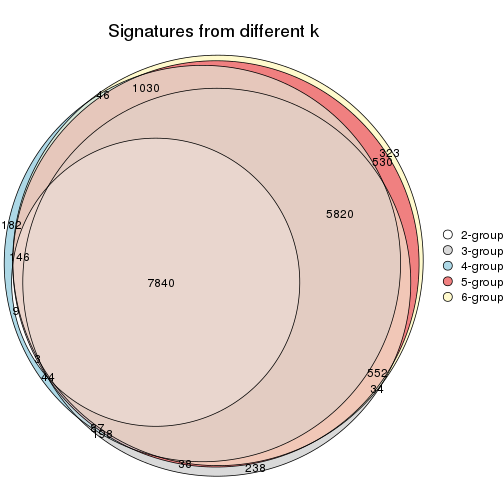

`get_signature()` returns a data frame invisibly. TO get the list of signatures, the function
call should be assigned to a variable explicitly. In following code, if `plot` argument is set
to `FALSE`, no heatmap is plotted while only the differential analysis is performed.

```r
# code only for demonstration
tb = get_signature(res, k = ..., plot = FALSE)
```

An example of the output of `tb` is:

```
#>   which_row         fdr    mean_1    mean_2 scaled_mean_1 scaled_mean_2 km
#> 1        38 0.042760348  8.373488  9.131774    -0.5533452     0.5164555  1
#> 2        40 0.018707592  7.106213  8.469186    -0.6173731     0.5762149  1
#> 3        55 0.019134737 10.221463 11.207825    -0.6159697     0.5749050  1
#> 4        59 0.006059896  5.921854  7.869574    -0.6899429     0.6439467  1
#> 5        60 0.018055526  8.928898 10.211722    -0.6204761     0.5791110  1
#> 6        98 0.009384629 15.714769 14.887706     0.6635654    -0.6193277  2
...
```

The columns in `tb` are:

1. `which_row`: row indices corresponding to the input matrix.
2. `fdr`: FDR for the differential test. 
3. `mean_x`: The mean value in group x.
4. `scaled_mean_x`: The mean value in group x after rows are scaled.
5. `km`: Row groups if k-means clustering is applied to rows.


UMAP plot which shows how samples are separated.


<script>
$( function() {
	$( '#tabs-CV-hclust-dimension-reduction' ).tabs();
} );
</script>
<div id='tabs-CV-hclust-dimension-reduction'>
<ul>
<li><a href='#tab-CV-hclust-dimension-reduction-1'>k = 2</a></li>
<li><a href='#tab-CV-hclust-dimension-reduction-2'>k = 3</a></li>
<li><a href='#tab-CV-hclust-dimension-reduction-3'>k = 4</a></li>
<li><a href='#tab-CV-hclust-dimension-reduction-4'>k = 5</a></li>
<li><a href='#tab-CV-hclust-dimension-reduction-5'>k = 6</a></li>
</ul>
<div id='tab-CV-hclust-dimension-reduction-1'>
<pre><code class="r">dimension_reduction(res, k = 2, method = &quot;UMAP&quot;)
</code></pre>

<p></p>

</div>
<div id='tab-CV-hclust-dimension-reduction-2'>
<pre><code class="r">dimension_reduction(res, k = 3, method = &quot;UMAP&quot;)
</code></pre>

<p></p>

</div>
<div id='tab-CV-hclust-dimension-reduction-3'>
<pre><code class="r">dimension_reduction(res, k = 4, method = &quot;UMAP&quot;)
</code></pre>

<p></p>

</div>
<div id='tab-CV-hclust-dimension-reduction-4'>
<pre><code class="r">dimension_reduction(res, k = 5, method = &quot;UMAP&quot;)
</code></pre>

<p></p>

</div>
<div id='tab-CV-hclust-dimension-reduction-5'>
<pre><code class="r">dimension_reduction(res, k = 6, method = &quot;UMAP&quot;)
</code></pre>

<p>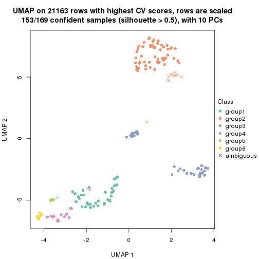</p>

</div>
</div>


Following heatmap shows how subgroups are split when increasing `k`:

```r
collect_classes(res)
```


Test correlation between subgroups and known annotations. If the known
annotation is numeric, one-way ANOVA test is applied, and if the known
annotation is discrete, chi-squared contingency table test is applied.

```r
test_to_known_factors(res)
```

```
#>             n agent(p)  dose(p)  time(p) k
#> CV:hclust 154 2.50e-02 4.08e-02 1.49e-09 2
#> CV:hclust 117 1.15e-02 1.44e-02 5.97e-23 3
#> CV:hclust 155 1.63e-06 3.84e-05 1.20e-31 4
#> CV:hclust 153 1.35e-04 2.90e-03 2.68e-45 5
#> CV:hclust 153 1.08e-06 2.22e-02 4.52e-41 6
```


If matrix rows can be associated to genes, consider to use `GO_Enrichment(res,
...)` to perform function enrichment for the signature genes.


 

---------------------------------------------------


### CV:kmeans


The object with results only for a single top-value method and a single partition method 
can be extracted as:

```r
res = res_list["CV", "kmeans"]
# you can also extract it by
# res = res_list["CV:kmeans"]
```

A summary of `res` and all the functions that can be applied to it:

```r
res
```

```
#> A 'ConsensusPartition' object with k = 2, 3, 4, 5, 6.
#>   On a matrix with 21163 rows and 169 columns.
#>   Top rows (1000, 2000, 3000, 4000, 5000) are extracted by 'CV' method.
#>   Subgroups are detected by 'kmeans' method.
#>   Performed in total 1250 partitions by row resampling.
#>   Best k for subgroups seems to be 2.
#> 
#> Following methods can be applied to this 'ConsensusPartition' object:
#>  [1] "cola_report"             "collect_classes"         "collect_plots"          
#>  [4] "collect_stats"           "colnames"                "compare_signatures"     
#>  [7] "consensus_heatmap"       "dimension_reduction"     "functional_enrichment"  
#> [10] "get_anno_col"            "get_anno"                "get_classes"            
#> [13] "get_consensus"           "get_matrix"              "get_membership"         
#> [16] "get_param"               "get_signatures"          "get_stats"              
#> [19] "is_best_k"               "is_stable_k"             "membership_heatmap"     
#> [22] "ncol"                    "nrow"                    "plot_ecdf"              
#> [25] "rownames"                "select_partition_number" "show"                   
#> [28] "suggest_best_k"          "test_to_known_factors"
```

`collect_plots()` function collects all the plots made from `res` for all `k` (number of partitions)
into one single page to provide an easy and fast comparison between different `k`.

```r
collect_plots(res)
```


The plots are:

- The first row: a plot of the ECDF (Empirical cumulative distribution
  function) curves of the consensus matrix for each `k` and the heatmap of
  predicted classes for each `k`.
- The second row: heatmaps of the consensus matrix for each `k`.
- The third row: heatmaps of the membership matrix for each `k`.
- The fouth row: heatmaps of the signatures for each `k`.

All the plots in panels can be made by individual functions and they are
plotted later in this section.

`select_partition_number()` produces several plots showing different
statistics for choosing "optimized" `k`. There are following statistics:

- ECDF curves of the consensus matrix for each `k`;
- 1-PAC. [The PAC
  score](https://en.wikipedia.org/wiki/Consensus_clustering#Over-interpretation_potential_of_consensus_clustering)
  measures the proportion of the ambiguous subgrouping.
- Mean silhouette score.
- Concordance. The mean probability of fiting the consensus class ids in all
  partitions.
- Area increased. Denote $A_k$ as the area under the ECDF curve for current
  `k`, the area increased is defined as $A_k - A_{k-1}$.
- Rand index. The percent of pairs of samples that are both in a same cluster
  or both are not in a same cluster in the partition of k and k-1.
- Jaccard index. The ratio of pairs of samples are both in a same cluster in
  the partition of k and k-1 and the pairs of samples are both in a same
  cluster in the partition k or k-1.

The detailed explanations of these statistics can be found in [the cola
vignette](http://bioconductor.org/packages/devel/bioc/vignettes/cola/inst/doc/cola.html#toc_13).

Generally speaking, lower PAC score, higher mean silhouette score or higher
concordance corresponds to better partition. Rand index and Jaccard index
measure how similar the current partition is compared to partition with `k-1`.
If they are too similar, we won't accept `k` is better than `k-1`.

```r
select_partition_number(res)
```


The numeric values for all these statistics can be obtained by `get_stats()`.

```r
get_stats(res)
```

```
#>   k 1-PAC mean_silhouette concordance area_increased  Rand Jaccard
#> 2 2 0.511           0.914       0.903         0.4419 0.527   0.527
#> 3 3 0.711           0.882       0.883         0.4110 0.852   0.718
#> 4 4 0.714           0.551       0.743         0.1353 0.878   0.685
#> 5 5 0.767           0.888       0.881         0.0693 0.864   0.569
#> 6 6 0.868           0.848       0.848         0.0495 1.000   1.000
```

`suggest_best_k()` suggests the best $k$ based on these statistics. The rules are as follows:

- All $k$ with Jaccard index larger than 0.95 are removed because the increase of
  the partition number does not provides enough extra information. If all $k$ are removed,
  the best $k$ is assigned by `NA`.
- For $k$ with 1-PAC larger than 0.9, the maximal $k$ is taken as the "best k". Other $k$ is called "optional k".
- If it does not fit the second rule. The $k$ with the highest vote of highest
  1-PAC, mean silhouette and concordance is taken as the "best k".

```r
suggest_best_k(res)
```

```
#> [1] 2
```


Following shows the table of the partitions (You need to click the **show/hide
code output** link to see it). The membership matrix (columns with name `p*`)
is inferred by
[`clue::cl_consensus()`](https://www.rdocumentation.org/link/cl_consensus?package=clue)
function with the `SE` method. Basically the value in the membership matrix
represents the probability to belong to a certain group. The finall class
label for an item is determined with the group with highest probability it
belongs to.

In `get_classes()` function, the entropy is calculated from the membership
matrix and the silhouette score is calculated from the consensus matrix.


<script>
$( function() {
	$( '#tabs-CV-kmeans-get-classes' ).tabs();
} );
</script>
<div id='tabs-CV-kmeans-get-classes'>
<ul>
<li><a href='#tab-CV-kmeans-get-classes-1'>k = 2</a></li>
<li><a href='#tab-CV-kmeans-get-classes-2'>k = 3</a></li>
<li><a href='#tab-CV-kmeans-get-classes-3'>k = 4</a></li>
<li><a href='#tab-CV-kmeans-get-classes-4'>k = 5</a></li>
<li><a href='#tab-CV-kmeans-get-classes-5'>k = 6</a></li>
</ul>

<div id='tab-CV-kmeans-get-classes-1'>
<p><a id='tab-CV-kmeans-get-classes-1-a' style='color:#0366d6' href='#'>show/hide code output</a></p>
<pre><code class="r">cbind(get_classes(res, k = 2), get_membership(res, k = 2))
</code></pre>

<pre><code>#&gt;           class entropy silhouette    p1    p2
#&gt; GSM528681     2  0.7376      1.000 0.208 0.792
#&gt; GSM528682     2  0.7376      1.000 0.208 0.792
#&gt; GSM528683     2  0.7376      1.000 0.208 0.792
#&gt; GSM528684     2  0.7376      1.000 0.208 0.792
#&gt; GSM528687     2  0.7376      1.000 0.208 0.792
#&gt; GSM528688     2  0.7376      1.000 0.208 0.792
#&gt; GSM528685     2  0.7376      1.000 0.208 0.792
#&gt; GSM528686     2  0.7376      1.000 0.208 0.792
#&gt; GSM528693     1  0.0000      0.907 1.000 0.000
#&gt; GSM528694     1  0.0000      0.907 1.000 0.000
#&gt; GSM528695     1  0.6712      0.834 0.824 0.176
#&gt; GSM528696     1  0.6712      0.834 0.824 0.176
#&gt; GSM528697     1  0.7376      0.820 0.792 0.208
#&gt; GSM528698     1  0.7376      0.820 0.792 0.208
#&gt; GSM528699     1  0.7376      0.820 0.792 0.208
#&gt; GSM528700     1  0.7376      0.820 0.792 0.208
#&gt; GSM528689     1  0.7376      0.820 0.792 0.208
#&gt; GSM528690     1  0.7376      0.820 0.792 0.208
#&gt; GSM528691     1  0.7376      0.820 0.792 0.208
#&gt; GSM528692     1  0.7376      0.820 0.792 0.208
#&gt; GSM528779     2  0.7376      1.000 0.208 0.792
#&gt; GSM528780     2  0.7376      1.000 0.208 0.792
#&gt; GSM528782     2  0.7376      1.000 0.208 0.792
#&gt; GSM528781     2  0.7376      1.000 0.208 0.792
#&gt; GSM528785     1  0.5519      0.749 0.872 0.128
#&gt; GSM528786     1  0.0000      0.907 1.000 0.000
#&gt; GSM528787     1  0.0000      0.907 1.000 0.000
#&gt; GSM528788     1  0.0000      0.907 1.000 0.000
#&gt; GSM528783     1  0.5737      0.852 0.864 0.136
#&gt; GSM528784     1  0.7376      0.820 0.792 0.208
#&gt; GSM528759     1  0.0000      0.907 1.000 0.000
#&gt; GSM528760     1  0.0000      0.907 1.000 0.000
#&gt; GSM528761     2  0.7376      1.000 0.208 0.792
#&gt; GSM528762     2  0.7376      1.000 0.208 0.792
#&gt; GSM528765     2  0.7376      1.000 0.208 0.792
#&gt; GSM528766     2  0.7376      1.000 0.208 0.792
#&gt; GSM528763     2  0.7376      1.000 0.208 0.792
#&gt; GSM528764     2  0.7376      1.000 0.208 0.792
#&gt; GSM528771     1  0.5059      0.774 0.888 0.112
#&gt; GSM528772     1  0.4022      0.820 0.920 0.080
#&gt; GSM528773     1  0.0000      0.907 1.000 0.000
#&gt; GSM528774     1  0.0000      0.907 1.000 0.000
#&gt; GSM528775     1  0.0000      0.907 1.000 0.000
#&gt; GSM528776     1  0.2423      0.893 0.960 0.040
#&gt; GSM528777     1  0.2778      0.890 0.952 0.048
#&gt; GSM528778     1  0.2778      0.890 0.952 0.048
#&gt; GSM528767     1  0.7376      0.820 0.792 0.208
#&gt; GSM528768     1  0.7376      0.820 0.792 0.208
#&gt; GSM528769     1  0.7376      0.820 0.792 0.208
#&gt; GSM528770     1  0.7376      0.820 0.792 0.208
#&gt; GSM528671     2  0.7376      1.000 0.208 0.792
#&gt; GSM528672     2  0.7376      1.000 0.208 0.792
#&gt; GSM528674     2  0.7376      1.000 0.208 0.792
#&gt; GSM528673     2  0.7376      1.000 0.208 0.792
#&gt; GSM528677     1  0.0000      0.907 1.000 0.000
#&gt; GSM528678     1  0.0000      0.907 1.000 0.000
#&gt; GSM528679     1  0.3879      0.878 0.924 0.076
#&gt; GSM528680     1  0.7376      0.820 0.792 0.208
#&gt; GSM528675     1  0.7376      0.820 0.792 0.208
#&gt; GSM528676     1  0.7376      0.820 0.792 0.208
#&gt; GSM528651     2  0.7376      1.000 0.208 0.792
#&gt; GSM528652     2  0.7376      1.000 0.208 0.792
#&gt; GSM528653     2  0.7376      1.000 0.208 0.792
#&gt; GSM528654     2  0.7376      1.000 0.208 0.792
#&gt; GSM528657     2  0.7376      1.000 0.208 0.792
#&gt; GSM528658     2  0.7376      1.000 0.208 0.792
#&gt; GSM528655     2  0.7376      1.000 0.208 0.792
#&gt; GSM528656     2  0.7376      1.000 0.208 0.792
#&gt; GSM528663     1  0.8327      0.459 0.736 0.264
#&gt; GSM528664     1  0.9909     -0.234 0.556 0.444
#&gt; GSM528665     1  0.0000      0.907 1.000 0.000
#&gt; GSM528666     1  0.0000      0.907 1.000 0.000
#&gt; GSM528667     1  0.0000      0.907 1.000 0.000
#&gt; GSM528668     1  0.0000      0.907 1.000 0.000
#&gt; GSM528669     1  0.0938      0.903 0.988 0.012
#&gt; GSM528670     1  0.0672      0.904 0.992 0.008
#&gt; GSM528659     1  0.7376      0.820 0.792 0.208
#&gt; GSM528660     1  0.7376      0.820 0.792 0.208
#&gt; GSM528661     1  0.7376      0.820 0.792 0.208
#&gt; GSM528662     1  0.7376      0.820 0.792 0.208
#&gt; GSM528701     2  0.7376      1.000 0.208 0.792
#&gt; GSM528702     2  0.7376      1.000 0.208 0.792
#&gt; GSM528703     2  0.7376      1.000 0.208 0.792
#&gt; GSM528704     2  0.7376      1.000 0.208 0.792
#&gt; GSM528707     2  0.7376      1.000 0.208 0.792
#&gt; GSM528708     2  0.7376      1.000 0.208 0.792
#&gt; GSM528705     2  0.7376      1.000 0.208 0.792
#&gt; GSM528706     2  0.7376      1.000 0.208 0.792
#&gt; GSM528713     1  0.0000      0.907 1.000 0.000
#&gt; GSM528714     1  0.0000      0.907 1.000 0.000
#&gt; GSM528715     1  0.0000      0.907 1.000 0.000
#&gt; GSM528716     1  0.0000      0.907 1.000 0.000
#&gt; GSM528717     1  0.7376      0.820 0.792 0.208
#&gt; GSM528718     1  0.7376      0.820 0.792 0.208
#&gt; GSM528719     1  0.7376      0.820 0.792 0.208
#&gt; GSM528720     1  0.7376      0.820 0.792 0.208
#&gt; GSM528709     1  0.7376      0.820 0.792 0.208
#&gt; GSM528710     1  0.7376      0.820 0.792 0.208
#&gt; GSM528711     1  0.7376      0.820 0.792 0.208
#&gt; GSM528712     1  0.7376      0.820 0.792 0.208
#&gt; GSM528721     2  0.7376      1.000 0.208 0.792
#&gt; GSM528722     2  0.7376      1.000 0.208 0.792
#&gt; GSM528723     2  0.7376      1.000 0.208 0.792
#&gt; GSM528724     2  0.7376      1.000 0.208 0.792
#&gt; GSM528727     2  0.7376      1.000 0.208 0.792
#&gt; GSM528728     2  0.7376      1.000 0.208 0.792
#&gt; GSM528725     2  0.7376      1.000 0.208 0.792
#&gt; GSM528726     2  0.7376      1.000 0.208 0.792
#&gt; GSM528733     1  0.0000      0.907 1.000 0.000
#&gt; GSM528734     1  0.0000      0.907 1.000 0.000
#&gt; GSM528735     1  0.0000      0.907 1.000 0.000
#&gt; GSM528736     1  0.0000      0.907 1.000 0.000
#&gt; GSM528737     1  0.0000      0.907 1.000 0.000
#&gt; GSM528738     1  0.0000      0.907 1.000 0.000
#&gt; GSM528729     1  0.0000      0.907 1.000 0.000
#&gt; GSM528730     1  0.0000      0.907 1.000 0.000
#&gt; GSM528731     1  0.0000      0.907 1.000 0.000
#&gt; GSM528732     1  0.0000      0.907 1.000 0.000
#&gt; GSM528739     2  0.7376      1.000 0.208 0.792
#&gt; GSM528740     2  0.7376      1.000 0.208 0.792
#&gt; GSM528741     2  0.7376      1.000 0.208 0.792
#&gt; GSM528742     2  0.7376      1.000 0.208 0.792
#&gt; GSM528745     2  0.7376      1.000 0.208 0.792
#&gt; GSM528746     2  0.7376      1.000 0.208 0.792
#&gt; GSM528743     2  0.7376      1.000 0.208 0.792
#&gt; GSM528744     2  0.7376      1.000 0.208 0.792
#&gt; GSM528751     1  0.4022      0.820 0.920 0.080
#&gt; GSM528752     1  0.2778      0.858 0.952 0.048
#&gt; GSM528753     1  0.0000      0.907 1.000 0.000
#&gt; GSM528754     1  0.0000      0.907 1.000 0.000
#&gt; GSM528755     1  0.0000      0.907 1.000 0.000
#&gt; GSM528756     1  0.0000      0.907 1.000 0.000
#&gt; GSM528757     1  0.0000      0.907 1.000 0.000
#&gt; GSM528758     1  0.0000      0.907 1.000 0.000
#&gt; GSM528747     1  0.0000      0.907 1.000 0.000
#&gt; GSM528748     1  0.0000      0.907 1.000 0.000
#&gt; GSM528749     1  0.0000      0.907 1.000 0.000
#&gt; GSM528750     1  0.0000      0.907 1.000 0.000
#&gt; GSM528640     2  0.7376      1.000 0.208 0.792
#&gt; GSM528641     2  0.7376      1.000 0.208 0.792
#&gt; GSM528643     1  0.0000      0.907 1.000 0.000
#&gt; GSM528644     1  0.0000      0.907 1.000 0.000
#&gt; GSM528642     1  0.0000      0.907 1.000 0.000
#&gt; GSM528620     2  0.7376      1.000 0.208 0.792
#&gt; GSM528621     2  0.7376      1.000 0.208 0.792
#&gt; GSM528623     1  0.0000      0.907 1.000 0.000
#&gt; GSM528624     1  0.0000      0.907 1.000 0.000
#&gt; GSM528622     1  0.0000      0.907 1.000 0.000
#&gt; GSM528625     2  0.7376      1.000 0.208 0.792
#&gt; GSM528626     2  0.7376      1.000 0.208 0.792
#&gt; GSM528628     1  0.0000      0.907 1.000 0.000
#&gt; GSM528629     1  0.0000      0.907 1.000 0.000
#&gt; GSM528627     1  0.0000      0.907 1.000 0.000
#&gt; GSM528630     2  0.7376      1.000 0.208 0.792
#&gt; GSM528631     2  0.7376      1.000 0.208 0.792
#&gt; GSM528632     2  0.7376      1.000 0.208 0.792
#&gt; GSM528633     2  0.7376      1.000 0.208 0.792
#&gt; GSM528636     1  0.0000      0.907 1.000 0.000
#&gt; GSM528637     1  0.0000      0.907 1.000 0.000
#&gt; GSM528638     1  0.0000      0.907 1.000 0.000
#&gt; GSM528639     1  0.0000      0.907 1.000 0.000
#&gt; GSM528634     1  0.0000      0.907 1.000 0.000
#&gt; GSM528635     1  0.0000      0.907 1.000 0.000
#&gt; GSM528645     1  0.0000      0.907 1.000 0.000
#&gt; GSM528646     1  0.0000      0.907 1.000 0.000
#&gt; GSM528647     1  0.0000      0.907 1.000 0.000
#&gt; GSM528648     1  0.0000      0.907 1.000 0.000
#&gt; GSM528649     1  0.0000      0.907 1.000 0.000
#&gt; GSM528650     1  0.0000      0.907 1.000 0.000
</code></pre>

<script>
$('#tab-CV-kmeans-get-classes-1-a').parent().next().next().hide();
$('#tab-CV-kmeans-get-classes-1-a').click(function(){
  $('#tab-CV-kmeans-get-classes-1-a').parent().next().next().toggle();
  return(false);
});
</script>
</div>

<div id='tab-CV-kmeans-get-classes-2'>
<p><a id='tab-CV-kmeans-get-classes-2-a' style='color:#0366d6' href='#'>show/hide code output</a></p>
<pre><code class="r">cbind(get_classes(res, k = 3), get_membership(res, k = 3))
</code></pre>

<pre><code>#&gt;           class entropy silhouette    p1    p2    p3
#&gt; GSM528681     2  0.0747      0.973 0.000 0.984 0.016
#&gt; GSM528682     2  0.0747      0.973 0.000 0.984 0.016
#&gt; GSM528683     2  0.0747      0.973 0.000 0.984 0.016
#&gt; GSM528684     2  0.0747      0.973 0.000 0.984 0.016
#&gt; GSM528687     2  0.0747      0.973 0.000 0.984 0.016
#&gt; GSM528688     2  0.0747      0.973 0.000 0.984 0.016
#&gt; GSM528685     2  0.2599      0.937 0.052 0.932 0.016
#&gt; GSM528686     2  0.4609      0.876 0.052 0.856 0.092
#&gt; GSM528693     3  0.2261      0.825 0.068 0.000 0.932
#&gt; GSM528694     3  0.2261      0.825 0.068 0.000 0.932
#&gt; GSM528695     3  0.4605      0.733 0.204 0.000 0.796
#&gt; GSM528696     3  0.4605      0.733 0.204 0.000 0.796
#&gt; GSM528697     1  0.3816      0.984 0.852 0.000 0.148
#&gt; GSM528698     1  0.3816      0.984 0.852 0.000 0.148
#&gt; GSM528699     1  0.3816      0.984 0.852 0.000 0.148
#&gt; GSM528700     1  0.3816      0.984 0.852 0.000 0.148
#&gt; GSM528689     1  0.3816      0.984 0.852 0.000 0.148
#&gt; GSM528690     1  0.3816      0.984 0.852 0.000 0.148
#&gt; GSM528691     1  0.3816      0.984 0.852 0.000 0.148
#&gt; GSM528692     1  0.3816      0.984 0.852 0.000 0.148
#&gt; GSM528779     2  0.0747      0.973 0.000 0.984 0.016
#&gt; GSM528780     2  0.0747      0.973 0.000 0.984 0.016
#&gt; GSM528782     2  0.0747      0.973 0.000 0.984 0.016
#&gt; GSM528781     2  0.0747      0.973 0.000 0.984 0.016
#&gt; GSM528785     3  0.4288      0.782 0.068 0.060 0.872
#&gt; GSM528786     3  0.3816      0.780 0.148 0.000 0.852
#&gt; GSM528787     3  0.3038      0.806 0.104 0.000 0.896
#&gt; GSM528788     3  0.4121      0.803 0.168 0.000 0.832
#&gt; GSM528783     1  0.6180      0.675 0.660 0.008 0.332
#&gt; GSM528784     1  0.4514      0.978 0.832 0.012 0.156
#&gt; GSM528759     3  0.0747      0.835 0.016 0.000 0.984
#&gt; GSM528760     3  0.1163      0.832 0.028 0.000 0.972
#&gt; GSM528761     2  0.0747      0.973 0.000 0.984 0.016
#&gt; GSM528762     2  0.0747      0.973 0.000 0.984 0.016
#&gt; GSM528765     2  0.0747      0.973 0.000 0.984 0.016
#&gt; GSM528766     2  0.0747      0.973 0.000 0.984 0.016
#&gt; GSM528763     2  0.0983      0.970 0.004 0.980 0.016
#&gt; GSM528764     2  0.4609      0.876 0.052 0.856 0.092
#&gt; GSM528771     3  0.2261      0.825 0.068 0.000 0.932
#&gt; GSM528772     3  0.2261      0.825 0.068 0.000 0.932
#&gt; GSM528773     3  0.3941      0.777 0.156 0.000 0.844
#&gt; GSM528774     3  0.3752      0.786 0.144 0.000 0.856
#&gt; GSM528775     3  0.1964      0.835 0.056 0.000 0.944
#&gt; GSM528776     3  0.4121      0.803 0.168 0.000 0.832
#&gt; GSM528777     3  0.5216      0.671 0.260 0.000 0.740
#&gt; GSM528778     3  0.5216      0.671 0.260 0.000 0.740
#&gt; GSM528767     1  0.4575      0.977 0.828 0.012 0.160
#&gt; GSM528768     1  0.4575      0.977 0.828 0.012 0.160
#&gt; GSM528769     1  0.4514      0.978 0.832 0.012 0.156
#&gt; GSM528770     1  0.4514      0.978 0.832 0.012 0.156
#&gt; GSM528671     2  0.0747      0.973 0.000 0.984 0.016
#&gt; GSM528672     2  0.0747      0.973 0.000 0.984 0.016
#&gt; GSM528674     2  0.0747      0.973 0.000 0.984 0.016
#&gt; GSM528673     2  0.4527      0.879 0.052 0.860 0.088
#&gt; GSM528677     3  0.1964      0.822 0.056 0.000 0.944
#&gt; GSM528678     3  0.3816      0.780 0.148 0.000 0.852
#&gt; GSM528679     3  0.4178      0.799 0.172 0.000 0.828
#&gt; GSM528680     1  0.4002      0.975 0.840 0.000 0.160
#&gt; GSM528675     1  0.4539      0.981 0.836 0.016 0.148
#&gt; GSM528676     1  0.4539      0.981 0.836 0.016 0.148
#&gt; GSM528651     2  0.0747      0.973 0.000 0.984 0.016
#&gt; GSM528652     2  0.0747      0.973 0.000 0.984 0.016
#&gt; GSM528653     2  0.0747      0.973 0.000 0.984 0.016
#&gt; GSM528654     2  0.0747      0.973 0.000 0.984 0.016
#&gt; GSM528657     2  0.0747      0.973 0.000 0.984 0.016
#&gt; GSM528658     2  0.0747      0.973 0.000 0.984 0.016
#&gt; GSM528655     2  0.4443      0.883 0.052 0.864 0.084
#&gt; GSM528656     2  0.3993      0.901 0.052 0.884 0.064
#&gt; GSM528663     3  0.5166      0.720 0.056 0.116 0.828
#&gt; GSM528664     3  0.7124      0.484 0.056 0.272 0.672
#&gt; GSM528665     3  0.3116      0.806 0.108 0.000 0.892
#&gt; GSM528666     3  0.3116      0.806 0.108 0.000 0.892
#&gt; GSM528667     3  0.4121      0.803 0.168 0.000 0.832
#&gt; GSM528668     3  0.4121      0.803 0.168 0.000 0.832
#&gt; GSM528669     3  0.4121      0.803 0.168 0.000 0.832
#&gt; GSM528670     3  0.4121      0.803 0.168 0.000 0.832
#&gt; GSM528659     1  0.4539      0.981 0.836 0.016 0.148
#&gt; GSM528660     1  0.4539      0.981 0.836 0.016 0.148
#&gt; GSM528661     1  0.4539      0.981 0.836 0.016 0.148
#&gt; GSM528662     1  0.4539      0.981 0.836 0.016 0.148
#&gt; GSM528701     2  0.0747      0.973 0.000 0.984 0.016
#&gt; GSM528702     2  0.0747      0.973 0.000 0.984 0.016
#&gt; GSM528703     2  0.0747      0.973 0.000 0.984 0.016
#&gt; GSM528704     2  0.0747      0.973 0.000 0.984 0.016
#&gt; GSM528707     2  0.0747      0.973 0.000 0.984 0.016
#&gt; GSM528708     2  0.0747      0.973 0.000 0.984 0.016
#&gt; GSM528705     2  0.0747      0.973 0.000 0.984 0.016
#&gt; GSM528706     2  0.0747      0.973 0.000 0.984 0.016
#&gt; GSM528713     3  0.2261      0.825 0.068 0.000 0.932
#&gt; GSM528714     3  0.1964      0.822 0.056 0.000 0.944
#&gt; GSM528715     3  0.3116      0.806 0.108 0.000 0.892
#&gt; GSM528716     3  0.3116      0.806 0.108 0.000 0.892
#&gt; GSM528717     3  0.4346      0.786 0.184 0.000 0.816
#&gt; GSM528718     3  0.4178      0.801 0.172 0.000 0.828
#&gt; GSM528719     1  0.3816      0.984 0.852 0.000 0.148
#&gt; GSM528720     1  0.3816      0.984 0.852 0.000 0.148
#&gt; GSM528709     1  0.3816      0.984 0.852 0.000 0.148
#&gt; GSM528710     1  0.3816      0.984 0.852 0.000 0.148
#&gt; GSM528711     1  0.3816      0.984 0.852 0.000 0.148
#&gt; GSM528712     1  0.3816      0.984 0.852 0.000 0.148
#&gt; GSM528721     2  0.0747      0.973 0.000 0.984 0.016
#&gt; GSM528722     2  0.0747      0.973 0.000 0.984 0.016
#&gt; GSM528723     2  0.0747      0.973 0.000 0.984 0.016
#&gt; GSM528724     2  0.0747      0.973 0.000 0.984 0.016
#&gt; GSM528727     2  0.0747      0.973 0.000 0.984 0.016
#&gt; GSM528728     2  0.0747      0.973 0.000 0.984 0.016
#&gt; GSM528725     2  0.0747      0.973 0.000 0.984 0.016
#&gt; GSM528726     2  0.0747      0.973 0.000 0.984 0.016
#&gt; GSM528733     3  0.3116      0.806 0.108 0.000 0.892
#&gt; GSM528734     3  0.3116      0.806 0.108 0.000 0.892
#&gt; GSM528735     3  0.1964      0.835 0.056 0.000 0.944
#&gt; GSM528736     3  0.1964      0.835 0.056 0.000 0.944
#&gt; GSM528737     3  0.4121      0.803 0.168 0.000 0.832
#&gt; GSM528738     3  0.3941      0.809 0.156 0.000 0.844
#&gt; GSM528729     3  0.4121      0.803 0.168 0.000 0.832
#&gt; GSM528730     3  0.4121      0.803 0.168 0.000 0.832
#&gt; GSM528731     3  0.4121      0.803 0.168 0.000 0.832
#&gt; GSM528732     3  0.4002      0.807 0.160 0.000 0.840
#&gt; GSM528739     2  0.0747      0.973 0.000 0.984 0.016
#&gt; GSM528740     2  0.0747      0.973 0.000 0.984 0.016
#&gt; GSM528741     2  0.0747      0.973 0.000 0.984 0.016
#&gt; GSM528742     2  0.0747      0.973 0.000 0.984 0.016
#&gt; GSM528745     2  0.0747      0.973 0.000 0.984 0.016
#&gt; GSM528746     2  0.0747      0.973 0.000 0.984 0.016
#&gt; GSM528743     2  0.0747      0.973 0.000 0.984 0.016
#&gt; GSM528744     2  0.0747      0.973 0.000 0.984 0.016
#&gt; GSM528751     3  0.2261      0.825 0.068 0.000 0.932
#&gt; GSM528752     3  0.2261      0.825 0.068 0.000 0.932
#&gt; GSM528753     3  0.3116      0.806 0.108 0.000 0.892
#&gt; GSM528754     3  0.3116      0.806 0.108 0.000 0.892
#&gt; GSM528755     3  0.1964      0.835 0.056 0.000 0.944
#&gt; GSM528756     3  0.1964      0.835 0.056 0.000 0.944
#&gt; GSM528757     3  0.4121      0.803 0.168 0.000 0.832
#&gt; GSM528758     3  0.4121      0.803 0.168 0.000 0.832
#&gt; GSM528747     3  0.4121      0.803 0.168 0.000 0.832
#&gt; GSM528748     3  0.4002      0.807 0.160 0.000 0.840
#&gt; GSM528749     3  0.3941      0.809 0.156 0.000 0.844
#&gt; GSM528750     3  0.4121      0.803 0.168 0.000 0.832
#&gt; GSM528640     2  0.0747      0.973 0.000 0.984 0.016
#&gt; GSM528641     2  0.4609      0.876 0.052 0.856 0.092
#&gt; GSM528643     3  0.3116      0.806 0.108 0.000 0.892
#&gt; GSM528644     3  0.4062      0.805 0.164 0.000 0.836
#&gt; GSM528642     3  0.3879      0.822 0.152 0.000 0.848
#&gt; GSM528620     2  0.0747      0.973 0.000 0.984 0.016
#&gt; GSM528621     2  0.7736      0.354 0.052 0.548 0.400
#&gt; GSM528623     3  0.3116      0.806 0.108 0.000 0.892
#&gt; GSM528624     3  0.4121      0.803 0.168 0.000 0.832
#&gt; GSM528622     3  0.4121      0.803 0.168 0.000 0.832
#&gt; GSM528625     2  0.0747      0.973 0.000 0.984 0.016
#&gt; GSM528626     2  0.4609      0.876 0.052 0.856 0.092
#&gt; GSM528628     3  0.3116      0.806 0.108 0.000 0.892
#&gt; GSM528629     3  0.4121      0.803 0.168 0.000 0.832
#&gt; GSM528627     3  0.3879      0.810 0.152 0.000 0.848
#&gt; GSM528630     2  0.0747      0.973 0.000 0.984 0.016
#&gt; GSM528631     2  0.0747      0.973 0.000 0.984 0.016
#&gt; GSM528632     2  0.5536      0.822 0.052 0.804 0.144
#&gt; GSM528633     2  0.5536      0.822 0.052 0.804 0.144
#&gt; GSM528636     3  0.3116      0.806 0.108 0.000 0.892
#&gt; GSM528637     3  0.3116      0.806 0.108 0.000 0.892
#&gt; GSM528638     3  0.4121      0.803 0.168 0.000 0.832
#&gt; GSM528639     3  0.4121      0.803 0.168 0.000 0.832
#&gt; GSM528634     3  0.3340      0.821 0.120 0.000 0.880
#&gt; GSM528635     3  0.3941      0.809 0.156 0.000 0.844
#&gt; GSM528645     3  0.3941      0.777 0.156 0.000 0.844
#&gt; GSM528646     3  0.3941      0.777 0.156 0.000 0.844
#&gt; GSM528647     3  0.3816      0.780 0.148 0.000 0.852
#&gt; GSM528648     3  0.0747      0.835 0.016 0.000 0.984
#&gt; GSM528649     3  0.0747      0.835 0.016 0.000 0.984
#&gt; GSM528650     3  0.2066      0.834 0.060 0.000 0.940
</code></pre>

<script>
$('#tab-CV-kmeans-get-classes-2-a').parent().next().next().hide();
$('#tab-CV-kmeans-get-classes-2-a').click(function(){
  $('#tab-CV-kmeans-get-classes-2-a').parent().next().next().toggle();
  return(false);
});
</script>
</div>

<div id='tab-CV-kmeans-get-classes-3'>
<p><a id='tab-CV-kmeans-get-classes-3-a' style='color:#0366d6' href='#'>show/hide code output</a></p>
<pre><code class="r">cbind(get_classes(res, k = 4), get_membership(res, k = 4))
</code></pre>

<pre><code>#&gt;           class entropy silhouette    p1    p2    p3    p4
#&gt; GSM528681     2  0.0000     0.9277 0.000 1.000 0.000 0.000
#&gt; GSM528682     2  0.0000     0.9277 0.000 1.000 0.000 0.000
#&gt; GSM528683     2  0.0000     0.9277 0.000 1.000 0.000 0.000
#&gt; GSM528684     2  0.0000     0.9277 0.000 1.000 0.000 0.000
#&gt; GSM528687     2  0.0000     0.9277 0.000 1.000 0.000 0.000
#&gt; GSM528688     2  0.0000     0.9277 0.000 1.000 0.000 0.000
#&gt; GSM528685     2  0.4972     0.4289 0.456 0.544 0.000 0.000
#&gt; GSM528686     2  0.6452     0.3066 0.460 0.472 0.068 0.000
#&gt; GSM528693     1  0.3764     0.3386 0.784 0.000 0.216 0.000
#&gt; GSM528694     1  0.3764     0.3386 0.784 0.000 0.216 0.000
#&gt; GSM528695     3  0.0592     0.4774 0.000 0.000 0.984 0.016
#&gt; GSM528696     3  0.0592     0.4774 0.000 0.000 0.984 0.016
#&gt; GSM528697     4  0.0657     0.9405 0.004 0.000 0.012 0.984
#&gt; GSM528698     4  0.0657     0.9405 0.004 0.000 0.012 0.984
#&gt; GSM528699     4  0.0657     0.9405 0.004 0.000 0.012 0.984
#&gt; GSM528700     4  0.0657     0.9405 0.004 0.000 0.012 0.984
#&gt; GSM528689     4  0.0657     0.9405 0.004 0.000 0.012 0.984
#&gt; GSM528690     4  0.0657     0.9405 0.004 0.000 0.012 0.984
#&gt; GSM528691     4  0.0657     0.9405 0.004 0.000 0.012 0.984
#&gt; GSM528692     4  0.0657     0.9405 0.004 0.000 0.012 0.984
#&gt; GSM528779     2  0.0336     0.9264 0.008 0.992 0.000 0.000
#&gt; GSM528780     2  0.0804     0.9239 0.008 0.980 0.000 0.012
#&gt; GSM528782     2  0.0000     0.9277 0.000 1.000 0.000 0.000
#&gt; GSM528781     2  0.0937     0.9230 0.012 0.976 0.000 0.012
#&gt; GSM528785     1  0.3367     0.3176 0.864 0.028 0.108 0.000
#&gt; GSM528786     3  0.1557     0.4381 0.056 0.000 0.944 0.000
#&gt; GSM528787     3  0.4585     0.3498 0.332 0.000 0.668 0.000
#&gt; GSM528788     1  0.7188    -0.2447 0.436 0.000 0.428 0.136
#&gt; GSM528783     4  0.7065     0.3472 0.212 0.000 0.216 0.572
#&gt; GSM528784     4  0.4050     0.8457 0.168 0.000 0.024 0.808
#&gt; GSM528759     3  0.6079     0.3393 0.408 0.000 0.544 0.048
#&gt; GSM528760     3  0.5619     0.3482 0.320 0.000 0.640 0.040
#&gt; GSM528761     2  0.0804     0.9239 0.008 0.980 0.000 0.012
#&gt; GSM528762     2  0.0000     0.9277 0.000 1.000 0.000 0.000
#&gt; GSM528765     2  0.0937     0.9230 0.012 0.976 0.000 0.012
#&gt; GSM528766     2  0.0804     0.9239 0.008 0.980 0.000 0.012
#&gt; GSM528763     2  0.4713     0.5610 0.360 0.640 0.000 0.000
#&gt; GSM528764     2  0.6452     0.3066 0.460 0.472 0.068 0.000
#&gt; GSM528771     1  0.3764     0.3386 0.784 0.000 0.216 0.000
#&gt; GSM528772     1  0.3764     0.3386 0.784 0.000 0.216 0.000
#&gt; GSM528773     3  0.0707     0.4744 0.020 0.000 0.980 0.000
#&gt; GSM528774     3  0.0592     0.4781 0.016 0.000 0.984 0.000
#&gt; GSM528775     3  0.6310     0.3375 0.428 0.000 0.512 0.060
#&gt; GSM528776     3  0.7187     0.2350 0.424 0.000 0.440 0.136
#&gt; GSM528777     1  0.7179    -0.2369 0.456 0.000 0.408 0.136
#&gt; GSM528778     1  0.7179    -0.2369 0.456 0.000 0.408 0.136
#&gt; GSM528767     4  0.4050     0.8457 0.168 0.000 0.024 0.808
#&gt; GSM528768     4  0.4050     0.8457 0.168 0.000 0.024 0.808
#&gt; GSM528769     4  0.4050     0.8457 0.168 0.000 0.024 0.808
#&gt; GSM528770     4  0.4050     0.8457 0.168 0.000 0.024 0.808
#&gt; GSM528671     2  0.0937     0.9230 0.012 0.976 0.000 0.012
#&gt; GSM528672     2  0.0000     0.9277 0.000 1.000 0.000 0.000
#&gt; GSM528674     2  0.0804     0.9239 0.008 0.980 0.000 0.012
#&gt; GSM528673     2  0.6452     0.3066 0.460 0.472 0.068 0.000
#&gt; GSM528677     1  0.3649     0.3360 0.796 0.000 0.204 0.000
#&gt; GSM528678     3  0.1557     0.4381 0.056 0.000 0.944 0.000
#&gt; GSM528679     3  0.7184     0.2532 0.416 0.000 0.448 0.136
#&gt; GSM528680     4  0.1284     0.9317 0.024 0.000 0.012 0.964
#&gt; GSM528675     4  0.1938     0.9305 0.052 0.000 0.012 0.936
#&gt; GSM528676     4  0.1938     0.9305 0.052 0.000 0.012 0.936
#&gt; GSM528651     2  0.0937     0.9230 0.012 0.976 0.000 0.012
#&gt; GSM528652     2  0.0937     0.9230 0.012 0.976 0.000 0.012
#&gt; GSM528653     2  0.0000     0.9277 0.000 1.000 0.000 0.000
#&gt; GSM528654     2  0.0000     0.9277 0.000 1.000 0.000 0.000
#&gt; GSM528657     2  0.0937     0.9230 0.012 0.976 0.000 0.012
#&gt; GSM528658     2  0.0000     0.9277 0.000 1.000 0.000 0.000
#&gt; GSM528655     2  0.6452     0.3066 0.460 0.472 0.068 0.000
#&gt; GSM528656     2  0.6334     0.3303 0.456 0.484 0.060 0.000
#&gt; GSM528663     1  0.4549     0.3285 0.776 0.036 0.188 0.000
#&gt; GSM528664     1  0.5100     0.3157 0.756 0.076 0.168 0.000
#&gt; GSM528665     3  0.0000     0.4878 0.000 0.000 1.000 0.000
#&gt; GSM528666     3  0.0000     0.4878 0.000 0.000 1.000 0.000
#&gt; GSM528667     3  0.7184     0.2532 0.416 0.000 0.448 0.136
#&gt; GSM528668     3  0.7184     0.2532 0.416 0.000 0.448 0.136
#&gt; GSM528669     1  0.7187    -0.2408 0.440 0.000 0.424 0.136
#&gt; GSM528670     1  0.7187    -0.2408 0.440 0.000 0.424 0.136
#&gt; GSM528659     4  0.1938     0.9305 0.052 0.000 0.012 0.936
#&gt; GSM528660     4  0.1938     0.9305 0.052 0.000 0.012 0.936
#&gt; GSM528661     4  0.1938     0.9305 0.052 0.000 0.012 0.936
#&gt; GSM528662     4  0.1938     0.9305 0.052 0.000 0.012 0.936
#&gt; GSM528701     2  0.0000     0.9277 0.000 1.000 0.000 0.000
#&gt; GSM528702     2  0.0000     0.9277 0.000 1.000 0.000 0.000
#&gt; GSM528703     2  0.0000     0.9277 0.000 1.000 0.000 0.000
#&gt; GSM528704     2  0.0000     0.9277 0.000 1.000 0.000 0.000
#&gt; GSM528707     2  0.0000     0.9277 0.000 1.000 0.000 0.000
#&gt; GSM528708     2  0.0000     0.9277 0.000 1.000 0.000 0.000
#&gt; GSM528705     2  0.0000     0.9277 0.000 1.000 0.000 0.000
#&gt; GSM528706     2  0.0000     0.9277 0.000 1.000 0.000 0.000
#&gt; GSM528713     1  0.3764     0.3386 0.784 0.000 0.216 0.000
#&gt; GSM528714     1  0.3649     0.3360 0.796 0.000 0.204 0.000
#&gt; GSM528715     3  0.0000     0.4878 0.000 0.000 1.000 0.000
#&gt; GSM528716     3  0.0000     0.4878 0.000 0.000 1.000 0.000
#&gt; GSM528717     3  0.7179     0.2632 0.408 0.000 0.456 0.136
#&gt; GSM528718     3  0.6921     0.2856 0.424 0.000 0.468 0.108
#&gt; GSM528719     4  0.0657     0.9405 0.004 0.000 0.012 0.984
#&gt; GSM528720     4  0.0657     0.9405 0.004 0.000 0.012 0.984
#&gt; GSM528709     4  0.0804     0.9399 0.008 0.000 0.012 0.980
#&gt; GSM528710     4  0.0804     0.9399 0.008 0.000 0.012 0.980
#&gt; GSM528711     4  0.0804     0.9399 0.008 0.000 0.012 0.980
#&gt; GSM528712     4  0.0804     0.9399 0.008 0.000 0.012 0.980
#&gt; GSM528721     2  0.0336     0.9264 0.008 0.992 0.000 0.000
#&gt; GSM528722     2  0.0336     0.9264 0.008 0.992 0.000 0.000
#&gt; GSM528723     2  0.0000     0.9277 0.000 1.000 0.000 0.000
#&gt; GSM528724     2  0.0000     0.9277 0.000 1.000 0.000 0.000
#&gt; GSM528727     2  0.0937     0.9230 0.012 0.976 0.000 0.012
#&gt; GSM528728     2  0.0000     0.9277 0.000 1.000 0.000 0.000
#&gt; GSM528725     2  0.0000     0.9277 0.000 1.000 0.000 0.000
#&gt; GSM528726     2  0.0000     0.9277 0.000 1.000 0.000 0.000
#&gt; GSM528733     3  0.0000     0.4878 0.000 0.000 1.000 0.000
#&gt; GSM528734     3  0.0000     0.4878 0.000 0.000 1.000 0.000
#&gt; GSM528735     3  0.6305     0.3356 0.424 0.000 0.516 0.060
#&gt; GSM528736     3  0.6305     0.3356 0.424 0.000 0.516 0.060
#&gt; GSM528737     3  0.7187     0.2350 0.424 0.000 0.440 0.136
#&gt; GSM528738     3  0.7084     0.2434 0.436 0.000 0.440 0.124
#&gt; GSM528729     1  0.7188    -0.2447 0.436 0.000 0.428 0.136
#&gt; GSM528730     1  0.7188    -0.2447 0.436 0.000 0.428 0.136
#&gt; GSM528731     1  0.7188    -0.2447 0.436 0.000 0.428 0.136
#&gt; GSM528732     3  0.7187     0.2371 0.424 0.000 0.440 0.136
#&gt; GSM528739     2  0.0000     0.9277 0.000 1.000 0.000 0.000
#&gt; GSM528740     2  0.0000     0.9277 0.000 1.000 0.000 0.000
#&gt; GSM528741     2  0.0804     0.9239 0.008 0.980 0.000 0.012
#&gt; GSM528742     2  0.0000     0.9277 0.000 1.000 0.000 0.000
#&gt; GSM528745     2  0.0937     0.9230 0.012 0.976 0.000 0.012
#&gt; GSM528746     2  0.0000     0.9277 0.000 1.000 0.000 0.000
#&gt; GSM528743     2  0.0937     0.9230 0.012 0.976 0.000 0.012
#&gt; GSM528744     2  0.0937     0.9230 0.012 0.976 0.000 0.012
#&gt; GSM528751     1  0.3764     0.3386 0.784 0.000 0.216 0.000
#&gt; GSM528752     1  0.3764     0.3386 0.784 0.000 0.216 0.000
#&gt; GSM528753     3  0.0000     0.4878 0.000 0.000 1.000 0.000
#&gt; GSM528754     3  0.0000     0.4878 0.000 0.000 1.000 0.000
#&gt; GSM528755     3  0.6591     0.3180 0.424 0.000 0.496 0.080
#&gt; GSM528756     3  0.6305     0.3356 0.424 0.000 0.516 0.060
#&gt; GSM528757     1  0.7188    -0.2447 0.436 0.000 0.428 0.136
#&gt; GSM528758     1  0.7188    -0.2447 0.436 0.000 0.428 0.136
#&gt; GSM528747     3  0.7188     0.2351 0.432 0.000 0.432 0.136
#&gt; GSM528748     3  0.7119     0.2585 0.432 0.000 0.440 0.128
#&gt; GSM528749     3  0.7115     0.2614 0.420 0.000 0.452 0.128
#&gt; GSM528750     3  0.7187     0.2371 0.424 0.000 0.440 0.136
#&gt; GSM528640     2  0.0000     0.9277 0.000 1.000 0.000 0.000
#&gt; GSM528641     2  0.6452     0.3066 0.460 0.472 0.068 0.000
#&gt; GSM528643     3  0.0000     0.4878 0.000 0.000 1.000 0.000
#&gt; GSM528644     1  0.7186    -0.2568 0.444 0.000 0.420 0.136
#&gt; GSM528642     3  0.6780     0.3178 0.416 0.000 0.488 0.096
#&gt; GSM528620     2  0.0804     0.9239 0.008 0.980 0.000 0.012
#&gt; GSM528621     1  0.7108    -0.0726 0.512 0.348 0.140 0.000
#&gt; GSM528623     3  0.0469     0.4811 0.012 0.000 0.988 0.000
#&gt; GSM528624     1  0.7188    -0.2447 0.436 0.000 0.428 0.136
#&gt; GSM528622     3  0.7184     0.2532 0.416 0.000 0.448 0.136
#&gt; GSM528625     2  0.0000     0.9277 0.000 1.000 0.000 0.000
#&gt; GSM528626     1  0.6795    -0.2589 0.472 0.432 0.096 0.000
#&gt; GSM528628     3  0.0000     0.4878 0.000 0.000 1.000 0.000
#&gt; GSM528629     1  0.7188    -0.2743 0.432 0.000 0.432 0.136
#&gt; GSM528627     3  0.7113     0.2668 0.416 0.000 0.456 0.128
#&gt; GSM528630     2  0.0937     0.9230 0.012 0.976 0.000 0.012
#&gt; GSM528631     2  0.0937     0.9230 0.012 0.976 0.000 0.012
#&gt; GSM528632     1  0.7030    -0.2067 0.472 0.408 0.120 0.000
#&gt; GSM528633     1  0.7030    -0.2067 0.472 0.408 0.120 0.000
#&gt; GSM528636     3  0.0000     0.4878 0.000 0.000 1.000 0.000
#&gt; GSM528637     3  0.0000     0.4878 0.000 0.000 1.000 0.000
#&gt; GSM528638     1  0.7188    -0.2447 0.436 0.000 0.428 0.136
#&gt; GSM528639     1  0.7188    -0.2447 0.436 0.000 0.428 0.136
#&gt; GSM528634     3  0.7076     0.2724 0.416 0.000 0.460 0.124
#&gt; GSM528635     3  0.7113     0.2668 0.416 0.000 0.456 0.128
#&gt; GSM528645     3  0.3266     0.2889 0.168 0.000 0.832 0.000
#&gt; GSM528646     3  0.2589     0.3621 0.116 0.000 0.884 0.000
#&gt; GSM528647     3  0.3688     0.2542 0.208 0.000 0.792 0.000
#&gt; GSM528648     3  0.6586     0.3049 0.420 0.000 0.500 0.080
#&gt; GSM528649     3  0.5793     0.3433 0.324 0.000 0.628 0.048
#&gt; GSM528650     3  0.6797     0.2791 0.436 0.000 0.468 0.096
</code></pre>

<script>
$('#tab-CV-kmeans-get-classes-3-a').parent().next().next().hide();
$('#tab-CV-kmeans-get-classes-3-a').click(function(){
  $('#tab-CV-kmeans-get-classes-3-a').parent().next().next().toggle();
  return(false);
});
</script>
</div>

<div id='tab-CV-kmeans-get-classes-4'>
<p><a id='tab-CV-kmeans-get-classes-4-a' style='color:#0366d6' href='#'>show/hide code output</a></p>
<pre><code class="r">cbind(get_classes(res, k = 5), get_membership(res, k = 5))
</code></pre>

<pre><code>#&gt;           class entropy silhouette    p1    p2    p3    p4    p5
#&gt; GSM528681     2  0.0000      0.941 0.000 1.000 0.000 0.000 0.000
#&gt; GSM528682     2  0.0000      0.941 0.000 1.000 0.000 0.000 0.000
#&gt; GSM528683     2  0.0000      0.941 0.000 1.000 0.000 0.000 0.000
#&gt; GSM528684     2  0.0000      0.941 0.000 1.000 0.000 0.000 0.000
#&gt; GSM528687     2  0.0000      0.941 0.000 1.000 0.000 0.000 0.000
#&gt; GSM528688     2  0.0000      0.941 0.000 1.000 0.000 0.000 0.000
#&gt; GSM528685     5  0.5142      0.702 0.000 0.296 0.020 0.032 0.652
#&gt; GSM528686     5  0.5258      0.735 0.000 0.272 0.032 0.032 0.664
#&gt; GSM528693     5  0.3051      0.761 0.120 0.000 0.028 0.000 0.852
#&gt; GSM528694     5  0.3051      0.761 0.120 0.000 0.028 0.000 0.852
#&gt; GSM528695     3  0.3474      0.979 0.192 0.000 0.796 0.004 0.008
#&gt; GSM528696     3  0.3474      0.979 0.192 0.000 0.796 0.004 0.008
#&gt; GSM528697     4  0.1892      0.903 0.080 0.000 0.000 0.916 0.004
#&gt; GSM528698     4  0.1732      0.904 0.080 0.000 0.000 0.920 0.000
#&gt; GSM528699     4  0.1732      0.904 0.080 0.000 0.000 0.920 0.000
#&gt; GSM528700     4  0.1732      0.904 0.080 0.000 0.000 0.920 0.000
#&gt; GSM528689     4  0.1732      0.904 0.080 0.000 0.000 0.920 0.000
#&gt; GSM528690     4  0.1732      0.904 0.080 0.000 0.000 0.920 0.000
#&gt; GSM528691     4  0.1732      0.904 0.080 0.000 0.000 0.920 0.000
#&gt; GSM528692     4  0.1732      0.904 0.080 0.000 0.000 0.920 0.000
#&gt; GSM528779     2  0.0290      0.939 0.000 0.992 0.008 0.000 0.000
#&gt; GSM528780     2  0.3115      0.887 0.000 0.852 0.112 0.036 0.000
#&gt; GSM528782     2  0.0000      0.941 0.000 1.000 0.000 0.000 0.000
#&gt; GSM528781     2  0.3507      0.874 0.000 0.828 0.120 0.052 0.000
#&gt; GSM528785     5  0.3060      0.756 0.128 0.000 0.024 0.000 0.848
#&gt; GSM528786     3  0.3476      0.967 0.176 0.000 0.804 0.000 0.020
#&gt; GSM528787     1  0.3459      0.791 0.832 0.000 0.116 0.000 0.052
#&gt; GSM528788     1  0.0162      0.949 0.996 0.000 0.000 0.004 0.000
#&gt; GSM528783     1  0.6502      0.258 0.592 0.000 0.044 0.244 0.120
#&gt; GSM528784     4  0.6968      0.660 0.276 0.000 0.060 0.536 0.128
#&gt; GSM528759     1  0.2378      0.890 0.904 0.000 0.048 0.000 0.048
#&gt; GSM528760     1  0.3281      0.824 0.848 0.000 0.092 0.000 0.060
#&gt; GSM528761     2  0.3115      0.887 0.000 0.852 0.112 0.036 0.000
#&gt; GSM528762     2  0.0000      0.941 0.000 1.000 0.000 0.000 0.000
#&gt; GSM528765     2  0.3437      0.877 0.000 0.832 0.120 0.048 0.000
#&gt; GSM528766     2  0.3115      0.887 0.000 0.852 0.112 0.036 0.000
#&gt; GSM528763     5  0.5327      0.499 0.000 0.404 0.012 0.032 0.552
#&gt; GSM528764     5  0.5258      0.735 0.000 0.272 0.032 0.032 0.664
#&gt; GSM528771     5  0.3051      0.761 0.120 0.000 0.028 0.000 0.852
#&gt; GSM528772     5  0.3051      0.761 0.120 0.000 0.028 0.000 0.852
#&gt; GSM528773     3  0.3282      0.977 0.188 0.000 0.804 0.000 0.008
#&gt; GSM528774     3  0.3282      0.977 0.188 0.000 0.804 0.000 0.008
#&gt; GSM528775     1  0.2230      0.896 0.912 0.000 0.044 0.000 0.044
#&gt; GSM528776     1  0.0162      0.948 0.996 0.000 0.000 0.000 0.004
#&gt; GSM528777     1  0.2157      0.887 0.920 0.000 0.036 0.004 0.040
#&gt; GSM528778     1  0.2157      0.887 0.920 0.000 0.036 0.004 0.040
#&gt; GSM528767     4  0.6968      0.660 0.276 0.000 0.060 0.536 0.128
#&gt; GSM528768     4  0.6968      0.660 0.276 0.000 0.060 0.536 0.128
#&gt; GSM528769     4  0.6968      0.660 0.276 0.000 0.060 0.536 0.128
#&gt; GSM528770     4  0.6968      0.660 0.276 0.000 0.060 0.536 0.128
#&gt; GSM528671     2  0.3437      0.877 0.000 0.832 0.120 0.048 0.000
#&gt; GSM528672     2  0.0000      0.941 0.000 1.000 0.000 0.000 0.000
#&gt; GSM528674     2  0.3115      0.887 0.000 0.852 0.112 0.036 0.000
#&gt; GSM528673     5  0.5258      0.735 0.000 0.272 0.032 0.032 0.664
#&gt; GSM528677     5  0.3002      0.761 0.116 0.000 0.028 0.000 0.856
#&gt; GSM528678     3  0.3565      0.966 0.176 0.000 0.800 0.000 0.024
#&gt; GSM528679     1  0.0324      0.948 0.992 0.000 0.000 0.004 0.004
#&gt; GSM528680     4  0.2124      0.896 0.096 0.000 0.000 0.900 0.004
#&gt; GSM528675     4  0.4000      0.878 0.068 0.000 0.040 0.828 0.064
#&gt; GSM528676     4  0.4000      0.878 0.068 0.000 0.040 0.828 0.064
#&gt; GSM528651     2  0.3437      0.877 0.000 0.832 0.120 0.048 0.000
#&gt; GSM528652     2  0.3437      0.877 0.000 0.832 0.120 0.048 0.000
#&gt; GSM528653     2  0.0000      0.941 0.000 1.000 0.000 0.000 0.000
#&gt; GSM528654     2  0.0000      0.941 0.000 1.000 0.000 0.000 0.000
#&gt; GSM528657     2  0.3437      0.877 0.000 0.832 0.120 0.048 0.000
#&gt; GSM528658     2  0.0000      0.941 0.000 1.000 0.000 0.000 0.000
#&gt; GSM528655     5  0.5258      0.735 0.000 0.272 0.032 0.032 0.664
#&gt; GSM528656     5  0.5203      0.729 0.000 0.276 0.028 0.032 0.664
#&gt; GSM528663     5  0.3110      0.762 0.112 0.004 0.028 0.000 0.856
#&gt; GSM528664     5  0.3241      0.764 0.104 0.012 0.028 0.000 0.856
#&gt; GSM528665     3  0.3353      0.981 0.196 0.000 0.796 0.000 0.008
#&gt; GSM528666     3  0.3353      0.981 0.196 0.000 0.796 0.000 0.008
#&gt; GSM528667     1  0.0324      0.948 0.992 0.000 0.000 0.004 0.004
#&gt; GSM528668     1  0.0324      0.948 0.992 0.000 0.000 0.004 0.004
#&gt; GSM528669     1  0.0324      0.948 0.992 0.000 0.000 0.004 0.004
#&gt; GSM528670     1  0.0324      0.948 0.992 0.000 0.000 0.004 0.004
#&gt; GSM528659     4  0.4000      0.878 0.068 0.000 0.040 0.828 0.064
#&gt; GSM528660     4  0.4000      0.878 0.068 0.000 0.040 0.828 0.064
#&gt; GSM528661     4  0.4000      0.878 0.068 0.000 0.040 0.828 0.064
#&gt; GSM528662     4  0.4000      0.878 0.068 0.000 0.040 0.828 0.064
#&gt; GSM528701     2  0.0000      0.941 0.000 1.000 0.000 0.000 0.000
#&gt; GSM528702     2  0.0000      0.941 0.000 1.000 0.000 0.000 0.000
#&gt; GSM528703     2  0.0000      0.941 0.000 1.000 0.000 0.000 0.000
#&gt; GSM528704     2  0.0000      0.941 0.000 1.000 0.000 0.000 0.000
#&gt; GSM528707     2  0.0000      0.941 0.000 1.000 0.000 0.000 0.000
#&gt; GSM528708     2  0.0000      0.941 0.000 1.000 0.000 0.000 0.000
#&gt; GSM528705     2  0.0000      0.941 0.000 1.000 0.000 0.000 0.000
#&gt; GSM528706     2  0.0162      0.939 0.000 0.996 0.000 0.004 0.000
#&gt; GSM528713     5  0.3051      0.761 0.120 0.000 0.028 0.000 0.852
#&gt; GSM528714     5  0.3002      0.761 0.116 0.000 0.028 0.000 0.856
#&gt; GSM528715     3  0.3353      0.981 0.196 0.000 0.796 0.000 0.008
#&gt; GSM528716     3  0.3353      0.981 0.196 0.000 0.796 0.000 0.008
#&gt; GSM528717     1  0.0162      0.948 0.996 0.000 0.000 0.000 0.004
#&gt; GSM528718     1  0.0865      0.938 0.972 0.000 0.004 0.000 0.024
#&gt; GSM528719     4  0.1732      0.904 0.080 0.000 0.000 0.920 0.000
#&gt; GSM528720     4  0.1732      0.904 0.080 0.000 0.000 0.920 0.000
#&gt; GSM528709     4  0.1732      0.904 0.080 0.000 0.000 0.920 0.000
#&gt; GSM528710     4  0.1732      0.904 0.080 0.000 0.000 0.920 0.000
#&gt; GSM528711     4  0.1732      0.904 0.080 0.000 0.000 0.920 0.000
#&gt; GSM528712     4  0.1732      0.904 0.080 0.000 0.000 0.920 0.000
#&gt; GSM528721     2  0.0290      0.939 0.000 0.992 0.008 0.000 0.000
#&gt; GSM528722     2  0.0290      0.939 0.000 0.992 0.008 0.000 0.000
#&gt; GSM528723     2  0.0000      0.941 0.000 1.000 0.000 0.000 0.000
#&gt; GSM528724     2  0.0000      0.941 0.000 1.000 0.000 0.000 0.000
#&gt; GSM528727     2  0.3437      0.877 0.000 0.832 0.120 0.048 0.000
#&gt; GSM528728     2  0.0000      0.941 0.000 1.000 0.000 0.000 0.000
#&gt; GSM528725     2  0.0000      0.941 0.000 1.000 0.000 0.000 0.000
#&gt; GSM528726     2  0.0000      0.941 0.000 1.000 0.000 0.000 0.000
#&gt; GSM528733     3  0.3353      0.981 0.196 0.000 0.796 0.000 0.008
#&gt; GSM528734     3  0.3353      0.981 0.196 0.000 0.796 0.000 0.008
#&gt; GSM528735     1  0.1661      0.917 0.940 0.000 0.036 0.000 0.024
#&gt; GSM528736     1  0.1661      0.917 0.940 0.000 0.036 0.000 0.024
#&gt; GSM528737     1  0.0324      0.948 0.992 0.000 0.000 0.004 0.004
#&gt; GSM528738     1  0.0703      0.939 0.976 0.000 0.000 0.000 0.024
#&gt; GSM528729     1  0.0162      0.949 0.996 0.000 0.000 0.004 0.000
#&gt; GSM528730     1  0.0162      0.949 0.996 0.000 0.000 0.004 0.000
#&gt; GSM528731     1  0.0324      0.949 0.992 0.000 0.000 0.004 0.004
#&gt; GSM528732     1  0.0324      0.949 0.992 0.000 0.000 0.004 0.004
#&gt; GSM528739     2  0.0000      0.941 0.000 1.000 0.000 0.000 0.000
#&gt; GSM528740     2  0.0000      0.941 0.000 1.000 0.000 0.000 0.000
#&gt; GSM528741     2  0.3115      0.887 0.000 0.852 0.112 0.036 0.000
#&gt; GSM528742     2  0.0000      0.941 0.000 1.000 0.000 0.000 0.000
#&gt; GSM528745     2  0.3507      0.874 0.000 0.828 0.120 0.052 0.000
#&gt; GSM528746     2  0.0000      0.941 0.000 1.000 0.000 0.000 0.000
#&gt; GSM528743     2  0.3507      0.874 0.000 0.828 0.120 0.052 0.000
#&gt; GSM528744     2  0.3507      0.874 0.000 0.828 0.120 0.052 0.000
#&gt; GSM528751     5  0.3051      0.761 0.120 0.000 0.028 0.000 0.852
#&gt; GSM528752     5  0.3051      0.761 0.120 0.000 0.028 0.000 0.852
#&gt; GSM528753     3  0.3353      0.981 0.196 0.000 0.796 0.000 0.008
#&gt; GSM528754     3  0.3353      0.981 0.196 0.000 0.796 0.000 0.008
#&gt; GSM528755     1  0.2230      0.896 0.912 0.000 0.044 0.000 0.044
#&gt; GSM528756     1  0.2153      0.898 0.916 0.000 0.044 0.000 0.040
#&gt; GSM528757     1  0.0162      0.949 0.996 0.000 0.000 0.004 0.000
#&gt; GSM528758     1  0.0162      0.949 0.996 0.000 0.000 0.004 0.000
#&gt; GSM528747     1  0.0451      0.948 0.988 0.000 0.000 0.004 0.008
#&gt; GSM528748     1  0.0740      0.946 0.980 0.000 0.008 0.004 0.008
#&gt; GSM528749     1  0.0613      0.947 0.984 0.000 0.008 0.004 0.004
#&gt; GSM528750     1  0.0324      0.949 0.992 0.000 0.000 0.004 0.004
#&gt; GSM528640     2  0.0000      0.941 0.000 1.000 0.000 0.000 0.000
#&gt; GSM528641     5  0.5258      0.735 0.000 0.272 0.032 0.032 0.664
#&gt; GSM528643     3  0.3353      0.981 0.196 0.000 0.796 0.000 0.008
#&gt; GSM528644     1  0.0451      0.948 0.988 0.000 0.000 0.004 0.008
#&gt; GSM528642     1  0.1412      0.929 0.952 0.000 0.036 0.004 0.008
#&gt; GSM528620     2  0.3115      0.887 0.000 0.852 0.112 0.036 0.000
#&gt; GSM528621     5  0.4146      0.760 0.004 0.108 0.040 0.032 0.816
#&gt; GSM528623     3  0.3353      0.981 0.196 0.000 0.796 0.000 0.008
#&gt; GSM528624     1  0.0162      0.949 0.996 0.000 0.000 0.004 0.000
#&gt; GSM528622     1  0.0324      0.949 0.992 0.000 0.000 0.004 0.004
#&gt; GSM528625     2  0.0000      0.941 0.000 1.000 0.000 0.000 0.000
#&gt; GSM528626     5  0.5236      0.737 0.000 0.268 0.032 0.032 0.668
#&gt; GSM528628     3  0.3353      0.981 0.196 0.000 0.796 0.000 0.008
#&gt; GSM528629     1  0.0451      0.948 0.988 0.000 0.000 0.004 0.008
#&gt; GSM528627     1  0.0613      0.947 0.984 0.000 0.008 0.004 0.004
#&gt; GSM528630     2  0.3437      0.877 0.000 0.832 0.120 0.048 0.000
#&gt; GSM528631     2  0.3555      0.871 0.000 0.824 0.124 0.052 0.000
#&gt; GSM528632     5  0.5335      0.742 0.000 0.260 0.040 0.032 0.668
#&gt; GSM528633     5  0.5335      0.742 0.000 0.260 0.040 0.032 0.668
#&gt; GSM528636     3  0.3353      0.981 0.196 0.000 0.796 0.000 0.008
#&gt; GSM528637     3  0.3353      0.981 0.196 0.000 0.796 0.000 0.008
#&gt; GSM528638     1  0.0162      0.949 0.996 0.000 0.000 0.004 0.000
#&gt; GSM528639     1  0.0162      0.949 0.996 0.000 0.000 0.004 0.000
#&gt; GSM528634     1  0.1153      0.938 0.964 0.000 0.024 0.004 0.008
#&gt; GSM528635     1  0.0613      0.947 0.984 0.000 0.008 0.004 0.004
#&gt; GSM528645     3  0.3888      0.913 0.136 0.000 0.800 0.000 0.064
#&gt; GSM528646     3  0.3764      0.942 0.156 0.000 0.800 0.000 0.044
#&gt; GSM528647     3  0.4406      0.843 0.108 0.000 0.764 0.000 0.128
#&gt; GSM528648     1  0.2149      0.902 0.916 0.000 0.036 0.000 0.048
#&gt; GSM528649     1  0.2729      0.870 0.884 0.000 0.056 0.000 0.060
#&gt; GSM528650     1  0.1872      0.911 0.928 0.000 0.020 0.000 0.052
</code></pre>

<script>
$('#tab-CV-kmeans-get-classes-4-a').parent().next().next().hide();
$('#tab-CV-kmeans-get-classes-4-a').click(function(){
  $('#tab-CV-kmeans-get-classes-4-a').parent().next().next().toggle();
  return(false);
});
</script>
</div>

<div id='tab-CV-kmeans-get-classes-5'>
<p><a id='tab-CV-kmeans-get-classes-5-a' style='color:#0366d6' href='#'>show/hide code output</a></p>
<pre><code class="r">cbind(get_classes(res, k = 6), get_membership(res, k = 6))
</code></pre>

<pre><code>#&gt;           class entropy silhouette    p1    p2    p3    p4    p5 p6
#&gt; GSM528681     2  0.0000      0.890 0.000 1.000 0.000 0.000 0.000 NA
#&gt; GSM528682     2  0.0000      0.890 0.000 1.000 0.000 0.000 0.000 NA
#&gt; GSM528683     2  0.0000      0.890 0.000 1.000 0.000 0.000 0.000 NA
#&gt; GSM528684     2  0.0000      0.890 0.000 1.000 0.000 0.000 0.000 NA
#&gt; GSM528687     2  0.0146      0.889 0.000 0.996 0.000 0.000 0.000 NA
#&gt; GSM528688     2  0.0146      0.889 0.000 0.996 0.000 0.000 0.000 NA
#&gt; GSM528685     5  0.6458      0.760 0.004 0.100 0.020 0.040 0.532 NA
#&gt; GSM528686     5  0.6553      0.767 0.008 0.092 0.024 0.040 0.532 NA
#&gt; GSM528693     5  0.1268      0.776 0.036 0.000 0.008 0.000 0.952 NA
#&gt; GSM528694     5  0.1268      0.776 0.036 0.000 0.008 0.000 0.952 NA
#&gt; GSM528695     3  0.1500      0.970 0.052 0.000 0.936 0.012 0.000 NA
#&gt; GSM528696     3  0.1500      0.970 0.052 0.000 0.936 0.012 0.000 NA
#&gt; GSM528697     4  0.2152      0.836 0.068 0.000 0.004 0.904 0.000 NA
#&gt; GSM528698     4  0.1738      0.843 0.052 0.000 0.004 0.928 0.000 NA
#&gt; GSM528699     4  0.1075      0.847 0.048 0.000 0.000 0.952 0.000 NA
#&gt; GSM528700     4  0.1075      0.847 0.048 0.000 0.000 0.952 0.000 NA
#&gt; GSM528689     4  0.1075      0.847 0.048 0.000 0.000 0.952 0.000 NA
#&gt; GSM528690     4  0.1075      0.847 0.048 0.000 0.000 0.952 0.000 NA
#&gt; GSM528691     4  0.1075      0.847 0.048 0.000 0.000 0.952 0.000 NA
#&gt; GSM528692     4  0.1075      0.847 0.048 0.000 0.000 0.952 0.000 NA
#&gt; GSM528779     2  0.0363      0.887 0.000 0.988 0.000 0.000 0.000 NA
#&gt; GSM528780     2  0.3076      0.795 0.000 0.760 0.000 0.000 0.000 NA
#&gt; GSM528782     2  0.0146      0.889 0.000 0.996 0.000 0.000 0.000 NA
#&gt; GSM528781     2  0.3881      0.666 0.000 0.600 0.000 0.000 0.004 NA
#&gt; GSM528785     5  0.1299      0.776 0.036 0.004 0.004 0.000 0.952 NA
#&gt; GSM528786     3  0.1737      0.959 0.040 0.000 0.932 0.000 0.008 NA
#&gt; GSM528787     1  0.5112      0.772 0.720 0.000 0.096 0.004 0.080 NA
#&gt; GSM528788     1  0.1010      0.917 0.960 0.000 0.000 0.004 0.000 NA
#&gt; GSM528783     1  0.6217      0.232 0.520 0.000 0.020 0.216 0.004 NA
#&gt; GSM528784     4  0.6680      0.568 0.240 0.000 0.028 0.400 0.004 NA
#&gt; GSM528759     1  0.3135      0.882 0.856 0.000 0.028 0.000 0.068 NA
#&gt; GSM528760     1  0.4101      0.847 0.800 0.000 0.060 0.004 0.072 NA
#&gt; GSM528761     2  0.3101      0.793 0.000 0.756 0.000 0.000 0.000 NA
#&gt; GSM528762     2  0.0000      0.890 0.000 1.000 0.000 0.000 0.000 NA
#&gt; GSM528765     2  0.3515      0.742 0.000 0.676 0.000 0.000 0.000 NA
#&gt; GSM528766     2  0.3076      0.795 0.000 0.760 0.000 0.000 0.000 NA
#&gt; GSM528763     5  0.6745      0.650 0.000 0.220 0.004 0.040 0.432 NA
#&gt; GSM528764     5  0.6553      0.767 0.008 0.092 0.024 0.040 0.532 NA
#&gt; GSM528771     5  0.1124      0.777 0.036 0.000 0.008 0.000 0.956 NA
#&gt; GSM528772     5  0.1124      0.777 0.036 0.000 0.008 0.000 0.956 NA
#&gt; GSM528773     3  0.1616      0.965 0.048 0.000 0.932 0.000 0.000 NA
#&gt; GSM528774     3  0.1075      0.970 0.048 0.000 0.952 0.000 0.000 NA
#&gt; GSM528775     1  0.3863      0.868 0.812 0.000 0.032 0.004 0.068 NA
#&gt; GSM528776     1  0.1333      0.915 0.944 0.000 0.000 0.000 0.008 NA
#&gt; GSM528777     1  0.2500      0.868 0.868 0.000 0.012 0.004 0.000 NA
#&gt; GSM528778     1  0.2500      0.868 0.868 0.000 0.012 0.004 0.000 NA
#&gt; GSM528767     4  0.6691      0.562 0.244 0.000 0.028 0.396 0.004 NA
#&gt; GSM528768     4  0.6691      0.562 0.244 0.000 0.028 0.396 0.004 NA
#&gt; GSM528769     4  0.6691      0.562 0.244 0.000 0.028 0.396 0.004 NA
#&gt; GSM528770     4  0.6691      0.562 0.244 0.000 0.028 0.396 0.004 NA
#&gt; GSM528671     2  0.3634      0.714 0.000 0.644 0.000 0.000 0.000 NA
#&gt; GSM528672     2  0.0000      0.890 0.000 1.000 0.000 0.000 0.000 NA
#&gt; GSM528674     2  0.3076      0.795 0.000 0.760 0.000 0.000 0.000 NA
#&gt; GSM528673     5  0.6553      0.767 0.008 0.092 0.024 0.040 0.532 NA
#&gt; GSM528677     5  0.1151      0.777 0.032 0.000 0.012 0.000 0.956 NA
#&gt; GSM528678     3  0.2122      0.951 0.040 0.000 0.912 0.000 0.008 NA
#&gt; GSM528679     1  0.1080      0.920 0.960 0.000 0.004 0.000 0.004 NA
#&gt; GSM528680     4  0.2547      0.824 0.080 0.000 0.004 0.880 0.000 NA
#&gt; GSM528675     4  0.4924      0.795 0.044 0.000 0.024 0.720 0.032 NA
#&gt; GSM528676     4  0.4924      0.795 0.044 0.000 0.024 0.720 0.032 NA
#&gt; GSM528651     2  0.3634      0.714 0.000 0.644 0.000 0.000 0.000 NA
#&gt; GSM528652     2  0.3634      0.714 0.000 0.644 0.000 0.000 0.000 NA
#&gt; GSM528653     2  0.0000      0.890 0.000 1.000 0.000 0.000 0.000 NA
#&gt; GSM528654     2  0.0146      0.889 0.000 0.996 0.000 0.000 0.000 NA
#&gt; GSM528657     2  0.3515      0.742 0.000 0.676 0.000 0.000 0.000 NA
#&gt; GSM528658     2  0.0000      0.890 0.000 1.000 0.000 0.000 0.000 NA
#&gt; GSM528655     5  0.6553      0.767 0.008 0.092 0.024 0.040 0.532 NA
#&gt; GSM528656     5  0.6491      0.763 0.004 0.096 0.024 0.040 0.532 NA
#&gt; GSM528663     5  0.1780      0.777 0.028 0.000 0.012 0.000 0.932 NA
#&gt; GSM528664     5  0.1780      0.777 0.028 0.000 0.012 0.000 0.932 NA
#&gt; GSM528665     3  0.1387      0.978 0.068 0.000 0.932 0.000 0.000 NA
#&gt; GSM528666     3  0.1387      0.978 0.068 0.000 0.932 0.000 0.000 NA
#&gt; GSM528667     1  0.1219      0.915 0.948 0.000 0.000 0.000 0.004 NA
#&gt; GSM528668     1  0.1219      0.915 0.948 0.000 0.000 0.000 0.004 NA
#&gt; GSM528669     1  0.1141      0.916 0.948 0.000 0.000 0.000 0.000 NA
#&gt; GSM528670     1  0.1204      0.916 0.944 0.000 0.000 0.000 0.000 NA
#&gt; GSM528659     4  0.4924      0.795 0.044 0.000 0.024 0.720 0.032 NA
#&gt; GSM528660     4  0.4924      0.795 0.044 0.000 0.024 0.720 0.032 NA
#&gt; GSM528661     4  0.4861      0.795 0.040 0.000 0.024 0.724 0.032 NA
#&gt; GSM528662     4  0.4861      0.795 0.040 0.000 0.024 0.724 0.032 NA
#&gt; GSM528701     2  0.0146      0.889 0.000 0.996 0.000 0.000 0.000 NA
#&gt; GSM528702     2  0.0146      0.889 0.000 0.996 0.000 0.000 0.000 NA
#&gt; GSM528703     2  0.0000      0.890 0.000 1.000 0.000 0.000 0.000 NA
#&gt; GSM528704     2  0.0000      0.890 0.000 1.000 0.000 0.000 0.000 NA
#&gt; GSM528707     2  0.0000      0.890 0.000 1.000 0.000 0.000 0.000 NA
#&gt; GSM528708     2  0.0146      0.889 0.000 0.996 0.000 0.000 0.000 NA
#&gt; GSM528705     2  0.0146      0.889 0.000 0.996 0.000 0.000 0.000 NA
#&gt; GSM528706     2  0.0260      0.888 0.000 0.992 0.000 0.000 0.000 NA
#&gt; GSM528713     5  0.1268      0.776 0.036 0.000 0.008 0.000 0.952 NA
#&gt; GSM528714     5  0.1409      0.775 0.032 0.000 0.012 0.000 0.948 NA
#&gt; GSM528715     3  0.1387      0.978 0.068 0.000 0.932 0.000 0.000 NA
#&gt; GSM528716     3  0.1387      0.978 0.068 0.000 0.932 0.000 0.000 NA
#&gt; GSM528717     1  0.2000      0.910 0.916 0.000 0.004 0.000 0.032 NA
#&gt; GSM528718     1  0.2792      0.902 0.880 0.000 0.016 0.004 0.048 NA
#&gt; GSM528719     4  0.1285      0.846 0.052 0.000 0.004 0.944 0.000 NA
#&gt; GSM528720     4  0.1285      0.846 0.052 0.000 0.004 0.944 0.000 NA
#&gt; GSM528709     4  0.1333      0.846 0.048 0.000 0.000 0.944 0.000 NA
#&gt; GSM528710     4  0.1333      0.846 0.048 0.000 0.000 0.944 0.000 NA
#&gt; GSM528711     4  0.1333      0.846 0.048 0.000 0.000 0.944 0.000 NA
#&gt; GSM528712     4  0.1333      0.846 0.048 0.000 0.000 0.944 0.000 NA
#&gt; GSM528721     2  0.0363      0.887 0.000 0.988 0.000 0.000 0.000 NA
#&gt; GSM528722     2  0.0363      0.887 0.000 0.988 0.000 0.000 0.000 NA
#&gt; GSM528723     2  0.0000      0.890 0.000 1.000 0.000 0.000 0.000 NA
#&gt; GSM528724     2  0.0000      0.890 0.000 1.000 0.000 0.000 0.000 NA
#&gt; GSM528727     2  0.3515      0.742 0.000 0.676 0.000 0.000 0.000 NA
#&gt; GSM528728     2  0.0000      0.890 0.000 1.000 0.000 0.000 0.000 NA
#&gt; GSM528725     2  0.0146      0.889 0.000 0.996 0.000 0.000 0.000 NA
#&gt; GSM528726     2  0.0146      0.889 0.000 0.996 0.000 0.000 0.000 NA
#&gt; GSM528733     3  0.1387      0.978 0.068 0.000 0.932 0.000 0.000 NA
#&gt; GSM528734     3  0.1387      0.978 0.068 0.000 0.932 0.000 0.000 NA
#&gt; GSM528735     1  0.2325      0.905 0.900 0.000 0.008 0.000 0.044 NA
#&gt; GSM528736     1  0.2325      0.905 0.900 0.000 0.008 0.000 0.044 NA
#&gt; GSM528737     1  0.1219      0.915 0.948 0.000 0.000 0.000 0.004 NA
#&gt; GSM528738     1  0.1616      0.914 0.932 0.000 0.000 0.000 0.020 NA
#&gt; GSM528729     1  0.1010      0.917 0.960 0.000 0.000 0.004 0.000 NA
#&gt; GSM528730     1  0.1010      0.917 0.960 0.000 0.000 0.004 0.000 NA
#&gt; GSM528731     1  0.1082      0.920 0.956 0.000 0.000 0.004 0.000 NA
#&gt; GSM528732     1  0.1524      0.916 0.932 0.000 0.000 0.008 0.000 NA
#&gt; GSM528739     2  0.0146      0.889 0.000 0.996 0.000 0.000 0.000 NA
#&gt; GSM528740     2  0.0146      0.889 0.000 0.996 0.000 0.000 0.000 NA
#&gt; GSM528741     2  0.3076      0.795 0.000 0.760 0.000 0.000 0.000 NA
#&gt; GSM528742     2  0.0363      0.887 0.000 0.988 0.000 0.000 0.000 NA
#&gt; GSM528745     2  0.3706      0.693 0.000 0.620 0.000 0.000 0.000 NA
#&gt; GSM528746     2  0.0000      0.890 0.000 1.000 0.000 0.000 0.000 NA
#&gt; GSM528743     2  0.3695      0.694 0.000 0.624 0.000 0.000 0.000 NA
#&gt; GSM528744     2  0.3695      0.694 0.000 0.624 0.000 0.000 0.000 NA
#&gt; GSM528751     5  0.1268      0.776 0.036 0.000 0.008 0.000 0.952 NA
#&gt; GSM528752     5  0.1268      0.776 0.036 0.000 0.008 0.000 0.952 NA
#&gt; GSM528753     3  0.1387      0.978 0.068 0.000 0.932 0.000 0.000 NA
#&gt; GSM528754     3  0.1387      0.978 0.068 0.000 0.932 0.000 0.000 NA
#&gt; GSM528755     1  0.3499      0.880 0.836 0.000 0.024 0.004 0.068 NA
#&gt; GSM528756     1  0.3499      0.880 0.836 0.000 0.024 0.004 0.068 NA
#&gt; GSM528757     1  0.0858      0.919 0.968 0.000 0.000 0.004 0.000 NA
#&gt; GSM528758     1  0.1010      0.920 0.960 0.000 0.000 0.004 0.000 NA
#&gt; GSM528747     1  0.1584      0.916 0.928 0.000 0.000 0.008 0.000 NA
#&gt; GSM528748     1  0.2068      0.909 0.904 0.000 0.008 0.008 0.000 NA
#&gt; GSM528749     1  0.1524      0.916 0.932 0.000 0.000 0.008 0.000 NA
#&gt; GSM528750     1  0.1219      0.919 0.948 0.000 0.000 0.004 0.000 NA
#&gt; GSM528640     2  0.0000      0.890 0.000 1.000 0.000 0.000 0.000 NA
#&gt; GSM528641     5  0.6553      0.767 0.008 0.092 0.024 0.040 0.532 NA
#&gt; GSM528643     3  0.1387      0.978 0.068 0.000 0.932 0.000 0.000 NA
#&gt; GSM528644     1  0.1719      0.916 0.928 0.000 0.008 0.008 0.000 NA
#&gt; GSM528642     1  0.2586      0.901 0.880 0.000 0.032 0.008 0.000 NA
#&gt; GSM528620     2  0.3076      0.795 0.000 0.760 0.000 0.000 0.000 NA
#&gt; GSM528621     5  0.5833      0.761 0.012 0.016 0.036 0.040 0.584 NA
#&gt; GSM528623     3  0.1267      0.975 0.060 0.000 0.940 0.000 0.000 NA
#&gt; GSM528624     1  0.1010      0.917 0.960 0.000 0.000 0.004 0.000 NA
#&gt; GSM528622     1  0.1010      0.921 0.960 0.000 0.000 0.004 0.000 NA
#&gt; GSM528625     2  0.0000      0.890 0.000 1.000 0.000 0.000 0.000 NA
#&gt; GSM528626     5  0.6636      0.767 0.008 0.080 0.036 0.040 0.528 NA
#&gt; GSM528628     3  0.1387      0.978 0.068 0.000 0.932 0.000 0.000 NA
#&gt; GSM528629     1  0.1719      0.916 0.928 0.000 0.008 0.008 0.000 NA
#&gt; GSM528627     1  0.1398      0.917 0.940 0.000 0.000 0.008 0.000 NA
#&gt; GSM528630     2  0.3515      0.742 0.000 0.676 0.000 0.000 0.000 NA
#&gt; GSM528631     2  0.3899      0.653 0.000 0.592 0.000 0.000 0.004 NA
#&gt; GSM528632     5  0.6573      0.766 0.008 0.072 0.036 0.040 0.528 NA
#&gt; GSM528633     5  0.6584      0.765 0.008 0.072 0.036 0.040 0.524 NA
#&gt; GSM528636     3  0.1387      0.978 0.068 0.000 0.932 0.000 0.000 NA
#&gt; GSM528637     3  0.1387      0.978 0.068 0.000 0.932 0.000 0.000 NA
#&gt; GSM528638     1  0.0858      0.919 0.968 0.000 0.000 0.004 0.000 NA
#&gt; GSM528639     1  0.1398      0.920 0.940 0.000 0.000 0.008 0.000 NA
#&gt; GSM528634     1  0.2063      0.909 0.912 0.000 0.020 0.008 0.000 NA
#&gt; GSM528635     1  0.1010      0.921 0.960 0.000 0.000 0.004 0.000 NA
#&gt; GSM528645     3  0.1977      0.943 0.032 0.000 0.920 0.000 0.008 NA
#&gt; GSM528646     3  0.1906      0.946 0.032 0.000 0.924 0.000 0.008 NA
#&gt; GSM528647     3  0.2763      0.908 0.028 0.000 0.880 0.000 0.052 NA
#&gt; GSM528648     1  0.2444      0.897 0.892 0.000 0.012 0.000 0.068 NA
#&gt; GSM528649     1  0.3649      0.869 0.828 0.000 0.032 0.004 0.072 NA
#&gt; GSM528650     1  0.2344      0.898 0.896 0.000 0.008 0.000 0.068 NA
</code></pre>

<script>
$('#tab-CV-kmeans-get-classes-5-a').parent().next().next().hide();
$('#tab-CV-kmeans-get-classes-5-a').click(function(){
  $('#tab-CV-kmeans-get-classes-5-a').parent().next().next().toggle();
  return(false);
});
</script>
</div>
</div>

Heatmaps for the consensus matrix. It visualizes the probability of two
samples to be in a same group.


<script>
$( function() {
	$( '#tabs-CV-kmeans-consensus-heatmap' ).tabs();
} );
</script>
<div id='tabs-CV-kmeans-consensus-heatmap'>
<ul>
<li><a href='#tab-CV-kmeans-consensus-heatmap-1'>k = 2</a></li>
<li><a href='#tab-CV-kmeans-consensus-heatmap-2'>k = 3</a></li>
<li><a href='#tab-CV-kmeans-consensus-heatmap-3'>k = 4</a></li>
<li><a href='#tab-CV-kmeans-consensus-heatmap-4'>k = 5</a></li>
<li><a href='#tab-CV-kmeans-consensus-heatmap-5'>k = 6</a></li>
</ul>
<div id='tab-CV-kmeans-consensus-heatmap-1'>
<pre><code class="r">consensus_heatmap(res, k = 2)
</code></pre>

<p></p>

</div>
<div id='tab-CV-kmeans-consensus-heatmap-2'>
<pre><code class="r">consensus_heatmap(res, k = 3)
</code></pre>

<p></p>

</div>
<div id='tab-CV-kmeans-consensus-heatmap-3'>
<pre><code class="r">consensus_heatmap(res, k = 4)
</code></pre>

<p></p>

</div>
<div id='tab-CV-kmeans-consensus-heatmap-4'>
<pre><code class="r">consensus_heatmap(res, k = 5)
</code></pre>

<p></p>

</div>
<div id='tab-CV-kmeans-consensus-heatmap-5'>
<pre><code class="r">consensus_heatmap(res, k = 6)
</code></pre>

<p></p>

</div>
</div>

Heatmaps for the membership of samples in all partitions to see how consistent they are:


<script>
$( function() {
	$( '#tabs-CV-kmeans-membership-heatmap' ).tabs();
} );
</script>
<div id='tabs-CV-kmeans-membership-heatmap'>
<ul>
<li><a href='#tab-CV-kmeans-membership-heatmap-1'>k = 2</a></li>
<li><a href='#tab-CV-kmeans-membership-heatmap-2'>k = 3</a></li>
<li><a href='#tab-CV-kmeans-membership-heatmap-3'>k = 4</a></li>
<li><a href='#tab-CV-kmeans-membership-heatmap-4'>k = 5</a></li>
<li><a href='#tab-CV-kmeans-membership-heatmap-5'>k = 6</a></li>
</ul>
<div id='tab-CV-kmeans-membership-heatmap-1'>
<pre><code class="r">membership_heatmap(res, k = 2)
</code></pre>

<p></p>

</div>
<div id='tab-CV-kmeans-membership-heatmap-2'>
<pre><code class="r">membership_heatmap(res, k = 3)
</code></pre>

<p></p>

</div>
<div id='tab-CV-kmeans-membership-heatmap-3'>
<pre><code class="r">membership_heatmap(res, k = 4)
</code></pre>

<p></p>

</div>
<div id='tab-CV-kmeans-membership-heatmap-4'>
<pre><code class="r">membership_heatmap(res, k = 5)
</code></pre>

<p></p>

</div>
<div id='tab-CV-kmeans-membership-heatmap-5'>
<pre><code class="r">membership_heatmap(res, k = 6)
</code></pre>

<p></p>

</div>
</div>

As soon as we have had the classes for columns, we can look for signatures
which are significantly different between classes which can be candidate marks
for certain classes. Following are the heatmaps for signatures.


Signature heatmaps where rows are scaled:


<script>
$( function() {
	$( '#tabs-CV-kmeans-get-signatures' ).tabs();
} );
</script>
<div id='tabs-CV-kmeans-get-signatures'>
<ul>
<li><a href='#tab-CV-kmeans-get-signatures-1'>k = 2</a></li>
<li><a href='#tab-CV-kmeans-get-signatures-2'>k = 3</a></li>
<li><a href='#tab-CV-kmeans-get-signatures-3'>k = 4</a></li>
<li><a href='#tab-CV-kmeans-get-signatures-4'>k = 5</a></li>
<li><a href='#tab-CV-kmeans-get-signatures-5'>k = 6</a></li>
</ul>
<div id='tab-CV-kmeans-get-signatures-1'>
<pre><code class="r">get_signatures(res, k = 2)
</code></pre>

<p></p>

</div>
<div id='tab-CV-kmeans-get-signatures-2'>
<pre><code class="r">get_signatures(res, k = 3)
</code></pre>

<p></p>

</div>
<div id='tab-CV-kmeans-get-signatures-3'>
<pre><code class="r">get_signatures(res, k = 4)
</code></pre>

<p></p>

</div>
<div id='tab-CV-kmeans-get-signatures-4'>
<pre><code class="r">get_signatures(res, k = 5)
</code></pre>

<p></p>

</div>
<div id='tab-CV-kmeans-get-signatures-5'>
<pre><code class="r">get_signatures(res, k = 6)
</code></pre>

<pre><code>#&gt; Error in mat[ceiling(1:nr/h_ratio), ceiling(1:nc/w_ratio), drop = FALSE]: subscript out of bounds
</code></pre>

<p></p>

</div>
</div>


Signature heatmaps where rows are not scaled:


<script>
$( function() {
	$( '#tabs-CV-kmeans-get-signatures-no-scale' ).tabs();
} );
</script>
<div id='tabs-CV-kmeans-get-signatures-no-scale'>
<ul>
<li><a href='#tab-CV-kmeans-get-signatures-no-scale-1'>k = 2</a></li>
<li><a href='#tab-CV-kmeans-get-signatures-no-scale-2'>k = 3</a></li>
<li><a href='#tab-CV-kmeans-get-signatures-no-scale-3'>k = 4</a></li>
<li><a href='#tab-CV-kmeans-get-signatures-no-scale-4'>k = 5</a></li>
<li><a href='#tab-CV-kmeans-get-signatures-no-scale-5'>k = 6</a></li>
</ul>
<div id='tab-CV-kmeans-get-signatures-no-scale-1'>
<pre><code class="r">get_signatures(res, k = 2, scale_rows = FALSE)
</code></pre>

<p></p>

</div>
<div id='tab-CV-kmeans-get-signatures-no-scale-2'>
<pre><code class="r">get_signatures(res, k = 3, scale_rows = FALSE)
</code></pre>

<p></p>

</div>
<div id='tab-CV-kmeans-get-signatures-no-scale-3'>
<pre><code class="r">get_signatures(res, k = 4, scale_rows = FALSE)
</code></pre>

<p></p>

</div>
<div id='tab-CV-kmeans-get-signatures-no-scale-4'>
<pre><code class="r">get_signatures(res, k = 5, scale_rows = FALSE)
</code></pre>

<p></p>

</div>
<div id='tab-CV-kmeans-get-signatures-no-scale-5'>
<pre><code class="r">get_signatures(res, k = 6, scale_rows = FALSE)
</code></pre>

<pre><code>#&gt; Error in mat[ceiling(1:nr/h_ratio), ceiling(1:nc/w_ratio), drop = FALSE]: subscript out of bounds
</code></pre>

<p></p>

</div>
</div>


Compare the overlap of signatures from different k:

```r
compare_signatures(res)
```


`get_signature()` returns a data frame invisibly. TO get the list of signatures, the function
call should be assigned to a variable explicitly. In following code, if `plot` argument is set
to `FALSE`, no heatmap is plotted while only the differential analysis is performed.

```r
# code only for demonstration
tb = get_signature(res, k = ..., plot = FALSE)
```

An example of the output of `tb` is:

```
#>   which_row         fdr    mean_1    mean_2 scaled_mean_1 scaled_mean_2 km
#> 1        38 0.042760348  8.373488  9.131774    -0.5533452     0.5164555  1
#> 2        40 0.018707592  7.106213  8.469186    -0.6173731     0.5762149  1
#> 3        55 0.019134737 10.221463 11.207825    -0.6159697     0.5749050  1
#> 4        59 0.006059896  5.921854  7.869574    -0.6899429     0.6439467  1
#> 5        60 0.018055526  8.928898 10.211722    -0.6204761     0.5791110  1
#> 6        98 0.009384629 15.714769 14.887706     0.6635654    -0.6193277  2
...
```

The columns in `tb` are:

1. `which_row`: row indices corresponding to the input matrix.
2. `fdr`: FDR for the differential test. 
3. `mean_x`: The mean value in group x.
4. `scaled_mean_x`: The mean value in group x after rows are scaled.
5. `km`: Row groups if k-means clustering is applied to rows.


UMAP plot which shows how samples are separated.


<script>
$( function() {
	$( '#tabs-CV-kmeans-dimension-reduction' ).tabs();
} );
</script>
<div id='tabs-CV-kmeans-dimension-reduction'>
<ul>
<li><a href='#tab-CV-kmeans-dimension-reduction-1'>k = 2</a></li>
<li><a href='#tab-CV-kmeans-dimension-reduction-2'>k = 3</a></li>
<li><a href='#tab-CV-kmeans-dimension-reduction-3'>k = 4</a></li>
<li><a href='#tab-CV-kmeans-dimension-reduction-4'>k = 5</a></li>
<li><a href='#tab-CV-kmeans-dimension-reduction-5'>k = 6</a></li>
</ul>
<div id='tab-CV-kmeans-dimension-reduction-1'>
<pre><code class="r">dimension_reduction(res, k = 2, method = &quot;UMAP&quot;)
</code></pre>

<p></p>

</div>
<div id='tab-CV-kmeans-dimension-reduction-2'>
<pre><code class="r">dimension_reduction(res, k = 3, method = &quot;UMAP&quot;)
</code></pre>

<p></p>

</div>
<div id='tab-CV-kmeans-dimension-reduction-3'>
<pre><code class="r">dimension_reduction(res, k = 4, method = &quot;UMAP&quot;)
</code></pre>

<p></p>

</div>
<div id='tab-CV-kmeans-dimension-reduction-4'>
<pre><code class="r">dimension_reduction(res, k = 5, method = &quot;UMAP&quot;)
</code></pre>

<p></p>

</div>
<div id='tab-CV-kmeans-dimension-reduction-5'>
<pre><code class="r">dimension_reduction(res, k = 6, method = &quot;UMAP&quot;)
</code></pre>

<p></p>

</div>
</div>


Following heatmap shows how subgroups are split when increasing `k`:

```r
collect_classes(res)
```

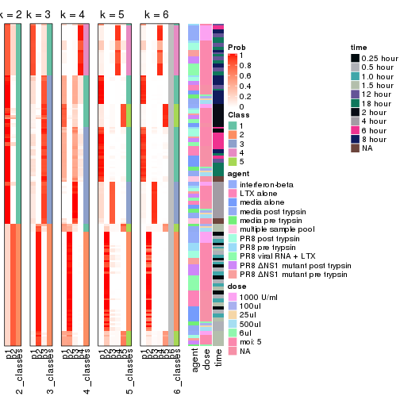


Test correlation between subgroups and known annotations. If the known
annotation is numeric, one-way ANOVA test is applied, and if the known
annotation is discrete, chi-squared contingency table test is applied.

```r
test_to_known_factors(res)
```

```
#>             n agent(p) dose(p)  time(p) k
#> CV:kmeans 167   0.8905  1.0000 3.65e-29 2
#> CV:kmeans 167   0.0125  0.0029 4.32e-35 3
#> CV:kmeans  79   0.0555  0.0181 2.20e-14 4
#> CV:kmeans 167   0.0287  0.0134 3.09e-73 5
#> CV:kmeans 168   0.0256  0.0125 9.35e-74 6
```


If matrix rows can be associated to genes, consider to use `GO_Enrichment(res,
...)` to perform function enrichment for the signature genes.


 

---------------------------------------------------


### CV:skmeans*


The object with results only for a single top-value method and a single partition method 
can be extracted as:

```r
res = res_list["CV", "skmeans"]
# you can also extract it by
# res = res_list["CV:skmeans"]
```

A summary of `res` and all the functions that can be applied to it:

```r
res
```

```
#> A 'ConsensusPartition' object with k = 2, 3, 4, 5, 6.
#>   On a matrix with 21163 rows and 169 columns.
#>   Top rows (1000, 2000, 3000, 4000, 5000) are extracted by 'CV' method.
#>   Subgroups are detected by 'skmeans' method.
#>   Performed in total 1250 partitions by row resampling.
#>   Best k for subgroups seems to be 6.
#> 
#> Following methods can be applied to this 'ConsensusPartition' object:
#>  [1] "cola_report"             "collect_classes"         "collect_plots"          
#>  [4] "collect_stats"           "colnames"                "compare_signatures"     
#>  [7] "consensus_heatmap"       "dimension_reduction"     "functional_enrichment"  
#> [10] "get_anno_col"            "get_anno"                "get_classes"            
#> [13] "get_consensus"           "get_matrix"              "get_membership"         
#> [16] "get_param"               "get_signatures"          "get_stats"              
#> [19] "is_best_k"               "is_stable_k"             "membership_heatmap"     
#> [22] "ncol"                    "nrow"                    "plot_ecdf"              
#> [25] "rownames"                "select_partition_number" "show"                   
#> [28] "suggest_best_k"          "test_to_known_factors"
```

`collect_plots()` function collects all the plots made from `res` for all `k` (number of partitions)
into one single page to provide an easy and fast comparison between different `k`.

```r
collect_plots(res)
```


The plots are:

- The first row: a plot of the ECDF (Empirical cumulative distribution
  function) curves of the consensus matrix for each `k` and the heatmap of
  predicted classes for each `k`.
- The second row: heatmaps of the consensus matrix for each `k`.
- The third row: heatmaps of the membership matrix for each `k`.
- The fouth row: heatmaps of the signatures for each `k`.

All the plots in panels can be made by individual functions and they are
plotted later in this section.

`select_partition_number()` produces several plots showing different
statistics for choosing "optimized" `k`. There are following statistics:

- ECDF curves of the consensus matrix for each `k`;
- 1-PAC. [The PAC
  score](https://en.wikipedia.org/wiki/Consensus_clustering#Over-interpretation_potential_of_consensus_clustering)
  measures the proportion of the ambiguous subgrouping.
- Mean silhouette score.
- Concordance. The mean probability of fiting the consensus class ids in all
  partitions.
- Area increased. Denote $A_k$ as the area under the ECDF curve for current
  `k`, the area increased is defined as $A_k - A_{k-1}$.
- Rand index. The percent of pairs of samples that are both in a same cluster
  or both are not in a same cluster in the partition of k and k-1.
- Jaccard index. The ratio of pairs of samples are both in a same cluster in
  the partition of k and k-1 and the pairs of samples are both in a same
  cluster in the partition k or k-1.

The detailed explanations of these statistics can be found in [the cola
vignette](http://bioconductor.org/packages/devel/bioc/vignettes/cola/inst/doc/cola.html#toc_13).

Generally speaking, lower PAC score, higher mean silhouette score or higher
concordance corresponds to better partition. Rand index and Jaccard index
measure how similar the current partition is compared to partition with `k-1`.
If they are too similar, we won't accept `k` is better than `k-1`.

```r
select_partition_number(res)
```


The numeric values for all these statistics can be obtained by `get_stats()`.

```r
get_stats(res)
```

```
#>   k 1-PAC mean_silhouette concordance area_increased  Rand Jaccard
#> 2 2 1.000           0.971       0.989         0.4855 0.512   0.512
#> 3 3 0.804           0.901       0.940         0.3628 0.785   0.595
#> 4 4 0.819           0.847       0.890         0.1004 0.906   0.732
#> 5 5 0.956           0.951       0.976         0.0732 0.909   0.685
#> 6 6 0.941           0.916       0.924         0.0296 0.970   0.867
```

`suggest_best_k()` suggests the best $k$ based on these statistics. The rules are as follows:

- All $k$ with Jaccard index larger than 0.95 are removed because the increase of
  the partition number does not provides enough extra information. If all $k$ are removed,
  the best $k$ is assigned by `NA`.
- For $k$ with 1-PAC larger than 0.9, the maximal $k$ is taken as the "best k". Other $k$ is called "optional k".
- If it does not fit the second rule. The $k$ with the highest vote of highest
  1-PAC, mean silhouette and concordance is taken as the "best k".

```r
suggest_best_k(res)
```

```
#> [1] 6
#> attr(,"optional")
#> [1] 2 5
```

There is also optional best $k$ = 2 5 that is worth to check.

Following shows the table of the partitions (You need to click the **show/hide
code output** link to see it). The membership matrix (columns with name `p*`)
is inferred by
[`clue::cl_consensus()`](https://www.rdocumentation.org/link/cl_consensus?package=clue)
function with the `SE` method. Basically the value in the membership matrix
represents the probability to belong to a certain group. The finall class
label for an item is determined with the group with highest probability it
belongs to.

In `get_classes()` function, the entropy is calculated from the membership
matrix and the silhouette score is calculated from the consensus matrix.


<script>
$( function() {
	$( '#tabs-CV-skmeans-get-classes' ).tabs();
} );
</script>
<div id='tabs-CV-skmeans-get-classes'>
<ul>
<li><a href='#tab-CV-skmeans-get-classes-1'>k = 2</a></li>
<li><a href='#tab-CV-skmeans-get-classes-2'>k = 3</a></li>
<li><a href='#tab-CV-skmeans-get-classes-3'>k = 4</a></li>
<li><a href='#tab-CV-skmeans-get-classes-4'>k = 5</a></li>
<li><a href='#tab-CV-skmeans-get-classes-5'>k = 6</a></li>
</ul>

<div id='tab-CV-skmeans-get-classes-1'>
<p><a id='tab-CV-skmeans-get-classes-1-a' style='color:#0366d6' href='#'>show/hide code output</a></p>
<pre><code class="r">cbind(get_classes(res, k = 2), get_membership(res, k = 2))
</code></pre>

<pre><code>#&gt;           class entropy silhouette    p1    p2
#&gt; GSM528681     2   0.000      0.976 0.000 1.000
#&gt; GSM528682     2   0.000      0.976 0.000 1.000
#&gt; GSM528683     2   0.000      0.976 0.000 1.000
#&gt; GSM528684     2   0.000      0.976 0.000 1.000
#&gt; GSM528687     2   0.000      0.976 0.000 1.000
#&gt; GSM528688     2   0.000      0.976 0.000 1.000
#&gt; GSM528685     2   0.000      0.976 0.000 1.000
#&gt; GSM528686     2   0.000      0.976 0.000 1.000
#&gt; GSM528693     1   0.000      0.997 1.000 0.000
#&gt; GSM528694     1   0.000      0.997 1.000 0.000
#&gt; GSM528695     1   0.000      0.997 1.000 0.000
#&gt; GSM528696     1   0.000      0.997 1.000 0.000
#&gt; GSM528697     1   0.000      0.997 1.000 0.000
#&gt; GSM528698     1   0.000      0.997 1.000 0.000
#&gt; GSM528699     1   0.000      0.997 1.000 0.000
#&gt; GSM528700     1   0.000      0.997 1.000 0.000
#&gt; GSM528689     1   0.000      0.997 1.000 0.000
#&gt; GSM528690     1   0.000      0.997 1.000 0.000
#&gt; GSM528691     1   0.000      0.997 1.000 0.000
#&gt; GSM528692     1   0.000      0.997 1.000 0.000
#&gt; GSM528779     2   0.000      0.976 0.000 1.000
#&gt; GSM528780     2   0.000      0.976 0.000 1.000
#&gt; GSM528782     2   0.000      0.976 0.000 1.000
#&gt; GSM528781     2   0.000      0.976 0.000 1.000
#&gt; GSM528785     2   0.943      0.452 0.360 0.640
#&gt; GSM528786     1   0.000      0.997 1.000 0.000
#&gt; GSM528787     1   0.000      0.997 1.000 0.000
#&gt; GSM528788     1   0.000      0.997 1.000 0.000
#&gt; GSM528783     1   0.000      0.997 1.000 0.000
#&gt; GSM528784     1   0.000      0.997 1.000 0.000
#&gt; GSM528759     1   0.000      0.997 1.000 0.000
#&gt; GSM528760     1   0.000      0.997 1.000 0.000
#&gt; GSM528761     2   0.000      0.976 0.000 1.000
#&gt; GSM528762     2   0.000      0.976 0.000 1.000
#&gt; GSM528765     2   0.000      0.976 0.000 1.000
#&gt; GSM528766     2   0.000      0.976 0.000 1.000
#&gt; GSM528763     2   0.000      0.976 0.000 1.000
#&gt; GSM528764     2   0.000      0.976 0.000 1.000
#&gt; GSM528771     2   0.943      0.452 0.360 0.640
#&gt; GSM528772     2   0.993      0.201 0.452 0.548
#&gt; GSM528773     1   0.000      0.997 1.000 0.000
#&gt; GSM528774     1   0.000      0.997 1.000 0.000
#&gt; GSM528775     1   0.000      0.997 1.000 0.000
#&gt; GSM528776     1   0.000      0.997 1.000 0.000
#&gt; GSM528777     1   0.000      0.997 1.000 0.000
#&gt; GSM528778     1   0.000      0.997 1.000 0.000
#&gt; GSM528767     1   0.000      0.997 1.000 0.000
#&gt; GSM528768     1   0.000      0.997 1.000 0.000
#&gt; GSM528769     1   0.000      0.997 1.000 0.000
#&gt; GSM528770     1   0.000      0.997 1.000 0.000
#&gt; GSM528671     2   0.000      0.976 0.000 1.000
#&gt; GSM528672     2   0.000      0.976 0.000 1.000
#&gt; GSM528674     2   0.000      0.976 0.000 1.000
#&gt; GSM528673     2   0.000      0.976 0.000 1.000
#&gt; GSM528677     1   0.184      0.969 0.972 0.028
#&gt; GSM528678     1   0.000      0.997 1.000 0.000
#&gt; GSM528679     1   0.000      0.997 1.000 0.000
#&gt; GSM528680     1   0.000      0.997 1.000 0.000
#&gt; GSM528675     1   0.000      0.997 1.000 0.000
#&gt; GSM528676     1   0.000      0.997 1.000 0.000
#&gt; GSM528651     2   0.000      0.976 0.000 1.000
#&gt; GSM528652     2   0.000      0.976 0.000 1.000
#&gt; GSM528653     2   0.000      0.976 0.000 1.000
#&gt; GSM528654     2   0.000      0.976 0.000 1.000
#&gt; GSM528657     2   0.000      0.976 0.000 1.000
#&gt; GSM528658     2   0.000      0.976 0.000 1.000
#&gt; GSM528655     2   0.000      0.976 0.000 1.000
#&gt; GSM528656     2   0.000      0.976 0.000 1.000
#&gt; GSM528663     2   0.000      0.976 0.000 1.000
#&gt; GSM528664     2   0.000      0.976 0.000 1.000
#&gt; GSM528665     1   0.000      0.997 1.000 0.000
#&gt; GSM528666     1   0.000      0.997 1.000 0.000
#&gt; GSM528667     1   0.000      0.997 1.000 0.000
#&gt; GSM528668     1   0.000      0.997 1.000 0.000
#&gt; GSM528669     1   0.000      0.997 1.000 0.000
#&gt; GSM528670     1   0.000      0.997 1.000 0.000
#&gt; GSM528659     1   0.000      0.997 1.000 0.000
#&gt; GSM528660     1   0.000      0.997 1.000 0.000
#&gt; GSM528661     1   0.000      0.997 1.000 0.000
#&gt; GSM528662     1   0.000      0.997 1.000 0.000
#&gt; GSM528701     2   0.000      0.976 0.000 1.000
#&gt; GSM528702     2   0.000      0.976 0.000 1.000
#&gt; GSM528703     2   0.000      0.976 0.000 1.000
#&gt; GSM528704     2   0.000      0.976 0.000 1.000
#&gt; GSM528707     2   0.000      0.976 0.000 1.000
#&gt; GSM528708     2   0.000      0.976 0.000 1.000
#&gt; GSM528705     2   0.000      0.976 0.000 1.000
#&gt; GSM528706     2   0.000      0.976 0.000 1.000
#&gt; GSM528713     1   0.141      0.977 0.980 0.020
#&gt; GSM528714     1   0.163      0.973 0.976 0.024
#&gt; GSM528715     1   0.000      0.997 1.000 0.000
#&gt; GSM528716     1   0.000      0.997 1.000 0.000
#&gt; GSM528717     1   0.000      0.997 1.000 0.000
#&gt; GSM528718     1   0.000      0.997 1.000 0.000
#&gt; GSM528719     1   0.000      0.997 1.000 0.000
#&gt; GSM528720     1   0.000      0.997 1.000 0.000
#&gt; GSM528709     1   0.000      0.997 1.000 0.000
#&gt; GSM528710     1   0.000      0.997 1.000 0.000
#&gt; GSM528711     1   0.000      0.997 1.000 0.000
#&gt; GSM528712     1   0.000      0.997 1.000 0.000
#&gt; GSM528721     2   0.000      0.976 0.000 1.000
#&gt; GSM528722     2   0.000      0.976 0.000 1.000
#&gt; GSM528723     2   0.000      0.976 0.000 1.000
#&gt; GSM528724     2   0.000      0.976 0.000 1.000
#&gt; GSM528727     2   0.000      0.976 0.000 1.000
#&gt; GSM528728     2   0.000      0.976 0.000 1.000
#&gt; GSM528725     2   0.000      0.976 0.000 1.000
#&gt; GSM528726     2   0.000      0.976 0.000 1.000
#&gt; GSM528733     1   0.000      0.997 1.000 0.000
#&gt; GSM528734     1   0.000      0.997 1.000 0.000
#&gt; GSM528735     1   0.000      0.997 1.000 0.000
#&gt; GSM528736     1   0.000      0.997 1.000 0.000
#&gt; GSM528737     1   0.000      0.997 1.000 0.000
#&gt; GSM528738     1   0.000      0.997 1.000 0.000
#&gt; GSM528729     1   0.000      0.997 1.000 0.000
#&gt; GSM528730     1   0.000      0.997 1.000 0.000
#&gt; GSM528731     1   0.000      0.997 1.000 0.000
#&gt; GSM528732     1   0.000      0.997 1.000 0.000
#&gt; GSM528739     2   0.000      0.976 0.000 1.000
#&gt; GSM528740     2   0.000      0.976 0.000 1.000
#&gt; GSM528741     2   0.000      0.976 0.000 1.000
#&gt; GSM528742     2   0.000      0.976 0.000 1.000
#&gt; GSM528745     2   0.000      0.976 0.000 1.000
#&gt; GSM528746     2   0.000      0.976 0.000 1.000
#&gt; GSM528743     2   0.000      0.976 0.000 1.000
#&gt; GSM528744     2   0.000      0.976 0.000 1.000
#&gt; GSM528751     2   0.994      0.189 0.456 0.544
#&gt; GSM528752     1   0.745      0.722 0.788 0.212
#&gt; GSM528753     1   0.000      0.997 1.000 0.000
#&gt; GSM528754     1   0.000      0.997 1.000 0.000
#&gt; GSM528755     1   0.000      0.997 1.000 0.000
#&gt; GSM528756     1   0.000      0.997 1.000 0.000
#&gt; GSM528757     1   0.000      0.997 1.000 0.000
#&gt; GSM528758     1   0.000      0.997 1.000 0.000
#&gt; GSM528747     1   0.000      0.997 1.000 0.000
#&gt; GSM528748     1   0.000      0.997 1.000 0.000
#&gt; GSM528749     1   0.000      0.997 1.000 0.000
#&gt; GSM528750     1   0.000      0.997 1.000 0.000
#&gt; GSM528640     2   0.000      0.976 0.000 1.000
#&gt; GSM528641     2   0.000      0.976 0.000 1.000
#&gt; GSM528643     1   0.000      0.997 1.000 0.000
#&gt; GSM528644     1   0.000      0.997 1.000 0.000
#&gt; GSM528642     1   0.000      0.997 1.000 0.000
#&gt; GSM528620     2   0.000      0.976 0.000 1.000
#&gt; GSM528621     2   0.000      0.976 0.000 1.000
#&gt; GSM528623     1   0.000      0.997 1.000 0.000
#&gt; GSM528624     1   0.000      0.997 1.000 0.000
#&gt; GSM528622     1   0.000      0.997 1.000 0.000
#&gt; GSM528625     2   0.000      0.976 0.000 1.000
#&gt; GSM528626     2   0.000      0.976 0.000 1.000
#&gt; GSM528628     1   0.000      0.997 1.000 0.000
#&gt; GSM528629     1   0.000      0.997 1.000 0.000
#&gt; GSM528627     1   0.000      0.997 1.000 0.000
#&gt; GSM528630     2   0.000      0.976 0.000 1.000
#&gt; GSM528631     2   0.000      0.976 0.000 1.000
#&gt; GSM528632     2   0.000      0.976 0.000 1.000
#&gt; GSM528633     2   0.000      0.976 0.000 1.000
#&gt; GSM528636     1   0.000      0.997 1.000 0.000
#&gt; GSM528637     1   0.000      0.997 1.000 0.000
#&gt; GSM528638     1   0.000      0.997 1.000 0.000
#&gt; GSM528639     1   0.000      0.997 1.000 0.000
#&gt; GSM528634     1   0.000      0.997 1.000 0.000
#&gt; GSM528635     1   0.000      0.997 1.000 0.000
#&gt; GSM528645     1   0.000      0.997 1.000 0.000
#&gt; GSM528646     1   0.000      0.997 1.000 0.000
#&gt; GSM528647     1   0.000      0.997 1.000 0.000
#&gt; GSM528648     1   0.000      0.997 1.000 0.000
#&gt; GSM528649     1   0.000      0.997 1.000 0.000
#&gt; GSM528650     1   0.000      0.997 1.000 0.000
</code></pre>

<script>
$('#tab-CV-skmeans-get-classes-1-a').parent().next().next().hide();
$('#tab-CV-skmeans-get-classes-1-a').click(function(){
  $('#tab-CV-skmeans-get-classes-1-a').parent().next().next().toggle();
  return(false);
});
</script>
</div>

<div id='tab-CV-skmeans-get-classes-2'>
<p><a id='tab-CV-skmeans-get-classes-2-a' style='color:#0366d6' href='#'>show/hide code output</a></p>
<pre><code class="r">cbind(get_classes(res, k = 3), get_membership(res, k = 3))
</code></pre>

<pre><code>#&gt;           class entropy silhouette    p1    p2    p3
#&gt; GSM528681     2   0.000      1.000 0.000 1.000 0.000
#&gt; GSM528682     2   0.000      1.000 0.000 1.000 0.000
#&gt; GSM528683     2   0.000      1.000 0.000 1.000 0.000
#&gt; GSM528684     2   0.000      1.000 0.000 1.000 0.000
#&gt; GSM528687     2   0.000      1.000 0.000 1.000 0.000
#&gt; GSM528688     2   0.000      1.000 0.000 1.000 0.000
#&gt; GSM528685     2   0.000      1.000 0.000 1.000 0.000
#&gt; GSM528686     2   0.000      1.000 0.000 1.000 0.000
#&gt; GSM528693     3   0.455      0.740 0.200 0.000 0.800
#&gt; GSM528694     3   0.455      0.740 0.200 0.000 0.800
#&gt; GSM528695     3   0.470      0.726 0.212 0.000 0.788
#&gt; GSM528696     3   0.470      0.726 0.212 0.000 0.788
#&gt; GSM528697     1   0.000      0.867 1.000 0.000 0.000
#&gt; GSM528698     1   0.000      0.867 1.000 0.000 0.000
#&gt; GSM528699     1   0.000      0.867 1.000 0.000 0.000
#&gt; GSM528700     1   0.000      0.867 1.000 0.000 0.000
#&gt; GSM528689     1   0.000      0.867 1.000 0.000 0.000
#&gt; GSM528690     1   0.000      0.867 1.000 0.000 0.000
#&gt; GSM528691     1   0.000      0.867 1.000 0.000 0.000
#&gt; GSM528692     1   0.000      0.867 1.000 0.000 0.000
#&gt; GSM528779     2   0.000      1.000 0.000 1.000 0.000
#&gt; GSM528780     2   0.000      1.000 0.000 1.000 0.000
#&gt; GSM528782     2   0.000      1.000 0.000 1.000 0.000
#&gt; GSM528781     2   0.000      1.000 0.000 1.000 0.000
#&gt; GSM528785     3   0.455      0.757 0.000 0.200 0.800
#&gt; GSM528786     3   0.000      0.920 0.000 0.000 1.000
#&gt; GSM528787     3   0.000      0.920 0.000 0.000 1.000
#&gt; GSM528788     1   0.475      0.822 0.784 0.000 0.216
#&gt; GSM528783     1   0.000      0.867 1.000 0.000 0.000
#&gt; GSM528784     1   0.000      0.867 1.000 0.000 0.000
#&gt; GSM528759     3   0.000      0.920 0.000 0.000 1.000
#&gt; GSM528760     3   0.000      0.920 0.000 0.000 1.000
#&gt; GSM528761     2   0.000      1.000 0.000 1.000 0.000
#&gt; GSM528762     2   0.000      1.000 0.000 1.000 0.000
#&gt; GSM528765     2   0.000      1.000 0.000 1.000 0.000
#&gt; GSM528766     2   0.000      1.000 0.000 1.000 0.000
#&gt; GSM528763     2   0.000      1.000 0.000 1.000 0.000
#&gt; GSM528764     2   0.000      1.000 0.000 1.000 0.000
#&gt; GSM528771     3   0.455      0.757 0.000 0.200 0.800
#&gt; GSM528772     3   0.440      0.769 0.000 0.188 0.812
#&gt; GSM528773     3   0.000      0.920 0.000 0.000 1.000
#&gt; GSM528774     3   0.000      0.920 0.000 0.000 1.000
#&gt; GSM528775     3   0.000      0.920 0.000 0.000 1.000
#&gt; GSM528776     1   0.550      0.764 0.708 0.000 0.292
#&gt; GSM528777     1   0.000      0.867 1.000 0.000 0.000
#&gt; GSM528778     1   0.000      0.867 1.000 0.000 0.000
#&gt; GSM528767     1   0.000      0.867 1.000 0.000 0.000
#&gt; GSM528768     1   0.000      0.867 1.000 0.000 0.000
#&gt; GSM528769     1   0.000      0.867 1.000 0.000 0.000
#&gt; GSM528770     1   0.000      0.867 1.000 0.000 0.000
#&gt; GSM528671     2   0.000      1.000 0.000 1.000 0.000
#&gt; GSM528672     2   0.000      1.000 0.000 1.000 0.000
#&gt; GSM528674     2   0.000      1.000 0.000 1.000 0.000
#&gt; GSM528673     2   0.000      1.000 0.000 1.000 0.000
#&gt; GSM528677     3   0.000      0.920 0.000 0.000 1.000
#&gt; GSM528678     3   0.000      0.920 0.000 0.000 1.000
#&gt; GSM528679     1   0.546      0.768 0.712 0.000 0.288
#&gt; GSM528680     1   0.000      0.867 1.000 0.000 0.000
#&gt; GSM528675     1   0.000      0.867 1.000 0.000 0.000
#&gt; GSM528676     1   0.000      0.867 1.000 0.000 0.000
#&gt; GSM528651     2   0.000      1.000 0.000 1.000 0.000
#&gt; GSM528652     2   0.000      1.000 0.000 1.000 0.000
#&gt; GSM528653     2   0.000      1.000 0.000 1.000 0.000
#&gt; GSM528654     2   0.000      1.000 0.000 1.000 0.000
#&gt; GSM528657     2   0.000      1.000 0.000 1.000 0.000
#&gt; GSM528658     2   0.000      1.000 0.000 1.000 0.000
#&gt; GSM528655     2   0.000      1.000 0.000 1.000 0.000
#&gt; GSM528656     2   0.000      1.000 0.000 1.000 0.000
#&gt; GSM528663     3   0.475      0.735 0.000 0.216 0.784
#&gt; GSM528664     3   0.568      0.569 0.000 0.316 0.684
#&gt; GSM528665     3   0.000      0.920 0.000 0.000 1.000
#&gt; GSM528666     3   0.000      0.920 0.000 0.000 1.000
#&gt; GSM528667     1   0.568      0.740 0.684 0.000 0.316
#&gt; GSM528668     1   0.568      0.740 0.684 0.000 0.316
#&gt; GSM528669     1   0.000      0.867 1.000 0.000 0.000
#&gt; GSM528670     1   0.000      0.867 1.000 0.000 0.000
#&gt; GSM528659     1   0.000      0.867 1.000 0.000 0.000
#&gt; GSM528660     1   0.000      0.867 1.000 0.000 0.000
#&gt; GSM528661     1   0.000      0.867 1.000 0.000 0.000
#&gt; GSM528662     1   0.000      0.867 1.000 0.000 0.000
#&gt; GSM528701     2   0.000      1.000 0.000 1.000 0.000
#&gt; GSM528702     2   0.000      1.000 0.000 1.000 0.000
#&gt; GSM528703     2   0.000      1.000 0.000 1.000 0.000
#&gt; GSM528704     2   0.000      1.000 0.000 1.000 0.000
#&gt; GSM528707     2   0.000      1.000 0.000 1.000 0.000
#&gt; GSM528708     2   0.000      1.000 0.000 1.000 0.000
#&gt; GSM528705     2   0.000      1.000 0.000 1.000 0.000
#&gt; GSM528706     2   0.000      1.000 0.000 1.000 0.000
#&gt; GSM528713     3   0.000      0.920 0.000 0.000 1.000
#&gt; GSM528714     3   0.000      0.920 0.000 0.000 1.000
#&gt; GSM528715     3   0.000      0.920 0.000 0.000 1.000
#&gt; GSM528716     3   0.000      0.920 0.000 0.000 1.000
#&gt; GSM528717     1   0.327      0.820 0.884 0.000 0.116
#&gt; GSM528718     1   0.334      0.819 0.880 0.000 0.120
#&gt; GSM528719     1   0.000      0.867 1.000 0.000 0.000
#&gt; GSM528720     1   0.000      0.867 1.000 0.000 0.000
#&gt; GSM528709     1   0.000      0.867 1.000 0.000 0.000
#&gt; GSM528710     1   0.000      0.867 1.000 0.000 0.000
#&gt; GSM528711     1   0.000      0.867 1.000 0.000 0.000
#&gt; GSM528712     1   0.000      0.867 1.000 0.000 0.000
#&gt; GSM528721     2   0.000      1.000 0.000 1.000 0.000
#&gt; GSM528722     2   0.000      1.000 0.000 1.000 0.000
#&gt; GSM528723     2   0.000      1.000 0.000 1.000 0.000
#&gt; GSM528724     2   0.000      1.000 0.000 1.000 0.000
#&gt; GSM528727     2   0.000      1.000 0.000 1.000 0.000
#&gt; GSM528728     2   0.000      1.000 0.000 1.000 0.000
#&gt; GSM528725     2   0.000      1.000 0.000 1.000 0.000
#&gt; GSM528726     2   0.000      1.000 0.000 1.000 0.000
#&gt; GSM528733     3   0.000      0.920 0.000 0.000 1.000
#&gt; GSM528734     3   0.000      0.920 0.000 0.000 1.000
#&gt; GSM528735     3   0.000      0.920 0.000 0.000 1.000
#&gt; GSM528736     3   0.000      0.920 0.000 0.000 1.000
#&gt; GSM528737     1   0.568      0.740 0.684 0.000 0.316
#&gt; GSM528738     1   0.568      0.740 0.684 0.000 0.316
#&gt; GSM528729     1   0.475      0.822 0.784 0.000 0.216
#&gt; GSM528730     1   0.475      0.822 0.784 0.000 0.216
#&gt; GSM528731     1   0.475      0.822 0.784 0.000 0.216
#&gt; GSM528732     1   0.489      0.814 0.772 0.000 0.228
#&gt; GSM528739     2   0.000      1.000 0.000 1.000 0.000
#&gt; GSM528740     2   0.000      1.000 0.000 1.000 0.000
#&gt; GSM528741     2   0.000      1.000 0.000 1.000 0.000
#&gt; GSM528742     2   0.000      1.000 0.000 1.000 0.000
#&gt; GSM528745     2   0.000      1.000 0.000 1.000 0.000
#&gt; GSM528746     2   0.000      1.000 0.000 1.000 0.000
#&gt; GSM528743     2   0.000      1.000 0.000 1.000 0.000
#&gt; GSM528744     2   0.000      1.000 0.000 1.000 0.000
#&gt; GSM528751     3   0.440      0.769 0.000 0.188 0.812
#&gt; GSM528752     3   0.418      0.783 0.000 0.172 0.828
#&gt; GSM528753     3   0.000      0.920 0.000 0.000 1.000
#&gt; GSM528754     3   0.000      0.920 0.000 0.000 1.000
#&gt; GSM528755     3   0.000      0.920 0.000 0.000 1.000
#&gt; GSM528756     3   0.000      0.920 0.000 0.000 1.000
#&gt; GSM528757     1   0.475      0.822 0.784 0.000 0.216
#&gt; GSM528758     1   0.475      0.822 0.784 0.000 0.216
#&gt; GSM528747     1   0.475      0.822 0.784 0.000 0.216
#&gt; GSM528748     1   0.475      0.822 0.784 0.000 0.216
#&gt; GSM528749     1   0.571      0.735 0.680 0.000 0.320
#&gt; GSM528750     1   0.489      0.814 0.772 0.000 0.228
#&gt; GSM528640     2   0.000      1.000 0.000 1.000 0.000
#&gt; GSM528641     2   0.000      1.000 0.000 1.000 0.000
#&gt; GSM528643     3   0.000      0.920 0.000 0.000 1.000
#&gt; GSM528644     1   0.475      0.822 0.784 0.000 0.216
#&gt; GSM528642     1   0.579      0.719 0.668 0.000 0.332
#&gt; GSM528620     2   0.000      1.000 0.000 1.000 0.000
#&gt; GSM528621     3   0.618      0.346 0.000 0.416 0.584
#&gt; GSM528623     3   0.000      0.920 0.000 0.000 1.000
#&gt; GSM528624     1   0.475      0.822 0.784 0.000 0.216
#&gt; GSM528622     1   0.568      0.740 0.684 0.000 0.316
#&gt; GSM528625     2   0.000      1.000 0.000 1.000 0.000
#&gt; GSM528626     2   0.000      1.000 0.000 1.000 0.000
#&gt; GSM528628     3   0.000      0.920 0.000 0.000 1.000
#&gt; GSM528629     1   0.475      0.822 0.784 0.000 0.216
#&gt; GSM528627     1   0.576      0.724 0.672 0.000 0.328
#&gt; GSM528630     2   0.000      1.000 0.000 1.000 0.000
#&gt; GSM528631     2   0.000      1.000 0.000 1.000 0.000
#&gt; GSM528632     2   0.000      1.000 0.000 1.000 0.000
#&gt; GSM528633     2   0.000      1.000 0.000 1.000 0.000
#&gt; GSM528636     3   0.000      0.920 0.000 0.000 1.000
#&gt; GSM528637     3   0.000      0.920 0.000 0.000 1.000
#&gt; GSM528638     1   0.475      0.822 0.784 0.000 0.216
#&gt; GSM528639     1   0.475      0.822 0.784 0.000 0.216
#&gt; GSM528634     1   0.611      0.611 0.604 0.000 0.396
#&gt; GSM528635     1   0.571      0.735 0.680 0.000 0.320
#&gt; GSM528645     3   0.000      0.920 0.000 0.000 1.000
#&gt; GSM528646     3   0.000      0.920 0.000 0.000 1.000
#&gt; GSM528647     3   0.000      0.920 0.000 0.000 1.000
#&gt; GSM528648     3   0.000      0.920 0.000 0.000 1.000
#&gt; GSM528649     3   0.000      0.920 0.000 0.000 1.000
#&gt; GSM528650     3   0.000      0.920 0.000 0.000 1.000
</code></pre>

<script>
$('#tab-CV-skmeans-get-classes-2-a').parent().next().next().hide();
$('#tab-CV-skmeans-get-classes-2-a').click(function(){
  $('#tab-CV-skmeans-get-classes-2-a').parent().next().next().toggle();
  return(false);
});
</script>
</div>

<div id='tab-CV-skmeans-get-classes-3'>
<p><a id='tab-CV-skmeans-get-classes-3-a' style='color:#0366d6' href='#'>show/hide code output</a></p>
<pre><code class="r">cbind(get_classes(res, k = 4), get_membership(res, k = 4))
</code></pre>

<pre><code>#&gt;           class entropy silhouette    p1    p2    p3    p4
#&gt; GSM528681     2  0.0000      0.953 0.000 1.000 0.000 0.000
#&gt; GSM528682     2  0.0000      0.953 0.000 1.000 0.000 0.000
#&gt; GSM528683     2  0.0000      0.953 0.000 1.000 0.000 0.000
#&gt; GSM528684     2  0.0000      0.953 0.000 1.000 0.000 0.000
#&gt; GSM528687     2  0.0000      0.953 0.000 1.000 0.000 0.000
#&gt; GSM528688     2  0.0000      0.953 0.000 1.000 0.000 0.000
#&gt; GSM528685     2  0.4250      0.724 0.276 0.724 0.000 0.000
#&gt; GSM528686     2  0.4250      0.724 0.276 0.724 0.000 0.000
#&gt; GSM528693     3  0.4933      0.672 0.432 0.000 0.568 0.000
#&gt; GSM528694     3  0.4933      0.672 0.432 0.000 0.568 0.000
#&gt; GSM528695     3  0.3688      0.650 0.000 0.000 0.792 0.208
#&gt; GSM528696     3  0.3688      0.650 0.000 0.000 0.792 0.208
#&gt; GSM528697     4  0.0000      1.000 0.000 0.000 0.000 1.000
#&gt; GSM528698     4  0.0000      1.000 0.000 0.000 0.000 1.000
#&gt; GSM528699     4  0.0000      1.000 0.000 0.000 0.000 1.000
#&gt; GSM528700     4  0.0000      1.000 0.000 0.000 0.000 1.000
#&gt; GSM528689     4  0.0000      1.000 0.000 0.000 0.000 1.000
#&gt; GSM528690     4  0.0000      1.000 0.000 0.000 0.000 1.000
#&gt; GSM528691     4  0.0000      1.000 0.000 0.000 0.000 1.000
#&gt; GSM528692     4  0.0000      1.000 0.000 0.000 0.000 1.000
#&gt; GSM528779     2  0.0000      0.953 0.000 1.000 0.000 0.000
#&gt; GSM528780     2  0.0000      0.953 0.000 1.000 0.000 0.000
#&gt; GSM528782     2  0.0000      0.953 0.000 1.000 0.000 0.000
#&gt; GSM528781     2  0.0000      0.953 0.000 1.000 0.000 0.000
#&gt; GSM528785     1  0.5268     -0.567 0.540 0.008 0.452 0.000
#&gt; GSM528786     3  0.0000      0.803 0.000 0.000 1.000 0.000
#&gt; GSM528787     3  0.2281      0.757 0.096 0.000 0.904 0.000
#&gt; GSM528788     1  0.5867      0.881 0.688 0.000 0.216 0.096
#&gt; GSM528783     4  0.0000      1.000 0.000 0.000 0.000 1.000
#&gt; GSM528784     4  0.0000      1.000 0.000 0.000 0.000 1.000
#&gt; GSM528759     3  0.4164      0.523 0.264 0.000 0.736 0.000
#&gt; GSM528760     3  0.3123      0.700 0.156 0.000 0.844 0.000
#&gt; GSM528761     2  0.0000      0.953 0.000 1.000 0.000 0.000
#&gt; GSM528762     2  0.0000      0.953 0.000 1.000 0.000 0.000
#&gt; GSM528765     2  0.0000      0.953 0.000 1.000 0.000 0.000
#&gt; GSM528766     2  0.0000      0.953 0.000 1.000 0.000 0.000
#&gt; GSM528763     2  0.0000      0.953 0.000 1.000 0.000 0.000
#&gt; GSM528764     2  0.4250      0.724 0.276 0.724 0.000 0.000
#&gt; GSM528771     3  0.4955      0.665 0.444 0.000 0.556 0.000
#&gt; GSM528772     3  0.4955      0.665 0.444 0.000 0.556 0.000
#&gt; GSM528773     3  0.0000      0.803 0.000 0.000 1.000 0.000
#&gt; GSM528774     3  0.0000      0.803 0.000 0.000 1.000 0.000
#&gt; GSM528775     1  0.5220      0.535 0.568 0.000 0.424 0.008
#&gt; GSM528776     1  0.5809      0.880 0.692 0.000 0.216 0.092
#&gt; GSM528777     1  0.4776      0.514 0.624 0.000 0.000 0.376
#&gt; GSM528778     1  0.4776      0.514 0.624 0.000 0.000 0.376
#&gt; GSM528767     4  0.0000      1.000 0.000 0.000 0.000 1.000
#&gt; GSM528768     4  0.0000      1.000 0.000 0.000 0.000 1.000
#&gt; GSM528769     4  0.0000      1.000 0.000 0.000 0.000 1.000
#&gt; GSM528770     4  0.0000      1.000 0.000 0.000 0.000 1.000
#&gt; GSM528671     2  0.0000      0.953 0.000 1.000 0.000 0.000
#&gt; GSM528672     2  0.0000      0.953 0.000 1.000 0.000 0.000
#&gt; GSM528674     2  0.0000      0.953 0.000 1.000 0.000 0.000
#&gt; GSM528673     2  0.4250      0.724 0.276 0.724 0.000 0.000
#&gt; GSM528677     3  0.4933      0.672 0.432 0.000 0.568 0.000
#&gt; GSM528678     3  0.0000      0.803 0.000 0.000 1.000 0.000
#&gt; GSM528679     1  0.5867      0.881 0.688 0.000 0.216 0.096
#&gt; GSM528680     4  0.0000      1.000 0.000 0.000 0.000 1.000
#&gt; GSM528675     4  0.0000      1.000 0.000 0.000 0.000 1.000
#&gt; GSM528676     4  0.0000      1.000 0.000 0.000 0.000 1.000
#&gt; GSM528651     2  0.0000      0.953 0.000 1.000 0.000 0.000
#&gt; GSM528652     2  0.0000      0.953 0.000 1.000 0.000 0.000
#&gt; GSM528653     2  0.0000      0.953 0.000 1.000 0.000 0.000
#&gt; GSM528654     2  0.0000      0.953 0.000 1.000 0.000 0.000
#&gt; GSM528657     2  0.0000      0.953 0.000 1.000 0.000 0.000
#&gt; GSM528658     2  0.0000      0.953 0.000 1.000 0.000 0.000
#&gt; GSM528655     2  0.4250      0.724 0.276 0.724 0.000 0.000
#&gt; GSM528656     2  0.4250      0.724 0.276 0.724 0.000 0.000
#&gt; GSM528663     3  0.4761      0.690 0.372 0.000 0.628 0.000
#&gt; GSM528664     3  0.4936      0.688 0.372 0.004 0.624 0.000
#&gt; GSM528665     3  0.0000      0.803 0.000 0.000 1.000 0.000
#&gt; GSM528666     3  0.0000      0.803 0.000 0.000 1.000 0.000
#&gt; GSM528667     1  0.5809      0.880 0.692 0.000 0.216 0.092
#&gt; GSM528668     1  0.5809      0.880 0.692 0.000 0.216 0.092
#&gt; GSM528669     1  0.4730      0.538 0.636 0.000 0.000 0.364
#&gt; GSM528670     1  0.4477      0.626 0.688 0.000 0.000 0.312
#&gt; GSM528659     4  0.0000      1.000 0.000 0.000 0.000 1.000
#&gt; GSM528660     4  0.0000      1.000 0.000 0.000 0.000 1.000
#&gt; GSM528661     4  0.0000      1.000 0.000 0.000 0.000 1.000
#&gt; GSM528662     4  0.0000      1.000 0.000 0.000 0.000 1.000
#&gt; GSM528701     2  0.0000      0.953 0.000 1.000 0.000 0.000
#&gt; GSM528702     2  0.0000      0.953 0.000 1.000 0.000 0.000
#&gt; GSM528703     2  0.0000      0.953 0.000 1.000 0.000 0.000
#&gt; GSM528704     2  0.0000      0.953 0.000 1.000 0.000 0.000
#&gt; GSM528707     2  0.0000      0.953 0.000 1.000 0.000 0.000
#&gt; GSM528708     2  0.0000      0.953 0.000 1.000 0.000 0.000
#&gt; GSM528705     2  0.0000      0.953 0.000 1.000 0.000 0.000
#&gt; GSM528706     2  0.0000      0.953 0.000 1.000 0.000 0.000
#&gt; GSM528713     3  0.4955      0.665 0.444 0.000 0.556 0.000
#&gt; GSM528714     3  0.4761      0.690 0.372 0.000 0.628 0.000
#&gt; GSM528715     3  0.0000      0.803 0.000 0.000 1.000 0.000
#&gt; GSM528716     3  0.0000      0.803 0.000 0.000 1.000 0.000
#&gt; GSM528717     1  0.5207      0.662 0.680 0.000 0.028 0.292
#&gt; GSM528718     1  0.5657      0.709 0.688 0.000 0.068 0.244
#&gt; GSM528719     4  0.0000      1.000 0.000 0.000 0.000 1.000
#&gt; GSM528720     4  0.0000      1.000 0.000 0.000 0.000 1.000
#&gt; GSM528709     4  0.0000      1.000 0.000 0.000 0.000 1.000
#&gt; GSM528710     4  0.0000      1.000 0.000 0.000 0.000 1.000
#&gt; GSM528711     4  0.0000      1.000 0.000 0.000 0.000 1.000
#&gt; GSM528712     4  0.0000      1.000 0.000 0.000 0.000 1.000
#&gt; GSM528721     2  0.0000      0.953 0.000 1.000 0.000 0.000
#&gt; GSM528722     2  0.0000      0.953 0.000 1.000 0.000 0.000
#&gt; GSM528723     2  0.0000      0.953 0.000 1.000 0.000 0.000
#&gt; GSM528724     2  0.0000      0.953 0.000 1.000 0.000 0.000
#&gt; GSM528727     2  0.0000      0.953 0.000 1.000 0.000 0.000
#&gt; GSM528728     2  0.0000      0.953 0.000 1.000 0.000 0.000
#&gt; GSM528725     2  0.0000      0.953 0.000 1.000 0.000 0.000
#&gt; GSM528726     2  0.0000      0.953 0.000 1.000 0.000 0.000
#&gt; GSM528733     3  0.0000      0.803 0.000 0.000 1.000 0.000
#&gt; GSM528734     3  0.0000      0.803 0.000 0.000 1.000 0.000
#&gt; GSM528735     1  0.4567      0.800 0.716 0.000 0.276 0.008
#&gt; GSM528736     1  0.4594      0.796 0.712 0.000 0.280 0.008
#&gt; GSM528737     1  0.5809      0.880 0.692 0.000 0.216 0.092
#&gt; GSM528738     1  0.5809      0.880 0.692 0.000 0.216 0.092
#&gt; GSM528729     1  0.5867      0.881 0.688 0.000 0.216 0.096
#&gt; GSM528730     1  0.5867      0.881 0.688 0.000 0.216 0.096
#&gt; GSM528731     1  0.5867      0.881 0.688 0.000 0.216 0.096
#&gt; GSM528732     1  0.5867      0.881 0.688 0.000 0.216 0.096
#&gt; GSM528739     2  0.0000      0.953 0.000 1.000 0.000 0.000
#&gt; GSM528740     2  0.0000      0.953 0.000 1.000 0.000 0.000
#&gt; GSM528741     2  0.0000      0.953 0.000 1.000 0.000 0.000
#&gt; GSM528742     2  0.0000      0.953 0.000 1.000 0.000 0.000
#&gt; GSM528745     2  0.0000      0.953 0.000 1.000 0.000 0.000
#&gt; GSM528746     2  0.0000      0.953 0.000 1.000 0.000 0.000
#&gt; GSM528743     2  0.0000      0.953 0.000 1.000 0.000 0.000
#&gt; GSM528744     2  0.0000      0.953 0.000 1.000 0.000 0.000
#&gt; GSM528751     3  0.4961      0.661 0.448 0.000 0.552 0.000
#&gt; GSM528752     3  0.4961      0.661 0.448 0.000 0.552 0.000
#&gt; GSM528753     3  0.0000      0.803 0.000 0.000 1.000 0.000
#&gt; GSM528754     3  0.0000      0.803 0.000 0.000 1.000 0.000
#&gt; GSM528755     1  0.4621      0.792 0.708 0.000 0.284 0.008
#&gt; GSM528756     1  0.4647      0.787 0.704 0.000 0.288 0.008
#&gt; GSM528757     1  0.5867      0.881 0.688 0.000 0.216 0.096
#&gt; GSM528758     1  0.5867      0.881 0.688 0.000 0.216 0.096
#&gt; GSM528747     1  0.5867      0.881 0.688 0.000 0.216 0.096
#&gt; GSM528748     1  0.5677      0.856 0.680 0.000 0.256 0.064
#&gt; GSM528749     1  0.5619      0.860 0.688 0.000 0.248 0.064
#&gt; GSM528750     1  0.5867      0.881 0.688 0.000 0.216 0.096
#&gt; GSM528640     2  0.0000      0.953 0.000 1.000 0.000 0.000
#&gt; GSM528641     2  0.4250      0.724 0.276 0.724 0.000 0.000
#&gt; GSM528643     3  0.0000      0.803 0.000 0.000 1.000 0.000
#&gt; GSM528644     1  0.5867      0.881 0.688 0.000 0.216 0.096
#&gt; GSM528642     1  0.4961      0.600 0.552 0.000 0.448 0.000
#&gt; GSM528620     2  0.0000      0.953 0.000 1.000 0.000 0.000
#&gt; GSM528621     3  0.6121      0.650 0.308 0.072 0.620 0.000
#&gt; GSM528623     3  0.0000      0.803 0.000 0.000 1.000 0.000
#&gt; GSM528624     1  0.5867      0.881 0.688 0.000 0.216 0.096
#&gt; GSM528622     1  0.5867      0.881 0.688 0.000 0.216 0.096
#&gt; GSM528625     2  0.0000      0.953 0.000 1.000 0.000 0.000
#&gt; GSM528626     2  0.4250      0.724 0.276 0.724 0.000 0.000
#&gt; GSM528628     3  0.0000      0.803 0.000 0.000 1.000 0.000
#&gt; GSM528629     1  0.5867      0.881 0.688 0.000 0.216 0.096
#&gt; GSM528627     1  0.5550      0.858 0.692 0.000 0.248 0.060
#&gt; GSM528630     2  0.0000      0.953 0.000 1.000 0.000 0.000
#&gt; GSM528631     2  0.0000      0.953 0.000 1.000 0.000 0.000
#&gt; GSM528632     2  0.7210      0.418 0.276 0.540 0.184 0.000
#&gt; GSM528633     2  0.7210      0.418 0.276 0.540 0.184 0.000
#&gt; GSM528636     3  0.0000      0.803 0.000 0.000 1.000 0.000
#&gt; GSM528637     3  0.0000      0.803 0.000 0.000 1.000 0.000
#&gt; GSM528638     1  0.5867      0.881 0.688 0.000 0.216 0.096
#&gt; GSM528639     1  0.5809      0.880 0.692 0.000 0.216 0.092
#&gt; GSM528634     1  0.5416      0.846 0.692 0.000 0.260 0.048
#&gt; GSM528635     1  0.5619      0.860 0.688 0.000 0.248 0.064
#&gt; GSM528645     3  0.0707      0.800 0.020 0.000 0.980 0.000
#&gt; GSM528646     3  0.0592      0.801 0.016 0.000 0.984 0.000
#&gt; GSM528647     3  0.0817      0.801 0.024 0.000 0.976 0.000
#&gt; GSM528648     3  0.4343      0.515 0.264 0.000 0.732 0.004
#&gt; GSM528649     3  0.3123      0.700 0.156 0.000 0.844 0.000
#&gt; GSM528650     3  0.5088      0.416 0.288 0.000 0.688 0.024
</code></pre>

<script>
$('#tab-CV-skmeans-get-classes-3-a').parent().next().next().hide();
$('#tab-CV-skmeans-get-classes-3-a').click(function(){
  $('#tab-CV-skmeans-get-classes-3-a').parent().next().next().toggle();
  return(false);
});
</script>
</div>

<div id='tab-CV-skmeans-get-classes-4'>
<p><a id='tab-CV-skmeans-get-classes-4-a' style='color:#0366d6' href='#'>show/hide code output</a></p>
<pre><code class="r">cbind(get_classes(res, k = 5), get_membership(res, k = 5))
</code></pre>

<pre><code>#&gt;           class entropy silhouette    p1    p2    p3    p4    p5
#&gt; GSM528681     2  0.0000      1.000 0.000 1.000 0.000 0.000 0.000
#&gt; GSM528682     2  0.0000      1.000 0.000 1.000 0.000 0.000 0.000
#&gt; GSM528683     2  0.0000      1.000 0.000 1.000 0.000 0.000 0.000
#&gt; GSM528684     2  0.0000      1.000 0.000 1.000 0.000 0.000 0.000
#&gt; GSM528687     2  0.0000      1.000 0.000 1.000 0.000 0.000 0.000
#&gt; GSM528688     2  0.0000      1.000 0.000 1.000 0.000 0.000 0.000
#&gt; GSM528685     5  0.2020      0.920 0.000 0.100 0.000 0.000 0.900
#&gt; GSM528686     5  0.2020      0.920 0.000 0.100 0.000 0.000 0.900
#&gt; GSM528693     5  0.0162      0.938 0.000 0.000 0.004 0.000 0.996
#&gt; GSM528694     5  0.0162      0.938 0.000 0.000 0.004 0.000 0.996
#&gt; GSM528695     3  0.2929      0.767 0.000 0.000 0.820 0.180 0.000
#&gt; GSM528696     3  0.2929      0.767 0.000 0.000 0.820 0.180 0.000
#&gt; GSM528697     4  0.0000      1.000 0.000 0.000 0.000 1.000 0.000
#&gt; GSM528698     4  0.0000      1.000 0.000 0.000 0.000 1.000 0.000
#&gt; GSM528699     4  0.0000      1.000 0.000 0.000 0.000 1.000 0.000
#&gt; GSM528700     4  0.0000      1.000 0.000 0.000 0.000 1.000 0.000
#&gt; GSM528689     4  0.0000      1.000 0.000 0.000 0.000 1.000 0.000
#&gt; GSM528690     4  0.0000      1.000 0.000 0.000 0.000 1.000 0.000
#&gt; GSM528691     4  0.0000      1.000 0.000 0.000 0.000 1.000 0.000
#&gt; GSM528692     4  0.0000      1.000 0.000 0.000 0.000 1.000 0.000
#&gt; GSM528779     2  0.0000      1.000 0.000 1.000 0.000 0.000 0.000
#&gt; GSM528780     2  0.0000      1.000 0.000 1.000 0.000 0.000 0.000
#&gt; GSM528782     2  0.0000      1.000 0.000 1.000 0.000 0.000 0.000
#&gt; GSM528781     2  0.0000      1.000 0.000 1.000 0.000 0.000 0.000
#&gt; GSM528785     5  0.0162      0.937 0.004 0.000 0.000 0.000 0.996
#&gt; GSM528786     3  0.0000      0.960 0.000 0.000 1.000 0.000 0.000
#&gt; GSM528787     3  0.0162      0.957 0.000 0.000 0.996 0.000 0.004
#&gt; GSM528788     1  0.0000      0.947 1.000 0.000 0.000 0.000 0.000
#&gt; GSM528783     4  0.0162      0.996 0.000 0.000 0.000 0.996 0.004
#&gt; GSM528784     4  0.0000      1.000 0.000 0.000 0.000 1.000 0.000
#&gt; GSM528759     1  0.5836      0.173 0.492 0.000 0.412 0.000 0.096
#&gt; GSM528760     3  0.3532      0.817 0.076 0.000 0.832 0.000 0.092
#&gt; GSM528761     2  0.0000      1.000 0.000 1.000 0.000 0.000 0.000
#&gt; GSM528762     2  0.0000      1.000 0.000 1.000 0.000 0.000 0.000
#&gt; GSM528765     2  0.0000      1.000 0.000 1.000 0.000 0.000 0.000
#&gt; GSM528766     2  0.0000      1.000 0.000 1.000 0.000 0.000 0.000
#&gt; GSM528763     2  0.0000      1.000 0.000 1.000 0.000 0.000 0.000
#&gt; GSM528764     5  0.2020      0.920 0.000 0.100 0.000 0.000 0.900
#&gt; GSM528771     5  0.0162      0.937 0.004 0.000 0.000 0.000 0.996
#&gt; GSM528772     5  0.0162      0.937 0.004 0.000 0.000 0.000 0.996
#&gt; GSM528773     3  0.0000      0.960 0.000 0.000 1.000 0.000 0.000
#&gt; GSM528774     3  0.0000      0.960 0.000 0.000 1.000 0.000 0.000
#&gt; GSM528775     1  0.3266      0.754 0.796 0.000 0.200 0.000 0.004
#&gt; GSM528776     1  0.0000      0.947 1.000 0.000 0.000 0.000 0.000
#&gt; GSM528777     1  0.0000      0.947 1.000 0.000 0.000 0.000 0.000
#&gt; GSM528778     1  0.0000      0.947 1.000 0.000 0.000 0.000 0.000
#&gt; GSM528767     4  0.0000      1.000 0.000 0.000 0.000 1.000 0.000
#&gt; GSM528768     4  0.0000      1.000 0.000 0.000 0.000 1.000 0.000
#&gt; GSM528769     4  0.0000      1.000 0.000 0.000 0.000 1.000 0.000
#&gt; GSM528770     4  0.0000      1.000 0.000 0.000 0.000 1.000 0.000
#&gt; GSM528671     2  0.0000      1.000 0.000 1.000 0.000 0.000 0.000
#&gt; GSM528672     2  0.0000      1.000 0.000 1.000 0.000 0.000 0.000
#&gt; GSM528674     2  0.0000      1.000 0.000 1.000 0.000 0.000 0.000
#&gt; GSM528673     5  0.2020      0.920 0.000 0.100 0.000 0.000 0.900
#&gt; GSM528677     5  0.0162      0.938 0.000 0.000 0.004 0.000 0.996
#&gt; GSM528678     3  0.0000      0.960 0.000 0.000 1.000 0.000 0.000
#&gt; GSM528679     1  0.0000      0.947 1.000 0.000 0.000 0.000 0.000
#&gt; GSM528680     4  0.0000      1.000 0.000 0.000 0.000 1.000 0.000
#&gt; GSM528675     4  0.0000      1.000 0.000 0.000 0.000 1.000 0.000
#&gt; GSM528676     4  0.0000      1.000 0.000 0.000 0.000 1.000 0.000
#&gt; GSM528651     2  0.0000      1.000 0.000 1.000 0.000 0.000 0.000
#&gt; GSM528652     2  0.0000      1.000 0.000 1.000 0.000 0.000 0.000
#&gt; GSM528653     2  0.0000      1.000 0.000 1.000 0.000 0.000 0.000
#&gt; GSM528654     2  0.0000      1.000 0.000 1.000 0.000 0.000 0.000
#&gt; GSM528657     2  0.0000      1.000 0.000 1.000 0.000 0.000 0.000
#&gt; GSM528658     2  0.0000      1.000 0.000 1.000 0.000 0.000 0.000
#&gt; GSM528655     5  0.2020      0.920 0.000 0.100 0.000 0.000 0.900
#&gt; GSM528656     5  0.2020      0.920 0.000 0.100 0.000 0.000 0.900
#&gt; GSM528663     5  0.0162      0.938 0.000 0.000 0.004 0.000 0.996
#&gt; GSM528664     5  0.0162      0.938 0.000 0.000 0.004 0.000 0.996
#&gt; GSM528665     3  0.0000      0.960 0.000 0.000 1.000 0.000 0.000
#&gt; GSM528666     3  0.0000      0.960 0.000 0.000 1.000 0.000 0.000
#&gt; GSM528667     1  0.0000      0.947 1.000 0.000 0.000 0.000 0.000
#&gt; GSM528668     1  0.0000      0.947 1.000 0.000 0.000 0.000 0.000
#&gt; GSM528669     1  0.0000      0.947 1.000 0.000 0.000 0.000 0.000
#&gt; GSM528670     1  0.0000      0.947 1.000 0.000 0.000 0.000 0.000
#&gt; GSM528659     4  0.0000      1.000 0.000 0.000 0.000 1.000 0.000
#&gt; GSM528660     4  0.0000      1.000 0.000 0.000 0.000 1.000 0.000
#&gt; GSM528661     4  0.0000      1.000 0.000 0.000 0.000 1.000 0.000
#&gt; GSM528662     4  0.0000      1.000 0.000 0.000 0.000 1.000 0.000
#&gt; GSM528701     2  0.0000      1.000 0.000 1.000 0.000 0.000 0.000
#&gt; GSM528702     2  0.0000      1.000 0.000 1.000 0.000 0.000 0.000
#&gt; GSM528703     2  0.0000      1.000 0.000 1.000 0.000 0.000 0.000
#&gt; GSM528704     2  0.0000      1.000 0.000 1.000 0.000 0.000 0.000
#&gt; GSM528707     2  0.0000      1.000 0.000 1.000 0.000 0.000 0.000
#&gt; GSM528708     2  0.0000      1.000 0.000 1.000 0.000 0.000 0.000
#&gt; GSM528705     2  0.0000      1.000 0.000 1.000 0.000 0.000 0.000
#&gt; GSM528706     2  0.0000      1.000 0.000 1.000 0.000 0.000 0.000
#&gt; GSM528713     5  0.0162      0.937 0.004 0.000 0.000 0.000 0.996
#&gt; GSM528714     5  0.0162      0.938 0.000 0.000 0.004 0.000 0.996
#&gt; GSM528715     3  0.0000      0.960 0.000 0.000 1.000 0.000 0.000
#&gt; GSM528716     3  0.0000      0.960 0.000 0.000 1.000 0.000 0.000
#&gt; GSM528717     1  0.3318      0.758 0.800 0.000 0.008 0.192 0.000
#&gt; GSM528718     1  0.3794      0.781 0.800 0.000 0.048 0.152 0.000
#&gt; GSM528719     4  0.0000      1.000 0.000 0.000 0.000 1.000 0.000
#&gt; GSM528720     4  0.0000      1.000 0.000 0.000 0.000 1.000 0.000
#&gt; GSM528709     4  0.0000      1.000 0.000 0.000 0.000 1.000 0.000
#&gt; GSM528710     4  0.0000      1.000 0.000 0.000 0.000 1.000 0.000
#&gt; GSM528711     4  0.0000      1.000 0.000 0.000 0.000 1.000 0.000
#&gt; GSM528712     4  0.0000      1.000 0.000 0.000 0.000 1.000 0.000
#&gt; GSM528721     2  0.0000      1.000 0.000 1.000 0.000 0.000 0.000
#&gt; GSM528722     2  0.0000      1.000 0.000 1.000 0.000 0.000 0.000
#&gt; GSM528723     2  0.0000      1.000 0.000 1.000 0.000 0.000 0.000
#&gt; GSM528724     2  0.0000      1.000 0.000 1.000 0.000 0.000 0.000
#&gt; GSM528727     2  0.0000      1.000 0.000 1.000 0.000 0.000 0.000
#&gt; GSM528728     2  0.0000      1.000 0.000 1.000 0.000 0.000 0.000
#&gt; GSM528725     2  0.0000      1.000 0.000 1.000 0.000 0.000 0.000
#&gt; GSM528726     2  0.0000      1.000 0.000 1.000 0.000 0.000 0.000
#&gt; GSM528733     3  0.0000      0.960 0.000 0.000 1.000 0.000 0.000
#&gt; GSM528734     3  0.0000      0.960 0.000 0.000 1.000 0.000 0.000
#&gt; GSM528735     1  0.0404      0.941 0.988 0.000 0.012 0.000 0.000
#&gt; GSM528736     1  0.0510      0.939 0.984 0.000 0.016 0.000 0.000
#&gt; GSM528737     1  0.0000      0.947 1.000 0.000 0.000 0.000 0.000
#&gt; GSM528738     1  0.0000      0.947 1.000 0.000 0.000 0.000 0.000
#&gt; GSM528729     1  0.0000      0.947 1.000 0.000 0.000 0.000 0.000
#&gt; GSM528730     1  0.0000      0.947 1.000 0.000 0.000 0.000 0.000
#&gt; GSM528731     1  0.0162      0.947 0.996 0.000 0.000 0.000 0.004
#&gt; GSM528732     1  0.0162      0.947 0.996 0.000 0.000 0.000 0.004
#&gt; GSM528739     2  0.0000      1.000 0.000 1.000 0.000 0.000 0.000
#&gt; GSM528740     2  0.0000      1.000 0.000 1.000 0.000 0.000 0.000
#&gt; GSM528741     2  0.0000      1.000 0.000 1.000 0.000 0.000 0.000
#&gt; GSM528742     2  0.0000      1.000 0.000 1.000 0.000 0.000 0.000
#&gt; GSM528745     2  0.0000      1.000 0.000 1.000 0.000 0.000 0.000
#&gt; GSM528746     2  0.0000      1.000 0.000 1.000 0.000 0.000 0.000
#&gt; GSM528743     2  0.0000      1.000 0.000 1.000 0.000 0.000 0.000
#&gt; GSM528744     2  0.0000      1.000 0.000 1.000 0.000 0.000 0.000
#&gt; GSM528751     5  0.0162      0.937 0.004 0.000 0.000 0.000 0.996
#&gt; GSM528752     5  0.0162      0.937 0.004 0.000 0.000 0.000 0.996
#&gt; GSM528753     3  0.0000      0.960 0.000 0.000 1.000 0.000 0.000
#&gt; GSM528754     3  0.0000      0.960 0.000 0.000 1.000 0.000 0.000
#&gt; GSM528755     1  0.1571      0.905 0.936 0.000 0.060 0.000 0.004
#&gt; GSM528756     1  0.1571      0.905 0.936 0.000 0.060 0.000 0.004
#&gt; GSM528757     1  0.0000      0.947 1.000 0.000 0.000 0.000 0.000
#&gt; GSM528758     1  0.0000      0.947 1.000 0.000 0.000 0.000 0.000
#&gt; GSM528747     1  0.0162      0.947 0.996 0.000 0.000 0.000 0.004
#&gt; GSM528748     1  0.0162      0.947 0.996 0.000 0.000 0.000 0.004
#&gt; GSM528749     1  0.0162      0.947 0.996 0.000 0.000 0.000 0.004
#&gt; GSM528750     1  0.0162      0.947 0.996 0.000 0.000 0.000 0.004
#&gt; GSM528640     2  0.0000      1.000 0.000 1.000 0.000 0.000 0.000
#&gt; GSM528641     5  0.2020      0.920 0.000 0.100 0.000 0.000 0.900
#&gt; GSM528643     3  0.0000      0.960 0.000 0.000 1.000 0.000 0.000
#&gt; GSM528644     1  0.0162      0.947 0.996 0.000 0.000 0.000 0.004
#&gt; GSM528642     3  0.0955      0.935 0.028 0.000 0.968 0.000 0.004
#&gt; GSM528620     2  0.0000      1.000 0.000 1.000 0.000 0.000 0.000
#&gt; GSM528621     5  0.0162      0.938 0.000 0.000 0.004 0.000 0.996
#&gt; GSM528623     3  0.0000      0.960 0.000 0.000 1.000 0.000 0.000
#&gt; GSM528624     1  0.0000      0.947 1.000 0.000 0.000 0.000 0.000
#&gt; GSM528622     1  0.0162      0.947 0.996 0.000 0.000 0.000 0.004
#&gt; GSM528625     2  0.0000      1.000 0.000 1.000 0.000 0.000 0.000
#&gt; GSM528626     5  0.2020      0.920 0.000 0.100 0.000 0.000 0.900
#&gt; GSM528628     3  0.0000      0.960 0.000 0.000 1.000 0.000 0.000
#&gt; GSM528629     1  0.0162      0.947 0.996 0.000 0.000 0.000 0.004
#&gt; GSM528627     1  0.0162      0.947 0.996 0.000 0.000 0.000 0.004
#&gt; GSM528630     2  0.0000      1.000 0.000 1.000 0.000 0.000 0.000
#&gt; GSM528631     2  0.0000      1.000 0.000 1.000 0.000 0.000 0.000
#&gt; GSM528632     5  0.2124      0.921 0.000 0.096 0.004 0.000 0.900
#&gt; GSM528633     5  0.2124      0.921 0.000 0.096 0.004 0.000 0.900
#&gt; GSM528636     3  0.0000      0.960 0.000 0.000 1.000 0.000 0.000
#&gt; GSM528637     3  0.0000      0.960 0.000 0.000 1.000 0.000 0.000
#&gt; GSM528638     1  0.0000      0.947 1.000 0.000 0.000 0.000 0.000
#&gt; GSM528639     1  0.0000      0.947 1.000 0.000 0.000 0.000 0.000
#&gt; GSM528634     1  0.1205      0.922 0.956 0.000 0.040 0.000 0.004
#&gt; GSM528635     1  0.0162      0.947 0.996 0.000 0.000 0.000 0.004
#&gt; GSM528645     3  0.0000      0.960 0.000 0.000 1.000 0.000 0.000
#&gt; GSM528646     3  0.0000      0.960 0.000 0.000 1.000 0.000 0.000
#&gt; GSM528647     3  0.0000      0.960 0.000 0.000 1.000 0.000 0.000
#&gt; GSM528648     1  0.5770      0.294 0.532 0.000 0.372 0.000 0.096
#&gt; GSM528649     3  0.5498      0.448 0.292 0.000 0.612 0.000 0.096
#&gt; GSM528650     1  0.4933      0.662 0.704 0.000 0.200 0.000 0.096
</code></pre>

<script>
$('#tab-CV-skmeans-get-classes-4-a').parent().next().next().hide();
$('#tab-CV-skmeans-get-classes-4-a').click(function(){
  $('#tab-CV-skmeans-get-classes-4-a').parent().next().next().toggle();
  return(false);
});
</script>
</div>

<div id='tab-CV-skmeans-get-classes-5'>
<p><a id='tab-CV-skmeans-get-classes-5-a' style='color:#0366d6' href='#'>show/hide code output</a></p>
<pre><code class="r">cbind(get_classes(res, k = 6), get_membership(res, k = 6))
</code></pre>

<pre><code>#&gt;           class entropy silhouette    p1    p2    p3    p4    p5    p6
#&gt; GSM528681     2  0.0000      0.996 0.000 1.000 0.000 0.000 0.000 0.000
#&gt; GSM528682     2  0.0000      0.996 0.000 1.000 0.000 0.000 0.000 0.000
#&gt; GSM528683     2  0.0000      0.996 0.000 1.000 0.000 0.000 0.000 0.000
#&gt; GSM528684     2  0.0000      0.996 0.000 1.000 0.000 0.000 0.000 0.000
#&gt; GSM528687     2  0.0000      0.996 0.000 1.000 0.000 0.000 0.000 0.000
#&gt; GSM528688     2  0.0000      0.996 0.000 1.000 0.000 0.000 0.000 0.000
#&gt; GSM528685     6  0.0146      0.919 0.000 0.004 0.000 0.000 0.000 0.996
#&gt; GSM528686     6  0.0146      0.919 0.000 0.004 0.000 0.000 0.000 0.996
#&gt; GSM528693     5  0.3634      0.782 0.000 0.000 0.000 0.000 0.644 0.356
#&gt; GSM528694     5  0.3634      0.782 0.000 0.000 0.000 0.000 0.644 0.356
#&gt; GSM528695     3  0.2260      0.821 0.000 0.000 0.860 0.140 0.000 0.000
#&gt; GSM528696     3  0.2260      0.821 0.000 0.000 0.860 0.140 0.000 0.000
#&gt; GSM528697     4  0.0000      0.988 0.000 0.000 0.000 1.000 0.000 0.000
#&gt; GSM528698     4  0.0000      0.988 0.000 0.000 0.000 1.000 0.000 0.000
#&gt; GSM528699     4  0.0000      0.988 0.000 0.000 0.000 1.000 0.000 0.000
#&gt; GSM528700     4  0.0000      0.988 0.000 0.000 0.000 1.000 0.000 0.000
#&gt; GSM528689     4  0.0000      0.988 0.000 0.000 0.000 1.000 0.000 0.000
#&gt; GSM528690     4  0.0000      0.988 0.000 0.000 0.000 1.000 0.000 0.000
#&gt; GSM528691     4  0.0000      0.988 0.000 0.000 0.000 1.000 0.000 0.000
#&gt; GSM528692     4  0.0000      0.988 0.000 0.000 0.000 1.000 0.000 0.000
#&gt; GSM528779     2  0.0000      0.996 0.000 1.000 0.000 0.000 0.000 0.000
#&gt; GSM528780     2  0.0260      0.993 0.000 0.992 0.000 0.000 0.008 0.000
#&gt; GSM528782     2  0.0000      0.996 0.000 1.000 0.000 0.000 0.000 0.000
#&gt; GSM528781     2  0.0520      0.989 0.000 0.984 0.000 0.000 0.008 0.008
#&gt; GSM528785     5  0.3634      0.782 0.000 0.000 0.000 0.000 0.644 0.356
#&gt; GSM528786     3  0.0000      0.966 0.000 0.000 1.000 0.000 0.000 0.000
#&gt; GSM528787     3  0.3101      0.700 0.000 0.000 0.756 0.000 0.244 0.000
#&gt; GSM528788     1  0.0146      0.871 0.996 0.000 0.000 0.000 0.004 0.000
#&gt; GSM528783     4  0.1226      0.973 0.004 0.000 0.000 0.952 0.040 0.004
#&gt; GSM528784     4  0.0937      0.978 0.000 0.000 0.000 0.960 0.040 0.000
#&gt; GSM528759     5  0.3163      0.520 0.004 0.000 0.232 0.000 0.764 0.000
#&gt; GSM528760     5  0.3266      0.485 0.000 0.000 0.272 0.000 0.728 0.000
#&gt; GSM528761     2  0.0260      0.993 0.000 0.992 0.000 0.000 0.008 0.000
#&gt; GSM528762     2  0.0000      0.996 0.000 1.000 0.000 0.000 0.000 0.000
#&gt; GSM528765     2  0.0520      0.989 0.000 0.984 0.000 0.000 0.008 0.008
#&gt; GSM528766     2  0.0260      0.993 0.000 0.992 0.000 0.000 0.008 0.000
#&gt; GSM528763     6  0.3695      0.328 0.000 0.376 0.000 0.000 0.000 0.624
#&gt; GSM528764     6  0.0146      0.919 0.000 0.004 0.000 0.000 0.000 0.996
#&gt; GSM528771     5  0.3634      0.782 0.000 0.000 0.000 0.000 0.644 0.356
#&gt; GSM528772     5  0.3634      0.782 0.000 0.000 0.000 0.000 0.644 0.356
#&gt; GSM528773     3  0.0000      0.966 0.000 0.000 1.000 0.000 0.000 0.000
#&gt; GSM528774     3  0.0000      0.966 0.000 0.000 1.000 0.000 0.000 0.000
#&gt; GSM528775     1  0.4638      0.782 0.636 0.000 0.068 0.000 0.296 0.000
#&gt; GSM528776     1  0.2730      0.857 0.808 0.000 0.000 0.000 0.192 0.000
#&gt; GSM528777     1  0.0632      0.868 0.976 0.000 0.000 0.000 0.024 0.000
#&gt; GSM528778     1  0.0632      0.868 0.976 0.000 0.000 0.000 0.024 0.000
#&gt; GSM528767     4  0.0937      0.978 0.000 0.000 0.000 0.960 0.040 0.000
#&gt; GSM528768     4  0.0937      0.978 0.000 0.000 0.000 0.960 0.040 0.000
#&gt; GSM528769     4  0.0937      0.978 0.000 0.000 0.000 0.960 0.040 0.000
#&gt; GSM528770     4  0.0937      0.978 0.000 0.000 0.000 0.960 0.040 0.000
#&gt; GSM528671     2  0.0520      0.989 0.000 0.984 0.000 0.000 0.008 0.008
#&gt; GSM528672     2  0.0000      0.996 0.000 1.000 0.000 0.000 0.000 0.000
#&gt; GSM528674     2  0.0260      0.993 0.000 0.992 0.000 0.000 0.008 0.000
#&gt; GSM528673     6  0.0146      0.919 0.000 0.004 0.000 0.000 0.000 0.996
#&gt; GSM528677     5  0.3634      0.782 0.000 0.000 0.000 0.000 0.644 0.356
#&gt; GSM528678     3  0.0000      0.966 0.000 0.000 1.000 0.000 0.000 0.000
#&gt; GSM528679     1  0.2912      0.856 0.784 0.000 0.000 0.000 0.216 0.000
#&gt; GSM528680     4  0.0000      0.988 0.000 0.000 0.000 1.000 0.000 0.000
#&gt; GSM528675     4  0.0632      0.985 0.000 0.000 0.000 0.976 0.024 0.000
#&gt; GSM528676     4  0.0632      0.985 0.000 0.000 0.000 0.976 0.024 0.000
#&gt; GSM528651     2  0.0520      0.989 0.000 0.984 0.000 0.000 0.008 0.008
#&gt; GSM528652     2  0.0520      0.989 0.000 0.984 0.000 0.000 0.008 0.008
#&gt; GSM528653     2  0.0000      0.996 0.000 1.000 0.000 0.000 0.000 0.000
#&gt; GSM528654     2  0.0000      0.996 0.000 1.000 0.000 0.000 0.000 0.000
#&gt; GSM528657     2  0.0520      0.989 0.000 0.984 0.000 0.000 0.008 0.008
#&gt; GSM528658     2  0.0000      0.996 0.000 1.000 0.000 0.000 0.000 0.000
#&gt; GSM528655     6  0.0146      0.919 0.000 0.004 0.000 0.000 0.000 0.996
#&gt; GSM528656     6  0.0146      0.919 0.000 0.004 0.000 0.000 0.000 0.996
#&gt; GSM528663     5  0.3634      0.782 0.000 0.000 0.000 0.000 0.644 0.356
#&gt; GSM528664     5  0.3634      0.782 0.000 0.000 0.000 0.000 0.644 0.356
#&gt; GSM528665     3  0.0000      0.966 0.000 0.000 1.000 0.000 0.000 0.000
#&gt; GSM528666     3  0.0000      0.966 0.000 0.000 1.000 0.000 0.000 0.000
#&gt; GSM528667     1  0.2730      0.857 0.808 0.000 0.000 0.000 0.192 0.000
#&gt; GSM528668     1  0.2730      0.857 0.808 0.000 0.000 0.000 0.192 0.000
#&gt; GSM528669     1  0.0937      0.875 0.960 0.000 0.000 0.000 0.040 0.000
#&gt; GSM528670     1  0.0937      0.875 0.960 0.000 0.000 0.000 0.040 0.000
#&gt; GSM528659     4  0.0632      0.985 0.000 0.000 0.000 0.976 0.024 0.000
#&gt; GSM528660     4  0.0632      0.985 0.000 0.000 0.000 0.976 0.024 0.000
#&gt; GSM528661     4  0.0632      0.985 0.000 0.000 0.000 0.976 0.024 0.000
#&gt; GSM528662     4  0.0632      0.985 0.000 0.000 0.000 0.976 0.024 0.000
#&gt; GSM528701     2  0.0000      0.996 0.000 1.000 0.000 0.000 0.000 0.000
#&gt; GSM528702     2  0.0000      0.996 0.000 1.000 0.000 0.000 0.000 0.000
#&gt; GSM528703     2  0.0000      0.996 0.000 1.000 0.000 0.000 0.000 0.000
#&gt; GSM528704     2  0.0000      0.996 0.000 1.000 0.000 0.000 0.000 0.000
#&gt; GSM528707     2  0.0000      0.996 0.000 1.000 0.000 0.000 0.000 0.000
#&gt; GSM528708     2  0.0000      0.996 0.000 1.000 0.000 0.000 0.000 0.000
#&gt; GSM528705     2  0.0000      0.996 0.000 1.000 0.000 0.000 0.000 0.000
#&gt; GSM528706     2  0.0000      0.996 0.000 1.000 0.000 0.000 0.000 0.000
#&gt; GSM528713     5  0.3634      0.782 0.000 0.000 0.000 0.000 0.644 0.356
#&gt; GSM528714     5  0.3634      0.782 0.000 0.000 0.000 0.000 0.644 0.356
#&gt; GSM528715     3  0.0000      0.966 0.000 0.000 1.000 0.000 0.000 0.000
#&gt; GSM528716     3  0.0000      0.966 0.000 0.000 1.000 0.000 0.000 0.000
#&gt; GSM528717     1  0.3953      0.825 0.744 0.000 0.000 0.060 0.196 0.000
#&gt; GSM528718     1  0.4577      0.809 0.708 0.000 0.016 0.068 0.208 0.000
#&gt; GSM528719     4  0.0000      0.988 0.000 0.000 0.000 1.000 0.000 0.000
#&gt; GSM528720     4  0.0000      0.988 0.000 0.000 0.000 1.000 0.000 0.000
#&gt; GSM528709     4  0.0000      0.988 0.000 0.000 0.000 1.000 0.000 0.000
#&gt; GSM528710     4  0.0000      0.988 0.000 0.000 0.000 1.000 0.000 0.000
#&gt; GSM528711     4  0.0000      0.988 0.000 0.000 0.000 1.000 0.000 0.000
#&gt; GSM528712     4  0.0000      0.988 0.000 0.000 0.000 1.000 0.000 0.000
#&gt; GSM528721     2  0.0000      0.996 0.000 1.000 0.000 0.000 0.000 0.000
#&gt; GSM528722     2  0.0000      0.996 0.000 1.000 0.000 0.000 0.000 0.000
#&gt; GSM528723     2  0.0000      0.996 0.000 1.000 0.000 0.000 0.000 0.000
#&gt; GSM528724     2  0.0000      0.996 0.000 1.000 0.000 0.000 0.000 0.000
#&gt; GSM528727     2  0.0520      0.989 0.000 0.984 0.000 0.000 0.008 0.008
#&gt; GSM528728     2  0.0000      0.996 0.000 1.000 0.000 0.000 0.000 0.000
#&gt; GSM528725     2  0.0000      0.996 0.000 1.000 0.000 0.000 0.000 0.000
#&gt; GSM528726     2  0.0000      0.996 0.000 1.000 0.000 0.000 0.000 0.000
#&gt; GSM528733     3  0.0000      0.966 0.000 0.000 1.000 0.000 0.000 0.000
#&gt; GSM528734     3  0.0000      0.966 0.000 0.000 1.000 0.000 0.000 0.000
#&gt; GSM528735     1  0.2902      0.853 0.800 0.000 0.004 0.000 0.196 0.000
#&gt; GSM528736     1  0.2902      0.853 0.800 0.000 0.004 0.000 0.196 0.000
#&gt; GSM528737     1  0.2730      0.857 0.808 0.000 0.000 0.000 0.192 0.000
#&gt; GSM528738     1  0.2730      0.857 0.808 0.000 0.000 0.000 0.192 0.000
#&gt; GSM528729     1  0.0000      0.871 1.000 0.000 0.000 0.000 0.000 0.000
#&gt; GSM528730     1  0.0260      0.873 0.992 0.000 0.000 0.000 0.008 0.000
#&gt; GSM528731     1  0.1858      0.864 0.904 0.000 0.000 0.000 0.092 0.004
#&gt; GSM528732     1  0.2146      0.857 0.880 0.000 0.000 0.000 0.116 0.004
#&gt; GSM528739     2  0.0000      0.996 0.000 1.000 0.000 0.000 0.000 0.000
#&gt; GSM528740     2  0.0000      0.996 0.000 1.000 0.000 0.000 0.000 0.000
#&gt; GSM528741     2  0.0260      0.993 0.000 0.992 0.000 0.000 0.008 0.000
#&gt; GSM528742     2  0.0000      0.996 0.000 1.000 0.000 0.000 0.000 0.000
#&gt; GSM528745     2  0.0520      0.989 0.000 0.984 0.000 0.000 0.008 0.008
#&gt; GSM528746     2  0.0000      0.996 0.000 1.000 0.000 0.000 0.000 0.000
#&gt; GSM528743     2  0.0520      0.989 0.000 0.984 0.000 0.000 0.008 0.008
#&gt; GSM528744     2  0.0520      0.989 0.000 0.984 0.000 0.000 0.008 0.008
#&gt; GSM528751     5  0.3634      0.782 0.000 0.000 0.000 0.000 0.644 0.356
#&gt; GSM528752     5  0.3634      0.782 0.000 0.000 0.000 0.000 0.644 0.356
#&gt; GSM528753     3  0.0000      0.966 0.000 0.000 1.000 0.000 0.000 0.000
#&gt; GSM528754     3  0.0000      0.966 0.000 0.000 1.000 0.000 0.000 0.000
#&gt; GSM528755     1  0.4065      0.819 0.672 0.000 0.028 0.000 0.300 0.000
#&gt; GSM528756     1  0.4117      0.818 0.672 0.000 0.032 0.000 0.296 0.000
#&gt; GSM528757     1  0.0363      0.871 0.988 0.000 0.000 0.000 0.012 0.000
#&gt; GSM528758     1  0.1141      0.868 0.948 0.000 0.000 0.000 0.052 0.000
#&gt; GSM528747     1  0.2146      0.857 0.880 0.000 0.000 0.000 0.116 0.004
#&gt; GSM528748     1  0.2146      0.857 0.880 0.000 0.000 0.000 0.116 0.004
#&gt; GSM528749     1  0.2146      0.857 0.880 0.000 0.000 0.000 0.116 0.004
#&gt; GSM528750     1  0.1958      0.862 0.896 0.000 0.000 0.000 0.100 0.004
#&gt; GSM528640     2  0.0000      0.996 0.000 1.000 0.000 0.000 0.000 0.000
#&gt; GSM528641     6  0.0146      0.919 0.000 0.004 0.000 0.000 0.000 0.996
#&gt; GSM528643     3  0.0000      0.966 0.000 0.000 1.000 0.000 0.000 0.000
#&gt; GSM528644     1  0.2053      0.860 0.888 0.000 0.000 0.000 0.108 0.004
#&gt; GSM528642     3  0.3185      0.807 0.048 0.000 0.832 0.000 0.116 0.004
#&gt; GSM528620     2  0.0260      0.993 0.000 0.992 0.000 0.000 0.008 0.000
#&gt; GSM528621     6  0.0146      0.910 0.000 0.000 0.000 0.000 0.004 0.996
#&gt; GSM528623     3  0.0000      0.966 0.000 0.000 1.000 0.000 0.000 0.000
#&gt; GSM528624     1  0.0146      0.872 0.996 0.000 0.000 0.000 0.004 0.000
#&gt; GSM528622     1  0.3448      0.846 0.716 0.000 0.000 0.000 0.280 0.004
#&gt; GSM528625     2  0.0000      0.996 0.000 1.000 0.000 0.000 0.000 0.000
#&gt; GSM528626     6  0.0146      0.919 0.000 0.004 0.000 0.000 0.000 0.996
#&gt; GSM528628     3  0.0000      0.966 0.000 0.000 1.000 0.000 0.000 0.000
#&gt; GSM528629     1  0.2053      0.860 0.888 0.000 0.000 0.000 0.108 0.004
#&gt; GSM528627     1  0.3528      0.842 0.700 0.000 0.000 0.000 0.296 0.004
#&gt; GSM528630     2  0.0520      0.989 0.000 0.984 0.000 0.000 0.008 0.008
#&gt; GSM528631     2  0.0520      0.989 0.000 0.984 0.000 0.000 0.008 0.008
#&gt; GSM528632     6  0.0146      0.919 0.000 0.004 0.000 0.000 0.000 0.996
#&gt; GSM528633     6  0.0146      0.919 0.000 0.004 0.000 0.000 0.000 0.996
#&gt; GSM528636     3  0.0000      0.966 0.000 0.000 1.000 0.000 0.000 0.000
#&gt; GSM528637     3  0.0000      0.966 0.000 0.000 1.000 0.000 0.000 0.000
#&gt; GSM528638     1  0.0000      0.871 1.000 0.000 0.000 0.000 0.000 0.000
#&gt; GSM528639     1  0.0632      0.872 0.976 0.000 0.000 0.000 0.024 0.000
#&gt; GSM528634     1  0.3772      0.838 0.692 0.000 0.008 0.000 0.296 0.004
#&gt; GSM528635     1  0.3448      0.846 0.716 0.000 0.000 0.000 0.280 0.004
#&gt; GSM528645     3  0.0000      0.966 0.000 0.000 1.000 0.000 0.000 0.000
#&gt; GSM528646     3  0.0000      0.966 0.000 0.000 1.000 0.000 0.000 0.000
#&gt; GSM528647     3  0.0000      0.966 0.000 0.000 1.000 0.000 0.000 0.000
#&gt; GSM528648     5  0.2383      0.573 0.024 0.000 0.096 0.000 0.880 0.000
#&gt; GSM528649     5  0.2996      0.526 0.000 0.000 0.228 0.000 0.772 0.000
#&gt; GSM528650     5  0.2436      0.569 0.032 0.000 0.088 0.000 0.880 0.000
</code></pre>

<script>
$('#tab-CV-skmeans-get-classes-5-a').parent().next().next().hide();
$('#tab-CV-skmeans-get-classes-5-a').click(function(){
  $('#tab-CV-skmeans-get-classes-5-a').parent().next().next().toggle();
  return(false);
});
</script>
</div>
</div>

Heatmaps for the consensus matrix. It visualizes the probability of two
samples to be in a same group.


<script>
$( function() {
	$( '#tabs-CV-skmeans-consensus-heatmap' ).tabs();
} );
</script>
<div id='tabs-CV-skmeans-consensus-heatmap'>
<ul>
<li><a href='#tab-CV-skmeans-consensus-heatmap-1'>k = 2</a></li>
<li><a href='#tab-CV-skmeans-consensus-heatmap-2'>k = 3</a></li>
<li><a href='#tab-CV-skmeans-consensus-heatmap-3'>k = 4</a></li>
<li><a href='#tab-CV-skmeans-consensus-heatmap-4'>k = 5</a></li>
<li><a href='#tab-CV-skmeans-consensus-heatmap-5'>k = 6</a></li>
</ul>
<div id='tab-CV-skmeans-consensus-heatmap-1'>
<pre><code class="r">consensus_heatmap(res, k = 2)
</code></pre>

<p></p>

</div>
<div id='tab-CV-skmeans-consensus-heatmap-2'>
<pre><code class="r">consensus_heatmap(res, k = 3)
</code></pre>

<p></p>

</div>
<div id='tab-CV-skmeans-consensus-heatmap-3'>
<pre><code class="r">consensus_heatmap(res, k = 4)
</code></pre>

<p></p>

</div>
<div id='tab-CV-skmeans-consensus-heatmap-4'>
<pre><code class="r">consensus_heatmap(res, k = 5)
</code></pre>

<p></p>

</div>
<div id='tab-CV-skmeans-consensus-heatmap-5'>
<pre><code class="r">consensus_heatmap(res, k = 6)
</code></pre>

<p></p>

</div>
</div>

Heatmaps for the membership of samples in all partitions to see how consistent they are:


<script>
$( function() {
	$( '#tabs-CV-skmeans-membership-heatmap' ).tabs();
} );
</script>
<div id='tabs-CV-skmeans-membership-heatmap'>
<ul>
<li><a href='#tab-CV-skmeans-membership-heatmap-1'>k = 2</a></li>
<li><a href='#tab-CV-skmeans-membership-heatmap-2'>k = 3</a></li>
<li><a href='#tab-CV-skmeans-membership-heatmap-3'>k = 4</a></li>
<li><a href='#tab-CV-skmeans-membership-heatmap-4'>k = 5</a></li>
<li><a href='#tab-CV-skmeans-membership-heatmap-5'>k = 6</a></li>
</ul>
<div id='tab-CV-skmeans-membership-heatmap-1'>
<pre><code class="r">membership_heatmap(res, k = 2)
</code></pre>

<p></p>

</div>
<div id='tab-CV-skmeans-membership-heatmap-2'>
<pre><code class="r">membership_heatmap(res, k = 3)
</code></pre>

<p></p>

</div>
<div id='tab-CV-skmeans-membership-heatmap-3'>
<pre><code class="r">membership_heatmap(res, k = 4)
</code></pre>

<p></p>

</div>
<div id='tab-CV-skmeans-membership-heatmap-4'>
<pre><code class="r">membership_heatmap(res, k = 5)
</code></pre>

<p></p>

</div>
<div id='tab-CV-skmeans-membership-heatmap-5'>
<pre><code class="r">membership_heatmap(res, k = 6)
</code></pre>

<p></p>

</div>
</div>

As soon as we have had the classes for columns, we can look for signatures
which are significantly different between classes which can be candidate marks
for certain classes. Following are the heatmaps for signatures.


Signature heatmaps where rows are scaled:


<script>
$( function() {
	$( '#tabs-CV-skmeans-get-signatures' ).tabs();
} );
</script>
<div id='tabs-CV-skmeans-get-signatures'>
<ul>
<li><a href='#tab-CV-skmeans-get-signatures-1'>k = 2</a></li>
<li><a href='#tab-CV-skmeans-get-signatures-2'>k = 3</a></li>
<li><a href='#tab-CV-skmeans-get-signatures-3'>k = 4</a></li>
<li><a href='#tab-CV-skmeans-get-signatures-4'>k = 5</a></li>
<li><a href='#tab-CV-skmeans-get-signatures-5'>k = 6</a></li>
</ul>
<div id='tab-CV-skmeans-get-signatures-1'>
<pre><code class="r">get_signatures(res, k = 2)
</code></pre>

<p></p>

</div>
<div id='tab-CV-skmeans-get-signatures-2'>
<pre><code class="r">get_signatures(res, k = 3)
</code></pre>

<pre><code>#&gt; Error in mat[ceiling(1:nr/h_ratio), ceiling(1:nc/w_ratio), drop = FALSE]: subscript out of bounds
</code></pre>

<p>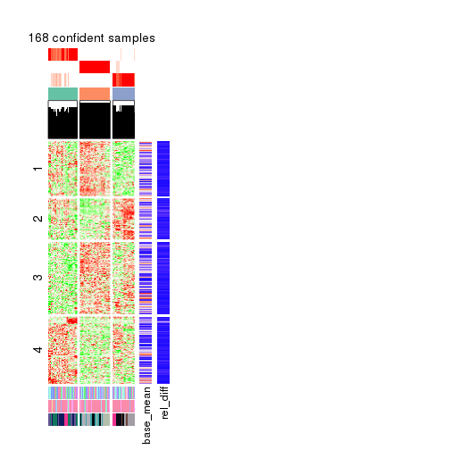</p>

</div>
<div id='tab-CV-skmeans-get-signatures-3'>
<pre><code class="r">get_signatures(res, k = 4)
</code></pre>

<p></p>

</div>
<div id='tab-CV-skmeans-get-signatures-4'>
<pre><code class="r">get_signatures(res, k = 5)
</code></pre>

<p></p>

</div>
<div id='tab-CV-skmeans-get-signatures-5'>
<pre><code class="r">get_signatures(res, k = 6)
</code></pre>

<p></p>

</div>
</div>


Signature heatmaps where rows are not scaled:


<script>
$( function() {
	$( '#tabs-CV-skmeans-get-signatures-no-scale' ).tabs();
} );
</script>
<div id='tabs-CV-skmeans-get-signatures-no-scale'>
<ul>
<li><a href='#tab-CV-skmeans-get-signatures-no-scale-1'>k = 2</a></li>
<li><a href='#tab-CV-skmeans-get-signatures-no-scale-2'>k = 3</a></li>
<li><a href='#tab-CV-skmeans-get-signatures-no-scale-3'>k = 4</a></li>
<li><a href='#tab-CV-skmeans-get-signatures-no-scale-4'>k = 5</a></li>
<li><a href='#tab-CV-skmeans-get-signatures-no-scale-5'>k = 6</a></li>
</ul>
<div id='tab-CV-skmeans-get-signatures-no-scale-1'>
<pre><code class="r">get_signatures(res, k = 2, scale_rows = FALSE)
</code></pre>

<p></p>

</div>
<div id='tab-CV-skmeans-get-signatures-no-scale-2'>
<pre><code class="r">get_signatures(res, k = 3, scale_rows = FALSE)
</code></pre>

<pre><code>#&gt; Error in mat[ceiling(1:nr/h_ratio), ceiling(1:nc/w_ratio), drop = FALSE]: subscript out of bounds
</code></pre>

<p></p>

</div>
<div id='tab-CV-skmeans-get-signatures-no-scale-3'>
<pre><code class="r">get_signatures(res, k = 4, scale_rows = FALSE)
</code></pre>

<p></p>

</div>
<div id='tab-CV-skmeans-get-signatures-no-scale-4'>
<pre><code class="r">get_signatures(res, k = 5, scale_rows = FALSE)
</code></pre>

<p></p>

</div>
<div id='tab-CV-skmeans-get-signatures-no-scale-5'>
<pre><code class="r">get_signatures(res, k = 6, scale_rows = FALSE)
</code></pre>

<p></p>

</div>
</div>


Compare the overlap of signatures from different k:

```r
compare_signatures(res)
```


`get_signature()` returns a data frame invisibly. TO get the list of signatures, the function
call should be assigned to a variable explicitly. In following code, if `plot` argument is set
to `FALSE`, no heatmap is plotted while only the differential analysis is performed.

```r
# code only for demonstration
tb = get_signature(res, k = ..., plot = FALSE)
```

An example of the output of `tb` is:

```
#>   which_row         fdr    mean_1    mean_2 scaled_mean_1 scaled_mean_2 km
#> 1        38 0.042760348  8.373488  9.131774    -0.5533452     0.5164555  1
#> 2        40 0.018707592  7.106213  8.469186    -0.6173731     0.5762149  1
#> 3        55 0.019134737 10.221463 11.207825    -0.6159697     0.5749050  1
#> 4        59 0.006059896  5.921854  7.869574    -0.6899429     0.6439467  1
#> 5        60 0.018055526  8.928898 10.211722    -0.6204761     0.5791110  1
#> 6        98 0.009384629 15.714769 14.887706     0.6635654    -0.6193277  2
...
```

The columns in `tb` are:

1. `which_row`: row indices corresponding to the input matrix.
2. `fdr`: FDR for the differential test. 
3. `mean_x`: The mean value in group x.
4. `scaled_mean_x`: The mean value in group x after rows are scaled.
5. `km`: Row groups if k-means clustering is applied to rows.


UMAP plot which shows how samples are separated.


<script>
$( function() {
	$( '#tabs-CV-skmeans-dimension-reduction' ).tabs();
} );
</script>
<div id='tabs-CV-skmeans-dimension-reduction'>
<ul>
<li><a href='#tab-CV-skmeans-dimension-reduction-1'>k = 2</a></li>
<li><a href='#tab-CV-skmeans-dimension-reduction-2'>k = 3</a></li>
<li><a href='#tab-CV-skmeans-dimension-reduction-3'>k = 4</a></li>
<li><a href='#tab-CV-skmeans-dimension-reduction-4'>k = 5</a></li>
<li><a href='#tab-CV-skmeans-dimension-reduction-5'>k = 6</a></li>
</ul>
<div id='tab-CV-skmeans-dimension-reduction-1'>
<pre><code class="r">dimension_reduction(res, k = 2, method = &quot;UMAP&quot;)
</code></pre>

<p></p>

</div>
<div id='tab-CV-skmeans-dimension-reduction-2'>
<pre><code class="r">dimension_reduction(res, k = 3, method = &quot;UMAP&quot;)
</code></pre>

<p></p>

</div>
<div id='tab-CV-skmeans-dimension-reduction-3'>
<pre><code class="r">dimension_reduction(res, k = 4, method = &quot;UMAP&quot;)
</code></pre>

<p></p>

</div>
<div id='tab-CV-skmeans-dimension-reduction-4'>
<pre><code class="r">dimension_reduction(res, k = 5, method = &quot;UMAP&quot;)
</code></pre>

<p></p>

</div>
<div id='tab-CV-skmeans-dimension-reduction-5'>
<pre><code class="r">dimension_reduction(res, k = 6, method = &quot;UMAP&quot;)
</code></pre>

<p></p>

</div>
</div>


Following heatmap shows how subgroups are split when increasing `k`:

```r
collect_classes(res)
```


Test correlation between subgroups and known annotations. If the known
annotation is numeric, one-way ANOVA test is applied, and if the known
annotation is discrete, chi-squared contingency table test is applied.

```r
test_to_known_factors(res)
```

```
#>              n agent(p) dose(p)  time(p) k
#> CV:skmeans 165  0.86112 0.99980 1.74e-27 2
#> CV:skmeans 168  0.43376 0.98472 2.35e-52 3
#> CV:skmeans 165  0.00153 0.00527 4.77e-53 4
#> CV:skmeans 166  0.01727 0.00715 2.85e-70 5
#> CV:skmeans 167  0.00243 0.00679 5.64e-88 6
```


If matrix rows can be associated to genes, consider to use `GO_Enrichment(res,
...)` to perform function enrichment for the signature genes.


 

---------------------------------------------------


### CV:pam*


The object with results only for a single top-value method and a single partition method 
can be extracted as:

```r
res = res_list["CV", "pam"]
# you can also extract it by
# res = res_list["CV:pam"]
```

A summary of `res` and all the functions that can be applied to it:

```r
res
```

```
#> A 'ConsensusPartition' object with k = 2, 3, 4, 5, 6.
#>   On a matrix with 21163 rows and 169 columns.
#>   Top rows (1000, 2000, 3000, 4000, 5000) are extracted by 'CV' method.
#>   Subgroups are detected by 'pam' method.
#>   Performed in total 1250 partitions by row resampling.
#>   Best k for subgroups seems to be 5.
#> 
#> Following methods can be applied to this 'ConsensusPartition' object:
#>  [1] "cola_report"             "collect_classes"         "collect_plots"          
#>  [4] "collect_stats"           "colnames"                "compare_signatures"     
#>  [7] "consensus_heatmap"       "dimension_reduction"     "functional_enrichment"  
#> [10] "get_anno_col"            "get_anno"                "get_classes"            
#> [13] "get_consensus"           "get_matrix"              "get_membership"         
#> [16] "get_param"               "get_signatures"          "get_stats"              
#> [19] "is_best_k"               "is_stable_k"             "membership_heatmap"     
#> [22] "ncol"                    "nrow"                    "plot_ecdf"              
#> [25] "rownames"                "select_partition_number" "show"                   
#> [28] "suggest_best_k"          "test_to_known_factors"
```

`collect_plots()` function collects all the plots made from `res` for all `k` (number of partitions)
into one single page to provide an easy and fast comparison between different `k`.

```r
collect_plots(res)
```


The plots are:

- The first row: a plot of the ECDF (Empirical cumulative distribution
  function) curves of the consensus matrix for each `k` and the heatmap of
  predicted classes for each `k`.
- The second row: heatmaps of the consensus matrix for each `k`.
- The third row: heatmaps of the membership matrix for each `k`.
- The fouth row: heatmaps of the signatures for each `k`.

All the plots in panels can be made by individual functions and they are
plotted later in this section.

`select_partition_number()` produces several plots showing different
statistics for choosing "optimized" `k`. There are following statistics:

- ECDF curves of the consensus matrix for each `k`;
- 1-PAC. [The PAC
  score](https://en.wikipedia.org/wiki/Consensus_clustering#Over-interpretation_potential_of_consensus_clustering)
  measures the proportion of the ambiguous subgrouping.
- Mean silhouette score.
- Concordance. The mean probability of fiting the consensus class ids in all
  partitions.
- Area increased. Denote $A_k$ as the area under the ECDF curve for current
  `k`, the area increased is defined as $A_k - A_{k-1}$.
- Rand index. The percent of pairs of samples that are both in a same cluster
  or both are not in a same cluster in the partition of k and k-1.
- Jaccard index. The ratio of pairs of samples are both in a same cluster in
  the partition of k and k-1 and the pairs of samples are both in a same
  cluster in the partition k or k-1.

The detailed explanations of these statistics can be found in [the cola
vignette](http://bioconductor.org/packages/devel/bioc/vignettes/cola/inst/doc/cola.html#toc_13).

Generally speaking, lower PAC score, higher mean silhouette score or higher
concordance corresponds to better partition. Rand index and Jaccard index
measure how similar the current partition is compared to partition with `k-1`.
If they are too similar, we won't accept `k` is better than `k-1`.

```r
select_partition_number(res)
```


The numeric values for all these statistics can be obtained by `get_stats()`.

```r
get_stats(res)
```

```
#>   k 1-PAC mean_silhouette concordance area_increased  Rand Jaccard
#> 2 2 0.998           0.961       0.983         0.5005 0.500   0.500
#> 3 3 1.000           0.965       0.986         0.2064 0.896   0.793
#> 4 4 0.937           0.921       0.965         0.1580 0.809   0.572
#> 5 5 0.918           0.899       0.955         0.0832 0.907   0.715
#> 6 6 0.832           0.767       0.865         0.0467 0.969   0.880
```

`suggest_best_k()` suggests the best $k$ based on these statistics. The rules are as follows:

- All $k$ with Jaccard index larger than 0.95 are removed because the increase of
  the partition number does not provides enough extra information. If all $k$ are removed,
  the best $k$ is assigned by `NA`.
- For $k$ with 1-PAC larger than 0.9, the maximal $k$ is taken as the "best k". Other $k$ is called "optional k".
- If it does not fit the second rule. The $k$ with the highest vote of highest
  1-PAC, mean silhouette and concordance is taken as the "best k".

```r
suggest_best_k(res)
```

```
#> [1] 5
#> attr(,"optional")
#> [1] 2 3 4
```

There is also optional best $k$ = 2 3 4 that is worth to check.

Following shows the table of the partitions (You need to click the **show/hide
code output** link to see it). The membership matrix (columns with name `p*`)
is inferred by
[`clue::cl_consensus()`](https://www.rdocumentation.org/link/cl_consensus?package=clue)
function with the `SE` method. Basically the value in the membership matrix
represents the probability to belong to a certain group. The finall class
label for an item is determined with the group with highest probability it
belongs to.

In `get_classes()` function, the entropy is calculated from the membership
matrix and the silhouette score is calculated from the consensus matrix.


<script>
$( function() {
	$( '#tabs-CV-pam-get-classes' ).tabs();
} );
</script>
<div id='tabs-CV-pam-get-classes'>
<ul>
<li><a href='#tab-CV-pam-get-classes-1'>k = 2</a></li>
<li><a href='#tab-CV-pam-get-classes-2'>k = 3</a></li>
<li><a href='#tab-CV-pam-get-classes-3'>k = 4</a></li>
<li><a href='#tab-CV-pam-get-classes-4'>k = 5</a></li>
<li><a href='#tab-CV-pam-get-classes-5'>k = 6</a></li>
</ul>

<div id='tab-CV-pam-get-classes-1'>
<p><a id='tab-CV-pam-get-classes-1-a' style='color:#0366d6' href='#'>show/hide code output</a></p>
<pre><code class="r">cbind(get_classes(res, k = 2), get_membership(res, k = 2))
</code></pre>

<pre><code>#&gt;           class entropy silhouette    p1    p2
#&gt; GSM528681     2  0.0000      0.983 0.000 1.000
#&gt; GSM528682     2  0.0000      0.983 0.000 1.000
#&gt; GSM528683     2  0.0000      0.983 0.000 1.000
#&gt; GSM528684     2  0.0000      0.983 0.000 1.000
#&gt; GSM528687     2  0.0000      0.983 0.000 1.000
#&gt; GSM528688     2  0.0000      0.983 0.000 1.000
#&gt; GSM528685     2  0.0000      0.983 0.000 1.000
#&gt; GSM528686     2  0.0000      0.983 0.000 1.000
#&gt; GSM528693     1  0.0000      0.981 1.000 0.000
#&gt; GSM528694     1  0.0000      0.981 1.000 0.000
#&gt; GSM528695     1  0.0000      0.981 1.000 0.000
#&gt; GSM528696     1  0.0000      0.981 1.000 0.000
#&gt; GSM528697     1  0.0000      0.981 1.000 0.000
#&gt; GSM528698     1  0.0000      0.981 1.000 0.000
#&gt; GSM528699     1  0.8267      0.657 0.740 0.260
#&gt; GSM528700     1  0.0000      0.981 1.000 0.000
#&gt; GSM528689     1  0.0000      0.981 1.000 0.000
#&gt; GSM528690     1  0.7528      0.726 0.784 0.216
#&gt; GSM528691     1  0.0000      0.981 1.000 0.000
#&gt; GSM528692     1  0.0000      0.981 1.000 0.000
#&gt; GSM528779     2  0.0000      0.983 0.000 1.000
#&gt; GSM528780     2  0.0000      0.983 0.000 1.000
#&gt; GSM528782     2  0.0000      0.983 0.000 1.000
#&gt; GSM528781     2  0.0000      0.983 0.000 1.000
#&gt; GSM528785     1  0.7219      0.752 0.800 0.200
#&gt; GSM528786     1  0.0000      0.981 1.000 0.000
#&gt; GSM528787     1  0.0000      0.981 1.000 0.000
#&gt; GSM528788     2  0.3274      0.931 0.060 0.940
#&gt; GSM528783     1  0.0000      0.981 1.000 0.000
#&gt; GSM528784     1  0.0000      0.981 1.000 0.000
#&gt; GSM528759     1  0.0000      0.981 1.000 0.000
#&gt; GSM528760     1  0.0000      0.981 1.000 0.000
#&gt; GSM528761     2  0.0000      0.983 0.000 1.000
#&gt; GSM528762     2  0.0000      0.983 0.000 1.000
#&gt; GSM528765     2  0.0000      0.983 0.000 1.000
#&gt; GSM528766     2  0.0000      0.983 0.000 1.000
#&gt; GSM528763     2  0.0000      0.983 0.000 1.000
#&gt; GSM528764     2  0.0000      0.983 0.000 1.000
#&gt; GSM528771     1  0.0000      0.981 1.000 0.000
#&gt; GSM528772     1  0.0000      0.981 1.000 0.000
#&gt; GSM528773     1  0.0000      0.981 1.000 0.000
#&gt; GSM528774     1  0.0000      0.981 1.000 0.000
#&gt; GSM528775     1  0.0000      0.981 1.000 0.000
#&gt; GSM528776     1  0.0000      0.981 1.000 0.000
#&gt; GSM528777     2  0.3431      0.927 0.064 0.936
#&gt; GSM528778     2  0.8713      0.594 0.292 0.708
#&gt; GSM528767     1  0.0000      0.981 1.000 0.000
#&gt; GSM528768     1  0.0000      0.981 1.000 0.000
#&gt; GSM528769     1  0.0000      0.981 1.000 0.000
#&gt; GSM528770     1  0.0000      0.981 1.000 0.000
#&gt; GSM528671     2  0.0000      0.983 0.000 1.000
#&gt; GSM528672     2  0.0000      0.983 0.000 1.000
#&gt; GSM528674     2  0.0000      0.983 0.000 1.000
#&gt; GSM528673     2  0.0000      0.983 0.000 1.000
#&gt; GSM528677     1  0.0000      0.981 1.000 0.000
#&gt; GSM528678     1  0.0000      0.981 1.000 0.000
#&gt; GSM528679     1  0.0000      0.981 1.000 0.000
#&gt; GSM528680     1  0.0000      0.981 1.000 0.000
#&gt; GSM528675     1  0.0000      0.981 1.000 0.000
#&gt; GSM528676     1  0.0000      0.981 1.000 0.000
#&gt; GSM528651     2  0.0000      0.983 0.000 1.000
#&gt; GSM528652     2  0.0000      0.983 0.000 1.000
#&gt; GSM528653     2  0.0000      0.983 0.000 1.000
#&gt; GSM528654     2  0.0000      0.983 0.000 1.000
#&gt; GSM528657     2  0.0000      0.983 0.000 1.000
#&gt; GSM528658     2  0.0000      0.983 0.000 1.000
#&gt; GSM528655     2  0.0000      0.983 0.000 1.000
#&gt; GSM528656     2  0.0000      0.983 0.000 1.000
#&gt; GSM528663     1  0.3274      0.925 0.940 0.060
#&gt; GSM528664     2  0.0376      0.981 0.004 0.996
#&gt; GSM528665     1  0.0000      0.981 1.000 0.000
#&gt; GSM528666     1  0.0000      0.981 1.000 0.000
#&gt; GSM528667     1  0.0000      0.981 1.000 0.000
#&gt; GSM528668     1  0.0000      0.981 1.000 0.000
#&gt; GSM528669     2  0.3431      0.927 0.064 0.936
#&gt; GSM528670     1  0.0672      0.974 0.992 0.008
#&gt; GSM528659     1  0.4562      0.886 0.904 0.096
#&gt; GSM528660     1  0.0000      0.981 1.000 0.000
#&gt; GSM528661     1  0.0000      0.981 1.000 0.000
#&gt; GSM528662     1  0.0000      0.981 1.000 0.000
#&gt; GSM528701     2  0.0000      0.983 0.000 1.000
#&gt; GSM528702     2  0.0000      0.983 0.000 1.000
#&gt; GSM528703     2  0.0000      0.983 0.000 1.000
#&gt; GSM528704     2  0.0000      0.983 0.000 1.000
#&gt; GSM528707     2  0.0000      0.983 0.000 1.000
#&gt; GSM528708     2  0.0000      0.983 0.000 1.000
#&gt; GSM528705     2  0.0000      0.983 0.000 1.000
#&gt; GSM528706     2  0.0000      0.983 0.000 1.000
#&gt; GSM528713     1  0.0000      0.981 1.000 0.000
#&gt; GSM528714     1  0.0000      0.981 1.000 0.000
#&gt; GSM528715     1  0.0000      0.981 1.000 0.000
#&gt; GSM528716     1  0.0000      0.981 1.000 0.000
#&gt; GSM528717     1  0.0000      0.981 1.000 0.000
#&gt; GSM528718     1  0.0000      0.981 1.000 0.000
#&gt; GSM528719     1  0.0000      0.981 1.000 0.000
#&gt; GSM528720     1  0.0000      0.981 1.000 0.000
#&gt; GSM528709     1  0.0000      0.981 1.000 0.000
#&gt; GSM528710     1  0.0376      0.978 0.996 0.004
#&gt; GSM528711     1  0.0000      0.981 1.000 0.000
#&gt; GSM528712     1  0.0000      0.981 1.000 0.000
#&gt; GSM528721     2  0.0000      0.983 0.000 1.000
#&gt; GSM528722     2  0.0000      0.983 0.000 1.000
#&gt; GSM528723     2  0.0000      0.983 0.000 1.000
#&gt; GSM528724     2  0.0000      0.983 0.000 1.000
#&gt; GSM528727     2  0.0000      0.983 0.000 1.000
#&gt; GSM528728     2  0.0000      0.983 0.000 1.000
#&gt; GSM528725     2  0.0000      0.983 0.000 1.000
#&gt; GSM528726     2  0.0000      0.983 0.000 1.000
#&gt; GSM528733     1  0.0000      0.981 1.000 0.000
#&gt; GSM528734     1  0.0000      0.981 1.000 0.000
#&gt; GSM528735     1  0.0000      0.981 1.000 0.000
#&gt; GSM528736     1  0.0000      0.981 1.000 0.000
#&gt; GSM528737     1  0.0000      0.981 1.000 0.000
#&gt; GSM528738     1  0.0000      0.981 1.000 0.000
#&gt; GSM528729     2  0.3431      0.927 0.064 0.936
#&gt; GSM528730     2  0.7815      0.707 0.232 0.768
#&gt; GSM528731     1  0.7219      0.752 0.800 0.200
#&gt; GSM528732     1  0.0000      0.981 1.000 0.000
#&gt; GSM528739     2  0.0000      0.983 0.000 1.000
#&gt; GSM528740     2  0.0000      0.983 0.000 1.000
#&gt; GSM528741     2  0.0000      0.983 0.000 1.000
#&gt; GSM528742     2  0.0000      0.983 0.000 1.000
#&gt; GSM528745     2  0.0000      0.983 0.000 1.000
#&gt; GSM528746     2  0.0000      0.983 0.000 1.000
#&gt; GSM528743     2  0.0000      0.983 0.000 1.000
#&gt; GSM528744     2  0.0000      0.983 0.000 1.000
#&gt; GSM528751     1  0.0000      0.981 1.000 0.000
#&gt; GSM528752     1  0.0000      0.981 1.000 0.000
#&gt; GSM528753     1  0.0000      0.981 1.000 0.000
#&gt; GSM528754     1  0.0000      0.981 1.000 0.000
#&gt; GSM528755     1  0.0000      0.981 1.000 0.000
#&gt; GSM528756     1  0.0000      0.981 1.000 0.000
#&gt; GSM528757     2  0.0000      0.983 0.000 1.000
#&gt; GSM528758     2  0.0000      0.983 0.000 1.000
#&gt; GSM528747     1  0.7299      0.752 0.796 0.204
#&gt; GSM528748     2  0.0376      0.981 0.004 0.996
#&gt; GSM528749     1  0.0000      0.981 1.000 0.000
#&gt; GSM528750     1  0.0000      0.981 1.000 0.000
#&gt; GSM528640     2  0.0000      0.983 0.000 1.000
#&gt; GSM528641     2  0.0000      0.983 0.000 1.000
#&gt; GSM528643     1  0.0000      0.981 1.000 0.000
#&gt; GSM528644     2  0.0376      0.981 0.004 0.996
#&gt; GSM528642     1  0.0000      0.981 1.000 0.000
#&gt; GSM528620     2  0.0000      0.983 0.000 1.000
#&gt; GSM528621     2  0.3879      0.913 0.076 0.924
#&gt; GSM528623     1  0.0000      0.981 1.000 0.000
#&gt; GSM528624     2  0.3431      0.927 0.064 0.936
#&gt; GSM528622     1  0.0000      0.981 1.000 0.000
#&gt; GSM528625     2  0.0000      0.983 0.000 1.000
#&gt; GSM528626     2  0.0000      0.983 0.000 1.000
#&gt; GSM528628     1  0.0000      0.981 1.000 0.000
#&gt; GSM528629     1  0.9710      0.350 0.600 0.400
#&gt; GSM528627     1  0.0000      0.981 1.000 0.000
#&gt; GSM528630     2  0.0000      0.983 0.000 1.000
#&gt; GSM528631     2  0.0000      0.983 0.000 1.000
#&gt; GSM528632     2  0.0376      0.981 0.004 0.996
#&gt; GSM528633     2  0.0376      0.981 0.004 0.996
#&gt; GSM528636     1  0.0000      0.981 1.000 0.000
#&gt; GSM528637     1  0.0000      0.981 1.000 0.000
#&gt; GSM528638     2  0.0672      0.977 0.008 0.992
#&gt; GSM528639     2  0.8955      0.544 0.312 0.688
#&gt; GSM528634     1  0.0000      0.981 1.000 0.000
#&gt; GSM528635     1  0.0000      0.981 1.000 0.000
#&gt; GSM528645     1  0.0000      0.981 1.000 0.000
#&gt; GSM528646     1  0.0000      0.981 1.000 0.000
#&gt; GSM528647     1  0.0000      0.981 1.000 0.000
#&gt; GSM528648     1  0.0000      0.981 1.000 0.000
#&gt; GSM528649     1  0.0000      0.981 1.000 0.000
#&gt; GSM528650     1  0.0000      0.981 1.000 0.000
</code></pre>

<script>
$('#tab-CV-pam-get-classes-1-a').parent().next().next().hide();
$('#tab-CV-pam-get-classes-1-a').click(function(){
  $('#tab-CV-pam-get-classes-1-a').parent().next().next().toggle();
  return(false);
});
</script>
</div>

<div id='tab-CV-pam-get-classes-2'>
<p><a id='tab-CV-pam-get-classes-2-a' style='color:#0366d6' href='#'>show/hide code output</a></p>
<pre><code class="r">cbind(get_classes(res, k = 3), get_membership(res, k = 3))
</code></pre>

<pre><code>#&gt;           class entropy silhouette    p1    p2    p3
#&gt; GSM528681     2  0.0000      0.982 0.000 1.000 0.000
#&gt; GSM528682     2  0.0000      0.982 0.000 1.000 0.000
#&gt; GSM528683     2  0.0000      0.982 0.000 1.000 0.000
#&gt; GSM528684     2  0.0000      0.982 0.000 1.000 0.000
#&gt; GSM528687     2  0.0000      0.982 0.000 1.000 0.000
#&gt; GSM528688     2  0.0000      0.982 0.000 1.000 0.000
#&gt; GSM528685     2  0.0000      0.982 0.000 1.000 0.000
#&gt; GSM528686     2  0.0000      0.982 0.000 1.000 0.000
#&gt; GSM528693     3  0.0000      0.981 0.000 0.000 1.000
#&gt; GSM528694     3  0.0000      0.981 0.000 0.000 1.000
#&gt; GSM528695     3  0.0000      0.981 0.000 0.000 1.000
#&gt; GSM528696     3  0.0000      0.981 0.000 0.000 1.000
#&gt; GSM528697     1  0.0237      0.990 0.996 0.000 0.004
#&gt; GSM528698     1  0.0000      0.994 1.000 0.000 0.000
#&gt; GSM528699     1  0.0000      0.994 1.000 0.000 0.000
#&gt; GSM528700     1  0.0000      0.994 1.000 0.000 0.000
#&gt; GSM528689     1  0.0000      0.994 1.000 0.000 0.000
#&gt; GSM528690     1  0.0000      0.994 1.000 0.000 0.000
#&gt; GSM528691     1  0.0000      0.994 1.000 0.000 0.000
#&gt; GSM528692     1  0.0000      0.994 1.000 0.000 0.000
#&gt; GSM528779     2  0.0000      0.982 0.000 1.000 0.000
#&gt; GSM528780     2  0.0000      0.982 0.000 1.000 0.000
#&gt; GSM528782     2  0.0000      0.982 0.000 1.000 0.000
#&gt; GSM528781     2  0.0000      0.982 0.000 1.000 0.000
#&gt; GSM528785     3  0.4555      0.718 0.000 0.200 0.800
#&gt; GSM528786     3  0.0000      0.981 0.000 0.000 1.000
#&gt; GSM528787     3  0.0000      0.981 0.000 0.000 1.000
#&gt; GSM528788     2  0.1289      0.952 0.000 0.968 0.032
#&gt; GSM528783     3  0.0000      0.981 0.000 0.000 1.000
#&gt; GSM528784     3  0.0000      0.981 0.000 0.000 1.000
#&gt; GSM528759     3  0.0000      0.981 0.000 0.000 1.000
#&gt; GSM528760     3  0.0000      0.981 0.000 0.000 1.000
#&gt; GSM528761     2  0.0000      0.982 0.000 1.000 0.000
#&gt; GSM528762     2  0.0000      0.982 0.000 1.000 0.000
#&gt; GSM528765     2  0.0000      0.982 0.000 1.000 0.000
#&gt; GSM528766     2  0.0000      0.982 0.000 1.000 0.000
#&gt; GSM528763     2  0.0000      0.982 0.000 1.000 0.000
#&gt; GSM528764     2  0.0000      0.982 0.000 1.000 0.000
#&gt; GSM528771     3  0.0000      0.981 0.000 0.000 1.000
#&gt; GSM528772     3  0.0000      0.981 0.000 0.000 1.000
#&gt; GSM528773     3  0.0000      0.981 0.000 0.000 1.000
#&gt; GSM528774     3  0.0000      0.981 0.000 0.000 1.000
#&gt; GSM528775     3  0.0000      0.981 0.000 0.000 1.000
#&gt; GSM528776     3  0.0000      0.981 0.000 0.000 1.000
#&gt; GSM528777     2  0.2569      0.927 0.032 0.936 0.032
#&gt; GSM528778     2  0.6522      0.578 0.032 0.696 0.272
#&gt; GSM528767     3  0.1031      0.959 0.024 0.000 0.976
#&gt; GSM528768     3  0.0000      0.981 0.000 0.000 1.000
#&gt; GSM528769     3  0.0000      0.981 0.000 0.000 1.000
#&gt; GSM528770     3  0.0000      0.981 0.000 0.000 1.000
#&gt; GSM528671     2  0.0000      0.982 0.000 1.000 0.000
#&gt; GSM528672     2  0.0000      0.982 0.000 1.000 0.000
#&gt; GSM528674     2  0.0000      0.982 0.000 1.000 0.000
#&gt; GSM528673     2  0.0000      0.982 0.000 1.000 0.000
#&gt; GSM528677     3  0.0000      0.981 0.000 0.000 1.000
#&gt; GSM528678     3  0.0000      0.981 0.000 0.000 1.000
#&gt; GSM528679     3  0.0000      0.981 0.000 0.000 1.000
#&gt; GSM528680     1  0.3340      0.865 0.880 0.000 0.120
#&gt; GSM528675     1  0.0000      0.994 1.000 0.000 0.000
#&gt; GSM528676     1  0.0000      0.994 1.000 0.000 0.000
#&gt; GSM528651     2  0.0000      0.982 0.000 1.000 0.000
#&gt; GSM528652     2  0.0000      0.982 0.000 1.000 0.000
#&gt; GSM528653     2  0.0000      0.982 0.000 1.000 0.000
#&gt; GSM528654     2  0.0000      0.982 0.000 1.000 0.000
#&gt; GSM528657     2  0.0000      0.982 0.000 1.000 0.000
#&gt; GSM528658     2  0.0000      0.982 0.000 1.000 0.000
#&gt; GSM528655     2  0.0000      0.982 0.000 1.000 0.000
#&gt; GSM528656     2  0.0000      0.982 0.000 1.000 0.000
#&gt; GSM528663     3  0.1163      0.949 0.000 0.028 0.972
#&gt; GSM528664     2  0.0237      0.979 0.000 0.996 0.004
#&gt; GSM528665     3  0.0000      0.981 0.000 0.000 1.000
#&gt; GSM528666     3  0.0000      0.981 0.000 0.000 1.000
#&gt; GSM528667     3  0.0000      0.981 0.000 0.000 1.000
#&gt; GSM528668     3  0.0000      0.981 0.000 0.000 1.000
#&gt; GSM528669     2  0.2569      0.927 0.032 0.936 0.032
#&gt; GSM528670     3  0.1711      0.945 0.032 0.008 0.960
#&gt; GSM528659     1  0.0000      0.994 1.000 0.000 0.000
#&gt; GSM528660     1  0.0000      0.994 1.000 0.000 0.000
#&gt; GSM528661     1  0.0000      0.994 1.000 0.000 0.000
#&gt; GSM528662     1  0.0000      0.994 1.000 0.000 0.000
#&gt; GSM528701     2  0.0000      0.982 0.000 1.000 0.000
#&gt; GSM528702     2  0.0000      0.982 0.000 1.000 0.000
#&gt; GSM528703     2  0.0000      0.982 0.000 1.000 0.000
#&gt; GSM528704     2  0.0000      0.982 0.000 1.000 0.000
#&gt; GSM528707     2  0.0000      0.982 0.000 1.000 0.000
#&gt; GSM528708     2  0.0000      0.982 0.000 1.000 0.000
#&gt; GSM528705     2  0.0000      0.982 0.000 1.000 0.000
#&gt; GSM528706     2  0.0000      0.982 0.000 1.000 0.000
#&gt; GSM528713     3  0.0000      0.981 0.000 0.000 1.000
#&gt; GSM528714     3  0.0000      0.981 0.000 0.000 1.000
#&gt; GSM528715     3  0.0000      0.981 0.000 0.000 1.000
#&gt; GSM528716     3  0.0000      0.981 0.000 0.000 1.000
#&gt; GSM528717     3  0.0000      0.981 0.000 0.000 1.000
#&gt; GSM528718     3  0.0000      0.981 0.000 0.000 1.000
#&gt; GSM528719     1  0.0000      0.994 1.000 0.000 0.000
#&gt; GSM528720     1  0.0000      0.994 1.000 0.000 0.000
#&gt; GSM528709     1  0.0000      0.994 1.000 0.000 0.000
#&gt; GSM528710     1  0.0000      0.994 1.000 0.000 0.000
#&gt; GSM528711     1  0.0000      0.994 1.000 0.000 0.000
#&gt; GSM528712     1  0.0000      0.994 1.000 0.000 0.000
#&gt; GSM528721     2  0.0000      0.982 0.000 1.000 0.000
#&gt; GSM528722     2  0.0000      0.982 0.000 1.000 0.000
#&gt; GSM528723     2  0.0000      0.982 0.000 1.000 0.000
#&gt; GSM528724     2  0.0000      0.982 0.000 1.000 0.000
#&gt; GSM528727     2  0.0000      0.982 0.000 1.000 0.000
#&gt; GSM528728     2  0.0000      0.982 0.000 1.000 0.000
#&gt; GSM528725     2  0.0000      0.982 0.000 1.000 0.000
#&gt; GSM528726     2  0.0000      0.982 0.000 1.000 0.000
#&gt; GSM528733     3  0.0000      0.981 0.000 0.000 1.000
#&gt; GSM528734     3  0.0000      0.981 0.000 0.000 1.000
#&gt; GSM528735     3  0.0000      0.981 0.000 0.000 1.000
#&gt; GSM528736     3  0.0000      0.981 0.000 0.000 1.000
#&gt; GSM528737     3  0.0000      0.981 0.000 0.000 1.000
#&gt; GSM528738     3  0.0000      0.981 0.000 0.000 1.000
#&gt; GSM528729     2  0.1289      0.952 0.000 0.968 0.032
#&gt; GSM528730     2  0.4654      0.720 0.000 0.792 0.208
#&gt; GSM528731     3  0.4605      0.712 0.000 0.204 0.796
#&gt; GSM528732     3  0.0000      0.981 0.000 0.000 1.000
#&gt; GSM528739     2  0.0000      0.982 0.000 1.000 0.000
#&gt; GSM528740     2  0.0000      0.982 0.000 1.000 0.000
#&gt; GSM528741     2  0.0000      0.982 0.000 1.000 0.000
#&gt; GSM528742     2  0.0000      0.982 0.000 1.000 0.000
#&gt; GSM528745     2  0.0000      0.982 0.000 1.000 0.000
#&gt; GSM528746     2  0.0000      0.982 0.000 1.000 0.000
#&gt; GSM528743     2  0.0000      0.982 0.000 1.000 0.000
#&gt; GSM528744     2  0.0000      0.982 0.000 1.000 0.000
#&gt; GSM528751     3  0.0000      0.981 0.000 0.000 1.000
#&gt; GSM528752     3  0.0000      0.981 0.000 0.000 1.000
#&gt; GSM528753     3  0.0000      0.981 0.000 0.000 1.000
#&gt; GSM528754     3  0.0000      0.981 0.000 0.000 1.000
#&gt; GSM528755     3  0.0000      0.981 0.000 0.000 1.000
#&gt; GSM528756     3  0.0000      0.981 0.000 0.000 1.000
#&gt; GSM528757     2  0.0000      0.982 0.000 1.000 0.000
#&gt; GSM528758     2  0.0000      0.982 0.000 1.000 0.000
#&gt; GSM528747     3  0.4178      0.763 0.000 0.172 0.828
#&gt; GSM528748     2  0.0237      0.979 0.000 0.996 0.004
#&gt; GSM528749     3  0.0000      0.981 0.000 0.000 1.000
#&gt; GSM528750     3  0.0000      0.981 0.000 0.000 1.000
#&gt; GSM528640     2  0.0000      0.982 0.000 1.000 0.000
#&gt; GSM528641     2  0.0000      0.982 0.000 1.000 0.000
#&gt; GSM528643     3  0.0000      0.981 0.000 0.000 1.000
#&gt; GSM528644     2  0.0237      0.979 0.000 0.996 0.004
#&gt; GSM528642     3  0.0000      0.981 0.000 0.000 1.000
#&gt; GSM528620     2  0.0000      0.982 0.000 1.000 0.000
#&gt; GSM528621     2  0.2448      0.899 0.000 0.924 0.076
#&gt; GSM528623     3  0.0000      0.981 0.000 0.000 1.000
#&gt; GSM528624     2  0.1289      0.952 0.000 0.968 0.032
#&gt; GSM528622     3  0.0000      0.981 0.000 0.000 1.000
#&gt; GSM528625     2  0.0000      0.982 0.000 1.000 0.000
#&gt; GSM528626     2  0.0000      0.982 0.000 1.000 0.000
#&gt; GSM528628     3  0.0000      0.981 0.000 0.000 1.000
#&gt; GSM528629     3  0.6079      0.376 0.000 0.388 0.612
#&gt; GSM528627     3  0.0000      0.981 0.000 0.000 1.000
#&gt; GSM528630     2  0.0000      0.982 0.000 1.000 0.000
#&gt; GSM528631     2  0.0000      0.982 0.000 1.000 0.000
#&gt; GSM528632     2  0.0237      0.979 0.000 0.996 0.004
#&gt; GSM528633     2  0.0237      0.979 0.000 0.996 0.004
#&gt; GSM528636     3  0.0000      0.981 0.000 0.000 1.000
#&gt; GSM528637     3  0.0000      0.981 0.000 0.000 1.000
#&gt; GSM528638     2  0.0424      0.976 0.000 0.992 0.008
#&gt; GSM528639     2  0.5845      0.546 0.004 0.688 0.308
#&gt; GSM528634     3  0.0000      0.981 0.000 0.000 1.000
#&gt; GSM528635     3  0.0000      0.981 0.000 0.000 1.000
#&gt; GSM528645     3  0.0000      0.981 0.000 0.000 1.000
#&gt; GSM528646     3  0.0000      0.981 0.000 0.000 1.000
#&gt; GSM528647     3  0.0000      0.981 0.000 0.000 1.000
#&gt; GSM528648     3  0.0000      0.981 0.000 0.000 1.000
#&gt; GSM528649     3  0.0000      0.981 0.000 0.000 1.000
#&gt; GSM528650     3  0.0000      0.981 0.000 0.000 1.000
</code></pre>

<script>
$('#tab-CV-pam-get-classes-2-a').parent().next().next().hide();
$('#tab-CV-pam-get-classes-2-a').click(function(){
  $('#tab-CV-pam-get-classes-2-a').parent().next().next().toggle();
  return(false);
});
</script>
</div>

<div id='tab-CV-pam-get-classes-3'>
<p><a id='tab-CV-pam-get-classes-3-a' style='color:#0366d6' href='#'>show/hide code output</a></p>
<pre><code class="r">cbind(get_classes(res, k = 4), get_membership(res, k = 4))
</code></pre>

<pre><code>#&gt;           class entropy silhouette    p1    p2    p3    p4
#&gt; GSM528681     2  0.0000      0.978 0.000 1.000 0.000 0.000
#&gt; GSM528682     2  0.0000      0.978 0.000 1.000 0.000 0.000
#&gt; GSM528683     2  0.0000      0.978 0.000 1.000 0.000 0.000
#&gt; GSM528684     2  0.0000      0.978 0.000 1.000 0.000 0.000
#&gt; GSM528687     2  0.0000      0.978 0.000 1.000 0.000 0.000
#&gt; GSM528688     2  0.0000      0.978 0.000 1.000 0.000 0.000
#&gt; GSM528685     2  0.0000      0.978 0.000 1.000 0.000 0.000
#&gt; GSM528686     2  0.0188      0.974 0.004 0.996 0.000 0.000
#&gt; GSM528693     1  0.0336      0.908 0.992 0.000 0.008 0.000
#&gt; GSM528694     1  0.4134      0.682 0.740 0.000 0.260 0.000
#&gt; GSM528695     3  0.0000      0.997 0.000 0.000 1.000 0.000
#&gt; GSM528696     3  0.0000      0.997 0.000 0.000 1.000 0.000
#&gt; GSM528697     1  0.3688      0.733 0.792 0.000 0.000 0.208
#&gt; GSM528698     4  0.0336      0.981 0.008 0.000 0.000 0.992
#&gt; GSM528699     4  0.0000      0.990 0.000 0.000 0.000 1.000
#&gt; GSM528700     4  0.0000      0.990 0.000 0.000 0.000 1.000
#&gt; GSM528689     4  0.0000      0.990 0.000 0.000 0.000 1.000
#&gt; GSM528690     4  0.0000      0.990 0.000 0.000 0.000 1.000
#&gt; GSM528691     4  0.0000      0.990 0.000 0.000 0.000 1.000
#&gt; GSM528692     4  0.0000      0.990 0.000 0.000 0.000 1.000
#&gt; GSM528779     2  0.0000      0.978 0.000 1.000 0.000 0.000
#&gt; GSM528780     2  0.0000      0.978 0.000 1.000 0.000 0.000
#&gt; GSM528782     2  0.0000      0.978 0.000 1.000 0.000 0.000
#&gt; GSM528781     2  0.0000      0.978 0.000 1.000 0.000 0.000
#&gt; GSM528785     1  0.1474      0.872 0.948 0.052 0.000 0.000
#&gt; GSM528786     3  0.0000      0.997 0.000 0.000 1.000 0.000
#&gt; GSM528787     1  0.4624      0.556 0.660 0.000 0.340 0.000
#&gt; GSM528788     1  0.0000      0.912 1.000 0.000 0.000 0.000
#&gt; GSM528783     2  0.4994      0.101 0.480 0.520 0.000 0.000
#&gt; GSM528784     1  0.0336      0.907 0.992 0.000 0.000 0.008
#&gt; GSM528759     1  0.4103      0.687 0.744 0.000 0.256 0.000
#&gt; GSM528760     3  0.1022      0.958 0.032 0.000 0.968 0.000
#&gt; GSM528761     2  0.0000      0.978 0.000 1.000 0.000 0.000
#&gt; GSM528762     2  0.0000      0.978 0.000 1.000 0.000 0.000
#&gt; GSM528765     2  0.0000      0.978 0.000 1.000 0.000 0.000
#&gt; GSM528766     2  0.0000      0.978 0.000 1.000 0.000 0.000
#&gt; GSM528763     2  0.0000      0.978 0.000 1.000 0.000 0.000
#&gt; GSM528764     2  0.0000      0.978 0.000 1.000 0.000 0.000
#&gt; GSM528771     1  0.1389      0.875 0.952 0.048 0.000 0.000
#&gt; GSM528772     1  0.2408      0.820 0.896 0.104 0.000 0.000
#&gt; GSM528773     3  0.0000      0.997 0.000 0.000 1.000 0.000
#&gt; GSM528774     3  0.0000      0.997 0.000 0.000 1.000 0.000
#&gt; GSM528775     1  0.4331      0.642 0.712 0.000 0.288 0.000
#&gt; GSM528776     1  0.0000      0.912 1.000 0.000 0.000 0.000
#&gt; GSM528777     1  0.0000      0.912 1.000 0.000 0.000 0.000
#&gt; GSM528778     1  0.0000      0.912 1.000 0.000 0.000 0.000
#&gt; GSM528767     1  0.4564      0.492 0.672 0.000 0.000 0.328
#&gt; GSM528768     1  0.4776      0.380 0.624 0.000 0.000 0.376
#&gt; GSM528769     1  0.0000      0.912 1.000 0.000 0.000 0.000
#&gt; GSM528770     1  0.0000      0.912 1.000 0.000 0.000 0.000
#&gt; GSM528671     2  0.0000      0.978 0.000 1.000 0.000 0.000
#&gt; GSM528672     2  0.0000      0.978 0.000 1.000 0.000 0.000
#&gt; GSM528674     2  0.0000      0.978 0.000 1.000 0.000 0.000
#&gt; GSM528673     2  0.0000      0.978 0.000 1.000 0.000 0.000
#&gt; GSM528677     2  0.3764      0.713 0.216 0.784 0.000 0.000
#&gt; GSM528678     3  0.0000      0.997 0.000 0.000 1.000 0.000
#&gt; GSM528679     1  0.0000      0.912 1.000 0.000 0.000 0.000
#&gt; GSM528680     4  0.3024      0.812 0.148 0.000 0.000 0.852
#&gt; GSM528675     4  0.0000      0.990 0.000 0.000 0.000 1.000
#&gt; GSM528676     4  0.0000      0.990 0.000 0.000 0.000 1.000
#&gt; GSM528651     2  0.0000      0.978 0.000 1.000 0.000 0.000
#&gt; GSM528652     2  0.0000      0.978 0.000 1.000 0.000 0.000
#&gt; GSM528653     2  0.0000      0.978 0.000 1.000 0.000 0.000
#&gt; GSM528654     2  0.0000      0.978 0.000 1.000 0.000 0.000
#&gt; GSM528657     2  0.0000      0.978 0.000 1.000 0.000 0.000
#&gt; GSM528658     2  0.0000      0.978 0.000 1.000 0.000 0.000
#&gt; GSM528655     2  0.0000      0.978 0.000 1.000 0.000 0.000
#&gt; GSM528656     2  0.0000      0.978 0.000 1.000 0.000 0.000
#&gt; GSM528663     2  0.0707      0.957 0.020 0.980 0.000 0.000
#&gt; GSM528664     2  0.0000      0.978 0.000 1.000 0.000 0.000
#&gt; GSM528665     3  0.0000      0.997 0.000 0.000 1.000 0.000
#&gt; GSM528666     3  0.0000      0.997 0.000 0.000 1.000 0.000
#&gt; GSM528667     1  0.0000      0.912 1.000 0.000 0.000 0.000
#&gt; GSM528668     1  0.0000      0.912 1.000 0.000 0.000 0.000
#&gt; GSM528669     1  0.0000      0.912 1.000 0.000 0.000 0.000
#&gt; GSM528670     1  0.0000      0.912 1.000 0.000 0.000 0.000
#&gt; GSM528659     4  0.0000      0.990 0.000 0.000 0.000 1.000
#&gt; GSM528660     4  0.0000      0.990 0.000 0.000 0.000 1.000
#&gt; GSM528661     4  0.0000      0.990 0.000 0.000 0.000 1.000
#&gt; GSM528662     4  0.0000      0.990 0.000 0.000 0.000 1.000
#&gt; GSM528701     2  0.0000      0.978 0.000 1.000 0.000 0.000
#&gt; GSM528702     2  0.0000      0.978 0.000 1.000 0.000 0.000
#&gt; GSM528703     2  0.0000      0.978 0.000 1.000 0.000 0.000
#&gt; GSM528704     2  0.0000      0.978 0.000 1.000 0.000 0.000
#&gt; GSM528707     2  0.0000      0.978 0.000 1.000 0.000 0.000
#&gt; GSM528708     2  0.0000      0.978 0.000 1.000 0.000 0.000
#&gt; GSM528705     2  0.0000      0.978 0.000 1.000 0.000 0.000
#&gt; GSM528706     2  0.0000      0.978 0.000 1.000 0.000 0.000
#&gt; GSM528713     1  0.0000      0.912 1.000 0.000 0.000 0.000
#&gt; GSM528714     1  0.7344      0.387 0.528 0.248 0.224 0.000
#&gt; GSM528715     3  0.0000      0.997 0.000 0.000 1.000 0.000
#&gt; GSM528716     3  0.0000      0.997 0.000 0.000 1.000 0.000
#&gt; GSM528717     1  0.0000      0.912 1.000 0.000 0.000 0.000
#&gt; GSM528718     1  0.4103      0.687 0.744 0.000 0.256 0.000
#&gt; GSM528719     4  0.0000      0.990 0.000 0.000 0.000 1.000
#&gt; GSM528720     4  0.0000      0.990 0.000 0.000 0.000 1.000
#&gt; GSM528709     4  0.0000      0.990 0.000 0.000 0.000 1.000
#&gt; GSM528710     4  0.0000      0.990 0.000 0.000 0.000 1.000
#&gt; GSM528711     4  0.0000      0.990 0.000 0.000 0.000 1.000
#&gt; GSM528712     4  0.0000      0.990 0.000 0.000 0.000 1.000
#&gt; GSM528721     2  0.0000      0.978 0.000 1.000 0.000 0.000
#&gt; GSM528722     2  0.0000      0.978 0.000 1.000 0.000 0.000
#&gt; GSM528723     2  0.0000      0.978 0.000 1.000 0.000 0.000
#&gt; GSM528724     2  0.0000      0.978 0.000 1.000 0.000 0.000
#&gt; GSM528727     2  0.0000      0.978 0.000 1.000 0.000 0.000
#&gt; GSM528728     2  0.0000      0.978 0.000 1.000 0.000 0.000
#&gt; GSM528725     2  0.0000      0.978 0.000 1.000 0.000 0.000
#&gt; GSM528726     2  0.0000      0.978 0.000 1.000 0.000 0.000
#&gt; GSM528733     3  0.0000      0.997 0.000 0.000 1.000 0.000
#&gt; GSM528734     3  0.0000      0.997 0.000 0.000 1.000 0.000
#&gt; GSM528735     1  0.0000      0.912 1.000 0.000 0.000 0.000
#&gt; GSM528736     1  0.0000      0.912 1.000 0.000 0.000 0.000
#&gt; GSM528737     1  0.0000      0.912 1.000 0.000 0.000 0.000
#&gt; GSM528738     1  0.0000      0.912 1.000 0.000 0.000 0.000
#&gt; GSM528729     1  0.0000      0.912 1.000 0.000 0.000 0.000
#&gt; GSM528730     1  0.0000      0.912 1.000 0.000 0.000 0.000
#&gt; GSM528731     1  0.0000      0.912 1.000 0.000 0.000 0.000
#&gt; GSM528732     1  0.0188      0.909 0.996 0.004 0.000 0.000
#&gt; GSM528739     2  0.0000      0.978 0.000 1.000 0.000 0.000
#&gt; GSM528740     2  0.0000      0.978 0.000 1.000 0.000 0.000
#&gt; GSM528741     2  0.0000      0.978 0.000 1.000 0.000 0.000
#&gt; GSM528742     2  0.0000      0.978 0.000 1.000 0.000 0.000
#&gt; GSM528745     2  0.0000      0.978 0.000 1.000 0.000 0.000
#&gt; GSM528746     2  0.0000      0.978 0.000 1.000 0.000 0.000
#&gt; GSM528743     2  0.0000      0.978 0.000 1.000 0.000 0.000
#&gt; GSM528744     2  0.0000      0.978 0.000 1.000 0.000 0.000
#&gt; GSM528751     1  0.0592      0.901 0.984 0.016 0.000 0.000
#&gt; GSM528752     1  0.0707      0.899 0.980 0.020 0.000 0.000
#&gt; GSM528753     3  0.0000      0.997 0.000 0.000 1.000 0.000
#&gt; GSM528754     3  0.0000      0.997 0.000 0.000 1.000 0.000
#&gt; GSM528755     1  0.4103      0.687 0.744 0.000 0.256 0.000
#&gt; GSM528756     1  0.4103      0.687 0.744 0.000 0.256 0.000
#&gt; GSM528757     1  0.0000      0.912 1.000 0.000 0.000 0.000
#&gt; GSM528758     1  0.4222      0.578 0.728 0.272 0.000 0.000
#&gt; GSM528747     1  0.0817      0.895 0.976 0.024 0.000 0.000
#&gt; GSM528748     2  0.4483      0.606 0.284 0.712 0.004 0.000
#&gt; GSM528749     1  0.0000      0.912 1.000 0.000 0.000 0.000
#&gt; GSM528750     1  0.0000      0.912 1.000 0.000 0.000 0.000
#&gt; GSM528640     2  0.0000      0.978 0.000 1.000 0.000 0.000
#&gt; GSM528641     2  0.0188      0.974 0.004 0.996 0.000 0.000
#&gt; GSM528643     3  0.0000      0.997 0.000 0.000 1.000 0.000
#&gt; GSM528644     2  0.4522      0.541 0.320 0.680 0.000 0.000
#&gt; GSM528642     3  0.0592      0.979 0.016 0.000 0.984 0.000
#&gt; GSM528620     2  0.0000      0.978 0.000 1.000 0.000 0.000
#&gt; GSM528621     2  0.0188      0.974 0.004 0.996 0.000 0.000
#&gt; GSM528623     3  0.0000      0.997 0.000 0.000 1.000 0.000
#&gt; GSM528624     1  0.0000      0.912 1.000 0.000 0.000 0.000
#&gt; GSM528622     1  0.0000      0.912 1.000 0.000 0.000 0.000
#&gt; GSM528625     2  0.0000      0.978 0.000 1.000 0.000 0.000
#&gt; GSM528626     2  0.0188      0.974 0.004 0.996 0.000 0.000
#&gt; GSM528628     3  0.0000      0.997 0.000 0.000 1.000 0.000
#&gt; GSM528629     1  0.0000      0.912 1.000 0.000 0.000 0.000
#&gt; GSM528627     1  0.0000      0.912 1.000 0.000 0.000 0.000
#&gt; GSM528630     2  0.0000      0.978 0.000 1.000 0.000 0.000
#&gt; GSM528631     2  0.0000      0.978 0.000 1.000 0.000 0.000
#&gt; GSM528632     2  0.0000      0.978 0.000 1.000 0.000 0.000
#&gt; GSM528633     2  0.0000      0.978 0.000 1.000 0.000 0.000
#&gt; GSM528636     3  0.0000      0.997 0.000 0.000 1.000 0.000
#&gt; GSM528637     3  0.0000      0.997 0.000 0.000 1.000 0.000
#&gt; GSM528638     1  0.0000      0.912 1.000 0.000 0.000 0.000
#&gt; GSM528639     1  0.0000      0.912 1.000 0.000 0.000 0.000
#&gt; GSM528634     1  0.3400      0.773 0.820 0.000 0.180 0.000
#&gt; GSM528635     1  0.0000      0.912 1.000 0.000 0.000 0.000
#&gt; GSM528645     3  0.0000      0.997 0.000 0.000 1.000 0.000
#&gt; GSM528646     3  0.0000      0.997 0.000 0.000 1.000 0.000
#&gt; GSM528647     3  0.0000      0.997 0.000 0.000 1.000 0.000
#&gt; GSM528648     1  0.0188      0.910 0.996 0.000 0.004 0.000
#&gt; GSM528649     1  0.4356      0.636 0.708 0.000 0.292 0.000
#&gt; GSM528650     1  0.0000      0.912 1.000 0.000 0.000 0.000
</code></pre>

<script>
$('#tab-CV-pam-get-classes-3-a').parent().next().next().hide();
$('#tab-CV-pam-get-classes-3-a').click(function(){
  $('#tab-CV-pam-get-classes-3-a').parent().next().next().toggle();
  return(false);
});
</script>
</div>

<div id='tab-CV-pam-get-classes-4'>
<p><a id='tab-CV-pam-get-classes-4-a' style='color:#0366d6' href='#'>show/hide code output</a></p>
<pre><code class="r">cbind(get_classes(res, k = 5), get_membership(res, k = 5))
</code></pre>

<pre><code>#&gt;           class entropy silhouette    p1    p2    p3    p4    p5
#&gt; GSM528681     2  0.0000      0.947 0.000 1.000 0.000 0.000 0.000
#&gt; GSM528682     2  0.0000      0.947 0.000 1.000 0.000 0.000 0.000
#&gt; GSM528683     2  0.0000      0.947 0.000 1.000 0.000 0.000 0.000
#&gt; GSM528684     2  0.0000      0.947 0.000 1.000 0.000 0.000 0.000
#&gt; GSM528687     2  0.0000      0.947 0.000 1.000 0.000 0.000 0.000
#&gt; GSM528688     2  0.0000      0.947 0.000 1.000 0.000 0.000 0.000
#&gt; GSM528685     2  0.2377      0.843 0.000 0.872 0.000 0.000 0.128
#&gt; GSM528686     2  0.4171      0.466 0.000 0.604 0.000 0.000 0.396
#&gt; GSM528693     5  0.0000      0.874 0.000 0.000 0.000 0.000 1.000
#&gt; GSM528694     5  0.0000      0.874 0.000 0.000 0.000 0.000 1.000
#&gt; GSM528695     3  0.0000      0.987 0.000 0.000 1.000 0.000 0.000
#&gt; GSM528696     3  0.0000      0.987 0.000 0.000 1.000 0.000 0.000
#&gt; GSM528697     1  0.3274      0.726 0.780 0.000 0.000 0.220 0.000
#&gt; GSM528698     4  0.0290      0.989 0.008 0.000 0.000 0.992 0.000
#&gt; GSM528699     4  0.0000      0.999 0.000 0.000 0.000 1.000 0.000
#&gt; GSM528700     4  0.0000      0.999 0.000 0.000 0.000 1.000 0.000
#&gt; GSM528689     4  0.0000      0.999 0.000 0.000 0.000 1.000 0.000
#&gt; GSM528690     4  0.0000      0.999 0.000 0.000 0.000 1.000 0.000
#&gt; GSM528691     4  0.0000      0.999 0.000 0.000 0.000 1.000 0.000
#&gt; GSM528692     4  0.0000      0.999 0.000 0.000 0.000 1.000 0.000
#&gt; GSM528779     2  0.0000      0.947 0.000 1.000 0.000 0.000 0.000
#&gt; GSM528780     2  0.0000      0.947 0.000 1.000 0.000 0.000 0.000
#&gt; GSM528782     2  0.0000      0.947 0.000 1.000 0.000 0.000 0.000
#&gt; GSM528781     2  0.0000      0.947 0.000 1.000 0.000 0.000 0.000
#&gt; GSM528785     5  0.0000      0.874 0.000 0.000 0.000 0.000 1.000
#&gt; GSM528786     3  0.0000      0.987 0.000 0.000 1.000 0.000 0.000
#&gt; GSM528787     3  0.0000      0.987 0.000 0.000 1.000 0.000 0.000
#&gt; GSM528788     1  0.0000      0.944 1.000 0.000 0.000 0.000 0.000
#&gt; GSM528783     1  0.0000      0.944 1.000 0.000 0.000 0.000 0.000
#&gt; GSM528784     1  0.0000      0.944 1.000 0.000 0.000 0.000 0.000
#&gt; GSM528759     5  0.6618      0.130 0.216 0.000 0.384 0.000 0.400
#&gt; GSM528760     3  0.3741      0.593 0.004 0.000 0.732 0.000 0.264
#&gt; GSM528761     2  0.0000      0.947 0.000 1.000 0.000 0.000 0.000
#&gt; GSM528762     2  0.0000      0.947 0.000 1.000 0.000 0.000 0.000
#&gt; GSM528765     2  0.0000      0.947 0.000 1.000 0.000 0.000 0.000
#&gt; GSM528766     2  0.0000      0.947 0.000 1.000 0.000 0.000 0.000
#&gt; GSM528763     2  0.1197      0.912 0.000 0.952 0.000 0.000 0.048
#&gt; GSM528764     2  0.1732      0.887 0.000 0.920 0.000 0.000 0.080
#&gt; GSM528771     5  0.0000      0.874 0.000 0.000 0.000 0.000 1.000
#&gt; GSM528772     5  0.0000      0.874 0.000 0.000 0.000 0.000 1.000
#&gt; GSM528773     3  0.0000      0.987 0.000 0.000 1.000 0.000 0.000
#&gt; GSM528774     3  0.0000      0.987 0.000 0.000 1.000 0.000 0.000
#&gt; GSM528775     1  0.4444      0.462 0.624 0.000 0.364 0.000 0.012
#&gt; GSM528776     1  0.0000      0.944 1.000 0.000 0.000 0.000 0.000
#&gt; GSM528777     1  0.0000      0.944 1.000 0.000 0.000 0.000 0.000
#&gt; GSM528778     1  0.0000      0.944 1.000 0.000 0.000 0.000 0.000
#&gt; GSM528767     1  0.0000      0.944 1.000 0.000 0.000 0.000 0.000
#&gt; GSM528768     1  0.0000      0.944 1.000 0.000 0.000 0.000 0.000
#&gt; GSM528769     1  0.0162      0.941 0.996 0.000 0.000 0.000 0.004
#&gt; GSM528770     1  0.0703      0.925 0.976 0.000 0.000 0.000 0.024
#&gt; GSM528671     2  0.0000      0.947 0.000 1.000 0.000 0.000 0.000
#&gt; GSM528672     2  0.0000      0.947 0.000 1.000 0.000 0.000 0.000
#&gt; GSM528674     2  0.0000      0.947 0.000 1.000 0.000 0.000 0.000
#&gt; GSM528673     2  0.4138      0.491 0.000 0.616 0.000 0.000 0.384
#&gt; GSM528677     5  0.0000      0.874 0.000 0.000 0.000 0.000 1.000
#&gt; GSM528678     3  0.0000      0.987 0.000 0.000 1.000 0.000 0.000
#&gt; GSM528679     1  0.0000      0.944 1.000 0.000 0.000 0.000 0.000
#&gt; GSM528680     1  0.3109      0.751 0.800 0.000 0.000 0.200 0.000
#&gt; GSM528675     4  0.0000      0.999 0.000 0.000 0.000 1.000 0.000
#&gt; GSM528676     4  0.0000      0.999 0.000 0.000 0.000 1.000 0.000
#&gt; GSM528651     2  0.0000      0.947 0.000 1.000 0.000 0.000 0.000
#&gt; GSM528652     2  0.0000      0.947 0.000 1.000 0.000 0.000 0.000
#&gt; GSM528653     2  0.0000      0.947 0.000 1.000 0.000 0.000 0.000
#&gt; GSM528654     2  0.0000      0.947 0.000 1.000 0.000 0.000 0.000
#&gt; GSM528657     2  0.0000      0.947 0.000 1.000 0.000 0.000 0.000
#&gt; GSM528658     2  0.0000      0.947 0.000 1.000 0.000 0.000 0.000
#&gt; GSM528655     2  0.3684      0.663 0.000 0.720 0.000 0.000 0.280
#&gt; GSM528656     2  0.4138      0.491 0.000 0.616 0.000 0.000 0.384
#&gt; GSM528663     5  0.0000      0.874 0.000 0.000 0.000 0.000 1.000
#&gt; GSM528664     5  0.0000      0.874 0.000 0.000 0.000 0.000 1.000
#&gt; GSM528665     3  0.0000      0.987 0.000 0.000 1.000 0.000 0.000
#&gt; GSM528666     3  0.0000      0.987 0.000 0.000 1.000 0.000 0.000
#&gt; GSM528667     1  0.0000      0.944 1.000 0.000 0.000 0.000 0.000
#&gt; GSM528668     1  0.0000      0.944 1.000 0.000 0.000 0.000 0.000
#&gt; GSM528669     1  0.0000      0.944 1.000 0.000 0.000 0.000 0.000
#&gt; GSM528670     1  0.0000      0.944 1.000 0.000 0.000 0.000 0.000
#&gt; GSM528659     4  0.0000      0.999 0.000 0.000 0.000 1.000 0.000
#&gt; GSM528660     4  0.0000      0.999 0.000 0.000 0.000 1.000 0.000
#&gt; GSM528661     4  0.0000      0.999 0.000 0.000 0.000 1.000 0.000
#&gt; GSM528662     4  0.0000      0.999 0.000 0.000 0.000 1.000 0.000
#&gt; GSM528701     2  0.0000      0.947 0.000 1.000 0.000 0.000 0.000
#&gt; GSM528702     2  0.0000      0.947 0.000 1.000 0.000 0.000 0.000
#&gt; GSM528703     2  0.0000      0.947 0.000 1.000 0.000 0.000 0.000
#&gt; GSM528704     2  0.0000      0.947 0.000 1.000 0.000 0.000 0.000
#&gt; GSM528707     2  0.0000      0.947 0.000 1.000 0.000 0.000 0.000
#&gt; GSM528708     2  0.0000      0.947 0.000 1.000 0.000 0.000 0.000
#&gt; GSM528705     2  0.0000      0.947 0.000 1.000 0.000 0.000 0.000
#&gt; GSM528706     2  0.0000      0.947 0.000 1.000 0.000 0.000 0.000
#&gt; GSM528713     5  0.0000      0.874 0.000 0.000 0.000 0.000 1.000
#&gt; GSM528714     5  0.0000      0.874 0.000 0.000 0.000 0.000 1.000
#&gt; GSM528715     3  0.0000      0.987 0.000 0.000 1.000 0.000 0.000
#&gt; GSM528716     3  0.0000      0.987 0.000 0.000 1.000 0.000 0.000
#&gt; GSM528717     1  0.0000      0.944 1.000 0.000 0.000 0.000 0.000
#&gt; GSM528718     1  0.4540      0.502 0.640 0.000 0.340 0.000 0.020
#&gt; GSM528719     4  0.0000      0.999 0.000 0.000 0.000 1.000 0.000
#&gt; GSM528720     4  0.0000      0.999 0.000 0.000 0.000 1.000 0.000
#&gt; GSM528709     4  0.0000      0.999 0.000 0.000 0.000 1.000 0.000
#&gt; GSM528710     4  0.0000      0.999 0.000 0.000 0.000 1.000 0.000
#&gt; GSM528711     4  0.0000      0.999 0.000 0.000 0.000 1.000 0.000
#&gt; GSM528712     4  0.0000      0.999 0.000 0.000 0.000 1.000 0.000
#&gt; GSM528721     2  0.0000      0.947 0.000 1.000 0.000 0.000 0.000
#&gt; GSM528722     2  0.0000      0.947 0.000 1.000 0.000 0.000 0.000
#&gt; GSM528723     2  0.0000      0.947 0.000 1.000 0.000 0.000 0.000
#&gt; GSM528724     2  0.0000      0.947 0.000 1.000 0.000 0.000 0.000
#&gt; GSM528727     2  0.0000      0.947 0.000 1.000 0.000 0.000 0.000
#&gt; GSM528728     2  0.0000      0.947 0.000 1.000 0.000 0.000 0.000
#&gt; GSM528725     2  0.0000      0.947 0.000 1.000 0.000 0.000 0.000
#&gt; GSM528726     2  0.0000      0.947 0.000 1.000 0.000 0.000 0.000
#&gt; GSM528733     3  0.0000      0.987 0.000 0.000 1.000 0.000 0.000
#&gt; GSM528734     3  0.0000      0.987 0.000 0.000 1.000 0.000 0.000
#&gt; GSM528735     1  0.0794      0.923 0.972 0.000 0.028 0.000 0.000
#&gt; GSM528736     1  0.2179      0.843 0.888 0.000 0.112 0.000 0.000
#&gt; GSM528737     1  0.0000      0.944 1.000 0.000 0.000 0.000 0.000
#&gt; GSM528738     1  0.0000      0.944 1.000 0.000 0.000 0.000 0.000
#&gt; GSM528729     1  0.0000      0.944 1.000 0.000 0.000 0.000 0.000
#&gt; GSM528730     1  0.0000      0.944 1.000 0.000 0.000 0.000 0.000
#&gt; GSM528731     1  0.0000      0.944 1.000 0.000 0.000 0.000 0.000
#&gt; GSM528732     1  0.0162      0.940 0.996 0.004 0.000 0.000 0.000
#&gt; GSM528739     2  0.0000      0.947 0.000 1.000 0.000 0.000 0.000
#&gt; GSM528740     2  0.0000      0.947 0.000 1.000 0.000 0.000 0.000
#&gt; GSM528741     2  0.0000      0.947 0.000 1.000 0.000 0.000 0.000
#&gt; GSM528742     2  0.0000      0.947 0.000 1.000 0.000 0.000 0.000
#&gt; GSM528745     2  0.0000      0.947 0.000 1.000 0.000 0.000 0.000
#&gt; GSM528746     2  0.0000      0.947 0.000 1.000 0.000 0.000 0.000
#&gt; GSM528743     2  0.0000      0.947 0.000 1.000 0.000 0.000 0.000
#&gt; GSM528744     2  0.0000      0.947 0.000 1.000 0.000 0.000 0.000
#&gt; GSM528751     5  0.0000      0.874 0.000 0.000 0.000 0.000 1.000
#&gt; GSM528752     5  0.0000      0.874 0.000 0.000 0.000 0.000 1.000
#&gt; GSM528753     3  0.0000      0.987 0.000 0.000 1.000 0.000 0.000
#&gt; GSM528754     3  0.0000      0.987 0.000 0.000 1.000 0.000 0.000
#&gt; GSM528755     1  0.4184      0.610 0.700 0.000 0.284 0.000 0.016
#&gt; GSM528756     5  0.5760      0.307 0.096 0.000 0.368 0.000 0.536
#&gt; GSM528757     1  0.0000      0.944 1.000 0.000 0.000 0.000 0.000
#&gt; GSM528758     1  0.0000      0.944 1.000 0.000 0.000 0.000 0.000
#&gt; GSM528747     1  0.0000      0.944 1.000 0.000 0.000 0.000 0.000
#&gt; GSM528748     1  0.0290      0.936 0.992 0.008 0.000 0.000 0.000
#&gt; GSM528749     1  0.0000      0.944 1.000 0.000 0.000 0.000 0.000
#&gt; GSM528750     1  0.0000      0.944 1.000 0.000 0.000 0.000 0.000
#&gt; GSM528640     2  0.0000      0.947 0.000 1.000 0.000 0.000 0.000
#&gt; GSM528641     2  0.3282      0.773 0.008 0.804 0.000 0.000 0.188
#&gt; GSM528643     3  0.0000      0.987 0.000 0.000 1.000 0.000 0.000
#&gt; GSM528644     1  0.0290      0.936 0.992 0.008 0.000 0.000 0.000
#&gt; GSM528642     1  0.4114      0.455 0.624 0.000 0.376 0.000 0.000
#&gt; GSM528620     2  0.0000      0.947 0.000 1.000 0.000 0.000 0.000
#&gt; GSM528621     2  0.4249      0.383 0.000 0.568 0.000 0.000 0.432
#&gt; GSM528623     3  0.0000      0.987 0.000 0.000 1.000 0.000 0.000
#&gt; GSM528624     1  0.0000      0.944 1.000 0.000 0.000 0.000 0.000
#&gt; GSM528622     1  0.0000      0.944 1.000 0.000 0.000 0.000 0.000
#&gt; GSM528625     2  0.0000      0.947 0.000 1.000 0.000 0.000 0.000
#&gt; GSM528626     2  0.3621      0.757 0.020 0.788 0.000 0.000 0.192
#&gt; GSM528628     3  0.0000      0.987 0.000 0.000 1.000 0.000 0.000
#&gt; GSM528629     1  0.0000      0.944 1.000 0.000 0.000 0.000 0.000
#&gt; GSM528627     1  0.0000      0.944 1.000 0.000 0.000 0.000 0.000
#&gt; GSM528630     2  0.0000      0.947 0.000 1.000 0.000 0.000 0.000
#&gt; GSM528631     2  0.1197      0.912 0.000 0.952 0.000 0.000 0.048
#&gt; GSM528632     2  0.4138      0.491 0.000 0.616 0.000 0.000 0.384
#&gt; GSM528633     2  0.3983      0.570 0.000 0.660 0.000 0.000 0.340
#&gt; GSM528636     3  0.0000      0.987 0.000 0.000 1.000 0.000 0.000
#&gt; GSM528637     3  0.0000      0.987 0.000 0.000 1.000 0.000 0.000
#&gt; GSM528638     1  0.0000      0.944 1.000 0.000 0.000 0.000 0.000
#&gt; GSM528639     1  0.0000      0.944 1.000 0.000 0.000 0.000 0.000
#&gt; GSM528634     1  0.2929      0.767 0.820 0.000 0.180 0.000 0.000
#&gt; GSM528635     1  0.0000      0.944 1.000 0.000 0.000 0.000 0.000
#&gt; GSM528645     3  0.0000      0.987 0.000 0.000 1.000 0.000 0.000
#&gt; GSM528646     3  0.0000      0.987 0.000 0.000 1.000 0.000 0.000
#&gt; GSM528647     3  0.0000      0.987 0.000 0.000 1.000 0.000 0.000
#&gt; GSM528648     5  0.3944      0.693 0.200 0.000 0.032 0.000 0.768
#&gt; GSM528649     5  0.4651      0.362 0.020 0.000 0.372 0.000 0.608
#&gt; GSM528650     5  0.2377      0.773 0.128 0.000 0.000 0.000 0.872
</code></pre>

<script>
$('#tab-CV-pam-get-classes-4-a').parent().next().next().hide();
$('#tab-CV-pam-get-classes-4-a').click(function(){
  $('#tab-CV-pam-get-classes-4-a').parent().next().next().toggle();
  return(false);
});
</script>
</div>

<div id='tab-CV-pam-get-classes-5'>
<p><a id='tab-CV-pam-get-classes-5-a' style='color:#0366d6' href='#'>show/hide code output</a></p>
<pre><code class="r">cbind(get_classes(res, k = 6), get_membership(res, k = 6))
</code></pre>

<pre><code>#&gt;           class entropy silhouette    p1    p2    p3    p4    p5    p6
#&gt; GSM528681     2  0.3266      0.841 0.000 0.728 0.000 0.000 0.272 0.000
#&gt; GSM528682     2  0.3266      0.841 0.000 0.728 0.000 0.000 0.272 0.000
#&gt; GSM528683     2  0.3266      0.841 0.000 0.728 0.000 0.000 0.272 0.000
#&gt; GSM528684     2  0.3266      0.841 0.000 0.728 0.000 0.000 0.272 0.000
#&gt; GSM528687     2  0.3244      0.840 0.000 0.732 0.000 0.000 0.268 0.000
#&gt; GSM528688     2  0.3266      0.841 0.000 0.728 0.000 0.000 0.272 0.000
#&gt; GSM528685     2  0.3213      0.664 0.000 0.820 0.000 0.000 0.132 0.048
#&gt; GSM528686     2  0.3712      0.584 0.000 0.768 0.000 0.000 0.180 0.052
#&gt; GSM528693     5  0.3351      0.919 0.000 0.000 0.000 0.000 0.712 0.288
#&gt; GSM528694     5  0.3351      0.919 0.000 0.000 0.000 0.000 0.712 0.288
#&gt; GSM528695     3  0.0000      0.929 0.000 0.000 1.000 0.000 0.000 0.000
#&gt; GSM528696     3  0.0000      0.929 0.000 0.000 1.000 0.000 0.000 0.000
#&gt; GSM528697     1  0.2969      0.571 0.776 0.000 0.000 0.224 0.000 0.000
#&gt; GSM528698     4  0.0260      0.990 0.008 0.000 0.000 0.992 0.000 0.000
#&gt; GSM528699     4  0.0000      0.998 0.000 0.000 0.000 1.000 0.000 0.000
#&gt; GSM528700     4  0.0000      0.998 0.000 0.000 0.000 1.000 0.000 0.000
#&gt; GSM528689     4  0.0000      0.998 0.000 0.000 0.000 1.000 0.000 0.000
#&gt; GSM528690     4  0.0000      0.998 0.000 0.000 0.000 1.000 0.000 0.000
#&gt; GSM528691     4  0.0000      0.998 0.000 0.000 0.000 1.000 0.000 0.000
#&gt; GSM528692     4  0.0000      0.998 0.000 0.000 0.000 1.000 0.000 0.000
#&gt; GSM528779     2  0.3360      0.840 0.000 0.732 0.000 0.000 0.264 0.004
#&gt; GSM528780     2  0.3468      0.839 0.000 0.728 0.000 0.000 0.264 0.008
#&gt; GSM528782     2  0.3266      0.841 0.000 0.728 0.000 0.000 0.272 0.000
#&gt; GSM528781     2  0.1267      0.767 0.000 0.940 0.000 0.000 0.000 0.060
#&gt; GSM528785     5  0.3266      0.926 0.000 0.000 0.000 0.000 0.728 0.272
#&gt; GSM528786     3  0.0000      0.929 0.000 0.000 1.000 0.000 0.000 0.000
#&gt; GSM528787     3  0.3887      0.306 0.008 0.000 0.632 0.000 0.000 0.360
#&gt; GSM528788     1  0.0000      0.845 1.000 0.000 0.000 0.000 0.000 0.000
#&gt; GSM528783     1  0.3531      0.448 0.672 0.000 0.000 0.000 0.000 0.328
#&gt; GSM528784     6  0.3592      0.385 0.344 0.000 0.000 0.000 0.000 0.656
#&gt; GSM528759     6  0.6916      0.355 0.124 0.000 0.376 0.000 0.112 0.388
#&gt; GSM528760     3  0.4664      0.202 0.000 0.000 0.584 0.000 0.052 0.364
#&gt; GSM528761     2  0.0508      0.794 0.000 0.984 0.000 0.000 0.004 0.012
#&gt; GSM528762     2  0.3266      0.841 0.000 0.728 0.000 0.000 0.272 0.000
#&gt; GSM528765     2  0.0363      0.793 0.000 0.988 0.000 0.000 0.000 0.012
#&gt; GSM528766     2  0.1462      0.810 0.000 0.936 0.000 0.000 0.056 0.008
#&gt; GSM528763     2  0.3044      0.762 0.000 0.836 0.000 0.000 0.116 0.048
#&gt; GSM528764     2  0.2762      0.728 0.000 0.860 0.000 0.000 0.092 0.048
#&gt; GSM528771     5  0.3266      0.926 0.000 0.000 0.000 0.000 0.728 0.272
#&gt; GSM528772     5  0.3266      0.926 0.000 0.000 0.000 0.000 0.728 0.272
#&gt; GSM528773     3  0.0000      0.929 0.000 0.000 1.000 0.000 0.000 0.000
#&gt; GSM528774     3  0.0000      0.929 0.000 0.000 1.000 0.000 0.000 0.000
#&gt; GSM528775     6  0.6122      0.492 0.312 0.000 0.328 0.000 0.000 0.360
#&gt; GSM528776     1  0.0000      0.845 1.000 0.000 0.000 0.000 0.000 0.000
#&gt; GSM528777     1  0.0000      0.845 1.000 0.000 0.000 0.000 0.000 0.000
#&gt; GSM528778     1  0.0000      0.845 1.000 0.000 0.000 0.000 0.000 0.000
#&gt; GSM528767     1  0.3482      0.460 0.684 0.000 0.000 0.000 0.000 0.316
#&gt; GSM528768     6  0.3706      0.318 0.380 0.000 0.000 0.000 0.000 0.620
#&gt; GSM528769     6  0.3647      0.358 0.360 0.000 0.000 0.000 0.000 0.640
#&gt; GSM528770     6  0.3563      0.395 0.336 0.000 0.000 0.000 0.000 0.664
#&gt; GSM528671     2  0.0363      0.793 0.000 0.988 0.000 0.000 0.000 0.012
#&gt; GSM528672     2  0.3266      0.841 0.000 0.728 0.000 0.000 0.272 0.000
#&gt; GSM528674     2  0.2170      0.818 0.000 0.888 0.000 0.000 0.100 0.012
#&gt; GSM528673     2  0.3470      0.623 0.000 0.796 0.000 0.000 0.152 0.052
#&gt; GSM528677     5  0.3351      0.919 0.000 0.000 0.000 0.000 0.712 0.288
#&gt; GSM528678     3  0.0363      0.918 0.000 0.000 0.988 0.000 0.000 0.012
#&gt; GSM528679     1  0.3428      0.378 0.696 0.000 0.000 0.000 0.000 0.304
#&gt; GSM528680     1  0.5529      0.153 0.516 0.000 0.000 0.336 0.000 0.148
#&gt; GSM528675     4  0.0146      0.997 0.000 0.000 0.000 0.996 0.000 0.004
#&gt; GSM528676     4  0.0146      0.997 0.000 0.000 0.000 0.996 0.000 0.004
#&gt; GSM528651     2  0.0363      0.793 0.000 0.988 0.000 0.000 0.000 0.012
#&gt; GSM528652     2  0.0363      0.793 0.000 0.988 0.000 0.000 0.000 0.012
#&gt; GSM528653     2  0.3266      0.841 0.000 0.728 0.000 0.000 0.272 0.000
#&gt; GSM528654     2  0.3266      0.841 0.000 0.728 0.000 0.000 0.272 0.000
#&gt; GSM528657     2  0.0363      0.793 0.000 0.988 0.000 0.000 0.000 0.012
#&gt; GSM528658     2  0.3266      0.841 0.000 0.728 0.000 0.000 0.272 0.000
#&gt; GSM528655     2  0.3470      0.623 0.000 0.796 0.000 0.000 0.152 0.052
#&gt; GSM528656     2  0.3588      0.618 0.000 0.788 0.000 0.000 0.152 0.060
#&gt; GSM528663     5  0.3266      0.926 0.000 0.000 0.000 0.000 0.728 0.272
#&gt; GSM528664     5  0.3266      0.926 0.000 0.000 0.000 0.000 0.728 0.272
#&gt; GSM528665     3  0.0000      0.929 0.000 0.000 1.000 0.000 0.000 0.000
#&gt; GSM528666     3  0.0000      0.929 0.000 0.000 1.000 0.000 0.000 0.000
#&gt; GSM528667     1  0.0000      0.845 1.000 0.000 0.000 0.000 0.000 0.000
#&gt; GSM528668     1  0.0000      0.845 1.000 0.000 0.000 0.000 0.000 0.000
#&gt; GSM528669     1  0.0000      0.845 1.000 0.000 0.000 0.000 0.000 0.000
#&gt; GSM528670     1  0.0000      0.845 1.000 0.000 0.000 0.000 0.000 0.000
#&gt; GSM528659     4  0.0146      0.997 0.000 0.000 0.000 0.996 0.000 0.004
#&gt; GSM528660     4  0.0146      0.997 0.000 0.000 0.000 0.996 0.000 0.004
#&gt; GSM528661     4  0.0146      0.997 0.000 0.000 0.000 0.996 0.000 0.004
#&gt; GSM528662     4  0.0000      0.998 0.000 0.000 0.000 1.000 0.000 0.000
#&gt; GSM528701     2  0.3244      0.840 0.000 0.732 0.000 0.000 0.268 0.000
#&gt; GSM528702     2  0.3221      0.840 0.000 0.736 0.000 0.000 0.264 0.000
#&gt; GSM528703     2  0.3266      0.841 0.000 0.728 0.000 0.000 0.272 0.000
#&gt; GSM528704     2  0.3266      0.841 0.000 0.728 0.000 0.000 0.272 0.000
#&gt; GSM528707     2  0.3266      0.841 0.000 0.728 0.000 0.000 0.272 0.000
#&gt; GSM528708     2  0.3266      0.841 0.000 0.728 0.000 0.000 0.272 0.000
#&gt; GSM528705     2  0.3266      0.841 0.000 0.728 0.000 0.000 0.272 0.000
#&gt; GSM528706     2  0.1141      0.811 0.000 0.948 0.000 0.000 0.052 0.000
#&gt; GSM528713     5  0.3330      0.921 0.000 0.000 0.000 0.000 0.716 0.284
#&gt; GSM528714     5  0.3351      0.919 0.000 0.000 0.000 0.000 0.712 0.288
#&gt; GSM528715     3  0.0000      0.929 0.000 0.000 1.000 0.000 0.000 0.000
#&gt; GSM528716     3  0.0000      0.929 0.000 0.000 1.000 0.000 0.000 0.000
#&gt; GSM528717     1  0.1501      0.780 0.924 0.000 0.000 0.000 0.000 0.076
#&gt; GSM528718     6  0.6114      0.489 0.304 0.000 0.328 0.000 0.000 0.368
#&gt; GSM528719     4  0.0000      0.998 0.000 0.000 0.000 1.000 0.000 0.000
#&gt; GSM528720     4  0.0000      0.998 0.000 0.000 0.000 1.000 0.000 0.000
#&gt; GSM528709     4  0.0000      0.998 0.000 0.000 0.000 1.000 0.000 0.000
#&gt; GSM528710     4  0.0000      0.998 0.000 0.000 0.000 1.000 0.000 0.000
#&gt; GSM528711     4  0.0000      0.998 0.000 0.000 0.000 1.000 0.000 0.000
#&gt; GSM528712     4  0.0000      0.998 0.000 0.000 0.000 1.000 0.000 0.000
#&gt; GSM528721     2  0.3266      0.841 0.000 0.728 0.000 0.000 0.272 0.000
#&gt; GSM528722     2  0.3360      0.840 0.000 0.732 0.000 0.000 0.264 0.004
#&gt; GSM528723     2  0.3266      0.841 0.000 0.728 0.000 0.000 0.272 0.000
#&gt; GSM528724     2  0.3266      0.841 0.000 0.728 0.000 0.000 0.272 0.000
#&gt; GSM528727     2  0.0363      0.793 0.000 0.988 0.000 0.000 0.000 0.012
#&gt; GSM528728     2  0.3266      0.841 0.000 0.728 0.000 0.000 0.272 0.000
#&gt; GSM528725     2  0.3266      0.841 0.000 0.728 0.000 0.000 0.272 0.000
#&gt; GSM528726     2  0.0260      0.799 0.000 0.992 0.000 0.000 0.008 0.000
#&gt; GSM528733     3  0.0000      0.929 0.000 0.000 1.000 0.000 0.000 0.000
#&gt; GSM528734     3  0.0000      0.929 0.000 0.000 1.000 0.000 0.000 0.000
#&gt; GSM528735     1  0.1549      0.796 0.936 0.000 0.020 0.000 0.000 0.044
#&gt; GSM528736     1  0.1863      0.719 0.896 0.000 0.104 0.000 0.000 0.000
#&gt; GSM528737     1  0.0000      0.845 1.000 0.000 0.000 0.000 0.000 0.000
#&gt; GSM528738     1  0.0000      0.845 1.000 0.000 0.000 0.000 0.000 0.000
#&gt; GSM528729     1  0.0146      0.844 0.996 0.000 0.000 0.000 0.000 0.004
#&gt; GSM528730     1  0.0146      0.844 0.996 0.000 0.000 0.000 0.000 0.004
#&gt; GSM528731     1  0.0146      0.844 0.996 0.000 0.000 0.000 0.000 0.004
#&gt; GSM528732     1  0.3221      0.487 0.736 0.000 0.000 0.000 0.000 0.264
#&gt; GSM528739     2  0.3221      0.840 0.000 0.736 0.000 0.000 0.264 0.000
#&gt; GSM528740     2  0.3221      0.840 0.000 0.736 0.000 0.000 0.264 0.000
#&gt; GSM528741     2  0.1434      0.807 0.000 0.940 0.000 0.000 0.048 0.012
#&gt; GSM528742     2  0.3266      0.841 0.000 0.728 0.000 0.000 0.272 0.000
#&gt; GSM528745     2  0.0547      0.790 0.000 0.980 0.000 0.000 0.000 0.020
#&gt; GSM528746     2  0.3266      0.841 0.000 0.728 0.000 0.000 0.272 0.000
#&gt; GSM528743     2  0.0363      0.793 0.000 0.988 0.000 0.000 0.000 0.012
#&gt; GSM528744     2  0.0363      0.793 0.000 0.988 0.000 0.000 0.000 0.012
#&gt; GSM528751     5  0.3266      0.926 0.000 0.000 0.000 0.000 0.728 0.272
#&gt; GSM528752     5  0.3266      0.926 0.000 0.000 0.000 0.000 0.728 0.272
#&gt; GSM528753     3  0.0000      0.929 0.000 0.000 1.000 0.000 0.000 0.000
#&gt; GSM528754     3  0.0000      0.929 0.000 0.000 1.000 0.000 0.000 0.000
#&gt; GSM528755     1  0.6060     -0.478 0.376 0.000 0.260 0.000 0.000 0.364
#&gt; GSM528756     6  0.6705      0.334 0.068 0.000 0.360 0.000 0.152 0.420
#&gt; GSM528757     1  0.0000      0.845 1.000 0.000 0.000 0.000 0.000 0.000
#&gt; GSM528758     1  0.0146      0.844 0.996 0.000 0.000 0.000 0.000 0.004
#&gt; GSM528747     1  0.0146      0.844 0.996 0.000 0.000 0.000 0.000 0.004
#&gt; GSM528748     1  0.0717      0.826 0.976 0.016 0.000 0.000 0.000 0.008
#&gt; GSM528749     1  0.3620      0.270 0.648 0.000 0.000 0.000 0.000 0.352
#&gt; GSM528750     1  0.0146      0.844 0.996 0.000 0.000 0.000 0.000 0.004
#&gt; GSM528640     2  0.3266      0.841 0.000 0.728 0.000 0.000 0.272 0.000
#&gt; GSM528641     2  0.3573      0.624 0.004 0.796 0.000 0.000 0.148 0.052
#&gt; GSM528643     3  0.0000      0.929 0.000 0.000 1.000 0.000 0.000 0.000
#&gt; GSM528644     1  0.0520      0.835 0.984 0.008 0.000 0.000 0.000 0.008
#&gt; GSM528642     6  0.6120      0.491 0.316 0.000 0.320 0.000 0.000 0.364
#&gt; GSM528620     2  0.0363      0.793 0.000 0.988 0.000 0.000 0.000 0.012
#&gt; GSM528621     5  0.4882      0.304 0.000 0.428 0.000 0.000 0.512 0.060
#&gt; GSM528623     3  0.0000      0.929 0.000 0.000 1.000 0.000 0.000 0.000
#&gt; GSM528624     1  0.0000      0.845 1.000 0.000 0.000 0.000 0.000 0.000
#&gt; GSM528622     1  0.0260      0.843 0.992 0.000 0.000 0.000 0.000 0.008
#&gt; GSM528625     2  0.3266      0.841 0.000 0.728 0.000 0.000 0.272 0.000
#&gt; GSM528626     2  0.3588      0.618 0.000 0.788 0.000 0.000 0.152 0.060
#&gt; GSM528628     3  0.0000      0.929 0.000 0.000 1.000 0.000 0.000 0.000
#&gt; GSM528629     1  0.0146      0.844 0.996 0.000 0.000 0.000 0.000 0.004
#&gt; GSM528627     1  0.3659      0.238 0.636 0.000 0.000 0.000 0.000 0.364
#&gt; GSM528630     2  0.0363      0.793 0.000 0.988 0.000 0.000 0.000 0.012
#&gt; GSM528631     2  0.1563      0.759 0.000 0.932 0.000 0.000 0.056 0.012
#&gt; GSM528632     2  0.3624      0.613 0.000 0.784 0.000 0.000 0.156 0.060
#&gt; GSM528633     2  0.3588      0.618 0.000 0.788 0.000 0.000 0.152 0.060
#&gt; GSM528636     3  0.0000      0.929 0.000 0.000 1.000 0.000 0.000 0.000
#&gt; GSM528637     3  0.0000      0.929 0.000 0.000 1.000 0.000 0.000 0.000
#&gt; GSM528638     1  0.0000      0.845 1.000 0.000 0.000 0.000 0.000 0.000
#&gt; GSM528639     1  0.0146      0.844 0.996 0.000 0.000 0.000 0.000 0.004
#&gt; GSM528634     1  0.5774     -0.325 0.456 0.000 0.180 0.000 0.000 0.364
#&gt; GSM528635     1  0.0146      0.844 0.996 0.000 0.000 0.000 0.000 0.004
#&gt; GSM528645     3  0.1327      0.871 0.000 0.000 0.936 0.000 0.000 0.064
#&gt; GSM528646     3  0.0458      0.914 0.000 0.000 0.984 0.000 0.000 0.016
#&gt; GSM528647     3  0.3774      0.260 0.000 0.000 0.592 0.000 0.000 0.408
#&gt; GSM528648     6  0.4438     -0.159 0.044 0.000 0.000 0.000 0.328 0.628
#&gt; GSM528649     6  0.5598      0.215 0.012 0.000 0.180 0.000 0.216 0.592
#&gt; GSM528650     6  0.4524     -0.140 0.052 0.000 0.000 0.000 0.320 0.628
</code></pre>

<script>
$('#tab-CV-pam-get-classes-5-a').parent().next().next().hide();
$('#tab-CV-pam-get-classes-5-a').click(function(){
  $('#tab-CV-pam-get-classes-5-a').parent().next().next().toggle();
  return(false);
});
</script>
</div>
</div>

Heatmaps for the consensus matrix. It visualizes the probability of two
samples to be in a same group.


<script>
$( function() {
	$( '#tabs-CV-pam-consensus-heatmap' ).tabs();
} );
</script>
<div id='tabs-CV-pam-consensus-heatmap'>
<ul>
<li><a href='#tab-CV-pam-consensus-heatmap-1'>k = 2</a></li>
<li><a href='#tab-CV-pam-consensus-heatmap-2'>k = 3</a></li>
<li><a href='#tab-CV-pam-consensus-heatmap-3'>k = 4</a></li>
<li><a href='#tab-CV-pam-consensus-heatmap-4'>k = 5</a></li>
<li><a href='#tab-CV-pam-consensus-heatmap-5'>k = 6</a></li>
</ul>
<div id='tab-CV-pam-consensus-heatmap-1'>
<pre><code class="r">consensus_heatmap(res, k = 2)
</code></pre>

<p></p>

</div>
<div id='tab-CV-pam-consensus-heatmap-2'>
<pre><code class="r">consensus_heatmap(res, k = 3)
</code></pre>

<p></p>

</div>
<div id='tab-CV-pam-consensus-heatmap-3'>
<pre><code class="r">consensus_heatmap(res, k = 4)
</code></pre>

<p></p>

</div>
<div id='tab-CV-pam-consensus-heatmap-4'>
<pre><code class="r">consensus_heatmap(res, k = 5)
</code></pre>

<p></p>

</div>
<div id='tab-CV-pam-consensus-heatmap-5'>
<pre><code class="r">consensus_heatmap(res, k = 6)
</code></pre>

<p></p>

</div>
</div>

Heatmaps for the membership of samples in all partitions to see how consistent they are:


<script>
$( function() {
	$( '#tabs-CV-pam-membership-heatmap' ).tabs();
} );
</script>
<div id='tabs-CV-pam-membership-heatmap'>
<ul>
<li><a href='#tab-CV-pam-membership-heatmap-1'>k = 2</a></li>
<li><a href='#tab-CV-pam-membership-heatmap-2'>k = 3</a></li>
<li><a href='#tab-CV-pam-membership-heatmap-3'>k = 4</a></li>
<li><a href='#tab-CV-pam-membership-heatmap-4'>k = 5</a></li>
<li><a href='#tab-CV-pam-membership-heatmap-5'>k = 6</a></li>
</ul>
<div id='tab-CV-pam-membership-heatmap-1'>
<pre><code class="r">membership_heatmap(res, k = 2)
</code></pre>

<p></p>

</div>
<div id='tab-CV-pam-membership-heatmap-2'>
<pre><code class="r">membership_heatmap(res, k = 3)
</code></pre>

<p></p>

</div>
<div id='tab-CV-pam-membership-heatmap-3'>
<pre><code class="r">membership_heatmap(res, k = 4)
</code></pre>

<p></p>

</div>
<div id='tab-CV-pam-membership-heatmap-4'>
<pre><code class="r">membership_heatmap(res, k = 5)
</code></pre>

<p></p>

</div>
<div id='tab-CV-pam-membership-heatmap-5'>
<pre><code class="r">membership_heatmap(res, k = 6)
</code></pre>

<p></p>

</div>
</div>

As soon as we have had the classes for columns, we can look for signatures
which are significantly different between classes which can be candidate marks
for certain classes. Following are the heatmaps for signatures.


Signature heatmaps where rows are scaled:


<script>
$( function() {
	$( '#tabs-CV-pam-get-signatures' ).tabs();
} );
</script>
<div id='tabs-CV-pam-get-signatures'>
<ul>
<li><a href='#tab-CV-pam-get-signatures-1'>k = 2</a></li>
<li><a href='#tab-CV-pam-get-signatures-2'>k = 3</a></li>
<li><a href='#tab-CV-pam-get-signatures-3'>k = 4</a></li>
<li><a href='#tab-CV-pam-get-signatures-4'>k = 5</a></li>
<li><a href='#tab-CV-pam-get-signatures-5'>k = 6</a></li>
</ul>
<div id='tab-CV-pam-get-signatures-1'>
<pre><code class="r">get_signatures(res, k = 2)
</code></pre>

<pre><code>#&gt; Error in mat[ceiling(1:nr/h_ratio), ceiling(1:nc/w_ratio), drop = FALSE]: subscript out of bounds
</code></pre>

<p></p>

</div>
<div id='tab-CV-pam-get-signatures-2'>
<pre><code class="r">get_signatures(res, k = 3)
</code></pre>

<pre><code>#&gt; Error in mat[ceiling(1:nr/h_ratio), ceiling(1:nc/w_ratio), drop = FALSE]: subscript out of bounds
</code></pre>

<p></p>

</div>
<div id='tab-CV-pam-get-signatures-3'>
<pre><code class="r">get_signatures(res, k = 4)
</code></pre>

<p></p>

</div>
<div id='tab-CV-pam-get-signatures-4'>
<pre><code class="r">get_signatures(res, k = 5)
</code></pre>

<p></p>

</div>
<div id='tab-CV-pam-get-signatures-5'>
<pre><code class="r">get_signatures(res, k = 6)
</code></pre>

<p>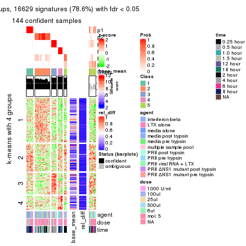</p>

</div>
</div>


Signature heatmaps where rows are not scaled:


<script>
$( function() {
	$( '#tabs-CV-pam-get-signatures-no-scale' ).tabs();
} );
</script>
<div id='tabs-CV-pam-get-signatures-no-scale'>
<ul>
<li><a href='#tab-CV-pam-get-signatures-no-scale-1'>k = 2</a></li>
<li><a href='#tab-CV-pam-get-signatures-no-scale-2'>k = 3</a></li>
<li><a href='#tab-CV-pam-get-signatures-no-scale-3'>k = 4</a></li>
<li><a href='#tab-CV-pam-get-signatures-no-scale-4'>k = 5</a></li>
<li><a href='#tab-CV-pam-get-signatures-no-scale-5'>k = 6</a></li>
</ul>
<div id='tab-CV-pam-get-signatures-no-scale-1'>
<pre><code class="r">get_signatures(res, k = 2, scale_rows = FALSE)
</code></pre>

<pre><code>#&gt; Error in mat[ceiling(1:nr/h_ratio), ceiling(1:nc/w_ratio), drop = FALSE]: subscript out of bounds
</code></pre>

<p></p>

</div>
<div id='tab-CV-pam-get-signatures-no-scale-2'>
<pre><code class="r">get_signatures(res, k = 3, scale_rows = FALSE)
</code></pre>

<pre><code>#&gt; Error in mat[ceiling(1:nr/h_ratio), ceiling(1:nc/w_ratio), drop = FALSE]: subscript out of bounds
</code></pre>

<p></p>

</div>
<div id='tab-CV-pam-get-signatures-no-scale-3'>
<pre><code class="r">get_signatures(res, k = 4, scale_rows = FALSE)
</code></pre>

<p></p>

</div>
<div id='tab-CV-pam-get-signatures-no-scale-4'>
<pre><code class="r">get_signatures(res, k = 5, scale_rows = FALSE)
</code></pre>

<p></p>

</div>
<div id='tab-CV-pam-get-signatures-no-scale-5'>
<pre><code class="r">get_signatures(res, k = 6, scale_rows = FALSE)
</code></pre>

<p></p>

</div>
</div>


Compare the overlap of signatures from different k:

```r
compare_signatures(res)
```


`get_signature()` returns a data frame invisibly. TO get the list of signatures, the function
call should be assigned to a variable explicitly. In following code, if `plot` argument is set
to `FALSE`, no heatmap is plotted while only the differential analysis is performed.

```r
# code only for demonstration
tb = get_signature(res, k = ..., plot = FALSE)
```

An example of the output of `tb` is:

```
#>   which_row         fdr    mean_1    mean_2 scaled_mean_1 scaled_mean_2 km
#> 1        38 0.042760348  8.373488  9.131774    -0.5533452     0.5164555  1
#> 2        40 0.018707592  7.106213  8.469186    -0.6173731     0.5762149  1
#> 3        55 0.019134737 10.221463 11.207825    -0.6159697     0.5749050  1
#> 4        59 0.006059896  5.921854  7.869574    -0.6899429     0.6439467  1
#> 5        60 0.018055526  8.928898 10.211722    -0.6204761     0.5791110  1
#> 6        98 0.009384629 15.714769 14.887706     0.6635654    -0.6193277  2
...
```

The columns in `tb` are:

1. `which_row`: row indices corresponding to the input matrix.
2. `fdr`: FDR for the differential test. 
3. `mean_x`: The mean value in group x.
4. `scaled_mean_x`: The mean value in group x after rows are scaled.
5. `km`: Row groups if k-means clustering is applied to rows.


UMAP plot which shows how samples are separated.


<script>
$( function() {
	$( '#tabs-CV-pam-dimension-reduction' ).tabs();
} );
</script>
<div id='tabs-CV-pam-dimension-reduction'>
<ul>
<li><a href='#tab-CV-pam-dimension-reduction-1'>k = 2</a></li>
<li><a href='#tab-CV-pam-dimension-reduction-2'>k = 3</a></li>
<li><a href='#tab-CV-pam-dimension-reduction-3'>k = 4</a></li>
<li><a href='#tab-CV-pam-dimension-reduction-4'>k = 5</a></li>
<li><a href='#tab-CV-pam-dimension-reduction-5'>k = 6</a></li>
</ul>
<div id='tab-CV-pam-dimension-reduction-1'>
<pre><code class="r">dimension_reduction(res, k = 2, method = &quot;UMAP&quot;)
</code></pre>

<p></p>

</div>
<div id='tab-CV-pam-dimension-reduction-2'>
<pre><code class="r">dimension_reduction(res, k = 3, method = &quot;UMAP&quot;)
</code></pre>

<p></p>

</div>
<div id='tab-CV-pam-dimension-reduction-3'>
<pre><code class="r">dimension_reduction(res, k = 4, method = &quot;UMAP&quot;)
</code></pre>

<p></p>

</div>
<div id='tab-CV-pam-dimension-reduction-4'>
<pre><code class="r">dimension_reduction(res, k = 5, method = &quot;UMAP&quot;)
</code></pre>

<p></p>

</div>
<div id='tab-CV-pam-dimension-reduction-5'>
<pre><code class="r">dimension_reduction(res, k = 6, method = &quot;UMAP&quot;)
</code></pre>

<p></p>

</div>
</div>


Following heatmap shows how subgroups are split when increasing `k`:

```r
collect_classes(res)
```


Test correlation between subgroups and known annotations. If the known
annotation is numeric, one-way ANOVA test is applied, and if the known
annotation is discrete, chi-squared contingency table test is applied.

```r
test_to_known_factors(res)
```

```
#>          n agent(p) dose(p)  time(p) k
#> CV:pam 168 0.522904 0.91081 4.51e-23 2
#> CV:pam 168 0.000389 0.00994 7.96e-27 3
#> CV:pam 165 0.005162 0.04442 2.47e-48 4
#> CV:pam 159 0.014721 0.20333 1.38e-71 5
#> CV:pam 144 0.051547 0.15297 3.25e-73 6
```


If matrix rows can be associated to genes, consider to use `GO_Enrichment(res,
...)` to perform function enrichment for the signature genes.


 

---------------------------------------------------


### CV:mclust


The object with results only for a single top-value method and a single partition method 
can be extracted as:

```r
res = res_list["CV", "mclust"]
# you can also extract it by
# res = res_list["CV:mclust"]
```

A summary of `res` and all the functions that can be applied to it:

```r
res
```

```
#> A 'ConsensusPartition' object with k = 2, 3, 4, 5, 6.
#>   On a matrix with 21163 rows and 169 columns.
#>   Top rows (1000, 2000, 3000, 4000, 5000) are extracted by 'CV' method.
#>   Subgroups are detected by 'mclust' method.
#>   Performed in total 1250 partitions by row resampling.
#>   Best k for subgroups seems to be 3.
#> 
#> Following methods can be applied to this 'ConsensusPartition' object:
#>  [1] "cola_report"             "collect_classes"         "collect_plots"          
#>  [4] "collect_stats"           "colnames"                "compare_signatures"     
#>  [7] "consensus_heatmap"       "dimension_reduction"     "functional_enrichment"  
#> [10] "get_anno_col"            "get_anno"                "get_classes"            
#> [13] "get_consensus"           "get_matrix"              "get_membership"         
#> [16] "get_param"               "get_signatures"          "get_stats"              
#> [19] "is_best_k"               "is_stable_k"             "membership_heatmap"     
#> [22] "ncol"                    "nrow"                    "plot_ecdf"              
#> [25] "rownames"                "select_partition_number" "show"                   
#> [28] "suggest_best_k"          "test_to_known_factors"
```

`collect_plots()` function collects all the plots made from `res` for all `k` (number of partitions)
into one single page to provide an easy and fast comparison between different `k`.

```r
collect_plots(res)
```


The plots are:

- The first row: a plot of the ECDF (Empirical cumulative distribution
  function) curves of the consensus matrix for each `k` and the heatmap of
  predicted classes for each `k`.
- The second row: heatmaps of the consensus matrix for each `k`.
- The third row: heatmaps of the membership matrix for each `k`.
- The fouth row: heatmaps of the signatures for each `k`.

All the plots in panels can be made by individual functions and they are
plotted later in this section.

`select_partition_number()` produces several plots showing different
statistics for choosing "optimized" `k`. There are following statistics:

- ECDF curves of the consensus matrix for each `k`;
- 1-PAC. [The PAC
  score](https://en.wikipedia.org/wiki/Consensus_clustering#Over-interpretation_potential_of_consensus_clustering)
  measures the proportion of the ambiguous subgrouping.
- Mean silhouette score.
- Concordance. The mean probability of fiting the consensus class ids in all
  partitions.
- Area increased. Denote $A_k$ as the area under the ECDF curve for current
  `k`, the area increased is defined as $A_k - A_{k-1}$.
- Rand index. The percent of pairs of samples that are both in a same cluster
  or both are not in a same cluster in the partition of k and k-1.
- Jaccard index. The ratio of pairs of samples are both in a same cluster in
  the partition of k and k-1 and the pairs of samples are both in a same
  cluster in the partition k or k-1.

The detailed explanations of these statistics can be found in [the cola
vignette](http://bioconductor.org/packages/devel/bioc/vignettes/cola/inst/doc/cola.html#toc_13).

Generally speaking, lower PAC score, higher mean silhouette score or higher
concordance corresponds to better partition. Rand index and Jaccard index
measure how similar the current partition is compared to partition with `k-1`.
If they are too similar, we won't accept `k` is better than `k-1`.

```r
select_partition_number(res)
```


The numeric values for all these statistics can be obtained by `get_stats()`.

```r
get_stats(res)
```

```
#>   k 1-PAC mean_silhouette concordance area_increased  Rand Jaccard
#> 2 2 0.434           0.796       0.897         0.4862 0.499   0.499
#> 3 3 0.740           0.872       0.919         0.3135 0.756   0.558
#> 4 4 0.693           0.735       0.847         0.1078 0.915   0.770
#> 5 5 0.658           0.648       0.790         0.0899 0.918   0.719
#> 6 6 0.682           0.627       0.741         0.0438 0.961   0.821
```

`suggest_best_k()` suggests the best $k$ based on these statistics. The rules are as follows:

- All $k$ with Jaccard index larger than 0.95 are removed because the increase of
  the partition number does not provides enough extra information. If all $k$ are removed,
  the best $k$ is assigned by `NA`.
- For $k$ with 1-PAC larger than 0.9, the maximal $k$ is taken as the "best k". Other $k$ is called "optional k".
- If it does not fit the second rule. The $k$ with the highest vote of highest
  1-PAC, mean silhouette and concordance is taken as the "best k".

```r
suggest_best_k(res)
```

```
#> [1] 3
```


Following shows the table of the partitions (You need to click the **show/hide
code output** link to see it). The membership matrix (columns with name `p*`)
is inferred by
[`clue::cl_consensus()`](https://www.rdocumentation.org/link/cl_consensus?package=clue)
function with the `SE` method. Basically the value in the membership matrix
represents the probability to belong to a certain group. The finall class
label for an item is determined with the group with highest probability it
belongs to.

In `get_classes()` function, the entropy is calculated from the membership
matrix and the silhouette score is calculated from the consensus matrix.


<script>
$( function() {
	$( '#tabs-CV-mclust-get-classes' ).tabs();
} );
</script>
<div id='tabs-CV-mclust-get-classes'>
<ul>
<li><a href='#tab-CV-mclust-get-classes-1'>k = 2</a></li>
<li><a href='#tab-CV-mclust-get-classes-2'>k = 3</a></li>
<li><a href='#tab-CV-mclust-get-classes-3'>k = 4</a></li>
<li><a href='#tab-CV-mclust-get-classes-4'>k = 5</a></li>
<li><a href='#tab-CV-mclust-get-classes-5'>k = 6</a></li>
</ul>

<div id='tab-CV-mclust-get-classes-1'>
<p><a id='tab-CV-mclust-get-classes-1-a' style='color:#0366d6' href='#'>show/hide code output</a></p>
<pre><code class="r">cbind(get_classes(res, k = 2), get_membership(res, k = 2))
</code></pre>

<pre><code>#&gt;           class entropy silhouette    p1    p2
#&gt; GSM528681     2  0.0000      0.930 0.000 1.000
#&gt; GSM528682     2  0.0000      0.930 0.000 1.000
#&gt; GSM528683     2  0.0000      0.930 0.000 1.000
#&gt; GSM528684     2  0.0000      0.930 0.000 1.000
#&gt; GSM528687     2  0.0000      0.930 0.000 1.000
#&gt; GSM528688     2  0.0000      0.930 0.000 1.000
#&gt; GSM528685     2  0.3274      0.879 0.060 0.940
#&gt; GSM528686     2  0.3274      0.879 0.060 0.940
#&gt; GSM528693     1  0.2423      0.837 0.960 0.040
#&gt; GSM528694     1  0.2236      0.837 0.964 0.036
#&gt; GSM528695     1  0.5842      0.778 0.860 0.140
#&gt; GSM528696     1  0.5842      0.778 0.860 0.140
#&gt; GSM528697     1  0.0000      0.835 1.000 0.000
#&gt; GSM528698     1  0.0000      0.835 1.000 0.000
#&gt; GSM528699     1  0.0000      0.835 1.000 0.000
#&gt; GSM528700     1  0.0000      0.835 1.000 0.000
#&gt; GSM528689     1  0.0000      0.835 1.000 0.000
#&gt; GSM528690     1  0.0000      0.835 1.000 0.000
#&gt; GSM528691     1  0.0000      0.835 1.000 0.000
#&gt; GSM528692     1  0.0000      0.835 1.000 0.000
#&gt; GSM528779     2  0.0000      0.930 0.000 1.000
#&gt; GSM528780     2  0.0000      0.930 0.000 1.000
#&gt; GSM528782     2  0.0000      0.930 0.000 1.000
#&gt; GSM528781     2  0.0000      0.930 0.000 1.000
#&gt; GSM528785     2  0.7674      0.685 0.224 0.776
#&gt; GSM528786     1  0.6801      0.779 0.820 0.180
#&gt; GSM528787     1  0.4939      0.820 0.892 0.108
#&gt; GSM528788     1  0.9552      0.510 0.624 0.376
#&gt; GSM528783     1  0.0000      0.835 1.000 0.000
#&gt; GSM528784     1  0.0000      0.835 1.000 0.000
#&gt; GSM528759     1  0.4022      0.830 0.920 0.080
#&gt; GSM528760     1  0.2948      0.836 0.948 0.052
#&gt; GSM528761     2  0.0000      0.930 0.000 1.000
#&gt; GSM528762     2  0.0000      0.930 0.000 1.000
#&gt; GSM528765     2  0.0000      0.930 0.000 1.000
#&gt; GSM528766     2  0.0000      0.930 0.000 1.000
#&gt; GSM528763     2  0.0000      0.930 0.000 1.000
#&gt; GSM528764     2  0.0672      0.925 0.008 0.992
#&gt; GSM528771     2  0.7453      0.704 0.212 0.788
#&gt; GSM528772     2  0.7528      0.698 0.216 0.784
#&gt; GSM528773     1  0.6801      0.779 0.820 0.180
#&gt; GSM528774     1  0.6801      0.779 0.820 0.180
#&gt; GSM528775     1  0.6623      0.780 0.828 0.172
#&gt; GSM528776     1  0.7602      0.737 0.780 0.220
#&gt; GSM528777     1  0.1414      0.837 0.980 0.020
#&gt; GSM528778     1  0.1184      0.837 0.984 0.016
#&gt; GSM528767     1  0.0000      0.835 1.000 0.000
#&gt; GSM528768     1  0.0000      0.835 1.000 0.000
#&gt; GSM528769     1  0.0000      0.835 1.000 0.000
#&gt; GSM528770     1  0.0000      0.835 1.000 0.000
#&gt; GSM528671     2  0.0000      0.930 0.000 1.000
#&gt; GSM528672     2  0.0000      0.930 0.000 1.000
#&gt; GSM528674     2  0.0000      0.930 0.000 1.000
#&gt; GSM528673     2  0.0672      0.925 0.008 0.992
#&gt; GSM528677     2  0.7602      0.692 0.220 0.780
#&gt; GSM528678     1  0.6623      0.785 0.828 0.172
#&gt; GSM528679     1  0.7815      0.723 0.768 0.232
#&gt; GSM528680     1  0.0000      0.835 1.000 0.000
#&gt; GSM528675     1  0.0000      0.835 1.000 0.000
#&gt; GSM528676     1  0.0000      0.835 1.000 0.000
#&gt; GSM528651     2  0.0000      0.930 0.000 1.000
#&gt; GSM528652     2  0.0000      0.930 0.000 1.000
#&gt; GSM528653     2  0.0000      0.930 0.000 1.000
#&gt; GSM528654     2  0.0000      0.930 0.000 1.000
#&gt; GSM528657     2  0.0000      0.930 0.000 1.000
#&gt; GSM528658     2  0.0000      0.930 0.000 1.000
#&gt; GSM528655     2  0.0672      0.925 0.008 0.992
#&gt; GSM528656     2  0.0672      0.925 0.008 0.992
#&gt; GSM528663     2  0.7376      0.709 0.208 0.792
#&gt; GSM528664     2  0.7376      0.709 0.208 0.792
#&gt; GSM528665     1  0.6801      0.779 0.820 0.180
#&gt; GSM528666     1  0.6801      0.779 0.820 0.180
#&gt; GSM528667     1  0.5737      0.807 0.864 0.136
#&gt; GSM528668     1  0.5737      0.807 0.864 0.136
#&gt; GSM528669     1  0.2043      0.838 0.968 0.032
#&gt; GSM528670     1  0.2043      0.838 0.968 0.032
#&gt; GSM528659     1  0.0000      0.835 1.000 0.000
#&gt; GSM528660     1  0.0000      0.835 1.000 0.000
#&gt; GSM528661     1  0.0000      0.835 1.000 0.000
#&gt; GSM528662     1  0.0000      0.835 1.000 0.000
#&gt; GSM528701     2  0.0000      0.930 0.000 1.000
#&gt; GSM528702     2  0.0000      0.930 0.000 1.000
#&gt; GSM528703     2  0.0000      0.930 0.000 1.000
#&gt; GSM528704     2  0.0000      0.930 0.000 1.000
#&gt; GSM528707     2  0.0000      0.930 0.000 1.000
#&gt; GSM528708     2  0.0000      0.930 0.000 1.000
#&gt; GSM528705     2  0.0000      0.930 0.000 1.000
#&gt; GSM528706     2  0.0000      0.930 0.000 1.000
#&gt; GSM528713     2  0.9000      0.499 0.316 0.684
#&gt; GSM528714     2  0.7453      0.704 0.212 0.788
#&gt; GSM528715     1  0.6887      0.778 0.816 0.184
#&gt; GSM528716     1  0.6973      0.775 0.812 0.188
#&gt; GSM528717     1  0.1843      0.838 0.972 0.028
#&gt; GSM528718     1  0.2043      0.838 0.968 0.032
#&gt; GSM528719     1  0.0000      0.835 1.000 0.000
#&gt; GSM528720     1  0.0000      0.835 1.000 0.000
#&gt; GSM528709     1  0.0000      0.835 1.000 0.000
#&gt; GSM528710     1  0.0000      0.835 1.000 0.000
#&gt; GSM528711     1  0.0000      0.835 1.000 0.000
#&gt; GSM528712     1  0.0000      0.835 1.000 0.000
#&gt; GSM528721     2  0.0000      0.930 0.000 1.000
#&gt; GSM528722     2  0.0000      0.930 0.000 1.000
#&gt; GSM528723     2  0.0000      0.930 0.000 1.000
#&gt; GSM528724     2  0.0000      0.930 0.000 1.000
#&gt; GSM528727     2  0.0000      0.930 0.000 1.000
#&gt; GSM528728     2  0.0000      0.930 0.000 1.000
#&gt; GSM528725     2  0.0000      0.930 0.000 1.000
#&gt; GSM528726     2  0.0000      0.930 0.000 1.000
#&gt; GSM528733     1  0.6801      0.779 0.820 0.180
#&gt; GSM528734     1  0.6801      0.779 0.820 0.180
#&gt; GSM528735     1  0.2423      0.837 0.960 0.040
#&gt; GSM528736     1  0.2423      0.837 0.960 0.040
#&gt; GSM528737     1  0.6801      0.776 0.820 0.180
#&gt; GSM528738     1  0.5059      0.818 0.888 0.112
#&gt; GSM528729     1  0.9815      0.422 0.580 0.420
#&gt; GSM528730     1  0.9815      0.422 0.580 0.420
#&gt; GSM528731     1  0.8909      0.628 0.692 0.308
#&gt; GSM528732     1  0.9815      0.422 0.580 0.420
#&gt; GSM528739     2  0.0000      0.930 0.000 1.000
#&gt; GSM528740     2  0.0000      0.930 0.000 1.000
#&gt; GSM528741     2  0.0000      0.930 0.000 1.000
#&gt; GSM528742     2  0.0000      0.930 0.000 1.000
#&gt; GSM528745     2  0.0000      0.930 0.000 1.000
#&gt; GSM528746     2  0.0000      0.930 0.000 1.000
#&gt; GSM528743     2  0.0000      0.930 0.000 1.000
#&gt; GSM528744     2  0.0000      0.930 0.000 1.000
#&gt; GSM528751     2  0.7745      0.679 0.228 0.772
#&gt; GSM528752     2  0.7950      0.658 0.240 0.760
#&gt; GSM528753     1  0.6801      0.779 0.820 0.180
#&gt; GSM528754     1  0.6801      0.779 0.820 0.180
#&gt; GSM528755     1  0.4815      0.823 0.896 0.104
#&gt; GSM528756     1  0.2423      0.837 0.960 0.040
#&gt; GSM528757     1  0.9815      0.422 0.580 0.420
#&gt; GSM528758     1  0.9815      0.422 0.580 0.420
#&gt; GSM528747     1  0.7602      0.740 0.780 0.220
#&gt; GSM528748     2  0.9815      0.166 0.420 0.580
#&gt; GSM528749     1  0.8955      0.626 0.688 0.312
#&gt; GSM528750     1  0.9795      0.431 0.584 0.416
#&gt; GSM528640     2  0.0000      0.930 0.000 1.000
#&gt; GSM528641     2  0.0672      0.925 0.008 0.992
#&gt; GSM528643     1  0.6801      0.779 0.820 0.180
#&gt; GSM528644     2  0.9710      0.242 0.400 0.600
#&gt; GSM528642     1  0.9963      0.354 0.536 0.464
#&gt; GSM528620     2  0.0000      0.930 0.000 1.000
#&gt; GSM528621     2  0.3733      0.864 0.072 0.928
#&gt; GSM528623     1  0.6801      0.779 0.820 0.180
#&gt; GSM528624     1  0.9815      0.422 0.580 0.420
#&gt; GSM528622     1  0.9608      0.500 0.616 0.384
#&gt; GSM528625     2  0.0000      0.930 0.000 1.000
#&gt; GSM528626     2  0.0672      0.925 0.008 0.992
#&gt; GSM528628     1  0.6801      0.779 0.820 0.180
#&gt; GSM528629     1  0.9815      0.422 0.580 0.420
#&gt; GSM528627     1  0.9286      0.575 0.656 0.344
#&gt; GSM528630     2  0.0000      0.930 0.000 1.000
#&gt; GSM528631     2  0.0000      0.930 0.000 1.000
#&gt; GSM528632     2  0.0672      0.925 0.008 0.992
#&gt; GSM528633     2  0.0672      0.925 0.008 0.992
#&gt; GSM528636     1  0.6801      0.779 0.820 0.180
#&gt; GSM528637     1  0.6801      0.779 0.820 0.180
#&gt; GSM528638     1  0.9815      0.422 0.580 0.420
#&gt; GSM528639     1  0.9815      0.422 0.580 0.420
#&gt; GSM528634     1  0.7883      0.724 0.764 0.236
#&gt; GSM528635     1  0.8813      0.644 0.700 0.300
#&gt; GSM528645     2  0.9427      0.349 0.360 0.640
#&gt; GSM528646     2  0.9522      0.314 0.372 0.628
#&gt; GSM528647     2  0.9491      0.335 0.368 0.632
#&gt; GSM528648     1  0.9209      0.581 0.664 0.336
#&gt; GSM528649     1  0.7219      0.756 0.800 0.200
#&gt; GSM528650     1  0.5059      0.820 0.888 0.112
</code></pre>

<script>
$('#tab-CV-mclust-get-classes-1-a').parent().next().next().hide();
$('#tab-CV-mclust-get-classes-1-a').click(function(){
  $('#tab-CV-mclust-get-classes-1-a').parent().next().next().toggle();
  return(false);
});
</script>
</div>

<div id='tab-CV-mclust-get-classes-2'>
<p><a id='tab-CV-mclust-get-classes-2-a' style='color:#0366d6' href='#'>show/hide code output</a></p>
<pre><code class="r">cbind(get_classes(res, k = 3), get_membership(res, k = 3))
</code></pre>

<pre><code>#&gt;           class entropy silhouette    p1    p2    p3
#&gt; GSM528681     2  0.0000      0.977 0.000 1.000 0.000
#&gt; GSM528682     2  0.0000      0.977 0.000 1.000 0.000
#&gt; GSM528683     2  0.0000      0.977 0.000 1.000 0.000
#&gt; GSM528684     2  0.0000      0.977 0.000 1.000 0.000
#&gt; GSM528687     2  0.0000      0.977 0.000 1.000 0.000
#&gt; GSM528688     2  0.0000      0.977 0.000 1.000 0.000
#&gt; GSM528685     2  0.4652      0.854 0.080 0.856 0.064
#&gt; GSM528686     2  0.4652      0.854 0.080 0.856 0.064
#&gt; GSM528693     3  0.6062      0.481 0.384 0.000 0.616
#&gt; GSM528694     3  0.6302      0.193 0.480 0.000 0.520
#&gt; GSM528695     1  0.4002      0.817 0.840 0.000 0.160
#&gt; GSM528696     1  0.4002      0.817 0.840 0.000 0.160
#&gt; GSM528697     1  0.1031      0.939 0.976 0.000 0.024
#&gt; GSM528698     1  0.3192      0.886 0.888 0.000 0.112
#&gt; GSM528699     1  0.3116      0.887 0.892 0.000 0.108
#&gt; GSM528700     1  0.2796      0.900 0.908 0.000 0.092
#&gt; GSM528689     1  0.2066      0.920 0.940 0.000 0.060
#&gt; GSM528690     1  0.0892      0.940 0.980 0.000 0.020
#&gt; GSM528691     1  0.0892      0.940 0.980 0.000 0.020
#&gt; GSM528692     1  0.0000      0.936 1.000 0.000 0.000
#&gt; GSM528779     2  0.0000      0.977 0.000 1.000 0.000
#&gt; GSM528780     2  0.0000      0.977 0.000 1.000 0.000
#&gt; GSM528782     2  0.0000      0.977 0.000 1.000 0.000
#&gt; GSM528781     2  0.0000      0.977 0.000 1.000 0.000
#&gt; GSM528785     3  0.7244      0.678 0.092 0.208 0.700
#&gt; GSM528786     3  0.4235      0.740 0.176 0.000 0.824
#&gt; GSM528787     3  0.3112      0.858 0.096 0.004 0.900
#&gt; GSM528788     3  0.2711      0.859 0.088 0.000 0.912
#&gt; GSM528783     1  0.0424      0.936 0.992 0.000 0.008
#&gt; GSM528784     1  0.0237      0.937 0.996 0.000 0.004
#&gt; GSM528759     3  0.2711      0.859 0.088 0.000 0.912
#&gt; GSM528760     3  0.2711      0.859 0.088 0.000 0.912
#&gt; GSM528761     2  0.0000      0.977 0.000 1.000 0.000
#&gt; GSM528762     2  0.0000      0.977 0.000 1.000 0.000
#&gt; GSM528765     2  0.0000      0.977 0.000 1.000 0.000
#&gt; GSM528766     2  0.0000      0.977 0.000 1.000 0.000
#&gt; GSM528763     2  0.0237      0.975 0.000 0.996 0.004
#&gt; GSM528764     2  0.1765      0.944 0.004 0.956 0.040
#&gt; GSM528771     3  0.8518      0.255 0.092 0.436 0.472
#&gt; GSM528772     3  0.8457      0.372 0.092 0.396 0.512
#&gt; GSM528773     3  0.3412      0.774 0.124 0.000 0.876
#&gt; GSM528774     3  0.3267      0.778 0.116 0.000 0.884
#&gt; GSM528775     3  0.4605      0.778 0.204 0.000 0.796
#&gt; GSM528776     3  0.3482      0.843 0.128 0.000 0.872
#&gt; GSM528777     3  0.3267      0.850 0.116 0.000 0.884
#&gt; GSM528778     3  0.3267      0.850 0.116 0.000 0.884
#&gt; GSM528767     1  0.1031      0.939 0.976 0.000 0.024
#&gt; GSM528768     1  0.1031      0.939 0.976 0.000 0.024
#&gt; GSM528769     1  0.0237      0.937 0.996 0.000 0.004
#&gt; GSM528770     1  0.0237      0.937 0.996 0.000 0.004
#&gt; GSM528671     2  0.0000      0.977 0.000 1.000 0.000
#&gt; GSM528672     2  0.0000      0.977 0.000 1.000 0.000
#&gt; GSM528674     2  0.0000      0.977 0.000 1.000 0.000
#&gt; GSM528673     2  0.1765      0.944 0.004 0.956 0.040
#&gt; GSM528677     3  0.7745      0.609 0.092 0.260 0.648
#&gt; GSM528678     3  0.4178      0.813 0.172 0.000 0.828
#&gt; GSM528679     1  0.4842      0.747 0.776 0.000 0.224
#&gt; GSM528680     1  0.3116      0.887 0.892 0.000 0.108
#&gt; GSM528675     1  0.0000      0.936 1.000 0.000 0.000
#&gt; GSM528676     1  0.0000      0.936 1.000 0.000 0.000
#&gt; GSM528651     2  0.0000      0.977 0.000 1.000 0.000
#&gt; GSM528652     2  0.0000      0.977 0.000 1.000 0.000
#&gt; GSM528653     2  0.0000      0.977 0.000 1.000 0.000
#&gt; GSM528654     2  0.0000      0.977 0.000 1.000 0.000
#&gt; GSM528657     2  0.0000      0.977 0.000 1.000 0.000
#&gt; GSM528658     2  0.0000      0.977 0.000 1.000 0.000
#&gt; GSM528655     2  0.1765      0.944 0.004 0.956 0.040
#&gt; GSM528656     2  0.1765      0.944 0.004 0.956 0.040
#&gt; GSM528663     2  0.7059      0.607 0.092 0.716 0.192
#&gt; GSM528664     2  0.6860      0.638 0.092 0.732 0.176
#&gt; GSM528665     3  0.3267      0.778 0.116 0.000 0.884
#&gt; GSM528666     3  0.3267      0.778 0.116 0.000 0.884
#&gt; GSM528667     3  0.2796      0.859 0.092 0.000 0.908
#&gt; GSM528668     3  0.2796      0.859 0.092 0.000 0.908
#&gt; GSM528669     3  0.3340      0.849 0.120 0.000 0.880
#&gt; GSM528670     3  0.3267      0.850 0.116 0.000 0.884
#&gt; GSM528659     1  0.0000      0.936 1.000 0.000 0.000
#&gt; GSM528660     1  0.0000      0.936 1.000 0.000 0.000
#&gt; GSM528661     1  0.0000      0.936 1.000 0.000 0.000
#&gt; GSM528662     1  0.0000      0.936 1.000 0.000 0.000
#&gt; GSM528701     2  0.0000      0.977 0.000 1.000 0.000
#&gt; GSM528702     2  0.0000      0.977 0.000 1.000 0.000
#&gt; GSM528703     2  0.0000      0.977 0.000 1.000 0.000
#&gt; GSM528704     2  0.0000      0.977 0.000 1.000 0.000
#&gt; GSM528707     2  0.0000      0.977 0.000 1.000 0.000
#&gt; GSM528708     2  0.0000      0.977 0.000 1.000 0.000
#&gt; GSM528705     2  0.0000      0.977 0.000 1.000 0.000
#&gt; GSM528706     2  0.0000      0.977 0.000 1.000 0.000
#&gt; GSM528713     3  0.6752      0.733 0.104 0.152 0.744
#&gt; GSM528714     3  0.8202      0.512 0.092 0.328 0.580
#&gt; GSM528715     3  0.3267      0.778 0.116 0.000 0.884
#&gt; GSM528716     3  0.3267      0.778 0.116 0.000 0.884
#&gt; GSM528717     1  0.3340      0.879 0.880 0.000 0.120
#&gt; GSM528718     1  0.3340      0.879 0.880 0.000 0.120
#&gt; GSM528719     1  0.3116      0.887 0.892 0.000 0.108
#&gt; GSM528720     1  0.3116      0.887 0.892 0.000 0.108
#&gt; GSM528709     1  0.0892      0.940 0.980 0.000 0.020
#&gt; GSM528710     1  0.0237      0.938 0.996 0.000 0.004
#&gt; GSM528711     1  0.0892      0.940 0.980 0.000 0.020
#&gt; GSM528712     1  0.0892      0.940 0.980 0.000 0.020
#&gt; GSM528721     2  0.0000      0.977 0.000 1.000 0.000
#&gt; GSM528722     2  0.0000      0.977 0.000 1.000 0.000
#&gt; GSM528723     2  0.0000      0.977 0.000 1.000 0.000
#&gt; GSM528724     2  0.0000      0.977 0.000 1.000 0.000
#&gt; GSM528727     2  0.0000      0.977 0.000 1.000 0.000
#&gt; GSM528728     2  0.0000      0.977 0.000 1.000 0.000
#&gt; GSM528725     2  0.0000      0.977 0.000 1.000 0.000
#&gt; GSM528726     2  0.0000      0.977 0.000 1.000 0.000
#&gt; GSM528733     3  0.3267      0.778 0.116 0.000 0.884
#&gt; GSM528734     3  0.3267      0.778 0.116 0.000 0.884
#&gt; GSM528735     3  0.3192      0.854 0.112 0.000 0.888
#&gt; GSM528736     3  0.2959      0.858 0.100 0.000 0.900
#&gt; GSM528737     3  0.2796      0.859 0.092 0.000 0.908
#&gt; GSM528738     3  0.2796      0.859 0.092 0.000 0.908
#&gt; GSM528729     3  0.2711      0.859 0.088 0.000 0.912
#&gt; GSM528730     3  0.2711      0.859 0.088 0.000 0.912
#&gt; GSM528731     3  0.2711      0.859 0.088 0.000 0.912
#&gt; GSM528732     3  0.2711      0.859 0.088 0.000 0.912
#&gt; GSM528739     2  0.0000      0.977 0.000 1.000 0.000
#&gt; GSM528740     2  0.0000      0.977 0.000 1.000 0.000
#&gt; GSM528741     2  0.0000      0.977 0.000 1.000 0.000
#&gt; GSM528742     2  0.0000      0.977 0.000 1.000 0.000
#&gt; GSM528745     2  0.0000      0.977 0.000 1.000 0.000
#&gt; GSM528746     2  0.0000      0.977 0.000 1.000 0.000
#&gt; GSM528743     2  0.0000      0.977 0.000 1.000 0.000
#&gt; GSM528744     2  0.0000      0.977 0.000 1.000 0.000
#&gt; GSM528751     3  0.7199      0.683 0.092 0.204 0.704
#&gt; GSM528752     3  0.7059      0.697 0.092 0.192 0.716
#&gt; GSM528753     3  0.3267      0.778 0.116 0.000 0.884
#&gt; GSM528754     3  0.3267      0.778 0.116 0.000 0.884
#&gt; GSM528755     3  0.3267      0.851 0.116 0.000 0.884
#&gt; GSM528756     3  0.3340      0.848 0.120 0.000 0.880
#&gt; GSM528757     3  0.2945      0.859 0.088 0.004 0.908
#&gt; GSM528758     3  0.2945      0.859 0.088 0.004 0.908
#&gt; GSM528747     3  0.2711      0.859 0.088 0.000 0.912
#&gt; GSM528748     3  0.3445      0.855 0.088 0.016 0.896
#&gt; GSM528749     3  0.2711      0.859 0.088 0.000 0.912
#&gt; GSM528750     3  0.2711      0.859 0.088 0.000 0.912
#&gt; GSM528640     2  0.0000      0.977 0.000 1.000 0.000
#&gt; GSM528641     2  0.1765      0.944 0.004 0.956 0.040
#&gt; GSM528643     3  0.3267      0.778 0.116 0.000 0.884
#&gt; GSM528644     3  0.4092      0.845 0.088 0.036 0.876
#&gt; GSM528642     3  0.4784      0.812 0.200 0.004 0.796
#&gt; GSM528620     2  0.0000      0.977 0.000 1.000 0.000
#&gt; GSM528621     2  0.4749      0.820 0.072 0.852 0.076
#&gt; GSM528623     3  0.3267      0.778 0.116 0.000 0.884
#&gt; GSM528624     3  0.2945      0.859 0.088 0.004 0.908
#&gt; GSM528622     3  0.2796      0.859 0.092 0.000 0.908
#&gt; GSM528625     2  0.0000      0.977 0.000 1.000 0.000
#&gt; GSM528626     2  0.1765      0.944 0.004 0.956 0.040
#&gt; GSM528628     3  0.3267      0.778 0.116 0.000 0.884
#&gt; GSM528629     3  0.2945      0.859 0.088 0.004 0.908
#&gt; GSM528627     3  0.2959      0.857 0.100 0.000 0.900
#&gt; GSM528630     2  0.0000      0.977 0.000 1.000 0.000
#&gt; GSM528631     2  0.0000      0.977 0.000 1.000 0.000
#&gt; GSM528632     2  0.1765      0.944 0.004 0.956 0.040
#&gt; GSM528633     2  0.1765      0.944 0.004 0.956 0.040
#&gt; GSM528636     3  0.3267      0.778 0.116 0.000 0.884
#&gt; GSM528637     3  0.3267      0.778 0.116 0.000 0.884
#&gt; GSM528638     3  0.2711      0.859 0.088 0.000 0.912
#&gt; GSM528639     3  0.2711      0.859 0.088 0.000 0.912
#&gt; GSM528634     3  0.2959      0.857 0.100 0.000 0.900
#&gt; GSM528635     3  0.2711      0.859 0.088 0.000 0.912
#&gt; GSM528645     3  0.7816      0.590 0.132 0.200 0.668
#&gt; GSM528646     3  0.7816      0.590 0.132 0.200 0.668
#&gt; GSM528647     3  0.8802      0.601 0.200 0.216 0.584
#&gt; GSM528648     3  0.3267      0.852 0.116 0.000 0.884
#&gt; GSM528649     3  0.3752      0.836 0.144 0.000 0.856
#&gt; GSM528650     3  0.3116      0.855 0.108 0.000 0.892
</code></pre>

<script>
$('#tab-CV-mclust-get-classes-2-a').parent().next().next().hide();
$('#tab-CV-mclust-get-classes-2-a').click(function(){
  $('#tab-CV-mclust-get-classes-2-a').parent().next().next().toggle();
  return(false);
});
</script>
</div>

<div id='tab-CV-mclust-get-classes-3'>
<p><a id='tab-CV-mclust-get-classes-3-a' style='color:#0366d6' href='#'>show/hide code output</a></p>
<pre><code class="r">cbind(get_classes(res, k = 4), get_membership(res, k = 4))
</code></pre>

<pre><code>#&gt;           class entropy silhouette    p1    p2    p3    p4
#&gt; GSM528681     2  0.0000     0.9274 0.000 1.000 0.000 0.000
#&gt; GSM528682     2  0.0000     0.9274 0.000 1.000 0.000 0.000
#&gt; GSM528683     2  0.0000     0.9274 0.000 1.000 0.000 0.000
#&gt; GSM528684     2  0.0000     0.9274 0.000 1.000 0.000 0.000
#&gt; GSM528687     2  0.0000     0.9274 0.000 1.000 0.000 0.000
#&gt; GSM528688     2  0.0000     0.9274 0.000 1.000 0.000 0.000
#&gt; GSM528685     2  0.4692     0.7988 0.032 0.756 0.212 0.000
#&gt; GSM528686     2  0.4868     0.7906 0.040 0.748 0.212 0.000
#&gt; GSM528693     1  0.7251     0.3384 0.588 0.012 0.172 0.228
#&gt; GSM528694     3  0.7790     0.1265 0.340 0.000 0.408 0.252
#&gt; GSM528695     3  0.6249     0.1188 0.068 0.000 0.580 0.352
#&gt; GSM528696     3  0.6171     0.1349 0.064 0.000 0.588 0.348
#&gt; GSM528697     4  0.0524     0.8935 0.008 0.000 0.004 0.988
#&gt; GSM528698     4  0.5929     0.6552 0.108 0.000 0.204 0.688
#&gt; GSM528699     4  0.4224     0.7544 0.144 0.000 0.044 0.812
#&gt; GSM528700     4  0.1637     0.8619 0.060 0.000 0.000 0.940
#&gt; GSM528689     4  0.0817     0.8867 0.024 0.000 0.000 0.976
#&gt; GSM528690     4  0.0188     0.8939 0.004 0.000 0.000 0.996
#&gt; GSM528691     4  0.2412     0.8518 0.084 0.000 0.008 0.908
#&gt; GSM528692     4  0.2919     0.8536 0.044 0.000 0.060 0.896
#&gt; GSM528779     2  0.0524     0.9277 0.008 0.988 0.004 0.000
#&gt; GSM528780     2  0.1211     0.9252 0.000 0.960 0.040 0.000
#&gt; GSM528782     2  0.0000     0.9274 0.000 1.000 0.000 0.000
#&gt; GSM528781     2  0.2867     0.8934 0.012 0.884 0.104 0.000
#&gt; GSM528785     1  0.7103     0.4505 0.632 0.164 0.180 0.024
#&gt; GSM528786     3  0.4955     0.7122 0.344 0.000 0.648 0.008
#&gt; GSM528787     1  0.4916     0.0359 0.576 0.000 0.424 0.000
#&gt; GSM528788     1  0.1406     0.7232 0.960 0.000 0.016 0.024
#&gt; GSM528783     4  0.2521     0.8615 0.024 0.000 0.064 0.912
#&gt; GSM528784     4  0.0376     0.8938 0.004 0.000 0.004 0.992
#&gt; GSM528759     1  0.1722     0.7096 0.944 0.000 0.048 0.008
#&gt; GSM528760     1  0.3791     0.5358 0.796 0.000 0.200 0.004
#&gt; GSM528761     2  0.1854     0.9219 0.012 0.940 0.048 0.000
#&gt; GSM528762     2  0.0000     0.9274 0.000 1.000 0.000 0.000
#&gt; GSM528765     2  0.1854     0.9219 0.012 0.940 0.048 0.000
#&gt; GSM528766     2  0.1489     0.9242 0.004 0.952 0.044 0.000
#&gt; GSM528763     2  0.2443     0.9086 0.024 0.916 0.060 0.000
#&gt; GSM528764     2  0.4500     0.8142 0.032 0.776 0.192 0.000
#&gt; GSM528771     1  0.7488     0.3946 0.588 0.196 0.192 0.024
#&gt; GSM528772     1  0.7259     0.4020 0.600 0.192 0.192 0.016
#&gt; GSM528773     3  0.4936     0.7253 0.340 0.000 0.652 0.008
#&gt; GSM528774     3  0.4817     0.6884 0.388 0.000 0.612 0.000
#&gt; GSM528775     1  0.6522     0.1296 0.560 0.004 0.364 0.072
#&gt; GSM528776     1  0.2845     0.6883 0.896 0.000 0.028 0.076
#&gt; GSM528777     1  0.4004     0.6189 0.812 0.000 0.024 0.164
#&gt; GSM528778     1  0.4194     0.6070 0.800 0.000 0.028 0.172
#&gt; GSM528767     4  0.0376     0.8938 0.004 0.000 0.004 0.992
#&gt; GSM528768     4  0.0376     0.8938 0.004 0.000 0.004 0.992
#&gt; GSM528769     4  0.0376     0.8938 0.004 0.000 0.004 0.992
#&gt; GSM528770     4  0.0376     0.8938 0.004 0.000 0.004 0.992
#&gt; GSM528671     2  0.1854     0.9219 0.012 0.940 0.048 0.000
#&gt; GSM528672     2  0.0000     0.9274 0.000 1.000 0.000 0.000
#&gt; GSM528674     2  0.0707     0.9273 0.000 0.980 0.020 0.000
#&gt; GSM528673     2  0.4579     0.8077 0.032 0.768 0.200 0.000
#&gt; GSM528677     1  0.6889     0.3776 0.592 0.176 0.232 0.000
#&gt; GSM528678     1  0.4868     0.2993 0.684 0.000 0.304 0.012
#&gt; GSM528679     1  0.6391     0.2869 0.588 0.000 0.084 0.328
#&gt; GSM528680     4  0.2281     0.8290 0.096 0.000 0.000 0.904
#&gt; GSM528675     4  0.0000     0.8934 0.000 0.000 0.000 1.000
#&gt; GSM528676     4  0.0000     0.8934 0.000 0.000 0.000 1.000
#&gt; GSM528651     2  0.1854     0.9219 0.012 0.940 0.048 0.000
#&gt; GSM528652     2  0.1854     0.9219 0.012 0.940 0.048 0.000
#&gt; GSM528653     2  0.0000     0.9274 0.000 1.000 0.000 0.000
#&gt; GSM528654     2  0.0000     0.9274 0.000 1.000 0.000 0.000
#&gt; GSM528657     2  0.1854     0.9219 0.012 0.940 0.048 0.000
#&gt; GSM528658     2  0.0000     0.9274 0.000 1.000 0.000 0.000
#&gt; GSM528655     2  0.4655     0.8011 0.032 0.760 0.208 0.000
#&gt; GSM528656     2  0.4655     0.8011 0.032 0.760 0.208 0.000
#&gt; GSM528663     2  0.7972     0.3390 0.248 0.492 0.244 0.016
#&gt; GSM528664     2  0.7888     0.3808 0.236 0.508 0.240 0.016
#&gt; GSM528665     3  0.4331     0.7483 0.288 0.000 0.712 0.000
#&gt; GSM528666     3  0.4477     0.7488 0.312 0.000 0.688 0.000
#&gt; GSM528667     1  0.1022     0.7137 0.968 0.000 0.032 0.000
#&gt; GSM528668     1  0.1022     0.7137 0.968 0.000 0.032 0.000
#&gt; GSM528669     1  0.3853     0.6255 0.820 0.000 0.020 0.160
#&gt; GSM528670     1  0.4010     0.6251 0.816 0.000 0.028 0.156
#&gt; GSM528659     4  0.0000     0.8934 0.000 0.000 0.000 1.000
#&gt; GSM528660     4  0.0000     0.8934 0.000 0.000 0.000 1.000
#&gt; GSM528661     4  0.0188     0.8932 0.000 0.000 0.004 0.996
#&gt; GSM528662     4  0.0188     0.8932 0.000 0.000 0.004 0.996
#&gt; GSM528701     2  0.0937     0.9271 0.012 0.976 0.012 0.000
#&gt; GSM528702     2  0.0672     0.9272 0.008 0.984 0.008 0.000
#&gt; GSM528703     2  0.0188     0.9276 0.000 0.996 0.004 0.000
#&gt; GSM528704     2  0.0000     0.9274 0.000 1.000 0.000 0.000
#&gt; GSM528707     2  0.0000     0.9274 0.000 1.000 0.000 0.000
#&gt; GSM528708     2  0.0657     0.9271 0.004 0.984 0.012 0.000
#&gt; GSM528705     2  0.0000     0.9274 0.000 1.000 0.000 0.000
#&gt; GSM528706     2  0.1209     0.9261 0.004 0.964 0.032 0.000
#&gt; GSM528713     1  0.6664     0.4539 0.648 0.156 0.188 0.008
#&gt; GSM528714     1  0.7594     0.2201 0.480 0.256 0.264 0.000
#&gt; GSM528715     3  0.4916     0.6262 0.424 0.000 0.576 0.000
#&gt; GSM528716     3  0.4790     0.6965 0.380 0.000 0.620 0.000
#&gt; GSM528717     4  0.7706     0.1400 0.364 0.000 0.224 0.412
#&gt; GSM528718     4  0.7756     0.1611 0.320 0.000 0.252 0.428
#&gt; GSM528719     4  0.5894     0.6571 0.108 0.000 0.200 0.692
#&gt; GSM528720     4  0.5929     0.6552 0.108 0.000 0.204 0.688
#&gt; GSM528709     4  0.0336     0.8934 0.008 0.000 0.000 0.992
#&gt; GSM528710     4  0.0000     0.8934 0.000 0.000 0.000 1.000
#&gt; GSM528711     4  0.0188     0.8932 0.000 0.000 0.004 0.996
#&gt; GSM528712     4  0.1305     0.8816 0.004 0.000 0.036 0.960
#&gt; GSM528721     2  0.0000     0.9274 0.000 1.000 0.000 0.000
#&gt; GSM528722     2  0.0000     0.9274 0.000 1.000 0.000 0.000
#&gt; GSM528723     2  0.0000     0.9274 0.000 1.000 0.000 0.000
#&gt; GSM528724     2  0.0000     0.9274 0.000 1.000 0.000 0.000
#&gt; GSM528727     2  0.1854     0.9219 0.012 0.940 0.048 0.000
#&gt; GSM528728     2  0.0000     0.9274 0.000 1.000 0.000 0.000
#&gt; GSM528725     2  0.0000     0.9274 0.000 1.000 0.000 0.000
#&gt; GSM528726     2  0.1489     0.9241 0.004 0.952 0.044 0.000
#&gt; GSM528733     3  0.4454     0.7498 0.308 0.000 0.692 0.000
#&gt; GSM528734     3  0.4843     0.6731 0.396 0.000 0.604 0.000
#&gt; GSM528735     1  0.2376     0.6885 0.916 0.000 0.068 0.016
#&gt; GSM528736     1  0.2124     0.6910 0.924 0.000 0.068 0.008
#&gt; GSM528737     1  0.1022     0.7137 0.968 0.000 0.032 0.000
#&gt; GSM528738     1  0.1118     0.7120 0.964 0.000 0.036 0.000
#&gt; GSM528729     1  0.1406     0.7243 0.960 0.000 0.016 0.024
#&gt; GSM528730     1  0.1471     0.7247 0.960 0.004 0.012 0.024
#&gt; GSM528731     1  0.1284     0.7237 0.964 0.000 0.012 0.024
#&gt; GSM528732     1  0.0844     0.7258 0.980 0.004 0.004 0.012
#&gt; GSM528739     2  0.0336     0.9267 0.000 0.992 0.008 0.000
#&gt; GSM528740     2  0.0000     0.9274 0.000 1.000 0.000 0.000
#&gt; GSM528741     2  0.1767     0.9228 0.012 0.944 0.044 0.000
#&gt; GSM528742     2  0.0336     0.9278 0.000 0.992 0.008 0.000
#&gt; GSM528745     2  0.2021     0.9193 0.012 0.932 0.056 0.000
#&gt; GSM528746     2  0.0000     0.9274 0.000 1.000 0.000 0.000
#&gt; GSM528743     2  0.1854     0.9219 0.012 0.940 0.048 0.000
#&gt; GSM528744     2  0.1854     0.9219 0.012 0.940 0.048 0.000
#&gt; GSM528751     1  0.7064     0.4555 0.636 0.160 0.180 0.024
#&gt; GSM528752     1  0.6939     0.4481 0.636 0.164 0.184 0.016
#&gt; GSM528753     3  0.4331     0.7485 0.288 0.000 0.712 0.000
#&gt; GSM528754     3  0.4356     0.7492 0.292 0.000 0.708 0.000
#&gt; GSM528755     1  0.4690     0.3542 0.712 0.000 0.276 0.012
#&gt; GSM528756     1  0.4434     0.4574 0.756 0.000 0.228 0.016
#&gt; GSM528757     1  0.1406     0.7243 0.960 0.000 0.016 0.024
#&gt; GSM528758     1  0.1406     0.7243 0.960 0.000 0.016 0.024
#&gt; GSM528747     1  0.0779     0.7256 0.980 0.004 0.000 0.016
#&gt; GSM528748     1  0.3932     0.6096 0.836 0.128 0.032 0.004
#&gt; GSM528749     1  0.0524     0.7216 0.988 0.004 0.008 0.000
#&gt; GSM528750     1  0.1042     0.7262 0.972 0.000 0.008 0.020
#&gt; GSM528640     2  0.0000     0.9274 0.000 1.000 0.000 0.000
#&gt; GSM528641     2  0.4655     0.8011 0.032 0.760 0.208 0.000
#&gt; GSM528643     3  0.4164     0.7350 0.264 0.000 0.736 0.000
#&gt; GSM528644     1  0.4588     0.6033 0.812 0.132 0.032 0.024
#&gt; GSM528642     1  0.4922     0.5994 0.792 0.088 0.112 0.008
#&gt; GSM528620     2  0.1722     0.9228 0.008 0.944 0.048 0.000
#&gt; GSM528621     2  0.7344     0.5515 0.180 0.588 0.216 0.016
#&gt; GSM528623     3  0.4624     0.7324 0.340 0.000 0.660 0.000
#&gt; GSM528624     1  0.1406     0.7243 0.960 0.000 0.016 0.024
#&gt; GSM528622     1  0.1022     0.7137 0.968 0.000 0.032 0.000
#&gt; GSM528625     2  0.0000     0.9274 0.000 1.000 0.000 0.000
#&gt; GSM528626     2  0.4831     0.7930 0.040 0.752 0.208 0.000
#&gt; GSM528628     3  0.4661     0.7244 0.348 0.000 0.652 0.000
#&gt; GSM528629     1  0.1516     0.7242 0.960 0.008 0.016 0.016
#&gt; GSM528627     1  0.1389     0.7065 0.952 0.000 0.048 0.000
#&gt; GSM528630     2  0.1854     0.9219 0.012 0.940 0.048 0.000
#&gt; GSM528631     2  0.1854     0.9219 0.012 0.940 0.048 0.000
#&gt; GSM528632     2  0.4904     0.7855 0.040 0.744 0.216 0.000
#&gt; GSM528633     2  0.4904     0.7855 0.040 0.744 0.216 0.000
#&gt; GSM528636     3  0.4331     0.7484 0.288 0.000 0.712 0.000
#&gt; GSM528637     3  0.4477     0.7488 0.312 0.000 0.688 0.000
#&gt; GSM528638     1  0.1406     0.7243 0.960 0.000 0.016 0.024
#&gt; GSM528639     1  0.1593     0.7244 0.956 0.004 0.016 0.024
#&gt; GSM528634     1  0.4008     0.4468 0.756 0.000 0.244 0.000
#&gt; GSM528635     1  0.1118     0.7120 0.964 0.000 0.036 0.000
#&gt; GSM528645     3  0.5550     0.4304 0.248 0.060 0.692 0.000
#&gt; GSM528646     3  0.5448     0.4507 0.244 0.056 0.700 0.000
#&gt; GSM528647     3  0.6859     0.0339 0.404 0.080 0.508 0.008
#&gt; GSM528648     1  0.3164     0.6940 0.884 0.000 0.052 0.064
#&gt; GSM528649     1  0.6139     0.1266 0.544 0.000 0.404 0.052
#&gt; GSM528650     1  0.2759     0.7067 0.904 0.000 0.052 0.044
</code></pre>

<script>
$('#tab-CV-mclust-get-classes-3-a').parent().next().next().hide();
$('#tab-CV-mclust-get-classes-3-a').click(function(){
  $('#tab-CV-mclust-get-classes-3-a').parent().next().next().toggle();
  return(false);
});
</script>
</div>

<div id='tab-CV-mclust-get-classes-4'>
<p><a id='tab-CV-mclust-get-classes-4-a' style='color:#0366d6' href='#'>show/hide code output</a></p>
<pre><code class="r">cbind(get_classes(res, k = 5), get_membership(res, k = 5))
</code></pre>

<pre><code>#&gt;           class entropy silhouette    p1    p2    p3    p4    p5
#&gt; GSM528681     2  0.0000     0.8899 0.000 1.000 0.000 0.000 0.000
#&gt; GSM528682     2  0.0000     0.8899 0.000 1.000 0.000 0.000 0.000
#&gt; GSM528683     2  0.0000     0.8899 0.000 1.000 0.000 0.000 0.000
#&gt; GSM528684     2  0.0000     0.8899 0.000 1.000 0.000 0.000 0.000
#&gt; GSM528687     2  0.1557     0.8613 0.000 0.940 0.008 0.000 0.052
#&gt; GSM528688     2  0.0703     0.8796 0.000 0.976 0.000 0.000 0.024
#&gt; GSM528685     5  0.3913     0.6558 0.032 0.080 0.048 0.004 0.836
#&gt; GSM528686     5  0.4247     0.6471 0.032 0.072 0.076 0.004 0.816
#&gt; GSM528693     1  0.7561     0.2044 0.428 0.000 0.300 0.216 0.056
#&gt; GSM528694     3  0.7763    -0.0581 0.312 0.000 0.384 0.240 0.064
#&gt; GSM528695     3  0.6205    -0.0985 0.044 0.000 0.480 0.428 0.048
#&gt; GSM528696     3  0.6205    -0.0985 0.044 0.000 0.480 0.428 0.048
#&gt; GSM528697     4  0.1012     0.8986 0.012 0.000 0.000 0.968 0.020
#&gt; GSM528698     4  0.3996     0.7851 0.148 0.000 0.012 0.800 0.040
#&gt; GSM528699     4  0.3870     0.7598 0.176 0.000 0.016 0.792 0.016
#&gt; GSM528700     4  0.2127     0.8429 0.108 0.000 0.000 0.892 0.000
#&gt; GSM528689     4  0.1341     0.8824 0.056 0.000 0.000 0.944 0.000
#&gt; GSM528690     4  0.0162     0.8994 0.004 0.000 0.000 0.996 0.000
#&gt; GSM528691     4  0.1697     0.8781 0.060 0.000 0.000 0.932 0.008
#&gt; GSM528692     4  0.2450     0.8792 0.032 0.000 0.028 0.912 0.028
#&gt; GSM528779     2  0.2424     0.7806 0.000 0.868 0.000 0.000 0.132
#&gt; GSM528780     2  0.4803    -0.2652 0.000 0.536 0.020 0.000 0.444
#&gt; GSM528782     2  0.0162     0.8887 0.000 0.996 0.000 0.000 0.004
#&gt; GSM528781     5  0.4552     0.6342 0.000 0.264 0.040 0.000 0.696
#&gt; GSM528785     1  0.4280     0.5749 0.744 0.004 0.024 0.004 0.224
#&gt; GSM528786     3  0.5521     0.6568 0.300 0.000 0.628 0.024 0.048
#&gt; GSM528787     1  0.5014     0.2126 0.536 0.000 0.432 0.000 0.032
#&gt; GSM528788     1  0.1605     0.7045 0.944 0.000 0.040 0.004 0.012
#&gt; GSM528783     4  0.2772     0.8752 0.028 0.000 0.032 0.896 0.044
#&gt; GSM528784     4  0.0703     0.8980 0.000 0.000 0.000 0.976 0.024
#&gt; GSM528759     1  0.2439     0.6867 0.876 0.000 0.120 0.000 0.004
#&gt; GSM528760     1  0.4220     0.4406 0.688 0.000 0.300 0.004 0.008
#&gt; GSM528761     5  0.4872     0.4960 0.000 0.436 0.024 0.000 0.540
#&gt; GSM528762     2  0.0000     0.8899 0.000 1.000 0.000 0.000 0.000
#&gt; GSM528765     5  0.4974     0.5389 0.000 0.408 0.032 0.000 0.560
#&gt; GSM528766     5  0.4815     0.4565 0.000 0.456 0.020 0.000 0.524
#&gt; GSM528763     5  0.4981     0.4178 0.004 0.412 0.024 0.000 0.560
#&gt; GSM528764     5  0.3629     0.6540 0.040 0.076 0.036 0.000 0.848
#&gt; GSM528771     1  0.5344     0.4390 0.628 0.012 0.040 0.004 0.316
#&gt; GSM528772     1  0.5872     0.3880 0.588 0.008 0.084 0.004 0.316
#&gt; GSM528773     3  0.4729     0.6884 0.268 0.000 0.688 0.004 0.040
#&gt; GSM528774     3  0.4655     0.7153 0.312 0.000 0.660 0.004 0.024
#&gt; GSM528775     1  0.6857     0.2755 0.492 0.000 0.344 0.124 0.040
#&gt; GSM528776     1  0.4789     0.6672 0.768 0.000 0.124 0.072 0.036
#&gt; GSM528777     1  0.4295     0.6433 0.800 0.000 0.068 0.108 0.024
#&gt; GSM528778     1  0.4344     0.6399 0.796 0.000 0.068 0.112 0.024
#&gt; GSM528767     4  0.0510     0.8986 0.000 0.000 0.000 0.984 0.016
#&gt; GSM528768     4  0.0609     0.8981 0.000 0.000 0.000 0.980 0.020
#&gt; GSM528769     4  0.0703     0.8980 0.000 0.000 0.000 0.976 0.024
#&gt; GSM528770     4  0.0703     0.8980 0.000 0.000 0.000 0.976 0.024
#&gt; GSM528671     5  0.3837     0.6107 0.000 0.308 0.000 0.000 0.692
#&gt; GSM528672     2  0.0000     0.8899 0.000 1.000 0.000 0.000 0.000
#&gt; GSM528674     2  0.4251     0.2575 0.000 0.672 0.012 0.000 0.316
#&gt; GSM528673     5  0.3033     0.6600 0.016 0.076 0.032 0.000 0.876
#&gt; GSM528677     1  0.6511     0.2759 0.508 0.004 0.204 0.000 0.284
#&gt; GSM528678     1  0.5700    -0.1218 0.476 0.000 0.460 0.012 0.052
#&gt; GSM528679     1  0.6827     0.0912 0.448 0.000 0.092 0.408 0.052
#&gt; GSM528680     4  0.2929     0.7962 0.152 0.000 0.000 0.840 0.008
#&gt; GSM528675     4  0.0162     0.8981 0.000 0.000 0.000 0.996 0.004
#&gt; GSM528676     4  0.0162     0.8981 0.000 0.000 0.000 0.996 0.004
#&gt; GSM528651     5  0.4067     0.6140 0.000 0.300 0.008 0.000 0.692
#&gt; GSM528652     5  0.4485     0.6128 0.000 0.292 0.028 0.000 0.680
#&gt; GSM528653     2  0.0000     0.8899 0.000 1.000 0.000 0.000 0.000
#&gt; GSM528654     2  0.0162     0.8887 0.000 0.996 0.000 0.000 0.004
#&gt; GSM528657     5  0.4974     0.5389 0.000 0.408 0.032 0.000 0.560
#&gt; GSM528658     2  0.0000     0.8899 0.000 1.000 0.000 0.000 0.000
#&gt; GSM528655     5  0.3033     0.6600 0.016 0.076 0.032 0.000 0.876
#&gt; GSM528656     5  0.3206     0.6589 0.016 0.072 0.044 0.000 0.868
#&gt; GSM528663     5  0.7352     0.2799 0.228 0.040 0.244 0.004 0.484
#&gt; GSM528664     5  0.7318     0.2921 0.232 0.040 0.232 0.004 0.492
#&gt; GSM528665     3  0.3752     0.7334 0.292 0.000 0.708 0.000 0.000
#&gt; GSM528666     3  0.3837     0.7235 0.308 0.000 0.692 0.000 0.000
#&gt; GSM528667     1  0.2770     0.6811 0.864 0.000 0.124 0.004 0.008
#&gt; GSM528668     1  0.2563     0.6837 0.872 0.000 0.120 0.000 0.008
#&gt; GSM528669     1  0.4042     0.6484 0.812 0.000 0.044 0.120 0.024
#&gt; GSM528670     1  0.4140     0.6538 0.812 0.000 0.068 0.096 0.024
#&gt; GSM528659     4  0.0162     0.8981 0.000 0.000 0.000 0.996 0.004
#&gt; GSM528660     4  0.0162     0.8981 0.000 0.000 0.000 0.996 0.004
#&gt; GSM528661     4  0.0162     0.8981 0.000 0.000 0.000 0.996 0.004
#&gt; GSM528662     4  0.0162     0.8981 0.000 0.000 0.000 0.996 0.004
#&gt; GSM528701     2  0.2424     0.7785 0.000 0.868 0.000 0.000 0.132
#&gt; GSM528702     2  0.1671     0.8467 0.000 0.924 0.000 0.000 0.076
#&gt; GSM528703     2  0.0290     0.8856 0.000 0.992 0.000 0.000 0.008
#&gt; GSM528704     2  0.0000     0.8899 0.000 1.000 0.000 0.000 0.000
#&gt; GSM528707     2  0.0000     0.8899 0.000 1.000 0.000 0.000 0.000
#&gt; GSM528708     2  0.1197     0.8525 0.000 0.952 0.000 0.000 0.048
#&gt; GSM528705     2  0.0963     0.8726 0.000 0.964 0.000 0.000 0.036
#&gt; GSM528706     2  0.4517    -0.0883 0.000 0.556 0.008 0.000 0.436
#&gt; GSM528713     1  0.6057     0.3976 0.584 0.004 0.156 0.000 0.256
#&gt; GSM528714     5  0.7047    -0.1426 0.340 0.008 0.300 0.000 0.352
#&gt; GSM528715     3  0.4118     0.6881 0.336 0.000 0.660 0.000 0.004
#&gt; GSM528716     3  0.4251     0.7121 0.316 0.000 0.672 0.000 0.012
#&gt; GSM528717     4  0.6922     0.3475 0.268 0.000 0.172 0.524 0.036
#&gt; GSM528718     4  0.7208     0.2983 0.244 0.000 0.228 0.488 0.040
#&gt; GSM528719     4  0.3699     0.8095 0.128 0.000 0.012 0.824 0.036
#&gt; GSM528720     4  0.3878     0.7914 0.144 0.000 0.012 0.808 0.036
#&gt; GSM528709     4  0.0404     0.8996 0.012 0.000 0.000 0.988 0.000
#&gt; GSM528710     4  0.0000     0.8980 0.000 0.000 0.000 1.000 0.000
#&gt; GSM528711     4  0.0162     0.8994 0.004 0.000 0.000 0.996 0.000
#&gt; GSM528712     4  0.1306     0.8945 0.016 0.000 0.008 0.960 0.016
#&gt; GSM528721     2  0.0000     0.8899 0.000 1.000 0.000 0.000 0.000
#&gt; GSM528722     2  0.1671     0.8456 0.000 0.924 0.000 0.000 0.076
#&gt; GSM528723     2  0.0000     0.8899 0.000 1.000 0.000 0.000 0.000
#&gt; GSM528724     2  0.0000     0.8899 0.000 1.000 0.000 0.000 0.000
#&gt; GSM528727     5  0.4974     0.5389 0.000 0.408 0.032 0.000 0.560
#&gt; GSM528728     2  0.0000     0.8899 0.000 1.000 0.000 0.000 0.000
#&gt; GSM528725     2  0.2017     0.8334 0.000 0.912 0.008 0.000 0.080
#&gt; GSM528726     2  0.4974    -0.3414 0.000 0.508 0.028 0.000 0.464
#&gt; GSM528733     3  0.3774     0.7319 0.296 0.000 0.704 0.000 0.000
#&gt; GSM528734     3  0.3949     0.6954 0.332 0.000 0.668 0.000 0.000
#&gt; GSM528735     1  0.4451     0.5599 0.736 0.000 0.224 0.024 0.016
#&gt; GSM528736     1  0.3845     0.5744 0.760 0.000 0.224 0.004 0.012
#&gt; GSM528737     1  0.2513     0.6862 0.876 0.000 0.116 0.000 0.008
#&gt; GSM528738     1  0.2674     0.6827 0.868 0.000 0.120 0.000 0.012
#&gt; GSM528729     1  0.1569     0.7055 0.944 0.000 0.044 0.004 0.008
#&gt; GSM528730     1  0.1329     0.7081 0.956 0.000 0.032 0.004 0.008
#&gt; GSM528731     1  0.1492     0.7070 0.948 0.000 0.040 0.004 0.008
#&gt; GSM528732     1  0.1041     0.7131 0.964 0.000 0.000 0.004 0.032
#&gt; GSM528739     2  0.1671     0.8467 0.000 0.924 0.000 0.000 0.076
#&gt; GSM528740     2  0.1544     0.8505 0.000 0.932 0.000 0.000 0.068
#&gt; GSM528741     5  0.4818     0.4518 0.000 0.460 0.020 0.000 0.520
#&gt; GSM528742     2  0.2864     0.7075 0.000 0.852 0.012 0.000 0.136
#&gt; GSM528745     5  0.4305     0.6192 0.004 0.296 0.012 0.000 0.688
#&gt; GSM528746     2  0.0000     0.8899 0.000 1.000 0.000 0.000 0.000
#&gt; GSM528743     5  0.4966     0.5448 0.000 0.404 0.032 0.000 0.564
#&gt; GSM528744     5  0.4966     0.5448 0.000 0.404 0.032 0.000 0.564
#&gt; GSM528751     1  0.4295     0.5544 0.724 0.000 0.024 0.004 0.248
#&gt; GSM528752     1  0.4608     0.5272 0.700 0.000 0.036 0.004 0.260
#&gt; GSM528753     3  0.3861     0.7338 0.284 0.000 0.712 0.000 0.004
#&gt; GSM528754     3  0.3884     0.7345 0.288 0.000 0.708 0.000 0.004
#&gt; GSM528755     1  0.4629     0.4731 0.688 0.000 0.280 0.020 0.012
#&gt; GSM528756     1  0.4502     0.4165 0.668 0.000 0.312 0.008 0.012
#&gt; GSM528757     1  0.1525     0.7081 0.948 0.000 0.036 0.004 0.012
#&gt; GSM528758     1  0.1710     0.7064 0.940 0.000 0.040 0.004 0.016
#&gt; GSM528747     1  0.1646     0.7165 0.944 0.000 0.032 0.004 0.020
#&gt; GSM528748     1  0.2179     0.6921 0.896 0.000 0.004 0.000 0.100
#&gt; GSM528749     1  0.1831     0.7024 0.920 0.000 0.076 0.000 0.004
#&gt; GSM528750     1  0.0932     0.7129 0.972 0.000 0.020 0.004 0.004
#&gt; GSM528640     2  0.0000     0.8899 0.000 1.000 0.000 0.000 0.000
#&gt; GSM528641     5  0.3033     0.6600 0.016 0.076 0.032 0.000 0.876
#&gt; GSM528643     3  0.3861     0.7338 0.284 0.000 0.712 0.000 0.004
#&gt; GSM528644     1  0.1892     0.7012 0.916 0.000 0.000 0.004 0.080
#&gt; GSM528642     1  0.4432     0.6580 0.772 0.000 0.144 0.008 0.076
#&gt; GSM528620     5  0.4848     0.5233 0.000 0.420 0.024 0.000 0.556
#&gt; GSM528621     5  0.7324     0.3431 0.196 0.052 0.236 0.004 0.512
#&gt; GSM528623     3  0.3949     0.7294 0.300 0.000 0.696 0.000 0.004
#&gt; GSM528624     1  0.1605     0.7061 0.944 0.000 0.040 0.004 0.012
#&gt; GSM528622     1  0.2286     0.6935 0.888 0.000 0.108 0.000 0.004
#&gt; GSM528625     2  0.0000     0.8899 0.000 1.000 0.000 0.000 0.000
#&gt; GSM528626     5  0.3550     0.6544 0.016 0.072 0.064 0.000 0.848
#&gt; GSM528628     3  0.4348     0.7184 0.316 0.000 0.668 0.000 0.016
#&gt; GSM528629     1  0.1357     0.7107 0.948 0.000 0.000 0.004 0.048
#&gt; GSM528627     1  0.3141     0.6625 0.832 0.000 0.152 0.000 0.016
#&gt; GSM528630     5  0.4966     0.5448 0.000 0.404 0.032 0.000 0.564
#&gt; GSM528631     5  0.4067     0.6146 0.000 0.300 0.008 0.000 0.692
#&gt; GSM528632     5  0.5469     0.5287 0.024 0.068 0.236 0.000 0.672
#&gt; GSM528633     5  0.5472     0.5420 0.024 0.072 0.228 0.000 0.676
#&gt; GSM528636     3  0.3707     0.7340 0.284 0.000 0.716 0.000 0.000
#&gt; GSM528637     3  0.3906     0.7333 0.292 0.000 0.704 0.000 0.004
#&gt; GSM528638     1  0.1492     0.7056 0.948 0.000 0.040 0.004 0.008
#&gt; GSM528639     1  0.1282     0.7118 0.952 0.000 0.000 0.004 0.044
#&gt; GSM528634     1  0.3878     0.5559 0.748 0.000 0.236 0.000 0.016
#&gt; GSM528635     1  0.2462     0.6884 0.880 0.000 0.112 0.000 0.008
#&gt; GSM528645     3  0.4944     0.4546 0.092 0.000 0.700 0.000 0.208
#&gt; GSM528646     3  0.4883     0.4612 0.092 0.000 0.708 0.000 0.200
#&gt; GSM528647     3  0.6583     0.1737 0.268 0.000 0.516 0.008 0.208
#&gt; GSM528648     1  0.4744     0.6806 0.780 0.000 0.096 0.060 0.064
#&gt; GSM528649     1  0.6420     0.3738 0.548 0.000 0.332 0.060 0.060
#&gt; GSM528650     1  0.4525     0.6864 0.792 0.000 0.100 0.044 0.064
</code></pre>

<script>
$('#tab-CV-mclust-get-classes-4-a').parent().next().next().hide();
$('#tab-CV-mclust-get-classes-4-a').click(function(){
  $('#tab-CV-mclust-get-classes-4-a').parent().next().next().toggle();
  return(false);
});
</script>
</div>

<div id='tab-CV-mclust-get-classes-5'>
<p><a id='tab-CV-mclust-get-classes-5-a' style='color:#0366d6' href='#'>show/hide code output</a></p>
<pre><code class="r">cbind(get_classes(res, k = 6), get_membership(res, k = 6))
</code></pre>

<pre><code>#&gt;           class entropy silhouette    p1    p2    p3    p4    p5    p6
#&gt; GSM528681     2  0.0000     0.9066 0.000 1.000 0.000 0.000 0.000 0.000
#&gt; GSM528682     2  0.0000     0.9066 0.000 1.000 0.000 0.000 0.000 0.000
#&gt; GSM528683     2  0.0000     0.9066 0.000 1.000 0.000 0.000 0.000 0.000
#&gt; GSM528684     2  0.0000     0.9066 0.000 1.000 0.000 0.000 0.000 0.000
#&gt; GSM528687     2  0.1444     0.8713 0.000 0.928 0.000 0.000 0.000 0.072
#&gt; GSM528688     2  0.0865     0.8946 0.000 0.964 0.000 0.000 0.000 0.036
#&gt; GSM528685     6  0.4100     0.4841 0.016 0.024 0.000 0.000 0.240 0.720
#&gt; GSM528686     6  0.4224     0.3661 0.016 0.012 0.000 0.000 0.312 0.660
#&gt; GSM528693     5  0.7146     0.2842 0.336 0.000 0.136 0.140 0.388 0.000
#&gt; GSM528694     5  0.7317     0.2922 0.260 0.000 0.196 0.140 0.404 0.000
#&gt; GSM528695     3  0.6529     0.1006 0.012 0.000 0.360 0.312 0.312 0.004
#&gt; GSM528696     3  0.6529     0.1006 0.012 0.000 0.360 0.312 0.312 0.004
#&gt; GSM528697     4  0.1204     0.9000 0.016 0.000 0.004 0.960 0.016 0.004
#&gt; GSM528698     4  0.4064     0.7573 0.164 0.000 0.012 0.768 0.052 0.004
#&gt; GSM528699     4  0.2457     0.8455 0.084 0.000 0.000 0.880 0.036 0.000
#&gt; GSM528700     4  0.1668     0.8811 0.060 0.000 0.004 0.928 0.008 0.000
#&gt; GSM528689     4  0.0935     0.8978 0.032 0.000 0.000 0.964 0.004 0.000
#&gt; GSM528690     4  0.0520     0.9010 0.008 0.000 0.000 0.984 0.008 0.000
#&gt; GSM528691     4  0.1680     0.8923 0.040 0.000 0.004 0.936 0.016 0.004
#&gt; GSM528692     4  0.2077     0.8857 0.032 0.000 0.012 0.920 0.032 0.004
#&gt; GSM528779     2  0.2491     0.7782 0.000 0.836 0.000 0.000 0.000 0.164
#&gt; GSM528780     2  0.3817    -0.1393 0.000 0.568 0.000 0.000 0.000 0.432
#&gt; GSM528782     2  0.0146     0.9040 0.000 0.996 0.000 0.000 0.000 0.004
#&gt; GSM528781     6  0.2706     0.6758 0.000 0.104 0.000 0.000 0.036 0.860
#&gt; GSM528785     1  0.5455     0.1997 0.532 0.000 0.008 0.000 0.356 0.104
#&gt; GSM528786     5  0.6422     0.0348 0.204 0.000 0.384 0.012 0.392 0.008
#&gt; GSM528787     1  0.6186    -0.0675 0.432 0.000 0.320 0.000 0.240 0.008
#&gt; GSM528788     1  0.2838     0.6327 0.808 0.000 0.000 0.000 0.188 0.004
#&gt; GSM528783     4  0.3054     0.8407 0.028 0.000 0.004 0.852 0.104 0.012
#&gt; GSM528784     4  0.0893     0.8992 0.004 0.000 0.004 0.972 0.016 0.004
#&gt; GSM528759     1  0.2346     0.6587 0.868 0.000 0.124 0.000 0.008 0.000
#&gt; GSM528760     1  0.4219     0.4821 0.660 0.000 0.304 0.000 0.036 0.000
#&gt; GSM528761     6  0.3531     0.6510 0.000 0.328 0.000 0.000 0.000 0.672
#&gt; GSM528762     2  0.0000     0.9066 0.000 1.000 0.000 0.000 0.000 0.000
#&gt; GSM528765     6  0.3076     0.7015 0.000 0.240 0.000 0.000 0.000 0.760
#&gt; GSM528766     6  0.3810     0.5055 0.000 0.428 0.000 0.000 0.000 0.572
#&gt; GSM528763     6  0.5749     0.5669 0.012 0.292 0.000 0.000 0.152 0.544
#&gt; GSM528764     6  0.4094     0.4584 0.016 0.020 0.000 0.000 0.252 0.712
#&gt; GSM528771     1  0.5973    -0.0609 0.440 0.000 0.008 0.000 0.380 0.172
#&gt; GSM528772     5  0.5919     0.1263 0.396 0.000 0.008 0.000 0.436 0.160
#&gt; GSM528773     3  0.5862    -0.0707 0.196 0.000 0.428 0.000 0.376 0.000
#&gt; GSM528774     3  0.5798     0.0881 0.204 0.000 0.484 0.000 0.312 0.000
#&gt; GSM528775     1  0.6356     0.1546 0.508 0.000 0.236 0.020 0.228 0.008
#&gt; GSM528776     1  0.4572     0.5897 0.748 0.000 0.112 0.112 0.024 0.004
#&gt; GSM528777     1  0.5135     0.5228 0.656 0.000 0.004 0.164 0.172 0.004
#&gt; GSM528778     1  0.5135     0.5228 0.656 0.000 0.004 0.164 0.172 0.004
#&gt; GSM528767     4  0.0893     0.8992 0.004 0.000 0.004 0.972 0.016 0.004
#&gt; GSM528768     4  0.0893     0.8992 0.004 0.000 0.004 0.972 0.016 0.004
#&gt; GSM528769     4  0.1637     0.8970 0.004 0.000 0.004 0.932 0.056 0.004
#&gt; GSM528770     4  0.0893     0.8992 0.004 0.000 0.004 0.972 0.016 0.004
#&gt; GSM528671     6  0.3518     0.6819 0.000 0.256 0.000 0.000 0.012 0.732
#&gt; GSM528672     2  0.0146     0.9060 0.000 0.996 0.000 0.000 0.000 0.004
#&gt; GSM528674     2  0.3390     0.3629 0.000 0.704 0.000 0.000 0.000 0.296
#&gt; GSM528673     6  0.3716     0.4649 0.008 0.012 0.000 0.000 0.248 0.732
#&gt; GSM528677     1  0.6007    -0.2230 0.476 0.000 0.032 0.000 0.380 0.112
#&gt; GSM528678     5  0.6514     0.2259 0.340 0.000 0.276 0.008 0.368 0.008
#&gt; GSM528679     1  0.6062     0.2310 0.520 0.000 0.124 0.324 0.028 0.004
#&gt; GSM528680     4  0.2039     0.8703 0.072 0.000 0.004 0.908 0.016 0.000
#&gt; GSM528675     4  0.1007     0.8956 0.000 0.000 0.000 0.956 0.044 0.000
#&gt; GSM528676     4  0.1007     0.8956 0.000 0.000 0.000 0.956 0.044 0.000
#&gt; GSM528651     6  0.3404     0.7070 0.000 0.224 0.000 0.000 0.016 0.760
#&gt; GSM528652     6  0.2562     0.7111 0.000 0.172 0.000 0.000 0.000 0.828
#&gt; GSM528653     2  0.0146     0.9060 0.000 0.996 0.000 0.000 0.000 0.004
#&gt; GSM528654     2  0.0000     0.9066 0.000 1.000 0.000 0.000 0.000 0.000
#&gt; GSM528657     6  0.3076     0.7015 0.000 0.240 0.000 0.000 0.000 0.760
#&gt; GSM528658     2  0.0260     0.9042 0.000 0.992 0.000 0.000 0.000 0.008
#&gt; GSM528655     6  0.3692     0.4696 0.008 0.012 0.000 0.000 0.244 0.736
#&gt; GSM528656     6  0.3692     0.4659 0.008 0.012 0.000 0.000 0.244 0.736
#&gt; GSM528663     5  0.5640     0.5308 0.184 0.004 0.012 0.000 0.604 0.196
#&gt; GSM528664     5  0.5782     0.4994 0.192 0.004 0.008 0.000 0.568 0.228
#&gt; GSM528665     3  0.0632     0.7577 0.024 0.000 0.976 0.000 0.000 0.000
#&gt; GSM528666     3  0.0458     0.7582 0.016 0.000 0.984 0.000 0.000 0.000
#&gt; GSM528667     1  0.2776     0.6618 0.860 0.000 0.112 0.004 0.020 0.004
#&gt; GSM528668     1  0.2776     0.6618 0.860 0.000 0.112 0.004 0.020 0.004
#&gt; GSM528669     1  0.5195     0.5138 0.648 0.000 0.004 0.168 0.176 0.004
#&gt; GSM528670     1  0.4876     0.5509 0.688 0.000 0.004 0.144 0.160 0.004
#&gt; GSM528659     4  0.1007     0.8956 0.000 0.000 0.000 0.956 0.044 0.000
#&gt; GSM528660     4  0.1007     0.8956 0.000 0.000 0.000 0.956 0.044 0.000
#&gt; GSM528661     4  0.1007     0.8956 0.000 0.000 0.000 0.956 0.044 0.000
#&gt; GSM528662     4  0.0865     0.8966 0.000 0.000 0.000 0.964 0.036 0.000
#&gt; GSM528701     2  0.2504     0.8033 0.004 0.856 0.000 0.000 0.004 0.136
#&gt; GSM528702     2  0.2092     0.8235 0.000 0.876 0.000 0.000 0.000 0.124
#&gt; GSM528703     2  0.0363     0.9009 0.000 0.988 0.000 0.000 0.000 0.012
#&gt; GSM528704     2  0.0000     0.9066 0.000 1.000 0.000 0.000 0.000 0.000
#&gt; GSM528707     2  0.0146     0.9057 0.000 0.996 0.000 0.000 0.000 0.004
#&gt; GSM528708     2  0.0363     0.9041 0.000 0.988 0.000 0.000 0.000 0.012
#&gt; GSM528705     2  0.0790     0.8958 0.000 0.968 0.000 0.000 0.000 0.032
#&gt; GSM528706     2  0.4181    -0.1761 0.000 0.512 0.000 0.000 0.012 0.476
#&gt; GSM528713     5  0.5782     0.1144 0.420 0.000 0.024 0.000 0.460 0.096
#&gt; GSM528714     5  0.5779     0.5495 0.260 0.000 0.060 0.000 0.596 0.084
#&gt; GSM528715     3  0.3253     0.5817 0.192 0.000 0.788 0.000 0.020 0.000
#&gt; GSM528716     3  0.2442     0.6638 0.144 0.000 0.852 0.000 0.004 0.000
#&gt; GSM528717     4  0.6267     0.2909 0.308 0.000 0.116 0.516 0.060 0.000
#&gt; GSM528718     4  0.6878     0.1474 0.268 0.000 0.084 0.460 0.188 0.000
#&gt; GSM528719     4  0.3940     0.7596 0.164 0.000 0.012 0.776 0.044 0.004
#&gt; GSM528720     4  0.3940     0.7628 0.164 0.000 0.012 0.776 0.044 0.004
#&gt; GSM528709     4  0.0146     0.8997 0.004 0.000 0.000 0.996 0.000 0.000
#&gt; GSM528710     4  0.0000     0.8979 0.000 0.000 0.000 1.000 0.000 0.000
#&gt; GSM528711     4  0.0146     0.8997 0.004 0.000 0.000 0.996 0.000 0.000
#&gt; GSM528712     4  0.0777     0.9000 0.024 0.000 0.000 0.972 0.004 0.000
#&gt; GSM528721     2  0.0363     0.9039 0.000 0.988 0.000 0.000 0.000 0.012
#&gt; GSM528722     2  0.1610     0.8574 0.000 0.916 0.000 0.000 0.000 0.084
#&gt; GSM528723     2  0.0000     0.9066 0.000 1.000 0.000 0.000 0.000 0.000
#&gt; GSM528724     2  0.0000     0.9066 0.000 1.000 0.000 0.000 0.000 0.000
#&gt; GSM528727     6  0.3076     0.7015 0.000 0.240 0.000 0.000 0.000 0.760
#&gt; GSM528728     2  0.0260     0.9057 0.000 0.992 0.000 0.000 0.000 0.008
#&gt; GSM528725     2  0.1957     0.8349 0.000 0.888 0.000 0.000 0.000 0.112
#&gt; GSM528726     6  0.3847     0.4233 0.000 0.456 0.000 0.000 0.000 0.544
#&gt; GSM528733     3  0.0777     0.7573 0.024 0.000 0.972 0.000 0.004 0.000
#&gt; GSM528734     3  0.1219     0.7491 0.048 0.000 0.948 0.000 0.004 0.000
#&gt; GSM528735     1  0.3232     0.6426 0.812 0.000 0.160 0.008 0.020 0.000
#&gt; GSM528736     1  0.3147     0.6446 0.816 0.000 0.160 0.008 0.016 0.000
#&gt; GSM528737     1  0.2776     0.6618 0.860 0.000 0.112 0.004 0.020 0.004
#&gt; GSM528738     1  0.2689     0.6616 0.864 0.000 0.112 0.004 0.016 0.004
#&gt; GSM528729     1  0.3152     0.6305 0.792 0.000 0.004 0.000 0.196 0.008
#&gt; GSM528730     1  0.3198     0.6310 0.796 0.000 0.008 0.000 0.188 0.008
#&gt; GSM528731     1  0.3359     0.6304 0.784 0.000 0.008 0.000 0.196 0.012
#&gt; GSM528732     1  0.2036     0.6633 0.912 0.000 0.008 0.000 0.064 0.016
#&gt; GSM528739     2  0.2092     0.8235 0.000 0.876 0.000 0.000 0.000 0.124
#&gt; GSM528740     2  0.2048     0.8254 0.000 0.880 0.000 0.000 0.000 0.120
#&gt; GSM528741     6  0.3838     0.4690 0.000 0.448 0.000 0.000 0.000 0.552
#&gt; GSM528742     2  0.1863     0.8011 0.000 0.896 0.000 0.000 0.000 0.104
#&gt; GSM528745     6  0.4255     0.6917 0.000 0.224 0.000 0.000 0.068 0.708
#&gt; GSM528746     2  0.0000     0.9066 0.000 1.000 0.000 0.000 0.000 0.000
#&gt; GSM528743     6  0.2854     0.7092 0.000 0.208 0.000 0.000 0.000 0.792
#&gt; GSM528744     6  0.3076     0.7099 0.000 0.240 0.000 0.000 0.000 0.760
#&gt; GSM528751     1  0.5500     0.1704 0.524 0.000 0.008 0.000 0.360 0.108
#&gt; GSM528752     1  0.5523     0.1224 0.512 0.000 0.008 0.000 0.372 0.108
#&gt; GSM528753     3  0.0458     0.7582 0.016 0.000 0.984 0.000 0.000 0.000
#&gt; GSM528754     3  0.0458     0.7582 0.016 0.000 0.984 0.000 0.000 0.000
#&gt; GSM528755     1  0.3381     0.6119 0.772 0.000 0.212 0.008 0.008 0.000
#&gt; GSM528756     1  0.3329     0.5974 0.756 0.000 0.236 0.004 0.004 0.000
#&gt; GSM528757     1  0.2915     0.6326 0.808 0.000 0.000 0.000 0.184 0.008
#&gt; GSM528758     1  0.2805     0.6335 0.812 0.000 0.000 0.000 0.184 0.004
#&gt; GSM528747     1  0.3000     0.6691 0.856 0.000 0.044 0.000 0.088 0.012
#&gt; GSM528748     1  0.3820     0.5290 0.784 0.000 0.008 0.000 0.144 0.064
#&gt; GSM528749     1  0.2290     0.6682 0.892 0.000 0.084 0.000 0.020 0.004
#&gt; GSM528750     1  0.2734     0.6488 0.840 0.000 0.008 0.000 0.148 0.004
#&gt; GSM528640     2  0.0146     0.9057 0.000 0.996 0.000 0.000 0.000 0.004
#&gt; GSM528641     6  0.3764     0.4595 0.008 0.012 0.000 0.000 0.256 0.724
#&gt; GSM528643     3  0.0458     0.7582 0.016 0.000 0.984 0.000 0.000 0.000
#&gt; GSM528644     1  0.4207     0.5727 0.744 0.000 0.008 0.000 0.176 0.072
#&gt; GSM528642     1  0.5497     0.4741 0.672 0.000 0.136 0.008 0.144 0.040
#&gt; GSM528620     6  0.3563     0.6420 0.000 0.336 0.000 0.000 0.000 0.664
#&gt; GSM528621     5  0.5728     0.5085 0.176 0.012 0.004 0.000 0.588 0.220
#&gt; GSM528623     3  0.1204     0.7402 0.056 0.000 0.944 0.000 0.000 0.000
#&gt; GSM528624     1  0.2838     0.6311 0.808 0.000 0.000 0.000 0.188 0.004
#&gt; GSM528622     1  0.2633     0.6631 0.864 0.000 0.112 0.000 0.020 0.004
#&gt; GSM528625     2  0.0000     0.9066 0.000 1.000 0.000 0.000 0.000 0.000
#&gt; GSM528626     6  0.4027     0.3835 0.008 0.012 0.000 0.000 0.308 0.672
#&gt; GSM528628     3  0.3665     0.5738 0.212 0.000 0.760 0.012 0.016 0.000
#&gt; GSM528629     1  0.3095     0.6443 0.840 0.000 0.008 0.000 0.116 0.036
#&gt; GSM528627     1  0.2662     0.6511 0.840 0.000 0.152 0.000 0.004 0.004
#&gt; GSM528630     6  0.3050     0.7022 0.000 0.236 0.000 0.000 0.000 0.764
#&gt; GSM528631     6  0.3014     0.7106 0.000 0.184 0.000 0.000 0.012 0.804
#&gt; GSM528632     5  0.4371     0.2169 0.008 0.008 0.004 0.000 0.576 0.404
#&gt; GSM528633     5  0.4386     0.1982 0.008 0.008 0.004 0.000 0.568 0.412
#&gt; GSM528636     3  0.0458     0.7582 0.016 0.000 0.984 0.000 0.000 0.000
#&gt; GSM528637     3  0.0458     0.7582 0.016 0.000 0.984 0.000 0.000 0.000
#&gt; GSM528638     1  0.2979     0.6318 0.804 0.000 0.004 0.000 0.188 0.004
#&gt; GSM528639     1  0.3279     0.6386 0.816 0.000 0.008 0.000 0.148 0.028
#&gt; GSM528634     1  0.2964     0.6225 0.792 0.000 0.204 0.000 0.004 0.000
#&gt; GSM528635     1  0.2501     0.6633 0.872 0.000 0.108 0.000 0.016 0.004
#&gt; GSM528645     5  0.6001     0.3009 0.104 0.000 0.324 0.000 0.528 0.044
#&gt; GSM528646     5  0.5842     0.2773 0.112 0.000 0.328 0.000 0.532 0.028
#&gt; GSM528647     5  0.6402     0.4948 0.204 0.000 0.176 0.008 0.560 0.052
#&gt; GSM528648     1  0.4759     0.6026 0.752 0.000 0.100 0.056 0.084 0.008
#&gt; GSM528649     1  0.6256     0.2642 0.552 0.000 0.196 0.024 0.216 0.012
#&gt; GSM528650     1  0.4709     0.6058 0.756 0.000 0.100 0.056 0.080 0.008
</code></pre>

<script>
$('#tab-CV-mclust-get-classes-5-a').parent().next().next().hide();
$('#tab-CV-mclust-get-classes-5-a').click(function(){
  $('#tab-CV-mclust-get-classes-5-a').parent().next().next().toggle();
  return(false);
});
</script>
</div>
</div>

Heatmaps for the consensus matrix. It visualizes the probability of two
samples to be in a same group.


<script>
$( function() {
	$( '#tabs-CV-mclust-consensus-heatmap' ).tabs();
} );
</script>
<div id='tabs-CV-mclust-consensus-heatmap'>
<ul>
<li><a href='#tab-CV-mclust-consensus-heatmap-1'>k = 2</a></li>
<li><a href='#tab-CV-mclust-consensus-heatmap-2'>k = 3</a></li>
<li><a href='#tab-CV-mclust-consensus-heatmap-3'>k = 4</a></li>
<li><a href='#tab-CV-mclust-consensus-heatmap-4'>k = 5</a></li>
<li><a href='#tab-CV-mclust-consensus-heatmap-5'>k = 6</a></li>
</ul>
<div id='tab-CV-mclust-consensus-heatmap-1'>
<pre><code class="r">consensus_heatmap(res, k = 2)
</code></pre>

<p></p>

</div>
<div id='tab-CV-mclust-consensus-heatmap-2'>
<pre><code class="r">consensus_heatmap(res, k = 3)
</code></pre>

<p></p>

</div>
<div id='tab-CV-mclust-consensus-heatmap-3'>
<pre><code class="r">consensus_heatmap(res, k = 4)
</code></pre>

<p></p>

</div>
<div id='tab-CV-mclust-consensus-heatmap-4'>
<pre><code class="r">consensus_heatmap(res, k = 5)
</code></pre>

<p></p>

</div>
<div id='tab-CV-mclust-consensus-heatmap-5'>
<pre><code class="r">consensus_heatmap(res, k = 6)
</code></pre>

<p></p>

</div>
</div>

Heatmaps for the membership of samples in all partitions to see how consistent they are:


<script>
$( function() {
	$( '#tabs-CV-mclust-membership-heatmap' ).tabs();
} );
</script>
<div id='tabs-CV-mclust-membership-heatmap'>
<ul>
<li><a href='#tab-CV-mclust-membership-heatmap-1'>k = 2</a></li>
<li><a href='#tab-CV-mclust-membership-heatmap-2'>k = 3</a></li>
<li><a href='#tab-CV-mclust-membership-heatmap-3'>k = 4</a></li>
<li><a href='#tab-CV-mclust-membership-heatmap-4'>k = 5</a></li>
<li><a href='#tab-CV-mclust-membership-heatmap-5'>k = 6</a></li>
</ul>
<div id='tab-CV-mclust-membership-heatmap-1'>
<pre><code class="r">membership_heatmap(res, k = 2)
</code></pre>

<p></p>

</div>
<div id='tab-CV-mclust-membership-heatmap-2'>
<pre><code class="r">membership_heatmap(res, k = 3)
</code></pre>

<p></p>

</div>
<div id='tab-CV-mclust-membership-heatmap-3'>
<pre><code class="r">membership_heatmap(res, k = 4)
</code></pre>

<p></p>

</div>
<div id='tab-CV-mclust-membership-heatmap-4'>
<pre><code class="r">membership_heatmap(res, k = 5)
</code></pre>

<p></p>

</div>
<div id='tab-CV-mclust-membership-heatmap-5'>
<pre><code class="r">membership_heatmap(res, k = 6)
</code></pre>

<p></p>

</div>
</div>

As soon as we have had the classes for columns, we can look for signatures
which are significantly different between classes which can be candidate marks
for certain classes. Following are the heatmaps for signatures.


Signature heatmaps where rows are scaled:


<script>
$( function() {
	$( '#tabs-CV-mclust-get-signatures' ).tabs();
} );
</script>
<div id='tabs-CV-mclust-get-signatures'>
<ul>
<li><a href='#tab-CV-mclust-get-signatures-1'>k = 2</a></li>
<li><a href='#tab-CV-mclust-get-signatures-2'>k = 3</a></li>
<li><a href='#tab-CV-mclust-get-signatures-3'>k = 4</a></li>
<li><a href='#tab-CV-mclust-get-signatures-4'>k = 5</a></li>
<li><a href='#tab-CV-mclust-get-signatures-5'>k = 6</a></li>
</ul>
<div id='tab-CV-mclust-get-signatures-1'>
<pre><code class="r">get_signatures(res, k = 2)
</code></pre>

<p></p>

</div>
<div id='tab-CV-mclust-get-signatures-2'>
<pre><code class="r">get_signatures(res, k = 3)
</code></pre>

<p></p>

</div>
<div id='tab-CV-mclust-get-signatures-3'>
<pre><code class="r">get_signatures(res, k = 4)
</code></pre>

<p></p>

</div>
<div id='tab-CV-mclust-get-signatures-4'>
<pre><code class="r">get_signatures(res, k = 5)
</code></pre>

<p></p>

</div>
<div id='tab-CV-mclust-get-signatures-5'>
<pre><code class="r">get_signatures(res, k = 6)
</code></pre>

<p></p>

</div>
</div>


Signature heatmaps where rows are not scaled:


<script>
$( function() {
	$( '#tabs-CV-mclust-get-signatures-no-scale' ).tabs();
} );
</script>
<div id='tabs-CV-mclust-get-signatures-no-scale'>
<ul>
<li><a href='#tab-CV-mclust-get-signatures-no-scale-1'>k = 2</a></li>
<li><a href='#tab-CV-mclust-get-signatures-no-scale-2'>k = 3</a></li>
<li><a href='#tab-CV-mclust-get-signatures-no-scale-3'>k = 4</a></li>
<li><a href='#tab-CV-mclust-get-signatures-no-scale-4'>k = 5</a></li>
<li><a href='#tab-CV-mclust-get-signatures-no-scale-5'>k = 6</a></li>
</ul>
<div id='tab-CV-mclust-get-signatures-no-scale-1'>
<pre><code class="r">get_signatures(res, k = 2, scale_rows = FALSE)
</code></pre>

<p></p>

</div>
<div id='tab-CV-mclust-get-signatures-no-scale-2'>
<pre><code class="r">get_signatures(res, k = 3, scale_rows = FALSE)
</code></pre>

<p></p>

</div>
<div id='tab-CV-mclust-get-signatures-no-scale-3'>
<pre><code class="r">get_signatures(res, k = 4, scale_rows = FALSE)
</code></pre>

<p></p>

</div>
<div id='tab-CV-mclust-get-signatures-no-scale-4'>
<pre><code class="r">get_signatures(res, k = 5, scale_rows = FALSE)
</code></pre>

<p></p>

</div>
<div id='tab-CV-mclust-get-signatures-no-scale-5'>
<pre><code class="r">get_signatures(res, k = 6, scale_rows = FALSE)
</code></pre>

<p></p>

</div>
</div>


Compare the overlap of signatures from different k:

```r
compare_signatures(res)
```


`get_signature()` returns a data frame invisibly. TO get the list of signatures, the function
call should be assigned to a variable explicitly. In following code, if `plot` argument is set
to `FALSE`, no heatmap is plotted while only the differential analysis is performed.

```r
# code only for demonstration
tb = get_signature(res, k = ..., plot = FALSE)
```

An example of the output of `tb` is:

```
#>   which_row         fdr    mean_1    mean_2 scaled_mean_1 scaled_mean_2 km
#> 1        38 0.042760348  8.373488  9.131774    -0.5533452     0.5164555  1
#> 2        40 0.018707592  7.106213  8.469186    -0.6173731     0.5762149  1
#> 3        55 0.019134737 10.221463 11.207825    -0.6159697     0.5749050  1
#> 4        59 0.006059896  5.921854  7.869574    -0.6899429     0.6439467  1
#> 5        60 0.018055526  8.928898 10.211722    -0.6204761     0.5791110  1
#> 6        98 0.009384629 15.714769 14.887706     0.6635654    -0.6193277  2
...
```

The columns in `tb` are:

1. `which_row`: row indices corresponding to the input matrix.
2. `fdr`: FDR for the differential test. 
3. `mean_x`: The mean value in group x.
4. `scaled_mean_x`: The mean value in group x after rows are scaled.
5. `km`: Row groups if k-means clustering is applied to rows.


UMAP plot which shows how samples are separated.


<script>
$( function() {
	$( '#tabs-CV-mclust-dimension-reduction' ).tabs();
} );
</script>
<div id='tabs-CV-mclust-dimension-reduction'>
<ul>
<li><a href='#tab-CV-mclust-dimension-reduction-1'>k = 2</a></li>
<li><a href='#tab-CV-mclust-dimension-reduction-2'>k = 3</a></li>
<li><a href='#tab-CV-mclust-dimension-reduction-3'>k = 4</a></li>
<li><a href='#tab-CV-mclust-dimension-reduction-4'>k = 5</a></li>
<li><a href='#tab-CV-mclust-dimension-reduction-5'>k = 6</a></li>
</ul>
<div id='tab-CV-mclust-dimension-reduction-1'>
<pre><code class="r">dimension_reduction(res, k = 2, method = &quot;UMAP&quot;)
</code></pre>

<p></p>

</div>
<div id='tab-CV-mclust-dimension-reduction-2'>
<pre><code class="r">dimension_reduction(res, k = 3, method = &quot;UMAP&quot;)
</code></pre>

<p></p>

</div>
<div id='tab-CV-mclust-dimension-reduction-3'>
<pre><code class="r">dimension_reduction(res, k = 4, method = &quot;UMAP&quot;)
</code></pre>

<p></p>

</div>
<div id='tab-CV-mclust-dimension-reduction-4'>
<pre><code class="r">dimension_reduction(res, k = 5, method = &quot;UMAP&quot;)
</code></pre>

<p></p>

</div>
<div id='tab-CV-mclust-dimension-reduction-5'>
<pre><code class="r">dimension_reduction(res, k = 6, method = &quot;UMAP&quot;)
</code></pre>

<p></p>

</div>
</div>


Following heatmap shows how subgroups are split when increasing `k`:

```r
collect_classes(res)
```


Test correlation between subgroups and known annotations. If the known
annotation is numeric, one-way ANOVA test is applied, and if the known
annotation is discrete, chi-squared contingency table test is applied.

```r
test_to_known_factors(res)
```

```
#>             n agent(p)  dose(p)  time(p) k
#> CV:mclust 152 8.45e-01 9.70e-01 8.25e-25 2
#> CV:mclust 165 2.14e-05 6.60e-06 1.06e-29 3
#> CV:mclust 142 7.48e-03 1.74e-03 8.79e-48 4
#> CV:mclust 136 1.93e-03 9.03e-04 1.68e-48 5
#> CV:mclust 127 3.12e-03 2.73e-04 1.68e-50 6
```


If matrix rows can be associated to genes, consider to use `GO_Enrichment(res,
...)` to perform function enrichment for the signature genes.


 

---------------------------------------------------


### CV:NMF*


The object with results only for a single top-value method and a single partition method 
can be extracted as:

```r
res = res_list["CV", "NMF"]
# you can also extract it by
# res = res_list["CV:NMF"]
```

A summary of `res` and all the functions that can be applied to it:

```r
res
```

```
#> A 'ConsensusPartition' object with k = 2, 3, 4, 5, 6.
#>   On a matrix with 21163 rows and 169 columns.
#>   Top rows (1000, 2000, 3000, 4000, 5000) are extracted by 'CV' method.
#>   Subgroups are detected by 'NMF' method.
#>   Performed in total 1250 partitions by row resampling.
#>   Best k for subgroups seems to be 3.
#> 
#> Following methods can be applied to this 'ConsensusPartition' object:
#>  [1] "cola_report"             "collect_classes"         "collect_plots"          
#>  [4] "collect_stats"           "colnames"                "compare_signatures"     
#>  [7] "consensus_heatmap"       "dimension_reduction"     "functional_enrichment"  
#> [10] "get_anno_col"            "get_anno"                "get_classes"            
#> [13] "get_consensus"           "get_matrix"              "get_membership"         
#> [16] "get_param"               "get_signatures"          "get_stats"              
#> [19] "is_best_k"               "is_stable_k"             "membership_heatmap"     
#> [22] "ncol"                    "nrow"                    "plot_ecdf"              
#> [25] "rownames"                "select_partition_number" "show"                   
#> [28] "suggest_best_k"          "test_to_known_factors"
```

`collect_plots()` function collects all the plots made from `res` for all `k` (number of partitions)
into one single page to provide an easy and fast comparison between different `k`.

```r
collect_plots(res)
```


The plots are:

- The first row: a plot of the ECDF (Empirical cumulative distribution
  function) curves of the consensus matrix for each `k` and the heatmap of
  predicted classes for each `k`.
- The second row: heatmaps of the consensus matrix for each `k`.
- The third row: heatmaps of the membership matrix for each `k`.
- The fouth row: heatmaps of the signatures for each `k`.

All the plots in panels can be made by individual functions and they are
plotted later in this section.

`select_partition_number()` produces several plots showing different
statistics for choosing "optimized" `k`. There are following statistics:

- ECDF curves of the consensus matrix for each `k`;
- 1-PAC. [The PAC
  score](https://en.wikipedia.org/wiki/Consensus_clustering#Over-interpretation_potential_of_consensus_clustering)
  measures the proportion of the ambiguous subgrouping.
- Mean silhouette score.
- Concordance. The mean probability of fiting the consensus class ids in all
  partitions.
- Area increased. Denote $A_k$ as the area under the ECDF curve for current
  `k`, the area increased is defined as $A_k - A_{k-1}$.
- Rand index. The percent of pairs of samples that are both in a same cluster
  or both are not in a same cluster in the partition of k and k-1.
- Jaccard index. The ratio of pairs of samples are both in a same cluster in
  the partition of k and k-1 and the pairs of samples are both in a same
  cluster in the partition k or k-1.

The detailed explanations of these statistics can be found in [the cola
vignette](http://bioconductor.org/packages/devel/bioc/vignettes/cola/inst/doc/cola.html#toc_13).

Generally speaking, lower PAC score, higher mean silhouette score or higher
concordance corresponds to better partition. Rand index and Jaccard index
measure how similar the current partition is compared to partition with `k-1`.
If they are too similar, we won't accept `k` is better than `k-1`.

```r
select_partition_number(res)
```


The numeric values for all these statistics can be obtained by `get_stats()`.

```r
get_stats(res)
```

```
#>   k 1-PAC mean_silhouette concordance area_increased  Rand Jaccard
#> 2 2 1.000           0.965       0.982         0.4848 0.512   0.512
#> 3 3 0.921           0.916       0.965         0.3240 0.796   0.622
#> 4 4 0.840           0.811       0.910         0.1289 0.868   0.655
#> 5 5 0.807           0.789       0.884         0.0667 0.921   0.725
#> 6 6 0.830           0.785       0.877         0.0366 0.922   0.687
```

`suggest_best_k()` suggests the best $k$ based on these statistics. The rules are as follows:

- All $k$ with Jaccard index larger than 0.95 are removed because the increase of
  the partition number does not provides enough extra information. If all $k$ are removed,
  the best $k$ is assigned by `NA`.
- For $k$ with 1-PAC larger than 0.9, the maximal $k$ is taken as the "best k". Other $k$ is called "optional k".
- If it does not fit the second rule. The $k$ with the highest vote of highest
  1-PAC, mean silhouette and concordance is taken as the "best k".

```r
suggest_best_k(res)
```

```
#> [1] 3
#> attr(,"optional")
#> [1] 2
```

There is also optional best $k$ = 2 that is worth to check.

Following shows the table of the partitions (You need to click the **show/hide
code output** link to see it). The membership matrix (columns with name `p*`)
is inferred by
[`clue::cl_consensus()`](https://www.rdocumentation.org/link/cl_consensus?package=clue)
function with the `SE` method. Basically the value in the membership matrix
represents the probability to belong to a certain group. The finall class
label for an item is determined with the group with highest probability it
belongs to.

In `get_classes()` function, the entropy is calculated from the membership
matrix and the silhouette score is calculated from the consensus matrix.


<script>
$( function() {
	$( '#tabs-CV-NMF-get-classes' ).tabs();
} );
</script>
<div id='tabs-CV-NMF-get-classes'>
<ul>
<li><a href='#tab-CV-NMF-get-classes-1'>k = 2</a></li>
<li><a href='#tab-CV-NMF-get-classes-2'>k = 3</a></li>
<li><a href='#tab-CV-NMF-get-classes-3'>k = 4</a></li>
<li><a href='#tab-CV-NMF-get-classes-4'>k = 5</a></li>
<li><a href='#tab-CV-NMF-get-classes-5'>k = 6</a></li>
</ul>

<div id='tab-CV-NMF-get-classes-1'>
<p><a id='tab-CV-NMF-get-classes-1-a' style='color:#0366d6' href='#'>show/hide code output</a></p>
<pre><code class="r">cbind(get_classes(res, k = 2), get_membership(res, k = 2))
</code></pre>

<pre><code>#&gt;           class entropy silhouette    p1    p2
#&gt; GSM528681     2  0.0000     0.9814 0.000 1.000
#&gt; GSM528682     2  0.0000     0.9814 0.000 1.000
#&gt; GSM528683     2  0.0000     0.9814 0.000 1.000
#&gt; GSM528684     2  0.0000     0.9814 0.000 1.000
#&gt; GSM528687     2  0.0000     0.9814 0.000 1.000
#&gt; GSM528688     2  0.0000     0.9814 0.000 1.000
#&gt; GSM528685     2  0.0000     0.9814 0.000 1.000
#&gt; GSM528686     2  0.0000     0.9814 0.000 1.000
#&gt; GSM528693     1  0.1184     0.9854 0.984 0.016
#&gt; GSM528694     1  0.1184     0.9854 0.984 0.016
#&gt; GSM528695     1  0.0000     0.9807 1.000 0.000
#&gt; GSM528696     1  0.0000     0.9807 1.000 0.000
#&gt; GSM528697     1  0.0000     0.9807 1.000 0.000
#&gt; GSM528698     1  0.0000     0.9807 1.000 0.000
#&gt; GSM528699     1  0.0000     0.9807 1.000 0.000
#&gt; GSM528700     1  0.0000     0.9807 1.000 0.000
#&gt; GSM528689     1  0.0000     0.9807 1.000 0.000
#&gt; GSM528690     1  0.0000     0.9807 1.000 0.000
#&gt; GSM528691     1  0.0000     0.9807 1.000 0.000
#&gt; GSM528692     1  0.0000     0.9807 1.000 0.000
#&gt; GSM528779     2  0.0000     0.9814 0.000 1.000
#&gt; GSM528780     2  0.0000     0.9814 0.000 1.000
#&gt; GSM528782     2  0.0000     0.9814 0.000 1.000
#&gt; GSM528781     2  0.0000     0.9814 0.000 1.000
#&gt; GSM528785     2  0.6712     0.7769 0.176 0.824
#&gt; GSM528786     1  0.1184     0.9854 0.984 0.016
#&gt; GSM528787     1  0.1184     0.9854 0.984 0.016
#&gt; GSM528788     1  0.1184     0.9854 0.984 0.016
#&gt; GSM528783     1  0.0000     0.9807 1.000 0.000
#&gt; GSM528784     1  0.0000     0.9807 1.000 0.000
#&gt; GSM528759     1  0.1184     0.9854 0.984 0.016
#&gt; GSM528760     1  0.1184     0.9854 0.984 0.016
#&gt; GSM528761     2  0.0000     0.9814 0.000 1.000
#&gt; GSM528762     2  0.0000     0.9814 0.000 1.000
#&gt; GSM528765     2  0.0000     0.9814 0.000 1.000
#&gt; GSM528766     2  0.0000     0.9814 0.000 1.000
#&gt; GSM528763     2  0.0000     0.9814 0.000 1.000
#&gt; GSM528764     2  0.0000     0.9814 0.000 1.000
#&gt; GSM528771     2  0.6048     0.8159 0.148 0.852
#&gt; GSM528772     2  0.9850     0.2350 0.428 0.572
#&gt; GSM528773     1  0.1184     0.9854 0.984 0.016
#&gt; GSM528774     1  0.1184     0.9854 0.984 0.016
#&gt; GSM528775     1  0.1184     0.9854 0.984 0.016
#&gt; GSM528776     1  0.1184     0.9854 0.984 0.016
#&gt; GSM528777     1  0.0000     0.9807 1.000 0.000
#&gt; GSM528778     1  0.0000     0.9807 1.000 0.000
#&gt; GSM528767     1  0.0000     0.9807 1.000 0.000
#&gt; GSM528768     1  0.0000     0.9807 1.000 0.000
#&gt; GSM528769     1  0.0000     0.9807 1.000 0.000
#&gt; GSM528770     1  0.0000     0.9807 1.000 0.000
#&gt; GSM528671     2  0.0000     0.9814 0.000 1.000
#&gt; GSM528672     2  0.0000     0.9814 0.000 1.000
#&gt; GSM528674     2  0.0000     0.9814 0.000 1.000
#&gt; GSM528673     2  0.0000     0.9814 0.000 1.000
#&gt; GSM528677     1  0.7219     0.7662 0.800 0.200
#&gt; GSM528678     1  0.1184     0.9854 0.984 0.016
#&gt; GSM528679     1  0.0000     0.9807 1.000 0.000
#&gt; GSM528680     1  0.0000     0.9807 1.000 0.000
#&gt; GSM528675     1  0.0000     0.9807 1.000 0.000
#&gt; GSM528676     1  0.0000     0.9807 1.000 0.000
#&gt; GSM528651     2  0.0000     0.9814 0.000 1.000
#&gt; GSM528652     2  0.0000     0.9814 0.000 1.000
#&gt; GSM528653     2  0.0000     0.9814 0.000 1.000
#&gt; GSM528654     2  0.0000     0.9814 0.000 1.000
#&gt; GSM528657     2  0.0000     0.9814 0.000 1.000
#&gt; GSM528658     2  0.0000     0.9814 0.000 1.000
#&gt; GSM528655     2  0.0000     0.9814 0.000 1.000
#&gt; GSM528656     2  0.0000     0.9814 0.000 1.000
#&gt; GSM528663     2  0.0672     0.9740 0.008 0.992
#&gt; GSM528664     2  0.0000     0.9814 0.000 1.000
#&gt; GSM528665     1  0.1184     0.9854 0.984 0.016
#&gt; GSM528666     1  0.1184     0.9854 0.984 0.016
#&gt; GSM528667     1  0.1184     0.9854 0.984 0.016
#&gt; GSM528668     1  0.1184     0.9854 0.984 0.016
#&gt; GSM528669     1  0.1184     0.9854 0.984 0.016
#&gt; GSM528670     1  0.1184     0.9854 0.984 0.016
#&gt; GSM528659     1  0.0000     0.9807 1.000 0.000
#&gt; GSM528660     1  0.0000     0.9807 1.000 0.000
#&gt; GSM528661     1  0.0000     0.9807 1.000 0.000
#&gt; GSM528662     1  0.0000     0.9807 1.000 0.000
#&gt; GSM528701     2  0.0000     0.9814 0.000 1.000
#&gt; GSM528702     2  0.0000     0.9814 0.000 1.000
#&gt; GSM528703     2  0.0000     0.9814 0.000 1.000
#&gt; GSM528704     2  0.0000     0.9814 0.000 1.000
#&gt; GSM528707     2  0.0000     0.9814 0.000 1.000
#&gt; GSM528708     2  0.0000     0.9814 0.000 1.000
#&gt; GSM528705     2  0.0000     0.9814 0.000 1.000
#&gt; GSM528706     2  0.0000     0.9814 0.000 1.000
#&gt; GSM528713     1  0.7219     0.7662 0.800 0.200
#&gt; GSM528714     1  0.6973     0.7840 0.812 0.188
#&gt; GSM528715     1  0.1184     0.9854 0.984 0.016
#&gt; GSM528716     1  0.1184     0.9854 0.984 0.016
#&gt; GSM528717     1  0.0000     0.9807 1.000 0.000
#&gt; GSM528718     1  0.0000     0.9807 1.000 0.000
#&gt; GSM528719     1  0.0000     0.9807 1.000 0.000
#&gt; GSM528720     1  0.0000     0.9807 1.000 0.000
#&gt; GSM528709     1  0.0000     0.9807 1.000 0.000
#&gt; GSM528710     1  0.0000     0.9807 1.000 0.000
#&gt; GSM528711     1  0.0000     0.9807 1.000 0.000
#&gt; GSM528712     1  0.0000     0.9807 1.000 0.000
#&gt; GSM528721     2  0.0000     0.9814 0.000 1.000
#&gt; GSM528722     2  0.0000     0.9814 0.000 1.000
#&gt; GSM528723     2  0.0000     0.9814 0.000 1.000
#&gt; GSM528724     2  0.0000     0.9814 0.000 1.000
#&gt; GSM528727     2  0.0000     0.9814 0.000 1.000
#&gt; GSM528728     2  0.0000     0.9814 0.000 1.000
#&gt; GSM528725     2  0.0000     0.9814 0.000 1.000
#&gt; GSM528726     2  0.0000     0.9814 0.000 1.000
#&gt; GSM528733     1  0.1184     0.9854 0.984 0.016
#&gt; GSM528734     1  0.1184     0.9854 0.984 0.016
#&gt; GSM528735     1  0.1184     0.9854 0.984 0.016
#&gt; GSM528736     1  0.1184     0.9854 0.984 0.016
#&gt; GSM528737     1  0.1184     0.9854 0.984 0.016
#&gt; GSM528738     1  0.1184     0.9854 0.984 0.016
#&gt; GSM528729     1  0.1184     0.9854 0.984 0.016
#&gt; GSM528730     1  0.1184     0.9854 0.984 0.016
#&gt; GSM528731     1  0.1184     0.9854 0.984 0.016
#&gt; GSM528732     1  0.1184     0.9854 0.984 0.016
#&gt; GSM528739     2  0.0000     0.9814 0.000 1.000
#&gt; GSM528740     2  0.0000     0.9814 0.000 1.000
#&gt; GSM528741     2  0.0000     0.9814 0.000 1.000
#&gt; GSM528742     2  0.0000     0.9814 0.000 1.000
#&gt; GSM528745     2  0.0000     0.9814 0.000 1.000
#&gt; GSM528746     2  0.0000     0.9814 0.000 1.000
#&gt; GSM528743     2  0.0000     0.9814 0.000 1.000
#&gt; GSM528744     2  0.0000     0.9814 0.000 1.000
#&gt; GSM528751     2  0.9983     0.0681 0.476 0.524
#&gt; GSM528752     1  0.8661     0.6133 0.712 0.288
#&gt; GSM528753     1  0.1184     0.9854 0.984 0.016
#&gt; GSM528754     1  0.1184     0.9854 0.984 0.016
#&gt; GSM528755     1  0.1184     0.9854 0.984 0.016
#&gt; GSM528756     1  0.1184     0.9854 0.984 0.016
#&gt; GSM528757     1  0.1414     0.9824 0.980 0.020
#&gt; GSM528758     1  0.1184     0.9854 0.984 0.016
#&gt; GSM528747     1  0.1184     0.9854 0.984 0.016
#&gt; GSM528748     1  0.1184     0.9854 0.984 0.016
#&gt; GSM528749     1  0.1184     0.9854 0.984 0.016
#&gt; GSM528750     1  0.1184     0.9854 0.984 0.016
#&gt; GSM528640     2  0.0000     0.9814 0.000 1.000
#&gt; GSM528641     2  0.0000     0.9814 0.000 1.000
#&gt; GSM528643     1  0.1184     0.9854 0.984 0.016
#&gt; GSM528644     1  0.1184     0.9854 0.984 0.016
#&gt; GSM528642     1  0.1184     0.9854 0.984 0.016
#&gt; GSM528620     2  0.0000     0.9814 0.000 1.000
#&gt; GSM528621     2  0.0000     0.9814 0.000 1.000
#&gt; GSM528623     1  0.1184     0.9854 0.984 0.016
#&gt; GSM528624     1  0.1184     0.9854 0.984 0.016
#&gt; GSM528622     1  0.1184     0.9854 0.984 0.016
#&gt; GSM528625     2  0.0000     0.9814 0.000 1.000
#&gt; GSM528626     2  0.0000     0.9814 0.000 1.000
#&gt; GSM528628     1  0.1184     0.9854 0.984 0.016
#&gt; GSM528629     1  0.1184     0.9854 0.984 0.016
#&gt; GSM528627     1  0.1184     0.9854 0.984 0.016
#&gt; GSM528630     2  0.0000     0.9814 0.000 1.000
#&gt; GSM528631     2  0.0000     0.9814 0.000 1.000
#&gt; GSM528632     2  0.0000     0.9814 0.000 1.000
#&gt; GSM528633     2  0.0000     0.9814 0.000 1.000
#&gt; GSM528636     1  0.1184     0.9854 0.984 0.016
#&gt; GSM528637     1  0.1184     0.9854 0.984 0.016
#&gt; GSM528638     1  0.1184     0.9854 0.984 0.016
#&gt; GSM528639     1  0.1184     0.9854 0.984 0.016
#&gt; GSM528634     1  0.1184     0.9854 0.984 0.016
#&gt; GSM528635     1  0.1184     0.9854 0.984 0.016
#&gt; GSM528645     1  0.1184     0.9854 0.984 0.016
#&gt; GSM528646     1  0.1184     0.9854 0.984 0.016
#&gt; GSM528647     1  0.1184     0.9854 0.984 0.016
#&gt; GSM528648     1  0.1184     0.9854 0.984 0.016
#&gt; GSM528649     1  0.1184     0.9854 0.984 0.016
#&gt; GSM528650     1  0.1184     0.9854 0.984 0.016
</code></pre>

<script>
$('#tab-CV-NMF-get-classes-1-a').parent().next().next().hide();
$('#tab-CV-NMF-get-classes-1-a').click(function(){
  $('#tab-CV-NMF-get-classes-1-a').parent().next().next().toggle();
  return(false);
});
</script>
</div>

<div id='tab-CV-NMF-get-classes-2'>
<p><a id='tab-CV-NMF-get-classes-2-a' style='color:#0366d6' href='#'>show/hide code output</a></p>
<pre><code class="r">cbind(get_classes(res, k = 3), get_membership(res, k = 3))
</code></pre>

<pre><code>#&gt;           class entropy silhouette    p1    p2    p3
#&gt; GSM528681     2  0.0000      0.987 0.000 1.000 0.000
#&gt; GSM528682     2  0.0000      0.987 0.000 1.000 0.000
#&gt; GSM528683     2  0.0000      0.987 0.000 1.000 0.000
#&gt; GSM528684     2  0.0000      0.987 0.000 1.000 0.000
#&gt; GSM528687     2  0.0000      0.987 0.000 1.000 0.000
#&gt; GSM528688     2  0.0000      0.987 0.000 1.000 0.000
#&gt; GSM528685     2  0.0000      0.987 0.000 1.000 0.000
#&gt; GSM528686     2  0.0000      0.987 0.000 1.000 0.000
#&gt; GSM528693     3  0.0237      0.925 0.004 0.000 0.996
#&gt; GSM528694     3  0.0000      0.927 0.000 0.000 1.000
#&gt; GSM528695     3  0.4887      0.705 0.228 0.000 0.772
#&gt; GSM528696     3  0.4702      0.727 0.212 0.000 0.788
#&gt; GSM528697     1  0.0000      0.986 1.000 0.000 0.000
#&gt; GSM528698     1  0.0000      0.986 1.000 0.000 0.000
#&gt; GSM528699     1  0.0000      0.986 1.000 0.000 0.000
#&gt; GSM528700     1  0.0000      0.986 1.000 0.000 0.000
#&gt; GSM528689     1  0.0000      0.986 1.000 0.000 0.000
#&gt; GSM528690     1  0.0000      0.986 1.000 0.000 0.000
#&gt; GSM528691     1  0.0000      0.986 1.000 0.000 0.000
#&gt; GSM528692     1  0.0000      0.986 1.000 0.000 0.000
#&gt; GSM528779     2  0.0000      0.987 0.000 1.000 0.000
#&gt; GSM528780     2  0.0000      0.987 0.000 1.000 0.000
#&gt; GSM528782     2  0.0000      0.987 0.000 1.000 0.000
#&gt; GSM528781     2  0.0000      0.987 0.000 1.000 0.000
#&gt; GSM528785     2  0.6309     -0.056 0.000 0.504 0.496
#&gt; GSM528786     3  0.0000      0.927 0.000 0.000 1.000
#&gt; GSM528787     3  0.0000      0.927 0.000 0.000 1.000
#&gt; GSM528788     3  0.6062      0.413 0.384 0.000 0.616
#&gt; GSM528783     1  0.0000      0.986 1.000 0.000 0.000
#&gt; GSM528784     1  0.0000      0.986 1.000 0.000 0.000
#&gt; GSM528759     3  0.0000      0.927 0.000 0.000 1.000
#&gt; GSM528760     3  0.0000      0.927 0.000 0.000 1.000
#&gt; GSM528761     2  0.0000      0.987 0.000 1.000 0.000
#&gt; GSM528762     2  0.0000      0.987 0.000 1.000 0.000
#&gt; GSM528765     2  0.0000      0.987 0.000 1.000 0.000
#&gt; GSM528766     2  0.0000      0.987 0.000 1.000 0.000
#&gt; GSM528763     2  0.0000      0.987 0.000 1.000 0.000
#&gt; GSM528764     2  0.0000      0.987 0.000 1.000 0.000
#&gt; GSM528771     3  0.5529      0.590 0.000 0.296 0.704
#&gt; GSM528772     3  0.4291      0.757 0.000 0.180 0.820
#&gt; GSM528773     3  0.0000      0.927 0.000 0.000 1.000
#&gt; GSM528774     3  0.0000      0.927 0.000 0.000 1.000
#&gt; GSM528775     3  0.0000      0.927 0.000 0.000 1.000
#&gt; GSM528776     3  0.0892      0.915 0.020 0.000 0.980
#&gt; GSM528777     1  0.0000      0.986 1.000 0.000 0.000
#&gt; GSM528778     1  0.0000      0.986 1.000 0.000 0.000
#&gt; GSM528767     1  0.0000      0.986 1.000 0.000 0.000
#&gt; GSM528768     1  0.0000      0.986 1.000 0.000 0.000
#&gt; GSM528769     1  0.0000      0.986 1.000 0.000 0.000
#&gt; GSM528770     1  0.0000      0.986 1.000 0.000 0.000
#&gt; GSM528671     2  0.0000      0.987 0.000 1.000 0.000
#&gt; GSM528672     2  0.0000      0.987 0.000 1.000 0.000
#&gt; GSM528674     2  0.0000      0.987 0.000 1.000 0.000
#&gt; GSM528673     2  0.0000      0.987 0.000 1.000 0.000
#&gt; GSM528677     3  0.0000      0.927 0.000 0.000 1.000
#&gt; GSM528678     3  0.0000      0.927 0.000 0.000 1.000
#&gt; GSM528679     3  0.0424      0.922 0.008 0.000 0.992
#&gt; GSM528680     1  0.0000      0.986 1.000 0.000 0.000
#&gt; GSM528675     1  0.0000      0.986 1.000 0.000 0.000
#&gt; GSM528676     1  0.0000      0.986 1.000 0.000 0.000
#&gt; GSM528651     2  0.0000      0.987 0.000 1.000 0.000
#&gt; GSM528652     2  0.0000      0.987 0.000 1.000 0.000
#&gt; GSM528653     2  0.0000      0.987 0.000 1.000 0.000
#&gt; GSM528654     2  0.0000      0.987 0.000 1.000 0.000
#&gt; GSM528657     2  0.0000      0.987 0.000 1.000 0.000
#&gt; GSM528658     2  0.0000      0.987 0.000 1.000 0.000
#&gt; GSM528655     2  0.0000      0.987 0.000 1.000 0.000
#&gt; GSM528656     2  0.0000      0.987 0.000 1.000 0.000
#&gt; GSM528663     3  0.4887      0.699 0.000 0.228 0.772
#&gt; GSM528664     3  0.6140      0.346 0.000 0.404 0.596
#&gt; GSM528665     3  0.0000      0.927 0.000 0.000 1.000
#&gt; GSM528666     3  0.0000      0.927 0.000 0.000 1.000
#&gt; GSM528667     3  0.0000      0.927 0.000 0.000 1.000
#&gt; GSM528668     3  0.0237      0.925 0.004 0.000 0.996
#&gt; GSM528669     1  0.0237      0.982 0.996 0.000 0.004
#&gt; GSM528670     1  0.6079      0.314 0.612 0.000 0.388
#&gt; GSM528659     1  0.0000      0.986 1.000 0.000 0.000
#&gt; GSM528660     1  0.0000      0.986 1.000 0.000 0.000
#&gt; GSM528661     1  0.0000      0.986 1.000 0.000 0.000
#&gt; GSM528662     1  0.0000      0.986 1.000 0.000 0.000
#&gt; GSM528701     2  0.0000      0.987 0.000 1.000 0.000
#&gt; GSM528702     2  0.0000      0.987 0.000 1.000 0.000
#&gt; GSM528703     2  0.0000      0.987 0.000 1.000 0.000
#&gt; GSM528704     2  0.0000      0.987 0.000 1.000 0.000
#&gt; GSM528707     2  0.0000      0.987 0.000 1.000 0.000
#&gt; GSM528708     2  0.0000      0.987 0.000 1.000 0.000
#&gt; GSM528705     2  0.0000      0.987 0.000 1.000 0.000
#&gt; GSM528706     2  0.0000      0.987 0.000 1.000 0.000
#&gt; GSM528713     3  0.0000      0.927 0.000 0.000 1.000
#&gt; GSM528714     3  0.0000      0.927 0.000 0.000 1.000
#&gt; GSM528715     3  0.0000      0.927 0.000 0.000 1.000
#&gt; GSM528716     3  0.0000      0.927 0.000 0.000 1.000
#&gt; GSM528717     3  0.4399      0.771 0.188 0.000 0.812
#&gt; GSM528718     3  0.0237      0.925 0.004 0.000 0.996
#&gt; GSM528719     1  0.0000      0.986 1.000 0.000 0.000
#&gt; GSM528720     1  0.0000      0.986 1.000 0.000 0.000
#&gt; GSM528709     1  0.0000      0.986 1.000 0.000 0.000
#&gt; GSM528710     1  0.0000      0.986 1.000 0.000 0.000
#&gt; GSM528711     1  0.0000      0.986 1.000 0.000 0.000
#&gt; GSM528712     1  0.0000      0.986 1.000 0.000 0.000
#&gt; GSM528721     2  0.0000      0.987 0.000 1.000 0.000
#&gt; GSM528722     2  0.0000      0.987 0.000 1.000 0.000
#&gt; GSM528723     2  0.0000      0.987 0.000 1.000 0.000
#&gt; GSM528724     2  0.0000      0.987 0.000 1.000 0.000
#&gt; GSM528727     2  0.0000      0.987 0.000 1.000 0.000
#&gt; GSM528728     2  0.0000      0.987 0.000 1.000 0.000
#&gt; GSM528725     2  0.0000      0.987 0.000 1.000 0.000
#&gt; GSM528726     2  0.0000      0.987 0.000 1.000 0.000
#&gt; GSM528733     3  0.0000      0.927 0.000 0.000 1.000
#&gt; GSM528734     3  0.0000      0.927 0.000 0.000 1.000
#&gt; GSM528735     3  0.0000      0.927 0.000 0.000 1.000
#&gt; GSM528736     3  0.0000      0.927 0.000 0.000 1.000
#&gt; GSM528737     3  0.0000      0.927 0.000 0.000 1.000
#&gt; GSM528738     3  0.0000      0.927 0.000 0.000 1.000
#&gt; GSM528729     3  0.6045      0.423 0.380 0.000 0.620
#&gt; GSM528730     3  0.4796      0.718 0.220 0.000 0.780
#&gt; GSM528731     3  0.5988      0.451 0.368 0.000 0.632
#&gt; GSM528732     3  0.0000      0.927 0.000 0.000 1.000
#&gt; GSM528739     2  0.0000      0.987 0.000 1.000 0.000
#&gt; GSM528740     2  0.0000      0.987 0.000 1.000 0.000
#&gt; GSM528741     2  0.0000      0.987 0.000 1.000 0.000
#&gt; GSM528742     2  0.0000      0.987 0.000 1.000 0.000
#&gt; GSM528745     2  0.0000      0.987 0.000 1.000 0.000
#&gt; GSM528746     2  0.0000      0.987 0.000 1.000 0.000
#&gt; GSM528743     2  0.0000      0.987 0.000 1.000 0.000
#&gt; GSM528744     2  0.0000      0.987 0.000 1.000 0.000
#&gt; GSM528751     3  0.4399      0.748 0.000 0.188 0.812
#&gt; GSM528752     3  0.2878      0.845 0.000 0.096 0.904
#&gt; GSM528753     3  0.0000      0.927 0.000 0.000 1.000
#&gt; GSM528754     3  0.0000      0.927 0.000 0.000 1.000
#&gt; GSM528755     3  0.0000      0.927 0.000 0.000 1.000
#&gt; GSM528756     3  0.0000      0.927 0.000 0.000 1.000
#&gt; GSM528757     3  0.7451      0.503 0.304 0.060 0.636
#&gt; GSM528758     3  0.2173      0.891 0.048 0.008 0.944
#&gt; GSM528747     3  0.2356      0.876 0.072 0.000 0.928
#&gt; GSM528748     3  0.0000      0.927 0.000 0.000 1.000
#&gt; GSM528749     3  0.0000      0.927 0.000 0.000 1.000
#&gt; GSM528750     3  0.3551      0.822 0.132 0.000 0.868
#&gt; GSM528640     2  0.0000      0.987 0.000 1.000 0.000
#&gt; GSM528641     2  0.0000      0.987 0.000 1.000 0.000
#&gt; GSM528643     3  0.0000      0.927 0.000 0.000 1.000
#&gt; GSM528644     3  0.0000      0.927 0.000 0.000 1.000
#&gt; GSM528642     3  0.0000      0.927 0.000 0.000 1.000
#&gt; GSM528620     2  0.0000      0.987 0.000 1.000 0.000
#&gt; GSM528621     3  0.6204      0.285 0.000 0.424 0.576
#&gt; GSM528623     3  0.0000      0.927 0.000 0.000 1.000
#&gt; GSM528624     3  0.4808      0.754 0.188 0.008 0.804
#&gt; GSM528622     3  0.0424      0.922 0.008 0.000 0.992
#&gt; GSM528625     2  0.0000      0.987 0.000 1.000 0.000
#&gt; GSM528626     2  0.1289      0.953 0.000 0.968 0.032
#&gt; GSM528628     3  0.0000      0.927 0.000 0.000 1.000
#&gt; GSM528629     3  0.0000      0.927 0.000 0.000 1.000
#&gt; GSM528627     3  0.0000      0.927 0.000 0.000 1.000
#&gt; GSM528630     2  0.0000      0.987 0.000 1.000 0.000
#&gt; GSM528631     2  0.0000      0.987 0.000 1.000 0.000
#&gt; GSM528632     2  0.2878      0.879 0.000 0.904 0.096
#&gt; GSM528633     2  0.2537      0.898 0.000 0.920 0.080
#&gt; GSM528636     3  0.0000      0.927 0.000 0.000 1.000
#&gt; GSM528637     3  0.0000      0.927 0.000 0.000 1.000
#&gt; GSM528638     3  0.4521      0.767 0.180 0.004 0.816
#&gt; GSM528639     3  0.0000      0.927 0.000 0.000 1.000
#&gt; GSM528634     3  0.0000      0.927 0.000 0.000 1.000
#&gt; GSM528635     3  0.0000      0.927 0.000 0.000 1.000
#&gt; GSM528645     3  0.0000      0.927 0.000 0.000 1.000
#&gt; GSM528646     3  0.0000      0.927 0.000 0.000 1.000
#&gt; GSM528647     3  0.0000      0.927 0.000 0.000 1.000
#&gt; GSM528648     3  0.0000      0.927 0.000 0.000 1.000
#&gt; GSM528649     3  0.0000      0.927 0.000 0.000 1.000
#&gt; GSM528650     3  0.0000      0.927 0.000 0.000 1.000
</code></pre>

<script>
$('#tab-CV-NMF-get-classes-2-a').parent().next().next().hide();
$('#tab-CV-NMF-get-classes-2-a').click(function(){
  $('#tab-CV-NMF-get-classes-2-a').parent().next().next().toggle();
  return(false);
});
</script>
</div>

<div id='tab-CV-NMF-get-classes-3'>
<p><a id='tab-CV-NMF-get-classes-3-a' style='color:#0366d6' href='#'>show/hide code output</a></p>
<pre><code class="r">cbind(get_classes(res, k = 4), get_membership(res, k = 4))
</code></pre>

<pre><code>#&gt;           class entropy silhouette    p1    p2    p3    p4
#&gt; GSM528681     2  0.0592     0.9731 0.016 0.984 0.000 0.000
#&gt; GSM528682     2  0.0188     0.9765 0.004 0.996 0.000 0.000
#&gt; GSM528683     2  0.0188     0.9765 0.004 0.996 0.000 0.000
#&gt; GSM528684     2  0.0592     0.9731 0.016 0.984 0.000 0.000
#&gt; GSM528687     2  0.0188     0.9765 0.004 0.996 0.000 0.000
#&gt; GSM528688     2  0.0188     0.9765 0.004 0.996 0.000 0.000
#&gt; GSM528685     2  0.0469     0.9742 0.000 0.988 0.012 0.000
#&gt; GSM528686     2  0.2048     0.9292 0.008 0.928 0.064 0.000
#&gt; GSM528693     3  0.3015     0.7754 0.092 0.000 0.884 0.024
#&gt; GSM528694     3  0.2149     0.7835 0.088 0.000 0.912 0.000
#&gt; GSM528695     3  0.4560     0.5117 0.004 0.000 0.700 0.296
#&gt; GSM528696     3  0.4188     0.5804 0.004 0.000 0.752 0.244
#&gt; GSM528697     4  0.0000     0.9885 0.000 0.000 0.000 1.000
#&gt; GSM528698     4  0.2760     0.8316 0.128 0.000 0.000 0.872
#&gt; GSM528699     4  0.0469     0.9766 0.012 0.000 0.000 0.988
#&gt; GSM528700     4  0.0000     0.9885 0.000 0.000 0.000 1.000
#&gt; GSM528689     4  0.0000     0.9885 0.000 0.000 0.000 1.000
#&gt; GSM528690     4  0.0000     0.9885 0.000 0.000 0.000 1.000
#&gt; GSM528691     4  0.0000     0.9885 0.000 0.000 0.000 1.000
#&gt; GSM528692     4  0.0000     0.9885 0.000 0.000 0.000 1.000
#&gt; GSM528779     2  0.0188     0.9765 0.004 0.996 0.000 0.000
#&gt; GSM528780     2  0.0000     0.9763 0.000 1.000 0.000 0.000
#&gt; GSM528782     2  0.0817     0.9685 0.024 0.976 0.000 0.000
#&gt; GSM528781     2  0.1059     0.9673 0.012 0.972 0.016 0.000
#&gt; GSM528785     1  0.1356     0.7670 0.960 0.032 0.008 0.000
#&gt; GSM528786     3  0.0336     0.8102 0.008 0.000 0.992 0.000
#&gt; GSM528787     3  0.1792     0.7926 0.068 0.000 0.932 0.000
#&gt; GSM528788     1  0.1639     0.7689 0.952 0.008 0.004 0.036
#&gt; GSM528783     4  0.0000     0.9885 0.000 0.000 0.000 1.000
#&gt; GSM528784     4  0.0000     0.9885 0.000 0.000 0.000 1.000
#&gt; GSM528759     3  0.4543     0.3620 0.324 0.000 0.676 0.000
#&gt; GSM528760     3  0.0921     0.8074 0.028 0.000 0.972 0.000
#&gt; GSM528761     2  0.0469     0.9742 0.000 0.988 0.012 0.000
#&gt; GSM528762     2  0.0592     0.9731 0.016 0.984 0.000 0.000
#&gt; GSM528765     2  0.0469     0.9742 0.000 0.988 0.012 0.000
#&gt; GSM528766     2  0.0000     0.9763 0.000 1.000 0.000 0.000
#&gt; GSM528763     2  0.0469     0.9742 0.000 0.988 0.012 0.000
#&gt; GSM528764     2  0.2081     0.9161 0.000 0.916 0.084 0.000
#&gt; GSM528771     1  0.7785     0.1667 0.404 0.348 0.248 0.000
#&gt; GSM528772     3  0.6653     0.4816 0.196 0.180 0.624 0.000
#&gt; GSM528773     3  0.0336     0.8102 0.008 0.000 0.992 0.000
#&gt; GSM528774     3  0.0469     0.8113 0.012 0.000 0.988 0.000
#&gt; GSM528775     3  0.4008     0.5971 0.244 0.000 0.756 0.000
#&gt; GSM528776     1  0.2466     0.7721 0.900 0.000 0.096 0.004
#&gt; GSM528777     1  0.2179     0.7490 0.924 0.012 0.000 0.064
#&gt; GSM528778     1  0.2179     0.7490 0.924 0.012 0.000 0.064
#&gt; GSM528767     4  0.0000     0.9885 0.000 0.000 0.000 1.000
#&gt; GSM528768     4  0.0000     0.9885 0.000 0.000 0.000 1.000
#&gt; GSM528769     4  0.0000     0.9885 0.000 0.000 0.000 1.000
#&gt; GSM528770     4  0.0000     0.9885 0.000 0.000 0.000 1.000
#&gt; GSM528671     2  0.0469     0.9742 0.000 0.988 0.012 0.000
#&gt; GSM528672     2  0.0592     0.9731 0.016 0.984 0.000 0.000
#&gt; GSM528674     2  0.0000     0.9763 0.000 1.000 0.000 0.000
#&gt; GSM528673     2  0.0817     0.9686 0.000 0.976 0.024 0.000
#&gt; GSM528677     3  0.2149     0.7763 0.088 0.000 0.912 0.000
#&gt; GSM528678     3  0.0469     0.8113 0.012 0.000 0.988 0.000
#&gt; GSM528679     1  0.4422     0.6784 0.736 0.000 0.256 0.008
#&gt; GSM528680     4  0.2530     0.8555 0.112 0.000 0.000 0.888
#&gt; GSM528675     4  0.0000     0.9885 0.000 0.000 0.000 1.000
#&gt; GSM528676     4  0.0000     0.9885 0.000 0.000 0.000 1.000
#&gt; GSM528651     2  0.0657     0.9730 0.004 0.984 0.012 0.000
#&gt; GSM528652     2  0.0779     0.9712 0.004 0.980 0.016 0.000
#&gt; GSM528653     2  0.0469     0.9746 0.012 0.988 0.000 0.000
#&gt; GSM528654     2  0.0817     0.9685 0.024 0.976 0.000 0.000
#&gt; GSM528657     2  0.0469     0.9742 0.000 0.988 0.012 0.000
#&gt; GSM528658     2  0.0188     0.9765 0.004 0.996 0.000 0.000
#&gt; GSM528655     2  0.1389     0.9507 0.000 0.952 0.048 0.000
#&gt; GSM528656     2  0.1305     0.9575 0.004 0.960 0.036 0.000
#&gt; GSM528663     3  0.4245     0.6915 0.064 0.116 0.820 0.000
#&gt; GSM528664     3  0.5566     0.5505 0.072 0.224 0.704 0.000
#&gt; GSM528665     3  0.0592     0.8117 0.016 0.000 0.984 0.000
#&gt; GSM528666     3  0.0592     0.8117 0.016 0.000 0.984 0.000
#&gt; GSM528667     1  0.2281     0.7751 0.904 0.000 0.096 0.000
#&gt; GSM528668     1  0.2216     0.7756 0.908 0.000 0.092 0.000
#&gt; GSM528669     1  0.1767     0.7623 0.944 0.012 0.000 0.044
#&gt; GSM528670     1  0.0469     0.7770 0.988 0.000 0.000 0.012
#&gt; GSM528659     4  0.0000     0.9885 0.000 0.000 0.000 1.000
#&gt; GSM528660     4  0.0000     0.9885 0.000 0.000 0.000 1.000
#&gt; GSM528661     4  0.0000     0.9885 0.000 0.000 0.000 1.000
#&gt; GSM528662     4  0.0000     0.9885 0.000 0.000 0.000 1.000
#&gt; GSM528701     2  0.0469     0.9746 0.012 0.988 0.000 0.000
#&gt; GSM528702     2  0.0592     0.9731 0.016 0.984 0.000 0.000
#&gt; GSM528703     2  0.0188     0.9765 0.004 0.996 0.000 0.000
#&gt; GSM528704     2  0.0592     0.9731 0.016 0.984 0.000 0.000
#&gt; GSM528707     2  0.0188     0.9765 0.004 0.996 0.000 0.000
#&gt; GSM528708     2  0.1389     0.9491 0.048 0.952 0.000 0.000
#&gt; GSM528705     2  0.0188     0.9765 0.004 0.996 0.000 0.000
#&gt; GSM528706     2  0.0336     0.9752 0.000 0.992 0.008 0.000
#&gt; GSM528713     3  0.4008     0.5907 0.244 0.000 0.756 0.000
#&gt; GSM528714     3  0.2124     0.7855 0.068 0.008 0.924 0.000
#&gt; GSM528715     3  0.0469     0.8113 0.012 0.000 0.988 0.000
#&gt; GSM528716     3  0.0592     0.8117 0.016 0.000 0.984 0.000
#&gt; GSM528717     1  0.5208     0.6975 0.748 0.000 0.080 0.172
#&gt; GSM528718     1  0.6276     0.2156 0.480 0.000 0.464 0.056
#&gt; GSM528719     4  0.0000     0.9885 0.000 0.000 0.000 1.000
#&gt; GSM528720     4  0.0000     0.9885 0.000 0.000 0.000 1.000
#&gt; GSM528709     4  0.0000     0.9885 0.000 0.000 0.000 1.000
#&gt; GSM528710     4  0.0000     0.9885 0.000 0.000 0.000 1.000
#&gt; GSM528711     4  0.0000     0.9885 0.000 0.000 0.000 1.000
#&gt; GSM528712     4  0.0000     0.9885 0.000 0.000 0.000 1.000
#&gt; GSM528721     2  0.0188     0.9765 0.004 0.996 0.000 0.000
#&gt; GSM528722     2  0.0188     0.9765 0.004 0.996 0.000 0.000
#&gt; GSM528723     2  0.0336     0.9758 0.008 0.992 0.000 0.000
#&gt; GSM528724     2  0.0469     0.9746 0.012 0.988 0.000 0.000
#&gt; GSM528727     2  0.0469     0.9742 0.000 0.988 0.012 0.000
#&gt; GSM528728     2  0.0592     0.9731 0.016 0.984 0.000 0.000
#&gt; GSM528725     2  0.0336     0.9758 0.008 0.992 0.000 0.000
#&gt; GSM528726     2  0.0469     0.9742 0.000 0.988 0.012 0.000
#&gt; GSM528733     3  0.0469     0.8113 0.012 0.000 0.988 0.000
#&gt; GSM528734     3  0.0592     0.8117 0.016 0.000 0.984 0.000
#&gt; GSM528735     1  0.4730     0.5493 0.636 0.000 0.364 0.000
#&gt; GSM528736     1  0.4888     0.4701 0.588 0.000 0.412 0.000
#&gt; GSM528737     1  0.1716     0.7787 0.936 0.000 0.064 0.000
#&gt; GSM528738     1  0.2647     0.7643 0.880 0.000 0.120 0.000
#&gt; GSM528729     1  0.1004     0.7748 0.972 0.004 0.000 0.024
#&gt; GSM528730     1  0.0779     0.7774 0.980 0.000 0.004 0.016
#&gt; GSM528731     1  0.1191     0.7752 0.968 0.004 0.004 0.024
#&gt; GSM528732     1  0.4605     0.5680 0.664 0.000 0.336 0.000
#&gt; GSM528739     2  0.0707     0.9711 0.020 0.980 0.000 0.000
#&gt; GSM528740     2  0.0592     0.9731 0.016 0.984 0.000 0.000
#&gt; GSM528741     2  0.0336     0.9753 0.000 0.992 0.008 0.000
#&gt; GSM528742     2  0.0188     0.9765 0.004 0.996 0.000 0.000
#&gt; GSM528745     2  0.0592     0.9728 0.000 0.984 0.016 0.000
#&gt; GSM528746     2  0.0188     0.9765 0.004 0.996 0.000 0.000
#&gt; GSM528743     2  0.0779     0.9712 0.004 0.980 0.016 0.000
#&gt; GSM528744     2  0.0469     0.9742 0.000 0.988 0.012 0.000
#&gt; GSM528751     1  0.3009     0.7587 0.892 0.052 0.056 0.000
#&gt; GSM528752     1  0.6350     0.3967 0.564 0.072 0.364 0.000
#&gt; GSM528753     3  0.0592     0.8117 0.016 0.000 0.984 0.000
#&gt; GSM528754     3  0.0592     0.8117 0.016 0.000 0.984 0.000
#&gt; GSM528755     3  0.4855     0.2023 0.400 0.000 0.600 0.000
#&gt; GSM528756     3  0.4776     0.2819 0.376 0.000 0.624 0.000
#&gt; GSM528757     1  0.1059     0.7716 0.972 0.016 0.000 0.012
#&gt; GSM528758     1  0.0564     0.7764 0.988 0.004 0.004 0.004
#&gt; GSM528747     1  0.4917     0.5657 0.656 0.000 0.336 0.008
#&gt; GSM528748     3  0.3975     0.5841 0.240 0.000 0.760 0.000
#&gt; GSM528749     1  0.4994     0.2882 0.520 0.000 0.480 0.000
#&gt; GSM528750     1  0.1488     0.7764 0.956 0.000 0.032 0.012
#&gt; GSM528640     2  0.0188     0.9765 0.004 0.996 0.000 0.000
#&gt; GSM528641     2  0.2216     0.9064 0.000 0.908 0.092 0.000
#&gt; GSM528643     3  0.0592     0.8117 0.016 0.000 0.984 0.000
#&gt; GSM528644     3  0.4992    -0.0727 0.476 0.000 0.524 0.000
#&gt; GSM528642     3  0.0592     0.8117 0.016 0.000 0.984 0.000
#&gt; GSM528620     2  0.0336     0.9753 0.000 0.992 0.008 0.000
#&gt; GSM528621     3  0.4624     0.6394 0.052 0.164 0.784 0.000
#&gt; GSM528623     3  0.0469     0.8113 0.012 0.000 0.988 0.000
#&gt; GSM528624     1  0.0992     0.7756 0.976 0.008 0.004 0.012
#&gt; GSM528622     1  0.3539     0.7404 0.820 0.000 0.176 0.004
#&gt; GSM528625     2  0.0592     0.9731 0.016 0.984 0.000 0.000
#&gt; GSM528626     2  0.5165     0.0624 0.004 0.512 0.484 0.000
#&gt; GSM528628     3  0.0592     0.8117 0.016 0.000 0.984 0.000
#&gt; GSM528629     1  0.4877     0.4239 0.592 0.000 0.408 0.000
#&gt; GSM528627     1  0.4981     0.3141 0.536 0.000 0.464 0.000
#&gt; GSM528630     2  0.0469     0.9742 0.000 0.988 0.012 0.000
#&gt; GSM528631     2  0.0804     0.9714 0.008 0.980 0.012 0.000
#&gt; GSM528632     3  0.5220     0.2038 0.008 0.424 0.568 0.000
#&gt; GSM528633     3  0.5203     0.2233 0.008 0.416 0.576 0.000
#&gt; GSM528636     3  0.0592     0.8117 0.016 0.000 0.984 0.000
#&gt; GSM528637     3  0.0592     0.8117 0.016 0.000 0.984 0.000
#&gt; GSM528638     1  0.0992     0.7756 0.976 0.008 0.004 0.012
#&gt; GSM528639     1  0.2704     0.7600 0.876 0.000 0.124 0.000
#&gt; GSM528634     3  0.4761     0.2707 0.372 0.000 0.628 0.000
#&gt; GSM528635     1  0.4134     0.6849 0.740 0.000 0.260 0.000
#&gt; GSM528645     3  0.0188     0.8047 0.000 0.004 0.996 0.000
#&gt; GSM528646     3  0.0188     0.8047 0.000 0.004 0.996 0.000
#&gt; GSM528647     3  0.0657     0.8019 0.012 0.004 0.984 0.000
#&gt; GSM528648     3  0.4933     0.0077 0.432 0.000 0.568 0.000
#&gt; GSM528649     3  0.1637     0.7953 0.060 0.000 0.940 0.000
#&gt; GSM528650     1  0.4967     0.3130 0.548 0.000 0.452 0.000
</code></pre>

<script>
$('#tab-CV-NMF-get-classes-3-a').parent().next().next().hide();
$('#tab-CV-NMF-get-classes-3-a').click(function(){
  $('#tab-CV-NMF-get-classes-3-a').parent().next().next().toggle();
  return(false);
});
</script>
</div>

<div id='tab-CV-NMF-get-classes-4'>
<p><a id='tab-CV-NMF-get-classes-4-a' style='color:#0366d6' href='#'>show/hide code output</a></p>
<pre><code class="r">cbind(get_classes(res, k = 5), get_membership(res, k = 5))
</code></pre>

<pre><code>#&gt;           class entropy silhouette    p1    p2    p3    p4    p5
#&gt; GSM528681     2  0.0000     0.9186 0.000 1.000 0.000 0.000 0.000
#&gt; GSM528682     2  0.0000     0.9186 0.000 1.000 0.000 0.000 0.000
#&gt; GSM528683     2  0.0000     0.9186 0.000 1.000 0.000 0.000 0.000
#&gt; GSM528684     2  0.0579     0.9142 0.008 0.984 0.000 0.000 0.008
#&gt; GSM528687     2  0.0000     0.9186 0.000 1.000 0.000 0.000 0.000
#&gt; GSM528688     2  0.0000     0.9186 0.000 1.000 0.000 0.000 0.000
#&gt; GSM528685     2  0.3109     0.7710 0.000 0.800 0.000 0.000 0.200
#&gt; GSM528686     5  0.4278     0.1694 0.000 0.452 0.000 0.000 0.548
#&gt; GSM528693     5  0.4197     0.6256 0.052 0.000 0.080 0.052 0.816
#&gt; GSM528694     5  0.3362     0.6359 0.076 0.000 0.080 0.000 0.844
#&gt; GSM528695     3  0.2732     0.7368 0.000 0.000 0.840 0.160 0.000
#&gt; GSM528696     3  0.2280     0.7826 0.000 0.000 0.880 0.120 0.000
#&gt; GSM528697     4  0.0000     0.9818 0.000 0.000 0.000 1.000 0.000
#&gt; GSM528698     4  0.1965     0.8785 0.096 0.000 0.000 0.904 0.000
#&gt; GSM528699     4  0.0162     0.9795 0.004 0.000 0.000 0.996 0.000
#&gt; GSM528700     4  0.0000     0.9818 0.000 0.000 0.000 1.000 0.000
#&gt; GSM528689     4  0.0000     0.9818 0.000 0.000 0.000 1.000 0.000
#&gt; GSM528690     4  0.0000     0.9818 0.000 0.000 0.000 1.000 0.000
#&gt; GSM528691     4  0.0000     0.9818 0.000 0.000 0.000 1.000 0.000
#&gt; GSM528692     4  0.0000     0.9818 0.000 0.000 0.000 1.000 0.000
#&gt; GSM528779     2  0.0510     0.9169 0.000 0.984 0.000 0.000 0.016
#&gt; GSM528780     2  0.0510     0.9169 0.000 0.984 0.000 0.000 0.016
#&gt; GSM528782     2  0.0798     0.9101 0.016 0.976 0.000 0.000 0.008
#&gt; GSM528781     5  0.4278     0.1721 0.000 0.452 0.000 0.000 0.548
#&gt; GSM528785     5  0.4233     0.5583 0.208 0.044 0.000 0.000 0.748
#&gt; GSM528786     3  0.0000     0.8963 0.000 0.000 1.000 0.000 0.000
#&gt; GSM528787     5  0.4946     0.3986 0.060 0.000 0.276 0.000 0.664
#&gt; GSM528788     1  0.1386     0.7725 0.952 0.016 0.000 0.000 0.032
#&gt; GSM528783     4  0.0162     0.9813 0.000 0.000 0.000 0.996 0.004
#&gt; GSM528784     4  0.1341     0.9551 0.000 0.000 0.000 0.944 0.056
#&gt; GSM528759     3  0.3949     0.3418 0.332 0.000 0.668 0.000 0.000
#&gt; GSM528760     3  0.1809     0.8458 0.012 0.000 0.928 0.000 0.060
#&gt; GSM528761     2  0.1197     0.9051 0.000 0.952 0.000 0.000 0.048
#&gt; GSM528762     2  0.0451     0.9156 0.008 0.988 0.000 0.000 0.004
#&gt; GSM528765     2  0.2127     0.8667 0.000 0.892 0.000 0.000 0.108
#&gt; GSM528766     2  0.0404     0.9176 0.000 0.988 0.000 0.000 0.012
#&gt; GSM528763     2  0.1792     0.8873 0.000 0.916 0.000 0.000 0.084
#&gt; GSM528764     2  0.4315     0.5587 0.000 0.700 0.276 0.000 0.024
#&gt; GSM528771     5  0.2992     0.6723 0.068 0.064 0.000 0.000 0.868
#&gt; GSM528772     5  0.2547     0.6593 0.068 0.016 0.016 0.000 0.900
#&gt; GSM528773     3  0.0000     0.8963 0.000 0.000 1.000 0.000 0.000
#&gt; GSM528774     3  0.0000     0.8963 0.000 0.000 1.000 0.000 0.000
#&gt; GSM528775     5  0.6001     0.1492 0.244 0.000 0.176 0.000 0.580
#&gt; GSM528776     1  0.3612     0.7442 0.764 0.000 0.008 0.000 0.228
#&gt; GSM528777     1  0.1549     0.7701 0.944 0.016 0.000 0.000 0.040
#&gt; GSM528778     1  0.1597     0.7691 0.940 0.012 0.000 0.000 0.048
#&gt; GSM528767     4  0.1121     0.9619 0.000 0.000 0.000 0.956 0.044
#&gt; GSM528768     4  0.1197     0.9594 0.000 0.000 0.000 0.952 0.048
#&gt; GSM528769     4  0.1544     0.9472 0.000 0.000 0.000 0.932 0.068
#&gt; GSM528770     4  0.1410     0.9526 0.000 0.000 0.000 0.940 0.060
#&gt; GSM528671     2  0.1732     0.8873 0.000 0.920 0.000 0.000 0.080
#&gt; GSM528672     2  0.0693     0.9124 0.012 0.980 0.000 0.000 0.008
#&gt; GSM528674     2  0.0510     0.9169 0.000 0.984 0.000 0.000 0.016
#&gt; GSM528673     2  0.3586     0.6733 0.000 0.736 0.000 0.000 0.264
#&gt; GSM528677     5  0.2813     0.6536 0.040 0.000 0.084 0.000 0.876
#&gt; GSM528678     3  0.1732     0.8371 0.000 0.000 0.920 0.000 0.080
#&gt; GSM528679     1  0.3844     0.7660 0.792 0.000 0.164 0.000 0.044
#&gt; GSM528680     4  0.1704     0.9096 0.068 0.000 0.000 0.928 0.004
#&gt; GSM528675     4  0.0404     0.9785 0.000 0.000 0.000 0.988 0.012
#&gt; GSM528676     4  0.0290     0.9801 0.000 0.000 0.000 0.992 0.008
#&gt; GSM528651     2  0.3612     0.6632 0.000 0.732 0.000 0.000 0.268
#&gt; GSM528652     2  0.3366     0.7234 0.000 0.768 0.000 0.000 0.232
#&gt; GSM528653     2  0.0579     0.9142 0.008 0.984 0.000 0.000 0.008
#&gt; GSM528654     2  0.0798     0.9101 0.016 0.976 0.000 0.000 0.008
#&gt; GSM528657     2  0.1544     0.8947 0.000 0.932 0.000 0.000 0.068
#&gt; GSM528658     2  0.0000     0.9186 0.000 1.000 0.000 0.000 0.000
#&gt; GSM528655     2  0.3727     0.7362 0.000 0.768 0.016 0.000 0.216
#&gt; GSM528656     2  0.4210     0.3106 0.000 0.588 0.000 0.000 0.412
#&gt; GSM528663     5  0.3547     0.6805 0.004 0.100 0.060 0.000 0.836
#&gt; GSM528664     5  0.3368     0.6635 0.000 0.156 0.024 0.000 0.820
#&gt; GSM528665     3  0.0000     0.8963 0.000 0.000 1.000 0.000 0.000
#&gt; GSM528666     3  0.0000     0.8963 0.000 0.000 1.000 0.000 0.000
#&gt; GSM528667     1  0.0865     0.7889 0.972 0.000 0.004 0.000 0.024
#&gt; GSM528668     1  0.0794     0.7841 0.972 0.000 0.000 0.000 0.028
#&gt; GSM528669     1  0.1121     0.7946 0.956 0.000 0.000 0.000 0.044
#&gt; GSM528670     1  0.2852     0.7708 0.828 0.000 0.000 0.000 0.172
#&gt; GSM528659     4  0.0162     0.9813 0.000 0.000 0.000 0.996 0.004
#&gt; GSM528660     4  0.0162     0.9813 0.000 0.000 0.000 0.996 0.004
#&gt; GSM528661     4  0.0162     0.9813 0.000 0.000 0.000 0.996 0.004
#&gt; GSM528662     4  0.0162     0.9813 0.000 0.000 0.000 0.996 0.004
#&gt; GSM528701     2  0.0693     0.9124 0.012 0.980 0.000 0.000 0.008
#&gt; GSM528702     2  0.0671     0.9123 0.016 0.980 0.000 0.000 0.004
#&gt; GSM528703     2  0.0290     0.9182 0.000 0.992 0.000 0.000 0.008
#&gt; GSM528704     2  0.0579     0.9142 0.008 0.984 0.000 0.000 0.008
#&gt; GSM528707     2  0.0162     0.9186 0.000 0.996 0.000 0.000 0.004
#&gt; GSM528708     2  0.0912     0.9079 0.016 0.972 0.000 0.000 0.012
#&gt; GSM528705     2  0.0290     0.9187 0.000 0.992 0.000 0.000 0.008
#&gt; GSM528706     2  0.0794     0.9140 0.000 0.972 0.000 0.000 0.028
#&gt; GSM528713     5  0.2932     0.6224 0.104 0.000 0.032 0.000 0.864
#&gt; GSM528714     5  0.2871     0.6577 0.032 0.004 0.088 0.000 0.876
#&gt; GSM528715     3  0.0000     0.8963 0.000 0.000 1.000 0.000 0.000
#&gt; GSM528716     3  0.0000     0.8963 0.000 0.000 1.000 0.000 0.000
#&gt; GSM528717     1  0.3465     0.7615 0.840 0.000 0.004 0.104 0.052
#&gt; GSM528718     1  0.6482     0.6350 0.580 0.000 0.080 0.060 0.280
#&gt; GSM528719     4  0.0000     0.9818 0.000 0.000 0.000 1.000 0.000
#&gt; GSM528720     4  0.0000     0.9818 0.000 0.000 0.000 1.000 0.000
#&gt; GSM528709     4  0.0000     0.9818 0.000 0.000 0.000 1.000 0.000
#&gt; GSM528710     4  0.0000     0.9818 0.000 0.000 0.000 1.000 0.000
#&gt; GSM528711     4  0.0000     0.9818 0.000 0.000 0.000 1.000 0.000
#&gt; GSM528712     4  0.0000     0.9818 0.000 0.000 0.000 1.000 0.000
#&gt; GSM528721     2  0.0162     0.9186 0.000 0.996 0.000 0.000 0.004
#&gt; GSM528722     2  0.0290     0.9182 0.000 0.992 0.000 0.000 0.008
#&gt; GSM528723     2  0.0000     0.9186 0.000 1.000 0.000 0.000 0.000
#&gt; GSM528724     2  0.0290     0.9169 0.008 0.992 0.000 0.000 0.000
#&gt; GSM528727     2  0.1908     0.8790 0.000 0.908 0.000 0.000 0.092
#&gt; GSM528728     2  0.0162     0.9179 0.004 0.996 0.000 0.000 0.000
#&gt; GSM528725     2  0.1117     0.9038 0.016 0.964 0.000 0.000 0.020
#&gt; GSM528726     2  0.0880     0.9125 0.000 0.968 0.000 0.000 0.032
#&gt; GSM528733     3  0.0000     0.8963 0.000 0.000 1.000 0.000 0.000
#&gt; GSM528734     3  0.0000     0.8963 0.000 0.000 1.000 0.000 0.000
#&gt; GSM528735     1  0.2871     0.7932 0.872 0.000 0.088 0.000 0.040
#&gt; GSM528736     1  0.3565     0.7760 0.816 0.000 0.144 0.000 0.040
#&gt; GSM528737     1  0.0963     0.7935 0.964 0.000 0.000 0.000 0.036
#&gt; GSM528738     1  0.3231     0.7610 0.800 0.000 0.004 0.000 0.196
#&gt; GSM528729     1  0.0451     0.7893 0.988 0.008 0.000 0.000 0.004
#&gt; GSM528730     1  0.0671     0.7923 0.980 0.004 0.000 0.000 0.016
#&gt; GSM528731     1  0.0510     0.7874 0.984 0.000 0.000 0.000 0.016
#&gt; GSM528732     1  0.4946     0.7399 0.712 0.000 0.120 0.000 0.168
#&gt; GSM528739     2  0.0898     0.9078 0.020 0.972 0.000 0.000 0.008
#&gt; GSM528740     2  0.0798     0.9101 0.016 0.976 0.000 0.000 0.008
#&gt; GSM528741     2  0.0703     0.9147 0.000 0.976 0.000 0.000 0.024
#&gt; GSM528742     2  0.0290     0.9182 0.000 0.992 0.000 0.000 0.008
#&gt; GSM528745     2  0.2179     0.8639 0.000 0.888 0.000 0.000 0.112
#&gt; GSM528746     2  0.0000     0.9186 0.000 1.000 0.000 0.000 0.000
#&gt; GSM528743     2  0.3109     0.7704 0.000 0.800 0.000 0.000 0.200
#&gt; GSM528744     2  0.2561     0.8341 0.000 0.856 0.000 0.000 0.144
#&gt; GSM528751     5  0.3732     0.5920 0.176 0.032 0.000 0.000 0.792
#&gt; GSM528752     5  0.2770     0.6064 0.124 0.004 0.008 0.000 0.864
#&gt; GSM528753     3  0.0000     0.8963 0.000 0.000 1.000 0.000 0.000
#&gt; GSM528754     3  0.0000     0.8963 0.000 0.000 1.000 0.000 0.000
#&gt; GSM528755     1  0.6396     0.5278 0.488 0.000 0.188 0.000 0.324
#&gt; GSM528756     1  0.6154     0.5413 0.508 0.000 0.144 0.000 0.348
#&gt; GSM528757     1  0.1012     0.7798 0.968 0.012 0.000 0.000 0.020
#&gt; GSM528758     1  0.1041     0.7944 0.964 0.004 0.000 0.000 0.032
#&gt; GSM528747     1  0.5692     0.6894 0.628 0.000 0.168 0.000 0.204
#&gt; GSM528748     3  0.6211     0.2568 0.204 0.000 0.548 0.000 0.248
#&gt; GSM528749     1  0.5382     0.5245 0.580 0.000 0.352 0.000 0.068
#&gt; GSM528750     1  0.2777     0.7640 0.896 0.028 0.036 0.000 0.040
#&gt; GSM528640     2  0.0000     0.9186 0.000 1.000 0.000 0.000 0.000
#&gt; GSM528641     2  0.4238     0.7524 0.000 0.776 0.088 0.000 0.136
#&gt; GSM528643     3  0.0000     0.8963 0.000 0.000 1.000 0.000 0.000
#&gt; GSM528644     1  0.6318     0.5190 0.488 0.000 0.168 0.000 0.344
#&gt; GSM528642     3  0.1800     0.8455 0.020 0.000 0.932 0.000 0.048
#&gt; GSM528620     2  0.1197     0.9053 0.000 0.952 0.000 0.000 0.048
#&gt; GSM528621     5  0.3465     0.6771 0.004 0.104 0.052 0.000 0.840
#&gt; GSM528623     3  0.0000     0.8963 0.000 0.000 1.000 0.000 0.000
#&gt; GSM528624     1  0.0566     0.7880 0.984 0.012 0.000 0.000 0.004
#&gt; GSM528622     1  0.3119     0.7946 0.860 0.000 0.072 0.000 0.068
#&gt; GSM528625     2  0.0290     0.9169 0.008 0.992 0.000 0.000 0.000
#&gt; GSM528626     5  0.4980     0.0330 0.000 0.484 0.028 0.000 0.488
#&gt; GSM528628     3  0.0000     0.8963 0.000 0.000 1.000 0.000 0.000
#&gt; GSM528629     1  0.5778     0.6544 0.596 0.000 0.132 0.000 0.272
#&gt; GSM528627     1  0.5525     0.6913 0.636 0.000 0.124 0.000 0.240
#&gt; GSM528630     2  0.2074     0.8700 0.000 0.896 0.000 0.000 0.104
#&gt; GSM528631     2  0.4192     0.3366 0.000 0.596 0.000 0.000 0.404
#&gt; GSM528632     5  0.4808     0.3120 0.000 0.400 0.024 0.000 0.576
#&gt; GSM528633     5  0.5500     0.3450 0.000 0.376 0.072 0.000 0.552
#&gt; GSM528636     3  0.0000     0.8963 0.000 0.000 1.000 0.000 0.000
#&gt; GSM528637     3  0.0000     0.8963 0.000 0.000 1.000 0.000 0.000
#&gt; GSM528638     1  0.0865     0.7938 0.972 0.004 0.000 0.000 0.024
#&gt; GSM528639     1  0.4306     0.6541 0.660 0.000 0.012 0.000 0.328
#&gt; GSM528634     1  0.6678     0.4587 0.436 0.000 0.300 0.000 0.264
#&gt; GSM528635     1  0.2806     0.7732 0.844 0.000 0.152 0.000 0.004
#&gt; GSM528645     3  0.0162     0.8939 0.000 0.000 0.996 0.000 0.004
#&gt; GSM528646     3  0.0000     0.8963 0.000 0.000 1.000 0.000 0.000
#&gt; GSM528647     3  0.4306     0.0500 0.000 0.000 0.508 0.000 0.492
#&gt; GSM528648     1  0.5104     0.6073 0.632 0.000 0.308 0.000 0.060
#&gt; GSM528649     3  0.6219    -0.0293 0.140 0.000 0.436 0.000 0.424
#&gt; GSM528650     1  0.6030     0.6230 0.580 0.000 0.196 0.000 0.224
</code></pre>

<script>
$('#tab-CV-NMF-get-classes-4-a').parent().next().next().hide();
$('#tab-CV-NMF-get-classes-4-a').click(function(){
  $('#tab-CV-NMF-get-classes-4-a').parent().next().next().toggle();
  return(false);
});
</script>
</div>

<div id='tab-CV-NMF-get-classes-5'>
<p><a id='tab-CV-NMF-get-classes-5-a' style='color:#0366d6' href='#'>show/hide code output</a></p>
<pre><code class="r">cbind(get_classes(res, k = 6), get_membership(res, k = 6))
</code></pre>

<pre><code>#&gt;           class entropy silhouette    p1    p2    p3    p4    p5    p6
#&gt; GSM528681     2  0.0000     0.9716 0.000 1.000 0.000 0.000 0.000 0.000
#&gt; GSM528682     2  0.0000     0.9716 0.000 1.000 0.000 0.000 0.000 0.000
#&gt; GSM528683     2  0.0000     0.9716 0.000 1.000 0.000 0.000 0.000 0.000
#&gt; GSM528684     2  0.0000     0.9716 0.000 1.000 0.000 0.000 0.000 0.000
#&gt; GSM528687     2  0.0146     0.9716 0.000 0.996 0.000 0.000 0.004 0.000
#&gt; GSM528688     2  0.0146     0.9716 0.000 0.996 0.000 0.000 0.004 0.000
#&gt; GSM528685     5  0.4851     0.3881 0.000 0.404 0.000 0.000 0.536 0.060
#&gt; GSM528686     5  0.2725     0.7624 0.040 0.060 0.000 0.000 0.880 0.020
#&gt; GSM528693     5  0.1584     0.7478 0.008 0.000 0.000 0.000 0.928 0.064
#&gt; GSM528694     5  0.1334     0.7516 0.020 0.000 0.000 0.000 0.948 0.032
#&gt; GSM528695     3  0.1663     0.8597 0.000 0.000 0.912 0.088 0.000 0.000
#&gt; GSM528696     3  0.0632     0.9364 0.000 0.000 0.976 0.024 0.000 0.000
#&gt; GSM528697     4  0.0000     0.9179 0.000 0.000 0.000 1.000 0.000 0.000
#&gt; GSM528698     4  0.3371     0.5653 0.292 0.000 0.000 0.708 0.000 0.000
#&gt; GSM528699     4  0.3810     0.2809 0.428 0.000 0.000 0.572 0.000 0.000
#&gt; GSM528700     4  0.0000     0.9179 0.000 0.000 0.000 1.000 0.000 0.000
#&gt; GSM528689     4  0.0000     0.9179 0.000 0.000 0.000 1.000 0.000 0.000
#&gt; GSM528690     4  0.0000     0.9179 0.000 0.000 0.000 1.000 0.000 0.000
#&gt; GSM528691     4  0.1863     0.8562 0.104 0.000 0.000 0.896 0.000 0.000
#&gt; GSM528692     4  0.2300     0.8221 0.144 0.000 0.000 0.856 0.000 0.000
#&gt; GSM528779     2  0.0000     0.9716 0.000 1.000 0.000 0.000 0.000 0.000
#&gt; GSM528780     2  0.0146     0.9714 0.000 0.996 0.000 0.000 0.004 0.000
#&gt; GSM528782     2  0.0260     0.9689 0.000 0.992 0.000 0.000 0.000 0.008
#&gt; GSM528781     5  0.3371     0.6388 0.000 0.292 0.000 0.000 0.708 0.000
#&gt; GSM528785     5  0.1858     0.7394 0.004 0.000 0.000 0.000 0.904 0.092
#&gt; GSM528786     3  0.0000     0.9592 0.000 0.000 1.000 0.000 0.000 0.000
#&gt; GSM528787     1  0.4059     0.4686 0.752 0.000 0.100 0.000 0.148 0.000
#&gt; GSM528788     1  0.4099     0.2667 0.612 0.016 0.000 0.000 0.000 0.372
#&gt; GSM528783     4  0.2664     0.7745 0.184 0.000 0.000 0.816 0.000 0.000
#&gt; GSM528784     4  0.2237     0.8678 0.000 0.000 0.000 0.896 0.036 0.068
#&gt; GSM528759     3  0.2402     0.8436 0.008 0.000 0.888 0.000 0.020 0.084
#&gt; GSM528760     3  0.1196     0.9190 0.008 0.000 0.952 0.000 0.040 0.000
#&gt; GSM528761     2  0.0260     0.9700 0.000 0.992 0.000 0.000 0.008 0.000
#&gt; GSM528762     2  0.0146     0.9707 0.000 0.996 0.000 0.000 0.000 0.004
#&gt; GSM528765     2  0.0547     0.9640 0.000 0.980 0.000 0.000 0.020 0.000
#&gt; GSM528766     2  0.0146     0.9714 0.000 0.996 0.000 0.000 0.004 0.000
#&gt; GSM528763     2  0.4947    -0.1920 0.000 0.480 0.000 0.000 0.456 0.064
#&gt; GSM528764     3  0.6091     0.2524 0.000 0.316 0.532 0.000 0.072 0.080
#&gt; GSM528771     5  0.0909     0.7559 0.012 0.000 0.000 0.000 0.968 0.020
#&gt; GSM528772     5  0.1524     0.7517 0.060 0.000 0.000 0.000 0.932 0.008
#&gt; GSM528773     3  0.0000     0.9592 0.000 0.000 1.000 0.000 0.000 0.000
#&gt; GSM528774     3  0.0000     0.9592 0.000 0.000 1.000 0.000 0.000 0.000
#&gt; GSM528775     1  0.2752     0.5945 0.856 0.000 0.036 0.000 0.108 0.000
#&gt; GSM528776     1  0.3960     0.4732 0.752 0.000 0.000 0.000 0.072 0.176
#&gt; GSM528777     6  0.3266     0.7463 0.272 0.000 0.000 0.000 0.000 0.728
#&gt; GSM528778     6  0.3126     0.7405 0.248 0.000 0.000 0.000 0.000 0.752
#&gt; GSM528767     4  0.1644     0.8881 0.000 0.000 0.000 0.932 0.028 0.040
#&gt; GSM528768     4  0.1572     0.8903 0.000 0.000 0.000 0.936 0.028 0.036
#&gt; GSM528769     4  0.3644     0.7855 0.000 0.000 0.000 0.792 0.088 0.120
#&gt; GSM528770     4  0.3327     0.8078 0.000 0.000 0.000 0.820 0.088 0.092
#&gt; GSM528671     2  0.0260     0.9700 0.000 0.992 0.000 0.000 0.008 0.000
#&gt; GSM528672     2  0.0260     0.9689 0.000 0.992 0.000 0.000 0.000 0.008
#&gt; GSM528674     2  0.0000     0.9716 0.000 1.000 0.000 0.000 0.000 0.000
#&gt; GSM528673     5  0.3858     0.6895 0.000 0.216 0.000 0.000 0.740 0.044
#&gt; GSM528677     5  0.1285     0.7524 0.052 0.000 0.000 0.000 0.944 0.004
#&gt; GSM528678     3  0.0405     0.9512 0.004 0.000 0.988 0.000 0.008 0.000
#&gt; GSM528679     1  0.4100     0.6446 0.760 0.000 0.124 0.000 0.004 0.112
#&gt; GSM528680     4  0.2416     0.7699 0.156 0.000 0.000 0.844 0.000 0.000
#&gt; GSM528675     4  0.0000     0.9179 0.000 0.000 0.000 1.000 0.000 0.000
#&gt; GSM528676     4  0.0000     0.9179 0.000 0.000 0.000 1.000 0.000 0.000
#&gt; GSM528651     2  0.1141     0.9386 0.000 0.948 0.000 0.000 0.052 0.000
#&gt; GSM528652     2  0.0632     0.9610 0.000 0.976 0.000 0.000 0.024 0.000
#&gt; GSM528653     2  0.0260     0.9689 0.000 0.992 0.000 0.000 0.000 0.008
#&gt; GSM528654     2  0.0260     0.9689 0.000 0.992 0.000 0.000 0.000 0.008
#&gt; GSM528657     2  0.0363     0.9683 0.000 0.988 0.000 0.000 0.012 0.000
#&gt; GSM528658     2  0.0146     0.9716 0.000 0.996 0.000 0.000 0.004 0.000
#&gt; GSM528655     5  0.4954     0.6082 0.000 0.232 0.000 0.000 0.640 0.128
#&gt; GSM528656     5  0.3025     0.7317 0.000 0.156 0.000 0.000 0.820 0.024
#&gt; GSM528663     5  0.1124     0.7608 0.036 0.008 0.000 0.000 0.956 0.000
#&gt; GSM528664     5  0.1138     0.7595 0.024 0.004 0.000 0.000 0.960 0.012
#&gt; GSM528665     3  0.0000     0.9592 0.000 0.000 1.000 0.000 0.000 0.000
#&gt; GSM528666     3  0.0000     0.9592 0.000 0.000 1.000 0.000 0.000 0.000
#&gt; GSM528667     6  0.3725     0.7199 0.316 0.000 0.000 0.000 0.008 0.676
#&gt; GSM528668     6  0.3672     0.7504 0.276 0.000 0.004 0.000 0.008 0.712
#&gt; GSM528669     6  0.4159     0.6354 0.396 0.000 0.000 0.000 0.016 0.588
#&gt; GSM528670     1  0.4684    -0.0705 0.592 0.000 0.000 0.000 0.056 0.352
#&gt; GSM528659     4  0.0000     0.9179 0.000 0.000 0.000 1.000 0.000 0.000
#&gt; GSM528660     4  0.0000     0.9179 0.000 0.000 0.000 1.000 0.000 0.000
#&gt; GSM528661     4  0.0000     0.9179 0.000 0.000 0.000 1.000 0.000 0.000
#&gt; GSM528662     4  0.0000     0.9179 0.000 0.000 0.000 1.000 0.000 0.000
#&gt; GSM528701     2  0.0260     0.9689 0.000 0.992 0.000 0.000 0.000 0.008
#&gt; GSM528702     2  0.0260     0.9689 0.000 0.992 0.000 0.000 0.000 0.008
#&gt; GSM528703     2  0.0260     0.9704 0.000 0.992 0.000 0.000 0.008 0.000
#&gt; GSM528704     2  0.0146     0.9716 0.000 0.996 0.000 0.000 0.004 0.000
#&gt; GSM528707     2  0.0146     0.9716 0.000 0.996 0.000 0.000 0.004 0.000
#&gt; GSM528708     2  0.0777     0.9617 0.000 0.972 0.000 0.000 0.004 0.024
#&gt; GSM528705     2  0.0508     0.9674 0.000 0.984 0.000 0.000 0.012 0.004
#&gt; GSM528706     2  0.1501     0.9124 0.000 0.924 0.000 0.000 0.076 0.000
#&gt; GSM528713     5  0.1524     0.7495 0.060 0.000 0.000 0.000 0.932 0.008
#&gt; GSM528714     5  0.1957     0.7375 0.112 0.000 0.000 0.000 0.888 0.000
#&gt; GSM528715     3  0.0000     0.9592 0.000 0.000 1.000 0.000 0.000 0.000
#&gt; GSM528716     3  0.0000     0.9592 0.000 0.000 1.000 0.000 0.000 0.000
#&gt; GSM528717     6  0.5690     0.6670 0.252 0.000 0.000 0.100 0.044 0.604
#&gt; GSM528718     1  0.4805     0.5647 0.752 0.000 0.016 0.112 0.048 0.072
#&gt; GSM528719     4  0.0363     0.9128 0.012 0.000 0.000 0.988 0.000 0.000
#&gt; GSM528720     4  0.0146     0.9163 0.004 0.000 0.000 0.996 0.000 0.000
#&gt; GSM528709     4  0.0000     0.9179 0.000 0.000 0.000 1.000 0.000 0.000
#&gt; GSM528710     4  0.0000     0.9179 0.000 0.000 0.000 1.000 0.000 0.000
#&gt; GSM528711     4  0.0000     0.9179 0.000 0.000 0.000 1.000 0.000 0.000
#&gt; GSM528712     4  0.0000     0.9179 0.000 0.000 0.000 1.000 0.000 0.000
#&gt; GSM528721     2  0.0000     0.9716 0.000 1.000 0.000 0.000 0.000 0.000
#&gt; GSM528722     2  0.0000     0.9716 0.000 1.000 0.000 0.000 0.000 0.000
#&gt; GSM528723     2  0.0146     0.9716 0.000 0.996 0.000 0.000 0.004 0.000
#&gt; GSM528724     2  0.0146     0.9707 0.000 0.996 0.000 0.000 0.000 0.004
#&gt; GSM528727     2  0.0458     0.9661 0.000 0.984 0.000 0.000 0.016 0.000
#&gt; GSM528728     2  0.0000     0.9716 0.000 1.000 0.000 0.000 0.000 0.000
#&gt; GSM528725     2  0.1462     0.9331 0.000 0.936 0.000 0.000 0.008 0.056
#&gt; GSM528726     2  0.1387     0.9214 0.000 0.932 0.000 0.000 0.068 0.000
#&gt; GSM528733     3  0.0000     0.9592 0.000 0.000 1.000 0.000 0.000 0.000
#&gt; GSM528734     3  0.0000     0.9592 0.000 0.000 1.000 0.000 0.000 0.000
#&gt; GSM528735     6  0.5511     0.7091 0.272 0.000 0.080 0.000 0.040 0.608
#&gt; GSM528736     6  0.6190     0.6328 0.252 0.000 0.152 0.000 0.048 0.548
#&gt; GSM528737     6  0.4129     0.5426 0.424 0.000 0.000 0.000 0.012 0.564
#&gt; GSM528738     1  0.3989     0.4342 0.720 0.000 0.000 0.000 0.044 0.236
#&gt; GSM528729     1  0.3409     0.4560 0.700 0.000 0.000 0.000 0.000 0.300
#&gt; GSM528730     1  0.3101     0.5325 0.756 0.000 0.000 0.000 0.000 0.244
#&gt; GSM528731     1  0.3409     0.4675 0.700 0.000 0.000 0.000 0.000 0.300
#&gt; GSM528732     1  0.2510     0.6728 0.872 0.000 0.100 0.000 0.000 0.028
#&gt; GSM528739     2  0.0260     0.9689 0.000 0.992 0.000 0.000 0.000 0.008
#&gt; GSM528740     2  0.0260     0.9689 0.000 0.992 0.000 0.000 0.000 0.008
#&gt; GSM528741     2  0.0146     0.9714 0.000 0.996 0.000 0.000 0.004 0.000
#&gt; GSM528742     2  0.0146     0.9716 0.000 0.996 0.000 0.000 0.004 0.000
#&gt; GSM528745     2  0.0547     0.9651 0.000 0.980 0.000 0.000 0.020 0.000
#&gt; GSM528746     2  0.0000     0.9716 0.000 1.000 0.000 0.000 0.000 0.000
#&gt; GSM528743     2  0.1957     0.8679 0.000 0.888 0.000 0.000 0.112 0.000
#&gt; GSM528744     2  0.1910     0.8731 0.000 0.892 0.000 0.000 0.108 0.000
#&gt; GSM528751     5  0.1524     0.7483 0.008 0.000 0.000 0.000 0.932 0.060
#&gt; GSM528752     5  0.1462     0.7506 0.056 0.000 0.000 0.000 0.936 0.008
#&gt; GSM528753     3  0.0000     0.9592 0.000 0.000 1.000 0.000 0.000 0.000
#&gt; GSM528754     3  0.0000     0.9592 0.000 0.000 1.000 0.000 0.000 0.000
#&gt; GSM528755     1  0.3480     0.6519 0.808 0.000 0.140 0.000 0.044 0.008
#&gt; GSM528756     1  0.2858     0.6319 0.864 0.000 0.028 0.000 0.092 0.016
#&gt; GSM528757     1  0.3898     0.3784 0.652 0.012 0.000 0.000 0.000 0.336
#&gt; GSM528758     1  0.2402     0.6283 0.868 0.012 0.000 0.000 0.000 0.120
#&gt; GSM528747     1  0.2431     0.6641 0.860 0.000 0.132 0.000 0.000 0.008
#&gt; GSM528748     1  0.3466     0.5683 0.760 0.008 0.224 0.000 0.008 0.000
#&gt; GSM528749     1  0.3345     0.6146 0.776 0.000 0.204 0.000 0.000 0.020
#&gt; GSM528750     1  0.4786     0.2708 0.604 0.016 0.036 0.000 0.000 0.344
#&gt; GSM528640     2  0.0146     0.9716 0.000 0.996 0.000 0.000 0.004 0.000
#&gt; GSM528641     5  0.6642     0.4625 0.000 0.268 0.236 0.000 0.452 0.044
#&gt; GSM528643     3  0.0000     0.9592 0.000 0.000 1.000 0.000 0.000 0.000
#&gt; GSM528644     1  0.2058     0.6525 0.908 0.000 0.056 0.000 0.036 0.000
#&gt; GSM528642     1  0.3838     0.3087 0.552 0.000 0.448 0.000 0.000 0.000
#&gt; GSM528620     2  0.0458     0.9673 0.000 0.984 0.000 0.000 0.016 0.000
#&gt; GSM528621     5  0.3066     0.7452 0.124 0.044 0.000 0.000 0.832 0.000
#&gt; GSM528623     3  0.0000     0.9592 0.000 0.000 1.000 0.000 0.000 0.000
#&gt; GSM528624     1  0.3727     0.2100 0.612 0.000 0.000 0.000 0.000 0.388
#&gt; GSM528622     1  0.3616     0.6400 0.792 0.000 0.076 0.000 0.000 0.132
#&gt; GSM528625     2  0.0146     0.9707 0.000 0.996 0.000 0.000 0.000 0.004
#&gt; GSM528626     5  0.3840     0.6395 0.000 0.284 0.020 0.000 0.696 0.000
#&gt; GSM528628     3  0.0000     0.9592 0.000 0.000 1.000 0.000 0.000 0.000
#&gt; GSM528629     1  0.1625     0.6679 0.928 0.000 0.060 0.000 0.012 0.000
#&gt; GSM528627     1  0.2212     0.6712 0.880 0.000 0.112 0.000 0.000 0.008
#&gt; GSM528630     2  0.0632     0.9624 0.000 0.976 0.000 0.000 0.024 0.000
#&gt; GSM528631     5  0.3288     0.6536 0.000 0.276 0.000 0.000 0.724 0.000
#&gt; GSM528632     5  0.2643     0.7462 0.008 0.128 0.008 0.000 0.856 0.000
#&gt; GSM528633     5  0.3417     0.7376 0.000 0.132 0.052 0.000 0.812 0.004
#&gt; GSM528636     3  0.0000     0.9592 0.000 0.000 1.000 0.000 0.000 0.000
#&gt; GSM528637     3  0.0000     0.9592 0.000 0.000 1.000 0.000 0.000 0.000
#&gt; GSM528638     1  0.2697     0.5918 0.812 0.000 0.000 0.000 0.000 0.188
#&gt; GSM528639     1  0.1075     0.6370 0.952 0.000 0.000 0.000 0.048 0.000
#&gt; GSM528634     1  0.2520     0.6484 0.844 0.000 0.152 0.000 0.004 0.000
#&gt; GSM528635     1  0.3786     0.6272 0.768 0.000 0.168 0.000 0.000 0.064
#&gt; GSM528645     3  0.0146     0.9560 0.000 0.000 0.996 0.000 0.004 0.000
#&gt; GSM528646     3  0.0000     0.9592 0.000 0.000 1.000 0.000 0.000 0.000
#&gt; GSM528647     5  0.4141     0.2635 0.012 0.000 0.432 0.000 0.556 0.000
#&gt; GSM528648     6  0.5132     0.2673 0.008 0.000 0.112 0.000 0.248 0.632
#&gt; GSM528649     5  0.5897     0.2663 0.140 0.000 0.348 0.000 0.496 0.016
#&gt; GSM528650     5  0.4918     0.3831 0.032 0.000 0.028 0.000 0.604 0.336
</code></pre>

<script>
$('#tab-CV-NMF-get-classes-5-a').parent().next().next().hide();
$('#tab-CV-NMF-get-classes-5-a').click(function(){
  $('#tab-CV-NMF-get-classes-5-a').parent().next().next().toggle();
  return(false);
});
</script>
</div>
</div>

Heatmaps for the consensus matrix. It visualizes the probability of two
samples to be in a same group.


<script>
$( function() {
	$( '#tabs-CV-NMF-consensus-heatmap' ).tabs();
} );
</script>
<div id='tabs-CV-NMF-consensus-heatmap'>
<ul>
<li><a href='#tab-CV-NMF-consensus-heatmap-1'>k = 2</a></li>
<li><a href='#tab-CV-NMF-consensus-heatmap-2'>k = 3</a></li>
<li><a href='#tab-CV-NMF-consensus-heatmap-3'>k = 4</a></li>
<li><a href='#tab-CV-NMF-consensus-heatmap-4'>k = 5</a></li>
<li><a href='#tab-CV-NMF-consensus-heatmap-5'>k = 6</a></li>
</ul>
<div id='tab-CV-NMF-consensus-heatmap-1'>
<pre><code class="r">consensus_heatmap(res, k = 2)
</code></pre>

<p></p>

</div>
<div id='tab-CV-NMF-consensus-heatmap-2'>
<pre><code class="r">consensus_heatmap(res, k = 3)
</code></pre>

<p></p>

</div>
<div id='tab-CV-NMF-consensus-heatmap-3'>
<pre><code class="r">consensus_heatmap(res, k = 4)
</code></pre>

<p></p>

</div>
<div id='tab-CV-NMF-consensus-heatmap-4'>
<pre><code class="r">consensus_heatmap(res, k = 5)
</code></pre>

<p></p>

</div>
<div id='tab-CV-NMF-consensus-heatmap-5'>
<pre><code class="r">consensus_heatmap(res, k = 6)
</code></pre>

<p></p>

</div>
</div>

Heatmaps for the membership of samples in all partitions to see how consistent they are:


<script>
$( function() {
	$( '#tabs-CV-NMF-membership-heatmap' ).tabs();
} );
</script>
<div id='tabs-CV-NMF-membership-heatmap'>
<ul>
<li><a href='#tab-CV-NMF-membership-heatmap-1'>k = 2</a></li>
<li><a href='#tab-CV-NMF-membership-heatmap-2'>k = 3</a></li>
<li><a href='#tab-CV-NMF-membership-heatmap-3'>k = 4</a></li>
<li><a href='#tab-CV-NMF-membership-heatmap-4'>k = 5</a></li>
<li><a href='#tab-CV-NMF-membership-heatmap-5'>k = 6</a></li>
</ul>
<div id='tab-CV-NMF-membership-heatmap-1'>
<pre><code class="r">membership_heatmap(res, k = 2)
</code></pre>

<p></p>

</div>
<div id='tab-CV-NMF-membership-heatmap-2'>
<pre><code class="r">membership_heatmap(res, k = 3)
</code></pre>

<p></p>

</div>
<div id='tab-CV-NMF-membership-heatmap-3'>
<pre><code class="r">membership_heatmap(res, k = 4)
</code></pre>

<p></p>

</div>
<div id='tab-CV-NMF-membership-heatmap-4'>
<pre><code class="r">membership_heatmap(res, k = 5)
</code></pre>

<p></p>

</div>
<div id='tab-CV-NMF-membership-heatmap-5'>
<pre><code class="r">membership_heatmap(res, k = 6)
</code></pre>

<p></p>

</div>
</div>

As soon as we have had the classes for columns, we can look for signatures
which are significantly different between classes which can be candidate marks
for certain classes. Following are the heatmaps for signatures.


Signature heatmaps where rows are scaled:


<script>
$( function() {
	$( '#tabs-CV-NMF-get-signatures' ).tabs();
} );
</script>
<div id='tabs-CV-NMF-get-signatures'>
<ul>
<li><a href='#tab-CV-NMF-get-signatures-1'>k = 2</a></li>
<li><a href='#tab-CV-NMF-get-signatures-2'>k = 3</a></li>
<li><a href='#tab-CV-NMF-get-signatures-3'>k = 4</a></li>
<li><a href='#tab-CV-NMF-get-signatures-4'>k = 5</a></li>
<li><a href='#tab-CV-NMF-get-signatures-5'>k = 6</a></li>
</ul>
<div id='tab-CV-NMF-get-signatures-1'>
<pre><code class="r">get_signatures(res, k = 2)
</code></pre>

<p></p>

</div>
<div id='tab-CV-NMF-get-signatures-2'>
<pre><code class="r">get_signatures(res, k = 3)
</code></pre>

<p></p>

</div>
<div id='tab-CV-NMF-get-signatures-3'>
<pre><code class="r">get_signatures(res, k = 4)
</code></pre>

<p></p>

</div>
<div id='tab-CV-NMF-get-signatures-4'>
<pre><code class="r">get_signatures(res, k = 5)
</code></pre>

<p></p>

</div>
<div id='tab-CV-NMF-get-signatures-5'>
<pre><code class="r">get_signatures(res, k = 6)
</code></pre>

<p></p>

</div>
</div>


Signature heatmaps where rows are not scaled:


<script>
$( function() {
	$( '#tabs-CV-NMF-get-signatures-no-scale' ).tabs();
} );
</script>
<div id='tabs-CV-NMF-get-signatures-no-scale'>
<ul>
<li><a href='#tab-CV-NMF-get-signatures-no-scale-1'>k = 2</a></li>
<li><a href='#tab-CV-NMF-get-signatures-no-scale-2'>k = 3</a></li>
<li><a href='#tab-CV-NMF-get-signatures-no-scale-3'>k = 4</a></li>
<li><a href='#tab-CV-NMF-get-signatures-no-scale-4'>k = 5</a></li>
<li><a href='#tab-CV-NMF-get-signatures-no-scale-5'>k = 6</a></li>
</ul>
<div id='tab-CV-NMF-get-signatures-no-scale-1'>
<pre><code class="r">get_signatures(res, k = 2, scale_rows = FALSE)
</code></pre>

<p></p>

</div>
<div id='tab-CV-NMF-get-signatures-no-scale-2'>
<pre><code class="r">get_signatures(res, k = 3, scale_rows = FALSE)
</code></pre>

<p></p>

</div>
<div id='tab-CV-NMF-get-signatures-no-scale-3'>
<pre><code class="r">get_signatures(res, k = 4, scale_rows = FALSE)
</code></pre>

<p></p>

</div>
<div id='tab-CV-NMF-get-signatures-no-scale-4'>
<pre><code class="r">get_signatures(res, k = 5, scale_rows = FALSE)
</code></pre>

<p></p>

</div>
<div id='tab-CV-NMF-get-signatures-no-scale-5'>
<pre><code class="r">get_signatures(res, k = 6, scale_rows = FALSE)
</code></pre>

<p></p>

</div>
</div>


Compare the overlap of signatures from different k:

```r
compare_signatures(res)
```


`get_signature()` returns a data frame invisibly. TO get the list of signatures, the function
call should be assigned to a variable explicitly. In following code, if `plot` argument is set
to `FALSE`, no heatmap is plotted while only the differential analysis is performed.

```r
# code only for demonstration
tb = get_signature(res, k = ..., plot = FALSE)
```

An example of the output of `tb` is:

```
#>   which_row         fdr    mean_1    mean_2 scaled_mean_1 scaled_mean_2 km
#> 1        38 0.042760348  8.373488  9.131774    -0.5533452     0.5164555  1
#> 2        40 0.018707592  7.106213  8.469186    -0.6173731     0.5762149  1
#> 3        55 0.019134737 10.221463 11.207825    -0.6159697     0.5749050  1
#> 4        59 0.006059896  5.921854  7.869574    -0.6899429     0.6439467  1
#> 5        60 0.018055526  8.928898 10.211722    -0.6204761     0.5791110  1
#> 6        98 0.009384629 15.714769 14.887706     0.6635654    -0.6193277  2
...
```

The columns in `tb` are:

1. `which_row`: row indices corresponding to the input matrix.
2. `fdr`: FDR for the differential test. 
3. `mean_x`: The mean value in group x.
4. `scaled_mean_x`: The mean value in group x after rows are scaled.
5. `km`: Row groups if k-means clustering is applied to rows.


UMAP plot which shows how samples are separated.


<script>
$( function() {
	$( '#tabs-CV-NMF-dimension-reduction' ).tabs();
} );
</script>
<div id='tabs-CV-NMF-dimension-reduction'>
<ul>
<li><a href='#tab-CV-NMF-dimension-reduction-1'>k = 2</a></li>
<li><a href='#tab-CV-NMF-dimension-reduction-2'>k = 3</a></li>
<li><a href='#tab-CV-NMF-dimension-reduction-3'>k = 4</a></li>
<li><a href='#tab-CV-NMF-dimension-reduction-4'>k = 5</a></li>
<li><a href='#tab-CV-NMF-dimension-reduction-5'>k = 6</a></li>
</ul>
<div id='tab-CV-NMF-dimension-reduction-1'>
<pre><code class="r">dimension_reduction(res, k = 2, method = &quot;UMAP&quot;)
</code></pre>

<p></p>

</div>
<div id='tab-CV-NMF-dimension-reduction-2'>
<pre><code class="r">dimension_reduction(res, k = 3, method = &quot;UMAP&quot;)
</code></pre>

<p></p>

</div>
<div id='tab-CV-NMF-dimension-reduction-3'>
<pre><code class="r">dimension_reduction(res, k = 4, method = &quot;UMAP&quot;)
</code></pre>

<p></p>

</div>
<div id='tab-CV-NMF-dimension-reduction-4'>
<pre><code class="r">dimension_reduction(res, k = 5, method = &quot;UMAP&quot;)
</code></pre>

<p></p>

</div>
<div id='tab-CV-NMF-dimension-reduction-5'>
<pre><code class="r">dimension_reduction(res, k = 6, method = &quot;UMAP&quot;)
</code></pre>

<p></p>

</div>
</div>


Following heatmap shows how subgroups are split when increasing `k`:

```r
collect_classes(res)
```


Test correlation between subgroups and known annotations. If the known
annotation is numeric, one-way ANOVA test is applied, and if the known
annotation is discrete, chi-squared contingency table test is applied.

```r
test_to_known_factors(res)
```

```
#>          n agent(p) dose(p)  time(p) k
#> CV:NMF 167  0.85955 0.99881 3.81e-27 2
#> CV:NMF 162  0.00640 0.00114 4.41e-35 3
#> CV:NMF 151  0.01861 0.01267 8.31e-43 4
#> CV:NMF 155  0.09875 0.00526 1.15e-72 5
#> CV:NMF 149  0.00514 0.01197 5.89e-63 6
```


If matrix rows can be associated to genes, consider to use `GO_Enrichment(res,
...)` to perform function enrichment for the signature genes.


 

---------------------------------------------------


### MAD:hclust*


The object with results only for a single top-value method and a single partition method 
can be extracted as:

```r
res = res_list["MAD", "hclust"]
# you can also extract it by
# res = res_list["MAD:hclust"]
```

A summary of `res` and all the functions that can be applied to it:

```r
res
```

```
#> A 'ConsensusPartition' object with k = 2, 3, 4, 5, 6.
#>   On a matrix with 21163 rows and 169 columns.
#>   Top rows (1000, 2000, 3000, 4000, 5000) are extracted by 'MAD' method.
#>   Subgroups are detected by 'hclust' method.
#>   Performed in total 1250 partitions by row resampling.
#>   Best k for subgroups seems to be 3.
#> 
#> Following methods can be applied to this 'ConsensusPartition' object:
#>  [1] "cola_report"             "collect_classes"         "collect_plots"          
#>  [4] "collect_stats"           "colnames"                "compare_signatures"     
#>  [7] "consensus_heatmap"       "dimension_reduction"     "functional_enrichment"  
#> [10] "get_anno_col"            "get_anno"                "get_classes"            
#> [13] "get_consensus"           "get_matrix"              "get_membership"         
#> [16] "get_param"               "get_signatures"          "get_stats"              
#> [19] "is_best_k"               "is_stable_k"             "membership_heatmap"     
#> [22] "ncol"                    "nrow"                    "plot_ecdf"              
#> [25] "rownames"                "select_partition_number" "show"                   
#> [28] "suggest_best_k"          "test_to_known_factors"
```

`collect_plots()` function collects all the plots made from `res` for all `k` (number of partitions)
into one single page to provide an easy and fast comparison between different `k`.

```r
collect_plots(res)
```


The plots are:

- The first row: a plot of the ECDF (Empirical cumulative distribution
  function) curves of the consensus matrix for each `k` and the heatmap of
  predicted classes for each `k`.
- The second row: heatmaps of the consensus matrix for each `k`.
- The third row: heatmaps of the membership matrix for each `k`.
- The fouth row: heatmaps of the signatures for each `k`.

All the plots in panels can be made by individual functions and they are
plotted later in this section.

`select_partition_number()` produces several plots showing different
statistics for choosing "optimized" `k`. There are following statistics:

- ECDF curves of the consensus matrix for each `k`;
- 1-PAC. [The PAC
  score](https://en.wikipedia.org/wiki/Consensus_clustering#Over-interpretation_potential_of_consensus_clustering)
  measures the proportion of the ambiguous subgrouping.
- Mean silhouette score.
- Concordance. The mean probability of fiting the consensus class ids in all
  partitions.
- Area increased. Denote $A_k$ as the area under the ECDF curve for current
  `k`, the area increased is defined as $A_k - A_{k-1}$.
- Rand index. The percent of pairs of samples that are both in a same cluster
  or both are not in a same cluster in the partition of k and k-1.
- Jaccard index. The ratio of pairs of samples are both in a same cluster in
  the partition of k and k-1 and the pairs of samples are both in a same
  cluster in the partition k or k-1.

The detailed explanations of these statistics can be found in [the cola
vignette](http://bioconductor.org/packages/devel/bioc/vignettes/cola/inst/doc/cola.html#toc_13).

Generally speaking, lower PAC score, higher mean silhouette score or higher
concordance corresponds to better partition. Rand index and Jaccard index
measure how similar the current partition is compared to partition with `k-1`.
If they are too similar, we won't accept `k` is better than `k-1`.

```r
select_partition_number(res)
```


The numeric values for all these statistics can be obtained by `get_stats()`.

```r
get_stats(res)
```

```
#>   k 1-PAC mean_silhouette concordance area_increased  Rand Jaccard
#> 2 2 0.905           0.901       0.964         0.4475 0.563   0.563
#> 3 3 0.910           0.887       0.961         0.1740 0.919   0.857
#> 4 4 0.893           0.863       0.943         0.3326 0.812   0.610
#> 5 5 0.837           0.859       0.913         0.0546 0.963   0.874
#> 6 6 0.852           0.829       0.914         0.0568 0.948   0.797
```

`suggest_best_k()` suggests the best $k$ based on these statistics. The rules are as follows:

- All $k$ with Jaccard index larger than 0.95 are removed because the increase of
  the partition number does not provides enough extra information. If all $k$ are removed,
  the best $k$ is assigned by `NA`.
- For $k$ with 1-PAC larger than 0.9, the maximal $k$ is taken as the "best k". Other $k$ is called "optional k".
- If it does not fit the second rule. The $k$ with the highest vote of highest
  1-PAC, mean silhouette and concordance is taken as the "best k".

```r
suggest_best_k(res)
```

```
#> [1] 3
#> attr(,"optional")
#> [1] 2
```

There is also optional best $k$ = 2 that is worth to check.

Following shows the table of the partitions (You need to click the **show/hide
code output** link to see it). The membership matrix (columns with name `p*`)
is inferred by
[`clue::cl_consensus()`](https://www.rdocumentation.org/link/cl_consensus?package=clue)
function with the `SE` method. Basically the value in the membership matrix
represents the probability to belong to a certain group. The finall class
label for an item is determined with the group with highest probability it
belongs to.

In `get_classes()` function, the entropy is calculated from the membership
matrix and the silhouette score is calculated from the consensus matrix.


<script>
$( function() {
	$( '#tabs-MAD-hclust-get-classes' ).tabs();
} );
</script>
<div id='tabs-MAD-hclust-get-classes'>
<ul>
<li><a href='#tab-MAD-hclust-get-classes-1'>k = 2</a></li>
<li><a href='#tab-MAD-hclust-get-classes-2'>k = 3</a></li>
<li><a href='#tab-MAD-hclust-get-classes-3'>k = 4</a></li>
<li><a href='#tab-MAD-hclust-get-classes-4'>k = 5</a></li>
<li><a href='#tab-MAD-hclust-get-classes-5'>k = 6</a></li>
</ul>

<div id='tab-MAD-hclust-get-classes-1'>
<p><a id='tab-MAD-hclust-get-classes-1-a' style='color:#0366d6' href='#'>show/hide code output</a></p>
<pre><code class="r">cbind(get_classes(res, k = 2), get_membership(res, k = 2))
</code></pre>

<pre><code>#&gt;           class entropy silhouette    p1    p2
#&gt; GSM528681     2  0.0000    0.96898 0.000 1.000
#&gt; GSM528682     2  0.0000    0.96898 0.000 1.000
#&gt; GSM528683     2  0.0000    0.96898 0.000 1.000
#&gt; GSM528684     2  0.0000    0.96898 0.000 1.000
#&gt; GSM528687     2  0.0000    0.96898 0.000 1.000
#&gt; GSM528688     2  0.0000    0.96898 0.000 1.000
#&gt; GSM528685     1  0.9993    0.07663 0.516 0.484
#&gt; GSM528686     1  0.9993    0.07663 0.516 0.484
#&gt; GSM528693     1  0.0376    0.95407 0.996 0.004
#&gt; GSM528694     1  0.0376    0.95407 0.996 0.004
#&gt; GSM528695     1  0.0000    0.95696 1.000 0.000
#&gt; GSM528696     1  0.0000    0.95696 1.000 0.000
#&gt; GSM528697     1  0.0000    0.95696 1.000 0.000
#&gt; GSM528698     1  0.0000    0.95696 1.000 0.000
#&gt; GSM528699     1  0.0000    0.95696 1.000 0.000
#&gt; GSM528700     1  0.0000    0.95696 1.000 0.000
#&gt; GSM528689     1  0.0000    0.95696 1.000 0.000
#&gt; GSM528690     1  0.0000    0.95696 1.000 0.000
#&gt; GSM528691     1  0.0000    0.95696 1.000 0.000
#&gt; GSM528692     1  0.0000    0.95696 1.000 0.000
#&gt; GSM528779     2  0.1633    0.95168 0.024 0.976
#&gt; GSM528780     2  0.0000    0.96898 0.000 1.000
#&gt; GSM528782     2  0.0000    0.96898 0.000 1.000
#&gt; GSM528781     2  0.5842    0.83252 0.140 0.860
#&gt; GSM528785     1  0.0376    0.95407 0.996 0.004
#&gt; GSM528786     1  0.0000    0.95696 1.000 0.000
#&gt; GSM528787     1  0.0000    0.95696 1.000 0.000
#&gt; GSM528788     1  0.0000    0.95696 1.000 0.000
#&gt; GSM528783     1  0.0000    0.95696 1.000 0.000
#&gt; GSM528784     1  0.0000    0.95696 1.000 0.000
#&gt; GSM528759     1  0.0000    0.95696 1.000 0.000
#&gt; GSM528760     1  0.0000    0.95696 1.000 0.000
#&gt; GSM528761     2  0.0000    0.96898 0.000 1.000
#&gt; GSM528762     2  0.0000    0.96898 0.000 1.000
#&gt; GSM528765     2  0.0000    0.96898 0.000 1.000
#&gt; GSM528766     2  0.0000    0.96898 0.000 1.000
#&gt; GSM528763     2  0.9427    0.41059 0.360 0.640
#&gt; GSM528764     2  0.9998   -0.00906 0.492 0.508
#&gt; GSM528771     1  0.0376    0.95407 0.996 0.004
#&gt; GSM528772     1  0.0376    0.95407 0.996 0.004
#&gt; GSM528773     1  0.0000    0.95696 1.000 0.000
#&gt; GSM528774     1  0.0000    0.95696 1.000 0.000
#&gt; GSM528775     1  0.0000    0.95696 1.000 0.000
#&gt; GSM528776     1  0.0000    0.95696 1.000 0.000
#&gt; GSM528777     1  0.0000    0.95696 1.000 0.000
#&gt; GSM528778     1  0.0000    0.95696 1.000 0.000
#&gt; GSM528767     1  0.0000    0.95696 1.000 0.000
#&gt; GSM528768     1  0.0000    0.95696 1.000 0.000
#&gt; GSM528769     1  0.0000    0.95696 1.000 0.000
#&gt; GSM528770     1  0.0000    0.95696 1.000 0.000
#&gt; GSM528671     2  0.2778    0.93231 0.048 0.952
#&gt; GSM528672     2  0.0000    0.96898 0.000 1.000
#&gt; GSM528674     2  0.0000    0.96898 0.000 1.000
#&gt; GSM528673     1  0.9993    0.07663 0.516 0.484
#&gt; GSM528677     1  0.0376    0.95407 0.996 0.004
#&gt; GSM528678     1  0.0000    0.95696 1.000 0.000
#&gt; GSM528679     1  0.0000    0.95696 1.000 0.000
#&gt; GSM528680     1  0.0000    0.95696 1.000 0.000
#&gt; GSM528675     1  0.0000    0.95696 1.000 0.000
#&gt; GSM528676     1  0.0000    0.95696 1.000 0.000
#&gt; GSM528651     2  0.2778    0.93231 0.048 0.952
#&gt; GSM528652     2  0.2778    0.93231 0.048 0.952
#&gt; GSM528653     2  0.0000    0.96898 0.000 1.000
#&gt; GSM528654     2  0.0000    0.96898 0.000 1.000
#&gt; GSM528657     2  0.0000    0.96898 0.000 1.000
#&gt; GSM528658     2  0.0000    0.96898 0.000 1.000
#&gt; GSM528655     1  0.9993    0.07663 0.516 0.484
#&gt; GSM528656     1  0.9993    0.07663 0.516 0.484
#&gt; GSM528663     1  0.0376    0.95407 0.996 0.004
#&gt; GSM528664     1  0.0376    0.95407 0.996 0.004
#&gt; GSM528665     1  0.0000    0.95696 1.000 0.000
#&gt; GSM528666     1  0.0000    0.95696 1.000 0.000
#&gt; GSM528667     1  0.0000    0.95696 1.000 0.000
#&gt; GSM528668     1  0.0000    0.95696 1.000 0.000
#&gt; GSM528669     1  0.0000    0.95696 1.000 0.000
#&gt; GSM528670     1  0.0000    0.95696 1.000 0.000
#&gt; GSM528659     1  0.0000    0.95696 1.000 0.000
#&gt; GSM528660     1  0.0000    0.95696 1.000 0.000
#&gt; GSM528661     1  0.0000    0.95696 1.000 0.000
#&gt; GSM528662     1  0.0000    0.95696 1.000 0.000
#&gt; GSM528701     2  0.0000    0.96898 0.000 1.000
#&gt; GSM528702     2  0.0000    0.96898 0.000 1.000
#&gt; GSM528703     2  0.0000    0.96898 0.000 1.000
#&gt; GSM528704     2  0.0000    0.96898 0.000 1.000
#&gt; GSM528707     2  0.0000    0.96898 0.000 1.000
#&gt; GSM528708     2  0.0000    0.96898 0.000 1.000
#&gt; GSM528705     2  0.0000    0.96898 0.000 1.000
#&gt; GSM528706     2  0.0000    0.96898 0.000 1.000
#&gt; GSM528713     1  0.0376    0.95407 0.996 0.004
#&gt; GSM528714     1  0.0376    0.95407 0.996 0.004
#&gt; GSM528715     1  0.0000    0.95696 1.000 0.000
#&gt; GSM528716     1  0.0000    0.95696 1.000 0.000
#&gt; GSM528717     1  0.0000    0.95696 1.000 0.000
#&gt; GSM528718     1  0.0000    0.95696 1.000 0.000
#&gt; GSM528719     1  0.0000    0.95696 1.000 0.000
#&gt; GSM528720     1  0.0000    0.95696 1.000 0.000
#&gt; GSM528709     1  0.0000    0.95696 1.000 0.000
#&gt; GSM528710     1  0.0000    0.95696 1.000 0.000
#&gt; GSM528711     1  0.0000    0.95696 1.000 0.000
#&gt; GSM528712     1  0.0000    0.95696 1.000 0.000
#&gt; GSM528721     2  0.0000    0.96898 0.000 1.000
#&gt; GSM528722     2  0.0000    0.96898 0.000 1.000
#&gt; GSM528723     2  0.0000    0.96898 0.000 1.000
#&gt; GSM528724     2  0.0000    0.96898 0.000 1.000
#&gt; GSM528727     2  0.0000    0.96898 0.000 1.000
#&gt; GSM528728     2  0.0000    0.96898 0.000 1.000
#&gt; GSM528725     2  0.0000    0.96898 0.000 1.000
#&gt; GSM528726     2  0.0000    0.96898 0.000 1.000
#&gt; GSM528733     1  0.0000    0.95696 1.000 0.000
#&gt; GSM528734     1  0.0000    0.95696 1.000 0.000
#&gt; GSM528735     1  0.0000    0.95696 1.000 0.000
#&gt; GSM528736     1  0.0000    0.95696 1.000 0.000
#&gt; GSM528737     1  0.0000    0.95696 1.000 0.000
#&gt; GSM528738     1  0.0000    0.95696 1.000 0.000
#&gt; GSM528729     1  0.0000    0.95696 1.000 0.000
#&gt; GSM528730     1  0.0000    0.95696 1.000 0.000
#&gt; GSM528731     1  0.0000    0.95696 1.000 0.000
#&gt; GSM528732     1  0.0000    0.95696 1.000 0.000
#&gt; GSM528739     2  0.0000    0.96898 0.000 1.000
#&gt; GSM528740     2  0.0000    0.96898 0.000 1.000
#&gt; GSM528741     2  0.0000    0.96898 0.000 1.000
#&gt; GSM528742     2  0.0000    0.96898 0.000 1.000
#&gt; GSM528745     2  0.4690    0.87991 0.100 0.900
#&gt; GSM528746     2  0.0000    0.96898 0.000 1.000
#&gt; GSM528743     2  0.4939    0.87127 0.108 0.892
#&gt; GSM528744     2  0.1414    0.95487 0.020 0.980
#&gt; GSM528751     1  0.0376    0.95407 0.996 0.004
#&gt; GSM528752     1  0.0376    0.95407 0.996 0.004
#&gt; GSM528753     1  0.0000    0.95696 1.000 0.000
#&gt; GSM528754     1  0.0000    0.95696 1.000 0.000
#&gt; GSM528755     1  0.0000    0.95696 1.000 0.000
#&gt; GSM528756     1  0.0000    0.95696 1.000 0.000
#&gt; GSM528757     1  0.0000    0.95696 1.000 0.000
#&gt; GSM528758     1  0.0000    0.95696 1.000 0.000
#&gt; GSM528747     1  0.0000    0.95696 1.000 0.000
#&gt; GSM528748     1  0.0000    0.95696 1.000 0.000
#&gt; GSM528749     1  0.0000    0.95696 1.000 0.000
#&gt; GSM528750     1  0.0000    0.95696 1.000 0.000
#&gt; GSM528640     2  0.0000    0.96898 0.000 1.000
#&gt; GSM528641     1  0.9993    0.07663 0.516 0.484
#&gt; GSM528643     1  0.0000    0.95696 1.000 0.000
#&gt; GSM528644     1  0.0000    0.95696 1.000 0.000
#&gt; GSM528642     1  0.0000    0.95696 1.000 0.000
#&gt; GSM528620     2  0.0000    0.96898 0.000 1.000
#&gt; GSM528621     1  0.9754    0.31151 0.592 0.408
#&gt; GSM528623     1  0.0000    0.95696 1.000 0.000
#&gt; GSM528624     1  0.0000    0.95696 1.000 0.000
#&gt; GSM528622     1  0.0000    0.95696 1.000 0.000
#&gt; GSM528625     2  0.0000    0.96898 0.000 1.000
#&gt; GSM528626     1  0.9795    0.28960 0.584 0.416
#&gt; GSM528628     1  0.0000    0.95696 1.000 0.000
#&gt; GSM528629     1  0.0000    0.95696 1.000 0.000
#&gt; GSM528627     1  0.0000    0.95696 1.000 0.000
#&gt; GSM528630     2  0.0000    0.96898 0.000 1.000
#&gt; GSM528631     2  0.6048    0.82204 0.148 0.852
#&gt; GSM528632     1  0.9754    0.31151 0.592 0.408
#&gt; GSM528633     1  0.9754    0.31151 0.592 0.408
#&gt; GSM528636     1  0.0000    0.95696 1.000 0.000
#&gt; GSM528637     1  0.0000    0.95696 1.000 0.000
#&gt; GSM528638     1  0.0000    0.95696 1.000 0.000
#&gt; GSM528639     1  0.0000    0.95696 1.000 0.000
#&gt; GSM528634     1  0.0000    0.95696 1.000 0.000
#&gt; GSM528635     1  0.0000    0.95696 1.000 0.000
#&gt; GSM528645     1  0.0000    0.95696 1.000 0.000
#&gt; GSM528646     1  0.0000    0.95696 1.000 0.000
#&gt; GSM528647     1  0.0000    0.95696 1.000 0.000
#&gt; GSM528648     1  0.0000    0.95696 1.000 0.000
#&gt; GSM528649     1  0.0000    0.95696 1.000 0.000
#&gt; GSM528650     1  0.0000    0.95696 1.000 0.000
</code></pre>

<script>
$('#tab-MAD-hclust-get-classes-1-a').parent().next().next().hide();
$('#tab-MAD-hclust-get-classes-1-a').click(function(){
  $('#tab-MAD-hclust-get-classes-1-a').parent().next().next().toggle();
  return(false);
});
</script>
</div>

<div id='tab-MAD-hclust-get-classes-2'>
<p><a id='tab-MAD-hclust-get-classes-2-a' style='color:#0366d6' href='#'>show/hide code output</a></p>
<pre><code class="r">cbind(get_classes(res, k = 3), get_membership(res, k = 3))
</code></pre>

<pre><code>#&gt;           class entropy silhouette    p1    p2    p3
#&gt; GSM528681     2  0.0000     0.9552 0.000 1.000 0.000
#&gt; GSM528682     2  0.0000     0.9552 0.000 1.000 0.000
#&gt; GSM528683     2  0.0000     0.9552 0.000 1.000 0.000
#&gt; GSM528684     2  0.0000     0.9552 0.000 1.000 0.000
#&gt; GSM528687     2  0.0000     0.9552 0.000 1.000 0.000
#&gt; GSM528688     2  0.0000     0.9552 0.000 1.000 0.000
#&gt; GSM528685     3  0.6305     0.0876 0.000 0.484 0.516
#&gt; GSM528686     3  0.6305     0.0876 0.000 0.484 0.516
#&gt; GSM528693     3  0.0237     0.9401 0.000 0.004 0.996
#&gt; GSM528694     3  0.0237     0.9401 0.000 0.004 0.996
#&gt; GSM528695     3  0.0000     0.9425 0.000 0.000 1.000
#&gt; GSM528696     3  0.0000     0.9425 0.000 0.000 1.000
#&gt; GSM528697     3  0.0424     0.9376 0.008 0.000 0.992
#&gt; GSM528698     3  0.0424     0.9376 0.008 0.000 0.992
#&gt; GSM528699     3  0.0424     0.9376 0.008 0.000 0.992
#&gt; GSM528700     3  0.0424     0.9376 0.008 0.000 0.992
#&gt; GSM528689     3  0.0424     0.9376 0.008 0.000 0.992
#&gt; GSM528690     3  0.1964     0.8948 0.056 0.000 0.944
#&gt; GSM528691     3  0.0237     0.9403 0.004 0.000 0.996
#&gt; GSM528692     3  0.0237     0.9403 0.004 0.000 0.996
#&gt; GSM528779     2  0.1031     0.9309 0.000 0.976 0.024
#&gt; GSM528780     2  0.0000     0.9552 0.000 1.000 0.000
#&gt; GSM528782     2  0.0000     0.9552 0.000 1.000 0.000
#&gt; GSM528781     2  0.3686     0.7760 0.000 0.860 0.140
#&gt; GSM528785     3  0.0237     0.9401 0.000 0.004 0.996
#&gt; GSM528786     3  0.0000     0.9425 0.000 0.000 1.000
#&gt; GSM528787     3  0.0000     0.9425 0.000 0.000 1.000
#&gt; GSM528788     3  0.0000     0.9425 0.000 0.000 1.000
#&gt; GSM528783     3  0.0000     0.9425 0.000 0.000 1.000
#&gt; GSM528784     1  0.0747     0.9719 0.984 0.000 0.016
#&gt; GSM528759     3  0.0000     0.9425 0.000 0.000 1.000
#&gt; GSM528760     3  0.0000     0.9425 0.000 0.000 1.000
#&gt; GSM528761     2  0.0000     0.9552 0.000 1.000 0.000
#&gt; GSM528762     2  0.0000     0.9552 0.000 1.000 0.000
#&gt; GSM528765     2  0.0000     0.9552 0.000 1.000 0.000
#&gt; GSM528766     2  0.0000     0.9552 0.000 1.000 0.000
#&gt; GSM528763     2  0.5948     0.3924 0.000 0.640 0.360
#&gt; GSM528764     2  0.6308    -0.0214 0.000 0.508 0.492
#&gt; GSM528771     3  0.0237     0.9401 0.000 0.004 0.996
#&gt; GSM528772     3  0.0237     0.9401 0.000 0.004 0.996
#&gt; GSM528773     3  0.0000     0.9425 0.000 0.000 1.000
#&gt; GSM528774     3  0.0000     0.9425 0.000 0.000 1.000
#&gt; GSM528775     3  0.0000     0.9425 0.000 0.000 1.000
#&gt; GSM528776     3  0.0000     0.9425 0.000 0.000 1.000
#&gt; GSM528777     3  0.0000     0.9425 0.000 0.000 1.000
#&gt; GSM528778     3  0.0000     0.9425 0.000 0.000 1.000
#&gt; GSM528767     1  0.0747     0.9719 0.984 0.000 0.016
#&gt; GSM528768     1  0.0747     0.9719 0.984 0.000 0.016
#&gt; GSM528769     1  0.0747     0.9719 0.984 0.000 0.016
#&gt; GSM528770     1  0.0747     0.9719 0.984 0.000 0.016
#&gt; GSM528671     2  0.1753     0.9042 0.000 0.952 0.048
#&gt; GSM528672     2  0.0000     0.9552 0.000 1.000 0.000
#&gt; GSM528674     2  0.0000     0.9552 0.000 1.000 0.000
#&gt; GSM528673     3  0.6305     0.0876 0.000 0.484 0.516
#&gt; GSM528677     3  0.0237     0.9401 0.000 0.004 0.996
#&gt; GSM528678     3  0.0000     0.9425 0.000 0.000 1.000
#&gt; GSM528679     3  0.0000     0.9425 0.000 0.000 1.000
#&gt; GSM528680     3  0.0424     0.9376 0.008 0.000 0.992
#&gt; GSM528675     1  0.0000     0.9663 1.000 0.000 0.000
#&gt; GSM528676     1  0.0000     0.9663 1.000 0.000 0.000
#&gt; GSM528651     2  0.1753     0.9042 0.000 0.952 0.048
#&gt; GSM528652     2  0.1753     0.9042 0.000 0.952 0.048
#&gt; GSM528653     2  0.0000     0.9552 0.000 1.000 0.000
#&gt; GSM528654     2  0.0000     0.9552 0.000 1.000 0.000
#&gt; GSM528657     2  0.0000     0.9552 0.000 1.000 0.000
#&gt; GSM528658     2  0.0000     0.9552 0.000 1.000 0.000
#&gt; GSM528655     3  0.6305     0.0876 0.000 0.484 0.516
#&gt; GSM528656     3  0.6305     0.0876 0.000 0.484 0.516
#&gt; GSM528663     3  0.0237     0.9401 0.000 0.004 0.996
#&gt; GSM528664     3  0.0237     0.9401 0.000 0.004 0.996
#&gt; GSM528665     3  0.0000     0.9425 0.000 0.000 1.000
#&gt; GSM528666     3  0.0000     0.9425 0.000 0.000 1.000
#&gt; GSM528667     3  0.0000     0.9425 0.000 0.000 1.000
#&gt; GSM528668     3  0.0000     0.9425 0.000 0.000 1.000
#&gt; GSM528669     3  0.0000     0.9425 0.000 0.000 1.000
#&gt; GSM528670     3  0.0000     0.9425 0.000 0.000 1.000
#&gt; GSM528659     1  0.2711     0.9040 0.912 0.000 0.088
#&gt; GSM528660     1  0.2711     0.9040 0.912 0.000 0.088
#&gt; GSM528661     1  0.0000     0.9663 1.000 0.000 0.000
#&gt; GSM528662     1  0.0000     0.9663 1.000 0.000 0.000
#&gt; GSM528701     2  0.0000     0.9552 0.000 1.000 0.000
#&gt; GSM528702     2  0.0000     0.9552 0.000 1.000 0.000
#&gt; GSM528703     2  0.0000     0.9552 0.000 1.000 0.000
#&gt; GSM528704     2  0.0000     0.9552 0.000 1.000 0.000
#&gt; GSM528707     2  0.0000     0.9552 0.000 1.000 0.000
#&gt; GSM528708     2  0.0000     0.9552 0.000 1.000 0.000
#&gt; GSM528705     2  0.0000     0.9552 0.000 1.000 0.000
#&gt; GSM528706     2  0.0000     0.9552 0.000 1.000 0.000
#&gt; GSM528713     3  0.0237     0.9401 0.000 0.004 0.996
#&gt; GSM528714     3  0.0237     0.9401 0.000 0.004 0.996
#&gt; GSM528715     3  0.0000     0.9425 0.000 0.000 1.000
#&gt; GSM528716     3  0.0000     0.9425 0.000 0.000 1.000
#&gt; GSM528717     3  0.0000     0.9425 0.000 0.000 1.000
#&gt; GSM528718     3  0.0000     0.9425 0.000 0.000 1.000
#&gt; GSM528719     3  0.0424     0.9376 0.008 0.000 0.992
#&gt; GSM528720     3  0.0424     0.9376 0.008 0.000 0.992
#&gt; GSM528709     3  0.1964     0.8948 0.056 0.000 0.944
#&gt; GSM528710     3  0.1964     0.8948 0.056 0.000 0.944
#&gt; GSM528711     3  0.0237     0.9403 0.004 0.000 0.996
#&gt; GSM528712     3  0.0237     0.9403 0.004 0.000 0.996
#&gt; GSM528721     2  0.0000     0.9552 0.000 1.000 0.000
#&gt; GSM528722     2  0.0000     0.9552 0.000 1.000 0.000
#&gt; GSM528723     2  0.0000     0.9552 0.000 1.000 0.000
#&gt; GSM528724     2  0.0000     0.9552 0.000 1.000 0.000
#&gt; GSM528727     2  0.0000     0.9552 0.000 1.000 0.000
#&gt; GSM528728     2  0.0000     0.9552 0.000 1.000 0.000
#&gt; GSM528725     2  0.0000     0.9552 0.000 1.000 0.000
#&gt; GSM528726     2  0.0000     0.9552 0.000 1.000 0.000
#&gt; GSM528733     3  0.0000     0.9425 0.000 0.000 1.000
#&gt; GSM528734     3  0.0000     0.9425 0.000 0.000 1.000
#&gt; GSM528735     3  0.0000     0.9425 0.000 0.000 1.000
#&gt; GSM528736     3  0.0000     0.9425 0.000 0.000 1.000
#&gt; GSM528737     3  0.0000     0.9425 0.000 0.000 1.000
#&gt; GSM528738     3  0.0000     0.9425 0.000 0.000 1.000
#&gt; GSM528729     3  0.0000     0.9425 0.000 0.000 1.000
#&gt; GSM528730     3  0.0000     0.9425 0.000 0.000 1.000
#&gt; GSM528731     3  0.0000     0.9425 0.000 0.000 1.000
#&gt; GSM528732     3  0.0000     0.9425 0.000 0.000 1.000
#&gt; GSM528739     2  0.0000     0.9552 0.000 1.000 0.000
#&gt; GSM528740     2  0.0000     0.9552 0.000 1.000 0.000
#&gt; GSM528741     2  0.0000     0.9552 0.000 1.000 0.000
#&gt; GSM528742     2  0.0000     0.9552 0.000 1.000 0.000
#&gt; GSM528745     2  0.2959     0.8350 0.000 0.900 0.100
#&gt; GSM528746     2  0.0000     0.9552 0.000 1.000 0.000
#&gt; GSM528743     2  0.3116     0.8240 0.000 0.892 0.108
#&gt; GSM528744     2  0.0892     0.9352 0.000 0.980 0.020
#&gt; GSM528751     3  0.0237     0.9401 0.000 0.004 0.996
#&gt; GSM528752     3  0.0237     0.9401 0.000 0.004 0.996
#&gt; GSM528753     3  0.0000     0.9425 0.000 0.000 1.000
#&gt; GSM528754     3  0.0000     0.9425 0.000 0.000 1.000
#&gt; GSM528755     3  0.0000     0.9425 0.000 0.000 1.000
#&gt; GSM528756     3  0.0000     0.9425 0.000 0.000 1.000
#&gt; GSM528757     3  0.0000     0.9425 0.000 0.000 1.000
#&gt; GSM528758     3  0.0000     0.9425 0.000 0.000 1.000
#&gt; GSM528747     3  0.0000     0.9425 0.000 0.000 1.000
#&gt; GSM528748     3  0.0000     0.9425 0.000 0.000 1.000
#&gt; GSM528749     3  0.0000     0.9425 0.000 0.000 1.000
#&gt; GSM528750     3  0.0000     0.9425 0.000 0.000 1.000
#&gt; GSM528640     2  0.0000     0.9552 0.000 1.000 0.000
#&gt; GSM528641     3  0.6305     0.0876 0.000 0.484 0.516
#&gt; GSM528643     3  0.0000     0.9425 0.000 0.000 1.000
#&gt; GSM528644     3  0.0000     0.9425 0.000 0.000 1.000
#&gt; GSM528642     3  0.0000     0.9425 0.000 0.000 1.000
#&gt; GSM528620     2  0.0000     0.9552 0.000 1.000 0.000
#&gt; GSM528621     3  0.6154     0.3177 0.000 0.408 0.592
#&gt; GSM528623     3  0.0000     0.9425 0.000 0.000 1.000
#&gt; GSM528624     3  0.0000     0.9425 0.000 0.000 1.000
#&gt; GSM528622     3  0.0000     0.9425 0.000 0.000 1.000
#&gt; GSM528625     2  0.0000     0.9552 0.000 1.000 0.000
#&gt; GSM528626     3  0.6180     0.2972 0.000 0.416 0.584
#&gt; GSM528628     3  0.0000     0.9425 0.000 0.000 1.000
#&gt; GSM528629     3  0.0000     0.9425 0.000 0.000 1.000
#&gt; GSM528627     3  0.0000     0.9425 0.000 0.000 1.000
#&gt; GSM528630     2  0.0000     0.9552 0.000 1.000 0.000
#&gt; GSM528631     2  0.3816     0.7635 0.000 0.852 0.148
#&gt; GSM528632     3  0.6154     0.3177 0.000 0.408 0.592
#&gt; GSM528633     3  0.6154     0.3177 0.000 0.408 0.592
#&gt; GSM528636     3  0.0000     0.9425 0.000 0.000 1.000
#&gt; GSM528637     3  0.0000     0.9425 0.000 0.000 1.000
#&gt; GSM528638     3  0.0000     0.9425 0.000 0.000 1.000
#&gt; GSM528639     3  0.0000     0.9425 0.000 0.000 1.000
#&gt; GSM528634     3  0.0000     0.9425 0.000 0.000 1.000
#&gt; GSM528635     3  0.0000     0.9425 0.000 0.000 1.000
#&gt; GSM528645     3  0.0000     0.9425 0.000 0.000 1.000
#&gt; GSM528646     3  0.0000     0.9425 0.000 0.000 1.000
#&gt; GSM528647     3  0.0000     0.9425 0.000 0.000 1.000
#&gt; GSM528648     3  0.0000     0.9425 0.000 0.000 1.000
#&gt; GSM528649     3  0.0000     0.9425 0.000 0.000 1.000
#&gt; GSM528650     3  0.0000     0.9425 0.000 0.000 1.000
</code></pre>

<script>
$('#tab-MAD-hclust-get-classes-2-a').parent().next().next().hide();
$('#tab-MAD-hclust-get-classes-2-a').click(function(){
  $('#tab-MAD-hclust-get-classes-2-a').parent().next().next().toggle();
  return(false);
});
</script>
</div>

<div id='tab-MAD-hclust-get-classes-3'>
<p><a id='tab-MAD-hclust-get-classes-3-a' style='color:#0366d6' href='#'>show/hide code output</a></p>
<pre><code class="r">cbind(get_classes(res, k = 4), get_membership(res, k = 4))
</code></pre>

<pre><code>#&gt;           class entropy silhouette    p1    p2    p3    p4
#&gt; GSM528681     2  0.0000      0.965 0.000 1.000 0.000 0.000
#&gt; GSM528682     2  0.0000      0.965 0.000 1.000 0.000 0.000
#&gt; GSM528683     2  0.0000      0.965 0.000 1.000 0.000 0.000
#&gt; GSM528684     2  0.0000      0.965 0.000 1.000 0.000 0.000
#&gt; GSM528687     2  0.0000      0.965 0.000 1.000 0.000 0.000
#&gt; GSM528688     2  0.0000      0.965 0.000 1.000 0.000 0.000
#&gt; GSM528685     3  0.4994      0.187 0.000 0.480 0.520 0.000
#&gt; GSM528686     3  0.4994      0.187 0.000 0.480 0.520 0.000
#&gt; GSM528693     3  0.0000      0.832 0.000 0.000 1.000 0.000
#&gt; GSM528694     3  0.0000      0.832 0.000 0.000 1.000 0.000
#&gt; GSM528695     3  0.0469      0.833 0.012 0.000 0.988 0.000
#&gt; GSM528696     3  0.0469      0.833 0.012 0.000 0.988 0.000
#&gt; GSM528697     1  0.0336      0.949 0.992 0.000 0.000 0.008
#&gt; GSM528698     1  0.0927      0.950 0.976 0.000 0.016 0.008
#&gt; GSM528699     1  0.0336      0.949 0.992 0.000 0.000 0.008
#&gt; GSM528700     1  0.0336      0.949 0.992 0.000 0.000 0.008
#&gt; GSM528689     1  0.0336      0.949 0.992 0.000 0.000 0.008
#&gt; GSM528690     1  0.1557      0.917 0.944 0.000 0.000 0.056
#&gt; GSM528691     1  0.0188      0.950 0.996 0.000 0.000 0.004
#&gt; GSM528692     1  0.0188      0.950 0.996 0.000 0.000 0.004
#&gt; GSM528779     2  0.0817      0.945 0.000 0.976 0.024 0.000
#&gt; GSM528780     2  0.0000      0.965 0.000 1.000 0.000 0.000
#&gt; GSM528782     2  0.0000      0.965 0.000 1.000 0.000 0.000
#&gt; GSM528781     2  0.2973      0.815 0.000 0.856 0.144 0.000
#&gt; GSM528785     3  0.0000      0.832 0.000 0.000 1.000 0.000
#&gt; GSM528786     3  0.0336      0.834 0.008 0.000 0.992 0.000
#&gt; GSM528787     3  0.4454      0.451 0.308 0.000 0.692 0.000
#&gt; GSM528788     1  0.0000      0.951 1.000 0.000 0.000 0.000
#&gt; GSM528783     1  0.0000      0.951 1.000 0.000 0.000 0.000
#&gt; GSM528784     4  0.0592      0.976 0.016 0.000 0.000 0.984
#&gt; GSM528759     1  0.2868      0.863 0.864 0.000 0.136 0.000
#&gt; GSM528760     1  0.2868      0.863 0.864 0.000 0.136 0.000
#&gt; GSM528761     2  0.0000      0.965 0.000 1.000 0.000 0.000
#&gt; GSM528762     2  0.0000      0.965 0.000 1.000 0.000 0.000
#&gt; GSM528765     2  0.0000      0.965 0.000 1.000 0.000 0.000
#&gt; GSM528766     2  0.0000      0.965 0.000 1.000 0.000 0.000
#&gt; GSM528763     2  0.4730      0.323 0.000 0.636 0.364 0.000
#&gt; GSM528764     2  0.5000     -0.136 0.000 0.504 0.496 0.000
#&gt; GSM528771     3  0.0000      0.832 0.000 0.000 1.000 0.000
#&gt; GSM528772     3  0.0000      0.832 0.000 0.000 1.000 0.000
#&gt; GSM528773     3  0.0336      0.834 0.008 0.000 0.992 0.000
#&gt; GSM528774     3  0.0336      0.834 0.008 0.000 0.992 0.000
#&gt; GSM528775     3  0.4454      0.451 0.308 0.000 0.692 0.000
#&gt; GSM528776     1  0.1118      0.946 0.964 0.000 0.036 0.000
#&gt; GSM528777     1  0.0000      0.951 1.000 0.000 0.000 0.000
#&gt; GSM528778     1  0.0000      0.951 1.000 0.000 0.000 0.000
#&gt; GSM528767     4  0.0592      0.976 0.016 0.000 0.000 0.984
#&gt; GSM528768     4  0.0592      0.976 0.016 0.000 0.000 0.984
#&gt; GSM528769     4  0.0592      0.976 0.016 0.000 0.000 0.984
#&gt; GSM528770     4  0.0592      0.976 0.016 0.000 0.000 0.984
#&gt; GSM528671     2  0.1389      0.925 0.000 0.952 0.048 0.000
#&gt; GSM528672     2  0.0000      0.965 0.000 1.000 0.000 0.000
#&gt; GSM528674     2  0.0000      0.965 0.000 1.000 0.000 0.000
#&gt; GSM528673     3  0.4994      0.187 0.000 0.480 0.520 0.000
#&gt; GSM528677     3  0.0000      0.832 0.000 0.000 1.000 0.000
#&gt; GSM528678     3  0.0336      0.834 0.008 0.000 0.992 0.000
#&gt; GSM528679     1  0.1211      0.945 0.960 0.000 0.040 0.000
#&gt; GSM528680     1  0.0336      0.949 0.992 0.000 0.000 0.008
#&gt; GSM528675     4  0.0000      0.971 0.000 0.000 0.000 1.000
#&gt; GSM528676     4  0.0000      0.971 0.000 0.000 0.000 1.000
#&gt; GSM528651     2  0.1389      0.925 0.000 0.952 0.048 0.000
#&gt; GSM528652     2  0.1389      0.925 0.000 0.952 0.048 0.000
#&gt; GSM528653     2  0.0000      0.965 0.000 1.000 0.000 0.000
#&gt; GSM528654     2  0.0000      0.965 0.000 1.000 0.000 0.000
#&gt; GSM528657     2  0.0000      0.965 0.000 1.000 0.000 0.000
#&gt; GSM528658     2  0.0000      0.965 0.000 1.000 0.000 0.000
#&gt; GSM528655     3  0.4994      0.187 0.000 0.480 0.520 0.000
#&gt; GSM528656     3  0.4994      0.187 0.000 0.480 0.520 0.000
#&gt; GSM528663     3  0.0000      0.832 0.000 0.000 1.000 0.000
#&gt; GSM528664     3  0.0000      0.832 0.000 0.000 1.000 0.000
#&gt; GSM528665     3  0.0469      0.833 0.012 0.000 0.988 0.000
#&gt; GSM528666     3  0.0469      0.833 0.012 0.000 0.988 0.000
#&gt; GSM528667     1  0.1211      0.945 0.960 0.000 0.040 0.000
#&gt; GSM528668     1  0.1211      0.945 0.960 0.000 0.040 0.000
#&gt; GSM528669     1  0.0000      0.951 1.000 0.000 0.000 0.000
#&gt; GSM528670     1  0.0000      0.951 1.000 0.000 0.000 0.000
#&gt; GSM528659     4  0.2149      0.916 0.088 0.000 0.000 0.912
#&gt; GSM528660     4  0.2149      0.916 0.088 0.000 0.000 0.912
#&gt; GSM528661     4  0.0000      0.971 0.000 0.000 0.000 1.000
#&gt; GSM528662     4  0.0000      0.971 0.000 0.000 0.000 1.000
#&gt; GSM528701     2  0.0000      0.965 0.000 1.000 0.000 0.000
#&gt; GSM528702     2  0.0000      0.965 0.000 1.000 0.000 0.000
#&gt; GSM528703     2  0.0000      0.965 0.000 1.000 0.000 0.000
#&gt; GSM528704     2  0.0000      0.965 0.000 1.000 0.000 0.000
#&gt; GSM528707     2  0.0000      0.965 0.000 1.000 0.000 0.000
#&gt; GSM528708     2  0.0000      0.965 0.000 1.000 0.000 0.000
#&gt; GSM528705     2  0.0000      0.965 0.000 1.000 0.000 0.000
#&gt; GSM528706     2  0.0000      0.965 0.000 1.000 0.000 0.000
#&gt; GSM528713     3  0.0000      0.832 0.000 0.000 1.000 0.000
#&gt; GSM528714     3  0.0000      0.832 0.000 0.000 1.000 0.000
#&gt; GSM528715     3  0.0469      0.833 0.012 0.000 0.988 0.000
#&gt; GSM528716     3  0.0469      0.833 0.012 0.000 0.988 0.000
#&gt; GSM528717     1  0.1302      0.943 0.956 0.000 0.044 0.000
#&gt; GSM528718     1  0.1302      0.943 0.956 0.000 0.044 0.000
#&gt; GSM528719     1  0.0336      0.949 0.992 0.000 0.000 0.008
#&gt; GSM528720     1  0.0336      0.949 0.992 0.000 0.000 0.008
#&gt; GSM528709     1  0.1557      0.917 0.944 0.000 0.000 0.056
#&gt; GSM528710     1  0.1557      0.917 0.944 0.000 0.000 0.056
#&gt; GSM528711     1  0.0188      0.950 0.996 0.000 0.000 0.004
#&gt; GSM528712     1  0.0188      0.950 0.996 0.000 0.000 0.004
#&gt; GSM528721     2  0.0000      0.965 0.000 1.000 0.000 0.000
#&gt; GSM528722     2  0.0000      0.965 0.000 1.000 0.000 0.000
#&gt; GSM528723     2  0.0000      0.965 0.000 1.000 0.000 0.000
#&gt; GSM528724     2  0.0000      0.965 0.000 1.000 0.000 0.000
#&gt; GSM528727     2  0.0000      0.965 0.000 1.000 0.000 0.000
#&gt; GSM528728     2  0.0000      0.965 0.000 1.000 0.000 0.000
#&gt; GSM528725     2  0.0000      0.965 0.000 1.000 0.000 0.000
#&gt; GSM528726     2  0.0000      0.965 0.000 1.000 0.000 0.000
#&gt; GSM528733     3  0.0469      0.833 0.012 0.000 0.988 0.000
#&gt; GSM528734     3  0.0469      0.833 0.012 0.000 0.988 0.000
#&gt; GSM528735     1  0.1118      0.946 0.964 0.000 0.036 0.000
#&gt; GSM528736     1  0.1118      0.946 0.964 0.000 0.036 0.000
#&gt; GSM528737     1  0.1118      0.946 0.964 0.000 0.036 0.000
#&gt; GSM528738     1  0.1118      0.946 0.964 0.000 0.036 0.000
#&gt; GSM528729     1  0.0000      0.951 1.000 0.000 0.000 0.000
#&gt; GSM528730     1  0.0000      0.951 1.000 0.000 0.000 0.000
#&gt; GSM528731     1  0.1302      0.943 0.956 0.000 0.044 0.000
#&gt; GSM528732     1  0.1302      0.943 0.956 0.000 0.044 0.000
#&gt; GSM528739     2  0.0000      0.965 0.000 1.000 0.000 0.000
#&gt; GSM528740     2  0.0000      0.965 0.000 1.000 0.000 0.000
#&gt; GSM528741     2  0.0000      0.965 0.000 1.000 0.000 0.000
#&gt; GSM528742     2  0.0000      0.965 0.000 1.000 0.000 0.000
#&gt; GSM528745     2  0.2408      0.866 0.000 0.896 0.104 0.000
#&gt; GSM528746     2  0.0000      0.965 0.000 1.000 0.000 0.000
#&gt; GSM528743     2  0.2530      0.857 0.000 0.888 0.112 0.000
#&gt; GSM528744     2  0.0817      0.946 0.000 0.976 0.024 0.000
#&gt; GSM528751     3  0.0000      0.832 0.000 0.000 1.000 0.000
#&gt; GSM528752     3  0.0000      0.832 0.000 0.000 1.000 0.000
#&gt; GSM528753     3  0.0469      0.833 0.012 0.000 0.988 0.000
#&gt; GSM528754     3  0.0469      0.833 0.012 0.000 0.988 0.000
#&gt; GSM528755     1  0.4356      0.647 0.708 0.000 0.292 0.000
#&gt; GSM528756     1  0.4356      0.647 0.708 0.000 0.292 0.000
#&gt; GSM528757     1  0.0000      0.951 1.000 0.000 0.000 0.000
#&gt; GSM528758     1  0.0000      0.951 1.000 0.000 0.000 0.000
#&gt; GSM528747     1  0.0188      0.952 0.996 0.000 0.004 0.000
#&gt; GSM528748     1  0.0188      0.952 0.996 0.000 0.004 0.000
#&gt; GSM528749     1  0.1302      0.943 0.956 0.000 0.044 0.000
#&gt; GSM528750     1  0.1302      0.943 0.956 0.000 0.044 0.000
#&gt; GSM528640     2  0.0000      0.965 0.000 1.000 0.000 0.000
#&gt; GSM528641     3  0.4994      0.187 0.000 0.480 0.520 0.000
#&gt; GSM528643     3  0.0469      0.833 0.012 0.000 0.988 0.000
#&gt; GSM528644     1  0.0188      0.952 0.996 0.000 0.004 0.000
#&gt; GSM528642     1  0.0000      0.951 1.000 0.000 0.000 0.000
#&gt; GSM528620     2  0.0000      0.965 0.000 1.000 0.000 0.000
#&gt; GSM528621     3  0.4866      0.376 0.000 0.404 0.596 0.000
#&gt; GSM528623     3  0.0469      0.833 0.012 0.000 0.988 0.000
#&gt; GSM528624     1  0.0000      0.951 1.000 0.000 0.000 0.000
#&gt; GSM528622     1  0.1940      0.920 0.924 0.000 0.076 0.000
#&gt; GSM528625     2  0.0000      0.965 0.000 1.000 0.000 0.000
#&gt; GSM528626     3  0.4888      0.360 0.000 0.412 0.588 0.000
#&gt; GSM528628     3  0.0469      0.833 0.012 0.000 0.988 0.000
#&gt; GSM528629     1  0.0188      0.952 0.996 0.000 0.004 0.000
#&gt; GSM528627     1  0.1940      0.920 0.924 0.000 0.076 0.000
#&gt; GSM528630     2  0.0000      0.965 0.000 1.000 0.000 0.000
#&gt; GSM528631     2  0.3074      0.805 0.000 0.848 0.152 0.000
#&gt; GSM528632     3  0.4866      0.376 0.000 0.404 0.596 0.000
#&gt; GSM528633     3  0.4866      0.376 0.000 0.404 0.596 0.000
#&gt; GSM528636     3  0.0469      0.833 0.012 0.000 0.988 0.000
#&gt; GSM528637     3  0.0469      0.833 0.012 0.000 0.988 0.000
#&gt; GSM528638     1  0.0000      0.951 1.000 0.000 0.000 0.000
#&gt; GSM528639     1  0.0188      0.952 0.996 0.000 0.004 0.000
#&gt; GSM528634     1  0.1940      0.920 0.924 0.000 0.076 0.000
#&gt; GSM528635     1  0.1940      0.920 0.924 0.000 0.076 0.000
#&gt; GSM528645     3  0.0336      0.834 0.008 0.000 0.992 0.000
#&gt; GSM528646     3  0.0336      0.834 0.008 0.000 0.992 0.000
#&gt; GSM528647     3  0.0336      0.834 0.008 0.000 0.992 0.000
#&gt; GSM528648     1  0.2868      0.863 0.864 0.000 0.136 0.000
#&gt; GSM528649     1  0.2868      0.863 0.864 0.000 0.136 0.000
#&gt; GSM528650     1  0.2868      0.863 0.864 0.000 0.136 0.000
</code></pre>

<script>
$('#tab-MAD-hclust-get-classes-3-a').parent().next().next().hide();
$('#tab-MAD-hclust-get-classes-3-a').click(function(){
  $('#tab-MAD-hclust-get-classes-3-a').parent().next().next().toggle();
  return(false);
});
</script>
</div>

<div id='tab-MAD-hclust-get-classes-4'>
<p><a id='tab-MAD-hclust-get-classes-4-a' style='color:#0366d6' href='#'>show/hide code output</a></p>
<pre><code class="r">cbind(get_classes(res, k = 5), get_membership(res, k = 5))
</code></pre>

<pre><code>#&gt;           class entropy silhouette    p1    p2    p3    p4    p5
#&gt; GSM528681     2  0.0000      0.961 0.000 1.000 0.000 0.000 0.000
#&gt; GSM528682     2  0.0000      0.961 0.000 1.000 0.000 0.000 0.000
#&gt; GSM528683     2  0.0000      0.961 0.000 1.000 0.000 0.000 0.000
#&gt; GSM528684     2  0.0000      0.961 0.000 1.000 0.000 0.000 0.000
#&gt; GSM528687     2  0.0000      0.961 0.000 1.000 0.000 0.000 0.000
#&gt; GSM528688     2  0.0000      0.961 0.000 1.000 0.000 0.000 0.000
#&gt; GSM528685     5  0.5049      0.398 0.000 0.480 0.032 0.000 0.488
#&gt; GSM528686     5  0.5049      0.398 0.000 0.480 0.032 0.000 0.488
#&gt; GSM528693     5  0.2605      0.633 0.000 0.000 0.148 0.000 0.852
#&gt; GSM528694     5  0.2605      0.633 0.000 0.000 0.148 0.000 0.852
#&gt; GSM528695     3  0.0162      0.956 0.004 0.000 0.996 0.000 0.000
#&gt; GSM528696     3  0.0162      0.956 0.004 0.000 0.996 0.000 0.000
#&gt; GSM528697     1  0.2233      0.896 0.892 0.000 0.004 0.000 0.104
#&gt; GSM528698     1  0.2616      0.902 0.880 0.000 0.020 0.000 0.100
#&gt; GSM528699     1  0.2674      0.887 0.856 0.000 0.004 0.000 0.140
#&gt; GSM528700     1  0.2674      0.887 0.856 0.000 0.004 0.000 0.140
#&gt; GSM528689     1  0.2674      0.887 0.856 0.000 0.004 0.000 0.140
#&gt; GSM528690     1  0.3867      0.851 0.804 0.000 0.004 0.048 0.144
#&gt; GSM528691     1  0.2583      0.889 0.864 0.000 0.004 0.000 0.132
#&gt; GSM528692     1  0.2583      0.889 0.864 0.000 0.004 0.000 0.132
#&gt; GSM528779     2  0.0703      0.939 0.000 0.976 0.000 0.000 0.024
#&gt; GSM528780     2  0.0000      0.961 0.000 1.000 0.000 0.000 0.000
#&gt; GSM528782     2  0.0000      0.961 0.000 1.000 0.000 0.000 0.000
#&gt; GSM528781     2  0.2561      0.785 0.000 0.856 0.000 0.000 0.144
#&gt; GSM528785     5  0.2605      0.633 0.000 0.000 0.148 0.000 0.852
#&gt; GSM528786     3  0.0162      0.953 0.000 0.000 0.996 0.000 0.004
#&gt; GSM528787     3  0.5008      0.483 0.300 0.000 0.644 0.000 0.056
#&gt; GSM528788     1  0.0000      0.914 1.000 0.000 0.000 0.000 0.000
#&gt; GSM528783     1  0.2377      0.893 0.872 0.000 0.000 0.000 0.128
#&gt; GSM528784     4  0.0566      0.975 0.012 0.000 0.000 0.984 0.004
#&gt; GSM528759     1  0.2660      0.857 0.864 0.000 0.128 0.000 0.008
#&gt; GSM528760     1  0.2660      0.857 0.864 0.000 0.128 0.000 0.008
#&gt; GSM528761     2  0.0000      0.961 0.000 1.000 0.000 0.000 0.000
#&gt; GSM528762     2  0.0000      0.961 0.000 1.000 0.000 0.000 0.000
#&gt; GSM528765     2  0.0000      0.961 0.000 1.000 0.000 0.000 0.000
#&gt; GSM528766     2  0.0000      0.961 0.000 1.000 0.000 0.000 0.000
#&gt; GSM528763     2  0.4747      0.143 0.000 0.636 0.032 0.000 0.332
#&gt; GSM528764     2  0.5044     -0.364 0.000 0.504 0.032 0.000 0.464
#&gt; GSM528771     5  0.2605      0.633 0.000 0.000 0.148 0.000 0.852
#&gt; GSM528772     5  0.2605      0.633 0.000 0.000 0.148 0.000 0.852
#&gt; GSM528773     3  0.0162      0.953 0.000 0.000 0.996 0.000 0.004
#&gt; GSM528774     3  0.0162      0.953 0.000 0.000 0.996 0.000 0.004
#&gt; GSM528775     3  0.5008      0.483 0.300 0.000 0.644 0.000 0.056
#&gt; GSM528776     1  0.1251      0.912 0.956 0.000 0.036 0.000 0.008
#&gt; GSM528777     1  0.0000      0.914 1.000 0.000 0.000 0.000 0.000
#&gt; GSM528778     1  0.0000      0.914 1.000 0.000 0.000 0.000 0.000
#&gt; GSM528767     4  0.0566      0.975 0.012 0.000 0.000 0.984 0.004
#&gt; GSM528768     4  0.0566      0.975 0.012 0.000 0.000 0.984 0.004
#&gt; GSM528769     4  0.0566      0.975 0.012 0.000 0.000 0.984 0.004
#&gt; GSM528770     4  0.0566      0.975 0.012 0.000 0.000 0.984 0.004
#&gt; GSM528671     2  0.1197      0.915 0.000 0.952 0.000 0.000 0.048
#&gt; GSM528672     2  0.0000      0.961 0.000 1.000 0.000 0.000 0.000
#&gt; GSM528674     2  0.0000      0.961 0.000 1.000 0.000 0.000 0.000
#&gt; GSM528673     5  0.5049      0.398 0.000 0.480 0.032 0.000 0.488
#&gt; GSM528677     5  0.2605      0.633 0.000 0.000 0.148 0.000 0.852
#&gt; GSM528678     3  0.0162      0.953 0.000 0.000 0.996 0.000 0.004
#&gt; GSM528679     1  0.1331      0.911 0.952 0.000 0.040 0.000 0.008
#&gt; GSM528680     1  0.2674      0.887 0.856 0.000 0.004 0.000 0.140
#&gt; GSM528675     4  0.0000      0.972 0.000 0.000 0.000 1.000 0.000
#&gt; GSM528676     4  0.0000      0.972 0.000 0.000 0.000 1.000 0.000
#&gt; GSM528651     2  0.1197      0.915 0.000 0.952 0.000 0.000 0.048
#&gt; GSM528652     2  0.1197      0.915 0.000 0.952 0.000 0.000 0.048
#&gt; GSM528653     2  0.0000      0.961 0.000 1.000 0.000 0.000 0.000
#&gt; GSM528654     2  0.0000      0.961 0.000 1.000 0.000 0.000 0.000
#&gt; GSM528657     2  0.0000      0.961 0.000 1.000 0.000 0.000 0.000
#&gt; GSM528658     2  0.0000      0.961 0.000 1.000 0.000 0.000 0.000
#&gt; GSM528655     5  0.5049      0.398 0.000 0.480 0.032 0.000 0.488
#&gt; GSM528656     5  0.5049      0.398 0.000 0.480 0.032 0.000 0.488
#&gt; GSM528663     5  0.2605      0.633 0.000 0.000 0.148 0.000 0.852
#&gt; GSM528664     5  0.2605      0.633 0.000 0.000 0.148 0.000 0.852
#&gt; GSM528665     3  0.0162      0.956 0.004 0.000 0.996 0.000 0.000
#&gt; GSM528666     3  0.0162      0.956 0.004 0.000 0.996 0.000 0.000
#&gt; GSM528667     1  0.1331      0.911 0.952 0.000 0.040 0.000 0.008
#&gt; GSM528668     1  0.1331      0.911 0.952 0.000 0.040 0.000 0.008
#&gt; GSM528669     1  0.0000      0.914 1.000 0.000 0.000 0.000 0.000
#&gt; GSM528670     1  0.0000      0.914 1.000 0.000 0.000 0.000 0.000
#&gt; GSM528659     4  0.2304      0.916 0.048 0.000 0.000 0.908 0.044
#&gt; GSM528660     4  0.2304      0.916 0.048 0.000 0.000 0.908 0.044
#&gt; GSM528661     4  0.0000      0.972 0.000 0.000 0.000 1.000 0.000
#&gt; GSM528662     4  0.0000      0.972 0.000 0.000 0.000 1.000 0.000
#&gt; GSM528701     2  0.0000      0.961 0.000 1.000 0.000 0.000 0.000
#&gt; GSM528702     2  0.0000      0.961 0.000 1.000 0.000 0.000 0.000
#&gt; GSM528703     2  0.0000      0.961 0.000 1.000 0.000 0.000 0.000
#&gt; GSM528704     2  0.0000      0.961 0.000 1.000 0.000 0.000 0.000
#&gt; GSM528707     2  0.0000      0.961 0.000 1.000 0.000 0.000 0.000
#&gt; GSM528708     2  0.0000      0.961 0.000 1.000 0.000 0.000 0.000
#&gt; GSM528705     2  0.0000      0.961 0.000 1.000 0.000 0.000 0.000
#&gt; GSM528706     2  0.0000      0.961 0.000 1.000 0.000 0.000 0.000
#&gt; GSM528713     5  0.2605      0.633 0.000 0.000 0.148 0.000 0.852
#&gt; GSM528714     5  0.2605      0.633 0.000 0.000 0.148 0.000 0.852
#&gt; GSM528715     3  0.0162      0.956 0.004 0.000 0.996 0.000 0.000
#&gt; GSM528716     3  0.0162      0.956 0.004 0.000 0.996 0.000 0.000
#&gt; GSM528717     1  0.1408      0.909 0.948 0.000 0.044 0.000 0.008
#&gt; GSM528718     1  0.1408      0.909 0.948 0.000 0.044 0.000 0.008
#&gt; GSM528719     1  0.2674      0.887 0.856 0.000 0.004 0.000 0.140
#&gt; GSM528720     1  0.2674      0.887 0.856 0.000 0.004 0.000 0.140
#&gt; GSM528709     1  0.3867      0.851 0.804 0.000 0.004 0.048 0.144
#&gt; GSM528710     1  0.3867      0.851 0.804 0.000 0.004 0.048 0.144
#&gt; GSM528711     1  0.2583      0.889 0.864 0.000 0.004 0.000 0.132
#&gt; GSM528712     1  0.2583      0.889 0.864 0.000 0.004 0.000 0.132
#&gt; GSM528721     2  0.0000      0.961 0.000 1.000 0.000 0.000 0.000
#&gt; GSM528722     2  0.0000      0.961 0.000 1.000 0.000 0.000 0.000
#&gt; GSM528723     2  0.0000      0.961 0.000 1.000 0.000 0.000 0.000
#&gt; GSM528724     2  0.0000      0.961 0.000 1.000 0.000 0.000 0.000
#&gt; GSM528727     2  0.0000      0.961 0.000 1.000 0.000 0.000 0.000
#&gt; GSM528728     2  0.0000      0.961 0.000 1.000 0.000 0.000 0.000
#&gt; GSM528725     2  0.0000      0.961 0.000 1.000 0.000 0.000 0.000
#&gt; GSM528726     2  0.0000      0.961 0.000 1.000 0.000 0.000 0.000
#&gt; GSM528733     3  0.0162      0.956 0.004 0.000 0.996 0.000 0.000
#&gt; GSM528734     3  0.0162      0.956 0.004 0.000 0.996 0.000 0.000
#&gt; GSM528735     1  0.1251      0.912 0.956 0.000 0.036 0.000 0.008
#&gt; GSM528736     1  0.1251      0.912 0.956 0.000 0.036 0.000 0.008
#&gt; GSM528737     1  0.1251      0.912 0.956 0.000 0.036 0.000 0.008
#&gt; GSM528738     1  0.1251      0.912 0.956 0.000 0.036 0.000 0.008
#&gt; GSM528729     1  0.0000      0.914 1.000 0.000 0.000 0.000 0.000
#&gt; GSM528730     1  0.0000      0.914 1.000 0.000 0.000 0.000 0.000
#&gt; GSM528731     1  0.1818      0.912 0.932 0.000 0.044 0.000 0.024
#&gt; GSM528732     1  0.1818      0.912 0.932 0.000 0.044 0.000 0.024
#&gt; GSM528739     2  0.0000      0.961 0.000 1.000 0.000 0.000 0.000
#&gt; GSM528740     2  0.0000      0.961 0.000 1.000 0.000 0.000 0.000
#&gt; GSM528741     2  0.0000      0.961 0.000 1.000 0.000 0.000 0.000
#&gt; GSM528742     2  0.0000      0.961 0.000 1.000 0.000 0.000 0.000
#&gt; GSM528745     2  0.2074      0.844 0.000 0.896 0.000 0.000 0.104
#&gt; GSM528746     2  0.0000      0.961 0.000 1.000 0.000 0.000 0.000
#&gt; GSM528743     2  0.2179      0.834 0.000 0.888 0.000 0.000 0.112
#&gt; GSM528744     2  0.0703      0.939 0.000 0.976 0.000 0.000 0.024
#&gt; GSM528751     5  0.2605      0.633 0.000 0.000 0.148 0.000 0.852
#&gt; GSM528752     5  0.2605      0.633 0.000 0.000 0.148 0.000 0.852
#&gt; GSM528753     3  0.0162      0.956 0.004 0.000 0.996 0.000 0.000
#&gt; GSM528754     3  0.0162      0.956 0.004 0.000 0.996 0.000 0.000
#&gt; GSM528755     1  0.4701      0.657 0.704 0.000 0.236 0.000 0.060
#&gt; GSM528756     1  0.4701      0.657 0.704 0.000 0.236 0.000 0.060
#&gt; GSM528757     1  0.0000      0.914 1.000 0.000 0.000 0.000 0.000
#&gt; GSM528758     1  0.0000      0.914 1.000 0.000 0.000 0.000 0.000
#&gt; GSM528747     1  0.2439      0.896 0.876 0.000 0.004 0.000 0.120
#&gt; GSM528748     1  0.2439      0.896 0.876 0.000 0.004 0.000 0.120
#&gt; GSM528749     1  0.1818      0.912 0.932 0.000 0.044 0.000 0.024
#&gt; GSM528750     1  0.1818      0.912 0.932 0.000 0.044 0.000 0.024
#&gt; GSM528640     2  0.0000      0.961 0.000 1.000 0.000 0.000 0.000
#&gt; GSM528641     5  0.5049      0.398 0.000 0.480 0.032 0.000 0.488
#&gt; GSM528643     3  0.0162      0.956 0.004 0.000 0.996 0.000 0.000
#&gt; GSM528644     1  0.2439      0.896 0.876 0.000 0.004 0.000 0.120
#&gt; GSM528642     1  0.2329      0.893 0.876 0.000 0.000 0.000 0.124
#&gt; GSM528620     2  0.0000      0.961 0.000 1.000 0.000 0.000 0.000
#&gt; GSM528621     5  0.5506      0.518 0.000 0.404 0.068 0.000 0.528
#&gt; GSM528623     3  0.0162      0.956 0.004 0.000 0.996 0.000 0.000
#&gt; GSM528624     1  0.0000      0.914 1.000 0.000 0.000 0.000 0.000
#&gt; GSM528622     1  0.2362      0.898 0.900 0.000 0.076 0.000 0.024
#&gt; GSM528625     2  0.0000      0.961 0.000 1.000 0.000 0.000 0.000
#&gt; GSM528626     5  0.5467      0.507 0.000 0.412 0.064 0.000 0.524
#&gt; GSM528628     3  0.0162      0.956 0.004 0.000 0.996 0.000 0.000
#&gt; GSM528629     1  0.2439      0.896 0.876 0.000 0.004 0.000 0.120
#&gt; GSM528627     1  0.2362      0.898 0.900 0.000 0.076 0.000 0.024
#&gt; GSM528630     2  0.0000      0.961 0.000 1.000 0.000 0.000 0.000
#&gt; GSM528631     2  0.2648      0.771 0.000 0.848 0.000 0.000 0.152
#&gt; GSM528632     5  0.5506      0.518 0.000 0.404 0.068 0.000 0.528
#&gt; GSM528633     5  0.5506      0.518 0.000 0.404 0.068 0.000 0.528
#&gt; GSM528636     3  0.0162      0.956 0.004 0.000 0.996 0.000 0.000
#&gt; GSM528637     3  0.0162      0.956 0.004 0.000 0.996 0.000 0.000
#&gt; GSM528638     1  0.0000      0.914 1.000 0.000 0.000 0.000 0.000
#&gt; GSM528639     1  0.0162      0.914 0.996 0.000 0.004 0.000 0.000
#&gt; GSM528634     1  0.2362      0.898 0.900 0.000 0.076 0.000 0.024
#&gt; GSM528635     1  0.2362      0.898 0.900 0.000 0.076 0.000 0.024
#&gt; GSM528645     3  0.0162      0.953 0.000 0.000 0.996 0.000 0.004
#&gt; GSM528646     3  0.0162      0.953 0.000 0.000 0.996 0.000 0.004
#&gt; GSM528647     3  0.0162      0.953 0.000 0.000 0.996 0.000 0.004
#&gt; GSM528648     1  0.2660      0.857 0.864 0.000 0.128 0.000 0.008
#&gt; GSM528649     1  0.2660      0.857 0.864 0.000 0.128 0.000 0.008
#&gt; GSM528650     1  0.2660      0.857 0.864 0.000 0.128 0.000 0.008
</code></pre>

<script>
$('#tab-MAD-hclust-get-classes-4-a').parent().next().next().hide();
$('#tab-MAD-hclust-get-classes-4-a').click(function(){
  $('#tab-MAD-hclust-get-classes-4-a').parent().next().next().toggle();
  return(false);
});
</script>
</div>

<div id='tab-MAD-hclust-get-classes-5'>
<p><a id='tab-MAD-hclust-get-classes-5-a' style='color:#0366d6' href='#'>show/hide code output</a></p>
<pre><code class="r">cbind(get_classes(res, k = 6), get_membership(res, k = 6))
</code></pre>

<pre><code>#&gt;           class entropy silhouette    p1    p2    p3    p4    p5    p6
#&gt; GSM528681     2  0.0000      0.961 0.000 1.000 0.000 0.000 0.000 0.000
#&gt; GSM528682     2  0.0000      0.961 0.000 1.000 0.000 0.000 0.000 0.000
#&gt; GSM528683     2  0.0000      0.961 0.000 1.000 0.000 0.000 0.000 0.000
#&gt; GSM528684     2  0.0000      0.961 0.000 1.000 0.000 0.000 0.000 0.000
#&gt; GSM528687     2  0.0000      0.961 0.000 1.000 0.000 0.000 0.000 0.000
#&gt; GSM528688     2  0.0000      0.961 0.000 1.000 0.000 0.000 0.000 0.000
#&gt; GSM528685     5  0.3995      0.404 0.000 0.480 0.004 0.000 0.516 0.000
#&gt; GSM528686     5  0.3995      0.404 0.000 0.480 0.004 0.000 0.516 0.000
#&gt; GSM528693     5  0.0146      0.632 0.000 0.000 0.004 0.000 0.996 0.000
#&gt; GSM528694     5  0.0146      0.632 0.000 0.000 0.004 0.000 0.996 0.000
#&gt; GSM528695     3  0.0363      0.955 0.012 0.000 0.988 0.000 0.000 0.000
#&gt; GSM528696     3  0.0363      0.955 0.012 0.000 0.988 0.000 0.000 0.000
#&gt; GSM528697     1  0.3841      0.131 0.616 0.000 0.000 0.380 0.004 0.000
#&gt; GSM528698     1  0.4102      0.233 0.628 0.000 0.012 0.356 0.004 0.000
#&gt; GSM528699     4  0.2964      0.808 0.204 0.000 0.000 0.792 0.004 0.000
#&gt; GSM528700     4  0.2964      0.808 0.204 0.000 0.000 0.792 0.004 0.000
#&gt; GSM528689     4  0.2871      0.808 0.192 0.000 0.000 0.804 0.004 0.000
#&gt; GSM528690     4  0.3434      0.795 0.140 0.000 0.000 0.808 0.004 0.048
#&gt; GSM528691     4  0.0632      0.764 0.024 0.000 0.000 0.976 0.000 0.000
#&gt; GSM528692     4  0.0632      0.764 0.024 0.000 0.000 0.976 0.000 0.000
#&gt; GSM528779     2  0.0632      0.939 0.000 0.976 0.000 0.000 0.024 0.000
#&gt; GSM528780     2  0.0000      0.961 0.000 1.000 0.000 0.000 0.000 0.000
#&gt; GSM528782     2  0.0000      0.961 0.000 1.000 0.000 0.000 0.000 0.000
#&gt; GSM528781     2  0.2300      0.784 0.000 0.856 0.000 0.000 0.144 0.000
#&gt; GSM528785     5  0.0146      0.632 0.000 0.000 0.004 0.000 0.996 0.000
#&gt; GSM528786     3  0.0146      0.948 0.000 0.000 0.996 0.004 0.000 0.000
#&gt; GSM528787     3  0.4740      0.444 0.300 0.000 0.632 0.004 0.064 0.000
#&gt; GSM528788     1  0.0260      0.892 0.992 0.000 0.000 0.008 0.000 0.000
#&gt; GSM528783     4  0.0937      0.769 0.040 0.000 0.000 0.960 0.000 0.000
#&gt; GSM528784     6  0.0508      0.976 0.012 0.000 0.000 0.004 0.000 0.984
#&gt; GSM528759     1  0.2357      0.855 0.872 0.000 0.116 0.000 0.012 0.000
#&gt; GSM528760     1  0.2357      0.855 0.872 0.000 0.116 0.000 0.012 0.000
#&gt; GSM528761     2  0.0000      0.961 0.000 1.000 0.000 0.000 0.000 0.000
#&gt; GSM528762     2  0.0000      0.961 0.000 1.000 0.000 0.000 0.000 0.000
#&gt; GSM528765     2  0.0000      0.961 0.000 1.000 0.000 0.000 0.000 0.000
#&gt; GSM528766     2  0.0000      0.961 0.000 1.000 0.000 0.000 0.000 0.000
#&gt; GSM528763     2  0.3782      0.139 0.000 0.636 0.004 0.000 0.360 0.000
#&gt; GSM528764     2  0.3998     -0.370 0.000 0.504 0.004 0.000 0.492 0.000
#&gt; GSM528771     5  0.0146      0.632 0.000 0.000 0.004 0.000 0.996 0.000
#&gt; GSM528772     5  0.0146      0.632 0.000 0.000 0.004 0.000 0.996 0.000
#&gt; GSM528773     3  0.0146      0.948 0.000 0.000 0.996 0.004 0.000 0.000
#&gt; GSM528774     3  0.0146      0.948 0.000 0.000 0.996 0.004 0.000 0.000
#&gt; GSM528775     3  0.4740      0.444 0.300 0.000 0.632 0.004 0.064 0.000
#&gt; GSM528776     1  0.1418      0.902 0.944 0.000 0.032 0.024 0.000 0.000
#&gt; GSM528777     1  0.0547      0.888 0.980 0.000 0.000 0.020 0.000 0.000
#&gt; GSM528778     1  0.0547      0.888 0.980 0.000 0.000 0.020 0.000 0.000
#&gt; GSM528767     6  0.0508      0.976 0.012 0.000 0.000 0.004 0.000 0.984
#&gt; GSM528768     6  0.0508      0.976 0.012 0.000 0.000 0.004 0.000 0.984
#&gt; GSM528769     6  0.0508      0.976 0.012 0.000 0.000 0.004 0.000 0.984
#&gt; GSM528770     6  0.0508      0.976 0.012 0.000 0.000 0.004 0.000 0.984
#&gt; GSM528671     2  0.1075      0.915 0.000 0.952 0.000 0.000 0.048 0.000
#&gt; GSM528672     2  0.0000      0.961 0.000 1.000 0.000 0.000 0.000 0.000
#&gt; GSM528674     2  0.0000      0.961 0.000 1.000 0.000 0.000 0.000 0.000
#&gt; GSM528673     5  0.3995      0.404 0.000 0.480 0.004 0.000 0.516 0.000
#&gt; GSM528677     5  0.0146      0.632 0.000 0.000 0.004 0.000 0.996 0.000
#&gt; GSM528678     3  0.0146      0.948 0.000 0.000 0.996 0.004 0.000 0.000
#&gt; GSM528679     1  0.1334      0.902 0.948 0.000 0.032 0.020 0.000 0.000
#&gt; GSM528680     4  0.2994      0.806 0.208 0.000 0.000 0.788 0.004 0.000
#&gt; GSM528675     6  0.0000      0.975 0.000 0.000 0.000 0.000 0.000 1.000
#&gt; GSM528676     6  0.0000      0.975 0.000 0.000 0.000 0.000 0.000 1.000
#&gt; GSM528651     2  0.1075      0.915 0.000 0.952 0.000 0.000 0.048 0.000
#&gt; GSM528652     2  0.1075      0.915 0.000 0.952 0.000 0.000 0.048 0.000
#&gt; GSM528653     2  0.0000      0.961 0.000 1.000 0.000 0.000 0.000 0.000
#&gt; GSM528654     2  0.0000      0.961 0.000 1.000 0.000 0.000 0.000 0.000
#&gt; GSM528657     2  0.0000      0.961 0.000 1.000 0.000 0.000 0.000 0.000
#&gt; GSM528658     2  0.0000      0.961 0.000 1.000 0.000 0.000 0.000 0.000
#&gt; GSM528655     5  0.3995      0.404 0.000 0.480 0.004 0.000 0.516 0.000
#&gt; GSM528656     5  0.3995      0.404 0.000 0.480 0.004 0.000 0.516 0.000
#&gt; GSM528663     5  0.0146      0.632 0.000 0.000 0.004 0.000 0.996 0.000
#&gt; GSM528664     5  0.0146      0.632 0.000 0.000 0.004 0.000 0.996 0.000
#&gt; GSM528665     3  0.0363      0.955 0.012 0.000 0.988 0.000 0.000 0.000
#&gt; GSM528666     3  0.0363      0.955 0.012 0.000 0.988 0.000 0.000 0.000
#&gt; GSM528667     1  0.1334      0.902 0.948 0.000 0.032 0.020 0.000 0.000
#&gt; GSM528668     1  0.1334      0.902 0.948 0.000 0.032 0.020 0.000 0.000
#&gt; GSM528669     1  0.0790      0.886 0.968 0.000 0.000 0.032 0.000 0.000
#&gt; GSM528670     1  0.0790      0.886 0.968 0.000 0.000 0.032 0.000 0.000
#&gt; GSM528659     6  0.2128      0.909 0.032 0.000 0.000 0.056 0.004 0.908
#&gt; GSM528660     6  0.2128      0.909 0.032 0.000 0.000 0.056 0.004 0.908
#&gt; GSM528661     6  0.0000      0.975 0.000 0.000 0.000 0.000 0.000 1.000
#&gt; GSM528662     6  0.0000      0.975 0.000 0.000 0.000 0.000 0.000 1.000
#&gt; GSM528701     2  0.0000      0.961 0.000 1.000 0.000 0.000 0.000 0.000
#&gt; GSM528702     2  0.0000      0.961 0.000 1.000 0.000 0.000 0.000 0.000
#&gt; GSM528703     2  0.0000      0.961 0.000 1.000 0.000 0.000 0.000 0.000
#&gt; GSM528704     2  0.0000      0.961 0.000 1.000 0.000 0.000 0.000 0.000
#&gt; GSM528707     2  0.0000      0.961 0.000 1.000 0.000 0.000 0.000 0.000
#&gt; GSM528708     2  0.0000      0.961 0.000 1.000 0.000 0.000 0.000 0.000
#&gt; GSM528705     2  0.0000      0.961 0.000 1.000 0.000 0.000 0.000 0.000
#&gt; GSM528706     2  0.0000      0.961 0.000 1.000 0.000 0.000 0.000 0.000
#&gt; GSM528713     5  0.0146      0.632 0.000 0.000 0.004 0.000 0.996 0.000
#&gt; GSM528714     5  0.0146      0.632 0.000 0.000 0.004 0.000 0.996 0.000
#&gt; GSM528715     3  0.0363      0.955 0.012 0.000 0.988 0.000 0.000 0.000
#&gt; GSM528716     3  0.0363      0.955 0.012 0.000 0.988 0.000 0.000 0.000
#&gt; GSM528717     1  0.1408      0.901 0.944 0.000 0.036 0.020 0.000 0.000
#&gt; GSM528718     1  0.1408      0.901 0.944 0.000 0.036 0.020 0.000 0.000
#&gt; GSM528719     4  0.2964      0.808 0.204 0.000 0.000 0.792 0.004 0.000
#&gt; GSM528720     4  0.2964      0.808 0.204 0.000 0.000 0.792 0.004 0.000
#&gt; GSM528709     4  0.3434      0.795 0.140 0.000 0.000 0.808 0.004 0.048
#&gt; GSM528710     4  0.3434      0.795 0.140 0.000 0.000 0.808 0.004 0.048
#&gt; GSM528711     4  0.0632      0.764 0.024 0.000 0.000 0.976 0.000 0.000
#&gt; GSM528712     4  0.0632      0.764 0.024 0.000 0.000 0.976 0.000 0.000
#&gt; GSM528721     2  0.0000      0.961 0.000 1.000 0.000 0.000 0.000 0.000
#&gt; GSM528722     2  0.0000      0.961 0.000 1.000 0.000 0.000 0.000 0.000
#&gt; GSM528723     2  0.0000      0.961 0.000 1.000 0.000 0.000 0.000 0.000
#&gt; GSM528724     2  0.0000      0.961 0.000 1.000 0.000 0.000 0.000 0.000
#&gt; GSM528727     2  0.0000      0.961 0.000 1.000 0.000 0.000 0.000 0.000
#&gt; GSM528728     2  0.0000      0.961 0.000 1.000 0.000 0.000 0.000 0.000
#&gt; GSM528725     2  0.0000      0.961 0.000 1.000 0.000 0.000 0.000 0.000
#&gt; GSM528726     2  0.0000      0.961 0.000 1.000 0.000 0.000 0.000 0.000
#&gt; GSM528733     3  0.0363      0.955 0.012 0.000 0.988 0.000 0.000 0.000
#&gt; GSM528734     3  0.0363      0.955 0.012 0.000 0.988 0.000 0.000 0.000
#&gt; GSM528735     1  0.1418      0.902 0.944 0.000 0.032 0.024 0.000 0.000
#&gt; GSM528736     1  0.1418      0.902 0.944 0.000 0.032 0.024 0.000 0.000
#&gt; GSM528737     1  0.1418      0.902 0.944 0.000 0.032 0.024 0.000 0.000
#&gt; GSM528738     1  0.1418      0.902 0.944 0.000 0.032 0.024 0.000 0.000
#&gt; GSM528729     1  0.0937      0.886 0.960 0.000 0.000 0.040 0.000 0.000
#&gt; GSM528730     1  0.0937      0.886 0.960 0.000 0.000 0.040 0.000 0.000
#&gt; GSM528731     1  0.1930      0.890 0.916 0.000 0.036 0.048 0.000 0.000
#&gt; GSM528732     1  0.1930      0.890 0.916 0.000 0.036 0.048 0.000 0.000
#&gt; GSM528739     2  0.0000      0.961 0.000 1.000 0.000 0.000 0.000 0.000
#&gt; GSM528740     2  0.0000      0.961 0.000 1.000 0.000 0.000 0.000 0.000
#&gt; GSM528741     2  0.0000      0.961 0.000 1.000 0.000 0.000 0.000 0.000
#&gt; GSM528742     2  0.0000      0.961 0.000 1.000 0.000 0.000 0.000 0.000
#&gt; GSM528745     2  0.1863      0.844 0.000 0.896 0.000 0.000 0.104 0.000
#&gt; GSM528746     2  0.0000      0.961 0.000 1.000 0.000 0.000 0.000 0.000
#&gt; GSM528743     2  0.1957      0.833 0.000 0.888 0.000 0.000 0.112 0.000
#&gt; GSM528744     2  0.0632      0.939 0.000 0.976 0.000 0.000 0.024 0.000
#&gt; GSM528751     5  0.0146      0.632 0.000 0.000 0.004 0.000 0.996 0.000
#&gt; GSM528752     5  0.0146      0.632 0.000 0.000 0.004 0.000 0.996 0.000
#&gt; GSM528753     3  0.0363      0.955 0.012 0.000 0.988 0.000 0.000 0.000
#&gt; GSM528754     3  0.0363      0.955 0.012 0.000 0.988 0.000 0.000 0.000
#&gt; GSM528755     1  0.4229      0.668 0.712 0.000 0.220 0.000 0.068 0.000
#&gt; GSM528756     1  0.4229      0.668 0.712 0.000 0.220 0.000 0.068 0.000
#&gt; GSM528757     1  0.0260      0.892 0.992 0.000 0.000 0.008 0.000 0.000
#&gt; GSM528758     1  0.0260      0.892 0.992 0.000 0.000 0.008 0.000 0.000
#&gt; GSM528747     4  0.3565      0.602 0.304 0.000 0.004 0.692 0.000 0.000
#&gt; GSM528748     4  0.3565      0.602 0.304 0.000 0.004 0.692 0.000 0.000
#&gt; GSM528749     1  0.1930      0.890 0.916 0.000 0.036 0.048 0.000 0.000
#&gt; GSM528750     1  0.1930      0.890 0.916 0.000 0.036 0.048 0.000 0.000
#&gt; GSM528640     2  0.0000      0.961 0.000 1.000 0.000 0.000 0.000 0.000
#&gt; GSM528641     5  0.3995      0.404 0.000 0.480 0.004 0.000 0.516 0.000
#&gt; GSM528643     3  0.0363      0.955 0.012 0.000 0.988 0.000 0.000 0.000
#&gt; GSM528644     4  0.3819      0.462 0.372 0.000 0.004 0.624 0.000 0.000
#&gt; GSM528642     4  0.1007      0.771 0.044 0.000 0.000 0.956 0.000 0.000
#&gt; GSM528620     2  0.0000      0.961 0.000 1.000 0.000 0.000 0.000 0.000
#&gt; GSM528621     5  0.4524      0.519 0.000 0.404 0.036 0.000 0.560 0.000
#&gt; GSM528623     3  0.0363      0.955 0.012 0.000 0.988 0.000 0.000 0.000
#&gt; GSM528624     1  0.0790      0.886 0.968 0.000 0.000 0.032 0.000 0.000
#&gt; GSM528622     1  0.2442      0.881 0.884 0.000 0.068 0.048 0.000 0.000
#&gt; GSM528625     2  0.0000      0.961 0.000 1.000 0.000 0.000 0.000 0.000
#&gt; GSM528626     5  0.4410      0.510 0.000 0.412 0.028 0.000 0.560 0.000
#&gt; GSM528628     3  0.0363      0.955 0.012 0.000 0.988 0.000 0.000 0.000
#&gt; GSM528629     4  0.3819      0.462 0.372 0.000 0.004 0.624 0.000 0.000
#&gt; GSM528627     1  0.2442      0.881 0.884 0.000 0.068 0.048 0.000 0.000
#&gt; GSM528630     2  0.0000      0.961 0.000 1.000 0.000 0.000 0.000 0.000
#&gt; GSM528631     2  0.2378      0.770 0.000 0.848 0.000 0.000 0.152 0.000
#&gt; GSM528632     5  0.4524      0.519 0.000 0.404 0.036 0.000 0.560 0.000
#&gt; GSM528633     5  0.4524      0.519 0.000 0.404 0.036 0.000 0.560 0.000
#&gt; GSM528636     3  0.0363      0.955 0.012 0.000 0.988 0.000 0.000 0.000
#&gt; GSM528637     3  0.0363      0.955 0.012 0.000 0.988 0.000 0.000 0.000
#&gt; GSM528638     1  0.0790      0.886 0.968 0.000 0.000 0.032 0.000 0.000
#&gt; GSM528639     1  0.1285      0.884 0.944 0.000 0.004 0.052 0.000 0.000
#&gt; GSM528634     1  0.2442      0.881 0.884 0.000 0.068 0.048 0.000 0.000
#&gt; GSM528635     1  0.2442      0.881 0.884 0.000 0.068 0.048 0.000 0.000
#&gt; GSM528645     3  0.0146      0.948 0.000 0.000 0.996 0.004 0.000 0.000
#&gt; GSM528646     3  0.0146      0.948 0.000 0.000 0.996 0.004 0.000 0.000
#&gt; GSM528647     3  0.0146      0.948 0.000 0.000 0.996 0.004 0.000 0.000
#&gt; GSM528648     1  0.2357      0.855 0.872 0.000 0.116 0.000 0.012 0.000
#&gt; GSM528649     1  0.2357      0.855 0.872 0.000 0.116 0.000 0.012 0.000
#&gt; GSM528650     1  0.2357      0.855 0.872 0.000 0.116 0.000 0.012 0.000
</code></pre>

<script>
$('#tab-MAD-hclust-get-classes-5-a').parent().next().next().hide();
$('#tab-MAD-hclust-get-classes-5-a').click(function(){
  $('#tab-MAD-hclust-get-classes-5-a').parent().next().next().toggle();
  return(false);
});
</script>
</div>
</div>

Heatmaps for the consensus matrix. It visualizes the probability of two
samples to be in a same group.


<script>
$( function() {
	$( '#tabs-MAD-hclust-consensus-heatmap' ).tabs();
} );
</script>
<div id='tabs-MAD-hclust-consensus-heatmap'>
<ul>
<li><a href='#tab-MAD-hclust-consensus-heatmap-1'>k = 2</a></li>
<li><a href='#tab-MAD-hclust-consensus-heatmap-2'>k = 3</a></li>
<li><a href='#tab-MAD-hclust-consensus-heatmap-3'>k = 4</a></li>
<li><a href='#tab-MAD-hclust-consensus-heatmap-4'>k = 5</a></li>
<li><a href='#tab-MAD-hclust-consensus-heatmap-5'>k = 6</a></li>
</ul>
<div id='tab-MAD-hclust-consensus-heatmap-1'>
<pre><code class="r">consensus_heatmap(res, k = 2)
</code></pre>

<p></p>

</div>
<div id='tab-MAD-hclust-consensus-heatmap-2'>
<pre><code class="r">consensus_heatmap(res, k = 3)
</code></pre>

<p></p>

</div>
<div id='tab-MAD-hclust-consensus-heatmap-3'>
<pre><code class="r">consensus_heatmap(res, k = 4)
</code></pre>

<p></p>

</div>
<div id='tab-MAD-hclust-consensus-heatmap-4'>
<pre><code class="r">consensus_heatmap(res, k = 5)
</code></pre>

<p></p>

</div>
<div id='tab-MAD-hclust-consensus-heatmap-5'>
<pre><code class="r">consensus_heatmap(res, k = 6)
</code></pre>

<p></p>

</div>
</div>

Heatmaps for the membership of samples in all partitions to see how consistent they are:


<script>
$( function() {
	$( '#tabs-MAD-hclust-membership-heatmap' ).tabs();
} );
</script>
<div id='tabs-MAD-hclust-membership-heatmap'>
<ul>
<li><a href='#tab-MAD-hclust-membership-heatmap-1'>k = 2</a></li>
<li><a href='#tab-MAD-hclust-membership-heatmap-2'>k = 3</a></li>
<li><a href='#tab-MAD-hclust-membership-heatmap-3'>k = 4</a></li>
<li><a href='#tab-MAD-hclust-membership-heatmap-4'>k = 5</a></li>
<li><a href='#tab-MAD-hclust-membership-heatmap-5'>k = 6</a></li>
</ul>
<div id='tab-MAD-hclust-membership-heatmap-1'>
<pre><code class="r">membership_heatmap(res, k = 2)
</code></pre>

<p></p>

</div>
<div id='tab-MAD-hclust-membership-heatmap-2'>
<pre><code class="r">membership_heatmap(res, k = 3)
</code></pre>

<p></p>

</div>
<div id='tab-MAD-hclust-membership-heatmap-3'>
<pre><code class="r">membership_heatmap(res, k = 4)
</code></pre>

<p></p>

</div>
<div id='tab-MAD-hclust-membership-heatmap-4'>
<pre><code class="r">membership_heatmap(res, k = 5)
</code></pre>

<p></p>

</div>
<div id='tab-MAD-hclust-membership-heatmap-5'>
<pre><code class="r">membership_heatmap(res, k = 6)
</code></pre>

<p></p>

</div>
</div>

As soon as we have had the classes for columns, we can look for signatures
which are significantly different between classes which can be candidate marks
for certain classes. Following are the heatmaps for signatures.


Signature heatmaps where rows are scaled:


<script>
$( function() {
	$( '#tabs-MAD-hclust-get-signatures' ).tabs();
} );
</script>
<div id='tabs-MAD-hclust-get-signatures'>
<ul>
<li><a href='#tab-MAD-hclust-get-signatures-1'>k = 2</a></li>
<li><a href='#tab-MAD-hclust-get-signatures-2'>k = 3</a></li>
<li><a href='#tab-MAD-hclust-get-signatures-3'>k = 4</a></li>
<li><a href='#tab-MAD-hclust-get-signatures-4'>k = 5</a></li>
<li><a href='#tab-MAD-hclust-get-signatures-5'>k = 6</a></li>
</ul>
<div id='tab-MAD-hclust-get-signatures-1'>
<pre><code class="r">get_signatures(res, k = 2)
</code></pre>

<p></p>

</div>
<div id='tab-MAD-hclust-get-signatures-2'>
<pre><code class="r">get_signatures(res, k = 3)
</code></pre>

<p></p>

</div>
<div id='tab-MAD-hclust-get-signatures-3'>
<pre><code class="r">get_signatures(res, k = 4)
</code></pre>

<p></p>

</div>
<div id='tab-MAD-hclust-get-signatures-4'>
<pre><code class="r">get_signatures(res, k = 5)
</code></pre>

<p></p>

</div>
<div id='tab-MAD-hclust-get-signatures-5'>
<pre><code class="r">get_signatures(res, k = 6)
</code></pre>

<p></p>

</div>
</div>


Signature heatmaps where rows are not scaled:


<script>
$( function() {
	$( '#tabs-MAD-hclust-get-signatures-no-scale' ).tabs();
} );
</script>
<div id='tabs-MAD-hclust-get-signatures-no-scale'>
<ul>
<li><a href='#tab-MAD-hclust-get-signatures-no-scale-1'>k = 2</a></li>
<li><a href='#tab-MAD-hclust-get-signatures-no-scale-2'>k = 3</a></li>
<li><a href='#tab-MAD-hclust-get-signatures-no-scale-3'>k = 4</a></li>
<li><a href='#tab-MAD-hclust-get-signatures-no-scale-4'>k = 5</a></li>
<li><a href='#tab-MAD-hclust-get-signatures-no-scale-5'>k = 6</a></li>
</ul>
<div id='tab-MAD-hclust-get-signatures-no-scale-1'>
<pre><code class="r">get_signatures(res, k = 2, scale_rows = FALSE)
</code></pre>

<p></p>

</div>
<div id='tab-MAD-hclust-get-signatures-no-scale-2'>
<pre><code class="r">get_signatures(res, k = 3, scale_rows = FALSE)
</code></pre>

<p></p>

</div>
<div id='tab-MAD-hclust-get-signatures-no-scale-3'>
<pre><code class="r">get_signatures(res, k = 4, scale_rows = FALSE)
</code></pre>

<p></p>

</div>
<div id='tab-MAD-hclust-get-signatures-no-scale-4'>
<pre><code class="r">get_signatures(res, k = 5, scale_rows = FALSE)
</code></pre>

<p></p>

</div>
<div id='tab-MAD-hclust-get-signatures-no-scale-5'>
<pre><code class="r">get_signatures(res, k = 6, scale_rows = FALSE)
</code></pre>

<p></p>

</div>
</div>


Compare the overlap of signatures from different k:

```r
compare_signatures(res)
```


`get_signature()` returns a data frame invisibly. TO get the list of signatures, the function
call should be assigned to a variable explicitly. In following code, if `plot` argument is set
to `FALSE`, no heatmap is plotted while only the differential analysis is performed.

```r
# code only for demonstration
tb = get_signature(res, k = ..., plot = FALSE)
```

An example of the output of `tb` is:

```
#>   which_row         fdr    mean_1    mean_2 scaled_mean_1 scaled_mean_2 km
#> 1        38 0.042760348  8.373488  9.131774    -0.5533452     0.5164555  1
#> 2        40 0.018707592  7.106213  8.469186    -0.6173731     0.5762149  1
#> 3        55 0.019134737 10.221463 11.207825    -0.6159697     0.5749050  1
#> 4        59 0.006059896  5.921854  7.869574    -0.6899429     0.6439467  1
#> 5        60 0.018055526  8.928898 10.211722    -0.6204761     0.5791110  1
#> 6        98 0.009384629 15.714769 14.887706     0.6635654    -0.6193277  2
...
```

The columns in `tb` are:

1. `which_row`: row indices corresponding to the input matrix.
2. `fdr`: FDR for the differential test. 
3. `mean_x`: The mean value in group x.
4. `scaled_mean_x`: The mean value in group x after rows are scaled.
5. `km`: Row groups if k-means clustering is applied to rows.


UMAP plot which shows how samples are separated.


<script>
$( function() {
	$( '#tabs-MAD-hclust-dimension-reduction' ).tabs();
} );
</script>
<div id='tabs-MAD-hclust-dimension-reduction'>
<ul>
<li><a href='#tab-MAD-hclust-dimension-reduction-1'>k = 2</a></li>
<li><a href='#tab-MAD-hclust-dimension-reduction-2'>k = 3</a></li>
<li><a href='#tab-MAD-hclust-dimension-reduction-3'>k = 4</a></li>
<li><a href='#tab-MAD-hclust-dimension-reduction-4'>k = 5</a></li>
<li><a href='#tab-MAD-hclust-dimension-reduction-5'>k = 6</a></li>
</ul>
<div id='tab-MAD-hclust-dimension-reduction-1'>
<pre><code class="r">dimension_reduction(res, k = 2, method = &quot;UMAP&quot;)
</code></pre>

<p></p>

</div>
<div id='tab-MAD-hclust-dimension-reduction-2'>
<pre><code class="r">dimension_reduction(res, k = 3, method = &quot;UMAP&quot;)
</code></pre>

<p></p>

</div>
<div id='tab-MAD-hclust-dimension-reduction-3'>
<pre><code class="r">dimension_reduction(res, k = 4, method = &quot;UMAP&quot;)
</code></pre>

<p></p>

</div>
<div id='tab-MAD-hclust-dimension-reduction-4'>
<pre><code class="r">dimension_reduction(res, k = 5, method = &quot;UMAP&quot;)
</code></pre>

<p></p>

</div>
<div id='tab-MAD-hclust-dimension-reduction-5'>
<pre><code class="r">dimension_reduction(res, k = 6, method = &quot;UMAP&quot;)
</code></pre>

<p></p>

</div>
</div>


Following heatmap shows how subgroups are split when increasing `k`:

```r
collect_classes(res)
```


Test correlation between subgroups and known annotations. If the known
annotation is numeric, one-way ANOVA test is applied, and if the known
annotation is discrete, chi-squared contingency table test is applied.

```r
test_to_known_factors(res)
```

```
#>              n agent(p) dose(p)  time(p) k
#> MAD:hclust 157   0.7587  0.9919 5.29e-27 2
#> MAD:hclust 157   0.0628  0.2789 1.48e-29 3
#> MAD:hclust 155   0.2622  0.5946 1.32e-50 4
#> MAD:hclust 159   0.3195  0.5840 3.15e-71 5
#> MAD:hclust 155   0.0081  0.0291 6.66e-70 6
```


If matrix rows can be associated to genes, consider to use `GO_Enrichment(res,
...)` to perform function enrichment for the signature genes.


 

---------------------------------------------------


### MAD:kmeans**


The object with results only for a single top-value method and a single partition method 
can be extracted as:

```r
res = res_list["MAD", "kmeans"]
# you can also extract it by
# res = res_list["MAD:kmeans"]
```

A summary of `res` and all the functions that can be applied to it:

```r
res
```

```
#> A 'ConsensusPartition' object with k = 2, 3, 4, 5, 6.
#>   On a matrix with 21163 rows and 169 columns.
#>   Top rows (1000, 2000, 3000, 4000, 5000) are extracted by 'MAD' method.
#>   Subgroups are detected by 'kmeans' method.
#>   Performed in total 1250 partitions by row resampling.
#>   Best k for subgroups seems to be 2.
#> 
#> Following methods can be applied to this 'ConsensusPartition' object:
#>  [1] "cola_report"             "collect_classes"         "collect_plots"          
#>  [4] "collect_stats"           "colnames"                "compare_signatures"     
#>  [7] "consensus_heatmap"       "dimension_reduction"     "functional_enrichment"  
#> [10] "get_anno_col"            "get_anno"                "get_classes"            
#> [13] "get_consensus"           "get_matrix"              "get_membership"         
#> [16] "get_param"               "get_signatures"          "get_stats"              
#> [19] "is_best_k"               "is_stable_k"             "membership_heatmap"     
#> [22] "ncol"                    "nrow"                    "plot_ecdf"              
#> [25] "rownames"                "select_partition_number" "show"                   
#> [28] "suggest_best_k"          "test_to_known_factors"
```

`collect_plots()` function collects all the plots made from `res` for all `k` (number of partitions)
into one single page to provide an easy and fast comparison between different `k`.

```r
collect_plots(res)
```


The plots are:

- The first row: a plot of the ECDF (Empirical cumulative distribution
  function) curves of the consensus matrix for each `k` and the heatmap of
  predicted classes for each `k`.
- The second row: heatmaps of the consensus matrix for each `k`.
- The third row: heatmaps of the membership matrix for each `k`.
- The fouth row: heatmaps of the signatures for each `k`.

All the plots in panels can be made by individual functions and they are
plotted later in this section.

`select_partition_number()` produces several plots showing different
statistics for choosing "optimized" `k`. There are following statistics:

- ECDF curves of the consensus matrix for each `k`;
- 1-PAC. [The PAC
  score](https://en.wikipedia.org/wiki/Consensus_clustering#Over-interpretation_potential_of_consensus_clustering)
  measures the proportion of the ambiguous subgrouping.
- Mean silhouette score.
- Concordance. The mean probability of fiting the consensus class ids in all
  partitions.
- Area increased. Denote $A_k$ as the area under the ECDF curve for current
  `k`, the area increased is defined as $A_k - A_{k-1}$.
- Rand index. The percent of pairs of samples that are both in a same cluster
  or both are not in a same cluster in the partition of k and k-1.
- Jaccard index. The ratio of pairs of samples are both in a same cluster in
  the partition of k and k-1 and the pairs of samples are both in a same
  cluster in the partition k or k-1.

The detailed explanations of these statistics can be found in [the cola
vignette](http://bioconductor.org/packages/devel/bioc/vignettes/cola/inst/doc/cola.html#toc_13).

Generally speaking, lower PAC score, higher mean silhouette score or higher
concordance corresponds to better partition. Rand index and Jaccard index
measure how similar the current partition is compared to partition with `k-1`.
If they are too similar, we won't accept `k` is better than `k-1`.

```r
select_partition_number(res)
```


The numeric values for all these statistics can be obtained by `get_stats()`.

```r
get_stats(res)
```

```
#>   k 1-PAC mean_silhouette concordance area_increased  Rand Jaccard
#> 2 2 1.000           0.996       0.998         0.4747 0.527   0.527
#> 3 3 0.667           0.817       0.893         0.3571 0.796   0.618
#> 4 4 0.732           0.797       0.830         0.1026 0.913   0.759
#> 5 5 0.762           0.869       0.844         0.0678 0.903   0.685
#> 6 6 0.794           0.838       0.840         0.0499 1.000   1.000
```

`suggest_best_k()` suggests the best $k$ based on these statistics. The rules are as follows:

- All $k$ with Jaccard index larger than 0.95 are removed because the increase of
  the partition number does not provides enough extra information. If all $k$ are removed,
  the best $k$ is assigned by `NA`.
- For $k$ with 1-PAC larger than 0.9, the maximal $k$ is taken as the "best k". Other $k$ is called "optional k".
- If it does not fit the second rule. The $k$ with the highest vote of highest
  1-PAC, mean silhouette and concordance is taken as the "best k".

```r
suggest_best_k(res)
```

```
#> [1] 2
```


Following shows the table of the partitions (You need to click the **show/hide
code output** link to see it). The membership matrix (columns with name `p*`)
is inferred by
[`clue::cl_consensus()`](https://www.rdocumentation.org/link/cl_consensus?package=clue)
function with the `SE` method. Basically the value in the membership matrix
represents the probability to belong to a certain group. The finall class
label for an item is determined with the group with highest probability it
belongs to.

In `get_classes()` function, the entropy is calculated from the membership
matrix and the silhouette score is calculated from the consensus matrix.


<script>
$( function() {
	$( '#tabs-MAD-kmeans-get-classes' ).tabs();
} );
</script>
<div id='tabs-MAD-kmeans-get-classes'>
<ul>
<li><a href='#tab-MAD-kmeans-get-classes-1'>k = 2</a></li>
<li><a href='#tab-MAD-kmeans-get-classes-2'>k = 3</a></li>
<li><a href='#tab-MAD-kmeans-get-classes-3'>k = 4</a></li>
<li><a href='#tab-MAD-kmeans-get-classes-4'>k = 5</a></li>
<li><a href='#tab-MAD-kmeans-get-classes-5'>k = 6</a></li>
</ul>

<div id='tab-MAD-kmeans-get-classes-1'>
<p><a id='tab-MAD-kmeans-get-classes-1-a' style='color:#0366d6' href='#'>show/hide code output</a></p>
<pre><code class="r">cbind(get_classes(res, k = 2), get_membership(res, k = 2))
</code></pre>

<pre><code>#&gt;           class entropy silhouette    p1    p2
#&gt; GSM528681     2   0.000      1.000 0.000 1.000
#&gt; GSM528682     2   0.000      1.000 0.000 1.000
#&gt; GSM528683     2   0.000      1.000 0.000 1.000
#&gt; GSM528684     2   0.000      1.000 0.000 1.000
#&gt; GSM528687     2   0.000      1.000 0.000 1.000
#&gt; GSM528688     2   0.000      1.000 0.000 1.000
#&gt; GSM528685     2   0.000      1.000 0.000 1.000
#&gt; GSM528686     2   0.000      1.000 0.000 1.000
#&gt; GSM528693     1   0.000      0.997 1.000 0.000
#&gt; GSM528694     1   0.000      0.997 1.000 0.000
#&gt; GSM528695     1   0.000      0.997 1.000 0.000
#&gt; GSM528696     1   0.000      0.997 1.000 0.000
#&gt; GSM528697     1   0.000      0.997 1.000 0.000
#&gt; GSM528698     1   0.000      0.997 1.000 0.000
#&gt; GSM528699     1   0.000      0.997 1.000 0.000
#&gt; GSM528700     1   0.000      0.997 1.000 0.000
#&gt; GSM528689     1   0.000      0.997 1.000 0.000
#&gt; GSM528690     1   0.000      0.997 1.000 0.000
#&gt; GSM528691     1   0.000      0.997 1.000 0.000
#&gt; GSM528692     1   0.000      0.997 1.000 0.000
#&gt; GSM528779     2   0.000      1.000 0.000 1.000
#&gt; GSM528780     2   0.000      1.000 0.000 1.000
#&gt; GSM528782     2   0.000      1.000 0.000 1.000
#&gt; GSM528781     2   0.000      1.000 0.000 1.000
#&gt; GSM528785     1   0.000      0.997 1.000 0.000
#&gt; GSM528786     1   0.000      0.997 1.000 0.000
#&gt; GSM528787     1   0.000      0.997 1.000 0.000
#&gt; GSM528788     1   0.000      0.997 1.000 0.000
#&gt; GSM528783     1   0.000      0.997 1.000 0.000
#&gt; GSM528784     1   0.000      0.997 1.000 0.000
#&gt; GSM528759     1   0.000      0.997 1.000 0.000
#&gt; GSM528760     1   0.000      0.997 1.000 0.000
#&gt; GSM528761     2   0.000      1.000 0.000 1.000
#&gt; GSM528762     2   0.000      1.000 0.000 1.000
#&gt; GSM528765     2   0.000      1.000 0.000 1.000
#&gt; GSM528766     2   0.000      1.000 0.000 1.000
#&gt; GSM528763     2   0.000      1.000 0.000 1.000
#&gt; GSM528764     2   0.000      1.000 0.000 1.000
#&gt; GSM528771     1   0.000      0.997 1.000 0.000
#&gt; GSM528772     1   0.000      0.997 1.000 0.000
#&gt; GSM528773     1   0.000      0.997 1.000 0.000
#&gt; GSM528774     1   0.000      0.997 1.000 0.000
#&gt; GSM528775     1   0.000      0.997 1.000 0.000
#&gt; GSM528776     1   0.000      0.997 1.000 0.000
#&gt; GSM528777     1   0.000      0.997 1.000 0.000
#&gt; GSM528778     1   0.000      0.997 1.000 0.000
#&gt; GSM528767     1   0.000      0.997 1.000 0.000
#&gt; GSM528768     1   0.000      0.997 1.000 0.000
#&gt; GSM528769     1   0.000      0.997 1.000 0.000
#&gt; GSM528770     1   0.000      0.997 1.000 0.000
#&gt; GSM528671     2   0.000      1.000 0.000 1.000
#&gt; GSM528672     2   0.000      1.000 0.000 1.000
#&gt; GSM528674     2   0.000      1.000 0.000 1.000
#&gt; GSM528673     2   0.000      1.000 0.000 1.000
#&gt; GSM528677     1   0.000      0.997 1.000 0.000
#&gt; GSM528678     1   0.000      0.997 1.000 0.000
#&gt; GSM528679     1   0.000      0.997 1.000 0.000
#&gt; GSM528680     1   0.000      0.997 1.000 0.000
#&gt; GSM528675     1   0.000      0.997 1.000 0.000
#&gt; GSM528676     1   0.000      0.997 1.000 0.000
#&gt; GSM528651     2   0.000      1.000 0.000 1.000
#&gt; GSM528652     2   0.000      1.000 0.000 1.000
#&gt; GSM528653     2   0.000      1.000 0.000 1.000
#&gt; GSM528654     2   0.000      1.000 0.000 1.000
#&gt; GSM528657     2   0.000      1.000 0.000 1.000
#&gt; GSM528658     2   0.000      1.000 0.000 1.000
#&gt; GSM528655     2   0.000      1.000 0.000 1.000
#&gt; GSM528656     2   0.000      1.000 0.000 1.000
#&gt; GSM528663     1   0.494      0.879 0.892 0.108
#&gt; GSM528664     1   0.722      0.752 0.800 0.200
#&gt; GSM528665     1   0.000      0.997 1.000 0.000
#&gt; GSM528666     1   0.000      0.997 1.000 0.000
#&gt; GSM528667     1   0.000      0.997 1.000 0.000
#&gt; GSM528668     1   0.000      0.997 1.000 0.000
#&gt; GSM528669     1   0.000      0.997 1.000 0.000
#&gt; GSM528670     1   0.000      0.997 1.000 0.000
#&gt; GSM528659     1   0.000      0.997 1.000 0.000
#&gt; GSM528660     1   0.000      0.997 1.000 0.000
#&gt; GSM528661     1   0.000      0.997 1.000 0.000
#&gt; GSM528662     1   0.000      0.997 1.000 0.000
#&gt; GSM528701     2   0.000      1.000 0.000 1.000
#&gt; GSM528702     2   0.000      1.000 0.000 1.000
#&gt; GSM528703     2   0.000      1.000 0.000 1.000
#&gt; GSM528704     2   0.000      1.000 0.000 1.000
#&gt; GSM528707     2   0.000      1.000 0.000 1.000
#&gt; GSM528708     2   0.000      1.000 0.000 1.000
#&gt; GSM528705     2   0.000      1.000 0.000 1.000
#&gt; GSM528706     2   0.000      1.000 0.000 1.000
#&gt; GSM528713     1   0.000      0.997 1.000 0.000
#&gt; GSM528714     1   0.000      0.997 1.000 0.000
#&gt; GSM528715     1   0.000      0.997 1.000 0.000
#&gt; GSM528716     1   0.000      0.997 1.000 0.000
#&gt; GSM528717     1   0.000      0.997 1.000 0.000
#&gt; GSM528718     1   0.000      0.997 1.000 0.000
#&gt; GSM528719     1   0.000      0.997 1.000 0.000
#&gt; GSM528720     1   0.000      0.997 1.000 0.000
#&gt; GSM528709     1   0.000      0.997 1.000 0.000
#&gt; GSM528710     1   0.000      0.997 1.000 0.000
#&gt; GSM528711     1   0.000      0.997 1.000 0.000
#&gt; GSM528712     1   0.000      0.997 1.000 0.000
#&gt; GSM528721     2   0.000      1.000 0.000 1.000
#&gt; GSM528722     2   0.000      1.000 0.000 1.000
#&gt; GSM528723     2   0.000      1.000 0.000 1.000
#&gt; GSM528724     2   0.000      1.000 0.000 1.000
#&gt; GSM528727     2   0.000      1.000 0.000 1.000
#&gt; GSM528728     2   0.000      1.000 0.000 1.000
#&gt; GSM528725     2   0.000      1.000 0.000 1.000
#&gt; GSM528726     2   0.000      1.000 0.000 1.000
#&gt; GSM528733     1   0.000      0.997 1.000 0.000
#&gt; GSM528734     1   0.000      0.997 1.000 0.000
#&gt; GSM528735     1   0.000      0.997 1.000 0.000
#&gt; GSM528736     1   0.000      0.997 1.000 0.000
#&gt; GSM528737     1   0.000      0.997 1.000 0.000
#&gt; GSM528738     1   0.000      0.997 1.000 0.000
#&gt; GSM528729     1   0.000      0.997 1.000 0.000
#&gt; GSM528730     1   0.000      0.997 1.000 0.000
#&gt; GSM528731     1   0.000      0.997 1.000 0.000
#&gt; GSM528732     1   0.000      0.997 1.000 0.000
#&gt; GSM528739     2   0.000      1.000 0.000 1.000
#&gt; GSM528740     2   0.000      1.000 0.000 1.000
#&gt; GSM528741     2   0.000      1.000 0.000 1.000
#&gt; GSM528742     2   0.000      1.000 0.000 1.000
#&gt; GSM528745     2   0.000      1.000 0.000 1.000
#&gt; GSM528746     2   0.000      1.000 0.000 1.000
#&gt; GSM528743     2   0.000      1.000 0.000 1.000
#&gt; GSM528744     2   0.000      1.000 0.000 1.000
#&gt; GSM528751     1   0.000      0.997 1.000 0.000
#&gt; GSM528752     1   0.000      0.997 1.000 0.000
#&gt; GSM528753     1   0.000      0.997 1.000 0.000
#&gt; GSM528754     1   0.000      0.997 1.000 0.000
#&gt; GSM528755     1   0.000      0.997 1.000 0.000
#&gt; GSM528756     1   0.000      0.997 1.000 0.000
#&gt; GSM528757     1   0.000      0.997 1.000 0.000
#&gt; GSM528758     1   0.000      0.997 1.000 0.000
#&gt; GSM528747     1   0.000      0.997 1.000 0.000
#&gt; GSM528748     1   0.000      0.997 1.000 0.000
#&gt; GSM528749     1   0.000      0.997 1.000 0.000
#&gt; GSM528750     1   0.000      0.997 1.000 0.000
#&gt; GSM528640     2   0.000      1.000 0.000 1.000
#&gt; GSM528641     2   0.000      1.000 0.000 1.000
#&gt; GSM528643     1   0.000      0.997 1.000 0.000
#&gt; GSM528644     1   0.000      0.997 1.000 0.000
#&gt; GSM528642     1   0.000      0.997 1.000 0.000
#&gt; GSM528620     2   0.000      1.000 0.000 1.000
#&gt; GSM528621     2   0.141      0.979 0.020 0.980
#&gt; GSM528623     1   0.000      0.997 1.000 0.000
#&gt; GSM528624     1   0.000      0.997 1.000 0.000
#&gt; GSM528622     1   0.000      0.997 1.000 0.000
#&gt; GSM528625     2   0.000      1.000 0.000 1.000
#&gt; GSM528626     2   0.000      1.000 0.000 1.000
#&gt; GSM528628     1   0.000      0.997 1.000 0.000
#&gt; GSM528629     1   0.000      0.997 1.000 0.000
#&gt; GSM528627     1   0.000      0.997 1.000 0.000
#&gt; GSM528630     2   0.000      1.000 0.000 1.000
#&gt; GSM528631     2   0.000      1.000 0.000 1.000
#&gt; GSM528632     2   0.000      1.000 0.000 1.000
#&gt; GSM528633     2   0.000      1.000 0.000 1.000
#&gt; GSM528636     1   0.000      0.997 1.000 0.000
#&gt; GSM528637     1   0.000      0.997 1.000 0.000
#&gt; GSM528638     1   0.000      0.997 1.000 0.000
#&gt; GSM528639     1   0.000      0.997 1.000 0.000
#&gt; GSM528634     1   0.000      0.997 1.000 0.000
#&gt; GSM528635     1   0.000      0.997 1.000 0.000
#&gt; GSM528645     1   0.000      0.997 1.000 0.000
#&gt; GSM528646     1   0.000      0.997 1.000 0.000
#&gt; GSM528647     1   0.000      0.997 1.000 0.000
#&gt; GSM528648     1   0.000      0.997 1.000 0.000
#&gt; GSM528649     1   0.000      0.997 1.000 0.000
#&gt; GSM528650     1   0.000      0.997 1.000 0.000
</code></pre>

<script>
$('#tab-MAD-kmeans-get-classes-1-a').parent().next().next().hide();
$('#tab-MAD-kmeans-get-classes-1-a').click(function(){
  $('#tab-MAD-kmeans-get-classes-1-a').parent().next().next().toggle();
  return(false);
});
</script>
</div>

<div id='tab-MAD-kmeans-get-classes-2'>
<p><a id='tab-MAD-kmeans-get-classes-2-a' style='color:#0366d6' href='#'>show/hide code output</a></p>
<pre><code class="r">cbind(get_classes(res, k = 3), get_membership(res, k = 3))
</code></pre>

<pre><code>#&gt;           class entropy silhouette    p1    p2    p3
#&gt; GSM528681     2  0.0000      0.945 0.000 1.000 0.000
#&gt; GSM528682     2  0.0000      0.945 0.000 1.000 0.000
#&gt; GSM528683     2  0.0000      0.945 0.000 1.000 0.000
#&gt; GSM528684     2  0.0000      0.945 0.000 1.000 0.000
#&gt; GSM528687     2  0.0000      0.945 0.000 1.000 0.000
#&gt; GSM528688     2  0.0000      0.945 0.000 1.000 0.000
#&gt; GSM528685     2  0.4233      0.804 0.004 0.836 0.160
#&gt; GSM528686     2  0.6410      0.404 0.004 0.576 0.420
#&gt; GSM528693     3  0.3619      0.801 0.136 0.000 0.864
#&gt; GSM528694     3  0.3340      0.807 0.120 0.000 0.880
#&gt; GSM528695     3  0.3941      0.826 0.156 0.000 0.844
#&gt; GSM528696     3  0.3941      0.826 0.156 0.000 0.844
#&gt; GSM528697     1  0.0000      0.848 1.000 0.000 0.000
#&gt; GSM528698     1  0.0237      0.847 0.996 0.000 0.004
#&gt; GSM528699     1  0.0000      0.848 1.000 0.000 0.000
#&gt; GSM528700     1  0.0000      0.848 1.000 0.000 0.000
#&gt; GSM528689     1  0.0000      0.848 1.000 0.000 0.000
#&gt; GSM528690     1  0.0000      0.848 1.000 0.000 0.000
#&gt; GSM528691     1  0.0237      0.847 0.996 0.000 0.004
#&gt; GSM528692     1  0.0237      0.847 0.996 0.000 0.004
#&gt; GSM528779     2  0.0000      0.945 0.000 1.000 0.000
#&gt; GSM528780     2  0.0000      0.945 0.000 1.000 0.000
#&gt; GSM528782     2  0.0000      0.945 0.000 1.000 0.000
#&gt; GSM528781     2  0.0000      0.945 0.000 1.000 0.000
#&gt; GSM528785     3  0.3619      0.801 0.136 0.000 0.864
#&gt; GSM528786     3  0.0747      0.798 0.016 0.000 0.984
#&gt; GSM528787     3  0.5254      0.734 0.264 0.000 0.736
#&gt; GSM528788     1  0.4121      0.841 0.832 0.000 0.168
#&gt; GSM528783     1  0.0237      0.847 0.996 0.000 0.004
#&gt; GSM528784     1  0.0000      0.848 1.000 0.000 0.000
#&gt; GSM528759     3  0.5327      0.723 0.272 0.000 0.728
#&gt; GSM528760     3  0.4974      0.766 0.236 0.000 0.764
#&gt; GSM528761     2  0.0000      0.945 0.000 1.000 0.000
#&gt; GSM528762     2  0.0000      0.945 0.000 1.000 0.000
#&gt; GSM528765     2  0.0000      0.945 0.000 1.000 0.000
#&gt; GSM528766     2  0.0000      0.945 0.000 1.000 0.000
#&gt; GSM528763     2  0.2537      0.882 0.000 0.920 0.080
#&gt; GSM528764     2  0.6410      0.404 0.004 0.576 0.420
#&gt; GSM528771     3  0.3619      0.801 0.136 0.000 0.864
#&gt; GSM528772     3  0.3619      0.801 0.136 0.000 0.864
#&gt; GSM528773     3  0.2796      0.827 0.092 0.000 0.908
#&gt; GSM528774     3  0.2959      0.828 0.100 0.000 0.900
#&gt; GSM528775     1  0.6280      0.183 0.540 0.000 0.460
#&gt; GSM528776     1  0.4178      0.840 0.828 0.000 0.172
#&gt; GSM528777     1  0.0000      0.848 1.000 0.000 0.000
#&gt; GSM528778     1  0.0000      0.848 1.000 0.000 0.000
#&gt; GSM528767     1  0.0000      0.848 1.000 0.000 0.000
#&gt; GSM528768     1  0.0000      0.848 1.000 0.000 0.000
#&gt; GSM528769     1  0.0000      0.848 1.000 0.000 0.000
#&gt; GSM528770     1  0.0000      0.848 1.000 0.000 0.000
#&gt; GSM528671     2  0.0000      0.945 0.000 1.000 0.000
#&gt; GSM528672     2  0.0000      0.945 0.000 1.000 0.000
#&gt; GSM528674     2  0.0000      0.945 0.000 1.000 0.000
#&gt; GSM528673     2  0.6410      0.404 0.004 0.576 0.420
#&gt; GSM528677     3  0.3267      0.808 0.116 0.000 0.884
#&gt; GSM528678     3  0.2711      0.826 0.088 0.000 0.912
#&gt; GSM528679     1  0.4178      0.840 0.828 0.000 0.172
#&gt; GSM528680     1  0.0000      0.848 1.000 0.000 0.000
#&gt; GSM528675     1  0.0000      0.848 1.000 0.000 0.000
#&gt; GSM528676     1  0.0000      0.848 1.000 0.000 0.000
#&gt; GSM528651     2  0.0000      0.945 0.000 1.000 0.000
#&gt; GSM528652     2  0.0000      0.945 0.000 1.000 0.000
#&gt; GSM528653     2  0.0000      0.945 0.000 1.000 0.000
#&gt; GSM528654     2  0.0000      0.945 0.000 1.000 0.000
#&gt; GSM528657     2  0.0000      0.945 0.000 1.000 0.000
#&gt; GSM528658     2  0.0000      0.945 0.000 1.000 0.000
#&gt; GSM528655     2  0.6410      0.404 0.004 0.576 0.420
#&gt; GSM528656     2  0.6410      0.404 0.004 0.576 0.420
#&gt; GSM528663     3  0.4174      0.797 0.092 0.036 0.872
#&gt; GSM528664     3  0.4505      0.789 0.092 0.048 0.860
#&gt; GSM528665     3  0.3941      0.826 0.156 0.000 0.844
#&gt; GSM528666     3  0.3941      0.826 0.156 0.000 0.844
#&gt; GSM528667     1  0.4178      0.840 0.828 0.000 0.172
#&gt; GSM528668     1  0.4178      0.840 0.828 0.000 0.172
#&gt; GSM528669     1  0.0000      0.848 1.000 0.000 0.000
#&gt; GSM528670     1  0.3482      0.845 0.872 0.000 0.128
#&gt; GSM528659     1  0.0000      0.848 1.000 0.000 0.000
#&gt; GSM528660     1  0.0000      0.848 1.000 0.000 0.000
#&gt; GSM528661     1  0.0000      0.848 1.000 0.000 0.000
#&gt; GSM528662     1  0.0000      0.848 1.000 0.000 0.000
#&gt; GSM528701     2  0.0000      0.945 0.000 1.000 0.000
#&gt; GSM528702     2  0.0000      0.945 0.000 1.000 0.000
#&gt; GSM528703     2  0.0000      0.945 0.000 1.000 0.000
#&gt; GSM528704     2  0.0000      0.945 0.000 1.000 0.000
#&gt; GSM528707     2  0.0000      0.945 0.000 1.000 0.000
#&gt; GSM528708     2  0.0000      0.945 0.000 1.000 0.000
#&gt; GSM528705     2  0.0000      0.945 0.000 1.000 0.000
#&gt; GSM528706     2  0.0000      0.945 0.000 1.000 0.000
#&gt; GSM528713     3  0.3619      0.801 0.136 0.000 0.864
#&gt; GSM528714     3  0.3267      0.808 0.116 0.000 0.884
#&gt; GSM528715     3  0.3941      0.826 0.156 0.000 0.844
#&gt; GSM528716     3  0.3941      0.826 0.156 0.000 0.844
#&gt; GSM528717     1  0.4178      0.840 0.828 0.000 0.172
#&gt; GSM528718     1  0.4178      0.840 0.828 0.000 0.172
#&gt; GSM528719     1  0.0237      0.847 0.996 0.000 0.004
#&gt; GSM528720     1  0.0000      0.848 1.000 0.000 0.000
#&gt; GSM528709     1  0.0000      0.848 1.000 0.000 0.000
#&gt; GSM528710     1  0.0000      0.848 1.000 0.000 0.000
#&gt; GSM528711     1  0.0000      0.848 1.000 0.000 0.000
#&gt; GSM528712     1  0.0000      0.848 1.000 0.000 0.000
#&gt; GSM528721     2  0.0000      0.945 0.000 1.000 0.000
#&gt; GSM528722     2  0.0000      0.945 0.000 1.000 0.000
#&gt; GSM528723     2  0.0000      0.945 0.000 1.000 0.000
#&gt; GSM528724     2  0.0000      0.945 0.000 1.000 0.000
#&gt; GSM528727     2  0.0000      0.945 0.000 1.000 0.000
#&gt; GSM528728     2  0.0000      0.945 0.000 1.000 0.000
#&gt; GSM528725     2  0.0000      0.945 0.000 1.000 0.000
#&gt; GSM528726     2  0.0000      0.945 0.000 1.000 0.000
#&gt; GSM528733     3  0.3941      0.826 0.156 0.000 0.844
#&gt; GSM528734     3  0.3941      0.826 0.156 0.000 0.844
#&gt; GSM528735     1  0.6192      0.319 0.580 0.000 0.420
#&gt; GSM528736     1  0.6215      0.291 0.572 0.000 0.428
#&gt; GSM528737     1  0.4178      0.840 0.828 0.000 0.172
#&gt; GSM528738     1  0.4178      0.840 0.828 0.000 0.172
#&gt; GSM528729     1  0.4121      0.841 0.832 0.000 0.168
#&gt; GSM528730     1  0.4121      0.841 0.832 0.000 0.168
#&gt; GSM528731     1  0.4121      0.841 0.832 0.000 0.168
#&gt; GSM528732     1  0.4178      0.840 0.828 0.000 0.172
#&gt; GSM528739     2  0.0000      0.945 0.000 1.000 0.000
#&gt; GSM528740     2  0.0000      0.945 0.000 1.000 0.000
#&gt; GSM528741     2  0.0000      0.945 0.000 1.000 0.000
#&gt; GSM528742     2  0.0000      0.945 0.000 1.000 0.000
#&gt; GSM528745     2  0.0000      0.945 0.000 1.000 0.000
#&gt; GSM528746     2  0.0000      0.945 0.000 1.000 0.000
#&gt; GSM528743     2  0.0000      0.945 0.000 1.000 0.000
#&gt; GSM528744     2  0.0000      0.945 0.000 1.000 0.000
#&gt; GSM528751     3  0.3619      0.801 0.136 0.000 0.864
#&gt; GSM528752     3  0.3619      0.801 0.136 0.000 0.864
#&gt; GSM528753     3  0.3941      0.826 0.156 0.000 0.844
#&gt; GSM528754     3  0.3941      0.826 0.156 0.000 0.844
#&gt; GSM528755     1  0.6267      0.216 0.548 0.000 0.452
#&gt; GSM528756     1  0.6280      0.183 0.540 0.000 0.460
#&gt; GSM528757     1  0.4121      0.841 0.832 0.000 0.168
#&gt; GSM528758     1  0.4121      0.841 0.832 0.000 0.168
#&gt; GSM528747     1  0.4178      0.840 0.828 0.000 0.172
#&gt; GSM528748     1  0.4178      0.840 0.828 0.000 0.172
#&gt; GSM528749     1  0.4178      0.840 0.828 0.000 0.172
#&gt; GSM528750     1  0.4178      0.840 0.828 0.000 0.172
#&gt; GSM528640     2  0.0000      0.945 0.000 1.000 0.000
#&gt; GSM528641     2  0.6410      0.404 0.004 0.576 0.420
#&gt; GSM528643     3  0.3941      0.826 0.156 0.000 0.844
#&gt; GSM528644     1  0.4178      0.840 0.828 0.000 0.172
#&gt; GSM528642     1  0.4654      0.808 0.792 0.000 0.208
#&gt; GSM528620     2  0.0000      0.945 0.000 1.000 0.000
#&gt; GSM528621     3  0.4172      0.699 0.004 0.156 0.840
#&gt; GSM528623     3  0.3941      0.826 0.156 0.000 0.844
#&gt; GSM528624     1  0.4121      0.841 0.832 0.000 0.168
#&gt; GSM528622     1  0.4178      0.840 0.828 0.000 0.172
#&gt; GSM528625     2  0.0000      0.945 0.000 1.000 0.000
#&gt; GSM528626     2  0.6500      0.290 0.004 0.532 0.464
#&gt; GSM528628     3  0.3941      0.826 0.156 0.000 0.844
#&gt; GSM528629     1  0.4178      0.840 0.828 0.000 0.172
#&gt; GSM528627     1  0.4178      0.840 0.828 0.000 0.172
#&gt; GSM528630     2  0.0000      0.945 0.000 1.000 0.000
#&gt; GSM528631     2  0.0000      0.945 0.000 1.000 0.000
#&gt; GSM528632     3  0.6298      0.168 0.004 0.388 0.608
#&gt; GSM528633     3  0.6298      0.168 0.004 0.388 0.608
#&gt; GSM528636     3  0.3941      0.826 0.156 0.000 0.844
#&gt; GSM528637     3  0.3941      0.826 0.156 0.000 0.844
#&gt; GSM528638     1  0.4121      0.841 0.832 0.000 0.168
#&gt; GSM528639     1  0.4121      0.841 0.832 0.000 0.168
#&gt; GSM528634     1  0.4452      0.822 0.808 0.000 0.192
#&gt; GSM528635     1  0.4178      0.840 0.828 0.000 0.172
#&gt; GSM528645     3  0.0000      0.788 0.000 0.000 1.000
#&gt; GSM528646     3  0.0000      0.788 0.000 0.000 1.000
#&gt; GSM528647     3  0.0000      0.788 0.000 0.000 1.000
#&gt; GSM528648     3  0.5529      0.693 0.296 0.000 0.704
#&gt; GSM528649     3  0.5327      0.723 0.272 0.000 0.728
#&gt; GSM528650     3  0.6180      0.381 0.416 0.000 0.584
</code></pre>

<script>
$('#tab-MAD-kmeans-get-classes-2-a').parent().next().next().hide();
$('#tab-MAD-kmeans-get-classes-2-a').click(function(){
  $('#tab-MAD-kmeans-get-classes-2-a').parent().next().next().toggle();
  return(false);
});
</script>
</div>

<div id='tab-MAD-kmeans-get-classes-3'>
<p><a id='tab-MAD-kmeans-get-classes-3-a' style='color:#0366d6' href='#'>show/hide code output</a></p>
<pre><code class="r">cbind(get_classes(res, k = 4), get_membership(res, k = 4))
</code></pre>

<pre><code>#&gt;           class entropy silhouette    p1    p2    p3    p4
#&gt; GSM528681     2  0.0000      0.972 0.000 1.000 0.000 0.000
#&gt; GSM528682     2  0.0000      0.972 0.000 1.000 0.000 0.000
#&gt; GSM528683     2  0.0000      0.972 0.000 1.000 0.000 0.000
#&gt; GSM528684     2  0.0000      0.972 0.000 1.000 0.000 0.000
#&gt; GSM528687     2  0.0000      0.972 0.000 1.000 0.000 0.000
#&gt; GSM528688     2  0.0000      0.972 0.000 1.000 0.000 0.000
#&gt; GSM528685     4  0.5310      0.409 0.000 0.412 0.012 0.576
#&gt; GSM528686     4  0.7001      0.750 0.000 0.196 0.224 0.580
#&gt; GSM528693     4  0.4123      0.759 0.008 0.000 0.220 0.772
#&gt; GSM528694     4  0.4123      0.759 0.008 0.000 0.220 0.772
#&gt; GSM528695     3  0.1118      0.859 0.036 0.000 0.964 0.000
#&gt; GSM528696     3  0.1118      0.859 0.036 0.000 0.964 0.000
#&gt; GSM528697     1  0.0921      0.724 0.972 0.000 0.000 0.028
#&gt; GSM528698     1  0.1022      0.724 0.968 0.000 0.000 0.032
#&gt; GSM528699     1  0.1022      0.724 0.968 0.000 0.000 0.032
#&gt; GSM528700     1  0.0469      0.716 0.988 0.000 0.000 0.012
#&gt; GSM528689     1  0.0188      0.714 0.996 0.000 0.000 0.004
#&gt; GSM528690     1  0.0188      0.712 0.996 0.000 0.000 0.004
#&gt; GSM528691     1  0.0469      0.715 0.988 0.000 0.000 0.012
#&gt; GSM528692     1  0.0469      0.715 0.988 0.000 0.000 0.012
#&gt; GSM528779     2  0.0000      0.972 0.000 1.000 0.000 0.000
#&gt; GSM528780     2  0.1724      0.956 0.000 0.948 0.032 0.020
#&gt; GSM528782     2  0.0000      0.972 0.000 1.000 0.000 0.000
#&gt; GSM528781     2  0.1724      0.956 0.000 0.948 0.032 0.020
#&gt; GSM528785     4  0.2976      0.646 0.008 0.000 0.120 0.872
#&gt; GSM528786     3  0.2149      0.739 0.000 0.000 0.912 0.088
#&gt; GSM528787     3  0.7658     -0.175 0.372 0.000 0.416 0.212
#&gt; GSM528788     1  0.6567      0.778 0.616 0.000 0.128 0.256
#&gt; GSM528783     1  0.1792      0.715 0.932 0.000 0.000 0.068
#&gt; GSM528784     1  0.2149      0.699 0.912 0.000 0.000 0.088
#&gt; GSM528759     1  0.7895      0.417 0.376 0.000 0.308 0.316
#&gt; GSM528760     3  0.7135      0.322 0.240 0.000 0.560 0.200
#&gt; GSM528761     2  0.1724      0.956 0.000 0.948 0.032 0.020
#&gt; GSM528762     2  0.0000      0.972 0.000 1.000 0.000 0.000
#&gt; GSM528765     2  0.1724      0.956 0.000 0.948 0.032 0.020
#&gt; GSM528766     2  0.1724      0.956 0.000 0.948 0.032 0.020
#&gt; GSM528763     2  0.4996     -0.146 0.000 0.516 0.000 0.484
#&gt; GSM528764     4  0.7036      0.742 0.000 0.212 0.212 0.576
#&gt; GSM528771     4  0.4049      0.758 0.008 0.000 0.212 0.780
#&gt; GSM528772     4  0.4049      0.758 0.008 0.000 0.212 0.780
#&gt; GSM528773     3  0.1706      0.817 0.016 0.000 0.948 0.036
#&gt; GSM528774     3  0.1182      0.837 0.016 0.000 0.968 0.016
#&gt; GSM528775     1  0.7375      0.672 0.488 0.000 0.176 0.336
#&gt; GSM528776     1  0.6592      0.776 0.612 0.000 0.128 0.260
#&gt; GSM528777     1  0.4599      0.770 0.736 0.000 0.016 0.248
#&gt; GSM528778     1  0.4599      0.770 0.736 0.000 0.016 0.248
#&gt; GSM528767     1  0.2149      0.699 0.912 0.000 0.000 0.088
#&gt; GSM528768     1  0.2149      0.699 0.912 0.000 0.000 0.088
#&gt; GSM528769     1  0.2149      0.699 0.912 0.000 0.000 0.088
#&gt; GSM528770     1  0.2149      0.699 0.912 0.000 0.000 0.088
#&gt; GSM528671     2  0.1724      0.956 0.000 0.948 0.032 0.020
#&gt; GSM528672     2  0.0000      0.972 0.000 1.000 0.000 0.000
#&gt; GSM528674     2  0.1724      0.956 0.000 0.948 0.032 0.020
#&gt; GSM528673     4  0.7036      0.742 0.000 0.212 0.212 0.576
#&gt; GSM528677     4  0.4018      0.758 0.004 0.000 0.224 0.772
#&gt; GSM528678     3  0.2412      0.780 0.008 0.000 0.908 0.084
#&gt; GSM528679     1  0.6592      0.778 0.612 0.000 0.128 0.260
#&gt; GSM528680     1  0.1022      0.724 0.968 0.000 0.000 0.032
#&gt; GSM528675     1  0.1557      0.683 0.944 0.000 0.000 0.056
#&gt; GSM528676     1  0.1557      0.683 0.944 0.000 0.000 0.056
#&gt; GSM528651     2  0.1724      0.956 0.000 0.948 0.032 0.020
#&gt; GSM528652     2  0.1724      0.956 0.000 0.948 0.032 0.020
#&gt; GSM528653     2  0.0000      0.972 0.000 1.000 0.000 0.000
#&gt; GSM528654     2  0.0000      0.972 0.000 1.000 0.000 0.000
#&gt; GSM528657     2  0.1724      0.956 0.000 0.948 0.032 0.020
#&gt; GSM528658     2  0.0000      0.972 0.000 1.000 0.000 0.000
#&gt; GSM528655     4  0.7036      0.742 0.000 0.212 0.212 0.576
#&gt; GSM528656     4  0.7034      0.734 0.000 0.220 0.204 0.576
#&gt; GSM528663     4  0.4155      0.757 0.000 0.004 0.240 0.756
#&gt; GSM528664     4  0.4642      0.762 0.000 0.020 0.240 0.740
#&gt; GSM528665     3  0.1118      0.859 0.036 0.000 0.964 0.000
#&gt; GSM528666     3  0.1118      0.859 0.036 0.000 0.964 0.000
#&gt; GSM528667     1  0.6567      0.776 0.616 0.000 0.128 0.256
#&gt; GSM528668     1  0.6567      0.776 0.616 0.000 0.128 0.256
#&gt; GSM528669     1  0.4737      0.770 0.728 0.000 0.020 0.252
#&gt; GSM528670     1  0.5845      0.777 0.672 0.000 0.076 0.252
#&gt; GSM528659     1  0.1557      0.683 0.944 0.000 0.000 0.056
#&gt; GSM528660     1  0.1557      0.683 0.944 0.000 0.000 0.056
#&gt; GSM528661     1  0.1557      0.683 0.944 0.000 0.000 0.056
#&gt; GSM528662     1  0.1557      0.683 0.944 0.000 0.000 0.056
#&gt; GSM528701     2  0.0000      0.972 0.000 1.000 0.000 0.000
#&gt; GSM528702     2  0.0000      0.972 0.000 1.000 0.000 0.000
#&gt; GSM528703     2  0.0000      0.972 0.000 1.000 0.000 0.000
#&gt; GSM528704     2  0.0000      0.972 0.000 1.000 0.000 0.000
#&gt; GSM528707     2  0.0000      0.972 0.000 1.000 0.000 0.000
#&gt; GSM528708     2  0.0000      0.972 0.000 1.000 0.000 0.000
#&gt; GSM528705     2  0.0000      0.972 0.000 1.000 0.000 0.000
#&gt; GSM528706     2  0.0000      0.972 0.000 1.000 0.000 0.000
#&gt; GSM528713     4  0.4049      0.758 0.008 0.000 0.212 0.780
#&gt; GSM528714     4  0.4155      0.754 0.004 0.000 0.240 0.756
#&gt; GSM528715     3  0.1118      0.859 0.036 0.000 0.964 0.000
#&gt; GSM528716     3  0.1118      0.859 0.036 0.000 0.964 0.000
#&gt; GSM528717     1  0.6542      0.778 0.620 0.000 0.128 0.252
#&gt; GSM528718     1  0.6751      0.764 0.592 0.000 0.136 0.272
#&gt; GSM528719     1  0.1022      0.724 0.968 0.000 0.000 0.032
#&gt; GSM528720     1  0.1022      0.724 0.968 0.000 0.000 0.032
#&gt; GSM528709     1  0.0592      0.708 0.984 0.000 0.000 0.016
#&gt; GSM528710     1  0.0469      0.708 0.988 0.000 0.000 0.012
#&gt; GSM528711     1  0.0817      0.709 0.976 0.000 0.000 0.024
#&gt; GSM528712     1  0.0817      0.709 0.976 0.000 0.000 0.024
#&gt; GSM528721     2  0.0000      0.972 0.000 1.000 0.000 0.000
#&gt; GSM528722     2  0.0000      0.972 0.000 1.000 0.000 0.000
#&gt; GSM528723     2  0.0000      0.972 0.000 1.000 0.000 0.000
#&gt; GSM528724     2  0.0000      0.972 0.000 1.000 0.000 0.000
#&gt; GSM528727     2  0.1724      0.956 0.000 0.948 0.032 0.020
#&gt; GSM528728     2  0.0000      0.972 0.000 1.000 0.000 0.000
#&gt; GSM528725     2  0.0000      0.972 0.000 1.000 0.000 0.000
#&gt; GSM528726     2  0.0000      0.972 0.000 1.000 0.000 0.000
#&gt; GSM528733     3  0.1118      0.859 0.036 0.000 0.964 0.000
#&gt; GSM528734     3  0.1118      0.859 0.036 0.000 0.964 0.000
#&gt; GSM528735     1  0.6994      0.738 0.560 0.000 0.152 0.288
#&gt; GSM528736     1  0.6994      0.738 0.560 0.000 0.152 0.288
#&gt; GSM528737     1  0.6567      0.776 0.616 0.000 0.128 0.256
#&gt; GSM528738     1  0.6592      0.776 0.612 0.000 0.128 0.260
#&gt; GSM528729     1  0.6567      0.778 0.616 0.000 0.128 0.256
#&gt; GSM528730     1  0.6567      0.778 0.616 0.000 0.128 0.256
#&gt; GSM528731     1  0.6567      0.778 0.616 0.000 0.128 0.256
#&gt; GSM528732     1  0.6592      0.777 0.612 0.000 0.128 0.260
#&gt; GSM528739     2  0.0000      0.972 0.000 1.000 0.000 0.000
#&gt; GSM528740     2  0.0000      0.972 0.000 1.000 0.000 0.000
#&gt; GSM528741     2  0.1724      0.956 0.000 0.948 0.032 0.020
#&gt; GSM528742     2  0.0000      0.972 0.000 1.000 0.000 0.000
#&gt; GSM528745     2  0.1724      0.956 0.000 0.948 0.032 0.020
#&gt; GSM528746     2  0.0000      0.972 0.000 1.000 0.000 0.000
#&gt; GSM528743     2  0.1724      0.956 0.000 0.948 0.032 0.020
#&gt; GSM528744     2  0.1724      0.956 0.000 0.948 0.032 0.020
#&gt; GSM528751     4  0.4049      0.758 0.008 0.000 0.212 0.780
#&gt; GSM528752     4  0.4049      0.758 0.008 0.000 0.212 0.780
#&gt; GSM528753     3  0.1118      0.859 0.036 0.000 0.964 0.000
#&gt; GSM528754     3  0.1118      0.859 0.036 0.000 0.964 0.000
#&gt; GSM528755     1  0.7375      0.672 0.488 0.000 0.176 0.336
#&gt; GSM528756     1  0.7375      0.672 0.488 0.000 0.176 0.336
#&gt; GSM528757     1  0.6567      0.778 0.616 0.000 0.128 0.256
#&gt; GSM528758     1  0.6592      0.777 0.612 0.000 0.128 0.260
#&gt; GSM528747     1  0.6592      0.777 0.612 0.000 0.128 0.260
#&gt; GSM528748     1  0.6592      0.777 0.612 0.000 0.128 0.260
#&gt; GSM528749     1  0.6592      0.777 0.612 0.000 0.128 0.260
#&gt; GSM528750     1  0.6567      0.778 0.616 0.000 0.128 0.256
#&gt; GSM528640     2  0.0000      0.972 0.000 1.000 0.000 0.000
#&gt; GSM528641     4  0.7036      0.742 0.000 0.212 0.212 0.576
#&gt; GSM528643     3  0.1118      0.859 0.036 0.000 0.964 0.000
#&gt; GSM528644     1  0.6592      0.777 0.612 0.000 0.128 0.260
#&gt; GSM528642     1  0.7348      0.683 0.528 0.000 0.240 0.232
#&gt; GSM528620     2  0.1724      0.956 0.000 0.948 0.032 0.020
#&gt; GSM528621     4  0.6167      0.757 0.000 0.100 0.248 0.652
#&gt; GSM528623     3  0.1118      0.859 0.036 0.000 0.964 0.000
#&gt; GSM528624     1  0.6567      0.778 0.616 0.000 0.128 0.256
#&gt; GSM528622     1  0.6640      0.775 0.604 0.000 0.128 0.268
#&gt; GSM528625     2  0.0000      0.972 0.000 1.000 0.000 0.000
#&gt; GSM528626     4  0.7010      0.751 0.000 0.184 0.240 0.576
#&gt; GSM528628     3  0.1118      0.859 0.036 0.000 0.964 0.000
#&gt; GSM528629     1  0.6592      0.777 0.612 0.000 0.128 0.260
#&gt; GSM528627     1  0.6640      0.775 0.604 0.000 0.128 0.268
#&gt; GSM528630     2  0.1724      0.956 0.000 0.948 0.032 0.020
#&gt; GSM528631     2  0.1724      0.956 0.000 0.948 0.032 0.020
#&gt; GSM528632     4  0.6967      0.752 0.000 0.176 0.244 0.580
#&gt; GSM528633     4  0.7001      0.751 0.000 0.180 0.244 0.576
#&gt; GSM528636     3  0.1118      0.859 0.036 0.000 0.964 0.000
#&gt; GSM528637     3  0.1118      0.859 0.036 0.000 0.964 0.000
#&gt; GSM528638     1  0.6592      0.777 0.612 0.000 0.128 0.260
#&gt; GSM528639     1  0.6640      0.775 0.604 0.000 0.128 0.268
#&gt; GSM528634     1  0.7015      0.746 0.568 0.000 0.168 0.264
#&gt; GSM528635     1  0.6640      0.775 0.604 0.000 0.128 0.268
#&gt; GSM528645     3  0.2216      0.732 0.000 0.000 0.908 0.092
#&gt; GSM528646     3  0.2216      0.732 0.000 0.000 0.908 0.092
#&gt; GSM528647     3  0.3486      0.628 0.000 0.000 0.812 0.188
#&gt; GSM528648     1  0.7732      0.544 0.432 0.000 0.244 0.324
#&gt; GSM528649     3  0.7660     -0.130 0.356 0.000 0.428 0.216
#&gt; GSM528650     1  0.7568      0.611 0.456 0.000 0.204 0.340
</code></pre>

<script>
$('#tab-MAD-kmeans-get-classes-3-a').parent().next().next().hide();
$('#tab-MAD-kmeans-get-classes-3-a').click(function(){
  $('#tab-MAD-kmeans-get-classes-3-a').parent().next().next().toggle();
  return(false);
});
</script>
</div>

<div id='tab-MAD-kmeans-get-classes-4'>
<p><a id='tab-MAD-kmeans-get-classes-4-a' style='color:#0366d6' href='#'>show/hide code output</a></p>
<pre><code class="r">cbind(get_classes(res, k = 5), get_membership(res, k = 5))
</code></pre>

<pre><code>#&gt;           class entropy silhouette    p1    p2    p3    p4    p5
#&gt; GSM528681     2  0.0000      0.923 0.000 1.000 0.000 0.000 0.000
#&gt; GSM528682     2  0.0000      0.923 0.000 1.000 0.000 0.000 0.000
#&gt; GSM528683     2  0.0000      0.923 0.000 1.000 0.000 0.000 0.000
#&gt; GSM528684     2  0.0000      0.923 0.000 1.000 0.000 0.000 0.000
#&gt; GSM528687     2  0.0451      0.922 0.000 0.988 0.004 0.000 0.008
#&gt; GSM528688     2  0.0451      0.922 0.000 0.988 0.004 0.000 0.008
#&gt; GSM528685     5  0.5693      0.796 0.000 0.128 0.028 0.160 0.684
#&gt; GSM528686     5  0.5908      0.839 0.000 0.076 0.080 0.160 0.684
#&gt; GSM528693     5  0.1942      0.848 0.012 0.000 0.068 0.000 0.920
#&gt; GSM528694     5  0.1942      0.848 0.012 0.000 0.068 0.000 0.920
#&gt; GSM528695     3  0.2127      0.974 0.108 0.000 0.892 0.000 0.000
#&gt; GSM528696     3  0.2127      0.974 0.108 0.000 0.892 0.000 0.000
#&gt; GSM528697     4  0.4549      0.823 0.464 0.000 0.000 0.528 0.008
#&gt; GSM528698     4  0.4684      0.806 0.452 0.000 0.004 0.536 0.008
#&gt; GSM528699     4  0.4572      0.808 0.452 0.000 0.004 0.540 0.004
#&gt; GSM528700     4  0.4490      0.857 0.404 0.000 0.004 0.588 0.004
#&gt; GSM528689     4  0.4331      0.861 0.400 0.000 0.004 0.596 0.000
#&gt; GSM528690     4  0.4161      0.872 0.392 0.000 0.000 0.608 0.000
#&gt; GSM528691     4  0.4480      0.859 0.400 0.000 0.004 0.592 0.004
#&gt; GSM528692     4  0.4480      0.859 0.400 0.000 0.004 0.592 0.004
#&gt; GSM528779     2  0.0451      0.922 0.000 0.988 0.004 0.000 0.008
#&gt; GSM528780     2  0.3663      0.860 0.000 0.820 0.044 0.132 0.004
#&gt; GSM528782     2  0.0000      0.923 0.000 1.000 0.000 0.000 0.000
#&gt; GSM528781     2  0.4967      0.783 0.000 0.708 0.060 0.220 0.012
#&gt; GSM528785     5  0.1997      0.828 0.040 0.000 0.036 0.000 0.924
#&gt; GSM528786     3  0.2278      0.935 0.060 0.000 0.908 0.000 0.032
#&gt; GSM528787     1  0.5102      0.650 0.732 0.000 0.144 0.020 0.104
#&gt; GSM528788     1  0.0162      0.888 0.996 0.000 0.000 0.000 0.004
#&gt; GSM528783     4  0.5758      0.811 0.436 0.000 0.024 0.500 0.040
#&gt; GSM528784     4  0.5723      0.826 0.384 0.000 0.020 0.548 0.048
#&gt; GSM528759     1  0.4441      0.688 0.776 0.000 0.120 0.008 0.096
#&gt; GSM528760     1  0.5775      0.480 0.628 0.000 0.256 0.012 0.104
#&gt; GSM528761     2  0.3752      0.857 0.000 0.812 0.044 0.140 0.004
#&gt; GSM528762     2  0.0000      0.923 0.000 1.000 0.000 0.000 0.000
#&gt; GSM528765     2  0.3867      0.854 0.000 0.804 0.048 0.144 0.004
#&gt; GSM528766     2  0.3708      0.859 0.000 0.816 0.044 0.136 0.004
#&gt; GSM528763     5  0.6020      0.753 0.000 0.172 0.024 0.160 0.644
#&gt; GSM528764     5  0.5908      0.838 0.000 0.080 0.076 0.160 0.684
#&gt; GSM528771     5  0.1981      0.848 0.016 0.000 0.064 0.000 0.920
#&gt; GSM528772     5  0.1981      0.848 0.016 0.000 0.064 0.000 0.920
#&gt; GSM528773     3  0.2270      0.952 0.076 0.000 0.904 0.000 0.020
#&gt; GSM528774     3  0.2020      0.970 0.100 0.000 0.900 0.000 0.000
#&gt; GSM528775     1  0.3720      0.784 0.836 0.000 0.048 0.020 0.096
#&gt; GSM528776     1  0.1012      0.886 0.968 0.000 0.000 0.020 0.012
#&gt; GSM528777     1  0.2312      0.765 0.912 0.000 0.016 0.060 0.012
#&gt; GSM528778     1  0.2378      0.761 0.908 0.000 0.016 0.064 0.012
#&gt; GSM528767     4  0.5723      0.826 0.384 0.000 0.020 0.548 0.048
#&gt; GSM528768     4  0.5723      0.826 0.384 0.000 0.020 0.548 0.048
#&gt; GSM528769     4  0.5723      0.826 0.384 0.000 0.020 0.548 0.048
#&gt; GSM528770     4  0.5723      0.826 0.384 0.000 0.020 0.548 0.048
#&gt; GSM528671     2  0.4815      0.798 0.000 0.724 0.056 0.208 0.012
#&gt; GSM528672     2  0.0162      0.923 0.000 0.996 0.004 0.000 0.000
#&gt; GSM528674     2  0.3752      0.857 0.000 0.812 0.044 0.140 0.004
#&gt; GSM528673     5  0.5908      0.838 0.000 0.080 0.076 0.160 0.684
#&gt; GSM528677     5  0.1942      0.848 0.012 0.000 0.068 0.000 0.920
#&gt; GSM528678     3  0.2325      0.943 0.068 0.000 0.904 0.000 0.028
#&gt; GSM528679     1  0.0898      0.886 0.972 0.000 0.000 0.020 0.008
#&gt; GSM528680     4  0.4692      0.808 0.460 0.000 0.004 0.528 0.008
#&gt; GSM528675     4  0.5124      0.850 0.324 0.000 0.008 0.628 0.040
#&gt; GSM528676     4  0.5124      0.850 0.324 0.000 0.008 0.628 0.040
#&gt; GSM528651     2  0.4815      0.798 0.000 0.724 0.056 0.208 0.012
#&gt; GSM528652     2  0.4815      0.798 0.000 0.724 0.056 0.208 0.012
#&gt; GSM528653     2  0.0162      0.923 0.000 0.996 0.004 0.000 0.000
#&gt; GSM528654     2  0.0162      0.923 0.000 0.996 0.004 0.000 0.000
#&gt; GSM528657     2  0.3867      0.854 0.000 0.804 0.048 0.144 0.004
#&gt; GSM528658     2  0.0000      0.923 0.000 1.000 0.000 0.000 0.000
#&gt; GSM528655     5  0.5908      0.838 0.000 0.080 0.076 0.160 0.684
#&gt; GSM528656     5  0.5908      0.838 0.000 0.080 0.076 0.160 0.684
#&gt; GSM528663     5  0.1956      0.848 0.008 0.000 0.076 0.000 0.916
#&gt; GSM528664     5  0.1956      0.848 0.008 0.000 0.076 0.000 0.916
#&gt; GSM528665     3  0.2127      0.974 0.108 0.000 0.892 0.000 0.000
#&gt; GSM528666     3  0.2127      0.974 0.108 0.000 0.892 0.000 0.000
#&gt; GSM528667     1  0.0566      0.884 0.984 0.000 0.000 0.004 0.012
#&gt; GSM528668     1  0.0566      0.884 0.984 0.000 0.000 0.004 0.012
#&gt; GSM528669     1  0.1942      0.784 0.920 0.000 0.000 0.068 0.012
#&gt; GSM528670     1  0.1281      0.850 0.956 0.000 0.000 0.032 0.012
#&gt; GSM528659     4  0.5124      0.850 0.324 0.000 0.008 0.628 0.040
#&gt; GSM528660     4  0.5124      0.850 0.324 0.000 0.008 0.628 0.040
#&gt; GSM528661     4  0.5124      0.850 0.324 0.000 0.008 0.628 0.040
#&gt; GSM528662     4  0.5124      0.850 0.324 0.000 0.008 0.628 0.040
#&gt; GSM528701     2  0.0451      0.922 0.000 0.988 0.004 0.000 0.008
#&gt; GSM528702     2  0.0451      0.922 0.000 0.988 0.004 0.000 0.008
#&gt; GSM528703     2  0.0000      0.923 0.000 1.000 0.000 0.000 0.000
#&gt; GSM528704     2  0.0000      0.923 0.000 1.000 0.000 0.000 0.000
#&gt; GSM528707     2  0.0000      0.923 0.000 1.000 0.000 0.000 0.000
#&gt; GSM528708     2  0.0000      0.923 0.000 1.000 0.000 0.000 0.000
#&gt; GSM528705     2  0.0451      0.922 0.000 0.988 0.004 0.000 0.008
#&gt; GSM528706     2  0.0451      0.922 0.000 0.988 0.004 0.000 0.008
#&gt; GSM528713     5  0.1981      0.848 0.016 0.000 0.064 0.000 0.920
#&gt; GSM528714     5  0.2006      0.847 0.012 0.000 0.072 0.000 0.916
#&gt; GSM528715     3  0.2127      0.974 0.108 0.000 0.892 0.000 0.000
#&gt; GSM528716     3  0.2127      0.974 0.108 0.000 0.892 0.000 0.000
#&gt; GSM528717     1  0.0566      0.884 0.984 0.000 0.000 0.004 0.012
#&gt; GSM528718     1  0.1960      0.870 0.928 0.000 0.004 0.020 0.048
#&gt; GSM528719     4  0.4572      0.808 0.452 0.000 0.004 0.540 0.004
#&gt; GSM528720     4  0.4572      0.808 0.452 0.000 0.004 0.540 0.004
#&gt; GSM528709     4  0.4238      0.871 0.368 0.000 0.004 0.628 0.000
#&gt; GSM528710     4  0.4114      0.872 0.376 0.000 0.000 0.624 0.000
#&gt; GSM528711     4  0.4225      0.871 0.364 0.000 0.004 0.632 0.000
#&gt; GSM528712     4  0.4225      0.871 0.364 0.000 0.004 0.632 0.000
#&gt; GSM528721     2  0.0162      0.923 0.000 0.996 0.004 0.000 0.000
#&gt; GSM528722     2  0.0162      0.923 0.000 0.996 0.004 0.000 0.000
#&gt; GSM528723     2  0.0000      0.923 0.000 1.000 0.000 0.000 0.000
#&gt; GSM528724     2  0.0000      0.923 0.000 1.000 0.000 0.000 0.000
#&gt; GSM528727     2  0.3867      0.854 0.000 0.804 0.048 0.144 0.004
#&gt; GSM528728     2  0.0000      0.923 0.000 1.000 0.000 0.000 0.000
#&gt; GSM528725     2  0.0451      0.922 0.000 0.988 0.004 0.000 0.008
#&gt; GSM528726     2  0.0451      0.922 0.000 0.988 0.004 0.000 0.008
#&gt; GSM528733     3  0.2127      0.974 0.108 0.000 0.892 0.000 0.000
#&gt; GSM528734     3  0.2127      0.974 0.108 0.000 0.892 0.000 0.000
#&gt; GSM528735     1  0.2331      0.842 0.908 0.000 0.024 0.004 0.064
#&gt; GSM528736     1  0.2331      0.842 0.908 0.000 0.024 0.004 0.064
#&gt; GSM528737     1  0.0566      0.884 0.984 0.000 0.000 0.004 0.012
#&gt; GSM528738     1  0.0566      0.884 0.984 0.000 0.000 0.004 0.012
#&gt; GSM528729     1  0.0162      0.888 0.996 0.000 0.000 0.000 0.004
#&gt; GSM528730     1  0.0162      0.888 0.996 0.000 0.000 0.000 0.004
#&gt; GSM528731     1  0.0324      0.887 0.992 0.000 0.000 0.004 0.004
#&gt; GSM528732     1  0.0932      0.885 0.972 0.000 0.004 0.020 0.004
#&gt; GSM528739     2  0.0451      0.922 0.000 0.988 0.004 0.000 0.008
#&gt; GSM528740     2  0.0451      0.922 0.000 0.988 0.004 0.000 0.008
#&gt; GSM528741     2  0.3752      0.857 0.000 0.812 0.044 0.140 0.004
#&gt; GSM528742     2  0.0000      0.923 0.000 1.000 0.000 0.000 0.000
#&gt; GSM528745     2  0.4967      0.783 0.000 0.708 0.060 0.220 0.012
#&gt; GSM528746     2  0.0000      0.923 0.000 1.000 0.000 0.000 0.000
#&gt; GSM528743     2  0.4876      0.791 0.000 0.716 0.056 0.216 0.012
#&gt; GSM528744     2  0.4876      0.791 0.000 0.716 0.056 0.216 0.012
#&gt; GSM528751     5  0.1981      0.848 0.016 0.000 0.064 0.000 0.920
#&gt; GSM528752     5  0.1981      0.848 0.016 0.000 0.064 0.000 0.920
#&gt; GSM528753     3  0.2127      0.974 0.108 0.000 0.892 0.000 0.000
#&gt; GSM528754     3  0.2127      0.974 0.108 0.000 0.892 0.000 0.000
#&gt; GSM528755     1  0.3625      0.786 0.840 0.000 0.048 0.016 0.096
#&gt; GSM528756     1  0.3625      0.786 0.840 0.000 0.048 0.016 0.096
#&gt; GSM528757     1  0.0162      0.888 0.996 0.000 0.000 0.000 0.004
#&gt; GSM528758     1  0.0162      0.889 0.996 0.000 0.000 0.004 0.000
#&gt; GSM528747     1  0.1026      0.883 0.968 0.000 0.004 0.024 0.004
#&gt; GSM528748     1  0.1026      0.883 0.968 0.000 0.004 0.024 0.004
#&gt; GSM528749     1  0.0932      0.885 0.972 0.000 0.004 0.020 0.004
#&gt; GSM528750     1  0.0324      0.887 0.992 0.000 0.000 0.004 0.004
#&gt; GSM528640     2  0.0000      0.923 0.000 1.000 0.000 0.000 0.000
#&gt; GSM528641     5  0.5908      0.838 0.000 0.080 0.076 0.160 0.684
#&gt; GSM528643     3  0.2127      0.974 0.108 0.000 0.892 0.000 0.000
#&gt; GSM528644     1  0.1026      0.883 0.968 0.000 0.004 0.024 0.004
#&gt; GSM528642     1  0.2460      0.832 0.900 0.000 0.072 0.024 0.004
#&gt; GSM528620     2  0.3752      0.857 0.000 0.812 0.044 0.140 0.004
#&gt; GSM528621     5  0.4897      0.838 0.004 0.008 0.084 0.164 0.740
#&gt; GSM528623     3  0.2074      0.971 0.104 0.000 0.896 0.000 0.000
#&gt; GSM528624     1  0.0162      0.888 0.996 0.000 0.000 0.000 0.004
#&gt; GSM528622     1  0.0566      0.888 0.984 0.000 0.000 0.012 0.004
#&gt; GSM528625     2  0.0000      0.923 0.000 1.000 0.000 0.000 0.000
#&gt; GSM528626     5  0.5901      0.840 0.000 0.068 0.088 0.160 0.684
#&gt; GSM528628     3  0.2127      0.974 0.108 0.000 0.892 0.000 0.000
#&gt; GSM528629     1  0.1026      0.883 0.968 0.000 0.004 0.024 0.004
#&gt; GSM528627     1  0.0932      0.885 0.972 0.000 0.004 0.020 0.004
#&gt; GSM528630     2  0.3867      0.854 0.000 0.804 0.048 0.144 0.004
#&gt; GSM528631     2  0.5084      0.771 0.000 0.696 0.064 0.228 0.012
#&gt; GSM528632     5  0.5987      0.840 0.000 0.068 0.092 0.164 0.676
#&gt; GSM528633     5  0.5951      0.840 0.000 0.068 0.092 0.160 0.680
#&gt; GSM528636     3  0.2127      0.974 0.108 0.000 0.892 0.000 0.000
#&gt; GSM528637     3  0.2127      0.974 0.108 0.000 0.892 0.000 0.000
#&gt; GSM528638     1  0.0162      0.888 0.996 0.000 0.000 0.000 0.004
#&gt; GSM528639     1  0.0833      0.886 0.976 0.000 0.004 0.016 0.004
#&gt; GSM528634     1  0.1728      0.869 0.940 0.000 0.036 0.020 0.004
#&gt; GSM528635     1  0.0566      0.888 0.984 0.000 0.000 0.012 0.004
#&gt; GSM528645     3  0.2230      0.915 0.044 0.000 0.912 0.000 0.044
#&gt; GSM528646     3  0.2230      0.915 0.044 0.000 0.912 0.000 0.044
#&gt; GSM528647     3  0.3639      0.825 0.044 0.000 0.812 0.000 0.144
#&gt; GSM528648     1  0.3446      0.780 0.844 0.000 0.044 0.008 0.104
#&gt; GSM528649     1  0.5127      0.632 0.724 0.000 0.156 0.016 0.104
#&gt; GSM528650     1  0.3446      0.780 0.844 0.000 0.044 0.008 0.104
</code></pre>

<script>
$('#tab-MAD-kmeans-get-classes-4-a').parent().next().next().hide();
$('#tab-MAD-kmeans-get-classes-4-a').click(function(){
  $('#tab-MAD-kmeans-get-classes-4-a').parent().next().next().toggle();
  return(false);
});
</script>
</div>

<div id='tab-MAD-kmeans-get-classes-5'>
<p><a id='tab-MAD-kmeans-get-classes-5-a' style='color:#0366d6' href='#'>show/hide code output</a></p>
<pre><code class="r">cbind(get_classes(res, k = 6), get_membership(res, k = 6))
</code></pre>

<pre><code>#&gt;           class entropy silhouette    p1    p2    p3    p4    p5 p6
#&gt; GSM528681     2  0.0405      0.887 0.000 0.988 0.000 0.008 0.000 NA
#&gt; GSM528682     2  0.0405      0.887 0.000 0.988 0.000 0.008 0.000 NA
#&gt; GSM528683     2  0.0405      0.887 0.000 0.988 0.000 0.008 0.000 NA
#&gt; GSM528684     2  0.0146      0.888 0.000 0.996 0.000 0.004 0.000 NA
#&gt; GSM528687     2  0.0520      0.887 0.000 0.984 0.000 0.008 0.000 NA
#&gt; GSM528688     2  0.0520      0.887 0.000 0.984 0.000 0.008 0.000 NA
#&gt; GSM528685     5  0.1757      0.774 0.000 0.076 0.008 0.000 0.916 NA
#&gt; GSM528686     5  0.1765      0.784 0.000 0.052 0.024 0.000 0.924 NA
#&gt; GSM528693     5  0.5572      0.794 0.004 0.000 0.024 0.096 0.600 NA
#&gt; GSM528694     5  0.5572      0.794 0.004 0.000 0.024 0.096 0.600 NA
#&gt; GSM528695     3  0.0363      0.987 0.012 0.000 0.988 0.000 0.000 NA
#&gt; GSM528696     3  0.0363      0.987 0.012 0.000 0.988 0.000 0.000 NA
#&gt; GSM528697     4  0.6072      0.713 0.328 0.000 0.004 0.464 0.004 NA
#&gt; GSM528698     4  0.6147      0.718 0.260 0.000 0.004 0.468 0.004 NA
#&gt; GSM528699     4  0.5807      0.773 0.256 0.000 0.004 0.524 0.000 NA
#&gt; GSM528700     4  0.5577      0.808 0.216 0.000 0.004 0.572 0.000 NA
#&gt; GSM528689     4  0.5485      0.813 0.200 0.000 0.004 0.588 0.000 NA
#&gt; GSM528690     4  0.5555      0.816 0.212 0.000 0.004 0.576 0.000 NA
#&gt; GSM528691     4  0.5582      0.802 0.188 0.000 0.004 0.568 0.000 NA
#&gt; GSM528692     4  0.5594      0.800 0.184 0.000 0.004 0.564 0.000 NA
#&gt; GSM528779     2  0.0520      0.887 0.000 0.984 0.000 0.008 0.000 NA
#&gt; GSM528780     2  0.3349      0.799 0.000 0.748 0.000 0.008 0.000 NA
#&gt; GSM528782     2  0.0146      0.888 0.000 0.996 0.000 0.004 0.000 NA
#&gt; GSM528781     2  0.5100      0.687 0.000 0.600 0.000 0.000 0.116 NA
#&gt; GSM528785     5  0.5615      0.790 0.012 0.000 0.016 0.096 0.600 NA
#&gt; GSM528786     3  0.1036      0.975 0.008 0.000 0.964 0.000 0.004 NA
#&gt; GSM528787     1  0.5482      0.738 0.644 0.000 0.036 0.060 0.016 NA
#&gt; GSM528788     1  0.0436      0.865 0.988 0.000 0.000 0.004 0.004 NA
#&gt; GSM528783     4  0.5356      0.696 0.288 0.000 0.000 0.580 0.004 NA
#&gt; GSM528784     4  0.4122      0.749 0.212 0.000 0.000 0.724 0.000 NA
#&gt; GSM528759     1  0.5165      0.752 0.696 0.000 0.056 0.040 0.016 NA
#&gt; GSM528760     1  0.6606      0.613 0.556 0.000 0.152 0.064 0.016 NA
#&gt; GSM528761     2  0.3448      0.784 0.000 0.716 0.000 0.004 0.000 NA
#&gt; GSM528762     2  0.0405      0.887 0.000 0.988 0.000 0.008 0.000 NA
#&gt; GSM528765     2  0.3448      0.784 0.000 0.716 0.000 0.004 0.000 NA
#&gt; GSM528766     2  0.3373      0.798 0.000 0.744 0.000 0.008 0.000 NA
#&gt; GSM528763     5  0.2325      0.744 0.000 0.100 0.000 0.008 0.884 NA
#&gt; GSM528764     5  0.2290      0.777 0.000 0.060 0.024 0.008 0.904 NA
#&gt; GSM528771     5  0.5601      0.793 0.008 0.000 0.020 0.096 0.600 NA
#&gt; GSM528772     5  0.5601      0.793 0.008 0.000 0.020 0.096 0.600 NA
#&gt; GSM528773     3  0.0725      0.983 0.012 0.000 0.976 0.000 0.000 NA
#&gt; GSM528774     3  0.0508      0.986 0.012 0.000 0.984 0.000 0.000 NA
#&gt; GSM528775     1  0.5126      0.762 0.668 0.000 0.016 0.064 0.016 NA
#&gt; GSM528776     1  0.2274      0.862 0.892 0.000 0.000 0.012 0.008 NA
#&gt; GSM528777     1  0.1440      0.846 0.948 0.000 0.004 0.012 0.004 NA
#&gt; GSM528778     1  0.1440      0.846 0.948 0.000 0.004 0.012 0.004 NA
#&gt; GSM528767     4  0.4122      0.749 0.212 0.000 0.000 0.724 0.000 NA
#&gt; GSM528768     4  0.4122      0.749 0.212 0.000 0.000 0.724 0.000 NA
#&gt; GSM528769     4  0.4122      0.749 0.212 0.000 0.000 0.724 0.000 NA
#&gt; GSM528770     4  0.4122      0.749 0.212 0.000 0.000 0.724 0.000 NA
#&gt; GSM528671     2  0.4905      0.709 0.000 0.620 0.000 0.000 0.096 NA
#&gt; GSM528672     2  0.0000      0.888 0.000 1.000 0.000 0.000 0.000 NA
#&gt; GSM528674     2  0.3426      0.785 0.000 0.720 0.000 0.004 0.000 NA
#&gt; GSM528673     5  0.1890      0.782 0.000 0.060 0.024 0.000 0.916 NA
#&gt; GSM528677     5  0.5572      0.794 0.004 0.000 0.024 0.096 0.600 NA
#&gt; GSM528678     3  0.1526      0.961 0.008 0.000 0.944 0.004 0.008 NA
#&gt; GSM528679     1  0.2686      0.862 0.868 0.000 0.000 0.024 0.008 NA
#&gt; GSM528680     4  0.5867      0.766 0.272 0.000 0.004 0.508 0.000 NA
#&gt; GSM528675     4  0.2513      0.793 0.140 0.000 0.000 0.852 0.008 NA
#&gt; GSM528676     4  0.2513      0.793 0.140 0.000 0.000 0.852 0.008 NA
#&gt; GSM528651     2  0.4905      0.709 0.000 0.620 0.000 0.000 0.096 NA
#&gt; GSM528652     2  0.4998      0.711 0.000 0.620 0.000 0.004 0.092 NA
#&gt; GSM528653     2  0.0000      0.888 0.000 1.000 0.000 0.000 0.000 NA
#&gt; GSM528654     2  0.0260      0.887 0.000 0.992 0.000 0.008 0.000 NA
#&gt; GSM528657     2  0.3448      0.784 0.000 0.716 0.000 0.004 0.000 NA
#&gt; GSM528658     2  0.0000      0.888 0.000 1.000 0.000 0.000 0.000 NA
#&gt; GSM528655     5  0.1890      0.782 0.000 0.060 0.024 0.000 0.916 NA
#&gt; GSM528656     5  0.1890      0.782 0.000 0.060 0.024 0.000 0.916 NA
#&gt; GSM528663     5  0.5572      0.794 0.004 0.000 0.024 0.096 0.600 NA
#&gt; GSM528664     5  0.5572      0.794 0.004 0.000 0.024 0.096 0.600 NA
#&gt; GSM528665     3  0.0363      0.987 0.012 0.000 0.988 0.000 0.000 NA
#&gt; GSM528666     3  0.0363      0.987 0.012 0.000 0.988 0.000 0.000 NA
#&gt; GSM528667     1  0.2062      0.861 0.900 0.000 0.000 0.004 0.008 NA
#&gt; GSM528668     1  0.2062      0.861 0.900 0.000 0.000 0.004 0.008 NA
#&gt; GSM528669     1  0.1053      0.860 0.964 0.000 0.004 0.012 0.000 NA
#&gt; GSM528670     1  0.1053      0.860 0.964 0.000 0.004 0.012 0.000 NA
#&gt; GSM528659     4  0.2513      0.793 0.140 0.000 0.000 0.852 0.008 NA
#&gt; GSM528660     4  0.2513      0.793 0.140 0.000 0.000 0.852 0.008 NA
#&gt; GSM528661     4  0.2513      0.793 0.140 0.000 0.000 0.852 0.008 NA
#&gt; GSM528662     4  0.2513      0.793 0.140 0.000 0.000 0.852 0.008 NA
#&gt; GSM528701     2  0.0520      0.887 0.000 0.984 0.000 0.008 0.000 NA
#&gt; GSM528702     2  0.0520      0.887 0.000 0.984 0.000 0.008 0.000 NA
#&gt; GSM528703     2  0.0405      0.887 0.000 0.988 0.000 0.008 0.000 NA
#&gt; GSM528704     2  0.0405      0.887 0.000 0.988 0.000 0.008 0.000 NA
#&gt; GSM528707     2  0.0000      0.888 0.000 1.000 0.000 0.000 0.000 NA
#&gt; GSM528708     2  0.0146      0.888 0.000 0.996 0.000 0.004 0.000 NA
#&gt; GSM528705     2  0.0520      0.887 0.000 0.984 0.000 0.008 0.000 NA
#&gt; GSM528706     2  0.0520      0.887 0.000 0.984 0.000 0.008 0.000 NA
#&gt; GSM528713     5  0.5601      0.793 0.008 0.000 0.020 0.096 0.600 NA
#&gt; GSM528714     5  0.5572      0.794 0.004 0.000 0.024 0.096 0.600 NA
#&gt; GSM528715     3  0.0363      0.987 0.012 0.000 0.988 0.000 0.000 NA
#&gt; GSM528716     3  0.0363      0.987 0.012 0.000 0.988 0.000 0.000 NA
#&gt; GSM528717     1  0.2062      0.861 0.900 0.000 0.000 0.004 0.008 NA
#&gt; GSM528718     1  0.3402      0.848 0.820 0.000 0.000 0.052 0.008 NA
#&gt; GSM528719     4  0.5866      0.763 0.232 0.000 0.004 0.512 0.000 NA
#&gt; GSM528720     4  0.5885      0.759 0.244 0.000 0.004 0.508 0.000 NA
#&gt; GSM528709     4  0.5386      0.815 0.188 0.000 0.004 0.604 0.000 NA
#&gt; GSM528710     4  0.5486      0.817 0.204 0.000 0.004 0.588 0.000 NA
#&gt; GSM528711     4  0.5354      0.812 0.176 0.000 0.004 0.608 0.000 NA
#&gt; GSM528712     4  0.5354      0.812 0.176 0.000 0.004 0.608 0.000 NA
#&gt; GSM528721     2  0.0146      0.888 0.000 0.996 0.000 0.004 0.000 NA
#&gt; GSM528722     2  0.0520      0.887 0.000 0.984 0.000 0.008 0.000 NA
#&gt; GSM528723     2  0.0405      0.887 0.000 0.988 0.000 0.008 0.000 NA
#&gt; GSM528724     2  0.0405      0.887 0.000 0.988 0.000 0.008 0.000 NA
#&gt; GSM528727     2  0.3448      0.784 0.000 0.716 0.000 0.004 0.000 NA
#&gt; GSM528728     2  0.0260      0.888 0.000 0.992 0.000 0.008 0.000 NA
#&gt; GSM528725     2  0.0520      0.887 0.000 0.984 0.000 0.008 0.000 NA
#&gt; GSM528726     2  0.0520      0.887 0.000 0.984 0.000 0.008 0.000 NA
#&gt; GSM528733     3  0.0363      0.987 0.012 0.000 0.988 0.000 0.000 NA
#&gt; GSM528734     3  0.0363      0.987 0.012 0.000 0.988 0.000 0.000 NA
#&gt; GSM528735     1  0.3044      0.849 0.856 0.000 0.008 0.032 0.008 NA
#&gt; GSM528736     1  0.3044      0.849 0.856 0.000 0.008 0.032 0.008 NA
#&gt; GSM528737     1  0.2062      0.861 0.900 0.000 0.000 0.004 0.008 NA
#&gt; GSM528738     1  0.2062      0.861 0.900 0.000 0.000 0.004 0.008 NA
#&gt; GSM528729     1  0.0291      0.865 0.992 0.000 0.000 0.004 0.004 NA
#&gt; GSM528730     1  0.0291      0.865 0.992 0.000 0.000 0.004 0.004 NA
#&gt; GSM528731     1  0.1226      0.862 0.952 0.000 0.000 0.004 0.004 NA
#&gt; GSM528732     1  0.2231      0.852 0.900 0.000 0.000 0.028 0.004 NA
#&gt; GSM528739     2  0.0520      0.887 0.000 0.984 0.000 0.008 0.000 NA
#&gt; GSM528740     2  0.0520      0.887 0.000 0.984 0.000 0.008 0.000 NA
#&gt; GSM528741     2  0.3448      0.784 0.000 0.716 0.000 0.004 0.000 NA
#&gt; GSM528742     2  0.0405      0.887 0.000 0.988 0.000 0.008 0.000 NA
#&gt; GSM528745     2  0.5100      0.687 0.000 0.600 0.000 0.000 0.116 NA
#&gt; GSM528746     2  0.0405      0.887 0.000 0.988 0.000 0.008 0.000 NA
#&gt; GSM528743     2  0.4905      0.709 0.000 0.620 0.000 0.000 0.096 NA
#&gt; GSM528744     2  0.4905      0.709 0.000 0.620 0.000 0.000 0.096 NA
#&gt; GSM528751     5  0.5601      0.793 0.008 0.000 0.020 0.096 0.600 NA
#&gt; GSM528752     5  0.5601      0.793 0.008 0.000 0.020 0.096 0.600 NA
#&gt; GSM528753     3  0.0363      0.987 0.012 0.000 0.988 0.000 0.000 NA
#&gt; GSM528754     3  0.0363      0.987 0.012 0.000 0.988 0.000 0.000 NA
#&gt; GSM528755     1  0.4868      0.787 0.708 0.000 0.016 0.064 0.016 NA
#&gt; GSM528756     1  0.4809      0.790 0.716 0.000 0.016 0.064 0.016 NA
#&gt; GSM528757     1  0.0436      0.865 0.988 0.000 0.000 0.004 0.004 NA
#&gt; GSM528758     1  0.0551      0.867 0.984 0.000 0.000 0.004 0.004 NA
#&gt; GSM528747     1  0.2554      0.839 0.876 0.000 0.000 0.028 0.004 NA
#&gt; GSM528748     1  0.2653      0.835 0.868 0.000 0.000 0.028 0.004 NA
#&gt; GSM528749     1  0.2231      0.852 0.900 0.000 0.000 0.028 0.004 NA
#&gt; GSM528750     1  0.1226      0.862 0.952 0.000 0.000 0.004 0.004 NA
#&gt; GSM528640     2  0.0291      0.888 0.000 0.992 0.000 0.004 0.000 NA
#&gt; GSM528641     5  0.1890      0.782 0.000 0.060 0.024 0.000 0.916 NA
#&gt; GSM528643     3  0.0363      0.987 0.012 0.000 0.988 0.000 0.000 NA
#&gt; GSM528644     1  0.2504      0.840 0.880 0.000 0.000 0.028 0.004 NA
#&gt; GSM528642     1  0.3797      0.813 0.804 0.000 0.036 0.028 0.004 NA
#&gt; GSM528620     2  0.3448      0.784 0.000 0.716 0.000 0.004 0.000 NA
#&gt; GSM528621     5  0.0862      0.779 0.000 0.004 0.016 0.000 0.972 NA
#&gt; GSM528623     3  0.0363      0.987 0.012 0.000 0.988 0.000 0.000 NA
#&gt; GSM528624     1  0.0291      0.865 0.992 0.000 0.000 0.004 0.004 NA
#&gt; GSM528622     1  0.1897      0.873 0.908 0.000 0.000 0.004 0.004 NA
#&gt; GSM528625     2  0.0000      0.888 0.000 1.000 0.000 0.000 0.000 NA
#&gt; GSM528626     5  0.2036      0.783 0.000 0.048 0.028 0.000 0.916 NA
#&gt; GSM528628     3  0.0363      0.987 0.012 0.000 0.988 0.000 0.000 NA
#&gt; GSM528629     1  0.2504      0.840 0.880 0.000 0.000 0.028 0.004 NA
#&gt; GSM528627     1  0.2968      0.859 0.840 0.000 0.000 0.028 0.004 NA
#&gt; GSM528630     2  0.3448      0.784 0.000 0.716 0.000 0.004 0.000 NA
#&gt; GSM528631     2  0.5240      0.668 0.000 0.584 0.000 0.000 0.132 NA
#&gt; GSM528632     5  0.1970      0.783 0.000 0.044 0.028 0.000 0.920 NA
#&gt; GSM528633     5  0.2036      0.783 0.000 0.048 0.028 0.000 0.916 NA
#&gt; GSM528636     3  0.0363      0.987 0.012 0.000 0.988 0.000 0.000 NA
#&gt; GSM528637     3  0.0363      0.987 0.012 0.000 0.988 0.000 0.000 NA
#&gt; GSM528638     1  0.0291      0.865 0.992 0.000 0.000 0.004 0.004 NA
#&gt; GSM528639     1  0.1232      0.868 0.956 0.000 0.000 0.024 0.004 NA
#&gt; GSM528634     1  0.3451      0.853 0.820 0.000 0.016 0.028 0.004 NA
#&gt; GSM528635     1  0.1897      0.873 0.908 0.000 0.000 0.004 0.004 NA
#&gt; GSM528645     3  0.1036      0.975 0.008 0.000 0.964 0.000 0.004 NA
#&gt; GSM528646     3  0.1036      0.975 0.008 0.000 0.964 0.000 0.004 NA
#&gt; GSM528647     3  0.3462      0.840 0.008 0.000 0.836 0.040 0.020 NA
#&gt; GSM528648     1  0.4396      0.787 0.740 0.000 0.012 0.040 0.016 NA
#&gt; GSM528649     1  0.5799      0.721 0.636 0.000 0.064 0.064 0.016 NA
#&gt; GSM528650     1  0.4396      0.787 0.740 0.000 0.012 0.040 0.016 NA
</code></pre>

<script>
$('#tab-MAD-kmeans-get-classes-5-a').parent().next().next().hide();
$('#tab-MAD-kmeans-get-classes-5-a').click(function(){
  $('#tab-MAD-kmeans-get-classes-5-a').parent().next().next().toggle();
  return(false);
});
</script>
</div>
</div>

Heatmaps for the consensus matrix. It visualizes the probability of two
samples to be in a same group.


<script>
$( function() {
	$( '#tabs-MAD-kmeans-consensus-heatmap' ).tabs();
} );
</script>
<div id='tabs-MAD-kmeans-consensus-heatmap'>
<ul>
<li><a href='#tab-MAD-kmeans-consensus-heatmap-1'>k = 2</a></li>
<li><a href='#tab-MAD-kmeans-consensus-heatmap-2'>k = 3</a></li>
<li><a href='#tab-MAD-kmeans-consensus-heatmap-3'>k = 4</a></li>
<li><a href='#tab-MAD-kmeans-consensus-heatmap-4'>k = 5</a></li>
<li><a href='#tab-MAD-kmeans-consensus-heatmap-5'>k = 6</a></li>
</ul>
<div id='tab-MAD-kmeans-consensus-heatmap-1'>
<pre><code class="r">consensus_heatmap(res, k = 2)
</code></pre>

<p></p>

</div>
<div id='tab-MAD-kmeans-consensus-heatmap-2'>
<pre><code class="r">consensus_heatmap(res, k = 3)
</code></pre>

<p></p>

</div>
<div id='tab-MAD-kmeans-consensus-heatmap-3'>
<pre><code class="r">consensus_heatmap(res, k = 4)
</code></pre>

<p></p>

</div>
<div id='tab-MAD-kmeans-consensus-heatmap-4'>
<pre><code class="r">consensus_heatmap(res, k = 5)
</code></pre>

<p></p>

</div>
<div id='tab-MAD-kmeans-consensus-heatmap-5'>
<pre><code class="r">consensus_heatmap(res, k = 6)
</code></pre>

<p></p>

</div>
</div>

Heatmaps for the membership of samples in all partitions to see how consistent they are:


<script>
$( function() {
	$( '#tabs-MAD-kmeans-membership-heatmap' ).tabs();
} );
</script>
<div id='tabs-MAD-kmeans-membership-heatmap'>
<ul>
<li><a href='#tab-MAD-kmeans-membership-heatmap-1'>k = 2</a></li>
<li><a href='#tab-MAD-kmeans-membership-heatmap-2'>k = 3</a></li>
<li><a href='#tab-MAD-kmeans-membership-heatmap-3'>k = 4</a></li>
<li><a href='#tab-MAD-kmeans-membership-heatmap-4'>k = 5</a></li>
<li><a href='#tab-MAD-kmeans-membership-heatmap-5'>k = 6</a></li>
</ul>
<div id='tab-MAD-kmeans-membership-heatmap-1'>
<pre><code class="r">membership_heatmap(res, k = 2)
</code></pre>

<p></p>

</div>
<div id='tab-MAD-kmeans-membership-heatmap-2'>
<pre><code class="r">membership_heatmap(res, k = 3)
</code></pre>

<p></p>

</div>
<div id='tab-MAD-kmeans-membership-heatmap-3'>
<pre><code class="r">membership_heatmap(res, k = 4)
</code></pre>

<p></p>

</div>
<div id='tab-MAD-kmeans-membership-heatmap-4'>
<pre><code class="r">membership_heatmap(res, k = 5)
</code></pre>

<p></p>

</div>
<div id='tab-MAD-kmeans-membership-heatmap-5'>
<pre><code class="r">membership_heatmap(res, k = 6)
</code></pre>

<p></p>

</div>
</div>

As soon as we have had the classes for columns, we can look for signatures
which are significantly different between classes which can be candidate marks
for certain classes. Following are the heatmaps for signatures.


Signature heatmaps where rows are scaled:


<script>
$( function() {
	$( '#tabs-MAD-kmeans-get-signatures' ).tabs();
} );
</script>
<div id='tabs-MAD-kmeans-get-signatures'>
<ul>
<li><a href='#tab-MAD-kmeans-get-signatures-1'>k = 2</a></li>
<li><a href='#tab-MAD-kmeans-get-signatures-2'>k = 3</a></li>
<li><a href='#tab-MAD-kmeans-get-signatures-3'>k = 4</a></li>
<li><a href='#tab-MAD-kmeans-get-signatures-4'>k = 5</a></li>
<li><a href='#tab-MAD-kmeans-get-signatures-5'>k = 6</a></li>
</ul>
<div id='tab-MAD-kmeans-get-signatures-1'>
<pre><code class="r">get_signatures(res, k = 2)
</code></pre>

<p></p>

</div>
<div id='tab-MAD-kmeans-get-signatures-2'>
<pre><code class="r">get_signatures(res, k = 3)
</code></pre>

<p></p>

</div>
<div id='tab-MAD-kmeans-get-signatures-3'>
<pre><code class="r">get_signatures(res, k = 4)
</code></pre>

<p></p>

</div>
<div id='tab-MAD-kmeans-get-signatures-4'>
<pre><code class="r">get_signatures(res, k = 5)
</code></pre>

<pre><code>#&gt; Error in mat[ceiling(1:nr/h_ratio), ceiling(1:nc/w_ratio), drop = FALSE]: subscript out of bounds
</code></pre>

<p></p>

</div>
<div id='tab-MAD-kmeans-get-signatures-5'>
<pre><code class="r">get_signatures(res, k = 6)
</code></pre>

<p></p>

</div>
</div>


Signature heatmaps where rows are not scaled:


<script>
$( function() {
	$( '#tabs-MAD-kmeans-get-signatures-no-scale' ).tabs();
} );
</script>
<div id='tabs-MAD-kmeans-get-signatures-no-scale'>
<ul>
<li><a href='#tab-MAD-kmeans-get-signatures-no-scale-1'>k = 2</a></li>
<li><a href='#tab-MAD-kmeans-get-signatures-no-scale-2'>k = 3</a></li>
<li><a href='#tab-MAD-kmeans-get-signatures-no-scale-3'>k = 4</a></li>
<li><a href='#tab-MAD-kmeans-get-signatures-no-scale-4'>k = 5</a></li>
<li><a href='#tab-MAD-kmeans-get-signatures-no-scale-5'>k = 6</a></li>
</ul>
<div id='tab-MAD-kmeans-get-signatures-no-scale-1'>
<pre><code class="r">get_signatures(res, k = 2, scale_rows = FALSE)
</code></pre>

<p></p>

</div>
<div id='tab-MAD-kmeans-get-signatures-no-scale-2'>
<pre><code class="r">get_signatures(res, k = 3, scale_rows = FALSE)
</code></pre>

<p></p>

</div>
<div id='tab-MAD-kmeans-get-signatures-no-scale-3'>
<pre><code class="r">get_signatures(res, k = 4, scale_rows = FALSE)
</code></pre>

<p></p>

</div>
<div id='tab-MAD-kmeans-get-signatures-no-scale-4'>
<pre><code class="r">get_signatures(res, k = 5, scale_rows = FALSE)
</code></pre>

<pre><code>#&gt; Error in mat[ceiling(1:nr/h_ratio), ceiling(1:nc/w_ratio), drop = FALSE]: subscript out of bounds
</code></pre>

<p></p>

</div>
<div id='tab-MAD-kmeans-get-signatures-no-scale-5'>
<pre><code class="r">get_signatures(res, k = 6, scale_rows = FALSE)
</code></pre>

<p></p>

</div>
</div>


Compare the overlap of signatures from different k:

```r
compare_signatures(res)
```


`get_signature()` returns a data frame invisibly. TO get the list of signatures, the function
call should be assigned to a variable explicitly. In following code, if `plot` argument is set
to `FALSE`, no heatmap is plotted while only the differential analysis is performed.

```r
# code only for demonstration
tb = get_signature(res, k = ..., plot = FALSE)
```

An example of the output of `tb` is:

```
#>   which_row         fdr    mean_1    mean_2 scaled_mean_1 scaled_mean_2 km
#> 1        38 0.042760348  8.373488  9.131774    -0.5533452     0.5164555  1
#> 2        40 0.018707592  7.106213  8.469186    -0.6173731     0.5762149  1
#> 3        55 0.019134737 10.221463 11.207825    -0.6159697     0.5749050  1
#> 4        59 0.006059896  5.921854  7.869574    -0.6899429     0.6439467  1
#> 5        60 0.018055526  8.928898 10.211722    -0.6204761     0.5791110  1
#> 6        98 0.009384629 15.714769 14.887706     0.6635654    -0.6193277  2
...
```

The columns in `tb` are:

1. `which_row`: row indices corresponding to the input matrix.
2. `fdr`: FDR for the differential test. 
3. `mean_x`: The mean value in group x.
4. `scaled_mean_x`: The mean value in group x after rows are scaled.
5. `km`: Row groups if k-means clustering is applied to rows.


UMAP plot which shows how samples are separated.


<script>
$( function() {
	$( '#tabs-MAD-kmeans-dimension-reduction' ).tabs();
} );
</script>
<div id='tabs-MAD-kmeans-dimension-reduction'>
<ul>
<li><a href='#tab-MAD-kmeans-dimension-reduction-1'>k = 2</a></li>
<li><a href='#tab-MAD-kmeans-dimension-reduction-2'>k = 3</a></li>
<li><a href='#tab-MAD-kmeans-dimension-reduction-3'>k = 4</a></li>
<li><a href='#tab-MAD-kmeans-dimension-reduction-4'>k = 5</a></li>
<li><a href='#tab-MAD-kmeans-dimension-reduction-5'>k = 6</a></li>
</ul>
<div id='tab-MAD-kmeans-dimension-reduction-1'>
<pre><code class="r">dimension_reduction(res, k = 2, method = &quot;UMAP&quot;)
</code></pre>

<p></p>

</div>
<div id='tab-MAD-kmeans-dimension-reduction-2'>
<pre><code class="r">dimension_reduction(res, k = 3, method = &quot;UMAP&quot;)
</code></pre>

<p></p>

</div>
<div id='tab-MAD-kmeans-dimension-reduction-3'>
<pre><code class="r">dimension_reduction(res, k = 4, method = &quot;UMAP&quot;)
</code></pre>

<p></p>

</div>
<div id='tab-MAD-kmeans-dimension-reduction-4'>
<pre><code class="r">dimension_reduction(res, k = 5, method = &quot;UMAP&quot;)
</code></pre>

<p></p>

</div>
<div id='tab-MAD-kmeans-dimension-reduction-5'>
<pre><code class="r">dimension_reduction(res, k = 6, method = &quot;UMAP&quot;)
</code></pre>

<p></p>

</div>
</div>


Following heatmap shows how subgroups are split when increasing `k`:

```r
collect_classes(res)
```


Test correlation between subgroups and known annotations. If the known
annotation is numeric, one-way ANOVA test is applied, and if the known
annotation is discrete, chi-squared contingency table test is applied.

```r
test_to_known_factors(res)
```

```
#>              n agent(p) dose(p)  time(p) k
#> MAD:kmeans 169   0.9069 0.99995 1.43e-29 2
#> MAD:kmeans 154   0.4257 0.99486 1.03e-48 3
#> MAD:kmeans 163   0.8924 0.99148 4.01e-73 4
#> MAD:kmeans 168   0.0293 0.00946 4.90e-75 5
#> MAD:kmeans 169   0.0288 0.01145 9.45e-75 6
```


If matrix rows can be associated to genes, consider to use `GO_Enrichment(res,
...)` to perform function enrichment for the signature genes.


 

---------------------------------------------------


### MAD:skmeans**


The object with results only for a single top-value method and a single partition method 
can be extracted as:

```r
res = res_list["MAD", "skmeans"]
# you can also extract it by
# res = res_list["MAD:skmeans"]
```

A summary of `res` and all the functions that can be applied to it:

```r
res
```

```
#> A 'ConsensusPartition' object with k = 2, 3, 4, 5, 6.
#>   On a matrix with 21163 rows and 169 columns.
#>   Top rows (1000, 2000, 3000, 4000, 5000) are extracted by 'MAD' method.
#>   Subgroups are detected by 'skmeans' method.
#>   Performed in total 1250 partitions by row resampling.
#>   Best k for subgroups seems to be 6.
#> 
#> Following methods can be applied to this 'ConsensusPartition' object:
#>  [1] "cola_report"             "collect_classes"         "collect_plots"          
#>  [4] "collect_stats"           "colnames"                "compare_signatures"     
#>  [7] "consensus_heatmap"       "dimension_reduction"     "functional_enrichment"  
#> [10] "get_anno_col"            "get_anno"                "get_classes"            
#> [13] "get_consensus"           "get_matrix"              "get_membership"         
#> [16] "get_param"               "get_signatures"          "get_stats"              
#> [19] "is_best_k"               "is_stable_k"             "membership_heatmap"     
#> [22] "ncol"                    "nrow"                    "plot_ecdf"              
#> [25] "rownames"                "select_partition_number" "show"                   
#> [28] "suggest_best_k"          "test_to_known_factors"
```

`collect_plots()` function collects all the plots made from `res` for all `k` (number of partitions)
into one single page to provide an easy and fast comparison between different `k`.

```r
collect_plots(res)
```


The plots are:

- The first row: a plot of the ECDF (Empirical cumulative distribution
  function) curves of the consensus matrix for each `k` and the heatmap of
  predicted classes for each `k`.
- The second row: heatmaps of the consensus matrix for each `k`.
- The third row: heatmaps of the membership matrix for each `k`.
- The fouth row: heatmaps of the signatures for each `k`.

All the plots in panels can be made by individual functions and they are
plotted later in this section.

`select_partition_number()` produces several plots showing different
statistics for choosing "optimized" `k`. There are following statistics:

- ECDF curves of the consensus matrix for each `k`;
- 1-PAC. [The PAC
  score](https://en.wikipedia.org/wiki/Consensus_clustering#Over-interpretation_potential_of_consensus_clustering)
  measures the proportion of the ambiguous subgrouping.
- Mean silhouette score.
- Concordance. The mean probability of fiting the consensus class ids in all
  partitions.
- Area increased. Denote $A_k$ as the area under the ECDF curve for current
  `k`, the area increased is defined as $A_k - A_{k-1}$.
- Rand index. The percent of pairs of samples that are both in a same cluster
  or both are not in a same cluster in the partition of k and k-1.
- Jaccard index. The ratio of pairs of samples are both in a same cluster in
  the partition of k and k-1 and the pairs of samples are both in a same
  cluster in the partition k or k-1.

The detailed explanations of these statistics can be found in [the cola
vignette](http://bioconductor.org/packages/devel/bioc/vignettes/cola/inst/doc/cola.html#toc_13).

Generally speaking, lower PAC score, higher mean silhouette score or higher
concordance corresponds to better partition. Rand index and Jaccard index
measure how similar the current partition is compared to partition with `k-1`.
If they are too similar, we won't accept `k` is better than `k-1`.

```r
select_partition_number(res)
```


The numeric values for all these statistics can be obtained by `get_stats()`.

```r
get_stats(res)
```

```
#>   k 1-PAC mean_silhouette concordance area_increased  Rand Jaccard
#> 2 2 1.000           0.984       0.993         0.4820 0.521   0.521
#> 3 3 1.000           0.985       0.992         0.3767 0.796   0.615
#> 4 4 0.935           0.926       0.962         0.0745 0.881   0.679
#> 5 5 0.990           0.963       0.981         0.0956 0.923   0.736
#> 6 6 0.955           0.912       0.920         0.0285 0.971   0.871
```

`suggest_best_k()` suggests the best $k$ based on these statistics. The rules are as follows:

- All $k$ with Jaccard index larger than 0.95 are removed because the increase of
  the partition number does not provides enough extra information. If all $k$ are removed,
  the best $k$ is assigned by `NA`.
- For $k$ with 1-PAC larger than 0.9, the maximal $k$ is taken as the "best k". Other $k$ is called "optional k".
- If it does not fit the second rule. The $k$ with the highest vote of highest
  1-PAC, mean silhouette and concordance is taken as the "best k".

```r
suggest_best_k(res)
```

```
#> [1] 6
#> attr(,"optional")
#> [1] 2 3 4 5
```

There is also optional best $k$ = 2 3 4 5 that is worth to check.

Following shows the table of the partitions (You need to click the **show/hide
code output** link to see it). The membership matrix (columns with name `p*`)
is inferred by
[`clue::cl_consensus()`](https://www.rdocumentation.org/link/cl_consensus?package=clue)
function with the `SE` method. Basically the value in the membership matrix
represents the probability to belong to a certain group. The finall class
label for an item is determined with the group with highest probability it
belongs to.

In `get_classes()` function, the entropy is calculated from the membership
matrix and the silhouette score is calculated from the consensus matrix.


<script>
$( function() {
	$( '#tabs-MAD-skmeans-get-classes' ).tabs();
} );
</script>
<div id='tabs-MAD-skmeans-get-classes'>
<ul>
<li><a href='#tab-MAD-skmeans-get-classes-1'>k = 2</a></li>
<li><a href='#tab-MAD-skmeans-get-classes-2'>k = 3</a></li>
<li><a href='#tab-MAD-skmeans-get-classes-3'>k = 4</a></li>
<li><a href='#tab-MAD-skmeans-get-classes-4'>k = 5</a></li>
<li><a href='#tab-MAD-skmeans-get-classes-5'>k = 6</a></li>
</ul>

<div id='tab-MAD-skmeans-get-classes-1'>
<p><a id='tab-MAD-skmeans-get-classes-1-a' style='color:#0366d6' href='#'>show/hide code output</a></p>
<pre><code class="r">cbind(get_classes(res, k = 2), get_membership(res, k = 2))
</code></pre>

<pre><code>#&gt;           class entropy silhouette    p1    p2
#&gt; GSM528681     2   0.000      1.000 0.000 1.000
#&gt; GSM528682     2   0.000      1.000 0.000 1.000
#&gt; GSM528683     2   0.000      1.000 0.000 1.000
#&gt; GSM528684     2   0.000      1.000 0.000 1.000
#&gt; GSM528687     2   0.000      1.000 0.000 1.000
#&gt; GSM528688     2   0.000      1.000 0.000 1.000
#&gt; GSM528685     2   0.000      1.000 0.000 1.000
#&gt; GSM528686     2   0.000      1.000 0.000 1.000
#&gt; GSM528693     1   0.000      0.989 1.000 0.000
#&gt; GSM528694     1   0.000      0.989 1.000 0.000
#&gt; GSM528695     1   0.000      0.989 1.000 0.000
#&gt; GSM528696     1   0.000      0.989 1.000 0.000
#&gt; GSM528697     1   0.000      0.989 1.000 0.000
#&gt; GSM528698     1   0.000      0.989 1.000 0.000
#&gt; GSM528699     1   0.000      0.989 1.000 0.000
#&gt; GSM528700     1   0.000      0.989 1.000 0.000
#&gt; GSM528689     1   0.000      0.989 1.000 0.000
#&gt; GSM528690     1   0.000      0.989 1.000 0.000
#&gt; GSM528691     1   0.000      0.989 1.000 0.000
#&gt; GSM528692     1   0.000      0.989 1.000 0.000
#&gt; GSM528779     2   0.000      1.000 0.000 1.000
#&gt; GSM528780     2   0.000      1.000 0.000 1.000
#&gt; GSM528782     2   0.000      1.000 0.000 1.000
#&gt; GSM528781     2   0.000      1.000 0.000 1.000
#&gt; GSM528785     1   0.891      0.570 0.692 0.308
#&gt; GSM528786     1   0.000      0.989 1.000 0.000
#&gt; GSM528787     1   0.000      0.989 1.000 0.000
#&gt; GSM528788     1   0.000      0.989 1.000 0.000
#&gt; GSM528783     1   0.000      0.989 1.000 0.000
#&gt; GSM528784     1   0.000      0.989 1.000 0.000
#&gt; GSM528759     1   0.000      0.989 1.000 0.000
#&gt; GSM528760     1   0.000      0.989 1.000 0.000
#&gt; GSM528761     2   0.000      1.000 0.000 1.000
#&gt; GSM528762     2   0.000      1.000 0.000 1.000
#&gt; GSM528765     2   0.000      1.000 0.000 1.000
#&gt; GSM528766     2   0.000      1.000 0.000 1.000
#&gt; GSM528763     2   0.000      1.000 0.000 1.000
#&gt; GSM528764     2   0.000      1.000 0.000 1.000
#&gt; GSM528771     1   0.891      0.570 0.692 0.308
#&gt; GSM528772     1   0.753      0.732 0.784 0.216
#&gt; GSM528773     1   0.000      0.989 1.000 0.000
#&gt; GSM528774     1   0.000      0.989 1.000 0.000
#&gt; GSM528775     1   0.000      0.989 1.000 0.000
#&gt; GSM528776     1   0.000      0.989 1.000 0.000
#&gt; GSM528777     1   0.000      0.989 1.000 0.000
#&gt; GSM528778     1   0.000      0.989 1.000 0.000
#&gt; GSM528767     1   0.000      0.989 1.000 0.000
#&gt; GSM528768     1   0.000      0.989 1.000 0.000
#&gt; GSM528769     1   0.000      0.989 1.000 0.000
#&gt; GSM528770     1   0.000      0.989 1.000 0.000
#&gt; GSM528671     2   0.000      1.000 0.000 1.000
#&gt; GSM528672     2   0.000      1.000 0.000 1.000
#&gt; GSM528674     2   0.000      1.000 0.000 1.000
#&gt; GSM528673     2   0.000      1.000 0.000 1.000
#&gt; GSM528677     1   0.000      0.989 1.000 0.000
#&gt; GSM528678     1   0.000      0.989 1.000 0.000
#&gt; GSM528679     1   0.000      0.989 1.000 0.000
#&gt; GSM528680     1   0.000      0.989 1.000 0.000
#&gt; GSM528675     1   0.000      0.989 1.000 0.000
#&gt; GSM528676     1   0.000      0.989 1.000 0.000
#&gt; GSM528651     2   0.000      1.000 0.000 1.000
#&gt; GSM528652     2   0.000      1.000 0.000 1.000
#&gt; GSM528653     2   0.000      1.000 0.000 1.000
#&gt; GSM528654     2   0.000      1.000 0.000 1.000
#&gt; GSM528657     2   0.000      1.000 0.000 1.000
#&gt; GSM528658     2   0.000      1.000 0.000 1.000
#&gt; GSM528655     2   0.000      1.000 0.000 1.000
#&gt; GSM528656     2   0.000      1.000 0.000 1.000
#&gt; GSM528663     2   0.000      1.000 0.000 1.000
#&gt; GSM528664     2   0.000      1.000 0.000 1.000
#&gt; GSM528665     1   0.000      0.989 1.000 0.000
#&gt; GSM528666     1   0.000      0.989 1.000 0.000
#&gt; GSM528667     1   0.000      0.989 1.000 0.000
#&gt; GSM528668     1   0.000      0.989 1.000 0.000
#&gt; GSM528669     1   0.000      0.989 1.000 0.000
#&gt; GSM528670     1   0.000      0.989 1.000 0.000
#&gt; GSM528659     1   0.000      0.989 1.000 0.000
#&gt; GSM528660     1   0.000      0.989 1.000 0.000
#&gt; GSM528661     1   0.000      0.989 1.000 0.000
#&gt; GSM528662     1   0.000      0.989 1.000 0.000
#&gt; GSM528701     2   0.000      1.000 0.000 1.000
#&gt; GSM528702     2   0.000      1.000 0.000 1.000
#&gt; GSM528703     2   0.000      1.000 0.000 1.000
#&gt; GSM528704     2   0.000      1.000 0.000 1.000
#&gt; GSM528707     2   0.000      1.000 0.000 1.000
#&gt; GSM528708     2   0.000      1.000 0.000 1.000
#&gt; GSM528705     2   0.000      1.000 0.000 1.000
#&gt; GSM528706     2   0.000      1.000 0.000 1.000
#&gt; GSM528713     1   0.000      0.989 1.000 0.000
#&gt; GSM528714     1   0.000      0.989 1.000 0.000
#&gt; GSM528715     1   0.000      0.989 1.000 0.000
#&gt; GSM528716     1   0.000      0.989 1.000 0.000
#&gt; GSM528717     1   0.000      0.989 1.000 0.000
#&gt; GSM528718     1   0.000      0.989 1.000 0.000
#&gt; GSM528719     1   0.000      0.989 1.000 0.000
#&gt; GSM528720     1   0.000      0.989 1.000 0.000
#&gt; GSM528709     1   0.000      0.989 1.000 0.000
#&gt; GSM528710     1   0.000      0.989 1.000 0.000
#&gt; GSM528711     1   0.000      0.989 1.000 0.000
#&gt; GSM528712     1   0.000      0.989 1.000 0.000
#&gt; GSM528721     2   0.000      1.000 0.000 1.000
#&gt; GSM528722     2   0.000      1.000 0.000 1.000
#&gt; GSM528723     2   0.000      1.000 0.000 1.000
#&gt; GSM528724     2   0.000      1.000 0.000 1.000
#&gt; GSM528727     2   0.000      1.000 0.000 1.000
#&gt; GSM528728     2   0.000      1.000 0.000 1.000
#&gt; GSM528725     2   0.000      1.000 0.000 1.000
#&gt; GSM528726     2   0.000      1.000 0.000 1.000
#&gt; GSM528733     1   0.000      0.989 1.000 0.000
#&gt; GSM528734     1   0.000      0.989 1.000 0.000
#&gt; GSM528735     1   0.000      0.989 1.000 0.000
#&gt; GSM528736     1   0.000      0.989 1.000 0.000
#&gt; GSM528737     1   0.000      0.989 1.000 0.000
#&gt; GSM528738     1   0.000      0.989 1.000 0.000
#&gt; GSM528729     1   0.000      0.989 1.000 0.000
#&gt; GSM528730     1   0.000      0.989 1.000 0.000
#&gt; GSM528731     1   0.000      0.989 1.000 0.000
#&gt; GSM528732     1   0.000      0.989 1.000 0.000
#&gt; GSM528739     2   0.000      1.000 0.000 1.000
#&gt; GSM528740     2   0.000      1.000 0.000 1.000
#&gt; GSM528741     2   0.000      1.000 0.000 1.000
#&gt; GSM528742     2   0.000      1.000 0.000 1.000
#&gt; GSM528745     2   0.000      1.000 0.000 1.000
#&gt; GSM528746     2   0.000      1.000 0.000 1.000
#&gt; GSM528743     2   0.000      1.000 0.000 1.000
#&gt; GSM528744     2   0.000      1.000 0.000 1.000
#&gt; GSM528751     1   0.730      0.750 0.796 0.204
#&gt; GSM528752     1   0.518      0.867 0.884 0.116
#&gt; GSM528753     1   0.000      0.989 1.000 0.000
#&gt; GSM528754     1   0.000      0.989 1.000 0.000
#&gt; GSM528755     1   0.000      0.989 1.000 0.000
#&gt; GSM528756     1   0.000      0.989 1.000 0.000
#&gt; GSM528757     1   0.000      0.989 1.000 0.000
#&gt; GSM528758     1   0.000      0.989 1.000 0.000
#&gt; GSM528747     1   0.000      0.989 1.000 0.000
#&gt; GSM528748     1   0.000      0.989 1.000 0.000
#&gt; GSM528749     1   0.000      0.989 1.000 0.000
#&gt; GSM528750     1   0.000      0.989 1.000 0.000
#&gt; GSM528640     2   0.000      1.000 0.000 1.000
#&gt; GSM528641     2   0.000      1.000 0.000 1.000
#&gt; GSM528643     1   0.000      0.989 1.000 0.000
#&gt; GSM528644     1   0.000      0.989 1.000 0.000
#&gt; GSM528642     1   0.000      0.989 1.000 0.000
#&gt; GSM528620     2   0.000      1.000 0.000 1.000
#&gt; GSM528621     2   0.000      1.000 0.000 1.000
#&gt; GSM528623     1   0.000      0.989 1.000 0.000
#&gt; GSM528624     1   0.000      0.989 1.000 0.000
#&gt; GSM528622     1   0.000      0.989 1.000 0.000
#&gt; GSM528625     2   0.000      1.000 0.000 1.000
#&gt; GSM528626     2   0.000      1.000 0.000 1.000
#&gt; GSM528628     1   0.000      0.989 1.000 0.000
#&gt; GSM528629     1   0.000      0.989 1.000 0.000
#&gt; GSM528627     1   0.000      0.989 1.000 0.000
#&gt; GSM528630     2   0.000      1.000 0.000 1.000
#&gt; GSM528631     2   0.000      1.000 0.000 1.000
#&gt; GSM528632     2   0.000      1.000 0.000 1.000
#&gt; GSM528633     2   0.000      1.000 0.000 1.000
#&gt; GSM528636     1   0.000      0.989 1.000 0.000
#&gt; GSM528637     1   0.000      0.989 1.000 0.000
#&gt; GSM528638     1   0.000      0.989 1.000 0.000
#&gt; GSM528639     1   0.000      0.989 1.000 0.000
#&gt; GSM528634     1   0.000      0.989 1.000 0.000
#&gt; GSM528635     1   0.000      0.989 1.000 0.000
#&gt; GSM528645     1   0.000      0.989 1.000 0.000
#&gt; GSM528646     1   0.000      0.989 1.000 0.000
#&gt; GSM528647     1   0.000      0.989 1.000 0.000
#&gt; GSM528648     1   0.000      0.989 1.000 0.000
#&gt; GSM528649     1   0.000      0.989 1.000 0.000
#&gt; GSM528650     1   0.000      0.989 1.000 0.000
</code></pre>

<script>
$('#tab-MAD-skmeans-get-classes-1-a').parent().next().next().hide();
$('#tab-MAD-skmeans-get-classes-1-a').click(function(){
  $('#tab-MAD-skmeans-get-classes-1-a').parent().next().next().toggle();
  return(false);
});
</script>
</div>

<div id='tab-MAD-skmeans-get-classes-2'>
<p><a id='tab-MAD-skmeans-get-classes-2-a' style='color:#0366d6' href='#'>show/hide code output</a></p>
<pre><code class="r">cbind(get_classes(res, k = 3), get_membership(res, k = 3))
</code></pre>

<pre><code>#&gt;           class entropy silhouette    p1    p2    p3
#&gt; GSM528681     2  0.0000      0.999 0.000 1.000 0.000
#&gt; GSM528682     2  0.0000      0.999 0.000 1.000 0.000
#&gt; GSM528683     2  0.0000      0.999 0.000 1.000 0.000
#&gt; GSM528684     2  0.0000      0.999 0.000 1.000 0.000
#&gt; GSM528687     2  0.0000      0.999 0.000 1.000 0.000
#&gt; GSM528688     2  0.0000      0.999 0.000 1.000 0.000
#&gt; GSM528685     2  0.0237      0.997 0.000 0.996 0.004
#&gt; GSM528686     2  0.0237      0.997 0.000 0.996 0.004
#&gt; GSM528693     3  0.0000      0.974 0.000 0.000 1.000
#&gt; GSM528694     3  0.0000      0.974 0.000 0.000 1.000
#&gt; GSM528695     3  0.0237      0.975 0.004 0.000 0.996
#&gt; GSM528696     3  0.0237      0.975 0.004 0.000 0.996
#&gt; GSM528697     1  0.0000      0.999 1.000 0.000 0.000
#&gt; GSM528698     1  0.0000      0.999 1.000 0.000 0.000
#&gt; GSM528699     1  0.0000      0.999 1.000 0.000 0.000
#&gt; GSM528700     1  0.0000      0.999 1.000 0.000 0.000
#&gt; GSM528689     1  0.0000      0.999 1.000 0.000 0.000
#&gt; GSM528690     1  0.0000      0.999 1.000 0.000 0.000
#&gt; GSM528691     1  0.0000      0.999 1.000 0.000 0.000
#&gt; GSM528692     1  0.0000      0.999 1.000 0.000 0.000
#&gt; GSM528779     2  0.0000      0.999 0.000 1.000 0.000
#&gt; GSM528780     2  0.0000      0.999 0.000 1.000 0.000
#&gt; GSM528782     2  0.0000      0.999 0.000 1.000 0.000
#&gt; GSM528781     2  0.0000      0.999 0.000 1.000 0.000
#&gt; GSM528785     3  0.3267      0.865 0.000 0.116 0.884
#&gt; GSM528786     3  0.0000      0.974 0.000 0.000 1.000
#&gt; GSM528787     3  0.0237      0.975 0.004 0.000 0.996
#&gt; GSM528788     1  0.0000      0.999 1.000 0.000 0.000
#&gt; GSM528783     1  0.0000      0.999 1.000 0.000 0.000
#&gt; GSM528784     1  0.0000      0.999 1.000 0.000 0.000
#&gt; GSM528759     3  0.0237      0.975 0.004 0.000 0.996
#&gt; GSM528760     3  0.0237      0.975 0.004 0.000 0.996
#&gt; GSM528761     2  0.0000      0.999 0.000 1.000 0.000
#&gt; GSM528762     2  0.0000      0.999 0.000 1.000 0.000
#&gt; GSM528765     2  0.0000      0.999 0.000 1.000 0.000
#&gt; GSM528766     2  0.0000      0.999 0.000 1.000 0.000
#&gt; GSM528763     2  0.0000      0.999 0.000 1.000 0.000
#&gt; GSM528764     2  0.0237      0.997 0.000 0.996 0.004
#&gt; GSM528771     3  0.0000      0.974 0.000 0.000 1.000
#&gt; GSM528772     3  0.0000      0.974 0.000 0.000 1.000
#&gt; GSM528773     3  0.0237      0.975 0.004 0.000 0.996
#&gt; GSM528774     3  0.0237      0.975 0.004 0.000 0.996
#&gt; GSM528775     3  0.2537      0.913 0.080 0.000 0.920
#&gt; GSM528776     1  0.0000      0.999 1.000 0.000 0.000
#&gt; GSM528777     1  0.0000      0.999 1.000 0.000 0.000
#&gt; GSM528778     1  0.0000      0.999 1.000 0.000 0.000
#&gt; GSM528767     1  0.0000      0.999 1.000 0.000 0.000
#&gt; GSM528768     1  0.0000      0.999 1.000 0.000 0.000
#&gt; GSM528769     1  0.0000      0.999 1.000 0.000 0.000
#&gt; GSM528770     1  0.0000      0.999 1.000 0.000 0.000
#&gt; GSM528671     2  0.0000      0.999 0.000 1.000 0.000
#&gt; GSM528672     2  0.0000      0.999 0.000 1.000 0.000
#&gt; GSM528674     2  0.0000      0.999 0.000 1.000 0.000
#&gt; GSM528673     2  0.0237      0.997 0.000 0.996 0.004
#&gt; GSM528677     3  0.0000      0.974 0.000 0.000 1.000
#&gt; GSM528678     3  0.0237      0.975 0.004 0.000 0.996
#&gt; GSM528679     1  0.0000      0.999 1.000 0.000 0.000
#&gt; GSM528680     1  0.0000      0.999 1.000 0.000 0.000
#&gt; GSM528675     1  0.0000      0.999 1.000 0.000 0.000
#&gt; GSM528676     1  0.0000      0.999 1.000 0.000 0.000
#&gt; GSM528651     2  0.0000      0.999 0.000 1.000 0.000
#&gt; GSM528652     2  0.0000      0.999 0.000 1.000 0.000
#&gt; GSM528653     2  0.0000      0.999 0.000 1.000 0.000
#&gt; GSM528654     2  0.0000      0.999 0.000 1.000 0.000
#&gt; GSM528657     2  0.0000      0.999 0.000 1.000 0.000
#&gt; GSM528658     2  0.0000      0.999 0.000 1.000 0.000
#&gt; GSM528655     2  0.0237      0.997 0.000 0.996 0.004
#&gt; GSM528656     2  0.0237      0.997 0.000 0.996 0.004
#&gt; GSM528663     3  0.0000      0.974 0.000 0.000 1.000
#&gt; GSM528664     3  0.2165      0.920 0.000 0.064 0.936
#&gt; GSM528665     3  0.0237      0.975 0.004 0.000 0.996
#&gt; GSM528666     3  0.0237      0.975 0.004 0.000 0.996
#&gt; GSM528667     1  0.0000      0.999 1.000 0.000 0.000
#&gt; GSM528668     1  0.0000      0.999 1.000 0.000 0.000
#&gt; GSM528669     1  0.0000      0.999 1.000 0.000 0.000
#&gt; GSM528670     1  0.0000      0.999 1.000 0.000 0.000
#&gt; GSM528659     1  0.0000      0.999 1.000 0.000 0.000
#&gt; GSM528660     1  0.0000      0.999 1.000 0.000 0.000
#&gt; GSM528661     1  0.0000      0.999 1.000 0.000 0.000
#&gt; GSM528662     1  0.0000      0.999 1.000 0.000 0.000
#&gt; GSM528701     2  0.0000      0.999 0.000 1.000 0.000
#&gt; GSM528702     2  0.0000      0.999 0.000 1.000 0.000
#&gt; GSM528703     2  0.0000      0.999 0.000 1.000 0.000
#&gt; GSM528704     2  0.0000      0.999 0.000 1.000 0.000
#&gt; GSM528707     2  0.0000      0.999 0.000 1.000 0.000
#&gt; GSM528708     2  0.0000      0.999 0.000 1.000 0.000
#&gt; GSM528705     2  0.0000      0.999 0.000 1.000 0.000
#&gt; GSM528706     2  0.0000      0.999 0.000 1.000 0.000
#&gt; GSM528713     3  0.0000      0.974 0.000 0.000 1.000
#&gt; GSM528714     3  0.0000      0.974 0.000 0.000 1.000
#&gt; GSM528715     3  0.0237      0.975 0.004 0.000 0.996
#&gt; GSM528716     3  0.0237      0.975 0.004 0.000 0.996
#&gt; GSM528717     1  0.0000      0.999 1.000 0.000 0.000
#&gt; GSM528718     1  0.0000      0.999 1.000 0.000 0.000
#&gt; GSM528719     1  0.0000      0.999 1.000 0.000 0.000
#&gt; GSM528720     1  0.0000      0.999 1.000 0.000 0.000
#&gt; GSM528709     1  0.0000      0.999 1.000 0.000 0.000
#&gt; GSM528710     1  0.0000      0.999 1.000 0.000 0.000
#&gt; GSM528711     1  0.0000      0.999 1.000 0.000 0.000
#&gt; GSM528712     1  0.0000      0.999 1.000 0.000 0.000
#&gt; GSM528721     2  0.0000      0.999 0.000 1.000 0.000
#&gt; GSM528722     2  0.0000      0.999 0.000 1.000 0.000
#&gt; GSM528723     2  0.0000      0.999 0.000 1.000 0.000
#&gt; GSM528724     2  0.0000      0.999 0.000 1.000 0.000
#&gt; GSM528727     2  0.0000      0.999 0.000 1.000 0.000
#&gt; GSM528728     2  0.0000      0.999 0.000 1.000 0.000
#&gt; GSM528725     2  0.0000      0.999 0.000 1.000 0.000
#&gt; GSM528726     2  0.0000      0.999 0.000 1.000 0.000
#&gt; GSM528733     3  0.0237      0.975 0.004 0.000 0.996
#&gt; GSM528734     3  0.0237      0.975 0.004 0.000 0.996
#&gt; GSM528735     3  0.4178      0.807 0.172 0.000 0.828
#&gt; GSM528736     3  0.3340      0.871 0.120 0.000 0.880
#&gt; GSM528737     1  0.0000      0.999 1.000 0.000 0.000
#&gt; GSM528738     1  0.0000      0.999 1.000 0.000 0.000
#&gt; GSM528729     1  0.0000      0.999 1.000 0.000 0.000
#&gt; GSM528730     1  0.0000      0.999 1.000 0.000 0.000
#&gt; GSM528731     1  0.0000      0.999 1.000 0.000 0.000
#&gt; GSM528732     1  0.0000      0.999 1.000 0.000 0.000
#&gt; GSM528739     2  0.0000      0.999 0.000 1.000 0.000
#&gt; GSM528740     2  0.0000      0.999 0.000 1.000 0.000
#&gt; GSM528741     2  0.0000      0.999 0.000 1.000 0.000
#&gt; GSM528742     2  0.0000      0.999 0.000 1.000 0.000
#&gt; GSM528745     2  0.0000      0.999 0.000 1.000 0.000
#&gt; GSM528746     2  0.0000      0.999 0.000 1.000 0.000
#&gt; GSM528743     2  0.0000      0.999 0.000 1.000 0.000
#&gt; GSM528744     2  0.0000      0.999 0.000 1.000 0.000
#&gt; GSM528751     3  0.0000      0.974 0.000 0.000 1.000
#&gt; GSM528752     3  0.0000      0.974 0.000 0.000 1.000
#&gt; GSM528753     3  0.0237      0.975 0.004 0.000 0.996
#&gt; GSM528754     3  0.0237      0.975 0.004 0.000 0.996
#&gt; GSM528755     3  0.2625      0.909 0.084 0.000 0.916
#&gt; GSM528756     3  0.2537      0.913 0.080 0.000 0.920
#&gt; GSM528757     1  0.0000      0.999 1.000 0.000 0.000
#&gt; GSM528758     1  0.0000      0.999 1.000 0.000 0.000
#&gt; GSM528747     1  0.0000      0.999 1.000 0.000 0.000
#&gt; GSM528748     1  0.0000      0.999 1.000 0.000 0.000
#&gt; GSM528749     1  0.0000      0.999 1.000 0.000 0.000
#&gt; GSM528750     1  0.0000      0.999 1.000 0.000 0.000
#&gt; GSM528640     2  0.0000      0.999 0.000 1.000 0.000
#&gt; GSM528641     2  0.0237      0.997 0.000 0.996 0.004
#&gt; GSM528643     3  0.0237      0.975 0.004 0.000 0.996
#&gt; GSM528644     1  0.0000      0.999 1.000 0.000 0.000
#&gt; GSM528642     1  0.1411      0.963 0.964 0.000 0.036
#&gt; GSM528620     2  0.0000      0.999 0.000 1.000 0.000
#&gt; GSM528621     3  0.5988      0.434 0.000 0.368 0.632
#&gt; GSM528623     3  0.0237      0.975 0.004 0.000 0.996
#&gt; GSM528624     1  0.0000      0.999 1.000 0.000 0.000
#&gt; GSM528622     1  0.0000      0.999 1.000 0.000 0.000
#&gt; GSM528625     2  0.0000      0.999 0.000 1.000 0.000
#&gt; GSM528626     2  0.0237      0.997 0.000 0.996 0.004
#&gt; GSM528628     3  0.0237      0.975 0.004 0.000 0.996
#&gt; GSM528629     1  0.0000      0.999 1.000 0.000 0.000
#&gt; GSM528627     1  0.0000      0.999 1.000 0.000 0.000
#&gt; GSM528630     2  0.0000      0.999 0.000 1.000 0.000
#&gt; GSM528631     2  0.0000      0.999 0.000 1.000 0.000
#&gt; GSM528632     2  0.0237      0.997 0.000 0.996 0.004
#&gt; GSM528633     2  0.0237      0.997 0.000 0.996 0.004
#&gt; GSM528636     3  0.0237      0.975 0.004 0.000 0.996
#&gt; GSM528637     3  0.0237      0.975 0.004 0.000 0.996
#&gt; GSM528638     1  0.0000      0.999 1.000 0.000 0.000
#&gt; GSM528639     1  0.0000      0.999 1.000 0.000 0.000
#&gt; GSM528634     1  0.1411      0.963 0.964 0.000 0.036
#&gt; GSM528635     1  0.0000      0.999 1.000 0.000 0.000
#&gt; GSM528645     3  0.0000      0.974 0.000 0.000 1.000
#&gt; GSM528646     3  0.0000      0.974 0.000 0.000 1.000
#&gt; GSM528647     3  0.0000      0.974 0.000 0.000 1.000
#&gt; GSM528648     3  0.0237      0.975 0.004 0.000 0.996
#&gt; GSM528649     3  0.0237      0.975 0.004 0.000 0.996
#&gt; GSM528650     3  0.0237      0.975 0.004 0.000 0.996
</code></pre>

<script>
$('#tab-MAD-skmeans-get-classes-2-a').parent().next().next().hide();
$('#tab-MAD-skmeans-get-classes-2-a').click(function(){
  $('#tab-MAD-skmeans-get-classes-2-a').parent().next().next().toggle();
  return(false);
});
</script>
</div>

<div id='tab-MAD-skmeans-get-classes-3'>
<p><a id='tab-MAD-skmeans-get-classes-3-a' style='color:#0366d6' href='#'>show/hide code output</a></p>
<pre><code class="r">cbind(get_classes(res, k = 4), get_membership(res, k = 4))
</code></pre>

<pre><code>#&gt;           class entropy silhouette    p1    p2    p3    p4
#&gt; GSM528681     2  0.0000    1.00000 0.000 1.000 0.000 0.000
#&gt; GSM528682     2  0.0000    1.00000 0.000 1.000 0.000 0.000
#&gt; GSM528683     2  0.0000    1.00000 0.000 1.000 0.000 0.000
#&gt; GSM528684     2  0.0000    1.00000 0.000 1.000 0.000 0.000
#&gt; GSM528687     2  0.0000    1.00000 0.000 1.000 0.000 0.000
#&gt; GSM528688     2  0.0000    1.00000 0.000 1.000 0.000 0.000
#&gt; GSM528685     4  0.3764    0.81841 0.000 0.216 0.000 0.784
#&gt; GSM528686     4  0.3764    0.81841 0.000 0.216 0.000 0.784
#&gt; GSM528693     4  0.0188    0.85676 0.000 0.000 0.004 0.996
#&gt; GSM528694     4  0.0188    0.85676 0.000 0.000 0.004 0.996
#&gt; GSM528695     3  0.0000    0.94300 0.000 0.000 1.000 0.000
#&gt; GSM528696     3  0.0000    0.94300 0.000 0.000 1.000 0.000
#&gt; GSM528697     1  0.0188    0.95791 0.996 0.000 0.000 0.004
#&gt; GSM528698     1  0.0188    0.95791 0.996 0.000 0.000 0.004
#&gt; GSM528699     1  0.0188    0.95791 0.996 0.000 0.000 0.004
#&gt; GSM528700     1  0.0188    0.95791 0.996 0.000 0.000 0.004
#&gt; GSM528689     1  0.0188    0.95791 0.996 0.000 0.000 0.004
#&gt; GSM528690     1  0.0188    0.95791 0.996 0.000 0.000 0.004
#&gt; GSM528691     1  0.0188    0.95791 0.996 0.000 0.000 0.004
#&gt; GSM528692     1  0.1109    0.93537 0.968 0.000 0.028 0.004
#&gt; GSM528779     2  0.0000    1.00000 0.000 1.000 0.000 0.000
#&gt; GSM528780     2  0.0000    1.00000 0.000 1.000 0.000 0.000
#&gt; GSM528782     2  0.0000    1.00000 0.000 1.000 0.000 0.000
#&gt; GSM528781     2  0.0000    1.00000 0.000 1.000 0.000 0.000
#&gt; GSM528785     4  0.0188    0.85676 0.000 0.000 0.004 0.996
#&gt; GSM528786     3  0.0000    0.94300 0.000 0.000 1.000 0.000
#&gt; GSM528787     3  0.3726    0.79041 0.000 0.000 0.788 0.212
#&gt; GSM528788     1  0.0000    0.95816 1.000 0.000 0.000 0.000
#&gt; GSM528783     1  0.0188    0.95791 0.996 0.000 0.000 0.004
#&gt; GSM528784     1  0.0188    0.95791 0.996 0.000 0.000 0.004
#&gt; GSM528759     3  0.3726    0.79041 0.000 0.000 0.788 0.212
#&gt; GSM528760     3  0.3726    0.79041 0.000 0.000 0.788 0.212
#&gt; GSM528761     2  0.0000    1.00000 0.000 1.000 0.000 0.000
#&gt; GSM528762     2  0.0000    1.00000 0.000 1.000 0.000 0.000
#&gt; GSM528765     2  0.0000    1.00000 0.000 1.000 0.000 0.000
#&gt; GSM528766     2  0.0000    1.00000 0.000 1.000 0.000 0.000
#&gt; GSM528763     2  0.0000    1.00000 0.000 1.000 0.000 0.000
#&gt; GSM528764     4  0.3801    0.81430 0.000 0.220 0.000 0.780
#&gt; GSM528771     4  0.0188    0.85676 0.000 0.000 0.004 0.996
#&gt; GSM528772     4  0.0188    0.85676 0.000 0.000 0.004 0.996
#&gt; GSM528773     3  0.0000    0.94300 0.000 0.000 1.000 0.000
#&gt; GSM528774     3  0.0000    0.94300 0.000 0.000 1.000 0.000
#&gt; GSM528775     1  0.7065    0.40838 0.572 0.000 0.216 0.212
#&gt; GSM528776     1  0.0000    0.95816 1.000 0.000 0.000 0.000
#&gt; GSM528777     1  0.0000    0.95816 1.000 0.000 0.000 0.000
#&gt; GSM528778     1  0.0000    0.95816 1.000 0.000 0.000 0.000
#&gt; GSM528767     1  0.0188    0.95791 0.996 0.000 0.000 0.004
#&gt; GSM528768     1  0.0188    0.95791 0.996 0.000 0.000 0.004
#&gt; GSM528769     1  0.0188    0.95791 0.996 0.000 0.000 0.004
#&gt; GSM528770     1  0.0188    0.95791 0.996 0.000 0.000 0.004
#&gt; GSM528671     2  0.0000    1.00000 0.000 1.000 0.000 0.000
#&gt; GSM528672     2  0.0000    1.00000 0.000 1.000 0.000 0.000
#&gt; GSM528674     2  0.0000    1.00000 0.000 1.000 0.000 0.000
#&gt; GSM528673     4  0.3764    0.81841 0.000 0.216 0.000 0.784
#&gt; GSM528677     4  0.0188    0.85676 0.000 0.000 0.004 0.996
#&gt; GSM528678     3  0.0000    0.94300 0.000 0.000 1.000 0.000
#&gt; GSM528679     1  0.0000    0.95816 1.000 0.000 0.000 0.000
#&gt; GSM528680     1  0.0188    0.95791 0.996 0.000 0.000 0.004
#&gt; GSM528675     1  0.0188    0.95791 0.996 0.000 0.000 0.004
#&gt; GSM528676     1  0.0188    0.95791 0.996 0.000 0.000 0.004
#&gt; GSM528651     2  0.0000    1.00000 0.000 1.000 0.000 0.000
#&gt; GSM528652     2  0.0000    1.00000 0.000 1.000 0.000 0.000
#&gt; GSM528653     2  0.0000    1.00000 0.000 1.000 0.000 0.000
#&gt; GSM528654     2  0.0000    1.00000 0.000 1.000 0.000 0.000
#&gt; GSM528657     2  0.0000    1.00000 0.000 1.000 0.000 0.000
#&gt; GSM528658     2  0.0000    1.00000 0.000 1.000 0.000 0.000
#&gt; GSM528655     4  0.3764    0.81841 0.000 0.216 0.000 0.784
#&gt; GSM528656     4  0.3764    0.81841 0.000 0.216 0.000 0.784
#&gt; GSM528663     4  0.0188    0.85676 0.000 0.000 0.004 0.996
#&gt; GSM528664     4  0.0188    0.85676 0.000 0.000 0.004 0.996
#&gt; GSM528665     3  0.0000    0.94300 0.000 0.000 1.000 0.000
#&gt; GSM528666     3  0.0000    0.94300 0.000 0.000 1.000 0.000
#&gt; GSM528667     1  0.0000    0.95816 1.000 0.000 0.000 0.000
#&gt; GSM528668     1  0.0000    0.95816 1.000 0.000 0.000 0.000
#&gt; GSM528669     1  0.0000    0.95816 1.000 0.000 0.000 0.000
#&gt; GSM528670     1  0.0000    0.95816 1.000 0.000 0.000 0.000
#&gt; GSM528659     1  0.0188    0.95791 0.996 0.000 0.000 0.004
#&gt; GSM528660     1  0.0188    0.95791 0.996 0.000 0.000 0.004
#&gt; GSM528661     1  0.0188    0.95791 0.996 0.000 0.000 0.004
#&gt; GSM528662     1  0.0188    0.95791 0.996 0.000 0.000 0.004
#&gt; GSM528701     2  0.0000    1.00000 0.000 1.000 0.000 0.000
#&gt; GSM528702     2  0.0000    1.00000 0.000 1.000 0.000 0.000
#&gt; GSM528703     2  0.0000    1.00000 0.000 1.000 0.000 0.000
#&gt; GSM528704     2  0.0000    1.00000 0.000 1.000 0.000 0.000
#&gt; GSM528707     2  0.0000    1.00000 0.000 1.000 0.000 0.000
#&gt; GSM528708     2  0.0000    1.00000 0.000 1.000 0.000 0.000
#&gt; GSM528705     2  0.0000    1.00000 0.000 1.000 0.000 0.000
#&gt; GSM528706     2  0.0000    1.00000 0.000 1.000 0.000 0.000
#&gt; GSM528713     4  0.0188    0.85676 0.000 0.000 0.004 0.996
#&gt; GSM528714     4  0.0188    0.85676 0.000 0.000 0.004 0.996
#&gt; GSM528715     3  0.0000    0.94300 0.000 0.000 1.000 0.000
#&gt; GSM528716     3  0.0000    0.94300 0.000 0.000 1.000 0.000
#&gt; GSM528717     1  0.0000    0.95816 1.000 0.000 0.000 0.000
#&gt; GSM528718     1  0.1389    0.91854 0.952 0.000 0.000 0.048
#&gt; GSM528719     1  0.0188    0.95791 0.996 0.000 0.000 0.004
#&gt; GSM528720     1  0.0188    0.95791 0.996 0.000 0.000 0.004
#&gt; GSM528709     1  0.0188    0.95791 0.996 0.000 0.000 0.004
#&gt; GSM528710     1  0.0188    0.95791 0.996 0.000 0.000 0.004
#&gt; GSM528711     1  0.0188    0.95791 0.996 0.000 0.000 0.004
#&gt; GSM528712     1  0.0188    0.95791 0.996 0.000 0.000 0.004
#&gt; GSM528721     2  0.0000    1.00000 0.000 1.000 0.000 0.000
#&gt; GSM528722     2  0.0000    1.00000 0.000 1.000 0.000 0.000
#&gt; GSM528723     2  0.0000    1.00000 0.000 1.000 0.000 0.000
#&gt; GSM528724     2  0.0000    1.00000 0.000 1.000 0.000 0.000
#&gt; GSM528727     2  0.0000    1.00000 0.000 1.000 0.000 0.000
#&gt; GSM528728     2  0.0000    1.00000 0.000 1.000 0.000 0.000
#&gt; GSM528725     2  0.0000    1.00000 0.000 1.000 0.000 0.000
#&gt; GSM528726     2  0.0000    1.00000 0.000 1.000 0.000 0.000
#&gt; GSM528733     3  0.0000    0.94300 0.000 0.000 1.000 0.000
#&gt; GSM528734     3  0.0000    0.94300 0.000 0.000 1.000 0.000
#&gt; GSM528735     1  0.4791    0.74985 0.784 0.000 0.080 0.136
#&gt; GSM528736     1  0.5582    0.67367 0.728 0.000 0.136 0.136
#&gt; GSM528737     1  0.0000    0.95816 1.000 0.000 0.000 0.000
#&gt; GSM528738     1  0.0000    0.95816 1.000 0.000 0.000 0.000
#&gt; GSM528729     1  0.0000    0.95816 1.000 0.000 0.000 0.000
#&gt; GSM528730     1  0.0000    0.95816 1.000 0.000 0.000 0.000
#&gt; GSM528731     1  0.0000    0.95816 1.000 0.000 0.000 0.000
#&gt; GSM528732     1  0.0000    0.95816 1.000 0.000 0.000 0.000
#&gt; GSM528739     2  0.0000    1.00000 0.000 1.000 0.000 0.000
#&gt; GSM528740     2  0.0000    1.00000 0.000 1.000 0.000 0.000
#&gt; GSM528741     2  0.0000    1.00000 0.000 1.000 0.000 0.000
#&gt; GSM528742     2  0.0000    1.00000 0.000 1.000 0.000 0.000
#&gt; GSM528745     2  0.0000    1.00000 0.000 1.000 0.000 0.000
#&gt; GSM528746     2  0.0000    1.00000 0.000 1.000 0.000 0.000
#&gt; GSM528743     2  0.0000    1.00000 0.000 1.000 0.000 0.000
#&gt; GSM528744     2  0.0000    1.00000 0.000 1.000 0.000 0.000
#&gt; GSM528751     4  0.0188    0.85676 0.000 0.000 0.004 0.996
#&gt; GSM528752     4  0.0188    0.85676 0.000 0.000 0.004 0.996
#&gt; GSM528753     3  0.0000    0.94300 0.000 0.000 1.000 0.000
#&gt; GSM528754     3  0.0000    0.94300 0.000 0.000 1.000 0.000
#&gt; GSM528755     1  0.7065    0.40838 0.572 0.000 0.216 0.212
#&gt; GSM528756     1  0.7065    0.40838 0.572 0.000 0.216 0.212
#&gt; GSM528757     1  0.0000    0.95816 1.000 0.000 0.000 0.000
#&gt; GSM528758     1  0.0000    0.95816 1.000 0.000 0.000 0.000
#&gt; GSM528747     1  0.0000    0.95816 1.000 0.000 0.000 0.000
#&gt; GSM528748     1  0.0000    0.95816 1.000 0.000 0.000 0.000
#&gt; GSM528749     1  0.0000    0.95816 1.000 0.000 0.000 0.000
#&gt; GSM528750     1  0.0000    0.95816 1.000 0.000 0.000 0.000
#&gt; GSM528640     2  0.0000    1.00000 0.000 1.000 0.000 0.000
#&gt; GSM528641     4  0.3764    0.81841 0.000 0.216 0.000 0.784
#&gt; GSM528643     3  0.0000    0.94300 0.000 0.000 1.000 0.000
#&gt; GSM528644     1  0.0000    0.95816 1.000 0.000 0.000 0.000
#&gt; GSM528642     3  0.2216    0.85113 0.092 0.000 0.908 0.000
#&gt; GSM528620     2  0.0000    1.00000 0.000 1.000 0.000 0.000
#&gt; GSM528621     4  0.0188    0.85676 0.000 0.000 0.004 0.996
#&gt; GSM528623     3  0.0000    0.94300 0.000 0.000 1.000 0.000
#&gt; GSM528624     1  0.0000    0.95816 1.000 0.000 0.000 0.000
#&gt; GSM528622     1  0.0000    0.95816 1.000 0.000 0.000 0.000
#&gt; GSM528625     2  0.0000    1.00000 0.000 1.000 0.000 0.000
#&gt; GSM528626     4  0.3764    0.81841 0.000 0.216 0.000 0.784
#&gt; GSM528628     3  0.0000    0.94300 0.000 0.000 1.000 0.000
#&gt; GSM528629     1  0.0000    0.95816 1.000 0.000 0.000 0.000
#&gt; GSM528627     1  0.0000    0.95816 1.000 0.000 0.000 0.000
#&gt; GSM528630     2  0.0000    1.00000 0.000 1.000 0.000 0.000
#&gt; GSM528631     2  0.0000    1.00000 0.000 1.000 0.000 0.000
#&gt; GSM528632     4  0.4175    0.81888 0.000 0.200 0.016 0.784
#&gt; GSM528633     4  0.4175    0.81888 0.000 0.200 0.016 0.784
#&gt; GSM528636     3  0.0000    0.94300 0.000 0.000 1.000 0.000
#&gt; GSM528637     3  0.0000    0.94300 0.000 0.000 1.000 0.000
#&gt; GSM528638     1  0.0000    0.95816 1.000 0.000 0.000 0.000
#&gt; GSM528639     1  0.0000    0.95816 1.000 0.000 0.000 0.000
#&gt; GSM528634     1  0.3688    0.72811 0.792 0.000 0.208 0.000
#&gt; GSM528635     1  0.0000    0.95816 1.000 0.000 0.000 0.000
#&gt; GSM528645     3  0.0000    0.94300 0.000 0.000 1.000 0.000
#&gt; GSM528646     3  0.0000    0.94300 0.000 0.000 1.000 0.000
#&gt; GSM528647     3  0.3528    0.80784 0.000 0.000 0.808 0.192
#&gt; GSM528648     3  0.6555    0.59380 0.156 0.000 0.632 0.212
#&gt; GSM528649     3  0.3726    0.79041 0.000 0.000 0.788 0.212
#&gt; GSM528650     1  0.7634    0.00308 0.436 0.000 0.352 0.212
</code></pre>

<script>
$('#tab-MAD-skmeans-get-classes-3-a').parent().next().next().hide();
$('#tab-MAD-skmeans-get-classes-3-a').click(function(){
  $('#tab-MAD-skmeans-get-classes-3-a').parent().next().next().toggle();
  return(false);
});
</script>
</div>

<div id='tab-MAD-skmeans-get-classes-4'>
<p><a id='tab-MAD-skmeans-get-classes-4-a' style='color:#0366d6' href='#'>show/hide code output</a></p>
<pre><code class="r">cbind(get_classes(res, k = 5), get_membership(res, k = 5))
</code></pre>

<pre><code>#&gt;           class entropy silhouette    p1    p2    p3    p4    p5
#&gt; GSM528681     2  0.0000     0.9999 0.000 1.000 0.000 0.000 0.000
#&gt; GSM528682     2  0.0000     0.9999 0.000 1.000 0.000 0.000 0.000
#&gt; GSM528683     2  0.0000     0.9999 0.000 1.000 0.000 0.000 0.000
#&gt; GSM528684     2  0.0000     0.9999 0.000 1.000 0.000 0.000 0.000
#&gt; GSM528687     2  0.0000     0.9999 0.000 1.000 0.000 0.000 0.000
#&gt; GSM528688     2  0.0000     0.9999 0.000 1.000 0.000 0.000 0.000
#&gt; GSM528685     5  0.1965     0.9204 0.000 0.096 0.000 0.000 0.904
#&gt; GSM528686     5  0.1965     0.9204 0.000 0.096 0.000 0.000 0.904
#&gt; GSM528693     5  0.0162     0.9406 0.004 0.000 0.000 0.000 0.996
#&gt; GSM528694     5  0.0162     0.9406 0.004 0.000 0.000 0.000 0.996
#&gt; GSM528695     3  0.0000     0.9536 0.000 0.000 1.000 0.000 0.000
#&gt; GSM528696     3  0.0000     0.9536 0.000 0.000 1.000 0.000 0.000
#&gt; GSM528697     4  0.0000     1.0000 0.000 0.000 0.000 1.000 0.000
#&gt; GSM528698     4  0.0000     1.0000 0.000 0.000 0.000 1.000 0.000
#&gt; GSM528699     4  0.0000     1.0000 0.000 0.000 0.000 1.000 0.000
#&gt; GSM528700     4  0.0000     1.0000 0.000 0.000 0.000 1.000 0.000
#&gt; GSM528689     4  0.0000     1.0000 0.000 0.000 0.000 1.000 0.000
#&gt; GSM528690     4  0.0000     1.0000 0.000 0.000 0.000 1.000 0.000
#&gt; GSM528691     4  0.0000     1.0000 0.000 0.000 0.000 1.000 0.000
#&gt; GSM528692     4  0.0000     1.0000 0.000 0.000 0.000 1.000 0.000
#&gt; GSM528779     2  0.0000     0.9999 0.000 1.000 0.000 0.000 0.000
#&gt; GSM528780     2  0.0000     0.9999 0.000 1.000 0.000 0.000 0.000
#&gt; GSM528782     2  0.0000     0.9999 0.000 1.000 0.000 0.000 0.000
#&gt; GSM528781     2  0.0000     0.9999 0.000 1.000 0.000 0.000 0.000
#&gt; GSM528785     5  0.0162     0.9406 0.004 0.000 0.000 0.000 0.996
#&gt; GSM528786     3  0.0000     0.9536 0.000 0.000 1.000 0.000 0.000
#&gt; GSM528787     3  0.2859     0.8727 0.056 0.000 0.876 0.000 0.068
#&gt; GSM528788     1  0.0162     0.9776 0.996 0.000 0.000 0.004 0.000
#&gt; GSM528783     4  0.0000     1.0000 0.000 0.000 0.000 1.000 0.000
#&gt; GSM528784     4  0.0000     1.0000 0.000 0.000 0.000 1.000 0.000
#&gt; GSM528759     3  0.5815     0.2557 0.396 0.000 0.508 0.000 0.096
#&gt; GSM528760     3  0.3464     0.8390 0.068 0.000 0.836 0.000 0.096
#&gt; GSM528761     2  0.0000     0.9999 0.000 1.000 0.000 0.000 0.000
#&gt; GSM528762     2  0.0000     0.9999 0.000 1.000 0.000 0.000 0.000
#&gt; GSM528765     2  0.0000     0.9999 0.000 1.000 0.000 0.000 0.000
#&gt; GSM528766     2  0.0000     0.9999 0.000 1.000 0.000 0.000 0.000
#&gt; GSM528763     2  0.0162     0.9961 0.000 0.996 0.000 0.000 0.004
#&gt; GSM528764     5  0.1965     0.9204 0.000 0.096 0.000 0.000 0.904
#&gt; GSM528771     5  0.0162     0.9406 0.004 0.000 0.000 0.000 0.996
#&gt; GSM528772     5  0.0162     0.9406 0.004 0.000 0.000 0.000 0.996
#&gt; GSM528773     3  0.0000     0.9536 0.000 0.000 1.000 0.000 0.000
#&gt; GSM528774     3  0.0000     0.9536 0.000 0.000 1.000 0.000 0.000
#&gt; GSM528775     1  0.1082     0.9457 0.964 0.000 0.008 0.000 0.028
#&gt; GSM528776     1  0.0162     0.9776 0.996 0.000 0.000 0.004 0.000
#&gt; GSM528777     1  0.0162     0.9776 0.996 0.000 0.000 0.004 0.000
#&gt; GSM528778     1  0.0162     0.9776 0.996 0.000 0.000 0.004 0.000
#&gt; GSM528767     4  0.0000     1.0000 0.000 0.000 0.000 1.000 0.000
#&gt; GSM528768     4  0.0000     1.0000 0.000 0.000 0.000 1.000 0.000
#&gt; GSM528769     4  0.0000     1.0000 0.000 0.000 0.000 1.000 0.000
#&gt; GSM528770     4  0.0000     1.0000 0.000 0.000 0.000 1.000 0.000
#&gt; GSM528671     2  0.0000     0.9999 0.000 1.000 0.000 0.000 0.000
#&gt; GSM528672     2  0.0000     0.9999 0.000 1.000 0.000 0.000 0.000
#&gt; GSM528674     2  0.0000     0.9999 0.000 1.000 0.000 0.000 0.000
#&gt; GSM528673     5  0.1965     0.9204 0.000 0.096 0.000 0.000 0.904
#&gt; GSM528677     5  0.0162     0.9406 0.004 0.000 0.000 0.000 0.996
#&gt; GSM528678     3  0.0000     0.9536 0.000 0.000 1.000 0.000 0.000
#&gt; GSM528679     1  0.0162     0.9776 0.996 0.000 0.000 0.004 0.000
#&gt; GSM528680     4  0.0000     1.0000 0.000 0.000 0.000 1.000 0.000
#&gt; GSM528675     4  0.0000     1.0000 0.000 0.000 0.000 1.000 0.000
#&gt; GSM528676     4  0.0000     1.0000 0.000 0.000 0.000 1.000 0.000
#&gt; GSM528651     2  0.0000     0.9999 0.000 1.000 0.000 0.000 0.000
#&gt; GSM528652     2  0.0000     0.9999 0.000 1.000 0.000 0.000 0.000
#&gt; GSM528653     2  0.0000     0.9999 0.000 1.000 0.000 0.000 0.000
#&gt; GSM528654     2  0.0000     0.9999 0.000 1.000 0.000 0.000 0.000
#&gt; GSM528657     2  0.0000     0.9999 0.000 1.000 0.000 0.000 0.000
#&gt; GSM528658     2  0.0000     0.9999 0.000 1.000 0.000 0.000 0.000
#&gt; GSM528655     5  0.1965     0.9204 0.000 0.096 0.000 0.000 0.904
#&gt; GSM528656     5  0.1965     0.9204 0.000 0.096 0.000 0.000 0.904
#&gt; GSM528663     5  0.0162     0.9406 0.004 0.000 0.000 0.000 0.996
#&gt; GSM528664     5  0.0162     0.9406 0.004 0.000 0.000 0.000 0.996
#&gt; GSM528665     3  0.0000     0.9536 0.000 0.000 1.000 0.000 0.000
#&gt; GSM528666     3  0.0000     0.9536 0.000 0.000 1.000 0.000 0.000
#&gt; GSM528667     1  0.0162     0.9776 0.996 0.000 0.000 0.004 0.000
#&gt; GSM528668     1  0.0162     0.9776 0.996 0.000 0.000 0.004 0.000
#&gt; GSM528669     1  0.0162     0.9776 0.996 0.000 0.000 0.004 0.000
#&gt; GSM528670     1  0.0162     0.9776 0.996 0.000 0.000 0.004 0.000
#&gt; GSM528659     4  0.0000     1.0000 0.000 0.000 0.000 1.000 0.000
#&gt; GSM528660     4  0.0000     1.0000 0.000 0.000 0.000 1.000 0.000
#&gt; GSM528661     4  0.0000     1.0000 0.000 0.000 0.000 1.000 0.000
#&gt; GSM528662     4  0.0000     1.0000 0.000 0.000 0.000 1.000 0.000
#&gt; GSM528701     2  0.0000     0.9999 0.000 1.000 0.000 0.000 0.000
#&gt; GSM528702     2  0.0000     0.9999 0.000 1.000 0.000 0.000 0.000
#&gt; GSM528703     2  0.0000     0.9999 0.000 1.000 0.000 0.000 0.000
#&gt; GSM528704     2  0.0000     0.9999 0.000 1.000 0.000 0.000 0.000
#&gt; GSM528707     2  0.0000     0.9999 0.000 1.000 0.000 0.000 0.000
#&gt; GSM528708     2  0.0000     0.9999 0.000 1.000 0.000 0.000 0.000
#&gt; GSM528705     2  0.0000     0.9999 0.000 1.000 0.000 0.000 0.000
#&gt; GSM528706     2  0.0000     0.9999 0.000 1.000 0.000 0.000 0.000
#&gt; GSM528713     5  0.0162     0.9406 0.004 0.000 0.000 0.000 0.996
#&gt; GSM528714     5  0.0162     0.9406 0.004 0.000 0.000 0.000 0.996
#&gt; GSM528715     3  0.0000     0.9536 0.000 0.000 1.000 0.000 0.000
#&gt; GSM528716     3  0.0000     0.9536 0.000 0.000 1.000 0.000 0.000
#&gt; GSM528717     1  0.0162     0.9776 0.996 0.000 0.000 0.004 0.000
#&gt; GSM528718     1  0.0000     0.9745 1.000 0.000 0.000 0.000 0.000
#&gt; GSM528719     4  0.0000     1.0000 0.000 0.000 0.000 1.000 0.000
#&gt; GSM528720     4  0.0000     1.0000 0.000 0.000 0.000 1.000 0.000
#&gt; GSM528709     4  0.0000     1.0000 0.000 0.000 0.000 1.000 0.000
#&gt; GSM528710     4  0.0000     1.0000 0.000 0.000 0.000 1.000 0.000
#&gt; GSM528711     4  0.0000     1.0000 0.000 0.000 0.000 1.000 0.000
#&gt; GSM528712     4  0.0000     1.0000 0.000 0.000 0.000 1.000 0.000
#&gt; GSM528721     2  0.0000     0.9999 0.000 1.000 0.000 0.000 0.000
#&gt; GSM528722     2  0.0000     0.9999 0.000 1.000 0.000 0.000 0.000
#&gt; GSM528723     2  0.0000     0.9999 0.000 1.000 0.000 0.000 0.000
#&gt; GSM528724     2  0.0000     0.9999 0.000 1.000 0.000 0.000 0.000
#&gt; GSM528727     2  0.0000     0.9999 0.000 1.000 0.000 0.000 0.000
#&gt; GSM528728     2  0.0000     0.9999 0.000 1.000 0.000 0.000 0.000
#&gt; GSM528725     2  0.0000     0.9999 0.000 1.000 0.000 0.000 0.000
#&gt; GSM528726     2  0.0000     0.9999 0.000 1.000 0.000 0.000 0.000
#&gt; GSM528733     3  0.0000     0.9536 0.000 0.000 1.000 0.000 0.000
#&gt; GSM528734     3  0.0000     0.9536 0.000 0.000 1.000 0.000 0.000
#&gt; GSM528735     1  0.0000     0.9745 1.000 0.000 0.000 0.000 0.000
#&gt; GSM528736     1  0.0000     0.9745 1.000 0.000 0.000 0.000 0.000
#&gt; GSM528737     1  0.0162     0.9776 0.996 0.000 0.000 0.004 0.000
#&gt; GSM528738     1  0.0162     0.9776 0.996 0.000 0.000 0.004 0.000
#&gt; GSM528729     1  0.0162     0.9776 0.996 0.000 0.000 0.004 0.000
#&gt; GSM528730     1  0.0162     0.9776 0.996 0.000 0.000 0.004 0.000
#&gt; GSM528731     1  0.0162     0.9776 0.996 0.000 0.000 0.004 0.000
#&gt; GSM528732     1  0.0162     0.9776 0.996 0.000 0.000 0.004 0.000
#&gt; GSM528739     2  0.0000     0.9999 0.000 1.000 0.000 0.000 0.000
#&gt; GSM528740     2  0.0000     0.9999 0.000 1.000 0.000 0.000 0.000
#&gt; GSM528741     2  0.0000     0.9999 0.000 1.000 0.000 0.000 0.000
#&gt; GSM528742     2  0.0000     0.9999 0.000 1.000 0.000 0.000 0.000
#&gt; GSM528745     2  0.0000     0.9999 0.000 1.000 0.000 0.000 0.000
#&gt; GSM528746     2  0.0000     0.9999 0.000 1.000 0.000 0.000 0.000
#&gt; GSM528743     2  0.0000     0.9999 0.000 1.000 0.000 0.000 0.000
#&gt; GSM528744     2  0.0000     0.9999 0.000 1.000 0.000 0.000 0.000
#&gt; GSM528751     5  0.0162     0.9406 0.004 0.000 0.000 0.000 0.996
#&gt; GSM528752     5  0.0162     0.9406 0.004 0.000 0.000 0.000 0.996
#&gt; GSM528753     3  0.0000     0.9536 0.000 0.000 1.000 0.000 0.000
#&gt; GSM528754     3  0.0000     0.9536 0.000 0.000 1.000 0.000 0.000
#&gt; GSM528755     1  0.0404     0.9657 0.988 0.000 0.000 0.000 0.012
#&gt; GSM528756     1  0.0404     0.9657 0.988 0.000 0.000 0.000 0.012
#&gt; GSM528757     1  0.0162     0.9776 0.996 0.000 0.000 0.004 0.000
#&gt; GSM528758     1  0.0162     0.9776 0.996 0.000 0.000 0.004 0.000
#&gt; GSM528747     1  0.0162     0.9776 0.996 0.000 0.000 0.004 0.000
#&gt; GSM528748     1  0.0162     0.9776 0.996 0.000 0.000 0.004 0.000
#&gt; GSM528749     1  0.0162     0.9776 0.996 0.000 0.000 0.004 0.000
#&gt; GSM528750     1  0.0162     0.9776 0.996 0.000 0.000 0.004 0.000
#&gt; GSM528640     2  0.0000     0.9999 0.000 1.000 0.000 0.000 0.000
#&gt; GSM528641     5  0.1965     0.9204 0.000 0.096 0.000 0.000 0.904
#&gt; GSM528643     3  0.0000     0.9536 0.000 0.000 1.000 0.000 0.000
#&gt; GSM528644     1  0.0162     0.9776 0.996 0.000 0.000 0.004 0.000
#&gt; GSM528642     3  0.2179     0.8592 0.112 0.000 0.888 0.000 0.000
#&gt; GSM528620     2  0.0000     0.9999 0.000 1.000 0.000 0.000 0.000
#&gt; GSM528621     5  0.0000     0.9397 0.000 0.000 0.000 0.000 1.000
#&gt; GSM528623     3  0.0000     0.9536 0.000 0.000 1.000 0.000 0.000
#&gt; GSM528624     1  0.0162     0.9776 0.996 0.000 0.000 0.004 0.000
#&gt; GSM528622     1  0.0162     0.9776 0.996 0.000 0.000 0.004 0.000
#&gt; GSM528625     2  0.0000     0.9999 0.000 1.000 0.000 0.000 0.000
#&gt; GSM528626     5  0.2068     0.9214 0.000 0.092 0.004 0.000 0.904
#&gt; GSM528628     3  0.0000     0.9536 0.000 0.000 1.000 0.000 0.000
#&gt; GSM528629     1  0.0162     0.9776 0.996 0.000 0.000 0.004 0.000
#&gt; GSM528627     1  0.0162     0.9776 0.996 0.000 0.000 0.004 0.000
#&gt; GSM528630     2  0.0000     0.9999 0.000 1.000 0.000 0.000 0.000
#&gt; GSM528631     2  0.0000     0.9999 0.000 1.000 0.000 0.000 0.000
#&gt; GSM528632     5  0.2189     0.9223 0.000 0.084 0.012 0.000 0.904
#&gt; GSM528633     5  0.2189     0.9223 0.000 0.084 0.012 0.000 0.904
#&gt; GSM528636     3  0.0000     0.9536 0.000 0.000 1.000 0.000 0.000
#&gt; GSM528637     3  0.0000     0.9536 0.000 0.000 1.000 0.000 0.000
#&gt; GSM528638     1  0.0162     0.9776 0.996 0.000 0.000 0.004 0.000
#&gt; GSM528639     1  0.0162     0.9776 0.996 0.000 0.000 0.004 0.000
#&gt; GSM528634     1  0.0162     0.9776 0.996 0.000 0.000 0.004 0.000
#&gt; GSM528635     1  0.0162     0.9776 0.996 0.000 0.000 0.004 0.000
#&gt; GSM528645     3  0.0000     0.9536 0.000 0.000 1.000 0.000 0.000
#&gt; GSM528646     3  0.0000     0.9536 0.000 0.000 1.000 0.000 0.000
#&gt; GSM528647     3  0.1478     0.9101 0.000 0.000 0.936 0.000 0.064
#&gt; GSM528648     1  0.5831     0.0507 0.496 0.000 0.408 0.000 0.096
#&gt; GSM528649     3  0.4587     0.7393 0.160 0.000 0.744 0.000 0.096
#&gt; GSM528650     1  0.4698     0.6611 0.732 0.000 0.172 0.000 0.096
</code></pre>

<script>
$('#tab-MAD-skmeans-get-classes-4-a').parent().next().next().hide();
$('#tab-MAD-skmeans-get-classes-4-a').click(function(){
  $('#tab-MAD-skmeans-get-classes-4-a').parent().next().next().toggle();
  return(false);
});
</script>
</div>

<div id='tab-MAD-skmeans-get-classes-5'>
<p><a id='tab-MAD-skmeans-get-classes-5-a' style='color:#0366d6' href='#'>show/hide code output</a></p>
<pre><code class="r">cbind(get_classes(res, k = 6), get_membership(res, k = 6))
</code></pre>

<pre><code>#&gt;           class entropy silhouette    p1    p2    p3    p4    p5    p6
#&gt; GSM528681     2  0.0000      0.996 0.000 1.000 0.000 0.000 0.000 0.000
#&gt; GSM528682     2  0.0000      0.996 0.000 1.000 0.000 0.000 0.000 0.000
#&gt; GSM528683     2  0.0000      0.996 0.000 1.000 0.000 0.000 0.000 0.000
#&gt; GSM528684     2  0.0000      0.996 0.000 1.000 0.000 0.000 0.000 0.000
#&gt; GSM528687     2  0.0000      0.996 0.000 1.000 0.000 0.000 0.000 0.000
#&gt; GSM528688     2  0.0000      0.996 0.000 1.000 0.000 0.000 0.000 0.000
#&gt; GSM528685     6  0.0603      0.928 0.000 0.016 0.000 0.000 0.004 0.980
#&gt; GSM528686     6  0.0603      0.928 0.000 0.016 0.000 0.000 0.004 0.980
#&gt; GSM528693     5  0.3446      0.791 0.000 0.000 0.000 0.000 0.692 0.308
#&gt; GSM528694     5  0.3446      0.791 0.000 0.000 0.000 0.000 0.692 0.308
#&gt; GSM528695     3  0.0000      0.963 0.000 0.000 1.000 0.000 0.000 0.000
#&gt; GSM528696     3  0.0000      0.963 0.000 0.000 1.000 0.000 0.000 0.000
#&gt; GSM528697     4  0.1501      0.925 0.076 0.000 0.000 0.924 0.000 0.000
#&gt; GSM528698     4  0.2491      0.812 0.164 0.000 0.000 0.836 0.000 0.000
#&gt; GSM528699     4  0.0458      0.966 0.016 0.000 0.000 0.984 0.000 0.000
#&gt; GSM528700     4  0.0458      0.966 0.016 0.000 0.000 0.984 0.000 0.000
#&gt; GSM528689     4  0.0260      0.968 0.008 0.000 0.000 0.992 0.000 0.000
#&gt; GSM528690     4  0.0260      0.968 0.008 0.000 0.000 0.992 0.000 0.000
#&gt; GSM528691     4  0.0405      0.967 0.008 0.000 0.000 0.988 0.000 0.004
#&gt; GSM528692     4  0.0436      0.966 0.004 0.000 0.004 0.988 0.000 0.004
#&gt; GSM528779     2  0.0000      0.996 0.000 1.000 0.000 0.000 0.000 0.000
#&gt; GSM528780     2  0.0291      0.994 0.000 0.992 0.000 0.004 0.004 0.000
#&gt; GSM528782     2  0.0000      0.996 0.000 1.000 0.000 0.000 0.000 0.000
#&gt; GSM528781     2  0.0436      0.992 0.000 0.988 0.000 0.004 0.004 0.004
#&gt; GSM528785     5  0.3446      0.791 0.000 0.000 0.000 0.000 0.692 0.308
#&gt; GSM528786     3  0.0000      0.963 0.000 0.000 1.000 0.000 0.000 0.000
#&gt; GSM528787     3  0.5780      0.357 0.264 0.000 0.560 0.016 0.160 0.000
#&gt; GSM528788     1  0.2912      0.871 0.784 0.000 0.000 0.000 0.216 0.000
#&gt; GSM528783     4  0.1578      0.959 0.004 0.000 0.000 0.936 0.048 0.012
#&gt; GSM528784     4  0.1152      0.967 0.004 0.000 0.000 0.952 0.044 0.000
#&gt; GSM528759     5  0.5409      0.533 0.188 0.000 0.232 0.000 0.580 0.000
#&gt; GSM528760     5  0.5391      0.523 0.176 0.000 0.244 0.000 0.580 0.000
#&gt; GSM528761     2  0.0436      0.992 0.000 0.988 0.000 0.004 0.004 0.004
#&gt; GSM528762     2  0.0000      0.996 0.000 1.000 0.000 0.000 0.000 0.000
#&gt; GSM528765     2  0.0436      0.992 0.000 0.988 0.000 0.004 0.004 0.004
#&gt; GSM528766     2  0.0291      0.994 0.000 0.992 0.000 0.004 0.004 0.000
#&gt; GSM528763     6  0.3547      0.419 0.000 0.332 0.000 0.000 0.000 0.668
#&gt; GSM528764     6  0.0632      0.920 0.000 0.024 0.000 0.000 0.000 0.976
#&gt; GSM528771     5  0.3446      0.791 0.000 0.000 0.000 0.000 0.692 0.308
#&gt; GSM528772     5  0.3446      0.791 0.000 0.000 0.000 0.000 0.692 0.308
#&gt; GSM528773     3  0.0000      0.963 0.000 0.000 1.000 0.000 0.000 0.000
#&gt; GSM528774     3  0.0000      0.963 0.000 0.000 1.000 0.000 0.000 0.000
#&gt; GSM528775     1  0.2971      0.738 0.832 0.000 0.004 0.020 0.144 0.000
#&gt; GSM528776     1  0.0000      0.854 1.000 0.000 0.000 0.000 0.000 0.000
#&gt; GSM528777     1  0.2883      0.872 0.788 0.000 0.000 0.000 0.212 0.000
#&gt; GSM528778     1  0.2854      0.873 0.792 0.000 0.000 0.000 0.208 0.000
#&gt; GSM528767     4  0.1152      0.967 0.004 0.000 0.000 0.952 0.044 0.000
#&gt; GSM528768     4  0.1152      0.967 0.004 0.000 0.000 0.952 0.044 0.000
#&gt; GSM528769     4  0.1152      0.967 0.004 0.000 0.000 0.952 0.044 0.000
#&gt; GSM528770     4  0.1152      0.967 0.004 0.000 0.000 0.952 0.044 0.000
#&gt; GSM528671     2  0.0436      0.992 0.000 0.988 0.000 0.004 0.004 0.004
#&gt; GSM528672     2  0.0000      0.996 0.000 1.000 0.000 0.000 0.000 0.000
#&gt; GSM528674     2  0.0291      0.994 0.000 0.992 0.000 0.004 0.004 0.000
#&gt; GSM528673     6  0.0603      0.928 0.000 0.016 0.000 0.000 0.004 0.980
#&gt; GSM528677     5  0.3446      0.791 0.000 0.000 0.000 0.000 0.692 0.308
#&gt; GSM528678     3  0.0000      0.963 0.000 0.000 1.000 0.000 0.000 0.000
#&gt; GSM528679     1  0.0713      0.849 0.972 0.000 0.000 0.000 0.028 0.000
#&gt; GSM528680     4  0.0458      0.966 0.016 0.000 0.000 0.984 0.000 0.000
#&gt; GSM528675     4  0.1152      0.967 0.004 0.000 0.000 0.952 0.044 0.000
#&gt; GSM528676     4  0.1152      0.967 0.004 0.000 0.000 0.952 0.044 0.000
#&gt; GSM528651     2  0.0436      0.992 0.000 0.988 0.000 0.004 0.004 0.004
#&gt; GSM528652     2  0.0436      0.992 0.000 0.988 0.000 0.004 0.004 0.004
#&gt; GSM528653     2  0.0000      0.996 0.000 1.000 0.000 0.000 0.000 0.000
#&gt; GSM528654     2  0.0000      0.996 0.000 1.000 0.000 0.000 0.000 0.000
#&gt; GSM528657     2  0.0436      0.992 0.000 0.988 0.000 0.004 0.004 0.004
#&gt; GSM528658     2  0.0000      0.996 0.000 1.000 0.000 0.000 0.000 0.000
#&gt; GSM528655     6  0.0603      0.928 0.000 0.016 0.000 0.000 0.004 0.980
#&gt; GSM528656     6  0.0603      0.928 0.000 0.016 0.000 0.000 0.004 0.980
#&gt; GSM528663     5  0.3446      0.791 0.000 0.000 0.000 0.000 0.692 0.308
#&gt; GSM528664     5  0.3446      0.791 0.000 0.000 0.000 0.000 0.692 0.308
#&gt; GSM528665     3  0.0000      0.963 0.000 0.000 1.000 0.000 0.000 0.000
#&gt; GSM528666     3  0.0000      0.963 0.000 0.000 1.000 0.000 0.000 0.000
#&gt; GSM528667     1  0.0000      0.854 1.000 0.000 0.000 0.000 0.000 0.000
#&gt; GSM528668     1  0.0000      0.854 1.000 0.000 0.000 0.000 0.000 0.000
#&gt; GSM528669     1  0.2664      0.875 0.816 0.000 0.000 0.000 0.184 0.000
#&gt; GSM528670     1  0.2664      0.875 0.816 0.000 0.000 0.000 0.184 0.000
#&gt; GSM528659     4  0.1152      0.967 0.004 0.000 0.000 0.952 0.044 0.000
#&gt; GSM528660     4  0.1152      0.967 0.004 0.000 0.000 0.952 0.044 0.000
#&gt; GSM528661     4  0.1152      0.967 0.004 0.000 0.000 0.952 0.044 0.000
#&gt; GSM528662     4  0.1152      0.967 0.004 0.000 0.000 0.952 0.044 0.000
#&gt; GSM528701     2  0.0000      0.996 0.000 1.000 0.000 0.000 0.000 0.000
#&gt; GSM528702     2  0.0000      0.996 0.000 1.000 0.000 0.000 0.000 0.000
#&gt; GSM528703     2  0.0000      0.996 0.000 1.000 0.000 0.000 0.000 0.000
#&gt; GSM528704     2  0.0000      0.996 0.000 1.000 0.000 0.000 0.000 0.000
#&gt; GSM528707     2  0.0000      0.996 0.000 1.000 0.000 0.000 0.000 0.000
#&gt; GSM528708     2  0.0000      0.996 0.000 1.000 0.000 0.000 0.000 0.000
#&gt; GSM528705     2  0.0000      0.996 0.000 1.000 0.000 0.000 0.000 0.000
#&gt; GSM528706     2  0.0000      0.996 0.000 1.000 0.000 0.000 0.000 0.000
#&gt; GSM528713     5  0.3446      0.791 0.000 0.000 0.000 0.000 0.692 0.308
#&gt; GSM528714     5  0.3446      0.791 0.000 0.000 0.000 0.000 0.692 0.308
#&gt; GSM528715     3  0.0000      0.963 0.000 0.000 1.000 0.000 0.000 0.000
#&gt; GSM528716     3  0.0000      0.963 0.000 0.000 1.000 0.000 0.000 0.000
#&gt; GSM528717     1  0.0260      0.851 0.992 0.000 0.000 0.008 0.000 0.000
#&gt; GSM528718     1  0.1049      0.845 0.960 0.000 0.000 0.008 0.032 0.000
#&gt; GSM528719     4  0.0790      0.957 0.032 0.000 0.000 0.968 0.000 0.000
#&gt; GSM528720     4  0.0937      0.951 0.040 0.000 0.000 0.960 0.000 0.000
#&gt; GSM528709     4  0.0260      0.968 0.008 0.000 0.000 0.992 0.000 0.000
#&gt; GSM528710     4  0.0260      0.968 0.008 0.000 0.000 0.992 0.000 0.000
#&gt; GSM528711     4  0.0260      0.968 0.008 0.000 0.000 0.992 0.000 0.000
#&gt; GSM528712     4  0.0260      0.968 0.008 0.000 0.000 0.992 0.000 0.000
#&gt; GSM528721     2  0.0000      0.996 0.000 1.000 0.000 0.000 0.000 0.000
#&gt; GSM528722     2  0.0000      0.996 0.000 1.000 0.000 0.000 0.000 0.000
#&gt; GSM528723     2  0.0000      0.996 0.000 1.000 0.000 0.000 0.000 0.000
#&gt; GSM528724     2  0.0000      0.996 0.000 1.000 0.000 0.000 0.000 0.000
#&gt; GSM528727     2  0.0436      0.992 0.000 0.988 0.000 0.004 0.004 0.004
#&gt; GSM528728     2  0.0000      0.996 0.000 1.000 0.000 0.000 0.000 0.000
#&gt; GSM528725     2  0.0000      0.996 0.000 1.000 0.000 0.000 0.000 0.000
#&gt; GSM528726     2  0.0000      0.996 0.000 1.000 0.000 0.000 0.000 0.000
#&gt; GSM528733     3  0.0000      0.963 0.000 0.000 1.000 0.000 0.000 0.000
#&gt; GSM528734     3  0.0000      0.963 0.000 0.000 1.000 0.000 0.000 0.000
#&gt; GSM528735     1  0.0000      0.854 1.000 0.000 0.000 0.000 0.000 0.000
#&gt; GSM528736     1  0.0000      0.854 1.000 0.000 0.000 0.000 0.000 0.000
#&gt; GSM528737     1  0.0000      0.854 1.000 0.000 0.000 0.000 0.000 0.000
#&gt; GSM528738     1  0.0000      0.854 1.000 0.000 0.000 0.000 0.000 0.000
#&gt; GSM528729     1  0.2854      0.873 0.792 0.000 0.000 0.000 0.208 0.000
#&gt; GSM528730     1  0.2823      0.873 0.796 0.000 0.000 0.000 0.204 0.000
#&gt; GSM528731     1  0.3606      0.867 0.728 0.000 0.000 0.000 0.256 0.016
#&gt; GSM528732     1  0.3629      0.867 0.724 0.000 0.000 0.000 0.260 0.016
#&gt; GSM528739     2  0.0000      0.996 0.000 1.000 0.000 0.000 0.000 0.000
#&gt; GSM528740     2  0.0000      0.996 0.000 1.000 0.000 0.000 0.000 0.000
#&gt; GSM528741     2  0.0291      0.994 0.000 0.992 0.000 0.004 0.004 0.000
#&gt; GSM528742     2  0.0000      0.996 0.000 1.000 0.000 0.000 0.000 0.000
#&gt; GSM528745     2  0.0436      0.992 0.000 0.988 0.000 0.004 0.004 0.004
#&gt; GSM528746     2  0.0000      0.996 0.000 1.000 0.000 0.000 0.000 0.000
#&gt; GSM528743     2  0.0436      0.992 0.000 0.988 0.000 0.004 0.004 0.004
#&gt; GSM528744     2  0.0436      0.992 0.000 0.988 0.000 0.004 0.004 0.004
#&gt; GSM528751     5  0.3446      0.791 0.000 0.000 0.000 0.000 0.692 0.308
#&gt; GSM528752     5  0.3446      0.791 0.000 0.000 0.000 0.000 0.692 0.308
#&gt; GSM528753     3  0.0000      0.963 0.000 0.000 1.000 0.000 0.000 0.000
#&gt; GSM528754     3  0.0000      0.963 0.000 0.000 1.000 0.000 0.000 0.000
#&gt; GSM528755     1  0.2362      0.762 0.860 0.000 0.004 0.000 0.136 0.000
#&gt; GSM528756     1  0.2362      0.762 0.860 0.000 0.004 0.000 0.136 0.000
#&gt; GSM528757     1  0.2912      0.871 0.784 0.000 0.000 0.000 0.216 0.000
#&gt; GSM528758     1  0.2912      0.871 0.784 0.000 0.000 0.000 0.216 0.000
#&gt; GSM528747     1  0.3970      0.863 0.712 0.000 0.000 0.012 0.260 0.016
#&gt; GSM528748     1  0.3970      0.863 0.712 0.000 0.000 0.012 0.260 0.016
#&gt; GSM528749     1  0.3629      0.867 0.724 0.000 0.000 0.000 0.260 0.016
#&gt; GSM528750     1  0.3606      0.867 0.728 0.000 0.000 0.000 0.256 0.016
#&gt; GSM528640     2  0.0000      0.996 0.000 1.000 0.000 0.000 0.000 0.000
#&gt; GSM528641     6  0.0458      0.928 0.000 0.016 0.000 0.000 0.000 0.984
#&gt; GSM528643     3  0.0000      0.963 0.000 0.000 1.000 0.000 0.000 0.000
#&gt; GSM528644     1  0.3947      0.864 0.716 0.000 0.000 0.012 0.256 0.016
#&gt; GSM528642     3  0.4253      0.693 0.152 0.000 0.768 0.012 0.052 0.016
#&gt; GSM528620     2  0.0436      0.992 0.000 0.988 0.000 0.004 0.004 0.004
#&gt; GSM528621     6  0.0458      0.897 0.000 0.000 0.000 0.000 0.016 0.984
#&gt; GSM528623     3  0.0000      0.963 0.000 0.000 1.000 0.000 0.000 0.000
#&gt; GSM528624     1  0.2854      0.873 0.792 0.000 0.000 0.000 0.208 0.000
#&gt; GSM528622     1  0.1528      0.843 0.936 0.000 0.000 0.000 0.048 0.016
#&gt; GSM528625     2  0.0000      0.996 0.000 1.000 0.000 0.000 0.000 0.000
#&gt; GSM528626     6  0.0458      0.928 0.000 0.016 0.000 0.000 0.000 0.984
#&gt; GSM528628     3  0.0000      0.963 0.000 0.000 1.000 0.000 0.000 0.000
#&gt; GSM528629     1  0.3947      0.864 0.716 0.000 0.000 0.012 0.256 0.016
#&gt; GSM528627     1  0.1528      0.843 0.936 0.000 0.000 0.000 0.048 0.016
#&gt; GSM528630     2  0.0436      0.992 0.000 0.988 0.000 0.004 0.004 0.004
#&gt; GSM528631     2  0.0436      0.992 0.000 0.988 0.000 0.004 0.004 0.004
#&gt; GSM528632     6  0.0458      0.928 0.000 0.016 0.000 0.000 0.000 0.984
#&gt; GSM528633     6  0.0458      0.928 0.000 0.016 0.000 0.000 0.000 0.984
#&gt; GSM528636     3  0.0000      0.963 0.000 0.000 1.000 0.000 0.000 0.000
#&gt; GSM528637     3  0.0000      0.963 0.000 0.000 1.000 0.000 0.000 0.000
#&gt; GSM528638     1  0.2854      0.873 0.792 0.000 0.000 0.000 0.208 0.000
#&gt; GSM528639     1  0.2933      0.874 0.796 0.000 0.000 0.004 0.200 0.000
#&gt; GSM528634     1  0.1672      0.840 0.932 0.000 0.004 0.000 0.048 0.016
#&gt; GSM528635     1  0.1528      0.843 0.936 0.000 0.000 0.000 0.048 0.016
#&gt; GSM528645     3  0.0000      0.963 0.000 0.000 1.000 0.000 0.000 0.000
#&gt; GSM528646     3  0.0000      0.963 0.000 0.000 1.000 0.000 0.000 0.000
#&gt; GSM528647     3  0.1863      0.849 0.000 0.000 0.896 0.000 0.104 0.000
#&gt; GSM528648     5  0.5047      0.569 0.208 0.000 0.156 0.000 0.636 0.000
#&gt; GSM528649     5  0.5409      0.533 0.188 0.000 0.232 0.000 0.580 0.000
#&gt; GSM528650     5  0.4443      0.553 0.276 0.000 0.060 0.000 0.664 0.000
</code></pre>

<script>
$('#tab-MAD-skmeans-get-classes-5-a').parent().next().next().hide();
$('#tab-MAD-skmeans-get-classes-5-a').click(function(){
  $('#tab-MAD-skmeans-get-classes-5-a').parent().next().next().toggle();
  return(false);
});
</script>
</div>
</div>

Heatmaps for the consensus matrix. It visualizes the probability of two
samples to be in a same group.


<script>
$( function() {
	$( '#tabs-MAD-skmeans-consensus-heatmap' ).tabs();
} );
</script>
<div id='tabs-MAD-skmeans-consensus-heatmap'>
<ul>
<li><a href='#tab-MAD-skmeans-consensus-heatmap-1'>k = 2</a></li>
<li><a href='#tab-MAD-skmeans-consensus-heatmap-2'>k = 3</a></li>
<li><a href='#tab-MAD-skmeans-consensus-heatmap-3'>k = 4</a></li>
<li><a href='#tab-MAD-skmeans-consensus-heatmap-4'>k = 5</a></li>
<li><a href='#tab-MAD-skmeans-consensus-heatmap-5'>k = 6</a></li>
</ul>
<div id='tab-MAD-skmeans-consensus-heatmap-1'>
<pre><code class="r">consensus_heatmap(res, k = 2)
</code></pre>

<p></p>

</div>
<div id='tab-MAD-skmeans-consensus-heatmap-2'>
<pre><code class="r">consensus_heatmap(res, k = 3)
</code></pre>

<p></p>

</div>
<div id='tab-MAD-skmeans-consensus-heatmap-3'>
<pre><code class="r">consensus_heatmap(res, k = 4)
</code></pre>

<p></p>

</div>
<div id='tab-MAD-skmeans-consensus-heatmap-4'>
<pre><code class="r">consensus_heatmap(res, k = 5)
</code></pre>

<p></p>

</div>
<div id='tab-MAD-skmeans-consensus-heatmap-5'>
<pre><code class="r">consensus_heatmap(res, k = 6)
</code></pre>

<p></p>

</div>
</div>

Heatmaps for the membership of samples in all partitions to see how consistent they are:


<script>
$( function() {
	$( '#tabs-MAD-skmeans-membership-heatmap' ).tabs();
} );
</script>
<div id='tabs-MAD-skmeans-membership-heatmap'>
<ul>
<li><a href='#tab-MAD-skmeans-membership-heatmap-1'>k = 2</a></li>
<li><a href='#tab-MAD-skmeans-membership-heatmap-2'>k = 3</a></li>
<li><a href='#tab-MAD-skmeans-membership-heatmap-3'>k = 4</a></li>
<li><a href='#tab-MAD-skmeans-membership-heatmap-4'>k = 5</a></li>
<li><a href='#tab-MAD-skmeans-membership-heatmap-5'>k = 6</a></li>
</ul>
<div id='tab-MAD-skmeans-membership-heatmap-1'>
<pre><code class="r">membership_heatmap(res, k = 2)
</code></pre>

<p></p>

</div>
<div id='tab-MAD-skmeans-membership-heatmap-2'>
<pre><code class="r">membership_heatmap(res, k = 3)
</code></pre>

<p></p>

</div>
<div id='tab-MAD-skmeans-membership-heatmap-3'>
<pre><code class="r">membership_heatmap(res, k = 4)
</code></pre>

<p></p>

</div>
<div id='tab-MAD-skmeans-membership-heatmap-4'>
<pre><code class="r">membership_heatmap(res, k = 5)
</code></pre>

<p></p>

</div>
<div id='tab-MAD-skmeans-membership-heatmap-5'>
<pre><code class="r">membership_heatmap(res, k = 6)
</code></pre>

<p></p>

</div>
</div>

As soon as we have had the classes for columns, we can look for signatures
which are significantly different between classes which can be candidate marks
for certain classes. Following are the heatmaps for signatures.


Signature heatmaps where rows are scaled:


<script>
$( function() {
	$( '#tabs-MAD-skmeans-get-signatures' ).tabs();
} );
</script>
<div id='tabs-MAD-skmeans-get-signatures'>
<ul>
<li><a href='#tab-MAD-skmeans-get-signatures-1'>k = 2</a></li>
<li><a href='#tab-MAD-skmeans-get-signatures-2'>k = 3</a></li>
<li><a href='#tab-MAD-skmeans-get-signatures-3'>k = 4</a></li>
<li><a href='#tab-MAD-skmeans-get-signatures-4'>k = 5</a></li>
<li><a href='#tab-MAD-skmeans-get-signatures-5'>k = 6</a></li>
</ul>
<div id='tab-MAD-skmeans-get-signatures-1'>
<pre><code class="r">get_signatures(res, k = 2)
</code></pre>

<p></p>

</div>
<div id='tab-MAD-skmeans-get-signatures-2'>
<pre><code class="r">get_signatures(res, k = 3)
</code></pre>

<pre><code>#&gt; Error in mat[ceiling(1:nr/h_ratio), ceiling(1:nc/w_ratio), drop = FALSE]: subscript out of bounds
</code></pre>

<p></p>

</div>
<div id='tab-MAD-skmeans-get-signatures-3'>
<pre><code class="r">get_signatures(res, k = 4)
</code></pre>

<p></p>

</div>
<div id='tab-MAD-skmeans-get-signatures-4'>
<pre><code class="r">get_signatures(res, k = 5)
</code></pre>

<p></p>

</div>
<div id='tab-MAD-skmeans-get-signatures-5'>
<pre><code class="r">get_signatures(res, k = 6)
</code></pre>

<p></p>

</div>
</div>


Signature heatmaps where rows are not scaled:


<script>
$( function() {
	$( '#tabs-MAD-skmeans-get-signatures-no-scale' ).tabs();
} );
</script>
<div id='tabs-MAD-skmeans-get-signatures-no-scale'>
<ul>
<li><a href='#tab-MAD-skmeans-get-signatures-no-scale-1'>k = 2</a></li>
<li><a href='#tab-MAD-skmeans-get-signatures-no-scale-2'>k = 3</a></li>
<li><a href='#tab-MAD-skmeans-get-signatures-no-scale-3'>k = 4</a></li>
<li><a href='#tab-MAD-skmeans-get-signatures-no-scale-4'>k = 5</a></li>
<li><a href='#tab-MAD-skmeans-get-signatures-no-scale-5'>k = 6</a></li>
</ul>
<div id='tab-MAD-skmeans-get-signatures-no-scale-1'>
<pre><code class="r">get_signatures(res, k = 2, scale_rows = FALSE)
</code></pre>

<p></p>

</div>
<div id='tab-MAD-skmeans-get-signatures-no-scale-2'>
<pre><code class="r">get_signatures(res, k = 3, scale_rows = FALSE)
</code></pre>

<pre><code>#&gt; Error in mat[ceiling(1:nr/h_ratio), ceiling(1:nc/w_ratio), drop = FALSE]: subscript out of bounds
</code></pre>

<p></p>

</div>
<div id='tab-MAD-skmeans-get-signatures-no-scale-3'>
<pre><code class="r">get_signatures(res, k = 4, scale_rows = FALSE)
</code></pre>

<p></p>

</div>
<div id='tab-MAD-skmeans-get-signatures-no-scale-4'>
<pre><code class="r">get_signatures(res, k = 5, scale_rows = FALSE)
</code></pre>

<p></p>

</div>
<div id='tab-MAD-skmeans-get-signatures-no-scale-5'>
<pre><code class="r">get_signatures(res, k = 6, scale_rows = FALSE)
</code></pre>

<p></p>

</div>
</div>


Compare the overlap of signatures from different k:

```r
compare_signatures(res)
```


`get_signature()` returns a data frame invisibly. TO get the list of signatures, the function
call should be assigned to a variable explicitly. In following code, if `plot` argument is set
to `FALSE`, no heatmap is plotted while only the differential analysis is performed.

```r
# code only for demonstration
tb = get_signature(res, k = ..., plot = FALSE)
```

An example of the output of `tb` is:

```
#>   which_row         fdr    mean_1    mean_2 scaled_mean_1 scaled_mean_2 km
#> 1        38 0.042760348  8.373488  9.131774    -0.5533452     0.5164555  1
#> 2        40 0.018707592  7.106213  8.469186    -0.6173731     0.5762149  1
#> 3        55 0.019134737 10.221463 11.207825    -0.6159697     0.5749050  1
#> 4        59 0.006059896  5.921854  7.869574    -0.6899429     0.6439467  1
#> 5        60 0.018055526  8.928898 10.211722    -0.6204761     0.5791110  1
#> 6        98 0.009384629 15.714769 14.887706     0.6635654    -0.6193277  2
...
```

The columns in `tb` are:

1. `which_row`: row indices corresponding to the input matrix.
2. `fdr`: FDR for the differential test. 
3. `mean_x`: The mean value in group x.
4. `scaled_mean_x`: The mean value in group x after rows are scaled.
5. `km`: Row groups if k-means clustering is applied to rows.


UMAP plot which shows how samples are separated.


<script>
$( function() {
	$( '#tabs-MAD-skmeans-dimension-reduction' ).tabs();
} );
</script>
<div id='tabs-MAD-skmeans-dimension-reduction'>
<ul>
<li><a href='#tab-MAD-skmeans-dimension-reduction-1'>k = 2</a></li>
<li><a href='#tab-MAD-skmeans-dimension-reduction-2'>k = 3</a></li>
<li><a href='#tab-MAD-skmeans-dimension-reduction-3'>k = 4</a></li>
<li><a href='#tab-MAD-skmeans-dimension-reduction-4'>k = 5</a></li>
<li><a href='#tab-MAD-skmeans-dimension-reduction-5'>k = 6</a></li>
</ul>
<div id='tab-MAD-skmeans-dimension-reduction-1'>
<pre><code class="r">dimension_reduction(res, k = 2, method = &quot;UMAP&quot;)
</code></pre>

<p></p>

</div>
<div id='tab-MAD-skmeans-dimension-reduction-2'>
<pre><code class="r">dimension_reduction(res, k = 3, method = &quot;UMAP&quot;)
</code></pre>

<p></p>

</div>
<div id='tab-MAD-skmeans-dimension-reduction-3'>
<pre><code class="r">dimension_reduction(res, k = 4, method = &quot;UMAP&quot;)
</code></pre>

<p></p>

</div>
<div id='tab-MAD-skmeans-dimension-reduction-4'>
<pre><code class="r">dimension_reduction(res, k = 5, method = &quot;UMAP&quot;)
</code></pre>

<p></p>

</div>
<div id='tab-MAD-skmeans-dimension-reduction-5'>
<pre><code class="r">dimension_reduction(res, k = 6, method = &quot;UMAP&quot;)
</code></pre>

<p></p>

</div>
</div>


Following heatmap shows how subgroups are split when increasing `k`:

```r
collect_classes(res)
```


Test correlation between subgroups and known annotations. If the known
annotation is numeric, one-way ANOVA test is applied, and if the known
annotation is discrete, chi-squared contingency table test is applied.

```r
test_to_known_factors(res)
```

```
#>               n agent(p) dose(p)  time(p) k
#> MAD:skmeans 169  0.83181 0.99988 3.84e-28 2
#> MAD:skmeans 168  0.43376 0.98472 2.35e-52 3
#> MAD:skmeans 165  0.14993 0.95086 1.65e-69 4
#> MAD:skmeans 167  0.00608 0.00700 7.01e-71 5
#> MAD:skmeans 167  0.00190 0.00542 5.56e-88 6
```


If matrix rows can be associated to genes, consider to use `GO_Enrichment(res,
...)` to perform function enrichment for the signature genes.


 

---------------------------------------------------


### MAD:pam*


The object with results only for a single top-value method and a single partition method 
can be extracted as:

```r
res = res_list["MAD", "pam"]
# you can also extract it by
# res = res_list["MAD:pam"]
```

A summary of `res` and all the functions that can be applied to it:

```r
res
```

```
#> A 'ConsensusPartition' object with k = 2, 3, 4, 5, 6.
#>   On a matrix with 21163 rows and 169 columns.
#>   Top rows (1000, 2000, 3000, 4000, 5000) are extracted by 'MAD' method.
#>   Subgroups are detected by 'pam' method.
#>   Performed in total 1250 partitions by row resampling.
#>   Best k for subgroups seems to be 5.
#> 
#> Following methods can be applied to this 'ConsensusPartition' object:
#>  [1] "cola_report"             "collect_classes"         "collect_plots"          
#>  [4] "collect_stats"           "colnames"                "compare_signatures"     
#>  [7] "consensus_heatmap"       "dimension_reduction"     "functional_enrichment"  
#> [10] "get_anno_col"            "get_anno"                "get_classes"            
#> [13] "get_consensus"           "get_matrix"              "get_membership"         
#> [16] "get_param"               "get_signatures"          "get_stats"              
#> [19] "is_best_k"               "is_stable_k"             "membership_heatmap"     
#> [22] "ncol"                    "nrow"                    "plot_ecdf"              
#> [25] "rownames"                "select_partition_number" "show"                   
#> [28] "suggest_best_k"          "test_to_known_factors"
```

`collect_plots()` function collects all the plots made from `res` for all `k` (number of partitions)
into one single page to provide an easy and fast comparison between different `k`.

```r
collect_plots(res)
```


The plots are:

- The first row: a plot of the ECDF (Empirical cumulative distribution
  function) curves of the consensus matrix for each `k` and the heatmap of
  predicted classes for each `k`.
- The second row: heatmaps of the consensus matrix for each `k`.
- The third row: heatmaps of the membership matrix for each `k`.
- The fouth row: heatmaps of the signatures for each `k`.

All the plots in panels can be made by individual functions and they are
plotted later in this section.

`select_partition_number()` produces several plots showing different
statistics for choosing "optimized" `k`. There are following statistics:

- ECDF curves of the consensus matrix for each `k`;
- 1-PAC. [The PAC
  score](https://en.wikipedia.org/wiki/Consensus_clustering#Over-interpretation_potential_of_consensus_clustering)
  measures the proportion of the ambiguous subgrouping.
- Mean silhouette score.
- Concordance. The mean probability of fiting the consensus class ids in all
  partitions.
- Area increased. Denote $A_k$ as the area under the ECDF curve for current
  `k`, the area increased is defined as $A_k - A_{k-1}$.
- Rand index. The percent of pairs of samples that are both in a same cluster
  or both are not in a same cluster in the partition of k and k-1.
- Jaccard index. The ratio of pairs of samples are both in a same cluster in
  the partition of k and k-1 and the pairs of samples are both in a same
  cluster in the partition k or k-1.

The detailed explanations of these statistics can be found in [the cola
vignette](http://bioconductor.org/packages/devel/bioc/vignettes/cola/inst/doc/cola.html#toc_13).

Generally speaking, lower PAC score, higher mean silhouette score or higher
concordance corresponds to better partition. Rand index and Jaccard index
measure how similar the current partition is compared to partition with `k-1`.
If they are too similar, we won't accept `k` is better than `k-1`.

```r
select_partition_number(res)
```


The numeric values for all these statistics can be obtained by `get_stats()`.

```r
get_stats(res)
```

```
#>   k 1-PAC mean_silhouette concordance area_increased  Rand Jaccard
#> 2 2 0.922           0.930       0.969         0.4767 0.530   0.530
#> 3 3 0.843           0.924       0.953         0.3805 0.799   0.624
#> 4 4 0.858           0.895       0.928         0.1074 0.931   0.795
#> 5 5 0.919           0.846       0.938         0.0549 0.882   0.622
#> 6 6 0.829           0.607       0.816         0.0631 0.922   0.692
```

`suggest_best_k()` suggests the best $k$ based on these statistics. The rules are as follows:

- All $k$ with Jaccard index larger than 0.95 are removed because the increase of
  the partition number does not provides enough extra information. If all $k$ are removed,
  the best $k$ is assigned by `NA`.
- For $k$ with 1-PAC larger than 0.9, the maximal $k$ is taken as the "best k". Other $k$ is called "optional k".
- If it does not fit the second rule. The $k$ with the highest vote of highest
  1-PAC, mean silhouette and concordance is taken as the "best k".

```r
suggest_best_k(res)
```

```
#> [1] 5
#> attr(,"optional")
#> [1] 2
```

There is also optional best $k$ = 2 that is worth to check.

Following shows the table of the partitions (You need to click the **show/hide
code output** link to see it). The membership matrix (columns with name `p*`)
is inferred by
[`clue::cl_consensus()`](https://www.rdocumentation.org/link/cl_consensus?package=clue)
function with the `SE` method. Basically the value in the membership matrix
represents the probability to belong to a certain group. The finall class
label for an item is determined with the group with highest probability it
belongs to.

In `get_classes()` function, the entropy is calculated from the membership
matrix and the silhouette score is calculated from the consensus matrix.


<script>
$( function() {
	$( '#tabs-MAD-pam-get-classes' ).tabs();
} );
</script>
<div id='tabs-MAD-pam-get-classes'>
<ul>
<li><a href='#tab-MAD-pam-get-classes-1'>k = 2</a></li>
<li><a href='#tab-MAD-pam-get-classes-2'>k = 3</a></li>
<li><a href='#tab-MAD-pam-get-classes-3'>k = 4</a></li>
<li><a href='#tab-MAD-pam-get-classes-4'>k = 5</a></li>
<li><a href='#tab-MAD-pam-get-classes-5'>k = 6</a></li>
</ul>

<div id='tab-MAD-pam-get-classes-1'>
<p><a id='tab-MAD-pam-get-classes-1-a' style='color:#0366d6' href='#'>show/hide code output</a></p>
<pre><code class="r">cbind(get_classes(res, k = 2), get_membership(res, k = 2))
</code></pre>

<pre><code>#&gt;           class entropy silhouette    p1    p2
#&gt; GSM528681     2  0.0000     0.9805 0.000 1.000
#&gt; GSM528682     2  0.0000     0.9805 0.000 1.000
#&gt; GSM528683     2  0.0000     0.9805 0.000 1.000
#&gt; GSM528684     2  0.0000     0.9805 0.000 1.000
#&gt; GSM528687     2  0.0000     0.9805 0.000 1.000
#&gt; GSM528688     2  0.0000     0.9805 0.000 1.000
#&gt; GSM528685     2  0.0000     0.9805 0.000 1.000
#&gt; GSM528686     2  0.4298     0.8988 0.088 0.912
#&gt; GSM528693     1  0.0000     0.9601 1.000 0.000
#&gt; GSM528694     1  0.0000     0.9601 1.000 0.000
#&gt; GSM528695     1  0.0000     0.9601 1.000 0.000
#&gt; GSM528696     1  0.0000     0.9601 1.000 0.000
#&gt; GSM528697     1  0.0000     0.9601 1.000 0.000
#&gt; GSM528698     1  0.0000     0.9601 1.000 0.000
#&gt; GSM528699     1  0.3879     0.9032 0.924 0.076
#&gt; GSM528700     1  0.0000     0.9601 1.000 0.000
#&gt; GSM528689     1  0.0000     0.9601 1.000 0.000
#&gt; GSM528690     1  0.3584     0.9090 0.932 0.068
#&gt; GSM528691     1  0.0000     0.9601 1.000 0.000
#&gt; GSM528692     1  0.0000     0.9601 1.000 0.000
#&gt; GSM528779     2  0.0000     0.9805 0.000 1.000
#&gt; GSM528780     2  0.0000     0.9805 0.000 1.000
#&gt; GSM528782     2  0.0000     0.9805 0.000 1.000
#&gt; GSM528781     2  0.0000     0.9805 0.000 1.000
#&gt; GSM528785     1  0.0672     0.9556 0.992 0.008
#&gt; GSM528786     1  0.0000     0.9601 1.000 0.000
#&gt; GSM528787     1  0.0000     0.9601 1.000 0.000
#&gt; GSM528788     1  0.7056     0.7694 0.808 0.192
#&gt; GSM528783     1  0.0000     0.9601 1.000 0.000
#&gt; GSM528784     1  0.0000     0.9601 1.000 0.000
#&gt; GSM528759     1  0.0000     0.9601 1.000 0.000
#&gt; GSM528760     1  0.0000     0.9601 1.000 0.000
#&gt; GSM528761     2  0.0000     0.9805 0.000 1.000
#&gt; GSM528762     2  0.0000     0.9805 0.000 1.000
#&gt; GSM528765     2  0.0000     0.9805 0.000 1.000
#&gt; GSM528766     2  0.0000     0.9805 0.000 1.000
#&gt; GSM528763     2  0.0000     0.9805 0.000 1.000
#&gt; GSM528764     2  0.4939     0.8753 0.108 0.892
#&gt; GSM528771     1  0.0672     0.9556 0.992 0.008
#&gt; GSM528772     1  0.0672     0.9556 0.992 0.008
#&gt; GSM528773     1  0.0000     0.9601 1.000 0.000
#&gt; GSM528774     1  0.0000     0.9601 1.000 0.000
#&gt; GSM528775     1  0.0000     0.9601 1.000 0.000
#&gt; GSM528776     1  0.0000     0.9601 1.000 0.000
#&gt; GSM528777     1  0.9552     0.4342 0.624 0.376
#&gt; GSM528778     1  0.7219     0.7600 0.800 0.200
#&gt; GSM528767     1  0.0000     0.9601 1.000 0.000
#&gt; GSM528768     1  0.0000     0.9601 1.000 0.000
#&gt; GSM528769     1  0.0000     0.9601 1.000 0.000
#&gt; GSM528770     1  0.0000     0.9601 1.000 0.000
#&gt; GSM528671     2  0.0000     0.9805 0.000 1.000
#&gt; GSM528672     2  0.0000     0.9805 0.000 1.000
#&gt; GSM528674     2  0.0000     0.9805 0.000 1.000
#&gt; GSM528673     2  0.4161     0.9032 0.084 0.916
#&gt; GSM528677     1  0.0672     0.9556 0.992 0.008
#&gt; GSM528678     1  0.0000     0.9601 1.000 0.000
#&gt; GSM528679     1  0.0000     0.9601 1.000 0.000
#&gt; GSM528680     1  0.0000     0.9601 1.000 0.000
#&gt; GSM528675     1  0.0000     0.9601 1.000 0.000
#&gt; GSM528676     1  0.0000     0.9601 1.000 0.000
#&gt; GSM528651     2  0.0000     0.9805 0.000 1.000
#&gt; GSM528652     2  0.0000     0.9805 0.000 1.000
#&gt; GSM528653     2  0.0000     0.9805 0.000 1.000
#&gt; GSM528654     2  0.0000     0.9805 0.000 1.000
#&gt; GSM528657     2  0.0000     0.9805 0.000 1.000
#&gt; GSM528658     2  0.0000     0.9805 0.000 1.000
#&gt; GSM528655     2  0.4161     0.9032 0.084 0.916
#&gt; GSM528656     2  0.0000     0.9805 0.000 1.000
#&gt; GSM528663     1  0.3431     0.9129 0.936 0.064
#&gt; GSM528664     1  0.3879     0.9026 0.924 0.076
#&gt; GSM528665     1  0.0000     0.9601 1.000 0.000
#&gt; GSM528666     1  0.0000     0.9601 1.000 0.000
#&gt; GSM528667     1  0.0000     0.9601 1.000 0.000
#&gt; GSM528668     1  0.0000     0.9601 1.000 0.000
#&gt; GSM528669     1  0.9993     0.1028 0.516 0.484
#&gt; GSM528670     1  0.0000     0.9601 1.000 0.000
#&gt; GSM528659     1  0.3274     0.9159 0.940 0.060
#&gt; GSM528660     1  0.2043     0.9384 0.968 0.032
#&gt; GSM528661     1  0.0000     0.9601 1.000 0.000
#&gt; GSM528662     1  0.0000     0.9601 1.000 0.000
#&gt; GSM528701     2  0.0000     0.9805 0.000 1.000
#&gt; GSM528702     2  0.0000     0.9805 0.000 1.000
#&gt; GSM528703     2  0.0000     0.9805 0.000 1.000
#&gt; GSM528704     2  0.0000     0.9805 0.000 1.000
#&gt; GSM528707     2  0.0000     0.9805 0.000 1.000
#&gt; GSM528708     2  0.0000     0.9805 0.000 1.000
#&gt; GSM528705     2  0.0000     0.9805 0.000 1.000
#&gt; GSM528706     2  0.0000     0.9805 0.000 1.000
#&gt; GSM528713     1  0.0376     0.9579 0.996 0.004
#&gt; GSM528714     1  0.0672     0.9556 0.992 0.008
#&gt; GSM528715     1  0.0000     0.9601 1.000 0.000
#&gt; GSM528716     1  0.0000     0.9601 1.000 0.000
#&gt; GSM528717     1  0.0000     0.9601 1.000 0.000
#&gt; GSM528718     1  0.0000     0.9601 1.000 0.000
#&gt; GSM528719     1  0.0000     0.9601 1.000 0.000
#&gt; GSM528720     1  0.0000     0.9601 1.000 0.000
#&gt; GSM528709     1  0.0000     0.9601 1.000 0.000
#&gt; GSM528710     1  0.3274     0.9159 0.940 0.060
#&gt; GSM528711     1  0.0000     0.9601 1.000 0.000
#&gt; GSM528712     1  0.0000     0.9601 1.000 0.000
#&gt; GSM528721     2  0.0000     0.9805 0.000 1.000
#&gt; GSM528722     2  0.0000     0.9805 0.000 1.000
#&gt; GSM528723     2  0.0000     0.9805 0.000 1.000
#&gt; GSM528724     2  0.0000     0.9805 0.000 1.000
#&gt; GSM528727     2  0.0000     0.9805 0.000 1.000
#&gt; GSM528728     2  0.0000     0.9805 0.000 1.000
#&gt; GSM528725     2  0.0000     0.9805 0.000 1.000
#&gt; GSM528726     2  0.0000     0.9805 0.000 1.000
#&gt; GSM528733     1  0.0000     0.9601 1.000 0.000
#&gt; GSM528734     1  0.0000     0.9601 1.000 0.000
#&gt; GSM528735     1  0.0000     0.9601 1.000 0.000
#&gt; GSM528736     1  0.0000     0.9601 1.000 0.000
#&gt; GSM528737     1  0.0000     0.9601 1.000 0.000
#&gt; GSM528738     1  0.0000     0.9601 1.000 0.000
#&gt; GSM528729     1  0.5059     0.8660 0.888 0.112
#&gt; GSM528730     1  0.6343     0.8118 0.840 0.160
#&gt; GSM528731     1  0.0000     0.9601 1.000 0.000
#&gt; GSM528732     1  0.0000     0.9601 1.000 0.000
#&gt; GSM528739     2  0.0000     0.9805 0.000 1.000
#&gt; GSM528740     2  0.0000     0.9805 0.000 1.000
#&gt; GSM528741     2  0.0000     0.9805 0.000 1.000
#&gt; GSM528742     2  0.0000     0.9805 0.000 1.000
#&gt; GSM528745     2  0.0000     0.9805 0.000 1.000
#&gt; GSM528746     2  0.0000     0.9805 0.000 1.000
#&gt; GSM528743     2  0.0000     0.9805 0.000 1.000
#&gt; GSM528744     2  0.0000     0.9805 0.000 1.000
#&gt; GSM528751     1  0.0672     0.9556 0.992 0.008
#&gt; GSM528752     1  0.0672     0.9556 0.992 0.008
#&gt; GSM528753     1  0.0000     0.9601 1.000 0.000
#&gt; GSM528754     1  0.0000     0.9601 1.000 0.000
#&gt; GSM528755     1  0.0000     0.9601 1.000 0.000
#&gt; GSM528756     1  0.0000     0.9601 1.000 0.000
#&gt; GSM528757     1  1.0000     0.0612 0.500 0.500
#&gt; GSM528758     1  0.8144     0.6865 0.748 0.252
#&gt; GSM528747     1  0.0000     0.9601 1.000 0.000
#&gt; GSM528748     1  0.3431     0.9128 0.936 0.064
#&gt; GSM528749     1  0.0000     0.9601 1.000 0.000
#&gt; GSM528750     1  0.0000     0.9601 1.000 0.000
#&gt; GSM528640     2  0.0000     0.9805 0.000 1.000
#&gt; GSM528641     2  0.4161     0.9032 0.084 0.916
#&gt; GSM528643     1  0.0000     0.9601 1.000 0.000
#&gt; GSM528644     1  0.7745     0.7215 0.772 0.228
#&gt; GSM528642     1  0.0000     0.9601 1.000 0.000
#&gt; GSM528620     2  0.0000     0.9805 0.000 1.000
#&gt; GSM528621     1  0.8763     0.6140 0.704 0.296
#&gt; GSM528623     1  0.0000     0.9601 1.000 0.000
#&gt; GSM528624     1  0.9044     0.5602 0.680 0.320
#&gt; GSM528622     1  0.0000     0.9601 1.000 0.000
#&gt; GSM528625     2  0.0000     0.9805 0.000 1.000
#&gt; GSM528626     2  0.4161     0.9032 0.084 0.916
#&gt; GSM528628     1  0.0000     0.9601 1.000 0.000
#&gt; GSM528629     1  0.3114     0.9189 0.944 0.056
#&gt; GSM528627     1  0.0000     0.9601 1.000 0.000
#&gt; GSM528630     2  0.0000     0.9805 0.000 1.000
#&gt; GSM528631     2  0.0000     0.9805 0.000 1.000
#&gt; GSM528632     2  0.9732     0.2818 0.404 0.596
#&gt; GSM528633     2  0.7056     0.7585 0.192 0.808
#&gt; GSM528636     1  0.0000     0.9601 1.000 0.000
#&gt; GSM528637     1  0.0000     0.9601 1.000 0.000
#&gt; GSM528638     1  0.8661     0.6275 0.712 0.288
#&gt; GSM528639     1  0.2423     0.9319 0.960 0.040
#&gt; GSM528634     1  0.0000     0.9601 1.000 0.000
#&gt; GSM528635     1  0.0000     0.9601 1.000 0.000
#&gt; GSM528645     1  0.0000     0.9601 1.000 0.000
#&gt; GSM528646     1  0.0000     0.9601 1.000 0.000
#&gt; GSM528647     1  0.0000     0.9601 1.000 0.000
#&gt; GSM528648     1  0.0000     0.9601 1.000 0.000
#&gt; GSM528649     1  0.0000     0.9601 1.000 0.000
#&gt; GSM528650     1  0.0000     0.9601 1.000 0.000
</code></pre>

<script>
$('#tab-MAD-pam-get-classes-1-a').parent().next().next().hide();
$('#tab-MAD-pam-get-classes-1-a').click(function(){
  $('#tab-MAD-pam-get-classes-1-a').parent().next().next().toggle();
  return(false);
});
</script>
</div>

<div id='tab-MAD-pam-get-classes-2'>
<p><a id='tab-MAD-pam-get-classes-2-a' style='color:#0366d6' href='#'>show/hide code output</a></p>
<pre><code class="r">cbind(get_classes(res, k = 3), get_membership(res, k = 3))
</code></pre>

<pre><code>#&gt;           class entropy silhouette    p1    p2    p3
#&gt; GSM528681     2  0.0000     0.9951 0.000 1.000 0.000
#&gt; GSM528682     2  0.0000     0.9951 0.000 1.000 0.000
#&gt; GSM528683     2  0.0000     0.9951 0.000 1.000 0.000
#&gt; GSM528684     2  0.0000     0.9951 0.000 1.000 0.000
#&gt; GSM528687     2  0.0000     0.9951 0.000 1.000 0.000
#&gt; GSM528688     2  0.0000     0.9951 0.000 1.000 0.000
#&gt; GSM528685     2  0.0237     0.9927 0.000 0.996 0.004
#&gt; GSM528686     2  0.0592     0.9854 0.000 0.988 0.012
#&gt; GSM528693     3  0.3551     0.8826 0.132 0.000 0.868
#&gt; GSM528694     3  0.2537     0.8934 0.080 0.000 0.920
#&gt; GSM528695     3  0.0237     0.8886 0.004 0.000 0.996
#&gt; GSM528696     3  0.0237     0.8886 0.004 0.000 0.996
#&gt; GSM528697     1  0.0000     0.9774 1.000 0.000 0.000
#&gt; GSM528698     3  0.4346     0.8556 0.184 0.000 0.816
#&gt; GSM528699     1  0.0424     0.9694 0.992 0.008 0.000
#&gt; GSM528700     1  0.0000     0.9774 1.000 0.000 0.000
#&gt; GSM528689     1  0.0000     0.9774 1.000 0.000 0.000
#&gt; GSM528690     1  0.0000     0.9774 1.000 0.000 0.000
#&gt; GSM528691     3  0.4346     0.8556 0.184 0.000 0.816
#&gt; GSM528692     3  0.0237     0.8886 0.004 0.000 0.996
#&gt; GSM528779     2  0.0000     0.9951 0.000 1.000 0.000
#&gt; GSM528780     2  0.0000     0.9951 0.000 1.000 0.000
#&gt; GSM528782     2  0.0000     0.9951 0.000 1.000 0.000
#&gt; GSM528781     2  0.0000     0.9951 0.000 1.000 0.000
#&gt; GSM528785     3  0.7187     0.2359 0.480 0.024 0.496
#&gt; GSM528786     3  0.0000     0.8867 0.000 0.000 1.000
#&gt; GSM528787     3  0.1860     0.8931 0.052 0.000 0.948
#&gt; GSM528788     1  0.0000     0.9774 1.000 0.000 0.000
#&gt; GSM528783     1  0.0000     0.9774 1.000 0.000 0.000
#&gt; GSM528784     1  0.3752     0.8079 0.856 0.000 0.144
#&gt; GSM528759     3  0.2878     0.8919 0.096 0.000 0.904
#&gt; GSM528760     3  0.0747     0.8903 0.016 0.000 0.984
#&gt; GSM528761     2  0.0000     0.9951 0.000 1.000 0.000
#&gt; GSM528762     2  0.0000     0.9951 0.000 1.000 0.000
#&gt; GSM528765     2  0.0000     0.9951 0.000 1.000 0.000
#&gt; GSM528766     2  0.0000     0.9951 0.000 1.000 0.000
#&gt; GSM528763     2  0.0237     0.9927 0.000 0.996 0.004
#&gt; GSM528764     2  0.0237     0.9927 0.000 0.996 0.004
#&gt; GSM528771     3  0.5202     0.8621 0.136 0.044 0.820
#&gt; GSM528772     3  0.5377     0.8575 0.112 0.068 0.820
#&gt; GSM528773     3  0.0000     0.8867 0.000 0.000 1.000
#&gt; GSM528774     3  0.0237     0.8886 0.004 0.000 0.996
#&gt; GSM528775     3  0.2711     0.8926 0.088 0.000 0.912
#&gt; GSM528776     1  0.0000     0.9774 1.000 0.000 0.000
#&gt; GSM528777     1  0.0000     0.9774 1.000 0.000 0.000
#&gt; GSM528778     1  0.0000     0.9774 1.000 0.000 0.000
#&gt; GSM528767     1  0.0000     0.9774 1.000 0.000 0.000
#&gt; GSM528768     3  0.4702     0.8291 0.212 0.000 0.788
#&gt; GSM528769     1  0.3267     0.8466 0.884 0.000 0.116
#&gt; GSM528770     3  0.4346     0.8556 0.184 0.000 0.816
#&gt; GSM528671     2  0.0000     0.9951 0.000 1.000 0.000
#&gt; GSM528672     2  0.0000     0.9951 0.000 1.000 0.000
#&gt; GSM528674     2  0.0000     0.9951 0.000 1.000 0.000
#&gt; GSM528673     2  0.0237     0.9927 0.000 0.996 0.004
#&gt; GSM528677     3  0.4818     0.8720 0.108 0.048 0.844
#&gt; GSM528678     3  0.0237     0.8886 0.004 0.000 0.996
#&gt; GSM528679     3  0.4346     0.8556 0.184 0.000 0.816
#&gt; GSM528680     1  0.0000     0.9774 1.000 0.000 0.000
#&gt; GSM528675     1  0.3816     0.8002 0.852 0.000 0.148
#&gt; GSM528676     3  0.4399     0.8525 0.188 0.000 0.812
#&gt; GSM528651     2  0.0000     0.9951 0.000 1.000 0.000
#&gt; GSM528652     2  0.0000     0.9951 0.000 1.000 0.000
#&gt; GSM528653     2  0.0000     0.9951 0.000 1.000 0.000
#&gt; GSM528654     2  0.0000     0.9951 0.000 1.000 0.000
#&gt; GSM528657     2  0.0000     0.9951 0.000 1.000 0.000
#&gt; GSM528658     2  0.0000     0.9951 0.000 1.000 0.000
#&gt; GSM528655     2  0.0237     0.9927 0.000 0.996 0.004
#&gt; GSM528656     2  0.0237     0.9927 0.000 0.996 0.004
#&gt; GSM528663     3  0.5344     0.8531 0.092 0.084 0.824
#&gt; GSM528664     3  0.5094     0.8216 0.040 0.136 0.824
#&gt; GSM528665     3  0.0237     0.8886 0.004 0.000 0.996
#&gt; GSM528666     3  0.0237     0.8886 0.004 0.000 0.996
#&gt; GSM528667     1  0.0000     0.9774 1.000 0.000 0.000
#&gt; GSM528668     1  0.0000     0.9774 1.000 0.000 0.000
#&gt; GSM528669     1  0.0000     0.9774 1.000 0.000 0.000
#&gt; GSM528670     1  0.0000     0.9774 1.000 0.000 0.000
#&gt; GSM528659     1  0.0000     0.9774 1.000 0.000 0.000
#&gt; GSM528660     1  0.0592     0.9675 0.988 0.000 0.012
#&gt; GSM528661     3  0.3879     0.8741 0.152 0.000 0.848
#&gt; GSM528662     3  0.3412     0.8855 0.124 0.000 0.876
#&gt; GSM528701     2  0.0000     0.9951 0.000 1.000 0.000
#&gt; GSM528702     2  0.0000     0.9951 0.000 1.000 0.000
#&gt; GSM528703     2  0.0000     0.9951 0.000 1.000 0.000
#&gt; GSM528704     2  0.0000     0.9951 0.000 1.000 0.000
#&gt; GSM528707     2  0.0000     0.9951 0.000 1.000 0.000
#&gt; GSM528708     2  0.0000     0.9951 0.000 1.000 0.000
#&gt; GSM528705     2  0.0000     0.9951 0.000 1.000 0.000
#&gt; GSM528706     2  0.0000     0.9951 0.000 1.000 0.000
#&gt; GSM528713     3  0.4291     0.8566 0.180 0.000 0.820
#&gt; GSM528714     3  0.2903     0.8907 0.048 0.028 0.924
#&gt; GSM528715     3  0.0237     0.8886 0.004 0.000 0.996
#&gt; GSM528716     3  0.0237     0.8886 0.004 0.000 0.996
#&gt; GSM528717     1  0.5785     0.4015 0.668 0.000 0.332
#&gt; GSM528718     3  0.3116     0.8896 0.108 0.000 0.892
#&gt; GSM528719     3  0.3412     0.8857 0.124 0.000 0.876
#&gt; GSM528720     3  0.4346     0.8556 0.184 0.000 0.816
#&gt; GSM528709     1  0.0000     0.9774 1.000 0.000 0.000
#&gt; GSM528710     1  0.0000     0.9774 1.000 0.000 0.000
#&gt; GSM528711     3  0.4346     0.8556 0.184 0.000 0.816
#&gt; GSM528712     3  0.4645     0.8585 0.176 0.008 0.816
#&gt; GSM528721     2  0.0000     0.9951 0.000 1.000 0.000
#&gt; GSM528722     2  0.0000     0.9951 0.000 1.000 0.000
#&gt; GSM528723     2  0.0000     0.9951 0.000 1.000 0.000
#&gt; GSM528724     2  0.0000     0.9951 0.000 1.000 0.000
#&gt; GSM528727     2  0.0000     0.9951 0.000 1.000 0.000
#&gt; GSM528728     2  0.0000     0.9951 0.000 1.000 0.000
#&gt; GSM528725     2  0.0000     0.9951 0.000 1.000 0.000
#&gt; GSM528726     2  0.0000     0.9951 0.000 1.000 0.000
#&gt; GSM528733     3  0.0237     0.8886 0.004 0.000 0.996
#&gt; GSM528734     3  0.0237     0.8886 0.004 0.000 0.996
#&gt; GSM528735     1  0.0000     0.9774 1.000 0.000 0.000
#&gt; GSM528736     1  0.0000     0.9774 1.000 0.000 0.000
#&gt; GSM528737     1  0.0000     0.9774 1.000 0.000 0.000
#&gt; GSM528738     1  0.0000     0.9774 1.000 0.000 0.000
#&gt; GSM528729     1  0.0000     0.9774 1.000 0.000 0.000
#&gt; GSM528730     1  0.0000     0.9774 1.000 0.000 0.000
#&gt; GSM528731     1  0.0000     0.9774 1.000 0.000 0.000
#&gt; GSM528732     1  0.1031     0.9554 0.976 0.000 0.024
#&gt; GSM528739     2  0.0000     0.9951 0.000 1.000 0.000
#&gt; GSM528740     2  0.0000     0.9951 0.000 1.000 0.000
#&gt; GSM528741     2  0.0000     0.9951 0.000 1.000 0.000
#&gt; GSM528742     2  0.0000     0.9951 0.000 1.000 0.000
#&gt; GSM528745     2  0.0000     0.9951 0.000 1.000 0.000
#&gt; GSM528746     2  0.0000     0.9951 0.000 1.000 0.000
#&gt; GSM528743     2  0.0000     0.9951 0.000 1.000 0.000
#&gt; GSM528744     2  0.0000     0.9951 0.000 1.000 0.000
#&gt; GSM528751     3  0.4862     0.8623 0.160 0.020 0.820
#&gt; GSM528752     3  0.4782     0.8615 0.164 0.016 0.820
#&gt; GSM528753     3  0.0237     0.8886 0.004 0.000 0.996
#&gt; GSM528754     3  0.0237     0.8886 0.004 0.000 0.996
#&gt; GSM528755     3  0.3038     0.8904 0.104 0.000 0.896
#&gt; GSM528756     3  0.3038     0.8904 0.104 0.000 0.896
#&gt; GSM528757     1  0.0000     0.9774 1.000 0.000 0.000
#&gt; GSM528758     1  0.0000     0.9774 1.000 0.000 0.000
#&gt; GSM528747     1  0.0000     0.9774 1.000 0.000 0.000
#&gt; GSM528748     1  0.0424     0.9694 0.992 0.008 0.000
#&gt; GSM528749     3  0.4452     0.8495 0.192 0.000 0.808
#&gt; GSM528750     1  0.0000     0.9774 1.000 0.000 0.000
#&gt; GSM528640     2  0.0000     0.9951 0.000 1.000 0.000
#&gt; GSM528641     2  0.0424     0.9893 0.000 0.992 0.008
#&gt; GSM528643     3  0.0237     0.8886 0.004 0.000 0.996
#&gt; GSM528644     1  0.0424     0.9694 0.992 0.008 0.000
#&gt; GSM528642     3  0.0237     0.8886 0.004 0.000 0.996
#&gt; GSM528620     2  0.0000     0.9951 0.000 1.000 0.000
#&gt; GSM528621     3  0.3816     0.8081 0.000 0.148 0.852
#&gt; GSM528623     3  0.0237     0.8886 0.004 0.000 0.996
#&gt; GSM528624     1  0.0000     0.9774 1.000 0.000 0.000
#&gt; GSM528622     1  0.0892     0.9599 0.980 0.000 0.020
#&gt; GSM528625     2  0.0000     0.9951 0.000 1.000 0.000
#&gt; GSM528626     2  0.1163     0.9700 0.000 0.972 0.028
#&gt; GSM528628     3  0.6244     0.1089 0.440 0.000 0.560
#&gt; GSM528629     1  0.0000     0.9774 1.000 0.000 0.000
#&gt; GSM528627     3  0.4346     0.8556 0.184 0.000 0.816
#&gt; GSM528630     2  0.0000     0.9951 0.000 1.000 0.000
#&gt; GSM528631     2  0.0237     0.9927 0.000 0.996 0.004
#&gt; GSM528632     3  0.6305     0.0915 0.000 0.484 0.516
#&gt; GSM528633     2  0.4842     0.7103 0.000 0.776 0.224
#&gt; GSM528636     3  0.0237     0.8886 0.004 0.000 0.996
#&gt; GSM528637     3  0.0237     0.8886 0.004 0.000 0.996
#&gt; GSM528638     1  0.0000     0.9774 1.000 0.000 0.000
#&gt; GSM528639     1  0.0000     0.9774 1.000 0.000 0.000
#&gt; GSM528634     3  0.3340     0.8868 0.120 0.000 0.880
#&gt; GSM528635     1  0.0000     0.9774 1.000 0.000 0.000
#&gt; GSM528645     3  0.0000     0.8867 0.000 0.000 1.000
#&gt; GSM528646     3  0.0000     0.8867 0.000 0.000 1.000
#&gt; GSM528647     3  0.0000     0.8867 0.000 0.000 1.000
#&gt; GSM528648     3  0.3482     0.8845 0.128 0.000 0.872
#&gt; GSM528649     3  0.2448     0.8933 0.076 0.000 0.924
#&gt; GSM528650     3  0.4346     0.8556 0.184 0.000 0.816
</code></pre>

<script>
$('#tab-MAD-pam-get-classes-2-a').parent().next().next().hide();
$('#tab-MAD-pam-get-classes-2-a').click(function(){
  $('#tab-MAD-pam-get-classes-2-a').parent().next().next().toggle();
  return(false);
});
</script>
</div>

<div id='tab-MAD-pam-get-classes-3'>
<p><a id='tab-MAD-pam-get-classes-3-a' style='color:#0366d6' href='#'>show/hide code output</a></p>
<pre><code class="r">cbind(get_classes(res, k = 4), get_membership(res, k = 4))
</code></pre>

<pre><code>#&gt;           class entropy silhouette    p1    p2    p3    p4
#&gt; GSM528681     2  0.0000      0.959 0.000 1.000 0.000 0.000
#&gt; GSM528682     2  0.0000      0.959 0.000 1.000 0.000 0.000
#&gt; GSM528683     2  0.0000      0.959 0.000 1.000 0.000 0.000
#&gt; GSM528684     2  0.0000      0.959 0.000 1.000 0.000 0.000
#&gt; GSM528687     2  0.0000      0.959 0.000 1.000 0.000 0.000
#&gt; GSM528688     2  0.0000      0.959 0.000 1.000 0.000 0.000
#&gt; GSM528685     2  0.3837      0.779 0.000 0.776 0.000 0.224
#&gt; GSM528686     2  0.3942      0.767 0.000 0.764 0.000 0.236
#&gt; GSM528693     4  0.1389      0.798 0.048 0.000 0.000 0.952
#&gt; GSM528694     4  0.1389      0.798 0.048 0.000 0.000 0.952
#&gt; GSM528695     3  0.0000      0.959 0.000 0.000 1.000 0.000
#&gt; GSM528696     3  0.0000      0.959 0.000 0.000 1.000 0.000
#&gt; GSM528697     1  0.0000      0.975 1.000 0.000 0.000 0.000
#&gt; GSM528698     4  0.3975      0.758 0.240 0.000 0.000 0.760
#&gt; GSM528699     1  0.1389      0.952 0.952 0.000 0.000 0.048
#&gt; GSM528700     1  0.1389      0.952 0.952 0.000 0.000 0.048
#&gt; GSM528689     1  0.1389      0.952 0.952 0.000 0.000 0.048
#&gt; GSM528690     1  0.1389      0.952 0.952 0.000 0.000 0.048
#&gt; GSM528691     4  0.3942      0.759 0.236 0.000 0.000 0.764
#&gt; GSM528692     4  0.4088      0.743 0.004 0.000 0.232 0.764
#&gt; GSM528779     2  0.0000      0.959 0.000 1.000 0.000 0.000
#&gt; GSM528780     2  0.0000      0.959 0.000 1.000 0.000 0.000
#&gt; GSM528782     2  0.0000      0.959 0.000 1.000 0.000 0.000
#&gt; GSM528781     2  0.0000      0.959 0.000 1.000 0.000 0.000
#&gt; GSM528785     4  0.4040      0.651 0.248 0.000 0.000 0.752
#&gt; GSM528786     3  0.0000      0.959 0.000 0.000 1.000 0.000
#&gt; GSM528787     4  0.5188      0.752 0.044 0.000 0.240 0.716
#&gt; GSM528788     1  0.0000      0.975 1.000 0.000 0.000 0.000
#&gt; GSM528783     1  0.1302      0.954 0.956 0.000 0.000 0.044
#&gt; GSM528784     1  0.1389      0.929 0.952 0.000 0.000 0.048
#&gt; GSM528759     4  0.5548      0.786 0.084 0.000 0.200 0.716
#&gt; GSM528760     4  0.4304      0.707 0.000 0.000 0.284 0.716
#&gt; GSM528761     2  0.0000      0.959 0.000 1.000 0.000 0.000
#&gt; GSM528762     2  0.0000      0.959 0.000 1.000 0.000 0.000
#&gt; GSM528765     2  0.0000      0.959 0.000 1.000 0.000 0.000
#&gt; GSM528766     2  0.0000      0.959 0.000 1.000 0.000 0.000
#&gt; GSM528763     2  0.3837      0.779 0.000 0.776 0.000 0.224
#&gt; GSM528764     2  0.3837      0.779 0.000 0.776 0.000 0.224
#&gt; GSM528771     4  0.1489      0.797 0.044 0.004 0.000 0.952
#&gt; GSM528772     4  0.1489      0.797 0.044 0.004 0.000 0.952
#&gt; GSM528773     3  0.0000      0.959 0.000 0.000 1.000 0.000
#&gt; GSM528774     3  0.0000      0.959 0.000 0.000 1.000 0.000
#&gt; GSM528775     4  0.5548      0.786 0.084 0.000 0.200 0.716
#&gt; GSM528776     1  0.0000      0.975 1.000 0.000 0.000 0.000
#&gt; GSM528777     1  0.0000      0.975 1.000 0.000 0.000 0.000
#&gt; GSM528778     1  0.0000      0.975 1.000 0.000 0.000 0.000
#&gt; GSM528767     1  0.1302      0.954 0.956 0.000 0.000 0.044
#&gt; GSM528768     4  0.4193      0.726 0.268 0.000 0.000 0.732
#&gt; GSM528769     1  0.0336      0.972 0.992 0.000 0.000 0.008
#&gt; GSM528770     4  0.4040      0.758 0.248 0.000 0.000 0.752
#&gt; GSM528671     2  0.0000      0.959 0.000 1.000 0.000 0.000
#&gt; GSM528672     2  0.0000      0.959 0.000 1.000 0.000 0.000
#&gt; GSM528674     2  0.0000      0.959 0.000 1.000 0.000 0.000
#&gt; GSM528673     2  0.3907      0.771 0.000 0.768 0.000 0.232
#&gt; GSM528677     4  0.1489      0.797 0.044 0.004 0.000 0.952
#&gt; GSM528678     3  0.1792      0.880 0.000 0.000 0.932 0.068
#&gt; GSM528679     4  0.4304      0.751 0.284 0.000 0.000 0.716
#&gt; GSM528680     1  0.1389      0.952 0.952 0.000 0.000 0.048
#&gt; GSM528675     1  0.1792      0.941 0.932 0.000 0.000 0.068
#&gt; GSM528676     4  0.2281      0.806 0.096 0.000 0.000 0.904
#&gt; GSM528651     2  0.0592      0.947 0.000 0.984 0.000 0.016
#&gt; GSM528652     2  0.0000      0.959 0.000 1.000 0.000 0.000
#&gt; GSM528653     2  0.0000      0.959 0.000 1.000 0.000 0.000
#&gt; GSM528654     2  0.0000      0.959 0.000 1.000 0.000 0.000
#&gt; GSM528657     2  0.0000      0.959 0.000 1.000 0.000 0.000
#&gt; GSM528658     2  0.0000      0.959 0.000 1.000 0.000 0.000
#&gt; GSM528655     2  0.3873      0.775 0.000 0.772 0.000 0.228
#&gt; GSM528656     2  0.3942      0.767 0.000 0.764 0.000 0.236
#&gt; GSM528663     4  0.1584      0.792 0.036 0.012 0.000 0.952
#&gt; GSM528664     4  0.1584      0.792 0.036 0.012 0.000 0.952
#&gt; GSM528665     3  0.0000      0.959 0.000 0.000 1.000 0.000
#&gt; GSM528666     3  0.0000      0.959 0.000 0.000 1.000 0.000
#&gt; GSM528667     1  0.0000      0.975 1.000 0.000 0.000 0.000
#&gt; GSM528668     1  0.0000      0.975 1.000 0.000 0.000 0.000
#&gt; GSM528669     1  0.0000      0.975 1.000 0.000 0.000 0.000
#&gt; GSM528670     1  0.0000      0.975 1.000 0.000 0.000 0.000
#&gt; GSM528659     1  0.1389      0.952 0.952 0.000 0.000 0.048
#&gt; GSM528660     1  0.1389      0.952 0.952 0.000 0.000 0.048
#&gt; GSM528661     4  0.1452      0.802 0.036 0.000 0.008 0.956
#&gt; GSM528662     4  0.3948      0.799 0.036 0.000 0.136 0.828
#&gt; GSM528701     2  0.0000      0.959 0.000 1.000 0.000 0.000
#&gt; GSM528702     2  0.0000      0.959 0.000 1.000 0.000 0.000
#&gt; GSM528703     2  0.0000      0.959 0.000 1.000 0.000 0.000
#&gt; GSM528704     2  0.0000      0.959 0.000 1.000 0.000 0.000
#&gt; GSM528707     2  0.0000      0.959 0.000 1.000 0.000 0.000
#&gt; GSM528708     2  0.0000      0.959 0.000 1.000 0.000 0.000
#&gt; GSM528705     2  0.0000      0.959 0.000 1.000 0.000 0.000
#&gt; GSM528706     2  0.0000      0.959 0.000 1.000 0.000 0.000
#&gt; GSM528713     4  0.1389      0.798 0.048 0.000 0.000 0.952
#&gt; GSM528714     4  0.1489      0.797 0.044 0.004 0.000 0.952
#&gt; GSM528715     3  0.0000      0.959 0.000 0.000 1.000 0.000
#&gt; GSM528716     3  0.0000      0.959 0.000 0.000 1.000 0.000
#&gt; GSM528717     1  0.3649      0.672 0.796 0.000 0.000 0.204
#&gt; GSM528718     4  0.5548      0.786 0.084 0.000 0.200 0.716
#&gt; GSM528719     4  0.4907      0.783 0.060 0.000 0.176 0.764
#&gt; GSM528720     4  0.3942      0.759 0.236 0.000 0.000 0.764
#&gt; GSM528709     1  0.1389      0.952 0.952 0.000 0.000 0.048
#&gt; GSM528710     1  0.1389      0.952 0.952 0.000 0.000 0.048
#&gt; GSM528711     4  0.3942      0.759 0.236 0.000 0.000 0.764
#&gt; GSM528712     4  0.3726      0.774 0.212 0.000 0.000 0.788
#&gt; GSM528721     2  0.0000      0.959 0.000 1.000 0.000 0.000
#&gt; GSM528722     2  0.0000      0.959 0.000 1.000 0.000 0.000
#&gt; GSM528723     2  0.0000      0.959 0.000 1.000 0.000 0.000
#&gt; GSM528724     2  0.0000      0.959 0.000 1.000 0.000 0.000
#&gt; GSM528727     2  0.0000      0.959 0.000 1.000 0.000 0.000
#&gt; GSM528728     2  0.0000      0.959 0.000 1.000 0.000 0.000
#&gt; GSM528725     2  0.0000      0.959 0.000 1.000 0.000 0.000
#&gt; GSM528726     2  0.0000      0.959 0.000 1.000 0.000 0.000
#&gt; GSM528733     3  0.0000      0.959 0.000 0.000 1.000 0.000
#&gt; GSM528734     3  0.0000      0.959 0.000 0.000 1.000 0.000
#&gt; GSM528735     1  0.0000      0.975 1.000 0.000 0.000 0.000
#&gt; GSM528736     1  0.0817      0.955 0.976 0.000 0.024 0.000
#&gt; GSM528737     1  0.0000      0.975 1.000 0.000 0.000 0.000
#&gt; GSM528738     1  0.0000      0.975 1.000 0.000 0.000 0.000
#&gt; GSM528729     1  0.0000      0.975 1.000 0.000 0.000 0.000
#&gt; GSM528730     1  0.0000      0.975 1.000 0.000 0.000 0.000
#&gt; GSM528731     1  0.0000      0.975 1.000 0.000 0.000 0.000
#&gt; GSM528732     1  0.0817      0.955 0.976 0.000 0.000 0.024
#&gt; GSM528739     2  0.0000      0.959 0.000 1.000 0.000 0.000
#&gt; GSM528740     2  0.0000      0.959 0.000 1.000 0.000 0.000
#&gt; GSM528741     2  0.0000      0.959 0.000 1.000 0.000 0.000
#&gt; GSM528742     2  0.0000      0.959 0.000 1.000 0.000 0.000
#&gt; GSM528745     2  0.0000      0.959 0.000 1.000 0.000 0.000
#&gt; GSM528746     2  0.0000      0.959 0.000 1.000 0.000 0.000
#&gt; GSM528743     2  0.0000      0.959 0.000 1.000 0.000 0.000
#&gt; GSM528744     2  0.0000      0.959 0.000 1.000 0.000 0.000
#&gt; GSM528751     4  0.1389      0.798 0.048 0.000 0.000 0.952
#&gt; GSM528752     4  0.1489      0.797 0.044 0.004 0.000 0.952
#&gt; GSM528753     3  0.0000      0.959 0.000 0.000 1.000 0.000
#&gt; GSM528754     3  0.0000      0.959 0.000 0.000 1.000 0.000
#&gt; GSM528755     4  0.5548      0.786 0.084 0.000 0.200 0.716
#&gt; GSM528756     4  0.5548      0.786 0.084 0.000 0.200 0.716
#&gt; GSM528757     1  0.0000      0.975 1.000 0.000 0.000 0.000
#&gt; GSM528758     1  0.0000      0.975 1.000 0.000 0.000 0.000
#&gt; GSM528747     1  0.0000      0.975 1.000 0.000 0.000 0.000
#&gt; GSM528748     1  0.0188      0.972 0.996 0.004 0.000 0.000
#&gt; GSM528749     4  0.4304      0.751 0.284 0.000 0.000 0.716
#&gt; GSM528750     1  0.0000      0.975 1.000 0.000 0.000 0.000
#&gt; GSM528640     2  0.0000      0.959 0.000 1.000 0.000 0.000
#&gt; GSM528641     2  0.3837      0.779 0.000 0.776 0.000 0.224
#&gt; GSM528643     3  0.0000      0.959 0.000 0.000 1.000 0.000
#&gt; GSM528644     1  0.0188      0.972 0.996 0.004 0.000 0.000
#&gt; GSM528642     4  0.4304      0.707 0.000 0.000 0.284 0.716
#&gt; GSM528620     2  0.0000      0.959 0.000 1.000 0.000 0.000
#&gt; GSM528621     4  0.1624      0.770 0.000 0.020 0.028 0.952
#&gt; GSM528623     3  0.0000      0.959 0.000 0.000 1.000 0.000
#&gt; GSM528624     1  0.0000      0.975 1.000 0.000 0.000 0.000
#&gt; GSM528622     1  0.0000      0.975 1.000 0.000 0.000 0.000
#&gt; GSM528625     2  0.0000      0.959 0.000 1.000 0.000 0.000
#&gt; GSM528626     2  0.7227      0.418 0.000 0.548 0.224 0.228
#&gt; GSM528628     3  0.0000      0.959 0.000 0.000 1.000 0.000
#&gt; GSM528629     1  0.0000      0.975 1.000 0.000 0.000 0.000
#&gt; GSM528627     4  0.4304      0.751 0.284 0.000 0.000 0.716
#&gt; GSM528630     2  0.0000      0.959 0.000 1.000 0.000 0.000
#&gt; GSM528631     2  0.3837      0.779 0.000 0.776 0.000 0.224
#&gt; GSM528632     3  0.6592      0.549 0.000 0.128 0.612 0.260
#&gt; GSM528633     3  0.6542      0.558 0.000 0.128 0.620 0.252
#&gt; GSM528636     3  0.0000      0.959 0.000 0.000 1.000 0.000
#&gt; GSM528637     3  0.0000      0.959 0.000 0.000 1.000 0.000
#&gt; GSM528638     1  0.0000      0.975 1.000 0.000 0.000 0.000
#&gt; GSM528639     1  0.0000      0.975 1.000 0.000 0.000 0.000
#&gt; GSM528634     4  0.5594      0.789 0.092 0.000 0.192 0.716
#&gt; GSM528635     1  0.0000      0.975 1.000 0.000 0.000 0.000
#&gt; GSM528645     3  0.0000      0.959 0.000 0.000 1.000 0.000
#&gt; GSM528646     3  0.0000      0.959 0.000 0.000 1.000 0.000
#&gt; GSM528647     4  0.4304      0.707 0.000 0.000 0.284 0.716
#&gt; GSM528648     4  0.5665      0.794 0.108 0.000 0.176 0.716
#&gt; GSM528649     4  0.5548      0.786 0.084 0.000 0.200 0.716
#&gt; GSM528650     4  0.4304      0.751 0.284 0.000 0.000 0.716
</code></pre>

<script>
$('#tab-MAD-pam-get-classes-3-a').parent().next().next().hide();
$('#tab-MAD-pam-get-classes-3-a').click(function(){
  $('#tab-MAD-pam-get-classes-3-a').parent().next().next().toggle();
  return(false);
});
</script>
</div>

<div id='tab-MAD-pam-get-classes-4'>
<p><a id='tab-MAD-pam-get-classes-4-a' style='color:#0366d6' href='#'>show/hide code output</a></p>
<pre><code class="r">cbind(get_classes(res, k = 5), get_membership(res, k = 5))
</code></pre>

<pre><code>#&gt;           class entropy silhouette    p1    p2    p3    p4    p5
#&gt; GSM528681     2  0.0000     0.9508 0.000 1.000 0.000 0.000 0.000
#&gt; GSM528682     2  0.0000     0.9508 0.000 1.000 0.000 0.000 0.000
#&gt; GSM528683     2  0.0000     0.9508 0.000 1.000 0.000 0.000 0.000
#&gt; GSM528684     2  0.0000     0.9508 0.000 1.000 0.000 0.000 0.000
#&gt; GSM528687     2  0.0000     0.9508 0.000 1.000 0.000 0.000 0.000
#&gt; GSM528688     2  0.0000     0.9508 0.000 1.000 0.000 0.000 0.000
#&gt; GSM528685     2  0.3684     0.6384 0.000 0.720 0.000 0.000 0.280
#&gt; GSM528686     5  0.2377     0.6953 0.000 0.128 0.000 0.000 0.872
#&gt; GSM528693     5  0.0000     0.8227 0.000 0.000 0.000 0.000 1.000
#&gt; GSM528694     5  0.0000     0.8227 0.000 0.000 0.000 0.000 1.000
#&gt; GSM528695     3  0.0000     0.9355 0.000 0.000 1.000 0.000 0.000
#&gt; GSM528696     3  0.0000     0.9355 0.000 0.000 1.000 0.000 0.000
#&gt; GSM528697     1  0.0000     0.9192 1.000 0.000 0.000 0.000 0.000
#&gt; GSM528698     4  0.3774     0.5276 0.296 0.000 0.000 0.704 0.000
#&gt; GSM528699     4  0.0000     0.9789 0.000 0.000 0.000 1.000 0.000
#&gt; GSM528700     4  0.0000     0.9789 0.000 0.000 0.000 1.000 0.000
#&gt; GSM528689     4  0.0000     0.9789 0.000 0.000 0.000 1.000 0.000
#&gt; GSM528690     4  0.0000     0.9789 0.000 0.000 0.000 1.000 0.000
#&gt; GSM528691     4  0.0000     0.9789 0.000 0.000 0.000 1.000 0.000
#&gt; GSM528692     4  0.0000     0.9789 0.000 0.000 0.000 1.000 0.000
#&gt; GSM528779     2  0.0000     0.9508 0.000 1.000 0.000 0.000 0.000
#&gt; GSM528780     2  0.0000     0.9508 0.000 1.000 0.000 0.000 0.000
#&gt; GSM528782     2  0.0000     0.9508 0.000 1.000 0.000 0.000 0.000
#&gt; GSM528781     2  0.0000     0.9508 0.000 1.000 0.000 0.000 0.000
#&gt; GSM528785     5  0.0000     0.8227 0.000 0.000 0.000 0.000 1.000
#&gt; GSM528786     3  0.0000     0.9355 0.000 0.000 1.000 0.000 0.000
#&gt; GSM528787     3  0.0703     0.9143 0.000 0.000 0.976 0.000 0.024
#&gt; GSM528788     1  0.0000     0.9192 1.000 0.000 0.000 0.000 0.000
#&gt; GSM528783     1  0.3816     0.5416 0.696 0.000 0.000 0.304 0.000
#&gt; GSM528784     1  0.0000     0.9192 1.000 0.000 0.000 0.000 0.000
#&gt; GSM528759     5  0.6807     0.1513 0.328 0.000 0.304 0.000 0.368
#&gt; GSM528760     3  0.4857     0.4039 0.040 0.000 0.636 0.000 0.324
#&gt; GSM528761     2  0.0000     0.9508 0.000 1.000 0.000 0.000 0.000
#&gt; GSM528762     2  0.0000     0.9508 0.000 1.000 0.000 0.000 0.000
#&gt; GSM528765     2  0.0000     0.9508 0.000 1.000 0.000 0.000 0.000
#&gt; GSM528766     2  0.0000     0.9508 0.000 1.000 0.000 0.000 0.000
#&gt; GSM528763     2  0.3684     0.6384 0.000 0.720 0.000 0.000 0.280
#&gt; GSM528764     2  0.3684     0.6384 0.000 0.720 0.000 0.000 0.280
#&gt; GSM528771     5  0.0000     0.8227 0.000 0.000 0.000 0.000 1.000
#&gt; GSM528772     5  0.0000     0.8227 0.000 0.000 0.000 0.000 1.000
#&gt; GSM528773     3  0.0000     0.9355 0.000 0.000 1.000 0.000 0.000
#&gt; GSM528774     3  0.0000     0.9355 0.000 0.000 1.000 0.000 0.000
#&gt; GSM528775     3  0.6796    -0.0980 0.304 0.000 0.380 0.000 0.316
#&gt; GSM528776     1  0.0000     0.9192 1.000 0.000 0.000 0.000 0.000
#&gt; GSM528777     1  0.0000     0.9192 1.000 0.000 0.000 0.000 0.000
#&gt; GSM528778     1  0.0000     0.9192 1.000 0.000 0.000 0.000 0.000
#&gt; GSM528767     1  0.1851     0.8395 0.912 0.000 0.000 0.088 0.000
#&gt; GSM528768     1  0.4150     0.3800 0.612 0.000 0.000 0.388 0.000
#&gt; GSM528769     1  0.0000     0.9192 1.000 0.000 0.000 0.000 0.000
#&gt; GSM528770     1  0.2127     0.8273 0.892 0.000 0.000 0.108 0.000
#&gt; GSM528671     2  0.0000     0.9508 0.000 1.000 0.000 0.000 0.000
#&gt; GSM528672     2  0.0000     0.9508 0.000 1.000 0.000 0.000 0.000
#&gt; GSM528674     2  0.0000     0.9508 0.000 1.000 0.000 0.000 0.000
#&gt; GSM528673     2  0.4045     0.4995 0.000 0.644 0.000 0.000 0.356
#&gt; GSM528677     5  0.0000     0.8227 0.000 0.000 0.000 0.000 1.000
#&gt; GSM528678     3  0.0000     0.9355 0.000 0.000 1.000 0.000 0.000
#&gt; GSM528679     1  0.0000     0.9192 1.000 0.000 0.000 0.000 0.000
#&gt; GSM528680     4  0.0000     0.9789 0.000 0.000 0.000 1.000 0.000
#&gt; GSM528675     4  0.0000     0.9789 0.000 0.000 0.000 1.000 0.000
#&gt; GSM528676     4  0.0000     0.9789 0.000 0.000 0.000 1.000 0.000
#&gt; GSM528651     2  0.1608     0.8875 0.000 0.928 0.000 0.000 0.072
#&gt; GSM528652     2  0.0000     0.9508 0.000 1.000 0.000 0.000 0.000
#&gt; GSM528653     2  0.0000     0.9508 0.000 1.000 0.000 0.000 0.000
#&gt; GSM528654     2  0.0000     0.9508 0.000 1.000 0.000 0.000 0.000
#&gt; GSM528657     2  0.0000     0.9508 0.000 1.000 0.000 0.000 0.000
#&gt; GSM528658     2  0.0000     0.9508 0.000 1.000 0.000 0.000 0.000
#&gt; GSM528655     2  0.3774     0.6120 0.000 0.704 0.000 0.000 0.296
#&gt; GSM528656     5  0.4227     0.1133 0.000 0.420 0.000 0.000 0.580
#&gt; GSM528663     5  0.0000     0.8227 0.000 0.000 0.000 0.000 1.000
#&gt; GSM528664     5  0.0000     0.8227 0.000 0.000 0.000 0.000 1.000
#&gt; GSM528665     3  0.0000     0.9355 0.000 0.000 1.000 0.000 0.000
#&gt; GSM528666     3  0.0000     0.9355 0.000 0.000 1.000 0.000 0.000
#&gt; GSM528667     1  0.0000     0.9192 1.000 0.000 0.000 0.000 0.000
#&gt; GSM528668     1  0.0000     0.9192 1.000 0.000 0.000 0.000 0.000
#&gt; GSM528669     1  0.0000     0.9192 1.000 0.000 0.000 0.000 0.000
#&gt; GSM528670     1  0.0000     0.9192 1.000 0.000 0.000 0.000 0.000
#&gt; GSM528659     4  0.0000     0.9789 0.000 0.000 0.000 1.000 0.000
#&gt; GSM528660     4  0.0000     0.9789 0.000 0.000 0.000 1.000 0.000
#&gt; GSM528661     4  0.0000     0.9789 0.000 0.000 0.000 1.000 0.000
#&gt; GSM528662     4  0.0000     0.9789 0.000 0.000 0.000 1.000 0.000
#&gt; GSM528701     2  0.0000     0.9508 0.000 1.000 0.000 0.000 0.000
#&gt; GSM528702     2  0.0000     0.9508 0.000 1.000 0.000 0.000 0.000
#&gt; GSM528703     2  0.0000     0.9508 0.000 1.000 0.000 0.000 0.000
#&gt; GSM528704     2  0.0000     0.9508 0.000 1.000 0.000 0.000 0.000
#&gt; GSM528707     2  0.0000     0.9508 0.000 1.000 0.000 0.000 0.000
#&gt; GSM528708     2  0.0000     0.9508 0.000 1.000 0.000 0.000 0.000
#&gt; GSM528705     2  0.0000     0.9508 0.000 1.000 0.000 0.000 0.000
#&gt; GSM528706     2  0.0000     0.9508 0.000 1.000 0.000 0.000 0.000
#&gt; GSM528713     5  0.0000     0.8227 0.000 0.000 0.000 0.000 1.000
#&gt; GSM528714     5  0.0000     0.8227 0.000 0.000 0.000 0.000 1.000
#&gt; GSM528715     3  0.0000     0.9355 0.000 0.000 1.000 0.000 0.000
#&gt; GSM528716     3  0.0000     0.9355 0.000 0.000 1.000 0.000 0.000
#&gt; GSM528717     1  0.0000     0.9192 1.000 0.000 0.000 0.000 0.000
#&gt; GSM528718     1  0.6628     0.2638 0.520 0.000 0.272 0.012 0.196
#&gt; GSM528719     4  0.0000     0.9789 0.000 0.000 0.000 1.000 0.000
#&gt; GSM528720     4  0.0000     0.9789 0.000 0.000 0.000 1.000 0.000
#&gt; GSM528709     4  0.0000     0.9789 0.000 0.000 0.000 1.000 0.000
#&gt; GSM528710     4  0.0000     0.9789 0.000 0.000 0.000 1.000 0.000
#&gt; GSM528711     4  0.0000     0.9789 0.000 0.000 0.000 1.000 0.000
#&gt; GSM528712     4  0.0000     0.9789 0.000 0.000 0.000 1.000 0.000
#&gt; GSM528721     2  0.0000     0.9508 0.000 1.000 0.000 0.000 0.000
#&gt; GSM528722     2  0.0000     0.9508 0.000 1.000 0.000 0.000 0.000
#&gt; GSM528723     2  0.0000     0.9508 0.000 1.000 0.000 0.000 0.000
#&gt; GSM528724     2  0.0000     0.9508 0.000 1.000 0.000 0.000 0.000
#&gt; GSM528727     2  0.0000     0.9508 0.000 1.000 0.000 0.000 0.000
#&gt; GSM528728     2  0.0000     0.9508 0.000 1.000 0.000 0.000 0.000
#&gt; GSM528725     2  0.0000     0.9508 0.000 1.000 0.000 0.000 0.000
#&gt; GSM528726     2  0.0000     0.9508 0.000 1.000 0.000 0.000 0.000
#&gt; GSM528733     3  0.0000     0.9355 0.000 0.000 1.000 0.000 0.000
#&gt; GSM528734     3  0.0000     0.9355 0.000 0.000 1.000 0.000 0.000
#&gt; GSM528735     1  0.0000     0.9192 1.000 0.000 0.000 0.000 0.000
#&gt; GSM528736     1  0.0510     0.9064 0.984 0.000 0.016 0.000 0.000
#&gt; GSM528737     1  0.0000     0.9192 1.000 0.000 0.000 0.000 0.000
#&gt; GSM528738     1  0.0000     0.9192 1.000 0.000 0.000 0.000 0.000
#&gt; GSM528729     1  0.0000     0.9192 1.000 0.000 0.000 0.000 0.000
#&gt; GSM528730     1  0.0000     0.9192 1.000 0.000 0.000 0.000 0.000
#&gt; GSM528731     1  0.0000     0.9192 1.000 0.000 0.000 0.000 0.000
#&gt; GSM528732     1  0.0000     0.9192 1.000 0.000 0.000 0.000 0.000
#&gt; GSM528739     2  0.0000     0.9508 0.000 1.000 0.000 0.000 0.000
#&gt; GSM528740     2  0.0000     0.9508 0.000 1.000 0.000 0.000 0.000
#&gt; GSM528741     2  0.0000     0.9508 0.000 1.000 0.000 0.000 0.000
#&gt; GSM528742     2  0.0000     0.9508 0.000 1.000 0.000 0.000 0.000
#&gt; GSM528745     2  0.0000     0.9508 0.000 1.000 0.000 0.000 0.000
#&gt; GSM528746     2  0.0000     0.9508 0.000 1.000 0.000 0.000 0.000
#&gt; GSM528743     2  0.0000     0.9508 0.000 1.000 0.000 0.000 0.000
#&gt; GSM528744     2  0.0000     0.9508 0.000 1.000 0.000 0.000 0.000
#&gt; GSM528751     5  0.0000     0.8227 0.000 0.000 0.000 0.000 1.000
#&gt; GSM528752     5  0.0000     0.8227 0.000 0.000 0.000 0.000 1.000
#&gt; GSM528753     3  0.0000     0.9355 0.000 0.000 1.000 0.000 0.000
#&gt; GSM528754     3  0.0000     0.9355 0.000 0.000 1.000 0.000 0.000
#&gt; GSM528755     1  0.6801    -0.1666 0.360 0.000 0.292 0.000 0.348
#&gt; GSM528756     5  0.6787     0.1732 0.332 0.000 0.288 0.000 0.380
#&gt; GSM528757     1  0.0000     0.9192 1.000 0.000 0.000 0.000 0.000
#&gt; GSM528758     1  0.0000     0.9192 1.000 0.000 0.000 0.000 0.000
#&gt; GSM528747     1  0.0000     0.9192 1.000 0.000 0.000 0.000 0.000
#&gt; GSM528748     1  0.0404     0.9095 0.988 0.000 0.012 0.000 0.000
#&gt; GSM528749     1  0.0000     0.9192 1.000 0.000 0.000 0.000 0.000
#&gt; GSM528750     1  0.0000     0.9192 1.000 0.000 0.000 0.000 0.000
#&gt; GSM528640     2  0.0000     0.9508 0.000 1.000 0.000 0.000 0.000
#&gt; GSM528641     2  0.3684     0.6384 0.000 0.720 0.000 0.000 0.280
#&gt; GSM528643     3  0.0000     0.9355 0.000 0.000 1.000 0.000 0.000
#&gt; GSM528644     1  0.0000     0.9192 1.000 0.000 0.000 0.000 0.000
#&gt; GSM528642     3  0.0000     0.9355 0.000 0.000 1.000 0.000 0.000
#&gt; GSM528620     2  0.0000     0.9508 0.000 1.000 0.000 0.000 0.000
#&gt; GSM528621     5  0.0000     0.8227 0.000 0.000 0.000 0.000 1.000
#&gt; GSM528623     3  0.0000     0.9355 0.000 0.000 1.000 0.000 0.000
#&gt; GSM528624     1  0.0000     0.9192 1.000 0.000 0.000 0.000 0.000
#&gt; GSM528622     1  0.0000     0.9192 1.000 0.000 0.000 0.000 0.000
#&gt; GSM528625     2  0.0000     0.9508 0.000 1.000 0.000 0.000 0.000
#&gt; GSM528626     2  0.6615     0.0482 0.000 0.444 0.232 0.000 0.324
#&gt; GSM528628     3  0.0000     0.9355 0.000 0.000 1.000 0.000 0.000
#&gt; GSM528629     1  0.0000     0.9192 1.000 0.000 0.000 0.000 0.000
#&gt; GSM528627     1  0.0000     0.9192 1.000 0.000 0.000 0.000 0.000
#&gt; GSM528630     2  0.0000     0.9508 0.000 1.000 0.000 0.000 0.000
#&gt; GSM528631     2  0.3684     0.6384 0.000 0.720 0.000 0.000 0.280
#&gt; GSM528632     5  0.4268     0.3528 0.000 0.008 0.344 0.000 0.648
#&gt; GSM528633     3  0.4966     0.1800 0.000 0.032 0.564 0.000 0.404
#&gt; GSM528636     3  0.0000     0.9355 0.000 0.000 1.000 0.000 0.000
#&gt; GSM528637     3  0.0000     0.9355 0.000 0.000 1.000 0.000 0.000
#&gt; GSM528638     1  0.0000     0.9192 1.000 0.000 0.000 0.000 0.000
#&gt; GSM528639     1  0.0000     0.9192 1.000 0.000 0.000 0.000 0.000
#&gt; GSM528634     1  0.3305     0.6739 0.776 0.000 0.224 0.000 0.000
#&gt; GSM528635     1  0.0000     0.9192 1.000 0.000 0.000 0.000 0.000
#&gt; GSM528645     3  0.0000     0.9355 0.000 0.000 1.000 0.000 0.000
#&gt; GSM528646     3  0.0000     0.9355 0.000 0.000 1.000 0.000 0.000
#&gt; GSM528647     3  0.0703     0.9143 0.000 0.000 0.976 0.000 0.024
#&gt; GSM528648     1  0.6356     0.0734 0.468 0.000 0.168 0.000 0.364
#&gt; GSM528649     5  0.6759     0.1449 0.276 0.000 0.328 0.000 0.396
#&gt; GSM528650     1  0.4201     0.3021 0.592 0.000 0.000 0.000 0.408
</code></pre>

<script>
$('#tab-MAD-pam-get-classes-4-a').parent().next().next().hide();
$('#tab-MAD-pam-get-classes-4-a').click(function(){
  $('#tab-MAD-pam-get-classes-4-a').parent().next().next().toggle();
  return(false);
});
</script>
</div>

<div id='tab-MAD-pam-get-classes-5'>
<p><a id='tab-MAD-pam-get-classes-5-a' style='color:#0366d6' href='#'>show/hide code output</a></p>
<pre><code class="r">cbind(get_classes(res, k = 6), get_membership(res, k = 6))
</code></pre>

<pre><code>#&gt;           class entropy silhouette    p1    p2    p3    p4    p5    p6
#&gt; GSM528681     2  0.0000    0.68258 0.000 1.000 0.000 0.000 0.000 0.000
#&gt; GSM528682     2  0.0000    0.68258 0.000 1.000 0.000 0.000 0.000 0.000
#&gt; GSM528683     2  0.0000    0.68258 0.000 1.000 0.000 0.000 0.000 0.000
#&gt; GSM528684     2  0.3482    0.56519 0.000 0.684 0.000 0.000 0.316 0.000
#&gt; GSM528687     2  0.3851    0.48654 0.000 0.540 0.000 0.000 0.460 0.000
#&gt; GSM528688     2  0.3817    0.50769 0.000 0.568 0.000 0.000 0.432 0.000
#&gt; GSM528685     5  0.3868    0.18004 0.000 0.000 0.000 0.000 0.504 0.496
#&gt; GSM528686     6  0.3868   -0.27104 0.000 0.000 0.000 0.000 0.496 0.504
#&gt; GSM528693     6  0.3868    0.26560 0.000 0.000 0.000 0.000 0.496 0.504
#&gt; GSM528694     6  0.3868    0.26560 0.000 0.000 0.000 0.000 0.496 0.504
#&gt; GSM528695     3  0.0000    0.90932 0.000 0.000 1.000 0.000 0.000 0.000
#&gt; GSM528696     3  0.0000    0.90932 0.000 0.000 1.000 0.000 0.000 0.000
#&gt; GSM528697     1  0.0000    0.95022 1.000 0.000 0.000 0.000 0.000 0.000
#&gt; GSM528698     4  0.2300    0.78854 0.144 0.000 0.000 0.856 0.000 0.000
#&gt; GSM528699     4  0.0000    0.98970 0.000 0.000 0.000 1.000 0.000 0.000
#&gt; GSM528700     4  0.0000    0.98970 0.000 0.000 0.000 1.000 0.000 0.000
#&gt; GSM528689     4  0.0000    0.98970 0.000 0.000 0.000 1.000 0.000 0.000
#&gt; GSM528690     4  0.0000    0.98970 0.000 0.000 0.000 1.000 0.000 0.000
#&gt; GSM528691     4  0.0000    0.98970 0.000 0.000 0.000 1.000 0.000 0.000
#&gt; GSM528692     4  0.0000    0.98970 0.000 0.000 0.000 1.000 0.000 0.000
#&gt; GSM528779     2  0.3851    0.48654 0.000 0.540 0.000 0.000 0.460 0.000
#&gt; GSM528780     2  0.0146    0.68199 0.000 0.996 0.000 0.000 0.000 0.004
#&gt; GSM528782     2  0.3817    0.50769 0.000 0.568 0.000 0.000 0.432 0.000
#&gt; GSM528781     5  0.6044   -0.18974 0.000 0.372 0.000 0.000 0.376 0.252
#&gt; GSM528785     5  0.3982   -0.31498 0.004 0.000 0.000 0.000 0.536 0.460
#&gt; GSM528786     3  0.0000    0.90932 0.000 0.000 1.000 0.000 0.000 0.000
#&gt; GSM528787     3  0.1007    0.87996 0.000 0.000 0.956 0.000 0.000 0.044
#&gt; GSM528788     1  0.0000    0.95022 1.000 0.000 0.000 0.000 0.000 0.000
#&gt; GSM528783     1  0.2454    0.79763 0.840 0.000 0.000 0.160 0.000 0.000
#&gt; GSM528784     1  0.0260    0.94642 0.992 0.000 0.000 0.000 0.000 0.008
#&gt; GSM528759     3  0.7142    0.00878 0.156 0.000 0.372 0.000 0.120 0.352
#&gt; GSM528760     3  0.5562    0.42324 0.036 0.000 0.592 0.000 0.084 0.288
#&gt; GSM528761     2  0.3151    0.54224 0.000 0.748 0.000 0.000 0.000 0.252
#&gt; GSM528762     2  0.0000    0.68258 0.000 1.000 0.000 0.000 0.000 0.000
#&gt; GSM528765     2  0.3817    0.52695 0.000 0.720 0.000 0.000 0.028 0.252
#&gt; GSM528766     2  0.3076    0.55236 0.000 0.760 0.000 0.000 0.000 0.240
#&gt; GSM528763     5  0.3868    0.18004 0.000 0.000 0.000 0.000 0.504 0.496
#&gt; GSM528764     5  0.3868    0.18004 0.000 0.000 0.000 0.000 0.504 0.496
#&gt; GSM528771     5  0.3851   -0.31303 0.000 0.000 0.000 0.000 0.540 0.460
#&gt; GSM528772     5  0.3851   -0.31303 0.000 0.000 0.000 0.000 0.540 0.460
#&gt; GSM528773     3  0.0000    0.90932 0.000 0.000 1.000 0.000 0.000 0.000
#&gt; GSM528774     3  0.0000    0.90932 0.000 0.000 1.000 0.000 0.000 0.000
#&gt; GSM528775     3  0.6575    0.29464 0.148 0.000 0.504 0.000 0.076 0.272
#&gt; GSM528776     1  0.0000    0.95022 1.000 0.000 0.000 0.000 0.000 0.000
#&gt; GSM528777     1  0.0000    0.95022 1.000 0.000 0.000 0.000 0.000 0.000
#&gt; GSM528778     1  0.0000    0.95022 1.000 0.000 0.000 0.000 0.000 0.000
#&gt; GSM528767     1  0.0713    0.92929 0.972 0.000 0.000 0.028 0.000 0.000
#&gt; GSM528768     1  0.4361    0.25967 0.552 0.000 0.000 0.424 0.000 0.024
#&gt; GSM528769     1  0.0146    0.94844 0.996 0.000 0.000 0.000 0.000 0.004
#&gt; GSM528770     1  0.2934    0.82450 0.844 0.000 0.000 0.112 0.000 0.044
#&gt; GSM528671     2  0.6044    0.16530 0.000 0.380 0.000 0.000 0.368 0.252
#&gt; GSM528672     2  0.1007    0.68217 0.000 0.956 0.000 0.000 0.044 0.000
#&gt; GSM528674     2  0.1257    0.67463 0.000 0.952 0.000 0.000 0.028 0.020
#&gt; GSM528673     5  0.3868    0.18004 0.000 0.000 0.000 0.000 0.504 0.496
#&gt; GSM528677     6  0.3868    0.26560 0.000 0.000 0.000 0.000 0.496 0.504
#&gt; GSM528678     3  0.0146    0.90743 0.000 0.000 0.996 0.000 0.000 0.004
#&gt; GSM528679     1  0.1007    0.92211 0.956 0.000 0.000 0.000 0.000 0.044
#&gt; GSM528680     4  0.0000    0.98970 0.000 0.000 0.000 1.000 0.000 0.000
#&gt; GSM528675     4  0.0000    0.98970 0.000 0.000 0.000 1.000 0.000 0.000
#&gt; GSM528676     4  0.0000    0.98970 0.000 0.000 0.000 1.000 0.000 0.000
#&gt; GSM528651     5  0.5927   -0.04123 0.000 0.272 0.000 0.000 0.464 0.264
#&gt; GSM528652     2  0.3817    0.52695 0.000 0.720 0.000 0.000 0.028 0.252
#&gt; GSM528653     2  0.2631    0.64266 0.000 0.820 0.000 0.000 0.180 0.000
#&gt; GSM528654     2  0.3817    0.50769 0.000 0.568 0.000 0.000 0.432 0.000
#&gt; GSM528657     2  0.3817    0.52695 0.000 0.720 0.000 0.000 0.028 0.252
#&gt; GSM528658     2  0.3817    0.50769 0.000 0.568 0.000 0.000 0.432 0.000
#&gt; GSM528655     5  0.3868    0.18004 0.000 0.000 0.000 0.000 0.504 0.496
#&gt; GSM528656     6  0.3868   -0.27104 0.000 0.000 0.000 0.000 0.496 0.504
#&gt; GSM528663     5  0.3851   -0.31303 0.000 0.000 0.000 0.000 0.540 0.460
#&gt; GSM528664     5  0.3851   -0.31303 0.000 0.000 0.000 0.000 0.540 0.460
#&gt; GSM528665     3  0.0000    0.90932 0.000 0.000 1.000 0.000 0.000 0.000
#&gt; GSM528666     3  0.0000    0.90932 0.000 0.000 1.000 0.000 0.000 0.000
#&gt; GSM528667     1  0.0000    0.95022 1.000 0.000 0.000 0.000 0.000 0.000
#&gt; GSM528668     1  0.0000    0.95022 1.000 0.000 0.000 0.000 0.000 0.000
#&gt; GSM528669     1  0.0000    0.95022 1.000 0.000 0.000 0.000 0.000 0.000
#&gt; GSM528670     1  0.0000    0.95022 1.000 0.000 0.000 0.000 0.000 0.000
#&gt; GSM528659     4  0.0000    0.98970 0.000 0.000 0.000 1.000 0.000 0.000
#&gt; GSM528660     4  0.0000    0.98970 0.000 0.000 0.000 1.000 0.000 0.000
#&gt; GSM528661     4  0.0000    0.98970 0.000 0.000 0.000 1.000 0.000 0.000
#&gt; GSM528662     4  0.0000    0.98970 0.000 0.000 0.000 1.000 0.000 0.000
#&gt; GSM528701     2  0.3851    0.48654 0.000 0.540 0.000 0.000 0.460 0.000
#&gt; GSM528702     2  0.3851    0.48654 0.000 0.540 0.000 0.000 0.460 0.000
#&gt; GSM528703     2  0.0000    0.68258 0.000 1.000 0.000 0.000 0.000 0.000
#&gt; GSM528704     2  0.0000    0.68258 0.000 1.000 0.000 0.000 0.000 0.000
#&gt; GSM528707     2  0.1556    0.66879 0.000 0.920 0.000 0.000 0.080 0.000
#&gt; GSM528708     2  0.3817    0.50769 0.000 0.568 0.000 0.000 0.432 0.000
#&gt; GSM528705     2  0.3817    0.50769 0.000 0.568 0.000 0.000 0.432 0.000
#&gt; GSM528706     5  0.5930   -0.11358 0.000 0.292 0.000 0.000 0.460 0.248
#&gt; GSM528713     6  0.3868    0.26560 0.000 0.000 0.000 0.000 0.496 0.504
#&gt; GSM528714     5  0.3869   -0.35166 0.000 0.000 0.000 0.000 0.500 0.500
#&gt; GSM528715     3  0.0000    0.90932 0.000 0.000 1.000 0.000 0.000 0.000
#&gt; GSM528716     3  0.0000    0.90932 0.000 0.000 1.000 0.000 0.000 0.000
#&gt; GSM528717     1  0.1007    0.92211 0.956 0.000 0.000 0.000 0.000 0.044
#&gt; GSM528718     1  0.6928    0.03074 0.428 0.000 0.324 0.012 0.048 0.188
#&gt; GSM528719     4  0.0000    0.98970 0.000 0.000 0.000 1.000 0.000 0.000
#&gt; GSM528720     4  0.0000    0.98970 0.000 0.000 0.000 1.000 0.000 0.000
#&gt; GSM528709     4  0.0000    0.98970 0.000 0.000 0.000 1.000 0.000 0.000
#&gt; GSM528710     4  0.0000    0.98970 0.000 0.000 0.000 1.000 0.000 0.000
#&gt; GSM528711     4  0.0000    0.98970 0.000 0.000 0.000 1.000 0.000 0.000
#&gt; GSM528712     4  0.0000    0.98970 0.000 0.000 0.000 1.000 0.000 0.000
#&gt; GSM528721     2  0.0260    0.68285 0.000 0.992 0.000 0.000 0.008 0.000
#&gt; GSM528722     2  0.3838    0.49545 0.000 0.552 0.000 0.000 0.448 0.000
#&gt; GSM528723     2  0.0000    0.68258 0.000 1.000 0.000 0.000 0.000 0.000
#&gt; GSM528724     2  0.0000    0.68258 0.000 1.000 0.000 0.000 0.000 0.000
#&gt; GSM528727     2  0.3817    0.52695 0.000 0.720 0.000 0.000 0.028 0.252
#&gt; GSM528728     2  0.0790    0.68050 0.000 0.968 0.000 0.000 0.032 0.000
#&gt; GSM528725     2  0.3817    0.50769 0.000 0.568 0.000 0.000 0.432 0.000
#&gt; GSM528726     2  0.6044    0.14155 0.000 0.376 0.000 0.000 0.372 0.252
#&gt; GSM528733     3  0.0000    0.90932 0.000 0.000 1.000 0.000 0.000 0.000
#&gt; GSM528734     3  0.0000    0.90932 0.000 0.000 1.000 0.000 0.000 0.000
#&gt; GSM528735     1  0.0000    0.95022 1.000 0.000 0.000 0.000 0.000 0.000
#&gt; GSM528736     1  0.0363    0.94273 0.988 0.000 0.012 0.000 0.000 0.000
#&gt; GSM528737     1  0.0000    0.95022 1.000 0.000 0.000 0.000 0.000 0.000
#&gt; GSM528738     1  0.0000    0.95022 1.000 0.000 0.000 0.000 0.000 0.000
#&gt; GSM528729     1  0.0000    0.95022 1.000 0.000 0.000 0.000 0.000 0.000
#&gt; GSM528730     1  0.0000    0.95022 1.000 0.000 0.000 0.000 0.000 0.000
#&gt; GSM528731     1  0.0000    0.95022 1.000 0.000 0.000 0.000 0.000 0.000
#&gt; GSM528732     1  0.0000    0.95022 1.000 0.000 0.000 0.000 0.000 0.000
#&gt; GSM528739     2  0.3851    0.48654 0.000 0.540 0.000 0.000 0.460 0.000
#&gt; GSM528740     2  0.3851    0.48654 0.000 0.540 0.000 0.000 0.460 0.000
#&gt; GSM528741     2  0.3151    0.54224 0.000 0.748 0.000 0.000 0.000 0.252
#&gt; GSM528742     2  0.0000    0.68258 0.000 1.000 0.000 0.000 0.000 0.000
#&gt; GSM528745     5  0.5933   -0.10713 0.000 0.288 0.000 0.000 0.460 0.252
#&gt; GSM528746     2  0.0146    0.68315 0.000 0.996 0.000 0.000 0.004 0.000
#&gt; GSM528743     5  0.6044   -0.18974 0.000 0.372 0.000 0.000 0.376 0.252
#&gt; GSM528744     5  0.6044   -0.18974 0.000 0.372 0.000 0.000 0.376 0.252
#&gt; GSM528751     5  0.3851   -0.31303 0.000 0.000 0.000 0.000 0.540 0.460
#&gt; GSM528752     6  0.3868    0.26560 0.000 0.000 0.000 0.000 0.496 0.504
#&gt; GSM528753     3  0.0000    0.90932 0.000 0.000 1.000 0.000 0.000 0.000
#&gt; GSM528754     3  0.0000    0.90932 0.000 0.000 1.000 0.000 0.000 0.000
#&gt; GSM528755     3  0.7243    0.01366 0.236 0.000 0.348 0.000 0.096 0.320
#&gt; GSM528756     6  0.7396    0.07029 0.148 0.000 0.296 0.000 0.188 0.368
#&gt; GSM528757     1  0.0000    0.95022 1.000 0.000 0.000 0.000 0.000 0.000
#&gt; GSM528758     1  0.0000    0.95022 1.000 0.000 0.000 0.000 0.000 0.000
#&gt; GSM528747     1  0.0000    0.95022 1.000 0.000 0.000 0.000 0.000 0.000
#&gt; GSM528748     1  0.0713    0.92682 0.972 0.000 0.000 0.000 0.028 0.000
#&gt; GSM528749     1  0.1007    0.92211 0.956 0.000 0.000 0.000 0.000 0.044
#&gt; GSM528750     1  0.0000    0.95022 1.000 0.000 0.000 0.000 0.000 0.000
#&gt; GSM528640     2  0.0146    0.68297 0.000 0.996 0.000 0.000 0.004 0.000
#&gt; GSM528641     5  0.3868    0.18004 0.000 0.000 0.000 0.000 0.504 0.496
#&gt; GSM528643     3  0.0000    0.90932 0.000 0.000 1.000 0.000 0.000 0.000
#&gt; GSM528644     1  0.0458    0.93745 0.984 0.000 0.000 0.000 0.016 0.000
#&gt; GSM528642     3  0.1007    0.87996 0.000 0.000 0.956 0.000 0.000 0.044
#&gt; GSM528620     2  0.3817    0.52695 0.000 0.720 0.000 0.000 0.028 0.252
#&gt; GSM528621     6  0.2003    0.03085 0.000 0.000 0.000 0.000 0.116 0.884
#&gt; GSM528623     3  0.0000    0.90932 0.000 0.000 1.000 0.000 0.000 0.000
#&gt; GSM528624     1  0.0000    0.95022 1.000 0.000 0.000 0.000 0.000 0.000
#&gt; GSM528622     1  0.0146    0.94844 0.996 0.000 0.000 0.000 0.000 0.004
#&gt; GSM528625     2  0.1556    0.66879 0.000 0.920 0.000 0.000 0.080 0.000
#&gt; GSM528626     5  0.3868    0.18004 0.000 0.000 0.000 0.000 0.504 0.496
#&gt; GSM528628     3  0.0000    0.90932 0.000 0.000 1.000 0.000 0.000 0.000
#&gt; GSM528629     1  0.0000    0.95022 1.000 0.000 0.000 0.000 0.000 0.000
#&gt; GSM528627     1  0.1007    0.92211 0.956 0.000 0.000 0.000 0.000 0.044
#&gt; GSM528630     2  0.3817    0.52695 0.000 0.720 0.000 0.000 0.028 0.252
#&gt; GSM528631     6  0.4981   -0.25411 0.000 0.068 0.000 0.000 0.436 0.496
#&gt; GSM528632     6  0.3868   -0.27104 0.000 0.000 0.000 0.000 0.496 0.504
#&gt; GSM528633     5  0.3868    0.18004 0.000 0.000 0.000 0.000 0.504 0.496
#&gt; GSM528636     3  0.0000    0.90932 0.000 0.000 1.000 0.000 0.000 0.000
#&gt; GSM528637     3  0.0000    0.90932 0.000 0.000 1.000 0.000 0.000 0.000
#&gt; GSM528638     1  0.0000    0.95022 1.000 0.000 0.000 0.000 0.000 0.000
#&gt; GSM528639     1  0.0000    0.95022 1.000 0.000 0.000 0.000 0.000 0.000
#&gt; GSM528634     1  0.4038    0.60759 0.712 0.000 0.244 0.000 0.000 0.044
#&gt; GSM528635     1  0.0000    0.95022 1.000 0.000 0.000 0.000 0.000 0.000
#&gt; GSM528645     3  0.0146    0.90743 0.000 0.000 0.996 0.000 0.000 0.004
#&gt; GSM528646     3  0.0146    0.90743 0.000 0.000 0.996 0.000 0.000 0.004
#&gt; GSM528647     3  0.1007    0.87996 0.000 0.000 0.956 0.000 0.000 0.044
#&gt; GSM528648     5  0.5696   -0.29344 0.160 0.000 0.000 0.000 0.444 0.396
#&gt; GSM528649     6  0.7260    0.21660 0.116 0.000 0.232 0.000 0.248 0.404
#&gt; GSM528650     5  0.5554   -0.30048 0.136 0.000 0.000 0.000 0.456 0.408
</code></pre>

<script>
$('#tab-MAD-pam-get-classes-5-a').parent().next().next().hide();
$('#tab-MAD-pam-get-classes-5-a').click(function(){
  $('#tab-MAD-pam-get-classes-5-a').parent().next().next().toggle();
  return(false);
});
</script>
</div>
</div>

Heatmaps for the consensus matrix. It visualizes the probability of two
samples to be in a same group.


<script>
$( function() {
	$( '#tabs-MAD-pam-consensus-heatmap' ).tabs();
} );
</script>
<div id='tabs-MAD-pam-consensus-heatmap'>
<ul>
<li><a href='#tab-MAD-pam-consensus-heatmap-1'>k = 2</a></li>
<li><a href='#tab-MAD-pam-consensus-heatmap-2'>k = 3</a></li>
<li><a href='#tab-MAD-pam-consensus-heatmap-3'>k = 4</a></li>
<li><a href='#tab-MAD-pam-consensus-heatmap-4'>k = 5</a></li>
<li><a href='#tab-MAD-pam-consensus-heatmap-5'>k = 6</a></li>
</ul>
<div id='tab-MAD-pam-consensus-heatmap-1'>
<pre><code class="r">consensus_heatmap(res, k = 2)
</code></pre>

<p></p>

</div>
<div id='tab-MAD-pam-consensus-heatmap-2'>
<pre><code class="r">consensus_heatmap(res, k = 3)
</code></pre>

<p></p>

</div>
<div id='tab-MAD-pam-consensus-heatmap-3'>
<pre><code class="r">consensus_heatmap(res, k = 4)
</code></pre>

<p></p>

</div>
<div id='tab-MAD-pam-consensus-heatmap-4'>
<pre><code class="r">consensus_heatmap(res, k = 5)
</code></pre>

<p></p>

</div>
<div id='tab-MAD-pam-consensus-heatmap-5'>
<pre><code class="r">consensus_heatmap(res, k = 6)
</code></pre>

<p></p>

</div>
</div>

Heatmaps for the membership of samples in all partitions to see how consistent they are:


<script>
$( function() {
	$( '#tabs-MAD-pam-membership-heatmap' ).tabs();
} );
</script>
<div id='tabs-MAD-pam-membership-heatmap'>
<ul>
<li><a href='#tab-MAD-pam-membership-heatmap-1'>k = 2</a></li>
<li><a href='#tab-MAD-pam-membership-heatmap-2'>k = 3</a></li>
<li><a href='#tab-MAD-pam-membership-heatmap-3'>k = 4</a></li>
<li><a href='#tab-MAD-pam-membership-heatmap-4'>k = 5</a></li>
<li><a href='#tab-MAD-pam-membership-heatmap-5'>k = 6</a></li>
</ul>
<div id='tab-MAD-pam-membership-heatmap-1'>
<pre><code class="r">membership_heatmap(res, k = 2)
</code></pre>

<p></p>

</div>
<div id='tab-MAD-pam-membership-heatmap-2'>
<pre><code class="r">membership_heatmap(res, k = 3)
</code></pre>

<p></p>

</div>
<div id='tab-MAD-pam-membership-heatmap-3'>
<pre><code class="r">membership_heatmap(res, k = 4)
</code></pre>

<p></p>

</div>
<div id='tab-MAD-pam-membership-heatmap-4'>
<pre><code class="r">membership_heatmap(res, k = 5)
</code></pre>

<p></p>

</div>
<div id='tab-MAD-pam-membership-heatmap-5'>
<pre><code class="r">membership_heatmap(res, k = 6)
</code></pre>

<p></p>

</div>
</div>

As soon as we have had the classes for columns, we can look for signatures
which are significantly different between classes which can be candidate marks
for certain classes. Following are the heatmaps for signatures.


Signature heatmaps where rows are scaled:


<script>
$( function() {
	$( '#tabs-MAD-pam-get-signatures' ).tabs();
} );
</script>
<div id='tabs-MAD-pam-get-signatures'>
<ul>
<li><a href='#tab-MAD-pam-get-signatures-1'>k = 2</a></li>
<li><a href='#tab-MAD-pam-get-signatures-2'>k = 3</a></li>
<li><a href='#tab-MAD-pam-get-signatures-3'>k = 4</a></li>
<li><a href='#tab-MAD-pam-get-signatures-4'>k = 5</a></li>
<li><a href='#tab-MAD-pam-get-signatures-5'>k = 6</a></li>
</ul>
<div id='tab-MAD-pam-get-signatures-1'>
<pre><code class="r">get_signatures(res, k = 2)
</code></pre>

<p>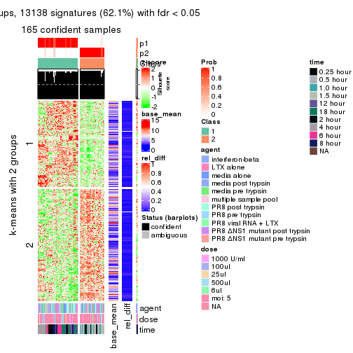</p>

</div>
<div id='tab-MAD-pam-get-signatures-2'>
<pre><code class="r">get_signatures(res, k = 3)
</code></pre>

<p></p>

</div>
<div id='tab-MAD-pam-get-signatures-3'>
<pre><code class="r">get_signatures(res, k = 4)
</code></pre>

<pre><code>#&gt; Error in mat[ceiling(1:nr/h_ratio), ceiling(1:nc/w_ratio), drop = FALSE]: subscript out of bounds
</code></pre>

<p></p>

</div>
<div id='tab-MAD-pam-get-signatures-4'>
<pre><code class="r">get_signatures(res, k = 5)
</code></pre>

<p></p>

</div>
<div id='tab-MAD-pam-get-signatures-5'>
<pre><code class="r">get_signatures(res, k = 6)
</code></pre>

<p></p>

</div>
</div>


Signature heatmaps where rows are not scaled:


<script>
$( function() {
	$( '#tabs-MAD-pam-get-signatures-no-scale' ).tabs();
} );
</script>
<div id='tabs-MAD-pam-get-signatures-no-scale'>
<ul>
<li><a href='#tab-MAD-pam-get-signatures-no-scale-1'>k = 2</a></li>
<li><a href='#tab-MAD-pam-get-signatures-no-scale-2'>k = 3</a></li>
<li><a href='#tab-MAD-pam-get-signatures-no-scale-3'>k = 4</a></li>
<li><a href='#tab-MAD-pam-get-signatures-no-scale-4'>k = 5</a></li>
<li><a href='#tab-MAD-pam-get-signatures-no-scale-5'>k = 6</a></li>
</ul>
<div id='tab-MAD-pam-get-signatures-no-scale-1'>
<pre><code class="r">get_signatures(res, k = 2, scale_rows = FALSE)
</code></pre>

<p></p>

</div>
<div id='tab-MAD-pam-get-signatures-no-scale-2'>
<pre><code class="r">get_signatures(res, k = 3, scale_rows = FALSE)
</code></pre>

<p></p>

</div>
<div id='tab-MAD-pam-get-signatures-no-scale-3'>
<pre><code class="r">get_signatures(res, k = 4, scale_rows = FALSE)
</code></pre>

<pre><code>#&gt; Error in mat[ceiling(1:nr/h_ratio), ceiling(1:nc/w_ratio), drop = FALSE]: subscript out of bounds
</code></pre>

<p></p>

</div>
<div id='tab-MAD-pam-get-signatures-no-scale-4'>
<pre><code class="r">get_signatures(res, k = 5, scale_rows = FALSE)
</code></pre>

<p></p>

</div>
<div id='tab-MAD-pam-get-signatures-no-scale-5'>
<pre><code class="r">get_signatures(res, k = 6, scale_rows = FALSE)
</code></pre>

<p></p>

</div>
</div>


Compare the overlap of signatures from different k:

```r
compare_signatures(res)
```


`get_signature()` returns a data frame invisibly. TO get the list of signatures, the function
call should be assigned to a variable explicitly. In following code, if `plot` argument is set
to `FALSE`, no heatmap is plotted while only the differential analysis is performed.

```r
# code only for demonstration
tb = get_signature(res, k = ..., plot = FALSE)
```

An example of the output of `tb` is:

```
#>   which_row         fdr    mean_1    mean_2 scaled_mean_1 scaled_mean_2 km
#> 1        38 0.042760348  8.373488  9.131774    -0.5533452     0.5164555  1
#> 2        40 0.018707592  7.106213  8.469186    -0.6173731     0.5762149  1
#> 3        55 0.019134737 10.221463 11.207825    -0.6159697     0.5749050  1
#> 4        59 0.006059896  5.921854  7.869574    -0.6899429     0.6439467  1
#> 5        60 0.018055526  8.928898 10.211722    -0.6204761     0.5791110  1
#> 6        98 0.009384629 15.714769 14.887706     0.6635654    -0.6193277  2
...
```

The columns in `tb` are:

1. `which_row`: row indices corresponding to the input matrix.
2. `fdr`: FDR for the differential test. 
3. `mean_x`: The mean value in group x.
4. `scaled_mean_x`: The mean value in group x after rows are scaled.
5. `km`: Row groups if k-means clustering is applied to rows.


UMAP plot which shows how samples are separated.


<script>
$( function() {
	$( '#tabs-MAD-pam-dimension-reduction' ).tabs();
} );
</script>
<div id='tabs-MAD-pam-dimension-reduction'>
<ul>
<li><a href='#tab-MAD-pam-dimension-reduction-1'>k = 2</a></li>
<li><a href='#tab-MAD-pam-dimension-reduction-2'>k = 3</a></li>
<li><a href='#tab-MAD-pam-dimension-reduction-3'>k = 4</a></li>
<li><a href='#tab-MAD-pam-dimension-reduction-4'>k = 5</a></li>
<li><a href='#tab-MAD-pam-dimension-reduction-5'>k = 6</a></li>
</ul>
<div id='tab-MAD-pam-dimension-reduction-1'>
<pre><code class="r">dimension_reduction(res, k = 2, method = &quot;UMAP&quot;)
</code></pre>

<p></p>

</div>
<div id='tab-MAD-pam-dimension-reduction-2'>
<pre><code class="r">dimension_reduction(res, k = 3, method = &quot;UMAP&quot;)
</code></pre>

<p></p>

</div>
<div id='tab-MAD-pam-dimension-reduction-3'>
<pre><code class="r">dimension_reduction(res, k = 4, method = &quot;UMAP&quot;)
</code></pre>

<p></p>

</div>
<div id='tab-MAD-pam-dimension-reduction-4'>
<pre><code class="r">dimension_reduction(res, k = 5, method = &quot;UMAP&quot;)
</code></pre>

<p></p>

</div>
<div id='tab-MAD-pam-dimension-reduction-5'>
<pre><code class="r">dimension_reduction(res, k = 6, method = &quot;UMAP&quot;)
</code></pre>

<p></p>

</div>
</div>


Following heatmap shows how subgroups are split when increasing `k`:

```r
collect_classes(res)
```


Test correlation between subgroups and known annotations. If the known
annotation is numeric, one-way ANOVA test is applied, and if the known
annotation is discrete, chi-squared contingency table test is applied.

```r
test_to_known_factors(res)
```

```
#>           n agent(p) dose(p)  time(p) k
#> MAD:pam 165  0.89030  0.9912 6.56e-28 2
#> MAD:pam 165  0.37577  0.9991 3.99e-41 3
#> MAD:pam 168  0.50446  0.9028 5.13e-60 4
#> MAD:pam 154  0.00496  0.0776 1.00e-67 5
#> MAD:pam 119  0.00186  0.0480 4.75e-35 6
```


If matrix rows can be associated to genes, consider to use `GO_Enrichment(res,
...)` to perform function enrichment for the signature genes.


 

---------------------------------------------------


### MAD:mclust


The object with results only for a single top-value method and a single partition method 
can be extracted as:

```r
res = res_list["MAD", "mclust"]
# you can also extract it by
# res = res_list["MAD:mclust"]
```

A summary of `res` and all the functions that can be applied to it:

```r
res
```

```
#> A 'ConsensusPartition' object with k = 2, 3, 4, 5, 6.
#>   On a matrix with 21163 rows and 169 columns.
#>   Top rows (1000, 2000, 3000, 4000, 5000) are extracted by 'MAD' method.
#>   Subgroups are detected by 'mclust' method.
#>   Performed in total 1250 partitions by row resampling.
#>   Best k for subgroups seems to be 2.
#> 
#> Following methods can be applied to this 'ConsensusPartition' object:
#>  [1] "cola_report"             "collect_classes"         "collect_plots"          
#>  [4] "collect_stats"           "colnames"                "compare_signatures"     
#>  [7] "consensus_heatmap"       "dimension_reduction"     "functional_enrichment"  
#> [10] "get_anno_col"            "get_anno"                "get_classes"            
#> [13] "get_consensus"           "get_matrix"              "get_membership"         
#> [16] "get_param"               "get_signatures"          "get_stats"              
#> [19] "is_best_k"               "is_stable_k"             "membership_heatmap"     
#> [22] "ncol"                    "nrow"                    "plot_ecdf"              
#> [25] "rownames"                "select_partition_number" "show"                   
#> [28] "suggest_best_k"          "test_to_known_factors"
```

`collect_plots()` function collects all the plots made from `res` for all `k` (number of partitions)
into one single page to provide an easy and fast comparison between different `k`.

```r
collect_plots(res)
```


The plots are:

- The first row: a plot of the ECDF (Empirical cumulative distribution
  function) curves of the consensus matrix for each `k` and the heatmap of
  predicted classes for each `k`.
- The second row: heatmaps of the consensus matrix for each `k`.
- The third row: heatmaps of the membership matrix for each `k`.
- The fouth row: heatmaps of the signatures for each `k`.

All the plots in panels can be made by individual functions and they are
plotted later in this section.

`select_partition_number()` produces several plots showing different
statistics for choosing "optimized" `k`. There are following statistics:

- ECDF curves of the consensus matrix for each `k`;
- 1-PAC. [The PAC
  score](https://en.wikipedia.org/wiki/Consensus_clustering#Over-interpretation_potential_of_consensus_clustering)
  measures the proportion of the ambiguous subgrouping.
- Mean silhouette score.
- Concordance. The mean probability of fiting the consensus class ids in all
  partitions.
- Area increased. Denote $A_k$ as the area under the ECDF curve for current
  `k`, the area increased is defined as $A_k - A_{k-1}$.
- Rand index. The percent of pairs of samples that are both in a same cluster
  or both are not in a same cluster in the partition of k and k-1.
- Jaccard index. The ratio of pairs of samples are both in a same cluster in
  the partition of k and k-1 and the pairs of samples are both in a same
  cluster in the partition k or k-1.

The detailed explanations of these statistics can be found in [the cola
vignette](http://bioconductor.org/packages/devel/bioc/vignettes/cola/inst/doc/cola.html#toc_13).

Generally speaking, lower PAC score, higher mean silhouette score or higher
concordance corresponds to better partition. Rand index and Jaccard index
measure how similar the current partition is compared to partition with `k-1`.
If they are too similar, we won't accept `k` is better than `k-1`.

```r
select_partition_number(res)
```


The numeric values for all these statistics can be obtained by `get_stats()`.

```r
get_stats(res)
```

```
#>   k 1-PAC mean_silhouette concordance area_increased  Rand Jaccard
#> 2 2 0.896           0.966       0.984         0.4766 0.530   0.530
#> 3 3 0.671           0.865       0.911         0.2840 0.879   0.771
#> 4 4 0.720           0.786       0.878         0.1149 0.927   0.822
#> 5 5 0.685           0.703       0.796         0.0928 0.923   0.779
#> 6 6 0.713           0.595       0.800         0.0599 0.898   0.654
```

`suggest_best_k()` suggests the best $k$ based on these statistics. The rules are as follows:

- All $k$ with Jaccard index larger than 0.95 are removed because the increase of
  the partition number does not provides enough extra information. If all $k$ are removed,
  the best $k$ is assigned by `NA`.
- For $k$ with 1-PAC larger than 0.9, the maximal $k$ is taken as the "best k". Other $k$ is called "optional k".
- If it does not fit the second rule. The $k$ with the highest vote of highest
  1-PAC, mean silhouette and concordance is taken as the "best k".

```r
suggest_best_k(res)
```

```
#> [1] 2
```


Following shows the table of the partitions (You need to click the **show/hide
code output** link to see it). The membership matrix (columns with name `p*`)
is inferred by
[`clue::cl_consensus()`](https://www.rdocumentation.org/link/cl_consensus?package=clue)
function with the `SE` method. Basically the value in the membership matrix
represents the probability to belong to a certain group. The finall class
label for an item is determined with the group with highest probability it
belongs to.

In `get_classes()` function, the entropy is calculated from the membership
matrix and the silhouette score is calculated from the consensus matrix.


<script>
$( function() {
	$( '#tabs-MAD-mclust-get-classes' ).tabs();
} );
</script>
<div id='tabs-MAD-mclust-get-classes'>
<ul>
<li><a href='#tab-MAD-mclust-get-classes-1'>k = 2</a></li>
<li><a href='#tab-MAD-mclust-get-classes-2'>k = 3</a></li>
<li><a href='#tab-MAD-mclust-get-classes-3'>k = 4</a></li>
<li><a href='#tab-MAD-mclust-get-classes-4'>k = 5</a></li>
<li><a href='#tab-MAD-mclust-get-classes-5'>k = 6</a></li>
</ul>

<div id='tab-MAD-mclust-get-classes-1'>
<p><a id='tab-MAD-mclust-get-classes-1-a' style='color:#0366d6' href='#'>show/hide code output</a></p>
<pre><code class="r">cbind(get_classes(res, k = 2), get_membership(res, k = 2))
</code></pre>

<pre><code>#&gt;           class entropy silhouette    p1    p2
#&gt; GSM528681     2  0.0000      0.999 0.000 1.000
#&gt; GSM528682     2  0.0000      0.999 0.000 1.000
#&gt; GSM528683     2  0.0000      0.999 0.000 1.000
#&gt; GSM528684     2  0.0000      0.999 0.000 1.000
#&gt; GSM528687     2  0.0000      0.999 0.000 1.000
#&gt; GSM528688     2  0.0000      0.999 0.000 1.000
#&gt; GSM528685     2  0.0376      0.996 0.004 0.996
#&gt; GSM528686     2  0.0376      0.996 0.004 0.996
#&gt; GSM528693     1  0.6623      0.812 0.828 0.172
#&gt; GSM528694     1  0.6623      0.812 0.828 0.172
#&gt; GSM528695     1  0.0376      0.972 0.996 0.004
#&gt; GSM528696     1  0.0376      0.972 0.996 0.004
#&gt; GSM528697     1  0.0000      0.974 1.000 0.000
#&gt; GSM528698     1  0.0000      0.974 1.000 0.000
#&gt; GSM528699     1  0.0000      0.974 1.000 0.000
#&gt; GSM528700     1  0.0000      0.974 1.000 0.000
#&gt; GSM528689     1  0.0000      0.974 1.000 0.000
#&gt; GSM528690     1  0.0000      0.974 1.000 0.000
#&gt; GSM528691     1  0.0000      0.974 1.000 0.000
#&gt; GSM528692     1  0.0000      0.974 1.000 0.000
#&gt; GSM528779     2  0.0000      0.999 0.000 1.000
#&gt; GSM528780     2  0.0000      0.999 0.000 1.000
#&gt; GSM528782     2  0.0000      0.999 0.000 1.000
#&gt; GSM528781     2  0.0000      0.999 0.000 1.000
#&gt; GSM528785     1  0.6623      0.812 0.828 0.172
#&gt; GSM528786     1  0.0376      0.972 0.996 0.004
#&gt; GSM528787     1  0.0000      0.974 1.000 0.000
#&gt; GSM528788     1  0.0000      0.974 1.000 0.000
#&gt; GSM528783     1  0.0000      0.974 1.000 0.000
#&gt; GSM528784     1  0.0000      0.974 1.000 0.000
#&gt; GSM528759     1  0.0000      0.974 1.000 0.000
#&gt; GSM528760     1  0.0000      0.974 1.000 0.000
#&gt; GSM528761     2  0.0000      0.999 0.000 1.000
#&gt; GSM528762     2  0.0000      0.999 0.000 1.000
#&gt; GSM528765     2  0.0000      0.999 0.000 1.000
#&gt; GSM528766     2  0.0000      0.999 0.000 1.000
#&gt; GSM528763     2  0.0376      0.996 0.004 0.996
#&gt; GSM528764     2  0.0376      0.996 0.004 0.996
#&gt; GSM528771     1  0.6623      0.812 0.828 0.172
#&gt; GSM528772     1  0.6623      0.812 0.828 0.172
#&gt; GSM528773     1  0.0376      0.972 0.996 0.004
#&gt; GSM528774     1  0.0376      0.972 0.996 0.004
#&gt; GSM528775     1  0.0000      0.974 1.000 0.000
#&gt; GSM528776     1  0.0000      0.974 1.000 0.000
#&gt; GSM528777     1  0.0000      0.974 1.000 0.000
#&gt; GSM528778     1  0.0000      0.974 1.000 0.000
#&gt; GSM528767     1  0.0000      0.974 1.000 0.000
#&gt; GSM528768     1  0.0000      0.974 1.000 0.000
#&gt; GSM528769     1  0.0000      0.974 1.000 0.000
#&gt; GSM528770     1  0.0000      0.974 1.000 0.000
#&gt; GSM528671     2  0.0000      0.999 0.000 1.000
#&gt; GSM528672     2  0.0000      0.999 0.000 1.000
#&gt; GSM528674     2  0.0000      0.999 0.000 1.000
#&gt; GSM528673     2  0.0376      0.996 0.004 0.996
#&gt; GSM528677     1  0.6623      0.812 0.828 0.172
#&gt; GSM528678     1  0.0376      0.972 0.996 0.004
#&gt; GSM528679     1  0.0000      0.974 1.000 0.000
#&gt; GSM528680     1  0.0000      0.974 1.000 0.000
#&gt; GSM528675     1  0.0000      0.974 1.000 0.000
#&gt; GSM528676     1  0.0000      0.974 1.000 0.000
#&gt; GSM528651     2  0.0000      0.999 0.000 1.000
#&gt; GSM528652     2  0.0000      0.999 0.000 1.000
#&gt; GSM528653     2  0.0000      0.999 0.000 1.000
#&gt; GSM528654     2  0.0000      0.999 0.000 1.000
#&gt; GSM528657     2  0.0000      0.999 0.000 1.000
#&gt; GSM528658     2  0.0000      0.999 0.000 1.000
#&gt; GSM528655     2  0.0376      0.996 0.004 0.996
#&gt; GSM528656     2  0.0376      0.996 0.004 0.996
#&gt; GSM528663     1  0.8327      0.678 0.736 0.264
#&gt; GSM528664     1  0.8327      0.678 0.736 0.264
#&gt; GSM528665     1  0.0376      0.972 0.996 0.004
#&gt; GSM528666     1  0.0376      0.972 0.996 0.004
#&gt; GSM528667     1  0.0000      0.974 1.000 0.000
#&gt; GSM528668     1  0.0000      0.974 1.000 0.000
#&gt; GSM528669     1  0.0000      0.974 1.000 0.000
#&gt; GSM528670     1  0.0000      0.974 1.000 0.000
#&gt; GSM528659     1  0.0000      0.974 1.000 0.000
#&gt; GSM528660     1  0.0000      0.974 1.000 0.000
#&gt; GSM528661     1  0.0000      0.974 1.000 0.000
#&gt; GSM528662     1  0.0000      0.974 1.000 0.000
#&gt; GSM528701     2  0.0000      0.999 0.000 1.000
#&gt; GSM528702     2  0.0000      0.999 0.000 1.000
#&gt; GSM528703     2  0.0000      0.999 0.000 1.000
#&gt; GSM528704     2  0.0000      0.999 0.000 1.000
#&gt; GSM528707     2  0.0000      0.999 0.000 1.000
#&gt; GSM528708     2  0.0000      0.999 0.000 1.000
#&gt; GSM528705     2  0.0000      0.999 0.000 1.000
#&gt; GSM528706     2  0.0000      0.999 0.000 1.000
#&gt; GSM528713     1  0.6623      0.812 0.828 0.172
#&gt; GSM528714     1  0.6712      0.807 0.824 0.176
#&gt; GSM528715     1  0.0376      0.972 0.996 0.004
#&gt; GSM528716     1  0.0376      0.972 0.996 0.004
#&gt; GSM528717     1  0.0000      0.974 1.000 0.000
#&gt; GSM528718     1  0.0000      0.974 1.000 0.000
#&gt; GSM528719     1  0.0000      0.974 1.000 0.000
#&gt; GSM528720     1  0.0000      0.974 1.000 0.000
#&gt; GSM528709     1  0.0000      0.974 1.000 0.000
#&gt; GSM528710     1  0.0000      0.974 1.000 0.000
#&gt; GSM528711     1  0.0000      0.974 1.000 0.000
#&gt; GSM528712     1  0.0000      0.974 1.000 0.000
#&gt; GSM528721     2  0.0000      0.999 0.000 1.000
#&gt; GSM528722     2  0.0000      0.999 0.000 1.000
#&gt; GSM528723     2  0.0000      0.999 0.000 1.000
#&gt; GSM528724     2  0.0000      0.999 0.000 1.000
#&gt; GSM528727     2  0.0000      0.999 0.000 1.000
#&gt; GSM528728     2  0.0000      0.999 0.000 1.000
#&gt; GSM528725     2  0.0000      0.999 0.000 1.000
#&gt; GSM528726     2  0.0000      0.999 0.000 1.000
#&gt; GSM528733     1  0.0376      0.972 0.996 0.004
#&gt; GSM528734     1  0.0376      0.972 0.996 0.004
#&gt; GSM528735     1  0.0000      0.974 1.000 0.000
#&gt; GSM528736     1  0.0000      0.974 1.000 0.000
#&gt; GSM528737     1  0.0000      0.974 1.000 0.000
#&gt; GSM528738     1  0.0000      0.974 1.000 0.000
#&gt; GSM528729     1  0.0000      0.974 1.000 0.000
#&gt; GSM528730     1  0.0000      0.974 1.000 0.000
#&gt; GSM528731     1  0.0000      0.974 1.000 0.000
#&gt; GSM528732     1  0.0000      0.974 1.000 0.000
#&gt; GSM528739     2  0.0000      0.999 0.000 1.000
#&gt; GSM528740     2  0.0000      0.999 0.000 1.000
#&gt; GSM528741     2  0.0000      0.999 0.000 1.000
#&gt; GSM528742     2  0.0000      0.999 0.000 1.000
#&gt; GSM528745     2  0.0000      0.999 0.000 1.000
#&gt; GSM528746     2  0.0000      0.999 0.000 1.000
#&gt; GSM528743     2  0.0000      0.999 0.000 1.000
#&gt; GSM528744     2  0.0000      0.999 0.000 1.000
#&gt; GSM528751     1  0.6623      0.812 0.828 0.172
#&gt; GSM528752     1  0.6623      0.812 0.828 0.172
#&gt; GSM528753     1  0.0376      0.972 0.996 0.004
#&gt; GSM528754     1  0.0376      0.972 0.996 0.004
#&gt; GSM528755     1  0.0000      0.974 1.000 0.000
#&gt; GSM528756     1  0.0000      0.974 1.000 0.000
#&gt; GSM528757     1  0.0000      0.974 1.000 0.000
#&gt; GSM528758     1  0.0000      0.974 1.000 0.000
#&gt; GSM528747     1  0.0000      0.974 1.000 0.000
#&gt; GSM528748     1  0.0000      0.974 1.000 0.000
#&gt; GSM528749     1  0.0000      0.974 1.000 0.000
#&gt; GSM528750     1  0.0000      0.974 1.000 0.000
#&gt; GSM528640     2  0.0000      0.999 0.000 1.000
#&gt; GSM528641     2  0.0376      0.996 0.004 0.996
#&gt; GSM528643     1  0.0376      0.972 0.996 0.004
#&gt; GSM528644     1  0.0000      0.974 1.000 0.000
#&gt; GSM528642     1  0.0000      0.974 1.000 0.000
#&gt; GSM528620     2  0.0000      0.999 0.000 1.000
#&gt; GSM528621     1  0.9661      0.412 0.608 0.392
#&gt; GSM528623     1  0.0376      0.972 0.996 0.004
#&gt; GSM528624     1  0.0000      0.974 1.000 0.000
#&gt; GSM528622     1  0.0000      0.974 1.000 0.000
#&gt; GSM528625     2  0.0000      0.999 0.000 1.000
#&gt; GSM528626     2  0.0376      0.996 0.004 0.996
#&gt; GSM528628     1  0.0376      0.972 0.996 0.004
#&gt; GSM528629     1  0.0000      0.974 1.000 0.000
#&gt; GSM528627     1  0.0000      0.974 1.000 0.000
#&gt; GSM528630     2  0.0000      0.999 0.000 1.000
#&gt; GSM528631     2  0.0000      0.999 0.000 1.000
#&gt; GSM528632     2  0.0376      0.996 0.004 0.996
#&gt; GSM528633     2  0.0376      0.996 0.004 0.996
#&gt; GSM528636     1  0.0376      0.972 0.996 0.004
#&gt; GSM528637     1  0.0376      0.972 0.996 0.004
#&gt; GSM528638     1  0.0000      0.974 1.000 0.000
#&gt; GSM528639     1  0.0000      0.974 1.000 0.000
#&gt; GSM528634     1  0.0000      0.974 1.000 0.000
#&gt; GSM528635     1  0.0000      0.974 1.000 0.000
#&gt; GSM528645     1  0.0376      0.972 0.996 0.004
#&gt; GSM528646     1  0.0376      0.972 0.996 0.004
#&gt; GSM528647     1  0.0376      0.972 0.996 0.004
#&gt; GSM528648     1  0.0000      0.974 1.000 0.000
#&gt; GSM528649     1  0.0000      0.974 1.000 0.000
#&gt; GSM528650     1  0.0000      0.974 1.000 0.000
</code></pre>

<script>
$('#tab-MAD-mclust-get-classes-1-a').parent().next().next().hide();
$('#tab-MAD-mclust-get-classes-1-a').click(function(){
  $('#tab-MAD-mclust-get-classes-1-a').parent().next().next().toggle();
  return(false);
});
</script>
</div>

<div id='tab-MAD-mclust-get-classes-2'>
<p><a id='tab-MAD-mclust-get-classes-2-a' style='color:#0366d6' href='#'>show/hide code output</a></p>
<pre><code class="r">cbind(get_classes(res, k = 3), get_membership(res, k = 3))
</code></pre>

<pre><code>#&gt;           class entropy silhouette    p1    p2    p3
#&gt; GSM528681     2  0.0000      0.925 0.000 1.000 0.000
#&gt; GSM528682     2  0.0000      0.925 0.000 1.000 0.000
#&gt; GSM528683     2  0.0000      0.925 0.000 1.000 0.000
#&gt; GSM528684     2  0.0000      0.925 0.000 1.000 0.000
#&gt; GSM528687     2  0.0000      0.925 0.000 1.000 0.000
#&gt; GSM528688     2  0.0000      0.925 0.000 1.000 0.000
#&gt; GSM528685     2  0.5363      0.764 0.000 0.724 0.276
#&gt; GSM528686     2  0.5397      0.759 0.000 0.720 0.280
#&gt; GSM528693     1  0.7308      0.605 0.656 0.060 0.284
#&gt; GSM528694     1  0.6491      0.710 0.732 0.052 0.216
#&gt; GSM528695     3  0.4796      0.830 0.220 0.000 0.780
#&gt; GSM528696     3  0.4796      0.830 0.220 0.000 0.780
#&gt; GSM528697     1  0.0747      0.899 0.984 0.000 0.016
#&gt; GSM528698     1  0.0000      0.901 1.000 0.000 0.000
#&gt; GSM528699     1  0.1289      0.892 0.968 0.000 0.032
#&gt; GSM528700     1  0.0000      0.901 1.000 0.000 0.000
#&gt; GSM528689     1  0.0000      0.901 1.000 0.000 0.000
#&gt; GSM528690     1  0.0747      0.899 0.984 0.000 0.016
#&gt; GSM528691     1  0.0000      0.901 1.000 0.000 0.000
#&gt; GSM528692     1  0.0892      0.897 0.980 0.000 0.020
#&gt; GSM528779     2  0.0747      0.921 0.000 0.984 0.016
#&gt; GSM528780     2  0.0000      0.925 0.000 1.000 0.000
#&gt; GSM528782     2  0.0000      0.925 0.000 1.000 0.000
#&gt; GSM528781     2  0.5178      0.781 0.000 0.744 0.256
#&gt; GSM528785     1  0.8007      0.581 0.640 0.116 0.244
#&gt; GSM528786     3  0.1860      0.906 0.052 0.000 0.948
#&gt; GSM528787     1  0.4555      0.774 0.800 0.000 0.200
#&gt; GSM528788     1  0.0747      0.899 0.984 0.000 0.016
#&gt; GSM528783     1  0.0747      0.899 0.984 0.000 0.016
#&gt; GSM528784     1  0.0747      0.899 0.984 0.000 0.016
#&gt; GSM528759     1  0.4555      0.755 0.800 0.000 0.200
#&gt; GSM528760     1  0.4291      0.778 0.820 0.000 0.180
#&gt; GSM528761     2  0.1411      0.915 0.000 0.964 0.036
#&gt; GSM528762     2  0.0000      0.925 0.000 1.000 0.000
#&gt; GSM528765     2  0.1964      0.907 0.000 0.944 0.056
#&gt; GSM528766     2  0.0000      0.925 0.000 1.000 0.000
#&gt; GSM528763     2  0.4931      0.800 0.000 0.768 0.232
#&gt; GSM528764     2  0.5404      0.776 0.004 0.740 0.256
#&gt; GSM528771     1  0.8007      0.581 0.640 0.116 0.244
#&gt; GSM528772     1  0.8007      0.581 0.640 0.116 0.244
#&gt; GSM528773     3  0.3038      0.957 0.104 0.000 0.896
#&gt; GSM528774     3  0.3340      0.965 0.120 0.000 0.880
#&gt; GSM528775     1  0.3752      0.813 0.856 0.000 0.144
#&gt; GSM528776     1  0.0000      0.901 1.000 0.000 0.000
#&gt; GSM528777     1  0.0747      0.899 0.984 0.000 0.016
#&gt; GSM528778     1  0.0747      0.899 0.984 0.000 0.016
#&gt; GSM528767     1  0.0747      0.899 0.984 0.000 0.016
#&gt; GSM528768     1  0.0747      0.899 0.984 0.000 0.016
#&gt; GSM528769     1  0.0747      0.899 0.984 0.000 0.016
#&gt; GSM528770     1  0.0747      0.899 0.984 0.000 0.016
#&gt; GSM528671     2  0.3551      0.868 0.000 0.868 0.132
#&gt; GSM528672     2  0.0000      0.925 0.000 1.000 0.000
#&gt; GSM528674     2  0.0000      0.925 0.000 1.000 0.000
#&gt; GSM528673     2  0.5397      0.759 0.000 0.720 0.280
#&gt; GSM528677     1  0.8007      0.581 0.640 0.116 0.244
#&gt; GSM528678     1  0.5858      0.716 0.740 0.020 0.240
#&gt; GSM528679     1  0.0424      0.900 0.992 0.000 0.008
#&gt; GSM528680     1  0.0000      0.901 1.000 0.000 0.000
#&gt; GSM528675     1  0.1031      0.898 0.976 0.000 0.024
#&gt; GSM528676     1  0.1529      0.894 0.960 0.000 0.040
#&gt; GSM528651     2  0.4887      0.801 0.000 0.772 0.228
#&gt; GSM528652     2  0.4796      0.806 0.000 0.780 0.220
#&gt; GSM528653     2  0.0000      0.925 0.000 1.000 0.000
#&gt; GSM528654     2  0.0000      0.925 0.000 1.000 0.000
#&gt; GSM528657     2  0.1643      0.912 0.000 0.956 0.044
#&gt; GSM528658     2  0.0000      0.925 0.000 1.000 0.000
#&gt; GSM528655     2  0.5397      0.759 0.000 0.720 0.280
#&gt; GSM528656     2  0.5397      0.759 0.000 0.720 0.280
#&gt; GSM528663     1  0.8153      0.571 0.640 0.144 0.216
#&gt; GSM528664     1  0.8167      0.569 0.640 0.148 0.212
#&gt; GSM528665     3  0.3267      0.969 0.116 0.000 0.884
#&gt; GSM528666     3  0.3267      0.969 0.116 0.000 0.884
#&gt; GSM528667     1  0.0000      0.901 1.000 0.000 0.000
#&gt; GSM528668     1  0.0000      0.901 1.000 0.000 0.000
#&gt; GSM528669     1  0.0747      0.899 0.984 0.000 0.016
#&gt; GSM528670     1  0.0747      0.899 0.984 0.000 0.016
#&gt; GSM528659     1  0.0747      0.899 0.984 0.000 0.016
#&gt; GSM528660     1  0.0747      0.899 0.984 0.000 0.016
#&gt; GSM528661     1  0.1529      0.894 0.960 0.000 0.040
#&gt; GSM528662     1  0.1163      0.894 0.972 0.000 0.028
#&gt; GSM528701     2  0.0000      0.925 0.000 1.000 0.000
#&gt; GSM528702     2  0.0000      0.925 0.000 1.000 0.000
#&gt; GSM528703     2  0.0000      0.925 0.000 1.000 0.000
#&gt; GSM528704     2  0.0000      0.925 0.000 1.000 0.000
#&gt; GSM528707     2  0.0000      0.925 0.000 1.000 0.000
#&gt; GSM528708     2  0.0000      0.925 0.000 1.000 0.000
#&gt; GSM528705     2  0.0000      0.925 0.000 1.000 0.000
#&gt; GSM528706     2  0.0000      0.925 0.000 1.000 0.000
#&gt; GSM528713     1  0.8007      0.581 0.640 0.116 0.244
#&gt; GSM528714     1  0.8007      0.581 0.640 0.116 0.244
#&gt; GSM528715     3  0.3267      0.969 0.116 0.000 0.884
#&gt; GSM528716     3  0.3267      0.969 0.116 0.000 0.884
#&gt; GSM528717     1  0.0000      0.901 1.000 0.000 0.000
#&gt; GSM528718     1  0.1163      0.893 0.972 0.000 0.028
#&gt; GSM528719     1  0.0747      0.898 0.984 0.000 0.016
#&gt; GSM528720     1  0.0000      0.901 1.000 0.000 0.000
#&gt; GSM528709     1  0.0000      0.901 1.000 0.000 0.000
#&gt; GSM528710     1  0.0747      0.899 0.984 0.000 0.016
#&gt; GSM528711     1  0.0000      0.901 1.000 0.000 0.000
#&gt; GSM528712     1  0.1163      0.893 0.972 0.000 0.028
#&gt; GSM528721     2  0.0000      0.925 0.000 1.000 0.000
#&gt; GSM528722     2  0.0000      0.925 0.000 1.000 0.000
#&gt; GSM528723     2  0.0000      0.925 0.000 1.000 0.000
#&gt; GSM528724     2  0.0000      0.925 0.000 1.000 0.000
#&gt; GSM528727     2  0.1860      0.909 0.000 0.948 0.052
#&gt; GSM528728     2  0.0000      0.925 0.000 1.000 0.000
#&gt; GSM528725     2  0.0000      0.925 0.000 1.000 0.000
#&gt; GSM528726     2  0.0892      0.920 0.000 0.980 0.020
#&gt; GSM528733     3  0.3267      0.969 0.116 0.000 0.884
#&gt; GSM528734     3  0.3267      0.969 0.116 0.000 0.884
#&gt; GSM528735     1  0.1163      0.893 0.972 0.000 0.028
#&gt; GSM528736     1  0.1163      0.893 0.972 0.000 0.028
#&gt; GSM528737     1  0.0000      0.901 1.000 0.000 0.000
#&gt; GSM528738     1  0.0000      0.901 1.000 0.000 0.000
#&gt; GSM528729     1  0.0747      0.899 0.984 0.000 0.016
#&gt; GSM528730     1  0.0747      0.899 0.984 0.000 0.016
#&gt; GSM528731     1  0.0747      0.899 0.984 0.000 0.016
#&gt; GSM528732     1  0.0000      0.901 1.000 0.000 0.000
#&gt; GSM528739     2  0.0000      0.925 0.000 1.000 0.000
#&gt; GSM528740     2  0.0000      0.925 0.000 1.000 0.000
#&gt; GSM528741     2  0.0237      0.924 0.000 0.996 0.004
#&gt; GSM528742     2  0.0000      0.925 0.000 1.000 0.000
#&gt; GSM528745     2  0.4796      0.807 0.000 0.780 0.220
#&gt; GSM528746     2  0.0000      0.925 0.000 1.000 0.000
#&gt; GSM528743     2  0.1964      0.907 0.000 0.944 0.056
#&gt; GSM528744     2  0.1964      0.907 0.000 0.944 0.056
#&gt; GSM528751     1  0.8007      0.581 0.640 0.116 0.244
#&gt; GSM528752     1  0.8007      0.581 0.640 0.116 0.244
#&gt; GSM528753     3  0.3267      0.969 0.116 0.000 0.884
#&gt; GSM528754     3  0.3267      0.969 0.116 0.000 0.884
#&gt; GSM528755     1  0.1964      0.880 0.944 0.000 0.056
#&gt; GSM528756     1  0.2356      0.870 0.928 0.000 0.072
#&gt; GSM528757     1  0.0747      0.899 0.984 0.000 0.016
#&gt; GSM528758     1  0.0747      0.899 0.984 0.000 0.016
#&gt; GSM528747     1  0.0237      0.901 0.996 0.000 0.004
#&gt; GSM528748     1  0.1860      0.883 0.948 0.000 0.052
#&gt; GSM528749     1  0.0237      0.901 0.996 0.000 0.004
#&gt; GSM528750     1  0.0747      0.899 0.984 0.000 0.016
#&gt; GSM528640     2  0.0000      0.925 0.000 1.000 0.000
#&gt; GSM528641     2  0.5397      0.759 0.000 0.720 0.280
#&gt; GSM528643     3  0.3267      0.969 0.116 0.000 0.884
#&gt; GSM528644     1  0.2066      0.878 0.940 0.000 0.060
#&gt; GSM528642     1  0.4002      0.799 0.840 0.000 0.160
#&gt; GSM528620     2  0.1964      0.907 0.000 0.944 0.056
#&gt; GSM528621     1  0.8212      0.551 0.640 0.192 0.168
#&gt; GSM528623     3  0.3267      0.969 0.116 0.000 0.884
#&gt; GSM528624     1  0.0747      0.899 0.984 0.000 0.016
#&gt; GSM528622     1  0.0000      0.901 1.000 0.000 0.000
#&gt; GSM528625     2  0.0000      0.925 0.000 1.000 0.000
#&gt; GSM528626     2  0.5397      0.759 0.000 0.720 0.280
#&gt; GSM528628     3  0.3267      0.969 0.116 0.000 0.884
#&gt; GSM528629     1  0.0592      0.899 0.988 0.000 0.012
#&gt; GSM528627     1  0.1031      0.895 0.976 0.000 0.024
#&gt; GSM528630     2  0.1964      0.907 0.000 0.944 0.056
#&gt; GSM528631     2  0.5327      0.768 0.000 0.728 0.272
#&gt; GSM528632     2  0.6313      0.695 0.016 0.676 0.308
#&gt; GSM528633     2  0.6019      0.732 0.012 0.700 0.288
#&gt; GSM528636     3  0.3267      0.969 0.116 0.000 0.884
#&gt; GSM528637     3  0.3267      0.969 0.116 0.000 0.884
#&gt; GSM528638     1  0.0747      0.899 0.984 0.000 0.016
#&gt; GSM528639     1  0.1529      0.889 0.960 0.000 0.040
#&gt; GSM528634     1  0.1964      0.880 0.944 0.000 0.056
#&gt; GSM528635     1  0.0000      0.901 1.000 0.000 0.000
#&gt; GSM528645     3  0.1860      0.906 0.052 0.000 0.948
#&gt; GSM528646     3  0.1860      0.906 0.052 0.000 0.948
#&gt; GSM528647     1  0.5785      0.605 0.668 0.000 0.332
#&gt; GSM528648     1  0.4121      0.790 0.832 0.000 0.168
#&gt; GSM528649     1  0.4121      0.790 0.832 0.000 0.168
#&gt; GSM528650     1  0.3879      0.806 0.848 0.000 0.152
</code></pre>

<script>
$('#tab-MAD-mclust-get-classes-2-a').parent().next().next().hide();
$('#tab-MAD-mclust-get-classes-2-a').click(function(){
  $('#tab-MAD-mclust-get-classes-2-a').parent().next().next().toggle();
  return(false);
});
</script>
</div>

<div id='tab-MAD-mclust-get-classes-3'>
<p><a id='tab-MAD-mclust-get-classes-3-a' style='color:#0366d6' href='#'>show/hide code output</a></p>
<pre><code class="r">cbind(get_classes(res, k = 4), get_membership(res, k = 4))
</code></pre>

<pre><code>#&gt;           class entropy silhouette    p1    p2    p3    p4
#&gt; GSM528681     2  0.0000      0.852 0.000 1.000 0.000 0.000
#&gt; GSM528682     2  0.0000      0.852 0.000 1.000 0.000 0.000
#&gt; GSM528683     2  0.0000      0.852 0.000 1.000 0.000 0.000
#&gt; GSM528684     2  0.0000      0.852 0.000 1.000 0.000 0.000
#&gt; GSM528687     2  0.0000      0.852 0.000 1.000 0.000 0.000
#&gt; GSM528688     2  0.0000      0.852 0.000 1.000 0.000 0.000
#&gt; GSM528685     2  0.4977      0.487 0.000 0.540 0.000 0.460
#&gt; GSM528686     2  0.5000      0.405 0.000 0.500 0.000 0.500
#&gt; GSM528693     1  0.4898      0.295 0.584 0.000 0.000 0.416
#&gt; GSM528694     1  0.5581      0.083 0.532 0.000 0.020 0.448
#&gt; GSM528695     3  0.3668      0.716 0.188 0.000 0.808 0.004
#&gt; GSM528696     3  0.3668      0.716 0.188 0.000 0.808 0.004
#&gt; GSM528697     1  0.0336      0.896 0.992 0.000 0.000 0.008
#&gt; GSM528698     1  0.2197      0.887 0.928 0.000 0.024 0.048
#&gt; GSM528699     1  0.3688      0.762 0.792 0.000 0.000 0.208
#&gt; GSM528700     1  0.3569      0.776 0.804 0.000 0.000 0.196
#&gt; GSM528689     1  0.3444      0.791 0.816 0.000 0.000 0.184
#&gt; GSM528690     1  0.1302      0.892 0.956 0.000 0.000 0.044
#&gt; GSM528691     1  0.1970      0.889 0.932 0.000 0.008 0.060
#&gt; GSM528692     1  0.1510      0.899 0.956 0.000 0.016 0.028
#&gt; GSM528779     2  0.3444      0.798 0.000 0.816 0.000 0.184
#&gt; GSM528780     2  0.0707      0.849 0.000 0.980 0.000 0.020
#&gt; GSM528782     2  0.0000      0.852 0.000 1.000 0.000 0.000
#&gt; GSM528781     2  0.4605      0.683 0.000 0.664 0.000 0.336
#&gt; GSM528785     4  0.4543      0.527 0.324 0.000 0.000 0.676
#&gt; GSM528786     3  0.5564      0.709 0.076 0.000 0.708 0.216
#&gt; GSM528787     1  0.6724      0.429 0.612 0.000 0.164 0.224
#&gt; GSM528788     1  0.1854      0.896 0.940 0.000 0.012 0.048
#&gt; GSM528783     1  0.0937      0.897 0.976 0.000 0.012 0.012
#&gt; GSM528784     1  0.0336      0.896 0.992 0.000 0.000 0.008
#&gt; GSM528759     1  0.2255      0.877 0.920 0.000 0.068 0.012
#&gt; GSM528760     1  0.4638      0.721 0.776 0.000 0.180 0.044
#&gt; GSM528761     2  0.2973      0.812 0.000 0.856 0.000 0.144
#&gt; GSM528762     2  0.0000      0.852 0.000 1.000 0.000 0.000
#&gt; GSM528765     2  0.3907      0.772 0.000 0.768 0.000 0.232
#&gt; GSM528766     2  0.0707      0.849 0.000 0.980 0.000 0.020
#&gt; GSM528763     2  0.4522      0.694 0.000 0.680 0.000 0.320
#&gt; GSM528764     2  0.4955      0.517 0.000 0.556 0.000 0.444
#&gt; GSM528771     4  0.2760      0.763 0.128 0.000 0.000 0.872
#&gt; GSM528772     4  0.2760      0.763 0.128 0.000 0.000 0.872
#&gt; GSM528773     3  0.4525      0.789 0.080 0.000 0.804 0.116
#&gt; GSM528774     3  0.2522      0.848 0.076 0.000 0.908 0.016
#&gt; GSM528775     1  0.4614      0.774 0.792 0.000 0.144 0.064
#&gt; GSM528776     1  0.1388      0.897 0.960 0.000 0.012 0.028
#&gt; GSM528777     1  0.1767      0.895 0.944 0.000 0.012 0.044
#&gt; GSM528778     1  0.1767      0.895 0.944 0.000 0.012 0.044
#&gt; GSM528767     1  0.1302      0.892 0.956 0.000 0.000 0.044
#&gt; GSM528768     1  0.0336      0.896 0.992 0.000 0.000 0.008
#&gt; GSM528769     1  0.0336      0.896 0.992 0.000 0.000 0.008
#&gt; GSM528770     1  0.0336      0.896 0.992 0.000 0.000 0.008
#&gt; GSM528671     2  0.4040      0.761 0.000 0.752 0.000 0.248
#&gt; GSM528672     2  0.0000      0.852 0.000 1.000 0.000 0.000
#&gt; GSM528674     2  0.0188      0.852 0.000 0.996 0.000 0.004
#&gt; GSM528673     2  0.4985      0.470 0.000 0.532 0.000 0.468
#&gt; GSM528677     4  0.2760      0.763 0.128 0.000 0.000 0.872
#&gt; GSM528678     1  0.7798     -0.252 0.388 0.000 0.248 0.364
#&gt; GSM528679     1  0.1584      0.893 0.952 0.000 0.036 0.012
#&gt; GSM528680     1  0.3569      0.776 0.804 0.000 0.000 0.196
#&gt; GSM528675     1  0.0336      0.896 0.992 0.000 0.000 0.008
#&gt; GSM528676     1  0.0921      0.896 0.972 0.000 0.000 0.028
#&gt; GSM528651     2  0.4477      0.709 0.000 0.688 0.000 0.312
#&gt; GSM528652     2  0.4304      0.735 0.000 0.716 0.000 0.284
#&gt; GSM528653     2  0.0000      0.852 0.000 1.000 0.000 0.000
#&gt; GSM528654     2  0.0000      0.852 0.000 1.000 0.000 0.000
#&gt; GSM528657     2  0.3356      0.801 0.000 0.824 0.000 0.176
#&gt; GSM528658     2  0.0000      0.852 0.000 1.000 0.000 0.000
#&gt; GSM528655     2  0.4985      0.470 0.000 0.532 0.000 0.468
#&gt; GSM528656     2  0.5000      0.405 0.000 0.500 0.000 0.500
#&gt; GSM528663     4  0.2647      0.760 0.120 0.000 0.000 0.880
#&gt; GSM528664     4  0.2647      0.760 0.120 0.000 0.000 0.880
#&gt; GSM528665     3  0.0000      0.900 0.000 0.000 1.000 0.000
#&gt; GSM528666     3  0.0000      0.900 0.000 0.000 1.000 0.000
#&gt; GSM528667     1  0.1059      0.898 0.972 0.000 0.016 0.012
#&gt; GSM528668     1  0.0937      0.898 0.976 0.000 0.012 0.012
#&gt; GSM528669     1  0.2408      0.861 0.896 0.000 0.000 0.104
#&gt; GSM528670     1  0.3486      0.786 0.812 0.000 0.000 0.188
#&gt; GSM528659     1  0.0336      0.896 0.992 0.000 0.000 0.008
#&gt; GSM528660     1  0.0336      0.896 0.992 0.000 0.000 0.008
#&gt; GSM528661     1  0.0921      0.896 0.972 0.000 0.000 0.028
#&gt; GSM528662     1  0.1867      0.883 0.928 0.000 0.000 0.072
#&gt; GSM528701     2  0.0000      0.852 0.000 1.000 0.000 0.000
#&gt; GSM528702     2  0.0000      0.852 0.000 1.000 0.000 0.000
#&gt; GSM528703     2  0.0000      0.852 0.000 1.000 0.000 0.000
#&gt; GSM528704     2  0.0000      0.852 0.000 1.000 0.000 0.000
#&gt; GSM528707     2  0.0000      0.852 0.000 1.000 0.000 0.000
#&gt; GSM528708     2  0.0469      0.848 0.000 0.988 0.000 0.012
#&gt; GSM528705     2  0.0000      0.852 0.000 1.000 0.000 0.000
#&gt; GSM528706     2  0.3569      0.793 0.000 0.804 0.000 0.196
#&gt; GSM528713     4  0.2868      0.760 0.136 0.000 0.000 0.864
#&gt; GSM528714     4  0.2704      0.762 0.124 0.000 0.000 0.876
#&gt; GSM528715     3  0.0000      0.900 0.000 0.000 1.000 0.000
#&gt; GSM528716     3  0.0000      0.900 0.000 0.000 1.000 0.000
#&gt; GSM528717     1  0.1004      0.895 0.972 0.000 0.024 0.004
#&gt; GSM528718     1  0.2021      0.890 0.936 0.000 0.024 0.040
#&gt; GSM528719     1  0.2443      0.882 0.916 0.000 0.024 0.060
#&gt; GSM528720     1  0.2443      0.882 0.916 0.000 0.024 0.060
#&gt; GSM528709     1  0.2868      0.841 0.864 0.000 0.000 0.136
#&gt; GSM528710     1  0.1557      0.891 0.944 0.000 0.000 0.056
#&gt; GSM528711     1  0.2589      0.855 0.884 0.000 0.000 0.116
#&gt; GSM528712     1  0.3569      0.776 0.804 0.000 0.000 0.196
#&gt; GSM528721     2  0.0000      0.852 0.000 1.000 0.000 0.000
#&gt; GSM528722     2  0.0921      0.848 0.000 0.972 0.000 0.028
#&gt; GSM528723     2  0.0000      0.852 0.000 1.000 0.000 0.000
#&gt; GSM528724     2  0.0000      0.852 0.000 1.000 0.000 0.000
#&gt; GSM528727     2  0.3356      0.800 0.000 0.824 0.000 0.176
#&gt; GSM528728     2  0.0000      0.852 0.000 1.000 0.000 0.000
#&gt; GSM528725     2  0.0000      0.852 0.000 1.000 0.000 0.000
#&gt; GSM528726     2  0.3649      0.788 0.000 0.796 0.000 0.204
#&gt; GSM528733     3  0.0000      0.900 0.000 0.000 1.000 0.000
#&gt; GSM528734     3  0.0000      0.900 0.000 0.000 1.000 0.000
#&gt; GSM528735     1  0.1488      0.895 0.956 0.000 0.032 0.012
#&gt; GSM528736     1  0.1584      0.893 0.952 0.000 0.036 0.012
#&gt; GSM528737     1  0.0937      0.898 0.976 0.000 0.012 0.012
#&gt; GSM528738     1  0.1182      0.898 0.968 0.000 0.016 0.016
#&gt; GSM528729     1  0.1854      0.896 0.940 0.000 0.012 0.048
#&gt; GSM528730     1  0.1854      0.896 0.940 0.000 0.012 0.048
#&gt; GSM528731     1  0.1854      0.896 0.940 0.000 0.012 0.048
#&gt; GSM528732     1  0.1854      0.896 0.940 0.000 0.012 0.048
#&gt; GSM528739     2  0.0000      0.852 0.000 1.000 0.000 0.000
#&gt; GSM528740     2  0.0000      0.852 0.000 1.000 0.000 0.000
#&gt; GSM528741     2  0.1940      0.833 0.000 0.924 0.000 0.076
#&gt; GSM528742     2  0.0188      0.852 0.000 0.996 0.000 0.004
#&gt; GSM528745     2  0.4193      0.745 0.000 0.732 0.000 0.268
#&gt; GSM528746     2  0.0000      0.852 0.000 1.000 0.000 0.000
#&gt; GSM528743     2  0.4072      0.758 0.000 0.748 0.000 0.252
#&gt; GSM528744     2  0.4072      0.758 0.000 0.748 0.000 0.252
#&gt; GSM528751     4  0.4164      0.647 0.264 0.000 0.000 0.736
#&gt; GSM528752     4  0.2973      0.754 0.144 0.000 0.000 0.856
#&gt; GSM528753     3  0.0000      0.900 0.000 0.000 1.000 0.000
#&gt; GSM528754     3  0.0000      0.900 0.000 0.000 1.000 0.000
#&gt; GSM528755     1  0.3156      0.867 0.884 0.000 0.068 0.048
#&gt; GSM528756     1  0.3370      0.857 0.872 0.000 0.080 0.048
#&gt; GSM528757     1  0.1854      0.896 0.940 0.000 0.012 0.048
#&gt; GSM528758     1  0.1854      0.896 0.940 0.000 0.012 0.048
#&gt; GSM528747     1  0.1938      0.896 0.936 0.000 0.012 0.052
#&gt; GSM528748     1  0.2101      0.895 0.928 0.000 0.012 0.060
#&gt; GSM528749     1  0.0937      0.898 0.976 0.000 0.012 0.012
#&gt; GSM528750     1  0.0937      0.897 0.976 0.000 0.012 0.012
#&gt; GSM528640     2  0.0000      0.852 0.000 1.000 0.000 0.000
#&gt; GSM528641     2  0.4955      0.516 0.000 0.556 0.000 0.444
#&gt; GSM528643     3  0.0000      0.900 0.000 0.000 1.000 0.000
#&gt; GSM528644     1  0.4387      0.741 0.752 0.000 0.012 0.236
#&gt; GSM528642     1  0.2142      0.886 0.928 0.000 0.056 0.016
#&gt; GSM528620     2  0.3907      0.772 0.000 0.768 0.000 0.232
#&gt; GSM528621     4  0.2928      0.740 0.108 0.012 0.000 0.880
#&gt; GSM528623     3  0.0376      0.897 0.004 0.000 0.992 0.004
#&gt; GSM528624     1  0.1854      0.896 0.940 0.000 0.012 0.048
#&gt; GSM528622     1  0.1059      0.898 0.972 0.000 0.016 0.012
#&gt; GSM528625     2  0.0000      0.852 0.000 1.000 0.000 0.000
#&gt; GSM528626     2  0.4992      0.456 0.000 0.524 0.000 0.476
#&gt; GSM528628     3  0.1902      0.858 0.064 0.000 0.932 0.004
#&gt; GSM528629     1  0.2542      0.887 0.904 0.000 0.012 0.084
#&gt; GSM528627     1  0.1929      0.893 0.940 0.000 0.036 0.024
#&gt; GSM528630     2  0.3975      0.767 0.000 0.760 0.000 0.240
#&gt; GSM528631     2  0.4907      0.566 0.000 0.580 0.000 0.420
#&gt; GSM528632     4  0.5112     -0.300 0.004 0.436 0.000 0.560
#&gt; GSM528633     4  0.4996     -0.418 0.000 0.484 0.000 0.516
#&gt; GSM528636     3  0.0000      0.900 0.000 0.000 1.000 0.000
#&gt; GSM528637     3  0.0000      0.900 0.000 0.000 1.000 0.000
#&gt; GSM528638     1  0.1854      0.896 0.940 0.000 0.012 0.048
#&gt; GSM528639     1  0.4516      0.715 0.736 0.000 0.012 0.252
#&gt; GSM528634     1  0.2300      0.887 0.924 0.000 0.048 0.028
#&gt; GSM528635     1  0.1059      0.898 0.972 0.000 0.016 0.012
#&gt; GSM528645     3  0.5564      0.709 0.076 0.000 0.708 0.216
#&gt; GSM528646     3  0.5494      0.718 0.076 0.000 0.716 0.208
#&gt; GSM528647     4  0.7896      0.153 0.336 0.000 0.296 0.368
#&gt; GSM528648     1  0.2174      0.884 0.928 0.000 0.052 0.020
#&gt; GSM528649     1  0.4199      0.761 0.804 0.000 0.164 0.032
#&gt; GSM528650     1  0.2256      0.883 0.924 0.000 0.056 0.020
</code></pre>

<script>
$('#tab-MAD-mclust-get-classes-3-a').parent().next().next().hide();
$('#tab-MAD-mclust-get-classes-3-a').click(function(){
  $('#tab-MAD-mclust-get-classes-3-a').parent().next().next().toggle();
  return(false);
});
</script>
</div>

<div id='tab-MAD-mclust-get-classes-4'>
<p><a id='tab-MAD-mclust-get-classes-4-a' style='color:#0366d6' href='#'>show/hide code output</a></p>
<pre><code class="r">cbind(get_classes(res, k = 5), get_membership(res, k = 5))
</code></pre>

<pre><code>#&gt;           class entropy silhouette    p1    p2    p3    p4    p5
#&gt; GSM528681     2  0.0000     0.8687 0.000 1.000 0.000 0.000 0.000
#&gt; GSM528682     2  0.0162     0.8669 0.000 0.996 0.000 0.000 0.004
#&gt; GSM528683     2  0.0000     0.8687 0.000 1.000 0.000 0.000 0.000
#&gt; GSM528684     2  0.0000     0.8687 0.000 1.000 0.000 0.000 0.000
#&gt; GSM528687     2  0.1544     0.8304 0.000 0.932 0.000 0.068 0.000
#&gt; GSM528688     2  0.0703     0.8618 0.000 0.976 0.000 0.024 0.000
#&gt; GSM528685     4  0.3196     0.7336 0.000 0.192 0.000 0.804 0.004
#&gt; GSM528686     4  0.2890     0.7186 0.000 0.160 0.000 0.836 0.004
#&gt; GSM528693     1  0.6358     0.0307 0.492 0.000 0.000 0.328 0.180
#&gt; GSM528694     1  0.6807    -0.1525 0.440 0.000 0.008 0.340 0.212
#&gt; GSM528695     3  0.3972     0.7393 0.172 0.000 0.788 0.032 0.008
#&gt; GSM528696     3  0.4208     0.7563 0.156 0.000 0.788 0.032 0.024
#&gt; GSM528697     1  0.4182     0.6539 0.600 0.000 0.000 0.000 0.400
#&gt; GSM528698     1  0.3274     0.7383 0.780 0.000 0.000 0.000 0.220
#&gt; GSM528699     5  0.4307    -0.5221 0.496 0.000 0.000 0.000 0.504
#&gt; GSM528700     1  0.4262     0.6015 0.560 0.000 0.000 0.000 0.440
#&gt; GSM528689     1  0.4210     0.6378 0.588 0.000 0.000 0.000 0.412
#&gt; GSM528690     1  0.4074     0.6901 0.636 0.000 0.000 0.000 0.364
#&gt; GSM528691     1  0.2852     0.7537 0.828 0.000 0.000 0.000 0.172
#&gt; GSM528692     1  0.1282     0.7623 0.952 0.000 0.004 0.000 0.044
#&gt; GSM528779     4  0.4283     0.6432 0.000 0.456 0.000 0.544 0.000
#&gt; GSM528780     2  0.1571     0.8219 0.000 0.936 0.000 0.060 0.004
#&gt; GSM528782     2  0.0404     0.8657 0.000 0.988 0.000 0.012 0.000
#&gt; GSM528781     4  0.4276     0.7410 0.000 0.380 0.000 0.616 0.004
#&gt; GSM528785     5  0.6468     0.7594 0.188 0.000 0.000 0.360 0.452
#&gt; GSM528786     3  0.5338     0.7483 0.040 0.000 0.728 0.108 0.124
#&gt; GSM528787     1  0.7452     0.2707 0.532 0.000 0.124 0.160 0.184
#&gt; GSM528788     1  0.1908     0.7651 0.908 0.000 0.000 0.000 0.092
#&gt; GSM528783     1  0.1478     0.7696 0.936 0.000 0.000 0.000 0.064
#&gt; GSM528784     1  0.4268     0.6193 0.556 0.000 0.000 0.000 0.444
#&gt; GSM528759     1  0.2708     0.7465 0.892 0.000 0.072 0.016 0.020
#&gt; GSM528760     1  0.5287     0.6198 0.720 0.000 0.172 0.040 0.068
#&gt; GSM528761     2  0.4434    -0.4945 0.000 0.536 0.000 0.460 0.004
#&gt; GSM528762     2  0.0000     0.8687 0.000 1.000 0.000 0.000 0.000
#&gt; GSM528765     4  0.4448     0.6158 0.000 0.480 0.000 0.516 0.004
#&gt; GSM528766     2  0.1124     0.8457 0.000 0.960 0.000 0.036 0.004
#&gt; GSM528763     4  0.4276     0.7403 0.000 0.380 0.000 0.616 0.004
#&gt; GSM528764     4  0.3635     0.7442 0.000 0.248 0.000 0.748 0.004
#&gt; GSM528771     5  0.5652     0.8526 0.080 0.000 0.000 0.404 0.516
#&gt; GSM528772     5  0.5652     0.8526 0.080 0.000 0.000 0.404 0.516
#&gt; GSM528773     3  0.4447     0.8129 0.048 0.000 0.800 0.072 0.080
#&gt; GSM528774     3  0.2998     0.8659 0.052 0.000 0.884 0.028 0.036
#&gt; GSM528775     1  0.4066     0.7108 0.820 0.000 0.072 0.028 0.080
#&gt; GSM528776     1  0.2011     0.7672 0.908 0.000 0.000 0.004 0.088
#&gt; GSM528777     1  0.3730     0.7269 0.712 0.000 0.000 0.000 0.288
#&gt; GSM528778     1  0.3752     0.7258 0.708 0.000 0.000 0.000 0.292
#&gt; GSM528767     1  0.4101     0.6851 0.628 0.000 0.000 0.000 0.372
#&gt; GSM528768     1  0.3949     0.7045 0.668 0.000 0.000 0.000 0.332
#&gt; GSM528769     1  0.4273     0.6163 0.552 0.000 0.000 0.000 0.448
#&gt; GSM528770     1  0.4015     0.6889 0.652 0.000 0.000 0.000 0.348
#&gt; GSM528671     4  0.4201     0.7156 0.000 0.408 0.000 0.592 0.000
#&gt; GSM528672     2  0.0000     0.8687 0.000 1.000 0.000 0.000 0.000
#&gt; GSM528674     2  0.1965     0.7799 0.000 0.904 0.000 0.096 0.000
#&gt; GSM528673     4  0.2890     0.7186 0.000 0.160 0.000 0.836 0.004
#&gt; GSM528677     5  0.5568     0.8496 0.072 0.000 0.000 0.412 0.516
#&gt; GSM528678     1  0.8370    -0.0936 0.376 0.000 0.196 0.216 0.212
#&gt; GSM528679     1  0.1270     0.7774 0.948 0.000 0.000 0.000 0.052
#&gt; GSM528680     1  0.4273     0.5833 0.552 0.000 0.000 0.000 0.448
#&gt; GSM528675     1  0.4294     0.6037 0.532 0.000 0.000 0.000 0.468
#&gt; GSM528676     1  0.4434     0.6049 0.536 0.000 0.000 0.004 0.460
#&gt; GSM528651     4  0.4138     0.7396 0.000 0.384 0.000 0.616 0.000
#&gt; GSM528652     4  0.4331     0.7226 0.000 0.400 0.000 0.596 0.004
#&gt; GSM528653     2  0.0000     0.8687 0.000 1.000 0.000 0.000 0.000
#&gt; GSM528654     2  0.0794     0.8567 0.000 0.972 0.000 0.028 0.000
#&gt; GSM528657     2  0.4450    -0.5699 0.000 0.508 0.000 0.488 0.004
#&gt; GSM528658     2  0.0000     0.8687 0.000 1.000 0.000 0.000 0.000
#&gt; GSM528655     4  0.2890     0.7186 0.000 0.160 0.000 0.836 0.004
#&gt; GSM528656     4  0.2890     0.7186 0.000 0.160 0.000 0.836 0.004
#&gt; GSM528663     5  0.5334     0.8387 0.052 0.000 0.000 0.436 0.512
#&gt; GSM528664     5  0.5334     0.8387 0.052 0.000 0.000 0.436 0.512
#&gt; GSM528665     3  0.0000     0.9118 0.000 0.000 1.000 0.000 0.000
#&gt; GSM528666     3  0.0000     0.9118 0.000 0.000 1.000 0.000 0.000
#&gt; GSM528667     1  0.0162     0.7664 0.996 0.000 0.000 0.000 0.004
#&gt; GSM528668     1  0.0290     0.7670 0.992 0.000 0.000 0.000 0.008
#&gt; GSM528669     1  0.3949     0.7110 0.668 0.000 0.000 0.000 0.332
#&gt; GSM528670     1  0.4287     0.6000 0.540 0.000 0.000 0.000 0.460
#&gt; GSM528659     1  0.4291     0.6060 0.536 0.000 0.000 0.000 0.464
#&gt; GSM528660     1  0.4294     0.6037 0.532 0.000 0.000 0.000 0.468
#&gt; GSM528661     1  0.4367     0.6309 0.580 0.000 0.000 0.004 0.416
#&gt; GSM528662     1  0.4084     0.6970 0.668 0.000 0.000 0.004 0.328
#&gt; GSM528701     2  0.1671     0.8221 0.000 0.924 0.000 0.076 0.000
#&gt; GSM528702     2  0.1608     0.8265 0.000 0.928 0.000 0.072 0.000
#&gt; GSM528703     2  0.1357     0.8349 0.000 0.948 0.000 0.048 0.004
#&gt; GSM528704     2  0.0000     0.8687 0.000 1.000 0.000 0.000 0.000
#&gt; GSM528707     2  0.0000     0.8687 0.000 1.000 0.000 0.000 0.000
#&gt; GSM528708     2  0.1410     0.8334 0.000 0.940 0.000 0.060 0.000
#&gt; GSM528705     2  0.0290     0.8674 0.000 0.992 0.000 0.008 0.000
#&gt; GSM528706     4  0.4273     0.6559 0.000 0.448 0.000 0.552 0.000
#&gt; GSM528713     5  0.5808     0.8484 0.096 0.000 0.000 0.392 0.512
#&gt; GSM528714     5  0.5435     0.8451 0.060 0.000 0.000 0.428 0.512
#&gt; GSM528715     3  0.0000     0.9118 0.000 0.000 1.000 0.000 0.000
#&gt; GSM528716     3  0.0000     0.9118 0.000 0.000 1.000 0.000 0.000
#&gt; GSM528717     1  0.1478     0.7769 0.936 0.000 0.000 0.000 0.064
#&gt; GSM528718     1  0.2338     0.7560 0.884 0.000 0.000 0.004 0.112
#&gt; GSM528719     1  0.3491     0.7338 0.768 0.000 0.000 0.004 0.228
#&gt; GSM528720     1  0.3636     0.7192 0.728 0.000 0.000 0.000 0.272
#&gt; GSM528709     1  0.4045     0.6878 0.644 0.000 0.000 0.000 0.356
#&gt; GSM528710     1  0.4182     0.6812 0.600 0.000 0.000 0.000 0.400
#&gt; GSM528711     1  0.3949     0.7015 0.668 0.000 0.000 0.000 0.332
#&gt; GSM528712     1  0.4235     0.6040 0.576 0.000 0.000 0.000 0.424
#&gt; GSM528721     2  0.0162     0.8680 0.000 0.996 0.000 0.004 0.000
#&gt; GSM528722     2  0.2377     0.7560 0.000 0.872 0.000 0.128 0.000
#&gt; GSM528723     2  0.0000     0.8687 0.000 1.000 0.000 0.000 0.000
#&gt; GSM528724     2  0.0000     0.8687 0.000 1.000 0.000 0.000 0.000
#&gt; GSM528727     2  0.4450    -0.5699 0.000 0.508 0.000 0.488 0.004
#&gt; GSM528728     2  0.0000     0.8687 0.000 1.000 0.000 0.000 0.000
#&gt; GSM528725     2  0.1544     0.8301 0.000 0.932 0.000 0.068 0.000
#&gt; GSM528726     2  0.4451    -0.5837 0.000 0.504 0.000 0.492 0.004
#&gt; GSM528733     3  0.0000     0.9118 0.000 0.000 1.000 0.000 0.000
#&gt; GSM528734     3  0.0000     0.9118 0.000 0.000 1.000 0.000 0.000
#&gt; GSM528735     1  0.0162     0.7664 0.996 0.000 0.000 0.000 0.004
#&gt; GSM528736     1  0.0671     0.7681 0.980 0.000 0.016 0.000 0.004
#&gt; GSM528737     1  0.0290     0.7677 0.992 0.000 0.000 0.000 0.008
#&gt; GSM528738     1  0.0162     0.7675 0.996 0.000 0.000 0.000 0.004
#&gt; GSM528729     1  0.2127     0.7662 0.892 0.000 0.000 0.000 0.108
#&gt; GSM528730     1  0.1965     0.7684 0.904 0.000 0.000 0.000 0.096
#&gt; GSM528731     1  0.1851     0.7648 0.912 0.000 0.000 0.000 0.088
#&gt; GSM528732     1  0.0794     0.7697 0.972 0.000 0.000 0.000 0.028
#&gt; GSM528739     2  0.1608     0.8265 0.000 0.928 0.000 0.072 0.000
#&gt; GSM528740     2  0.1608     0.8265 0.000 0.928 0.000 0.072 0.000
#&gt; GSM528741     2  0.3333     0.5291 0.000 0.788 0.000 0.208 0.004
#&gt; GSM528742     2  0.1124     0.8457 0.000 0.960 0.000 0.036 0.004
#&gt; GSM528745     4  0.4299     0.7378 0.000 0.388 0.000 0.608 0.004
#&gt; GSM528746     2  0.0000     0.8687 0.000 1.000 0.000 0.000 0.000
#&gt; GSM528743     4  0.4375     0.7051 0.000 0.420 0.000 0.576 0.004
#&gt; GSM528744     4  0.4430     0.6627 0.000 0.456 0.000 0.540 0.004
#&gt; GSM528751     5  0.6360     0.7982 0.164 0.000 0.000 0.388 0.448
#&gt; GSM528752     5  0.6100     0.8308 0.128 0.000 0.000 0.388 0.484
#&gt; GSM528753     3  0.0000     0.9118 0.000 0.000 1.000 0.000 0.000
#&gt; GSM528754     3  0.0000     0.9118 0.000 0.000 1.000 0.000 0.000
#&gt; GSM528755     1  0.3013     0.7443 0.880 0.000 0.044 0.016 0.060
#&gt; GSM528756     1  0.3223     0.7382 0.868 0.000 0.052 0.016 0.064
#&gt; GSM528757     1  0.1908     0.7651 0.908 0.000 0.000 0.000 0.092
#&gt; GSM528758     1  0.1908     0.7651 0.908 0.000 0.000 0.000 0.092
#&gt; GSM528747     1  0.0963     0.7711 0.964 0.000 0.000 0.000 0.036
#&gt; GSM528748     1  0.1197     0.7656 0.952 0.000 0.000 0.000 0.048
#&gt; GSM528749     1  0.0000     0.7662 1.000 0.000 0.000 0.000 0.000
#&gt; GSM528750     1  0.1544     0.7665 0.932 0.000 0.000 0.000 0.068
#&gt; GSM528640     2  0.0000     0.8687 0.000 1.000 0.000 0.000 0.000
#&gt; GSM528641     4  0.3086     0.7323 0.000 0.180 0.000 0.816 0.004
#&gt; GSM528643     3  0.0000     0.9118 0.000 0.000 1.000 0.000 0.000
#&gt; GSM528644     1  0.4249     0.4898 0.688 0.000 0.000 0.016 0.296
#&gt; GSM528642     1  0.2037     0.7633 0.920 0.000 0.064 0.004 0.012
#&gt; GSM528620     4  0.4437     0.6498 0.000 0.464 0.000 0.532 0.004
#&gt; GSM528621     5  0.5283     0.8315 0.048 0.000 0.000 0.444 0.508
#&gt; GSM528623     3  0.0771     0.9033 0.020 0.000 0.976 0.004 0.000
#&gt; GSM528624     1  0.1965     0.7652 0.904 0.000 0.000 0.000 0.096
#&gt; GSM528622     1  0.0000     0.7662 1.000 0.000 0.000 0.000 0.000
#&gt; GSM528625     2  0.0000     0.8687 0.000 1.000 0.000 0.000 0.000
#&gt; GSM528626     4  0.2890     0.7186 0.000 0.160 0.000 0.836 0.004
#&gt; GSM528628     3  0.1168     0.8971 0.032 0.000 0.960 0.008 0.000
#&gt; GSM528629     1  0.1608     0.7659 0.928 0.000 0.000 0.000 0.072
#&gt; GSM528627     1  0.0798     0.7663 0.976 0.000 0.008 0.000 0.016
#&gt; GSM528630     4  0.4437     0.6498 0.000 0.464 0.000 0.532 0.004
#&gt; GSM528631     4  0.4101     0.7446 0.000 0.372 0.000 0.628 0.000
#&gt; GSM528632     4  0.5389     0.4847 0.004 0.160 0.000 0.680 0.156
#&gt; GSM528633     4  0.3013     0.7145 0.000 0.160 0.000 0.832 0.008
#&gt; GSM528636     3  0.0000     0.9118 0.000 0.000 1.000 0.000 0.000
#&gt; GSM528637     3  0.0000     0.9118 0.000 0.000 1.000 0.000 0.000
#&gt; GSM528638     1  0.1908     0.7651 0.908 0.000 0.000 0.000 0.092
#&gt; GSM528639     1  0.4663     0.3618 0.604 0.000 0.000 0.020 0.376
#&gt; GSM528634     1  0.1648     0.7644 0.940 0.000 0.040 0.000 0.020
#&gt; GSM528635     1  0.0290     0.7670 0.992 0.000 0.000 0.000 0.008
#&gt; GSM528645     3  0.5290     0.7516 0.040 0.000 0.732 0.104 0.124
#&gt; GSM528646     3  0.5241     0.7551 0.040 0.000 0.736 0.100 0.124
#&gt; GSM528647     1  0.8421    -0.1510 0.360 0.000 0.196 0.216 0.228
#&gt; GSM528648     1  0.2054     0.7553 0.916 0.000 0.072 0.004 0.008
#&gt; GSM528649     1  0.3745     0.7133 0.828 0.000 0.096 0.008 0.068
#&gt; GSM528650     1  0.2054     0.7553 0.916 0.000 0.072 0.004 0.008
</code></pre>

<script>
$('#tab-MAD-mclust-get-classes-4-a').parent().next().next().hide();
$('#tab-MAD-mclust-get-classes-4-a').click(function(){
  $('#tab-MAD-mclust-get-classes-4-a').parent().next().next().toggle();
  return(false);
});
</script>
</div>

<div id='tab-MAD-mclust-get-classes-5'>
<p><a id='tab-MAD-mclust-get-classes-5-a' style='color:#0366d6' href='#'>show/hide code output</a></p>
<pre><code class="r">cbind(get_classes(res, k = 6), get_membership(res, k = 6))
</code></pre>

<pre><code>#&gt;           class entropy silhouette    p1    p2    p3    p4    p5    p6
#&gt; GSM528681     2  0.0146   7.95e-01 0.000 0.996 0.000 0.000 0.000 0.004
#&gt; GSM528682     2  0.0260   7.95e-01 0.000 0.992 0.000 0.000 0.000 0.008
#&gt; GSM528683     2  0.0260   7.95e-01 0.000 0.992 0.000 0.000 0.000 0.008
#&gt; GSM528684     2  0.0260   7.95e-01 0.000 0.992 0.000 0.000 0.000 0.008
#&gt; GSM528687     2  0.3175   5.84e-01 0.000 0.744 0.000 0.000 0.000 0.256
#&gt; GSM528688     2  0.2092   7.47e-01 0.000 0.876 0.000 0.000 0.000 0.124
#&gt; GSM528685     6  0.3620   5.81e-01 0.000 0.044 0.000 0.000 0.184 0.772
#&gt; GSM528686     6  0.3023   5.51e-01 0.000 0.000 0.000 0.000 0.232 0.768
#&gt; GSM528693     5  0.3706   4.54e-01 0.380 0.000 0.000 0.000 0.620 0.000
#&gt; GSM528694     5  0.3371   6.01e-01 0.292 0.000 0.000 0.000 0.708 0.000
#&gt; GSM528695     3  0.3782   7.69e-01 0.140 0.000 0.784 0.004 0.072 0.000
#&gt; GSM528696     3  0.3782   7.69e-01 0.140 0.000 0.784 0.004 0.072 0.000
#&gt; GSM528697     4  0.3141   5.98e-01 0.200 0.000 0.000 0.788 0.000 0.012
#&gt; GSM528698     1  0.4681   3.76e-01 0.688 0.000 0.000 0.240 0.032 0.040
#&gt; GSM528699     4  0.5819   1.62e-01 0.440 0.000 0.000 0.448 0.064 0.048
#&gt; GSM528700     1  0.5363  -1.56e-01 0.472 0.000 0.000 0.452 0.032 0.044
#&gt; GSM528689     1  0.5301  -1.47e-01 0.476 0.000 0.000 0.452 0.028 0.044
#&gt; GSM528690     4  0.4121   4.32e-01 0.380 0.000 0.000 0.604 0.000 0.016
#&gt; GSM528691     1  0.4701   3.67e-01 0.676 0.000 0.000 0.256 0.028 0.040
#&gt; GSM528692     1  0.0922   7.17e-01 0.968 0.000 0.000 0.004 0.024 0.004
#&gt; GSM528779     6  0.3868   9.51e-05 0.000 0.492 0.000 0.000 0.000 0.508
#&gt; GSM528780     2  0.2135   7.43e-01 0.000 0.872 0.000 0.000 0.000 0.128
#&gt; GSM528782     2  0.1141   7.85e-01 0.000 0.948 0.000 0.000 0.000 0.052
#&gt; GSM528781     6  0.4261   2.34e-01 0.000 0.408 0.000 0.000 0.020 0.572
#&gt; GSM528785     5  0.2750   7.61e-01 0.136 0.000 0.000 0.020 0.844 0.000
#&gt; GSM528786     3  0.3274   8.15e-01 0.024 0.000 0.804 0.004 0.168 0.000
#&gt; GSM528787     1  0.5358  -4.19e-02 0.496 0.000 0.112 0.000 0.392 0.000
#&gt; GSM528788     1  0.4195   5.78e-01 0.724 0.000 0.000 0.200 0.000 0.076
#&gt; GSM528783     1  0.3667   6.32e-01 0.788 0.000 0.000 0.132 0.000 0.080
#&gt; GSM528784     4  0.1500   6.03e-01 0.052 0.000 0.000 0.936 0.000 0.012
#&gt; GSM528759     1  0.1826   6.99e-01 0.924 0.000 0.020 0.004 0.052 0.000
#&gt; GSM528760     1  0.4800   4.45e-01 0.672 0.000 0.168 0.000 0.160 0.000
#&gt; GSM528761     2  0.3428   5.54e-01 0.000 0.696 0.000 0.000 0.000 0.304
#&gt; GSM528762     2  0.0146   7.95e-01 0.000 0.996 0.000 0.000 0.000 0.004
#&gt; GSM528765     2  0.3531   5.16e-01 0.000 0.672 0.000 0.000 0.000 0.328
#&gt; GSM528766     2  0.1814   7.63e-01 0.000 0.900 0.000 0.000 0.000 0.100
#&gt; GSM528763     6  0.3626   6.09e-01 0.000 0.144 0.000 0.000 0.068 0.788
#&gt; GSM528764     6  0.3201   5.67e-01 0.000 0.012 0.000 0.000 0.208 0.780
#&gt; GSM528771     5  0.1075   7.98e-01 0.048 0.000 0.000 0.000 0.952 0.000
#&gt; GSM528772     5  0.1007   7.98e-01 0.044 0.000 0.000 0.000 0.956 0.000
#&gt; GSM528773     3  0.3091   8.35e-01 0.024 0.000 0.824 0.004 0.148 0.000
#&gt; GSM528774     3  0.2126   8.87e-01 0.020 0.000 0.904 0.004 0.072 0.000
#&gt; GSM528775     1  0.2815   6.58e-01 0.848 0.000 0.032 0.000 0.120 0.000
#&gt; GSM528776     1  0.1851   7.06e-01 0.928 0.000 0.000 0.024 0.036 0.012
#&gt; GSM528777     4  0.5190   1.39e-01 0.452 0.000 0.000 0.460 0.000 0.088
#&gt; GSM528778     4  0.5187   1.78e-01 0.440 0.000 0.000 0.472 0.000 0.088
#&gt; GSM528767     4  0.3887   4.62e-01 0.360 0.000 0.000 0.632 0.000 0.008
#&gt; GSM528768     4  0.3841   4.51e-01 0.380 0.000 0.000 0.616 0.000 0.004
#&gt; GSM528769     4  0.1367   5.99e-01 0.044 0.000 0.000 0.944 0.000 0.012
#&gt; GSM528770     4  0.4057   4.39e-01 0.388 0.000 0.000 0.600 0.000 0.012
#&gt; GSM528671     6  0.3817   1.69e-01 0.000 0.432 0.000 0.000 0.000 0.568
#&gt; GSM528672     2  0.0713   7.96e-01 0.000 0.972 0.000 0.000 0.000 0.028
#&gt; GSM528674     2  0.1957   7.57e-01 0.000 0.888 0.000 0.000 0.000 0.112
#&gt; GSM528673     6  0.2941   5.61e-01 0.000 0.000 0.000 0.000 0.220 0.780
#&gt; GSM528677     5  0.0806   7.81e-01 0.008 0.000 0.000 0.000 0.972 0.020
#&gt; GSM528678     5  0.5688   2.92e-01 0.176 0.000 0.328 0.000 0.496 0.000
#&gt; GSM528679     1  0.0405   7.17e-01 0.988 0.000 0.000 0.004 0.008 0.000
#&gt; GSM528680     1  0.5422  -1.76e-01 0.464 0.000 0.000 0.456 0.036 0.044
#&gt; GSM528675     4  0.0458   5.97e-01 0.016 0.000 0.000 0.984 0.000 0.000
#&gt; GSM528676     4  0.0363   5.96e-01 0.012 0.000 0.000 0.988 0.000 0.000
#&gt; GSM528651     6  0.4361   2.17e-01 0.000 0.424 0.000 0.000 0.024 0.552
#&gt; GSM528652     6  0.3782   2.07e-01 0.000 0.412 0.000 0.000 0.000 0.588
#&gt; GSM528653     2  0.0713   7.96e-01 0.000 0.972 0.000 0.000 0.000 0.028
#&gt; GSM528654     2  0.2597   6.92e-01 0.000 0.824 0.000 0.000 0.000 0.176
#&gt; GSM528657     2  0.3531   5.16e-01 0.000 0.672 0.000 0.000 0.000 0.328
#&gt; GSM528658     2  0.0146   7.96e-01 0.000 0.996 0.000 0.000 0.000 0.004
#&gt; GSM528655     6  0.2996   5.54e-01 0.000 0.000 0.000 0.000 0.228 0.772
#&gt; GSM528656     6  0.3109   5.59e-01 0.000 0.004 0.000 0.000 0.224 0.772
#&gt; GSM528663     5  0.1082   7.72e-01 0.004 0.000 0.000 0.000 0.956 0.040
#&gt; GSM528664     5  0.1082   7.72e-01 0.004 0.000 0.000 0.000 0.956 0.040
#&gt; GSM528665     3  0.0000   9.26e-01 0.000 0.000 1.000 0.000 0.000 0.000
#&gt; GSM528666     3  0.0000   9.26e-01 0.000 0.000 1.000 0.000 0.000 0.000
#&gt; GSM528667     1  0.0260   7.17e-01 0.992 0.000 0.000 0.008 0.000 0.000
#&gt; GSM528668     1  0.0363   7.17e-01 0.988 0.000 0.000 0.012 0.000 0.000
#&gt; GSM528669     4  0.4561   3.12e-01 0.428 0.000 0.000 0.536 0.000 0.036
#&gt; GSM528670     1  0.5128  -2.09e-01 0.472 0.000 0.000 0.468 0.024 0.036
#&gt; GSM528659     4  0.0260   5.95e-01 0.008 0.000 0.000 0.992 0.000 0.000
#&gt; GSM528660     4  0.0260   5.95e-01 0.008 0.000 0.000 0.992 0.000 0.000
#&gt; GSM528661     4  0.1152   5.94e-01 0.044 0.000 0.000 0.952 0.000 0.004
#&gt; GSM528662     1  0.4956  -7.11e-04 0.536 0.000 0.000 0.412 0.020 0.032
#&gt; GSM528701     2  0.3428   5.07e-01 0.000 0.696 0.000 0.000 0.000 0.304
#&gt; GSM528702     2  0.3330   5.42e-01 0.000 0.716 0.000 0.000 0.000 0.284
#&gt; GSM528703     2  0.2003   7.51e-01 0.000 0.884 0.000 0.000 0.000 0.116
#&gt; GSM528704     2  0.0146   7.95e-01 0.000 0.996 0.000 0.000 0.000 0.004
#&gt; GSM528707     2  0.0632   7.96e-01 0.000 0.976 0.000 0.000 0.000 0.024
#&gt; GSM528708     2  0.3445   5.79e-01 0.000 0.744 0.000 0.000 0.012 0.244
#&gt; GSM528705     2  0.1556   7.77e-01 0.000 0.920 0.000 0.000 0.000 0.080
#&gt; GSM528706     6  0.3867   3.18e-02 0.000 0.488 0.000 0.000 0.000 0.512
#&gt; GSM528713     5  0.1267   7.97e-01 0.060 0.000 0.000 0.000 0.940 0.000
#&gt; GSM528714     5  0.0806   7.81e-01 0.008 0.000 0.000 0.000 0.972 0.020
#&gt; GSM528715     3  0.0000   9.26e-01 0.000 0.000 1.000 0.000 0.000 0.000
#&gt; GSM528716     3  0.0000   9.26e-01 0.000 0.000 1.000 0.000 0.000 0.000
#&gt; GSM528717     1  0.1313   7.15e-01 0.952 0.000 0.000 0.028 0.016 0.004
#&gt; GSM528718     1  0.1370   7.12e-01 0.948 0.000 0.000 0.012 0.036 0.004
#&gt; GSM528719     1  0.4633   3.86e-01 0.696 0.000 0.000 0.232 0.032 0.040
#&gt; GSM528720     1  0.4928   2.75e-01 0.640 0.000 0.000 0.288 0.032 0.040
#&gt; GSM528709     1  0.5236  -1.39e-01 0.480 0.000 0.000 0.452 0.024 0.044
#&gt; GSM528710     4  0.4707   4.22e-01 0.372 0.000 0.000 0.580 0.004 0.044
#&gt; GSM528711     1  0.5136   7.26e-03 0.532 0.000 0.000 0.404 0.024 0.040
#&gt; GSM528712     1  0.5463  -1.03e-01 0.488 0.000 0.000 0.428 0.036 0.048
#&gt; GSM528721     2  0.0790   7.97e-01 0.000 0.968 0.000 0.000 0.000 0.032
#&gt; GSM528722     2  0.3390   5.55e-01 0.000 0.704 0.000 0.000 0.000 0.296
#&gt; GSM528723     2  0.0000   7.95e-01 0.000 1.000 0.000 0.000 0.000 0.000
#&gt; GSM528724     2  0.0146   7.95e-01 0.000 0.996 0.000 0.000 0.000 0.004
#&gt; GSM528727     2  0.3531   5.16e-01 0.000 0.672 0.000 0.000 0.000 0.328
#&gt; GSM528728     2  0.0000   7.95e-01 0.000 1.000 0.000 0.000 0.000 0.000
#&gt; GSM528725     2  0.3288   5.56e-01 0.000 0.724 0.000 0.000 0.000 0.276
#&gt; GSM528726     2  0.3464   5.38e-01 0.000 0.688 0.000 0.000 0.000 0.312
#&gt; GSM528733     3  0.0000   9.26e-01 0.000 0.000 1.000 0.000 0.000 0.000
#&gt; GSM528734     3  0.0000   9.26e-01 0.000 0.000 1.000 0.000 0.000 0.000
#&gt; GSM528735     1  0.0260   7.17e-01 0.992 0.000 0.000 0.008 0.000 0.000
#&gt; GSM528736     1  0.0405   7.17e-01 0.988 0.000 0.004 0.008 0.000 0.000
#&gt; GSM528737     1  0.0260   7.17e-01 0.992 0.000 0.000 0.008 0.000 0.000
#&gt; GSM528738     1  0.0405   7.17e-01 0.988 0.000 0.000 0.004 0.008 0.000
#&gt; GSM528729     1  0.4278   5.63e-01 0.712 0.000 0.000 0.212 0.000 0.076
#&gt; GSM528730     1  0.4195   5.79e-01 0.724 0.000 0.000 0.200 0.000 0.076
#&gt; GSM528731     1  0.4195   5.78e-01 0.724 0.000 0.000 0.200 0.000 0.076
#&gt; GSM528732     1  0.2265   7.02e-01 0.896 0.000 0.000 0.024 0.004 0.076
#&gt; GSM528739     2  0.3266   5.63e-01 0.000 0.728 0.000 0.000 0.000 0.272
#&gt; GSM528740     2  0.3330   5.42e-01 0.000 0.716 0.000 0.000 0.000 0.284
#&gt; GSM528741     2  0.2730   6.85e-01 0.000 0.808 0.000 0.000 0.000 0.192
#&gt; GSM528742     2  0.1501   7.74e-01 0.000 0.924 0.000 0.000 0.000 0.076
#&gt; GSM528745     6  0.3500   5.55e-01 0.000 0.204 0.000 0.000 0.028 0.768
#&gt; GSM528746     2  0.0146   7.95e-01 0.000 0.996 0.000 0.000 0.000 0.004
#&gt; GSM528743     6  0.3869  -1.04e-01 0.000 0.500 0.000 0.000 0.000 0.500
#&gt; GSM528744     2  0.3620   4.68e-01 0.000 0.648 0.000 0.000 0.000 0.352
#&gt; GSM528751     5  0.2404   7.79e-01 0.112 0.000 0.000 0.016 0.872 0.000
#&gt; GSM528752     5  0.1444   7.96e-01 0.072 0.000 0.000 0.000 0.928 0.000
#&gt; GSM528753     3  0.0000   9.26e-01 0.000 0.000 1.000 0.000 0.000 0.000
#&gt; GSM528754     3  0.0000   9.26e-01 0.000 0.000 1.000 0.000 0.000 0.000
#&gt; GSM528755     1  0.1500   7.08e-01 0.936 0.000 0.012 0.000 0.052 0.000
#&gt; GSM528756     1  0.1745   7.00e-01 0.920 0.000 0.012 0.000 0.068 0.000
#&gt; GSM528757     1  0.4331   5.53e-01 0.704 0.000 0.000 0.220 0.000 0.076
#&gt; GSM528758     1  0.4166   5.80e-01 0.728 0.000 0.000 0.196 0.000 0.076
#&gt; GSM528747     1  0.3272   6.76e-01 0.836 0.000 0.000 0.080 0.008 0.076
#&gt; GSM528748     1  0.2488   7.05e-01 0.888 0.000 0.000 0.016 0.020 0.076
#&gt; GSM528749     1  0.1757   7.06e-01 0.916 0.000 0.000 0.008 0.000 0.076
#&gt; GSM528750     1  0.3575   6.39e-01 0.796 0.000 0.000 0.128 0.000 0.076
#&gt; GSM528640     2  0.0632   7.96e-01 0.000 0.976 0.000 0.000 0.000 0.024
#&gt; GSM528641     6  0.3230   5.66e-01 0.000 0.012 0.000 0.000 0.212 0.776
#&gt; GSM528643     3  0.0000   9.26e-01 0.000 0.000 1.000 0.000 0.000 0.000
#&gt; GSM528644     1  0.4779   6.13e-01 0.736 0.000 0.000 0.064 0.124 0.076
#&gt; GSM528642     1  0.2697   6.63e-01 0.864 0.000 0.092 0.000 0.044 0.000
#&gt; GSM528620     2  0.3515   5.21e-01 0.000 0.676 0.000 0.000 0.000 0.324
#&gt; GSM528621     5  0.2994   6.32e-01 0.004 0.000 0.000 0.000 0.788 0.208
#&gt; GSM528623     3  0.0146   9.24e-01 0.000 0.000 0.996 0.000 0.004 0.000
#&gt; GSM528624     1  0.4166   5.82e-01 0.728 0.000 0.000 0.196 0.000 0.076
#&gt; GSM528622     1  0.0260   7.17e-01 0.992 0.000 0.000 0.008 0.000 0.000
#&gt; GSM528625     2  0.0713   7.96e-01 0.000 0.972 0.000 0.000 0.000 0.028
#&gt; GSM528626     6  0.2941   5.60e-01 0.000 0.000 0.000 0.000 0.220 0.780
#&gt; GSM528628     3  0.1082   9.10e-01 0.004 0.000 0.956 0.000 0.040 0.000
#&gt; GSM528629     1  0.3423   6.72e-01 0.828 0.000 0.000 0.084 0.012 0.076
#&gt; GSM528627     1  0.0508   7.16e-01 0.984 0.000 0.004 0.000 0.012 0.000
#&gt; GSM528630     2  0.3531   5.16e-01 0.000 0.672 0.000 0.000 0.000 0.328
#&gt; GSM528631     6  0.4569   2.83e-01 0.000 0.396 0.000 0.000 0.040 0.564
#&gt; GSM528632     6  0.3634   3.25e-01 0.000 0.000 0.000 0.000 0.356 0.644
#&gt; GSM528633     6  0.3175   5.15e-01 0.000 0.000 0.000 0.000 0.256 0.744
#&gt; GSM528636     3  0.0000   9.26e-01 0.000 0.000 1.000 0.000 0.000 0.000
#&gt; GSM528637     3  0.0000   9.26e-01 0.000 0.000 1.000 0.000 0.000 0.000
#&gt; GSM528638     1  0.4136   5.84e-01 0.732 0.000 0.000 0.192 0.000 0.076
#&gt; GSM528639     1  0.5359   5.66e-01 0.684 0.000 0.000 0.120 0.128 0.068
#&gt; GSM528634     1  0.0993   7.15e-01 0.964 0.000 0.012 0.000 0.024 0.000
#&gt; GSM528635     1  0.0260   7.17e-01 0.992 0.000 0.000 0.008 0.000 0.000
#&gt; GSM528645     3  0.3274   8.15e-01 0.024 0.000 0.804 0.004 0.168 0.000
#&gt; GSM528646     3  0.3274   8.15e-01 0.024 0.000 0.804 0.004 0.168 0.000
#&gt; GSM528647     5  0.6730   4.14e-01 0.176 0.000 0.244 0.000 0.496 0.084
#&gt; GSM528648     1  0.1148   7.14e-01 0.960 0.000 0.020 0.004 0.016 0.000
#&gt; GSM528649     1  0.2697   6.67e-01 0.864 0.000 0.044 0.000 0.092 0.000
#&gt; GSM528650     1  0.0951   7.15e-01 0.968 0.000 0.020 0.004 0.008 0.000
</code></pre>

<script>
$('#tab-MAD-mclust-get-classes-5-a').parent().next().next().hide();
$('#tab-MAD-mclust-get-classes-5-a').click(function(){
  $('#tab-MAD-mclust-get-classes-5-a').parent().next().next().toggle();
  return(false);
});
</script>
</div>
</div>

Heatmaps for the consensus matrix. It visualizes the probability of two
samples to be in a same group.


<script>
$( function() {
	$( '#tabs-MAD-mclust-consensus-heatmap' ).tabs();
} );
</script>
<div id='tabs-MAD-mclust-consensus-heatmap'>
<ul>
<li><a href='#tab-MAD-mclust-consensus-heatmap-1'>k = 2</a></li>
<li><a href='#tab-MAD-mclust-consensus-heatmap-2'>k = 3</a></li>
<li><a href='#tab-MAD-mclust-consensus-heatmap-3'>k = 4</a></li>
<li><a href='#tab-MAD-mclust-consensus-heatmap-4'>k = 5</a></li>
<li><a href='#tab-MAD-mclust-consensus-heatmap-5'>k = 6</a></li>
</ul>
<div id='tab-MAD-mclust-consensus-heatmap-1'>
<pre><code class="r">consensus_heatmap(res, k = 2)
</code></pre>

<p></p>

</div>
<div id='tab-MAD-mclust-consensus-heatmap-2'>
<pre><code class="r">consensus_heatmap(res, k = 3)
</code></pre>

<p></p>

</div>
<div id='tab-MAD-mclust-consensus-heatmap-3'>
<pre><code class="r">consensus_heatmap(res, k = 4)
</code></pre>

<p></p>

</div>
<div id='tab-MAD-mclust-consensus-heatmap-4'>
<pre><code class="r">consensus_heatmap(res, k = 5)
</code></pre>

<p></p>

</div>
<div id='tab-MAD-mclust-consensus-heatmap-5'>
<pre><code class="r">consensus_heatmap(res, k = 6)
</code></pre>

<p></p>

</div>
</div>

Heatmaps for the membership of samples in all partitions to see how consistent they are:


<script>
$( function() {
	$( '#tabs-MAD-mclust-membership-heatmap' ).tabs();
} );
</script>
<div id='tabs-MAD-mclust-membership-heatmap'>
<ul>
<li><a href='#tab-MAD-mclust-membership-heatmap-1'>k = 2</a></li>
<li><a href='#tab-MAD-mclust-membership-heatmap-2'>k = 3</a></li>
<li><a href='#tab-MAD-mclust-membership-heatmap-3'>k = 4</a></li>
<li><a href='#tab-MAD-mclust-membership-heatmap-4'>k = 5</a></li>
<li><a href='#tab-MAD-mclust-membership-heatmap-5'>k = 6</a></li>
</ul>
<div id='tab-MAD-mclust-membership-heatmap-1'>
<pre><code class="r">membership_heatmap(res, k = 2)
</code></pre>

<p></p>

</div>
<div id='tab-MAD-mclust-membership-heatmap-2'>
<pre><code class="r">membership_heatmap(res, k = 3)
</code></pre>

<p></p>

</div>
<div id='tab-MAD-mclust-membership-heatmap-3'>
<pre><code class="r">membership_heatmap(res, k = 4)
</code></pre>

<p></p>

</div>
<div id='tab-MAD-mclust-membership-heatmap-4'>
<pre><code class="r">membership_heatmap(res, k = 5)
</code></pre>

<p>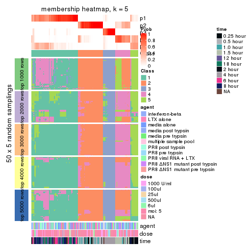</p>

</div>
<div id='tab-MAD-mclust-membership-heatmap-5'>
<pre><code class="r">membership_heatmap(res, k = 6)
</code></pre>

<p></p>

</div>
</div>

As soon as we have had the classes for columns, we can look for signatures
which are significantly different between classes which can be candidate marks
for certain classes. Following are the heatmaps for signatures.


Signature heatmaps where rows are scaled:


<script>
$( function() {
	$( '#tabs-MAD-mclust-get-signatures' ).tabs();
} );
</script>
<div id='tabs-MAD-mclust-get-signatures'>
<ul>
<li><a href='#tab-MAD-mclust-get-signatures-1'>k = 2</a></li>
<li><a href='#tab-MAD-mclust-get-signatures-2'>k = 3</a></li>
<li><a href='#tab-MAD-mclust-get-signatures-3'>k = 4</a></li>
<li><a href='#tab-MAD-mclust-get-signatures-4'>k = 5</a></li>
<li><a href='#tab-MAD-mclust-get-signatures-5'>k = 6</a></li>
</ul>
<div id='tab-MAD-mclust-get-signatures-1'>
<pre><code class="r">get_signatures(res, k = 2)
</code></pre>

<pre><code>#&gt; Error in mat[ceiling(1:nr/h_ratio), ceiling(1:nc/w_ratio), drop = FALSE]: subscript out of bounds
</code></pre>

<p></p>

</div>
<div id='tab-MAD-mclust-get-signatures-2'>
<pre><code class="r">get_signatures(res, k = 3)
</code></pre>

<p></p>

</div>
<div id='tab-MAD-mclust-get-signatures-3'>
<pre><code class="r">get_signatures(res, k = 4)
</code></pre>

<p></p>

</div>
<div id='tab-MAD-mclust-get-signatures-4'>
<pre><code class="r">get_signatures(res, k = 5)
</code></pre>

<p></p>

</div>
<div id='tab-MAD-mclust-get-signatures-5'>
<pre><code class="r">get_signatures(res, k = 6)
</code></pre>

<p></p>

</div>
</div>


Signature heatmaps where rows are not scaled:


<script>
$( function() {
	$( '#tabs-MAD-mclust-get-signatures-no-scale' ).tabs();
} );
</script>
<div id='tabs-MAD-mclust-get-signatures-no-scale'>
<ul>
<li><a href='#tab-MAD-mclust-get-signatures-no-scale-1'>k = 2</a></li>
<li><a href='#tab-MAD-mclust-get-signatures-no-scale-2'>k = 3</a></li>
<li><a href='#tab-MAD-mclust-get-signatures-no-scale-3'>k = 4</a></li>
<li><a href='#tab-MAD-mclust-get-signatures-no-scale-4'>k = 5</a></li>
<li><a href='#tab-MAD-mclust-get-signatures-no-scale-5'>k = 6</a></li>
</ul>
<div id='tab-MAD-mclust-get-signatures-no-scale-1'>
<pre><code class="r">get_signatures(res, k = 2, scale_rows = FALSE)
</code></pre>

<pre><code>#&gt; Error in mat[ceiling(1:nr/h_ratio), ceiling(1:nc/w_ratio), drop = FALSE]: subscript out of bounds
</code></pre>

<p></p>

</div>
<div id='tab-MAD-mclust-get-signatures-no-scale-2'>
<pre><code class="r">get_signatures(res, k = 3, scale_rows = FALSE)
</code></pre>

<p></p>

</div>
<div id='tab-MAD-mclust-get-signatures-no-scale-3'>
<pre><code class="r">get_signatures(res, k = 4, scale_rows = FALSE)
</code></pre>

<p></p>

</div>
<div id='tab-MAD-mclust-get-signatures-no-scale-4'>
<pre><code class="r">get_signatures(res, k = 5, scale_rows = FALSE)
</code></pre>

<p></p>

</div>
<div id='tab-MAD-mclust-get-signatures-no-scale-5'>
<pre><code class="r">get_signatures(res, k = 6, scale_rows = FALSE)
</code></pre>

<p></p>

</div>
</div>


Compare the overlap of signatures from different k:

```r
compare_signatures(res)
```


`get_signature()` returns a data frame invisibly. TO get the list of signatures, the function
call should be assigned to a variable explicitly. In following code, if `plot` argument is set
to `FALSE`, no heatmap is plotted while only the differential analysis is performed.

```r
# code only for demonstration
tb = get_signature(res, k = ..., plot = FALSE)
```

An example of the output of `tb` is:

```
#>   which_row         fdr    mean_1    mean_2 scaled_mean_1 scaled_mean_2 km
#> 1        38 0.042760348  8.373488  9.131774    -0.5533452     0.5164555  1
#> 2        40 0.018707592  7.106213  8.469186    -0.6173731     0.5762149  1
#> 3        55 0.019134737 10.221463 11.207825    -0.6159697     0.5749050  1
#> 4        59 0.006059896  5.921854  7.869574    -0.6899429     0.6439467  1
#> 5        60 0.018055526  8.928898 10.211722    -0.6204761     0.5791110  1
#> 6        98 0.009384629 15.714769 14.887706     0.6635654    -0.6193277  2
...
```

The columns in `tb` are:

1. `which_row`: row indices corresponding to the input matrix.
2. `fdr`: FDR for the differential test. 
3. `mean_x`: The mean value in group x.
4. `scaled_mean_x`: The mean value in group x after rows are scaled.
5. `km`: Row groups if k-means clustering is applied to rows.


UMAP plot which shows how samples are separated.


<script>
$( function() {
	$( '#tabs-MAD-mclust-dimension-reduction' ).tabs();
} );
</script>
<div id='tabs-MAD-mclust-dimension-reduction'>
<ul>
<li><a href='#tab-MAD-mclust-dimension-reduction-1'>k = 2</a></li>
<li><a href='#tab-MAD-mclust-dimension-reduction-2'>k = 3</a></li>
<li><a href='#tab-MAD-mclust-dimension-reduction-3'>k = 4</a></li>
<li><a href='#tab-MAD-mclust-dimension-reduction-4'>k = 5</a></li>
<li><a href='#tab-MAD-mclust-dimension-reduction-5'>k = 6</a></li>
</ul>
<div id='tab-MAD-mclust-dimension-reduction-1'>
<pre><code class="r">dimension_reduction(res, k = 2, method = &quot;UMAP&quot;)
</code></pre>

<p></p>

</div>
<div id='tab-MAD-mclust-dimension-reduction-2'>
<pre><code class="r">dimension_reduction(res, k = 3, method = &quot;UMAP&quot;)
</code></pre>

<p></p>

</div>
<div id='tab-MAD-mclust-dimension-reduction-3'>
<pre><code class="r">dimension_reduction(res, k = 4, method = &quot;UMAP&quot;)
</code></pre>

<p></p>

</div>
<div id='tab-MAD-mclust-dimension-reduction-4'>
<pre><code class="r">dimension_reduction(res, k = 5, method = &quot;UMAP&quot;)
</code></pre>

<p></p>

</div>
<div id='tab-MAD-mclust-dimension-reduction-5'>
<pre><code class="r">dimension_reduction(res, k = 6, method = &quot;UMAP&quot;)
</code></pre>

<p></p>

</div>
</div>


Following heatmap shows how subgroups are split when increasing `k`:

```r
collect_classes(res)
```


Test correlation between subgroups and known annotations. If the known
annotation is numeric, one-way ANOVA test is applied, and if the known
annotation is discrete, chi-squared contingency table test is applied.

```r
test_to_known_factors(res)
```

```
#>              n agent(p) dose(p)  time(p) k
#> MAD:mclust 168    0.903   0.999 2.34e-29 2
#> MAD:mclust 169    0.973   0.992 3.35e-52 3
#> MAD:mclust 156    0.983   0.963 1.00e-72 4
#> MAD:mclust 156    0.871   0.806 1.84e-78 5
#> MAD:mclust 133    0.455   0.413 2.96e-69 6
```


If matrix rows can be associated to genes, consider to use `GO_Enrichment(res,
...)` to perform function enrichment for the signature genes.


 

---------------------------------------------------


### MAD:NMF**


The object with results only for a single top-value method and a single partition method 
can be extracted as:

```r
res = res_list["MAD", "NMF"]
# you can also extract it by
# res = res_list["MAD:NMF"]
```

A summary of `res` and all the functions that can be applied to it:

```r
res
```

```
#> A 'ConsensusPartition' object with k = 2, 3, 4, 5, 6.
#>   On a matrix with 21163 rows and 169 columns.
#>   Top rows (1000, 2000, 3000, 4000, 5000) are extracted by 'MAD' method.
#>   Subgroups are detected by 'NMF' method.
#>   Performed in total 1250 partitions by row resampling.
#>   Best k for subgroups seems to be 3.
#> 
#> Following methods can be applied to this 'ConsensusPartition' object:
#>  [1] "cola_report"             "collect_classes"         "collect_plots"          
#>  [4] "collect_stats"           "colnames"                "compare_signatures"     
#>  [7] "consensus_heatmap"       "dimension_reduction"     "functional_enrichment"  
#> [10] "get_anno_col"            "get_anno"                "get_classes"            
#> [13] "get_consensus"           "get_matrix"              "get_membership"         
#> [16] "get_param"               "get_signatures"          "get_stats"              
#> [19] "is_best_k"               "is_stable_k"             "membership_heatmap"     
#> [22] "ncol"                    "nrow"                    "plot_ecdf"              
#> [25] "rownames"                "select_partition_number" "show"                   
#> [28] "suggest_best_k"          "test_to_known_factors"
```

`collect_plots()` function collects all the plots made from `res` for all `k` (number of partitions)
into one single page to provide an easy and fast comparison between different `k`.

```r
collect_plots(res)
```


The plots are:

- The first row: a plot of the ECDF (Empirical cumulative distribution
  function) curves of the consensus matrix for each `k` and the heatmap of
  predicted classes for each `k`.
- The second row: heatmaps of the consensus matrix for each `k`.
- The third row: heatmaps of the membership matrix for each `k`.
- The fouth row: heatmaps of the signatures for each `k`.

All the plots in panels can be made by individual functions and they are
plotted later in this section.

`select_partition_number()` produces several plots showing different
statistics for choosing "optimized" `k`. There are following statistics:

- ECDF curves of the consensus matrix for each `k`;
- 1-PAC. [The PAC
  score](https://en.wikipedia.org/wiki/Consensus_clustering#Over-interpretation_potential_of_consensus_clustering)
  measures the proportion of the ambiguous subgrouping.
- Mean silhouette score.
- Concordance. The mean probability of fiting the consensus class ids in all
  partitions.
- Area increased. Denote $A_k$ as the area under the ECDF curve for current
  `k`, the area increased is defined as $A_k - A_{k-1}$.
- Rand index. The percent of pairs of samples that are both in a same cluster
  or both are not in a same cluster in the partition of k and k-1.
- Jaccard index. The ratio of pairs of samples are both in a same cluster in
  the partition of k and k-1 and the pairs of samples are both in a same
  cluster in the partition k or k-1.

The detailed explanations of these statistics can be found in [the cola
vignette](http://bioconductor.org/packages/devel/bioc/vignettes/cola/inst/doc/cola.html#toc_13).

Generally speaking, lower PAC score, higher mean silhouette score or higher
concordance corresponds to better partition. Rand index and Jaccard index
measure how similar the current partition is compared to partition with `k-1`.
If they are too similar, we won't accept `k` is better than `k-1`.

```r
select_partition_number(res)
```


The numeric values for all these statistics can be obtained by `get_stats()`.

```r
get_stats(res)
```

```
#>   k 1-PAC mean_silhouette concordance area_increased  Rand Jaccard
#> 2 2 1.000           0.982       0.993         0.4789 0.524   0.524
#> 3 3 0.958           0.947       0.977         0.3975 0.765   0.568
#> 4 4 0.724           0.638       0.795         0.0896 0.899   0.709
#> 5 5 0.794           0.801       0.885         0.0615 0.876   0.592
#> 6 6 0.870           0.826       0.911         0.0369 0.922   0.684
```

`suggest_best_k()` suggests the best $k$ based on these statistics. The rules are as follows:

- All $k$ with Jaccard index larger than 0.95 are removed because the increase of
  the partition number does not provides enough extra information. If all $k$ are removed,
  the best $k$ is assigned by `NA`.
- For $k$ with 1-PAC larger than 0.9, the maximal $k$ is taken as the "best k". Other $k$ is called "optional k".
- If it does not fit the second rule. The $k$ with the highest vote of highest
  1-PAC, mean silhouette and concordance is taken as the "best k".

```r
suggest_best_k(res)
```

```
#> [1] 3
#> attr(,"optional")
#> [1] 2
```

There is also optional best $k$ = 2 that is worth to check.

Following shows the table of the partitions (You need to click the **show/hide
code output** link to see it). The membership matrix (columns with name `p*`)
is inferred by
[`clue::cl_consensus()`](https://www.rdocumentation.org/link/cl_consensus?package=clue)
function with the `SE` method. Basically the value in the membership matrix
represents the probability to belong to a certain group. The finall class
label for an item is determined with the group with highest probability it
belongs to.

In `get_classes()` function, the entropy is calculated from the membership
matrix and the silhouette score is calculated from the consensus matrix.


<script>
$( function() {
	$( '#tabs-MAD-NMF-get-classes' ).tabs();
} );
</script>
<div id='tabs-MAD-NMF-get-classes'>
<ul>
<li><a href='#tab-MAD-NMF-get-classes-1'>k = 2</a></li>
<li><a href='#tab-MAD-NMF-get-classes-2'>k = 3</a></li>
<li><a href='#tab-MAD-NMF-get-classes-3'>k = 4</a></li>
<li><a href='#tab-MAD-NMF-get-classes-4'>k = 5</a></li>
<li><a href='#tab-MAD-NMF-get-classes-5'>k = 6</a></li>
</ul>

<div id='tab-MAD-NMF-get-classes-1'>
<p><a id='tab-MAD-NMF-get-classes-1-a' style='color:#0366d6' href='#'>show/hide code output</a></p>
<pre><code class="r">cbind(get_classes(res, k = 2), get_membership(res, k = 2))
</code></pre>

<pre><code>#&gt;           class entropy silhouette    p1    p2
#&gt; GSM528681     2   0.000      0.997 0.000 1.000
#&gt; GSM528682     2   0.000      0.997 0.000 1.000
#&gt; GSM528683     2   0.000      0.997 0.000 1.000
#&gt; GSM528684     2   0.000      0.997 0.000 1.000
#&gt; GSM528687     2   0.000      0.997 0.000 1.000
#&gt; GSM528688     2   0.000      0.997 0.000 1.000
#&gt; GSM528685     2   0.000      0.997 0.000 1.000
#&gt; GSM528686     2   0.000      0.997 0.000 1.000
#&gt; GSM528693     1   0.000      0.990 1.000 0.000
#&gt; GSM528694     1   0.000      0.990 1.000 0.000
#&gt; GSM528695     1   0.000      0.990 1.000 0.000
#&gt; GSM528696     1   0.000      0.990 1.000 0.000
#&gt; GSM528697     1   0.000      0.990 1.000 0.000
#&gt; GSM528698     1   0.000      0.990 1.000 0.000
#&gt; GSM528699     1   0.000      0.990 1.000 0.000
#&gt; GSM528700     1   0.000      0.990 1.000 0.000
#&gt; GSM528689     1   0.000      0.990 1.000 0.000
#&gt; GSM528690     1   0.000      0.990 1.000 0.000
#&gt; GSM528691     1   0.000      0.990 1.000 0.000
#&gt; GSM528692     1   0.000      0.990 1.000 0.000
#&gt; GSM528779     2   0.000      0.997 0.000 1.000
#&gt; GSM528780     2   0.000      0.997 0.000 1.000
#&gt; GSM528782     2   0.000      0.997 0.000 1.000
#&gt; GSM528781     2   0.000      0.997 0.000 1.000
#&gt; GSM528785     1   0.788      0.695 0.764 0.236
#&gt; GSM528786     1   0.000      0.990 1.000 0.000
#&gt; GSM528787     1   0.000      0.990 1.000 0.000
#&gt; GSM528788     1   0.000      0.990 1.000 0.000
#&gt; GSM528783     1   0.000      0.990 1.000 0.000
#&gt; GSM528784     1   0.000      0.990 1.000 0.000
#&gt; GSM528759     1   0.000      0.990 1.000 0.000
#&gt; GSM528760     1   0.000      0.990 1.000 0.000
#&gt; GSM528761     2   0.000      0.997 0.000 1.000
#&gt; GSM528762     2   0.000      0.997 0.000 1.000
#&gt; GSM528765     2   0.000      0.997 0.000 1.000
#&gt; GSM528766     2   0.000      0.997 0.000 1.000
#&gt; GSM528763     2   0.000      0.997 0.000 1.000
#&gt; GSM528764     2   0.000      0.997 0.000 1.000
#&gt; GSM528771     1   0.738      0.740 0.792 0.208
#&gt; GSM528772     1   0.482      0.881 0.896 0.104
#&gt; GSM528773     1   0.000      0.990 1.000 0.000
#&gt; GSM528774     1   0.000      0.990 1.000 0.000
#&gt; GSM528775     1   0.000      0.990 1.000 0.000
#&gt; GSM528776     1   0.000      0.990 1.000 0.000
#&gt; GSM528777     1   0.000      0.990 1.000 0.000
#&gt; GSM528778     1   0.000      0.990 1.000 0.000
#&gt; GSM528767     1   0.000      0.990 1.000 0.000
#&gt; GSM528768     1   0.000      0.990 1.000 0.000
#&gt; GSM528769     1   0.000      0.990 1.000 0.000
#&gt; GSM528770     1   0.000      0.990 1.000 0.000
#&gt; GSM528671     2   0.000      0.997 0.000 1.000
#&gt; GSM528672     2   0.000      0.997 0.000 1.000
#&gt; GSM528674     2   0.000      0.997 0.000 1.000
#&gt; GSM528673     2   0.000      0.997 0.000 1.000
#&gt; GSM528677     1   0.000      0.990 1.000 0.000
#&gt; GSM528678     1   0.000      0.990 1.000 0.000
#&gt; GSM528679     1   0.000      0.990 1.000 0.000
#&gt; GSM528680     1   0.000      0.990 1.000 0.000
#&gt; GSM528675     1   0.000      0.990 1.000 0.000
#&gt; GSM528676     1   0.000      0.990 1.000 0.000
#&gt; GSM528651     2   0.000      0.997 0.000 1.000
#&gt; GSM528652     2   0.000      0.997 0.000 1.000
#&gt; GSM528653     2   0.000      0.997 0.000 1.000
#&gt; GSM528654     2   0.000      0.997 0.000 1.000
#&gt; GSM528657     2   0.000      0.997 0.000 1.000
#&gt; GSM528658     2   0.000      0.997 0.000 1.000
#&gt; GSM528655     2   0.000      0.997 0.000 1.000
#&gt; GSM528656     2   0.000      0.997 0.000 1.000
#&gt; GSM528663     1   0.997      0.132 0.532 0.468
#&gt; GSM528664     2   0.653      0.794 0.168 0.832
#&gt; GSM528665     1   0.000      0.990 1.000 0.000
#&gt; GSM528666     1   0.000      0.990 1.000 0.000
#&gt; GSM528667     1   0.000      0.990 1.000 0.000
#&gt; GSM528668     1   0.000      0.990 1.000 0.000
#&gt; GSM528669     1   0.000      0.990 1.000 0.000
#&gt; GSM528670     1   0.000      0.990 1.000 0.000
#&gt; GSM528659     1   0.000      0.990 1.000 0.000
#&gt; GSM528660     1   0.000      0.990 1.000 0.000
#&gt; GSM528661     1   0.000      0.990 1.000 0.000
#&gt; GSM528662     1   0.000      0.990 1.000 0.000
#&gt; GSM528701     2   0.000      0.997 0.000 1.000
#&gt; GSM528702     2   0.000      0.997 0.000 1.000
#&gt; GSM528703     2   0.000      0.997 0.000 1.000
#&gt; GSM528704     2   0.000      0.997 0.000 1.000
#&gt; GSM528707     2   0.000      0.997 0.000 1.000
#&gt; GSM528708     2   0.000      0.997 0.000 1.000
#&gt; GSM528705     2   0.000      0.997 0.000 1.000
#&gt; GSM528706     2   0.000      0.997 0.000 1.000
#&gt; GSM528713     1   0.000      0.990 1.000 0.000
#&gt; GSM528714     1   0.000      0.990 1.000 0.000
#&gt; GSM528715     1   0.000      0.990 1.000 0.000
#&gt; GSM528716     1   0.000      0.990 1.000 0.000
#&gt; GSM528717     1   0.000      0.990 1.000 0.000
#&gt; GSM528718     1   0.000      0.990 1.000 0.000
#&gt; GSM528719     1   0.000      0.990 1.000 0.000
#&gt; GSM528720     1   0.000      0.990 1.000 0.000
#&gt; GSM528709     1   0.000      0.990 1.000 0.000
#&gt; GSM528710     1   0.000      0.990 1.000 0.000
#&gt; GSM528711     1   0.000      0.990 1.000 0.000
#&gt; GSM528712     1   0.000      0.990 1.000 0.000
#&gt; GSM528721     2   0.000      0.997 0.000 1.000
#&gt; GSM528722     2   0.000      0.997 0.000 1.000
#&gt; GSM528723     2   0.000      0.997 0.000 1.000
#&gt; GSM528724     2   0.000      0.997 0.000 1.000
#&gt; GSM528727     2   0.000      0.997 0.000 1.000
#&gt; GSM528728     2   0.000      0.997 0.000 1.000
#&gt; GSM528725     2   0.000      0.997 0.000 1.000
#&gt; GSM528726     2   0.000      0.997 0.000 1.000
#&gt; GSM528733     1   0.000      0.990 1.000 0.000
#&gt; GSM528734     1   0.000      0.990 1.000 0.000
#&gt; GSM528735     1   0.000      0.990 1.000 0.000
#&gt; GSM528736     1   0.000      0.990 1.000 0.000
#&gt; GSM528737     1   0.000      0.990 1.000 0.000
#&gt; GSM528738     1   0.000      0.990 1.000 0.000
#&gt; GSM528729     1   0.000      0.990 1.000 0.000
#&gt; GSM528730     1   0.000      0.990 1.000 0.000
#&gt; GSM528731     1   0.000      0.990 1.000 0.000
#&gt; GSM528732     1   0.000      0.990 1.000 0.000
#&gt; GSM528739     2   0.000      0.997 0.000 1.000
#&gt; GSM528740     2   0.000      0.997 0.000 1.000
#&gt; GSM528741     2   0.000      0.997 0.000 1.000
#&gt; GSM528742     2   0.000      0.997 0.000 1.000
#&gt; GSM528745     2   0.000      0.997 0.000 1.000
#&gt; GSM528746     2   0.000      0.997 0.000 1.000
#&gt; GSM528743     2   0.000      0.997 0.000 1.000
#&gt; GSM528744     2   0.000      0.997 0.000 1.000
#&gt; GSM528751     1   0.311      0.934 0.944 0.056
#&gt; GSM528752     1   0.000      0.990 1.000 0.000
#&gt; GSM528753     1   0.000      0.990 1.000 0.000
#&gt; GSM528754     1   0.000      0.990 1.000 0.000
#&gt; GSM528755     1   0.000      0.990 1.000 0.000
#&gt; GSM528756     1   0.000      0.990 1.000 0.000
#&gt; GSM528757     1   0.000      0.990 1.000 0.000
#&gt; GSM528758     1   0.000      0.990 1.000 0.000
#&gt; GSM528747     1   0.000      0.990 1.000 0.000
#&gt; GSM528748     1   0.000      0.990 1.000 0.000
#&gt; GSM528749     1   0.000      0.990 1.000 0.000
#&gt; GSM528750     1   0.000      0.990 1.000 0.000
#&gt; GSM528640     2   0.000      0.997 0.000 1.000
#&gt; GSM528641     2   0.000      0.997 0.000 1.000
#&gt; GSM528643     1   0.000      0.990 1.000 0.000
#&gt; GSM528644     1   0.000      0.990 1.000 0.000
#&gt; GSM528642     1   0.000      0.990 1.000 0.000
#&gt; GSM528620     2   0.000      0.997 0.000 1.000
#&gt; GSM528621     2   0.000      0.997 0.000 1.000
#&gt; GSM528623     1   0.000      0.990 1.000 0.000
#&gt; GSM528624     1   0.000      0.990 1.000 0.000
#&gt; GSM528622     1   0.000      0.990 1.000 0.000
#&gt; GSM528625     2   0.000      0.997 0.000 1.000
#&gt; GSM528626     2   0.000      0.997 0.000 1.000
#&gt; GSM528628     1   0.000      0.990 1.000 0.000
#&gt; GSM528629     1   0.000      0.990 1.000 0.000
#&gt; GSM528627     1   0.000      0.990 1.000 0.000
#&gt; GSM528630     2   0.000      0.997 0.000 1.000
#&gt; GSM528631     2   0.000      0.997 0.000 1.000
#&gt; GSM528632     2   0.000      0.997 0.000 1.000
#&gt; GSM528633     2   0.000      0.997 0.000 1.000
#&gt; GSM528636     1   0.000      0.990 1.000 0.000
#&gt; GSM528637     1   0.000      0.990 1.000 0.000
#&gt; GSM528638     1   0.000      0.990 1.000 0.000
#&gt; GSM528639     1   0.000      0.990 1.000 0.000
#&gt; GSM528634     1   0.000      0.990 1.000 0.000
#&gt; GSM528635     1   0.000      0.990 1.000 0.000
#&gt; GSM528645     1   0.000      0.990 1.000 0.000
#&gt; GSM528646     1   0.000      0.990 1.000 0.000
#&gt; GSM528647     1   0.000      0.990 1.000 0.000
#&gt; GSM528648     1   0.000      0.990 1.000 0.000
#&gt; GSM528649     1   0.000      0.990 1.000 0.000
#&gt; GSM528650     1   0.000      0.990 1.000 0.000
</code></pre>

<script>
$('#tab-MAD-NMF-get-classes-1-a').parent().next().next().hide();
$('#tab-MAD-NMF-get-classes-1-a').click(function(){
  $('#tab-MAD-NMF-get-classes-1-a').parent().next().next().toggle();
  return(false);
});
</script>
</div>

<div id='tab-MAD-NMF-get-classes-2'>
<p><a id='tab-MAD-NMF-get-classes-2-a' style='color:#0366d6' href='#'>show/hide code output</a></p>
<pre><code class="r">cbind(get_classes(res, k = 3), get_membership(res, k = 3))
</code></pre>

<pre><code>#&gt;           class entropy silhouette    p1    p2    p3
#&gt; GSM528681     2  0.0000    0.97902 0.000 1.000 0.000
#&gt; GSM528682     2  0.0000    0.97902 0.000 1.000 0.000
#&gt; GSM528683     2  0.0000    0.97902 0.000 1.000 0.000
#&gt; GSM528684     2  0.0000    0.97902 0.000 1.000 0.000
#&gt; GSM528687     2  0.0000    0.97902 0.000 1.000 0.000
#&gt; GSM528688     2  0.0000    0.97902 0.000 1.000 0.000
#&gt; GSM528685     2  0.0000    0.97902 0.000 1.000 0.000
#&gt; GSM528686     2  0.4399    0.77430 0.000 0.812 0.188
#&gt; GSM528693     3  0.0424    0.96017 0.008 0.000 0.992
#&gt; GSM528694     3  0.0000    0.96499 0.000 0.000 1.000
#&gt; GSM528695     3  0.0000    0.96499 0.000 0.000 1.000
#&gt; GSM528696     3  0.0000    0.96499 0.000 0.000 1.000
#&gt; GSM528697     1  0.0000    0.98230 1.000 0.000 0.000
#&gt; GSM528698     1  0.0000    0.98230 1.000 0.000 0.000
#&gt; GSM528699     1  0.0000    0.98230 1.000 0.000 0.000
#&gt; GSM528700     1  0.0000    0.98230 1.000 0.000 0.000
#&gt; GSM528689     1  0.0000    0.98230 1.000 0.000 0.000
#&gt; GSM528690     1  0.0000    0.98230 1.000 0.000 0.000
#&gt; GSM528691     1  0.0000    0.98230 1.000 0.000 0.000
#&gt; GSM528692     1  0.2261    0.92735 0.932 0.000 0.068
#&gt; GSM528779     2  0.0000    0.97902 0.000 1.000 0.000
#&gt; GSM528780     2  0.0000    0.97902 0.000 1.000 0.000
#&gt; GSM528782     2  0.0000    0.97902 0.000 1.000 0.000
#&gt; GSM528781     2  0.0000    0.97902 0.000 1.000 0.000
#&gt; GSM528785     2  0.8824    0.22240 0.124 0.512 0.364
#&gt; GSM528786     3  0.0000    0.96499 0.000 0.000 1.000
#&gt; GSM528787     3  0.0000    0.96499 0.000 0.000 1.000
#&gt; GSM528788     1  0.0000    0.98230 1.000 0.000 0.000
#&gt; GSM528783     1  0.0000    0.98230 1.000 0.000 0.000
#&gt; GSM528784     1  0.0000    0.98230 1.000 0.000 0.000
#&gt; GSM528759     3  0.0000    0.96499 0.000 0.000 1.000
#&gt; GSM528760     3  0.0000    0.96499 0.000 0.000 1.000
#&gt; GSM528761     2  0.0000    0.97902 0.000 1.000 0.000
#&gt; GSM528762     2  0.0000    0.97902 0.000 1.000 0.000
#&gt; GSM528765     2  0.0000    0.97902 0.000 1.000 0.000
#&gt; GSM528766     2  0.0000    0.97902 0.000 1.000 0.000
#&gt; GSM528763     2  0.0000    0.97902 0.000 1.000 0.000
#&gt; GSM528764     2  0.4235    0.79366 0.000 0.824 0.176
#&gt; GSM528771     3  0.4702    0.73130 0.000 0.212 0.788
#&gt; GSM528772     3  0.3192    0.86537 0.000 0.112 0.888
#&gt; GSM528773     3  0.0000    0.96499 0.000 0.000 1.000
#&gt; GSM528774     3  0.0000    0.96499 0.000 0.000 1.000
#&gt; GSM528775     3  0.0000    0.96499 0.000 0.000 1.000
#&gt; GSM528776     1  0.0424    0.97754 0.992 0.000 0.008
#&gt; GSM528777     1  0.0000    0.98230 1.000 0.000 0.000
#&gt; GSM528778     1  0.0000    0.98230 1.000 0.000 0.000
#&gt; GSM528767     1  0.0000    0.98230 1.000 0.000 0.000
#&gt; GSM528768     1  0.0000    0.98230 1.000 0.000 0.000
#&gt; GSM528769     1  0.0000    0.98230 1.000 0.000 0.000
#&gt; GSM528770     1  0.0000    0.98230 1.000 0.000 0.000
#&gt; GSM528671     2  0.0000    0.97902 0.000 1.000 0.000
#&gt; GSM528672     2  0.0000    0.97902 0.000 1.000 0.000
#&gt; GSM528674     2  0.0000    0.97902 0.000 1.000 0.000
#&gt; GSM528673     2  0.2959    0.88385 0.000 0.900 0.100
#&gt; GSM528677     3  0.0000    0.96499 0.000 0.000 1.000
#&gt; GSM528678     3  0.0000    0.96499 0.000 0.000 1.000
#&gt; GSM528679     1  0.0237    0.98009 0.996 0.000 0.004
#&gt; GSM528680     1  0.0000    0.98230 1.000 0.000 0.000
#&gt; GSM528675     1  0.0000    0.98230 1.000 0.000 0.000
#&gt; GSM528676     1  0.0000    0.98230 1.000 0.000 0.000
#&gt; GSM528651     2  0.0000    0.97902 0.000 1.000 0.000
#&gt; GSM528652     2  0.0000    0.97902 0.000 1.000 0.000
#&gt; GSM528653     2  0.0000    0.97902 0.000 1.000 0.000
#&gt; GSM528654     2  0.0000    0.97902 0.000 1.000 0.000
#&gt; GSM528657     2  0.0000    0.97902 0.000 1.000 0.000
#&gt; GSM528658     2  0.0000    0.97902 0.000 1.000 0.000
#&gt; GSM528655     2  0.0892    0.96211 0.000 0.980 0.020
#&gt; GSM528656     2  0.3482    0.85260 0.000 0.872 0.128
#&gt; GSM528663     3  0.0000    0.96499 0.000 0.000 1.000
#&gt; GSM528664     3  0.0000    0.96499 0.000 0.000 1.000
#&gt; GSM528665     3  0.0000    0.96499 0.000 0.000 1.000
#&gt; GSM528666     3  0.0000    0.96499 0.000 0.000 1.000
#&gt; GSM528667     1  0.0000    0.98230 1.000 0.000 0.000
#&gt; GSM528668     1  0.0000    0.98230 1.000 0.000 0.000
#&gt; GSM528669     1  0.0000    0.98230 1.000 0.000 0.000
#&gt; GSM528670     1  0.0000    0.98230 1.000 0.000 0.000
#&gt; GSM528659     1  0.0000    0.98230 1.000 0.000 0.000
#&gt; GSM528660     1  0.0000    0.98230 1.000 0.000 0.000
#&gt; GSM528661     1  0.0000    0.98230 1.000 0.000 0.000
#&gt; GSM528662     1  0.0000    0.98230 1.000 0.000 0.000
#&gt; GSM528701     2  0.0000    0.97902 0.000 1.000 0.000
#&gt; GSM528702     2  0.0000    0.97902 0.000 1.000 0.000
#&gt; GSM528703     2  0.0000    0.97902 0.000 1.000 0.000
#&gt; GSM528704     2  0.0000    0.97902 0.000 1.000 0.000
#&gt; GSM528707     2  0.0000    0.97902 0.000 1.000 0.000
#&gt; GSM528708     2  0.0000    0.97902 0.000 1.000 0.000
#&gt; GSM528705     2  0.0000    0.97902 0.000 1.000 0.000
#&gt; GSM528706     2  0.0000    0.97902 0.000 1.000 0.000
#&gt; GSM528713     3  0.0000    0.96499 0.000 0.000 1.000
#&gt; GSM528714     3  0.0000    0.96499 0.000 0.000 1.000
#&gt; GSM528715     3  0.0000    0.96499 0.000 0.000 1.000
#&gt; GSM528716     3  0.0000    0.96499 0.000 0.000 1.000
#&gt; GSM528717     1  0.0424    0.97754 0.992 0.000 0.008
#&gt; GSM528718     1  0.3038    0.88555 0.896 0.000 0.104
#&gt; GSM528719     1  0.0424    0.97754 0.992 0.000 0.008
#&gt; GSM528720     1  0.0000    0.98230 1.000 0.000 0.000
#&gt; GSM528709     1  0.0000    0.98230 1.000 0.000 0.000
#&gt; GSM528710     1  0.0000    0.98230 1.000 0.000 0.000
#&gt; GSM528711     1  0.0000    0.98230 1.000 0.000 0.000
#&gt; GSM528712     1  0.0000    0.98230 1.000 0.000 0.000
#&gt; GSM528721     2  0.0000    0.97902 0.000 1.000 0.000
#&gt; GSM528722     2  0.0000    0.97902 0.000 1.000 0.000
#&gt; GSM528723     2  0.0000    0.97902 0.000 1.000 0.000
#&gt; GSM528724     2  0.0000    0.97902 0.000 1.000 0.000
#&gt; GSM528727     2  0.0000    0.97902 0.000 1.000 0.000
#&gt; GSM528728     2  0.0000    0.97902 0.000 1.000 0.000
#&gt; GSM528725     2  0.0000    0.97902 0.000 1.000 0.000
#&gt; GSM528726     2  0.0000    0.97902 0.000 1.000 0.000
#&gt; GSM528733     3  0.0000    0.96499 0.000 0.000 1.000
#&gt; GSM528734     3  0.0000    0.96499 0.000 0.000 1.000
#&gt; GSM528735     3  0.2165    0.91624 0.064 0.000 0.936
#&gt; GSM528736     3  0.1753    0.93075 0.048 0.000 0.952
#&gt; GSM528737     1  0.0237    0.98011 0.996 0.000 0.004
#&gt; GSM528738     1  0.2066    0.93347 0.940 0.000 0.060
#&gt; GSM528729     1  0.0000    0.98230 1.000 0.000 0.000
#&gt; GSM528730     1  0.0000    0.98230 1.000 0.000 0.000
#&gt; GSM528731     1  0.0000    0.98230 1.000 0.000 0.000
#&gt; GSM528732     1  0.2066    0.93455 0.940 0.000 0.060
#&gt; GSM528739     2  0.0000    0.97902 0.000 1.000 0.000
#&gt; GSM528740     2  0.0000    0.97902 0.000 1.000 0.000
#&gt; GSM528741     2  0.0000    0.97902 0.000 1.000 0.000
#&gt; GSM528742     2  0.0000    0.97902 0.000 1.000 0.000
#&gt; GSM528745     2  0.0000    0.97902 0.000 1.000 0.000
#&gt; GSM528746     2  0.0000    0.97902 0.000 1.000 0.000
#&gt; GSM528743     2  0.0000    0.97902 0.000 1.000 0.000
#&gt; GSM528744     2  0.0000    0.97902 0.000 1.000 0.000
#&gt; GSM528751     3  0.4784    0.74732 0.004 0.200 0.796
#&gt; GSM528752     3  0.3349    0.86868 0.004 0.108 0.888
#&gt; GSM528753     3  0.0000    0.96499 0.000 0.000 1.000
#&gt; GSM528754     3  0.0000    0.96499 0.000 0.000 1.000
#&gt; GSM528755     3  0.0000    0.96499 0.000 0.000 1.000
#&gt; GSM528756     3  0.0000    0.96499 0.000 0.000 1.000
#&gt; GSM528757     1  0.0000    0.98230 1.000 0.000 0.000
#&gt; GSM528758     1  0.0000    0.98230 1.000 0.000 0.000
#&gt; GSM528747     1  0.1163    0.96177 0.972 0.000 0.028
#&gt; GSM528748     3  0.1753    0.92802 0.048 0.000 0.952
#&gt; GSM528749     3  0.5016    0.67387 0.240 0.000 0.760
#&gt; GSM528750     1  0.0000    0.98230 1.000 0.000 0.000
#&gt; GSM528640     2  0.0000    0.97902 0.000 1.000 0.000
#&gt; GSM528641     2  0.4178    0.79883 0.000 0.828 0.172
#&gt; GSM528643     3  0.0000    0.96499 0.000 0.000 1.000
#&gt; GSM528644     3  0.6308   -0.00228 0.492 0.000 0.508
#&gt; GSM528642     3  0.0000    0.96499 0.000 0.000 1.000
#&gt; GSM528620     2  0.0000    0.97902 0.000 1.000 0.000
#&gt; GSM528621     3  0.0000    0.96499 0.000 0.000 1.000
#&gt; GSM528623     3  0.0000    0.96499 0.000 0.000 1.000
#&gt; GSM528624     1  0.0000    0.98230 1.000 0.000 0.000
#&gt; GSM528622     1  0.0237    0.98008 0.996 0.000 0.004
#&gt; GSM528625     2  0.0000    0.97902 0.000 1.000 0.000
#&gt; GSM528626     3  0.2261    0.91076 0.000 0.068 0.932
#&gt; GSM528628     3  0.0000    0.96499 0.000 0.000 1.000
#&gt; GSM528629     1  0.2165    0.93127 0.936 0.000 0.064
#&gt; GSM528627     1  0.6235    0.22949 0.564 0.000 0.436
#&gt; GSM528630     2  0.0000    0.97902 0.000 1.000 0.000
#&gt; GSM528631     2  0.0000    0.97902 0.000 1.000 0.000
#&gt; GSM528632     3  0.1411    0.93996 0.000 0.036 0.964
#&gt; GSM528633     3  0.1643    0.93331 0.000 0.044 0.956
#&gt; GSM528636     3  0.0000    0.96499 0.000 0.000 1.000
#&gt; GSM528637     3  0.0000    0.96499 0.000 0.000 1.000
#&gt; GSM528638     1  0.0000    0.98230 1.000 0.000 0.000
#&gt; GSM528639     1  0.0237    0.98011 0.996 0.000 0.004
#&gt; GSM528634     3  0.0000    0.96499 0.000 0.000 1.000
#&gt; GSM528635     1  0.2625    0.90990 0.916 0.000 0.084
#&gt; GSM528645     3  0.0000    0.96499 0.000 0.000 1.000
#&gt; GSM528646     3  0.0000    0.96499 0.000 0.000 1.000
#&gt; GSM528647     3  0.0000    0.96499 0.000 0.000 1.000
#&gt; GSM528648     3  0.1031    0.94970 0.024 0.000 0.976
#&gt; GSM528649     3  0.0000    0.96499 0.000 0.000 1.000
#&gt; GSM528650     3  0.1289    0.94409 0.032 0.000 0.968
</code></pre>

<script>
$('#tab-MAD-NMF-get-classes-2-a').parent().next().next().hide();
$('#tab-MAD-NMF-get-classes-2-a').click(function(){
  $('#tab-MAD-NMF-get-classes-2-a').parent().next().next().toggle();
  return(false);
});
</script>
</div>

<div id='tab-MAD-NMF-get-classes-3'>
<p><a id='tab-MAD-NMF-get-classes-3-a' style='color:#0366d6' href='#'>show/hide code output</a></p>
<pre><code class="r">cbind(get_classes(res, k = 4), get_membership(res, k = 4))
</code></pre>

<pre><code>#&gt;           class entropy silhouette    p1    p2    p3    p4
#&gt; GSM528681     2  0.0188    0.95313 0.004 0.996 0.000 0.000
#&gt; GSM528682     2  0.0188    0.95313 0.004 0.996 0.000 0.000
#&gt; GSM528683     2  0.0000    0.95279 0.000 1.000 0.000 0.000
#&gt; GSM528684     2  0.0188    0.95313 0.004 0.996 0.000 0.000
#&gt; GSM528687     2  0.0188    0.95313 0.004 0.996 0.000 0.000
#&gt; GSM528688     2  0.0000    0.95279 0.000 1.000 0.000 0.000
#&gt; GSM528685     2  0.1389    0.92534 0.048 0.952 0.000 0.000
#&gt; GSM528686     2  0.7168    0.37024 0.256 0.552 0.192 0.000
#&gt; GSM528693     3  0.5288    0.12379 0.472 0.000 0.520 0.008
#&gt; GSM528694     1  0.5285   -0.03606 0.524 0.000 0.468 0.008
#&gt; GSM528695     3  0.0000    0.80408 0.000 0.000 1.000 0.000
#&gt; GSM528696     3  0.0000    0.80408 0.000 0.000 1.000 0.000
#&gt; GSM528697     4  0.1637    0.70884 0.060 0.000 0.000 0.940
#&gt; GSM528698     4  0.4477    0.64755 0.312 0.000 0.000 0.688
#&gt; GSM528699     4  0.4888    0.44682 0.412 0.000 0.000 0.588
#&gt; GSM528700     4  0.2814    0.69705 0.132 0.000 0.000 0.868
#&gt; GSM528689     4  0.2345    0.69861 0.100 0.000 0.000 0.900
#&gt; GSM528690     4  0.0817    0.70183 0.024 0.000 0.000 0.976
#&gt; GSM528691     4  0.2921    0.67293 0.140 0.000 0.000 0.860
#&gt; GSM528692     4  0.2589    0.66480 0.116 0.000 0.000 0.884
#&gt; GSM528779     2  0.0188    0.95313 0.004 0.996 0.000 0.000
#&gt; GSM528780     2  0.0000    0.95279 0.000 1.000 0.000 0.000
#&gt; GSM528782     2  0.0336    0.95211 0.008 0.992 0.000 0.000
#&gt; GSM528781     2  0.4331    0.65713 0.288 0.712 0.000 0.000
#&gt; GSM528785     1  0.3707    0.43122 0.852 0.112 0.004 0.032
#&gt; GSM528786     3  0.0000    0.80408 0.000 0.000 1.000 0.000
#&gt; GSM528787     1  0.5161    0.00829 0.520 0.000 0.476 0.004
#&gt; GSM528788     4  0.4866    0.60884 0.404 0.000 0.000 0.596
#&gt; GSM528783     4  0.1022    0.70146 0.032 0.000 0.000 0.968
#&gt; GSM528784     4  0.1022    0.68334 0.032 0.000 0.000 0.968
#&gt; GSM528759     3  0.2345    0.68721 0.100 0.000 0.900 0.000
#&gt; GSM528760     3  0.2704    0.69717 0.124 0.000 0.876 0.000
#&gt; GSM528761     2  0.0000    0.95279 0.000 1.000 0.000 0.000
#&gt; GSM528762     2  0.0336    0.95211 0.008 0.992 0.000 0.000
#&gt; GSM528765     2  0.0707    0.94411 0.020 0.980 0.000 0.000
#&gt; GSM528766     2  0.0000    0.95279 0.000 1.000 0.000 0.000
#&gt; GSM528763     2  0.0000    0.95279 0.000 1.000 0.000 0.000
#&gt; GSM528764     3  0.4817    0.32198 0.000 0.388 0.612 0.000
#&gt; GSM528771     1  0.6503    0.29875 0.640 0.164 0.196 0.000
#&gt; GSM528772     1  0.6568    0.17069 0.572 0.096 0.332 0.000
#&gt; GSM528773     3  0.0000    0.80408 0.000 0.000 1.000 0.000
#&gt; GSM528774     3  0.0000    0.80408 0.000 0.000 1.000 0.000
#&gt; GSM528775     1  0.5383    0.39461 0.672 0.000 0.292 0.036
#&gt; GSM528776     1  0.5263   -0.38358 0.544 0.000 0.008 0.448
#&gt; GSM528777     4  0.4843    0.60978 0.396 0.000 0.000 0.604
#&gt; GSM528778     4  0.4888    0.60349 0.412 0.000 0.000 0.588
#&gt; GSM528767     4  0.0000    0.69669 0.000 0.000 0.000 1.000
#&gt; GSM528768     4  0.0469    0.69965 0.012 0.000 0.000 0.988
#&gt; GSM528769     4  0.1118    0.68312 0.036 0.000 0.000 0.964
#&gt; GSM528770     4  0.0921    0.68582 0.028 0.000 0.000 0.972
#&gt; GSM528671     2  0.0336    0.95005 0.008 0.992 0.000 0.000
#&gt; GSM528672     2  0.0336    0.95211 0.008 0.992 0.000 0.000
#&gt; GSM528674     2  0.0000    0.95279 0.000 1.000 0.000 0.000
#&gt; GSM528673     2  0.4898    0.72989 0.072 0.772 0.156 0.000
#&gt; GSM528677     1  0.5147   -0.01639 0.536 0.004 0.460 0.000
#&gt; GSM528678     3  0.2408    0.72429 0.104 0.000 0.896 0.000
#&gt; GSM528679     4  0.5300    0.59389 0.408 0.000 0.012 0.580
#&gt; GSM528680     4  0.4072    0.66753 0.252 0.000 0.000 0.748
#&gt; GSM528675     4  0.1022    0.68334 0.032 0.000 0.000 0.968
#&gt; GSM528676     4  0.1022    0.68334 0.032 0.000 0.000 0.968
#&gt; GSM528651     2  0.2081    0.89657 0.084 0.916 0.000 0.000
#&gt; GSM528652     2  0.2469    0.87588 0.108 0.892 0.000 0.000
#&gt; GSM528653     2  0.0336    0.95211 0.008 0.992 0.000 0.000
#&gt; GSM528654     2  0.0336    0.95211 0.008 0.992 0.000 0.000
#&gt; GSM528657     2  0.0469    0.94822 0.012 0.988 0.000 0.000
#&gt; GSM528658     2  0.0188    0.95313 0.004 0.996 0.000 0.000
#&gt; GSM528655     2  0.4880    0.70522 0.052 0.760 0.188 0.000
#&gt; GSM528656     2  0.5842    0.65441 0.168 0.704 0.128 0.000
#&gt; GSM528663     1  0.6214    0.05090 0.536 0.056 0.408 0.000
#&gt; GSM528664     1  0.6686    0.05216 0.520 0.092 0.388 0.000
#&gt; GSM528665     3  0.0000    0.80408 0.000 0.000 1.000 0.000
#&gt; GSM528666     3  0.0000    0.80408 0.000 0.000 1.000 0.000
#&gt; GSM528667     4  0.5161    0.60299 0.400 0.000 0.008 0.592
#&gt; GSM528668     4  0.5427    0.58591 0.416 0.000 0.016 0.568
#&gt; GSM528669     4  0.4843    0.61539 0.396 0.000 0.000 0.604
#&gt; GSM528670     4  0.4989    0.52494 0.472 0.000 0.000 0.528
#&gt; GSM528659     4  0.0921    0.68582 0.028 0.000 0.000 0.972
#&gt; GSM528660     4  0.0921    0.68582 0.028 0.000 0.000 0.972
#&gt; GSM528661     4  0.0707    0.68953 0.020 0.000 0.000 0.980
#&gt; GSM528662     4  0.0469    0.69585 0.012 0.000 0.000 0.988
#&gt; GSM528701     2  0.0336    0.95211 0.008 0.992 0.000 0.000
#&gt; GSM528702     2  0.0336    0.95211 0.008 0.992 0.000 0.000
#&gt; GSM528703     2  0.0000    0.95279 0.000 1.000 0.000 0.000
#&gt; GSM528704     2  0.0336    0.95211 0.008 0.992 0.000 0.000
#&gt; GSM528707     2  0.0188    0.95313 0.004 0.996 0.000 0.000
#&gt; GSM528708     2  0.0336    0.95211 0.008 0.992 0.000 0.000
#&gt; GSM528705     2  0.0188    0.95261 0.004 0.996 0.000 0.000
#&gt; GSM528706     2  0.0000    0.95279 0.000 1.000 0.000 0.000
#&gt; GSM528713     1  0.5473    0.27345 0.644 0.000 0.324 0.032
#&gt; GSM528714     1  0.4961    0.01526 0.552 0.000 0.448 0.000
#&gt; GSM528715     3  0.0000    0.80408 0.000 0.000 1.000 0.000
#&gt; GSM528716     3  0.0000    0.80408 0.000 0.000 1.000 0.000
#&gt; GSM528717     4  0.4964    0.61668 0.380 0.000 0.004 0.616
#&gt; GSM528718     1  0.6451   -0.16305 0.524 0.000 0.072 0.404
#&gt; GSM528719     4  0.3649    0.61459 0.204 0.000 0.000 0.796
#&gt; GSM528720     4  0.4164    0.64293 0.264 0.000 0.000 0.736
#&gt; GSM528709     4  0.1118    0.70206 0.036 0.000 0.000 0.964
#&gt; GSM528710     4  0.0707    0.70154 0.020 0.000 0.000 0.980
#&gt; GSM528711     4  0.1637    0.69652 0.060 0.000 0.000 0.940
#&gt; GSM528712     4  0.3024    0.63495 0.148 0.000 0.000 0.852
#&gt; GSM528721     2  0.0188    0.95313 0.004 0.996 0.000 0.000
#&gt; GSM528722     2  0.0188    0.95313 0.004 0.996 0.000 0.000
#&gt; GSM528723     2  0.0188    0.95313 0.004 0.996 0.000 0.000
#&gt; GSM528724     2  0.0336    0.95211 0.008 0.992 0.000 0.000
#&gt; GSM528727     2  0.0469    0.94822 0.012 0.988 0.000 0.000
#&gt; GSM528728     2  0.0188    0.95313 0.004 0.996 0.000 0.000
#&gt; GSM528725     2  0.0779    0.94478 0.016 0.980 0.000 0.004
#&gt; GSM528726     2  0.0000    0.95279 0.000 1.000 0.000 0.000
#&gt; GSM528733     3  0.0000    0.80408 0.000 0.000 1.000 0.000
#&gt; GSM528734     3  0.0000    0.80408 0.000 0.000 1.000 0.000
#&gt; GSM528735     3  0.5229    0.02467 0.428 0.000 0.564 0.008
#&gt; GSM528736     3  0.4837    0.19165 0.348 0.000 0.648 0.004
#&gt; GSM528737     4  0.5070    0.59841 0.416 0.000 0.004 0.580
#&gt; GSM528738     1  0.5085   -0.22848 0.616 0.000 0.008 0.376
#&gt; GSM528729     4  0.4907    0.60166 0.420 0.000 0.000 0.580
#&gt; GSM528730     4  0.4961    0.58316 0.448 0.000 0.000 0.552
#&gt; GSM528731     4  0.4916    0.60085 0.424 0.000 0.000 0.576
#&gt; GSM528732     1  0.6139   -0.29944 0.544 0.000 0.052 0.404
#&gt; GSM528739     2  0.0336    0.95211 0.008 0.992 0.000 0.000
#&gt; GSM528740     2  0.0336    0.95211 0.008 0.992 0.000 0.000
#&gt; GSM528741     2  0.0000    0.95279 0.000 1.000 0.000 0.000
#&gt; GSM528742     2  0.0000    0.95279 0.000 1.000 0.000 0.000
#&gt; GSM528745     2  0.0469    0.94822 0.012 0.988 0.000 0.000
#&gt; GSM528746     2  0.0188    0.95313 0.004 0.996 0.000 0.000
#&gt; GSM528743     2  0.2081    0.89749 0.084 0.916 0.000 0.000
#&gt; GSM528744     2  0.0817    0.94163 0.024 0.976 0.000 0.000
#&gt; GSM528751     1  0.4511    0.47183 0.832 0.068 0.072 0.028
#&gt; GSM528752     1  0.4469    0.47300 0.820 0.036 0.124 0.020
#&gt; GSM528753     3  0.0000    0.80408 0.000 0.000 1.000 0.000
#&gt; GSM528754     3  0.0000    0.80408 0.000 0.000 1.000 0.000
#&gt; GSM528755     1  0.4872    0.45712 0.728 0.000 0.244 0.028
#&gt; GSM528756     1  0.4482    0.43576 0.728 0.000 0.264 0.008
#&gt; GSM528757     4  0.5088    0.59861 0.424 0.004 0.000 0.572
#&gt; GSM528758     4  0.4985    0.56099 0.468 0.000 0.000 0.532
#&gt; GSM528747     1  0.5597   -0.42268 0.516 0.000 0.020 0.464
#&gt; GSM528748     1  0.6835    0.44227 0.576 0.000 0.288 0.136
#&gt; GSM528749     1  0.7542    0.12733 0.488 0.000 0.280 0.232
#&gt; GSM528750     4  0.6201    0.53867 0.420 0.004 0.044 0.532
#&gt; GSM528640     2  0.0188    0.95313 0.004 0.996 0.000 0.000
#&gt; GSM528641     2  0.4888    0.28886 0.000 0.588 0.412 0.000
#&gt; GSM528643     3  0.0000    0.80408 0.000 0.000 1.000 0.000
#&gt; GSM528644     1  0.4123    0.39162 0.820 0.000 0.044 0.136
#&gt; GSM528642     3  0.2081    0.72888 0.084 0.000 0.916 0.000
#&gt; GSM528620     2  0.0188    0.95162 0.004 0.996 0.000 0.000
#&gt; GSM528621     1  0.6121    0.07824 0.552 0.052 0.396 0.000
#&gt; GSM528623     3  0.0000    0.80408 0.000 0.000 1.000 0.000
#&gt; GSM528624     4  0.4933    0.59532 0.432 0.000 0.000 0.568
#&gt; GSM528622     4  0.5366    0.57113 0.440 0.000 0.012 0.548
#&gt; GSM528625     2  0.0188    0.95313 0.004 0.996 0.000 0.000
#&gt; GSM528626     3  0.7398    0.18465 0.168 0.376 0.456 0.000
#&gt; GSM528628     3  0.0000    0.80408 0.000 0.000 1.000 0.000
#&gt; GSM528629     1  0.5233   -0.05119 0.648 0.000 0.020 0.332
#&gt; GSM528627     1  0.6737   -0.16300 0.532 0.000 0.100 0.368
#&gt; GSM528630     2  0.0707    0.94411 0.020 0.980 0.000 0.000
#&gt; GSM528631     2  0.3528    0.78641 0.192 0.808 0.000 0.000
#&gt; GSM528632     3  0.7526    0.12375 0.372 0.188 0.440 0.000
#&gt; GSM528633     3  0.6875    0.36181 0.220 0.184 0.596 0.000
#&gt; GSM528636     3  0.0000    0.80408 0.000 0.000 1.000 0.000
#&gt; GSM528637     3  0.0000    0.80408 0.000 0.000 1.000 0.000
#&gt; GSM528638     4  0.4977    0.57174 0.460 0.000 0.000 0.540
#&gt; GSM528639     1  0.3626    0.28300 0.812 0.000 0.004 0.184
#&gt; GSM528634     1  0.6374    0.34459 0.556 0.000 0.372 0.072
#&gt; GSM528635     1  0.7586   -0.26999 0.416 0.000 0.196 0.388
#&gt; GSM528645     3  0.0336    0.79888 0.008 0.000 0.992 0.000
#&gt; GSM528646     3  0.0000    0.80408 0.000 0.000 1.000 0.000
#&gt; GSM528647     3  0.4941    0.22385 0.436 0.000 0.564 0.000
#&gt; GSM528648     3  0.4656    0.55606 0.160 0.000 0.784 0.056
#&gt; GSM528649     3  0.4356    0.45850 0.292 0.000 0.708 0.000
#&gt; GSM528650     1  0.6663    0.36549 0.556 0.000 0.344 0.100
</code></pre>

<script>
$('#tab-MAD-NMF-get-classes-3-a').parent().next().next().hide();
$('#tab-MAD-NMF-get-classes-3-a').click(function(){
  $('#tab-MAD-NMF-get-classes-3-a').parent().next().next().toggle();
  return(false);
});
</script>
</div>

<div id='tab-MAD-NMF-get-classes-4'>
<p><a id='tab-MAD-NMF-get-classes-4-a' style='color:#0366d6' href='#'>show/hide code output</a></p>
<pre><code class="r">cbind(get_classes(res, k = 5), get_membership(res, k = 5))
</code></pre>

<pre><code>#&gt;           class entropy silhouette    p1    p2    p3    p4    p5
#&gt; GSM528681     2  0.0000      0.929 0.000 1.000 0.000 0.000 0.000
#&gt; GSM528682     2  0.0000      0.929 0.000 1.000 0.000 0.000 0.000
#&gt; GSM528683     2  0.0000      0.929 0.000 1.000 0.000 0.000 0.000
#&gt; GSM528684     2  0.0000      0.929 0.000 1.000 0.000 0.000 0.000
#&gt; GSM528687     2  0.0000      0.929 0.000 1.000 0.000 0.000 0.000
#&gt; GSM528688     2  0.0000      0.929 0.000 1.000 0.000 0.000 0.000
#&gt; GSM528685     2  0.3582      0.700 0.000 0.768 0.000 0.008 0.224
#&gt; GSM528686     5  0.4015      0.502 0.000 0.348 0.000 0.000 0.652
#&gt; GSM528693     5  0.3769      0.616 0.012 0.000 0.176 0.016 0.796
#&gt; GSM528694     5  0.2570      0.695 0.028 0.000 0.084 0.000 0.888
#&gt; GSM528695     3  0.0000      0.932 0.000 0.000 1.000 0.000 0.000
#&gt; GSM528696     3  0.0000      0.932 0.000 0.000 1.000 0.000 0.000
#&gt; GSM528697     4  0.2648      0.867 0.152 0.000 0.000 0.848 0.000
#&gt; GSM528698     1  0.5508      0.585 0.636 0.000 0.000 0.244 0.120
#&gt; GSM528699     4  0.6071      0.528 0.236 0.000 0.000 0.572 0.192
#&gt; GSM528700     4  0.4337      0.778 0.196 0.000 0.000 0.748 0.056
#&gt; GSM528689     4  0.3013      0.855 0.160 0.000 0.000 0.832 0.008
#&gt; GSM528690     4  0.1792      0.905 0.084 0.000 0.000 0.916 0.000
#&gt; GSM528691     4  0.3445      0.857 0.140 0.000 0.000 0.824 0.036
#&gt; GSM528692     4  0.1851      0.905 0.088 0.000 0.000 0.912 0.000
#&gt; GSM528779     2  0.0162      0.928 0.000 0.996 0.000 0.000 0.004
#&gt; GSM528780     2  0.0290      0.927 0.000 0.992 0.000 0.000 0.008
#&gt; GSM528782     2  0.0162      0.928 0.004 0.996 0.000 0.000 0.000
#&gt; GSM528781     5  0.4015      0.503 0.000 0.348 0.000 0.000 0.652
#&gt; GSM528785     5  0.4169      0.712 0.100 0.116 0.000 0.000 0.784
#&gt; GSM528786     3  0.0000      0.932 0.000 0.000 1.000 0.000 0.000
#&gt; GSM528787     5  0.3919      0.477 0.188 0.000 0.036 0.000 0.776
#&gt; GSM528788     1  0.1195      0.832 0.960 0.012 0.000 0.000 0.028
#&gt; GSM528783     4  0.1908      0.904 0.092 0.000 0.000 0.908 0.000
#&gt; GSM528784     4  0.0510      0.882 0.016 0.000 0.000 0.984 0.000
#&gt; GSM528759     3  0.3662      0.601 0.252 0.000 0.744 0.000 0.004
#&gt; GSM528760     3  0.2727      0.818 0.016 0.000 0.868 0.000 0.116
#&gt; GSM528761     2  0.0880      0.917 0.000 0.968 0.000 0.000 0.032
#&gt; GSM528762     2  0.0162      0.928 0.004 0.996 0.000 0.000 0.000
#&gt; GSM528765     2  0.2127      0.856 0.000 0.892 0.000 0.000 0.108
#&gt; GSM528766     2  0.0290      0.927 0.000 0.992 0.000 0.000 0.008
#&gt; GSM528763     2  0.1121      0.911 0.000 0.956 0.000 0.000 0.044
#&gt; GSM528764     3  0.3048      0.691 0.000 0.176 0.820 0.000 0.004
#&gt; GSM528771     5  0.2248      0.750 0.012 0.088 0.000 0.000 0.900
#&gt; GSM528772     5  0.1493      0.723 0.028 0.024 0.000 0.000 0.948
#&gt; GSM528773     3  0.0000      0.932 0.000 0.000 1.000 0.000 0.000
#&gt; GSM528774     3  0.0000      0.932 0.000 0.000 1.000 0.000 0.000
#&gt; GSM528775     5  0.4449     -0.395 0.484 0.000 0.004 0.000 0.512
#&gt; GSM528776     1  0.3196      0.824 0.804 0.000 0.000 0.004 0.192
#&gt; GSM528777     1  0.1569      0.828 0.948 0.012 0.000 0.008 0.032
#&gt; GSM528778     1  0.1596      0.830 0.948 0.012 0.000 0.012 0.028
#&gt; GSM528767     4  0.1608      0.906 0.072 0.000 0.000 0.928 0.000
#&gt; GSM528768     4  0.1671      0.906 0.076 0.000 0.000 0.924 0.000
#&gt; GSM528769     4  0.0162      0.871 0.004 0.000 0.000 0.996 0.000
#&gt; GSM528770     4  0.0703      0.886 0.024 0.000 0.000 0.976 0.000
#&gt; GSM528671     2  0.1478      0.895 0.000 0.936 0.000 0.000 0.064
#&gt; GSM528672     2  0.0162      0.928 0.004 0.996 0.000 0.000 0.000
#&gt; GSM528674     2  0.0162      0.928 0.000 0.996 0.000 0.000 0.004
#&gt; GSM528673     2  0.4502      0.510 0.000 0.668 0.012 0.008 0.312
#&gt; GSM528677     5  0.1300      0.709 0.028 0.000 0.016 0.000 0.956
#&gt; GSM528678     3  0.3395      0.668 0.000 0.000 0.764 0.000 0.236
#&gt; GSM528679     1  0.1952      0.851 0.912 0.000 0.000 0.004 0.084
#&gt; GSM528680     4  0.4966      0.342 0.404 0.000 0.000 0.564 0.032
#&gt; GSM528675     4  0.0404      0.877 0.012 0.000 0.000 0.988 0.000
#&gt; GSM528676     4  0.0290      0.866 0.000 0.000 0.000 0.992 0.008
#&gt; GSM528651     2  0.3586      0.638 0.000 0.736 0.000 0.000 0.264
#&gt; GSM528652     2  0.4150      0.334 0.000 0.612 0.000 0.000 0.388
#&gt; GSM528653     2  0.0162      0.928 0.004 0.996 0.000 0.000 0.000
#&gt; GSM528654     2  0.0290      0.926 0.008 0.992 0.000 0.000 0.000
#&gt; GSM528657     2  0.1478      0.895 0.000 0.936 0.000 0.000 0.064
#&gt; GSM528658     2  0.0000      0.929 0.000 1.000 0.000 0.000 0.000
#&gt; GSM528655     2  0.6040      0.505 0.000 0.640 0.148 0.024 0.188
#&gt; GSM528656     5  0.4126      0.434 0.000 0.380 0.000 0.000 0.620
#&gt; GSM528663     5  0.2068      0.751 0.004 0.092 0.000 0.000 0.904
#&gt; GSM528664     5  0.2020      0.750 0.000 0.100 0.000 0.000 0.900
#&gt; GSM528665     3  0.0000      0.932 0.000 0.000 1.000 0.000 0.000
#&gt; GSM528666     3  0.0000      0.932 0.000 0.000 1.000 0.000 0.000
#&gt; GSM528667     1  0.1630      0.836 0.944 0.000 0.004 0.016 0.036
#&gt; GSM528668     1  0.2072      0.830 0.928 0.000 0.020 0.016 0.036
#&gt; GSM528669     1  0.1569      0.852 0.944 0.004 0.000 0.008 0.044
#&gt; GSM528670     1  0.2848      0.837 0.840 0.000 0.000 0.004 0.156
#&gt; GSM528659     4  0.1341      0.901 0.056 0.000 0.000 0.944 0.000
#&gt; GSM528660     4  0.1197      0.898 0.048 0.000 0.000 0.952 0.000
#&gt; GSM528661     4  0.0865      0.885 0.024 0.000 0.000 0.972 0.004
#&gt; GSM528662     4  0.1410      0.903 0.060 0.000 0.000 0.940 0.000
#&gt; GSM528701     2  0.0579      0.921 0.008 0.984 0.000 0.000 0.008
#&gt; GSM528702     2  0.0162      0.928 0.004 0.996 0.000 0.000 0.000
#&gt; GSM528703     2  0.0162      0.928 0.000 0.996 0.000 0.000 0.004
#&gt; GSM528704     2  0.0000      0.929 0.000 1.000 0.000 0.000 0.000
#&gt; GSM528707     2  0.0000      0.929 0.000 1.000 0.000 0.000 0.000
#&gt; GSM528708     2  0.0290      0.926 0.008 0.992 0.000 0.000 0.000
#&gt; GSM528705     2  0.0162      0.928 0.004 0.996 0.000 0.000 0.000
#&gt; GSM528706     2  0.0609      0.922 0.000 0.980 0.000 0.000 0.020
#&gt; GSM528713     5  0.1478      0.685 0.064 0.000 0.000 0.000 0.936
#&gt; GSM528714     5  0.1195      0.710 0.028 0.000 0.012 0.000 0.960
#&gt; GSM528715     3  0.0000      0.932 0.000 0.000 1.000 0.000 0.000
#&gt; GSM528716     3  0.0000      0.932 0.000 0.000 1.000 0.000 0.000
#&gt; GSM528717     1  0.2790      0.841 0.880 0.000 0.000 0.068 0.052
#&gt; GSM528718     1  0.3689      0.787 0.740 0.000 0.004 0.000 0.256
#&gt; GSM528719     4  0.3846      0.836 0.144 0.000 0.000 0.800 0.056
#&gt; GSM528720     4  0.5440      0.544 0.300 0.000 0.000 0.612 0.088
#&gt; GSM528709     4  0.1671      0.906 0.076 0.000 0.000 0.924 0.000
#&gt; GSM528710     4  0.1671      0.906 0.076 0.000 0.000 0.924 0.000
#&gt; GSM528711     4  0.1671      0.906 0.076 0.000 0.000 0.924 0.000
#&gt; GSM528712     4  0.1792      0.905 0.084 0.000 0.000 0.916 0.000
#&gt; GSM528721     2  0.0000      0.929 0.000 1.000 0.000 0.000 0.000
#&gt; GSM528722     2  0.0162      0.928 0.000 0.996 0.000 0.000 0.004
#&gt; GSM528723     2  0.0000      0.929 0.000 1.000 0.000 0.000 0.000
#&gt; GSM528724     2  0.0162      0.928 0.004 0.996 0.000 0.000 0.000
#&gt; GSM528727     2  0.1478      0.895 0.000 0.936 0.000 0.000 0.064
#&gt; GSM528728     2  0.0162      0.928 0.004 0.996 0.000 0.000 0.000
#&gt; GSM528725     2  0.0451      0.924 0.008 0.988 0.000 0.000 0.004
#&gt; GSM528726     2  0.0794      0.919 0.000 0.972 0.000 0.000 0.028
#&gt; GSM528733     3  0.0000      0.932 0.000 0.000 1.000 0.000 0.000
#&gt; GSM528734     3  0.0000      0.932 0.000 0.000 1.000 0.000 0.000
#&gt; GSM528735     1  0.3267      0.790 0.844 0.000 0.112 0.000 0.044
#&gt; GSM528736     1  0.3586      0.736 0.792 0.000 0.188 0.000 0.020
#&gt; GSM528737     1  0.0798      0.849 0.976 0.000 0.000 0.008 0.016
#&gt; GSM528738     1  0.2848      0.838 0.840 0.000 0.000 0.004 0.156
#&gt; GSM528729     1  0.0162      0.844 0.996 0.000 0.000 0.000 0.004
#&gt; GSM528730     1  0.1121      0.852 0.956 0.000 0.000 0.000 0.044
#&gt; GSM528731     1  0.1251      0.835 0.956 0.000 0.000 0.008 0.036
#&gt; GSM528732     1  0.3196      0.824 0.804 0.000 0.000 0.004 0.192
#&gt; GSM528739     2  0.0451      0.924 0.008 0.988 0.000 0.000 0.004
#&gt; GSM528740     2  0.0451      0.924 0.008 0.988 0.000 0.000 0.004
#&gt; GSM528741     2  0.0703      0.921 0.000 0.976 0.000 0.000 0.024
#&gt; GSM528742     2  0.0162      0.928 0.000 0.996 0.000 0.000 0.004
#&gt; GSM528745     2  0.2230      0.848 0.000 0.884 0.000 0.000 0.116
#&gt; GSM528746     2  0.0000      0.929 0.000 1.000 0.000 0.000 0.000
#&gt; GSM528743     2  0.3730      0.592 0.000 0.712 0.000 0.000 0.288
#&gt; GSM528744     2  0.2732      0.797 0.000 0.840 0.000 0.000 0.160
#&gt; GSM528751     5  0.3102      0.738 0.056 0.084 0.000 0.000 0.860
#&gt; GSM528752     5  0.1792      0.665 0.084 0.000 0.000 0.000 0.916
#&gt; GSM528753     3  0.0000      0.932 0.000 0.000 1.000 0.000 0.000
#&gt; GSM528754     3  0.0000      0.932 0.000 0.000 1.000 0.000 0.000
#&gt; GSM528755     1  0.4804      0.696 0.636 0.000 0.036 0.000 0.328
#&gt; GSM528756     1  0.4668      0.672 0.624 0.000 0.024 0.000 0.352
#&gt; GSM528757     1  0.1673      0.826 0.944 0.016 0.000 0.008 0.032
#&gt; GSM528758     1  0.1282      0.851 0.952 0.000 0.000 0.004 0.044
#&gt; GSM528747     1  0.3462      0.819 0.792 0.000 0.000 0.012 0.196
#&gt; GSM528748     1  0.4733      0.767 0.700 0.000 0.032 0.012 0.256
#&gt; GSM528749     1  0.2761      0.848 0.872 0.000 0.024 0.000 0.104
#&gt; GSM528750     1  0.2151      0.818 0.928 0.024 0.008 0.008 0.032
#&gt; GSM528640     2  0.0000      0.929 0.000 1.000 0.000 0.000 0.000
#&gt; GSM528641     2  0.5687      0.144 0.000 0.484 0.436 0.000 0.080
#&gt; GSM528643     3  0.0000      0.932 0.000 0.000 1.000 0.000 0.000
#&gt; GSM528644     1  0.3928      0.751 0.700 0.000 0.000 0.004 0.296
#&gt; GSM528642     3  0.3234      0.787 0.048 0.000 0.856 0.004 0.092
#&gt; GSM528620     2  0.0963      0.914 0.000 0.964 0.000 0.000 0.036
#&gt; GSM528621     5  0.2052      0.750 0.004 0.080 0.004 0.000 0.912
#&gt; GSM528623     3  0.0000      0.932 0.000 0.000 1.000 0.000 0.000
#&gt; GSM528624     1  0.0451      0.842 0.988 0.004 0.000 0.000 0.008
#&gt; GSM528622     1  0.1544      0.852 0.932 0.000 0.000 0.000 0.068
#&gt; GSM528625     2  0.0162      0.928 0.004 0.996 0.000 0.000 0.000
#&gt; GSM528626     5  0.5671      0.480 0.000 0.336 0.096 0.000 0.568
#&gt; GSM528628     3  0.0000      0.932 0.000 0.000 1.000 0.000 0.000
#&gt; GSM528629     1  0.3671      0.798 0.756 0.000 0.000 0.008 0.236
#&gt; GSM528627     1  0.3487      0.813 0.780 0.000 0.008 0.000 0.212
#&gt; GSM528630     2  0.2020      0.864 0.000 0.900 0.000 0.000 0.100
#&gt; GSM528631     5  0.4268      0.255 0.000 0.444 0.000 0.000 0.556
#&gt; GSM528632     5  0.4736      0.667 0.000 0.216 0.072 0.000 0.712
#&gt; GSM528633     5  0.5752      0.577 0.000 0.172 0.208 0.000 0.620
#&gt; GSM528636     3  0.0000      0.932 0.000 0.000 1.000 0.000 0.000
#&gt; GSM528637     3  0.0000      0.932 0.000 0.000 1.000 0.000 0.000
#&gt; GSM528638     1  0.1282      0.851 0.952 0.004 0.000 0.000 0.044
#&gt; GSM528639     1  0.3730      0.760 0.712 0.000 0.000 0.000 0.288
#&gt; GSM528634     1  0.4169      0.789 0.732 0.000 0.028 0.000 0.240
#&gt; GSM528635     1  0.1386      0.846 0.952 0.000 0.032 0.000 0.016
#&gt; GSM528645     3  0.0404      0.923 0.000 0.000 0.988 0.000 0.012
#&gt; GSM528646     3  0.0000      0.932 0.000 0.000 1.000 0.000 0.000
#&gt; GSM528647     5  0.4015      0.364 0.000 0.000 0.348 0.000 0.652
#&gt; GSM528648     1  0.6081      0.209 0.488 0.000 0.428 0.048 0.036
#&gt; GSM528649     3  0.6037      0.144 0.120 0.000 0.488 0.000 0.392
#&gt; GSM528650     1  0.6297      0.549 0.572 0.000 0.204 0.008 0.216
</code></pre>

<script>
$('#tab-MAD-NMF-get-classes-4-a').parent().next().next().hide();
$('#tab-MAD-NMF-get-classes-4-a').click(function(){
  $('#tab-MAD-NMF-get-classes-4-a').parent().next().next().toggle();
  return(false);
});
</script>
</div>

<div id='tab-MAD-NMF-get-classes-5'>
<p><a id='tab-MAD-NMF-get-classes-5-a' style='color:#0366d6' href='#'>show/hide code output</a></p>
<pre><code class="r">cbind(get_classes(res, k = 6), get_membership(res, k = 6))
</code></pre>

<pre><code>#&gt;           class entropy silhouette    p1    p2    p3    p4    p5    p6
#&gt; GSM528681     2  0.0000     0.9815 0.000 1.000 0.000 0.000 0.000 0.000
#&gt; GSM528682     2  0.0000     0.9815 0.000 1.000 0.000 0.000 0.000 0.000
#&gt; GSM528683     2  0.0000     0.9815 0.000 1.000 0.000 0.000 0.000 0.000
#&gt; GSM528684     2  0.0146     0.9803 0.000 0.996 0.000 0.000 0.000 0.004
#&gt; GSM528687     2  0.0000     0.9815 0.000 1.000 0.000 0.000 0.000 0.000
#&gt; GSM528688     2  0.0000     0.9815 0.000 1.000 0.000 0.000 0.000 0.000
#&gt; GSM528685     5  0.3819     0.5891 0.000 0.280 0.000 0.000 0.700 0.020
#&gt; GSM528686     5  0.0865     0.8462 0.000 0.036 0.000 0.000 0.964 0.000
#&gt; GSM528693     5  0.0363     0.8446 0.000 0.000 0.000 0.000 0.988 0.012
#&gt; GSM528694     5  0.0806     0.8409 0.008 0.000 0.000 0.000 0.972 0.020
#&gt; GSM528695     3  0.0000     0.9697 0.000 0.000 1.000 0.000 0.000 0.000
#&gt; GSM528696     3  0.0000     0.9697 0.000 0.000 1.000 0.000 0.000 0.000
#&gt; GSM528697     4  0.0935     0.8835 0.004 0.000 0.000 0.964 0.000 0.032
#&gt; GSM528698     1  0.3401     0.6513 0.776 0.000 0.000 0.204 0.004 0.016
#&gt; GSM528699     1  0.2006     0.7106 0.892 0.000 0.000 0.104 0.004 0.000
#&gt; GSM528700     4  0.3266     0.5752 0.272 0.000 0.000 0.728 0.000 0.000
#&gt; GSM528689     4  0.3198     0.5977 0.260 0.000 0.000 0.740 0.000 0.000
#&gt; GSM528690     4  0.0000     0.9134 0.000 0.000 0.000 1.000 0.000 0.000
#&gt; GSM528691     1  0.3547     0.4455 0.668 0.000 0.000 0.332 0.000 0.000
#&gt; GSM528692     4  0.3867     0.0954 0.488 0.000 0.000 0.512 0.000 0.000
#&gt; GSM528779     2  0.0000     0.9815 0.000 1.000 0.000 0.000 0.000 0.000
#&gt; GSM528780     2  0.0000     0.9815 0.000 1.000 0.000 0.000 0.000 0.000
#&gt; GSM528782     2  0.0363     0.9762 0.000 0.988 0.000 0.000 0.000 0.012
#&gt; GSM528781     5  0.2416     0.7639 0.000 0.156 0.000 0.000 0.844 0.000
#&gt; GSM528785     5  0.1141     0.8237 0.000 0.000 0.000 0.000 0.948 0.052
#&gt; GSM528786     3  0.0000     0.9697 0.000 0.000 1.000 0.000 0.000 0.000
#&gt; GSM528787     1  0.3269     0.5585 0.792 0.000 0.024 0.000 0.184 0.000
#&gt; GSM528788     1  0.3189     0.6652 0.760 0.004 0.000 0.000 0.000 0.236
#&gt; GSM528783     4  0.3371     0.5898 0.292 0.000 0.000 0.708 0.000 0.000
#&gt; GSM528784     4  0.0000     0.9134 0.000 0.000 0.000 1.000 0.000 0.000
#&gt; GSM528759     3  0.1610     0.8842 0.000 0.000 0.916 0.000 0.000 0.084
#&gt; GSM528760     3  0.2445     0.8476 0.020 0.000 0.872 0.000 0.108 0.000
#&gt; GSM528761     2  0.0146     0.9803 0.000 0.996 0.000 0.000 0.004 0.000
#&gt; GSM528762     2  0.0146     0.9803 0.000 0.996 0.000 0.000 0.000 0.004
#&gt; GSM528765     2  0.0458     0.9735 0.000 0.984 0.000 0.000 0.016 0.000
#&gt; GSM528766     2  0.0000     0.9815 0.000 1.000 0.000 0.000 0.000 0.000
#&gt; GSM528763     2  0.3707     0.5037 0.000 0.680 0.000 0.000 0.312 0.008
#&gt; GSM528764     3  0.1750     0.9065 0.000 0.040 0.932 0.000 0.016 0.012
#&gt; GSM528771     5  0.0260     0.8455 0.000 0.000 0.000 0.000 0.992 0.008
#&gt; GSM528772     5  0.0146     0.8457 0.000 0.000 0.000 0.000 0.996 0.004
#&gt; GSM528773     3  0.0000     0.9697 0.000 0.000 1.000 0.000 0.000 0.000
#&gt; GSM528774     3  0.0000     0.9697 0.000 0.000 1.000 0.000 0.000 0.000
#&gt; GSM528775     1  0.1411     0.7361 0.936 0.000 0.004 0.000 0.060 0.000
#&gt; GSM528776     1  0.3950     0.5161 0.696 0.000 0.000 0.000 0.028 0.276
#&gt; GSM528777     6  0.3081     0.7866 0.220 0.000 0.000 0.004 0.000 0.776
#&gt; GSM528778     6  0.2402     0.8104 0.140 0.000 0.000 0.004 0.000 0.856
#&gt; GSM528767     4  0.0000     0.9134 0.000 0.000 0.000 1.000 0.000 0.000
#&gt; GSM528768     4  0.0000     0.9134 0.000 0.000 0.000 1.000 0.000 0.000
#&gt; GSM528769     4  0.0000     0.9134 0.000 0.000 0.000 1.000 0.000 0.000
#&gt; GSM528770     4  0.0000     0.9134 0.000 0.000 0.000 1.000 0.000 0.000
#&gt; GSM528671     2  0.0146     0.9803 0.000 0.996 0.000 0.000 0.004 0.000
#&gt; GSM528672     2  0.0363     0.9761 0.000 0.988 0.000 0.000 0.000 0.012
#&gt; GSM528674     2  0.0000     0.9815 0.000 1.000 0.000 0.000 0.000 0.000
#&gt; GSM528673     5  0.2695     0.7667 0.000 0.144 0.004 0.000 0.844 0.008
#&gt; GSM528677     5  0.0508     0.8458 0.012 0.000 0.000 0.000 0.984 0.004
#&gt; GSM528678     3  0.1434     0.9209 0.012 0.000 0.940 0.000 0.048 0.000
#&gt; GSM528679     1  0.2431     0.7400 0.860 0.000 0.008 0.000 0.000 0.132
#&gt; GSM528680     1  0.4086     0.2336 0.528 0.000 0.000 0.464 0.000 0.008
#&gt; GSM528675     4  0.0000     0.9134 0.000 0.000 0.000 1.000 0.000 0.000
#&gt; GSM528676     4  0.0000     0.9134 0.000 0.000 0.000 1.000 0.000 0.000
#&gt; GSM528651     2  0.0865     0.9573 0.000 0.964 0.000 0.000 0.036 0.000
#&gt; GSM528652     2  0.0632     0.9677 0.000 0.976 0.000 0.000 0.024 0.000
#&gt; GSM528653     2  0.0146     0.9803 0.000 0.996 0.000 0.000 0.000 0.004
#&gt; GSM528654     2  0.0458     0.9735 0.000 0.984 0.000 0.000 0.000 0.016
#&gt; GSM528657     2  0.0146     0.9803 0.000 0.996 0.000 0.000 0.004 0.000
#&gt; GSM528658     2  0.0000     0.9815 0.000 1.000 0.000 0.000 0.000 0.000
#&gt; GSM528655     5  0.5506     0.5456 0.000 0.264 0.068 0.000 0.616 0.052
#&gt; GSM528656     5  0.1411     0.8372 0.000 0.060 0.000 0.000 0.936 0.004
#&gt; GSM528663     5  0.0820     0.8490 0.012 0.016 0.000 0.000 0.972 0.000
#&gt; GSM528664     5  0.0717     0.8490 0.008 0.016 0.000 0.000 0.976 0.000
#&gt; GSM528665     3  0.0000     0.9697 0.000 0.000 1.000 0.000 0.000 0.000
#&gt; GSM528666     3  0.0000     0.9697 0.000 0.000 1.000 0.000 0.000 0.000
#&gt; GSM528667     6  0.3171     0.8026 0.204 0.000 0.000 0.000 0.012 0.784
#&gt; GSM528668     6  0.2714     0.8161 0.136 0.000 0.004 0.000 0.012 0.848
#&gt; GSM528669     6  0.3617     0.7673 0.244 0.000 0.000 0.000 0.020 0.736
#&gt; GSM528670     6  0.4594     0.1897 0.480 0.000 0.000 0.000 0.036 0.484
#&gt; GSM528659     4  0.0000     0.9134 0.000 0.000 0.000 1.000 0.000 0.000
#&gt; GSM528660     4  0.0000     0.9134 0.000 0.000 0.000 1.000 0.000 0.000
#&gt; GSM528661     4  0.0000     0.9134 0.000 0.000 0.000 1.000 0.000 0.000
#&gt; GSM528662     4  0.0000     0.9134 0.000 0.000 0.000 1.000 0.000 0.000
#&gt; GSM528701     2  0.0547     0.9704 0.000 0.980 0.000 0.000 0.000 0.020
#&gt; GSM528702     2  0.0458     0.9735 0.000 0.984 0.000 0.000 0.000 0.016
#&gt; GSM528703     2  0.0000     0.9815 0.000 1.000 0.000 0.000 0.000 0.000
#&gt; GSM528704     2  0.0146     0.9803 0.000 0.996 0.000 0.000 0.000 0.004
#&gt; GSM528707     2  0.0000     0.9815 0.000 1.000 0.000 0.000 0.000 0.000
#&gt; GSM528708     2  0.0363     0.9772 0.000 0.988 0.000 0.000 0.000 0.012
#&gt; GSM528705     2  0.0000     0.9815 0.000 1.000 0.000 0.000 0.000 0.000
#&gt; GSM528706     2  0.0713     0.9639 0.000 0.972 0.000 0.000 0.028 0.000
#&gt; GSM528713     5  0.0692     0.8419 0.004 0.000 0.000 0.000 0.976 0.020
#&gt; GSM528714     5  0.0632     0.8447 0.024 0.000 0.000 0.000 0.976 0.000
#&gt; GSM528715     3  0.0000     0.9697 0.000 0.000 1.000 0.000 0.000 0.000
#&gt; GSM528716     3  0.0000     0.9697 0.000 0.000 1.000 0.000 0.000 0.000
#&gt; GSM528717     6  0.3423     0.8175 0.148 0.000 0.000 0.008 0.036 0.808
#&gt; GSM528718     1  0.3485     0.6892 0.800 0.000 0.000 0.004 0.044 0.152
#&gt; GSM528719     1  0.3843     0.1974 0.548 0.000 0.000 0.452 0.000 0.000
#&gt; GSM528720     1  0.4136     0.3172 0.560 0.000 0.000 0.428 0.012 0.000
#&gt; GSM528709     4  0.0000     0.9134 0.000 0.000 0.000 1.000 0.000 0.000
#&gt; GSM528710     4  0.0000     0.9134 0.000 0.000 0.000 1.000 0.000 0.000
#&gt; GSM528711     4  0.0000     0.9134 0.000 0.000 0.000 1.000 0.000 0.000
#&gt; GSM528712     4  0.1327     0.8693 0.064 0.000 0.000 0.936 0.000 0.000
#&gt; GSM528721     2  0.0000     0.9815 0.000 1.000 0.000 0.000 0.000 0.000
#&gt; GSM528722     2  0.0000     0.9815 0.000 1.000 0.000 0.000 0.000 0.000
#&gt; GSM528723     2  0.0000     0.9815 0.000 1.000 0.000 0.000 0.000 0.000
#&gt; GSM528724     2  0.0146     0.9803 0.000 0.996 0.000 0.000 0.000 0.004
#&gt; GSM528727     2  0.0146     0.9803 0.000 0.996 0.000 0.000 0.004 0.000
#&gt; GSM528728     2  0.0000     0.9815 0.000 1.000 0.000 0.000 0.000 0.000
#&gt; GSM528725     2  0.0632     0.9704 0.000 0.976 0.000 0.000 0.000 0.024
#&gt; GSM528726     2  0.0790     0.9603 0.000 0.968 0.000 0.000 0.032 0.000
#&gt; GSM528733     3  0.0000     0.9697 0.000 0.000 1.000 0.000 0.000 0.000
#&gt; GSM528734     3  0.0000     0.9697 0.000 0.000 1.000 0.000 0.000 0.000
#&gt; GSM528735     6  0.2983     0.8139 0.136 0.000 0.000 0.000 0.032 0.832
#&gt; GSM528736     6  0.3488     0.7933 0.112 0.000 0.032 0.000 0.032 0.824
#&gt; GSM528737     6  0.3756     0.7391 0.268 0.000 0.000 0.000 0.020 0.712
#&gt; GSM528738     1  0.4388     0.1365 0.572 0.000 0.000 0.000 0.028 0.400
#&gt; GSM528729     1  0.3050     0.6664 0.764 0.000 0.000 0.000 0.000 0.236
#&gt; GSM528730     1  0.2980     0.6989 0.800 0.000 0.000 0.000 0.008 0.192
#&gt; GSM528731     1  0.2597     0.7218 0.824 0.000 0.000 0.000 0.000 0.176
#&gt; GSM528732     1  0.0806     0.7611 0.972 0.000 0.008 0.000 0.000 0.020
#&gt; GSM528739     2  0.0547     0.9704 0.000 0.980 0.000 0.000 0.000 0.020
#&gt; GSM528740     2  0.0458     0.9735 0.000 0.984 0.000 0.000 0.000 0.016
#&gt; GSM528741     2  0.0146     0.9803 0.000 0.996 0.000 0.000 0.004 0.000
#&gt; GSM528742     2  0.0000     0.9815 0.000 1.000 0.000 0.000 0.000 0.000
#&gt; GSM528745     2  0.0146     0.9803 0.000 0.996 0.000 0.000 0.004 0.000
#&gt; GSM528746     2  0.0000     0.9815 0.000 1.000 0.000 0.000 0.000 0.000
#&gt; GSM528743     2  0.1863     0.8821 0.000 0.896 0.000 0.000 0.104 0.000
#&gt; GSM528744     2  0.2003     0.8674 0.000 0.884 0.000 0.000 0.116 0.000
#&gt; GSM528751     5  0.0713     0.8385 0.000 0.000 0.000 0.000 0.972 0.028
#&gt; GSM528752     5  0.0632     0.8406 0.000 0.000 0.000 0.000 0.976 0.024
#&gt; GSM528753     3  0.0000     0.9697 0.000 0.000 1.000 0.000 0.000 0.000
#&gt; GSM528754     3  0.0000     0.9697 0.000 0.000 1.000 0.000 0.000 0.000
#&gt; GSM528755     1  0.1832     0.7579 0.928 0.000 0.008 0.000 0.032 0.032
#&gt; GSM528756     1  0.2448     0.7375 0.884 0.000 0.000 0.000 0.064 0.052
#&gt; GSM528757     1  0.3528     0.5782 0.700 0.004 0.000 0.000 0.000 0.296
#&gt; GSM528758     1  0.1327     0.7605 0.936 0.000 0.000 0.000 0.000 0.064
#&gt; GSM528747     1  0.0146     0.7594 0.996 0.000 0.000 0.000 0.000 0.004
#&gt; GSM528748     1  0.0713     0.7499 0.972 0.000 0.028 0.000 0.000 0.000
#&gt; GSM528749     1  0.1003     0.7591 0.964 0.000 0.020 0.000 0.000 0.016
#&gt; GSM528750     1  0.3784     0.5329 0.680 0.012 0.000 0.000 0.000 0.308
#&gt; GSM528640     2  0.0000     0.9815 0.000 1.000 0.000 0.000 0.000 0.000
#&gt; GSM528641     3  0.4354     0.5797 0.000 0.080 0.704 0.000 0.216 0.000
#&gt; GSM528643     3  0.0000     0.9697 0.000 0.000 1.000 0.000 0.000 0.000
#&gt; GSM528644     1  0.0000     0.7585 1.000 0.000 0.000 0.000 0.000 0.000
#&gt; GSM528642     1  0.2631     0.6033 0.820 0.000 0.180 0.000 0.000 0.000
#&gt; GSM528620     2  0.0146     0.9803 0.000 0.996 0.000 0.000 0.004 0.000
#&gt; GSM528621     5  0.1575     0.8447 0.032 0.032 0.000 0.000 0.936 0.000
#&gt; GSM528623     3  0.0000     0.9697 0.000 0.000 1.000 0.000 0.000 0.000
#&gt; GSM528624     1  0.3672     0.4229 0.632 0.000 0.000 0.000 0.000 0.368
#&gt; GSM528622     1  0.2431     0.7403 0.860 0.000 0.008 0.000 0.000 0.132
#&gt; GSM528625     2  0.0000     0.9815 0.000 1.000 0.000 0.000 0.000 0.000
#&gt; GSM528626     5  0.4075     0.6970 0.000 0.184 0.076 0.000 0.740 0.000
#&gt; GSM528628     3  0.0000     0.9697 0.000 0.000 1.000 0.000 0.000 0.000
#&gt; GSM528629     1  0.0000     0.7585 1.000 0.000 0.000 0.000 0.000 0.000
#&gt; GSM528627     1  0.0405     0.7605 0.988 0.000 0.004 0.000 0.000 0.008
#&gt; GSM528630     2  0.0363     0.9760 0.000 0.988 0.000 0.000 0.012 0.000
#&gt; GSM528631     5  0.1765     0.8168 0.000 0.096 0.000 0.000 0.904 0.000
#&gt; GSM528632     5  0.1594     0.8410 0.000 0.052 0.016 0.000 0.932 0.000
#&gt; GSM528633     5  0.3108     0.7782 0.000 0.044 0.128 0.000 0.828 0.000
#&gt; GSM528636     3  0.0000     0.9697 0.000 0.000 1.000 0.000 0.000 0.000
#&gt; GSM528637     3  0.0000     0.9697 0.000 0.000 1.000 0.000 0.000 0.000
#&gt; GSM528638     1  0.2378     0.7336 0.848 0.000 0.000 0.000 0.000 0.152
#&gt; GSM528639     1  0.0405     0.7613 0.988 0.000 0.000 0.000 0.004 0.008
#&gt; GSM528634     1  0.0363     0.7588 0.988 0.000 0.012 0.000 0.000 0.000
#&gt; GSM528635     1  0.2930     0.7382 0.840 0.000 0.036 0.000 0.000 0.124
#&gt; GSM528645     3  0.0146     0.9666 0.000 0.000 0.996 0.000 0.004 0.000
#&gt; GSM528646     3  0.0000     0.9697 0.000 0.000 1.000 0.000 0.000 0.000
#&gt; GSM528647     5  0.4227     0.6007 0.052 0.000 0.256 0.000 0.692 0.000
#&gt; GSM528648     6  0.5530     0.3567 0.000 0.000 0.224 0.000 0.216 0.560
#&gt; GSM528649     5  0.5832     0.1683 0.096 0.000 0.400 0.000 0.476 0.028
#&gt; GSM528650     5  0.4260     0.5039 0.016 0.000 0.024 0.000 0.692 0.268
</code></pre>

<script>
$('#tab-MAD-NMF-get-classes-5-a').parent().next().next().hide();
$('#tab-MAD-NMF-get-classes-5-a').click(function(){
  $('#tab-MAD-NMF-get-classes-5-a').parent().next().next().toggle();
  return(false);
});
</script>
</div>
</div>

Heatmaps for the consensus matrix. It visualizes the probability of two
samples to be in a same group.


<script>
$( function() {
	$( '#tabs-MAD-NMF-consensus-heatmap' ).tabs();
} );
</script>
<div id='tabs-MAD-NMF-consensus-heatmap'>
<ul>
<li><a href='#tab-MAD-NMF-consensus-heatmap-1'>k = 2</a></li>
<li><a href='#tab-MAD-NMF-consensus-heatmap-2'>k = 3</a></li>
<li><a href='#tab-MAD-NMF-consensus-heatmap-3'>k = 4</a></li>
<li><a href='#tab-MAD-NMF-consensus-heatmap-4'>k = 5</a></li>
<li><a href='#tab-MAD-NMF-consensus-heatmap-5'>k = 6</a></li>
</ul>
<div id='tab-MAD-NMF-consensus-heatmap-1'>
<pre><code class="r">consensus_heatmap(res, k = 2)
</code></pre>

<p></p>

</div>
<div id='tab-MAD-NMF-consensus-heatmap-2'>
<pre><code class="r">consensus_heatmap(res, k = 3)
</code></pre>

<p></p>

</div>
<div id='tab-MAD-NMF-consensus-heatmap-3'>
<pre><code class="r">consensus_heatmap(res, k = 4)
</code></pre>

<p></p>

</div>
<div id='tab-MAD-NMF-consensus-heatmap-4'>
<pre><code class="r">consensus_heatmap(res, k = 5)
</code></pre>

<p></p>

</div>
<div id='tab-MAD-NMF-consensus-heatmap-5'>
<pre><code class="r">consensus_heatmap(res, k = 6)
</code></pre>

<p></p>

</div>
</div>

Heatmaps for the membership of samples in all partitions to see how consistent they are:


<script>
$( function() {
	$( '#tabs-MAD-NMF-membership-heatmap' ).tabs();
} );
</script>
<div id='tabs-MAD-NMF-membership-heatmap'>
<ul>
<li><a href='#tab-MAD-NMF-membership-heatmap-1'>k = 2</a></li>
<li><a href='#tab-MAD-NMF-membership-heatmap-2'>k = 3</a></li>
<li><a href='#tab-MAD-NMF-membership-heatmap-3'>k = 4</a></li>
<li><a href='#tab-MAD-NMF-membership-heatmap-4'>k = 5</a></li>
<li><a href='#tab-MAD-NMF-membership-heatmap-5'>k = 6</a></li>
</ul>
<div id='tab-MAD-NMF-membership-heatmap-1'>
<pre><code class="r">membership_heatmap(res, k = 2)
</code></pre>

<p></p>

</div>
<div id='tab-MAD-NMF-membership-heatmap-2'>
<pre><code class="r">membership_heatmap(res, k = 3)
</code></pre>

<p></p>

</div>
<div id='tab-MAD-NMF-membership-heatmap-3'>
<pre><code class="r">membership_heatmap(res, k = 4)
</code></pre>

<p></p>

</div>
<div id='tab-MAD-NMF-membership-heatmap-4'>
<pre><code class="r">membership_heatmap(res, k = 5)
</code></pre>

<p></p>

</div>
<div id='tab-MAD-NMF-membership-heatmap-5'>
<pre><code class="r">membership_heatmap(res, k = 6)
</code></pre>

<p></p>

</div>
</div>

As soon as we have had the classes for columns, we can look for signatures
which are significantly different between classes which can be candidate marks
for certain classes. Following are the heatmaps for signatures.


Signature heatmaps where rows are scaled:


<script>
$( function() {
	$( '#tabs-MAD-NMF-get-signatures' ).tabs();
} );
</script>
<div id='tabs-MAD-NMF-get-signatures'>
<ul>
<li><a href='#tab-MAD-NMF-get-signatures-1'>k = 2</a></li>
<li><a href='#tab-MAD-NMF-get-signatures-2'>k = 3</a></li>
<li><a href='#tab-MAD-NMF-get-signatures-3'>k = 4</a></li>
<li><a href='#tab-MAD-NMF-get-signatures-4'>k = 5</a></li>
<li><a href='#tab-MAD-NMF-get-signatures-5'>k = 6</a></li>
</ul>
<div id='tab-MAD-NMF-get-signatures-1'>
<pre><code class="r">get_signatures(res, k = 2)
</code></pre>

<pre><code>#&gt; Error in mat[ceiling(1:nr/h_ratio), ceiling(1:nc/w_ratio), drop = FALSE]: subscript out of bounds
</code></pre>

<p></p>

</div>
<div id='tab-MAD-NMF-get-signatures-2'>
<pre><code class="r">get_signatures(res, k = 3)
</code></pre>

<p></p>

</div>
<div id='tab-MAD-NMF-get-signatures-3'>
<pre><code class="r">get_signatures(res, k = 4)
</code></pre>

<p></p>

</div>
<div id='tab-MAD-NMF-get-signatures-4'>
<pre><code class="r">get_signatures(res, k = 5)
</code></pre>

<p></p>

</div>
<div id='tab-MAD-NMF-get-signatures-5'>
<pre><code class="r">get_signatures(res, k = 6)
</code></pre>

<p></p>

</div>
</div>


Signature heatmaps where rows are not scaled:


<script>
$( function() {
	$( '#tabs-MAD-NMF-get-signatures-no-scale' ).tabs();
} );
</script>
<div id='tabs-MAD-NMF-get-signatures-no-scale'>
<ul>
<li><a href='#tab-MAD-NMF-get-signatures-no-scale-1'>k = 2</a></li>
<li><a href='#tab-MAD-NMF-get-signatures-no-scale-2'>k = 3</a></li>
<li><a href='#tab-MAD-NMF-get-signatures-no-scale-3'>k = 4</a></li>
<li><a href='#tab-MAD-NMF-get-signatures-no-scale-4'>k = 5</a></li>
<li><a href='#tab-MAD-NMF-get-signatures-no-scale-5'>k = 6</a></li>
</ul>
<div id='tab-MAD-NMF-get-signatures-no-scale-1'>
<pre><code class="r">get_signatures(res, k = 2, scale_rows = FALSE)
</code></pre>

<pre><code>#&gt; Error in mat[ceiling(1:nr/h_ratio), ceiling(1:nc/w_ratio), drop = FALSE]: subscript out of bounds
</code></pre>

<p></p>

</div>
<div id='tab-MAD-NMF-get-signatures-no-scale-2'>
<pre><code class="r">get_signatures(res, k = 3, scale_rows = FALSE)
</code></pre>

<p></p>

</div>
<div id='tab-MAD-NMF-get-signatures-no-scale-3'>
<pre><code class="r">get_signatures(res, k = 4, scale_rows = FALSE)
</code></pre>

<p></p>

</div>
<div id='tab-MAD-NMF-get-signatures-no-scale-4'>
<pre><code class="r">get_signatures(res, k = 5, scale_rows = FALSE)
</code></pre>

<p></p>

</div>
<div id='tab-MAD-NMF-get-signatures-no-scale-5'>
<pre><code class="r">get_signatures(res, k = 6, scale_rows = FALSE)
</code></pre>

<p></p>

</div>
</div>


Compare the overlap of signatures from different k:

```r
compare_signatures(res)
```


`get_signature()` returns a data frame invisibly. TO get the list of signatures, the function
call should be assigned to a variable explicitly. In following code, if `plot` argument is set
to `FALSE`, no heatmap is plotted while only the differential analysis is performed.

```r
# code only for demonstration
tb = get_signature(res, k = ..., plot = FALSE)
```

An example of the output of `tb` is:

```
#>   which_row         fdr    mean_1    mean_2 scaled_mean_1 scaled_mean_2 km
#> 1        38 0.042760348  8.373488  9.131774    -0.5533452     0.5164555  1
#> 2        40 0.018707592  7.106213  8.469186    -0.6173731     0.5762149  1
#> 3        55 0.019134737 10.221463 11.207825    -0.6159697     0.5749050  1
#> 4        59 0.006059896  5.921854  7.869574    -0.6899429     0.6439467  1
#> 5        60 0.018055526  8.928898 10.211722    -0.6204761     0.5791110  1
#> 6        98 0.009384629 15.714769 14.887706     0.6635654    -0.6193277  2
...
```

The columns in `tb` are:

1. `which_row`: row indices corresponding to the input matrix.
2. `fdr`: FDR for the differential test. 
3. `mean_x`: The mean value in group x.
4. `scaled_mean_x`: The mean value in group x after rows are scaled.
5. `km`: Row groups if k-means clustering is applied to rows.


UMAP plot which shows how samples are separated.


<script>
$( function() {
	$( '#tabs-MAD-NMF-dimension-reduction' ).tabs();
} );
</script>
<div id='tabs-MAD-NMF-dimension-reduction'>
<ul>
<li><a href='#tab-MAD-NMF-dimension-reduction-1'>k = 2</a></li>
<li><a href='#tab-MAD-NMF-dimension-reduction-2'>k = 3</a></li>
<li><a href='#tab-MAD-NMF-dimension-reduction-3'>k = 4</a></li>
<li><a href='#tab-MAD-NMF-dimension-reduction-4'>k = 5</a></li>
<li><a href='#tab-MAD-NMF-dimension-reduction-5'>k = 6</a></li>
</ul>
<div id='tab-MAD-NMF-dimension-reduction-1'>
<pre><code class="r">dimension_reduction(res, k = 2, method = &quot;UMAP&quot;)
</code></pre>

<p></p>

</div>
<div id='tab-MAD-NMF-dimension-reduction-2'>
<pre><code class="r">dimension_reduction(res, k = 3, method = &quot;UMAP&quot;)
</code></pre>

<p></p>

</div>
<div id='tab-MAD-NMF-dimension-reduction-3'>
<pre><code class="r">dimension_reduction(res, k = 4, method = &quot;UMAP&quot;)
</code></pre>

<p></p>

</div>
<div id='tab-MAD-NMF-dimension-reduction-4'>
<pre><code class="r">dimension_reduction(res, k = 5, method = &quot;UMAP&quot;)
</code></pre>

<p></p>

</div>
<div id='tab-MAD-NMF-dimension-reduction-5'>
<pre><code class="r">dimension_reduction(res, k = 6, method = &quot;UMAP&quot;)
</code></pre>

<p></p>

</div>
</div>


Following heatmap shows how subgroups are split when increasing `k`:

```r
collect_classes(res)
```


Test correlation between subgroups and known annotations. If the known
annotation is numeric, one-way ANOVA test is applied, and if the known
annotation is discrete, chi-squared contingency table test is applied.

```r
test_to_known_factors(res)
```

```
#>           n agent(p) dose(p)  time(p) k
#> MAD:NMF 168   0.8663  0.9999 1.39e-28 2
#> MAD:NMF 166   0.2478  0.5294 1.09e-43 3
#> MAD:NMF 127   0.2398  0.4095 1.35e-39 4
#> MAD:NMF 158   0.0967  0.0122 2.11e-67 5
#> MAD:NMF 159   0.0473  0.1225 8.23e-66 6
```


If matrix rows can be associated to genes, consider to use `GO_Enrichment(res,
...)` to perform function enrichment for the signature genes.


 

---------------------------------------------------


### ATC:hclust*


The object with results only for a single top-value method and a single partition method 
can be extracted as:

```r
res = res_list["ATC", "hclust"]
# you can also extract it by
# res = res_list["ATC:hclust"]
```

A summary of `res` and all the functions that can be applied to it:

```r
res
```

```
#> A 'ConsensusPartition' object with k = 2, 3, 4, 5, 6.
#>   On a matrix with 21163 rows and 169 columns.
#>   Top rows (1000, 2000, 3000, 4000, 5000) are extracted by 'ATC' method.
#>   Subgroups are detected by 'hclust' method.
#>   Performed in total 1250 partitions by row resampling.
#>   Best k for subgroups seems to be 6.
#> 
#> Following methods can be applied to this 'ConsensusPartition' object:
#>  [1] "cola_report"             "collect_classes"         "collect_plots"          
#>  [4] "collect_stats"           "colnames"                "compare_signatures"     
#>  [7] "consensus_heatmap"       "dimension_reduction"     "functional_enrichment"  
#> [10] "get_anno_col"            "get_anno"                "get_classes"            
#> [13] "get_consensus"           "get_matrix"              "get_membership"         
#> [16] "get_param"               "get_signatures"          "get_stats"              
#> [19] "is_best_k"               "is_stable_k"             "membership_heatmap"     
#> [22] "ncol"                    "nrow"                    "plot_ecdf"              
#> [25] "rownames"                "select_partition_number" "show"                   
#> [28] "suggest_best_k"          "test_to_known_factors"
```

`collect_plots()` function collects all the plots made from `res` for all `k` (number of partitions)
into one single page to provide an easy and fast comparison between different `k`.

```r
collect_plots(res)
```


The plots are:

- The first row: a plot of the ECDF (Empirical cumulative distribution
  function) curves of the consensus matrix for each `k` and the heatmap of
  predicted classes for each `k`.
- The second row: heatmaps of the consensus matrix for each `k`.
- The third row: heatmaps of the membership matrix for each `k`.
- The fouth row: heatmaps of the signatures for each `k`.

All the plots in panels can be made by individual functions and they are
plotted later in this section.

`select_partition_number()` produces several plots showing different
statistics for choosing "optimized" `k`. There are following statistics:

- ECDF curves of the consensus matrix for each `k`;
- 1-PAC. [The PAC
  score](https://en.wikipedia.org/wiki/Consensus_clustering#Over-interpretation_potential_of_consensus_clustering)
  measures the proportion of the ambiguous subgrouping.
- Mean silhouette score.
- Concordance. The mean probability of fiting the consensus class ids in all
  partitions.
- Area increased. Denote $A_k$ as the area under the ECDF curve for current
  `k`, the area increased is defined as $A_k - A_{k-1}$.
- Rand index. The percent of pairs of samples that are both in a same cluster
  or both are not in a same cluster in the partition of k and k-1.
- Jaccard index. The ratio of pairs of samples are both in a same cluster in
  the partition of k and k-1 and the pairs of samples are both in a same
  cluster in the partition k or k-1.

The detailed explanations of these statistics can be found in [the cola
vignette](http://bioconductor.org/packages/devel/bioc/vignettes/cola/inst/doc/cola.html#toc_13).

Generally speaking, lower PAC score, higher mean silhouette score or higher
concordance corresponds to better partition. Rand index and Jaccard index
measure how similar the current partition is compared to partition with `k-1`.
If they are too similar, we won't accept `k` is better than `k-1`.

```r
select_partition_number(res)
```


The numeric values for all these statistics can be obtained by `get_stats()`.

```r
get_stats(res)
```

```
#>   k 1-PAC mean_silhouette concordance area_increased  Rand Jaccard
#> 2 2 1.000           0.976       0.989         0.4306 0.576   0.576
#> 3 3 0.989           0.969       0.979         0.5226 0.765   0.592
#> 4 4 0.911           0.906       0.951         0.0814 0.957   0.874
#> 5 5 0.893           0.834       0.868         0.0397 0.962   0.871
#> 6 6 0.900           0.879       0.912         0.0386 0.986   0.948
```

`suggest_best_k()` suggests the best $k$ based on these statistics. The rules are as follows:

- All $k$ with Jaccard index larger than 0.95 are removed because the increase of
  the partition number does not provides enough extra information. If all $k$ are removed,
  the best $k$ is assigned by `NA`.
- For $k$ with 1-PAC larger than 0.9, the maximal $k$ is taken as the "best k". Other $k$ is called "optional k".
- If it does not fit the second rule. The $k$ with the highest vote of highest
  1-PAC, mean silhouette and concordance is taken as the "best k".

```r
suggest_best_k(res)
```

```
#> [1] 6
#> attr(,"optional")
#> [1] 2 3 4
```

There is also optional best $k$ = 2 3 4 that is worth to check.

Following shows the table of the partitions (You need to click the **show/hide
code output** link to see it). The membership matrix (columns with name `p*`)
is inferred by
[`clue::cl_consensus()`](https://www.rdocumentation.org/link/cl_consensus?package=clue)
function with the `SE` method. Basically the value in the membership matrix
represents the probability to belong to a certain group. The finall class
label for an item is determined with the group with highest probability it
belongs to.

In `get_classes()` function, the entropy is calculated from the membership
matrix and the silhouette score is calculated from the consensus matrix.


<script>
$( function() {
	$( '#tabs-ATC-hclust-get-classes' ).tabs();
} );
</script>
<div id='tabs-ATC-hclust-get-classes'>
<ul>
<li><a href='#tab-ATC-hclust-get-classes-1'>k = 2</a></li>
<li><a href='#tab-ATC-hclust-get-classes-2'>k = 3</a></li>
<li><a href='#tab-ATC-hclust-get-classes-3'>k = 4</a></li>
<li><a href='#tab-ATC-hclust-get-classes-4'>k = 5</a></li>
<li><a href='#tab-ATC-hclust-get-classes-5'>k = 6</a></li>
</ul>

<div id='tab-ATC-hclust-get-classes-1'>
<p><a id='tab-ATC-hclust-get-classes-1-a' style='color:#0366d6' href='#'>show/hide code output</a></p>
<pre><code class="r">cbind(get_classes(res, k = 2), get_membership(res, k = 2))
</code></pre>

<pre><code>#&gt;           class entropy silhouette    p1    p2
#&gt; GSM528681     2  0.0000      0.997 0.000 1.000
#&gt; GSM528682     2  0.0000      0.997 0.000 1.000
#&gt; GSM528683     2  0.0000      0.997 0.000 1.000
#&gt; GSM528684     2  0.0000      0.997 0.000 1.000
#&gt; GSM528687     2  0.0000      0.997 0.000 1.000
#&gt; GSM528688     2  0.0000      0.997 0.000 1.000
#&gt; GSM528685     1  0.4431      0.902 0.908 0.092
#&gt; GSM528686     1  0.4431      0.902 0.908 0.092
#&gt; GSM528693     1  0.0000      0.986 1.000 0.000
#&gt; GSM528694     1  0.0000      0.986 1.000 0.000
#&gt; GSM528695     1  0.0000      0.986 1.000 0.000
#&gt; GSM528696     1  0.0000      0.986 1.000 0.000
#&gt; GSM528697     1  0.0000      0.986 1.000 0.000
#&gt; GSM528698     1  0.0000      0.986 1.000 0.000
#&gt; GSM528699     1  0.0000      0.986 1.000 0.000
#&gt; GSM528700     1  0.0000      0.986 1.000 0.000
#&gt; GSM528689     1  0.0000      0.986 1.000 0.000
#&gt; GSM528690     1  0.0000      0.986 1.000 0.000
#&gt; GSM528691     1  0.0000      0.986 1.000 0.000
#&gt; GSM528692     1  0.0000      0.986 1.000 0.000
#&gt; GSM528779     2  0.0000      0.997 0.000 1.000
#&gt; GSM528780     2  0.0000      0.997 0.000 1.000
#&gt; GSM528782     2  0.0000      0.997 0.000 1.000
#&gt; GSM528781     2  0.6343      0.804 0.160 0.840
#&gt; GSM528785     1  0.0000      0.986 1.000 0.000
#&gt; GSM528786     1  0.0000      0.986 1.000 0.000
#&gt; GSM528787     1  0.0000      0.986 1.000 0.000
#&gt; GSM528788     1  0.0000      0.986 1.000 0.000
#&gt; GSM528783     1  0.0000      0.986 1.000 0.000
#&gt; GSM528784     1  0.0000      0.986 1.000 0.000
#&gt; GSM528759     1  0.0000      0.986 1.000 0.000
#&gt; GSM528760     1  0.0000      0.986 1.000 0.000
#&gt; GSM528761     2  0.0000      0.997 0.000 1.000
#&gt; GSM528762     2  0.0000      0.997 0.000 1.000
#&gt; GSM528765     2  0.0000      0.997 0.000 1.000
#&gt; GSM528766     2  0.0000      0.997 0.000 1.000
#&gt; GSM528763     1  0.9358      0.483 0.648 0.352
#&gt; GSM528764     1  0.4431      0.902 0.908 0.092
#&gt; GSM528771     1  0.0000      0.986 1.000 0.000
#&gt; GSM528772     1  0.0000      0.986 1.000 0.000
#&gt; GSM528773     1  0.0000      0.986 1.000 0.000
#&gt; GSM528774     1  0.0000      0.986 1.000 0.000
#&gt; GSM528775     1  0.0000      0.986 1.000 0.000
#&gt; GSM528776     1  0.0000      0.986 1.000 0.000
#&gt; GSM528777     1  0.0000      0.986 1.000 0.000
#&gt; GSM528778     1  0.0000      0.986 1.000 0.000
#&gt; GSM528767     1  0.0000      0.986 1.000 0.000
#&gt; GSM528768     1  0.0000      0.986 1.000 0.000
#&gt; GSM528769     1  0.0000      0.986 1.000 0.000
#&gt; GSM528770     1  0.0000      0.986 1.000 0.000
#&gt; GSM528671     2  0.0000      0.997 0.000 1.000
#&gt; GSM528672     2  0.0000      0.997 0.000 1.000
#&gt; GSM528674     2  0.0000      0.997 0.000 1.000
#&gt; GSM528673     1  0.4431      0.902 0.908 0.092
#&gt; GSM528677     1  0.0000      0.986 1.000 0.000
#&gt; GSM528678     1  0.0000      0.986 1.000 0.000
#&gt; GSM528679     1  0.0000      0.986 1.000 0.000
#&gt; GSM528680     1  0.0000      0.986 1.000 0.000
#&gt; GSM528675     1  0.0000      0.986 1.000 0.000
#&gt; GSM528676     1  0.0000      0.986 1.000 0.000
#&gt; GSM528651     2  0.0000      0.997 0.000 1.000
#&gt; GSM528652     2  0.0000      0.997 0.000 1.000
#&gt; GSM528653     2  0.0000      0.997 0.000 1.000
#&gt; GSM528654     2  0.0000      0.997 0.000 1.000
#&gt; GSM528657     2  0.0000      0.997 0.000 1.000
#&gt; GSM528658     2  0.0000      0.997 0.000 1.000
#&gt; GSM528655     1  0.4431      0.902 0.908 0.092
#&gt; GSM528656     1  0.4431      0.902 0.908 0.092
#&gt; GSM528663     1  0.0000      0.986 1.000 0.000
#&gt; GSM528664     1  0.0000      0.986 1.000 0.000
#&gt; GSM528665     1  0.0000      0.986 1.000 0.000
#&gt; GSM528666     1  0.0000      0.986 1.000 0.000
#&gt; GSM528667     1  0.0000      0.986 1.000 0.000
#&gt; GSM528668     1  0.0000      0.986 1.000 0.000
#&gt; GSM528669     1  0.0000      0.986 1.000 0.000
#&gt; GSM528670     1  0.0000      0.986 1.000 0.000
#&gt; GSM528659     1  0.0000      0.986 1.000 0.000
#&gt; GSM528660     1  0.0000      0.986 1.000 0.000
#&gt; GSM528661     1  0.0000      0.986 1.000 0.000
#&gt; GSM528662     1  0.0000      0.986 1.000 0.000
#&gt; GSM528701     2  0.0000      0.997 0.000 1.000
#&gt; GSM528702     2  0.0000      0.997 0.000 1.000
#&gt; GSM528703     2  0.0000      0.997 0.000 1.000
#&gt; GSM528704     2  0.0000      0.997 0.000 1.000
#&gt; GSM528707     2  0.0000      0.997 0.000 1.000
#&gt; GSM528708     2  0.0000      0.997 0.000 1.000
#&gt; GSM528705     2  0.0000      0.997 0.000 1.000
#&gt; GSM528706     2  0.0000      0.997 0.000 1.000
#&gt; GSM528713     1  0.0000      0.986 1.000 0.000
#&gt; GSM528714     1  0.0000      0.986 1.000 0.000
#&gt; GSM528715     1  0.0000      0.986 1.000 0.000
#&gt; GSM528716     1  0.0000      0.986 1.000 0.000
#&gt; GSM528717     1  0.0000      0.986 1.000 0.000
#&gt; GSM528718     1  0.0000      0.986 1.000 0.000
#&gt; GSM528719     1  0.0000      0.986 1.000 0.000
#&gt; GSM528720     1  0.0000      0.986 1.000 0.000
#&gt; GSM528709     1  0.0000      0.986 1.000 0.000
#&gt; GSM528710     1  0.0000      0.986 1.000 0.000
#&gt; GSM528711     1  0.0000      0.986 1.000 0.000
#&gt; GSM528712     1  0.0000      0.986 1.000 0.000
#&gt; GSM528721     2  0.0000      0.997 0.000 1.000
#&gt; GSM528722     2  0.0000      0.997 0.000 1.000
#&gt; GSM528723     2  0.0000      0.997 0.000 1.000
#&gt; GSM528724     2  0.0000      0.997 0.000 1.000
#&gt; GSM528727     2  0.0000      0.997 0.000 1.000
#&gt; GSM528728     2  0.0000      0.997 0.000 1.000
#&gt; GSM528725     2  0.0000      0.997 0.000 1.000
#&gt; GSM528726     2  0.0000      0.997 0.000 1.000
#&gt; GSM528733     1  0.0000      0.986 1.000 0.000
#&gt; GSM528734     1  0.0000      0.986 1.000 0.000
#&gt; GSM528735     1  0.0000      0.986 1.000 0.000
#&gt; GSM528736     1  0.0000      0.986 1.000 0.000
#&gt; GSM528737     1  0.0000      0.986 1.000 0.000
#&gt; GSM528738     1  0.0000      0.986 1.000 0.000
#&gt; GSM528729     1  0.0000      0.986 1.000 0.000
#&gt; GSM528730     1  0.0000      0.986 1.000 0.000
#&gt; GSM528731     1  0.0000      0.986 1.000 0.000
#&gt; GSM528732     1  0.0000      0.986 1.000 0.000
#&gt; GSM528739     2  0.0000      0.997 0.000 1.000
#&gt; GSM528740     2  0.0000      0.997 0.000 1.000
#&gt; GSM528741     2  0.0000      0.997 0.000 1.000
#&gt; GSM528742     2  0.0000      0.997 0.000 1.000
#&gt; GSM528745     1  0.9661      0.385 0.608 0.392
#&gt; GSM528746     2  0.0000      0.997 0.000 1.000
#&gt; GSM528743     2  0.0000      0.997 0.000 1.000
#&gt; GSM528744     2  0.0000      0.997 0.000 1.000
#&gt; GSM528751     1  0.0000      0.986 1.000 0.000
#&gt; GSM528752     1  0.0000      0.986 1.000 0.000
#&gt; GSM528753     1  0.0000      0.986 1.000 0.000
#&gt; GSM528754     1  0.0000      0.986 1.000 0.000
#&gt; GSM528755     1  0.0000      0.986 1.000 0.000
#&gt; GSM528756     1  0.0000      0.986 1.000 0.000
#&gt; GSM528757     1  0.0000      0.986 1.000 0.000
#&gt; GSM528758     1  0.0000      0.986 1.000 0.000
#&gt; GSM528747     1  0.0000      0.986 1.000 0.000
#&gt; GSM528748     1  0.0000      0.986 1.000 0.000
#&gt; GSM528749     1  0.0000      0.986 1.000 0.000
#&gt; GSM528750     1  0.0000      0.986 1.000 0.000
#&gt; GSM528640     2  0.0000      0.997 0.000 1.000
#&gt; GSM528641     1  0.4431      0.902 0.908 0.092
#&gt; GSM528643     1  0.0000      0.986 1.000 0.000
#&gt; GSM528644     1  0.0000      0.986 1.000 0.000
#&gt; GSM528642     1  0.0000      0.986 1.000 0.000
#&gt; GSM528620     2  0.0000      0.997 0.000 1.000
#&gt; GSM528621     1  0.0376      0.982 0.996 0.004
#&gt; GSM528623     1  0.0000      0.986 1.000 0.000
#&gt; GSM528624     1  0.0000      0.986 1.000 0.000
#&gt; GSM528622     1  0.0000      0.986 1.000 0.000
#&gt; GSM528625     2  0.0000      0.997 0.000 1.000
#&gt; GSM528626     1  0.4431      0.902 0.908 0.092
#&gt; GSM528628     1  0.0000      0.986 1.000 0.000
#&gt; GSM528629     1  0.0000      0.986 1.000 0.000
#&gt; GSM528627     1  0.0000      0.986 1.000 0.000
#&gt; GSM528630     2  0.0000      0.997 0.000 1.000
#&gt; GSM528631     2  0.0000      0.997 0.000 1.000
#&gt; GSM528632     1  0.4431      0.902 0.908 0.092
#&gt; GSM528633     1  0.4431      0.902 0.908 0.092
#&gt; GSM528636     1  0.0000      0.986 1.000 0.000
#&gt; GSM528637     1  0.0000      0.986 1.000 0.000
#&gt; GSM528638     1  0.0000      0.986 1.000 0.000
#&gt; GSM528639     1  0.0000      0.986 1.000 0.000
#&gt; GSM528634     1  0.0000      0.986 1.000 0.000
#&gt; GSM528635     1  0.0000      0.986 1.000 0.000
#&gt; GSM528645     1  0.0000      0.986 1.000 0.000
#&gt; GSM528646     1  0.0000      0.986 1.000 0.000
#&gt; GSM528647     1  0.0000      0.986 1.000 0.000
#&gt; GSM528648     1  0.0000      0.986 1.000 0.000
#&gt; GSM528649     1  0.0000      0.986 1.000 0.000
#&gt; GSM528650     1  0.0000      0.986 1.000 0.000
</code></pre>

<script>
$('#tab-ATC-hclust-get-classes-1-a').parent().next().next().hide();
$('#tab-ATC-hclust-get-classes-1-a').click(function(){
  $('#tab-ATC-hclust-get-classes-1-a').parent().next().next().toggle();
  return(false);
});
</script>
</div>

<div id='tab-ATC-hclust-get-classes-2'>
<p><a id='tab-ATC-hclust-get-classes-2-a' style='color:#0366d6' href='#'>show/hide code output</a></p>
<pre><code class="r">cbind(get_classes(res, k = 3), get_membership(res, k = 3))
</code></pre>

<pre><code>#&gt;           class entropy silhouette    p1    p2    p3
#&gt; GSM528681     2  0.0000      0.997 0.000 1.000 0.000
#&gt; GSM528682     2  0.0000      0.997 0.000 1.000 0.000
#&gt; GSM528683     2  0.0000      0.997 0.000 1.000 0.000
#&gt; GSM528684     2  0.0000      0.997 0.000 1.000 0.000
#&gt; GSM528687     2  0.0000      0.997 0.000 1.000 0.000
#&gt; GSM528688     2  0.0000      0.997 0.000 1.000 0.000
#&gt; GSM528685     3  0.2796      0.905 0.000 0.092 0.908
#&gt; GSM528686     3  0.2796      0.905 0.000 0.092 0.908
#&gt; GSM528693     3  0.1643      0.932 0.044 0.000 0.956
#&gt; GSM528694     3  0.1643      0.932 0.044 0.000 0.956
#&gt; GSM528695     3  0.0237      0.954 0.004 0.000 0.996
#&gt; GSM528696     3  0.0237      0.954 0.004 0.000 0.996
#&gt; GSM528697     1  0.0000      0.983 1.000 0.000 0.000
#&gt; GSM528698     1  0.0892      0.989 0.980 0.000 0.020
#&gt; GSM528699     1  0.1163      0.987 0.972 0.000 0.028
#&gt; GSM528700     1  0.1163      0.987 0.972 0.000 0.028
#&gt; GSM528689     1  0.0000      0.983 1.000 0.000 0.000
#&gt; GSM528690     1  0.0000      0.983 1.000 0.000 0.000
#&gt; GSM528691     1  0.0000      0.983 1.000 0.000 0.000
#&gt; GSM528692     1  0.0747      0.981 0.984 0.000 0.016
#&gt; GSM528779     2  0.0000      0.997 0.000 1.000 0.000
#&gt; GSM528780     2  0.0000      0.997 0.000 1.000 0.000
#&gt; GSM528782     2  0.0000      0.997 0.000 1.000 0.000
#&gt; GSM528781     2  0.4002      0.796 0.000 0.840 0.160
#&gt; GSM528785     3  0.0424      0.953 0.008 0.000 0.992
#&gt; GSM528786     3  0.0237      0.954 0.004 0.000 0.996
#&gt; GSM528787     1  0.1289      0.984 0.968 0.000 0.032
#&gt; GSM528788     1  0.1289      0.986 0.968 0.000 0.032
#&gt; GSM528783     1  0.0000      0.983 1.000 0.000 0.000
#&gt; GSM528784     1  0.0000      0.983 1.000 0.000 0.000
#&gt; GSM528759     1  0.0892      0.989 0.980 0.000 0.020
#&gt; GSM528760     1  0.0892      0.989 0.980 0.000 0.020
#&gt; GSM528761     2  0.0000      0.997 0.000 1.000 0.000
#&gt; GSM528762     2  0.0000      0.997 0.000 1.000 0.000
#&gt; GSM528765     2  0.0000      0.997 0.000 1.000 0.000
#&gt; GSM528766     2  0.0000      0.997 0.000 1.000 0.000
#&gt; GSM528763     3  0.5905      0.512 0.000 0.352 0.648
#&gt; GSM528764     3  0.2796      0.905 0.000 0.092 0.908
#&gt; GSM528771     3  0.0424      0.953 0.008 0.000 0.992
#&gt; GSM528772     3  0.0424      0.953 0.008 0.000 0.992
#&gt; GSM528773     3  0.0237      0.954 0.004 0.000 0.996
#&gt; GSM528774     3  0.0237      0.954 0.004 0.000 0.996
#&gt; GSM528775     1  0.1289      0.984 0.968 0.000 0.032
#&gt; GSM528776     1  0.0892      0.989 0.980 0.000 0.020
#&gt; GSM528777     1  0.1163      0.987 0.972 0.000 0.028
#&gt; GSM528778     1  0.1163      0.987 0.972 0.000 0.028
#&gt; GSM528767     1  0.0000      0.983 1.000 0.000 0.000
#&gt; GSM528768     1  0.0000      0.983 1.000 0.000 0.000
#&gt; GSM528769     1  0.0000      0.983 1.000 0.000 0.000
#&gt; GSM528770     1  0.0000      0.983 1.000 0.000 0.000
#&gt; GSM528671     2  0.0000      0.997 0.000 1.000 0.000
#&gt; GSM528672     2  0.0000      0.997 0.000 1.000 0.000
#&gt; GSM528674     2  0.0000      0.997 0.000 1.000 0.000
#&gt; GSM528673     3  0.2796      0.905 0.000 0.092 0.908
#&gt; GSM528677     3  0.0424      0.953 0.008 0.000 0.992
#&gt; GSM528678     3  0.2356      0.909 0.072 0.000 0.928
#&gt; GSM528679     1  0.0892      0.989 0.980 0.000 0.020
#&gt; GSM528680     1  0.1163      0.987 0.972 0.000 0.028
#&gt; GSM528675     1  0.0000      0.983 1.000 0.000 0.000
#&gt; GSM528676     1  0.0000      0.983 1.000 0.000 0.000
#&gt; GSM528651     2  0.0000      0.997 0.000 1.000 0.000
#&gt; GSM528652     2  0.0000      0.997 0.000 1.000 0.000
#&gt; GSM528653     2  0.0000      0.997 0.000 1.000 0.000
#&gt; GSM528654     2  0.0000      0.997 0.000 1.000 0.000
#&gt; GSM528657     2  0.0000      0.997 0.000 1.000 0.000
#&gt; GSM528658     2  0.0000      0.997 0.000 1.000 0.000
#&gt; GSM528655     3  0.2796      0.905 0.000 0.092 0.908
#&gt; GSM528656     3  0.2796      0.905 0.000 0.092 0.908
#&gt; GSM528663     3  0.0424      0.953 0.008 0.000 0.992
#&gt; GSM528664     3  0.0424      0.953 0.008 0.000 0.992
#&gt; GSM528665     3  0.0237      0.954 0.004 0.000 0.996
#&gt; GSM528666     3  0.0237      0.954 0.004 0.000 0.996
#&gt; GSM528667     1  0.0892      0.989 0.980 0.000 0.020
#&gt; GSM528668     1  0.0892      0.989 0.980 0.000 0.020
#&gt; GSM528669     1  0.1163      0.987 0.972 0.000 0.028
#&gt; GSM528670     1  0.1163      0.987 0.972 0.000 0.028
#&gt; GSM528659     1  0.0000      0.983 1.000 0.000 0.000
#&gt; GSM528660     1  0.0000      0.983 1.000 0.000 0.000
#&gt; GSM528661     1  0.0000      0.983 1.000 0.000 0.000
#&gt; GSM528662     1  0.0000      0.983 1.000 0.000 0.000
#&gt; GSM528701     2  0.0000      0.997 0.000 1.000 0.000
#&gt; GSM528702     2  0.0000      0.997 0.000 1.000 0.000
#&gt; GSM528703     2  0.0000      0.997 0.000 1.000 0.000
#&gt; GSM528704     2  0.0000      0.997 0.000 1.000 0.000
#&gt; GSM528707     2  0.0000      0.997 0.000 1.000 0.000
#&gt; GSM528708     2  0.0000      0.997 0.000 1.000 0.000
#&gt; GSM528705     2  0.0000      0.997 0.000 1.000 0.000
#&gt; GSM528706     2  0.0000      0.997 0.000 1.000 0.000
#&gt; GSM528713     3  0.1643      0.932 0.044 0.000 0.956
#&gt; GSM528714     3  0.1643      0.932 0.044 0.000 0.956
#&gt; GSM528715     3  0.0237      0.954 0.004 0.000 0.996
#&gt; GSM528716     3  0.0237      0.954 0.004 0.000 0.996
#&gt; GSM528717     1  0.0892      0.989 0.980 0.000 0.020
#&gt; GSM528718     1  0.0892      0.989 0.980 0.000 0.020
#&gt; GSM528719     1  0.0747      0.989 0.984 0.000 0.016
#&gt; GSM528720     1  0.0747      0.989 0.984 0.000 0.016
#&gt; GSM528709     1  0.0000      0.983 1.000 0.000 0.000
#&gt; GSM528710     1  0.0000      0.983 1.000 0.000 0.000
#&gt; GSM528711     1  0.0000      0.983 1.000 0.000 0.000
#&gt; GSM528712     1  0.0000      0.983 1.000 0.000 0.000
#&gt; GSM528721     2  0.0000      0.997 0.000 1.000 0.000
#&gt; GSM528722     2  0.0000      0.997 0.000 1.000 0.000
#&gt; GSM528723     2  0.0000      0.997 0.000 1.000 0.000
#&gt; GSM528724     2  0.0000      0.997 0.000 1.000 0.000
#&gt; GSM528727     2  0.0000      0.997 0.000 1.000 0.000
#&gt; GSM528728     2  0.0000      0.997 0.000 1.000 0.000
#&gt; GSM528725     2  0.0000      0.997 0.000 1.000 0.000
#&gt; GSM528726     2  0.0000      0.997 0.000 1.000 0.000
#&gt; GSM528733     3  0.0237      0.954 0.004 0.000 0.996
#&gt; GSM528734     3  0.0237      0.954 0.004 0.000 0.996
#&gt; GSM528735     1  0.0892      0.989 0.980 0.000 0.020
#&gt; GSM528736     1  0.0892      0.989 0.980 0.000 0.020
#&gt; GSM528737     1  0.0892      0.989 0.980 0.000 0.020
#&gt; GSM528738     1  0.0892      0.989 0.980 0.000 0.020
#&gt; GSM528729     1  0.1289      0.986 0.968 0.000 0.032
#&gt; GSM528730     1  0.1289      0.986 0.968 0.000 0.032
#&gt; GSM528731     1  0.1289      0.986 0.968 0.000 0.032
#&gt; GSM528732     1  0.1289      0.986 0.968 0.000 0.032
#&gt; GSM528739     2  0.0000      0.997 0.000 1.000 0.000
#&gt; GSM528740     2  0.0000      0.997 0.000 1.000 0.000
#&gt; GSM528741     2  0.0000      0.997 0.000 1.000 0.000
#&gt; GSM528742     2  0.0000      0.997 0.000 1.000 0.000
#&gt; GSM528745     3  0.6095      0.417 0.000 0.392 0.608
#&gt; GSM528746     2  0.0000      0.997 0.000 1.000 0.000
#&gt; GSM528743     2  0.0000      0.997 0.000 1.000 0.000
#&gt; GSM528744     2  0.0000      0.997 0.000 1.000 0.000
#&gt; GSM528751     3  0.0424      0.953 0.008 0.000 0.992
#&gt; GSM528752     3  0.0424      0.953 0.008 0.000 0.992
#&gt; GSM528753     3  0.0237      0.954 0.004 0.000 0.996
#&gt; GSM528754     3  0.0237      0.954 0.004 0.000 0.996
#&gt; GSM528755     1  0.0892      0.989 0.980 0.000 0.020
#&gt; GSM528756     1  0.0892      0.989 0.980 0.000 0.020
#&gt; GSM528757     1  0.1289      0.986 0.968 0.000 0.032
#&gt; GSM528758     1  0.1289      0.986 0.968 0.000 0.032
#&gt; GSM528747     1  0.1289      0.986 0.968 0.000 0.032
#&gt; GSM528748     1  0.1289      0.986 0.968 0.000 0.032
#&gt; GSM528749     1  0.1289      0.986 0.968 0.000 0.032
#&gt; GSM528750     1  0.1289      0.986 0.968 0.000 0.032
#&gt; GSM528640     2  0.0000      0.997 0.000 1.000 0.000
#&gt; GSM528641     3  0.2796      0.905 0.000 0.092 0.908
#&gt; GSM528643     3  0.0237      0.954 0.004 0.000 0.996
#&gt; GSM528644     1  0.1289      0.986 0.968 0.000 0.032
#&gt; GSM528642     1  0.1289      0.984 0.968 0.000 0.032
#&gt; GSM528620     2  0.0000      0.997 0.000 1.000 0.000
#&gt; GSM528621     3  0.0237      0.952 0.000 0.004 0.996
#&gt; GSM528623     3  0.0237      0.954 0.004 0.000 0.996
#&gt; GSM528624     1  0.1289      0.986 0.968 0.000 0.032
#&gt; GSM528622     1  0.0892      0.989 0.980 0.000 0.020
#&gt; GSM528625     2  0.0000      0.997 0.000 1.000 0.000
#&gt; GSM528626     3  0.2796      0.905 0.000 0.092 0.908
#&gt; GSM528628     3  0.0237      0.954 0.004 0.000 0.996
#&gt; GSM528629     1  0.1289      0.986 0.968 0.000 0.032
#&gt; GSM528627     1  0.0892      0.989 0.980 0.000 0.020
#&gt; GSM528630     2  0.0000      0.997 0.000 1.000 0.000
#&gt; GSM528631     2  0.0000      0.997 0.000 1.000 0.000
#&gt; GSM528632     3  0.2796      0.905 0.000 0.092 0.908
#&gt; GSM528633     3  0.2796      0.905 0.000 0.092 0.908
#&gt; GSM528636     3  0.0237      0.954 0.004 0.000 0.996
#&gt; GSM528637     3  0.0237      0.954 0.004 0.000 0.996
#&gt; GSM528638     1  0.1289      0.986 0.968 0.000 0.032
#&gt; GSM528639     1  0.1289      0.986 0.968 0.000 0.032
#&gt; GSM528634     1  0.0892      0.989 0.980 0.000 0.020
#&gt; GSM528635     1  0.0892      0.989 0.980 0.000 0.020
#&gt; GSM528645     3  0.0237      0.954 0.004 0.000 0.996
#&gt; GSM528646     3  0.0237      0.954 0.004 0.000 0.996
#&gt; GSM528647     3  0.2356      0.909 0.072 0.000 0.928
#&gt; GSM528648     1  0.0892      0.989 0.980 0.000 0.020
#&gt; GSM528649     1  0.0892      0.989 0.980 0.000 0.020
#&gt; GSM528650     1  0.0892      0.989 0.980 0.000 0.020
</code></pre>

<script>
$('#tab-ATC-hclust-get-classes-2-a').parent().next().next().hide();
$('#tab-ATC-hclust-get-classes-2-a').click(function(){
  $('#tab-ATC-hclust-get-classes-2-a').parent().next().next().toggle();
  return(false);
});
</script>
</div>

<div id='tab-ATC-hclust-get-classes-3'>
<p><a id='tab-ATC-hclust-get-classes-3-a' style='color:#0366d6' href='#'>show/hide code output</a></p>
<pre><code class="r">cbind(get_classes(res, k = 4), get_membership(res, k = 4))
</code></pre>

<pre><code>#&gt;           class entropy silhouette    p1    p2    p3    p4
#&gt; GSM528681     2  0.0000     0.9960 0.000 1.000 0.000 0.000
#&gt; GSM528682     2  0.0000     0.9960 0.000 1.000 0.000 0.000
#&gt; GSM528683     2  0.0000     0.9960 0.000 1.000 0.000 0.000
#&gt; GSM528684     2  0.0000     0.9960 0.000 1.000 0.000 0.000
#&gt; GSM528687     2  0.0000     0.9960 0.000 1.000 0.000 0.000
#&gt; GSM528688     2  0.0000     0.9960 0.000 1.000 0.000 0.000
#&gt; GSM528685     3  0.3900     0.8517 0.000 0.084 0.844 0.072
#&gt; GSM528686     3  0.3900     0.8517 0.000 0.084 0.844 0.072
#&gt; GSM528693     3  0.1211     0.9052 0.040 0.000 0.960 0.000
#&gt; GSM528694     3  0.1211     0.9052 0.040 0.000 0.960 0.000
#&gt; GSM528695     3  0.0000     0.9306 0.000 0.000 1.000 0.000
#&gt; GSM528696     3  0.0000     0.9306 0.000 0.000 1.000 0.000
#&gt; GSM528697     1  0.4989     0.0745 0.528 0.000 0.000 0.472
#&gt; GSM528698     1  0.0000     0.9233 1.000 0.000 0.000 0.000
#&gt; GSM528699     1  0.2805     0.8574 0.888 0.000 0.012 0.100
#&gt; GSM528700     1  0.2805     0.8574 0.888 0.000 0.012 0.100
#&gt; GSM528689     1  0.3801     0.7149 0.780 0.000 0.000 0.220
#&gt; GSM528690     1  0.3801     0.7149 0.780 0.000 0.000 0.220
#&gt; GSM528691     1  0.2814     0.8259 0.868 0.000 0.000 0.132
#&gt; GSM528692     1  0.2179     0.8827 0.924 0.000 0.012 0.064
#&gt; GSM528779     2  0.0000     0.9960 0.000 1.000 0.000 0.000
#&gt; GSM528780     2  0.0000     0.9960 0.000 1.000 0.000 0.000
#&gt; GSM528782     2  0.0000     0.9960 0.000 1.000 0.000 0.000
#&gt; GSM528781     2  0.3172     0.7774 0.000 0.840 0.160 0.000
#&gt; GSM528785     3  0.0672     0.9285 0.008 0.000 0.984 0.008
#&gt; GSM528786     3  0.0000     0.9306 0.000 0.000 1.000 0.000
#&gt; GSM528787     1  0.0592     0.9168 0.984 0.000 0.016 0.000
#&gt; GSM528788     1  0.0804     0.9196 0.980 0.000 0.012 0.008
#&gt; GSM528783     4  0.4817     0.4330 0.388 0.000 0.000 0.612
#&gt; GSM528784     4  0.2345     0.9442 0.100 0.000 0.000 0.900
#&gt; GSM528759     1  0.0000     0.9233 1.000 0.000 0.000 0.000
#&gt; GSM528760     1  0.0000     0.9233 1.000 0.000 0.000 0.000
#&gt; GSM528761     2  0.0000     0.9960 0.000 1.000 0.000 0.000
#&gt; GSM528762     2  0.0000     0.9960 0.000 1.000 0.000 0.000
#&gt; GSM528765     2  0.0000     0.9960 0.000 1.000 0.000 0.000
#&gt; GSM528766     2  0.0000     0.9960 0.000 1.000 0.000 0.000
#&gt; GSM528763     3  0.6280     0.4729 0.000 0.344 0.584 0.072
#&gt; GSM528764     3  0.3900     0.8517 0.000 0.084 0.844 0.072
#&gt; GSM528771     3  0.0672     0.9285 0.008 0.000 0.984 0.008
#&gt; GSM528772     3  0.0672     0.9285 0.008 0.000 0.984 0.008
#&gt; GSM528773     3  0.0000     0.9306 0.000 0.000 1.000 0.000
#&gt; GSM528774     3  0.0000     0.9306 0.000 0.000 1.000 0.000
#&gt; GSM528775     1  0.0592     0.9168 0.984 0.000 0.016 0.000
#&gt; GSM528776     1  0.0000     0.9233 1.000 0.000 0.000 0.000
#&gt; GSM528777     1  0.2542     0.8658 0.904 0.000 0.012 0.084
#&gt; GSM528778     1  0.2542     0.8658 0.904 0.000 0.012 0.084
#&gt; GSM528767     4  0.2345     0.9442 0.100 0.000 0.000 0.900
#&gt; GSM528768     4  0.2345     0.9442 0.100 0.000 0.000 0.900
#&gt; GSM528769     4  0.2345     0.9442 0.100 0.000 0.000 0.900
#&gt; GSM528770     4  0.2345     0.9442 0.100 0.000 0.000 0.900
#&gt; GSM528671     2  0.0000     0.9960 0.000 1.000 0.000 0.000
#&gt; GSM528672     2  0.0000     0.9960 0.000 1.000 0.000 0.000
#&gt; GSM528674     2  0.0000     0.9960 0.000 1.000 0.000 0.000
#&gt; GSM528673     3  0.3900     0.8517 0.000 0.084 0.844 0.072
#&gt; GSM528677     3  0.0672     0.9285 0.008 0.000 0.984 0.008
#&gt; GSM528678     3  0.1792     0.8799 0.068 0.000 0.932 0.000
#&gt; GSM528679     1  0.0000     0.9233 1.000 0.000 0.000 0.000
#&gt; GSM528680     1  0.2805     0.8574 0.888 0.000 0.012 0.100
#&gt; GSM528675     4  0.1867     0.9386 0.072 0.000 0.000 0.928
#&gt; GSM528676     4  0.1867     0.9386 0.072 0.000 0.000 0.928
#&gt; GSM528651     2  0.0000     0.9960 0.000 1.000 0.000 0.000
#&gt; GSM528652     2  0.0000     0.9960 0.000 1.000 0.000 0.000
#&gt; GSM528653     2  0.0000     0.9960 0.000 1.000 0.000 0.000
#&gt; GSM528654     2  0.0000     0.9960 0.000 1.000 0.000 0.000
#&gt; GSM528657     2  0.0000     0.9960 0.000 1.000 0.000 0.000
#&gt; GSM528658     2  0.0000     0.9960 0.000 1.000 0.000 0.000
#&gt; GSM528655     3  0.3900     0.8517 0.000 0.084 0.844 0.072
#&gt; GSM528656     3  0.3900     0.8517 0.000 0.084 0.844 0.072
#&gt; GSM528663     3  0.0672     0.9285 0.008 0.000 0.984 0.008
#&gt; GSM528664     3  0.0672     0.9285 0.008 0.000 0.984 0.008
#&gt; GSM528665     3  0.0000     0.9306 0.000 0.000 1.000 0.000
#&gt; GSM528666     3  0.0000     0.9306 0.000 0.000 1.000 0.000
#&gt; GSM528667     1  0.0000     0.9233 1.000 0.000 0.000 0.000
#&gt; GSM528668     1  0.0000     0.9233 1.000 0.000 0.000 0.000
#&gt; GSM528669     1  0.2542     0.8658 0.904 0.000 0.012 0.084
#&gt; GSM528670     1  0.2610     0.8633 0.900 0.000 0.012 0.088
#&gt; GSM528659     1  0.4989     0.0745 0.528 0.000 0.000 0.472
#&gt; GSM528660     1  0.4989     0.0745 0.528 0.000 0.000 0.472
#&gt; GSM528661     4  0.1867     0.9386 0.072 0.000 0.000 0.928
#&gt; GSM528662     4  0.1867     0.9386 0.072 0.000 0.000 0.928
#&gt; GSM528701     2  0.0000     0.9960 0.000 1.000 0.000 0.000
#&gt; GSM528702     2  0.0000     0.9960 0.000 1.000 0.000 0.000
#&gt; GSM528703     2  0.0000     0.9960 0.000 1.000 0.000 0.000
#&gt; GSM528704     2  0.0000     0.9960 0.000 1.000 0.000 0.000
#&gt; GSM528707     2  0.0000     0.9960 0.000 1.000 0.000 0.000
#&gt; GSM528708     2  0.0000     0.9960 0.000 1.000 0.000 0.000
#&gt; GSM528705     2  0.0000     0.9960 0.000 1.000 0.000 0.000
#&gt; GSM528706     2  0.0000     0.9960 0.000 1.000 0.000 0.000
#&gt; GSM528713     3  0.1211     0.9052 0.040 0.000 0.960 0.000
#&gt; GSM528714     3  0.1211     0.9052 0.040 0.000 0.960 0.000
#&gt; GSM528715     3  0.0000     0.9306 0.000 0.000 1.000 0.000
#&gt; GSM528716     3  0.0000     0.9306 0.000 0.000 1.000 0.000
#&gt; GSM528717     1  0.0000     0.9233 1.000 0.000 0.000 0.000
#&gt; GSM528718     1  0.0000     0.9233 1.000 0.000 0.000 0.000
#&gt; GSM528719     1  0.1022     0.9090 0.968 0.000 0.000 0.032
#&gt; GSM528720     1  0.1022     0.9090 0.968 0.000 0.000 0.032
#&gt; GSM528709     1  0.3801     0.7149 0.780 0.000 0.000 0.220
#&gt; GSM528710     1  0.3801     0.7149 0.780 0.000 0.000 0.220
#&gt; GSM528711     1  0.3764     0.7207 0.784 0.000 0.000 0.216
#&gt; GSM528712     1  0.3764     0.7207 0.784 0.000 0.000 0.216
#&gt; GSM528721     2  0.0000     0.9960 0.000 1.000 0.000 0.000
#&gt; GSM528722     2  0.0000     0.9960 0.000 1.000 0.000 0.000
#&gt; GSM528723     2  0.0000     0.9960 0.000 1.000 0.000 0.000
#&gt; GSM528724     2  0.0000     0.9960 0.000 1.000 0.000 0.000
#&gt; GSM528727     2  0.0000     0.9960 0.000 1.000 0.000 0.000
#&gt; GSM528728     2  0.0000     0.9960 0.000 1.000 0.000 0.000
#&gt; GSM528725     2  0.0000     0.9960 0.000 1.000 0.000 0.000
#&gt; GSM528726     2  0.0000     0.9960 0.000 1.000 0.000 0.000
#&gt; GSM528733     3  0.0000     0.9306 0.000 0.000 1.000 0.000
#&gt; GSM528734     3  0.0000     0.9306 0.000 0.000 1.000 0.000
#&gt; GSM528735     1  0.0000     0.9233 1.000 0.000 0.000 0.000
#&gt; GSM528736     1  0.0000     0.9233 1.000 0.000 0.000 0.000
#&gt; GSM528737     1  0.0000     0.9233 1.000 0.000 0.000 0.000
#&gt; GSM528738     1  0.0000     0.9233 1.000 0.000 0.000 0.000
#&gt; GSM528729     1  0.0657     0.9205 0.984 0.000 0.012 0.004
#&gt; GSM528730     1  0.0657     0.9205 0.984 0.000 0.012 0.004
#&gt; GSM528731     1  0.0657     0.9205 0.984 0.000 0.012 0.004
#&gt; GSM528732     1  0.0469     0.9208 0.988 0.000 0.012 0.000
#&gt; GSM528739     2  0.0000     0.9960 0.000 1.000 0.000 0.000
#&gt; GSM528740     2  0.0000     0.9960 0.000 1.000 0.000 0.000
#&gt; GSM528741     2  0.0000     0.9960 0.000 1.000 0.000 0.000
#&gt; GSM528742     2  0.0000     0.9960 0.000 1.000 0.000 0.000
#&gt; GSM528745     3  0.6286     0.3914 0.000 0.384 0.552 0.064
#&gt; GSM528746     2  0.0000     0.9960 0.000 1.000 0.000 0.000
#&gt; GSM528743     2  0.0000     0.9960 0.000 1.000 0.000 0.000
#&gt; GSM528744     2  0.0000     0.9960 0.000 1.000 0.000 0.000
#&gt; GSM528751     3  0.0672     0.9285 0.008 0.000 0.984 0.008
#&gt; GSM528752     3  0.0672     0.9285 0.008 0.000 0.984 0.008
#&gt; GSM528753     3  0.0000     0.9306 0.000 0.000 1.000 0.000
#&gt; GSM528754     3  0.0000     0.9306 0.000 0.000 1.000 0.000
#&gt; GSM528755     1  0.0000     0.9233 1.000 0.000 0.000 0.000
#&gt; GSM528756     1  0.0000     0.9233 1.000 0.000 0.000 0.000
#&gt; GSM528757     1  0.0804     0.9196 0.980 0.000 0.012 0.008
#&gt; GSM528758     1  0.0804     0.9196 0.980 0.000 0.012 0.008
#&gt; GSM528747     1  0.0469     0.9208 0.988 0.000 0.012 0.000
#&gt; GSM528748     1  0.0469     0.9208 0.988 0.000 0.012 0.000
#&gt; GSM528749     1  0.0469     0.9208 0.988 0.000 0.012 0.000
#&gt; GSM528750     1  0.0469     0.9208 0.988 0.000 0.012 0.000
#&gt; GSM528640     2  0.0000     0.9960 0.000 1.000 0.000 0.000
#&gt; GSM528641     3  0.3900     0.8517 0.000 0.084 0.844 0.072
#&gt; GSM528643     3  0.0000     0.9306 0.000 0.000 1.000 0.000
#&gt; GSM528644     1  0.0469     0.9208 0.988 0.000 0.012 0.000
#&gt; GSM528642     1  0.0469     0.9195 0.988 0.000 0.012 0.000
#&gt; GSM528620     2  0.0000     0.9960 0.000 1.000 0.000 0.000
#&gt; GSM528621     3  0.1902     0.9047 0.000 0.004 0.932 0.064
#&gt; GSM528623     3  0.0000     0.9306 0.000 0.000 1.000 0.000
#&gt; GSM528624     1  0.0804     0.9196 0.980 0.000 0.012 0.008
#&gt; GSM528622     1  0.0000     0.9233 1.000 0.000 0.000 0.000
#&gt; GSM528625     2  0.0000     0.9960 0.000 1.000 0.000 0.000
#&gt; GSM528626     3  0.3900     0.8517 0.000 0.084 0.844 0.072
#&gt; GSM528628     3  0.0000     0.9306 0.000 0.000 1.000 0.000
#&gt; GSM528629     1  0.0469     0.9208 0.988 0.000 0.012 0.000
#&gt; GSM528627     1  0.0000     0.9233 1.000 0.000 0.000 0.000
#&gt; GSM528630     2  0.0000     0.9960 0.000 1.000 0.000 0.000
#&gt; GSM528631     2  0.0000     0.9960 0.000 1.000 0.000 0.000
#&gt; GSM528632     3  0.3900     0.8517 0.000 0.084 0.844 0.072
#&gt; GSM528633     3  0.3900     0.8517 0.000 0.084 0.844 0.072
#&gt; GSM528636     3  0.0000     0.9306 0.000 0.000 1.000 0.000
#&gt; GSM528637     3  0.0000     0.9306 0.000 0.000 1.000 0.000
#&gt; GSM528638     1  0.0804     0.9196 0.980 0.000 0.012 0.008
#&gt; GSM528639     1  0.0469     0.9208 0.988 0.000 0.012 0.000
#&gt; GSM528634     1  0.0000     0.9233 1.000 0.000 0.000 0.000
#&gt; GSM528635     1  0.0000     0.9233 1.000 0.000 0.000 0.000
#&gt; GSM528645     3  0.0000     0.9306 0.000 0.000 1.000 0.000
#&gt; GSM528646     3  0.0000     0.9306 0.000 0.000 1.000 0.000
#&gt; GSM528647     3  0.1792     0.8799 0.068 0.000 0.932 0.000
#&gt; GSM528648     1  0.0000     0.9233 1.000 0.000 0.000 0.000
#&gt; GSM528649     1  0.0000     0.9233 1.000 0.000 0.000 0.000
#&gt; GSM528650     1  0.0000     0.9233 1.000 0.000 0.000 0.000
</code></pre>

<script>
$('#tab-ATC-hclust-get-classes-3-a').parent().next().next().hide();
$('#tab-ATC-hclust-get-classes-3-a').click(function(){
  $('#tab-ATC-hclust-get-classes-3-a').parent().next().next().toggle();
  return(false);
});
</script>
</div>

<div id='tab-ATC-hclust-get-classes-4'>
<p><a id='tab-ATC-hclust-get-classes-4-a' style='color:#0366d6' href='#'>show/hide code output</a></p>
<pre><code class="r">cbind(get_classes(res, k = 5), get_membership(res, k = 5))
</code></pre>

<pre><code>#&gt;           class entropy silhouette    p1    p2    p3    p4    p5
#&gt; GSM528681     2  0.0000      0.986 0.000 1.000 0.000 0.000 0.000
#&gt; GSM528682     2  0.0000      0.986 0.000 1.000 0.000 0.000 0.000
#&gt; GSM528683     2  0.0000      0.986 0.000 1.000 0.000 0.000 0.000
#&gt; GSM528684     2  0.0000      0.986 0.000 1.000 0.000 0.000 0.000
#&gt; GSM528687     2  0.0703      0.981 0.000 0.976 0.000 0.000 0.024
#&gt; GSM528688     2  0.0703      0.981 0.000 0.976 0.000 0.000 0.024
#&gt; GSM528685     5  0.4538      0.794 0.000 0.016 0.364 0.000 0.620
#&gt; GSM528686     5  0.4538      0.794 0.000 0.016 0.364 0.000 0.620
#&gt; GSM528693     3  0.5189     -0.639 0.032 0.000 0.500 0.004 0.464
#&gt; GSM528694     3  0.5189     -0.639 0.032 0.000 0.500 0.004 0.464
#&gt; GSM528695     3  0.0000      0.848 0.000 0.000 1.000 0.000 0.000
#&gt; GSM528696     3  0.0000      0.848 0.000 0.000 1.000 0.000 0.000
#&gt; GSM528697     1  0.6399      0.152 0.492 0.000 0.000 0.316 0.192
#&gt; GSM528698     1  0.0000      0.923 1.000 0.000 0.000 0.000 0.000
#&gt; GSM528699     1  0.2756      0.865 0.880 0.000 0.004 0.024 0.092
#&gt; GSM528700     1  0.2756      0.865 0.880 0.000 0.004 0.024 0.092
#&gt; GSM528689     1  0.4593      0.709 0.748 0.000 0.000 0.128 0.124
#&gt; GSM528690     1  0.4636      0.703 0.744 0.000 0.000 0.132 0.124
#&gt; GSM528691     1  0.3110      0.836 0.860 0.000 0.000 0.060 0.080
#&gt; GSM528692     1  0.2026      0.887 0.924 0.000 0.012 0.008 0.056
#&gt; GSM528779     2  0.0794      0.979 0.000 0.972 0.000 0.000 0.028
#&gt; GSM528780     2  0.0000      0.986 0.000 1.000 0.000 0.000 0.000
#&gt; GSM528782     2  0.0609      0.982 0.000 0.980 0.000 0.000 0.020
#&gt; GSM528781     2  0.3171      0.785 0.000 0.816 0.008 0.000 0.176
#&gt; GSM528785     5  0.4451      0.698 0.000 0.000 0.492 0.004 0.504
#&gt; GSM528786     3  0.0000      0.848 0.000 0.000 1.000 0.000 0.000
#&gt; GSM528787     1  0.0510      0.917 0.984 0.000 0.016 0.000 0.000
#&gt; GSM528788     1  0.0968      0.919 0.972 0.000 0.004 0.012 0.012
#&gt; GSM528783     4  0.3895      0.468 0.320 0.000 0.000 0.680 0.000
#&gt; GSM528784     4  0.0794      0.851 0.028 0.000 0.000 0.972 0.000
#&gt; GSM528759     1  0.0000      0.923 1.000 0.000 0.000 0.000 0.000
#&gt; GSM528760     1  0.0000      0.923 1.000 0.000 0.000 0.000 0.000
#&gt; GSM528761     2  0.0000      0.986 0.000 1.000 0.000 0.000 0.000
#&gt; GSM528762     2  0.0000      0.986 0.000 1.000 0.000 0.000 0.000
#&gt; GSM528765     2  0.0290      0.986 0.000 0.992 0.000 0.000 0.008
#&gt; GSM528766     2  0.0000      0.986 0.000 1.000 0.000 0.000 0.000
#&gt; GSM528763     5  0.6650      0.398 0.000 0.276 0.276 0.000 0.448
#&gt; GSM528764     5  0.4538      0.794 0.000 0.016 0.364 0.000 0.620
#&gt; GSM528771     5  0.4451      0.698 0.000 0.000 0.492 0.004 0.504
#&gt; GSM528772     5  0.4451      0.698 0.000 0.000 0.492 0.004 0.504
#&gt; GSM528773     3  0.0000      0.848 0.000 0.000 1.000 0.000 0.000
#&gt; GSM528774     3  0.0000      0.848 0.000 0.000 1.000 0.000 0.000
#&gt; GSM528775     1  0.0510      0.917 0.984 0.000 0.016 0.000 0.000
#&gt; GSM528776     1  0.0000      0.923 1.000 0.000 0.000 0.000 0.000
#&gt; GSM528777     1  0.2407      0.869 0.896 0.000 0.004 0.088 0.012
#&gt; GSM528778     1  0.2407      0.869 0.896 0.000 0.004 0.088 0.012
#&gt; GSM528767     4  0.0794      0.851 0.028 0.000 0.000 0.972 0.000
#&gt; GSM528768     4  0.0794      0.851 0.028 0.000 0.000 0.972 0.000
#&gt; GSM528769     4  0.0794      0.851 0.028 0.000 0.000 0.972 0.000
#&gt; GSM528770     4  0.0794      0.851 0.028 0.000 0.000 0.972 0.000
#&gt; GSM528671     2  0.0794      0.979 0.000 0.972 0.000 0.000 0.028
#&gt; GSM528672     2  0.0000      0.986 0.000 1.000 0.000 0.000 0.000
#&gt; GSM528674     2  0.0290      0.986 0.000 0.992 0.000 0.000 0.008
#&gt; GSM528673     5  0.4538      0.794 0.000 0.016 0.364 0.000 0.620
#&gt; GSM528677     5  0.4451      0.698 0.000 0.000 0.492 0.004 0.504
#&gt; GSM528678     3  0.1704      0.733 0.068 0.000 0.928 0.004 0.000
#&gt; GSM528679     1  0.0000      0.923 1.000 0.000 0.000 0.000 0.000
#&gt; GSM528680     1  0.2756      0.865 0.880 0.000 0.004 0.024 0.092
#&gt; GSM528675     4  0.4196      0.817 0.004 0.000 0.000 0.640 0.356
#&gt; GSM528676     4  0.4196      0.817 0.004 0.000 0.000 0.640 0.356
#&gt; GSM528651     2  0.0794      0.979 0.000 0.972 0.000 0.000 0.028
#&gt; GSM528652     2  0.0794      0.979 0.000 0.972 0.000 0.000 0.028
#&gt; GSM528653     2  0.0000      0.986 0.000 1.000 0.000 0.000 0.000
#&gt; GSM528654     2  0.0609      0.982 0.000 0.980 0.000 0.000 0.020
#&gt; GSM528657     2  0.0290      0.986 0.000 0.992 0.000 0.000 0.008
#&gt; GSM528658     2  0.0000      0.986 0.000 1.000 0.000 0.000 0.000
#&gt; GSM528655     5  0.4538      0.794 0.000 0.016 0.364 0.000 0.620
#&gt; GSM528656     5  0.4538      0.794 0.000 0.016 0.364 0.000 0.620
#&gt; GSM528663     5  0.4451      0.698 0.000 0.000 0.492 0.004 0.504
#&gt; GSM528664     5  0.4451      0.698 0.000 0.000 0.492 0.004 0.504
#&gt; GSM528665     3  0.0000      0.848 0.000 0.000 1.000 0.000 0.000
#&gt; GSM528666     3  0.0000      0.848 0.000 0.000 1.000 0.000 0.000
#&gt; GSM528667     1  0.0000      0.923 1.000 0.000 0.000 0.000 0.000
#&gt; GSM528668     1  0.0000      0.923 1.000 0.000 0.000 0.000 0.000
#&gt; GSM528669     1  0.2407      0.869 0.896 0.000 0.004 0.088 0.012
#&gt; GSM528670     1  0.2511      0.867 0.892 0.000 0.004 0.088 0.016
#&gt; GSM528659     1  0.6399      0.152 0.492 0.000 0.000 0.316 0.192
#&gt; GSM528660     1  0.6399      0.152 0.492 0.000 0.000 0.316 0.192
#&gt; GSM528661     4  0.4196      0.817 0.004 0.000 0.000 0.640 0.356
#&gt; GSM528662     4  0.4196      0.817 0.004 0.000 0.000 0.640 0.356
#&gt; GSM528701     2  0.0880      0.976 0.000 0.968 0.000 0.000 0.032
#&gt; GSM528702     2  0.0880      0.976 0.000 0.968 0.000 0.000 0.032
#&gt; GSM528703     2  0.0000      0.986 0.000 1.000 0.000 0.000 0.000
#&gt; GSM528704     2  0.0000      0.986 0.000 1.000 0.000 0.000 0.000
#&gt; GSM528707     2  0.0000      0.986 0.000 1.000 0.000 0.000 0.000
#&gt; GSM528708     2  0.0609      0.982 0.000 0.980 0.000 0.000 0.020
#&gt; GSM528705     2  0.0703      0.981 0.000 0.976 0.000 0.000 0.024
#&gt; GSM528706     2  0.0703      0.981 0.000 0.976 0.000 0.000 0.024
#&gt; GSM528713     3  0.5189     -0.639 0.032 0.000 0.500 0.004 0.464
#&gt; GSM528714     3  0.5189     -0.639 0.032 0.000 0.500 0.004 0.464
#&gt; GSM528715     3  0.0000      0.848 0.000 0.000 1.000 0.000 0.000
#&gt; GSM528716     3  0.0000      0.848 0.000 0.000 1.000 0.000 0.000
#&gt; GSM528717     1  0.0000      0.923 1.000 0.000 0.000 0.000 0.000
#&gt; GSM528718     1  0.0000      0.923 1.000 0.000 0.000 0.000 0.000
#&gt; GSM528719     1  0.0955      0.911 0.968 0.000 0.000 0.004 0.028
#&gt; GSM528720     1  0.0955      0.911 0.968 0.000 0.000 0.004 0.028
#&gt; GSM528709     1  0.4593      0.709 0.748 0.000 0.000 0.128 0.124
#&gt; GSM528710     1  0.4636      0.703 0.744 0.000 0.000 0.132 0.124
#&gt; GSM528711     1  0.4548      0.714 0.752 0.000 0.000 0.124 0.124
#&gt; GSM528712     1  0.4548      0.714 0.752 0.000 0.000 0.124 0.124
#&gt; GSM528721     2  0.0162      0.986 0.000 0.996 0.000 0.000 0.004
#&gt; GSM528722     2  0.0162      0.986 0.000 0.996 0.000 0.000 0.004
#&gt; GSM528723     2  0.0000      0.986 0.000 1.000 0.000 0.000 0.000
#&gt; GSM528724     2  0.0000      0.986 0.000 1.000 0.000 0.000 0.000
#&gt; GSM528727     2  0.0290      0.986 0.000 0.992 0.000 0.000 0.008
#&gt; GSM528728     2  0.0000      0.986 0.000 1.000 0.000 0.000 0.000
#&gt; GSM528725     2  0.0703      0.981 0.000 0.976 0.000 0.000 0.024
#&gt; GSM528726     2  0.0162      0.986 0.000 0.996 0.000 0.000 0.004
#&gt; GSM528733     3  0.0000      0.848 0.000 0.000 1.000 0.000 0.000
#&gt; GSM528734     3  0.0000      0.848 0.000 0.000 1.000 0.000 0.000
#&gt; GSM528735     1  0.0000      0.923 1.000 0.000 0.000 0.000 0.000
#&gt; GSM528736     1  0.0000      0.923 1.000 0.000 0.000 0.000 0.000
#&gt; GSM528737     1  0.0000      0.923 1.000 0.000 0.000 0.000 0.000
#&gt; GSM528738     1  0.0000      0.923 1.000 0.000 0.000 0.000 0.000
#&gt; GSM528729     1  0.0854      0.919 0.976 0.000 0.004 0.008 0.012
#&gt; GSM528730     1  0.0854      0.919 0.976 0.000 0.004 0.008 0.012
#&gt; GSM528731     1  0.0854      0.919 0.976 0.000 0.004 0.008 0.012
#&gt; GSM528732     1  0.0727      0.920 0.980 0.000 0.004 0.004 0.012
#&gt; GSM528739     2  0.0880      0.976 0.000 0.968 0.000 0.000 0.032
#&gt; GSM528740     2  0.0880      0.976 0.000 0.968 0.000 0.000 0.032
#&gt; GSM528741     2  0.0000      0.986 0.000 1.000 0.000 0.000 0.000
#&gt; GSM528742     2  0.0000      0.986 0.000 1.000 0.000 0.000 0.000
#&gt; GSM528745     5  0.6732      0.348 0.000 0.316 0.272 0.000 0.412
#&gt; GSM528746     2  0.0000      0.986 0.000 1.000 0.000 0.000 0.000
#&gt; GSM528743     2  0.0290      0.986 0.000 0.992 0.000 0.000 0.008
#&gt; GSM528744     2  0.0290      0.986 0.000 0.992 0.000 0.000 0.008
#&gt; GSM528751     5  0.4451      0.698 0.000 0.000 0.492 0.004 0.504
#&gt; GSM528752     5  0.4451      0.698 0.000 0.000 0.492 0.004 0.504
#&gt; GSM528753     3  0.0000      0.848 0.000 0.000 1.000 0.000 0.000
#&gt; GSM528754     3  0.0000      0.848 0.000 0.000 1.000 0.000 0.000
#&gt; GSM528755     1  0.0000      0.923 1.000 0.000 0.000 0.000 0.000
#&gt; GSM528756     1  0.0000      0.923 1.000 0.000 0.000 0.000 0.000
#&gt; GSM528757     1  0.0968      0.919 0.972 0.000 0.004 0.012 0.012
#&gt; GSM528758     1  0.0968      0.919 0.972 0.000 0.004 0.012 0.012
#&gt; GSM528747     1  0.0727      0.920 0.980 0.000 0.004 0.004 0.012
#&gt; GSM528748     1  0.0727      0.920 0.980 0.000 0.004 0.004 0.012
#&gt; GSM528749     1  0.0727      0.920 0.980 0.000 0.004 0.004 0.012
#&gt; GSM528750     1  0.0727      0.920 0.980 0.000 0.004 0.004 0.012
#&gt; GSM528640     2  0.0000      0.986 0.000 1.000 0.000 0.000 0.000
#&gt; GSM528641     5  0.4538      0.794 0.000 0.016 0.364 0.000 0.620
#&gt; GSM528643     3  0.0000      0.848 0.000 0.000 1.000 0.000 0.000
#&gt; GSM528644     1  0.0727      0.920 0.980 0.000 0.004 0.004 0.012
#&gt; GSM528642     1  0.0404      0.919 0.988 0.000 0.012 0.000 0.000
#&gt; GSM528620     2  0.0000      0.986 0.000 1.000 0.000 0.000 0.000
#&gt; GSM528621     5  0.4410      0.745 0.000 0.000 0.440 0.004 0.556
#&gt; GSM528623     3  0.0000      0.848 0.000 0.000 1.000 0.000 0.000
#&gt; GSM528624     1  0.0968      0.919 0.972 0.000 0.004 0.012 0.012
#&gt; GSM528622     1  0.0000      0.923 1.000 0.000 0.000 0.000 0.000
#&gt; GSM528625     2  0.0162      0.986 0.000 0.996 0.000 0.000 0.004
#&gt; GSM528626     5  0.4538      0.794 0.000 0.016 0.364 0.000 0.620
#&gt; GSM528628     3  0.0000      0.848 0.000 0.000 1.000 0.000 0.000
#&gt; GSM528629     1  0.0727      0.920 0.980 0.000 0.004 0.004 0.012
#&gt; GSM528627     1  0.0000      0.923 1.000 0.000 0.000 0.000 0.000
#&gt; GSM528630     2  0.0000      0.986 0.000 1.000 0.000 0.000 0.000
#&gt; GSM528631     2  0.0794      0.979 0.000 0.972 0.000 0.000 0.028
#&gt; GSM528632     5  0.4538      0.794 0.000 0.016 0.364 0.000 0.620
#&gt; GSM528633     5  0.4538      0.794 0.000 0.016 0.364 0.000 0.620
#&gt; GSM528636     3  0.0000      0.848 0.000 0.000 1.000 0.000 0.000
#&gt; GSM528637     3  0.0000      0.848 0.000 0.000 1.000 0.000 0.000
#&gt; GSM528638     1  0.0968      0.919 0.972 0.000 0.004 0.012 0.012
#&gt; GSM528639     1  0.0727      0.920 0.980 0.000 0.004 0.004 0.012
#&gt; GSM528634     1  0.0000      0.923 1.000 0.000 0.000 0.000 0.000
#&gt; GSM528635     1  0.0000      0.923 1.000 0.000 0.000 0.000 0.000
#&gt; GSM528645     3  0.0000      0.848 0.000 0.000 1.000 0.000 0.000
#&gt; GSM528646     3  0.0000      0.848 0.000 0.000 1.000 0.000 0.000
#&gt; GSM528647     3  0.1704      0.733 0.068 0.000 0.928 0.004 0.000
#&gt; GSM528648     1  0.0000      0.923 1.000 0.000 0.000 0.000 0.000
#&gt; GSM528649     1  0.0000      0.923 1.000 0.000 0.000 0.000 0.000
#&gt; GSM528650     1  0.0000      0.923 1.000 0.000 0.000 0.000 0.000
</code></pre>

<script>
$('#tab-ATC-hclust-get-classes-4-a').parent().next().next().hide();
$('#tab-ATC-hclust-get-classes-4-a').click(function(){
  $('#tab-ATC-hclust-get-classes-4-a').parent().next().next().toggle();
  return(false);
});
</script>
</div>

<div id='tab-ATC-hclust-get-classes-5'>
<p><a id='tab-ATC-hclust-get-classes-5-a' style='color:#0366d6' href='#'>show/hide code output</a></p>
<pre><code class="r">cbind(get_classes(res, k = 6), get_membership(res, k = 6))
</code></pre>

<pre><code>#&gt;           class entropy silhouette    p1    p2    p3    p4    p5    p6
#&gt; GSM528681     2  0.0000      0.986 0.000 1.000 0.000 0.000 0.000 0.000
#&gt; GSM528682     2  0.0000      0.986 0.000 1.000 0.000 0.000 0.000 0.000
#&gt; GSM528683     2  0.0000      0.986 0.000 1.000 0.000 0.000 0.000 0.000
#&gt; GSM528684     2  0.0000      0.986 0.000 1.000 0.000 0.000 0.000 0.000
#&gt; GSM528687     2  0.0632      0.980 0.000 0.976 0.000 0.000 0.024 0.000
#&gt; GSM528688     2  0.0632      0.980 0.000 0.976 0.000 0.000 0.024 0.000
#&gt; GSM528685     5  0.0363      0.843 0.000 0.012 0.000 0.000 0.988 0.000
#&gt; GSM528686     5  0.0363      0.843 0.000 0.012 0.000 0.000 0.988 0.000
#&gt; GSM528693     5  0.3977      0.821 0.032 0.000 0.016 0.200 0.752 0.000
#&gt; GSM528694     5  0.3977      0.821 0.032 0.000 0.016 0.200 0.752 0.000
#&gt; GSM528695     3  0.0000      0.989 0.000 0.000 1.000 0.000 0.000 0.000
#&gt; GSM528696     3  0.0000      0.989 0.000 0.000 1.000 0.000 0.000 0.000
#&gt; GSM528697     1  0.5534      0.141 0.444 0.000 0.000 0.132 0.000 0.424
#&gt; GSM528698     1  0.0865      0.868 0.964 0.000 0.000 0.036 0.000 0.000
#&gt; GSM528699     1  0.3520      0.805 0.804 0.000 0.000 0.096 0.000 0.100
#&gt; GSM528700     1  0.3520      0.805 0.804 0.000 0.000 0.096 0.000 0.100
#&gt; GSM528689     1  0.4473      0.612 0.676 0.000 0.000 0.072 0.000 0.252
#&gt; GSM528690     1  0.4544      0.604 0.668 0.000 0.000 0.076 0.000 0.256
#&gt; GSM528691     1  0.3641      0.750 0.788 0.000 0.000 0.072 0.000 0.140
#&gt; GSM528692     1  0.3097      0.807 0.852 0.000 0.012 0.072 0.000 0.064
#&gt; GSM528779     2  0.0713      0.978 0.000 0.972 0.000 0.000 0.028 0.000
#&gt; GSM528780     2  0.0000      0.986 0.000 1.000 0.000 0.000 0.000 0.000
#&gt; GSM528782     2  0.0547      0.982 0.000 0.980 0.000 0.000 0.020 0.000
#&gt; GSM528781     2  0.2664      0.780 0.000 0.816 0.000 0.000 0.184 0.000
#&gt; GSM528785     5  0.2964      0.846 0.000 0.000 0.004 0.204 0.792 0.000
#&gt; GSM528786     3  0.0000      0.989 0.000 0.000 1.000 0.000 0.000 0.000
#&gt; GSM528787     1  0.1320      0.862 0.948 0.000 0.016 0.036 0.000 0.000
#&gt; GSM528788     1  0.1814      0.859 0.900 0.000 0.000 0.100 0.000 0.000
#&gt; GSM528783     4  0.4937      0.299 0.196 0.000 0.000 0.652 0.000 0.152
#&gt; GSM528784     4  0.3717      0.823 0.000 0.000 0.000 0.616 0.000 0.384
#&gt; GSM528759     1  0.0865      0.868 0.964 0.000 0.000 0.036 0.000 0.000
#&gt; GSM528760     1  0.0865      0.868 0.964 0.000 0.000 0.036 0.000 0.000
#&gt; GSM528761     2  0.0000      0.986 0.000 1.000 0.000 0.000 0.000 0.000
#&gt; GSM528762     2  0.0000      0.986 0.000 1.000 0.000 0.000 0.000 0.000
#&gt; GSM528765     2  0.0260      0.986 0.000 0.992 0.000 0.000 0.008 0.000
#&gt; GSM528766     2  0.0000      0.986 0.000 1.000 0.000 0.000 0.000 0.000
#&gt; GSM528763     5  0.3266      0.481 0.000 0.272 0.000 0.000 0.728 0.000
#&gt; GSM528764     5  0.0363      0.843 0.000 0.012 0.000 0.000 0.988 0.000
#&gt; GSM528771     5  0.2964      0.846 0.000 0.000 0.004 0.204 0.792 0.000
#&gt; GSM528772     5  0.2964      0.846 0.000 0.000 0.004 0.204 0.792 0.000
#&gt; GSM528773     3  0.0000      0.989 0.000 0.000 1.000 0.000 0.000 0.000
#&gt; GSM528774     3  0.0000      0.989 0.000 0.000 1.000 0.000 0.000 0.000
#&gt; GSM528775     1  0.1320      0.862 0.948 0.000 0.016 0.036 0.000 0.000
#&gt; GSM528776     1  0.0865      0.868 0.964 0.000 0.000 0.036 0.000 0.000
#&gt; GSM528777     1  0.2597      0.813 0.824 0.000 0.000 0.176 0.000 0.000
#&gt; GSM528778     1  0.2597      0.813 0.824 0.000 0.000 0.176 0.000 0.000
#&gt; GSM528767     4  0.3717      0.823 0.000 0.000 0.000 0.616 0.000 0.384
#&gt; GSM528768     4  0.3717      0.823 0.000 0.000 0.000 0.616 0.000 0.384
#&gt; GSM528769     4  0.3717      0.823 0.000 0.000 0.000 0.616 0.000 0.384
#&gt; GSM528770     4  0.3717      0.823 0.000 0.000 0.000 0.616 0.000 0.384
#&gt; GSM528671     2  0.0713      0.978 0.000 0.972 0.000 0.000 0.028 0.000
#&gt; GSM528672     2  0.0000      0.986 0.000 1.000 0.000 0.000 0.000 0.000
#&gt; GSM528674     2  0.0260      0.986 0.000 0.992 0.000 0.000 0.008 0.000
#&gt; GSM528673     5  0.0363      0.843 0.000 0.012 0.000 0.000 0.988 0.000
#&gt; GSM528677     5  0.2964      0.846 0.000 0.000 0.004 0.204 0.792 0.000
#&gt; GSM528678     3  0.1745      0.887 0.068 0.000 0.920 0.012 0.000 0.000
#&gt; GSM528679     1  0.0865      0.868 0.964 0.000 0.000 0.036 0.000 0.000
#&gt; GSM528680     1  0.3520      0.805 0.804 0.000 0.000 0.096 0.000 0.100
#&gt; GSM528675     6  0.0000      1.000 0.000 0.000 0.000 0.000 0.000 1.000
#&gt; GSM528676     6  0.0000      1.000 0.000 0.000 0.000 0.000 0.000 1.000
#&gt; GSM528651     2  0.0713      0.978 0.000 0.972 0.000 0.000 0.028 0.000
#&gt; GSM528652     2  0.0713      0.978 0.000 0.972 0.000 0.000 0.028 0.000
#&gt; GSM528653     2  0.0000      0.986 0.000 1.000 0.000 0.000 0.000 0.000
#&gt; GSM528654     2  0.0547      0.982 0.000 0.980 0.000 0.000 0.020 0.000
#&gt; GSM528657     2  0.0260      0.986 0.000 0.992 0.000 0.000 0.008 0.000
#&gt; GSM528658     2  0.0000      0.986 0.000 1.000 0.000 0.000 0.000 0.000
#&gt; GSM528655     5  0.0363      0.843 0.000 0.012 0.000 0.000 0.988 0.000
#&gt; GSM528656     5  0.0363      0.843 0.000 0.012 0.000 0.000 0.988 0.000
#&gt; GSM528663     5  0.2964      0.846 0.000 0.000 0.004 0.204 0.792 0.000
#&gt; GSM528664     5  0.2964      0.846 0.000 0.000 0.004 0.204 0.792 0.000
#&gt; GSM528665     3  0.0000      0.989 0.000 0.000 1.000 0.000 0.000 0.000
#&gt; GSM528666     3  0.0000      0.989 0.000 0.000 1.000 0.000 0.000 0.000
#&gt; GSM528667     1  0.0865      0.868 0.964 0.000 0.000 0.036 0.000 0.000
#&gt; GSM528668     1  0.0865      0.868 0.964 0.000 0.000 0.036 0.000 0.000
#&gt; GSM528669     1  0.2597      0.813 0.824 0.000 0.000 0.176 0.000 0.000
#&gt; GSM528670     1  0.2738      0.812 0.820 0.000 0.000 0.176 0.000 0.004
#&gt; GSM528659     1  0.5534      0.141 0.444 0.000 0.000 0.132 0.000 0.424
#&gt; GSM528660     1  0.5534      0.141 0.444 0.000 0.000 0.132 0.000 0.424
#&gt; GSM528661     6  0.0000      1.000 0.000 0.000 0.000 0.000 0.000 1.000
#&gt; GSM528662     6  0.0000      1.000 0.000 0.000 0.000 0.000 0.000 1.000
#&gt; GSM528701     2  0.0790      0.976 0.000 0.968 0.000 0.000 0.032 0.000
#&gt; GSM528702     2  0.0790      0.976 0.000 0.968 0.000 0.000 0.032 0.000
#&gt; GSM528703     2  0.0000      0.986 0.000 1.000 0.000 0.000 0.000 0.000
#&gt; GSM528704     2  0.0000      0.986 0.000 1.000 0.000 0.000 0.000 0.000
#&gt; GSM528707     2  0.0000      0.986 0.000 1.000 0.000 0.000 0.000 0.000
#&gt; GSM528708     2  0.0547      0.982 0.000 0.980 0.000 0.000 0.020 0.000
#&gt; GSM528705     2  0.0632      0.980 0.000 0.976 0.000 0.000 0.024 0.000
#&gt; GSM528706     2  0.0632      0.980 0.000 0.976 0.000 0.000 0.024 0.000
#&gt; GSM528713     5  0.3977      0.821 0.032 0.000 0.016 0.200 0.752 0.000
#&gt; GSM528714     5  0.3977      0.821 0.032 0.000 0.016 0.200 0.752 0.000
#&gt; GSM528715     3  0.0000      0.989 0.000 0.000 1.000 0.000 0.000 0.000
#&gt; GSM528716     3  0.0000      0.989 0.000 0.000 1.000 0.000 0.000 0.000
#&gt; GSM528717     1  0.0865      0.868 0.964 0.000 0.000 0.036 0.000 0.000
#&gt; GSM528718     1  0.0865      0.868 0.964 0.000 0.000 0.036 0.000 0.000
#&gt; GSM528719     1  0.1789      0.857 0.924 0.000 0.000 0.044 0.000 0.032
#&gt; GSM528720     1  0.1789      0.857 0.924 0.000 0.000 0.044 0.000 0.032
#&gt; GSM528709     1  0.4473      0.612 0.676 0.000 0.000 0.072 0.000 0.252
#&gt; GSM528710     1  0.4544      0.604 0.668 0.000 0.000 0.076 0.000 0.256
#&gt; GSM528711     1  0.4451      0.615 0.680 0.000 0.000 0.072 0.000 0.248
#&gt; GSM528712     1  0.4451      0.615 0.680 0.000 0.000 0.072 0.000 0.248
#&gt; GSM528721     2  0.0146      0.986 0.000 0.996 0.000 0.000 0.004 0.000
#&gt; GSM528722     2  0.0146      0.986 0.000 0.996 0.000 0.000 0.004 0.000
#&gt; GSM528723     2  0.0000      0.986 0.000 1.000 0.000 0.000 0.000 0.000
#&gt; GSM528724     2  0.0000      0.986 0.000 1.000 0.000 0.000 0.000 0.000
#&gt; GSM528727     2  0.0260      0.986 0.000 0.992 0.000 0.000 0.008 0.000
#&gt; GSM528728     2  0.0000      0.986 0.000 1.000 0.000 0.000 0.000 0.000
#&gt; GSM528725     2  0.0632      0.980 0.000 0.976 0.000 0.000 0.024 0.000
#&gt; GSM528726     2  0.0146      0.986 0.000 0.996 0.000 0.000 0.004 0.000
#&gt; GSM528733     3  0.0000      0.989 0.000 0.000 1.000 0.000 0.000 0.000
#&gt; GSM528734     3  0.0000      0.989 0.000 0.000 1.000 0.000 0.000 0.000
#&gt; GSM528735     1  0.0865      0.868 0.964 0.000 0.000 0.036 0.000 0.000
#&gt; GSM528736     1  0.0865      0.868 0.964 0.000 0.000 0.036 0.000 0.000
#&gt; GSM528737     1  0.0865      0.868 0.964 0.000 0.000 0.036 0.000 0.000
#&gt; GSM528738     1  0.0865      0.868 0.964 0.000 0.000 0.036 0.000 0.000
#&gt; GSM528729     1  0.1765      0.860 0.904 0.000 0.000 0.096 0.000 0.000
#&gt; GSM528730     1  0.1765      0.860 0.904 0.000 0.000 0.096 0.000 0.000
#&gt; GSM528731     1  0.1765      0.860 0.904 0.000 0.000 0.096 0.000 0.000
#&gt; GSM528732     1  0.2003      0.858 0.884 0.000 0.000 0.116 0.000 0.000
#&gt; GSM528739     2  0.0790      0.976 0.000 0.968 0.000 0.000 0.032 0.000
#&gt; GSM528740     2  0.0790      0.976 0.000 0.968 0.000 0.000 0.032 0.000
#&gt; GSM528741     2  0.0000      0.986 0.000 1.000 0.000 0.000 0.000 0.000
#&gt; GSM528742     2  0.0000      0.986 0.000 1.000 0.000 0.000 0.000 0.000
#&gt; GSM528745     5  0.3464      0.421 0.000 0.312 0.000 0.000 0.688 0.000
#&gt; GSM528746     2  0.0000      0.986 0.000 1.000 0.000 0.000 0.000 0.000
#&gt; GSM528743     2  0.0260      0.986 0.000 0.992 0.000 0.000 0.008 0.000
#&gt; GSM528744     2  0.0260      0.986 0.000 0.992 0.000 0.000 0.008 0.000
#&gt; GSM528751     5  0.2964      0.846 0.000 0.000 0.004 0.204 0.792 0.000
#&gt; GSM528752     5  0.2964      0.846 0.000 0.000 0.004 0.204 0.792 0.000
#&gt; GSM528753     3  0.0000      0.989 0.000 0.000 1.000 0.000 0.000 0.000
#&gt; GSM528754     3  0.0000      0.989 0.000 0.000 1.000 0.000 0.000 0.000
#&gt; GSM528755     1  0.0865      0.868 0.964 0.000 0.000 0.036 0.000 0.000
#&gt; GSM528756     1  0.0865      0.868 0.964 0.000 0.000 0.036 0.000 0.000
#&gt; GSM528757     1  0.1814      0.859 0.900 0.000 0.000 0.100 0.000 0.000
#&gt; GSM528758     1  0.1814      0.859 0.900 0.000 0.000 0.100 0.000 0.000
#&gt; GSM528747     1  0.1714      0.861 0.908 0.000 0.000 0.092 0.000 0.000
#&gt; GSM528748     1  0.1714      0.861 0.908 0.000 0.000 0.092 0.000 0.000
#&gt; GSM528749     1  0.2003      0.858 0.884 0.000 0.000 0.116 0.000 0.000
#&gt; GSM528750     1  0.2003      0.858 0.884 0.000 0.000 0.116 0.000 0.000
#&gt; GSM528640     2  0.0000      0.986 0.000 1.000 0.000 0.000 0.000 0.000
#&gt; GSM528641     5  0.0363      0.843 0.000 0.012 0.000 0.000 0.988 0.000
#&gt; GSM528643     3  0.0000      0.989 0.000 0.000 1.000 0.000 0.000 0.000
#&gt; GSM528644     1  0.1714      0.861 0.908 0.000 0.000 0.092 0.000 0.000
#&gt; GSM528642     1  0.2121      0.860 0.892 0.000 0.012 0.096 0.000 0.000
#&gt; GSM528620     2  0.0000      0.986 0.000 1.000 0.000 0.000 0.000 0.000
#&gt; GSM528621     5  0.1913      0.845 0.000 0.000 0.012 0.080 0.908 0.000
#&gt; GSM528623     3  0.0000      0.989 0.000 0.000 1.000 0.000 0.000 0.000
#&gt; GSM528624     1  0.1814      0.859 0.900 0.000 0.000 0.100 0.000 0.000
#&gt; GSM528622     1  0.1556      0.865 0.920 0.000 0.000 0.080 0.000 0.000
#&gt; GSM528625     2  0.0146      0.986 0.000 0.996 0.000 0.000 0.004 0.000
#&gt; GSM528626     5  0.0363      0.843 0.000 0.012 0.000 0.000 0.988 0.000
#&gt; GSM528628     3  0.0000      0.989 0.000 0.000 1.000 0.000 0.000 0.000
#&gt; GSM528629     1  0.1714      0.861 0.908 0.000 0.000 0.092 0.000 0.000
#&gt; GSM528627     1  0.1556      0.865 0.920 0.000 0.000 0.080 0.000 0.000
#&gt; GSM528630     2  0.0000      0.986 0.000 1.000 0.000 0.000 0.000 0.000
#&gt; GSM528631     2  0.0713      0.978 0.000 0.972 0.000 0.000 0.028 0.000
#&gt; GSM528632     5  0.0363      0.843 0.000 0.012 0.000 0.000 0.988 0.000
#&gt; GSM528633     5  0.0363      0.843 0.000 0.012 0.000 0.000 0.988 0.000
#&gt; GSM528636     3  0.0000      0.989 0.000 0.000 1.000 0.000 0.000 0.000
#&gt; GSM528637     3  0.0000      0.989 0.000 0.000 1.000 0.000 0.000 0.000
#&gt; GSM528638     1  0.1814      0.859 0.900 0.000 0.000 0.100 0.000 0.000
#&gt; GSM528639     1  0.1714      0.861 0.908 0.000 0.000 0.092 0.000 0.000
#&gt; GSM528634     1  0.1556      0.865 0.920 0.000 0.000 0.080 0.000 0.000
#&gt; GSM528635     1  0.1556      0.865 0.920 0.000 0.000 0.080 0.000 0.000
#&gt; GSM528645     3  0.0000      0.989 0.000 0.000 1.000 0.000 0.000 0.000
#&gt; GSM528646     3  0.0000      0.989 0.000 0.000 1.000 0.000 0.000 0.000
#&gt; GSM528647     3  0.1745      0.887 0.068 0.000 0.920 0.012 0.000 0.000
#&gt; GSM528648     1  0.0865      0.868 0.964 0.000 0.000 0.036 0.000 0.000
#&gt; GSM528649     1  0.0865      0.868 0.964 0.000 0.000 0.036 0.000 0.000
#&gt; GSM528650     1  0.0865      0.868 0.964 0.000 0.000 0.036 0.000 0.000
</code></pre>

<script>
$('#tab-ATC-hclust-get-classes-5-a').parent().next().next().hide();
$('#tab-ATC-hclust-get-classes-5-a').click(function(){
  $('#tab-ATC-hclust-get-classes-5-a').parent().next().next().toggle();
  return(false);
});
</script>
</div>
</div>

Heatmaps for the consensus matrix. It visualizes the probability of two
samples to be in a same group.


<script>
$( function() {
	$( '#tabs-ATC-hclust-consensus-heatmap' ).tabs();
} );
</script>
<div id='tabs-ATC-hclust-consensus-heatmap'>
<ul>
<li><a href='#tab-ATC-hclust-consensus-heatmap-1'>k = 2</a></li>
<li><a href='#tab-ATC-hclust-consensus-heatmap-2'>k = 3</a></li>
<li><a href='#tab-ATC-hclust-consensus-heatmap-3'>k = 4</a></li>
<li><a href='#tab-ATC-hclust-consensus-heatmap-4'>k = 5</a></li>
<li><a href='#tab-ATC-hclust-consensus-heatmap-5'>k = 6</a></li>
</ul>
<div id='tab-ATC-hclust-consensus-heatmap-1'>
<pre><code class="r">consensus_heatmap(res, k = 2)
</code></pre>

<p></p>

</div>
<div id='tab-ATC-hclust-consensus-heatmap-2'>
<pre><code class="r">consensus_heatmap(res, k = 3)
</code></pre>

<p></p>

</div>
<div id='tab-ATC-hclust-consensus-heatmap-3'>
<pre><code class="r">consensus_heatmap(res, k = 4)
</code></pre>

<p></p>

</div>
<div id='tab-ATC-hclust-consensus-heatmap-4'>
<pre><code class="r">consensus_heatmap(res, k = 5)
</code></pre>

<p></p>

</div>
<div id='tab-ATC-hclust-consensus-heatmap-5'>
<pre><code class="r">consensus_heatmap(res, k = 6)
</code></pre>

<p></p>

</div>
</div>

Heatmaps for the membership of samples in all partitions to see how consistent they are:


<script>
$( function() {
	$( '#tabs-ATC-hclust-membership-heatmap' ).tabs();
} );
</script>
<div id='tabs-ATC-hclust-membership-heatmap'>
<ul>
<li><a href='#tab-ATC-hclust-membership-heatmap-1'>k = 2</a></li>
<li><a href='#tab-ATC-hclust-membership-heatmap-2'>k = 3</a></li>
<li><a href='#tab-ATC-hclust-membership-heatmap-3'>k = 4</a></li>
<li><a href='#tab-ATC-hclust-membership-heatmap-4'>k = 5</a></li>
<li><a href='#tab-ATC-hclust-membership-heatmap-5'>k = 6</a></li>
</ul>
<div id='tab-ATC-hclust-membership-heatmap-1'>
<pre><code class="r">membership_heatmap(res, k = 2)
</code></pre>

<p></p>

</div>
<div id='tab-ATC-hclust-membership-heatmap-2'>
<pre><code class="r">membership_heatmap(res, k = 3)
</code></pre>

<p></p>

</div>
<div id='tab-ATC-hclust-membership-heatmap-3'>
<pre><code class="r">membership_heatmap(res, k = 4)
</code></pre>

<p></p>

</div>
<div id='tab-ATC-hclust-membership-heatmap-4'>
<pre><code class="r">membership_heatmap(res, k = 5)
</code></pre>

<p></p>

</div>
<div id='tab-ATC-hclust-membership-heatmap-5'>
<pre><code class="r">membership_heatmap(res, k = 6)
</code></pre>

<p></p>

</div>
</div>

As soon as we have had the classes for columns, we can look for signatures
which are significantly different between classes which can be candidate marks
for certain classes. Following are the heatmaps for signatures.


Signature heatmaps where rows are scaled:


<script>
$( function() {
	$( '#tabs-ATC-hclust-get-signatures' ).tabs();
} );
</script>
<div id='tabs-ATC-hclust-get-signatures'>
<ul>
<li><a href='#tab-ATC-hclust-get-signatures-1'>k = 2</a></li>
<li><a href='#tab-ATC-hclust-get-signatures-2'>k = 3</a></li>
<li><a href='#tab-ATC-hclust-get-signatures-3'>k = 4</a></li>
<li><a href='#tab-ATC-hclust-get-signatures-4'>k = 5</a></li>
<li><a href='#tab-ATC-hclust-get-signatures-5'>k = 6</a></li>
</ul>
<div id='tab-ATC-hclust-get-signatures-1'>
<pre><code class="r">get_signatures(res, k = 2)
</code></pre>

<p></p>

</div>
<div id='tab-ATC-hclust-get-signatures-2'>
<pre><code class="r">get_signatures(res, k = 3)
</code></pre>

<pre><code>#&gt; Error in mat[ceiling(1:nr/h_ratio), ceiling(1:nc/w_ratio), drop = FALSE]: subscript out of bounds
</code></pre>

<p></p>

</div>
<div id='tab-ATC-hclust-get-signatures-3'>
<pre><code class="r">get_signatures(res, k = 4)
</code></pre>

<p></p>

</div>
<div id='tab-ATC-hclust-get-signatures-4'>
<pre><code class="r">get_signatures(res, k = 5)
</code></pre>

<p></p>

</div>
<div id='tab-ATC-hclust-get-signatures-5'>
<pre><code class="r">get_signatures(res, k = 6)
</code></pre>

<p></p>

</div>
</div>


Signature heatmaps where rows are not scaled:


<script>
$( function() {
	$( '#tabs-ATC-hclust-get-signatures-no-scale' ).tabs();
} );
</script>
<div id='tabs-ATC-hclust-get-signatures-no-scale'>
<ul>
<li><a href='#tab-ATC-hclust-get-signatures-no-scale-1'>k = 2</a></li>
<li><a href='#tab-ATC-hclust-get-signatures-no-scale-2'>k = 3</a></li>
<li><a href='#tab-ATC-hclust-get-signatures-no-scale-3'>k = 4</a></li>
<li><a href='#tab-ATC-hclust-get-signatures-no-scale-4'>k = 5</a></li>
<li><a href='#tab-ATC-hclust-get-signatures-no-scale-5'>k = 6</a></li>
</ul>
<div id='tab-ATC-hclust-get-signatures-no-scale-1'>
<pre><code class="r">get_signatures(res, k = 2, scale_rows = FALSE)
</code></pre>

<p></p>

</div>
<div id='tab-ATC-hclust-get-signatures-no-scale-2'>
<pre><code class="r">get_signatures(res, k = 3, scale_rows = FALSE)
</code></pre>

<pre><code>#&gt; Error in mat[ceiling(1:nr/h_ratio), ceiling(1:nc/w_ratio), drop = FALSE]: subscript out of bounds
</code></pre>

<p></p>

</div>
<div id='tab-ATC-hclust-get-signatures-no-scale-3'>
<pre><code class="r">get_signatures(res, k = 4, scale_rows = FALSE)
</code></pre>

<p></p>

</div>
<div id='tab-ATC-hclust-get-signatures-no-scale-4'>
<pre><code class="r">get_signatures(res, k = 5, scale_rows = FALSE)
</code></pre>

<p></p>

</div>
<div id='tab-ATC-hclust-get-signatures-no-scale-5'>
<pre><code class="r">get_signatures(res, k = 6, scale_rows = FALSE)
</code></pre>

<p></p>

</div>
</div>


Compare the overlap of signatures from different k:

```r
compare_signatures(res)
```


`get_signature()` returns a data frame invisibly. TO get the list of signatures, the function
call should be assigned to a variable explicitly. In following code, if `plot` argument is set
to `FALSE`, no heatmap is plotted while only the differential analysis is performed.

```r
# code only for demonstration
tb = get_signature(res, k = ..., plot = FALSE)
```

An example of the output of `tb` is:

```
#>   which_row         fdr    mean_1    mean_2 scaled_mean_1 scaled_mean_2 km
#> 1        38 0.042760348  8.373488  9.131774    -0.5533452     0.5164555  1
#> 2        40 0.018707592  7.106213  8.469186    -0.6173731     0.5762149  1
#> 3        55 0.019134737 10.221463 11.207825    -0.6159697     0.5749050  1
#> 4        59 0.006059896  5.921854  7.869574    -0.6899429     0.6439467  1
#> 5        60 0.018055526  8.928898 10.211722    -0.6204761     0.5791110  1
#> 6        98 0.009384629 15.714769 14.887706     0.6635654    -0.6193277  2
...
```

The columns in `tb` are:

1. `which_row`: row indices corresponding to the input matrix.
2. `fdr`: FDR for the differential test. 
3. `mean_x`: The mean value in group x.
4. `scaled_mean_x`: The mean value in group x after rows are scaled.
5. `km`: Row groups if k-means clustering is applied to rows.


UMAP plot which shows how samples are separated.


<script>
$( function() {
	$( '#tabs-ATC-hclust-dimension-reduction' ).tabs();
} );
</script>
<div id='tabs-ATC-hclust-dimension-reduction'>
<ul>
<li><a href='#tab-ATC-hclust-dimension-reduction-1'>k = 2</a></li>
<li><a href='#tab-ATC-hclust-dimension-reduction-2'>k = 3</a></li>
<li><a href='#tab-ATC-hclust-dimension-reduction-3'>k = 4</a></li>
<li><a href='#tab-ATC-hclust-dimension-reduction-4'>k = 5</a></li>
<li><a href='#tab-ATC-hclust-dimension-reduction-5'>k = 6</a></li>
</ul>
<div id='tab-ATC-hclust-dimension-reduction-1'>
<pre><code class="r">dimension_reduction(res, k = 2, method = &quot;UMAP&quot;)
</code></pre>

<p></p>

</div>
<div id='tab-ATC-hclust-dimension-reduction-2'>
<pre><code class="r">dimension_reduction(res, k = 3, method = &quot;UMAP&quot;)
</code></pre>

<p>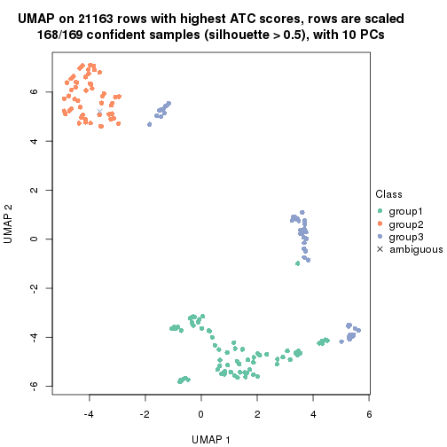</p>

</div>
<div id='tab-ATC-hclust-dimension-reduction-3'>
<pre><code class="r">dimension_reduction(res, k = 4, method = &quot;UMAP&quot;)
</code></pre>

<p></p>

</div>
<div id='tab-ATC-hclust-dimension-reduction-4'>
<pre><code class="r">dimension_reduction(res, k = 5, method = &quot;UMAP&quot;)
</code></pre>

<p></p>

</div>
<div id='tab-ATC-hclust-dimension-reduction-5'>
<pre><code class="r">dimension_reduction(res, k = 6, method = &quot;UMAP&quot;)
</code></pre>

<p></p>

</div>
</div>


Following heatmap shows how subgroups are split when increasing `k`:

```r
collect_classes(res)
```


Test correlation between subgroups and known annotations. If the known
annotation is numeric, one-way ANOVA test is applied, and if the known
annotation is discrete, chi-squared contingency table test is applied.

```r
test_to_known_factors(res)
```

```
#>              n agent(p) dose(p)  time(p) k
#> ATC:hclust 167   0.6267   0.942 7.59e-25 2
#> ATC:hclust 168   0.9275   0.991 4.45e-49 3
#> ATC:hclust 163   0.2796   0.608 5.96e-48 4
#> ATC:hclust 159   0.2858   0.786 1.56e-67 5
#> ATC:hclust 163   0.0307   0.933 3.98e-66 6
```


If matrix rows can be associated to genes, consider to use `GO_Enrichment(res,
...)` to perform function enrichment for the signature genes.


 

---------------------------------------------------


### ATC:kmeans**


The object with results only for a single top-value method and a single partition method 
can be extracted as:

```r
res = res_list["ATC", "kmeans"]
# you can also extract it by
# res = res_list["ATC:kmeans"]
```

A summary of `res` and all the functions that can be applied to it:

```r
res
```

```
#> A 'ConsensusPartition' object with k = 2, 3, 4, 5, 6.
#>   On a matrix with 21163 rows and 169 columns.
#>   Top rows (1000, 2000, 3000, 4000, 5000) are extracted by 'ATC' method.
#>   Subgroups are detected by 'kmeans' method.
#>   Performed in total 1250 partitions by row resampling.
#>   Best k for subgroups seems to be 2.
#> 
#> Following methods can be applied to this 'ConsensusPartition' object:
#>  [1] "cola_report"             "collect_classes"         "collect_plots"          
#>  [4] "collect_stats"           "colnames"                "compare_signatures"     
#>  [7] "consensus_heatmap"       "dimension_reduction"     "functional_enrichment"  
#> [10] "get_anno_col"            "get_anno"                "get_classes"            
#> [13] "get_consensus"           "get_matrix"              "get_membership"         
#> [16] "get_param"               "get_signatures"          "get_stats"              
#> [19] "is_best_k"               "is_stable_k"             "membership_heatmap"     
#> [22] "ncol"                    "nrow"                    "plot_ecdf"              
#> [25] "rownames"                "select_partition_number" "show"                   
#> [28] "suggest_best_k"          "test_to_known_factors"
```

`collect_plots()` function collects all the plots made from `res` for all `k` (number of partitions)
into one single page to provide an easy and fast comparison between different `k`.

```r
collect_plots(res)
```


The plots are:

- The first row: a plot of the ECDF (Empirical cumulative distribution
  function) curves of the consensus matrix for each `k` and the heatmap of
  predicted classes for each `k`.
- The second row: heatmaps of the consensus matrix for each `k`.
- The third row: heatmaps of the membership matrix for each `k`.
- The fouth row: heatmaps of the signatures for each `k`.

All the plots in panels can be made by individual functions and they are
plotted later in this section.

`select_partition_number()` produces several plots showing different
statistics for choosing "optimized" `k`. There are following statistics:

- ECDF curves of the consensus matrix for each `k`;
- 1-PAC. [The PAC
  score](https://en.wikipedia.org/wiki/Consensus_clustering#Over-interpretation_potential_of_consensus_clustering)
  measures the proportion of the ambiguous subgrouping.
- Mean silhouette score.
- Concordance. The mean probability of fiting the consensus class ids in all
  partitions.
- Area increased. Denote $A_k$ as the area under the ECDF curve for current
  `k`, the area increased is defined as $A_k - A_{k-1}$.
- Rand index. The percent of pairs of samples that are both in a same cluster
  or both are not in a same cluster in the partition of k and k-1.
- Jaccard index. The ratio of pairs of samples are both in a same cluster in
  the partition of k and k-1 and the pairs of samples are both in a same
  cluster in the partition k or k-1.

The detailed explanations of these statistics can be found in [the cola
vignette](http://bioconductor.org/packages/devel/bioc/vignettes/cola/inst/doc/cola.html#toc_13).

Generally speaking, lower PAC score, higher mean silhouette score or higher
concordance corresponds to better partition. Rand index and Jaccard index
measure how similar the current partition is compared to partition with `k-1`.
If they are too similar, we won't accept `k` is better than `k-1`.

```r
select_partition_number(res)
```


The numeric values for all these statistics can be obtained by `get_stats()`.

```r
get_stats(res)
```

```
#>   k 1-PAC mean_silhouette concordance area_increased  Rand Jaccard
#> 2 2 1.000           1.000       1.000         0.4709 0.530   0.530
#> 3 3 0.778           0.909       0.931         0.3694 0.796   0.622
#> 4 4 0.716           0.657       0.755         0.1124 0.943   0.843
#> 5 5 0.686           0.557       0.691         0.0697 0.818   0.489
#> 6 6 0.715           0.684       0.757         0.0447 0.891   0.572
```

`suggest_best_k()` suggests the best $k$ based on these statistics. The rules are as follows:

- All $k$ with Jaccard index larger than 0.95 are removed because the increase of
  the partition number does not provides enough extra information. If all $k$ are removed,
  the best $k$ is assigned by `NA`.
- For $k$ with 1-PAC larger than 0.9, the maximal $k$ is taken as the "best k". Other $k$ is called "optional k".
- If it does not fit the second rule. The $k$ with the highest vote of highest
  1-PAC, mean silhouette and concordance is taken as the "best k".

```r
suggest_best_k(res)
```

```
#> [1] 2
```


Following shows the table of the partitions (You need to click the **show/hide
code output** link to see it). The membership matrix (columns with name `p*`)
is inferred by
[`clue::cl_consensus()`](https://www.rdocumentation.org/link/cl_consensus?package=clue)
function with the `SE` method. Basically the value in the membership matrix
represents the probability to belong to a certain group. The finall class
label for an item is determined with the group with highest probability it
belongs to.

In `get_classes()` function, the entropy is calculated from the membership
matrix and the silhouette score is calculated from the consensus matrix.


<script>
$( function() {
	$( '#tabs-ATC-kmeans-get-classes' ).tabs();
} );
</script>
<div id='tabs-ATC-kmeans-get-classes'>
<ul>
<li><a href='#tab-ATC-kmeans-get-classes-1'>k = 2</a></li>
<li><a href='#tab-ATC-kmeans-get-classes-2'>k = 3</a></li>
<li><a href='#tab-ATC-kmeans-get-classes-3'>k = 4</a></li>
<li><a href='#tab-ATC-kmeans-get-classes-4'>k = 5</a></li>
<li><a href='#tab-ATC-kmeans-get-classes-5'>k = 6</a></li>
</ul>

<div id='tab-ATC-kmeans-get-classes-1'>
<p><a id='tab-ATC-kmeans-get-classes-1-a' style='color:#0366d6' href='#'>show/hide code output</a></p>
<pre><code class="r">cbind(get_classes(res, k = 2), get_membership(res, k = 2))
</code></pre>

<pre><code>#&gt;           class entropy silhouette p1 p2
#&gt; GSM528681     2       0          1  0  1
#&gt; GSM528682     2       0          1  0  1
#&gt; GSM528683     2       0          1  0  1
#&gt; GSM528684     2       0          1  0  1
#&gt; GSM528687     2       0          1  0  1
#&gt; GSM528688     2       0          1  0  1
#&gt; GSM528685     2       0          1  0  1
#&gt; GSM528686     2       0          1  0  1
#&gt; GSM528693     1       0          1  1  0
#&gt; GSM528694     1       0          1  1  0
#&gt; GSM528695     1       0          1  1  0
#&gt; GSM528696     1       0          1  1  0
#&gt; GSM528697     1       0          1  1  0
#&gt; GSM528698     1       0          1  1  0
#&gt; GSM528699     1       0          1  1  0
#&gt; GSM528700     1       0          1  1  0
#&gt; GSM528689     1       0          1  1  0
#&gt; GSM528690     1       0          1  1  0
#&gt; GSM528691     1       0          1  1  0
#&gt; GSM528692     1       0          1  1  0
#&gt; GSM528779     2       0          1  0  1
#&gt; GSM528780     2       0          1  0  1
#&gt; GSM528782     2       0          1  0  1
#&gt; GSM528781     2       0          1  0  1
#&gt; GSM528785     1       0          1  1  0
#&gt; GSM528786     1       0          1  1  0
#&gt; GSM528787     1       0          1  1  0
#&gt; GSM528788     1       0          1  1  0
#&gt; GSM528783     1       0          1  1  0
#&gt; GSM528784     1       0          1  1  0
#&gt; GSM528759     1       0          1  1  0
#&gt; GSM528760     1       0          1  1  0
#&gt; GSM528761     2       0          1  0  1
#&gt; GSM528762     2       0          1  0  1
#&gt; GSM528765     2       0          1  0  1
#&gt; GSM528766     2       0          1  0  1
#&gt; GSM528763     2       0          1  0  1
#&gt; GSM528764     2       0          1  0  1
#&gt; GSM528771     1       0          1  1  0
#&gt; GSM528772     1       0          1  1  0
#&gt; GSM528773     1       0          1  1  0
#&gt; GSM528774     1       0          1  1  0
#&gt; GSM528775     1       0          1  1  0
#&gt; GSM528776     1       0          1  1  0
#&gt; GSM528777     1       0          1  1  0
#&gt; GSM528778     1       0          1  1  0
#&gt; GSM528767     1       0          1  1  0
#&gt; GSM528768     1       0          1  1  0
#&gt; GSM528769     1       0          1  1  0
#&gt; GSM528770     1       0          1  1  0
#&gt; GSM528671     2       0          1  0  1
#&gt; GSM528672     2       0          1  0  1
#&gt; GSM528674     2       0          1  0  1
#&gt; GSM528673     2       0          1  0  1
#&gt; GSM528677     1       0          1  1  0
#&gt; GSM528678     1       0          1  1  0
#&gt; GSM528679     1       0          1  1  0
#&gt; GSM528680     1       0          1  1  0
#&gt; GSM528675     1       0          1  1  0
#&gt; GSM528676     1       0          1  1  0
#&gt; GSM528651     2       0          1  0  1
#&gt; GSM528652     2       0          1  0  1
#&gt; GSM528653     2       0          1  0  1
#&gt; GSM528654     2       0          1  0  1
#&gt; GSM528657     2       0          1  0  1
#&gt; GSM528658     2       0          1  0  1
#&gt; GSM528655     2       0          1  0  1
#&gt; GSM528656     2       0          1  0  1
#&gt; GSM528663     1       0          1  1  0
#&gt; GSM528664     1       0          1  1  0
#&gt; GSM528665     1       0          1  1  0
#&gt; GSM528666     1       0          1  1  0
#&gt; GSM528667     1       0          1  1  0
#&gt; GSM528668     1       0          1  1  0
#&gt; GSM528669     1       0          1  1  0
#&gt; GSM528670     1       0          1  1  0
#&gt; GSM528659     1       0          1  1  0
#&gt; GSM528660     1       0          1  1  0
#&gt; GSM528661     1       0          1  1  0
#&gt; GSM528662     1       0          1  1  0
#&gt; GSM528701     2       0          1  0  1
#&gt; GSM528702     2       0          1  0  1
#&gt; GSM528703     2       0          1  0  1
#&gt; GSM528704     2       0          1  0  1
#&gt; GSM528707     2       0          1  0  1
#&gt; GSM528708     2       0          1  0  1
#&gt; GSM528705     2       0          1  0  1
#&gt; GSM528706     2       0          1  0  1
#&gt; GSM528713     1       0          1  1  0
#&gt; GSM528714     1       0          1  1  0
#&gt; GSM528715     1       0          1  1  0
#&gt; GSM528716     1       0          1  1  0
#&gt; GSM528717     1       0          1  1  0
#&gt; GSM528718     1       0          1  1  0
#&gt; GSM528719     1       0          1  1  0
#&gt; GSM528720     1       0          1  1  0
#&gt; GSM528709     1       0          1  1  0
#&gt; GSM528710     1       0          1  1  0
#&gt; GSM528711     1       0          1  1  0
#&gt; GSM528712     1       0          1  1  0
#&gt; GSM528721     2       0          1  0  1
#&gt; GSM528722     2       0          1  0  1
#&gt; GSM528723     2       0          1  0  1
#&gt; GSM528724     2       0          1  0  1
#&gt; GSM528727     2       0          1  0  1
#&gt; GSM528728     2       0          1  0  1
#&gt; GSM528725     2       0          1  0  1
#&gt; GSM528726     2       0          1  0  1
#&gt; GSM528733     1       0          1  1  0
#&gt; GSM528734     1       0          1  1  0
#&gt; GSM528735     1       0          1  1  0
#&gt; GSM528736     1       0          1  1  0
#&gt; GSM528737     1       0          1  1  0
#&gt; GSM528738     1       0          1  1  0
#&gt; GSM528729     1       0          1  1  0
#&gt; GSM528730     1       0          1  1  0
#&gt; GSM528731     1       0          1  1  0
#&gt; GSM528732     1       0          1  1  0
#&gt; GSM528739     2       0          1  0  1
#&gt; GSM528740     2       0          1  0  1
#&gt; GSM528741     2       0          1  0  1
#&gt; GSM528742     2       0          1  0  1
#&gt; GSM528745     2       0          1  0  1
#&gt; GSM528746     2       0          1  0  1
#&gt; GSM528743     2       0          1  0  1
#&gt; GSM528744     2       0          1  0  1
#&gt; GSM528751     1       0          1  1  0
#&gt; GSM528752     1       0          1  1  0
#&gt; GSM528753     1       0          1  1  0
#&gt; GSM528754     1       0          1  1  0
#&gt; GSM528755     1       0          1  1  0
#&gt; GSM528756     1       0          1  1  0
#&gt; GSM528757     1       0          1  1  0
#&gt; GSM528758     1       0          1  1  0
#&gt; GSM528747     1       0          1  1  0
#&gt; GSM528748     1       0          1  1  0
#&gt; GSM528749     1       0          1  1  0
#&gt; GSM528750     1       0          1  1  0
#&gt; GSM528640     2       0          1  0  1
#&gt; GSM528641     2       0          1  0  1
#&gt; GSM528643     1       0          1  1  0
#&gt; GSM528644     1       0          1  1  0
#&gt; GSM528642     1       0          1  1  0
#&gt; GSM528620     2       0          1  0  1
#&gt; GSM528621     1       0          1  1  0
#&gt; GSM528623     1       0          1  1  0
#&gt; GSM528624     1       0          1  1  0
#&gt; GSM528622     1       0          1  1  0
#&gt; GSM528625     2       0          1  0  1
#&gt; GSM528626     2       0          1  0  1
#&gt; GSM528628     1       0          1  1  0
#&gt; GSM528629     1       0          1  1  0
#&gt; GSM528627     1       0          1  1  0
#&gt; GSM528630     2       0          1  0  1
#&gt; GSM528631     2       0          1  0  1
#&gt; GSM528632     2       0          1  0  1
#&gt; GSM528633     2       0          1  0  1
#&gt; GSM528636     1       0          1  1  0
#&gt; GSM528637     1       0          1  1  0
#&gt; GSM528638     1       0          1  1  0
#&gt; GSM528639     1       0          1  1  0
#&gt; GSM528634     1       0          1  1  0
#&gt; GSM528635     1       0          1  1  0
#&gt; GSM528645     1       0          1  1  0
#&gt; GSM528646     1       0          1  1  0
#&gt; GSM528647     1       0          1  1  0
#&gt; GSM528648     1       0          1  1  0
#&gt; GSM528649     1       0          1  1  0
#&gt; GSM528650     1       0          1  1  0
</code></pre>

<script>
$('#tab-ATC-kmeans-get-classes-1-a').parent().next().next().hide();
$('#tab-ATC-kmeans-get-classes-1-a').click(function(){
  $('#tab-ATC-kmeans-get-classes-1-a').parent().next().next().toggle();
  return(false);
});
</script>
</div>

<div id='tab-ATC-kmeans-get-classes-2'>
<p><a id='tab-ATC-kmeans-get-classes-2-a' style='color:#0366d6' href='#'>show/hide code output</a></p>
<pre><code class="r">cbind(get_classes(res, k = 3), get_membership(res, k = 3))
</code></pre>

<pre><code>#&gt;           class entropy silhouette    p1    p2    p3
#&gt; GSM528681     2  0.0000      0.943 0.000 1.000 0.000
#&gt; GSM528682     2  0.0000      0.943 0.000 1.000 0.000
#&gt; GSM528683     2  0.0000      0.943 0.000 1.000 0.000
#&gt; GSM528684     2  0.0000      0.943 0.000 1.000 0.000
#&gt; GSM528687     2  0.2261      0.922 0.000 0.932 0.068
#&gt; GSM528688     2  0.0424      0.941 0.000 0.992 0.008
#&gt; GSM528685     2  0.2959      0.909 0.000 0.900 0.100
#&gt; GSM528686     3  0.5968      0.182 0.000 0.364 0.636
#&gt; GSM528693     3  0.2959      0.927 0.100 0.000 0.900
#&gt; GSM528694     3  0.4654      0.852 0.208 0.000 0.792
#&gt; GSM528695     3  0.3340      0.937 0.120 0.000 0.880
#&gt; GSM528696     3  0.3340      0.937 0.120 0.000 0.880
#&gt; GSM528697     1  0.0000      0.958 1.000 0.000 0.000
#&gt; GSM528698     1  0.0000      0.958 1.000 0.000 0.000
#&gt; GSM528699     1  0.1289      0.948 0.968 0.000 0.032
#&gt; GSM528700     1  0.0237      0.957 0.996 0.000 0.004
#&gt; GSM528689     1  0.0000      0.958 1.000 0.000 0.000
#&gt; GSM528690     1  0.0237      0.957 0.996 0.000 0.004
#&gt; GSM528691     1  0.0000      0.958 1.000 0.000 0.000
#&gt; GSM528692     1  0.0000      0.958 1.000 0.000 0.000
#&gt; GSM528779     2  0.2878      0.911 0.000 0.904 0.096
#&gt; GSM528780     2  0.0000      0.943 0.000 1.000 0.000
#&gt; GSM528782     2  0.0000      0.943 0.000 1.000 0.000
#&gt; GSM528781     2  0.2878      0.911 0.000 0.904 0.096
#&gt; GSM528785     1  0.4062      0.847 0.836 0.000 0.164
#&gt; GSM528786     3  0.2165      0.909 0.064 0.000 0.936
#&gt; GSM528787     3  0.5397      0.755 0.280 0.000 0.720
#&gt; GSM528788     1  0.2448      0.944 0.924 0.000 0.076
#&gt; GSM528783     1  0.0000      0.958 1.000 0.000 0.000
#&gt; GSM528784     1  0.0000      0.958 1.000 0.000 0.000
#&gt; GSM528759     1  0.5926      0.400 0.644 0.000 0.356
#&gt; GSM528760     3  0.5291      0.773 0.268 0.000 0.732
#&gt; GSM528761     2  0.0000      0.943 0.000 1.000 0.000
#&gt; GSM528762     2  0.0000      0.943 0.000 1.000 0.000
#&gt; GSM528765     2  0.0000      0.943 0.000 1.000 0.000
#&gt; GSM528766     2  0.0000      0.943 0.000 1.000 0.000
#&gt; GSM528763     2  0.3267      0.898 0.000 0.884 0.116
#&gt; GSM528764     2  0.6280      0.381 0.000 0.540 0.460
#&gt; GSM528771     3  0.2959      0.927 0.100 0.000 0.900
#&gt; GSM528772     3  0.2959      0.927 0.100 0.000 0.900
#&gt; GSM528773     3  0.3340      0.937 0.120 0.000 0.880
#&gt; GSM528774     3  0.3340      0.937 0.120 0.000 0.880
#&gt; GSM528775     1  0.4002      0.820 0.840 0.000 0.160
#&gt; GSM528776     1  0.1289      0.958 0.968 0.000 0.032
#&gt; GSM528777     1  0.1031      0.949 0.976 0.000 0.024
#&gt; GSM528778     1  0.0747      0.953 0.984 0.000 0.016
#&gt; GSM528767     1  0.0000      0.958 1.000 0.000 0.000
#&gt; GSM528768     1  0.0000      0.958 1.000 0.000 0.000
#&gt; GSM528769     1  0.0000      0.958 1.000 0.000 0.000
#&gt; GSM528770     1  0.0000      0.958 1.000 0.000 0.000
#&gt; GSM528671     2  0.2878      0.911 0.000 0.904 0.096
#&gt; GSM528672     2  0.0000      0.943 0.000 1.000 0.000
#&gt; GSM528674     2  0.0000      0.943 0.000 1.000 0.000
#&gt; GSM528673     2  0.6280      0.381 0.000 0.540 0.460
#&gt; GSM528677     3  0.2959      0.927 0.100 0.000 0.900
#&gt; GSM528678     3  0.3340      0.937 0.120 0.000 0.880
#&gt; GSM528679     1  0.1163      0.959 0.972 0.000 0.028
#&gt; GSM528680     1  0.0237      0.957 0.996 0.000 0.004
#&gt; GSM528675     1  0.0000      0.958 1.000 0.000 0.000
#&gt; GSM528676     1  0.0000      0.958 1.000 0.000 0.000
#&gt; GSM528651     2  0.2878      0.911 0.000 0.904 0.096
#&gt; GSM528652     2  0.2878      0.911 0.000 0.904 0.096
#&gt; GSM528653     2  0.0000      0.943 0.000 1.000 0.000
#&gt; GSM528654     2  0.0000      0.943 0.000 1.000 0.000
#&gt; GSM528657     2  0.0000      0.943 0.000 1.000 0.000
#&gt; GSM528658     2  0.0000      0.943 0.000 1.000 0.000
#&gt; GSM528655     2  0.6280      0.381 0.000 0.540 0.460
#&gt; GSM528656     2  0.5835      0.620 0.000 0.660 0.340
#&gt; GSM528663     3  0.2261      0.910 0.068 0.000 0.932
#&gt; GSM528664     3  0.2261      0.910 0.068 0.000 0.932
#&gt; GSM528665     3  0.3340      0.937 0.120 0.000 0.880
#&gt; GSM528666     3  0.3340      0.937 0.120 0.000 0.880
#&gt; GSM528667     1  0.1289      0.958 0.968 0.000 0.032
#&gt; GSM528668     1  0.1289      0.958 0.968 0.000 0.032
#&gt; GSM528669     1  0.1289      0.948 0.968 0.000 0.032
#&gt; GSM528670     1  0.1964      0.953 0.944 0.000 0.056
#&gt; GSM528659     1  0.0000      0.958 1.000 0.000 0.000
#&gt; GSM528660     1  0.0000      0.958 1.000 0.000 0.000
#&gt; GSM528661     1  0.0000      0.958 1.000 0.000 0.000
#&gt; GSM528662     1  0.0000      0.958 1.000 0.000 0.000
#&gt; GSM528701     2  0.2878      0.911 0.000 0.904 0.096
#&gt; GSM528702     2  0.2878      0.911 0.000 0.904 0.096
#&gt; GSM528703     2  0.0000      0.943 0.000 1.000 0.000
#&gt; GSM528704     2  0.0000      0.943 0.000 1.000 0.000
#&gt; GSM528707     2  0.0000      0.943 0.000 1.000 0.000
#&gt; GSM528708     2  0.0000      0.943 0.000 1.000 0.000
#&gt; GSM528705     2  0.0000      0.943 0.000 1.000 0.000
#&gt; GSM528706     2  0.1753      0.928 0.000 0.952 0.048
#&gt; GSM528713     3  0.4555      0.842 0.200 0.000 0.800
#&gt; GSM528714     3  0.2959      0.927 0.100 0.000 0.900
#&gt; GSM528715     3  0.3340      0.937 0.120 0.000 0.880
#&gt; GSM528716     3  0.3340      0.937 0.120 0.000 0.880
#&gt; GSM528717     1  0.1289      0.958 0.968 0.000 0.032
#&gt; GSM528718     1  0.1289      0.958 0.968 0.000 0.032
#&gt; GSM528719     1  0.0000      0.958 1.000 0.000 0.000
#&gt; GSM528720     1  0.0000      0.958 1.000 0.000 0.000
#&gt; GSM528709     1  0.0000      0.958 1.000 0.000 0.000
#&gt; GSM528710     1  0.0000      0.958 1.000 0.000 0.000
#&gt; GSM528711     1  0.0000      0.958 1.000 0.000 0.000
#&gt; GSM528712     1  0.0000      0.958 1.000 0.000 0.000
#&gt; GSM528721     2  0.0000      0.943 0.000 1.000 0.000
#&gt; GSM528722     2  0.0000      0.943 0.000 1.000 0.000
#&gt; GSM528723     2  0.0000      0.943 0.000 1.000 0.000
#&gt; GSM528724     2  0.0000      0.943 0.000 1.000 0.000
#&gt; GSM528727     2  0.0000      0.943 0.000 1.000 0.000
#&gt; GSM528728     2  0.0000      0.943 0.000 1.000 0.000
#&gt; GSM528725     2  0.2878      0.911 0.000 0.904 0.096
#&gt; GSM528726     2  0.0000      0.943 0.000 1.000 0.000
#&gt; GSM528733     3  0.3340      0.937 0.120 0.000 0.880
#&gt; GSM528734     3  0.3340      0.937 0.120 0.000 0.880
#&gt; GSM528735     1  0.2165      0.938 0.936 0.000 0.064
#&gt; GSM528736     1  0.3752      0.843 0.856 0.000 0.144
#&gt; GSM528737     1  0.1289      0.958 0.968 0.000 0.032
#&gt; GSM528738     1  0.1289      0.958 0.968 0.000 0.032
#&gt; GSM528729     1  0.1964      0.953 0.944 0.000 0.056
#&gt; GSM528730     1  0.2165      0.950 0.936 0.000 0.064
#&gt; GSM528731     1  0.1964      0.953 0.944 0.000 0.056
#&gt; GSM528732     1  0.2448      0.944 0.924 0.000 0.076
#&gt; GSM528739     2  0.2878      0.911 0.000 0.904 0.096
#&gt; GSM528740     2  0.2878      0.911 0.000 0.904 0.096
#&gt; GSM528741     2  0.0000      0.943 0.000 1.000 0.000
#&gt; GSM528742     2  0.0000      0.943 0.000 1.000 0.000
#&gt; GSM528745     2  0.2878      0.911 0.000 0.904 0.096
#&gt; GSM528746     2  0.0000      0.943 0.000 1.000 0.000
#&gt; GSM528743     2  0.0424      0.941 0.000 0.992 0.008
#&gt; GSM528744     2  0.0000      0.943 0.000 1.000 0.000
#&gt; GSM528751     3  0.4605      0.838 0.204 0.000 0.796
#&gt; GSM528752     3  0.4605      0.838 0.204 0.000 0.796
#&gt; GSM528753     3  0.3340      0.937 0.120 0.000 0.880
#&gt; GSM528754     3  0.3340      0.937 0.120 0.000 0.880
#&gt; GSM528755     1  0.1289      0.958 0.968 0.000 0.032
#&gt; GSM528756     1  0.2165      0.938 0.936 0.000 0.064
#&gt; GSM528757     1  0.2448      0.944 0.924 0.000 0.076
#&gt; GSM528758     1  0.2448      0.944 0.924 0.000 0.076
#&gt; GSM528747     1  0.1753      0.956 0.952 0.000 0.048
#&gt; GSM528748     1  0.2448      0.944 0.924 0.000 0.076
#&gt; GSM528749     1  0.1753      0.956 0.952 0.000 0.048
#&gt; GSM528750     1  0.1753      0.956 0.952 0.000 0.048
#&gt; GSM528640     2  0.0000      0.943 0.000 1.000 0.000
#&gt; GSM528641     2  0.6299      0.339 0.000 0.524 0.476
#&gt; GSM528643     3  0.3340      0.937 0.120 0.000 0.880
#&gt; GSM528644     1  0.2448      0.944 0.924 0.000 0.076
#&gt; GSM528642     1  0.1643      0.954 0.956 0.000 0.044
#&gt; GSM528620     2  0.0000      0.943 0.000 1.000 0.000
#&gt; GSM528621     3  0.0237      0.844 0.000 0.004 0.996
#&gt; GSM528623     3  0.3340      0.937 0.120 0.000 0.880
#&gt; GSM528624     1  0.2448      0.944 0.924 0.000 0.076
#&gt; GSM528622     1  0.1289      0.958 0.968 0.000 0.032
#&gt; GSM528625     2  0.0000      0.943 0.000 1.000 0.000
#&gt; GSM528626     3  0.3267      0.722 0.000 0.116 0.884
#&gt; GSM528628     3  0.3340      0.937 0.120 0.000 0.880
#&gt; GSM528629     1  0.2448      0.944 0.924 0.000 0.076
#&gt; GSM528627     1  0.1289      0.958 0.968 0.000 0.032
#&gt; GSM528630     2  0.0000      0.943 0.000 1.000 0.000
#&gt; GSM528631     2  0.2878      0.911 0.000 0.904 0.096
#&gt; GSM528632     3  0.1529      0.808 0.000 0.040 0.960
#&gt; GSM528633     3  0.1529      0.808 0.000 0.040 0.960
#&gt; GSM528636     3  0.3340      0.937 0.120 0.000 0.880
#&gt; GSM528637     3  0.3340      0.937 0.120 0.000 0.880
#&gt; GSM528638     1  0.2448      0.944 0.924 0.000 0.076
#&gt; GSM528639     1  0.2448      0.944 0.924 0.000 0.076
#&gt; GSM528634     1  0.1289      0.958 0.968 0.000 0.032
#&gt; GSM528635     1  0.1289      0.958 0.968 0.000 0.032
#&gt; GSM528645     3  0.3340      0.937 0.120 0.000 0.880
#&gt; GSM528646     3  0.3340      0.937 0.120 0.000 0.880
#&gt; GSM528647     3  0.3340      0.937 0.120 0.000 0.880
#&gt; GSM528648     1  0.1289      0.958 0.968 0.000 0.032
#&gt; GSM528649     1  0.4062      0.814 0.836 0.000 0.164
#&gt; GSM528650     1  0.1289      0.958 0.968 0.000 0.032
</code></pre>

<script>
$('#tab-ATC-kmeans-get-classes-2-a').parent().next().next().hide();
$('#tab-ATC-kmeans-get-classes-2-a').click(function(){
  $('#tab-ATC-kmeans-get-classes-2-a').parent().next().next().toggle();
  return(false);
});
</script>
</div>

<div id='tab-ATC-kmeans-get-classes-3'>
<p><a id='tab-ATC-kmeans-get-classes-3-a' style='color:#0366d6' href='#'>show/hide code output</a></p>
<pre><code class="r">cbind(get_classes(res, k = 4), get_membership(res, k = 4))
</code></pre>

<pre><code>#&gt;           class entropy silhouette    p1    p2    p3    p4
#&gt; GSM528681     2  0.0000     0.8349 0.000 1.000 0.000 0.000
#&gt; GSM528682     2  0.0000     0.8349 0.000 1.000 0.000 0.000
#&gt; GSM528683     2  0.0000     0.8349 0.000 1.000 0.000 0.000
#&gt; GSM528684     2  0.0000     0.8349 0.000 1.000 0.000 0.000
#&gt; GSM528687     2  0.4624     0.4688 0.000 0.660 0.000 0.340
#&gt; GSM528688     2  0.1940     0.7891 0.000 0.924 0.000 0.076
#&gt; GSM528685     2  0.4916     0.2129 0.000 0.576 0.000 0.424
#&gt; GSM528686     4  0.7662     0.6679 0.000 0.344 0.220 0.436
#&gt; GSM528693     3  0.7914     0.3642 0.312 0.000 0.356 0.332
#&gt; GSM528694     3  0.7896     0.3281 0.336 0.000 0.368 0.296
#&gt; GSM528695     3  0.0000     0.7342 0.000 0.000 1.000 0.000
#&gt; GSM528696     3  0.0000     0.7342 0.000 0.000 1.000 0.000
#&gt; GSM528697     1  0.4933     0.7124 0.688 0.000 0.016 0.296
#&gt; GSM528698     1  0.4957     0.7122 0.684 0.000 0.016 0.300
#&gt; GSM528699     1  0.4608     0.7170 0.692 0.000 0.004 0.304
#&gt; GSM528700     1  0.4605     0.7076 0.664 0.000 0.000 0.336
#&gt; GSM528689     1  0.4933     0.7124 0.688 0.000 0.016 0.296
#&gt; GSM528690     1  0.4535     0.7123 0.704 0.000 0.004 0.292
#&gt; GSM528691     1  0.4957     0.7118 0.684 0.000 0.016 0.300
#&gt; GSM528692     1  0.4957     0.7118 0.684 0.000 0.016 0.300
#&gt; GSM528779     2  0.4624     0.4688 0.000 0.660 0.000 0.340
#&gt; GSM528780     2  0.0000     0.8349 0.000 1.000 0.000 0.000
#&gt; GSM528782     2  0.0000     0.8349 0.000 1.000 0.000 0.000
#&gt; GSM528781     2  0.4624     0.4688 0.000 0.660 0.000 0.340
#&gt; GSM528785     1  0.5746     0.4271 0.612 0.000 0.040 0.348
#&gt; GSM528786     3  0.0336     0.7254 0.008 0.000 0.992 0.000
#&gt; GSM528787     3  0.7629     0.2983 0.392 0.000 0.404 0.204
#&gt; GSM528788     1  0.2546     0.7385 0.900 0.000 0.008 0.092
#&gt; GSM528783     1  0.4883     0.7151 0.696 0.000 0.016 0.288
#&gt; GSM528784     1  0.4883     0.7151 0.696 0.000 0.016 0.288
#&gt; GSM528759     1  0.7638    -0.0859 0.460 0.000 0.308 0.232
#&gt; GSM528760     1  0.7603    -0.2200 0.436 0.000 0.360 0.204
#&gt; GSM528761     2  0.0000     0.8349 0.000 1.000 0.000 0.000
#&gt; GSM528762     2  0.0000     0.8349 0.000 1.000 0.000 0.000
#&gt; GSM528765     2  0.0000     0.8349 0.000 1.000 0.000 0.000
#&gt; GSM528766     2  0.0000     0.8349 0.000 1.000 0.000 0.000
#&gt; GSM528763     2  0.4941     0.1646 0.000 0.564 0.000 0.436
#&gt; GSM528764     4  0.7648     0.6635 0.000 0.348 0.216 0.436
#&gt; GSM528771     3  0.7914     0.3642 0.312 0.000 0.356 0.332
#&gt; GSM528772     3  0.7914     0.3642 0.312 0.000 0.356 0.332
#&gt; GSM528773     3  0.0000     0.7342 0.000 0.000 1.000 0.000
#&gt; GSM528774     3  0.0000     0.7342 0.000 0.000 1.000 0.000
#&gt; GSM528775     1  0.6279     0.4408 0.664 0.000 0.156 0.180
#&gt; GSM528776     1  0.1297     0.7563 0.964 0.000 0.020 0.016
#&gt; GSM528777     1  0.2149     0.7523 0.912 0.000 0.000 0.088
#&gt; GSM528778     1  0.2149     0.7523 0.912 0.000 0.000 0.088
#&gt; GSM528767     1  0.4883     0.7151 0.696 0.000 0.016 0.288
#&gt; GSM528768     1  0.4883     0.7151 0.696 0.000 0.016 0.288
#&gt; GSM528769     1  0.4883     0.7151 0.696 0.000 0.016 0.288
#&gt; GSM528770     1  0.4883     0.7151 0.696 0.000 0.016 0.288
#&gt; GSM528671     2  0.4624     0.4688 0.000 0.660 0.000 0.340
#&gt; GSM528672     2  0.0000     0.8349 0.000 1.000 0.000 0.000
#&gt; GSM528674     2  0.0000     0.8349 0.000 1.000 0.000 0.000
#&gt; GSM528673     4  0.7634     0.6558 0.000 0.352 0.212 0.436
#&gt; GSM528677     3  0.7914     0.3642 0.312 0.000 0.356 0.332
#&gt; GSM528678     3  0.1792     0.6970 0.000 0.000 0.932 0.068
#&gt; GSM528679     1  0.1888     0.7583 0.940 0.000 0.016 0.044
#&gt; GSM528680     1  0.4356     0.7142 0.708 0.000 0.000 0.292
#&gt; GSM528675     1  0.4933     0.7124 0.688 0.000 0.016 0.296
#&gt; GSM528676     1  0.4933     0.7124 0.688 0.000 0.016 0.296
#&gt; GSM528651     2  0.4624     0.4688 0.000 0.660 0.000 0.340
#&gt; GSM528652     2  0.4624     0.4688 0.000 0.660 0.000 0.340
#&gt; GSM528653     2  0.0000     0.8349 0.000 1.000 0.000 0.000
#&gt; GSM528654     2  0.0000     0.8349 0.000 1.000 0.000 0.000
#&gt; GSM528657     2  0.0000     0.8349 0.000 1.000 0.000 0.000
#&gt; GSM528658     2  0.0000     0.8349 0.000 1.000 0.000 0.000
#&gt; GSM528655     4  0.7648     0.6635 0.000 0.348 0.216 0.436
#&gt; GSM528656     4  0.7340     0.4983 0.000 0.408 0.156 0.436
#&gt; GSM528663     3  0.7909     0.3618 0.304 0.000 0.356 0.340
#&gt; GSM528664     3  0.7909     0.3618 0.304 0.000 0.356 0.340
#&gt; GSM528665     3  0.0000     0.7342 0.000 0.000 1.000 0.000
#&gt; GSM528666     3  0.0000     0.7342 0.000 0.000 1.000 0.000
#&gt; GSM528667     1  0.1174     0.7569 0.968 0.000 0.020 0.012
#&gt; GSM528668     1  0.1174     0.7569 0.968 0.000 0.020 0.012
#&gt; GSM528669     1  0.2216     0.7417 0.908 0.000 0.000 0.092
#&gt; GSM528670     1  0.1940     0.7476 0.924 0.000 0.000 0.076
#&gt; GSM528659     1  0.4908     0.7123 0.692 0.000 0.016 0.292
#&gt; GSM528660     1  0.4908     0.7123 0.692 0.000 0.016 0.292
#&gt; GSM528661     1  0.4933     0.7124 0.688 0.000 0.016 0.296
#&gt; GSM528662     1  0.4933     0.7124 0.688 0.000 0.016 0.296
#&gt; GSM528701     2  0.4624     0.4688 0.000 0.660 0.000 0.340
#&gt; GSM528702     2  0.4624     0.4688 0.000 0.660 0.000 0.340
#&gt; GSM528703     2  0.0000     0.8349 0.000 1.000 0.000 0.000
#&gt; GSM528704     2  0.0000     0.8349 0.000 1.000 0.000 0.000
#&gt; GSM528707     2  0.0000     0.8349 0.000 1.000 0.000 0.000
#&gt; GSM528708     2  0.0188     0.8330 0.000 0.996 0.000 0.004
#&gt; GSM528705     2  0.1637     0.8008 0.000 0.940 0.000 0.060
#&gt; GSM528706     2  0.4193     0.5765 0.000 0.732 0.000 0.268
#&gt; GSM528713     4  0.7925    -0.4184 0.332 0.000 0.332 0.336
#&gt; GSM528714     3  0.7914     0.3642 0.312 0.000 0.356 0.332
#&gt; GSM528715     3  0.0000     0.7342 0.000 0.000 1.000 0.000
#&gt; GSM528716     3  0.0000     0.7342 0.000 0.000 1.000 0.000
#&gt; GSM528717     1  0.2174     0.7575 0.928 0.000 0.020 0.052
#&gt; GSM528718     1  0.4204     0.6789 0.788 0.000 0.020 0.192
#&gt; GSM528719     1  0.4957     0.7119 0.684 0.000 0.016 0.300
#&gt; GSM528720     1  0.4957     0.7119 0.684 0.000 0.016 0.300
#&gt; GSM528709     1  0.4933     0.7124 0.688 0.000 0.016 0.296
#&gt; GSM528710     1  0.4933     0.7124 0.688 0.000 0.016 0.296
#&gt; GSM528711     1  0.4933     0.7124 0.688 0.000 0.016 0.296
#&gt; GSM528712     1  0.4933     0.7124 0.688 0.000 0.016 0.296
#&gt; GSM528721     2  0.0000     0.8349 0.000 1.000 0.000 0.000
#&gt; GSM528722     2  0.1557     0.8034 0.000 0.944 0.000 0.056
#&gt; GSM528723     2  0.0000     0.8349 0.000 1.000 0.000 0.000
#&gt; GSM528724     2  0.0000     0.8349 0.000 1.000 0.000 0.000
#&gt; GSM528727     2  0.0000     0.8349 0.000 1.000 0.000 0.000
#&gt; GSM528728     2  0.0000     0.8349 0.000 1.000 0.000 0.000
#&gt; GSM528725     2  0.4624     0.4688 0.000 0.660 0.000 0.340
#&gt; GSM528726     2  0.1022     0.8182 0.000 0.968 0.000 0.032
#&gt; GSM528733     3  0.0000     0.7342 0.000 0.000 1.000 0.000
#&gt; GSM528734     3  0.0000     0.7342 0.000 0.000 1.000 0.000
#&gt; GSM528735     1  0.5186     0.5825 0.752 0.000 0.084 0.164
#&gt; GSM528736     1  0.6121     0.4581 0.680 0.000 0.156 0.164
#&gt; GSM528737     1  0.0895     0.7572 0.976 0.000 0.020 0.004
#&gt; GSM528738     1  0.2174     0.7425 0.928 0.000 0.020 0.052
#&gt; GSM528729     1  0.1867     0.7487 0.928 0.000 0.000 0.072
#&gt; GSM528730     1  0.2401     0.7405 0.904 0.000 0.004 0.092
#&gt; GSM528731     1  0.1940     0.7486 0.924 0.000 0.000 0.076
#&gt; GSM528732     1  0.2480     0.7390 0.904 0.000 0.008 0.088
#&gt; GSM528739     2  0.4624     0.4688 0.000 0.660 0.000 0.340
#&gt; GSM528740     2  0.4624     0.4688 0.000 0.660 0.000 0.340
#&gt; GSM528741     2  0.0000     0.8349 0.000 1.000 0.000 0.000
#&gt; GSM528742     2  0.0000     0.8349 0.000 1.000 0.000 0.000
#&gt; GSM528745     2  0.4817     0.3380 0.000 0.612 0.000 0.388
#&gt; GSM528746     2  0.0000     0.8349 0.000 1.000 0.000 0.000
#&gt; GSM528743     2  0.2530     0.7577 0.000 0.888 0.000 0.112
#&gt; GSM528744     2  0.1211     0.8141 0.000 0.960 0.000 0.040
#&gt; GSM528751     1  0.7885    -0.2658 0.372 0.000 0.288 0.340
#&gt; GSM528752     1  0.7892    -0.2761 0.368 0.000 0.292 0.340
#&gt; GSM528753     3  0.0000     0.7342 0.000 0.000 1.000 0.000
#&gt; GSM528754     3  0.0000     0.7342 0.000 0.000 1.000 0.000
#&gt; GSM528755     1  0.4375     0.6385 0.788 0.000 0.032 0.180
#&gt; GSM528756     1  0.5355     0.5693 0.736 0.000 0.084 0.180
#&gt; GSM528757     1  0.2546     0.7385 0.900 0.000 0.008 0.092
#&gt; GSM528758     1  0.2546     0.7385 0.900 0.000 0.008 0.092
#&gt; GSM528747     1  0.1557     0.7538 0.944 0.000 0.000 0.056
#&gt; GSM528748     1  0.2480     0.7390 0.904 0.000 0.008 0.088
#&gt; GSM528749     1  0.2198     0.7451 0.920 0.000 0.008 0.072
#&gt; GSM528750     1  0.2125     0.7474 0.920 0.000 0.004 0.076
#&gt; GSM528640     2  0.0000     0.8349 0.000 1.000 0.000 0.000
#&gt; GSM528641     4  0.7634     0.6696 0.000 0.340 0.216 0.444
#&gt; GSM528643     3  0.0000     0.7342 0.000 0.000 1.000 0.000
#&gt; GSM528644     1  0.2480     0.7373 0.904 0.000 0.008 0.088
#&gt; GSM528642     1  0.1284     0.7567 0.964 0.000 0.024 0.012
#&gt; GSM528620     2  0.0000     0.8349 0.000 1.000 0.000 0.000
#&gt; GSM528621     4  0.6461     0.2021 0.144 0.000 0.216 0.640
#&gt; GSM528623     3  0.0000     0.7342 0.000 0.000 1.000 0.000
#&gt; GSM528624     1  0.2546     0.7385 0.900 0.000 0.008 0.092
#&gt; GSM528622     1  0.1042     0.7576 0.972 0.000 0.020 0.008
#&gt; GSM528625     2  0.0000     0.8349 0.000 1.000 0.000 0.000
#&gt; GSM528626     4  0.7694     0.6787 0.000 0.296 0.252 0.452
#&gt; GSM528628     3  0.0000     0.7342 0.000 0.000 1.000 0.000
#&gt; GSM528629     1  0.2480     0.7373 0.904 0.000 0.008 0.088
#&gt; GSM528627     1  0.1297     0.7569 0.964 0.000 0.020 0.016
#&gt; GSM528630     2  0.0000     0.8349 0.000 1.000 0.000 0.000
#&gt; GSM528631     2  0.4624     0.4688 0.000 0.660 0.000 0.340
#&gt; GSM528632     4  0.7621     0.6536 0.000 0.212 0.344 0.444
#&gt; GSM528633     4  0.7599     0.6504 0.000 0.208 0.344 0.448
#&gt; GSM528636     3  0.0000     0.7342 0.000 0.000 1.000 0.000
#&gt; GSM528637     3  0.0000     0.7342 0.000 0.000 1.000 0.000
#&gt; GSM528638     1  0.2546     0.7385 0.900 0.000 0.008 0.092
#&gt; GSM528639     1  0.2480     0.7373 0.904 0.000 0.008 0.088
#&gt; GSM528634     1  0.1297     0.7569 0.964 0.000 0.020 0.016
#&gt; GSM528635     1  0.1174     0.7571 0.968 0.000 0.020 0.012
#&gt; GSM528645     3  0.0000     0.7342 0.000 0.000 1.000 0.000
#&gt; GSM528646     3  0.0000     0.7342 0.000 0.000 1.000 0.000
#&gt; GSM528647     3  0.3444     0.6225 0.000 0.000 0.816 0.184
#&gt; GSM528648     1  0.4182     0.6449 0.796 0.000 0.024 0.180
#&gt; GSM528649     1  0.6397     0.4123 0.652 0.000 0.164 0.184
#&gt; GSM528650     1  0.4079     0.6492 0.800 0.000 0.020 0.180
</code></pre>

<script>
$('#tab-ATC-kmeans-get-classes-3-a').parent().next().next().hide();
$('#tab-ATC-kmeans-get-classes-3-a').click(function(){
  $('#tab-ATC-kmeans-get-classes-3-a').parent().next().next().toggle();
  return(false);
});
</script>
</div>

<div id='tab-ATC-kmeans-get-classes-4'>
<p><a id='tab-ATC-kmeans-get-classes-4-a' style='color:#0366d6' href='#'>show/hide code output</a></p>
<pre><code class="r">cbind(get_classes(res, k = 5), get_membership(res, k = 5))
</code></pre>

<pre><code>#&gt;           class entropy silhouette    p1    p2    p3    p4    p5
#&gt; GSM528681     2  0.0290     0.8976 0.000 0.992 0.000 0.008 0.000
#&gt; GSM528682     2  0.0290     0.8976 0.000 0.992 0.000 0.008 0.000
#&gt; GSM528683     2  0.0290     0.8976 0.000 0.992 0.000 0.008 0.000
#&gt; GSM528684     2  0.0000     0.8976 0.000 1.000 0.000 0.000 0.000
#&gt; GSM528687     5  0.4273     0.5788 0.000 0.448 0.000 0.000 0.552
#&gt; GSM528688     2  0.3508     0.5829 0.000 0.748 0.000 0.000 0.252
#&gt; GSM528685     5  0.6000     0.6988 0.000 0.288 0.008 0.120 0.584
#&gt; GSM528686     5  0.6936     0.7050 0.000 0.188 0.104 0.120 0.588
#&gt; GSM528693     4  0.8046     0.2483 0.328 0.000 0.152 0.380 0.140
#&gt; GSM528694     4  0.7703     0.2484 0.308 0.000 0.136 0.444 0.112
#&gt; GSM528695     3  0.0566     0.9806 0.004 0.000 0.984 0.012 0.000
#&gt; GSM528696     3  0.0566     0.9806 0.004 0.000 0.984 0.012 0.000
#&gt; GSM528697     4  0.6456     0.0679 0.392 0.000 0.000 0.428 0.180
#&gt; GSM528698     4  0.6107     0.0383 0.372 0.000 0.000 0.496 0.132
#&gt; GSM528699     1  0.5641     0.2464 0.644 0.000 0.004 0.216 0.136
#&gt; GSM528700     1  0.6096     0.0882 0.536 0.000 0.000 0.316 0.148
#&gt; GSM528689     4  0.6408     0.0722 0.388 0.000 0.000 0.440 0.172
#&gt; GSM528690     4  0.6458     0.0639 0.396 0.000 0.000 0.424 0.180
#&gt; GSM528691     4  0.6312     0.0608 0.392 0.000 0.000 0.452 0.156
#&gt; GSM528692     4  0.6334     0.0607 0.388 0.000 0.000 0.452 0.160
#&gt; GSM528779     5  0.4227     0.6421 0.000 0.420 0.000 0.000 0.580
#&gt; GSM528780     2  0.0290     0.8976 0.000 0.992 0.000 0.008 0.000
#&gt; GSM528782     2  0.2329     0.8082 0.000 0.876 0.000 0.000 0.124
#&gt; GSM528781     5  0.4219     0.6460 0.000 0.416 0.000 0.000 0.584
#&gt; GSM528785     1  0.6771    -0.1784 0.460 0.000 0.024 0.376 0.140
#&gt; GSM528786     3  0.0162     0.9734 0.004 0.000 0.996 0.000 0.000
#&gt; GSM528787     4  0.6411     0.2136 0.316 0.000 0.132 0.536 0.016
#&gt; GSM528788     1  0.0740     0.6574 0.980 0.000 0.008 0.004 0.008
#&gt; GSM528783     1  0.5815     0.1254 0.508 0.000 0.000 0.396 0.096
#&gt; GSM528784     1  0.6344     0.0100 0.440 0.000 0.000 0.400 0.160
#&gt; GSM528759     4  0.6396     0.1840 0.400 0.000 0.120 0.468 0.012
#&gt; GSM528760     4  0.6532     0.2114 0.328 0.000 0.132 0.520 0.020
#&gt; GSM528761     2  0.0290     0.8976 0.000 0.992 0.000 0.008 0.000
#&gt; GSM528762     2  0.0290     0.8976 0.000 0.992 0.000 0.008 0.000
#&gt; GSM528765     2  0.0609     0.8893 0.000 0.980 0.000 0.000 0.020
#&gt; GSM528766     2  0.0290     0.8976 0.000 0.992 0.000 0.008 0.000
#&gt; GSM528763     5  0.5942     0.6997 0.000 0.284 0.008 0.116 0.592
#&gt; GSM528764     5  0.6936     0.7050 0.000 0.188 0.104 0.120 0.588
#&gt; GSM528771     4  0.8008     0.2451 0.340 0.000 0.140 0.376 0.144
#&gt; GSM528772     4  0.8030     0.2466 0.336 0.000 0.144 0.376 0.144
#&gt; GSM528773     3  0.0162     0.9734 0.004 0.000 0.996 0.000 0.000
#&gt; GSM528774     3  0.0451     0.9816 0.004 0.000 0.988 0.008 0.000
#&gt; GSM528775     4  0.5250     0.1255 0.404 0.000 0.040 0.552 0.004
#&gt; GSM528776     1  0.3480     0.5345 0.752 0.000 0.000 0.248 0.000
#&gt; GSM528777     1  0.1399     0.6451 0.952 0.000 0.000 0.028 0.020
#&gt; GSM528778     1  0.1399     0.6451 0.952 0.000 0.000 0.028 0.020
#&gt; GSM528767     1  0.6344     0.0100 0.440 0.000 0.000 0.400 0.160
#&gt; GSM528768     1  0.6344     0.0100 0.440 0.000 0.000 0.400 0.160
#&gt; GSM528769     1  0.6344     0.0100 0.440 0.000 0.000 0.400 0.160
#&gt; GSM528770     1  0.6344     0.0100 0.440 0.000 0.000 0.400 0.160
#&gt; GSM528671     5  0.4227     0.6421 0.000 0.420 0.000 0.000 0.580
#&gt; GSM528672     2  0.0162     0.8970 0.000 0.996 0.000 0.000 0.004
#&gt; GSM528674     2  0.2377     0.8047 0.000 0.872 0.000 0.000 0.128
#&gt; GSM528673     5  0.6936     0.7050 0.000 0.188 0.104 0.120 0.588
#&gt; GSM528677     4  0.8049     0.2470 0.332 0.000 0.152 0.376 0.140
#&gt; GSM528678     3  0.1928     0.9188 0.004 0.000 0.920 0.072 0.004
#&gt; GSM528679     1  0.3508     0.5323 0.748 0.000 0.000 0.252 0.000
#&gt; GSM528680     4  0.6417     0.0592 0.404 0.000 0.000 0.424 0.172
#&gt; GSM528675     4  0.6517     0.0658 0.392 0.000 0.000 0.416 0.192
#&gt; GSM528676     4  0.6515     0.0698 0.388 0.000 0.000 0.420 0.192
#&gt; GSM528651     5  0.4219     0.6460 0.000 0.416 0.000 0.000 0.584
#&gt; GSM528652     5  0.4227     0.6421 0.000 0.420 0.000 0.000 0.580
#&gt; GSM528653     2  0.0000     0.8976 0.000 1.000 0.000 0.000 0.000
#&gt; GSM528654     2  0.2329     0.8082 0.000 0.876 0.000 0.000 0.124
#&gt; GSM528657     2  0.2377     0.8047 0.000 0.872 0.000 0.000 0.128
#&gt; GSM528658     2  0.0162     0.8970 0.000 0.996 0.000 0.000 0.004
#&gt; GSM528655     5  0.6936     0.7050 0.000 0.188 0.104 0.120 0.588
#&gt; GSM528656     5  0.6820     0.7071 0.000 0.212 0.080 0.120 0.588
#&gt; GSM528663     4  0.8245     0.2451 0.288 0.000 0.152 0.372 0.188
#&gt; GSM528664     4  0.8245     0.2451 0.288 0.000 0.152 0.372 0.188
#&gt; GSM528665     3  0.0566     0.9806 0.004 0.000 0.984 0.012 0.000
#&gt; GSM528666     3  0.0566     0.9806 0.004 0.000 0.984 0.012 0.000
#&gt; GSM528667     1  0.3336     0.5539 0.772 0.000 0.000 0.228 0.000
#&gt; GSM528668     1  0.3336     0.5539 0.772 0.000 0.000 0.228 0.000
#&gt; GSM528669     1  0.0740     0.6581 0.980 0.000 0.004 0.008 0.008
#&gt; GSM528670     1  0.0740     0.6581 0.980 0.000 0.004 0.008 0.008
#&gt; GSM528659     4  0.6497     0.0664 0.392 0.000 0.000 0.420 0.188
#&gt; GSM528660     4  0.6497     0.0664 0.392 0.000 0.000 0.420 0.188
#&gt; GSM528661     4  0.6510     0.0754 0.380 0.000 0.000 0.428 0.192
#&gt; GSM528662     4  0.6510     0.0754 0.380 0.000 0.000 0.428 0.192
#&gt; GSM528701     5  0.4227     0.6421 0.000 0.420 0.000 0.000 0.580
#&gt; GSM528702     5  0.4227     0.6421 0.000 0.420 0.000 0.000 0.580
#&gt; GSM528703     2  0.0290     0.8976 0.000 0.992 0.000 0.008 0.000
#&gt; GSM528704     2  0.0290     0.8976 0.000 0.992 0.000 0.008 0.000
#&gt; GSM528707     2  0.0000     0.8976 0.000 1.000 0.000 0.000 0.000
#&gt; GSM528708     2  0.2377     0.8045 0.000 0.872 0.000 0.000 0.128
#&gt; GSM528705     2  0.3274     0.6586 0.000 0.780 0.000 0.000 0.220
#&gt; GSM528706     2  0.4307    -0.4403 0.000 0.504 0.000 0.000 0.496
#&gt; GSM528713     4  0.7962     0.2440 0.344 0.000 0.136 0.380 0.140
#&gt; GSM528714     4  0.8049     0.2470 0.332 0.000 0.152 0.376 0.140
#&gt; GSM528715     3  0.0451     0.9816 0.004 0.000 0.988 0.008 0.000
#&gt; GSM528716     3  0.0451     0.9816 0.004 0.000 0.988 0.008 0.000
#&gt; GSM528717     1  0.4235     0.2724 0.576 0.000 0.000 0.424 0.000
#&gt; GSM528718     4  0.4242     0.0535 0.428 0.000 0.000 0.572 0.000
#&gt; GSM528719     4  0.6066     0.0379 0.368 0.000 0.000 0.504 0.128
#&gt; GSM528720     4  0.6066     0.0379 0.368 0.000 0.000 0.504 0.128
#&gt; GSM528709     4  0.6411     0.0698 0.392 0.000 0.000 0.436 0.172
#&gt; GSM528710     4  0.6458     0.0639 0.396 0.000 0.000 0.424 0.180
#&gt; GSM528711     4  0.6408     0.0722 0.388 0.000 0.000 0.440 0.172
#&gt; GSM528712     4  0.6408     0.0722 0.388 0.000 0.000 0.440 0.172
#&gt; GSM528721     2  0.1043     0.8767 0.000 0.960 0.000 0.000 0.040
#&gt; GSM528722     2  0.3177     0.6829 0.000 0.792 0.000 0.000 0.208
#&gt; GSM528723     2  0.0290     0.8976 0.000 0.992 0.000 0.008 0.000
#&gt; GSM528724     2  0.0290     0.8976 0.000 0.992 0.000 0.008 0.000
#&gt; GSM528727     2  0.0162     0.8970 0.000 0.996 0.000 0.000 0.004
#&gt; GSM528728     2  0.0000     0.8976 0.000 1.000 0.000 0.000 0.000
#&gt; GSM528725     5  0.4235     0.6359 0.000 0.424 0.000 0.000 0.576
#&gt; GSM528726     2  0.2773     0.7574 0.000 0.836 0.000 0.000 0.164
#&gt; GSM528733     3  0.0451     0.9816 0.004 0.000 0.988 0.008 0.000
#&gt; GSM528734     3  0.0451     0.9816 0.004 0.000 0.988 0.008 0.000
#&gt; GSM528735     4  0.4793     0.0832 0.436 0.000 0.020 0.544 0.000
#&gt; GSM528736     4  0.5131     0.1123 0.420 0.000 0.040 0.540 0.000
#&gt; GSM528737     1  0.3242     0.5625 0.784 0.000 0.000 0.216 0.000
#&gt; GSM528738     1  0.3913     0.4152 0.676 0.000 0.000 0.324 0.000
#&gt; GSM528729     1  0.0451     0.6616 0.988 0.000 0.004 0.008 0.000
#&gt; GSM528730     1  0.0613     0.6592 0.984 0.000 0.004 0.004 0.008
#&gt; GSM528731     1  0.0486     0.6614 0.988 0.000 0.004 0.004 0.004
#&gt; GSM528732     1  0.0981     0.6522 0.972 0.000 0.008 0.012 0.008
#&gt; GSM528739     5  0.4227     0.6421 0.000 0.420 0.000 0.000 0.580
#&gt; GSM528740     5  0.4227     0.6421 0.000 0.420 0.000 0.000 0.580
#&gt; GSM528741     2  0.0290     0.8976 0.000 0.992 0.000 0.008 0.000
#&gt; GSM528742     2  0.0290     0.8976 0.000 0.992 0.000 0.008 0.000
#&gt; GSM528745     5  0.4726     0.6883 0.000 0.328 0.004 0.024 0.644
#&gt; GSM528746     2  0.0000     0.8976 0.000 1.000 0.000 0.000 0.000
#&gt; GSM528743     2  0.3913     0.3507 0.000 0.676 0.000 0.000 0.324
#&gt; GSM528744     2  0.3109     0.6995 0.000 0.800 0.000 0.000 0.200
#&gt; GSM528751     4  0.7862     0.2344 0.364 0.000 0.120 0.376 0.140
#&gt; GSM528752     4  0.7861     0.2362 0.360 0.000 0.120 0.380 0.140
#&gt; GSM528753     3  0.0451     0.9816 0.004 0.000 0.988 0.008 0.000
#&gt; GSM528754     3  0.0451     0.9816 0.004 0.000 0.988 0.008 0.000
#&gt; GSM528755     4  0.4415     0.0621 0.444 0.000 0.004 0.552 0.000
#&gt; GSM528756     4  0.4781     0.0923 0.428 0.000 0.020 0.552 0.000
#&gt; GSM528757     1  0.0740     0.6574 0.980 0.000 0.008 0.004 0.008
#&gt; GSM528758     1  0.0740     0.6574 0.980 0.000 0.008 0.004 0.008
#&gt; GSM528747     1  0.0771     0.6576 0.976 0.000 0.000 0.020 0.004
#&gt; GSM528748     1  0.0740     0.6567 0.980 0.000 0.008 0.004 0.008
#&gt; GSM528749     1  0.1026     0.6516 0.968 0.000 0.004 0.024 0.004
#&gt; GSM528750     1  0.0486     0.6614 0.988 0.000 0.004 0.004 0.004
#&gt; GSM528640     2  0.0000     0.8976 0.000 1.000 0.000 0.000 0.000
#&gt; GSM528641     5  0.7056     0.7028 0.004 0.184 0.104 0.120 0.588
#&gt; GSM528643     3  0.0451     0.9816 0.004 0.000 0.988 0.008 0.000
#&gt; GSM528644     1  0.0867     0.6545 0.976 0.000 0.008 0.008 0.008
#&gt; GSM528642     1  0.3509     0.5781 0.792 0.000 0.008 0.196 0.004
#&gt; GSM528620     2  0.0290     0.8976 0.000 0.992 0.000 0.008 0.000
#&gt; GSM528621     5  0.6052     0.4371 0.044 0.000 0.084 0.236 0.636
#&gt; GSM528623     3  0.0451     0.9816 0.004 0.000 0.988 0.008 0.000
#&gt; GSM528624     1  0.0740     0.6574 0.980 0.000 0.008 0.004 0.008
#&gt; GSM528622     1  0.3366     0.5644 0.784 0.000 0.000 0.212 0.004
#&gt; GSM528625     2  0.0162     0.8970 0.000 0.996 0.000 0.000 0.004
#&gt; GSM528626     5  0.7092     0.6945 0.004 0.172 0.116 0.120 0.588
#&gt; GSM528628     3  0.0566     0.9806 0.004 0.000 0.984 0.012 0.000
#&gt; GSM528629     1  0.0740     0.6566 0.980 0.000 0.008 0.004 0.008
#&gt; GSM528627     1  0.3491     0.5537 0.768 0.000 0.000 0.228 0.004
#&gt; GSM528630     2  0.0162     0.8977 0.000 0.996 0.000 0.004 0.000
#&gt; GSM528631     5  0.4219     0.6460 0.000 0.416 0.000 0.000 0.584
#&gt; GSM528632     5  0.7115     0.6543 0.004 0.128 0.160 0.120 0.588
#&gt; GSM528633     5  0.7115     0.6543 0.004 0.128 0.160 0.120 0.588
#&gt; GSM528636     3  0.0451     0.9816 0.004 0.000 0.988 0.008 0.000
#&gt; GSM528637     3  0.0451     0.9816 0.004 0.000 0.988 0.008 0.000
#&gt; GSM528638     1  0.0740     0.6574 0.980 0.000 0.008 0.004 0.008
#&gt; GSM528639     1  0.0867     0.6545 0.976 0.000 0.008 0.008 0.008
#&gt; GSM528634     1  0.3491     0.5537 0.768 0.000 0.000 0.228 0.004
#&gt; GSM528635     1  0.3266     0.5729 0.796 0.000 0.000 0.200 0.004
#&gt; GSM528645     3  0.0451     0.9816 0.004 0.000 0.988 0.008 0.000
#&gt; GSM528646     3  0.0451     0.9816 0.004 0.000 0.988 0.008 0.000
#&gt; GSM528647     3  0.4141     0.6801 0.000 0.000 0.728 0.248 0.024
#&gt; GSM528648     4  0.4283     0.0487 0.456 0.000 0.000 0.544 0.000
#&gt; GSM528649     4  0.5258     0.1229 0.408 0.000 0.040 0.548 0.004
#&gt; GSM528650     4  0.4283     0.0487 0.456 0.000 0.000 0.544 0.000
</code></pre>

<script>
$('#tab-ATC-kmeans-get-classes-4-a').parent().next().next().hide();
$('#tab-ATC-kmeans-get-classes-4-a').click(function(){
  $('#tab-ATC-kmeans-get-classes-4-a').parent().next().next().toggle();
  return(false);
});
</script>
</div>

<div id='tab-ATC-kmeans-get-classes-5'>
<p><a id='tab-ATC-kmeans-get-classes-5-a' style='color:#0366d6' href='#'>show/hide code output</a></p>
<pre><code class="r">cbind(get_classes(res, k = 6), get_membership(res, k = 6))
</code></pre>

<pre><code>#&gt;           class entropy silhouette    p1    p2    p3    p4    p5    p6
#&gt; GSM528681     2  0.0713      0.728 0.000 0.972 0.000 0.000 0.028 0.000
#&gt; GSM528682     2  0.0713      0.728 0.000 0.972 0.000 0.000 0.028 0.000
#&gt; GSM528683     2  0.0547      0.729 0.000 0.980 0.000 0.000 0.020 0.000
#&gt; GSM528684     2  0.0405      0.730 0.000 0.988 0.000 0.004 0.008 0.000
#&gt; GSM528687     2  0.6977      0.120 0.000 0.384 0.000 0.156 0.096 0.364
#&gt; GSM528688     2  0.5523      0.602 0.000 0.672 0.000 0.132 0.096 0.100
#&gt; GSM528685     6  0.2730      0.840 0.000 0.192 0.000 0.000 0.000 0.808
#&gt; GSM528686     6  0.3527      0.910 0.008 0.132 0.052 0.000 0.000 0.808
#&gt; GSM528693     5  0.5971      0.628 0.180 0.000 0.064 0.000 0.608 0.148
#&gt; GSM528694     5  0.5275      0.625 0.132 0.000 0.064 0.004 0.700 0.100
#&gt; GSM528695     3  0.0405      0.975 0.000 0.000 0.988 0.008 0.004 0.000
#&gt; GSM528696     3  0.0405      0.975 0.000 0.000 0.988 0.008 0.004 0.000
#&gt; GSM528697     4  0.3342      0.872 0.228 0.000 0.000 0.760 0.012 0.000
#&gt; GSM528698     4  0.5388      0.653 0.196 0.000 0.000 0.604 0.196 0.004
#&gt; GSM528699     1  0.4120     -0.371 0.524 0.000 0.004 0.468 0.004 0.000
#&gt; GSM528700     4  0.3695      0.682 0.376 0.000 0.000 0.624 0.000 0.000
#&gt; GSM528689     4  0.3052      0.873 0.216 0.000 0.000 0.780 0.004 0.000
#&gt; GSM528690     4  0.2883      0.873 0.212 0.000 0.000 0.788 0.000 0.000
#&gt; GSM528691     4  0.3892      0.852 0.212 0.000 0.000 0.740 0.048 0.000
#&gt; GSM528692     4  0.4091      0.850 0.212 0.000 0.000 0.732 0.052 0.004
#&gt; GSM528779     2  0.6966      0.120 0.000 0.384 0.000 0.160 0.092 0.364
#&gt; GSM528780     2  0.0858      0.727 0.000 0.968 0.000 0.004 0.028 0.000
#&gt; GSM528782     2  0.3828      0.679 0.000 0.776 0.000 0.124 0.100 0.000
#&gt; GSM528781     2  0.7039      0.108 0.000 0.380 0.000 0.136 0.120 0.364
#&gt; GSM528785     5  0.5466      0.592 0.240 0.000 0.008 0.000 0.596 0.156
#&gt; GSM528786     3  0.0870      0.969 0.000 0.000 0.972 0.012 0.012 0.004
#&gt; GSM528787     5  0.6251      0.540 0.256 0.000 0.064 0.104 0.568 0.008
#&gt; GSM528788     1  0.0862      0.774 0.972 0.000 0.008 0.016 0.004 0.000
#&gt; GSM528783     4  0.6033      0.607 0.364 0.000 0.000 0.492 0.040 0.104
#&gt; GSM528784     4  0.5688      0.788 0.260 0.000 0.000 0.600 0.044 0.096
#&gt; GSM528759     5  0.5767      0.538 0.292 0.000 0.060 0.060 0.584 0.004
#&gt; GSM528760     5  0.5759      0.549 0.264 0.000 0.064 0.076 0.596 0.000
#&gt; GSM528761     2  0.0858      0.727 0.000 0.968 0.000 0.004 0.028 0.000
#&gt; GSM528762     2  0.0713      0.728 0.000 0.972 0.000 0.000 0.028 0.000
#&gt; GSM528765     2  0.2058      0.722 0.000 0.908 0.000 0.056 0.036 0.000
#&gt; GSM528766     2  0.0858      0.727 0.000 0.968 0.000 0.004 0.028 0.000
#&gt; GSM528763     6  0.3264      0.842 0.008 0.184 0.000 0.012 0.000 0.796
#&gt; GSM528764     6  0.3527      0.910 0.008 0.132 0.052 0.000 0.000 0.808
#&gt; GSM528771     5  0.6062      0.625 0.180 0.000 0.064 0.000 0.596 0.160
#&gt; GSM528772     5  0.6062      0.625 0.180 0.000 0.064 0.000 0.596 0.160
#&gt; GSM528773     3  0.0870      0.969 0.000 0.000 0.972 0.012 0.012 0.004
#&gt; GSM528774     3  0.0870      0.969 0.000 0.000 0.972 0.012 0.012 0.004
#&gt; GSM528775     5  0.5857      0.492 0.312 0.000 0.020 0.120 0.544 0.004
#&gt; GSM528776     1  0.5134      0.473 0.628 0.000 0.000 0.128 0.240 0.004
#&gt; GSM528777     1  0.1718      0.745 0.936 0.000 0.000 0.020 0.024 0.020
#&gt; GSM528778     1  0.1718      0.745 0.936 0.000 0.000 0.020 0.024 0.020
#&gt; GSM528767     4  0.5688      0.788 0.260 0.000 0.000 0.600 0.044 0.096
#&gt; GSM528768     4  0.5688      0.788 0.260 0.000 0.000 0.600 0.044 0.096
#&gt; GSM528769     4  0.5688      0.788 0.260 0.000 0.000 0.600 0.044 0.096
#&gt; GSM528770     4  0.5688      0.788 0.260 0.000 0.000 0.600 0.044 0.096
#&gt; GSM528671     2  0.7031      0.109 0.000 0.380 0.000 0.144 0.112 0.364
#&gt; GSM528672     2  0.0806      0.731 0.000 0.972 0.000 0.020 0.008 0.000
#&gt; GSM528674     2  0.3876      0.677 0.000 0.772 0.000 0.108 0.120 0.000
#&gt; GSM528673     6  0.3457      0.908 0.004 0.136 0.052 0.000 0.000 0.808
#&gt; GSM528677     5  0.6062      0.625 0.180 0.000 0.064 0.000 0.596 0.160
#&gt; GSM528678     3  0.1578      0.940 0.000 0.000 0.936 0.012 0.048 0.004
#&gt; GSM528679     1  0.5175      0.500 0.632 0.000 0.000 0.152 0.212 0.004
#&gt; GSM528680     4  0.3217      0.873 0.224 0.000 0.000 0.768 0.008 0.000
#&gt; GSM528675     4  0.3986      0.871 0.204 0.000 0.000 0.748 0.012 0.036
#&gt; GSM528676     4  0.3986      0.871 0.204 0.000 0.000 0.748 0.012 0.036
#&gt; GSM528651     2  0.7031      0.109 0.000 0.380 0.000 0.144 0.112 0.364
#&gt; GSM528652     2  0.7039      0.108 0.000 0.380 0.000 0.136 0.120 0.364
#&gt; GSM528653     2  0.0622      0.730 0.000 0.980 0.000 0.012 0.008 0.000
#&gt; GSM528654     2  0.3828      0.679 0.000 0.776 0.000 0.124 0.100 0.000
#&gt; GSM528657     2  0.3876      0.677 0.000 0.772 0.000 0.108 0.120 0.000
#&gt; GSM528658     2  0.0806      0.731 0.000 0.972 0.000 0.020 0.008 0.000
#&gt; GSM528655     6  0.3527      0.910 0.008 0.132 0.052 0.000 0.000 0.808
#&gt; GSM528656     6  0.3409      0.902 0.004 0.144 0.044 0.000 0.000 0.808
#&gt; GSM528663     5  0.6155      0.565 0.140 0.000 0.068 0.000 0.580 0.212
#&gt; GSM528664     5  0.6138      0.567 0.144 0.000 0.064 0.000 0.580 0.212
#&gt; GSM528665     3  0.0405      0.975 0.000 0.000 0.988 0.008 0.004 0.000
#&gt; GSM528666     3  0.0405      0.975 0.000 0.000 0.988 0.008 0.004 0.000
#&gt; GSM528667     1  0.4971      0.528 0.656 0.000 0.000 0.128 0.212 0.004
#&gt; GSM528668     1  0.4971      0.528 0.656 0.000 0.000 0.128 0.212 0.004
#&gt; GSM528669     1  0.0603      0.777 0.980 0.000 0.000 0.016 0.004 0.000
#&gt; GSM528670     1  0.0603      0.777 0.980 0.000 0.000 0.016 0.004 0.000
#&gt; GSM528659     4  0.3986      0.871 0.204 0.000 0.000 0.748 0.012 0.036
#&gt; GSM528660     4  0.3986      0.871 0.204 0.000 0.000 0.748 0.012 0.036
#&gt; GSM528661     4  0.3691      0.873 0.204 0.000 0.000 0.764 0.012 0.020
#&gt; GSM528662     4  0.3661      0.873 0.200 0.000 0.000 0.768 0.012 0.020
#&gt; GSM528701     2  0.6966      0.120 0.000 0.384 0.000 0.160 0.092 0.364
#&gt; GSM528702     2  0.6966      0.120 0.000 0.384 0.000 0.160 0.092 0.364
#&gt; GSM528703     2  0.0858      0.727 0.000 0.968 0.000 0.004 0.028 0.000
#&gt; GSM528704     2  0.0713      0.728 0.000 0.972 0.000 0.000 0.028 0.000
#&gt; GSM528707     2  0.0622      0.730 0.000 0.980 0.000 0.012 0.008 0.000
#&gt; GSM528708     2  0.3968      0.677 0.000 0.772 0.000 0.124 0.100 0.004
#&gt; GSM528705     2  0.5271      0.625 0.000 0.692 0.000 0.140 0.096 0.072
#&gt; GSM528706     2  0.6828      0.282 0.000 0.460 0.000 0.152 0.092 0.296
#&gt; GSM528713     5  0.5907      0.629 0.180 0.000 0.064 0.000 0.616 0.140
#&gt; GSM528714     5  0.6062      0.625 0.180 0.000 0.064 0.000 0.596 0.160
#&gt; GSM528715     3  0.0000      0.977 0.000 0.000 1.000 0.000 0.000 0.000
#&gt; GSM528716     3  0.0000      0.977 0.000 0.000 1.000 0.000 0.000 0.000
#&gt; GSM528717     5  0.5800      0.190 0.396 0.000 0.000 0.156 0.444 0.004
#&gt; GSM528718     5  0.5684      0.411 0.324 0.000 0.000 0.156 0.516 0.004
#&gt; GSM528719     4  0.5337      0.653 0.188 0.000 0.000 0.612 0.196 0.004
#&gt; GSM528720     4  0.5337      0.653 0.188 0.000 0.000 0.612 0.196 0.004
#&gt; GSM528709     4  0.3052      0.873 0.216 0.000 0.000 0.780 0.004 0.000
#&gt; GSM528710     4  0.2883      0.873 0.212 0.000 0.000 0.788 0.000 0.000
#&gt; GSM528711     4  0.3052      0.873 0.216 0.000 0.000 0.780 0.004 0.000
#&gt; GSM528712     4  0.3052      0.873 0.216 0.000 0.000 0.780 0.004 0.000
#&gt; GSM528721     2  0.1863      0.725 0.000 0.920 0.000 0.044 0.036 0.000
#&gt; GSM528722     2  0.5184      0.632 0.000 0.692 0.000 0.160 0.092 0.056
#&gt; GSM528723     2  0.0713      0.728 0.000 0.972 0.000 0.000 0.028 0.000
#&gt; GSM528724     2  0.0713      0.728 0.000 0.972 0.000 0.000 0.028 0.000
#&gt; GSM528727     2  0.0972      0.729 0.000 0.964 0.000 0.008 0.028 0.000
#&gt; GSM528728     2  0.0520      0.730 0.000 0.984 0.000 0.008 0.008 0.000
#&gt; GSM528725     2  0.6977      0.120 0.000 0.384 0.000 0.156 0.096 0.364
#&gt; GSM528726     2  0.4645      0.658 0.000 0.740 0.000 0.120 0.104 0.036
#&gt; GSM528733     3  0.0000      0.977 0.000 0.000 1.000 0.000 0.000 0.000
#&gt; GSM528734     3  0.0000      0.977 0.000 0.000 1.000 0.000 0.000 0.000
#&gt; GSM528735     5  0.5688      0.451 0.340 0.000 0.008 0.120 0.528 0.004
#&gt; GSM528736     5  0.5903      0.473 0.328 0.000 0.020 0.120 0.528 0.004
#&gt; GSM528737     1  0.4934      0.532 0.660 0.000 0.000 0.124 0.212 0.004
#&gt; GSM528738     1  0.5333      0.319 0.576 0.000 0.000 0.120 0.300 0.004
#&gt; GSM528729     1  0.0458      0.777 0.984 0.000 0.000 0.016 0.000 0.000
#&gt; GSM528730     1  0.0603      0.777 0.980 0.000 0.004 0.016 0.000 0.000
#&gt; GSM528731     1  0.0976      0.776 0.968 0.000 0.000 0.016 0.008 0.008
#&gt; GSM528732     1  0.0924      0.769 0.972 0.000 0.008 0.004 0.008 0.008
#&gt; GSM528739     2  0.6966      0.120 0.000 0.384 0.000 0.160 0.092 0.364
#&gt; GSM528740     2  0.6966      0.120 0.000 0.384 0.000 0.160 0.092 0.364
#&gt; GSM528741     2  0.0858      0.727 0.000 0.968 0.000 0.004 0.028 0.000
#&gt; GSM528742     2  0.0858      0.727 0.000 0.968 0.000 0.004 0.028 0.000
#&gt; GSM528745     6  0.6263      0.471 0.000 0.236 0.000 0.132 0.072 0.560
#&gt; GSM528746     2  0.0000      0.730 0.000 1.000 0.000 0.000 0.000 0.000
#&gt; GSM528743     2  0.6052      0.536 0.000 0.616 0.000 0.112 0.120 0.152
#&gt; GSM528744     2  0.4997      0.642 0.000 0.716 0.000 0.108 0.120 0.056
#&gt; GSM528751     5  0.6009      0.627 0.184 0.000 0.060 0.000 0.600 0.156
#&gt; GSM528752     5  0.5947      0.628 0.184 0.000 0.060 0.000 0.608 0.148
#&gt; GSM528753     3  0.0000      0.977 0.000 0.000 1.000 0.000 0.000 0.000
#&gt; GSM528754     3  0.0000      0.977 0.000 0.000 1.000 0.000 0.000 0.000
#&gt; GSM528755     5  0.5456      0.445 0.340 0.000 0.000 0.120 0.536 0.004
#&gt; GSM528756     5  0.5667      0.463 0.332 0.000 0.008 0.120 0.536 0.004
#&gt; GSM528757     1  0.0862      0.774 0.972 0.000 0.008 0.016 0.004 0.000
#&gt; GSM528758     1  0.0862      0.774 0.972 0.000 0.008 0.016 0.004 0.000
#&gt; GSM528747     1  0.1173      0.775 0.960 0.000 0.000 0.016 0.016 0.008
#&gt; GSM528748     1  0.1235      0.774 0.960 0.000 0.008 0.016 0.008 0.008
#&gt; GSM528749     1  0.0665      0.772 0.980 0.000 0.000 0.004 0.008 0.008
#&gt; GSM528750     1  0.0976      0.776 0.968 0.000 0.000 0.016 0.008 0.008
#&gt; GSM528640     2  0.0260      0.730 0.000 0.992 0.000 0.000 0.008 0.000
#&gt; GSM528641     6  0.3527      0.910 0.008 0.132 0.052 0.000 0.000 0.808
#&gt; GSM528643     3  0.0000      0.977 0.000 0.000 1.000 0.000 0.000 0.000
#&gt; GSM528644     1  0.0912      0.774 0.972 0.000 0.008 0.012 0.004 0.004
#&gt; GSM528642     1  0.4738      0.612 0.724 0.000 0.008 0.088 0.164 0.016
#&gt; GSM528620     2  0.0692      0.729 0.000 0.976 0.000 0.004 0.020 0.000
#&gt; GSM528621     6  0.2926      0.669 0.012 0.000 0.024 0.000 0.112 0.852
#&gt; GSM528623     3  0.0000      0.977 0.000 0.000 1.000 0.000 0.000 0.000
#&gt; GSM528624     1  0.0862      0.774 0.972 0.000 0.008 0.016 0.004 0.000
#&gt; GSM528622     1  0.4981      0.566 0.680 0.000 0.000 0.116 0.188 0.016
#&gt; GSM528625     2  0.0806      0.731 0.000 0.972 0.000 0.020 0.008 0.000
#&gt; GSM528626     6  0.3564      0.905 0.008 0.124 0.060 0.000 0.000 0.808
#&gt; GSM528628     3  0.0405      0.975 0.000 0.000 0.988 0.008 0.004 0.000
#&gt; GSM528629     1  0.0912      0.774 0.972 0.000 0.008 0.012 0.004 0.004
#&gt; GSM528627     1  0.5168      0.532 0.652 0.000 0.000 0.116 0.216 0.016
#&gt; GSM528630     2  0.0692      0.730 0.000 0.976 0.000 0.004 0.020 0.000
#&gt; GSM528631     2  0.7039      0.108 0.000 0.380 0.000 0.136 0.120 0.364
#&gt; GSM528632     6  0.3626      0.878 0.008 0.096 0.088 0.000 0.000 0.808
#&gt; GSM528633     6  0.3626      0.878 0.008 0.096 0.088 0.000 0.000 0.808
#&gt; GSM528636     3  0.0000      0.977 0.000 0.000 1.000 0.000 0.000 0.000
#&gt; GSM528637     3  0.0000      0.977 0.000 0.000 1.000 0.000 0.000 0.000
#&gt; GSM528638     1  0.0862      0.774 0.972 0.000 0.008 0.016 0.004 0.000
#&gt; GSM528639     1  0.0862      0.774 0.972 0.000 0.008 0.016 0.004 0.000
#&gt; GSM528634     1  0.5272      0.521 0.644 0.000 0.000 0.116 0.220 0.020
#&gt; GSM528635     1  0.4725      0.591 0.708 0.000 0.000 0.100 0.176 0.016
#&gt; GSM528645     3  0.0870      0.969 0.000 0.000 0.972 0.012 0.012 0.004
#&gt; GSM528646     3  0.0870      0.969 0.000 0.000 0.972 0.012 0.012 0.004
#&gt; GSM528647     3  0.3481      0.692 0.000 0.000 0.756 0.012 0.228 0.004
#&gt; GSM528648     5  0.5341      0.461 0.336 0.000 0.000 0.108 0.552 0.004
#&gt; GSM528649     5  0.5738      0.500 0.308 0.000 0.020 0.108 0.560 0.004
#&gt; GSM528650     5  0.5341      0.461 0.336 0.000 0.000 0.108 0.552 0.004
</code></pre>

<script>
$('#tab-ATC-kmeans-get-classes-5-a').parent().next().next().hide();
$('#tab-ATC-kmeans-get-classes-5-a').click(function(){
  $('#tab-ATC-kmeans-get-classes-5-a').parent().next().next().toggle();
  return(false);
});
</script>
</div>
</div>

Heatmaps for the consensus matrix. It visualizes the probability of two
samples to be in a same group.


<script>
$( function() {
	$( '#tabs-ATC-kmeans-consensus-heatmap' ).tabs();
} );
</script>
<div id='tabs-ATC-kmeans-consensus-heatmap'>
<ul>
<li><a href='#tab-ATC-kmeans-consensus-heatmap-1'>k = 2</a></li>
<li><a href='#tab-ATC-kmeans-consensus-heatmap-2'>k = 3</a></li>
<li><a href='#tab-ATC-kmeans-consensus-heatmap-3'>k = 4</a></li>
<li><a href='#tab-ATC-kmeans-consensus-heatmap-4'>k = 5</a></li>
<li><a href='#tab-ATC-kmeans-consensus-heatmap-5'>k = 6</a></li>
</ul>
<div id='tab-ATC-kmeans-consensus-heatmap-1'>
<pre><code class="r">consensus_heatmap(res, k = 2)
</code></pre>

<p></p>

</div>
<div id='tab-ATC-kmeans-consensus-heatmap-2'>
<pre><code class="r">consensus_heatmap(res, k = 3)
</code></pre>

<p></p>

</div>
<div id='tab-ATC-kmeans-consensus-heatmap-3'>
<pre><code class="r">consensus_heatmap(res, k = 4)
</code></pre>

<p></p>

</div>
<div id='tab-ATC-kmeans-consensus-heatmap-4'>
<pre><code class="r">consensus_heatmap(res, k = 5)
</code></pre>

<p></p>

</div>
<div id='tab-ATC-kmeans-consensus-heatmap-5'>
<pre><code class="r">consensus_heatmap(res, k = 6)
</code></pre>

<p></p>

</div>
</div>

Heatmaps for the membership of samples in all partitions to see how consistent they are:


<script>
$( function() {
	$( '#tabs-ATC-kmeans-membership-heatmap' ).tabs();
} );
</script>
<div id='tabs-ATC-kmeans-membership-heatmap'>
<ul>
<li><a href='#tab-ATC-kmeans-membership-heatmap-1'>k = 2</a></li>
<li><a href='#tab-ATC-kmeans-membership-heatmap-2'>k = 3</a></li>
<li><a href='#tab-ATC-kmeans-membership-heatmap-3'>k = 4</a></li>
<li><a href='#tab-ATC-kmeans-membership-heatmap-4'>k = 5</a></li>
<li><a href='#tab-ATC-kmeans-membership-heatmap-5'>k = 6</a></li>
</ul>
<div id='tab-ATC-kmeans-membership-heatmap-1'>
<pre><code class="r">membership_heatmap(res, k = 2)
</code></pre>

<p></p>

</div>
<div id='tab-ATC-kmeans-membership-heatmap-2'>
<pre><code class="r">membership_heatmap(res, k = 3)
</code></pre>

<p></p>

</div>
<div id='tab-ATC-kmeans-membership-heatmap-3'>
<pre><code class="r">membership_heatmap(res, k = 4)
</code></pre>

<p></p>

</div>
<div id='tab-ATC-kmeans-membership-heatmap-4'>
<pre><code class="r">membership_heatmap(res, k = 5)
</code></pre>

<p></p>

</div>
<div id='tab-ATC-kmeans-membership-heatmap-5'>
<pre><code class="r">membership_heatmap(res, k = 6)
</code></pre>

<p></p>

</div>
</div>

As soon as we have had the classes for columns, we can look for signatures
which are significantly different between classes which can be candidate marks
for certain classes. Following are the heatmaps for signatures.


Signature heatmaps where rows are scaled:


<script>
$( function() {
	$( '#tabs-ATC-kmeans-get-signatures' ).tabs();
} );
</script>
<div id='tabs-ATC-kmeans-get-signatures'>
<ul>
<li><a href='#tab-ATC-kmeans-get-signatures-1'>k = 2</a></li>
<li><a href='#tab-ATC-kmeans-get-signatures-2'>k = 3</a></li>
<li><a href='#tab-ATC-kmeans-get-signatures-3'>k = 4</a></li>
<li><a href='#tab-ATC-kmeans-get-signatures-4'>k = 5</a></li>
<li><a href='#tab-ATC-kmeans-get-signatures-5'>k = 6</a></li>
</ul>
<div id='tab-ATC-kmeans-get-signatures-1'>
<pre><code class="r">get_signatures(res, k = 2)
</code></pre>

<p></p>

</div>
<div id='tab-ATC-kmeans-get-signatures-2'>
<pre><code class="r">get_signatures(res, k = 3)
</code></pre>

<p></p>

</div>
<div id='tab-ATC-kmeans-get-signatures-3'>
<pre><code class="r">get_signatures(res, k = 4)
</code></pre>

<p></p>

</div>
<div id='tab-ATC-kmeans-get-signatures-4'>
<pre><code class="r">get_signatures(res, k = 5)
</code></pre>

<p></p>

</div>
<div id='tab-ATC-kmeans-get-signatures-5'>
<pre><code class="r">get_signatures(res, k = 6)
</code></pre>

<p></p>

</div>
</div>


Signature heatmaps where rows are not scaled:


<script>
$( function() {
	$( '#tabs-ATC-kmeans-get-signatures-no-scale' ).tabs();
} );
</script>
<div id='tabs-ATC-kmeans-get-signatures-no-scale'>
<ul>
<li><a href='#tab-ATC-kmeans-get-signatures-no-scale-1'>k = 2</a></li>
<li><a href='#tab-ATC-kmeans-get-signatures-no-scale-2'>k = 3</a></li>
<li><a href='#tab-ATC-kmeans-get-signatures-no-scale-3'>k = 4</a></li>
<li><a href='#tab-ATC-kmeans-get-signatures-no-scale-4'>k = 5</a></li>
<li><a href='#tab-ATC-kmeans-get-signatures-no-scale-5'>k = 6</a></li>
</ul>
<div id='tab-ATC-kmeans-get-signatures-no-scale-1'>
<pre><code class="r">get_signatures(res, k = 2, scale_rows = FALSE)
</code></pre>

<p></p>

</div>
<div id='tab-ATC-kmeans-get-signatures-no-scale-2'>
<pre><code class="r">get_signatures(res, k = 3, scale_rows = FALSE)
</code></pre>

<p></p>

</div>
<div id='tab-ATC-kmeans-get-signatures-no-scale-3'>
<pre><code class="r">get_signatures(res, k = 4, scale_rows = FALSE)
</code></pre>

<p></p>

</div>
<div id='tab-ATC-kmeans-get-signatures-no-scale-4'>
<pre><code class="r">get_signatures(res, k = 5, scale_rows = FALSE)
</code></pre>

<p></p>

</div>
<div id='tab-ATC-kmeans-get-signatures-no-scale-5'>
<pre><code class="r">get_signatures(res, k = 6, scale_rows = FALSE)
</code></pre>

<p></p>

</div>
</div>


Compare the overlap of signatures from different k:

```r
compare_signatures(res)
```


`get_signature()` returns a data frame invisibly. TO get the list of signatures, the function
call should be assigned to a variable explicitly. In following code, if `plot` argument is set
to `FALSE`, no heatmap is plotted while only the differential analysis is performed.

```r
# code only for demonstration
tb = get_signature(res, k = ..., plot = FALSE)
```

An example of the output of `tb` is:

```
#>   which_row         fdr    mean_1    mean_2 scaled_mean_1 scaled_mean_2 km
#> 1        38 0.042760348  8.373488  9.131774    -0.5533452     0.5164555  1
#> 2        40 0.018707592  7.106213  8.469186    -0.6173731     0.5762149  1
#> 3        55 0.019134737 10.221463 11.207825    -0.6159697     0.5749050  1
#> 4        59 0.006059896  5.921854  7.869574    -0.6899429     0.6439467  1
#> 5        60 0.018055526  8.928898 10.211722    -0.6204761     0.5791110  1
#> 6        98 0.009384629 15.714769 14.887706     0.6635654    -0.6193277  2
...
```

The columns in `tb` are:

1. `which_row`: row indices corresponding to the input matrix.
2. `fdr`: FDR for the differential test. 
3. `mean_x`: The mean value in group x.
4. `scaled_mean_x`: The mean value in group x after rows are scaled.
5. `km`: Row groups if k-means clustering is applied to rows.


UMAP plot which shows how samples are separated.


<script>
$( function() {
	$( '#tabs-ATC-kmeans-dimension-reduction' ).tabs();
} );
</script>
<div id='tabs-ATC-kmeans-dimension-reduction'>
<ul>
<li><a href='#tab-ATC-kmeans-dimension-reduction-1'>k = 2</a></li>
<li><a href='#tab-ATC-kmeans-dimension-reduction-2'>k = 3</a></li>
<li><a href='#tab-ATC-kmeans-dimension-reduction-3'>k = 4</a></li>
<li><a href='#tab-ATC-kmeans-dimension-reduction-4'>k = 5</a></li>
<li><a href='#tab-ATC-kmeans-dimension-reduction-5'>k = 6</a></li>
</ul>
<div id='tab-ATC-kmeans-dimension-reduction-1'>
<pre><code class="r">dimension_reduction(res, k = 2, method = &quot;UMAP&quot;)
</code></pre>

<p></p>

</div>
<div id='tab-ATC-kmeans-dimension-reduction-2'>
<pre><code class="r">dimension_reduction(res, k = 3, method = &quot;UMAP&quot;)
</code></pre>

<p></p>

</div>
<div id='tab-ATC-kmeans-dimension-reduction-3'>
<pre><code class="r">dimension_reduction(res, k = 4, method = &quot;UMAP&quot;)
</code></pre>

<p></p>

</div>
<div id='tab-ATC-kmeans-dimension-reduction-4'>
<pre><code class="r">dimension_reduction(res, k = 5, method = &quot;UMAP&quot;)
</code></pre>

<p></p>

</div>
<div id='tab-ATC-kmeans-dimension-reduction-5'>
<pre><code class="r">dimension_reduction(res, k = 6, method = &quot;UMAP&quot;)
</code></pre>

<p></p>

</div>
</div>


Following heatmap shows how subgroups are split when increasing `k`:

```r
collect_classes(res)
```


Test correlation between subgroups and known annotations. If the known
annotation is numeric, one-way ANOVA test is applied, and if the known
annotation is discrete, chi-squared contingency table test is applied.

```r
test_to_known_factors(res)
```

```
#>              n agent(p) dose(p)  time(p) k
#> ATC:kmeans 169   0.8908  0.9925 1.01e-28 2
#> ATC:kmeans 163   0.9603  0.9827 3.71e-47 3
#> ATC:kmeans 134   0.8575  0.8093 6.91e-54 4
#> ATC:kmeans 113   0.3907  0.7810 1.22e-43 5
#> ATC:kmeans 143   0.0169  0.0172 1.05e-76 6
```


If matrix rows can be associated to genes, consider to use `GO_Enrichment(res,
...)` to perform function enrichment for the signature genes.


 

---------------------------------------------------


### ATC:skmeans**


The object with results only for a single top-value method and a single partition method 
can be extracted as:

```r
res = res_list["ATC", "skmeans"]
# you can also extract it by
# res = res_list["ATC:skmeans"]
```

A summary of `res` and all the functions that can be applied to it:

```r
res
```

```
#> A 'ConsensusPartition' object with k = 2, 3, 4, 5, 6.
#>   On a matrix with 21163 rows and 169 columns.
#>   Top rows (1000, 2000, 3000, 4000, 5000) are extracted by 'ATC' method.
#>   Subgroups are detected by 'skmeans' method.
#>   Performed in total 1250 partitions by row resampling.
#>   Best k for subgroups seems to be 4.
#> 
#> Following methods can be applied to this 'ConsensusPartition' object:
#>  [1] "cola_report"             "collect_classes"         "collect_plots"          
#>  [4] "collect_stats"           "colnames"                "compare_signatures"     
#>  [7] "consensus_heatmap"       "dimension_reduction"     "functional_enrichment"  
#> [10] "get_anno_col"            "get_anno"                "get_classes"            
#> [13] "get_consensus"           "get_matrix"              "get_membership"         
#> [16] "get_param"               "get_signatures"          "get_stats"              
#> [19] "is_best_k"               "is_stable_k"             "membership_heatmap"     
#> [22] "ncol"                    "nrow"                    "plot_ecdf"              
#> [25] "rownames"                "select_partition_number" "show"                   
#> [28] "suggest_best_k"          "test_to_known_factors"
```

`collect_plots()` function collects all the plots made from `res` for all `k` (number of partitions)
into one single page to provide an easy and fast comparison between different `k`.

```r
collect_plots(res)
```


The plots are:

- The first row: a plot of the ECDF (Empirical cumulative distribution
  function) curves of the consensus matrix for each `k` and the heatmap of
  predicted classes for each `k`.
- The second row: heatmaps of the consensus matrix for each `k`.
- The third row: heatmaps of the membership matrix for each `k`.
- The fouth row: heatmaps of the signatures for each `k`.

All the plots in panels can be made by individual functions and they are
plotted later in this section.

`select_partition_number()` produces several plots showing different
statistics for choosing "optimized" `k`. There are following statistics:

- ECDF curves of the consensus matrix for each `k`;
- 1-PAC. [The PAC
  score](https://en.wikipedia.org/wiki/Consensus_clustering#Over-interpretation_potential_of_consensus_clustering)
  measures the proportion of the ambiguous subgrouping.
- Mean silhouette score.
- Concordance. The mean probability of fiting the consensus class ids in all
  partitions.
- Area increased. Denote $A_k$ as the area under the ECDF curve for current
  `k`, the area increased is defined as $A_k - A_{k-1}$.
- Rand index. The percent of pairs of samples that are both in a same cluster
  or both are not in a same cluster in the partition of k and k-1.
- Jaccard index. The ratio of pairs of samples are both in a same cluster in
  the partition of k and k-1 and the pairs of samples are both in a same
  cluster in the partition k or k-1.

The detailed explanations of these statistics can be found in [the cola
vignette](http://bioconductor.org/packages/devel/bioc/vignettes/cola/inst/doc/cola.html#toc_13).

Generally speaking, lower PAC score, higher mean silhouette score or higher
concordance corresponds to better partition. Rand index and Jaccard index
measure how similar the current partition is compared to partition with `k-1`.
If they are too similar, we won't accept `k` is better than `k-1`.

```r
select_partition_number(res)
```


The numeric values for all these statistics can be obtained by `get_stats()`.

```r
get_stats(res)
```

```
#>   k 1-PAC mean_silhouette concordance area_increased  Rand Jaccard
#> 2 2 1.000           1.000       1.000         0.4739 0.527   0.527
#> 3 3 0.950           0.959       0.981         0.3735 0.814   0.648
#> 4 4 0.964           0.934       0.963         0.0656 0.935   0.816
#> 5 5 0.813           0.776       0.840         0.0832 0.891   0.663
#> 6 6 0.871           0.732       0.755         0.0478 0.891   0.612
```

`suggest_best_k()` suggests the best $k$ based on these statistics. The rules are as follows:

- All $k$ with Jaccard index larger than 0.95 are removed because the increase of
  the partition number does not provides enough extra information. If all $k$ are removed,
  the best $k$ is assigned by `NA`.
- For $k$ with 1-PAC larger than 0.9, the maximal $k$ is taken as the "best k". Other $k$ is called "optional k".
- If it does not fit the second rule. The $k$ with the highest vote of highest
  1-PAC, mean silhouette and concordance is taken as the "best k".

```r
suggest_best_k(res)
```

```
#> [1] 4
#> attr(,"optional")
#> [1] 2 3
```

There is also optional best $k$ = 2 3 that is worth to check.

Following shows the table of the partitions (You need to click the **show/hide
code output** link to see it). The membership matrix (columns with name `p*`)
is inferred by
[`clue::cl_consensus()`](https://www.rdocumentation.org/link/cl_consensus?package=clue)
function with the `SE` method. Basically the value in the membership matrix
represents the probability to belong to a certain group. The finall class
label for an item is determined with the group with highest probability it
belongs to.

In `get_classes()` function, the entropy is calculated from the membership
matrix and the silhouette score is calculated from the consensus matrix.


<script>
$( function() {
	$( '#tabs-ATC-skmeans-get-classes' ).tabs();
} );
</script>
<div id='tabs-ATC-skmeans-get-classes'>
<ul>
<li><a href='#tab-ATC-skmeans-get-classes-1'>k = 2</a></li>
<li><a href='#tab-ATC-skmeans-get-classes-2'>k = 3</a></li>
<li><a href='#tab-ATC-skmeans-get-classes-3'>k = 4</a></li>
<li><a href='#tab-ATC-skmeans-get-classes-4'>k = 5</a></li>
<li><a href='#tab-ATC-skmeans-get-classes-5'>k = 6</a></li>
</ul>

<div id='tab-ATC-skmeans-get-classes-1'>
<p><a id='tab-ATC-skmeans-get-classes-1-a' style='color:#0366d6' href='#'>show/hide code output</a></p>
<pre><code class="r">cbind(get_classes(res, k = 2), get_membership(res, k = 2))
</code></pre>

<pre><code>#&gt;           class entropy silhouette p1 p2
#&gt; GSM528681     2       0          1  0  1
#&gt; GSM528682     2       0          1  0  1
#&gt; GSM528683     2       0          1  0  1
#&gt; GSM528684     2       0          1  0  1
#&gt; GSM528687     2       0          1  0  1
#&gt; GSM528688     2       0          1  0  1
#&gt; GSM528685     2       0          1  0  1
#&gt; GSM528686     2       0          1  0  1
#&gt; GSM528693     1       0          1  1  0
#&gt; GSM528694     1       0          1  1  0
#&gt; GSM528695     1       0          1  1  0
#&gt; GSM528696     1       0          1  1  0
#&gt; GSM528697     1       0          1  1  0
#&gt; GSM528698     1       0          1  1  0
#&gt; GSM528699     1       0          1  1  0
#&gt; GSM528700     1       0          1  1  0
#&gt; GSM528689     1       0          1  1  0
#&gt; GSM528690     1       0          1  1  0
#&gt; GSM528691     1       0          1  1  0
#&gt; GSM528692     1       0          1  1  0
#&gt; GSM528779     2       0          1  0  1
#&gt; GSM528780     2       0          1  0  1
#&gt; GSM528782     2       0          1  0  1
#&gt; GSM528781     2       0          1  0  1
#&gt; GSM528785     1       0          1  1  0
#&gt; GSM528786     1       0          1  1  0
#&gt; GSM528787     1       0          1  1  0
#&gt; GSM528788     1       0          1  1  0
#&gt; GSM528783     1       0          1  1  0
#&gt; GSM528784     1       0          1  1  0
#&gt; GSM528759     1       0          1  1  0
#&gt; GSM528760     1       0          1  1  0
#&gt; GSM528761     2       0          1  0  1
#&gt; GSM528762     2       0          1  0  1
#&gt; GSM528765     2       0          1  0  1
#&gt; GSM528766     2       0          1  0  1
#&gt; GSM528763     2       0          1  0  1
#&gt; GSM528764     2       0          1  0  1
#&gt; GSM528771     1       0          1  1  0
#&gt; GSM528772     1       0          1  1  0
#&gt; GSM528773     1       0          1  1  0
#&gt; GSM528774     1       0          1  1  0
#&gt; GSM528775     1       0          1  1  0
#&gt; GSM528776     1       0          1  1  0
#&gt; GSM528777     1       0          1  1  0
#&gt; GSM528778     1       0          1  1  0
#&gt; GSM528767     1       0          1  1  0
#&gt; GSM528768     1       0          1  1  0
#&gt; GSM528769     1       0          1  1  0
#&gt; GSM528770     1       0          1  1  0
#&gt; GSM528671     2       0          1  0  1
#&gt; GSM528672     2       0          1  0  1
#&gt; GSM528674     2       0          1  0  1
#&gt; GSM528673     2       0          1  0  1
#&gt; GSM528677     1       0          1  1  0
#&gt; GSM528678     1       0          1  1  0
#&gt; GSM528679     1       0          1  1  0
#&gt; GSM528680     1       0          1  1  0
#&gt; GSM528675     1       0          1  1  0
#&gt; GSM528676     1       0          1  1  0
#&gt; GSM528651     2       0          1  0  1
#&gt; GSM528652     2       0          1  0  1
#&gt; GSM528653     2       0          1  0  1
#&gt; GSM528654     2       0          1  0  1
#&gt; GSM528657     2       0          1  0  1
#&gt; GSM528658     2       0          1  0  1
#&gt; GSM528655     2       0          1  0  1
#&gt; GSM528656     2       0          1  0  1
#&gt; GSM528663     1       0          1  1  0
#&gt; GSM528664     1       0          1  1  0
#&gt; GSM528665     1       0          1  1  0
#&gt; GSM528666     1       0          1  1  0
#&gt; GSM528667     1       0          1  1  0
#&gt; GSM528668     1       0          1  1  0
#&gt; GSM528669     1       0          1  1  0
#&gt; GSM528670     1       0          1  1  0
#&gt; GSM528659     1       0          1  1  0
#&gt; GSM528660     1       0          1  1  0
#&gt; GSM528661     1       0          1  1  0
#&gt; GSM528662     1       0          1  1  0
#&gt; GSM528701     2       0          1  0  1
#&gt; GSM528702     2       0          1  0  1
#&gt; GSM528703     2       0          1  0  1
#&gt; GSM528704     2       0          1  0  1
#&gt; GSM528707     2       0          1  0  1
#&gt; GSM528708     2       0          1  0  1
#&gt; GSM528705     2       0          1  0  1
#&gt; GSM528706     2       0          1  0  1
#&gt; GSM528713     1       0          1  1  0
#&gt; GSM528714     1       0          1  1  0
#&gt; GSM528715     1       0          1  1  0
#&gt; GSM528716     1       0          1  1  0
#&gt; GSM528717     1       0          1  1  0
#&gt; GSM528718     1       0          1  1  0
#&gt; GSM528719     1       0          1  1  0
#&gt; GSM528720     1       0          1  1  0
#&gt; GSM528709     1       0          1  1  0
#&gt; GSM528710     1       0          1  1  0
#&gt; GSM528711     1       0          1  1  0
#&gt; GSM528712     1       0          1  1  0
#&gt; GSM528721     2       0          1  0  1
#&gt; GSM528722     2       0          1  0  1
#&gt; GSM528723     2       0          1  0  1
#&gt; GSM528724     2       0          1  0  1
#&gt; GSM528727     2       0          1  0  1
#&gt; GSM528728     2       0          1  0  1
#&gt; GSM528725     2       0          1  0  1
#&gt; GSM528726     2       0          1  0  1
#&gt; GSM528733     1       0          1  1  0
#&gt; GSM528734     1       0          1  1  0
#&gt; GSM528735     1       0          1  1  0
#&gt; GSM528736     1       0          1  1  0
#&gt; GSM528737     1       0          1  1  0
#&gt; GSM528738     1       0          1  1  0
#&gt; GSM528729     1       0          1  1  0
#&gt; GSM528730     1       0          1  1  0
#&gt; GSM528731     1       0          1  1  0
#&gt; GSM528732     1       0          1  1  0
#&gt; GSM528739     2       0          1  0  1
#&gt; GSM528740     2       0          1  0  1
#&gt; GSM528741     2       0          1  0  1
#&gt; GSM528742     2       0          1  0  1
#&gt; GSM528745     2       0          1  0  1
#&gt; GSM528746     2       0          1  0  1
#&gt; GSM528743     2       0          1  0  1
#&gt; GSM528744     2       0          1  0  1
#&gt; GSM528751     1       0          1  1  0
#&gt; GSM528752     1       0          1  1  0
#&gt; GSM528753     1       0          1  1  0
#&gt; GSM528754     1       0          1  1  0
#&gt; GSM528755     1       0          1  1  0
#&gt; GSM528756     1       0          1  1  0
#&gt; GSM528757     1       0          1  1  0
#&gt; GSM528758     1       0          1  1  0
#&gt; GSM528747     1       0          1  1  0
#&gt; GSM528748     1       0          1  1  0
#&gt; GSM528749     1       0          1  1  0
#&gt; GSM528750     1       0          1  1  0
#&gt; GSM528640     2       0          1  0  1
#&gt; GSM528641     2       0          1  0  1
#&gt; GSM528643     1       0          1  1  0
#&gt; GSM528644     1       0          1  1  0
#&gt; GSM528642     1       0          1  1  0
#&gt; GSM528620     2       0          1  0  1
#&gt; GSM528621     2       0          1  0  1
#&gt; GSM528623     1       0          1  1  0
#&gt; GSM528624     1       0          1  1  0
#&gt; GSM528622     1       0          1  1  0
#&gt; GSM528625     2       0          1  0  1
#&gt; GSM528626     2       0          1  0  1
#&gt; GSM528628     1       0          1  1  0
#&gt; GSM528629     1       0          1  1  0
#&gt; GSM528627     1       0          1  1  0
#&gt; GSM528630     2       0          1  0  1
#&gt; GSM528631     2       0          1  0  1
#&gt; GSM528632     2       0          1  0  1
#&gt; GSM528633     2       0          1  0  1
#&gt; GSM528636     1       0          1  1  0
#&gt; GSM528637     1       0          1  1  0
#&gt; GSM528638     1       0          1  1  0
#&gt; GSM528639     1       0          1  1  0
#&gt; GSM528634     1       0          1  1  0
#&gt; GSM528635     1       0          1  1  0
#&gt; GSM528645     1       0          1  1  0
#&gt; GSM528646     1       0          1  1  0
#&gt; GSM528647     1       0          1  1  0
#&gt; GSM528648     1       0          1  1  0
#&gt; GSM528649     1       0          1  1  0
#&gt; GSM528650     1       0          1  1  0
</code></pre>

<script>
$('#tab-ATC-skmeans-get-classes-1-a').parent().next().next().hide();
$('#tab-ATC-skmeans-get-classes-1-a').click(function(){
  $('#tab-ATC-skmeans-get-classes-1-a').parent().next().next().toggle();
  return(false);
});
</script>
</div>

<div id='tab-ATC-skmeans-get-classes-2'>
<p><a id='tab-ATC-skmeans-get-classes-2-a' style='color:#0366d6' href='#'>show/hide code output</a></p>
<pre><code class="r">cbind(get_classes(res, k = 3), get_membership(res, k = 3))
</code></pre>

<pre><code>#&gt;           class entropy silhouette    p1   p2    p3
#&gt; GSM528681     2  0.0000      1.000 0.000 1.00 0.000
#&gt; GSM528682     2  0.0000      1.000 0.000 1.00 0.000
#&gt; GSM528683     2  0.0000      1.000 0.000 1.00 0.000
#&gt; GSM528684     2  0.0000      1.000 0.000 1.00 0.000
#&gt; GSM528687     2  0.0000      1.000 0.000 1.00 0.000
#&gt; GSM528688     2  0.0000      1.000 0.000 1.00 0.000
#&gt; GSM528685     2  0.0000      1.000 0.000 1.00 0.000
#&gt; GSM528686     2  0.0000      1.000 0.000 1.00 0.000
#&gt; GSM528693     3  0.0237      0.938 0.004 0.00 0.996
#&gt; GSM528694     3  0.3116      0.879 0.108 0.00 0.892
#&gt; GSM528695     3  0.0000      0.940 0.000 0.00 1.000
#&gt; GSM528696     3  0.0000      0.940 0.000 0.00 1.000
#&gt; GSM528697     1  0.0000      0.984 1.000 0.00 0.000
#&gt; GSM528698     1  0.0000      0.984 1.000 0.00 0.000
#&gt; GSM528699     1  0.0000      0.984 1.000 0.00 0.000
#&gt; GSM528700     1  0.0000      0.984 1.000 0.00 0.000
#&gt; GSM528689     1  0.0000      0.984 1.000 0.00 0.000
#&gt; GSM528690     1  0.0000      0.984 1.000 0.00 0.000
#&gt; GSM528691     1  0.0000      0.984 1.000 0.00 0.000
#&gt; GSM528692     1  0.0000      0.984 1.000 0.00 0.000
#&gt; GSM528779     2  0.0000      1.000 0.000 1.00 0.000
#&gt; GSM528780     2  0.0000      1.000 0.000 1.00 0.000
#&gt; GSM528782     2  0.0000      1.000 0.000 1.00 0.000
#&gt; GSM528781     2  0.0000      1.000 0.000 1.00 0.000
#&gt; GSM528785     1  0.3941      0.799 0.844 0.00 0.156
#&gt; GSM528786     3  0.0000      0.940 0.000 0.00 1.000
#&gt; GSM528787     3  0.3116      0.879 0.108 0.00 0.892
#&gt; GSM528788     1  0.0000      0.984 1.000 0.00 0.000
#&gt; GSM528783     1  0.0000      0.984 1.000 0.00 0.000
#&gt; GSM528784     1  0.0000      0.984 1.000 0.00 0.000
#&gt; GSM528759     3  0.4842      0.751 0.224 0.00 0.776
#&gt; GSM528760     3  0.3192      0.876 0.112 0.00 0.888
#&gt; GSM528761     2  0.0000      1.000 0.000 1.00 0.000
#&gt; GSM528762     2  0.0000      1.000 0.000 1.00 0.000
#&gt; GSM528765     2  0.0000      1.000 0.000 1.00 0.000
#&gt; GSM528766     2  0.0000      1.000 0.000 1.00 0.000
#&gt; GSM528763     2  0.0000      1.000 0.000 1.00 0.000
#&gt; GSM528764     2  0.0000      1.000 0.000 1.00 0.000
#&gt; GSM528771     3  0.3192      0.876 0.112 0.00 0.888
#&gt; GSM528772     3  0.3116      0.879 0.108 0.00 0.892
#&gt; GSM528773     3  0.0000      0.940 0.000 0.00 1.000
#&gt; GSM528774     3  0.0000      0.940 0.000 0.00 1.000
#&gt; GSM528775     3  0.6204      0.339 0.424 0.00 0.576
#&gt; GSM528776     1  0.0000      0.984 1.000 0.00 0.000
#&gt; GSM528777     1  0.0000      0.984 1.000 0.00 0.000
#&gt; GSM528778     1  0.0000      0.984 1.000 0.00 0.000
#&gt; GSM528767     1  0.0000      0.984 1.000 0.00 0.000
#&gt; GSM528768     1  0.0000      0.984 1.000 0.00 0.000
#&gt; GSM528769     1  0.0000      0.984 1.000 0.00 0.000
#&gt; GSM528770     1  0.0000      0.984 1.000 0.00 0.000
#&gt; GSM528671     2  0.0000      1.000 0.000 1.00 0.000
#&gt; GSM528672     2  0.0000      1.000 0.000 1.00 0.000
#&gt; GSM528674     2  0.0000      1.000 0.000 1.00 0.000
#&gt; GSM528673     2  0.0000      1.000 0.000 1.00 0.000
#&gt; GSM528677     3  0.0237      0.938 0.004 0.00 0.996
#&gt; GSM528678     3  0.0000      0.940 0.000 0.00 1.000
#&gt; GSM528679     1  0.0000      0.984 1.000 0.00 0.000
#&gt; GSM528680     1  0.0000      0.984 1.000 0.00 0.000
#&gt; GSM528675     1  0.0000      0.984 1.000 0.00 0.000
#&gt; GSM528676     1  0.0000      0.984 1.000 0.00 0.000
#&gt; GSM528651     2  0.0000      1.000 0.000 1.00 0.000
#&gt; GSM528652     2  0.0000      1.000 0.000 1.00 0.000
#&gt; GSM528653     2  0.0000      1.000 0.000 1.00 0.000
#&gt; GSM528654     2  0.0000      1.000 0.000 1.00 0.000
#&gt; GSM528657     2  0.0000      1.000 0.000 1.00 0.000
#&gt; GSM528658     2  0.0000      1.000 0.000 1.00 0.000
#&gt; GSM528655     2  0.0000      1.000 0.000 1.00 0.000
#&gt; GSM528656     2  0.0000      1.000 0.000 1.00 0.000
#&gt; GSM528663     3  0.0000      0.940 0.000 0.00 1.000
#&gt; GSM528664     3  0.0000      0.940 0.000 0.00 1.000
#&gt; GSM528665     3  0.0000      0.940 0.000 0.00 1.000
#&gt; GSM528666     3  0.0000      0.940 0.000 0.00 1.000
#&gt; GSM528667     1  0.0000      0.984 1.000 0.00 0.000
#&gt; GSM528668     1  0.0000      0.984 1.000 0.00 0.000
#&gt; GSM528669     1  0.0000      0.984 1.000 0.00 0.000
#&gt; GSM528670     1  0.0000      0.984 1.000 0.00 0.000
#&gt; GSM528659     1  0.0000      0.984 1.000 0.00 0.000
#&gt; GSM528660     1  0.0000      0.984 1.000 0.00 0.000
#&gt; GSM528661     1  0.0000      0.984 1.000 0.00 0.000
#&gt; GSM528662     1  0.0000      0.984 1.000 0.00 0.000
#&gt; GSM528701     2  0.0000      1.000 0.000 1.00 0.000
#&gt; GSM528702     2  0.0000      1.000 0.000 1.00 0.000
#&gt; GSM528703     2  0.0000      1.000 0.000 1.00 0.000
#&gt; GSM528704     2  0.0000      1.000 0.000 1.00 0.000
#&gt; GSM528707     2  0.0000      1.000 0.000 1.00 0.000
#&gt; GSM528708     2  0.0000      1.000 0.000 1.00 0.000
#&gt; GSM528705     2  0.0000      1.000 0.000 1.00 0.000
#&gt; GSM528706     2  0.0000      1.000 0.000 1.00 0.000
#&gt; GSM528713     3  0.3267      0.872 0.116 0.00 0.884
#&gt; GSM528714     3  0.0000      0.940 0.000 0.00 1.000
#&gt; GSM528715     3  0.0000      0.940 0.000 0.00 1.000
#&gt; GSM528716     3  0.0000      0.940 0.000 0.00 1.000
#&gt; GSM528717     1  0.0000      0.984 1.000 0.00 0.000
#&gt; GSM528718     1  0.0000      0.984 1.000 0.00 0.000
#&gt; GSM528719     1  0.0000      0.984 1.000 0.00 0.000
#&gt; GSM528720     1  0.0000      0.984 1.000 0.00 0.000
#&gt; GSM528709     1  0.0000      0.984 1.000 0.00 0.000
#&gt; GSM528710     1  0.0000      0.984 1.000 0.00 0.000
#&gt; GSM528711     1  0.0000      0.984 1.000 0.00 0.000
#&gt; GSM528712     1  0.0000      0.984 1.000 0.00 0.000
#&gt; GSM528721     2  0.0000      1.000 0.000 1.00 0.000
#&gt; GSM528722     2  0.0000      1.000 0.000 1.00 0.000
#&gt; GSM528723     2  0.0000      1.000 0.000 1.00 0.000
#&gt; GSM528724     2  0.0000      1.000 0.000 1.00 0.000
#&gt; GSM528727     2  0.0000      1.000 0.000 1.00 0.000
#&gt; GSM528728     2  0.0000      1.000 0.000 1.00 0.000
#&gt; GSM528725     2  0.0000      1.000 0.000 1.00 0.000
#&gt; GSM528726     2  0.0000      1.000 0.000 1.00 0.000
#&gt; GSM528733     3  0.0000      0.940 0.000 0.00 1.000
#&gt; GSM528734     3  0.0000      0.940 0.000 0.00 1.000
#&gt; GSM528735     1  0.4346      0.758 0.816 0.00 0.184
#&gt; GSM528736     1  0.6215      0.171 0.572 0.00 0.428
#&gt; GSM528737     1  0.0000      0.984 1.000 0.00 0.000
#&gt; GSM528738     1  0.0000      0.984 1.000 0.00 0.000
#&gt; GSM528729     1  0.0000      0.984 1.000 0.00 0.000
#&gt; GSM528730     1  0.0000      0.984 1.000 0.00 0.000
#&gt; GSM528731     1  0.0000      0.984 1.000 0.00 0.000
#&gt; GSM528732     1  0.0000      0.984 1.000 0.00 0.000
#&gt; GSM528739     2  0.0000      1.000 0.000 1.00 0.000
#&gt; GSM528740     2  0.0000      1.000 0.000 1.00 0.000
#&gt; GSM528741     2  0.0000      1.000 0.000 1.00 0.000
#&gt; GSM528742     2  0.0000      1.000 0.000 1.00 0.000
#&gt; GSM528745     2  0.0000      1.000 0.000 1.00 0.000
#&gt; GSM528746     2  0.0000      1.000 0.000 1.00 0.000
#&gt; GSM528743     2  0.0000      1.000 0.000 1.00 0.000
#&gt; GSM528744     2  0.0000      1.000 0.000 1.00 0.000
#&gt; GSM528751     3  0.5138      0.712 0.252 0.00 0.748
#&gt; GSM528752     3  0.5138      0.712 0.252 0.00 0.748
#&gt; GSM528753     3  0.0000      0.940 0.000 0.00 1.000
#&gt; GSM528754     3  0.0000      0.940 0.000 0.00 1.000
#&gt; GSM528755     1  0.1031      0.960 0.976 0.00 0.024
#&gt; GSM528756     1  0.4346      0.758 0.816 0.00 0.184
#&gt; GSM528757     1  0.0000      0.984 1.000 0.00 0.000
#&gt; GSM528758     1  0.0000      0.984 1.000 0.00 0.000
#&gt; GSM528747     1  0.0000      0.984 1.000 0.00 0.000
#&gt; GSM528748     1  0.0000      0.984 1.000 0.00 0.000
#&gt; GSM528749     1  0.0000      0.984 1.000 0.00 0.000
#&gt; GSM528750     1  0.0000      0.984 1.000 0.00 0.000
#&gt; GSM528640     2  0.0000      1.000 0.000 1.00 0.000
#&gt; GSM528641     2  0.0000      1.000 0.000 1.00 0.000
#&gt; GSM528643     3  0.0000      0.940 0.000 0.00 1.000
#&gt; GSM528644     1  0.0000      0.984 1.000 0.00 0.000
#&gt; GSM528642     1  0.0000      0.984 1.000 0.00 0.000
#&gt; GSM528620     2  0.0000      1.000 0.000 1.00 0.000
#&gt; GSM528621     3  0.3340      0.841 0.000 0.12 0.880
#&gt; GSM528623     3  0.0000      0.940 0.000 0.00 1.000
#&gt; GSM528624     1  0.0000      0.984 1.000 0.00 0.000
#&gt; GSM528622     1  0.0000      0.984 1.000 0.00 0.000
#&gt; GSM528625     2  0.0000      1.000 0.000 1.00 0.000
#&gt; GSM528626     2  0.0000      1.000 0.000 1.00 0.000
#&gt; GSM528628     3  0.0000      0.940 0.000 0.00 1.000
#&gt; GSM528629     1  0.0000      0.984 1.000 0.00 0.000
#&gt; GSM528627     1  0.0000      0.984 1.000 0.00 0.000
#&gt; GSM528630     2  0.0000      1.000 0.000 1.00 0.000
#&gt; GSM528631     2  0.0000      1.000 0.000 1.00 0.000
#&gt; GSM528632     2  0.0000      1.000 0.000 1.00 0.000
#&gt; GSM528633     2  0.0000      1.000 0.000 1.00 0.000
#&gt; GSM528636     3  0.0000      0.940 0.000 0.00 1.000
#&gt; GSM528637     3  0.0000      0.940 0.000 0.00 1.000
#&gt; GSM528638     1  0.0000      0.984 1.000 0.00 0.000
#&gt; GSM528639     1  0.0000      0.984 1.000 0.00 0.000
#&gt; GSM528634     1  0.0000      0.984 1.000 0.00 0.000
#&gt; GSM528635     1  0.0000      0.984 1.000 0.00 0.000
#&gt; GSM528645     3  0.0000      0.940 0.000 0.00 1.000
#&gt; GSM528646     3  0.0000      0.940 0.000 0.00 1.000
#&gt; GSM528647     3  0.0000      0.940 0.000 0.00 1.000
#&gt; GSM528648     1  0.0747      0.968 0.984 0.00 0.016
#&gt; GSM528649     3  0.5431      0.659 0.284 0.00 0.716
#&gt; GSM528650     1  0.0000      0.984 1.000 0.00 0.000
</code></pre>

<script>
$('#tab-ATC-skmeans-get-classes-2-a').parent().next().next().hide();
$('#tab-ATC-skmeans-get-classes-2-a').click(function(){
  $('#tab-ATC-skmeans-get-classes-2-a').parent().next().next().toggle();
  return(false);
});
</script>
</div>

<div id='tab-ATC-skmeans-get-classes-3'>
<p><a id='tab-ATC-skmeans-get-classes-3-a' style='color:#0366d6' href='#'>show/hide code output</a></p>
<pre><code class="r">cbind(get_classes(res, k = 4), get_membership(res, k = 4))
</code></pre>

<pre><code>#&gt;           class entropy silhouette    p1    p2    p3    p4
#&gt; GSM528681     2  0.0000      0.993 0.000 1.000 0.000 0.000
#&gt; GSM528682     2  0.0000      0.993 0.000 1.000 0.000 0.000
#&gt; GSM528683     2  0.0000      0.993 0.000 1.000 0.000 0.000
#&gt; GSM528684     2  0.0000      0.993 0.000 1.000 0.000 0.000
#&gt; GSM528687     2  0.0000      0.993 0.000 1.000 0.000 0.000
#&gt; GSM528688     2  0.0000      0.993 0.000 1.000 0.000 0.000
#&gt; GSM528685     2  0.0188      0.991 0.000 0.996 0.000 0.004
#&gt; GSM528686     2  0.0188      0.991 0.000 0.996 0.000 0.004
#&gt; GSM528693     4  0.1297      0.760 0.016 0.000 0.020 0.964
#&gt; GSM528694     4  0.1174      0.765 0.020 0.000 0.012 0.968
#&gt; GSM528695     3  0.0000      0.999 0.000 0.000 1.000 0.000
#&gt; GSM528696     3  0.0000      0.999 0.000 0.000 1.000 0.000
#&gt; GSM528697     1  0.0000      0.976 1.000 0.000 0.000 0.000
#&gt; GSM528698     1  0.0000      0.976 1.000 0.000 0.000 0.000
#&gt; GSM528699     1  0.0000      0.976 1.000 0.000 0.000 0.000
#&gt; GSM528700     1  0.0000      0.976 1.000 0.000 0.000 0.000
#&gt; GSM528689     1  0.0000      0.976 1.000 0.000 0.000 0.000
#&gt; GSM528690     1  0.0000      0.976 1.000 0.000 0.000 0.000
#&gt; GSM528691     1  0.0000      0.976 1.000 0.000 0.000 0.000
#&gt; GSM528692     1  0.0000      0.976 1.000 0.000 0.000 0.000
#&gt; GSM528779     2  0.0000      0.993 0.000 1.000 0.000 0.000
#&gt; GSM528780     2  0.0000      0.993 0.000 1.000 0.000 0.000
#&gt; GSM528782     2  0.0000      0.993 0.000 1.000 0.000 0.000
#&gt; GSM528781     2  0.0000      0.993 0.000 1.000 0.000 0.000
#&gt; GSM528785     4  0.0707      0.768 0.020 0.000 0.000 0.980
#&gt; GSM528786     3  0.0000      0.999 0.000 0.000 1.000 0.000
#&gt; GSM528787     4  0.4933      0.730 0.296 0.000 0.016 0.688
#&gt; GSM528788     1  0.1022      0.972 0.968 0.000 0.000 0.032
#&gt; GSM528783     1  0.0592      0.971 0.984 0.000 0.000 0.016
#&gt; GSM528784     1  0.0000      0.976 1.000 0.000 0.000 0.000
#&gt; GSM528759     4  0.4406      0.723 0.300 0.000 0.000 0.700
#&gt; GSM528760     4  0.4331      0.732 0.288 0.000 0.000 0.712
#&gt; GSM528761     2  0.0000      0.993 0.000 1.000 0.000 0.000
#&gt; GSM528762     2  0.0000      0.993 0.000 1.000 0.000 0.000
#&gt; GSM528765     2  0.0000      0.993 0.000 1.000 0.000 0.000
#&gt; GSM528766     2  0.0000      0.993 0.000 1.000 0.000 0.000
#&gt; GSM528763     2  0.0000      0.993 0.000 1.000 0.000 0.000
#&gt; GSM528764     2  0.0188      0.991 0.000 0.996 0.000 0.004
#&gt; GSM528771     4  0.1174      0.765 0.020 0.000 0.012 0.968
#&gt; GSM528772     4  0.1174      0.765 0.020 0.000 0.012 0.968
#&gt; GSM528773     3  0.0000      0.999 0.000 0.000 1.000 0.000
#&gt; GSM528774     3  0.0000      0.999 0.000 0.000 1.000 0.000
#&gt; GSM528775     4  0.4477      0.711 0.312 0.000 0.000 0.688
#&gt; GSM528776     1  0.0592      0.974 0.984 0.000 0.000 0.016
#&gt; GSM528777     1  0.0592      0.971 0.984 0.000 0.000 0.016
#&gt; GSM528778     1  0.0592      0.971 0.984 0.000 0.000 0.016
#&gt; GSM528767     1  0.0000      0.976 1.000 0.000 0.000 0.000
#&gt; GSM528768     1  0.0000      0.976 1.000 0.000 0.000 0.000
#&gt; GSM528769     1  0.0000      0.976 1.000 0.000 0.000 0.000
#&gt; GSM528770     1  0.0000      0.976 1.000 0.000 0.000 0.000
#&gt; GSM528671     2  0.0000      0.993 0.000 1.000 0.000 0.000
#&gt; GSM528672     2  0.0000      0.993 0.000 1.000 0.000 0.000
#&gt; GSM528674     2  0.0000      0.993 0.000 1.000 0.000 0.000
#&gt; GSM528673     2  0.0188      0.991 0.000 0.996 0.000 0.004
#&gt; GSM528677     4  0.1297      0.760 0.016 0.000 0.020 0.964
#&gt; GSM528678     3  0.0592      0.983 0.000 0.000 0.984 0.016
#&gt; GSM528679     1  0.0592      0.974 0.984 0.000 0.000 0.016
#&gt; GSM528680     1  0.0000      0.976 1.000 0.000 0.000 0.000
#&gt; GSM528675     1  0.0000      0.976 1.000 0.000 0.000 0.000
#&gt; GSM528676     1  0.0000      0.976 1.000 0.000 0.000 0.000
#&gt; GSM528651     2  0.0000      0.993 0.000 1.000 0.000 0.000
#&gt; GSM528652     2  0.0000      0.993 0.000 1.000 0.000 0.000
#&gt; GSM528653     2  0.0000      0.993 0.000 1.000 0.000 0.000
#&gt; GSM528654     2  0.0000      0.993 0.000 1.000 0.000 0.000
#&gt; GSM528657     2  0.0000      0.993 0.000 1.000 0.000 0.000
#&gt; GSM528658     2  0.0000      0.993 0.000 1.000 0.000 0.000
#&gt; GSM528655     2  0.0188      0.991 0.000 0.996 0.000 0.004
#&gt; GSM528656     2  0.0188      0.991 0.000 0.996 0.000 0.004
#&gt; GSM528663     4  0.1256      0.752 0.008 0.000 0.028 0.964
#&gt; GSM528664     4  0.1284      0.756 0.012 0.000 0.024 0.964
#&gt; GSM528665     3  0.0000      0.999 0.000 0.000 1.000 0.000
#&gt; GSM528666     3  0.0000      0.999 0.000 0.000 1.000 0.000
#&gt; GSM528667     1  0.0592      0.974 0.984 0.000 0.000 0.016
#&gt; GSM528668     1  0.0592      0.974 0.984 0.000 0.000 0.016
#&gt; GSM528669     1  0.0592      0.971 0.984 0.000 0.000 0.016
#&gt; GSM528670     1  0.1022      0.972 0.968 0.000 0.000 0.032
#&gt; GSM528659     1  0.0000      0.976 1.000 0.000 0.000 0.000
#&gt; GSM528660     1  0.0000      0.976 1.000 0.000 0.000 0.000
#&gt; GSM528661     1  0.0000      0.976 1.000 0.000 0.000 0.000
#&gt; GSM528662     1  0.0000      0.976 1.000 0.000 0.000 0.000
#&gt; GSM528701     2  0.0000      0.993 0.000 1.000 0.000 0.000
#&gt; GSM528702     2  0.0000      0.993 0.000 1.000 0.000 0.000
#&gt; GSM528703     2  0.0000      0.993 0.000 1.000 0.000 0.000
#&gt; GSM528704     2  0.0000      0.993 0.000 1.000 0.000 0.000
#&gt; GSM528707     2  0.0000      0.993 0.000 1.000 0.000 0.000
#&gt; GSM528708     2  0.0000      0.993 0.000 1.000 0.000 0.000
#&gt; GSM528705     2  0.0000      0.993 0.000 1.000 0.000 0.000
#&gt; GSM528706     2  0.0000      0.993 0.000 1.000 0.000 0.000
#&gt; GSM528713     4  0.0707      0.768 0.020 0.000 0.000 0.980
#&gt; GSM528714     4  0.1297      0.760 0.016 0.000 0.020 0.964
#&gt; GSM528715     3  0.0000      0.999 0.000 0.000 1.000 0.000
#&gt; GSM528716     3  0.0000      0.999 0.000 0.000 1.000 0.000
#&gt; GSM528717     1  0.0707      0.972 0.980 0.000 0.000 0.020
#&gt; GSM528718     1  0.4994     -0.242 0.520 0.000 0.000 0.480
#&gt; GSM528719     1  0.0000      0.976 1.000 0.000 0.000 0.000
#&gt; GSM528720     1  0.0000      0.976 1.000 0.000 0.000 0.000
#&gt; GSM528709     1  0.0000      0.976 1.000 0.000 0.000 0.000
#&gt; GSM528710     1  0.0000      0.976 1.000 0.000 0.000 0.000
#&gt; GSM528711     1  0.0000      0.976 1.000 0.000 0.000 0.000
#&gt; GSM528712     1  0.0000      0.976 1.000 0.000 0.000 0.000
#&gt; GSM528721     2  0.0000      0.993 0.000 1.000 0.000 0.000
#&gt; GSM528722     2  0.0000      0.993 0.000 1.000 0.000 0.000
#&gt; GSM528723     2  0.0000      0.993 0.000 1.000 0.000 0.000
#&gt; GSM528724     2  0.0000      0.993 0.000 1.000 0.000 0.000
#&gt; GSM528727     2  0.0000      0.993 0.000 1.000 0.000 0.000
#&gt; GSM528728     2  0.0000      0.993 0.000 1.000 0.000 0.000
#&gt; GSM528725     2  0.0000      0.993 0.000 1.000 0.000 0.000
#&gt; GSM528726     2  0.0000      0.993 0.000 1.000 0.000 0.000
#&gt; GSM528733     3  0.0000      0.999 0.000 0.000 1.000 0.000
#&gt; GSM528734     3  0.0000      0.999 0.000 0.000 1.000 0.000
#&gt; GSM528735     4  0.4866      0.548 0.404 0.000 0.000 0.596
#&gt; GSM528736     4  0.4866      0.548 0.404 0.000 0.000 0.596
#&gt; GSM528737     1  0.0592      0.974 0.984 0.000 0.000 0.016
#&gt; GSM528738     1  0.0817      0.969 0.976 0.000 0.000 0.024
#&gt; GSM528729     1  0.1022      0.972 0.968 0.000 0.000 0.032
#&gt; GSM528730     1  0.1022      0.972 0.968 0.000 0.000 0.032
#&gt; GSM528731     1  0.1022      0.972 0.968 0.000 0.000 0.032
#&gt; GSM528732     1  0.1022      0.972 0.968 0.000 0.000 0.032
#&gt; GSM528739     2  0.0000      0.993 0.000 1.000 0.000 0.000
#&gt; GSM528740     2  0.0000      0.993 0.000 1.000 0.000 0.000
#&gt; GSM528741     2  0.0000      0.993 0.000 1.000 0.000 0.000
#&gt; GSM528742     2  0.0000      0.993 0.000 1.000 0.000 0.000
#&gt; GSM528745     2  0.0000      0.993 0.000 1.000 0.000 0.000
#&gt; GSM528746     2  0.0000      0.993 0.000 1.000 0.000 0.000
#&gt; GSM528743     2  0.0000      0.993 0.000 1.000 0.000 0.000
#&gt; GSM528744     2  0.0000      0.993 0.000 1.000 0.000 0.000
#&gt; GSM528751     4  0.0707      0.768 0.020 0.000 0.000 0.980
#&gt; GSM528752     4  0.0707      0.768 0.020 0.000 0.000 0.980
#&gt; GSM528753     3  0.0000      0.999 0.000 0.000 1.000 0.000
#&gt; GSM528754     3  0.0000      0.999 0.000 0.000 1.000 0.000
#&gt; GSM528755     4  0.4624      0.670 0.340 0.000 0.000 0.660
#&gt; GSM528756     4  0.4477      0.711 0.312 0.000 0.000 0.688
#&gt; GSM528757     1  0.1022      0.972 0.968 0.000 0.000 0.032
#&gt; GSM528758     1  0.1022      0.972 0.968 0.000 0.000 0.032
#&gt; GSM528747     1  0.1022      0.972 0.968 0.000 0.000 0.032
#&gt; GSM528748     1  0.1022      0.972 0.968 0.000 0.000 0.032
#&gt; GSM528749     1  0.1022      0.972 0.968 0.000 0.000 0.032
#&gt; GSM528750     1  0.1022      0.972 0.968 0.000 0.000 0.032
#&gt; GSM528640     2  0.0000      0.993 0.000 1.000 0.000 0.000
#&gt; GSM528641     2  0.0188      0.991 0.000 0.996 0.000 0.004
#&gt; GSM528643     3  0.0000      0.999 0.000 0.000 1.000 0.000
#&gt; GSM528644     1  0.1022      0.972 0.968 0.000 0.000 0.032
#&gt; GSM528642     1  0.0592      0.974 0.984 0.000 0.000 0.016
#&gt; GSM528620     2  0.0000      0.993 0.000 1.000 0.000 0.000
#&gt; GSM528621     4  0.1610      0.734 0.000 0.016 0.032 0.952
#&gt; GSM528623     3  0.0000      0.999 0.000 0.000 1.000 0.000
#&gt; GSM528624     1  0.1022      0.972 0.968 0.000 0.000 0.032
#&gt; GSM528622     1  0.0592      0.974 0.984 0.000 0.000 0.016
#&gt; GSM528625     2  0.0000      0.993 0.000 1.000 0.000 0.000
#&gt; GSM528626     2  0.0188      0.991 0.000 0.996 0.000 0.004
#&gt; GSM528628     3  0.0000      0.999 0.000 0.000 1.000 0.000
#&gt; GSM528629     1  0.1022      0.972 0.968 0.000 0.000 0.032
#&gt; GSM528627     1  0.0592      0.974 0.984 0.000 0.000 0.016
#&gt; GSM528630     2  0.0000      0.993 0.000 1.000 0.000 0.000
#&gt; GSM528631     2  0.0000      0.993 0.000 1.000 0.000 0.000
#&gt; GSM528632     2  0.3751      0.756 0.000 0.800 0.196 0.004
#&gt; GSM528633     2  0.3710      0.762 0.000 0.804 0.192 0.004
#&gt; GSM528636     3  0.0000      0.999 0.000 0.000 1.000 0.000
#&gt; GSM528637     3  0.0000      0.999 0.000 0.000 1.000 0.000
#&gt; GSM528638     1  0.1022      0.972 0.968 0.000 0.000 0.032
#&gt; GSM528639     1  0.1022      0.972 0.968 0.000 0.000 0.032
#&gt; GSM528634     1  0.0592      0.974 0.984 0.000 0.000 0.016
#&gt; GSM528635     1  0.0592      0.974 0.984 0.000 0.000 0.016
#&gt; GSM528645     3  0.0000      0.999 0.000 0.000 1.000 0.000
#&gt; GSM528646     3  0.0000      0.999 0.000 0.000 1.000 0.000
#&gt; GSM528647     4  0.4985      0.106 0.000 0.000 0.468 0.532
#&gt; GSM528648     4  0.4454      0.716 0.308 0.000 0.000 0.692
#&gt; GSM528649     4  0.4406      0.723 0.300 0.000 0.000 0.700
#&gt; GSM528650     4  0.4454      0.716 0.308 0.000 0.000 0.692
</code></pre>

<script>
$('#tab-ATC-skmeans-get-classes-3-a').parent().next().next().hide();
$('#tab-ATC-skmeans-get-classes-3-a').click(function(){
  $('#tab-ATC-skmeans-get-classes-3-a').parent().next().next().toggle();
  return(false);
});
</script>
</div>

<div id='tab-ATC-skmeans-get-classes-4'>
<p><a id='tab-ATC-skmeans-get-classes-4-a' style='color:#0366d6' href='#'>show/hide code output</a></p>
<pre><code class="r">cbind(get_classes(res, k = 5), get_membership(res, k = 5))
</code></pre>

<pre><code>#&gt;           class entropy silhouette    p1    p2    p3    p4    p5
#&gt; GSM528681     2   0.000     0.9763 0.000 1.000 0.000 0.000 0.000
#&gt; GSM528682     2   0.000     0.9763 0.000 1.000 0.000 0.000 0.000
#&gt; GSM528683     2   0.000     0.9763 0.000 1.000 0.000 0.000 0.000
#&gt; GSM528684     2   0.000     0.9763 0.000 1.000 0.000 0.000 0.000
#&gt; GSM528687     2   0.000     0.9763 0.000 1.000 0.000 0.000 0.000
#&gt; GSM528688     2   0.000     0.9763 0.000 1.000 0.000 0.000 0.000
#&gt; GSM528685     2   0.249     0.8889 0.124 0.872 0.000 0.004 0.000
#&gt; GSM528686     2   0.249     0.8889 0.124 0.872 0.000 0.004 0.000
#&gt; GSM528693     5   0.603     0.4341 0.112 0.000 0.004 0.352 0.532
#&gt; GSM528694     5   0.603     0.4341 0.112 0.000 0.004 0.352 0.532
#&gt; GSM528695     3   0.000     0.9862 0.000 0.000 1.000 0.000 0.000
#&gt; GSM528696     3   0.000     0.9862 0.000 0.000 1.000 0.000 0.000
#&gt; GSM528697     4   0.405     0.9036 0.000 0.000 0.000 0.644 0.356
#&gt; GSM528698     4   0.498     0.7370 0.028 0.000 0.000 0.504 0.468
#&gt; GSM528699     4   0.477     0.8569 0.036 0.000 0.000 0.644 0.320
#&gt; GSM528700     4   0.405     0.9036 0.000 0.000 0.000 0.644 0.356
#&gt; GSM528689     4   0.406     0.9031 0.000 0.000 0.000 0.640 0.360
#&gt; GSM528690     4   0.405     0.9036 0.000 0.000 0.000 0.644 0.356
#&gt; GSM528691     4   0.428     0.7991 0.000 0.000 0.000 0.548 0.452
#&gt; GSM528692     4   0.428     0.7991 0.000 0.000 0.000 0.548 0.452
#&gt; GSM528779     2   0.000     0.9763 0.000 1.000 0.000 0.000 0.000
#&gt; GSM528780     2   0.000     0.9763 0.000 1.000 0.000 0.000 0.000
#&gt; GSM528782     2   0.000     0.9763 0.000 1.000 0.000 0.000 0.000
#&gt; GSM528781     2   0.000     0.9763 0.000 1.000 0.000 0.000 0.000
#&gt; GSM528785     5   0.588     0.4373 0.112 0.000 0.000 0.352 0.536
#&gt; GSM528786     3   0.000     0.9862 0.000 0.000 1.000 0.000 0.000
#&gt; GSM528787     5   0.125     0.3896 0.036 0.000 0.008 0.000 0.956
#&gt; GSM528788     1   0.393     0.9106 0.764 0.000 0.000 0.208 0.028
#&gt; GSM528783     4   0.472     0.8813 0.028 0.000 0.000 0.628 0.344
#&gt; GSM528784     4   0.431     0.9011 0.008 0.000 0.000 0.636 0.356
#&gt; GSM528759     5   0.120     0.3945 0.048 0.000 0.000 0.000 0.952
#&gt; GSM528760     5   0.120     0.3945 0.048 0.000 0.000 0.000 0.952
#&gt; GSM528761     2   0.000     0.9763 0.000 1.000 0.000 0.000 0.000
#&gt; GSM528762     2   0.000     0.9763 0.000 1.000 0.000 0.000 0.000
#&gt; GSM528765     2   0.000     0.9763 0.000 1.000 0.000 0.000 0.000
#&gt; GSM528766     2   0.000     0.9763 0.000 1.000 0.000 0.000 0.000
#&gt; GSM528763     2   0.000     0.9763 0.000 1.000 0.000 0.000 0.000
#&gt; GSM528764     2   0.249     0.8889 0.124 0.872 0.000 0.004 0.000
#&gt; GSM528771     5   0.589     0.4347 0.112 0.000 0.000 0.356 0.532
#&gt; GSM528772     5   0.604     0.4315 0.112 0.000 0.004 0.356 0.528
#&gt; GSM528773     3   0.000     0.9862 0.000 0.000 1.000 0.000 0.000
#&gt; GSM528774     3   0.000     0.9862 0.000 0.000 1.000 0.000 0.000
#&gt; GSM528775     5   0.120     0.3945 0.048 0.000 0.000 0.000 0.952
#&gt; GSM528776     5   0.605    -0.0762 0.404 0.000 0.000 0.120 0.476
#&gt; GSM528777     1   0.422     0.8558 0.716 0.000 0.000 0.260 0.024
#&gt; GSM528778     1   0.422     0.8558 0.716 0.000 0.000 0.260 0.024
#&gt; GSM528767     4   0.431     0.9011 0.008 0.000 0.000 0.636 0.356
#&gt; GSM528768     4   0.431     0.9011 0.008 0.000 0.000 0.636 0.356
#&gt; GSM528769     4   0.431     0.9011 0.008 0.000 0.000 0.636 0.356
#&gt; GSM528770     4   0.431     0.9011 0.008 0.000 0.000 0.636 0.356
#&gt; GSM528671     2   0.000     0.9763 0.000 1.000 0.000 0.000 0.000
#&gt; GSM528672     2   0.000     0.9763 0.000 1.000 0.000 0.000 0.000
#&gt; GSM528674     2   0.000     0.9763 0.000 1.000 0.000 0.000 0.000
#&gt; GSM528673     2   0.249     0.8889 0.124 0.872 0.000 0.004 0.000
#&gt; GSM528677     5   0.604     0.4315 0.112 0.000 0.004 0.356 0.528
#&gt; GSM528678     3   0.029     0.9790 0.000 0.000 0.992 0.000 0.008
#&gt; GSM528679     5   0.602    -0.0871 0.412 0.000 0.000 0.116 0.472
#&gt; GSM528680     4   0.405     0.9036 0.000 0.000 0.000 0.644 0.356
#&gt; GSM528675     4   0.405     0.9036 0.000 0.000 0.000 0.644 0.356
#&gt; GSM528676     4   0.405     0.9036 0.000 0.000 0.000 0.644 0.356
#&gt; GSM528651     2   0.000     0.9763 0.000 1.000 0.000 0.000 0.000
#&gt; GSM528652     2   0.000     0.9763 0.000 1.000 0.000 0.000 0.000
#&gt; GSM528653     2   0.000     0.9763 0.000 1.000 0.000 0.000 0.000
#&gt; GSM528654     2   0.000     0.9763 0.000 1.000 0.000 0.000 0.000
#&gt; GSM528657     2   0.000     0.9763 0.000 1.000 0.000 0.000 0.000
#&gt; GSM528658     2   0.000     0.9763 0.000 1.000 0.000 0.000 0.000
#&gt; GSM528655     2   0.249     0.8889 0.124 0.872 0.000 0.004 0.000
#&gt; GSM528656     2   0.249     0.8889 0.124 0.872 0.000 0.004 0.000
#&gt; GSM528663     5   0.604     0.4315 0.112 0.000 0.004 0.356 0.528
#&gt; GSM528664     5   0.604     0.4315 0.112 0.000 0.004 0.356 0.528
#&gt; GSM528665     3   0.000     0.9862 0.000 0.000 1.000 0.000 0.000
#&gt; GSM528666     3   0.000     0.9862 0.000 0.000 1.000 0.000 0.000
#&gt; GSM528667     5   0.602    -0.0871 0.412 0.000 0.000 0.116 0.472
#&gt; GSM528668     5   0.602    -0.0871 0.412 0.000 0.000 0.116 0.472
#&gt; GSM528669     1   0.422     0.8558 0.716 0.000 0.000 0.260 0.024
#&gt; GSM528670     1   0.393     0.9106 0.764 0.000 0.000 0.208 0.028
#&gt; GSM528659     4   0.405     0.9036 0.000 0.000 0.000 0.644 0.356
#&gt; GSM528660     4   0.405     0.9036 0.000 0.000 0.000 0.644 0.356
#&gt; GSM528661     4   0.406     0.9028 0.000 0.000 0.000 0.640 0.360
#&gt; GSM528662     4   0.410     0.8955 0.000 0.000 0.000 0.628 0.372
#&gt; GSM528701     2   0.000     0.9763 0.000 1.000 0.000 0.000 0.000
#&gt; GSM528702     2   0.000     0.9763 0.000 1.000 0.000 0.000 0.000
#&gt; GSM528703     2   0.000     0.9763 0.000 1.000 0.000 0.000 0.000
#&gt; GSM528704     2   0.000     0.9763 0.000 1.000 0.000 0.000 0.000
#&gt; GSM528707     2   0.000     0.9763 0.000 1.000 0.000 0.000 0.000
#&gt; GSM528708     2   0.000     0.9763 0.000 1.000 0.000 0.000 0.000
#&gt; GSM528705     2   0.000     0.9763 0.000 1.000 0.000 0.000 0.000
#&gt; GSM528706     2   0.000     0.9763 0.000 1.000 0.000 0.000 0.000
#&gt; GSM528713     5   0.588     0.4373 0.112 0.000 0.000 0.352 0.536
#&gt; GSM528714     5   0.604     0.4315 0.112 0.000 0.004 0.356 0.528
#&gt; GSM528715     3   0.000     0.9862 0.000 0.000 1.000 0.000 0.000
#&gt; GSM528716     3   0.000     0.9862 0.000 0.000 1.000 0.000 0.000
#&gt; GSM528717     5   0.497    -0.0592 0.104 0.000 0.000 0.192 0.704
#&gt; GSM528718     5   0.245     0.3323 0.056 0.000 0.000 0.044 0.900
#&gt; GSM528719     4   0.490     0.7431 0.024 0.000 0.000 0.508 0.468
#&gt; GSM528720     4   0.498     0.7370 0.028 0.000 0.000 0.504 0.468
#&gt; GSM528709     4   0.406     0.9031 0.000 0.000 0.000 0.640 0.360
#&gt; GSM528710     4   0.405     0.9036 0.000 0.000 0.000 0.644 0.356
#&gt; GSM528711     4   0.411     0.8921 0.000 0.000 0.000 0.624 0.376
#&gt; GSM528712     4   0.411     0.8921 0.000 0.000 0.000 0.624 0.376
#&gt; GSM528721     2   0.000     0.9763 0.000 1.000 0.000 0.000 0.000
#&gt; GSM528722     2   0.000     0.9763 0.000 1.000 0.000 0.000 0.000
#&gt; GSM528723     2   0.000     0.9763 0.000 1.000 0.000 0.000 0.000
#&gt; GSM528724     2   0.000     0.9763 0.000 1.000 0.000 0.000 0.000
#&gt; GSM528727     2   0.000     0.9763 0.000 1.000 0.000 0.000 0.000
#&gt; GSM528728     2   0.000     0.9763 0.000 1.000 0.000 0.000 0.000
#&gt; GSM528725     2   0.000     0.9763 0.000 1.000 0.000 0.000 0.000
#&gt; GSM528726     2   0.000     0.9763 0.000 1.000 0.000 0.000 0.000
#&gt; GSM528733     3   0.000     0.9862 0.000 0.000 1.000 0.000 0.000
#&gt; GSM528734     3   0.000     0.9862 0.000 0.000 1.000 0.000 0.000
#&gt; GSM528735     5   0.204     0.3629 0.056 0.000 0.000 0.024 0.920
#&gt; GSM528736     5   0.204     0.3629 0.056 0.000 0.000 0.024 0.920
#&gt; GSM528737     5   0.602    -0.0871 0.412 0.000 0.000 0.116 0.472
#&gt; GSM528738     5   0.602    -0.0871 0.412 0.000 0.000 0.116 0.472
#&gt; GSM528729     1   0.393     0.9106 0.764 0.000 0.000 0.208 0.028
#&gt; GSM528730     1   0.393     0.9106 0.764 0.000 0.000 0.208 0.028
#&gt; GSM528731     1   0.459     0.8737 0.748 0.000 0.000 0.124 0.128
#&gt; GSM528732     1   0.473     0.8243 0.728 0.000 0.000 0.096 0.176
#&gt; GSM528739     2   0.000     0.9763 0.000 1.000 0.000 0.000 0.000
#&gt; GSM528740     2   0.000     0.9763 0.000 1.000 0.000 0.000 0.000
#&gt; GSM528741     2   0.000     0.9763 0.000 1.000 0.000 0.000 0.000
#&gt; GSM528742     2   0.000     0.9763 0.000 1.000 0.000 0.000 0.000
#&gt; GSM528745     2   0.000     0.9763 0.000 1.000 0.000 0.000 0.000
#&gt; GSM528746     2   0.000     0.9763 0.000 1.000 0.000 0.000 0.000
#&gt; GSM528743     2   0.000     0.9763 0.000 1.000 0.000 0.000 0.000
#&gt; GSM528744     2   0.000     0.9763 0.000 1.000 0.000 0.000 0.000
#&gt; GSM528751     5   0.588     0.4373 0.112 0.000 0.000 0.352 0.536
#&gt; GSM528752     5   0.588     0.4373 0.112 0.000 0.000 0.352 0.536
#&gt; GSM528753     3   0.000     0.9862 0.000 0.000 1.000 0.000 0.000
#&gt; GSM528754     3   0.000     0.9862 0.000 0.000 1.000 0.000 0.000
#&gt; GSM528755     5   0.120     0.3945 0.048 0.000 0.000 0.000 0.952
#&gt; GSM528756     5   0.120     0.3945 0.048 0.000 0.000 0.000 0.952
#&gt; GSM528757     1   0.393     0.9106 0.764 0.000 0.000 0.208 0.028
#&gt; GSM528758     1   0.393     0.9106 0.764 0.000 0.000 0.208 0.028
#&gt; GSM528747     1   0.441     0.8812 0.764 0.000 0.000 0.124 0.112
#&gt; GSM528748     1   0.439     0.8549 0.764 0.000 0.000 0.100 0.136
#&gt; GSM528749     1   0.473     0.8243 0.728 0.000 0.000 0.096 0.176
#&gt; GSM528750     1   0.475     0.8294 0.728 0.000 0.000 0.100 0.172
#&gt; GSM528640     2   0.000     0.9763 0.000 1.000 0.000 0.000 0.000
#&gt; GSM528641     2   0.249     0.8889 0.124 0.872 0.000 0.004 0.000
#&gt; GSM528643     3   0.000     0.9862 0.000 0.000 1.000 0.000 0.000
#&gt; GSM528644     1   0.441     0.8812 0.764 0.000 0.000 0.124 0.112
#&gt; GSM528642     5   0.603    -0.0995 0.416 0.000 0.000 0.116 0.468
#&gt; GSM528620     2   0.000     0.9763 0.000 1.000 0.000 0.000 0.000
#&gt; GSM528621     4   0.823    -0.3988 0.236 0.004 0.100 0.332 0.328
#&gt; GSM528623     3   0.000     0.9862 0.000 0.000 1.000 0.000 0.000
#&gt; GSM528624     1   0.393     0.9106 0.764 0.000 0.000 0.208 0.028
#&gt; GSM528622     5   0.602    -0.0871 0.412 0.000 0.000 0.116 0.472
#&gt; GSM528625     2   0.000     0.9763 0.000 1.000 0.000 0.000 0.000
#&gt; GSM528626     2   0.249     0.8889 0.124 0.872 0.000 0.004 0.000
#&gt; GSM528628     3   0.000     0.9862 0.000 0.000 1.000 0.000 0.000
#&gt; GSM528629     1   0.441     0.8812 0.764 0.000 0.000 0.124 0.112
#&gt; GSM528627     5   0.602    -0.0871 0.412 0.000 0.000 0.116 0.472
#&gt; GSM528630     2   0.000     0.9763 0.000 1.000 0.000 0.000 0.000
#&gt; GSM528631     2   0.000     0.9763 0.000 1.000 0.000 0.000 0.000
#&gt; GSM528632     2   0.531     0.6467 0.124 0.684 0.188 0.004 0.000
#&gt; GSM528633     2   0.528     0.6534 0.124 0.688 0.184 0.004 0.000
#&gt; GSM528636     3   0.000     0.9862 0.000 0.000 1.000 0.000 0.000
#&gt; GSM528637     3   0.000     0.9862 0.000 0.000 1.000 0.000 0.000
#&gt; GSM528638     1   0.393     0.9106 0.764 0.000 0.000 0.208 0.028
#&gt; GSM528639     1   0.423     0.9037 0.764 0.000 0.000 0.176 0.060
#&gt; GSM528634     5   0.602    -0.0871 0.412 0.000 0.000 0.116 0.472
#&gt; GSM528635     5   0.602    -0.0871 0.412 0.000 0.000 0.116 0.472
#&gt; GSM528645     3   0.000     0.9862 0.000 0.000 1.000 0.000 0.000
#&gt; GSM528646     3   0.000     0.9862 0.000 0.000 1.000 0.000 0.000
#&gt; GSM528647     3   0.364     0.6478 0.000 0.000 0.728 0.000 0.272
#&gt; GSM528648     5   0.120     0.3945 0.048 0.000 0.000 0.000 0.952
#&gt; GSM528649     5   0.120     0.3945 0.048 0.000 0.000 0.000 0.952
#&gt; GSM528650     5   0.120     0.3945 0.048 0.000 0.000 0.000 0.952
</code></pre>

<script>
$('#tab-ATC-skmeans-get-classes-4-a').parent().next().next().hide();
$('#tab-ATC-skmeans-get-classes-4-a').click(function(){
  $('#tab-ATC-skmeans-get-classes-4-a').parent().next().next().toggle();
  return(false);
});
</script>
</div>

<div id='tab-ATC-skmeans-get-classes-5'>
<p><a id='tab-ATC-skmeans-get-classes-5-a' style='color:#0366d6' href='#'>show/hide code output</a></p>
<pre><code class="r">cbind(get_classes(res, k = 6), get_membership(res, k = 6))
</code></pre>

<pre><code>#&gt;           class entropy silhouette    p1    p2    p3    p4    p5    p6
#&gt; GSM528681     2  0.0000      1.000 0.000 1.000 0.000 0.000 0.000 0.000
#&gt; GSM528682     2  0.0000      1.000 0.000 1.000 0.000 0.000 0.000 0.000
#&gt; GSM528683     2  0.0000      1.000 0.000 1.000 0.000 0.000 0.000 0.000
#&gt; GSM528684     2  0.0000      1.000 0.000 1.000 0.000 0.000 0.000 0.000
#&gt; GSM528687     2  0.0000      1.000 0.000 1.000 0.000 0.000 0.000 0.000
#&gt; GSM528688     2  0.0000      1.000 0.000 1.000 0.000 0.000 0.000 0.000
#&gt; GSM528685     6  0.3659      0.928 0.000 0.364 0.000 0.000 0.000 0.636
#&gt; GSM528686     6  0.3659      0.928 0.000 0.364 0.000 0.000 0.000 0.636
#&gt; GSM528693     5  0.0000      1.000 0.000 0.000 0.000 0.000 1.000 0.000
#&gt; GSM528694     5  0.0000      1.000 0.000 0.000 0.000 0.000 1.000 0.000
#&gt; GSM528695     3  0.3659      0.383 0.000 0.000 0.636 0.000 0.000 0.364
#&gt; GSM528696     3  0.3659      0.383 0.000 0.000 0.636 0.000 0.000 0.364
#&gt; GSM528697     3  0.6116      0.199 0.304 0.000 0.364 0.332 0.000 0.000
#&gt; GSM528698     1  0.3489      0.575 0.708 0.000 0.004 0.288 0.000 0.000
#&gt; GSM528699     4  0.6052     -0.420 0.256 0.000 0.364 0.380 0.000 0.000
#&gt; GSM528700     3  0.6116      0.199 0.304 0.000 0.364 0.332 0.000 0.000
#&gt; GSM528689     3  0.6116      0.199 0.304 0.000 0.364 0.332 0.000 0.000
#&gt; GSM528690     3  0.6116      0.199 0.304 0.000 0.364 0.332 0.000 0.000
#&gt; GSM528691     3  0.6113      0.129 0.344 0.000 0.360 0.296 0.000 0.000
#&gt; GSM528692     3  0.6113      0.129 0.344 0.000 0.360 0.296 0.000 0.000
#&gt; GSM528779     2  0.0000      1.000 0.000 1.000 0.000 0.000 0.000 0.000
#&gt; GSM528780     2  0.0000      1.000 0.000 1.000 0.000 0.000 0.000 0.000
#&gt; GSM528782     2  0.0000      1.000 0.000 1.000 0.000 0.000 0.000 0.000
#&gt; GSM528781     2  0.0000      1.000 0.000 1.000 0.000 0.000 0.000 0.000
#&gt; GSM528785     5  0.0000      1.000 0.000 0.000 0.000 0.000 1.000 0.000
#&gt; GSM528786     3  0.3659      0.383 0.000 0.000 0.636 0.000 0.000 0.364
#&gt; GSM528787     1  0.3371      0.748 0.708 0.000 0.000 0.000 0.292 0.000
#&gt; GSM528788     4  0.3371      0.902 0.292 0.000 0.000 0.708 0.000 0.000
#&gt; GSM528783     3  0.6119      0.183 0.312 0.000 0.364 0.324 0.000 0.000
#&gt; GSM528784     3  0.6118      0.196 0.308 0.000 0.364 0.328 0.000 0.000
#&gt; GSM528759     1  0.3371      0.748 0.708 0.000 0.000 0.000 0.292 0.000
#&gt; GSM528760     1  0.3371      0.748 0.708 0.000 0.000 0.000 0.292 0.000
#&gt; GSM528761     2  0.0000      1.000 0.000 1.000 0.000 0.000 0.000 0.000
#&gt; GSM528762     2  0.0000      1.000 0.000 1.000 0.000 0.000 0.000 0.000
#&gt; GSM528765     2  0.0000      1.000 0.000 1.000 0.000 0.000 0.000 0.000
#&gt; GSM528766     2  0.0000      1.000 0.000 1.000 0.000 0.000 0.000 0.000
#&gt; GSM528763     2  0.0000      1.000 0.000 1.000 0.000 0.000 0.000 0.000
#&gt; GSM528764     6  0.3659      0.928 0.000 0.364 0.000 0.000 0.000 0.636
#&gt; GSM528771     5  0.0000      1.000 0.000 0.000 0.000 0.000 1.000 0.000
#&gt; GSM528772     5  0.0000      1.000 0.000 0.000 0.000 0.000 1.000 0.000
#&gt; GSM528773     3  0.3659      0.383 0.000 0.000 0.636 0.000 0.000 0.364
#&gt; GSM528774     3  0.3659      0.383 0.000 0.000 0.636 0.000 0.000 0.364
#&gt; GSM528775     1  0.3371      0.748 0.708 0.000 0.000 0.000 0.292 0.000
#&gt; GSM528776     1  0.0291      0.723 0.992 0.000 0.000 0.004 0.004 0.000
#&gt; GSM528777     4  0.3266      0.887 0.272 0.000 0.000 0.728 0.000 0.000
#&gt; GSM528778     4  0.3266      0.887 0.272 0.000 0.000 0.728 0.000 0.000
#&gt; GSM528767     3  0.6118      0.196 0.308 0.000 0.364 0.328 0.000 0.000
#&gt; GSM528768     3  0.6118      0.196 0.308 0.000 0.364 0.328 0.000 0.000
#&gt; GSM528769     3  0.6118      0.196 0.308 0.000 0.364 0.328 0.000 0.000
#&gt; GSM528770     3  0.6118      0.196 0.308 0.000 0.364 0.328 0.000 0.000
#&gt; GSM528671     2  0.0000      1.000 0.000 1.000 0.000 0.000 0.000 0.000
#&gt; GSM528672     2  0.0000      1.000 0.000 1.000 0.000 0.000 0.000 0.000
#&gt; GSM528674     2  0.0000      1.000 0.000 1.000 0.000 0.000 0.000 0.000
#&gt; GSM528673     6  0.3659      0.928 0.000 0.364 0.000 0.000 0.000 0.636
#&gt; GSM528677     5  0.0000      1.000 0.000 0.000 0.000 0.000 1.000 0.000
#&gt; GSM528678     3  0.3659      0.383 0.000 0.000 0.636 0.000 0.000 0.364
#&gt; GSM528679     1  0.0000      0.721 1.000 0.000 0.000 0.000 0.000 0.000
#&gt; GSM528680     3  0.6116      0.199 0.304 0.000 0.364 0.332 0.000 0.000
#&gt; GSM528675     3  0.6116      0.199 0.304 0.000 0.364 0.332 0.000 0.000
#&gt; GSM528676     3  0.6116      0.199 0.304 0.000 0.364 0.332 0.000 0.000
#&gt; GSM528651     2  0.0000      1.000 0.000 1.000 0.000 0.000 0.000 0.000
#&gt; GSM528652     2  0.0000      1.000 0.000 1.000 0.000 0.000 0.000 0.000
#&gt; GSM528653     2  0.0000      1.000 0.000 1.000 0.000 0.000 0.000 0.000
#&gt; GSM528654     2  0.0000      1.000 0.000 1.000 0.000 0.000 0.000 0.000
#&gt; GSM528657     2  0.0000      1.000 0.000 1.000 0.000 0.000 0.000 0.000
#&gt; GSM528658     2  0.0000      1.000 0.000 1.000 0.000 0.000 0.000 0.000
#&gt; GSM528655     6  0.3659      0.928 0.000 0.364 0.000 0.000 0.000 0.636
#&gt; GSM528656     6  0.3659      0.928 0.000 0.364 0.000 0.000 0.000 0.636
#&gt; GSM528663     5  0.0000      1.000 0.000 0.000 0.000 0.000 1.000 0.000
#&gt; GSM528664     5  0.0000      1.000 0.000 0.000 0.000 0.000 1.000 0.000
#&gt; GSM528665     3  0.3659      0.383 0.000 0.000 0.636 0.000 0.000 0.364
#&gt; GSM528666     3  0.3659      0.383 0.000 0.000 0.636 0.000 0.000 0.364
#&gt; GSM528667     1  0.0146      0.720 0.996 0.000 0.000 0.004 0.000 0.000
#&gt; GSM528668     1  0.0146      0.720 0.996 0.000 0.000 0.004 0.000 0.000
#&gt; GSM528669     4  0.3266      0.887 0.272 0.000 0.000 0.728 0.000 0.000
#&gt; GSM528670     4  0.3371      0.902 0.292 0.000 0.000 0.708 0.000 0.000
#&gt; GSM528659     3  0.6116      0.199 0.304 0.000 0.364 0.332 0.000 0.000
#&gt; GSM528660     3  0.6116      0.199 0.304 0.000 0.364 0.332 0.000 0.000
#&gt; GSM528661     3  0.6116      0.199 0.304 0.000 0.364 0.332 0.000 0.000
#&gt; GSM528662     3  0.6118      0.194 0.308 0.000 0.364 0.328 0.000 0.000
#&gt; GSM528701     2  0.0000      1.000 0.000 1.000 0.000 0.000 0.000 0.000
#&gt; GSM528702     2  0.0000      1.000 0.000 1.000 0.000 0.000 0.000 0.000
#&gt; GSM528703     2  0.0000      1.000 0.000 1.000 0.000 0.000 0.000 0.000
#&gt; GSM528704     2  0.0000      1.000 0.000 1.000 0.000 0.000 0.000 0.000
#&gt; GSM528707     2  0.0000      1.000 0.000 1.000 0.000 0.000 0.000 0.000
#&gt; GSM528708     2  0.0000      1.000 0.000 1.000 0.000 0.000 0.000 0.000
#&gt; GSM528705     2  0.0000      1.000 0.000 1.000 0.000 0.000 0.000 0.000
#&gt; GSM528706     2  0.0000      1.000 0.000 1.000 0.000 0.000 0.000 0.000
#&gt; GSM528713     5  0.0000      1.000 0.000 0.000 0.000 0.000 1.000 0.000
#&gt; GSM528714     5  0.0000      1.000 0.000 0.000 0.000 0.000 1.000 0.000
#&gt; GSM528715     3  0.3659      0.383 0.000 0.000 0.636 0.000 0.000 0.364
#&gt; GSM528716     3  0.3659      0.383 0.000 0.000 0.636 0.000 0.000 0.364
#&gt; GSM528717     1  0.3360      0.758 0.732 0.000 0.000 0.004 0.264 0.000
#&gt; GSM528718     1  0.3266      0.754 0.728 0.000 0.000 0.000 0.272 0.000
#&gt; GSM528719     1  0.3489      0.575 0.708 0.000 0.004 0.288 0.000 0.000
#&gt; GSM528720     1  0.3489      0.575 0.708 0.000 0.004 0.288 0.000 0.000
#&gt; GSM528709     3  0.6116      0.199 0.304 0.000 0.364 0.332 0.000 0.000
#&gt; GSM528710     3  0.6116      0.199 0.304 0.000 0.364 0.332 0.000 0.000
#&gt; GSM528711     3  0.6118      0.194 0.308 0.000 0.364 0.328 0.000 0.000
#&gt; GSM528712     3  0.6118      0.194 0.308 0.000 0.364 0.328 0.000 0.000
#&gt; GSM528721     2  0.0000      1.000 0.000 1.000 0.000 0.000 0.000 0.000
#&gt; GSM528722     2  0.0000      1.000 0.000 1.000 0.000 0.000 0.000 0.000
#&gt; GSM528723     2  0.0000      1.000 0.000 1.000 0.000 0.000 0.000 0.000
#&gt; GSM528724     2  0.0000      1.000 0.000 1.000 0.000 0.000 0.000 0.000
#&gt; GSM528727     2  0.0000      1.000 0.000 1.000 0.000 0.000 0.000 0.000
#&gt; GSM528728     2  0.0000      1.000 0.000 1.000 0.000 0.000 0.000 0.000
#&gt; GSM528725     2  0.0000      1.000 0.000 1.000 0.000 0.000 0.000 0.000
#&gt; GSM528726     2  0.0000      1.000 0.000 1.000 0.000 0.000 0.000 0.000
#&gt; GSM528733     3  0.3659      0.383 0.000 0.000 0.636 0.000 0.000 0.364
#&gt; GSM528734     3  0.3659      0.383 0.000 0.000 0.636 0.000 0.000 0.364
#&gt; GSM528735     1  0.3448      0.753 0.716 0.000 0.000 0.004 0.280 0.000
#&gt; GSM528736     1  0.3426      0.755 0.720 0.000 0.000 0.004 0.276 0.000
#&gt; GSM528737     1  0.0146      0.720 0.996 0.000 0.000 0.004 0.000 0.000
#&gt; GSM528738     1  0.0146      0.720 0.996 0.000 0.000 0.004 0.000 0.000
#&gt; GSM528729     4  0.3371      0.902 0.292 0.000 0.000 0.708 0.000 0.000
#&gt; GSM528730     4  0.3371      0.902 0.292 0.000 0.000 0.708 0.000 0.000
#&gt; GSM528731     4  0.3620      0.874 0.352 0.000 0.000 0.648 0.000 0.000
#&gt; GSM528732     4  0.3789      0.807 0.416 0.000 0.000 0.584 0.000 0.000
#&gt; GSM528739     2  0.0000      1.000 0.000 1.000 0.000 0.000 0.000 0.000
#&gt; GSM528740     2  0.0000      1.000 0.000 1.000 0.000 0.000 0.000 0.000
#&gt; GSM528741     2  0.0000      1.000 0.000 1.000 0.000 0.000 0.000 0.000
#&gt; GSM528742     2  0.0000      1.000 0.000 1.000 0.000 0.000 0.000 0.000
#&gt; GSM528745     2  0.0000      1.000 0.000 1.000 0.000 0.000 0.000 0.000
#&gt; GSM528746     2  0.0000      1.000 0.000 1.000 0.000 0.000 0.000 0.000
#&gt; GSM528743     2  0.0000      1.000 0.000 1.000 0.000 0.000 0.000 0.000
#&gt; GSM528744     2  0.0000      1.000 0.000 1.000 0.000 0.000 0.000 0.000
#&gt; GSM528751     5  0.0000      1.000 0.000 0.000 0.000 0.000 1.000 0.000
#&gt; GSM528752     5  0.0000      1.000 0.000 0.000 0.000 0.000 1.000 0.000
#&gt; GSM528753     3  0.3659      0.383 0.000 0.000 0.636 0.000 0.000 0.364
#&gt; GSM528754     3  0.3659      0.383 0.000 0.000 0.636 0.000 0.000 0.364
#&gt; GSM528755     1  0.3371      0.748 0.708 0.000 0.000 0.000 0.292 0.000
#&gt; GSM528756     1  0.3371      0.748 0.708 0.000 0.000 0.000 0.292 0.000
#&gt; GSM528757     4  0.3371      0.902 0.292 0.000 0.000 0.708 0.000 0.000
#&gt; GSM528758     4  0.3371      0.902 0.292 0.000 0.000 0.708 0.000 0.000
#&gt; GSM528747     4  0.3531      0.888 0.328 0.000 0.000 0.672 0.000 0.000
#&gt; GSM528748     4  0.3563      0.881 0.336 0.000 0.000 0.664 0.000 0.000
#&gt; GSM528749     4  0.3797      0.802 0.420 0.000 0.000 0.580 0.000 0.000
#&gt; GSM528750     4  0.3789      0.807 0.416 0.000 0.000 0.584 0.000 0.000
#&gt; GSM528640     2  0.0000      1.000 0.000 1.000 0.000 0.000 0.000 0.000
#&gt; GSM528641     6  0.3659      0.928 0.000 0.364 0.000 0.000 0.000 0.636
#&gt; GSM528643     3  0.3659      0.383 0.000 0.000 0.636 0.000 0.000 0.364
#&gt; GSM528644     4  0.3515      0.890 0.324 0.000 0.000 0.676 0.000 0.000
#&gt; GSM528642     1  0.0146      0.718 0.996 0.000 0.000 0.004 0.000 0.000
#&gt; GSM528620     2  0.0000      1.000 0.000 1.000 0.000 0.000 0.000 0.000
#&gt; GSM528621     6  0.3659      0.028 0.000 0.000 0.000 0.000 0.364 0.636
#&gt; GSM528623     3  0.3659      0.383 0.000 0.000 0.636 0.000 0.000 0.364
#&gt; GSM528624     4  0.3371      0.902 0.292 0.000 0.000 0.708 0.000 0.000
#&gt; GSM528622     1  0.0146      0.718 0.996 0.000 0.000 0.004 0.000 0.000
#&gt; GSM528625     2  0.0000      1.000 0.000 1.000 0.000 0.000 0.000 0.000
#&gt; GSM528626     6  0.3659      0.928 0.000 0.364 0.000 0.000 0.000 0.636
#&gt; GSM528628     3  0.3659      0.383 0.000 0.000 0.636 0.000 0.000 0.364
#&gt; GSM528629     4  0.3515      0.890 0.324 0.000 0.000 0.676 0.000 0.000
#&gt; GSM528627     1  0.0146      0.718 0.996 0.000 0.000 0.004 0.000 0.000
#&gt; GSM528630     2  0.0000      1.000 0.000 1.000 0.000 0.000 0.000 0.000
#&gt; GSM528631     2  0.0000      1.000 0.000 1.000 0.000 0.000 0.000 0.000
#&gt; GSM528632     6  0.3563      0.904 0.000 0.336 0.000 0.000 0.000 0.664
#&gt; GSM528633     6  0.3563      0.904 0.000 0.336 0.000 0.000 0.000 0.664
#&gt; GSM528636     3  0.3659      0.383 0.000 0.000 0.636 0.000 0.000 0.364
#&gt; GSM528637     3  0.3659      0.383 0.000 0.000 0.636 0.000 0.000 0.364
#&gt; GSM528638     4  0.3371      0.902 0.292 0.000 0.000 0.708 0.000 0.000
#&gt; GSM528639     4  0.3446      0.897 0.308 0.000 0.000 0.692 0.000 0.000
#&gt; GSM528634     1  0.0146      0.718 0.996 0.000 0.000 0.004 0.000 0.000
#&gt; GSM528635     1  0.0146      0.718 0.996 0.000 0.000 0.004 0.000 0.000
#&gt; GSM528645     3  0.3659      0.383 0.000 0.000 0.636 0.000 0.000 0.364
#&gt; GSM528646     3  0.3659      0.383 0.000 0.000 0.636 0.000 0.000 0.364
#&gt; GSM528647     3  0.4493      0.348 0.000 0.000 0.596 0.000 0.040 0.364
#&gt; GSM528648     1  0.3371      0.748 0.708 0.000 0.000 0.000 0.292 0.000
#&gt; GSM528649     1  0.3371      0.748 0.708 0.000 0.000 0.000 0.292 0.000
#&gt; GSM528650     1  0.3371      0.748 0.708 0.000 0.000 0.000 0.292 0.000
</code></pre>

<script>
$('#tab-ATC-skmeans-get-classes-5-a').parent().next().next().hide();
$('#tab-ATC-skmeans-get-classes-5-a').click(function(){
  $('#tab-ATC-skmeans-get-classes-5-a').parent().next().next().toggle();
  return(false);
});
</script>
</div>
</div>

Heatmaps for the consensus matrix. It visualizes the probability of two
samples to be in a same group.


<script>
$( function() {
	$( '#tabs-ATC-skmeans-consensus-heatmap' ).tabs();
} );
</script>
<div id='tabs-ATC-skmeans-consensus-heatmap'>
<ul>
<li><a href='#tab-ATC-skmeans-consensus-heatmap-1'>k = 2</a></li>
<li><a href='#tab-ATC-skmeans-consensus-heatmap-2'>k = 3</a></li>
<li><a href='#tab-ATC-skmeans-consensus-heatmap-3'>k = 4</a></li>
<li><a href='#tab-ATC-skmeans-consensus-heatmap-4'>k = 5</a></li>
<li><a href='#tab-ATC-skmeans-consensus-heatmap-5'>k = 6</a></li>
</ul>
<div id='tab-ATC-skmeans-consensus-heatmap-1'>
<pre><code class="r">consensus_heatmap(res, k = 2)
</code></pre>

<p></p>

</div>
<div id='tab-ATC-skmeans-consensus-heatmap-2'>
<pre><code class="r">consensus_heatmap(res, k = 3)
</code></pre>

<p></p>

</div>
<div id='tab-ATC-skmeans-consensus-heatmap-3'>
<pre><code class="r">consensus_heatmap(res, k = 4)
</code></pre>

<p></p>

</div>
<div id='tab-ATC-skmeans-consensus-heatmap-4'>
<pre><code class="r">consensus_heatmap(res, k = 5)
</code></pre>

<p></p>

</div>
<div id='tab-ATC-skmeans-consensus-heatmap-5'>
<pre><code class="r">consensus_heatmap(res, k = 6)
</code></pre>

<p></p>

</div>
</div>

Heatmaps for the membership of samples in all partitions to see how consistent they are:


<script>
$( function() {
	$( '#tabs-ATC-skmeans-membership-heatmap' ).tabs();
} );
</script>
<div id='tabs-ATC-skmeans-membership-heatmap'>
<ul>
<li><a href='#tab-ATC-skmeans-membership-heatmap-1'>k = 2</a></li>
<li><a href='#tab-ATC-skmeans-membership-heatmap-2'>k = 3</a></li>
<li><a href='#tab-ATC-skmeans-membership-heatmap-3'>k = 4</a></li>
<li><a href='#tab-ATC-skmeans-membership-heatmap-4'>k = 5</a></li>
<li><a href='#tab-ATC-skmeans-membership-heatmap-5'>k = 6</a></li>
</ul>
<div id='tab-ATC-skmeans-membership-heatmap-1'>
<pre><code class="r">membership_heatmap(res, k = 2)
</code></pre>

<p></p>

</div>
<div id='tab-ATC-skmeans-membership-heatmap-2'>
<pre><code class="r">membership_heatmap(res, k = 3)
</code></pre>

<p></p>

</div>
<div id='tab-ATC-skmeans-membership-heatmap-3'>
<pre><code class="r">membership_heatmap(res, k = 4)
</code></pre>

<p></p>

</div>
<div id='tab-ATC-skmeans-membership-heatmap-4'>
<pre><code class="r">membership_heatmap(res, k = 5)
</code></pre>

<p></p>

</div>
<div id='tab-ATC-skmeans-membership-heatmap-5'>
<pre><code class="r">membership_heatmap(res, k = 6)
</code></pre>

<p></p>

</div>
</div>

As soon as we have had the classes for columns, we can look for signatures
which are significantly different between classes which can be candidate marks
for certain classes. Following are the heatmaps for signatures.


Signature heatmaps where rows are scaled:


<script>
$( function() {
	$( '#tabs-ATC-skmeans-get-signatures' ).tabs();
} );
</script>
<div id='tabs-ATC-skmeans-get-signatures'>
<ul>
<li><a href='#tab-ATC-skmeans-get-signatures-1'>k = 2</a></li>
<li><a href='#tab-ATC-skmeans-get-signatures-2'>k = 3</a></li>
<li><a href='#tab-ATC-skmeans-get-signatures-3'>k = 4</a></li>
<li><a href='#tab-ATC-skmeans-get-signatures-4'>k = 5</a></li>
<li><a href='#tab-ATC-skmeans-get-signatures-5'>k = 6</a></li>
</ul>
<div id='tab-ATC-skmeans-get-signatures-1'>
<pre><code class="r">get_signatures(res, k = 2)
</code></pre>

<p></p>

</div>
<div id='tab-ATC-skmeans-get-signatures-2'>
<pre><code class="r">get_signatures(res, k = 3)
</code></pre>

<p></p>

</div>
<div id='tab-ATC-skmeans-get-signatures-3'>
<pre><code class="r">get_signatures(res, k = 4)
</code></pre>

<p></p>

</div>
<div id='tab-ATC-skmeans-get-signatures-4'>
<pre><code class="r">get_signatures(res, k = 5)
</code></pre>

<p></p>

</div>
<div id='tab-ATC-skmeans-get-signatures-5'>
<pre><code class="r">get_signatures(res, k = 6)
</code></pre>

<p></p>

</div>
</div>


Signature heatmaps where rows are not scaled:


<script>
$( function() {
	$( '#tabs-ATC-skmeans-get-signatures-no-scale' ).tabs();
} );
</script>
<div id='tabs-ATC-skmeans-get-signatures-no-scale'>
<ul>
<li><a href='#tab-ATC-skmeans-get-signatures-no-scale-1'>k = 2</a></li>
<li><a href='#tab-ATC-skmeans-get-signatures-no-scale-2'>k = 3</a></li>
<li><a href='#tab-ATC-skmeans-get-signatures-no-scale-3'>k = 4</a></li>
<li><a href='#tab-ATC-skmeans-get-signatures-no-scale-4'>k = 5</a></li>
<li><a href='#tab-ATC-skmeans-get-signatures-no-scale-5'>k = 6</a></li>
</ul>
<div id='tab-ATC-skmeans-get-signatures-no-scale-1'>
<pre><code class="r">get_signatures(res, k = 2, scale_rows = FALSE)
</code></pre>

<p></p>

</div>
<div id='tab-ATC-skmeans-get-signatures-no-scale-2'>
<pre><code class="r">get_signatures(res, k = 3, scale_rows = FALSE)
</code></pre>

<p></p>

</div>
<div id='tab-ATC-skmeans-get-signatures-no-scale-3'>
<pre><code class="r">get_signatures(res, k = 4, scale_rows = FALSE)
</code></pre>

<p></p>

</div>
<div id='tab-ATC-skmeans-get-signatures-no-scale-4'>
<pre><code class="r">get_signatures(res, k = 5, scale_rows = FALSE)
</code></pre>

<p></p>

</div>
<div id='tab-ATC-skmeans-get-signatures-no-scale-5'>
<pre><code class="r">get_signatures(res, k = 6, scale_rows = FALSE)
</code></pre>

<p></p>

</div>
</div>


Compare the overlap of signatures from different k:

```r
compare_signatures(res)
```


`get_signature()` returns a data frame invisibly. TO get the list of signatures, the function
call should be assigned to a variable explicitly. In following code, if `plot` argument is set
to `FALSE`, no heatmap is plotted while only the differential analysis is performed.

```r
# code only for demonstration
tb = get_signature(res, k = ..., plot = FALSE)
```

An example of the output of `tb` is:

```
#>   which_row         fdr    mean_1    mean_2 scaled_mean_1 scaled_mean_2 km
#> 1        38 0.042760348  8.373488  9.131774    -0.5533452     0.5164555  1
#> 2        40 0.018707592  7.106213  8.469186    -0.6173731     0.5762149  1
#> 3        55 0.019134737 10.221463 11.207825    -0.6159697     0.5749050  1
#> 4        59 0.006059896  5.921854  7.869574    -0.6899429     0.6439467  1
#> 5        60 0.018055526  8.928898 10.211722    -0.6204761     0.5791110  1
#> 6        98 0.009384629 15.714769 14.887706     0.6635654    -0.6193277  2
...
```

The columns in `tb` are:

1. `which_row`: row indices corresponding to the input matrix.
2. `fdr`: FDR for the differential test. 
3. `mean_x`: The mean value in group x.
4. `scaled_mean_x`: The mean value in group x after rows are scaled.
5. `km`: Row groups if k-means clustering is applied to rows.


UMAP plot which shows how samples are separated.


<script>
$( function() {
	$( '#tabs-ATC-skmeans-dimension-reduction' ).tabs();
} );
</script>
<div id='tabs-ATC-skmeans-dimension-reduction'>
<ul>
<li><a href='#tab-ATC-skmeans-dimension-reduction-1'>k = 2</a></li>
<li><a href='#tab-ATC-skmeans-dimension-reduction-2'>k = 3</a></li>
<li><a href='#tab-ATC-skmeans-dimension-reduction-3'>k = 4</a></li>
<li><a href='#tab-ATC-skmeans-dimension-reduction-4'>k = 5</a></li>
<li><a href='#tab-ATC-skmeans-dimension-reduction-5'>k = 6</a></li>
</ul>
<div id='tab-ATC-skmeans-dimension-reduction-1'>
<pre><code class="r">dimension_reduction(res, k = 2, method = &quot;UMAP&quot;)
</code></pre>

<p></p>

</div>
<div id='tab-ATC-skmeans-dimension-reduction-2'>
<pre><code class="r">dimension_reduction(res, k = 3, method = &quot;UMAP&quot;)
</code></pre>

<p></p>

</div>
<div id='tab-ATC-skmeans-dimension-reduction-3'>
<pre><code class="r">dimension_reduction(res, k = 4, method = &quot;UMAP&quot;)
</code></pre>

<p></p>

</div>
<div id='tab-ATC-skmeans-dimension-reduction-4'>
<pre><code class="r">dimension_reduction(res, k = 5, method = &quot;UMAP&quot;)
</code></pre>

<p></p>

</div>
<div id='tab-ATC-skmeans-dimension-reduction-5'>
<pre><code class="r">dimension_reduction(res, k = 6, method = &quot;UMAP&quot;)
</code></pre>

<p></p>

</div>
</div>


Following heatmap shows how subgroups are split when increasing `k`:

```r
collect_classes(res)
```


Test correlation between subgroups and known annotations. If the known
annotation is numeric, one-way ANOVA test is applied, and if the known
annotation is discrete, chi-squared contingency table test is applied.

```r
test_to_known_factors(res)
```

```
#>               n agent(p) dose(p)  time(p) k
#> ATC:skmeans 169  0.90691   1.000 1.43e-29 2
#> ATC:skmeans 167  0.95762   1.000 1.87e-50 3
#> ATC:skmeans 167  0.82442   0.983 1.59e-71 4
#> ATC:skmeans 132  0.00783   0.017 7.76e-46 5
#> ATC:skmeans 122  0.30726   0.396 2.32e-54 6
```


If matrix rows can be associated to genes, consider to use `GO_Enrichment(res,
...)` to perform function enrichment for the signature genes.


 

---------------------------------------------------


### ATC:pam**


The object with results only for a single top-value method and a single partition method 
can be extracted as:

```r
res = res_list["ATC", "pam"]
# you can also extract it by
# res = res_list["ATC:pam"]
```

A summary of `res` and all the functions that can be applied to it:

```r
res
```

```
#> A 'ConsensusPartition' object with k = 2, 3, 4, 5, 6.
#>   On a matrix with 21163 rows and 169 columns.
#>   Top rows (1000, 2000, 3000, 4000, 5000) are extracted by 'ATC' method.
#>   Subgroups are detected by 'pam' method.
#>   Performed in total 1250 partitions by row resampling.
#>   Best k for subgroups seems to be 2.
#> 
#> Following methods can be applied to this 'ConsensusPartition' object:
#>  [1] "cola_report"             "collect_classes"         "collect_plots"          
#>  [4] "collect_stats"           "colnames"                "compare_signatures"     
#>  [7] "consensus_heatmap"       "dimension_reduction"     "functional_enrichment"  
#> [10] "get_anno_col"            "get_anno"                "get_classes"            
#> [13] "get_consensus"           "get_matrix"              "get_membership"         
#> [16] "get_param"               "get_signatures"          "get_stats"              
#> [19] "is_best_k"               "is_stable_k"             "membership_heatmap"     
#> [22] "ncol"                    "nrow"                    "plot_ecdf"              
#> [25] "rownames"                "select_partition_number" "show"                   
#> [28] "suggest_best_k"          "test_to_known_factors"
```

`collect_plots()` function collects all the plots made from `res` for all `k` (number of partitions)
into one single page to provide an easy and fast comparison between different `k`.

```r
collect_plots(res)
```


The plots are:

- The first row: a plot of the ECDF (Empirical cumulative distribution
  function) curves of the consensus matrix for each `k` and the heatmap of
  predicted classes for each `k`.
- The second row: heatmaps of the consensus matrix for each `k`.
- The third row: heatmaps of the membership matrix for each `k`.
- The fouth row: heatmaps of the signatures for each `k`.

All the plots in panels can be made by individual functions and they are
plotted later in this section.

`select_partition_number()` produces several plots showing different
statistics for choosing "optimized" `k`. There are following statistics:

- ECDF curves of the consensus matrix for each `k`;
- 1-PAC. [The PAC
  score](https://en.wikipedia.org/wiki/Consensus_clustering#Over-interpretation_potential_of_consensus_clustering)
  measures the proportion of the ambiguous subgrouping.
- Mean silhouette score.
- Concordance. The mean probability of fiting the consensus class ids in all
  partitions.
- Area increased. Denote $A_k$ as the area under the ECDF curve for current
  `k`, the area increased is defined as $A_k - A_{k-1}$.
- Rand index. The percent of pairs of samples that are both in a same cluster
  or both are not in a same cluster in the partition of k and k-1.
- Jaccard index. The ratio of pairs of samples are both in a same cluster in
  the partition of k and k-1 and the pairs of samples are both in a same
  cluster in the partition k or k-1.

The detailed explanations of these statistics can be found in [the cola
vignette](http://bioconductor.org/packages/devel/bioc/vignettes/cola/inst/doc/cola.html#toc_13).

Generally speaking, lower PAC score, higher mean silhouette score or higher
concordance corresponds to better partition. Rand index and Jaccard index
measure how similar the current partition is compared to partition with `k-1`.
If they are too similar, we won't accept `k` is better than `k-1`.

```r
select_partition_number(res)
```


The numeric values for all these statistics can be obtained by `get_stats()`.

```r
get_stats(res)
```

```
#>   k 1-PAC mean_silhouette concordance area_increased  Rand Jaccard
#> 2 2 1.000           0.997       0.998         0.4740 0.527   0.527
#> 3 3 0.748           0.719       0.837         0.3472 0.857   0.731
#> 4 4 0.799           0.779       0.879         0.1008 0.916   0.789
#> 5 5 0.737           0.756       0.816         0.0733 0.926   0.774
#> 6 6 0.806           0.689       0.821         0.0709 0.863   0.529
```

`suggest_best_k()` suggests the best $k$ based on these statistics. The rules are as follows:

- All $k$ with Jaccard index larger than 0.95 are removed because the increase of
  the partition number does not provides enough extra information. If all $k$ are removed,
  the best $k$ is assigned by `NA`.
- For $k$ with 1-PAC larger than 0.9, the maximal $k$ is taken as the "best k". Other $k$ is called "optional k".
- If it does not fit the second rule. The $k$ with the highest vote of highest
  1-PAC, mean silhouette and concordance is taken as the "best k".

```r
suggest_best_k(res)
```

```
#> [1] 2
```


Following shows the table of the partitions (You need to click the **show/hide
code output** link to see it). The membership matrix (columns with name `p*`)
is inferred by
[`clue::cl_consensus()`](https://www.rdocumentation.org/link/cl_consensus?package=clue)
function with the `SE` method. Basically the value in the membership matrix
represents the probability to belong to a certain group. The finall class
label for an item is determined with the group with highest probability it
belongs to.

In `get_classes()` function, the entropy is calculated from the membership
matrix and the silhouette score is calculated from the consensus matrix.


<script>
$( function() {
	$( '#tabs-ATC-pam-get-classes' ).tabs();
} );
</script>
<div id='tabs-ATC-pam-get-classes'>
<ul>
<li><a href='#tab-ATC-pam-get-classes-1'>k = 2</a></li>
<li><a href='#tab-ATC-pam-get-classes-2'>k = 3</a></li>
<li><a href='#tab-ATC-pam-get-classes-3'>k = 4</a></li>
<li><a href='#tab-ATC-pam-get-classes-4'>k = 5</a></li>
<li><a href='#tab-ATC-pam-get-classes-5'>k = 6</a></li>
</ul>

<div id='tab-ATC-pam-get-classes-1'>
<p><a id='tab-ATC-pam-get-classes-1-a' style='color:#0366d6' href='#'>show/hide code output</a></p>
<pre><code class="r">cbind(get_classes(res, k = 2), get_membership(res, k = 2))
</code></pre>

<pre><code>#&gt;           class entropy silhouette    p1    p2
#&gt; GSM528681     2  0.0000      0.998 0.000 1.000
#&gt; GSM528682     2  0.0000      0.998 0.000 1.000
#&gt; GSM528683     2  0.0000      0.998 0.000 1.000
#&gt; GSM528684     2  0.0000      0.998 0.000 1.000
#&gt; GSM528687     2  0.0000      0.998 0.000 1.000
#&gt; GSM528688     2  0.0000      0.998 0.000 1.000
#&gt; GSM528685     2  0.0000      0.998 0.000 1.000
#&gt; GSM528686     2  0.0000      0.998 0.000 1.000
#&gt; GSM528693     1  0.0000      0.998 1.000 0.000
#&gt; GSM528694     1  0.0000      0.998 1.000 0.000
#&gt; GSM528695     1  0.0000      0.998 1.000 0.000
#&gt; GSM528696     1  0.0000      0.998 1.000 0.000
#&gt; GSM528697     1  0.0000      0.998 1.000 0.000
#&gt; GSM528698     1  0.0000      0.998 1.000 0.000
#&gt; GSM528699     1  0.0000      0.998 1.000 0.000
#&gt; GSM528700     1  0.0000      0.998 1.000 0.000
#&gt; GSM528689     1  0.0000      0.998 1.000 0.000
#&gt; GSM528690     1  0.0000      0.998 1.000 0.000
#&gt; GSM528691     1  0.0000      0.998 1.000 0.000
#&gt; GSM528692     1  0.0000      0.998 1.000 0.000
#&gt; GSM528779     2  0.0000      0.998 0.000 1.000
#&gt; GSM528780     2  0.0000      0.998 0.000 1.000
#&gt; GSM528782     2  0.0000      0.998 0.000 1.000
#&gt; GSM528781     2  0.0000      0.998 0.000 1.000
#&gt; GSM528785     1  0.0000      0.998 1.000 0.000
#&gt; GSM528786     1  0.4022      0.914 0.920 0.080
#&gt; GSM528787     1  0.0000      0.998 1.000 0.000
#&gt; GSM528788     1  0.0000      0.998 1.000 0.000
#&gt; GSM528783     1  0.0000      0.998 1.000 0.000
#&gt; GSM528784     1  0.0000      0.998 1.000 0.000
#&gt; GSM528759     1  0.0000      0.998 1.000 0.000
#&gt; GSM528760     1  0.0000      0.998 1.000 0.000
#&gt; GSM528761     2  0.0000      0.998 0.000 1.000
#&gt; GSM528762     2  0.0000      0.998 0.000 1.000
#&gt; GSM528765     2  0.0000      0.998 0.000 1.000
#&gt; GSM528766     2  0.0000      0.998 0.000 1.000
#&gt; GSM528763     2  0.0000      0.998 0.000 1.000
#&gt; GSM528764     2  0.0000      0.998 0.000 1.000
#&gt; GSM528771     1  0.0000      0.998 1.000 0.000
#&gt; GSM528772     1  0.0000      0.998 1.000 0.000
#&gt; GSM528773     1  0.0000      0.998 1.000 0.000
#&gt; GSM528774     1  0.0000      0.998 1.000 0.000
#&gt; GSM528775     1  0.0000      0.998 1.000 0.000
#&gt; GSM528776     1  0.0000      0.998 1.000 0.000
#&gt; GSM528777     1  0.0000      0.998 1.000 0.000
#&gt; GSM528778     1  0.0000      0.998 1.000 0.000
#&gt; GSM528767     1  0.0000      0.998 1.000 0.000
#&gt; GSM528768     1  0.0000      0.998 1.000 0.000
#&gt; GSM528769     1  0.0000      0.998 1.000 0.000
#&gt; GSM528770     1  0.0000      0.998 1.000 0.000
#&gt; GSM528671     2  0.0000      0.998 0.000 1.000
#&gt; GSM528672     2  0.0000      0.998 0.000 1.000
#&gt; GSM528674     2  0.0000      0.998 0.000 1.000
#&gt; GSM528673     2  0.0000      0.998 0.000 1.000
#&gt; GSM528677     1  0.0000      0.998 1.000 0.000
#&gt; GSM528678     1  0.0000      0.998 1.000 0.000
#&gt; GSM528679     1  0.0000      0.998 1.000 0.000
#&gt; GSM528680     1  0.0000      0.998 1.000 0.000
#&gt; GSM528675     1  0.0000      0.998 1.000 0.000
#&gt; GSM528676     1  0.0000      0.998 1.000 0.000
#&gt; GSM528651     2  0.0000      0.998 0.000 1.000
#&gt; GSM528652     2  0.0000      0.998 0.000 1.000
#&gt; GSM528653     2  0.0000      0.998 0.000 1.000
#&gt; GSM528654     2  0.0000      0.998 0.000 1.000
#&gt; GSM528657     2  0.0000      0.998 0.000 1.000
#&gt; GSM528658     2  0.0000      0.998 0.000 1.000
#&gt; GSM528655     2  0.0000      0.998 0.000 1.000
#&gt; GSM528656     2  0.0000      0.998 0.000 1.000
#&gt; GSM528663     1  0.0938      0.987 0.988 0.012
#&gt; GSM528664     1  0.4022      0.914 0.920 0.080
#&gt; GSM528665     1  0.0000      0.998 1.000 0.000
#&gt; GSM528666     1  0.0000      0.998 1.000 0.000
#&gt; GSM528667     1  0.0000      0.998 1.000 0.000
#&gt; GSM528668     1  0.0000      0.998 1.000 0.000
#&gt; GSM528669     1  0.0000      0.998 1.000 0.000
#&gt; GSM528670     1  0.0000      0.998 1.000 0.000
#&gt; GSM528659     1  0.0000      0.998 1.000 0.000
#&gt; GSM528660     1  0.0000      0.998 1.000 0.000
#&gt; GSM528661     1  0.0000      0.998 1.000 0.000
#&gt; GSM528662     1  0.0000      0.998 1.000 0.000
#&gt; GSM528701     2  0.0000      0.998 0.000 1.000
#&gt; GSM528702     2  0.0000      0.998 0.000 1.000
#&gt; GSM528703     2  0.0000      0.998 0.000 1.000
#&gt; GSM528704     2  0.0000      0.998 0.000 1.000
#&gt; GSM528707     2  0.0000      0.998 0.000 1.000
#&gt; GSM528708     2  0.0000      0.998 0.000 1.000
#&gt; GSM528705     2  0.0000      0.998 0.000 1.000
#&gt; GSM528706     2  0.0000      0.998 0.000 1.000
#&gt; GSM528713     1  0.0000      0.998 1.000 0.000
#&gt; GSM528714     1  0.0000      0.998 1.000 0.000
#&gt; GSM528715     1  0.0000      0.998 1.000 0.000
#&gt; GSM528716     1  0.0000      0.998 1.000 0.000
#&gt; GSM528717     1  0.0000      0.998 1.000 0.000
#&gt; GSM528718     1  0.0000      0.998 1.000 0.000
#&gt; GSM528719     1  0.0000      0.998 1.000 0.000
#&gt; GSM528720     1  0.0000      0.998 1.000 0.000
#&gt; GSM528709     1  0.0000      0.998 1.000 0.000
#&gt; GSM528710     1  0.0000      0.998 1.000 0.000
#&gt; GSM528711     1  0.0000      0.998 1.000 0.000
#&gt; GSM528712     1  0.0000      0.998 1.000 0.000
#&gt; GSM528721     2  0.0000      0.998 0.000 1.000
#&gt; GSM528722     2  0.0000      0.998 0.000 1.000
#&gt; GSM528723     2  0.0000      0.998 0.000 1.000
#&gt; GSM528724     2  0.0000      0.998 0.000 1.000
#&gt; GSM528727     2  0.0000      0.998 0.000 1.000
#&gt; GSM528728     2  0.0000      0.998 0.000 1.000
#&gt; GSM528725     2  0.0000      0.998 0.000 1.000
#&gt; GSM528726     2  0.0000      0.998 0.000 1.000
#&gt; GSM528733     1  0.0000      0.998 1.000 0.000
#&gt; GSM528734     1  0.0000      0.998 1.000 0.000
#&gt; GSM528735     1  0.0000      0.998 1.000 0.000
#&gt; GSM528736     1  0.0000      0.998 1.000 0.000
#&gt; GSM528737     1  0.0000      0.998 1.000 0.000
#&gt; GSM528738     1  0.0000      0.998 1.000 0.000
#&gt; GSM528729     1  0.0000      0.998 1.000 0.000
#&gt; GSM528730     1  0.0000      0.998 1.000 0.000
#&gt; GSM528731     1  0.0000      0.998 1.000 0.000
#&gt; GSM528732     1  0.0000      0.998 1.000 0.000
#&gt; GSM528739     2  0.0000      0.998 0.000 1.000
#&gt; GSM528740     2  0.0000      0.998 0.000 1.000
#&gt; GSM528741     2  0.0000      0.998 0.000 1.000
#&gt; GSM528742     2  0.0000      0.998 0.000 1.000
#&gt; GSM528745     2  0.0000      0.998 0.000 1.000
#&gt; GSM528746     2  0.0000      0.998 0.000 1.000
#&gt; GSM528743     2  0.0000      0.998 0.000 1.000
#&gt; GSM528744     2  0.0000      0.998 0.000 1.000
#&gt; GSM528751     1  0.0000      0.998 1.000 0.000
#&gt; GSM528752     1  0.0000      0.998 1.000 0.000
#&gt; GSM528753     1  0.0000      0.998 1.000 0.000
#&gt; GSM528754     1  0.0000      0.998 1.000 0.000
#&gt; GSM528755     1  0.0000      0.998 1.000 0.000
#&gt; GSM528756     1  0.0000      0.998 1.000 0.000
#&gt; GSM528757     1  0.0000      0.998 1.000 0.000
#&gt; GSM528758     1  0.0000      0.998 1.000 0.000
#&gt; GSM528747     1  0.0000      0.998 1.000 0.000
#&gt; GSM528748     1  0.0000      0.998 1.000 0.000
#&gt; GSM528749     1  0.0000      0.998 1.000 0.000
#&gt; GSM528750     1  0.0000      0.998 1.000 0.000
#&gt; GSM528640     2  0.0000      0.998 0.000 1.000
#&gt; GSM528641     2  0.0000      0.998 0.000 1.000
#&gt; GSM528643     1  0.0000      0.998 1.000 0.000
#&gt; GSM528644     1  0.0000      0.998 1.000 0.000
#&gt; GSM528642     1  0.0000      0.998 1.000 0.000
#&gt; GSM528620     2  0.0000      0.998 0.000 1.000
#&gt; GSM528621     2  0.4939      0.878 0.108 0.892
#&gt; GSM528623     1  0.0000      0.998 1.000 0.000
#&gt; GSM528624     1  0.0000      0.998 1.000 0.000
#&gt; GSM528622     1  0.0000      0.998 1.000 0.000
#&gt; GSM528625     2  0.0000      0.998 0.000 1.000
#&gt; GSM528626     2  0.0000      0.998 0.000 1.000
#&gt; GSM528628     1  0.0000      0.998 1.000 0.000
#&gt; GSM528629     1  0.0000      0.998 1.000 0.000
#&gt; GSM528627     1  0.0000      0.998 1.000 0.000
#&gt; GSM528630     2  0.0000      0.998 0.000 1.000
#&gt; GSM528631     2  0.0000      0.998 0.000 1.000
#&gt; GSM528632     2  0.0000      0.998 0.000 1.000
#&gt; GSM528633     2  0.0000      0.998 0.000 1.000
#&gt; GSM528636     1  0.0000      0.998 1.000 0.000
#&gt; GSM528637     1  0.0000      0.998 1.000 0.000
#&gt; GSM528638     1  0.0000      0.998 1.000 0.000
#&gt; GSM528639     1  0.0000      0.998 1.000 0.000
#&gt; GSM528634     1  0.0000      0.998 1.000 0.000
#&gt; GSM528635     1  0.0000      0.998 1.000 0.000
#&gt; GSM528645     1  0.0000      0.998 1.000 0.000
#&gt; GSM528646     1  0.0000      0.998 1.000 0.000
#&gt; GSM528647     1  0.0000      0.998 1.000 0.000
#&gt; GSM528648     1  0.0000      0.998 1.000 0.000
#&gt; GSM528649     1  0.0000      0.998 1.000 0.000
#&gt; GSM528650     1  0.0000      0.998 1.000 0.000
</code></pre>

<script>
$('#tab-ATC-pam-get-classes-1-a').parent().next().next().hide();
$('#tab-ATC-pam-get-classes-1-a').click(function(){
  $('#tab-ATC-pam-get-classes-1-a').parent().next().next().toggle();
  return(false);
});
</script>
</div>

<div id='tab-ATC-pam-get-classes-2'>
<p><a id='tab-ATC-pam-get-classes-2-a' style='color:#0366d6' href='#'>show/hide code output</a></p>
<pre><code class="r">cbind(get_classes(res, k = 3), get_membership(res, k = 3))
</code></pre>

<pre><code>#&gt;           class entropy silhouette    p1    p2    p3
#&gt; GSM528681     2  0.0000      0.956 0.000 1.000 0.000
#&gt; GSM528682     2  0.0000      0.956 0.000 1.000 0.000
#&gt; GSM528683     2  0.0000      0.956 0.000 1.000 0.000
#&gt; GSM528684     2  0.0000      0.956 0.000 1.000 0.000
#&gt; GSM528687     2  0.0000      0.956 0.000 1.000 0.000
#&gt; GSM528688     2  0.0000      0.956 0.000 1.000 0.000
#&gt; GSM528685     2  0.0000      0.956 0.000 1.000 0.000
#&gt; GSM528686     2  0.2959      0.872 0.000 0.900 0.100
#&gt; GSM528693     1  0.0000      0.602 1.000 0.000 0.000
#&gt; GSM528694     1  0.0000      0.602 1.000 0.000 0.000
#&gt; GSM528695     3  0.6280      0.899 0.460 0.000 0.540
#&gt; GSM528696     3  0.6280      0.899 0.460 0.000 0.540
#&gt; GSM528697     1  0.6280      0.613 0.540 0.000 0.460
#&gt; GSM528698     1  0.0000      0.602 1.000 0.000 0.000
#&gt; GSM528699     1  0.6280      0.613 0.540 0.000 0.460
#&gt; GSM528700     1  0.6280      0.613 0.540 0.000 0.460
#&gt; GSM528689     1  0.0592      0.603 0.988 0.000 0.012
#&gt; GSM528690     1  0.6280      0.613 0.540 0.000 0.460
#&gt; GSM528691     1  0.0000      0.602 1.000 0.000 0.000
#&gt; GSM528692     1  0.6126     -0.637 0.600 0.000 0.400
#&gt; GSM528779     2  0.0000      0.956 0.000 1.000 0.000
#&gt; GSM528780     2  0.0000      0.956 0.000 1.000 0.000
#&gt; GSM528782     2  0.0000      0.956 0.000 1.000 0.000
#&gt; GSM528781     2  0.0000      0.956 0.000 1.000 0.000
#&gt; GSM528785     1  0.6280      0.613 0.540 0.000 0.460
#&gt; GSM528786     3  0.2261      0.382 0.068 0.000 0.932
#&gt; GSM528787     1  0.5706     -0.417 0.680 0.000 0.320
#&gt; GSM528788     1  0.6280      0.613 0.540 0.000 0.460
#&gt; GSM528783     1  0.6008      0.614 0.628 0.000 0.372
#&gt; GSM528784     1  0.0237      0.602 0.996 0.000 0.004
#&gt; GSM528759     1  0.0000      0.602 1.000 0.000 0.000
#&gt; GSM528760     1  0.0000      0.602 1.000 0.000 0.000
#&gt; GSM528761     2  0.0000      0.956 0.000 1.000 0.000
#&gt; GSM528762     2  0.0000      0.956 0.000 1.000 0.000
#&gt; GSM528765     2  0.0000      0.956 0.000 1.000 0.000
#&gt; GSM528766     2  0.0000      0.956 0.000 1.000 0.000
#&gt; GSM528763     2  0.4291      0.792 0.000 0.820 0.180
#&gt; GSM528764     2  0.0424      0.950 0.000 0.992 0.008
#&gt; GSM528771     1  0.6180      0.610 0.584 0.000 0.416
#&gt; GSM528772     1  0.4784      0.593 0.796 0.004 0.200
#&gt; GSM528773     3  0.6280      0.899 0.460 0.000 0.540
#&gt; GSM528774     3  0.6280      0.899 0.460 0.000 0.540
#&gt; GSM528775     1  0.0000      0.602 1.000 0.000 0.000
#&gt; GSM528776     1  0.0000      0.602 1.000 0.000 0.000
#&gt; GSM528777     1  0.6280      0.613 0.540 0.000 0.460
#&gt; GSM528778     1  0.6280      0.613 0.540 0.000 0.460
#&gt; GSM528767     1  0.5327      0.612 0.728 0.000 0.272
#&gt; GSM528768     1  0.0000      0.602 1.000 0.000 0.000
#&gt; GSM528769     1  0.0892      0.603 0.980 0.000 0.020
#&gt; GSM528770     1  0.0000      0.602 1.000 0.000 0.000
#&gt; GSM528671     2  0.0000      0.956 0.000 1.000 0.000
#&gt; GSM528672     2  0.0000      0.956 0.000 1.000 0.000
#&gt; GSM528674     2  0.0000      0.956 0.000 1.000 0.000
#&gt; GSM528673     2  0.0000      0.956 0.000 1.000 0.000
#&gt; GSM528677     1  0.6299     -0.797 0.524 0.000 0.476
#&gt; GSM528678     3  0.6280      0.899 0.460 0.000 0.540
#&gt; GSM528679     1  0.0000      0.602 1.000 0.000 0.000
#&gt; GSM528680     1  0.6280      0.613 0.540 0.000 0.460
#&gt; GSM528675     1  0.5216      0.611 0.740 0.000 0.260
#&gt; GSM528676     1  0.3038      0.607 0.896 0.000 0.104
#&gt; GSM528651     2  0.0000      0.956 0.000 1.000 0.000
#&gt; GSM528652     2  0.0000      0.956 0.000 1.000 0.000
#&gt; GSM528653     2  0.0000      0.956 0.000 1.000 0.000
#&gt; GSM528654     2  0.0000      0.956 0.000 1.000 0.000
#&gt; GSM528657     2  0.0000      0.956 0.000 1.000 0.000
#&gt; GSM528658     2  0.0000      0.956 0.000 1.000 0.000
#&gt; GSM528655     2  0.3686      0.833 0.000 0.860 0.140
#&gt; GSM528656     2  0.0000      0.956 0.000 1.000 0.000
#&gt; GSM528663     3  0.4995      0.299 0.144 0.032 0.824
#&gt; GSM528664     2  0.9428      0.164 0.176 0.428 0.396
#&gt; GSM528665     3  0.6280      0.899 0.460 0.000 0.540
#&gt; GSM528666     3  0.6280      0.899 0.460 0.000 0.540
#&gt; GSM528667     1  0.0000      0.602 1.000 0.000 0.000
#&gt; GSM528668     1  0.2261      0.604 0.932 0.000 0.068
#&gt; GSM528669     1  0.6280      0.613 0.540 0.000 0.460
#&gt; GSM528670     1  0.6280      0.613 0.540 0.000 0.460
#&gt; GSM528659     1  0.6280      0.613 0.540 0.000 0.460
#&gt; GSM528660     1  0.6280      0.613 0.540 0.000 0.460
#&gt; GSM528661     1  0.0000      0.602 1.000 0.000 0.000
#&gt; GSM528662     1  0.0000      0.602 1.000 0.000 0.000
#&gt; GSM528701     2  0.0000      0.956 0.000 1.000 0.000
#&gt; GSM528702     2  0.0000      0.956 0.000 1.000 0.000
#&gt; GSM528703     2  0.0000      0.956 0.000 1.000 0.000
#&gt; GSM528704     2  0.0000      0.956 0.000 1.000 0.000
#&gt; GSM528707     2  0.0000      0.956 0.000 1.000 0.000
#&gt; GSM528708     2  0.0000      0.956 0.000 1.000 0.000
#&gt; GSM528705     2  0.0000      0.956 0.000 1.000 0.000
#&gt; GSM528706     2  0.0000      0.956 0.000 1.000 0.000
#&gt; GSM528713     1  0.0000      0.602 1.000 0.000 0.000
#&gt; GSM528714     1  0.6299     -0.797 0.524 0.000 0.476
#&gt; GSM528715     3  0.6079      0.810 0.388 0.000 0.612
#&gt; GSM528716     3  0.6280      0.899 0.460 0.000 0.540
#&gt; GSM528717     1  0.0000      0.602 1.000 0.000 0.000
#&gt; GSM528718     1  0.0000      0.602 1.000 0.000 0.000
#&gt; GSM528719     1  0.0000      0.602 1.000 0.000 0.000
#&gt; GSM528720     1  0.0000      0.602 1.000 0.000 0.000
#&gt; GSM528709     1  0.0000      0.602 1.000 0.000 0.000
#&gt; GSM528710     1  0.6280      0.613 0.540 0.000 0.460
#&gt; GSM528711     1  0.0000      0.602 1.000 0.000 0.000
#&gt; GSM528712     1  0.0000      0.602 1.000 0.000 0.000
#&gt; GSM528721     2  0.0000      0.956 0.000 1.000 0.000
#&gt; GSM528722     2  0.0000      0.956 0.000 1.000 0.000
#&gt; GSM528723     2  0.0000      0.956 0.000 1.000 0.000
#&gt; GSM528724     2  0.0000      0.956 0.000 1.000 0.000
#&gt; GSM528727     2  0.0000      0.956 0.000 1.000 0.000
#&gt; GSM528728     2  0.0000      0.956 0.000 1.000 0.000
#&gt; GSM528725     2  0.0000      0.956 0.000 1.000 0.000
#&gt; GSM528726     2  0.0000      0.956 0.000 1.000 0.000
#&gt; GSM528733     3  0.6280      0.899 0.460 0.000 0.540
#&gt; GSM528734     3  0.6260      0.886 0.448 0.000 0.552
#&gt; GSM528735     1  0.0000      0.602 1.000 0.000 0.000
#&gt; GSM528736     1  0.0000      0.602 1.000 0.000 0.000
#&gt; GSM528737     1  0.6280      0.613 0.540 0.000 0.460
#&gt; GSM528738     1  0.5363      0.612 0.724 0.000 0.276
#&gt; GSM528729     1  0.6280      0.613 0.540 0.000 0.460
#&gt; GSM528730     1  0.6280      0.613 0.540 0.000 0.460
#&gt; GSM528731     1  0.6280      0.613 0.540 0.000 0.460
#&gt; GSM528732     1  0.6280      0.613 0.540 0.000 0.460
#&gt; GSM528739     2  0.0000      0.956 0.000 1.000 0.000
#&gt; GSM528740     2  0.0000      0.956 0.000 1.000 0.000
#&gt; GSM528741     2  0.0000      0.956 0.000 1.000 0.000
#&gt; GSM528742     2  0.0000      0.956 0.000 1.000 0.000
#&gt; GSM528745     2  0.0000      0.956 0.000 1.000 0.000
#&gt; GSM528746     2  0.0000      0.956 0.000 1.000 0.000
#&gt; GSM528743     2  0.0000      0.956 0.000 1.000 0.000
#&gt; GSM528744     2  0.0000      0.956 0.000 1.000 0.000
#&gt; GSM528751     1  0.6225      0.611 0.568 0.000 0.432
#&gt; GSM528752     1  0.0000      0.602 1.000 0.000 0.000
#&gt; GSM528753     3  0.6280      0.899 0.460 0.000 0.540
#&gt; GSM528754     3  0.6280      0.899 0.460 0.000 0.540
#&gt; GSM528755     1  0.0000      0.602 1.000 0.000 0.000
#&gt; GSM528756     1  0.0000      0.602 1.000 0.000 0.000
#&gt; GSM528757     1  0.6280      0.613 0.540 0.000 0.460
#&gt; GSM528758     1  0.6280      0.613 0.540 0.000 0.460
#&gt; GSM528747     1  0.6280      0.613 0.540 0.000 0.460
#&gt; GSM528748     1  0.6280      0.613 0.540 0.000 0.460
#&gt; GSM528749     1  0.1289      0.604 0.968 0.000 0.032
#&gt; GSM528750     1  0.6280      0.613 0.540 0.000 0.460
#&gt; GSM528640     2  0.0000      0.956 0.000 1.000 0.000
#&gt; GSM528641     2  0.5560      0.656 0.000 0.700 0.300
#&gt; GSM528643     3  0.6280      0.899 0.460 0.000 0.540
#&gt; GSM528644     1  0.6280      0.613 0.540 0.000 0.460
#&gt; GSM528642     1  0.4235      0.159 0.824 0.000 0.176
#&gt; GSM528620     2  0.0000      0.956 0.000 1.000 0.000
#&gt; GSM528621     2  0.6468      0.458 0.004 0.552 0.444
#&gt; GSM528623     3  0.6280      0.899 0.460 0.000 0.540
#&gt; GSM528624     1  0.6280      0.613 0.540 0.000 0.460
#&gt; GSM528622     1  0.0000      0.602 1.000 0.000 0.000
#&gt; GSM528625     2  0.0000      0.956 0.000 1.000 0.000
#&gt; GSM528626     2  0.5859      0.608 0.000 0.656 0.344
#&gt; GSM528628     3  0.0000      0.299 0.000 0.000 1.000
#&gt; GSM528629     1  0.6280      0.613 0.540 0.000 0.460
#&gt; GSM528627     1  0.0000      0.602 1.000 0.000 0.000
#&gt; GSM528630     2  0.0000      0.956 0.000 1.000 0.000
#&gt; GSM528631     2  0.0000      0.956 0.000 1.000 0.000
#&gt; GSM528632     2  0.5968      0.584 0.000 0.636 0.364
#&gt; GSM528633     2  0.5948      0.589 0.000 0.640 0.360
#&gt; GSM528636     3  0.6280      0.899 0.460 0.000 0.540
#&gt; GSM528637     3  0.6280      0.899 0.460 0.000 0.540
#&gt; GSM528638     1  0.6280      0.613 0.540 0.000 0.460
#&gt; GSM528639     1  0.6280      0.613 0.540 0.000 0.460
#&gt; GSM528634     1  0.0000      0.602 1.000 0.000 0.000
#&gt; GSM528635     1  0.0000      0.602 1.000 0.000 0.000
#&gt; GSM528645     3  0.6280      0.899 0.460 0.000 0.540
#&gt; GSM528646     3  0.6280      0.899 0.460 0.000 0.540
#&gt; GSM528647     3  0.6280      0.899 0.460 0.000 0.540
#&gt; GSM528648     1  0.0000      0.602 1.000 0.000 0.000
#&gt; GSM528649     1  0.0000      0.602 1.000 0.000 0.000
#&gt; GSM528650     1  0.0000      0.602 1.000 0.000 0.000
</code></pre>

<script>
$('#tab-ATC-pam-get-classes-2-a').parent().next().next().hide();
$('#tab-ATC-pam-get-classes-2-a').click(function(){
  $('#tab-ATC-pam-get-classes-2-a').parent().next().next().toggle();
  return(false);
});
</script>
</div>

<div id='tab-ATC-pam-get-classes-3'>
<p><a id='tab-ATC-pam-get-classes-3-a' style='color:#0366d6' href='#'>show/hide code output</a></p>
<pre><code class="r">cbind(get_classes(res, k = 4), get_membership(res, k = 4))
</code></pre>

<pre><code>#&gt;           class entropy silhouette    p1    p2    p3    p4
#&gt; GSM528681     2  0.0000      0.979 0.000 1.000 0.000 0.000
#&gt; GSM528682     2  0.0000      0.979 0.000 1.000 0.000 0.000
#&gt; GSM528683     2  0.0000      0.979 0.000 1.000 0.000 0.000
#&gt; GSM528684     2  0.0000      0.979 0.000 1.000 0.000 0.000
#&gt; GSM528687     2  0.0000      0.979 0.000 1.000 0.000 0.000
#&gt; GSM528688     2  0.0000      0.979 0.000 1.000 0.000 0.000
#&gt; GSM528685     2  0.1118      0.954 0.000 0.964 0.000 0.036
#&gt; GSM528686     2  0.4961      0.284 0.000 0.552 0.000 0.448
#&gt; GSM528693     4  0.3356      0.718 0.176 0.000 0.000 0.824
#&gt; GSM528694     4  0.4477      0.485 0.312 0.000 0.000 0.688
#&gt; GSM528695     3  0.0000      0.925 0.000 0.000 1.000 0.000
#&gt; GSM528696     3  0.0000      0.925 0.000 0.000 1.000 0.000
#&gt; GSM528697     1  0.0336      0.676 0.992 0.000 0.000 0.008
#&gt; GSM528698     1  0.4454      0.680 0.692 0.000 0.000 0.308
#&gt; GSM528699     4  0.4977      0.245 0.460 0.000 0.000 0.540
#&gt; GSM528700     1  0.4304      0.489 0.716 0.000 0.000 0.284
#&gt; GSM528689     1  0.4406      0.687 0.700 0.000 0.000 0.300
#&gt; GSM528690     1  0.3356      0.602 0.824 0.000 0.000 0.176
#&gt; GSM528691     1  0.4454      0.680 0.692 0.000 0.000 0.308
#&gt; GSM528692     1  0.7870      0.149 0.392 0.000 0.300 0.308
#&gt; GSM528779     2  0.0000      0.979 0.000 1.000 0.000 0.000
#&gt; GSM528780     2  0.0000      0.979 0.000 1.000 0.000 0.000
#&gt; GSM528782     2  0.0000      0.979 0.000 1.000 0.000 0.000
#&gt; GSM528781     2  0.0000      0.979 0.000 1.000 0.000 0.000
#&gt; GSM528785     4  0.4643      0.625 0.344 0.000 0.000 0.656
#&gt; GSM528786     3  0.0000      0.925 0.000 0.000 1.000 0.000
#&gt; GSM528787     1  0.7267      0.322 0.540 0.000 0.212 0.248
#&gt; GSM528788     1  0.3610      0.523 0.800 0.000 0.000 0.200
#&gt; GSM528783     1  0.1792      0.663 0.932 0.000 0.000 0.068
#&gt; GSM528784     1  0.4382      0.684 0.704 0.000 0.000 0.296
#&gt; GSM528759     1  0.3837      0.704 0.776 0.000 0.000 0.224
#&gt; GSM528760     1  0.3837      0.704 0.776 0.000 0.000 0.224
#&gt; GSM528761     2  0.0000      0.979 0.000 1.000 0.000 0.000
#&gt; GSM528762     2  0.0000      0.979 0.000 1.000 0.000 0.000
#&gt; GSM528765     2  0.0000      0.979 0.000 1.000 0.000 0.000
#&gt; GSM528766     2  0.0000      0.979 0.000 1.000 0.000 0.000
#&gt; GSM528763     2  0.2737      0.875 0.008 0.888 0.000 0.104
#&gt; GSM528764     2  0.1305      0.952 0.000 0.960 0.004 0.036
#&gt; GSM528771     4  0.3649      0.737 0.204 0.000 0.000 0.796
#&gt; GSM528772     4  0.2081      0.786 0.084 0.000 0.000 0.916
#&gt; GSM528773     3  0.0000      0.925 0.000 0.000 1.000 0.000
#&gt; GSM528774     3  0.0000      0.925 0.000 0.000 1.000 0.000
#&gt; GSM528775     1  0.3837      0.704 0.776 0.000 0.000 0.224
#&gt; GSM528776     1  0.3837      0.704 0.776 0.000 0.000 0.224
#&gt; GSM528777     1  0.3610      0.523 0.800 0.000 0.000 0.200
#&gt; GSM528778     1  0.2704      0.596 0.876 0.000 0.000 0.124
#&gt; GSM528767     1  0.2081      0.656 0.916 0.000 0.000 0.084
#&gt; GSM528768     1  0.4454      0.680 0.692 0.000 0.000 0.308
#&gt; GSM528769     1  0.4040      0.691 0.752 0.000 0.000 0.248
#&gt; GSM528770     1  0.4454      0.680 0.692 0.000 0.000 0.308
#&gt; GSM528671     2  0.0000      0.979 0.000 1.000 0.000 0.000
#&gt; GSM528672     2  0.0000      0.979 0.000 1.000 0.000 0.000
#&gt; GSM528674     2  0.0000      0.979 0.000 1.000 0.000 0.000
#&gt; GSM528673     2  0.1118      0.954 0.000 0.964 0.000 0.036
#&gt; GSM528677     4  0.2266      0.787 0.084 0.000 0.004 0.912
#&gt; GSM528678     3  0.0000      0.925 0.000 0.000 1.000 0.000
#&gt; GSM528679     1  0.3837      0.704 0.776 0.000 0.000 0.224
#&gt; GSM528680     1  0.3528      0.592 0.808 0.000 0.000 0.192
#&gt; GSM528675     1  0.2081      0.656 0.916 0.000 0.000 0.084
#&gt; GSM528676     1  0.3356      0.684 0.824 0.000 0.000 0.176
#&gt; GSM528651     2  0.1022      0.957 0.000 0.968 0.000 0.032
#&gt; GSM528652     2  0.0000      0.979 0.000 1.000 0.000 0.000
#&gt; GSM528653     2  0.0000      0.979 0.000 1.000 0.000 0.000
#&gt; GSM528654     2  0.0000      0.979 0.000 1.000 0.000 0.000
#&gt; GSM528657     2  0.0000      0.979 0.000 1.000 0.000 0.000
#&gt; GSM528658     2  0.0000      0.979 0.000 1.000 0.000 0.000
#&gt; GSM528655     2  0.2714      0.870 0.004 0.884 0.000 0.112
#&gt; GSM528656     2  0.1118      0.954 0.000 0.964 0.000 0.036
#&gt; GSM528663     4  0.2408      0.789 0.104 0.000 0.000 0.896
#&gt; GSM528664     4  0.2466      0.789 0.096 0.004 0.000 0.900
#&gt; GSM528665     3  0.0000      0.925 0.000 0.000 1.000 0.000
#&gt; GSM528666     3  0.0000      0.925 0.000 0.000 1.000 0.000
#&gt; GSM528667     1  0.3764      0.706 0.784 0.000 0.000 0.216
#&gt; GSM528668     1  0.0817      0.684 0.976 0.000 0.000 0.024
#&gt; GSM528669     1  0.3610      0.523 0.800 0.000 0.000 0.200
#&gt; GSM528670     1  0.3610      0.523 0.800 0.000 0.000 0.200
#&gt; GSM528659     1  0.3311      0.605 0.828 0.000 0.000 0.172
#&gt; GSM528660     1  0.2081      0.656 0.916 0.000 0.000 0.084
#&gt; GSM528661     1  0.4454      0.680 0.692 0.000 0.000 0.308
#&gt; GSM528662     1  0.4454      0.680 0.692 0.000 0.000 0.308
#&gt; GSM528701     2  0.0592      0.968 0.000 0.984 0.000 0.016
#&gt; GSM528702     2  0.0000      0.979 0.000 1.000 0.000 0.000
#&gt; GSM528703     2  0.0000      0.979 0.000 1.000 0.000 0.000
#&gt; GSM528704     2  0.0000      0.979 0.000 1.000 0.000 0.000
#&gt; GSM528707     2  0.0000      0.979 0.000 1.000 0.000 0.000
#&gt; GSM528708     2  0.0000      0.979 0.000 1.000 0.000 0.000
#&gt; GSM528705     2  0.0000      0.979 0.000 1.000 0.000 0.000
#&gt; GSM528706     2  0.0000      0.979 0.000 1.000 0.000 0.000
#&gt; GSM528713     4  0.3688      0.673 0.208 0.000 0.000 0.792
#&gt; GSM528714     4  0.2775      0.779 0.084 0.000 0.020 0.896
#&gt; GSM528715     3  0.0000      0.925 0.000 0.000 1.000 0.000
#&gt; GSM528716     3  0.0000      0.925 0.000 0.000 1.000 0.000
#&gt; GSM528717     1  0.3837      0.704 0.776 0.000 0.000 0.224
#&gt; GSM528718     1  0.3837      0.704 0.776 0.000 0.000 0.224
#&gt; GSM528719     1  0.3873      0.704 0.772 0.000 0.000 0.228
#&gt; GSM528720     1  0.3837      0.704 0.776 0.000 0.000 0.224
#&gt; GSM528709     1  0.4356      0.686 0.708 0.000 0.000 0.292
#&gt; GSM528710     1  0.2345      0.650 0.900 0.000 0.000 0.100
#&gt; GSM528711     1  0.4454      0.680 0.692 0.000 0.000 0.308
#&gt; GSM528712     1  0.4454      0.680 0.692 0.000 0.000 0.308
#&gt; GSM528721     2  0.0000      0.979 0.000 1.000 0.000 0.000
#&gt; GSM528722     2  0.0000      0.979 0.000 1.000 0.000 0.000
#&gt; GSM528723     2  0.0000      0.979 0.000 1.000 0.000 0.000
#&gt; GSM528724     2  0.0000      0.979 0.000 1.000 0.000 0.000
#&gt; GSM528727     2  0.0000      0.979 0.000 1.000 0.000 0.000
#&gt; GSM528728     2  0.0000      0.979 0.000 1.000 0.000 0.000
#&gt; GSM528725     2  0.0000      0.979 0.000 1.000 0.000 0.000
#&gt; GSM528726     2  0.0000      0.979 0.000 1.000 0.000 0.000
#&gt; GSM528733     3  0.0000      0.925 0.000 0.000 1.000 0.000
#&gt; GSM528734     3  0.0000      0.925 0.000 0.000 1.000 0.000
#&gt; GSM528735     1  0.3837      0.704 0.776 0.000 0.000 0.224
#&gt; GSM528736     1  0.3801      0.705 0.780 0.000 0.000 0.220
#&gt; GSM528737     1  0.0000      0.675 1.000 0.000 0.000 0.000
#&gt; GSM528738     1  0.0000      0.675 1.000 0.000 0.000 0.000
#&gt; GSM528729     1  0.3610      0.523 0.800 0.000 0.000 0.200
#&gt; GSM528730     1  0.3610      0.523 0.800 0.000 0.000 0.200
#&gt; GSM528731     1  0.3610      0.523 0.800 0.000 0.000 0.200
#&gt; GSM528732     1  0.3610      0.523 0.800 0.000 0.000 0.200
#&gt; GSM528739     2  0.0000      0.979 0.000 1.000 0.000 0.000
#&gt; GSM528740     2  0.0000      0.979 0.000 1.000 0.000 0.000
#&gt; GSM528741     2  0.0000      0.979 0.000 1.000 0.000 0.000
#&gt; GSM528742     2  0.0000      0.979 0.000 1.000 0.000 0.000
#&gt; GSM528745     2  0.1118      0.954 0.000 0.964 0.000 0.036
#&gt; GSM528746     2  0.0000      0.979 0.000 1.000 0.000 0.000
#&gt; GSM528743     2  0.0000      0.979 0.000 1.000 0.000 0.000
#&gt; GSM528744     2  0.0000      0.979 0.000 1.000 0.000 0.000
#&gt; GSM528751     4  0.4356      0.682 0.292 0.000 0.000 0.708
#&gt; GSM528752     4  0.2647      0.768 0.120 0.000 0.000 0.880
#&gt; GSM528753     3  0.0000      0.925 0.000 0.000 1.000 0.000
#&gt; GSM528754     3  0.0000      0.925 0.000 0.000 1.000 0.000
#&gt; GSM528755     1  0.3837      0.704 0.776 0.000 0.000 0.224
#&gt; GSM528756     1  0.3837      0.704 0.776 0.000 0.000 0.224
#&gt; GSM528757     1  0.3610      0.523 0.800 0.000 0.000 0.200
#&gt; GSM528758     1  0.3610      0.523 0.800 0.000 0.000 0.200
#&gt; GSM528747     1  0.2469      0.607 0.892 0.000 0.000 0.108
#&gt; GSM528748     1  0.3610      0.523 0.800 0.000 0.000 0.200
#&gt; GSM528749     1  0.4103      0.689 0.744 0.000 0.000 0.256
#&gt; GSM528750     1  0.1716      0.641 0.936 0.000 0.000 0.064
#&gt; GSM528640     2  0.0000      0.979 0.000 1.000 0.000 0.000
#&gt; GSM528641     2  0.7316      0.516 0.148 0.652 0.072 0.128
#&gt; GSM528643     3  0.0000      0.925 0.000 0.000 1.000 0.000
#&gt; GSM528644     1  0.3610      0.523 0.800 0.000 0.000 0.200
#&gt; GSM528642     1  0.6646      0.505 0.620 0.000 0.156 0.224
#&gt; GSM528620     2  0.0000      0.979 0.000 1.000 0.000 0.000
#&gt; GSM528621     4  0.6127      0.554 0.148 0.156 0.004 0.692
#&gt; GSM528623     3  0.0000      0.925 0.000 0.000 1.000 0.000
#&gt; GSM528624     1  0.3610      0.523 0.800 0.000 0.000 0.200
#&gt; GSM528622     1  0.3837      0.704 0.776 0.000 0.000 0.224
#&gt; GSM528625     2  0.0000      0.979 0.000 1.000 0.000 0.000
#&gt; GSM528626     3  0.9365      0.102 0.144 0.324 0.380 0.152
#&gt; GSM528628     3  0.0000      0.925 0.000 0.000 1.000 0.000
#&gt; GSM528629     1  0.3610      0.523 0.800 0.000 0.000 0.200
#&gt; GSM528627     1  0.3837      0.704 0.776 0.000 0.000 0.224
#&gt; GSM528630     2  0.0000      0.979 0.000 1.000 0.000 0.000
#&gt; GSM528631     2  0.0817      0.963 0.000 0.976 0.000 0.024
#&gt; GSM528632     3  0.5198      0.572 0.000 0.252 0.708 0.040
#&gt; GSM528633     3  0.5113      0.575 0.000 0.252 0.712 0.036
#&gt; GSM528636     3  0.0000      0.925 0.000 0.000 1.000 0.000
#&gt; GSM528637     3  0.0000      0.925 0.000 0.000 1.000 0.000
#&gt; GSM528638     1  0.3610      0.523 0.800 0.000 0.000 0.200
#&gt; GSM528639     1  0.3610      0.523 0.800 0.000 0.000 0.200
#&gt; GSM528634     1  0.3837      0.704 0.776 0.000 0.000 0.224
#&gt; GSM528635     1  0.3801      0.705 0.780 0.000 0.000 0.220
#&gt; GSM528645     3  0.0000      0.925 0.000 0.000 1.000 0.000
#&gt; GSM528646     3  0.0000      0.925 0.000 0.000 1.000 0.000
#&gt; GSM528647     3  0.3837      0.594 0.000 0.000 0.776 0.224
#&gt; GSM528648     1  0.3837      0.704 0.776 0.000 0.000 0.224
#&gt; GSM528649     1  0.3837      0.704 0.776 0.000 0.000 0.224
#&gt; GSM528650     1  0.3837      0.704 0.776 0.000 0.000 0.224
</code></pre>

<script>
$('#tab-ATC-pam-get-classes-3-a').parent().next().next().hide();
$('#tab-ATC-pam-get-classes-3-a').click(function(){
  $('#tab-ATC-pam-get-classes-3-a').parent().next().next().toggle();
  return(false);
});
</script>
</div>

<div id='tab-ATC-pam-get-classes-4'>
<p><a id='tab-ATC-pam-get-classes-4-a' style='color:#0366d6' href='#'>show/hide code output</a></p>
<pre><code class="r">cbind(get_classes(res, k = 5), get_membership(res, k = 5))
</code></pre>

<pre><code>#&gt;           class entropy silhouette    p1    p2    p3    p4    p5
#&gt; GSM528681     2  0.2424     0.8665 0.000 0.868 0.000 0.132 0.000
#&gt; GSM528682     2  0.2424     0.8665 0.000 0.868 0.000 0.132 0.000
#&gt; GSM528683     2  0.2424     0.8665 0.000 0.868 0.000 0.132 0.000
#&gt; GSM528684     2  0.2020     0.8729 0.000 0.900 0.000 0.100 0.000
#&gt; GSM528687     2  0.0880     0.8733 0.000 0.968 0.000 0.032 0.000
#&gt; GSM528688     2  0.0794     0.8743 0.000 0.972 0.000 0.028 0.000
#&gt; GSM528685     2  0.3715     0.7176 0.000 0.736 0.000 0.260 0.004
#&gt; GSM528686     2  0.6683     0.1074 0.000 0.432 0.000 0.260 0.308
#&gt; GSM528693     5  0.3366     0.8465 0.232 0.000 0.000 0.000 0.768
#&gt; GSM528694     5  0.4192     0.5423 0.404 0.000 0.000 0.000 0.596
#&gt; GSM528695     3  0.0000     0.9297 0.000 0.000 1.000 0.000 0.000
#&gt; GSM528696     3  0.0000     0.9297 0.000 0.000 1.000 0.000 0.000
#&gt; GSM528697     1  0.4010     0.5763 0.796 0.000 0.000 0.116 0.088
#&gt; GSM528698     1  0.3752     0.1234 0.708 0.000 0.000 0.292 0.000
#&gt; GSM528699     4  0.4171     0.2106 0.000 0.000 0.000 0.604 0.396
#&gt; GSM528700     4  0.5840     0.5901 0.164 0.000 0.000 0.604 0.232
#&gt; GSM528689     4  0.4812     0.8776 0.372 0.000 0.000 0.600 0.028
#&gt; GSM528690     4  0.5203     0.8446 0.332 0.000 0.000 0.608 0.060
#&gt; GSM528691     4  0.4192     0.8799 0.404 0.000 0.000 0.596 0.000
#&gt; GSM528692     4  0.5289     0.8120 0.340 0.000 0.064 0.596 0.000
#&gt; GSM528779     2  0.1043     0.8709 0.000 0.960 0.000 0.040 0.000
#&gt; GSM528780     2  0.2424     0.8665 0.000 0.868 0.000 0.132 0.000
#&gt; GSM528782     2  0.0000     0.8783 0.000 1.000 0.000 0.000 0.000
#&gt; GSM528781     2  0.0703     0.8752 0.000 0.976 0.000 0.024 0.000
#&gt; GSM528785     5  0.0162     0.7047 0.004 0.000 0.000 0.000 0.996
#&gt; GSM528786     3  0.0000     0.9297 0.000 0.000 1.000 0.000 0.000
#&gt; GSM528787     1  0.5030    -0.0284 0.604 0.000 0.352 0.000 0.044
#&gt; GSM528788     1  0.4464     0.6209 0.584 0.000 0.000 0.008 0.408
#&gt; GSM528783     1  0.3388     0.6479 0.792 0.000 0.000 0.008 0.200
#&gt; GSM528784     1  0.3010     0.5016 0.824 0.000 0.000 0.172 0.004
#&gt; GSM528759     1  0.0000     0.6755 1.000 0.000 0.000 0.000 0.000
#&gt; GSM528760     1  0.0000     0.6755 1.000 0.000 0.000 0.000 0.000
#&gt; GSM528761     2  0.2424     0.8665 0.000 0.868 0.000 0.132 0.000
#&gt; GSM528762     2  0.2424     0.8665 0.000 0.868 0.000 0.132 0.000
#&gt; GSM528765     2  0.0794     0.8789 0.000 0.972 0.000 0.028 0.000
#&gt; GSM528766     2  0.2424     0.8665 0.000 0.868 0.000 0.132 0.000
#&gt; GSM528763     2  0.3715     0.7176 0.000 0.736 0.000 0.260 0.004
#&gt; GSM528764     2  0.3715     0.7176 0.000 0.736 0.000 0.260 0.004
#&gt; GSM528771     5  0.2020     0.8023 0.100 0.000 0.000 0.000 0.900
#&gt; GSM528772     5  0.3177     0.8614 0.208 0.000 0.000 0.000 0.792
#&gt; GSM528773     3  0.0000     0.9297 0.000 0.000 1.000 0.000 0.000
#&gt; GSM528774     3  0.0000     0.9297 0.000 0.000 1.000 0.000 0.000
#&gt; GSM528775     1  0.0000     0.6755 1.000 0.000 0.000 0.000 0.000
#&gt; GSM528776     1  0.0000     0.6755 1.000 0.000 0.000 0.000 0.000
#&gt; GSM528777     1  0.4464     0.6209 0.584 0.000 0.000 0.008 0.408
#&gt; GSM528778     1  0.4046     0.6435 0.696 0.000 0.000 0.008 0.296
#&gt; GSM528767     1  0.3687     0.4917 0.792 0.000 0.000 0.180 0.028
#&gt; GSM528768     1  0.3612     0.2360 0.732 0.000 0.000 0.268 0.000
#&gt; GSM528769     1  0.3086     0.4887 0.816 0.000 0.000 0.180 0.004
#&gt; GSM528770     1  0.0290     0.6702 0.992 0.000 0.000 0.008 0.000
#&gt; GSM528671     2  0.1430     0.8652 0.000 0.944 0.000 0.052 0.004
#&gt; GSM528672     2  0.1908     0.8743 0.000 0.908 0.000 0.092 0.000
#&gt; GSM528674     2  0.0000     0.8783 0.000 1.000 0.000 0.000 0.000
#&gt; GSM528673     2  0.3715     0.7176 0.000 0.736 0.000 0.260 0.004
#&gt; GSM528677     5  0.3177     0.8614 0.208 0.000 0.000 0.000 0.792
#&gt; GSM528678     3  0.0000     0.9297 0.000 0.000 1.000 0.000 0.000
#&gt; GSM528679     1  0.0000     0.6755 1.000 0.000 0.000 0.000 0.000
#&gt; GSM528680     4  0.5930     0.6632 0.208 0.000 0.000 0.596 0.196
#&gt; GSM528675     4  0.4746     0.8775 0.376 0.000 0.000 0.600 0.024
#&gt; GSM528676     4  0.4321     0.8828 0.396 0.000 0.000 0.600 0.004
#&gt; GSM528651     2  0.2124     0.8442 0.000 0.900 0.000 0.096 0.004
#&gt; GSM528652     2  0.0794     0.8743 0.000 0.972 0.000 0.028 0.000
#&gt; GSM528653     2  0.2230     0.8701 0.000 0.884 0.000 0.116 0.000
#&gt; GSM528654     2  0.0794     0.8743 0.000 0.972 0.000 0.028 0.000
#&gt; GSM528657     2  0.0000     0.8783 0.000 1.000 0.000 0.000 0.000
#&gt; GSM528658     2  0.1965     0.8736 0.000 0.904 0.000 0.096 0.000
#&gt; GSM528655     2  0.3715     0.7176 0.000 0.736 0.000 0.260 0.004
#&gt; GSM528656     2  0.3715     0.7176 0.000 0.736 0.000 0.260 0.004
#&gt; GSM528663     5  0.4031     0.8513 0.184 0.000 0.000 0.044 0.772
#&gt; GSM528664     5  0.4101     0.8496 0.184 0.000 0.000 0.048 0.768
#&gt; GSM528665     3  0.0000     0.9297 0.000 0.000 1.000 0.000 0.000
#&gt; GSM528666     3  0.0000     0.9297 0.000 0.000 1.000 0.000 0.000
#&gt; GSM528667     1  0.0162     0.6760 0.996 0.000 0.000 0.000 0.004
#&gt; GSM528668     1  0.2929     0.6554 0.820 0.000 0.000 0.000 0.180
#&gt; GSM528669     1  0.4464     0.6209 0.584 0.000 0.000 0.008 0.408
#&gt; GSM528670     1  0.4464     0.6209 0.584 0.000 0.000 0.008 0.408
#&gt; GSM528659     4  0.5203     0.8446 0.332 0.000 0.000 0.608 0.060
#&gt; GSM528660     4  0.4746     0.8775 0.376 0.000 0.000 0.600 0.024
#&gt; GSM528661     4  0.4182     0.8820 0.400 0.000 0.000 0.600 0.000
#&gt; GSM528662     4  0.4182     0.8820 0.400 0.000 0.000 0.600 0.000
#&gt; GSM528701     2  0.2286     0.8373 0.000 0.888 0.000 0.108 0.004
#&gt; GSM528702     2  0.2124     0.8442 0.000 0.900 0.000 0.096 0.004
#&gt; GSM528703     2  0.2424     0.8665 0.000 0.868 0.000 0.132 0.000
#&gt; GSM528704     2  0.2424     0.8665 0.000 0.868 0.000 0.132 0.000
#&gt; GSM528707     2  0.2280     0.8694 0.000 0.880 0.000 0.120 0.000
#&gt; GSM528708     2  0.0794     0.8743 0.000 0.972 0.000 0.028 0.000
#&gt; GSM528705     2  0.0404     0.8771 0.000 0.988 0.000 0.012 0.000
#&gt; GSM528706     2  0.0794     0.8743 0.000 0.972 0.000 0.028 0.000
#&gt; GSM528713     5  0.3424     0.8372 0.240 0.000 0.000 0.000 0.760
#&gt; GSM528714     5  0.3333     0.8608 0.208 0.000 0.004 0.000 0.788
#&gt; GSM528715     3  0.0000     0.9297 0.000 0.000 1.000 0.000 0.000
#&gt; GSM528716     3  0.0000     0.9297 0.000 0.000 1.000 0.000 0.000
#&gt; GSM528717     1  0.0000     0.6755 1.000 0.000 0.000 0.000 0.000
#&gt; GSM528718     1  0.0000     0.6755 1.000 0.000 0.000 0.000 0.000
#&gt; GSM528719     4  0.4201     0.8773 0.408 0.000 0.000 0.592 0.000
#&gt; GSM528720     4  0.4201     0.8773 0.408 0.000 0.000 0.592 0.000
#&gt; GSM528709     4  0.4321     0.8828 0.396 0.000 0.000 0.600 0.004
#&gt; GSM528710     4  0.4722     0.8741 0.368 0.000 0.000 0.608 0.024
#&gt; GSM528711     4  0.4182     0.8820 0.400 0.000 0.000 0.600 0.000
#&gt; GSM528712     4  0.4321     0.8834 0.396 0.000 0.000 0.600 0.004
#&gt; GSM528721     2  0.1732     0.8759 0.000 0.920 0.000 0.080 0.000
#&gt; GSM528722     2  0.0794     0.8743 0.000 0.972 0.000 0.028 0.000
#&gt; GSM528723     2  0.2424     0.8665 0.000 0.868 0.000 0.132 0.000
#&gt; GSM528724     2  0.2424     0.8665 0.000 0.868 0.000 0.132 0.000
#&gt; GSM528727     2  0.2424     0.8665 0.000 0.868 0.000 0.132 0.000
#&gt; GSM528728     2  0.2424     0.8665 0.000 0.868 0.000 0.132 0.000
#&gt; GSM528725     2  0.1965     0.8464 0.000 0.904 0.000 0.096 0.000
#&gt; GSM528726     2  0.0000     0.8783 0.000 1.000 0.000 0.000 0.000
#&gt; GSM528733     3  0.0000     0.9297 0.000 0.000 1.000 0.000 0.000
#&gt; GSM528734     3  0.0000     0.9297 0.000 0.000 1.000 0.000 0.000
#&gt; GSM528735     1  0.0000     0.6755 1.000 0.000 0.000 0.000 0.000
#&gt; GSM528736     1  0.0000     0.6755 1.000 0.000 0.000 0.000 0.000
#&gt; GSM528737     1  0.3143     0.6511 0.796 0.000 0.000 0.000 0.204
#&gt; GSM528738     1  0.3143     0.6511 0.796 0.000 0.000 0.000 0.204
#&gt; GSM528729     1  0.4464     0.6209 0.584 0.000 0.000 0.008 0.408
#&gt; GSM528730     1  0.4464     0.6209 0.584 0.000 0.000 0.008 0.408
#&gt; GSM528731     1  0.4464     0.6209 0.584 0.000 0.000 0.008 0.408
#&gt; GSM528732     1  0.4464     0.6209 0.584 0.000 0.000 0.008 0.408
#&gt; GSM528739     2  0.1965     0.8464 0.000 0.904 0.000 0.096 0.000
#&gt; GSM528740     2  0.0963     0.8722 0.000 0.964 0.000 0.036 0.000
#&gt; GSM528741     2  0.2424     0.8665 0.000 0.868 0.000 0.132 0.000
#&gt; GSM528742     2  0.2424     0.8665 0.000 0.868 0.000 0.132 0.000
#&gt; GSM528745     2  0.3715     0.7176 0.000 0.736 0.000 0.260 0.004
#&gt; GSM528746     2  0.2424     0.8665 0.000 0.868 0.000 0.132 0.000
#&gt; GSM528743     2  0.0000     0.8783 0.000 1.000 0.000 0.000 0.000
#&gt; GSM528744     2  0.0000     0.8783 0.000 1.000 0.000 0.000 0.000
#&gt; GSM528751     5  0.1270     0.7591 0.052 0.000 0.000 0.000 0.948
#&gt; GSM528752     5  0.3177     0.8614 0.208 0.000 0.000 0.000 0.792
#&gt; GSM528753     3  0.0000     0.9297 0.000 0.000 1.000 0.000 0.000
#&gt; GSM528754     3  0.0000     0.9297 0.000 0.000 1.000 0.000 0.000
#&gt; GSM528755     1  0.0000     0.6755 1.000 0.000 0.000 0.000 0.000
#&gt; GSM528756     1  0.0000     0.6755 1.000 0.000 0.000 0.000 0.000
#&gt; GSM528757     1  0.4464     0.6209 0.584 0.000 0.000 0.008 0.408
#&gt; GSM528758     1  0.4464     0.6209 0.584 0.000 0.000 0.008 0.408
#&gt; GSM528747     1  0.4367     0.6293 0.620 0.000 0.000 0.008 0.372
#&gt; GSM528748     1  0.4464     0.6209 0.584 0.000 0.000 0.008 0.408
#&gt; GSM528749     1  0.2017     0.6685 0.912 0.000 0.000 0.008 0.080
#&gt; GSM528750     1  0.3612     0.6487 0.764 0.000 0.000 0.008 0.228
#&gt; GSM528640     2  0.2424     0.8665 0.000 0.868 0.000 0.132 0.000
#&gt; GSM528641     2  0.5641     0.5503 0.000 0.612 0.000 0.268 0.120
#&gt; GSM528643     3  0.0000     0.9297 0.000 0.000 1.000 0.000 0.000
#&gt; GSM528644     1  0.4464     0.6209 0.584 0.000 0.000 0.008 0.408
#&gt; GSM528642     1  0.3452     0.3379 0.756 0.000 0.244 0.000 0.000
#&gt; GSM528620     2  0.2424     0.8665 0.000 0.868 0.000 0.132 0.000
#&gt; GSM528621     5  0.4850     0.5983 0.000 0.072 0.000 0.232 0.696
#&gt; GSM528623     3  0.0000     0.9297 0.000 0.000 1.000 0.000 0.000
#&gt; GSM528624     1  0.4464     0.6209 0.584 0.000 0.000 0.008 0.408
#&gt; GSM528622     1  0.0000     0.6755 1.000 0.000 0.000 0.000 0.000
#&gt; GSM528625     2  0.1608     0.8770 0.000 0.928 0.000 0.072 0.000
#&gt; GSM528626     2  0.8079     0.1332 0.000 0.400 0.216 0.268 0.116
#&gt; GSM528628     3  0.0000     0.9297 0.000 0.000 1.000 0.000 0.000
#&gt; GSM528629     1  0.4464     0.6209 0.584 0.000 0.000 0.008 0.408
#&gt; GSM528627     1  0.0000     0.6755 1.000 0.000 0.000 0.000 0.000
#&gt; GSM528630     2  0.2424     0.8665 0.000 0.868 0.000 0.132 0.000
#&gt; GSM528631     2  0.0703     0.8752 0.000 0.976 0.000 0.024 0.000
#&gt; GSM528632     3  0.6839     0.2288 0.000 0.316 0.420 0.260 0.004
#&gt; GSM528633     3  0.6839     0.2288 0.000 0.316 0.420 0.260 0.004
#&gt; GSM528636     3  0.0000     0.9297 0.000 0.000 1.000 0.000 0.000
#&gt; GSM528637     3  0.0000     0.9297 0.000 0.000 1.000 0.000 0.000
#&gt; GSM528638     1  0.4464     0.6209 0.584 0.000 0.000 0.008 0.408
#&gt; GSM528639     1  0.4464     0.6209 0.584 0.000 0.000 0.008 0.408
#&gt; GSM528634     1  0.0000     0.6755 1.000 0.000 0.000 0.000 0.000
#&gt; GSM528635     1  0.0162     0.6755 0.996 0.000 0.000 0.000 0.004
#&gt; GSM528645     3  0.0000     0.9297 0.000 0.000 1.000 0.000 0.000
#&gt; GSM528646     3  0.0000     0.9297 0.000 0.000 1.000 0.000 0.000
#&gt; GSM528647     3  0.3143     0.6447 0.204 0.000 0.796 0.000 0.000
#&gt; GSM528648     1  0.0000     0.6755 1.000 0.000 0.000 0.000 0.000
#&gt; GSM528649     1  0.0000     0.6755 1.000 0.000 0.000 0.000 0.000
#&gt; GSM528650     1  0.0000     0.6755 1.000 0.000 0.000 0.000 0.000
</code></pre>

<script>
$('#tab-ATC-pam-get-classes-4-a').parent().next().next().hide();
$('#tab-ATC-pam-get-classes-4-a').click(function(){
  $('#tab-ATC-pam-get-classes-4-a').parent().next().next().toggle();
  return(false);
});
</script>
</div>

<div id='tab-ATC-pam-get-classes-5'>
<p><a id='tab-ATC-pam-get-classes-5-a' style='color:#0366d6' href='#'>show/hide code output</a></p>
<pre><code class="r">cbind(get_classes(res, k = 6), get_membership(res, k = 6))
</code></pre>

<pre><code>#&gt;           class entropy silhouette    p1    p2    p3    p4    p5    p6
#&gt; GSM528681     2  0.0000     0.8129 0.000 1.000 0.000 0.000 0.000 0.000
#&gt; GSM528682     2  0.0000     0.8129 0.000 1.000 0.000 0.000 0.000 0.000
#&gt; GSM528683     2  0.0000     0.8129 0.000 1.000 0.000 0.000 0.000 0.000
#&gt; GSM528684     2  0.1075     0.8148 0.000 0.952 0.000 0.000 0.048 0.000
#&gt; GSM528687     2  0.3371     0.7626 0.000 0.708 0.000 0.000 0.292 0.000
#&gt; GSM528688     2  0.3351     0.7660 0.000 0.712 0.000 0.000 0.288 0.000
#&gt; GSM528685     5  0.3756     0.8273 0.000 0.000 0.000 0.000 0.600 0.400
#&gt; GSM528686     5  0.3756     0.8273 0.000 0.000 0.000 0.000 0.600 0.400
#&gt; GSM528693     1  0.4168     0.4500 0.584 0.000 0.000 0.000 0.400 0.016
#&gt; GSM528694     1  0.4168     0.4500 0.584 0.000 0.000 0.000 0.400 0.016
#&gt; GSM528695     3  0.0000     0.9901 0.000 0.000 1.000 0.000 0.000 0.000
#&gt; GSM528696     3  0.0000     0.9901 0.000 0.000 1.000 0.000 0.000 0.000
#&gt; GSM528697     4  0.5350     0.0349 0.416 0.000 0.000 0.476 0.000 0.108
#&gt; GSM528698     1  0.3857    -0.1175 0.532 0.000 0.000 0.468 0.000 0.000
#&gt; GSM528699     4  0.3221     0.6058 0.000 0.000 0.000 0.736 0.000 0.264
#&gt; GSM528700     4  0.2969     0.6511 0.000 0.000 0.000 0.776 0.000 0.224
#&gt; GSM528689     4  0.0000     0.7946 0.000 0.000 0.000 1.000 0.000 0.000
#&gt; GSM528690     4  0.0000     0.7946 0.000 0.000 0.000 1.000 0.000 0.000
#&gt; GSM528691     4  0.2969     0.6483 0.224 0.000 0.000 0.776 0.000 0.000
#&gt; GSM528692     4  0.2969     0.6483 0.224 0.000 0.000 0.776 0.000 0.000
#&gt; GSM528779     2  0.3390     0.7588 0.000 0.704 0.000 0.000 0.296 0.000
#&gt; GSM528780     2  0.0000     0.8129 0.000 1.000 0.000 0.000 0.000 0.000
#&gt; GSM528782     2  0.3309     0.7705 0.000 0.720 0.000 0.000 0.280 0.000
#&gt; GSM528781     2  0.3351     0.7660 0.000 0.712 0.000 0.000 0.288 0.000
#&gt; GSM528785     6  0.3756     0.3347 0.000 0.000 0.000 0.000 0.400 0.600
#&gt; GSM528786     3  0.0000     0.9901 0.000 0.000 1.000 0.000 0.000 0.000
#&gt; GSM528787     1  0.4760     0.3438 0.604 0.000 0.328 0.000 0.068 0.000
#&gt; GSM528788     6  0.3789     0.7774 0.416 0.000 0.000 0.000 0.000 0.584
#&gt; GSM528783     1  0.6011    -0.2969 0.416 0.000 0.000 0.336 0.000 0.248
#&gt; GSM528784     4  0.3851     0.1955 0.460 0.000 0.000 0.540 0.000 0.000
#&gt; GSM528759     1  0.0000     0.7187 1.000 0.000 0.000 0.000 0.000 0.000
#&gt; GSM528760     1  0.0865     0.7052 0.964 0.000 0.000 0.000 0.036 0.000
#&gt; GSM528761     2  0.0000     0.8129 0.000 1.000 0.000 0.000 0.000 0.000
#&gt; GSM528762     2  0.0000     0.8129 0.000 1.000 0.000 0.000 0.000 0.000
#&gt; GSM528765     2  0.3050     0.7778 0.000 0.764 0.000 0.000 0.236 0.000
#&gt; GSM528766     2  0.0000     0.8129 0.000 1.000 0.000 0.000 0.000 0.000
#&gt; GSM528763     5  0.3756     0.8273 0.000 0.000 0.000 0.000 0.600 0.400
#&gt; GSM528764     5  0.3756     0.8273 0.000 0.000 0.000 0.000 0.600 0.400
#&gt; GSM528771     6  0.5152     0.2073 0.084 0.000 0.000 0.000 0.448 0.468
#&gt; GSM528772     5  0.5844    -0.2108 0.308 0.000 0.000 0.000 0.476 0.216
#&gt; GSM528773     3  0.0000     0.9901 0.000 0.000 1.000 0.000 0.000 0.000
#&gt; GSM528774     3  0.0000     0.9901 0.000 0.000 1.000 0.000 0.000 0.000
#&gt; GSM528775     1  0.0146     0.7180 0.996 0.000 0.000 0.000 0.004 0.000
#&gt; GSM528776     1  0.0000     0.7187 1.000 0.000 0.000 0.000 0.000 0.000
#&gt; GSM528777     6  0.3789     0.7774 0.416 0.000 0.000 0.000 0.000 0.584
#&gt; GSM528778     6  0.4116     0.7613 0.416 0.000 0.000 0.012 0.000 0.572
#&gt; GSM528767     4  0.3923     0.2851 0.416 0.000 0.000 0.580 0.000 0.004
#&gt; GSM528768     4  0.3531     0.4560 0.328 0.000 0.000 0.672 0.000 0.000
#&gt; GSM528769     4  0.3804     0.2751 0.424 0.000 0.000 0.576 0.000 0.000
#&gt; GSM528770     1  0.3309     0.3659 0.720 0.000 0.000 0.280 0.000 0.000
#&gt; GSM528671     2  0.6075     0.0925 0.000 0.400 0.000 0.000 0.312 0.288
#&gt; GSM528672     2  0.1141     0.8148 0.000 0.948 0.000 0.000 0.052 0.000
#&gt; GSM528674     2  0.3309     0.7705 0.000 0.720 0.000 0.000 0.280 0.000
#&gt; GSM528673     5  0.3756     0.8273 0.000 0.000 0.000 0.000 0.600 0.400
#&gt; GSM528677     1  0.4453     0.4425 0.568 0.000 0.000 0.000 0.400 0.032
#&gt; GSM528678     3  0.2454     0.7866 0.160 0.000 0.840 0.000 0.000 0.000
#&gt; GSM528679     1  0.0000     0.7187 1.000 0.000 0.000 0.000 0.000 0.000
#&gt; GSM528680     4  0.0547     0.7878 0.000 0.000 0.000 0.980 0.000 0.020
#&gt; GSM528675     4  0.0000     0.7946 0.000 0.000 0.000 1.000 0.000 0.000
#&gt; GSM528676     4  0.0000     0.7946 0.000 0.000 0.000 1.000 0.000 0.000
#&gt; GSM528651     5  0.6124     0.1601 0.000 0.316 0.000 0.000 0.356 0.328
#&gt; GSM528652     2  0.3351     0.7660 0.000 0.712 0.000 0.000 0.288 0.000
#&gt; GSM528653     2  0.0790     0.8146 0.000 0.968 0.000 0.000 0.032 0.000
#&gt; GSM528654     2  0.3351     0.7660 0.000 0.712 0.000 0.000 0.288 0.000
#&gt; GSM528657     2  0.3309     0.7705 0.000 0.720 0.000 0.000 0.280 0.000
#&gt; GSM528658     2  0.1141     0.8149 0.000 0.948 0.000 0.000 0.052 0.000
#&gt; GSM528655     5  0.3756     0.8273 0.000 0.000 0.000 0.000 0.600 0.400
#&gt; GSM528656     5  0.3756     0.8273 0.000 0.000 0.000 0.000 0.600 0.400
#&gt; GSM528663     5  0.4704     0.1603 0.160 0.000 0.000 0.000 0.684 0.156
#&gt; GSM528664     5  0.4506     0.1664 0.176 0.000 0.000 0.000 0.704 0.120
#&gt; GSM528665     3  0.0000     0.9901 0.000 0.000 1.000 0.000 0.000 0.000
#&gt; GSM528666     3  0.0000     0.9901 0.000 0.000 1.000 0.000 0.000 0.000
#&gt; GSM528667     1  0.0146     0.7147 0.996 0.000 0.000 0.000 0.000 0.004
#&gt; GSM528668     1  0.2730     0.3699 0.808 0.000 0.000 0.000 0.000 0.192
#&gt; GSM528669     6  0.3789     0.7774 0.416 0.000 0.000 0.000 0.000 0.584
#&gt; GSM528670     6  0.3789     0.7774 0.416 0.000 0.000 0.000 0.000 0.584
#&gt; GSM528659     4  0.0000     0.7946 0.000 0.000 0.000 1.000 0.000 0.000
#&gt; GSM528660     4  0.0000     0.7946 0.000 0.000 0.000 1.000 0.000 0.000
#&gt; GSM528661     4  0.0000     0.7946 0.000 0.000 0.000 1.000 0.000 0.000
#&gt; GSM528662     4  0.0000     0.7946 0.000 0.000 0.000 1.000 0.000 0.000
#&gt; GSM528701     6  0.6120    -0.5768 0.000 0.304 0.000 0.000 0.344 0.352
#&gt; GSM528702     2  0.6057     0.0789 0.000 0.396 0.000 0.000 0.340 0.264
#&gt; GSM528703     2  0.0000     0.8129 0.000 1.000 0.000 0.000 0.000 0.000
#&gt; GSM528704     2  0.0000     0.8129 0.000 1.000 0.000 0.000 0.000 0.000
#&gt; GSM528707     2  0.0363     0.8141 0.000 0.988 0.000 0.000 0.012 0.000
#&gt; GSM528708     2  0.3351     0.7660 0.000 0.712 0.000 0.000 0.288 0.000
#&gt; GSM528705     2  0.3330     0.7683 0.000 0.716 0.000 0.000 0.284 0.000
#&gt; GSM528706     2  0.3351     0.7660 0.000 0.712 0.000 0.000 0.288 0.000
#&gt; GSM528713     1  0.4168     0.4500 0.584 0.000 0.000 0.000 0.400 0.016
#&gt; GSM528714     1  0.4168     0.4500 0.584 0.000 0.000 0.000 0.400 0.016
#&gt; GSM528715     3  0.0000     0.9901 0.000 0.000 1.000 0.000 0.000 0.000
#&gt; GSM528716     3  0.0000     0.9901 0.000 0.000 1.000 0.000 0.000 0.000
#&gt; GSM528717     1  0.0000     0.7187 1.000 0.000 0.000 0.000 0.000 0.000
#&gt; GSM528718     1  0.0000     0.7187 1.000 0.000 0.000 0.000 0.000 0.000
#&gt; GSM528719     4  0.2969     0.6483 0.224 0.000 0.000 0.776 0.000 0.000
#&gt; GSM528720     4  0.2969     0.6483 0.224 0.000 0.000 0.776 0.000 0.000
#&gt; GSM528709     4  0.0000     0.7946 0.000 0.000 0.000 1.000 0.000 0.000
#&gt; GSM528710     4  0.0000     0.7946 0.000 0.000 0.000 1.000 0.000 0.000
#&gt; GSM528711     4  0.0547     0.7888 0.020 0.000 0.000 0.980 0.000 0.000
#&gt; GSM528712     4  0.0000     0.7946 0.000 0.000 0.000 1.000 0.000 0.000
#&gt; GSM528721     2  0.1863     0.8099 0.000 0.896 0.000 0.000 0.104 0.000
#&gt; GSM528722     2  0.3351     0.7660 0.000 0.712 0.000 0.000 0.288 0.000
#&gt; GSM528723     2  0.0000     0.8129 0.000 1.000 0.000 0.000 0.000 0.000
#&gt; GSM528724     2  0.0000     0.8129 0.000 1.000 0.000 0.000 0.000 0.000
#&gt; GSM528727     2  0.0000     0.8129 0.000 1.000 0.000 0.000 0.000 0.000
#&gt; GSM528728     2  0.0000     0.8129 0.000 1.000 0.000 0.000 0.000 0.000
#&gt; GSM528725     2  0.5357     0.4911 0.000 0.536 0.000 0.000 0.340 0.124
#&gt; GSM528726     2  0.3309     0.7705 0.000 0.720 0.000 0.000 0.280 0.000
#&gt; GSM528733     3  0.0000     0.9901 0.000 0.000 1.000 0.000 0.000 0.000
#&gt; GSM528734     3  0.0000     0.9901 0.000 0.000 1.000 0.000 0.000 0.000
#&gt; GSM528735     1  0.0000     0.7187 1.000 0.000 0.000 0.000 0.000 0.000
#&gt; GSM528736     1  0.0000     0.7187 1.000 0.000 0.000 0.000 0.000 0.000
#&gt; GSM528737     6  0.3789     0.7774 0.416 0.000 0.000 0.000 0.000 0.584
#&gt; GSM528738     1  0.3789    -0.4066 0.584 0.000 0.000 0.000 0.000 0.416
#&gt; GSM528729     6  0.3789     0.7774 0.416 0.000 0.000 0.000 0.000 0.584
#&gt; GSM528730     6  0.3789     0.7774 0.416 0.000 0.000 0.000 0.000 0.584
#&gt; GSM528731     6  0.3789     0.7774 0.416 0.000 0.000 0.000 0.000 0.584
#&gt; GSM528732     6  0.3789     0.7774 0.416 0.000 0.000 0.000 0.000 0.584
#&gt; GSM528739     2  0.3578     0.7071 0.000 0.660 0.000 0.000 0.340 0.000
#&gt; GSM528740     2  0.3371     0.7626 0.000 0.708 0.000 0.000 0.292 0.000
#&gt; GSM528741     2  0.0000     0.8129 0.000 1.000 0.000 0.000 0.000 0.000
#&gt; GSM528742     2  0.0000     0.8129 0.000 1.000 0.000 0.000 0.000 0.000
#&gt; GSM528745     5  0.3756     0.8273 0.000 0.000 0.000 0.000 0.600 0.400
#&gt; GSM528746     2  0.0000     0.8129 0.000 1.000 0.000 0.000 0.000 0.000
#&gt; GSM528743     2  0.3309     0.7705 0.000 0.720 0.000 0.000 0.280 0.000
#&gt; GSM528744     2  0.3309     0.7705 0.000 0.720 0.000 0.000 0.280 0.000
#&gt; GSM528751     6  0.4634     0.2936 0.044 0.000 0.000 0.000 0.400 0.556
#&gt; GSM528752     1  0.4453     0.4425 0.568 0.000 0.000 0.000 0.400 0.032
#&gt; GSM528753     3  0.0000     0.9901 0.000 0.000 1.000 0.000 0.000 0.000
#&gt; GSM528754     3  0.0000     0.9901 0.000 0.000 1.000 0.000 0.000 0.000
#&gt; GSM528755     1  0.0000     0.7187 1.000 0.000 0.000 0.000 0.000 0.000
#&gt; GSM528756     1  0.0000     0.7187 1.000 0.000 0.000 0.000 0.000 0.000
#&gt; GSM528757     6  0.3789     0.7774 0.416 0.000 0.000 0.000 0.000 0.584
#&gt; GSM528758     6  0.3789     0.7774 0.416 0.000 0.000 0.000 0.000 0.584
#&gt; GSM528747     6  0.3789     0.7774 0.416 0.000 0.000 0.000 0.000 0.584
#&gt; GSM528748     6  0.3789     0.7774 0.416 0.000 0.000 0.000 0.000 0.584
#&gt; GSM528749     1  0.1075     0.6616 0.952 0.000 0.000 0.000 0.000 0.048
#&gt; GSM528750     6  0.3789     0.7774 0.416 0.000 0.000 0.000 0.000 0.584
#&gt; GSM528640     2  0.0000     0.8129 0.000 1.000 0.000 0.000 0.000 0.000
#&gt; GSM528641     5  0.3756     0.8273 0.000 0.000 0.000 0.000 0.600 0.400
#&gt; GSM528643     3  0.0000     0.9901 0.000 0.000 1.000 0.000 0.000 0.000
#&gt; GSM528644     6  0.3789     0.7774 0.416 0.000 0.000 0.000 0.000 0.584
#&gt; GSM528642     1  0.2340     0.6168 0.852 0.000 0.148 0.000 0.000 0.000
#&gt; GSM528620     2  0.0000     0.8129 0.000 1.000 0.000 0.000 0.000 0.000
#&gt; GSM528621     6  0.3867    -0.7344 0.000 0.000 0.000 0.000 0.488 0.512
#&gt; GSM528623     3  0.0000     0.9901 0.000 0.000 1.000 0.000 0.000 0.000
#&gt; GSM528624     6  0.3789     0.7774 0.416 0.000 0.000 0.000 0.000 0.584
#&gt; GSM528622     1  0.0000     0.7187 1.000 0.000 0.000 0.000 0.000 0.000
#&gt; GSM528625     2  0.1610     0.8127 0.000 0.916 0.000 0.000 0.084 0.000
#&gt; GSM528626     5  0.3756     0.8273 0.000 0.000 0.000 0.000 0.600 0.400
#&gt; GSM528628     3  0.0000     0.9901 0.000 0.000 1.000 0.000 0.000 0.000
#&gt; GSM528629     6  0.3789     0.7774 0.416 0.000 0.000 0.000 0.000 0.584
#&gt; GSM528627     1  0.0000     0.7187 1.000 0.000 0.000 0.000 0.000 0.000
#&gt; GSM528630     2  0.0000     0.8129 0.000 1.000 0.000 0.000 0.000 0.000
#&gt; GSM528631     2  0.3428     0.7519 0.000 0.696 0.000 0.000 0.304 0.000
#&gt; GSM528632     5  0.3756     0.8273 0.000 0.000 0.000 0.000 0.600 0.400
#&gt; GSM528633     5  0.3756     0.8273 0.000 0.000 0.000 0.000 0.600 0.400
#&gt; GSM528636     3  0.0000     0.9901 0.000 0.000 1.000 0.000 0.000 0.000
#&gt; GSM528637     3  0.0000     0.9901 0.000 0.000 1.000 0.000 0.000 0.000
#&gt; GSM528638     6  0.3789     0.7774 0.416 0.000 0.000 0.000 0.000 0.584
#&gt; GSM528639     6  0.3789     0.7774 0.416 0.000 0.000 0.000 0.000 0.584
#&gt; GSM528634     1  0.0000     0.7187 1.000 0.000 0.000 0.000 0.000 0.000
#&gt; GSM528635     1  0.0000     0.7187 1.000 0.000 0.000 0.000 0.000 0.000
#&gt; GSM528645     3  0.0000     0.9901 0.000 0.000 1.000 0.000 0.000 0.000
#&gt; GSM528646     3  0.0000     0.9901 0.000 0.000 1.000 0.000 0.000 0.000
#&gt; GSM528647     1  0.3789     0.2024 0.584 0.000 0.416 0.000 0.000 0.000
#&gt; GSM528648     1  0.0000     0.7187 1.000 0.000 0.000 0.000 0.000 0.000
#&gt; GSM528649     1  0.0865     0.7052 0.964 0.000 0.000 0.000 0.036 0.000
#&gt; GSM528650     1  0.0260     0.7168 0.992 0.000 0.000 0.000 0.008 0.000
</code></pre>

<script>
$('#tab-ATC-pam-get-classes-5-a').parent().next().next().hide();
$('#tab-ATC-pam-get-classes-5-a').click(function(){
  $('#tab-ATC-pam-get-classes-5-a').parent().next().next().toggle();
  return(false);
});
</script>
</div>
</div>

Heatmaps for the consensus matrix. It visualizes the probability of two
samples to be in a same group.


<script>
$( function() {
	$( '#tabs-ATC-pam-consensus-heatmap' ).tabs();
} );
</script>
<div id='tabs-ATC-pam-consensus-heatmap'>
<ul>
<li><a href='#tab-ATC-pam-consensus-heatmap-1'>k = 2</a></li>
<li><a href='#tab-ATC-pam-consensus-heatmap-2'>k = 3</a></li>
<li><a href='#tab-ATC-pam-consensus-heatmap-3'>k = 4</a></li>
<li><a href='#tab-ATC-pam-consensus-heatmap-4'>k = 5</a></li>
<li><a href='#tab-ATC-pam-consensus-heatmap-5'>k = 6</a></li>
</ul>
<div id='tab-ATC-pam-consensus-heatmap-1'>
<pre><code class="r">consensus_heatmap(res, k = 2)
</code></pre>

<p></p>

</div>
<div id='tab-ATC-pam-consensus-heatmap-2'>
<pre><code class="r">consensus_heatmap(res, k = 3)
</code></pre>

<p></p>

</div>
<div id='tab-ATC-pam-consensus-heatmap-3'>
<pre><code class="r">consensus_heatmap(res, k = 4)
</code></pre>

<p></p>

</div>
<div id='tab-ATC-pam-consensus-heatmap-4'>
<pre><code class="r">consensus_heatmap(res, k = 5)
</code></pre>

<p></p>

</div>
<div id='tab-ATC-pam-consensus-heatmap-5'>
<pre><code class="r">consensus_heatmap(res, k = 6)
</code></pre>

<p></p>

</div>
</div>

Heatmaps for the membership of samples in all partitions to see how consistent they are:


<script>
$( function() {
	$( '#tabs-ATC-pam-membership-heatmap' ).tabs();
} );
</script>
<div id='tabs-ATC-pam-membership-heatmap'>
<ul>
<li><a href='#tab-ATC-pam-membership-heatmap-1'>k = 2</a></li>
<li><a href='#tab-ATC-pam-membership-heatmap-2'>k = 3</a></li>
<li><a href='#tab-ATC-pam-membership-heatmap-3'>k = 4</a></li>
<li><a href='#tab-ATC-pam-membership-heatmap-4'>k = 5</a></li>
<li><a href='#tab-ATC-pam-membership-heatmap-5'>k = 6</a></li>
</ul>
<div id='tab-ATC-pam-membership-heatmap-1'>
<pre><code class="r">membership_heatmap(res, k = 2)
</code></pre>

<p></p>

</div>
<div id='tab-ATC-pam-membership-heatmap-2'>
<pre><code class="r">membership_heatmap(res, k = 3)
</code></pre>

<p></p>

</div>
<div id='tab-ATC-pam-membership-heatmap-3'>
<pre><code class="r">membership_heatmap(res, k = 4)
</code></pre>

<p></p>

</div>
<div id='tab-ATC-pam-membership-heatmap-4'>
<pre><code class="r">membership_heatmap(res, k = 5)
</code></pre>

<p></p>

</div>
<div id='tab-ATC-pam-membership-heatmap-5'>
<pre><code class="r">membership_heatmap(res, k = 6)
</code></pre>

<p></p>

</div>
</div>

As soon as we have had the classes for columns, we can look for signatures
which are significantly different between classes which can be candidate marks
for certain classes. Following are the heatmaps for signatures.


Signature heatmaps where rows are scaled:


<script>
$( function() {
	$( '#tabs-ATC-pam-get-signatures' ).tabs();
} );
</script>
<div id='tabs-ATC-pam-get-signatures'>
<ul>
<li><a href='#tab-ATC-pam-get-signatures-1'>k = 2</a></li>
<li><a href='#tab-ATC-pam-get-signatures-2'>k = 3</a></li>
<li><a href='#tab-ATC-pam-get-signatures-3'>k = 4</a></li>
<li><a href='#tab-ATC-pam-get-signatures-4'>k = 5</a></li>
<li><a href='#tab-ATC-pam-get-signatures-5'>k = 6</a></li>
</ul>
<div id='tab-ATC-pam-get-signatures-1'>
<pre><code class="r">get_signatures(res, k = 2)
</code></pre>

<p></p>

</div>
<div id='tab-ATC-pam-get-signatures-2'>
<pre><code class="r">get_signatures(res, k = 3)
</code></pre>

<p></p>

</div>
<div id='tab-ATC-pam-get-signatures-3'>
<pre><code class="r">get_signatures(res, k = 4)
</code></pre>

<p></p>

</div>
<div id='tab-ATC-pam-get-signatures-4'>
<pre><code class="r">get_signatures(res, k = 5)
</code></pre>

<p></p>

</div>
<div id='tab-ATC-pam-get-signatures-5'>
<pre><code class="r">get_signatures(res, k = 6)
</code></pre>

<p></p>

</div>
</div>


Signature heatmaps where rows are not scaled:


<script>
$( function() {
	$( '#tabs-ATC-pam-get-signatures-no-scale' ).tabs();
} );
</script>
<div id='tabs-ATC-pam-get-signatures-no-scale'>
<ul>
<li><a href='#tab-ATC-pam-get-signatures-no-scale-1'>k = 2</a></li>
<li><a href='#tab-ATC-pam-get-signatures-no-scale-2'>k = 3</a></li>
<li><a href='#tab-ATC-pam-get-signatures-no-scale-3'>k = 4</a></li>
<li><a href='#tab-ATC-pam-get-signatures-no-scale-4'>k = 5</a></li>
<li><a href='#tab-ATC-pam-get-signatures-no-scale-5'>k = 6</a></li>
</ul>
<div id='tab-ATC-pam-get-signatures-no-scale-1'>
<pre><code class="r">get_signatures(res, k = 2, scale_rows = FALSE)
</code></pre>

<p></p>

</div>
<div id='tab-ATC-pam-get-signatures-no-scale-2'>
<pre><code class="r">get_signatures(res, k = 3, scale_rows = FALSE)
</code></pre>

<p></p>

</div>
<div id='tab-ATC-pam-get-signatures-no-scale-3'>
<pre><code class="r">get_signatures(res, k = 4, scale_rows = FALSE)
</code></pre>

<p></p>

</div>
<div id='tab-ATC-pam-get-signatures-no-scale-4'>
<pre><code class="r">get_signatures(res, k = 5, scale_rows = FALSE)
</code></pre>

<p></p>

</div>
<div id='tab-ATC-pam-get-signatures-no-scale-5'>
<pre><code class="r">get_signatures(res, k = 6, scale_rows = FALSE)
</code></pre>

<p></p>

</div>
</div>


Compare the overlap of signatures from different k:

```r
compare_signatures(res)
```


`get_signature()` returns a data frame invisibly. TO get the list of signatures, the function
call should be assigned to a variable explicitly. In following code, if `plot` argument is set
to `FALSE`, no heatmap is plotted while only the differential analysis is performed.

```r
# code only for demonstration
tb = get_signature(res, k = ..., plot = FALSE)
```

An example of the output of `tb` is:

```
#>   which_row         fdr    mean_1    mean_2 scaled_mean_1 scaled_mean_2 km
#> 1        38 0.042760348  8.373488  9.131774    -0.5533452     0.5164555  1
#> 2        40 0.018707592  7.106213  8.469186    -0.6173731     0.5762149  1
#> 3        55 0.019134737 10.221463 11.207825    -0.6159697     0.5749050  1
#> 4        59 0.006059896  5.921854  7.869574    -0.6899429     0.6439467  1
#> 5        60 0.018055526  8.928898 10.211722    -0.6204761     0.5791110  1
#> 6        98 0.009384629 15.714769 14.887706     0.6635654    -0.6193277  2
...
```

The columns in `tb` are:

1. `which_row`: row indices corresponding to the input matrix.
2. `fdr`: FDR for the differential test. 
3. `mean_x`: The mean value in group x.
4. `scaled_mean_x`: The mean value in group x after rows are scaled.
5. `km`: Row groups if k-means clustering is applied to rows.


UMAP plot which shows how samples are separated.


<script>
$( function() {
	$( '#tabs-ATC-pam-dimension-reduction' ).tabs();
} );
</script>
<div id='tabs-ATC-pam-dimension-reduction'>
<ul>
<li><a href='#tab-ATC-pam-dimension-reduction-1'>k = 2</a></li>
<li><a href='#tab-ATC-pam-dimension-reduction-2'>k = 3</a></li>
<li><a href='#tab-ATC-pam-dimension-reduction-3'>k = 4</a></li>
<li><a href='#tab-ATC-pam-dimension-reduction-4'>k = 5</a></li>
<li><a href='#tab-ATC-pam-dimension-reduction-5'>k = 6</a></li>
</ul>
<div id='tab-ATC-pam-dimension-reduction-1'>
<pre><code class="r">dimension_reduction(res, k = 2, method = &quot;UMAP&quot;)
</code></pre>

<p></p>

</div>
<div id='tab-ATC-pam-dimension-reduction-2'>
<pre><code class="r">dimension_reduction(res, k = 3, method = &quot;UMAP&quot;)
</code></pre>

<p></p>

</div>
<div id='tab-ATC-pam-dimension-reduction-3'>
<pre><code class="r">dimension_reduction(res, k = 4, method = &quot;UMAP&quot;)
</code></pre>

<p></p>

</div>
<div id='tab-ATC-pam-dimension-reduction-4'>
<pre><code class="r">dimension_reduction(res, k = 5, method = &quot;UMAP&quot;)
</code></pre>

<p></p>

</div>
<div id='tab-ATC-pam-dimension-reduction-5'>
<pre><code class="r">dimension_reduction(res, k = 6, method = &quot;UMAP&quot;)
</code></pre>

<p></p>

</div>
</div>


Following heatmap shows how subgroups are split when increasing `k`:

```r
collect_classes(res)
```


Test correlation between subgroups and known annotations. If the known
annotation is numeric, one-way ANOVA test is applied, and if the known
annotation is discrete, chi-squared contingency table test is applied.

```r
test_to_known_factors(res)
```

```
#>           n agent(p) dose(p)  time(p) k
#> ATC:pam 169   0.9069   1.000 1.43e-29 2
#> ATC:pam 159   0.8520   0.980 8.38e-51 3
#> ATC:pam 162   0.9064   0.855 9.21e-73 4
#> ATC:pam 158   0.0632   0.154 2.35e-74 5
#> ATC:pam 139   0.0229   0.166 2.87e-65 6
```


If matrix rows can be associated to genes, consider to use `GO_Enrichment(res,
...)` to perform function enrichment for the signature genes.


 

---------------------------------------------------


### ATC:mclust**


The object with results only for a single top-value method and a single partition method 
can be extracted as:

```r
res = res_list["ATC", "mclust"]
# you can also extract it by
# res = res_list["ATC:mclust"]
```

A summary of `res` and all the functions that can be applied to it:

```r
res
```

```
#> A 'ConsensusPartition' object with k = 2, 3, 4, 5, 6.
#>   On a matrix with 21163 rows and 169 columns.
#>   Top rows (1000, 2000, 3000, 4000, 5000) are extracted by 'ATC' method.
#>   Subgroups are detected by 'mclust' method.
#>   Performed in total 1250 partitions by row resampling.
#>   Best k for subgroups seems to be 3.
#> 
#> Following methods can be applied to this 'ConsensusPartition' object:
#>  [1] "cola_report"             "collect_classes"         "collect_plots"          
#>  [4] "collect_stats"           "colnames"                "compare_signatures"     
#>  [7] "consensus_heatmap"       "dimension_reduction"     "functional_enrichment"  
#> [10] "get_anno_col"            "get_anno"                "get_classes"            
#> [13] "get_consensus"           "get_matrix"              "get_membership"         
#> [16] "get_param"               "get_signatures"          "get_stats"              
#> [19] "is_best_k"               "is_stable_k"             "membership_heatmap"     
#> [22] "ncol"                    "nrow"                    "plot_ecdf"              
#> [25] "rownames"                "select_partition_number" "show"                   
#> [28] "suggest_best_k"          "test_to_known_factors"
```

`collect_plots()` function collects all the plots made from `res` for all `k` (number of partitions)
into one single page to provide an easy and fast comparison between different `k`.

```r
collect_plots(res)
```


The plots are:

- The first row: a plot of the ECDF (Empirical cumulative distribution
  function) curves of the consensus matrix for each `k` and the heatmap of
  predicted classes for each `k`.
- The second row: heatmaps of the consensus matrix for each `k`.
- The third row: heatmaps of the membership matrix for each `k`.
- The fouth row: heatmaps of the signatures for each `k`.

All the plots in panels can be made by individual functions and they are
plotted later in this section.

`select_partition_number()` produces several plots showing different
statistics for choosing "optimized" `k`. There are following statistics:

- ECDF curves of the consensus matrix for each `k`;
- 1-PAC. [The PAC
  score](https://en.wikipedia.org/wiki/Consensus_clustering#Over-interpretation_potential_of_consensus_clustering)
  measures the proportion of the ambiguous subgrouping.
- Mean silhouette score.
- Concordance. The mean probability of fiting the consensus class ids in all
  partitions.
- Area increased. Denote $A_k$ as the area under the ECDF curve for current
  `k`, the area increased is defined as $A_k - A_{k-1}$.
- Rand index. The percent of pairs of samples that are both in a same cluster
  or both are not in a same cluster in the partition of k and k-1.
- Jaccard index. The ratio of pairs of samples are both in a same cluster in
  the partition of k and k-1 and the pairs of samples are both in a same
  cluster in the partition k or k-1.

The detailed explanations of these statistics can be found in [the cola
vignette](http://bioconductor.org/packages/devel/bioc/vignettes/cola/inst/doc/cola.html#toc_13).

Generally speaking, lower PAC score, higher mean silhouette score or higher
concordance corresponds to better partition. Rand index and Jaccard index
measure how similar the current partition is compared to partition with `k-1`.
If they are too similar, we won't accept `k` is better than `k-1`.

```r
select_partition_number(res)
```


The numeric values for all these statistics can be obtained by `get_stats()`.

```r
get_stats(res)
```

```
#>   k 1-PAC mean_silhouette concordance area_increased  Rand Jaccard
#> 2 2 1.000           0.976       0.988         0.5012 0.497   0.497
#> 3 3 1.000           0.973       0.986         0.1928 0.899   0.800
#> 4 4 0.856           0.894       0.933         0.1086 0.931   0.831
#> 5 5 0.761           0.847       0.880         0.1084 0.938   0.820
#> 6 6 0.839           0.806       0.905         0.0962 0.896   0.644
```

`suggest_best_k()` suggests the best $k$ based on these statistics. The rules are as follows:

- All $k$ with Jaccard index larger than 0.95 are removed because the increase of
  the partition number does not provides enough extra information. If all $k$ are removed,
  the best $k$ is assigned by `NA`.
- For $k$ with 1-PAC larger than 0.9, the maximal $k$ is taken as the "best k". Other $k$ is called "optional k".
- If it does not fit the second rule. The $k$ with the highest vote of highest
  1-PAC, mean silhouette and concordance is taken as the "best k".

```r
suggest_best_k(res)
```

```
#> [1] 3
#> attr(,"optional")
#> [1] 2
```

There is also optional best $k$ = 2 that is worth to check.

Following shows the table of the partitions (You need to click the **show/hide
code output** link to see it). The membership matrix (columns with name `p*`)
is inferred by
[`clue::cl_consensus()`](https://www.rdocumentation.org/link/cl_consensus?package=clue)
function with the `SE` method. Basically the value in the membership matrix
represents the probability to belong to a certain group. The finall class
label for an item is determined with the group with highest probability it
belongs to.

In `get_classes()` function, the entropy is calculated from the membership
matrix and the silhouette score is calculated from the consensus matrix.


<script>
$( function() {
	$( '#tabs-ATC-mclust-get-classes' ).tabs();
} );
</script>
<div id='tabs-ATC-mclust-get-classes'>
<ul>
<li><a href='#tab-ATC-mclust-get-classes-1'>k = 2</a></li>
<li><a href='#tab-ATC-mclust-get-classes-2'>k = 3</a></li>
<li><a href='#tab-ATC-mclust-get-classes-3'>k = 4</a></li>
<li><a href='#tab-ATC-mclust-get-classes-4'>k = 5</a></li>
<li><a href='#tab-ATC-mclust-get-classes-5'>k = 6</a></li>
</ul>

<div id='tab-ATC-mclust-get-classes-1'>
<p><a id='tab-ATC-mclust-get-classes-1-a' style='color:#0366d6' href='#'>show/hide code output</a></p>
<pre><code class="r">cbind(get_classes(res, k = 2), get_membership(res, k = 2))
</code></pre>

<pre><code>#&gt;           class entropy silhouette    p1    p2
#&gt; GSM528681     2  0.0000      0.979 0.000 1.000
#&gt; GSM528682     2  0.0000      0.979 0.000 1.000
#&gt; GSM528683     2  0.0000      0.979 0.000 1.000
#&gt; GSM528684     2  0.0000      0.979 0.000 1.000
#&gt; GSM528687     2  0.0000      0.979 0.000 1.000
#&gt; GSM528688     2  0.0000      0.979 0.000 1.000
#&gt; GSM528685     2  0.0376      0.977 0.004 0.996
#&gt; GSM528686     2  0.0376      0.977 0.004 0.996
#&gt; GSM528693     1  0.0000      0.996 1.000 0.000
#&gt; GSM528694     1  0.0000      0.996 1.000 0.000
#&gt; GSM528695     2  0.3274      0.947 0.060 0.940
#&gt; GSM528696     2  0.3274      0.947 0.060 0.940
#&gt; GSM528697     1  0.0000      0.996 1.000 0.000
#&gt; GSM528698     1  0.0000      0.996 1.000 0.000
#&gt; GSM528699     1  0.0000      0.996 1.000 0.000
#&gt; GSM528700     1  0.0000      0.996 1.000 0.000
#&gt; GSM528689     1  0.0000      0.996 1.000 0.000
#&gt; GSM528690     1  0.0000      0.996 1.000 0.000
#&gt; GSM528691     1  0.0000      0.996 1.000 0.000
#&gt; GSM528692     1  0.0000      0.996 1.000 0.000
#&gt; GSM528779     2  0.0000      0.979 0.000 1.000
#&gt; GSM528780     2  0.0000      0.979 0.000 1.000
#&gt; GSM528782     2  0.0000      0.979 0.000 1.000
#&gt; GSM528781     2  0.0376      0.977 0.004 0.996
#&gt; GSM528785     1  0.0000      0.996 1.000 0.000
#&gt; GSM528786     2  0.3274      0.947 0.060 0.940
#&gt; GSM528787     1  0.0000      0.996 1.000 0.000
#&gt; GSM528788     1  0.0000      0.996 1.000 0.000
#&gt; GSM528783     1  0.0000      0.996 1.000 0.000
#&gt; GSM528784     1  0.0000      0.996 1.000 0.000
#&gt; GSM528759     1  0.0000      0.996 1.000 0.000
#&gt; GSM528760     1  0.0000      0.996 1.000 0.000
#&gt; GSM528761     2  0.0000      0.979 0.000 1.000
#&gt; GSM528762     2  0.0000      0.979 0.000 1.000
#&gt; GSM528765     2  0.0000      0.979 0.000 1.000
#&gt; GSM528766     2  0.0000      0.979 0.000 1.000
#&gt; GSM528763     2  0.0000      0.979 0.000 1.000
#&gt; GSM528764     2  0.0376      0.977 0.004 0.996
#&gt; GSM528771     1  0.0000      0.996 1.000 0.000
#&gt; GSM528772     1  0.0000      0.996 1.000 0.000
#&gt; GSM528773     2  0.3274      0.947 0.060 0.940
#&gt; GSM528774     2  0.3274      0.947 0.060 0.940
#&gt; GSM528775     1  0.0000      0.996 1.000 0.000
#&gt; GSM528776     1  0.0000      0.996 1.000 0.000
#&gt; GSM528777     1  0.0000      0.996 1.000 0.000
#&gt; GSM528778     1  0.0000      0.996 1.000 0.000
#&gt; GSM528767     1  0.0000      0.996 1.000 0.000
#&gt; GSM528768     1  0.0000      0.996 1.000 0.000
#&gt; GSM528769     1  0.0000      0.996 1.000 0.000
#&gt; GSM528770     1  0.0000      0.996 1.000 0.000
#&gt; GSM528671     2  0.0000      0.979 0.000 1.000
#&gt; GSM528672     2  0.0000      0.979 0.000 1.000
#&gt; GSM528674     2  0.0000      0.979 0.000 1.000
#&gt; GSM528673     2  0.0376      0.977 0.004 0.996
#&gt; GSM528677     1  0.0000      0.996 1.000 0.000
#&gt; GSM528678     1  0.6973      0.761 0.812 0.188
#&gt; GSM528679     1  0.0000      0.996 1.000 0.000
#&gt; GSM528680     1  0.0000      0.996 1.000 0.000
#&gt; GSM528675     1  0.0000      0.996 1.000 0.000
#&gt; GSM528676     1  0.0000      0.996 1.000 0.000
#&gt; GSM528651     2  0.0000      0.979 0.000 1.000
#&gt; GSM528652     2  0.0000      0.979 0.000 1.000
#&gt; GSM528653     2  0.0000      0.979 0.000 1.000
#&gt; GSM528654     2  0.0000      0.979 0.000 1.000
#&gt; GSM528657     2  0.0000      0.979 0.000 1.000
#&gt; GSM528658     2  0.0000      0.979 0.000 1.000
#&gt; GSM528655     2  0.0376      0.977 0.004 0.996
#&gt; GSM528656     2  0.0376      0.977 0.004 0.996
#&gt; GSM528663     1  0.0000      0.996 1.000 0.000
#&gt; GSM528664     1  0.0000      0.996 1.000 0.000
#&gt; GSM528665     2  0.3274      0.947 0.060 0.940
#&gt; GSM528666     2  0.3274      0.947 0.060 0.940
#&gt; GSM528667     1  0.0000      0.996 1.000 0.000
#&gt; GSM528668     1  0.0000      0.996 1.000 0.000
#&gt; GSM528669     1  0.0000      0.996 1.000 0.000
#&gt; GSM528670     1  0.0000      0.996 1.000 0.000
#&gt; GSM528659     1  0.0000      0.996 1.000 0.000
#&gt; GSM528660     1  0.0000      0.996 1.000 0.000
#&gt; GSM528661     1  0.0000      0.996 1.000 0.000
#&gt; GSM528662     1  0.0000      0.996 1.000 0.000
#&gt; GSM528701     2  0.0000      0.979 0.000 1.000
#&gt; GSM528702     2  0.0000      0.979 0.000 1.000
#&gt; GSM528703     2  0.0000      0.979 0.000 1.000
#&gt; GSM528704     2  0.0000      0.979 0.000 1.000
#&gt; GSM528707     2  0.0000      0.979 0.000 1.000
#&gt; GSM528708     2  0.0000      0.979 0.000 1.000
#&gt; GSM528705     2  0.0000      0.979 0.000 1.000
#&gt; GSM528706     2  0.0000      0.979 0.000 1.000
#&gt; GSM528713     1  0.0000      0.996 1.000 0.000
#&gt; GSM528714     1  0.0000      0.996 1.000 0.000
#&gt; GSM528715     2  0.3274      0.947 0.060 0.940
#&gt; GSM528716     2  0.3274      0.947 0.060 0.940
#&gt; GSM528717     1  0.0000      0.996 1.000 0.000
#&gt; GSM528718     1  0.0000      0.996 1.000 0.000
#&gt; GSM528719     1  0.0000      0.996 1.000 0.000
#&gt; GSM528720     1  0.0000      0.996 1.000 0.000
#&gt; GSM528709     1  0.0000      0.996 1.000 0.000
#&gt; GSM528710     1  0.0000      0.996 1.000 0.000
#&gt; GSM528711     1  0.0000      0.996 1.000 0.000
#&gt; GSM528712     1  0.0000      0.996 1.000 0.000
#&gt; GSM528721     2  0.0000      0.979 0.000 1.000
#&gt; GSM528722     2  0.0000      0.979 0.000 1.000
#&gt; GSM528723     2  0.0000      0.979 0.000 1.000
#&gt; GSM528724     2  0.0000      0.979 0.000 1.000
#&gt; GSM528727     2  0.0000      0.979 0.000 1.000
#&gt; GSM528728     2  0.0000      0.979 0.000 1.000
#&gt; GSM528725     2  0.0000      0.979 0.000 1.000
#&gt; GSM528726     2  0.0000      0.979 0.000 1.000
#&gt; GSM528733     2  0.3274      0.947 0.060 0.940
#&gt; GSM528734     2  0.3274      0.947 0.060 0.940
#&gt; GSM528735     1  0.0000      0.996 1.000 0.000
#&gt; GSM528736     1  0.0000      0.996 1.000 0.000
#&gt; GSM528737     1  0.0000      0.996 1.000 0.000
#&gt; GSM528738     1  0.0000      0.996 1.000 0.000
#&gt; GSM528729     1  0.0000      0.996 1.000 0.000
#&gt; GSM528730     1  0.0000      0.996 1.000 0.000
#&gt; GSM528731     1  0.0000      0.996 1.000 0.000
#&gt; GSM528732     1  0.0000      0.996 1.000 0.000
#&gt; GSM528739     2  0.0000      0.979 0.000 1.000
#&gt; GSM528740     2  0.0000      0.979 0.000 1.000
#&gt; GSM528741     2  0.0000      0.979 0.000 1.000
#&gt; GSM528742     2  0.0000      0.979 0.000 1.000
#&gt; GSM528745     2  0.0000      0.979 0.000 1.000
#&gt; GSM528746     2  0.0000      0.979 0.000 1.000
#&gt; GSM528743     2  0.0000      0.979 0.000 1.000
#&gt; GSM528744     2  0.0000      0.979 0.000 1.000
#&gt; GSM528751     1  0.0000      0.996 1.000 0.000
#&gt; GSM528752     1  0.0000      0.996 1.000 0.000
#&gt; GSM528753     2  0.3274      0.947 0.060 0.940
#&gt; GSM528754     2  0.3274      0.947 0.060 0.940
#&gt; GSM528755     1  0.0000      0.996 1.000 0.000
#&gt; GSM528756     1  0.0000      0.996 1.000 0.000
#&gt; GSM528757     1  0.0000      0.996 1.000 0.000
#&gt; GSM528758     1  0.0000      0.996 1.000 0.000
#&gt; GSM528747     1  0.0000      0.996 1.000 0.000
#&gt; GSM528748     1  0.0000      0.996 1.000 0.000
#&gt; GSM528749     1  0.0000      0.996 1.000 0.000
#&gt; GSM528750     1  0.0000      0.996 1.000 0.000
#&gt; GSM528640     2  0.0000      0.979 0.000 1.000
#&gt; GSM528641     2  0.0376      0.977 0.004 0.996
#&gt; GSM528643     2  0.3274      0.947 0.060 0.940
#&gt; GSM528644     1  0.0000      0.996 1.000 0.000
#&gt; GSM528642     1  0.0000      0.996 1.000 0.000
#&gt; GSM528620     2  0.0000      0.979 0.000 1.000
#&gt; GSM528621     2  0.9988      0.116 0.480 0.520
#&gt; GSM528623     2  0.3274      0.947 0.060 0.940
#&gt; GSM528624     1  0.0000      0.996 1.000 0.000
#&gt; GSM528622     1  0.0000      0.996 1.000 0.000
#&gt; GSM528625     2  0.0000      0.979 0.000 1.000
#&gt; GSM528626     2  0.0376      0.977 0.004 0.996
#&gt; GSM528628     2  0.3274      0.947 0.060 0.940
#&gt; GSM528629     1  0.0000      0.996 1.000 0.000
#&gt; GSM528627     1  0.0000      0.996 1.000 0.000
#&gt; GSM528630     2  0.0000      0.979 0.000 1.000
#&gt; GSM528631     2  0.0376      0.977 0.004 0.996
#&gt; GSM528632     2  0.2423      0.959 0.040 0.960
#&gt; GSM528633     2  0.0672      0.976 0.008 0.992
#&gt; GSM528636     2  0.3274      0.947 0.060 0.940
#&gt; GSM528637     2  0.3274      0.947 0.060 0.940
#&gt; GSM528638     1  0.0000      0.996 1.000 0.000
#&gt; GSM528639     1  0.0000      0.996 1.000 0.000
#&gt; GSM528634     1  0.0000      0.996 1.000 0.000
#&gt; GSM528635     1  0.0000      0.996 1.000 0.000
#&gt; GSM528645     2  0.3274      0.947 0.060 0.940
#&gt; GSM528646     2  0.3274      0.947 0.060 0.940
#&gt; GSM528647     1  0.5629      0.843 0.868 0.132
#&gt; GSM528648     1  0.0000      0.996 1.000 0.000
#&gt; GSM528649     1  0.0000      0.996 1.000 0.000
#&gt; GSM528650     1  0.0000      0.996 1.000 0.000
</code></pre>

<script>
$('#tab-ATC-mclust-get-classes-1-a').parent().next().next().hide();
$('#tab-ATC-mclust-get-classes-1-a').click(function(){
  $('#tab-ATC-mclust-get-classes-1-a').parent().next().next().toggle();
  return(false);
});
</script>
</div>

<div id='tab-ATC-mclust-get-classes-2'>
<p><a id='tab-ATC-mclust-get-classes-2-a' style='color:#0366d6' href='#'>show/hide code output</a></p>
<pre><code class="r">cbind(get_classes(res, k = 3), get_membership(res, k = 3))
</code></pre>

<pre><code>#&gt;           class entropy silhouette    p1    p2    p3
#&gt; GSM528681     2  0.0000      0.994 0.000 1.000 0.000
#&gt; GSM528682     2  0.0000      0.994 0.000 1.000 0.000
#&gt; GSM528683     2  0.0000      0.994 0.000 1.000 0.000
#&gt; GSM528684     2  0.0000      0.994 0.000 1.000 0.000
#&gt; GSM528687     2  0.0000      0.994 0.000 1.000 0.000
#&gt; GSM528688     2  0.0000      0.994 0.000 1.000 0.000
#&gt; GSM528685     2  0.0892      0.985 0.000 0.980 0.020
#&gt; GSM528686     2  0.0892      0.985 0.000 0.980 0.020
#&gt; GSM528693     1  0.2625      0.918 0.916 0.000 0.084
#&gt; GSM528694     1  0.2625      0.918 0.916 0.000 0.084
#&gt; GSM528695     3  0.0000      0.985 0.000 0.000 1.000
#&gt; GSM528696     3  0.0000      0.985 0.000 0.000 1.000
#&gt; GSM528697     1  0.0000      0.978 1.000 0.000 0.000
#&gt; GSM528698     1  0.0000      0.978 1.000 0.000 0.000
#&gt; GSM528699     1  0.0000      0.978 1.000 0.000 0.000
#&gt; GSM528700     1  0.0000      0.978 1.000 0.000 0.000
#&gt; GSM528689     1  0.0000      0.978 1.000 0.000 0.000
#&gt; GSM528690     1  0.0000      0.978 1.000 0.000 0.000
#&gt; GSM528691     1  0.0000      0.978 1.000 0.000 0.000
#&gt; GSM528692     1  0.2625      0.909 0.916 0.000 0.084
#&gt; GSM528779     2  0.0892      0.985 0.000 0.980 0.020
#&gt; GSM528780     2  0.0000      0.994 0.000 1.000 0.000
#&gt; GSM528782     2  0.0000      0.994 0.000 1.000 0.000
#&gt; GSM528781     2  0.0892      0.985 0.000 0.980 0.020
#&gt; GSM528785     1  0.2625      0.918 0.916 0.000 0.084
#&gt; GSM528786     3  0.5327      0.621 0.000 0.272 0.728
#&gt; GSM528787     1  0.0000      0.978 1.000 0.000 0.000
#&gt; GSM528788     1  0.0000      0.978 1.000 0.000 0.000
#&gt; GSM528783     1  0.0000      0.978 1.000 0.000 0.000
#&gt; GSM528784     1  0.0000      0.978 1.000 0.000 0.000
#&gt; GSM528759     1  0.0000      0.978 1.000 0.000 0.000
#&gt; GSM528760     1  0.0000      0.978 1.000 0.000 0.000
#&gt; GSM528761     2  0.0000      0.994 0.000 1.000 0.000
#&gt; GSM528762     2  0.0000      0.994 0.000 1.000 0.000
#&gt; GSM528765     2  0.0000      0.994 0.000 1.000 0.000
#&gt; GSM528766     2  0.0000      0.994 0.000 1.000 0.000
#&gt; GSM528763     2  0.0892      0.985 0.000 0.980 0.020
#&gt; GSM528764     2  0.0892      0.985 0.000 0.980 0.020
#&gt; GSM528771     1  0.2625      0.918 0.916 0.000 0.084
#&gt; GSM528772     1  0.2625      0.918 0.916 0.000 0.084
#&gt; GSM528773     3  0.0000      0.985 0.000 0.000 1.000
#&gt; GSM528774     3  0.0000      0.985 0.000 0.000 1.000
#&gt; GSM528775     1  0.0000      0.978 1.000 0.000 0.000
#&gt; GSM528776     1  0.0000      0.978 1.000 0.000 0.000
#&gt; GSM528777     1  0.0000      0.978 1.000 0.000 0.000
#&gt; GSM528778     1  0.0000      0.978 1.000 0.000 0.000
#&gt; GSM528767     1  0.0000      0.978 1.000 0.000 0.000
#&gt; GSM528768     1  0.0000      0.978 1.000 0.000 0.000
#&gt; GSM528769     1  0.0000      0.978 1.000 0.000 0.000
#&gt; GSM528770     1  0.0000      0.978 1.000 0.000 0.000
#&gt; GSM528671     2  0.0000      0.994 0.000 1.000 0.000
#&gt; GSM528672     2  0.0000      0.994 0.000 1.000 0.000
#&gt; GSM528674     2  0.0000      0.994 0.000 1.000 0.000
#&gt; GSM528673     2  0.0892      0.985 0.000 0.980 0.020
#&gt; GSM528677     1  0.2625      0.918 0.916 0.000 0.084
#&gt; GSM528678     1  0.4121      0.827 0.832 0.000 0.168
#&gt; GSM528679     1  0.0000      0.978 1.000 0.000 0.000
#&gt; GSM528680     1  0.0000      0.978 1.000 0.000 0.000
#&gt; GSM528675     1  0.0000      0.978 1.000 0.000 0.000
#&gt; GSM528676     1  0.0000      0.978 1.000 0.000 0.000
#&gt; GSM528651     2  0.0892      0.985 0.000 0.980 0.020
#&gt; GSM528652     2  0.0892      0.985 0.000 0.980 0.020
#&gt; GSM528653     2  0.0000      0.994 0.000 1.000 0.000
#&gt; GSM528654     2  0.0000      0.994 0.000 1.000 0.000
#&gt; GSM528657     2  0.0000      0.994 0.000 1.000 0.000
#&gt; GSM528658     2  0.0000      0.994 0.000 1.000 0.000
#&gt; GSM528655     2  0.0892      0.985 0.000 0.980 0.020
#&gt; GSM528656     2  0.0892      0.985 0.000 0.980 0.020
#&gt; GSM528663     1  0.2625      0.918 0.916 0.000 0.084
#&gt; GSM528664     1  0.2625      0.918 0.916 0.000 0.084
#&gt; GSM528665     3  0.0000      0.985 0.000 0.000 1.000
#&gt; GSM528666     3  0.0000      0.985 0.000 0.000 1.000
#&gt; GSM528667     1  0.0000      0.978 1.000 0.000 0.000
#&gt; GSM528668     1  0.0000      0.978 1.000 0.000 0.000
#&gt; GSM528669     1  0.0000      0.978 1.000 0.000 0.000
#&gt; GSM528670     1  0.0000      0.978 1.000 0.000 0.000
#&gt; GSM528659     1  0.0000      0.978 1.000 0.000 0.000
#&gt; GSM528660     1  0.0000      0.978 1.000 0.000 0.000
#&gt; GSM528661     1  0.0000      0.978 1.000 0.000 0.000
#&gt; GSM528662     1  0.0000      0.978 1.000 0.000 0.000
#&gt; GSM528701     2  0.0892      0.985 0.000 0.980 0.020
#&gt; GSM528702     2  0.0000      0.994 0.000 1.000 0.000
#&gt; GSM528703     2  0.0000      0.994 0.000 1.000 0.000
#&gt; GSM528704     2  0.0000      0.994 0.000 1.000 0.000
#&gt; GSM528707     2  0.0000      0.994 0.000 1.000 0.000
#&gt; GSM528708     2  0.0000      0.994 0.000 1.000 0.000
#&gt; GSM528705     2  0.0000      0.994 0.000 1.000 0.000
#&gt; GSM528706     2  0.0000      0.994 0.000 1.000 0.000
#&gt; GSM528713     1  0.2625      0.918 0.916 0.000 0.084
#&gt; GSM528714     1  0.2625      0.918 0.916 0.000 0.084
#&gt; GSM528715     3  0.0000      0.985 0.000 0.000 1.000
#&gt; GSM528716     3  0.0000      0.985 0.000 0.000 1.000
#&gt; GSM528717     1  0.0000      0.978 1.000 0.000 0.000
#&gt; GSM528718     1  0.0000      0.978 1.000 0.000 0.000
#&gt; GSM528719     1  0.0000      0.978 1.000 0.000 0.000
#&gt; GSM528720     1  0.0000      0.978 1.000 0.000 0.000
#&gt; GSM528709     1  0.0000      0.978 1.000 0.000 0.000
#&gt; GSM528710     1  0.0000      0.978 1.000 0.000 0.000
#&gt; GSM528711     1  0.0000      0.978 1.000 0.000 0.000
#&gt; GSM528712     1  0.0000      0.978 1.000 0.000 0.000
#&gt; GSM528721     2  0.0000      0.994 0.000 1.000 0.000
#&gt; GSM528722     2  0.0000      0.994 0.000 1.000 0.000
#&gt; GSM528723     2  0.0000      0.994 0.000 1.000 0.000
#&gt; GSM528724     2  0.0000      0.994 0.000 1.000 0.000
#&gt; GSM528727     2  0.0000      0.994 0.000 1.000 0.000
#&gt; GSM528728     2  0.0000      0.994 0.000 1.000 0.000
#&gt; GSM528725     2  0.0000      0.994 0.000 1.000 0.000
#&gt; GSM528726     2  0.0000      0.994 0.000 1.000 0.000
#&gt; GSM528733     3  0.0000      0.985 0.000 0.000 1.000
#&gt; GSM528734     3  0.0000      0.985 0.000 0.000 1.000
#&gt; GSM528735     1  0.0000      0.978 1.000 0.000 0.000
#&gt; GSM528736     1  0.0000      0.978 1.000 0.000 0.000
#&gt; GSM528737     1  0.0000      0.978 1.000 0.000 0.000
#&gt; GSM528738     1  0.0000      0.978 1.000 0.000 0.000
#&gt; GSM528729     1  0.0000      0.978 1.000 0.000 0.000
#&gt; GSM528730     1  0.0000      0.978 1.000 0.000 0.000
#&gt; GSM528731     1  0.0000      0.978 1.000 0.000 0.000
#&gt; GSM528732     1  0.0000      0.978 1.000 0.000 0.000
#&gt; GSM528739     2  0.0000      0.994 0.000 1.000 0.000
#&gt; GSM528740     2  0.0000      0.994 0.000 1.000 0.000
#&gt; GSM528741     2  0.0000      0.994 0.000 1.000 0.000
#&gt; GSM528742     2  0.0000      0.994 0.000 1.000 0.000
#&gt; GSM528745     2  0.0892      0.985 0.000 0.980 0.020
#&gt; GSM528746     2  0.0000      0.994 0.000 1.000 0.000
#&gt; GSM528743     2  0.0000      0.994 0.000 1.000 0.000
#&gt; GSM528744     2  0.0000      0.994 0.000 1.000 0.000
#&gt; GSM528751     1  0.2625      0.918 0.916 0.000 0.084
#&gt; GSM528752     1  0.2625      0.918 0.916 0.000 0.084
#&gt; GSM528753     3  0.0000      0.985 0.000 0.000 1.000
#&gt; GSM528754     3  0.0000      0.985 0.000 0.000 1.000
#&gt; GSM528755     1  0.0000      0.978 1.000 0.000 0.000
#&gt; GSM528756     1  0.0000      0.978 1.000 0.000 0.000
#&gt; GSM528757     1  0.0000      0.978 1.000 0.000 0.000
#&gt; GSM528758     1  0.0000      0.978 1.000 0.000 0.000
#&gt; GSM528747     1  0.0000      0.978 1.000 0.000 0.000
#&gt; GSM528748     1  0.0000      0.978 1.000 0.000 0.000
#&gt; GSM528749     1  0.0000      0.978 1.000 0.000 0.000
#&gt; GSM528750     1  0.0000      0.978 1.000 0.000 0.000
#&gt; GSM528640     2  0.0000      0.994 0.000 1.000 0.000
#&gt; GSM528641     2  0.0892      0.985 0.000 0.980 0.020
#&gt; GSM528643     3  0.0000      0.985 0.000 0.000 1.000
#&gt; GSM528644     1  0.0000      0.978 1.000 0.000 0.000
#&gt; GSM528642     1  0.2625      0.909 0.916 0.000 0.084
#&gt; GSM528620     2  0.0000      0.994 0.000 1.000 0.000
#&gt; GSM528621     1  0.5480      0.626 0.732 0.264 0.004
#&gt; GSM528623     3  0.0000      0.985 0.000 0.000 1.000
#&gt; GSM528624     1  0.0000      0.978 1.000 0.000 0.000
#&gt; GSM528622     1  0.0000      0.978 1.000 0.000 0.000
#&gt; GSM528625     2  0.0000      0.994 0.000 1.000 0.000
#&gt; GSM528626     2  0.0892      0.985 0.000 0.980 0.020
#&gt; GSM528628     3  0.0000      0.985 0.000 0.000 1.000
#&gt; GSM528629     1  0.0000      0.978 1.000 0.000 0.000
#&gt; GSM528627     1  0.0000      0.978 1.000 0.000 0.000
#&gt; GSM528630     2  0.0000      0.994 0.000 1.000 0.000
#&gt; GSM528631     2  0.0892      0.985 0.000 0.980 0.020
#&gt; GSM528632     2  0.0892      0.985 0.000 0.980 0.020
#&gt; GSM528633     2  0.0892      0.985 0.000 0.980 0.020
#&gt; GSM528636     3  0.0000      0.985 0.000 0.000 1.000
#&gt; GSM528637     3  0.0000      0.985 0.000 0.000 1.000
#&gt; GSM528638     1  0.0000      0.978 1.000 0.000 0.000
#&gt; GSM528639     1  0.0000      0.978 1.000 0.000 0.000
#&gt; GSM528634     1  0.0000      0.978 1.000 0.000 0.000
#&gt; GSM528635     1  0.0000      0.978 1.000 0.000 0.000
#&gt; GSM528645     3  0.0000      0.985 0.000 0.000 1.000
#&gt; GSM528646     3  0.0000      0.985 0.000 0.000 1.000
#&gt; GSM528647     1  0.4121      0.827 0.832 0.000 0.168
#&gt; GSM528648     1  0.0000      0.978 1.000 0.000 0.000
#&gt; GSM528649     1  0.0000      0.978 1.000 0.000 0.000
#&gt; GSM528650     1  0.0000      0.978 1.000 0.000 0.000
</code></pre>

<script>
$('#tab-ATC-mclust-get-classes-2-a').parent().next().next().hide();
$('#tab-ATC-mclust-get-classes-2-a').click(function(){
  $('#tab-ATC-mclust-get-classes-2-a').parent().next().next().toggle();
  return(false);
});
</script>
</div>

<div id='tab-ATC-mclust-get-classes-3'>
<p><a id='tab-ATC-mclust-get-classes-3-a' style='color:#0366d6' href='#'>show/hide code output</a></p>
<pre><code class="r">cbind(get_classes(res, k = 4), get_membership(res, k = 4))
</code></pre>

<pre><code>#&gt;           class entropy silhouette    p1    p2    p3    p4
#&gt; GSM528681     2  0.0000     0.9789 0.000 1.000 0.000 0.000
#&gt; GSM528682     2  0.0000     0.9789 0.000 1.000 0.000 0.000
#&gt; GSM528683     2  0.0000     0.9789 0.000 1.000 0.000 0.000
#&gt; GSM528684     2  0.0000     0.9789 0.000 1.000 0.000 0.000
#&gt; GSM528687     2  0.0000     0.9789 0.000 1.000 0.000 0.000
#&gt; GSM528688     2  0.0000     0.9789 0.000 1.000 0.000 0.000
#&gt; GSM528685     2  0.1792     0.9517 0.000 0.932 0.000 0.068
#&gt; GSM528686     2  0.1792     0.9517 0.000 0.932 0.000 0.068
#&gt; GSM528693     4  0.4955     0.6741 0.444 0.000 0.000 0.556
#&gt; GSM528694     4  0.4888     0.7091 0.412 0.000 0.000 0.588
#&gt; GSM528695     3  0.0000     0.9977 0.000 0.000 1.000 0.000
#&gt; GSM528696     3  0.0000     0.9977 0.000 0.000 1.000 0.000
#&gt; GSM528697     1  0.0000     0.9012 1.000 0.000 0.000 0.000
#&gt; GSM528698     1  0.1302     0.8917 0.956 0.000 0.000 0.044
#&gt; GSM528699     1  0.0707     0.9014 0.980 0.000 0.000 0.020
#&gt; GSM528700     1  0.0707     0.9014 0.980 0.000 0.000 0.020
#&gt; GSM528689     1  0.0000     0.9012 1.000 0.000 0.000 0.000
#&gt; GSM528690     1  0.0469     0.9025 0.988 0.000 0.000 0.012
#&gt; GSM528691     1  0.1211     0.8935 0.960 0.000 0.000 0.040
#&gt; GSM528692     1  0.3266     0.7554 0.832 0.000 0.000 0.168
#&gt; GSM528779     2  0.1792     0.9517 0.000 0.932 0.000 0.068
#&gt; GSM528780     2  0.0000     0.9789 0.000 1.000 0.000 0.000
#&gt; GSM528782     2  0.0000     0.9789 0.000 1.000 0.000 0.000
#&gt; GSM528781     2  0.2868     0.8980 0.000 0.864 0.000 0.136
#&gt; GSM528785     1  0.3975     0.5440 0.760 0.000 0.000 0.240
#&gt; GSM528786     4  0.5735    -0.0713 0.000 0.032 0.392 0.576
#&gt; GSM528787     1  0.3649     0.7230 0.796 0.000 0.000 0.204
#&gt; GSM528788     1  0.0707     0.9014 0.980 0.000 0.000 0.020
#&gt; GSM528783     1  0.2469     0.8252 0.892 0.000 0.000 0.108
#&gt; GSM528784     1  0.2469     0.8252 0.892 0.000 0.000 0.108
#&gt; GSM528759     1  0.2814     0.8000 0.868 0.000 0.000 0.132
#&gt; GSM528760     1  0.3649     0.7230 0.796 0.000 0.000 0.204
#&gt; GSM528761     2  0.0000     0.9789 0.000 1.000 0.000 0.000
#&gt; GSM528762     2  0.0000     0.9789 0.000 1.000 0.000 0.000
#&gt; GSM528765     2  0.0000     0.9789 0.000 1.000 0.000 0.000
#&gt; GSM528766     2  0.0000     0.9789 0.000 1.000 0.000 0.000
#&gt; GSM528763     2  0.1716     0.9535 0.000 0.936 0.000 0.064
#&gt; GSM528764     2  0.1792     0.9517 0.000 0.932 0.000 0.068
#&gt; GSM528771     4  0.4817     0.7860 0.388 0.000 0.000 0.612
#&gt; GSM528772     4  0.4746     0.8027 0.368 0.000 0.000 0.632
#&gt; GSM528773     3  0.0000     0.9977 0.000 0.000 1.000 0.000
#&gt; GSM528774     3  0.0000     0.9977 0.000 0.000 1.000 0.000
#&gt; GSM528775     1  0.2921     0.8111 0.860 0.000 0.000 0.140
#&gt; GSM528776     1  0.1118     0.8951 0.964 0.000 0.000 0.036
#&gt; GSM528777     1  0.0707     0.9014 0.980 0.000 0.000 0.020
#&gt; GSM528778     1  0.0707     0.9014 0.980 0.000 0.000 0.020
#&gt; GSM528767     1  0.2469     0.8252 0.892 0.000 0.000 0.108
#&gt; GSM528768     1  0.2469     0.8252 0.892 0.000 0.000 0.108
#&gt; GSM528769     1  0.2469     0.8252 0.892 0.000 0.000 0.108
#&gt; GSM528770     1  0.2469     0.8252 0.892 0.000 0.000 0.108
#&gt; GSM528671     2  0.1637     0.9552 0.000 0.940 0.000 0.060
#&gt; GSM528672     2  0.0000     0.9789 0.000 1.000 0.000 0.000
#&gt; GSM528674     2  0.0000     0.9789 0.000 1.000 0.000 0.000
#&gt; GSM528673     2  0.1792     0.9517 0.000 0.932 0.000 0.068
#&gt; GSM528677     4  0.4624     0.8156 0.340 0.000 0.000 0.660
#&gt; GSM528678     4  0.3695     0.6599 0.156 0.000 0.016 0.828
#&gt; GSM528679     1  0.1302     0.8917 0.956 0.000 0.000 0.044
#&gt; GSM528680     1  0.0336     0.9020 0.992 0.000 0.000 0.008
#&gt; GSM528675     1  0.2469     0.8252 0.892 0.000 0.000 0.108
#&gt; GSM528676     1  0.2469     0.8252 0.892 0.000 0.000 0.108
#&gt; GSM528651     2  0.1792     0.9517 0.000 0.932 0.000 0.068
#&gt; GSM528652     2  0.1792     0.9517 0.000 0.932 0.000 0.068
#&gt; GSM528653     2  0.0000     0.9789 0.000 1.000 0.000 0.000
#&gt; GSM528654     2  0.0000     0.9789 0.000 1.000 0.000 0.000
#&gt; GSM528657     2  0.0000     0.9789 0.000 1.000 0.000 0.000
#&gt; GSM528658     2  0.0000     0.9789 0.000 1.000 0.000 0.000
#&gt; GSM528655     2  0.1792     0.9517 0.000 0.932 0.000 0.068
#&gt; GSM528656     2  0.1792     0.9517 0.000 0.932 0.000 0.068
#&gt; GSM528663     4  0.4624     0.8156 0.340 0.000 0.000 0.660
#&gt; GSM528664     4  0.4643     0.8147 0.344 0.000 0.000 0.656
#&gt; GSM528665     3  0.0000     0.9977 0.000 0.000 1.000 0.000
#&gt; GSM528666     3  0.0000     0.9977 0.000 0.000 1.000 0.000
#&gt; GSM528667     1  0.0817     0.8995 0.976 0.000 0.000 0.024
#&gt; GSM528668     1  0.0188     0.9013 0.996 0.000 0.000 0.004
#&gt; GSM528669     1  0.0707     0.9014 0.980 0.000 0.000 0.020
#&gt; GSM528670     1  0.0707     0.9014 0.980 0.000 0.000 0.020
#&gt; GSM528659     1  0.2469     0.8252 0.892 0.000 0.000 0.108
#&gt; GSM528660     1  0.2469     0.8252 0.892 0.000 0.000 0.108
#&gt; GSM528661     1  0.2469     0.8252 0.892 0.000 0.000 0.108
#&gt; GSM528662     1  0.0188     0.9013 0.996 0.000 0.000 0.004
#&gt; GSM528701     2  0.1792     0.9517 0.000 0.932 0.000 0.068
#&gt; GSM528702     2  0.0188     0.9777 0.000 0.996 0.000 0.004
#&gt; GSM528703     2  0.0000     0.9789 0.000 1.000 0.000 0.000
#&gt; GSM528704     2  0.0000     0.9789 0.000 1.000 0.000 0.000
#&gt; GSM528707     2  0.0000     0.9789 0.000 1.000 0.000 0.000
#&gt; GSM528708     2  0.0188     0.9777 0.000 0.996 0.000 0.004
#&gt; GSM528705     2  0.0000     0.9789 0.000 1.000 0.000 0.000
#&gt; GSM528706     2  0.0000     0.9789 0.000 1.000 0.000 0.000
#&gt; GSM528713     4  0.4843     0.7757 0.396 0.000 0.000 0.604
#&gt; GSM528714     4  0.4624     0.8156 0.340 0.000 0.000 0.660
#&gt; GSM528715     3  0.0000     0.9977 0.000 0.000 1.000 0.000
#&gt; GSM528716     3  0.0000     0.9977 0.000 0.000 1.000 0.000
#&gt; GSM528717     1  0.1474     0.8876 0.948 0.000 0.000 0.052
#&gt; GSM528718     1  0.1474     0.8876 0.948 0.000 0.000 0.052
#&gt; GSM528719     1  0.1474     0.8876 0.948 0.000 0.000 0.052
#&gt; GSM528720     1  0.1474     0.8876 0.948 0.000 0.000 0.052
#&gt; GSM528709     1  0.0469     0.9022 0.988 0.000 0.000 0.012
#&gt; GSM528710     1  0.2469     0.8252 0.892 0.000 0.000 0.108
#&gt; GSM528711     1  0.0707     0.9005 0.980 0.000 0.000 0.020
#&gt; GSM528712     1  0.1022     0.8962 0.968 0.000 0.000 0.032
#&gt; GSM528721     2  0.0000     0.9789 0.000 1.000 0.000 0.000
#&gt; GSM528722     2  0.0000     0.9789 0.000 1.000 0.000 0.000
#&gt; GSM528723     2  0.0000     0.9789 0.000 1.000 0.000 0.000
#&gt; GSM528724     2  0.0000     0.9789 0.000 1.000 0.000 0.000
#&gt; GSM528727     2  0.0000     0.9789 0.000 1.000 0.000 0.000
#&gt; GSM528728     2  0.0000     0.9789 0.000 1.000 0.000 0.000
#&gt; GSM528725     2  0.0188     0.9777 0.000 0.996 0.000 0.004
#&gt; GSM528726     2  0.0000     0.9789 0.000 1.000 0.000 0.000
#&gt; GSM528733     3  0.0000     0.9977 0.000 0.000 1.000 0.000
#&gt; GSM528734     3  0.0000     0.9977 0.000 0.000 1.000 0.000
#&gt; GSM528735     1  0.2704     0.8307 0.876 0.000 0.000 0.124
#&gt; GSM528736     1  0.3610     0.7296 0.800 0.000 0.000 0.200
#&gt; GSM528737     1  0.0188     0.9013 0.996 0.000 0.000 0.004
#&gt; GSM528738     1  0.0592     0.9009 0.984 0.000 0.000 0.016
#&gt; GSM528729     1  0.0707     0.9014 0.980 0.000 0.000 0.020
#&gt; GSM528730     1  0.0707     0.9014 0.980 0.000 0.000 0.020
#&gt; GSM528731     1  0.0707     0.9014 0.980 0.000 0.000 0.020
#&gt; GSM528732     1  0.0707     0.9014 0.980 0.000 0.000 0.020
#&gt; GSM528739     2  0.0000     0.9789 0.000 1.000 0.000 0.000
#&gt; GSM528740     2  0.0188     0.9777 0.000 0.996 0.000 0.004
#&gt; GSM528741     2  0.0000     0.9789 0.000 1.000 0.000 0.000
#&gt; GSM528742     2  0.0000     0.9789 0.000 1.000 0.000 0.000
#&gt; GSM528745     2  0.1792     0.9517 0.000 0.932 0.000 0.068
#&gt; GSM528746     2  0.0000     0.9789 0.000 1.000 0.000 0.000
#&gt; GSM528743     2  0.0000     0.9789 0.000 1.000 0.000 0.000
#&gt; GSM528744     2  0.0000     0.9789 0.000 1.000 0.000 0.000
#&gt; GSM528751     1  0.4998    -0.5294 0.512 0.000 0.000 0.488
#&gt; GSM528752     4  0.4817     0.7860 0.388 0.000 0.000 0.612
#&gt; GSM528753     3  0.0000     0.9977 0.000 0.000 1.000 0.000
#&gt; GSM528754     3  0.0000     0.9977 0.000 0.000 1.000 0.000
#&gt; GSM528755     1  0.2408     0.8507 0.896 0.000 0.000 0.104
#&gt; GSM528756     1  0.2647     0.8340 0.880 0.000 0.000 0.120
#&gt; GSM528757     1  0.0707     0.9014 0.980 0.000 0.000 0.020
#&gt; GSM528758     1  0.0707     0.9014 0.980 0.000 0.000 0.020
#&gt; GSM528747     1  0.0707     0.9014 0.980 0.000 0.000 0.020
#&gt; GSM528748     1  0.0707     0.9014 0.980 0.000 0.000 0.020
#&gt; GSM528749     1  0.0707     0.9022 0.980 0.000 0.000 0.020
#&gt; GSM528750     1  0.0707     0.9014 0.980 0.000 0.000 0.020
#&gt; GSM528640     2  0.0000     0.9789 0.000 1.000 0.000 0.000
#&gt; GSM528641     2  0.1792     0.9517 0.000 0.932 0.000 0.068
#&gt; GSM528643     3  0.0000     0.9977 0.000 0.000 1.000 0.000
#&gt; GSM528644     1  0.0707     0.9014 0.980 0.000 0.000 0.020
#&gt; GSM528642     1  0.3266     0.7554 0.832 0.000 0.000 0.168
#&gt; GSM528620     2  0.0000     0.9789 0.000 1.000 0.000 0.000
#&gt; GSM528621     4  0.5462     0.6075 0.152 0.112 0.000 0.736
#&gt; GSM528623     3  0.0000     0.9977 0.000 0.000 1.000 0.000
#&gt; GSM528624     1  0.0707     0.9014 0.980 0.000 0.000 0.020
#&gt; GSM528622     1  0.0188     0.9013 0.996 0.000 0.000 0.004
#&gt; GSM528625     2  0.0000     0.9789 0.000 1.000 0.000 0.000
#&gt; GSM528626     2  0.1792     0.9517 0.000 0.932 0.000 0.068
#&gt; GSM528628     3  0.0000     0.9977 0.000 0.000 1.000 0.000
#&gt; GSM528629     1  0.0707     0.9014 0.980 0.000 0.000 0.020
#&gt; GSM528627     1  0.1302     0.8917 0.956 0.000 0.000 0.044
#&gt; GSM528630     2  0.0000     0.9789 0.000 1.000 0.000 0.000
#&gt; GSM528631     2  0.2868     0.8980 0.000 0.864 0.000 0.136
#&gt; GSM528632     2  0.2216     0.9356 0.000 0.908 0.000 0.092
#&gt; GSM528633     2  0.1792     0.9517 0.000 0.932 0.000 0.068
#&gt; GSM528636     3  0.0000     0.9977 0.000 0.000 1.000 0.000
#&gt; GSM528637     3  0.0000     0.9977 0.000 0.000 1.000 0.000
#&gt; GSM528638     1  0.0707     0.9014 0.980 0.000 0.000 0.020
#&gt; GSM528639     1  0.0707     0.9014 0.980 0.000 0.000 0.020
#&gt; GSM528634     1  0.1867     0.8773 0.928 0.000 0.000 0.072
#&gt; GSM528635     1  0.1867     0.8603 0.928 0.000 0.000 0.072
#&gt; GSM528645     3  0.1211     0.9569 0.000 0.000 0.960 0.040
#&gt; GSM528646     3  0.0000     0.9977 0.000 0.000 1.000 0.000
#&gt; GSM528647     4  0.3695     0.6599 0.156 0.000 0.016 0.828
#&gt; GSM528648     1  0.1867     0.8770 0.928 0.000 0.000 0.072
#&gt; GSM528649     1  0.3486     0.7482 0.812 0.000 0.000 0.188
#&gt; GSM528650     1  0.0921     0.8983 0.972 0.000 0.000 0.028
</code></pre>

<script>
$('#tab-ATC-mclust-get-classes-3-a').parent().next().next().hide();
$('#tab-ATC-mclust-get-classes-3-a').click(function(){
  $('#tab-ATC-mclust-get-classes-3-a').parent().next().next().toggle();
  return(false);
});
</script>
</div>

<div id='tab-ATC-mclust-get-classes-4'>
<p><a id='tab-ATC-mclust-get-classes-4-a' style='color:#0366d6' href='#'>show/hide code output</a></p>
<pre><code class="r">cbind(get_classes(res, k = 5), get_membership(res, k = 5))
</code></pre>

<pre><code>#&gt;           class entropy silhouette    p1    p2    p3    p4    p5
#&gt; GSM528681     2  0.0000      0.889 0.000 1.000 0.000 0.000 0.000
#&gt; GSM528682     2  0.0000      0.889 0.000 1.000 0.000 0.000 0.000
#&gt; GSM528683     2  0.0000      0.889 0.000 1.000 0.000 0.000 0.000
#&gt; GSM528684     2  0.0000      0.889 0.000 1.000 0.000 0.000 0.000
#&gt; GSM528687     2  0.2278      0.866 0.000 0.908 0.000 0.060 0.032
#&gt; GSM528688     2  0.0451      0.888 0.000 0.988 0.000 0.008 0.004
#&gt; GSM528685     2  0.5237      0.777 0.000 0.684 0.000 0.156 0.160
#&gt; GSM528686     2  0.5237      0.777 0.000 0.684 0.000 0.156 0.160
#&gt; GSM528693     5  0.3010      0.832 0.172 0.000 0.000 0.004 0.824
#&gt; GSM528694     5  0.3728      0.717 0.244 0.000 0.000 0.008 0.748
#&gt; GSM528695     3  0.0000      0.998 0.000 0.000 1.000 0.000 0.000
#&gt; GSM528696     3  0.0000      0.998 0.000 0.000 1.000 0.000 0.000
#&gt; GSM528697     1  0.4074      0.510 0.636 0.000 0.000 0.364 0.000
#&gt; GSM528698     1  0.2997      0.783 0.840 0.000 0.000 0.148 0.012
#&gt; GSM528699     1  0.0963      0.859 0.964 0.000 0.000 0.036 0.000
#&gt; GSM528700     1  0.1608      0.856 0.928 0.000 0.000 0.072 0.000
#&gt; GSM528689     1  0.3143      0.748 0.796 0.000 0.000 0.204 0.000
#&gt; GSM528690     1  0.4114      0.480 0.624 0.000 0.000 0.376 0.000
#&gt; GSM528691     1  0.2732      0.779 0.840 0.000 0.000 0.160 0.000
#&gt; GSM528692     1  0.4572      0.785 0.780 0.000 0.032 0.128 0.060
#&gt; GSM528779     2  0.4929      0.797 0.000 0.716 0.000 0.148 0.136
#&gt; GSM528780     2  0.0000      0.889 0.000 1.000 0.000 0.000 0.000
#&gt; GSM528782     2  0.0162      0.889 0.000 0.996 0.000 0.000 0.004
#&gt; GSM528781     2  0.5125      0.785 0.000 0.696 0.000 0.148 0.156
#&gt; GSM528785     5  0.4342      0.684 0.232 0.000 0.000 0.040 0.728
#&gt; GSM528786     5  0.6777      0.116 0.000 0.024 0.360 0.144 0.472
#&gt; GSM528787     1  0.4779      0.313 0.588 0.000 0.000 0.024 0.388
#&gt; GSM528788     1  0.1792      0.849 0.916 0.000 0.000 0.084 0.000
#&gt; GSM528783     4  0.2891      0.943 0.176 0.000 0.000 0.824 0.000
#&gt; GSM528784     4  0.2690      0.960 0.156 0.000 0.000 0.844 0.000
#&gt; GSM528759     1  0.2193      0.839 0.912 0.000 0.000 0.028 0.060
#&gt; GSM528760     1  0.2900      0.806 0.864 0.000 0.000 0.028 0.108
#&gt; GSM528761     2  0.0000      0.889 0.000 1.000 0.000 0.000 0.000
#&gt; GSM528762     2  0.0000      0.889 0.000 1.000 0.000 0.000 0.000
#&gt; GSM528765     2  0.0000      0.889 0.000 1.000 0.000 0.000 0.000
#&gt; GSM528766     2  0.0000      0.889 0.000 1.000 0.000 0.000 0.000
#&gt; GSM528763     2  0.5049      0.790 0.000 0.704 0.000 0.148 0.148
#&gt; GSM528764     2  0.5237      0.777 0.000 0.684 0.000 0.156 0.160
#&gt; GSM528771     5  0.2536      0.864 0.128 0.000 0.000 0.004 0.868
#&gt; GSM528772     5  0.2536      0.864 0.128 0.000 0.000 0.004 0.868
#&gt; GSM528773     3  0.0000      0.998 0.000 0.000 1.000 0.000 0.000
#&gt; GSM528774     3  0.0000      0.998 0.000 0.000 1.000 0.000 0.000
#&gt; GSM528775     1  0.3445      0.779 0.824 0.000 0.000 0.036 0.140
#&gt; GSM528776     1  0.0807      0.859 0.976 0.000 0.000 0.012 0.012
#&gt; GSM528777     1  0.1851      0.847 0.912 0.000 0.000 0.088 0.000
#&gt; GSM528778     1  0.2020      0.844 0.900 0.000 0.000 0.100 0.000
#&gt; GSM528767     4  0.2732      0.958 0.160 0.000 0.000 0.840 0.000
#&gt; GSM528768     4  0.2690      0.960 0.156 0.000 0.000 0.844 0.000
#&gt; GSM528769     4  0.2690      0.960 0.156 0.000 0.000 0.844 0.000
#&gt; GSM528770     4  0.2966      0.926 0.184 0.000 0.000 0.816 0.000
#&gt; GSM528671     2  0.4617      0.811 0.000 0.744 0.000 0.148 0.108
#&gt; GSM528672     2  0.0162      0.889 0.000 0.996 0.000 0.000 0.004
#&gt; GSM528674     2  0.0162      0.889 0.000 0.996 0.000 0.000 0.004
#&gt; GSM528673     2  0.5237      0.777 0.000 0.684 0.000 0.156 0.160
#&gt; GSM528677     5  0.2488      0.865 0.124 0.000 0.000 0.004 0.872
#&gt; GSM528678     5  0.4325      0.774 0.076 0.000 0.108 0.020 0.796
#&gt; GSM528679     1  0.2753      0.799 0.856 0.000 0.000 0.136 0.008
#&gt; GSM528680     1  0.3003      0.766 0.812 0.000 0.000 0.188 0.000
#&gt; GSM528675     4  0.2690      0.960 0.156 0.000 0.000 0.844 0.000
#&gt; GSM528676     4  0.2732      0.958 0.160 0.000 0.000 0.840 0.000
#&gt; GSM528651     2  0.5087      0.787 0.000 0.700 0.000 0.148 0.152
#&gt; GSM528652     2  0.5087      0.787 0.000 0.700 0.000 0.148 0.152
#&gt; GSM528653     2  0.0000      0.889 0.000 1.000 0.000 0.000 0.000
#&gt; GSM528654     2  0.0162      0.889 0.000 0.996 0.000 0.000 0.004
#&gt; GSM528657     2  0.0000      0.889 0.000 1.000 0.000 0.000 0.000
#&gt; GSM528658     2  0.0162      0.889 0.000 0.996 0.000 0.000 0.004
#&gt; GSM528655     2  0.5237      0.777 0.000 0.684 0.000 0.156 0.160
#&gt; GSM528656     2  0.5237      0.777 0.000 0.684 0.000 0.156 0.160
#&gt; GSM528663     5  0.2488      0.865 0.124 0.000 0.000 0.004 0.872
#&gt; GSM528664     5  0.2488      0.865 0.124 0.000 0.000 0.004 0.872
#&gt; GSM528665     3  0.0000      0.998 0.000 0.000 1.000 0.000 0.000
#&gt; GSM528666     3  0.0000      0.998 0.000 0.000 1.000 0.000 0.000
#&gt; GSM528667     1  0.0963      0.861 0.964 0.000 0.000 0.036 0.000
#&gt; GSM528668     1  0.0880      0.865 0.968 0.000 0.000 0.032 0.000
#&gt; GSM528669     1  0.1792      0.849 0.916 0.000 0.000 0.084 0.000
#&gt; GSM528670     1  0.1205      0.860 0.956 0.000 0.000 0.040 0.004
#&gt; GSM528659     4  0.2690      0.960 0.156 0.000 0.000 0.844 0.000
#&gt; GSM528660     4  0.2690      0.960 0.156 0.000 0.000 0.844 0.000
#&gt; GSM528661     4  0.3949      0.681 0.332 0.000 0.000 0.668 0.000
#&gt; GSM528662     1  0.3707      0.588 0.716 0.000 0.000 0.284 0.000
#&gt; GSM528701     2  0.4889      0.799 0.000 0.720 0.000 0.144 0.136
#&gt; GSM528702     2  0.4155      0.826 0.000 0.780 0.000 0.144 0.076
#&gt; GSM528703     2  0.0000      0.889 0.000 1.000 0.000 0.000 0.000
#&gt; GSM528704     2  0.0000      0.889 0.000 1.000 0.000 0.000 0.000
#&gt; GSM528707     2  0.0000      0.889 0.000 1.000 0.000 0.000 0.000
#&gt; GSM528708     2  0.4322      0.821 0.000 0.768 0.000 0.144 0.088
#&gt; GSM528705     2  0.0324      0.889 0.000 0.992 0.000 0.004 0.004
#&gt; GSM528706     2  0.0162      0.889 0.000 0.996 0.000 0.000 0.004
#&gt; GSM528713     5  0.2629      0.863 0.136 0.000 0.000 0.004 0.860
#&gt; GSM528714     5  0.2488      0.865 0.124 0.000 0.000 0.004 0.872
#&gt; GSM528715     3  0.0000      0.998 0.000 0.000 1.000 0.000 0.000
#&gt; GSM528716     3  0.0000      0.998 0.000 0.000 1.000 0.000 0.000
#&gt; GSM528717     1  0.1701      0.856 0.936 0.000 0.000 0.048 0.016
#&gt; GSM528718     1  0.1818      0.855 0.932 0.000 0.000 0.044 0.024
#&gt; GSM528719     1  0.1469      0.857 0.948 0.000 0.000 0.036 0.016
#&gt; GSM528720     1  0.2046      0.849 0.916 0.000 0.000 0.068 0.016
#&gt; GSM528709     1  0.3983      0.511 0.660 0.000 0.000 0.340 0.000
#&gt; GSM528710     4  0.3074      0.923 0.196 0.000 0.000 0.804 0.000
#&gt; GSM528711     1  0.3837      0.587 0.692 0.000 0.000 0.308 0.000
#&gt; GSM528712     1  0.3333      0.746 0.788 0.000 0.000 0.208 0.004
#&gt; GSM528721     2  0.0162      0.889 0.000 0.996 0.000 0.000 0.004
#&gt; GSM528722     2  0.0162      0.889 0.000 0.996 0.000 0.000 0.004
#&gt; GSM528723     2  0.0000      0.889 0.000 1.000 0.000 0.000 0.000
#&gt; GSM528724     2  0.0000      0.889 0.000 1.000 0.000 0.000 0.000
#&gt; GSM528727     2  0.0000      0.889 0.000 1.000 0.000 0.000 0.000
#&gt; GSM528728     2  0.0290      0.889 0.000 0.992 0.000 0.000 0.008
#&gt; GSM528725     2  0.4322      0.821 0.000 0.768 0.000 0.144 0.088
#&gt; GSM528726     2  0.0000      0.889 0.000 1.000 0.000 0.000 0.000
#&gt; GSM528733     3  0.0000      0.998 0.000 0.000 1.000 0.000 0.000
#&gt; GSM528734     3  0.0000      0.998 0.000 0.000 1.000 0.000 0.000
#&gt; GSM528735     1  0.1877      0.841 0.924 0.000 0.000 0.012 0.064
#&gt; GSM528736     1  0.2344      0.836 0.904 0.000 0.000 0.032 0.064
#&gt; GSM528737     1  0.0771      0.862 0.976 0.000 0.000 0.020 0.004
#&gt; GSM528738     1  0.0510      0.855 0.984 0.000 0.000 0.000 0.016
#&gt; GSM528729     1  0.1792      0.849 0.916 0.000 0.000 0.084 0.000
#&gt; GSM528730     1  0.1792      0.849 0.916 0.000 0.000 0.084 0.000
#&gt; GSM528731     1  0.1792      0.849 0.916 0.000 0.000 0.084 0.000
#&gt; GSM528732     1  0.1270      0.857 0.948 0.000 0.000 0.052 0.000
#&gt; GSM528739     2  0.3906      0.833 0.000 0.800 0.000 0.132 0.068
#&gt; GSM528740     2  0.4096      0.827 0.000 0.784 0.000 0.144 0.072
#&gt; GSM528741     2  0.0000      0.889 0.000 1.000 0.000 0.000 0.000
#&gt; GSM528742     2  0.0000      0.889 0.000 1.000 0.000 0.000 0.000
#&gt; GSM528745     2  0.5087      0.787 0.000 0.700 0.000 0.148 0.152
#&gt; GSM528746     2  0.0000      0.889 0.000 1.000 0.000 0.000 0.000
#&gt; GSM528743     2  0.0000      0.889 0.000 1.000 0.000 0.000 0.000
#&gt; GSM528744     2  0.0000      0.889 0.000 1.000 0.000 0.000 0.000
#&gt; GSM528751     5  0.2719      0.859 0.144 0.000 0.000 0.004 0.852
#&gt; GSM528752     5  0.2629      0.863 0.136 0.000 0.000 0.004 0.860
#&gt; GSM528753     3  0.0000      0.998 0.000 0.000 1.000 0.000 0.000
#&gt; GSM528754     3  0.0000      0.998 0.000 0.000 1.000 0.000 0.000
#&gt; GSM528755     1  0.3445      0.780 0.824 0.000 0.000 0.036 0.140
#&gt; GSM528756     1  0.3489      0.775 0.820 0.000 0.000 0.036 0.144
#&gt; GSM528757     1  0.1792      0.849 0.916 0.000 0.000 0.084 0.000
#&gt; GSM528758     1  0.1792      0.849 0.916 0.000 0.000 0.084 0.000
#&gt; GSM528747     1  0.1043      0.860 0.960 0.000 0.000 0.040 0.000
#&gt; GSM528748     1  0.1430      0.857 0.944 0.000 0.000 0.052 0.004
#&gt; GSM528749     1  0.1357      0.857 0.948 0.000 0.000 0.048 0.004
#&gt; GSM528750     1  0.1792      0.853 0.916 0.000 0.000 0.084 0.000
#&gt; GSM528640     2  0.0000      0.889 0.000 1.000 0.000 0.000 0.000
#&gt; GSM528641     2  0.5237      0.777 0.000 0.684 0.000 0.156 0.160
#&gt; GSM528643     3  0.0000      0.998 0.000 0.000 1.000 0.000 0.000
#&gt; GSM528644     1  0.2228      0.854 0.912 0.000 0.000 0.040 0.048
#&gt; GSM528642     1  0.4553      0.786 0.788 0.000 0.040 0.108 0.064
#&gt; GSM528620     2  0.0000      0.889 0.000 1.000 0.000 0.000 0.000
#&gt; GSM528621     5  0.6555      0.515 0.060 0.144 0.000 0.180 0.616
#&gt; GSM528623     3  0.0000      0.998 0.000 0.000 1.000 0.000 0.000
#&gt; GSM528624     1  0.1792      0.849 0.916 0.000 0.000 0.084 0.000
#&gt; GSM528622     1  0.1671      0.862 0.924 0.000 0.000 0.076 0.000
#&gt; GSM528625     2  0.0162      0.889 0.000 0.996 0.000 0.000 0.004
#&gt; GSM528626     2  0.5237      0.777 0.000 0.684 0.000 0.156 0.160
#&gt; GSM528628     3  0.0000      0.998 0.000 0.000 1.000 0.000 0.000
#&gt; GSM528629     1  0.1792      0.849 0.916 0.000 0.000 0.084 0.000
#&gt; GSM528627     1  0.1364      0.859 0.952 0.000 0.000 0.036 0.012
#&gt; GSM528630     2  0.0000      0.889 0.000 1.000 0.000 0.000 0.000
#&gt; GSM528631     2  0.5125      0.785 0.000 0.696 0.000 0.148 0.156
#&gt; GSM528632     2  0.5273      0.774 0.000 0.680 0.000 0.156 0.164
#&gt; GSM528633     2  0.5237      0.777 0.000 0.684 0.000 0.156 0.160
#&gt; GSM528636     3  0.0000      0.998 0.000 0.000 1.000 0.000 0.000
#&gt; GSM528637     3  0.0000      0.998 0.000 0.000 1.000 0.000 0.000
#&gt; GSM528638     1  0.1792      0.849 0.916 0.000 0.000 0.084 0.000
#&gt; GSM528639     1  0.2228      0.854 0.912 0.000 0.000 0.040 0.048
#&gt; GSM528634     1  0.1300      0.858 0.956 0.000 0.000 0.028 0.016
#&gt; GSM528635     1  0.3269      0.830 0.848 0.000 0.000 0.096 0.056
#&gt; GSM528645     3  0.0794      0.970 0.000 0.000 0.972 0.000 0.028
#&gt; GSM528646     3  0.0000      0.998 0.000 0.000 1.000 0.000 0.000
#&gt; GSM528647     5  0.4325      0.774 0.076 0.000 0.108 0.020 0.796
#&gt; GSM528648     1  0.1117      0.859 0.964 0.000 0.000 0.016 0.020
#&gt; GSM528649     1  0.2144      0.838 0.912 0.000 0.000 0.020 0.068
#&gt; GSM528650     1  0.0671      0.855 0.980 0.000 0.000 0.004 0.016
</code></pre>

<script>
$('#tab-ATC-mclust-get-classes-4-a').parent().next().next().hide();
$('#tab-ATC-mclust-get-classes-4-a').click(function(){
  $('#tab-ATC-mclust-get-classes-4-a').parent().next().next().toggle();
  return(false);
});
</script>
</div>

<div id='tab-ATC-mclust-get-classes-5'>
<p><a id='tab-ATC-mclust-get-classes-5-a' style='color:#0366d6' href='#'>show/hide code output</a></p>
<pre><code class="r">cbind(get_classes(res, k = 6), get_membership(res, k = 6))
</code></pre>

<pre><code>#&gt;           class entropy silhouette    p1    p2    p3    p4    p5    p6
#&gt; GSM528681     2  0.0000      0.960 0.000 1.000 0.000 0.000 0.000 0.000
#&gt; GSM528682     2  0.0000      0.960 0.000 1.000 0.000 0.000 0.000 0.000
#&gt; GSM528683     2  0.0000      0.960 0.000 1.000 0.000 0.000 0.000 0.000
#&gt; GSM528684     2  0.0000      0.960 0.000 1.000 0.000 0.000 0.000 0.000
#&gt; GSM528687     2  0.3684      0.304 0.000 0.628 0.000 0.000 0.000 0.372
#&gt; GSM528688     2  0.2300      0.814 0.000 0.856 0.000 0.000 0.000 0.144
#&gt; GSM528685     6  0.0000      0.804 0.000 0.000 0.000 0.000 0.000 1.000
#&gt; GSM528686     6  0.0000      0.804 0.000 0.000 0.000 0.000 0.000 1.000
#&gt; GSM528693     5  0.1219      0.852 0.048 0.000 0.000 0.004 0.948 0.000
#&gt; GSM528694     5  0.0937      0.856 0.040 0.000 0.000 0.000 0.960 0.000
#&gt; GSM528695     3  0.0000      0.999 0.000 0.000 1.000 0.000 0.000 0.000
#&gt; GSM528696     3  0.0000      0.999 0.000 0.000 1.000 0.000 0.000 0.000
#&gt; GSM528697     4  0.3409      0.554 0.300 0.000 0.000 0.700 0.000 0.000
#&gt; GSM528698     1  0.3373      0.627 0.744 0.000 0.000 0.248 0.008 0.000
#&gt; GSM528699     1  0.1753      0.823 0.912 0.000 0.000 0.084 0.004 0.000
#&gt; GSM528700     1  0.1610      0.824 0.916 0.000 0.000 0.084 0.000 0.000
#&gt; GSM528689     1  0.3774      0.403 0.592 0.000 0.000 0.408 0.000 0.000
#&gt; GSM528690     4  0.3101      0.615 0.244 0.000 0.000 0.756 0.000 0.000
#&gt; GSM528691     1  0.3741      0.511 0.672 0.000 0.000 0.320 0.008 0.000
#&gt; GSM528692     1  0.3012      0.733 0.796 0.000 0.000 0.196 0.008 0.000
#&gt; GSM528779     6  0.1075      0.810 0.000 0.048 0.000 0.000 0.000 0.952
#&gt; GSM528780     2  0.0000      0.960 0.000 1.000 0.000 0.000 0.000 0.000
#&gt; GSM528782     2  0.2854      0.711 0.000 0.792 0.000 0.000 0.000 0.208
#&gt; GSM528781     6  0.1075      0.810 0.000 0.048 0.000 0.000 0.000 0.952
#&gt; GSM528785     5  0.1341      0.847 0.024 0.000 0.000 0.028 0.948 0.000
#&gt; GSM528786     6  0.4400      0.341 0.000 0.000 0.376 0.000 0.032 0.592
#&gt; GSM528787     5  0.1563      0.843 0.056 0.000 0.000 0.012 0.932 0.000
#&gt; GSM528788     1  0.3050      0.708 0.764 0.000 0.000 0.236 0.000 0.000
#&gt; GSM528783     4  0.0937      0.892 0.040 0.000 0.000 0.960 0.000 0.000
#&gt; GSM528784     4  0.0146      0.906 0.004 0.000 0.000 0.996 0.000 0.000
#&gt; GSM528759     1  0.1168      0.825 0.956 0.000 0.000 0.016 0.028 0.000
#&gt; GSM528760     5  0.3852      0.582 0.324 0.000 0.000 0.012 0.664 0.000
#&gt; GSM528761     2  0.0000      0.960 0.000 1.000 0.000 0.000 0.000 0.000
#&gt; GSM528762     2  0.0000      0.960 0.000 1.000 0.000 0.000 0.000 0.000
#&gt; GSM528765     2  0.0000      0.960 0.000 1.000 0.000 0.000 0.000 0.000
#&gt; GSM528766     2  0.0000      0.960 0.000 1.000 0.000 0.000 0.000 0.000
#&gt; GSM528763     6  0.1141      0.808 0.000 0.052 0.000 0.000 0.000 0.948
#&gt; GSM528764     6  0.0000      0.804 0.000 0.000 0.000 0.000 0.000 1.000
#&gt; GSM528771     5  0.0146      0.862 0.000 0.000 0.000 0.004 0.996 0.000
#&gt; GSM528772     5  0.0146      0.862 0.000 0.000 0.000 0.004 0.996 0.000
#&gt; GSM528773     3  0.0000      0.999 0.000 0.000 1.000 0.000 0.000 0.000
#&gt; GSM528774     3  0.0000      0.999 0.000 0.000 1.000 0.000 0.000 0.000
#&gt; GSM528775     5  0.4131      0.514 0.356 0.000 0.000 0.020 0.624 0.000
#&gt; GSM528776     1  0.0405      0.827 0.988 0.000 0.000 0.004 0.008 0.000
#&gt; GSM528777     1  0.3647      0.509 0.640 0.000 0.000 0.360 0.000 0.000
#&gt; GSM528778     1  0.3717      0.457 0.616 0.000 0.000 0.384 0.000 0.000
#&gt; GSM528767     4  0.0146      0.906 0.004 0.000 0.000 0.996 0.000 0.000
#&gt; GSM528768     4  0.0260      0.904 0.008 0.000 0.000 0.992 0.000 0.000
#&gt; GSM528769     4  0.0146      0.906 0.004 0.000 0.000 0.996 0.000 0.000
#&gt; GSM528770     4  0.0865      0.884 0.036 0.000 0.000 0.964 0.000 0.000
#&gt; GSM528671     6  0.1444      0.799 0.000 0.072 0.000 0.000 0.000 0.928
#&gt; GSM528672     2  0.0000      0.960 0.000 1.000 0.000 0.000 0.000 0.000
#&gt; GSM528674     2  0.0000      0.960 0.000 1.000 0.000 0.000 0.000 0.000
#&gt; GSM528673     6  0.0000      0.804 0.000 0.000 0.000 0.000 0.000 1.000
#&gt; GSM528677     5  0.0000      0.862 0.000 0.000 0.000 0.000 1.000 0.000
#&gt; GSM528678     5  0.2981      0.802 0.040 0.000 0.100 0.000 0.852 0.008
#&gt; GSM528679     1  0.1958      0.800 0.896 0.000 0.000 0.100 0.004 0.000
#&gt; GSM528680     1  0.3446      0.594 0.692 0.000 0.000 0.308 0.000 0.000
#&gt; GSM528675     4  0.0146      0.906 0.004 0.000 0.000 0.996 0.000 0.000
#&gt; GSM528676     4  0.0363      0.904 0.012 0.000 0.000 0.988 0.000 0.000
#&gt; GSM528651     6  0.1075      0.810 0.000 0.048 0.000 0.000 0.000 0.952
#&gt; GSM528652     6  0.1075      0.810 0.000 0.048 0.000 0.000 0.000 0.952
#&gt; GSM528653     2  0.0000      0.960 0.000 1.000 0.000 0.000 0.000 0.000
#&gt; GSM528654     2  0.0458      0.950 0.000 0.984 0.000 0.000 0.000 0.016
#&gt; GSM528657     2  0.0000      0.960 0.000 1.000 0.000 0.000 0.000 0.000
#&gt; GSM528658     2  0.0000      0.960 0.000 1.000 0.000 0.000 0.000 0.000
#&gt; GSM528655     6  0.0000      0.804 0.000 0.000 0.000 0.000 0.000 1.000
#&gt; GSM528656     6  0.0000      0.804 0.000 0.000 0.000 0.000 0.000 1.000
#&gt; GSM528663     5  0.0000      0.862 0.000 0.000 0.000 0.000 1.000 0.000
#&gt; GSM528664     5  0.0000      0.862 0.000 0.000 0.000 0.000 1.000 0.000
#&gt; GSM528665     3  0.0000      0.999 0.000 0.000 1.000 0.000 0.000 0.000
#&gt; GSM528666     3  0.0000      0.999 0.000 0.000 1.000 0.000 0.000 0.000
#&gt; GSM528667     1  0.0692      0.827 0.976 0.000 0.000 0.020 0.004 0.000
#&gt; GSM528668     1  0.0692      0.827 0.976 0.000 0.000 0.020 0.004 0.000
#&gt; GSM528669     1  0.2454      0.785 0.840 0.000 0.000 0.160 0.000 0.000
#&gt; GSM528670     1  0.1714      0.823 0.908 0.000 0.000 0.092 0.000 0.000
#&gt; GSM528659     4  0.0146      0.906 0.004 0.000 0.000 0.996 0.000 0.000
#&gt; GSM528660     4  0.0146      0.906 0.004 0.000 0.000 0.996 0.000 0.000
#&gt; GSM528661     4  0.2664      0.777 0.184 0.000 0.000 0.816 0.000 0.000
#&gt; GSM528662     1  0.3695      0.398 0.624 0.000 0.000 0.376 0.000 0.000
#&gt; GSM528701     6  0.3659      0.487 0.000 0.364 0.000 0.000 0.000 0.636
#&gt; GSM528702     6  0.3854      0.271 0.000 0.464 0.000 0.000 0.000 0.536
#&gt; GSM528703     2  0.0000      0.960 0.000 1.000 0.000 0.000 0.000 0.000
#&gt; GSM528704     2  0.0000      0.960 0.000 1.000 0.000 0.000 0.000 0.000
#&gt; GSM528707     2  0.0000      0.960 0.000 1.000 0.000 0.000 0.000 0.000
#&gt; GSM528708     6  0.3843      0.304 0.000 0.452 0.000 0.000 0.000 0.548
#&gt; GSM528705     2  0.2300      0.815 0.000 0.856 0.000 0.000 0.000 0.144
#&gt; GSM528706     2  0.1075      0.925 0.000 0.952 0.000 0.000 0.000 0.048
#&gt; GSM528713     5  0.0291      0.863 0.004 0.000 0.000 0.004 0.992 0.000
#&gt; GSM528714     5  0.0000      0.862 0.000 0.000 0.000 0.000 1.000 0.000
#&gt; GSM528715     3  0.0000      0.999 0.000 0.000 1.000 0.000 0.000 0.000
#&gt; GSM528716     3  0.0000      0.999 0.000 0.000 1.000 0.000 0.000 0.000
#&gt; GSM528717     1  0.1398      0.822 0.940 0.000 0.000 0.052 0.008 0.000
#&gt; GSM528718     1  0.2542      0.792 0.876 0.000 0.000 0.044 0.080 0.000
#&gt; GSM528719     1  0.1245      0.825 0.952 0.000 0.000 0.032 0.016 0.000
#&gt; GSM528720     1  0.2218      0.793 0.884 0.000 0.000 0.104 0.012 0.000
#&gt; GSM528709     1  0.3843      0.297 0.548 0.000 0.000 0.452 0.000 0.000
#&gt; GSM528710     4  0.1957      0.824 0.112 0.000 0.000 0.888 0.000 0.000
#&gt; GSM528711     1  0.3817      0.336 0.568 0.000 0.000 0.432 0.000 0.000
#&gt; GSM528712     1  0.3899      0.412 0.592 0.000 0.000 0.404 0.004 0.000
#&gt; GSM528721     2  0.0000      0.960 0.000 1.000 0.000 0.000 0.000 0.000
#&gt; GSM528722     2  0.1141      0.921 0.000 0.948 0.000 0.000 0.000 0.052
#&gt; GSM528723     2  0.0000      0.960 0.000 1.000 0.000 0.000 0.000 0.000
#&gt; GSM528724     2  0.0000      0.960 0.000 1.000 0.000 0.000 0.000 0.000
#&gt; GSM528727     2  0.0000      0.960 0.000 1.000 0.000 0.000 0.000 0.000
#&gt; GSM528728     2  0.2793      0.723 0.000 0.800 0.000 0.000 0.000 0.200
#&gt; GSM528725     6  0.3828      0.334 0.000 0.440 0.000 0.000 0.000 0.560
#&gt; GSM528726     2  0.0713      0.941 0.000 0.972 0.000 0.000 0.000 0.028
#&gt; GSM528733     3  0.0000      0.999 0.000 0.000 1.000 0.000 0.000 0.000
#&gt; GSM528734     3  0.0000      0.999 0.000 0.000 1.000 0.000 0.000 0.000
#&gt; GSM528735     1  0.0820      0.826 0.972 0.000 0.000 0.012 0.016 0.000
#&gt; GSM528736     1  0.1320      0.826 0.948 0.000 0.000 0.036 0.016 0.000
#&gt; GSM528737     1  0.0508      0.827 0.984 0.000 0.000 0.012 0.004 0.000
#&gt; GSM528738     1  0.0405      0.827 0.988 0.000 0.000 0.004 0.008 0.000
#&gt; GSM528729     1  0.3390      0.623 0.704 0.000 0.000 0.296 0.000 0.000
#&gt; GSM528730     1  0.2762      0.753 0.804 0.000 0.000 0.196 0.000 0.000
#&gt; GSM528731     1  0.1610      0.823 0.916 0.000 0.000 0.084 0.000 0.000
#&gt; GSM528732     1  0.1349      0.828 0.940 0.000 0.000 0.056 0.004 0.000
#&gt; GSM528739     6  0.3868      0.165 0.000 0.496 0.000 0.000 0.000 0.504
#&gt; GSM528740     6  0.3857      0.259 0.000 0.468 0.000 0.000 0.000 0.532
#&gt; GSM528741     2  0.0000      0.960 0.000 1.000 0.000 0.000 0.000 0.000
#&gt; GSM528742     2  0.0000      0.960 0.000 1.000 0.000 0.000 0.000 0.000
#&gt; GSM528745     6  0.0937      0.810 0.000 0.040 0.000 0.000 0.000 0.960
#&gt; GSM528746     2  0.0000      0.960 0.000 1.000 0.000 0.000 0.000 0.000
#&gt; GSM528743     2  0.0790      0.938 0.000 0.968 0.000 0.000 0.000 0.032
#&gt; GSM528744     2  0.0790      0.938 0.000 0.968 0.000 0.000 0.000 0.032
#&gt; GSM528751     5  0.0692      0.859 0.004 0.000 0.000 0.020 0.976 0.000
#&gt; GSM528752     5  0.0146      0.862 0.000 0.000 0.000 0.004 0.996 0.000
#&gt; GSM528753     3  0.0000      0.999 0.000 0.000 1.000 0.000 0.000 0.000
#&gt; GSM528754     3  0.0000      0.999 0.000 0.000 1.000 0.000 0.000 0.000
#&gt; GSM528755     5  0.4144      0.504 0.360 0.000 0.000 0.020 0.620 0.000
#&gt; GSM528756     5  0.4131      0.514 0.356 0.000 0.000 0.020 0.624 0.000
#&gt; GSM528757     1  0.2416      0.787 0.844 0.000 0.000 0.156 0.000 0.000
#&gt; GSM528758     1  0.1610      0.823 0.916 0.000 0.000 0.084 0.000 0.000
#&gt; GSM528747     1  0.1610      0.824 0.916 0.000 0.000 0.084 0.000 0.000
#&gt; GSM528748     1  0.1285      0.828 0.944 0.000 0.000 0.052 0.004 0.000
#&gt; GSM528749     1  0.0777      0.828 0.972 0.000 0.000 0.024 0.004 0.000
#&gt; GSM528750     1  0.3652      0.547 0.672 0.000 0.000 0.324 0.004 0.000
#&gt; GSM528640     2  0.0000      0.960 0.000 1.000 0.000 0.000 0.000 0.000
#&gt; GSM528641     6  0.0000      0.804 0.000 0.000 0.000 0.000 0.000 1.000
#&gt; GSM528643     3  0.0000      0.999 0.000 0.000 1.000 0.000 0.000 0.000
#&gt; GSM528644     1  0.1714      0.823 0.908 0.000 0.000 0.092 0.000 0.000
#&gt; GSM528642     1  0.2768      0.771 0.832 0.000 0.000 0.156 0.012 0.000
#&gt; GSM528620     2  0.0000      0.960 0.000 1.000 0.000 0.000 0.000 0.000
#&gt; GSM528621     6  0.4314      0.170 0.000 0.000 0.000 0.020 0.444 0.536
#&gt; GSM528623     3  0.0000      0.999 0.000 0.000 1.000 0.000 0.000 0.000
#&gt; GSM528624     1  0.1663      0.822 0.912 0.000 0.000 0.088 0.000 0.000
#&gt; GSM528622     1  0.0858      0.827 0.968 0.000 0.000 0.028 0.004 0.000
#&gt; GSM528625     2  0.0000      0.960 0.000 1.000 0.000 0.000 0.000 0.000
#&gt; GSM528626     6  0.0000      0.804 0.000 0.000 0.000 0.000 0.000 1.000
#&gt; GSM528628     3  0.0000      0.999 0.000 0.000 1.000 0.000 0.000 0.000
#&gt; GSM528629     1  0.1610      0.823 0.916 0.000 0.000 0.084 0.000 0.000
#&gt; GSM528627     1  0.0692      0.827 0.976 0.000 0.000 0.020 0.004 0.000
#&gt; GSM528630     2  0.0000      0.960 0.000 1.000 0.000 0.000 0.000 0.000
#&gt; GSM528631     6  0.1075      0.810 0.000 0.048 0.000 0.000 0.000 0.952
#&gt; GSM528632     6  0.0000      0.804 0.000 0.000 0.000 0.000 0.000 1.000
#&gt; GSM528633     6  0.0000      0.804 0.000 0.000 0.000 0.000 0.000 1.000
#&gt; GSM528636     3  0.0000      0.999 0.000 0.000 1.000 0.000 0.000 0.000
#&gt; GSM528637     3  0.0000      0.999 0.000 0.000 1.000 0.000 0.000 0.000
#&gt; GSM528638     1  0.1610      0.823 0.916 0.000 0.000 0.084 0.000 0.000
#&gt; GSM528639     1  0.1970      0.824 0.900 0.000 0.000 0.092 0.008 0.000
#&gt; GSM528634     1  0.0909      0.826 0.968 0.000 0.000 0.020 0.012 0.000
#&gt; GSM528635     1  0.2442      0.784 0.852 0.000 0.000 0.144 0.004 0.000
#&gt; GSM528645     3  0.0405      0.989 0.000 0.000 0.988 0.000 0.008 0.004
#&gt; GSM528646     3  0.0000      0.999 0.000 0.000 1.000 0.000 0.000 0.000
#&gt; GSM528647     5  0.2981      0.802 0.040 0.000 0.100 0.000 0.852 0.008
#&gt; GSM528648     1  0.0725      0.826 0.976 0.000 0.000 0.012 0.012 0.000
#&gt; GSM528649     1  0.3879      0.495 0.688 0.000 0.000 0.020 0.292 0.000
#&gt; GSM528650     1  0.1471      0.809 0.932 0.000 0.000 0.004 0.064 0.000
</code></pre>

<script>
$('#tab-ATC-mclust-get-classes-5-a').parent().next().next().hide();
$('#tab-ATC-mclust-get-classes-5-a').click(function(){
  $('#tab-ATC-mclust-get-classes-5-a').parent().next().next().toggle();
  return(false);
});
</script>
</div>
</div>

Heatmaps for the consensus matrix. It visualizes the probability of two
samples to be in a same group.


<script>
$( function() {
	$( '#tabs-ATC-mclust-consensus-heatmap' ).tabs();
} );
</script>
<div id='tabs-ATC-mclust-consensus-heatmap'>
<ul>
<li><a href='#tab-ATC-mclust-consensus-heatmap-1'>k = 2</a></li>
<li><a href='#tab-ATC-mclust-consensus-heatmap-2'>k = 3</a></li>
<li><a href='#tab-ATC-mclust-consensus-heatmap-3'>k = 4</a></li>
<li><a href='#tab-ATC-mclust-consensus-heatmap-4'>k = 5</a></li>
<li><a href='#tab-ATC-mclust-consensus-heatmap-5'>k = 6</a></li>
</ul>
<div id='tab-ATC-mclust-consensus-heatmap-1'>
<pre><code class="r">consensus_heatmap(res, k = 2)
</code></pre>

<p></p>

</div>
<div id='tab-ATC-mclust-consensus-heatmap-2'>
<pre><code class="r">consensus_heatmap(res, k = 3)
</code></pre>

<p></p>

</div>
<div id='tab-ATC-mclust-consensus-heatmap-3'>
<pre><code class="r">consensus_heatmap(res, k = 4)
</code></pre>

<p></p>

</div>
<div id='tab-ATC-mclust-consensus-heatmap-4'>
<pre><code class="r">consensus_heatmap(res, k = 5)
</code></pre>

<p></p>

</div>
<div id='tab-ATC-mclust-consensus-heatmap-5'>
<pre><code class="r">consensus_heatmap(res, k = 6)
</code></pre>

<p></p>

</div>
</div>

Heatmaps for the membership of samples in all partitions to see how consistent they are:


<script>
$( function() {
	$( '#tabs-ATC-mclust-membership-heatmap' ).tabs();
} );
</script>
<div id='tabs-ATC-mclust-membership-heatmap'>
<ul>
<li><a href='#tab-ATC-mclust-membership-heatmap-1'>k = 2</a></li>
<li><a href='#tab-ATC-mclust-membership-heatmap-2'>k = 3</a></li>
<li><a href='#tab-ATC-mclust-membership-heatmap-3'>k = 4</a></li>
<li><a href='#tab-ATC-mclust-membership-heatmap-4'>k = 5</a></li>
<li><a href='#tab-ATC-mclust-membership-heatmap-5'>k = 6</a></li>
</ul>
<div id='tab-ATC-mclust-membership-heatmap-1'>
<pre><code class="r">membership_heatmap(res, k = 2)
</code></pre>

<p></p>

</div>
<div id='tab-ATC-mclust-membership-heatmap-2'>
<pre><code class="r">membership_heatmap(res, k = 3)
</code></pre>

<p></p>

</div>
<div id='tab-ATC-mclust-membership-heatmap-3'>
<pre><code class="r">membership_heatmap(res, k = 4)
</code></pre>

<p>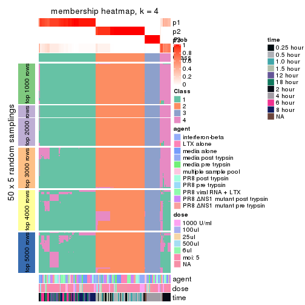</p>

</div>
<div id='tab-ATC-mclust-membership-heatmap-4'>
<pre><code class="r">membership_heatmap(res, k = 5)
</code></pre>

<p></p>

</div>
<div id='tab-ATC-mclust-membership-heatmap-5'>
<pre><code class="r">membership_heatmap(res, k = 6)
</code></pre>

<p>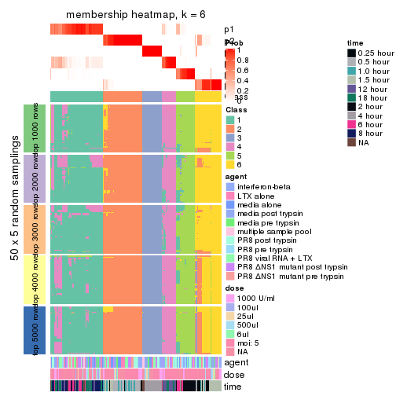</p>

</div>
</div>

As soon as we have had the classes for columns, we can look for signatures
which are significantly different between classes which can be candidate marks
for certain classes. Following are the heatmaps for signatures.


Signature heatmaps where rows are scaled:


<script>
$( function() {
	$( '#tabs-ATC-mclust-get-signatures' ).tabs();
} );
</script>
<div id='tabs-ATC-mclust-get-signatures'>
<ul>
<li><a href='#tab-ATC-mclust-get-signatures-1'>k = 2</a></li>
<li><a href='#tab-ATC-mclust-get-signatures-2'>k = 3</a></li>
<li><a href='#tab-ATC-mclust-get-signatures-3'>k = 4</a></li>
<li><a href='#tab-ATC-mclust-get-signatures-4'>k = 5</a></li>
<li><a href='#tab-ATC-mclust-get-signatures-5'>k = 6</a></li>
</ul>
<div id='tab-ATC-mclust-get-signatures-1'>
<pre><code class="r">get_signatures(res, k = 2)
</code></pre>

<pre><code>#&gt; Error in mat[ceiling(1:nr/h_ratio), ceiling(1:nc/w_ratio), drop = FALSE]: subscript out of bounds
</code></pre>

<p></p>

</div>
<div id='tab-ATC-mclust-get-signatures-2'>
<pre><code class="r">get_signatures(res, k = 3)
</code></pre>

<p></p>

</div>
<div id='tab-ATC-mclust-get-signatures-3'>
<pre><code class="r">get_signatures(res, k = 4)
</code></pre>

<p></p>

</div>
<div id='tab-ATC-mclust-get-signatures-4'>
<pre><code class="r">get_signatures(res, k = 5)
</code></pre>

<p></p>

</div>
<div id='tab-ATC-mclust-get-signatures-5'>
<pre><code class="r">get_signatures(res, k = 6)
</code></pre>

<p></p>

</div>
</div>


Signature heatmaps where rows are not scaled:


<script>
$( function() {
	$( '#tabs-ATC-mclust-get-signatures-no-scale' ).tabs();
} );
</script>
<div id='tabs-ATC-mclust-get-signatures-no-scale'>
<ul>
<li><a href='#tab-ATC-mclust-get-signatures-no-scale-1'>k = 2</a></li>
<li><a href='#tab-ATC-mclust-get-signatures-no-scale-2'>k = 3</a></li>
<li><a href='#tab-ATC-mclust-get-signatures-no-scale-3'>k = 4</a></li>
<li><a href='#tab-ATC-mclust-get-signatures-no-scale-4'>k = 5</a></li>
<li><a href='#tab-ATC-mclust-get-signatures-no-scale-5'>k = 6</a></li>
</ul>
<div id='tab-ATC-mclust-get-signatures-no-scale-1'>
<pre><code class="r">get_signatures(res, k = 2, scale_rows = FALSE)
</code></pre>

<pre><code>#&gt; Error in mat[ceiling(1:nr/h_ratio), ceiling(1:nc/w_ratio), drop = FALSE]: subscript out of bounds
</code></pre>

<p></p>

</div>
<div id='tab-ATC-mclust-get-signatures-no-scale-2'>
<pre><code class="r">get_signatures(res, k = 3, scale_rows = FALSE)
</code></pre>

<p></p>

</div>
<div id='tab-ATC-mclust-get-signatures-no-scale-3'>
<pre><code class="r">get_signatures(res, k = 4, scale_rows = FALSE)
</code></pre>

<p></p>

</div>
<div id='tab-ATC-mclust-get-signatures-no-scale-4'>
<pre><code class="r">get_signatures(res, k = 5, scale_rows = FALSE)
</code></pre>

<p></p>

</div>
<div id='tab-ATC-mclust-get-signatures-no-scale-5'>
<pre><code class="r">get_signatures(res, k = 6, scale_rows = FALSE)
</code></pre>

<p>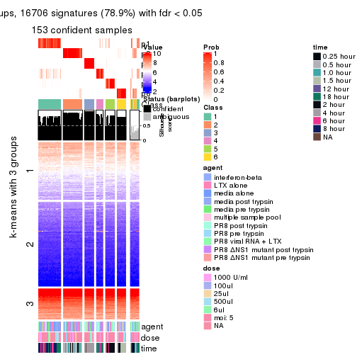</p>

</div>
</div>


Compare the overlap of signatures from different k:

```r
compare_signatures(res)
```


`get_signature()` returns a data frame invisibly. TO get the list of signatures, the function
call should be assigned to a variable explicitly. In following code, if `plot` argument is set
to `FALSE`, no heatmap is plotted while only the differential analysis is performed.

```r
# code only for demonstration
tb = get_signature(res, k = ..., plot = FALSE)
```

An example of the output of `tb` is:

```
#>   which_row         fdr    mean_1    mean_2 scaled_mean_1 scaled_mean_2 km
#> 1        38 0.042760348  8.373488  9.131774    -0.5533452     0.5164555  1
#> 2        40 0.018707592  7.106213  8.469186    -0.6173731     0.5762149  1
#> 3        55 0.019134737 10.221463 11.207825    -0.6159697     0.5749050  1
#> 4        59 0.006059896  5.921854  7.869574    -0.6899429     0.6439467  1
#> 5        60 0.018055526  8.928898 10.211722    -0.6204761     0.5791110  1
#> 6        98 0.009384629 15.714769 14.887706     0.6635654    -0.6193277  2
...
```

The columns in `tb` are:

1. `which_row`: row indices corresponding to the input matrix.
2. `fdr`: FDR for the differential test. 
3. `mean_x`: The mean value in group x.
4. `scaled_mean_x`: The mean value in group x after rows are scaled.
5. `km`: Row groups if k-means clustering is applied to rows.


UMAP plot which shows how samples are separated.


<script>
$( function() {
	$( '#tabs-ATC-mclust-dimension-reduction' ).tabs();
} );
</script>
<div id='tabs-ATC-mclust-dimension-reduction'>
<ul>
<li><a href='#tab-ATC-mclust-dimension-reduction-1'>k = 2</a></li>
<li><a href='#tab-ATC-mclust-dimension-reduction-2'>k = 3</a></li>
<li><a href='#tab-ATC-mclust-dimension-reduction-3'>k = 4</a></li>
<li><a href='#tab-ATC-mclust-dimension-reduction-4'>k = 5</a></li>
<li><a href='#tab-ATC-mclust-dimension-reduction-5'>k = 6</a></li>
</ul>
<div id='tab-ATC-mclust-dimension-reduction-1'>
<pre><code class="r">dimension_reduction(res, k = 2, method = &quot;UMAP&quot;)
</code></pre>

<p></p>

</div>
<div id='tab-ATC-mclust-dimension-reduction-2'>
<pre><code class="r">dimension_reduction(res, k = 3, method = &quot;UMAP&quot;)
</code></pre>

<p></p>

</div>
<div id='tab-ATC-mclust-dimension-reduction-3'>
<pre><code class="r">dimension_reduction(res, k = 4, method = &quot;UMAP&quot;)
</code></pre>

<p></p>

</div>
<div id='tab-ATC-mclust-dimension-reduction-4'>
<pre><code class="r">dimension_reduction(res, k = 5, method = &quot;UMAP&quot;)
</code></pre>

<p></p>

</div>
<div id='tab-ATC-mclust-dimension-reduction-5'>
<pre><code class="r">dimension_reduction(res, k = 6, method = &quot;UMAP&quot;)
</code></pre>

<p></p>

</div>
</div>


Following heatmap shows how subgroups are split when increasing `k`:

```r
collect_classes(res)
```


Test correlation between subgroups and known annotations. If the known
annotation is numeric, one-way ANOVA test is applied, and if the known
annotation is discrete, chi-squared contingency table test is applied.

```r
test_to_known_factors(res)
```

```
#>              n agent(p) dose(p)  time(p) k
#> ATC:mclust 168    0.986   0.976 1.43e-27 2
#> ATC:mclust 169    0.973   0.992 3.35e-52 3
#> ATC:mclust 167    0.971   0.988 7.41e-70 4
#> ATC:mclust 166    0.610   0.539 3.89e-77 5
#> ATC:mclust 153    0.441   0.411 1.46e-73 6
```


If matrix rows can be associated to genes, consider to use `GO_Enrichment(res,
...)` to perform function enrichment for the signature genes.


 

---------------------------------------------------


### ATC:NMF**


The object with results only for a single top-value method and a single partition method 
can be extracted as:

```r
res = res_list["ATC", "NMF"]
# you can also extract it by
# res = res_list["ATC:NMF"]
```

A summary of `res` and all the functions that can be applied to it:

```r
res
```

```
#> A 'ConsensusPartition' object with k = 2, 3, 4, 5, 6.
#>   On a matrix with 21163 rows and 169 columns.
#>   Top rows (1000, 2000, 3000, 4000, 5000) are extracted by 'ATC' method.
#>   Subgroups are detected by 'NMF' method.
#>   Performed in total 1250 partitions by row resampling.
#>   Best k for subgroups seems to be 3.
#> 
#> Following methods can be applied to this 'ConsensusPartition' object:
#>  [1] "cola_report"             "collect_classes"         "collect_plots"          
#>  [4] "collect_stats"           "colnames"                "compare_signatures"     
#>  [7] "consensus_heatmap"       "dimension_reduction"     "functional_enrichment"  
#> [10] "get_anno_col"            "get_anno"                "get_classes"            
#> [13] "get_consensus"           "get_matrix"              "get_membership"         
#> [16] "get_param"               "get_signatures"          "get_stats"              
#> [19] "is_best_k"               "is_stable_k"             "membership_heatmap"     
#> [22] "ncol"                    "nrow"                    "plot_ecdf"              
#> [25] "rownames"                "select_partition_number" "show"                   
#> [28] "suggest_best_k"          "test_to_known_factors"
```

`collect_plots()` function collects all the plots made from `res` for all `k` (number of partitions)
into one single page to provide an easy and fast comparison between different `k`.

```r
collect_plots(res)
```


The plots are:

- The first row: a plot of the ECDF (Empirical cumulative distribution
  function) curves of the consensus matrix for each `k` and the heatmap of
  predicted classes for each `k`.
- The second row: heatmaps of the consensus matrix for each `k`.
- The third row: heatmaps of the membership matrix for each `k`.
- The fouth row: heatmaps of the signatures for each `k`.

All the plots in panels can be made by individual functions and they are
plotted later in this section.

`select_partition_number()` produces several plots showing different
statistics for choosing "optimized" `k`. There are following statistics:

- ECDF curves of the consensus matrix for each `k`;
- 1-PAC. [The PAC
  score](https://en.wikipedia.org/wiki/Consensus_clustering#Over-interpretation_potential_of_consensus_clustering)
  measures the proportion of the ambiguous subgrouping.
- Mean silhouette score.
- Concordance. The mean probability of fiting the consensus class ids in all
  partitions.
- Area increased. Denote $A_k$ as the area under the ECDF curve for current
  `k`, the area increased is defined as $A_k - A_{k-1}$.
- Rand index. The percent of pairs of samples that are both in a same cluster
  or both are not in a same cluster in the partition of k and k-1.
- Jaccard index. The ratio of pairs of samples are both in a same cluster in
  the partition of k and k-1 and the pairs of samples are both in a same
  cluster in the partition k or k-1.

The detailed explanations of these statistics can be found in [the cola
vignette](http://bioconductor.org/packages/devel/bioc/vignettes/cola/inst/doc/cola.html#toc_13).

Generally speaking, lower PAC score, higher mean silhouette score or higher
concordance corresponds to better partition. Rand index and Jaccard index
measure how similar the current partition is compared to partition with `k-1`.
If they are too similar, we won't accept `k` is better than `k-1`.

```r
select_partition_number(res)
```


The numeric values for all these statistics can be obtained by `get_stats()`.

```r
get_stats(res)
```

```
#>   k 1-PAC mean_silhouette concordance area_increased  Rand Jaccard
#> 2 2 1.000           0.998       0.999         0.4743 0.527   0.527
#> 3 3 0.953           0.936       0.971         0.4080 0.775   0.584
#> 4 4 0.851           0.848       0.913         0.0875 0.898   0.711
#> 5 5 0.771           0.719       0.845         0.0614 0.909   0.690
#> 6 6 0.773           0.675       0.797         0.0307 0.958   0.823
```

`suggest_best_k()` suggests the best $k$ based on these statistics. The rules are as follows:

- All $k$ with Jaccard index larger than 0.95 are removed because the increase of
  the partition number does not provides enough extra information. If all $k$ are removed,
  the best $k$ is assigned by `NA`.
- For $k$ with 1-PAC larger than 0.9, the maximal $k$ is taken as the "best k". Other $k$ is called "optional k".
- If it does not fit the second rule. The $k$ with the highest vote of highest
  1-PAC, mean silhouette and concordance is taken as the "best k".

```r
suggest_best_k(res)
```

```
#> [1] 3
#> attr(,"optional")
#> [1] 2
```

There is also optional best $k$ = 2 that is worth to check.

Following shows the table of the partitions (You need to click the **show/hide
code output** link to see it). The membership matrix (columns with name `p*`)
is inferred by
[`clue::cl_consensus()`](https://www.rdocumentation.org/link/cl_consensus?package=clue)
function with the `SE` method. Basically the value in the membership matrix
represents the probability to belong to a certain group. The finall class
label for an item is determined with the group with highest probability it
belongs to.

In `get_classes()` function, the entropy is calculated from the membership
matrix and the silhouette score is calculated from the consensus matrix.


<script>
$( function() {
	$( '#tabs-ATC-NMF-get-classes' ).tabs();
} );
</script>
<div id='tabs-ATC-NMF-get-classes'>
<ul>
<li><a href='#tab-ATC-NMF-get-classes-1'>k = 2</a></li>
<li><a href='#tab-ATC-NMF-get-classes-2'>k = 3</a></li>
<li><a href='#tab-ATC-NMF-get-classes-3'>k = 4</a></li>
<li><a href='#tab-ATC-NMF-get-classes-4'>k = 5</a></li>
<li><a href='#tab-ATC-NMF-get-classes-5'>k = 6</a></li>
</ul>

<div id='tab-ATC-NMF-get-classes-1'>
<p><a id='tab-ATC-NMF-get-classes-1-a' style='color:#0366d6' href='#'>show/hide code output</a></p>
<pre><code class="r">cbind(get_classes(res, k = 2), get_membership(res, k = 2))
</code></pre>

<pre><code>#&gt;           class entropy silhouette    p1    p2
#&gt; GSM528681     2  0.0000      1.000 0.000 1.000
#&gt; GSM528682     2  0.0000      1.000 0.000 1.000
#&gt; GSM528683     2  0.0000      1.000 0.000 1.000
#&gt; GSM528684     2  0.0000      1.000 0.000 1.000
#&gt; GSM528687     2  0.0000      1.000 0.000 1.000
#&gt; GSM528688     2  0.0000      1.000 0.000 1.000
#&gt; GSM528685     2  0.0000      1.000 0.000 1.000
#&gt; GSM528686     2  0.0000      1.000 0.000 1.000
#&gt; GSM528693     1  0.0000      0.999 1.000 0.000
#&gt; GSM528694     1  0.0000      0.999 1.000 0.000
#&gt; GSM528695     1  0.0000      0.999 1.000 0.000
#&gt; GSM528696     1  0.0000      0.999 1.000 0.000
#&gt; GSM528697     1  0.0000      0.999 1.000 0.000
#&gt; GSM528698     1  0.0000      0.999 1.000 0.000
#&gt; GSM528699     1  0.0000      0.999 1.000 0.000
#&gt; GSM528700     1  0.0000      0.999 1.000 0.000
#&gt; GSM528689     1  0.0000      0.999 1.000 0.000
#&gt; GSM528690     1  0.0000      0.999 1.000 0.000
#&gt; GSM528691     1  0.0000      0.999 1.000 0.000
#&gt; GSM528692     1  0.0000      0.999 1.000 0.000
#&gt; GSM528779     2  0.0000      1.000 0.000 1.000
#&gt; GSM528780     2  0.0000      1.000 0.000 1.000
#&gt; GSM528782     2  0.0000      1.000 0.000 1.000
#&gt; GSM528781     2  0.0000      1.000 0.000 1.000
#&gt; GSM528785     1  0.0000      0.999 1.000 0.000
#&gt; GSM528786     1  0.0000      0.999 1.000 0.000
#&gt; GSM528787     1  0.0000      0.999 1.000 0.000
#&gt; GSM528788     1  0.0000      0.999 1.000 0.000
#&gt; GSM528783     1  0.0000      0.999 1.000 0.000
#&gt; GSM528784     1  0.0000      0.999 1.000 0.000
#&gt; GSM528759     1  0.0000      0.999 1.000 0.000
#&gt; GSM528760     1  0.0000      0.999 1.000 0.000
#&gt; GSM528761     2  0.0000      1.000 0.000 1.000
#&gt; GSM528762     2  0.0000      1.000 0.000 1.000
#&gt; GSM528765     2  0.0000      1.000 0.000 1.000
#&gt; GSM528766     2  0.0000      1.000 0.000 1.000
#&gt; GSM528763     2  0.0000      1.000 0.000 1.000
#&gt; GSM528764     2  0.0000      1.000 0.000 1.000
#&gt; GSM528771     1  0.0000      0.999 1.000 0.000
#&gt; GSM528772     1  0.0000      0.999 1.000 0.000
#&gt; GSM528773     1  0.0000      0.999 1.000 0.000
#&gt; GSM528774     1  0.0000      0.999 1.000 0.000
#&gt; GSM528775     1  0.0000      0.999 1.000 0.000
#&gt; GSM528776     1  0.0000      0.999 1.000 0.000
#&gt; GSM528777     1  0.0000      0.999 1.000 0.000
#&gt; GSM528778     1  0.0000      0.999 1.000 0.000
#&gt; GSM528767     1  0.0000      0.999 1.000 0.000
#&gt; GSM528768     1  0.0000      0.999 1.000 0.000
#&gt; GSM528769     1  0.0000      0.999 1.000 0.000
#&gt; GSM528770     1  0.0000      0.999 1.000 0.000
#&gt; GSM528671     2  0.0000      1.000 0.000 1.000
#&gt; GSM528672     2  0.0000      1.000 0.000 1.000
#&gt; GSM528674     2  0.0000      1.000 0.000 1.000
#&gt; GSM528673     2  0.0000      1.000 0.000 1.000
#&gt; GSM528677     1  0.0000      0.999 1.000 0.000
#&gt; GSM528678     1  0.0000      0.999 1.000 0.000
#&gt; GSM528679     1  0.0000      0.999 1.000 0.000
#&gt; GSM528680     1  0.0000      0.999 1.000 0.000
#&gt; GSM528675     1  0.0000      0.999 1.000 0.000
#&gt; GSM528676     1  0.0000      0.999 1.000 0.000
#&gt; GSM528651     2  0.0000      1.000 0.000 1.000
#&gt; GSM528652     2  0.0000      1.000 0.000 1.000
#&gt; GSM528653     2  0.0000      1.000 0.000 1.000
#&gt; GSM528654     2  0.0000      1.000 0.000 1.000
#&gt; GSM528657     2  0.0000      1.000 0.000 1.000
#&gt; GSM528658     2  0.0000      1.000 0.000 1.000
#&gt; GSM528655     2  0.0000      1.000 0.000 1.000
#&gt; GSM528656     2  0.0000      1.000 0.000 1.000
#&gt; GSM528663     1  0.0672      0.991 0.992 0.008
#&gt; GSM528664     1  0.5178      0.869 0.884 0.116
#&gt; GSM528665     1  0.0000      0.999 1.000 0.000
#&gt; GSM528666     1  0.0000      0.999 1.000 0.000
#&gt; GSM528667     1  0.0000      0.999 1.000 0.000
#&gt; GSM528668     1  0.0000      0.999 1.000 0.000
#&gt; GSM528669     1  0.0000      0.999 1.000 0.000
#&gt; GSM528670     1  0.0000      0.999 1.000 0.000
#&gt; GSM528659     1  0.0000      0.999 1.000 0.000
#&gt; GSM528660     1  0.0000      0.999 1.000 0.000
#&gt; GSM528661     1  0.0000      0.999 1.000 0.000
#&gt; GSM528662     1  0.0000      0.999 1.000 0.000
#&gt; GSM528701     2  0.0000      1.000 0.000 1.000
#&gt; GSM528702     2  0.0000      1.000 0.000 1.000
#&gt; GSM528703     2  0.0000      1.000 0.000 1.000
#&gt; GSM528704     2  0.0000      1.000 0.000 1.000
#&gt; GSM528707     2  0.0000      1.000 0.000 1.000
#&gt; GSM528708     2  0.0000      1.000 0.000 1.000
#&gt; GSM528705     2  0.0000      1.000 0.000 1.000
#&gt; GSM528706     2  0.0000      1.000 0.000 1.000
#&gt; GSM528713     1  0.0000      0.999 1.000 0.000
#&gt; GSM528714     1  0.0000      0.999 1.000 0.000
#&gt; GSM528715     1  0.0000      0.999 1.000 0.000
#&gt; GSM528716     1  0.0000      0.999 1.000 0.000
#&gt; GSM528717     1  0.0000      0.999 1.000 0.000
#&gt; GSM528718     1  0.0000      0.999 1.000 0.000
#&gt; GSM528719     1  0.0000      0.999 1.000 0.000
#&gt; GSM528720     1  0.0000      0.999 1.000 0.000
#&gt; GSM528709     1  0.0000      0.999 1.000 0.000
#&gt; GSM528710     1  0.0000      0.999 1.000 0.000
#&gt; GSM528711     1  0.0000      0.999 1.000 0.000
#&gt; GSM528712     1  0.0000      0.999 1.000 0.000
#&gt; GSM528721     2  0.0000      1.000 0.000 1.000
#&gt; GSM528722     2  0.0000      1.000 0.000 1.000
#&gt; GSM528723     2  0.0000      1.000 0.000 1.000
#&gt; GSM528724     2  0.0000      1.000 0.000 1.000
#&gt; GSM528727     2  0.0000      1.000 0.000 1.000
#&gt; GSM528728     2  0.0000      1.000 0.000 1.000
#&gt; GSM528725     2  0.0000      1.000 0.000 1.000
#&gt; GSM528726     2  0.0000      1.000 0.000 1.000
#&gt; GSM528733     1  0.0000      0.999 1.000 0.000
#&gt; GSM528734     1  0.0000      0.999 1.000 0.000
#&gt; GSM528735     1  0.0000      0.999 1.000 0.000
#&gt; GSM528736     1  0.0000      0.999 1.000 0.000
#&gt; GSM528737     1  0.0000      0.999 1.000 0.000
#&gt; GSM528738     1  0.0000      0.999 1.000 0.000
#&gt; GSM528729     1  0.0000      0.999 1.000 0.000
#&gt; GSM528730     1  0.0000      0.999 1.000 0.000
#&gt; GSM528731     1  0.0000      0.999 1.000 0.000
#&gt; GSM528732     1  0.0000      0.999 1.000 0.000
#&gt; GSM528739     2  0.0000      1.000 0.000 1.000
#&gt; GSM528740     2  0.0000      1.000 0.000 1.000
#&gt; GSM528741     2  0.0000      1.000 0.000 1.000
#&gt; GSM528742     2  0.0000      1.000 0.000 1.000
#&gt; GSM528745     2  0.0000      1.000 0.000 1.000
#&gt; GSM528746     2  0.0000      1.000 0.000 1.000
#&gt; GSM528743     2  0.0000      1.000 0.000 1.000
#&gt; GSM528744     2  0.0000      1.000 0.000 1.000
#&gt; GSM528751     1  0.0000      0.999 1.000 0.000
#&gt; GSM528752     1  0.0000      0.999 1.000 0.000
#&gt; GSM528753     1  0.0000      0.999 1.000 0.000
#&gt; GSM528754     1  0.0000      0.999 1.000 0.000
#&gt; GSM528755     1  0.0000      0.999 1.000 0.000
#&gt; GSM528756     1  0.0000      0.999 1.000 0.000
#&gt; GSM528757     1  0.0672      0.991 0.992 0.008
#&gt; GSM528758     1  0.0000      0.999 1.000 0.000
#&gt; GSM528747     1  0.0000      0.999 1.000 0.000
#&gt; GSM528748     1  0.0000      0.999 1.000 0.000
#&gt; GSM528749     1  0.0000      0.999 1.000 0.000
#&gt; GSM528750     1  0.0000      0.999 1.000 0.000
#&gt; GSM528640     2  0.0000      1.000 0.000 1.000
#&gt; GSM528641     2  0.0000      1.000 0.000 1.000
#&gt; GSM528643     1  0.0000      0.999 1.000 0.000
#&gt; GSM528644     1  0.0000      0.999 1.000 0.000
#&gt; GSM528642     1  0.0000      0.999 1.000 0.000
#&gt; GSM528620     2  0.0000      1.000 0.000 1.000
#&gt; GSM528621     2  0.0376      0.996 0.004 0.996
#&gt; GSM528623     1  0.0000      0.999 1.000 0.000
#&gt; GSM528624     1  0.0000      0.999 1.000 0.000
#&gt; GSM528622     1  0.0000      0.999 1.000 0.000
#&gt; GSM528625     2  0.0000      1.000 0.000 1.000
#&gt; GSM528626     2  0.0000      1.000 0.000 1.000
#&gt; GSM528628     1  0.0000      0.999 1.000 0.000
#&gt; GSM528629     1  0.0000      0.999 1.000 0.000
#&gt; GSM528627     1  0.0000      0.999 1.000 0.000
#&gt; GSM528630     2  0.0000      1.000 0.000 1.000
#&gt; GSM528631     2  0.0000      1.000 0.000 1.000
#&gt; GSM528632     2  0.0000      1.000 0.000 1.000
#&gt; GSM528633     2  0.0000      1.000 0.000 1.000
#&gt; GSM528636     1  0.0000      0.999 1.000 0.000
#&gt; GSM528637     1  0.0000      0.999 1.000 0.000
#&gt; GSM528638     1  0.0000      0.999 1.000 0.000
#&gt; GSM528639     1  0.0000      0.999 1.000 0.000
#&gt; GSM528634     1  0.0000      0.999 1.000 0.000
#&gt; GSM528635     1  0.0000      0.999 1.000 0.000
#&gt; GSM528645     1  0.0000      0.999 1.000 0.000
#&gt; GSM528646     1  0.0000      0.999 1.000 0.000
#&gt; GSM528647     1  0.0000      0.999 1.000 0.000
#&gt; GSM528648     1  0.0000      0.999 1.000 0.000
#&gt; GSM528649     1  0.0000      0.999 1.000 0.000
#&gt; GSM528650     1  0.0000      0.999 1.000 0.000
</code></pre>

<script>
$('#tab-ATC-NMF-get-classes-1-a').parent().next().next().hide();
$('#tab-ATC-NMF-get-classes-1-a').click(function(){
  $('#tab-ATC-NMF-get-classes-1-a').parent().next().next().toggle();
  return(false);
});
</script>
</div>

<div id='tab-ATC-NMF-get-classes-2'>
<p><a id='tab-ATC-NMF-get-classes-2-a' style='color:#0366d6' href='#'>show/hide code output</a></p>
<pre><code class="r">cbind(get_classes(res, k = 3), get_membership(res, k = 3))
</code></pre>

<pre><code>#&gt;           class entropy silhouette    p1    p2    p3
#&gt; GSM528681     2  0.0000      0.975 0.000 1.000 0.000
#&gt; GSM528682     2  0.0000      0.975 0.000 1.000 0.000
#&gt; GSM528683     2  0.0000      0.975 0.000 1.000 0.000
#&gt; GSM528684     2  0.0000      0.975 0.000 1.000 0.000
#&gt; GSM528687     2  0.0000      0.975 0.000 1.000 0.000
#&gt; GSM528688     2  0.0000      0.975 0.000 1.000 0.000
#&gt; GSM528685     2  0.0237      0.971 0.000 0.996 0.004
#&gt; GSM528686     3  0.5621      0.542 0.000 0.308 0.692
#&gt; GSM528693     3  0.0000      0.966 0.000 0.000 1.000
#&gt; GSM528694     3  0.0000      0.966 0.000 0.000 1.000
#&gt; GSM528695     3  0.0000      0.966 0.000 0.000 1.000
#&gt; GSM528696     3  0.0000      0.966 0.000 0.000 1.000
#&gt; GSM528697     1  0.0592      0.970 0.988 0.000 0.012
#&gt; GSM528698     1  0.1163      0.962 0.972 0.000 0.028
#&gt; GSM528699     1  0.0592      0.970 0.988 0.000 0.012
#&gt; GSM528700     1  0.0424      0.970 0.992 0.000 0.008
#&gt; GSM528689     1  0.0592      0.970 0.988 0.000 0.012
#&gt; GSM528690     1  0.0000      0.969 1.000 0.000 0.000
#&gt; GSM528691     1  0.0592      0.970 0.988 0.000 0.012
#&gt; GSM528692     1  0.3551      0.864 0.868 0.000 0.132
#&gt; GSM528779     2  0.0000      0.975 0.000 1.000 0.000
#&gt; GSM528780     2  0.0000      0.975 0.000 1.000 0.000
#&gt; GSM528782     2  0.0000      0.975 0.000 1.000 0.000
#&gt; GSM528781     2  0.0000      0.975 0.000 1.000 0.000
#&gt; GSM528785     1  0.1163      0.962 0.972 0.000 0.028
#&gt; GSM528786     3  0.0237      0.964 0.000 0.004 0.996
#&gt; GSM528787     3  0.0000      0.966 0.000 0.000 1.000
#&gt; GSM528788     1  0.0000      0.969 1.000 0.000 0.000
#&gt; GSM528783     1  0.0000      0.969 1.000 0.000 0.000
#&gt; GSM528784     1  0.0000      0.969 1.000 0.000 0.000
#&gt; GSM528759     3  0.0237      0.964 0.004 0.000 0.996
#&gt; GSM528760     3  0.0237      0.964 0.004 0.000 0.996
#&gt; GSM528761     2  0.0000      0.975 0.000 1.000 0.000
#&gt; GSM528762     2  0.0000      0.975 0.000 1.000 0.000
#&gt; GSM528765     2  0.0000      0.975 0.000 1.000 0.000
#&gt; GSM528766     2  0.0000      0.975 0.000 1.000 0.000
#&gt; GSM528763     2  0.0000      0.975 0.000 1.000 0.000
#&gt; GSM528764     2  0.6291      0.127 0.000 0.532 0.468
#&gt; GSM528771     3  0.0000      0.966 0.000 0.000 1.000
#&gt; GSM528772     3  0.0000      0.966 0.000 0.000 1.000
#&gt; GSM528773     3  0.0000      0.966 0.000 0.000 1.000
#&gt; GSM528774     3  0.0000      0.966 0.000 0.000 1.000
#&gt; GSM528775     3  0.0237      0.964 0.004 0.000 0.996
#&gt; GSM528776     1  0.1031      0.964 0.976 0.000 0.024
#&gt; GSM528777     1  0.0000      0.969 1.000 0.000 0.000
#&gt; GSM528778     1  0.0000      0.969 1.000 0.000 0.000
#&gt; GSM528767     1  0.0000      0.969 1.000 0.000 0.000
#&gt; GSM528768     1  0.0000      0.969 1.000 0.000 0.000
#&gt; GSM528769     1  0.0000      0.969 1.000 0.000 0.000
#&gt; GSM528770     1  0.0237      0.970 0.996 0.000 0.004
#&gt; GSM528671     2  0.0000      0.975 0.000 1.000 0.000
#&gt; GSM528672     2  0.0000      0.975 0.000 1.000 0.000
#&gt; GSM528674     2  0.0000      0.975 0.000 1.000 0.000
#&gt; GSM528673     2  0.6204      0.268 0.000 0.576 0.424
#&gt; GSM528677     3  0.0000      0.966 0.000 0.000 1.000
#&gt; GSM528678     3  0.0000      0.966 0.000 0.000 1.000
#&gt; GSM528679     1  0.0892      0.966 0.980 0.000 0.020
#&gt; GSM528680     1  0.0237      0.970 0.996 0.000 0.004
#&gt; GSM528675     1  0.0237      0.970 0.996 0.000 0.004
#&gt; GSM528676     1  0.0237      0.970 0.996 0.000 0.004
#&gt; GSM528651     2  0.0000      0.975 0.000 1.000 0.000
#&gt; GSM528652     2  0.0000      0.975 0.000 1.000 0.000
#&gt; GSM528653     2  0.0000      0.975 0.000 1.000 0.000
#&gt; GSM528654     2  0.0000      0.975 0.000 1.000 0.000
#&gt; GSM528657     2  0.0000      0.975 0.000 1.000 0.000
#&gt; GSM528658     2  0.0000      0.975 0.000 1.000 0.000
#&gt; GSM528655     2  0.4178      0.785 0.000 0.828 0.172
#&gt; GSM528656     2  0.5098      0.669 0.000 0.752 0.248
#&gt; GSM528663     3  0.0237      0.964 0.000 0.004 0.996
#&gt; GSM528664     3  0.0424      0.960 0.000 0.008 0.992
#&gt; GSM528665     3  0.0000      0.966 0.000 0.000 1.000
#&gt; GSM528666     3  0.0000      0.966 0.000 0.000 1.000
#&gt; GSM528667     1  0.0892      0.966 0.980 0.000 0.020
#&gt; GSM528668     1  0.0892      0.966 0.980 0.000 0.020
#&gt; GSM528669     1  0.0237      0.967 0.996 0.004 0.000
#&gt; GSM528670     1  0.0000      0.969 1.000 0.000 0.000
#&gt; GSM528659     1  0.0000      0.969 1.000 0.000 0.000
#&gt; GSM528660     1  0.0000      0.969 1.000 0.000 0.000
#&gt; GSM528661     1  0.0592      0.970 0.988 0.000 0.012
#&gt; GSM528662     1  0.0747      0.968 0.984 0.000 0.016
#&gt; GSM528701     2  0.0000      0.975 0.000 1.000 0.000
#&gt; GSM528702     2  0.0000      0.975 0.000 1.000 0.000
#&gt; GSM528703     2  0.0000      0.975 0.000 1.000 0.000
#&gt; GSM528704     2  0.0000      0.975 0.000 1.000 0.000
#&gt; GSM528707     2  0.0000      0.975 0.000 1.000 0.000
#&gt; GSM528708     2  0.0237      0.971 0.004 0.996 0.000
#&gt; GSM528705     2  0.0000      0.975 0.000 1.000 0.000
#&gt; GSM528706     2  0.0000      0.975 0.000 1.000 0.000
#&gt; GSM528713     3  0.0000      0.966 0.000 0.000 1.000
#&gt; GSM528714     3  0.0000      0.966 0.000 0.000 1.000
#&gt; GSM528715     3  0.0000      0.966 0.000 0.000 1.000
#&gt; GSM528716     3  0.0000      0.966 0.000 0.000 1.000
#&gt; GSM528717     1  0.2165      0.932 0.936 0.000 0.064
#&gt; GSM528718     1  0.5016      0.716 0.760 0.000 0.240
#&gt; GSM528719     1  0.6192      0.326 0.580 0.000 0.420
#&gt; GSM528720     1  0.1529      0.953 0.960 0.000 0.040
#&gt; GSM528709     1  0.0237      0.970 0.996 0.000 0.004
#&gt; GSM528710     1  0.0000      0.969 1.000 0.000 0.000
#&gt; GSM528711     1  0.0592      0.970 0.988 0.000 0.012
#&gt; GSM528712     1  0.0592      0.970 0.988 0.000 0.012
#&gt; GSM528721     2  0.0000      0.975 0.000 1.000 0.000
#&gt; GSM528722     2  0.0000      0.975 0.000 1.000 0.000
#&gt; GSM528723     2  0.0000      0.975 0.000 1.000 0.000
#&gt; GSM528724     2  0.0000      0.975 0.000 1.000 0.000
#&gt; GSM528727     2  0.0000      0.975 0.000 1.000 0.000
#&gt; GSM528728     2  0.0000      0.975 0.000 1.000 0.000
#&gt; GSM528725     2  0.0000      0.975 0.000 1.000 0.000
#&gt; GSM528726     2  0.0000      0.975 0.000 1.000 0.000
#&gt; GSM528733     3  0.0000      0.966 0.000 0.000 1.000
#&gt; GSM528734     3  0.0000      0.966 0.000 0.000 1.000
#&gt; GSM528735     3  0.0237      0.964 0.004 0.000 0.996
#&gt; GSM528736     3  0.0237      0.964 0.004 0.000 0.996
#&gt; GSM528737     1  0.1163      0.962 0.972 0.000 0.028
#&gt; GSM528738     1  0.4121      0.819 0.832 0.000 0.168
#&gt; GSM528729     1  0.0000      0.969 1.000 0.000 0.000
#&gt; GSM528730     1  0.0000      0.969 1.000 0.000 0.000
#&gt; GSM528731     1  0.0000      0.969 1.000 0.000 0.000
#&gt; GSM528732     1  0.0592      0.970 0.988 0.000 0.012
#&gt; GSM528739     2  0.0000      0.975 0.000 1.000 0.000
#&gt; GSM528740     2  0.0000      0.975 0.000 1.000 0.000
#&gt; GSM528741     2  0.0000      0.975 0.000 1.000 0.000
#&gt; GSM528742     2  0.0000      0.975 0.000 1.000 0.000
#&gt; GSM528745     2  0.0000      0.975 0.000 1.000 0.000
#&gt; GSM528746     2  0.0000      0.975 0.000 1.000 0.000
#&gt; GSM528743     2  0.0000      0.975 0.000 1.000 0.000
#&gt; GSM528744     2  0.0000      0.975 0.000 1.000 0.000
#&gt; GSM528751     3  0.2878      0.878 0.096 0.000 0.904
#&gt; GSM528752     3  0.0592      0.958 0.012 0.000 0.988
#&gt; GSM528753     3  0.0000      0.966 0.000 0.000 1.000
#&gt; GSM528754     3  0.0000      0.966 0.000 0.000 1.000
#&gt; GSM528755     3  0.2537      0.895 0.080 0.000 0.920
#&gt; GSM528756     3  0.1163      0.945 0.028 0.000 0.972
#&gt; GSM528757     1  0.0237      0.967 0.996 0.004 0.000
#&gt; GSM528758     1  0.0237      0.967 0.996 0.004 0.000
#&gt; GSM528747     1  0.0000      0.969 1.000 0.000 0.000
#&gt; GSM528748     1  0.0592      0.970 0.988 0.000 0.012
#&gt; GSM528749     1  0.0592      0.970 0.988 0.000 0.012
#&gt; GSM528750     1  0.0000      0.969 1.000 0.000 0.000
#&gt; GSM528640     2  0.0000      0.975 0.000 1.000 0.000
#&gt; GSM528641     2  0.2959      0.874 0.000 0.900 0.100
#&gt; GSM528643     3  0.0000      0.966 0.000 0.000 1.000
#&gt; GSM528644     1  0.0592      0.970 0.988 0.000 0.012
#&gt; GSM528642     3  0.2878      0.878 0.096 0.000 0.904
#&gt; GSM528620     2  0.0000      0.975 0.000 1.000 0.000
#&gt; GSM528621     3  0.1031      0.947 0.000 0.024 0.976
#&gt; GSM528623     3  0.0000      0.966 0.000 0.000 1.000
#&gt; GSM528624     1  0.0000      0.969 1.000 0.000 0.000
#&gt; GSM528622     1  0.0592      0.970 0.988 0.000 0.012
#&gt; GSM528625     2  0.0000      0.975 0.000 1.000 0.000
#&gt; GSM528626     3  0.5988      0.402 0.000 0.368 0.632
#&gt; GSM528628     3  0.0000      0.966 0.000 0.000 1.000
#&gt; GSM528629     1  0.0592      0.970 0.988 0.000 0.012
#&gt; GSM528627     1  0.1163      0.962 0.972 0.000 0.028
#&gt; GSM528630     2  0.0000      0.975 0.000 1.000 0.000
#&gt; GSM528631     2  0.0000      0.975 0.000 1.000 0.000
#&gt; GSM528632     3  0.1529      0.932 0.000 0.040 0.960
#&gt; GSM528633     3  0.1860      0.921 0.000 0.052 0.948
#&gt; GSM528636     3  0.0000      0.966 0.000 0.000 1.000
#&gt; GSM528637     3  0.0000      0.966 0.000 0.000 1.000
#&gt; GSM528638     1  0.0000      0.969 1.000 0.000 0.000
#&gt; GSM528639     1  0.0424      0.970 0.992 0.000 0.008
#&gt; GSM528634     1  0.4702      0.758 0.788 0.000 0.212
#&gt; GSM528635     1  0.1163      0.962 0.972 0.000 0.028
#&gt; GSM528645     3  0.0000      0.966 0.000 0.000 1.000
#&gt; GSM528646     3  0.0000      0.966 0.000 0.000 1.000
#&gt; GSM528647     3  0.0000      0.966 0.000 0.000 1.000
#&gt; GSM528648     3  0.6095      0.322 0.392 0.000 0.608
#&gt; GSM528649     3  0.0237      0.964 0.004 0.000 0.996
#&gt; GSM528650     1  0.4121      0.820 0.832 0.000 0.168
</code></pre>

<script>
$('#tab-ATC-NMF-get-classes-2-a').parent().next().next().hide();
$('#tab-ATC-NMF-get-classes-2-a').click(function(){
  $('#tab-ATC-NMF-get-classes-2-a').parent().next().next().toggle();
  return(false);
});
</script>
</div>

<div id='tab-ATC-NMF-get-classes-3'>
<p><a id='tab-ATC-NMF-get-classes-3-a' style='color:#0366d6' href='#'>show/hide code output</a></p>
<pre><code class="r">cbind(get_classes(res, k = 4), get_membership(res, k = 4))
</code></pre>

<pre><code>#&gt;           class entropy silhouette    p1    p2    p3    p4
#&gt; GSM528681     2  0.0336    0.95137 0.000 0.992 0.000 0.008
#&gt; GSM528682     2  0.0000    0.95275 0.000 1.000 0.000 0.000
#&gt; GSM528683     2  0.0000    0.95275 0.000 1.000 0.000 0.000
#&gt; GSM528684     2  0.1557    0.94868 0.000 0.944 0.000 0.056
#&gt; GSM528687     2  0.0336    0.95137 0.000 0.992 0.000 0.008
#&gt; GSM528688     2  0.0469    0.95015 0.000 0.988 0.000 0.012
#&gt; GSM528685     2  0.1938    0.94594 0.000 0.936 0.012 0.052
#&gt; GSM528686     2  0.5294    0.00696 0.000 0.508 0.484 0.008
#&gt; GSM528693     4  0.3598    0.78091 0.028 0.000 0.124 0.848
#&gt; GSM528694     4  0.3383    0.82829 0.076 0.000 0.052 0.872
#&gt; GSM528695     3  0.0000    0.92724 0.000 0.000 1.000 0.000
#&gt; GSM528696     3  0.0000    0.92724 0.000 0.000 1.000 0.000
#&gt; GSM528697     1  0.0592    0.89502 0.984 0.000 0.000 0.016
#&gt; GSM528698     1  0.1867    0.89453 0.928 0.000 0.000 0.072
#&gt; GSM528699     4  0.4992    0.16038 0.476 0.000 0.000 0.524
#&gt; GSM528700     1  0.1118    0.90371 0.964 0.000 0.000 0.036
#&gt; GSM528689     1  0.1211    0.90309 0.960 0.000 0.000 0.040
#&gt; GSM528690     1  0.0188    0.90116 0.996 0.000 0.000 0.004
#&gt; GSM528691     1  0.0592    0.90353 0.984 0.000 0.000 0.016
#&gt; GSM528692     1  0.4957    0.50491 0.684 0.000 0.300 0.016
#&gt; GSM528779     2  0.1716    0.94628 0.000 0.936 0.000 0.064
#&gt; GSM528780     2  0.1389    0.95051 0.000 0.952 0.000 0.048
#&gt; GSM528782     2  0.0592    0.94871 0.000 0.984 0.000 0.016
#&gt; GSM528781     2  0.2814    0.89687 0.000 0.868 0.000 0.132
#&gt; GSM528785     4  0.2216    0.82499 0.092 0.000 0.000 0.908
#&gt; GSM528786     3  0.0000    0.92724 0.000 0.000 1.000 0.000
#&gt; GSM528787     4  0.4697    0.50218 0.000 0.000 0.356 0.644
#&gt; GSM528788     1  0.1302    0.90331 0.956 0.000 0.000 0.044
#&gt; GSM528783     1  0.0592    0.89502 0.984 0.000 0.000 0.016
#&gt; GSM528784     1  0.0592    0.89502 0.984 0.000 0.000 0.016
#&gt; GSM528759     4  0.6022    0.68590 0.084 0.000 0.260 0.656
#&gt; GSM528760     4  0.5321    0.71540 0.056 0.000 0.228 0.716
#&gt; GSM528761     2  0.1716    0.94628 0.000 0.936 0.000 0.064
#&gt; GSM528762     2  0.0188    0.95305 0.000 0.996 0.000 0.004
#&gt; GSM528765     2  0.1716    0.94628 0.000 0.936 0.000 0.064
#&gt; GSM528766     2  0.0188    0.95218 0.000 0.996 0.000 0.004
#&gt; GSM528763     2  0.0592    0.95357 0.000 0.984 0.000 0.016
#&gt; GSM528764     3  0.3123    0.75830 0.000 0.156 0.844 0.000
#&gt; GSM528771     4  0.1640    0.80604 0.012 0.012 0.020 0.956
#&gt; GSM528772     4  0.1617    0.80494 0.008 0.012 0.024 0.956
#&gt; GSM528773     3  0.0000    0.92724 0.000 0.000 1.000 0.000
#&gt; GSM528774     3  0.0000    0.92724 0.000 0.000 1.000 0.000
#&gt; GSM528775     4  0.4300    0.82402 0.092 0.000 0.088 0.820
#&gt; GSM528776     1  0.4746    0.44372 0.632 0.000 0.000 0.368
#&gt; GSM528777     1  0.0921    0.90396 0.972 0.000 0.000 0.028
#&gt; GSM528778     1  0.0592    0.90315 0.984 0.000 0.000 0.016
#&gt; GSM528767     1  0.0592    0.89502 0.984 0.000 0.000 0.016
#&gt; GSM528768     1  0.0592    0.89502 0.984 0.000 0.000 0.016
#&gt; GSM528769     1  0.0592    0.89502 0.984 0.000 0.000 0.016
#&gt; GSM528770     1  0.0592    0.89502 0.984 0.000 0.000 0.016
#&gt; GSM528671     2  0.1637    0.94759 0.000 0.940 0.000 0.060
#&gt; GSM528672     2  0.0469    0.95343 0.000 0.988 0.000 0.012
#&gt; GSM528674     2  0.0817    0.95312 0.000 0.976 0.000 0.024
#&gt; GSM528673     3  0.4977    0.14781 0.000 0.460 0.540 0.000
#&gt; GSM528677     4  0.2186    0.79596 0.008 0.012 0.048 0.932
#&gt; GSM528678     3  0.0921    0.90607 0.000 0.000 0.972 0.028
#&gt; GSM528679     1  0.1637    0.90042 0.940 0.000 0.000 0.060
#&gt; GSM528680     1  0.1940    0.89570 0.924 0.000 0.000 0.076
#&gt; GSM528675     1  0.0592    0.89502 0.984 0.000 0.000 0.016
#&gt; GSM528676     1  0.0592    0.89502 0.984 0.000 0.000 0.016
#&gt; GSM528651     2  0.1940    0.94052 0.000 0.924 0.000 0.076
#&gt; GSM528652     2  0.1940    0.94052 0.000 0.924 0.000 0.076
#&gt; GSM528653     2  0.0336    0.95137 0.000 0.992 0.000 0.008
#&gt; GSM528654     2  0.0336    0.95137 0.000 0.992 0.000 0.008
#&gt; GSM528657     2  0.0817    0.95318 0.000 0.976 0.000 0.024
#&gt; GSM528658     2  0.0336    0.95137 0.000 0.992 0.000 0.008
#&gt; GSM528655     3  0.4643    0.47947 0.000 0.344 0.656 0.000
#&gt; GSM528656     2  0.3279    0.87452 0.000 0.872 0.096 0.032
#&gt; GSM528663     4  0.2222    0.78148 0.000 0.016 0.060 0.924
#&gt; GSM528664     4  0.1975    0.78872 0.000 0.016 0.048 0.936
#&gt; GSM528665     3  0.0188    0.92486 0.000 0.000 0.996 0.004
#&gt; GSM528666     3  0.0000    0.92724 0.000 0.000 1.000 0.000
#&gt; GSM528667     1  0.1557    0.90139 0.944 0.000 0.000 0.056
#&gt; GSM528668     1  0.1302    0.90331 0.956 0.000 0.000 0.044
#&gt; GSM528669     1  0.1474    0.90226 0.948 0.000 0.000 0.052
#&gt; GSM528670     1  0.4679    0.48764 0.648 0.000 0.000 0.352
#&gt; GSM528659     1  0.0592    0.89502 0.984 0.000 0.000 0.016
#&gt; GSM528660     1  0.0592    0.89502 0.984 0.000 0.000 0.016
#&gt; GSM528661     1  0.0592    0.89502 0.984 0.000 0.000 0.016
#&gt; GSM528662     1  0.0376    0.90162 0.992 0.000 0.004 0.004
#&gt; GSM528701     2  0.0469    0.95015 0.000 0.988 0.000 0.012
#&gt; GSM528702     2  0.0336    0.95137 0.000 0.992 0.000 0.008
#&gt; GSM528703     2  0.1389    0.95063 0.000 0.952 0.000 0.048
#&gt; GSM528704     2  0.0188    0.95218 0.000 0.996 0.000 0.004
#&gt; GSM528707     2  0.0592    0.94871 0.000 0.984 0.000 0.016
#&gt; GSM528708     2  0.0592    0.94871 0.000 0.984 0.000 0.016
#&gt; GSM528705     2  0.0336    0.95137 0.000 0.992 0.000 0.008
#&gt; GSM528706     2  0.1637    0.94759 0.000 0.940 0.000 0.060
#&gt; GSM528713     4  0.2730    0.82947 0.088 0.000 0.016 0.896
#&gt; GSM528714     4  0.2365    0.78587 0.004 0.012 0.064 0.920
#&gt; GSM528715     3  0.0000    0.92724 0.000 0.000 1.000 0.000
#&gt; GSM528716     3  0.0000    0.92724 0.000 0.000 1.000 0.000
#&gt; GSM528717     1  0.3668    0.78223 0.808 0.000 0.004 0.188
#&gt; GSM528718     4  0.5444    0.33164 0.424 0.000 0.016 0.560
#&gt; GSM528719     1  0.6686    0.46307 0.620 0.000 0.200 0.180
#&gt; GSM528720     1  0.4382    0.59592 0.704 0.000 0.000 0.296
#&gt; GSM528709     1  0.0469    0.90284 0.988 0.000 0.000 0.012
#&gt; GSM528710     1  0.0000    0.90002 1.000 0.000 0.000 0.000
#&gt; GSM528711     1  0.0336    0.90217 0.992 0.000 0.000 0.008
#&gt; GSM528712     1  0.1302    0.90223 0.956 0.000 0.000 0.044
#&gt; GSM528721     2  0.1389    0.95058 0.000 0.952 0.000 0.048
#&gt; GSM528722     2  0.1389    0.95058 0.000 0.952 0.000 0.048
#&gt; GSM528723     2  0.0336    0.95336 0.000 0.992 0.000 0.008
#&gt; GSM528724     2  0.0000    0.95275 0.000 1.000 0.000 0.000
#&gt; GSM528727     2  0.1557    0.94868 0.000 0.944 0.000 0.056
#&gt; GSM528728     2  0.0592    0.94871 0.000 0.984 0.000 0.016
#&gt; GSM528725     2  0.0469    0.95015 0.000 0.988 0.000 0.012
#&gt; GSM528726     2  0.1716    0.94628 0.000 0.936 0.000 0.064
#&gt; GSM528733     3  0.0000    0.92724 0.000 0.000 1.000 0.000
#&gt; GSM528734     3  0.0000    0.92724 0.000 0.000 1.000 0.000
#&gt; GSM528735     4  0.5708    0.77608 0.124 0.000 0.160 0.716
#&gt; GSM528736     3  0.1022    0.90140 0.000 0.000 0.968 0.032
#&gt; GSM528737     1  0.2149    0.89001 0.912 0.000 0.000 0.088
#&gt; GSM528738     4  0.4905    0.48610 0.364 0.000 0.004 0.632
#&gt; GSM528729     1  0.1557    0.90153 0.944 0.000 0.000 0.056
#&gt; GSM528730     1  0.1302    0.90331 0.956 0.000 0.000 0.044
#&gt; GSM528731     1  0.2149    0.89006 0.912 0.000 0.000 0.088
#&gt; GSM528732     1  0.2589    0.87067 0.884 0.000 0.000 0.116
#&gt; GSM528739     2  0.0336    0.95137 0.000 0.992 0.000 0.008
#&gt; GSM528740     2  0.0469    0.95044 0.000 0.988 0.000 0.012
#&gt; GSM528741     2  0.1637    0.94759 0.000 0.940 0.000 0.060
#&gt; GSM528742     2  0.1302    0.95110 0.000 0.956 0.000 0.044
#&gt; GSM528745     2  0.1716    0.94628 0.000 0.936 0.000 0.064
#&gt; GSM528746     2  0.0188    0.95218 0.000 0.996 0.000 0.004
#&gt; GSM528743     2  0.1716    0.94628 0.000 0.936 0.000 0.064
#&gt; GSM528744     2  0.1716    0.94628 0.000 0.936 0.000 0.064
#&gt; GSM528751     4  0.2011    0.82669 0.080 0.000 0.000 0.920
#&gt; GSM528752     4  0.2546    0.82779 0.092 0.000 0.008 0.900
#&gt; GSM528753     3  0.0000    0.92724 0.000 0.000 1.000 0.000
#&gt; GSM528754     3  0.0000    0.92724 0.000 0.000 1.000 0.000
#&gt; GSM528755     4  0.3743    0.80002 0.160 0.000 0.016 0.824
#&gt; GSM528756     4  0.3757    0.80571 0.152 0.000 0.020 0.828
#&gt; GSM528757     1  0.2216    0.88734 0.908 0.000 0.000 0.092
#&gt; GSM528758     1  0.2973    0.84525 0.856 0.000 0.000 0.144
#&gt; GSM528747     1  0.2530    0.87435 0.888 0.000 0.000 0.112
#&gt; GSM528748     1  0.2760    0.86051 0.872 0.000 0.000 0.128
#&gt; GSM528749     1  0.2469    0.87695 0.892 0.000 0.000 0.108
#&gt; GSM528750     1  0.1211    0.90088 0.960 0.000 0.000 0.040
#&gt; GSM528640     2  0.0000    0.95275 0.000 1.000 0.000 0.000
#&gt; GSM528641     2  0.4981    0.10795 0.000 0.536 0.464 0.000
#&gt; GSM528643     3  0.0000    0.92724 0.000 0.000 1.000 0.000
#&gt; GSM528644     4  0.3528    0.76594 0.192 0.000 0.000 0.808
#&gt; GSM528642     3  0.2021    0.86094 0.056 0.000 0.932 0.012
#&gt; GSM528620     2  0.1637    0.94759 0.000 0.940 0.000 0.060
#&gt; GSM528621     4  0.3037    0.75231 0.000 0.020 0.100 0.880
#&gt; GSM528623     3  0.0000    0.92724 0.000 0.000 1.000 0.000
#&gt; GSM528624     1  0.2281    0.88497 0.904 0.000 0.000 0.096
#&gt; GSM528622     1  0.1022    0.90408 0.968 0.000 0.000 0.032
#&gt; GSM528625     2  0.0469    0.95015 0.000 0.988 0.000 0.012
#&gt; GSM528626     3  0.4713    0.44248 0.000 0.360 0.640 0.000
#&gt; GSM528628     3  0.0188    0.92486 0.000 0.000 0.996 0.004
#&gt; GSM528629     1  0.4843    0.36012 0.604 0.000 0.000 0.396
#&gt; GSM528627     1  0.2345    0.88347 0.900 0.000 0.000 0.100
#&gt; GSM528630     2  0.1637    0.94759 0.000 0.940 0.000 0.060
#&gt; GSM528631     2  0.2408    0.92155 0.000 0.896 0.000 0.104
#&gt; GSM528632     3  0.0779    0.91425 0.000 0.016 0.980 0.004
#&gt; GSM528633     3  0.0469    0.91852 0.000 0.012 0.988 0.000
#&gt; GSM528636     3  0.0000    0.92724 0.000 0.000 1.000 0.000
#&gt; GSM528637     3  0.0000    0.92724 0.000 0.000 1.000 0.000
#&gt; GSM528638     1  0.2081    0.89167 0.916 0.000 0.000 0.084
#&gt; GSM528639     4  0.3801    0.73479 0.220 0.000 0.000 0.780
#&gt; GSM528634     1  0.5186    0.46590 0.640 0.000 0.016 0.344
#&gt; GSM528635     1  0.1677    0.89742 0.948 0.000 0.012 0.040
#&gt; GSM528645     3  0.0000    0.92724 0.000 0.000 1.000 0.000
#&gt; GSM528646     3  0.0000    0.92724 0.000 0.000 1.000 0.000
#&gt; GSM528647     3  0.1389    0.88910 0.000 0.000 0.952 0.048
#&gt; GSM528648     4  0.6041    0.56289 0.332 0.000 0.060 0.608
#&gt; GSM528649     4  0.5080    0.79741 0.092 0.000 0.144 0.764
#&gt; GSM528650     4  0.3123    0.79716 0.156 0.000 0.000 0.844
</code></pre>

<script>
$('#tab-ATC-NMF-get-classes-3-a').parent().next().next().hide();
$('#tab-ATC-NMF-get-classes-3-a').click(function(){
  $('#tab-ATC-NMF-get-classes-3-a').parent().next().next().toggle();
  return(false);
});
</script>
</div>

<div id='tab-ATC-NMF-get-classes-4'>
<p><a id='tab-ATC-NMF-get-classes-4-a' style='color:#0366d6' href='#'>show/hide code output</a></p>
<pre><code class="r">cbind(get_classes(res, k = 5), get_membership(res, k = 5))
</code></pre>

<pre><code>#&gt;           class entropy silhouette    p1    p2    p3    p4    p5
#&gt; GSM528681     2  0.0579    0.94702 0.000 0.984 0.000 0.008 0.008
#&gt; GSM528682     2  0.0579    0.94702 0.000 0.984 0.000 0.008 0.008
#&gt; GSM528683     2  0.0451    0.94628 0.000 0.988 0.000 0.008 0.004
#&gt; GSM528684     2  0.0798    0.94603 0.000 0.976 0.000 0.008 0.016
#&gt; GSM528687     2  0.0451    0.94679 0.000 0.988 0.000 0.004 0.008
#&gt; GSM528688     2  0.0324    0.94624 0.000 0.992 0.000 0.004 0.004
#&gt; GSM528685     2  0.3106    0.88052 0.000 0.856 0.020 0.008 0.116
#&gt; GSM528686     2  0.5953    0.49935 0.000 0.572 0.120 0.004 0.304
#&gt; GSM528693     5  0.2450    0.81396 0.076 0.000 0.028 0.000 0.896
#&gt; GSM528694     5  0.2929    0.81627 0.128 0.000 0.012 0.004 0.856
#&gt; GSM528695     3  0.0162    0.90478 0.000 0.000 0.996 0.004 0.000
#&gt; GSM528696     3  0.0162    0.90478 0.000 0.000 0.996 0.004 0.000
#&gt; GSM528697     4  0.3336    0.66870 0.228 0.000 0.000 0.772 0.000
#&gt; GSM528698     1  0.4430   -0.25682 0.540 0.000 0.000 0.456 0.004
#&gt; GSM528699     4  0.4894    0.51438 0.352 0.000 0.000 0.612 0.036
#&gt; GSM528700     4  0.4126    0.59938 0.380 0.000 0.000 0.620 0.000
#&gt; GSM528689     4  0.4015    0.62690 0.348 0.000 0.000 0.652 0.000
#&gt; GSM528690     4  0.3508    0.70226 0.252 0.000 0.000 0.748 0.000
#&gt; GSM528691     4  0.3550    0.67130 0.236 0.000 0.000 0.760 0.004
#&gt; GSM528692     4  0.4583    0.59335 0.096 0.000 0.144 0.756 0.004
#&gt; GSM528779     2  0.1282    0.93855 0.000 0.952 0.000 0.004 0.044
#&gt; GSM528780     2  0.0898    0.94575 0.000 0.972 0.000 0.008 0.020
#&gt; GSM528782     2  0.0566    0.94535 0.000 0.984 0.000 0.004 0.012
#&gt; GSM528781     2  0.4321    0.52741 0.000 0.600 0.000 0.004 0.396
#&gt; GSM528785     5  0.2848    0.79870 0.156 0.004 0.000 0.000 0.840
#&gt; GSM528786     3  0.0404    0.90130 0.000 0.000 0.988 0.000 0.012
#&gt; GSM528787     5  0.6067    0.55273 0.164 0.000 0.276 0.000 0.560
#&gt; GSM528788     1  0.1299    0.65991 0.960 0.020 0.000 0.012 0.008
#&gt; GSM528783     1  0.4291   -0.16422 0.536 0.000 0.000 0.464 0.000
#&gt; GSM528784     4  0.4249    0.35597 0.432 0.000 0.000 0.568 0.000
#&gt; GSM528759     5  0.5755    0.54077 0.312 0.000 0.060 0.024 0.604
#&gt; GSM528760     5  0.4335    0.76964 0.168 0.000 0.072 0.000 0.760
#&gt; GSM528761     2  0.1502    0.93322 0.000 0.940 0.000 0.004 0.056
#&gt; GSM528762     2  0.0579    0.94693 0.000 0.984 0.000 0.008 0.008
#&gt; GSM528765     2  0.1357    0.93768 0.000 0.948 0.000 0.004 0.048
#&gt; GSM528766     2  0.0324    0.94624 0.000 0.992 0.000 0.004 0.004
#&gt; GSM528763     2  0.1549    0.93206 0.000 0.944 0.000 0.016 0.040
#&gt; GSM528764     3  0.2471    0.77896 0.000 0.136 0.864 0.000 0.000
#&gt; GSM528771     5  0.1764    0.80961 0.064 0.008 0.000 0.000 0.928
#&gt; GSM528772     5  0.1768    0.81432 0.072 0.004 0.000 0.000 0.924
#&gt; GSM528773     3  0.0000    0.90519 0.000 0.000 1.000 0.000 0.000
#&gt; GSM528774     3  0.0000    0.90519 0.000 0.000 1.000 0.000 0.000
#&gt; GSM528775     5  0.5512    0.26934 0.440 0.000 0.040 0.012 0.508
#&gt; GSM528776     1  0.3819    0.56328 0.756 0.000 0.000 0.016 0.228
#&gt; GSM528777     1  0.3935    0.46206 0.760 0.012 0.000 0.220 0.008
#&gt; GSM528778     1  0.3809    0.41762 0.736 0.000 0.000 0.256 0.008
#&gt; GSM528767     4  0.4305    0.23060 0.488 0.000 0.000 0.512 0.000
#&gt; GSM528768     4  0.4306    0.23205 0.492 0.000 0.000 0.508 0.000
#&gt; GSM528769     4  0.4242    0.36351 0.428 0.000 0.000 0.572 0.000
#&gt; GSM528770     4  0.4161    0.42439 0.392 0.000 0.000 0.608 0.000
#&gt; GSM528671     2  0.1124    0.94169 0.000 0.960 0.000 0.004 0.036
#&gt; GSM528672     2  0.0324    0.94668 0.000 0.992 0.000 0.004 0.004
#&gt; GSM528674     2  0.0324    0.94624 0.000 0.992 0.000 0.004 0.004
#&gt; GSM528673     2  0.4978    0.00166 0.000 0.496 0.476 0.000 0.028
#&gt; GSM528677     5  0.2352    0.82059 0.092 0.000 0.004 0.008 0.896
#&gt; GSM528678     3  0.0510    0.89921 0.000 0.000 0.984 0.000 0.016
#&gt; GSM528679     1  0.1626    0.66384 0.940 0.000 0.000 0.044 0.016
#&gt; GSM528680     1  0.4555    0.13323 0.636 0.000 0.000 0.344 0.020
#&gt; GSM528675     4  0.2424    0.69642 0.132 0.000 0.000 0.868 0.000
#&gt; GSM528676     4  0.2583    0.69775 0.132 0.000 0.004 0.864 0.000
#&gt; GSM528651     2  0.2068    0.91417 0.000 0.904 0.000 0.004 0.092
#&gt; GSM528652     2  0.2179    0.90141 0.000 0.888 0.000 0.000 0.112
#&gt; GSM528653     2  0.0451    0.94628 0.000 0.988 0.000 0.008 0.004
#&gt; GSM528654     2  0.0451    0.94612 0.000 0.988 0.000 0.004 0.008
#&gt; GSM528657     2  0.0566    0.94685 0.000 0.984 0.000 0.004 0.012
#&gt; GSM528658     2  0.0290    0.94636 0.000 0.992 0.000 0.000 0.008
#&gt; GSM528655     3  0.3730    0.59673 0.000 0.288 0.712 0.000 0.000
#&gt; GSM528656     2  0.4539    0.74884 0.000 0.736 0.044 0.008 0.212
#&gt; GSM528663     5  0.1618    0.79381 0.040 0.008 0.000 0.008 0.944
#&gt; GSM528664     5  0.1412    0.79125 0.036 0.004 0.000 0.008 0.952
#&gt; GSM528665     3  0.0162    0.90436 0.000 0.000 0.996 0.004 0.000
#&gt; GSM528666     3  0.0162    0.90436 0.000 0.000 0.996 0.004 0.000
#&gt; GSM528667     1  0.1764    0.65509 0.928 0.000 0.000 0.064 0.008
#&gt; GSM528668     1  0.2068    0.63437 0.904 0.000 0.000 0.092 0.004
#&gt; GSM528669     1  0.1894    0.64225 0.920 0.008 0.000 0.072 0.000
#&gt; GSM528670     1  0.3596    0.60103 0.784 0.000 0.000 0.016 0.200
#&gt; GSM528659     4  0.2561    0.69908 0.144 0.000 0.000 0.856 0.000
#&gt; GSM528660     4  0.2605    0.70064 0.148 0.000 0.000 0.852 0.000
#&gt; GSM528661     4  0.2629    0.69976 0.136 0.000 0.004 0.860 0.000
#&gt; GSM528662     4  0.3143    0.70958 0.204 0.000 0.000 0.796 0.000
#&gt; GSM528701     2  0.0566    0.94479 0.000 0.984 0.000 0.004 0.012
#&gt; GSM528702     2  0.0566    0.94479 0.000 0.984 0.000 0.004 0.012
#&gt; GSM528703     2  0.0992    0.94455 0.000 0.968 0.000 0.008 0.024
#&gt; GSM528704     2  0.0579    0.94684 0.000 0.984 0.000 0.008 0.008
#&gt; GSM528707     2  0.0324    0.94624 0.000 0.992 0.000 0.004 0.004
#&gt; GSM528708     2  0.0727    0.94437 0.004 0.980 0.000 0.004 0.012
#&gt; GSM528705     2  0.0693    0.94584 0.000 0.980 0.000 0.008 0.012
#&gt; GSM528706     2  0.1571    0.93242 0.000 0.936 0.000 0.004 0.060
#&gt; GSM528713     5  0.2424    0.81585 0.132 0.000 0.000 0.000 0.868
#&gt; GSM528714     5  0.2177    0.81871 0.080 0.000 0.008 0.004 0.908
#&gt; GSM528715     3  0.0162    0.90478 0.000 0.000 0.996 0.004 0.000
#&gt; GSM528716     3  0.0162    0.90478 0.000 0.000 0.996 0.004 0.000
#&gt; GSM528717     1  0.4808    0.51208 0.696 0.000 0.004 0.052 0.248
#&gt; GSM528718     1  0.5489    0.20656 0.580 0.000 0.024 0.032 0.364
#&gt; GSM528719     4  0.5975    0.50579 0.332 0.000 0.084 0.568 0.016
#&gt; GSM528720     4  0.5177    0.30758 0.472 0.000 0.000 0.488 0.040
#&gt; GSM528709     4  0.3966    0.63993 0.336 0.000 0.000 0.664 0.000
#&gt; GSM528710     4  0.3452    0.70433 0.244 0.000 0.000 0.756 0.000
#&gt; GSM528711     4  0.3452    0.68552 0.244 0.000 0.000 0.756 0.000
#&gt; GSM528712     4  0.3783    0.65624 0.252 0.000 0.000 0.740 0.008
#&gt; GSM528721     2  0.0290    0.94699 0.000 0.992 0.000 0.000 0.008
#&gt; GSM528722     2  0.0290    0.94763 0.000 0.992 0.000 0.000 0.008
#&gt; GSM528723     2  0.0579    0.94657 0.000 0.984 0.000 0.008 0.008
#&gt; GSM528724     2  0.0162    0.94671 0.000 0.996 0.000 0.004 0.000
#&gt; GSM528727     2  0.1041    0.94450 0.000 0.964 0.000 0.004 0.032
#&gt; GSM528728     2  0.0566    0.94479 0.000 0.984 0.000 0.004 0.012
#&gt; GSM528725     2  0.0566    0.94479 0.000 0.984 0.000 0.004 0.012
#&gt; GSM528726     2  0.1956    0.92441 0.000 0.916 0.000 0.008 0.076
#&gt; GSM528733     3  0.0162    0.90478 0.000 0.000 0.996 0.004 0.000
#&gt; GSM528734     3  0.0162    0.90478 0.000 0.000 0.996 0.004 0.000
#&gt; GSM528735     1  0.5324    0.13789 0.568 0.000 0.048 0.004 0.380
#&gt; GSM528736     3  0.3394    0.73492 0.152 0.000 0.824 0.004 0.020
#&gt; GSM528737     1  0.1195    0.66957 0.960 0.000 0.000 0.028 0.012
#&gt; GSM528738     1  0.4181    0.39645 0.676 0.000 0.004 0.004 0.316
#&gt; GSM528729     1  0.1041    0.66182 0.964 0.004 0.000 0.032 0.000
#&gt; GSM528730     1  0.1282    0.66074 0.952 0.004 0.000 0.044 0.000
#&gt; GSM528731     1  0.1768    0.64530 0.924 0.000 0.000 0.072 0.004
#&gt; GSM528732     1  0.3276    0.64469 0.836 0.000 0.000 0.132 0.032
#&gt; GSM528739     2  0.0566    0.94479 0.000 0.984 0.000 0.004 0.012
#&gt; GSM528740     2  0.0566    0.94479 0.000 0.984 0.000 0.004 0.012
#&gt; GSM528741     2  0.1082    0.94413 0.000 0.964 0.000 0.008 0.028
#&gt; GSM528742     2  0.0798    0.94547 0.000 0.976 0.000 0.008 0.016
#&gt; GSM528745     2  0.2011    0.91864 0.000 0.908 0.000 0.004 0.088
#&gt; GSM528746     2  0.0324    0.94624 0.000 0.992 0.000 0.004 0.004
#&gt; GSM528743     2  0.1831    0.92477 0.000 0.920 0.000 0.004 0.076
#&gt; GSM528744     2  0.2068    0.91458 0.000 0.904 0.000 0.004 0.092
#&gt; GSM528751     5  0.2338    0.82005 0.112 0.004 0.000 0.000 0.884
#&gt; GSM528752     5  0.2424    0.81569 0.132 0.000 0.000 0.000 0.868
#&gt; GSM528753     3  0.0000    0.90519 0.000 0.000 1.000 0.000 0.000
#&gt; GSM528754     3  0.0000    0.90519 0.000 0.000 1.000 0.000 0.000
#&gt; GSM528755     1  0.4874   -0.04413 0.528 0.000 0.004 0.016 0.452
#&gt; GSM528756     1  0.5078   -0.11988 0.508 0.000 0.020 0.008 0.464
#&gt; GSM528757     1  0.1117    0.66438 0.964 0.020 0.000 0.016 0.000
#&gt; GSM528758     1  0.1739    0.67087 0.940 0.004 0.000 0.032 0.024
#&gt; GSM528747     1  0.2300    0.66366 0.904 0.000 0.000 0.072 0.024
#&gt; GSM528748     1  0.2864    0.64920 0.864 0.000 0.000 0.112 0.024
#&gt; GSM528749     1  0.3123    0.61692 0.828 0.000 0.000 0.160 0.012
#&gt; GSM528750     1  0.3885    0.42705 0.724 0.000 0.000 0.268 0.008
#&gt; GSM528640     2  0.0451    0.94628 0.000 0.988 0.000 0.008 0.004
#&gt; GSM528641     3  0.3949    0.51643 0.000 0.332 0.668 0.000 0.000
#&gt; GSM528643     3  0.0000    0.90519 0.000 0.000 1.000 0.000 0.000
#&gt; GSM528644     1  0.5218    0.36489 0.624 0.000 0.000 0.068 0.308
#&gt; GSM528642     3  0.4417    0.67796 0.092 0.000 0.760 0.148 0.000
#&gt; GSM528620     2  0.1251    0.94077 0.000 0.956 0.000 0.008 0.036
#&gt; GSM528621     5  0.2484    0.74562 0.012 0.020 0.008 0.048 0.912
#&gt; GSM528623     3  0.0000    0.90519 0.000 0.000 1.000 0.000 0.000
#&gt; GSM528624     1  0.0740    0.67014 0.980 0.008 0.000 0.008 0.004
#&gt; GSM528622     1  0.3550    0.46186 0.760 0.000 0.000 0.236 0.004
#&gt; GSM528625     2  0.0579    0.94573 0.000 0.984 0.000 0.008 0.008
#&gt; GSM528626     3  0.4743    0.27448 0.000 0.416 0.568 0.008 0.008
#&gt; GSM528628     3  0.0000    0.90519 0.000 0.000 1.000 0.000 0.000
#&gt; GSM528629     1  0.4057    0.63425 0.792 0.000 0.000 0.088 0.120
#&gt; GSM528627     1  0.4281    0.61467 0.768 0.000 0.004 0.172 0.056
#&gt; GSM528630     2  0.1121    0.93869 0.000 0.956 0.000 0.000 0.044
#&gt; GSM528631     2  0.4066    0.65303 0.000 0.672 0.000 0.004 0.324
#&gt; GSM528632     3  0.4323    0.69198 0.000 0.024 0.744 0.012 0.220
#&gt; GSM528633     3  0.1690    0.87880 0.000 0.024 0.944 0.008 0.024
#&gt; GSM528636     3  0.0000    0.90519 0.000 0.000 1.000 0.000 0.000
#&gt; GSM528637     3  0.0000    0.90519 0.000 0.000 1.000 0.000 0.000
#&gt; GSM528638     1  0.1106    0.66563 0.964 0.012 0.000 0.024 0.000
#&gt; GSM528639     1  0.4668    0.30417 0.624 0.000 0.000 0.024 0.352
#&gt; GSM528634     1  0.5192    0.60023 0.700 0.000 0.004 0.132 0.164
#&gt; GSM528635     1  0.4890    0.36714 0.680 0.000 0.064 0.256 0.000
#&gt; GSM528645     3  0.0566    0.90033 0.000 0.000 0.984 0.004 0.012
#&gt; GSM528646     3  0.0451    0.90198 0.000 0.000 0.988 0.004 0.008
#&gt; GSM528647     3  0.3814    0.62717 0.000 0.000 0.720 0.004 0.276
#&gt; GSM528648     5  0.6269    0.30267 0.348 0.000 0.012 0.116 0.524
#&gt; GSM528649     5  0.4623    0.62899 0.304 0.000 0.032 0.000 0.664
#&gt; GSM528650     5  0.4354    0.50633 0.368 0.000 0.000 0.008 0.624
</code></pre>

<script>
$('#tab-ATC-NMF-get-classes-4-a').parent().next().next().hide();
$('#tab-ATC-NMF-get-classes-4-a').click(function(){
  $('#tab-ATC-NMF-get-classes-4-a').parent().next().next().toggle();
  return(false);
});
</script>
</div>

<div id='tab-ATC-NMF-get-classes-5'>
<p><a id='tab-ATC-NMF-get-classes-5-a' style='color:#0366d6' href='#'>show/hide code output</a></p>
<pre><code class="r">cbind(get_classes(res, k = 6), get_membership(res, k = 6))
</code></pre>

<pre><code>#&gt;           class entropy silhouette    p1    p2    p3    p4    p5    p6
#&gt; GSM528681     2  0.0000     0.9415 0.000 1.000 0.000 0.000 0.000 0.000
#&gt; GSM528682     2  0.0146     0.9418 0.000 0.996 0.000 0.000 0.000 0.004
#&gt; GSM528683     2  0.0146     0.9418 0.000 0.996 0.000 0.000 0.004 0.000
#&gt; GSM528684     2  0.0622     0.9412 0.000 0.980 0.000 0.000 0.012 0.008
#&gt; GSM528687     2  0.0622     0.9415 0.000 0.980 0.000 0.000 0.008 0.012
#&gt; GSM528688     2  0.0508     0.9418 0.000 0.984 0.000 0.000 0.004 0.012
#&gt; GSM528685     2  0.4009     0.7885 0.000 0.764 0.004 0.004 0.168 0.060
#&gt; GSM528686     2  0.6190     0.2394 0.000 0.460 0.080 0.000 0.392 0.068
#&gt; GSM528693     5  0.2194     0.7667 0.096 0.004 0.004 0.000 0.892 0.004
#&gt; GSM528694     5  0.2558     0.7608 0.156 0.000 0.000 0.000 0.840 0.004
#&gt; GSM528695     3  0.0603     0.8723 0.000 0.000 0.980 0.016 0.000 0.004
#&gt; GSM528696     3  0.0547     0.8721 0.000 0.000 0.980 0.020 0.000 0.000
#&gt; GSM528697     4  0.4297     0.5859 0.176 0.000 0.000 0.724 0.000 0.100
#&gt; GSM528698     1  0.4471     0.0583 0.532 0.000 0.000 0.444 0.008 0.016
#&gt; GSM528699     4  0.4562     0.5929 0.296 0.000 0.000 0.648 0.004 0.052
#&gt; GSM528700     4  0.3374     0.7477 0.208 0.000 0.000 0.772 0.000 0.020
#&gt; GSM528689     4  0.3269     0.7689 0.184 0.000 0.000 0.792 0.000 0.024
#&gt; GSM528690     4  0.2531     0.7969 0.132 0.000 0.000 0.856 0.000 0.012
#&gt; GSM528691     4  0.4386     0.6962 0.092 0.000 0.000 0.708 0.000 0.200
#&gt; GSM528692     4  0.5073     0.4996 0.036 0.000 0.036 0.604 0.000 0.324
#&gt; GSM528779     2  0.1010     0.9369 0.000 0.960 0.000 0.000 0.036 0.004
#&gt; GSM528780     2  0.0363     0.9414 0.000 0.988 0.000 0.000 0.012 0.000
#&gt; GSM528782     2  0.0260     0.9411 0.000 0.992 0.000 0.000 0.000 0.008
#&gt; GSM528781     5  0.4695    -0.1740 0.000 0.448 0.000 0.000 0.508 0.044
#&gt; GSM528785     5  0.3756     0.6555 0.268 0.000 0.000 0.000 0.712 0.020
#&gt; GSM528786     3  0.0291     0.8732 0.000 0.000 0.992 0.004 0.000 0.004
#&gt; GSM528787     5  0.7066     0.2313 0.292 0.000 0.212 0.012 0.428 0.056
#&gt; GSM528788     1  0.2829     0.4454 0.864 0.024 0.000 0.016 0.000 0.096
#&gt; GSM528783     6  0.5692     0.5729 0.296 0.000 0.000 0.192 0.000 0.512
#&gt; GSM528784     6  0.6014     0.5577 0.288 0.000 0.000 0.280 0.000 0.432
#&gt; GSM528759     5  0.5116     0.5718 0.300 0.000 0.032 0.012 0.628 0.028
#&gt; GSM528760     5  0.3231     0.7415 0.180 0.000 0.012 0.000 0.800 0.008
#&gt; GSM528761     2  0.1049     0.9357 0.000 0.960 0.000 0.000 0.032 0.008
#&gt; GSM528762     2  0.0000     0.9415 0.000 1.000 0.000 0.000 0.000 0.000
#&gt; GSM528765     2  0.1682     0.9233 0.000 0.928 0.000 0.000 0.052 0.020
#&gt; GSM528766     2  0.0291     0.9419 0.000 0.992 0.000 0.000 0.004 0.004
#&gt; GSM528763     2  0.2982     0.8815 0.000 0.860 0.000 0.012 0.060 0.068
#&gt; GSM528764     3  0.2288     0.7623 0.000 0.116 0.876 0.004 0.004 0.000
#&gt; GSM528771     5  0.2255     0.7620 0.088 0.004 0.000 0.000 0.892 0.016
#&gt; GSM528772     5  0.1700     0.7612 0.080 0.004 0.000 0.000 0.916 0.000
#&gt; GSM528773     3  0.0291     0.8732 0.000 0.000 0.992 0.004 0.000 0.004
#&gt; GSM528774     3  0.0146     0.8740 0.000 0.000 0.996 0.004 0.000 0.000
#&gt; GSM528775     1  0.5883     0.2643 0.536 0.000 0.016 0.032 0.352 0.064
#&gt; GSM528776     1  0.4259     0.5734 0.744 0.000 0.000 0.040 0.188 0.028
#&gt; GSM528777     1  0.5498    -0.3419 0.536 0.008 0.000 0.112 0.000 0.344
#&gt; GSM528778     1  0.5434    -0.2979 0.552 0.004 0.000 0.124 0.000 0.320
#&gt; GSM528767     6  0.5943     0.5489 0.344 0.000 0.000 0.224 0.000 0.432
#&gt; GSM528768     6  0.5976     0.5549 0.328 0.000 0.000 0.240 0.000 0.432
#&gt; GSM528769     6  0.6040     0.5407 0.284 0.000 0.000 0.296 0.000 0.420
#&gt; GSM528770     6  0.6057     0.5007 0.264 0.000 0.000 0.340 0.000 0.396
#&gt; GSM528671     2  0.1257     0.9337 0.000 0.952 0.000 0.000 0.020 0.028
#&gt; GSM528672     2  0.0291     0.9417 0.000 0.992 0.000 0.000 0.004 0.004
#&gt; GSM528674     2  0.0603     0.9412 0.000 0.980 0.000 0.000 0.004 0.016
#&gt; GSM528673     2  0.5611     0.1803 0.000 0.508 0.396 0.004 0.068 0.024
#&gt; GSM528677     5  0.2339     0.7673 0.108 0.004 0.004 0.000 0.880 0.004
#&gt; GSM528678     3  0.0291     0.8734 0.000 0.000 0.992 0.004 0.004 0.000
#&gt; GSM528679     1  0.2743     0.5725 0.880 0.000 0.000 0.060 0.028 0.032
#&gt; GSM528680     1  0.4989     0.3730 0.612 0.000 0.000 0.320 0.028 0.040
#&gt; GSM528675     4  0.1863     0.7504 0.044 0.000 0.000 0.920 0.000 0.036
#&gt; GSM528676     4  0.1549     0.7568 0.044 0.000 0.000 0.936 0.000 0.020
#&gt; GSM528651     2  0.2218     0.8961 0.000 0.884 0.000 0.000 0.104 0.012
#&gt; GSM528652     2  0.3053     0.8489 0.000 0.828 0.000 0.004 0.144 0.024
#&gt; GSM528653     2  0.0260     0.9415 0.000 0.992 0.000 0.000 0.000 0.008
#&gt; GSM528654     2  0.0146     0.9410 0.000 0.996 0.000 0.000 0.000 0.004
#&gt; GSM528657     2  0.1320     0.9333 0.000 0.948 0.000 0.000 0.016 0.036
#&gt; GSM528658     2  0.0405     0.9417 0.000 0.988 0.000 0.000 0.004 0.008
#&gt; GSM528655     3  0.4118     0.5504 0.000 0.276 0.696 0.012 0.008 0.008
#&gt; GSM528656     2  0.5059     0.5876 0.000 0.620 0.008 0.000 0.284 0.088
#&gt; GSM528663     5  0.1623     0.7320 0.032 0.004 0.004 0.000 0.940 0.020
#&gt; GSM528664     5  0.1080     0.7308 0.032 0.004 0.000 0.000 0.960 0.004
#&gt; GSM528665     3  0.0260     0.8744 0.000 0.000 0.992 0.008 0.000 0.000
#&gt; GSM528666     3  0.0363     0.8739 0.000 0.000 0.988 0.012 0.000 0.000
#&gt; GSM528667     1  0.2714     0.5181 0.880 0.000 0.000 0.036 0.020 0.064
#&gt; GSM528668     1  0.3191     0.4608 0.844 0.000 0.000 0.044 0.016 0.096
#&gt; GSM528669     1  0.3147     0.4914 0.860 0.024 0.000 0.052 0.004 0.060
#&gt; GSM528670     1  0.3577     0.5902 0.792 0.000 0.000 0.020 0.168 0.020
#&gt; GSM528659     4  0.2134     0.7436 0.044 0.000 0.000 0.904 0.000 0.052
#&gt; GSM528660     4  0.2070     0.7533 0.048 0.000 0.000 0.908 0.000 0.044
#&gt; GSM528661     4  0.1333     0.7654 0.048 0.000 0.000 0.944 0.000 0.008
#&gt; GSM528662     4  0.1663     0.7880 0.088 0.000 0.000 0.912 0.000 0.000
#&gt; GSM528701     2  0.0363     0.9409 0.000 0.988 0.000 0.000 0.000 0.012
#&gt; GSM528702     2  0.0622     0.9418 0.000 0.980 0.000 0.000 0.008 0.012
#&gt; GSM528703     2  0.0622     0.9415 0.000 0.980 0.000 0.000 0.008 0.012
#&gt; GSM528704     2  0.0458     0.9415 0.000 0.984 0.000 0.000 0.000 0.016
#&gt; GSM528707     2  0.0260     0.9415 0.000 0.992 0.000 0.000 0.000 0.008
#&gt; GSM528708     2  0.0622     0.9420 0.000 0.980 0.000 0.000 0.008 0.012
#&gt; GSM528705     2  0.0909     0.9391 0.000 0.968 0.000 0.000 0.012 0.020
#&gt; GSM528706     2  0.1890     0.9171 0.000 0.916 0.000 0.000 0.060 0.024
#&gt; GSM528713     5  0.2378     0.7625 0.152 0.000 0.000 0.000 0.848 0.000
#&gt; GSM528714     5  0.2292     0.7670 0.104 0.004 0.004 0.000 0.884 0.004
#&gt; GSM528715     3  0.0547     0.8721 0.000 0.000 0.980 0.020 0.000 0.000
#&gt; GSM528716     3  0.0547     0.8721 0.000 0.000 0.980 0.020 0.000 0.000
#&gt; GSM528717     1  0.4752     0.5746 0.728 0.000 0.012 0.056 0.176 0.028
#&gt; GSM528718     1  0.5406     0.4804 0.644 0.000 0.008 0.068 0.244 0.036
#&gt; GSM528719     4  0.5009     0.6078 0.276 0.000 0.032 0.648 0.004 0.040
#&gt; GSM528720     1  0.4800    -0.0494 0.492 0.000 0.000 0.468 0.024 0.016
#&gt; GSM528709     4  0.3351     0.7812 0.160 0.000 0.000 0.800 0.000 0.040
#&gt; GSM528710     4  0.2538     0.7990 0.124 0.000 0.000 0.860 0.000 0.016
#&gt; GSM528711     4  0.3375     0.7842 0.096 0.000 0.000 0.816 0.000 0.088
#&gt; GSM528712     4  0.3876     0.7644 0.108 0.000 0.000 0.772 0.000 0.120
#&gt; GSM528721     2  0.0508     0.9423 0.000 0.984 0.000 0.000 0.012 0.004
#&gt; GSM528722     2  0.0508     0.9420 0.000 0.984 0.000 0.000 0.012 0.004
#&gt; GSM528723     2  0.0363     0.9419 0.000 0.988 0.000 0.000 0.000 0.012
#&gt; GSM528724     2  0.0000     0.9415 0.000 1.000 0.000 0.000 0.000 0.000
#&gt; GSM528727     2  0.1649     0.9257 0.000 0.932 0.000 0.000 0.036 0.032
#&gt; GSM528728     2  0.0260     0.9411 0.000 0.992 0.000 0.000 0.000 0.008
#&gt; GSM528725     2  0.0725     0.9410 0.000 0.976 0.000 0.000 0.012 0.012
#&gt; GSM528726     2  0.1682     0.9235 0.000 0.928 0.000 0.000 0.052 0.020
#&gt; GSM528733     3  0.0363     0.8739 0.000 0.000 0.988 0.012 0.000 0.000
#&gt; GSM528734     3  0.0692     0.8708 0.000 0.000 0.976 0.020 0.000 0.004
#&gt; GSM528735     1  0.5272     0.4075 0.636 0.000 0.048 0.024 0.276 0.016
#&gt; GSM528736     3  0.5808    -0.1092 0.432 0.000 0.456 0.012 0.088 0.012
#&gt; GSM528737     1  0.2805     0.5743 0.884 0.000 0.008 0.036 0.048 0.024
#&gt; GSM528738     1  0.4153     0.5463 0.736 0.000 0.000 0.028 0.212 0.024
#&gt; GSM528729     1  0.2112     0.4748 0.896 0.000 0.000 0.016 0.000 0.088
#&gt; GSM528730     1  0.2553     0.5147 0.888 0.012 0.000 0.044 0.000 0.056
#&gt; GSM528731     1  0.4550     0.0900 0.664 0.000 0.000 0.036 0.016 0.284
#&gt; GSM528732     6  0.5603     0.3390 0.300 0.000 0.000 0.068 0.048 0.584
#&gt; GSM528739     2  0.0508     0.9415 0.000 0.984 0.000 0.000 0.004 0.012
#&gt; GSM528740     2  0.0458     0.9402 0.000 0.984 0.000 0.000 0.000 0.016
#&gt; GSM528741     2  0.0547     0.9402 0.000 0.980 0.000 0.000 0.020 0.000
#&gt; GSM528742     2  0.0520     0.9418 0.000 0.984 0.000 0.000 0.008 0.008
#&gt; GSM528745     2  0.2633     0.8866 0.000 0.864 0.000 0.000 0.104 0.032
#&gt; GSM528746     2  0.0000     0.9415 0.000 1.000 0.000 0.000 0.000 0.000
#&gt; GSM528743     2  0.2712     0.8873 0.000 0.864 0.000 0.000 0.088 0.048
#&gt; GSM528744     2  0.2282     0.9024 0.000 0.888 0.000 0.000 0.088 0.024
#&gt; GSM528751     5  0.3104     0.7426 0.184 0.000 0.000 0.000 0.800 0.016
#&gt; GSM528752     5  0.2527     0.7561 0.168 0.000 0.000 0.000 0.832 0.000
#&gt; GSM528753     3  0.0146     0.8747 0.000 0.000 0.996 0.004 0.000 0.000
#&gt; GSM528754     3  0.0000     0.8747 0.000 0.000 1.000 0.000 0.000 0.000
#&gt; GSM528755     1  0.5136     0.3915 0.612 0.000 0.000 0.036 0.308 0.044
#&gt; GSM528756     1  0.4964     0.3785 0.616 0.000 0.000 0.024 0.316 0.044
#&gt; GSM528757     1  0.1700     0.5241 0.936 0.028 0.000 0.012 0.000 0.024
#&gt; GSM528758     1  0.4188     0.5339 0.792 0.020 0.000 0.044 0.028 0.116
#&gt; GSM528747     1  0.5658    -0.0316 0.464 0.000 0.000 0.064 0.036 0.436
#&gt; GSM528748     6  0.5605     0.2972 0.296 0.000 0.004 0.068 0.040 0.592
#&gt; GSM528749     6  0.4865     0.4256 0.276 0.000 0.000 0.044 0.028 0.652
#&gt; GSM528750     6  0.5294     0.4956 0.436 0.000 0.000 0.100 0.000 0.464
#&gt; GSM528640     2  0.0146     0.9410 0.000 0.996 0.000 0.000 0.000 0.004
#&gt; GSM528641     3  0.3740     0.5885 0.000 0.252 0.728 0.012 0.000 0.008
#&gt; GSM528643     3  0.0000     0.8747 0.000 0.000 1.000 0.000 0.000 0.000
#&gt; GSM528644     1  0.5915     0.3540 0.540 0.000 0.000 0.044 0.096 0.320
#&gt; GSM528642     6  0.6380     0.3316 0.092 0.000 0.224 0.092 0.012 0.580
#&gt; GSM528620     2  0.0363     0.9414 0.000 0.988 0.000 0.000 0.012 0.000
#&gt; GSM528621     5  0.2850     0.6415 0.000 0.016 0.016 0.000 0.856 0.112
#&gt; GSM528623     3  0.0000     0.8747 0.000 0.000 1.000 0.000 0.000 0.000
#&gt; GSM528624     1  0.1325     0.5524 0.956 0.012 0.000 0.016 0.004 0.012
#&gt; GSM528622     1  0.5472    -0.5072 0.464 0.000 0.000 0.124 0.000 0.412
#&gt; GSM528625     2  0.0146     0.9410 0.000 0.996 0.000 0.000 0.000 0.004
#&gt; GSM528626     3  0.5211     0.1334 0.000 0.432 0.504 0.004 0.016 0.044
#&gt; GSM528628     3  0.0458     0.8730 0.000 0.000 0.984 0.016 0.000 0.000
#&gt; GSM528629     1  0.5807     0.2977 0.544 0.000 0.000 0.072 0.052 0.332
#&gt; GSM528627     6  0.5671     0.3658 0.340 0.000 0.000 0.084 0.032 0.544
#&gt; GSM528630     2  0.1082     0.9341 0.000 0.956 0.000 0.000 0.040 0.004
#&gt; GSM528631     2  0.4609     0.4965 0.000 0.588 0.000 0.000 0.364 0.048
#&gt; GSM528632     3  0.5171     0.5025 0.000 0.004 0.608 0.008 0.300 0.080
#&gt; GSM528633     3  0.3516     0.7642 0.000 0.004 0.824 0.008 0.088 0.076
#&gt; GSM528636     3  0.0000     0.8747 0.000 0.000 1.000 0.000 0.000 0.000
#&gt; GSM528637     3  0.0000     0.8747 0.000 0.000 1.000 0.000 0.000 0.000
#&gt; GSM528638     1  0.2925     0.5563 0.880 0.040 0.000 0.032 0.012 0.036
#&gt; GSM528639     1  0.5338     0.5366 0.664 0.000 0.000 0.044 0.192 0.100
#&gt; GSM528634     6  0.6094     0.2244 0.336 0.000 0.012 0.068 0.052 0.532
#&gt; GSM528635     6  0.6062     0.5103 0.412 0.000 0.028 0.124 0.000 0.436
#&gt; GSM528645     3  0.0692     0.8671 0.000 0.000 0.976 0.004 0.000 0.020
#&gt; GSM528646     3  0.0405     0.8718 0.000 0.000 0.988 0.004 0.000 0.008
#&gt; GSM528647     3  0.4524     0.3174 0.000 0.000 0.560 0.000 0.404 0.036
#&gt; GSM528648     5  0.6225     0.3402 0.320 0.000 0.004 0.044 0.516 0.116
#&gt; GSM528649     5  0.4025     0.5570 0.312 0.000 0.000 0.004 0.668 0.016
#&gt; GSM528650     5  0.4158     0.3866 0.416 0.000 0.000 0.004 0.572 0.008
</code></pre>

<script>
$('#tab-ATC-NMF-get-classes-5-a').parent().next().next().hide();
$('#tab-ATC-NMF-get-classes-5-a').click(function(){
  $('#tab-ATC-NMF-get-classes-5-a').parent().next().next().toggle();
  return(false);
});
</script>
</div>
</div>

Heatmaps for the consensus matrix. It visualizes the probability of two
samples to be in a same group.


<script>
$( function() {
	$( '#tabs-ATC-NMF-consensus-heatmap' ).tabs();
} );
</script>
<div id='tabs-ATC-NMF-consensus-heatmap'>
<ul>
<li><a href='#tab-ATC-NMF-consensus-heatmap-1'>k = 2</a></li>
<li><a href='#tab-ATC-NMF-consensus-heatmap-2'>k = 3</a></li>
<li><a href='#tab-ATC-NMF-consensus-heatmap-3'>k = 4</a></li>
<li><a href='#tab-ATC-NMF-consensus-heatmap-4'>k = 5</a></li>
<li><a href='#tab-ATC-NMF-consensus-heatmap-5'>k = 6</a></li>
</ul>
<div id='tab-ATC-NMF-consensus-heatmap-1'>
<pre><code class="r">consensus_heatmap(res, k = 2)
</code></pre>

<p></p>

</div>
<div id='tab-ATC-NMF-consensus-heatmap-2'>
<pre><code class="r">consensus_heatmap(res, k = 3)
</code></pre>

<p></p>

</div>
<div id='tab-ATC-NMF-consensus-heatmap-3'>
<pre><code class="r">consensus_heatmap(res, k = 4)
</code></pre>

<p></p>

</div>
<div id='tab-ATC-NMF-consensus-heatmap-4'>
<pre><code class="r">consensus_heatmap(res, k = 5)
</code></pre>

<p></p>

</div>
<div id='tab-ATC-NMF-consensus-heatmap-5'>
<pre><code class="r">consensus_heatmap(res, k = 6)
</code></pre>

<p></p>

</div>
</div>

Heatmaps for the membership of samples in all partitions to see how consistent they are:


<script>
$( function() {
	$( '#tabs-ATC-NMF-membership-heatmap' ).tabs();
} );
</script>
<div id='tabs-ATC-NMF-membership-heatmap'>
<ul>
<li><a href='#tab-ATC-NMF-membership-heatmap-1'>k = 2</a></li>
<li><a href='#tab-ATC-NMF-membership-heatmap-2'>k = 3</a></li>
<li><a href='#tab-ATC-NMF-membership-heatmap-3'>k = 4</a></li>
<li><a href='#tab-ATC-NMF-membership-heatmap-4'>k = 5</a></li>
<li><a href='#tab-ATC-NMF-membership-heatmap-5'>k = 6</a></li>
</ul>
<div id='tab-ATC-NMF-membership-heatmap-1'>
<pre><code class="r">membership_heatmap(res, k = 2)
</code></pre>

<p></p>

</div>
<div id='tab-ATC-NMF-membership-heatmap-2'>
<pre><code class="r">membership_heatmap(res, k = 3)
</code></pre>

<p></p>

</div>
<div id='tab-ATC-NMF-membership-heatmap-3'>
<pre><code class="r">membership_heatmap(res, k = 4)
</code></pre>

<p></p>

</div>
<div id='tab-ATC-NMF-membership-heatmap-4'>
<pre><code class="r">membership_heatmap(res, k = 5)
</code></pre>

<p></p>

</div>
<div id='tab-ATC-NMF-membership-heatmap-5'>
<pre><code class="r">membership_heatmap(res, k = 6)
</code></pre>

<p></p>

</div>
</div>

As soon as we have had the classes for columns, we can look for signatures
which are significantly different between classes which can be candidate marks
for certain classes. Following are the heatmaps for signatures.


Signature heatmaps where rows are scaled:


<script>
$( function() {
	$( '#tabs-ATC-NMF-get-signatures' ).tabs();
} );
</script>
<div id='tabs-ATC-NMF-get-signatures'>
<ul>
<li><a href='#tab-ATC-NMF-get-signatures-1'>k = 2</a></li>
<li><a href='#tab-ATC-NMF-get-signatures-2'>k = 3</a></li>
<li><a href='#tab-ATC-NMF-get-signatures-3'>k = 4</a></li>
<li><a href='#tab-ATC-NMF-get-signatures-4'>k = 5</a></li>
<li><a href='#tab-ATC-NMF-get-signatures-5'>k = 6</a></li>
</ul>
<div id='tab-ATC-NMF-get-signatures-1'>
<pre><code class="r">get_signatures(res, k = 2)
</code></pre>

<p></p>

</div>
<div id='tab-ATC-NMF-get-signatures-2'>
<pre><code class="r">get_signatures(res, k = 3)
</code></pre>

<p></p>

</div>
<div id='tab-ATC-NMF-get-signatures-3'>
<pre><code class="r">get_signatures(res, k = 4)
</code></pre>

<p></p>

</div>
<div id='tab-ATC-NMF-get-signatures-4'>
<pre><code class="r">get_signatures(res, k = 5)
</code></pre>

<p></p>

</div>
<div id='tab-ATC-NMF-get-signatures-5'>
<pre><code class="r">get_signatures(res, k = 6)
</code></pre>

<p></p>

</div>
</div>


Signature heatmaps where rows are not scaled:


<script>
$( function() {
	$( '#tabs-ATC-NMF-get-signatures-no-scale' ).tabs();
} );
</script>
<div id='tabs-ATC-NMF-get-signatures-no-scale'>
<ul>
<li><a href='#tab-ATC-NMF-get-signatures-no-scale-1'>k = 2</a></li>
<li><a href='#tab-ATC-NMF-get-signatures-no-scale-2'>k = 3</a></li>
<li><a href='#tab-ATC-NMF-get-signatures-no-scale-3'>k = 4</a></li>
<li><a href='#tab-ATC-NMF-get-signatures-no-scale-4'>k = 5</a></li>
<li><a href='#tab-ATC-NMF-get-signatures-no-scale-5'>k = 6</a></li>
</ul>
<div id='tab-ATC-NMF-get-signatures-no-scale-1'>
<pre><code class="r">get_signatures(res, k = 2, scale_rows = FALSE)
</code></pre>

<p></p>

</div>
<div id='tab-ATC-NMF-get-signatures-no-scale-2'>
<pre><code class="r">get_signatures(res, k = 3, scale_rows = FALSE)
</code></pre>

<p></p>

</div>
<div id='tab-ATC-NMF-get-signatures-no-scale-3'>
<pre><code class="r">get_signatures(res, k = 4, scale_rows = FALSE)
</code></pre>

<p></p>

</div>
<div id='tab-ATC-NMF-get-signatures-no-scale-4'>
<pre><code class="r">get_signatures(res, k = 5, scale_rows = FALSE)
</code></pre>

<p></p>

</div>
<div id='tab-ATC-NMF-get-signatures-no-scale-5'>
<pre><code class="r">get_signatures(res, k = 6, scale_rows = FALSE)
</code></pre>

<p></p>

</div>
</div>


Compare the overlap of signatures from different k:

```r
compare_signatures(res)
```


`get_signature()` returns a data frame invisibly. TO get the list of signatures, the function
call should be assigned to a variable explicitly. In following code, if `plot` argument is set
to `FALSE`, no heatmap is plotted while only the differential analysis is performed.

```r
# code only for demonstration
tb = get_signature(res, k = ..., plot = FALSE)
```

An example of the output of `tb` is:

```
#>   which_row         fdr    mean_1    mean_2 scaled_mean_1 scaled_mean_2 km
#> 1        38 0.042760348  8.373488  9.131774    -0.5533452     0.5164555  1
#> 2        40 0.018707592  7.106213  8.469186    -0.6173731     0.5762149  1
#> 3        55 0.019134737 10.221463 11.207825    -0.6159697     0.5749050  1
#> 4        59 0.006059896  5.921854  7.869574    -0.6899429     0.6439467  1
#> 5        60 0.018055526  8.928898 10.211722    -0.6204761     0.5791110  1
#> 6        98 0.009384629 15.714769 14.887706     0.6635654    -0.6193277  2
...
```

The columns in `tb` are:

1. `which_row`: row indices corresponding to the input matrix.
2. `fdr`: FDR for the differential test. 
3. `mean_x`: The mean value in group x.
4. `scaled_mean_x`: The mean value in group x after rows are scaled.
5. `km`: Row groups if k-means clustering is applied to rows.


UMAP plot which shows how samples are separated.


<script>
$( function() {
	$( '#tabs-ATC-NMF-dimension-reduction' ).tabs();
} );
</script>
<div id='tabs-ATC-NMF-dimension-reduction'>
<ul>
<li><a href='#tab-ATC-NMF-dimension-reduction-1'>k = 2</a></li>
<li><a href='#tab-ATC-NMF-dimension-reduction-2'>k = 3</a></li>
<li><a href='#tab-ATC-NMF-dimension-reduction-3'>k = 4</a></li>
<li><a href='#tab-ATC-NMF-dimension-reduction-4'>k = 5</a></li>
<li><a href='#tab-ATC-NMF-dimension-reduction-5'>k = 6</a></li>
</ul>
<div id='tab-ATC-NMF-dimension-reduction-1'>
<pre><code class="r">dimension_reduction(res, k = 2, method = &quot;UMAP&quot;)
</code></pre>

<p></p>

</div>
<div id='tab-ATC-NMF-dimension-reduction-2'>
<pre><code class="r">dimension_reduction(res, k = 3, method = &quot;UMAP&quot;)
</code></pre>

<p></p>

</div>
<div id='tab-ATC-NMF-dimension-reduction-3'>
<pre><code class="r">dimension_reduction(res, k = 4, method = &quot;UMAP&quot;)
</code></pre>

<p></p>

</div>
<div id='tab-ATC-NMF-dimension-reduction-4'>
<pre><code class="r">dimension_reduction(res, k = 5, method = &quot;UMAP&quot;)
</code></pre>

<p></p>

</div>
<div id='tab-ATC-NMF-dimension-reduction-5'>
<pre><code class="r">dimension_reduction(res, k = 6, method = &quot;UMAP&quot;)
</code></pre>

<p></p>

</div>
</div>


Following heatmap shows how subgroups are split when increasing `k`:

```r
collect_classes(res)
```


Test correlation between subgroups and known annotations. If the known
annotation is numeric, one-way ANOVA test is applied, and if the known
annotation is discrete, chi-squared contingency table test is applied.

```r
test_to_known_factors(res)
```

```
#>           n agent(p) dose(p)  time(p) k
#> ATC:NMF 169  0.90691 0.99995 1.43e-29 2
#> ATC:NMF 164  0.88842 0.98032 1.06e-43 3
#> ATC:NMF 156  0.55316 0.76601 4.47e-56 4
#> ATC:NMF 143  0.00653 0.00781 1.54e-52 5
#> ATC:NMF 132  0.01291 0.09192 2.49e-58 6
```


If matrix rows can be associated to genes, consider to use `GO_Enrichment(res,
...)` to perform function enrichment for the signature genes.


 

## Session info


```r
sessionInfo()
```

```
#> R version 3.6.0 (2019-04-26)
#> Platform: x86_64-pc-linux-gnu (64-bit)
#> Running under: CentOS Linux 7 (Core)
#> 
#> Matrix products: default
#> BLAS:   /usr/lib64/libblas.so.3.4.2
#> LAPACK: /usr/lib64/liblapack.so.3.4.2
#> 
#> locale:
#>  [1] LC_CTYPE=en_GB.UTF-8       LC_NUMERIC=C               LC_TIME=en_GB.UTF-8       
#>  [4] LC_COLLATE=en_GB.UTF-8     LC_MONETARY=en_GB.UTF-8    LC_MESSAGES=en_GB.UTF-8   
#>  [7] LC_PAPER=en_GB.UTF-8       LC_NAME=C                  LC_ADDRESS=C              
#> [10] LC_TELEPHONE=C             LC_MEASUREMENT=en_GB.UTF-8 LC_IDENTIFICATION=C       
#> 
#> attached base packages:
#> [1] grid      parallel  stats     graphics  grDevices utils     datasets  methods   base     
#> 
#> other attached packages:
#>  [1] genefilter_1.66.0     ComplexHeatmap_2.1.1  markdown_1.1          knitr_1.26           
#>  [5] preprocessCore_1.46.0 cola_1.3.2            GEOquery_2.52.0       Biobase_2.44.0       
#>  [9] BiocGenerics_0.30.0   GetoptLong_0.1.7     
#> 
#> loaded via a namespace (and not attached):
#>  [1] bitops_1.0-6         matrixStats_0.55.0   bit64_0.9-7          doParallel_1.0.15   
#>  [5] RColorBrewer_1.1-2   httr_1.4.1           tools_3.6.0          backports_1.1.5     
#>  [9] R6_2.4.1             DBI_1.0.0            lazyeval_0.2.2       colorspace_1.4-1    
#> [13] withr_2.1.2          tidyselect_0.2.5     gridExtra_2.3        bit_1.1-14          
#> [17] compiler_3.6.0       xml2_1.2.2           microbenchmark_1.4-7 pkgmaker_0.28       
#> [21] slam_0.1-46          scales_1.1.0         readr_1.3.1          NMF_0.23.6          
#> [25] stringr_1.4.0        digest_0.6.23        pkgconfig_2.0.3      bibtex_0.4.2        
#> [29] highr_0.8            limma_3.40.6         rlang_0.4.2          GlobalOptions_0.1.1 
#> [33] RSQLite_2.1.2        impute_1.58.0        shape_1.4.4          mclust_5.4.5        
#> [37] dendextend_1.12.0    dplyr_0.8.3          RCurl_1.95-4.12      magrittr_1.5        
#> [41] Matrix_1.2-17        Rcpp_1.0.3           munsell_0.5.0        S4Vectors_0.22.1    
#> [45] viridis_0.5.1        lifecycle_0.1.0      stringi_1.4.3        plyr_1.8.4          
#> [49] blob_1.2.0           crayon_1.3.4         lattice_0.20-38      splines_3.6.0       
#> [53] annotate_1.62.0      circlize_0.4.9       hms_0.5.2            zeallot_0.1.0       
#> [57] pillar_1.4.2         rjson_0.2.20         rngtools_1.4         reshape2_1.4.3      
#> [61] codetools_0.2-16     stats4_3.6.0         XML_3.98-1.20        glue_1.3.1          
#> [65] evaluate_0.14        png_0.1-7            vctrs_0.2.0          foreach_1.4.7       
#> [69] polyclip_1.10-0      gtable_0.3.0         purrr_0.3.3          tidyr_1.0.0         
#> [73] clue_0.3-57          assertthat_0.2.1     ggplot2_3.2.1        xfun_0.11           
#> [77] gridBase_0.4-7       eulerr_6.0.0         xtable_1.8-4         skmeans_0.2-11      
#> [81] survival_2.44-1.1    viridisLite_0.3.0    tibble_2.1.3         iterators_1.0.12    
#> [85] AnnotationDbi_1.46.1 registry_0.5-1       memoise_1.1.0        IRanges_2.18.3      
#> [89] cluster_2.1.0        brew_1.0-6
```


